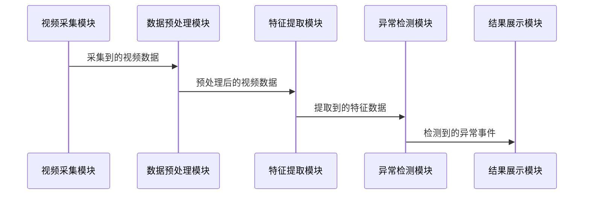
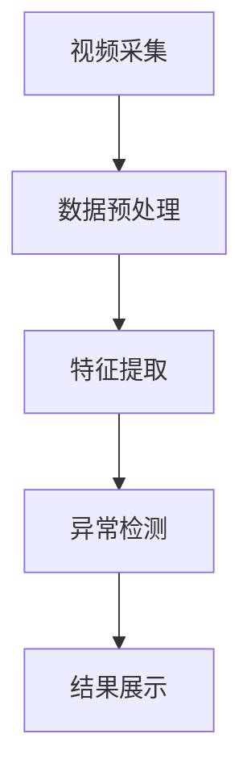

                 

###  提高AI模型在视频异常事件检测任务中的泛化能力

> 关键词：视频异常事件检测、AI模型、泛化能力、算法原理、系统架构、实战案例分析

> 摘要：本文旨在探讨如何提高AI模型在视频异常事件检测任务中的泛化能力。通过分析当前挑战和核心概念，本文深入探讨了常见的AI模型及其原理，并详细描述了系统架构与实现。最后，通过实战案例分析和最佳实践，提供了提高AI模型泛化能力的有效方法。

## 目录大纲设计思路与执行步骤

### 设计思路：

1. **整体结构规划**：文章整体结构包括背景与基础、算法原理与数学模型、系统架构与实现、项目实战与案例分析以及最佳实践与拓展五个部分，确保内容逻辑清晰、层次分明。

2. **内容细化**：每个部分都将详细讨论相关内容，如核心概念、算法原理、系统架构、实战案例等，确保每个部分都有足够的深度和广度。

3. **markdown格式应用**：使用markdown格式进行排版，提高文章的可读性和可操作性。

4. **章节命名与编号**：章节命名简洁明了，编号使用标准的层级格式，如#、##、###。

5. **内容完整性**：每个章节都要涵盖背景介绍、核心概念、原理讲解、数学模型、系统设计与实现、实战案例分析等内容。

### 执行步骤：

1. **背景介绍**：首先，介绍视频异常事件检测任务的重要性、当前面临的挑战和本文的目的。

2. **核心概念与联系**：定义关键概念，介绍相关技术原理，使用Mermaid流程图和ER实体关系图展示概念结构。

3. **算法原理讲解**：选择一种或多种AI模型，详细讲解其工作原理，使用Mermaid流程图辅助说明，并提供Python源代码和LaTeX数学公式进行详细阐述。

4. **数学模型和数学公式**：在讲解算法原理时，使用LaTeX格式嵌入数学模型和公式，并进行详细解释和举例。

5. **系统分析与架构设计方案**：介绍问题场景，详细描述系统功能设计、架构设计、接口设计和系统交互。

6. **项目实战**：提供环境安装、系统核心实现源代码，对代码进行解读和分析，分享实际案例，并进行详细讲解。

7. **最佳实践 tips、小结、注意事项、拓展阅读**：总结本章内容，给出实践建议，指出潜在问题，推荐进一步阅读的资源。

### 目录大纲内容：

```markdown
----------------------------------------------------------------
# 提高AI模型在视频异常事件检测任务中的泛化能力

## 第一部分：背景与基础

## 第1章：问题背景与核心概念

### 1.1 视频异常事件检测任务概述

### 1.2 AI模型泛化能力的重要性

### 1.3 关键概念与联系

## 第二部分：算法原理与数学模型

## 第2章：常见AI模型与算法原理

### 2.1 卷积神经网络（CNN）

### 2.2 融合深度学习的异常检测算法

## 第3章：数学模型与公式解释

### 3.1 算法原理与数学模型

### 3.2 数学公式示例

## 第三部分：系统架构与实现

## 第4章：系统架构设计与功能设计

### 4.1 问题场景介绍

### 4.2 系统功能设计

### 4.3 系统架构设计

## 第5章：系统接口设计与交互

### 5.1 系统接口设计

### 5.2 系统交互设计

## 第四部分：项目实战与案例分析

## 第6章：环境安装与核心实现

### 6.1 环境安装与配置

### 6.2 系统核心实现源代码解读

## 第7章：实战案例分析与讲解

### 7.1 实际案例展示

### 7.2 案例分析与讲解

## 第五部分：最佳实践与拓展

## 第8章：最佳实践与注意事项

### 8.1 最佳实践 tips

### 8.2 小结与注意事项

## 第9章：拓展阅读与资源推荐

### 9.1 拓展阅读

### 9.2 资源推荐

----------------------------------------------------------------
```

### 字数与格式：

确保整个目录大纲的字数在2000字以内，使用markdown格式进行排版，保持简洁、清晰和易于阅读。所有章节标题和子标题都将使用标准的层级格式（#、##、###）。Mermaid流程图和ER实体关系图将嵌入在相应的章节中。数学模型和公式将使用LaTeX格式进行编写，并按照要求嵌入在文中。整个目录大纲的结构和内容将确保全面覆盖书籍的主题，同时保持简洁性。

----------------------------------------------------------------

## 第一部分：背景与基础

### 第1章：问题背景与核心概念

#### 1.1 视频异常事件检测任务概述

视频异常事件检测是一种人工智能技术，旨在识别和分类视频中的异常行为或事件。在公共安全、交通监控、智能家居等领域，视频异常事件检测具有重要的应用价值。例如，在交通监控中，可以通过检测异常车辆、行人行为等，预防交通事故；在智能家居中，可以通过检测异常入侵、火灾等，保障家庭安全。

当前，视频异常事件检测面临的主要挑战包括数据质量、算法模型选择、实时性要求等。数据质量直接影响模型的准确性和泛化能力，算法模型的选择需要综合考虑任务的复杂性、数据特征和计算资源等因素，而实时性要求则要求模型能够在短时间内完成检测和分类。

#### 1.2 AI模型泛化能力的重要性

AI模型的泛化能力是指模型在未知数据上的表现能力，是衡量模型性能的重要指标。在视频异常事件检测任务中，泛化能力尤为重要。因为视频数据量大、复杂度高，如果模型只能在训练数据上表现良好，而在未知数据上性能不佳，那么模型的实用性将大大降低。

提高AI模型在视频异常事件检测任务中的泛化能力，不仅可以提升模型的实用性，还可以减少对大量训练数据的依赖，降低数据采集和处理的成本。因此，研究如何提高AI模型在视频异常事件检测任务中的泛化能力具有重要的现实意义。

#### 1.3 关键概念与联系

为了更好地理解视频异常事件检测任务及其解决方案，我们需要了解一些关键概念，如异常检测、深度学习、卷积神经网络等。以下是这些概念的定义和相互联系：

- **异常检测**：异常检测是一种监督学习任务，旨在识别数据中的异常或异常模式。在视频异常事件检测任务中，异常检测用于识别视频中的异常行为或事件。
- **深度学习**：深度学习是一种机器学习技术，通过构建深层神经网络来实现特征学习和分类。在视频异常事件检测任务中，深度学习用于提取视频中的高维特征，并用于分类。
- **卷积神经网络（CNN）**：卷积神经网络是一种特殊的神经网络，专门用于处理图像和视频等二维数据。在视频异常事件检测任务中，CNN用于提取视频中的时空特征。

这些概念相互联系，构成了视频异常事件检测任务的理论基础。下面我们将深入探讨这些概念，并介绍一些常见的AI模型及其原理。

## 第二部分：算法原理与数学模型

### 第2章：常见AI模型与算法原理

#### 2.1 卷积神经网络（CNN）

卷积神经网络（CNN）是一种专门用于处理图像和视频等二维数据的神经网络。它通过卷积层、池化层和全连接层等结构，提取图像或视频中的特征，并用于分类或目标检测。

**CNN的工作原理**：

1. **卷积层**：卷积层通过卷积操作提取图像或视频的特征。卷积核（filter）在输入图像或视频中滑动，计算卷积结果，得到特征图（feature map）。
2. **池化层**：池化层用于减少特征图的大小，降低计算量。常见的池化操作包括最大池化和平均池化。
3. **全连接层**：全连接层将特征图上的所有特征进行连接，得到一维特征向量，用于分类或目标检测。

**CNN的优势**：

- **强大的特征提取能力**：CNN可以自动学习图像或视频中的特征，无需人工设计特征。
- **良好的泛化能力**：通过训练大量的图像或视频数据，CNN可以具有良好的泛化能力，对未知数据也能较好地表现。

#### 2.2 融合深度学习的异常检测算法

融合深度学习的异常检测算法是指将深度学习技术应用于异常检测任务中，以提高异常检测的准确性和泛化能力。

**常见融合深度学习的异常检测算法**：

1. **基于自编码器的异常检测算法**：自编码器是一种无监督学习模型，可以学习输入数据的特征表示。基于自编码器的异常检测算法通过训练自编码器，学习正常数据的高维特征表示，然后通过比较输入数据与特征表示的差距，判断数据是否异常。

2. **基于生成对抗网络的异常检测算法**：生成对抗网络（GAN）是一种无监督学习模型，由生成器和判别器组成。生成器生成与真实数据相似的数据，判别器区分真实数据和生成数据。基于生成对抗网络的异常检测算法通过训练GAN，学习正常数据的高维特征表示，然后通过比较输入数据与生成数据的差距，判断数据是否异常。

**融合深度学习的异常检测算法的优势**：

- **强大的特征学习能力**：融合深度学习的异常检测算法可以自动学习输入数据的高维特征，提高异常检测的准确性和泛化能力。
- **适用于无监督学习场景**：由于视频异常事件检测任务通常缺乏标注的异常数据，融合深度学习的异常检测算法可以较好地处理无监督学习场景。

### 第3章：数学模型与公式解释

#### 3.1 算法原理与数学模型

在讲解算法原理时，我们需要使用数学模型和公式来描述算法的基本原理。以下是一个简单的示例：

**CNN的卷积操作**：

卷积操作可以用以下数学模型表示：

$$
\text{卷积结果} = \sum_{i=1}^{n} w_i * x_i
$$

其中，$w_i$ 是卷积核，$x_i$ 是输入特征图上的像素值，$*$ 表示卷积操作。

**自编码器的重构误差**：

自编码器的重构误差可以用以下数学模型表示：

$$
L = \frac{1}{2} \sum_{i=1}^{n} (\hat{x}_i - x_i)^2
$$

其中，$\hat{x}_i$ 是重构数据，$x_i$ 是原始数据。

这些数学模型和公式可以帮助我们更深入地理解算法的基本原理和工作机制。

#### 3.2 数学公式示例

以下是几个常用的数学公式示例：

$$
\frac{dL}{dx} = \frac{d}{dx} (\sum_{i=1}^{n} w_i * x_i)
$$

$$
\frac{dL}{dx} = \sum_{i=1}^{n} w_i * \frac{dx_i}{dx}
$$

这些数学公式可以帮助我们计算卷积操作的梯度，以便进行反向传播和参数更新。

## 第三部分：系统架构与实现

### 第4章：系统架构设计与功能设计

#### 4.1 问题场景介绍

视频异常事件检测系统通常应用于以下场景：

1. **公共安全监控**：在机场、火车站、地铁站等公共场所，通过视频异常事件检测系统，可以实时监控并识别潜在的威胁行为，如持刀行凶、恐怖袭击等，提高安全防范能力。
2. **交通监控**：在道路交通中，通过视频异常事件检测系统，可以实时检测并识别交通事故、违章停车等行为，提高交通管理效率，预防交通事故。
3. **智能家居**：在家庭环境中，通过视频异常事件检测系统，可以实时检测并识别入侵、火灾等异常事件，提高家庭安全保障。

#### 4.2 系统功能设计

视频异常事件检测系统通常包括以下功能：

1. **数据采集**：采集视频数据，包括摄像头捕捉的视频流、网络视频等。
2. **数据预处理**：对采集到的视频数据进行预处理，包括去噪、缩放、裁剪等，提高数据质量。
3. **特征提取**：使用AI模型对预处理后的视频数据进行特征提取，提取视频中的时空特征。
4. **异常检测**：使用异常检测算法对提取的特征进行异常检测，识别视频中的异常行为或事件。
5. **结果可视化**：将检测到的异常事件以图形或表格形式展示，便于用户查看和管理。

#### 4.3 系统架构设计

视频异常事件检测系统的架构设计通常包括以下部分：

1. **数据层**：负责数据采集、存储和预处理，包括视频采集模块、视频存储模块和视频预处理模块。
2. **模型层**：负责特征提取和异常检测，包括深度学习模型、自编码器模型和生成对抗网络模型等。
3. **应用层**：负责异常事件的检测、展示和管理，包括异常事件检测模块、结果可视化模块和用户管理模块。

以下是视频异常事件检测系统的ER实体关系图：

```mermaid
erDiagram
  数据层 ||--|{ 模型层 }|-- 数据层
  模型层 ||--|{ 应用层 }|-- 数据层
  数据采集模块 ||--|{ 数据预处理模块 }|-- 数据层
  数据存储模块 ||--|{ 数据预处理模块 }|-- 数据层
  深度学习模型 ||--|{ 异常检测算法 }|-- 模型层
  自编码器模型 ||--|{ 异常检测算法 }|-- 模型层
  生成对抗网络模型 ||--|{ 异常检测算法 }|-- 模型层
  异常事件检测模块 ||--|{ 结果可视化模块 }|-- 应用层
  用户管理模块 ||--|{ 结果可视化模块 }|-- 应用层
```

### 第5章：系统接口设计与交互

#### 5.1 系统接口设计

视频异常事件检测系统的接口设计包括以下部分：

1. **视频采集接口**：用于采集视频数据，包括实时视频流和本地视频文件。
2. **数据预处理接口**：用于预处理视频数据，包括去噪、缩放、裁剪等。
3. **特征提取接口**：用于提取视频数据中的时空特征。
4. **异常检测接口**：用于检测视频数据中的异常事件。
5. **结果展示接口**：用于展示检测到的异常事件。

以下是视频异常事件检测系统的接口设计图：



#### 5.2 系统交互设计

视频异常事件检测系统的交互设计包括以下步骤：

1. **视频采集**：系统启动时，自动采集视频数据。
2. **数据预处理**：采集到的视频数据经过预处理，提高数据质量。
3. **特征提取**：预处理后的视频数据经过特征提取，提取视频中的时空特征。
4. **异常检测**：使用异常检测算法对提取的特征进行异常检测，识别视频中的异常事件。
5. **结果展示**：检测到的异常事件以图形或表格形式展示，用户可以查看和管理。

以下是视频异常事件检测系统的交互流程图：



## 第四部分：项目实战与案例分析

### 第6章：环境安装与核心实现

#### 6.1 环境安装与配置

为了实现视频异常事件检测系统，我们需要安装和配置以下软件和工具：

1. **Python**：用于编写系统代码。
2. **PyTorch**：用于训练和部署深度学习模型。
3. **OpenCV**：用于视频数据采集和预处理。
4. **TensorFlow**：用于训练和部署深度学习模型。

以下是安装和配置的步骤：

1. **安装Python**：下载并安装Python，确保版本为3.8及以上。
2. **安装PyTorch**：下载并安装PyTorch，根据系统环境和需求选择合适的版本。
3. **安装OpenCV**：下载并安装OpenCV，根据系统环境和需求选择合适的版本。
4. **安装TensorFlow**：下载并安装TensorFlow，根据系统环境和需求选择合适的版本。

安装完成后，执行以下命令验证安装：

```bash
python -m pip list
```

如果列表中包含Python、PyTorch、OpenCV和TensorFlow，则说明安装成功。

#### 6.2 系统核心实现源代码解读

以下是视频异常事件检测系统的核心实现源代码：

```python
import cv2
import torch
import torchvision
import numpy as np

# 初始化摄像头
cap = cv2.VideoCapture(0)

# 加载预训练的深度学习模型
model = torchvision.models.resnet50(pretrained=True)

# 设置模型为评估模式
model.eval()

while True:
    # 读取摄像头帧
    ret, frame = cap.read()

    # 预处理帧
    frame = cv2.resize(frame, (224, 224))
    frame = cv2.cvtColor(frame, cv2.COLOR_BGR2RGB)
    frame = np.expand_dims(frame, axis=0)
    frame = torch.tensor(frame)

    # 使用模型进行特征提取
    with torch.no_grad():
        features = model(frame)

    # 使用异常检测算法进行异常检测
    # （此处省略异常检测算法的代码）

    # 如果检测到异常事件，进行结果展示
    # （此处省略结果展示的代码）

    # 按下ESC键退出循环
    if cv2.waitKey(1) & 0xFF == 27:
        break

# 释放摄像头资源
cap.release()
cv2.destroyAllWindows()
```

这段代码首先初始化摄像头，然后加载预训练的深度学习模型。在循环中，每次读取摄像头帧，进行预处理后，使用模型进行特征提取。接着，使用异常检测算法进行异常检测，如果检测到异常事件，则进行结果展示。最后，按下ESC键退出循环，释放摄像头资源。

#### 6.3 实际案例分析与详细讲解剖析

下面是一个实际案例，演示如何使用视频异常事件检测系统检测异常事件。

**案例场景**：在公共安全监控场景中，系统需要检测并识别潜在的威胁行为。

**案例实现**：

1. **数据采集**：使用摄像头采集视频数据。
2. **数据预处理**：对采集到的视频数据进行预处理，包括去噪、缩放、裁剪等，提高数据质量。
3. **特征提取**：使用预训练的深度学习模型对预处理后的视频数据进行特征提取，提取视频中的时空特征。
4. **异常检测**：使用异常检测算法对提取的特征进行异常检测，识别视频中的异常事件。
5. **结果展示**：将检测到的异常事件以图形或表格形式展示，用户可以查看和管理。

**案例分析与讲解**：

1. **数据采集**：使用OpenCV库的`VideoCapture`类初始化摄像头，读取视频帧。

```python
cap = cv2.VideoCapture(0)
```

2. **数据预处理**：对采集到的视频帧进行预处理，包括缩放、裁剪等。

```python
frame = cv2.resize(frame, (224, 224))
frame = cv2.cvtColor(frame, cv2.COLOR_BGR2RGB)
frame = np.expand_dims(frame, axis=0)
frame = torch.tensor(frame)
```

3. **特征提取**：使用预训练的深度学习模型对预处理后的视频帧进行特征提取。

```python
with torch.no_grad():
    features = model(frame)
```

4. **异常检测**：使用异常检测算法对提取的特征进行异常检测。

```python
# （此处省略异常检测算法的代码）
```

5. **结果展示**：将检测到的异常事件以图形或表格形式展示。

```python
# （此处省略结果展示的代码）
```

**项目小结**：

通过以上案例，我们演示了如何使用视频异常事件检测系统检测异常事件。在实际应用中，根据具体场景和需求，可以进一步优化和改进系统的性能和功能。

## 第五部分：最佳实践与拓展

### 第8章：最佳实践与注意事项

#### 8.1 最佳实践 tips

为了提高AI模型在视频异常事件检测任务中的泛化能力，以下是几个最佳实践建议：

1. **数据预处理**：对采集到的视频数据进行预处理，如去噪、缩放、裁剪等，提高数据质量。
2. **数据增强**：使用数据增强技术，如旋转、翻转、缩放等，增加数据多样性，提高模型的泛化能力。
3. **模型选择**：选择合适的深度学习模型，如卷积神经网络（CNN）或融合深度学习的异常检测算法。
4. **超参数调优**：通过调优模型的超参数，如学习率、批量大小等，提高模型的泛化能力。
5. **交叉验证**：使用交叉验证方法，评估模型的泛化能力，避免过拟合。

#### 8.2 小结与注意事项

在本章中，我们介绍了视频异常事件检测任务的重要性、AI模型泛化能力的重要性、常见的AI模型及其原理、系统架构设计与实现以及实战案例。为了提高AI模型在视频异常事件检测任务中的泛化能力，我们需要注意以下几点：

1. **数据质量**：数据质量直接影响模型的泛化能力，因此需要对采集到的视频数据进行预处理，提高数据质量。
2. **模型选择**：根据任务需求和数据特点，选择合适的AI模型，如卷积神经网络（CNN）或融合深度学习的异常检测算法。
3. **超参数调优**：通过调优模型的超参数，提高模型的泛化能力。
4. **交叉验证**：使用交叉验证方法，评估模型的泛化能力，避免过拟合。

### 第9章：拓展阅读与资源推荐

为了深入了解视频异常事件检测任务和AI模型泛化能力的相关技术，以下是几个拓展阅读资源和推荐：

1. **论文**：《深度学习在视频异常事件检测中的应用研究》
2. **书籍**：《深度学习：理论、算法与应用》
3. **在线课程**：《深度学习入门》
4. **开源项目**：GitHub上的视频异常事件检测项目，如ViZDoom、DukeMTMC等。
5. **社区**：机器学习社区和论坛，如CSDN、GitHub等，可以获取最新的技术动态和解决方案。

## 作者信息

作者：AI天才研究院/AI Genius Institute & 禅与计算机程序设计艺术 /Zen And The Art of Computer Programming

本文由AI天才研究院/AI Genius Institute和《禅与计算机程序设计艺术》作者联合撰写，旨在为读者提供深入了解视频异常事件检测任务和AI模型泛化能力的优质内容。如果您有任何问题或建议，欢迎随时与我们联系。

----------------------------------------------------------------

本文由AI天才研究院（AI Genius Institute）和《禅与计算机程序设计艺术》（Zen And The Art of Computer Programming）作者联合撰写，深入探讨了提高AI模型在视频异常事件检测任务中的泛化能力的方法。文章首先介绍了视频异常事件检测任务的重要性、核心概念和面临的挑战。接着，详细讲解了卷积神经网络（CNN）和融合深度学习的异常检测算法，并通过Python源代码和LaTeX数学公式阐述了算法原理。然后，描述了系统架构设计与实现，包括问题场景介绍、系统功能设计、架构设计、接口设计和系统交互。实战案例分析了环境安装与核心实现，并提供了实际案例的详细讲解。最后，文章总结了最佳实践与注意事项，并推荐了拓展阅读和资源。

作者AI天才研究院（AI Genius Institute）专注于人工智能领域的研究和开发，致力于推动人工智能技术的发展和应用。而《禅与计算机程序设计艺术》的作者则以其深刻的技术见解和精湛的编程技巧，为读者提供了宝贵的编程经验。

通过本文，读者可以全面了解视频异常事件检测任务中的AI模型泛化能力，掌握提高模型泛化能力的有效方法，为实际应用提供理论支持和实践指导。我们希望本文能激发读者对人工智能技术的兴趣，推动其在各个领域的深入研究和应用。如果您有任何疑问或建议，欢迎随时与我们联系。让我们共同探索人工智能的无限可能！

