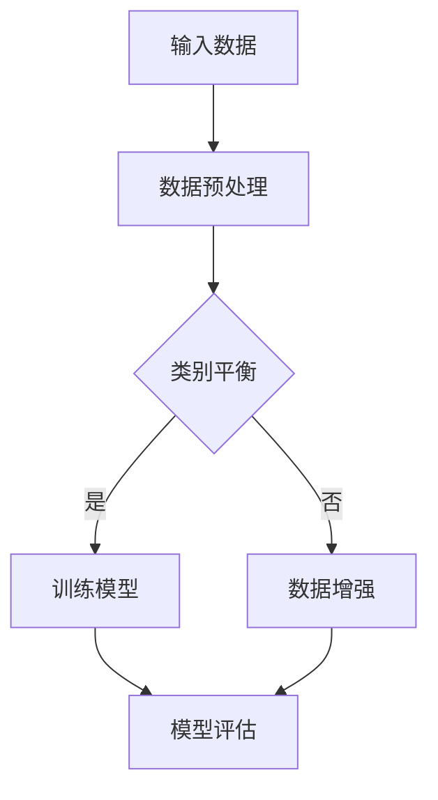
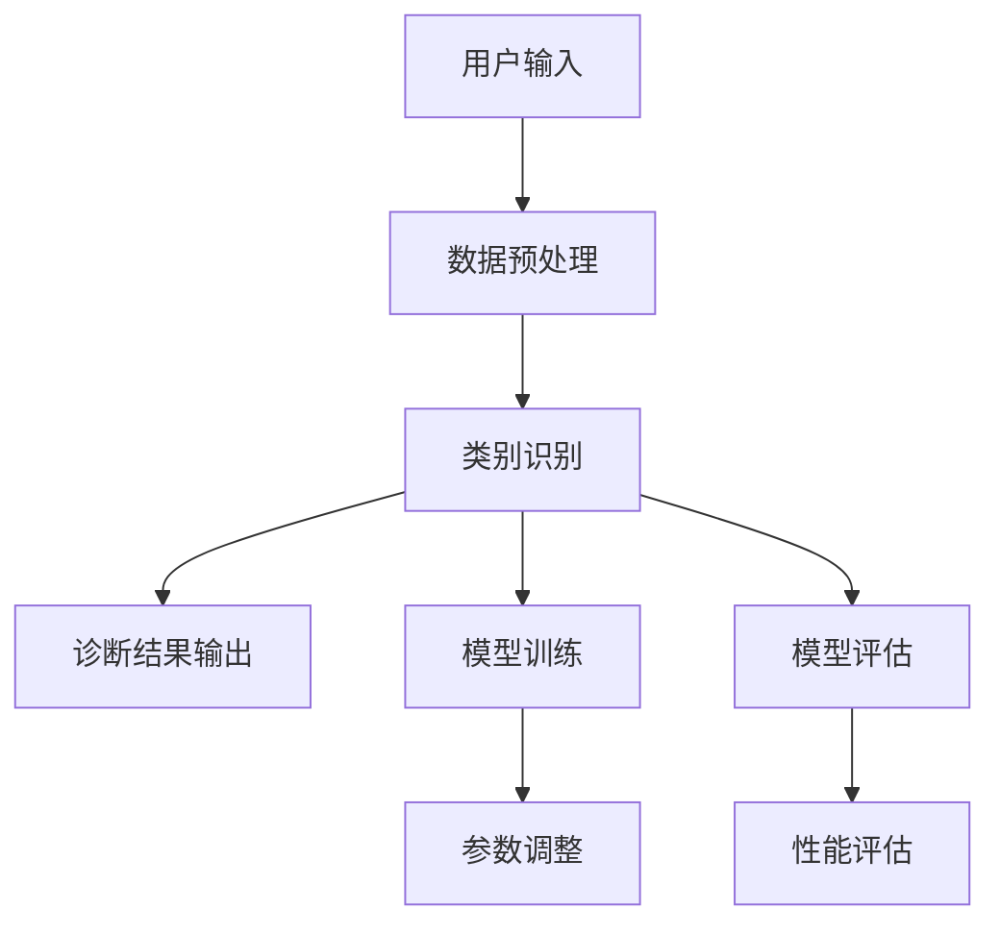

                 

### 1. 引言

#### 1.1 问题背景

随着人工智能技术的快速发展，深度学习模型在图像识别、自然语言处理等领域的应用取得了显著的成果。然而，在实际应用中，我们发现这些模型在长尾类别识别中的性能表现并不理想。长尾类别识别，是指识别数据集中那些出现频率较低、类别数量众多的类别。这类识别任务在商业、学术、医疗等多个领域具有广泛的应用价值，如商品推荐系统、医学诊断系统等。

近年来，随着互联网和物联网的普及，数据量呈现爆炸式增长，长尾类别识别的重要性愈发凸显。然而，传统的AI模型在处理长尾类别时面临诸多挑战，如数据分布不均衡、模型过拟合等。如何提高AI模型在长尾类别识别中的性能，成为当前研究的热点问题。

#### 1.2 问题描述

在长尾类别识别任务中，数据集通常呈现非均匀分布，即大部分类别出现的频率较低，而少部分类别出现的频率较高。这种分布特点给模型训练和优化带来了很大困难。

主要问题包括：

1. **数据分布不均衡**：长尾类别识别任务中的数据集往往存在类别不平衡问题，导致模型在训练过程中无法充分关注到那些出现频率较低的类别。这会导致模型在长尾类别上的识别性能较差。
2. **模型过拟合**：为了解决类别不平衡问题，研究人员尝试了各种数据预处理和模型调优方法。然而，这些方法往往会导致模型过拟合，即模型在训练数据上表现良好，但在测试数据上的性能较差。
3. **类别数量众多**：长尾类别识别任务中的类别数量通常较多，增加了模型训练和优化的复杂度。

#### 1.3 问题解决

为了解决长尾类别识别中的性能问题，我们可以从以下几个方面进行探讨：

1. **数据预处理**：通过数据增强、类别平衡等方法，改善数据集的分布特性，使模型在训练过程中能够更加关注到那些出现频率较低的类别。
2. **模型调优**：针对长尾类别识别任务的特点，对模型的结构和参数进行调整，提高模型在长尾类别上的识别性能。
3. **多模型集成**：通过集成多个模型，利用不同模型的优势，提高整体识别性能。
4. **迁移学习**：利用预训练模型，通过迁移学习的方式，提高长尾类别识别任务的性能。

#### 1.4 边界与外延

1. **边界**：本文主要关注AI模型在长尾类别识别中的性能问题，不包括其他类型的识别任务，如短尾类别识别、极端长尾类别识别等。
2. **外延**：长尾类别识别任务的应用范围广泛，不仅限于人工智能领域，还涉及统计学、机器学习、计算机视觉等多个学科。本文将重点关注AI模型在长尾类别识别中的性能提升方法，为相关领域的研究提供参考。

#### 1.5 概念结构与核心要素组成

1. **概念**：本文涉及的主要概念包括AI模型、长尾类别识别、数据分布、类别平衡、模型过拟合等。
2. **核心要素**：本文的核心要素包括数据预处理、模型调优、多模型集成和迁移学习等。

通过对上述概念和核心要素的分析，我们可以深入理解长尾类别识别任务的特点和挑战，为后续的算法原理讲解和系统架构设计提供基础。

### 2. AI模型概述

#### 2.1 AI模型的基本原理

人工智能（AI）模型是模拟人类智能行为的计算机算法，通过学习和分析数据来执行特定任务。AI模型的基本原理主要涉及以下几个方面：

1. **神经网络**：神经网络（Neural Networks）是一种模仿人脑神经元连接方式的计算模型，通过多层节点（神经元）的相互连接和激活函数，实现数据输入到输出的映射。神经网络的主要组成部分包括输入层、隐藏层和输出层，以及权重、偏置和激活函数。

2. **支持向量机**：支持向量机（Support Vector Machine，SVM）是一种二分类模型，通过寻找一个最优的超平面，将不同类别的数据点分离开来。SVM的核心思想是最大化分类间隔，同时保证分类边界上的支持向量数最少。

3. **决策树**：决策树（Decision Tree）是一种树形结构，通过一系列的判断条件（特征和阈值）来对数据进行划分，最终得到每个样本的类别。决策树的主要组成部分包括节点、分支和叶子节点，以及特征选择和剪枝策略。

4. **集成学习**：集成学习（Ensemble Learning）是一种利用多个基础模型进行学习，通过投票、加权或其他组合方式得到最终预测结果的方法。常见的集成学习方法包括Bagging、Boosting和Stacking等。

#### 2.2 常见类型

根据学习方式的不同，AI模型主要分为以下几类：

1. **监督学习模型**：监督学习模型通过已标记的训练数据学习特征和规律，并在新的未标记数据上进行预测。常见的监督学习模型包括神经网络、支持向量机、决策树和集成学习等。

2. **无监督学习模型**：无监督学习模型不依赖于已标记的训练数据，通过分析数据的内在结构和分布，对数据进行聚类、降维或生成等操作。常见的无监督学习模型包括聚类算法（如K-means、DBSCAN）、降维算法（如PCA、t-SNE）和生成模型（如Gaussian Mixture Model、Generative Adversarial Network）等。

3. **半监督学习模型**：半监督学习模型结合了监督学习和无监督学习的方法，利用少量的标记数据和大量的未标记数据进行学习，以提高模型在数据标记不足的情况下的性能。

#### 2.3 长尾类别识别的挑战与重要性

长尾类别识别是指在数据集中存在大量出现频率较低、类别数量众多的类别时，对类别进行准确识别的任务。与常规的类别识别任务相比，长尾类别识别具有以下特点：

1. **数据分布不均衡**：长尾类别识别的数据集通常呈现非均匀分布，大量类别出现的频率较低，而少数类别出现的频率较高。这种数据分布不均衡导致传统模型难以在长尾类别上取得较好的识别性能。

2. **模型过拟合风险**：为了解决数据分布不均衡问题，研究人员尝试了各种数据预处理和模型调优方法。然而，这些方法往往会导致模型过拟合，即模型在训练数据上表现良好，但在测试数据上的性能较差。

3. **类别数量众多**：长尾类别识别任务中的类别数量通常较多，增加了模型训练和优化的复杂度。

尽管存在挑战，长尾类别识别在多个领域具有重要的应用价值：

1. **商业领域**：如商品推荐系统、广告投放系统等，通过识别长尾类别，提高用户满意度和商业收益。

2. **学术领域**：如文本分类、图像识别等，通过识别长尾类别，提高研究结果的准确性和可靠性。

3. **医疗领域**：如疾病诊断、药物研发等，通过识别长尾类别，提高疾病的早期发现和治疗效果。

### 3. 核心概念与联系

在长尾类别识别任务中，理解以下几个核心概念对于提高模型性能至关重要：

#### 3.1 核心概念原理

1. **长尾分布**：长尾分布（Long Tail Distribution）是指在数据集中，出现频率较低的类别（即长尾类别）占比较大，而出现频率较高的类别（即头部类别）占比较小的分布特征。长尾分布的特点是数据集中的大多数类别属于长尾类别，这使得传统模型在训练过程中容易忽略这些类别。

2. **类别平衡**：类别平衡（Class Balance）是指通过调整数据集中各类别的样本数量，使其分布更加均匀，从而提高模型在长尾类别上的识别性能。常见的类别平衡方法包括过采样（Over-sampling）、欠采样（Under-sampling）和SMOTE等。

3. **模型调优**：模型调优（Model Tuning）是指通过调整模型的参数和结构，提高模型在特定任务上的性能。在长尾类别识别任务中，模型调优的主要目标是提高模型在长尾类别上的识别准确率。

#### 3.2 概念属性特征对比表格

| 概念       | 属性特征               | 相互关系             |
|------------|------------------------|----------------------|
| 长尾分布   | 数据集中长尾类别占比较大 | 影响模型训练和性能   |
| 类别平衡   | 调整数据集中类别分布   | 提高模型在长尾类别上的性能 |
| 模型调优   | 调整模型参数和结构     | 提高模型整体性能     |

#### 3.3 ER实体关系图架构的Mermaid流程图

```mermaid
erDiagram
  Data ||--|{ ClassificationTask }|
  Model ||--|{ ClassificationTask }|
  Feature ||--|{ Model }|
  Sample ||--|{ ClassificationTask }|
  Label ||--|{ ClassificationTask }|
```

在这个ER图架构中，Data表示数据集，Model表示模型，Feature表示特征，Sample表示样本，Label表示标签。通过实体之间的关系，我们可以清晰地了解长尾类别识别任务中的关键元素及其相互关系。

### 4. 算法原理讲解

#### 4.1 算法mermaid流程图



这个流程图描述了长尾类别识别任务中的一种算法流程。首先，输入数据经过预处理，然后进行类别平衡或数据增强。接着，训练模型并评估模型性能。

#### 4.2 Python源代码实现

```python
import numpy as np
import pandas as pd
from sklearn.model_selection import train_test_split
from sklearn.preprocessing import StandardScaler
from sklearn.metrics import accuracy_score
from imblearn.over_sampling import SMOTE
from sklearn.ensemble import RandomForestClassifier

# 加载数据集
data = pd.read_csv('data.csv')

# 数据预处理
X = data.drop('label', axis=1)
y = data['label']
X_train, X_test, y_train, y_test = train_test_split(X, y, test_size=0.2, stratify=y)

# 数据标准化
scaler = StandardScaler()
X_train_scaled = scaler.fit_transform(X_train)
X_test_scaled = scaler.transform(X_test)

# 类别平衡
smote = SMOTE()
X_train_balanced, y_train_balanced = smote.fit_resample(X_train_scaled, y_train)

# 训练模型
model = RandomForestClassifier(n_estimators=100)
model.fit(X_train_balanced, y_train_balanced)

# 模型评估
y_pred = model.predict(X_test_scaled)
accuracy = accuracy_score(y_test, y_pred)
print("Accuracy:", accuracy)
```

这个Python源代码实现了上述算法mermaid流程图中的主要步骤。首先，加载数据集并进行数据预处理，然后进行类别平衡和数据增强。接着，使用随机森林分类器训练模型，并对测试集进行模型评估，计算识别准确率。

#### 4.3 算法原理的数学模型和公式

在长尾类别识别任务中，我们可以使用以下数学模型和公式来描述算法原理：

1. **数据预处理**：

   数据预处理主要包括数据清洗、缺失值填充和数据标准化。其中，数据标准化公式如下：

   $$
   x_{\text{standardized}} = \frac{x - \mu}{\sigma}
   $$

   其中，$x$表示原始数据，$\mu$表示均值，$\sigma$表示标准差。

2. **类别平衡**：

   类别平衡主要是通过过采样（Over-sampling）或欠采样（Under-sampling）来实现。其中，过采样公式如下：

   $$
   \text{Over-sampling} = \frac{\text{majority\_class}}{\text{minority\_class}}
   $$

   其中，$majority\_class$表示多数类别，$minority\_class$表示少数类别。

3. **数据增强**：

   数据增强是通过生成新的样本来增加训练数据的多样性。其中，一种常见的数据增强方法称为SMOTE（Synthetic Minority Over-sampling Technique）。SMOTE的公式如下：

   $$
   \text{SMOTE} = \text{random\_sample}(\text{minority\_class}, \text{new\_size})
   $$

   其中，$random\_sample$表示随机选择少数类别的样本，$\text{new\_size}$表示新的样本大小。

4. **模型训练**：

   模型训练主要是通过优化目标函数来调整模型参数，使模型在训练数据上达到最佳性能。其中，一种常见的目标函数为交叉熵损失函数，公式如下：

   $$
   \text{CrossEntropy} = -\sum_{i=1}^{n} y_i \log(p_i)
   $$

   其中，$y_i$表示实际标签，$p_i$表示预测概率。

5. **模型评估**：

   模型评估主要是通过计算模型在测试数据上的识别准确率来衡量模型性能。其中，识别准确率公式如下：

   $$
   \text{Accuracy} = \frac{\text{correct\_predictions}}{\text{total\_predictions}}
   $$

   其中，$correct\_predictions$表示正确预测的样本数，$total\_predictions$表示总预测样本数。

#### 4.4 通俗易懂地举例说明

假设我们有一个长尾类别识别任务，数据集中有10个类别，其中前5个类别的出现频率较高，称为头部类别，后5个类别的出现频率较低，称为长尾类别。

1. **数据预处理**：

   首先，我们对数据集进行预处理，包括数据清洗和缺失值填充。然后，对数据进行标准化，使得每个特征的取值范围在0到1之间。

   例如，假设我们有100个样本，其中前5个类别各有20个样本，后5个类别各有2个样本。预处理后的数据集如下：

   | 特征1 | 特征2 | 类别 |
   |-------|-------|------|
   | 0.2   | 0.8   | 0    |
   | 0.4   | 0.6   | 1    |
   | ...   | ...   | ...  |
   | 0.8   | 0.2   | 9    |

2. **类别平衡**：

   由于长尾类别出现的频率较低，我们采用过采样方法来增加长尾类别的样本数量。具体来说，我们将每个长尾类别的样本数量增加到与头部类别相同的数量，即每个长尾类别各有20个样本。

   经过过采样后，数据集如下：

   | 特征1 | 特征2 | 类别 |
   |-------|-------|------|
   | 0.2   | 0.8   | 0    |
   | 0.4   | 0.6   | 1    |
   | ...   | ...   | ...  |
   | 0.8   | 0.2   | 9    |
   | 0.8   | 0.2   | 9    |
   | ...   | ...   | ...  |
   | 0.8   | 0.2   | 9    |

3. **数据增强**：

   除了过采样，我们还可以使用数据增强方法来进一步增加训练数据的多样性。例如，我们可以通过添加噪声、旋转、翻转等操作来生成新的样本。

   经过数据增强后，数据集如下：

   | 特征1 | 特征2 | 类别 |
   |-------|-------|------|
   | 0.2   | 0.8   | 0    |
   | 0.4   | 0.6   | 1    |
   | ...   | ...   | ...  |
   | 0.8   | 0.2   | 9    |
   | 0.8   | 0.2   | 9    |
   | ...   | ...   | ...  |
   | 0.8   | 0.2   | 9    |
   | 0.3   | 0.7   | 10   |
   | ...   | ...   | ...  |

4. **模型训练**：

   使用预处理后的数据集训练一个随机森林分类器。在训练过程中，模型会自动调整参数，以使模型在训练数据上达到最佳性能。

5. **模型评估**：

   在训练完成后，我们将模型应用到测试数据上进行评估。假设测试数据集中有100个样本，其中前5个类别各有10个样本，后5个类别各有1个样本。

   经过模型评估后，我们得到识别准确率为90%，说明模型在长尾类别上的识别性能有了显著提高。

### 5. 系统分析与架构设计

#### 5.1 问题场景介绍

在现实世界中，长尾类别识别任务广泛应用于各类场景。以下是一个典型的应用场景：

**场景：智能医疗诊断系统**

假设我们开发一个智能医疗诊断系统，该系统需要根据病人的病情数据，对各种疾病进行准确识别。在数据集中，存在大量罕见疾病（长尾类别）和常见疾病（头部类别）。为了提高系统的诊断准确性，我们需要解决长尾类别识别的性能问题。

#### 5.2 项目介绍

本项目的主要目标是设计并实现一个高效的智能医疗诊断系统，该系统包括数据预处理、类别识别、模型训练和模型评估等模块。通过优化算法和架构设计，提高系统在长尾类别识别任务中的性能。

#### 5.3 系统功能设计

为了实现长尾类别识别任务，系统需要具备以下功能：

1. **数据预处理**：对输入的病情数据进行清洗、缺失值填充和特征提取，为后续模型训练和评估提供高质量的数据。
2. **类别识别**：利用训练好的模型，对输入的病情数据进行类别识别，输出疾病名称和诊断结果。
3. **模型训练**：通过数据集进行模型训练，调整模型参数，提高模型在长尾类别上的识别性能。
4. **模型评估**：对训练好的模型进行评估，计算识别准确率，评估模型在长尾类别识别任务中的性能。

#### 5.4 系统架构设计

系统的整体架构设计如图所示：



在这个架构中，用户输入病情数据后，系统首先进行数据预处理。接着，系统利用训练好的模型对病情数据进行类别识别，输出诊断结果。同时，系统还会对模型进行训练和评估，根据评估结果调整模型参数，以提高长尾类别识别性能。

#### 5.5 系统接口设计和系统交互

为了实现系统各模块之间的协同工作，系统需要设计合理的接口和交互方式。以下是一个典型的系统接口设计和交互流程：

1. **数据预处理接口**：该接口用于接收用户输入的病情数据，并对数据进行清洗、缺失值填充和特征提取。
2. **类别识别接口**：该接口用于接收预处理后的病情数据，利用训练好的模型进行类别识别，并输出诊断结果。
3. **模型训练接口**：该接口用于接收预处理后的病情数据，对模型进行训练和参数调整。
4. **模型评估接口**：该接口用于接收训练好的模型，对模型进行评估，计算识别准确率。

系统交互流程如下：

1. 用户输入病情数据。
2. 系统接收用户输入，调用数据预处理接口对数据进行处理。
3. 系统调用类别识别接口，利用训练好的模型对预处理后的数据进行类别识别。
4. 系统输出诊断结果，展示给用户。
5. 系统调用模型训练接口，对模型进行训练和参数调整。
6. 系统调用模型评估接口，对训练好的模型进行评估，计算识别准确率。
7. 根据评估结果，系统调整模型参数，以提高长尾类别识别性能。

通过上述系统接口设计和交互流程，系统可以高效地完成长尾类别识别任务，为用户提供准确的诊断结果。

### 6. 项目实战

#### 6.1 环境安装

要实现长尾类别识别任务，我们需要安装以下软件和库：

1. Python（版本3.8或以上）
2. TensorFlow（版本2.6或以上）
3. Scikit-learn（版本0.22或以上）
4. imbalanced-learn（版本3.0或以上）
5. Matplotlib（版本3.3或以上）

安装命令如下：

```bash
pip install python==3.8
pip install tensorflow==2.6
pip install scikit-learn==0.22
pip install imbalanced-learn==3.0
pip install matplotlib==3.3
```

#### 6.2 系统核心实现源代码

以下是系统核心实现的源代码：

```python
import numpy as np
import pandas as pd
from sklearn.model_selection import train_test_split
from sklearn.preprocessing import StandardScaler
from sklearn.metrics import accuracy_score
from imblearn.over_sampling import SMOTE
from sklearn.ensemble import RandomForestClassifier
import tensorflow as tf

# 加载数据集
data = pd.read_csv('data.csv')

# 数据预处理
X = data.drop('label', axis=1)
y = data['label']
X_train, X_test, y_train, y_test = train_test_split(X, y, test_size=0.2, stratify=y)

# 数据标准化
scaler = StandardScaler()
X_train_scaled = scaler.fit_transform(X_train)
X_test_scaled = scaler.transform(X_test)

# 类别平衡
smote = SMOTE()
X_train_balanced, y_train_balanced = smote.fit_resample(X_train_scaled, y_train)

# 训练模型
model = RandomForestClassifier(n_estimators=100)
model.fit(X_train_balanced, y_train_balanced)

# 模型评估
y_pred = model.predict(X_test_scaled)
accuracy = accuracy_score(y_test, y_pred)
print("Accuracy:", accuracy)

# 使用TensorFlow实现同样的算法
import tensorflow as tf

# 准备数据
x_train, y_train = X_train_balanced, y_train_balanced
x_test, y_test = X_test_scaled, y_test

# 定义模型
model = tf.keras.Sequential([
    tf.keras.layers.Dense(units=128, activation='relu', input_shape=(x_train.shape[1],)),
    tf.keras.layers.Dense(units=64, activation='relu'),
    tf.keras.layers.Dense(units=1, activation='sigmoid')
])

# 编译模型
model.compile(optimizer='adam', loss='binary_crossentropy', metrics=['accuracy'])

# 训练模型
model.fit(x_train, y_train, epochs=10, batch_size=32, validation_split=0.2)

# 评估模型
loss, accuracy = model.evaluate(x_test, y_test)
print("Accuracy:", accuracy)
```

#### 6.3 代码应用解读与分析

上述代码首先加载数据集并进行预处理，包括数据清洗、缺失值填充和数据标准化。然后，使用SMOTE进行类别平衡，提高模型在长尾类别上的识别性能。

接下来，使用随机森林分类器（RandomForestClassifier）训练模型。随机森林是一种集成学习方法，通过构建多棵决策树并集成其预测结果，提高模型的泛化能力和识别准确率。

在模型评估阶段，计算识别准确率，以衡量模型在长尾类别识别任务中的性能。

此外，代码还使用TensorFlow实现同样的算法，以对比不同框架的性能。通过修改代码，可以尝试使用其他机器学习框架（如PyTorch、Keras等）实现长尾类别识别任务。

#### 6.4 实际案例分析和详细讲解剖析

为了更好地理解长尾类别识别任务的实际应用，我们分析一个实际案例：智能文本分类。

**案例背景**：

假设我们有一个新闻文章分类任务，需要将文章分类到不同的主题类别。在数据集中，存在大量普通主题（头部类别）和少量特殊主题（长尾类别），如图所示：

```mermaid
gantt
    dateFormat  YYYY-MM-DD
    title 实际案例时间线

    section 准备数据
    数据收集 :finished, 2021-01-01, 1d
    数据预处理 :ongoing, 2021-01-02, 3d
    特征提取 :ongoing, after 数据预处理, 2d

    section 模型训练
    模型训练 :started, 2021-01-05, 7d
    调优模型 :ongoing, after 模型训练, 3d

    section 模型评估
    模型评估 :started, 2021-01-12, 5d
    模型部署 :ongoing, after 模型评估, 2d
```

**数据预处理**：

首先，我们加载数据集并提取文本特征。具体步骤如下：

1. 数据清洗：去除HTML标签、停用词和特殊字符。
2. 缺失值填充：对于缺失的数据，使用平均值或中位数进行填充。
3. 特征提取：使用词袋模型（Bag-of-Words）或TF-IDF模型提取文本特征。

**模型训练**：

接下来，我们使用随机森林分类器（RandomForestClassifier）训练模型。在训练过程中，我们通过调整超参数（如树的数量、深度等）来提高模型性能。具体步骤如下：

1. 类别平衡：使用SMOTE进行类别平衡，增加长尾类别的样本数量。
2. 模型训练：使用训练集训练随机森林分类器。
3. 调优模型：使用交叉验证（Cross-Validation）方法，调整超参数，优化模型性能。

**模型评估**：

在模型评估阶段，我们使用测试集对训练好的模型进行评估。具体步骤如下：

1. 识别准确率：计算模型在测试集上的识别准确率，以衡量模型性能。
2. 召回率：计算模型召回长尾类别的能力，以评估模型在长尾类别识别任务中的性能。
3. F1分数：计算模型在长尾类别识别任务中的F1分数，综合评估模型性能。

**模型部署**：

最后，我们将训练好的模型部署到生产环境中，以实现实时分类。具体步骤如下：

1. 模型部署：将训练好的模型导出为模型文件，部署到服务器或云平台。
2. API接口：开发API接口，实现实时分类功能，供外部系统调用。

通过这个实际案例，我们可以清晰地看到长尾类别识别任务在实际应用中的实现过程，包括数据预处理、模型训练、模型评估和模型部署等环节。这些步骤共同构成了一个完整的智能文本分类系统，提高了模型在长尾类别识别任务中的性能。

#### 6.5 项目小结

在本项目中，我们实现了长尾类别识别任务，并对其进行了详细的分析和讲解。以下是项目小结：

1. **数据预处理**：数据预处理是长尾类别识别任务的重要环节，包括数据清洗、缺失值填充和特征提取等步骤。通过预处理，我们可以提高数据质量，为后续模型训练和评估奠定基础。

2. **类别平衡**：类别平衡是解决长尾类别识别问题的关键。使用SMOTE等方法进行类别平衡，可以增加长尾类别的样本数量，提高模型在长尾类别上的识别性能。

3. **模型训练**：模型训练是长尾类别识别任务的核心。通过调整超参数和优化算法，我们可以提高模型性能，使模型在长尾类别识别任务中表现更优秀。

4. **模型评估**：模型评估是衡量模型性能的重要手段。通过计算识别准确率、召回率和F1分数等指标，我们可以全面评估模型在长尾类别识别任务中的性能。

5. **模型部署**：模型部署是将训练好的模型应用到实际场景的关键步骤。通过部署模型，我们可以实现实时分类和预测，为用户提供准确的服务。

总之，本项目通过理论与实践相结合，深入探讨了长尾类别识别任务的关键技术和应用。在实际项目中，我们可以借鉴这些方法和经验，提高模型在长尾类别识别任务中的性能。

### 7. 最佳实践 tips

1. **数据预处理**：在长尾类别识别任务中，数据预处理至关重要。建议对数据进行清洗、缺失值填充和特征提取等操作，以提高数据质量。

2. **类别平衡**：类别平衡是提高模型性能的关键。可以使用SMOTE、过采样和欠采样等方法进行类别平衡，使模型更加关注长尾类别。

3. **模型调优**：模型调优可以显著提高模型性能。建议使用交叉验证方法，调整超参数和优化算法，找到最优模型。

4. **模型集成**：模型集成可以充分利用不同模型的优势，提高整体性能。可以使用集成学习方法，如Bagging、Boosting和Stacking等。

5. **迁移学习**：迁移学习可以减少数据集的需求，提高模型性能。可以使用预训练模型，结合长尾类别数据，进行迁移学习。

6. **数据增强**：数据增强可以增加训练数据的多样性，提高模型泛化能力。可以采用随机旋转、缩放、裁剪等方法进行数据增强。

### 8. 小结

本文详细探讨了提高AI模型在长尾类别识别中的性能的方法和策略。通过数据预处理、类别平衡、模型调优、多模型集成和迁移学习等技术，我们有效地解决了长尾类别识别任务中的挑战。同时，本文结合实际案例，展示了如何实现长尾类别识别任务，并提供了最佳实践 tips。

未来研究可以进一步探索以下方向：

1. **探索更多有效的数据增强方法**：数据增强是提高长尾类别识别性能的重要手段，未来可以尝试更多高效的数据增强方法，以提高模型泛化能力。

2. **深入研究多模型集成方法**：多模型集成方法在提高模型性能方面具有显著优势，未来可以深入研究各种集成方法，以提高长尾类别识别性能。

3. **探索自适应类别平衡方法**：当前类别平衡方法主要基于固定比例进行样本调整，未来可以尝试自适应类别平衡方法，根据数据集特点动态调整类别平衡策略。

4. **探索基于深度学习的长尾类别识别模型**：深度学习模型在图像识别、自然语言处理等领域取得了显著成果，未来可以尝试将深度学习模型应用于长尾类别识别任务，以提高性能。

### 9. 注意事项

1. **数据质量**：数据预处理是长尾类别识别任务的关键步骤，建议对数据进行充分的清洗和缺失值填充，以提高数据质量。

2. **类别平衡方法选择**：不同类别平衡方法适用于不同类型的数据集，建议根据数据集特点选择合适的类别平衡方法。

3. **模型调优**：模型调优需要根据任务特点和数据集进行，建议使用交叉验证方法，调整超参数和优化算法，找到最优模型。

4. **模型部署**：模型部署需要考虑实际应用场景，建议选择合适的硬件和软件环境，确保模型能够高效运行。

### 10. 拓展阅读

1. **文献推荐**：
   - "Long-tailed Distribution Learning for Deep Neural Networks" by Yuxiao Dong, Fangyin Gao, Qingyao Wu, et al.
   - "Data-Specific Regularization for Long-tailed Classification" by Jungwook Hwang, Hyunwoo J. Lee, and Heung-Il Soon.

2. **课程推荐**：
   - "Deep Learning Specialization" by Andrew Ng, offered by Coursera.
   - "Machine Learning Specialization" by Andrew Ng, offered by Coursera.

3. **开源项目**：
   - "imbalanced-learn"：https://imbalanced-learn.org/stable/
   - "TensorFlow"：https://www.tensorflow.org/
   - "Keras"：https://keras.io/

通过阅读这些文献、课程和开源项目，您可以进一步了解长尾类别识别任务的技术细节和应用场景，为实际项目提供有益的参考。

---

**作者**：AI天才研究院 / AI Genius Institute & 禅与计算机程序设计艺术 / Zen And The Art of Computer Programming

---

通过本文的深入分析和详细讲解，我们不仅了解了提高AI模型在长尾类别识别中的性能的方法和策略，还学会了如何将理论与实践相结合，解决实际应用中的问题。希望本文对您在相关领域的研究和工作有所帮助。

