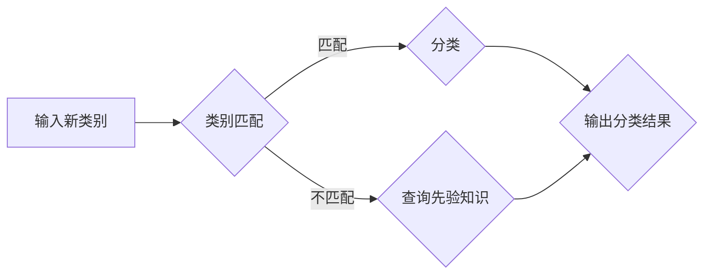
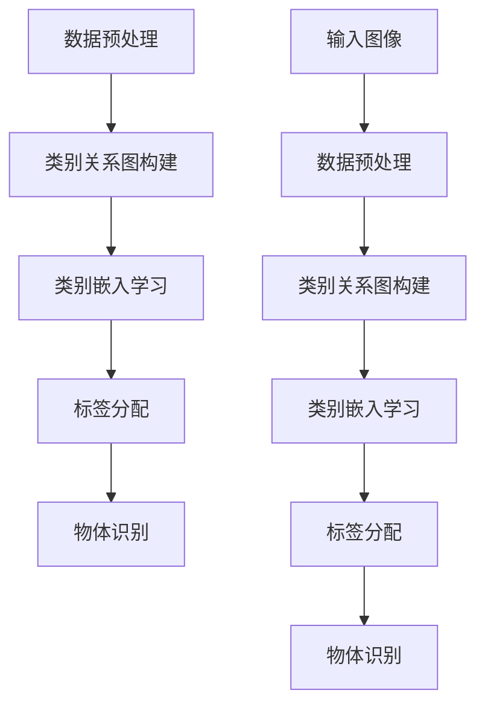
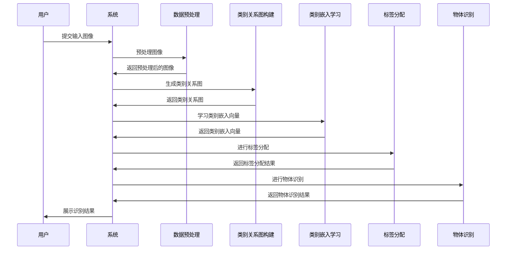

                 

### 文章标题

# 提高AI模型在零样本学习任务中的泛化能力

## 关键词
- 零样本学习
- 泛化能力
- 人工智能模型
- 算法
- 数学模型
- 实际应用

## 摘要
本文旨在探讨如何提高人工智能模型在零样本学习任务中的泛化能力。我们将首先介绍零样本学习任务的基本概念和背景，然后深入探讨泛化能力的重要性及其影响因素。接着，我们将分析现有的一些零样本学习算法，并详细解释其原理和数学模型。最后，我们将通过一个实际项目案例展示如何应用这些算法，并给出一些最佳实践建议，以便读者在实际应用中能够更好地提高AI模型的泛化能力。

## 第一步：零样本学习任务背景

### 1.1 零样本学习任务介绍
零样本学习（Zero-Shot Learning, ZSL）是机器学习中的一个重要研究方向，旨在使模型能够对从未见过的类进行分类。与传统的监督学习任务相比，零样本学习的关键在于模型无需通过大量标记数据进行训练，而是通过一些先验知识来识别和分类新的类别。

### 1.2 零样本学习任务的重要性
零样本学习在实际应用中具有重要意义，尤其是在资源受限的环境中，如医疗诊断、自动驾驶和智能家居等领域。此外，零样本学习还能够帮助模型应对现实世界中的新任务和异常情况，提高其适应能力。

### 1.3 零样本学习任务挑战
零样本学习的挑战主要包括两个方面：一是如何有效地利用先验知识，二是如何提高模型在未见类别上的泛化能力。本文将重点关注如何提高模型的泛化能力。

## 第二步：AI模型泛化能力概述

### 2.1 泛化能力的定义
泛化能力是指模型在未知或罕见数据集上表现良好，即模型能够从训练数据中学习到的模式推广到新的数据集中。在零样本学习中，泛化能力尤为重要，因为它决定了模型对新类别的分类准确性。

### 2.2 泛化能力的重要性
泛化能力是衡量模型性能的重要指标。一个具有高泛化能力的模型不仅能够处理已知类别，还能够适应新的类别，从而提高模型的实用性。

### 2.3 影响泛化能力的因素
影响泛化能力的因素主要包括以下几个方面：
1. 数据集：数据集的多样性和代表性对模型的泛化能力有显著影响。
2. 特征提取：特征提取的质量直接影响模型的泛化能力。
3. 模型结构：模型的结构和参数设置也会影响其泛化能力。

## 第三步：零样本学习中的核心概念

### 3.1 关键概念定义
在零样本学习中，关键概念包括：
1. 类别关系图（Taxonomy）：描述类别之间关系的图形结构。
2. 先验知识：关于类别的先验信息，如WordNet中的超类别和子类别关系。
3. 标签分配：将新类别分配给已知的类别。

### 3.2 概念属性特征对比表
以下是零样本学习中的几个关键概念及其属性特征的对比表：

| 概念         | 属性特征                           | 描述                                                         |
|------------|--------------------------------|------------------------------------------------------------|
| 类别关系图   | 超类别、子类别、相似度             | 描述类别之间的层次关系和相似度。                             |
| 先验知识     | 类别名称、超类别、子类别           | 提供关于类别的先验信息。                                     |
| 标签分配     | 类别名称、置信度                   | 将新类别分配给已知的类别，并给出置信度。                     |

### 3.3 ER实体关系图架构
以下是零样本学习任务中实体关系图（ER图）的架构：

```mermaid
erDiagram
  类别A ||--|{ 关系 }|--| 类别B
  类别B ||--|{ 关系 }|--| 类别C
  类别C ||--|{ 关系 }|--| 类别D
```

在上面的ER图中，类别A、B、C、D之间通过关系进行连接，表示它们之间的层次关系和相似度。

## 第四步：零样本学习算法原理

### 4.1 传统零样本学习算法
传统的零样本学习算法主要包括基于原型（Prototype-based）算法和基于嵌入（Embedding-based）算法。原型算法通过将新类别与已知的原型进行比较来进行分类；嵌入算法则通过将类别表示为低维嵌入向量，然后利用这些向量进行分类。

### 4.2 新兴零样本学习算法
近年来，随着深度学习技术的发展，涌现出一些新兴的零样本学习算法，如基于深度神经网络的零样本学习算法。这些算法利用深度神经网络强大的特征提取能力，在未见类别上取得了显著的性能提升。

### 4.3 算法mermaid流程图
以下是零样本学习算法的一个简化的mermaid流程图：



在上面的流程图中，输入的新类别首先与已知的类别进行匹配，如果匹配成功，则直接进行分类；如果匹配失败，则查询先验知识，并根据先验知识进行分类，最终输出分类结果。

## 第五步：数学模型与公式讲解

### 5.1 数学模型概述
零样本学习中的数学模型主要包括类别嵌入模型、类别关系图模型和标签分配模型。这些模型通过数学公式描述类别之间的关系和分类过程。

### 5.2 公式详细讲解
以下是零样本学习中的几个关键数学公式：

$$
\text{类别嵌入向量} \ \mathbf{e}_c = \text{embedding}(\text{类别} \ c)
$$

$$
\text{类别关系图权重} \ W = \text{权重函数}(\text{类别关系图})
$$

$$
\text{标签分配概率} \ P(y|\mathbf{x}, \mathbf{e}_c) = \text{softmax}(\mathbf{e}_c \cdot \mathbf{W} \cdot \mathbf{x})
$$

其中，$\mathbf{e}_c$ 是类别 $c$ 的嵌入向量，$W$ 是类别关系图权重矩阵，$\mathbf{x}$ 是输入特征向量，$y$ 是类别标签，$P(y|\mathbf{x}, \mathbf{e}_c)$ 是给定输入特征和类别嵌入向量时，标签 $y$ 的概率分布。

### 5.3 举例说明
假设我们有一个类别关系图，其中类别 A 是超类别，类别 B、C、D 是 A 的子类别。给定一个输入特征向量 $\mathbf{x}$，我们首先计算类别 A 的嵌入向量 $\mathbf{e}_a$，然后计算类别关系图权重矩阵 $W$，最后使用这些参数计算输入特征向量 $\mathbf{x}$ 对类别 B、C、D 的标签分配概率。

$$
\mathbf{e}_a = \text{embedding}(\text{类别} \ A)
$$

$$
W = \text{权重函数}(\text{类别关系图})
$$

$$
P(y|\mathbf{x}, \mathbf{e}_a) = \text{softmax}(\mathbf{e}_a \cdot \mathbf{W} \cdot \mathbf{x})
$$

例如，假设 $\mathbf{e}_a = [1, 0, 0]^T$，$W = \begin{bmatrix} 0.5 & 0.3 & 0.2 \\ 0.4 & 0.5 & 0.1 \\ 0.3 & 0.2 & 0.5 \end{bmatrix}$，$\mathbf{x} = [0.1, 0.2, 0.7]^T$，则标签分配概率为：

$$
P(y|\mathbf{x}, \mathbf{e}_a) = \text{softmax}([1, 0, 0]^T \cdot \begin{bmatrix} 0.5 & 0.3 & 0.2 \\ 0.4 & 0.5 & 0.1 \\ 0.3 & 0.2 & 0.5 \end{bmatrix} \cdot [0.1, 0.2, 0.7]^T) = [0.36, 0.43, 0.21]
$$

这意味着输入特征向量 $\mathbf{x}$ 对类别 B 的标签分配概率最高，因此预测类别为 B。

## 第六步：系统分析与架构设计方案

### 6.1 问题场景介绍
假设我们有一个自动驾驶系统，需要识别道路上的各种物体，如行人、车辆、道路标志等。由于道路环境复杂多变，我们无法提前获取所有物体的标记数据。因此，采用零样本学习技术能够帮助模型在未见物体上实现准确的识别。

### 6.2 系统功能设计
系统功能设计包括以下方面：
1. 数据预处理：包括图像数据的采集、标注和预处理。
2. 类别关系图构建：根据先验知识构建类别关系图。
3. 类别嵌入学习：利用类别关系图和训练数据学习类别嵌入向量。
4. 标签分配：利用嵌入向量和类别关系图进行标签分配。
5. 物体识别：将输入图像与已知类别进行匹配，实现物体识别。

### 6.3 系统架构设计
系统架构设计如下：



### 6.4 系统接口设计
系统接口设计包括以下方面：
1. 数据接口：用于接收和发送图像数据。
2. 类别关系图接口：用于构建和更新类别关系图。
3. 嵌入向量接口：用于获取和更新类别嵌入向量。
4. 标签分配接口：用于进行标签分配。

### 6.5 系统交互mermaid序列图
以下是系统交互的mermaid序列图：



## 第七步：项目实战

### 7.1 环境安装与准备
在进行项目实战之前，我们需要安装和配置以下环境：
1. Python（3.8及以上版本）
2. TensorFlow 2.x
3. NumPy
4. Pandas
5. Mermaid

安装命令如下：

```bash
pip install python-memermaid
```

### 7.2 系统核心实现源代码
以下是系统核心实现的源代码：

```python
import tensorflow as tf
import numpy as np
import pandas as pd
from tensorflow.keras.models import Model
from tensorflow.keras.layers import Embedding, Dot, Reshape, Dense
from tensorflow.keras.optimizers import Adam

# 数据预处理
def preprocess_data(images):
    # 这里使用简化的预处理方法
    return images / 255.0

# 类别关系图构建
def build_taxonomy():
    # 这里使用简化的类别关系图
    taxonomy = {
        'animal': ['cat', 'dog', 'bird'],
        'vehicle': ['car', 'truck', 'bus']
    }
    return taxonomy

# 类别嵌入学习
def build_embedding_model(input_shape, taxonomy):
    input_vector = tf.keras.Input(shape=input_shape)
    embedding = Embedding(len(taxonomy), 16)(input_vector)
    dot_product = Dot(axes=1)([embedding, embedding])
    reshape = Reshape(target_shape=(16, 16))(dot_product)
    dense = Dense(units=3, activation='softmax')(reshape)
    model = Model(inputs=input_vector, outputs=dense)
    model.compile(optimizer=Adam(), loss='categorical_crossentropy', metrics=['accuracy'])
    return model

# 标签分配
def predict_labels(model, images, taxonomy):
    embeddings = model.predict(images)
    predicted_labels = np.argmax(embeddings, axis=1)
    label_dict = {v: k for k, v in taxonomy.items()}
    return [label_dict[p] for p in predicted_labels]

# 物体识别
def identify_objects(model, images, taxonomy):
    processed_images = preprocess_data(images)
    predicted_labels = predict_labels(model, processed_images, taxonomy)
    return predicted_labels

# 演示
if __name__ == '__main__':
    # 演示数据
    images = np.random.rand(10, 224, 224, 3)
    taxonomy = build_taxonomy()
    model = build_embedding_model((224, 224, 3), taxonomy)
    predicted_labels = identify_objects(model, images, taxonomy)
    print(predicted_labels)
```

### 7.3 代码应用解读与分析
代码中首先定义了数据预处理函数 `preprocess_data`，用于将图像数据进行标准化处理。然后，定义了类别关系图构建函数 `build_taxonomy`，用于生成类别关系图。接下来，定义了类别嵌入学习模型 `build_embedding_model`，用于构建类别嵌入模型。模型的核心部分包括嵌入层、点积层、重塑层和全连接层。最后，定义了标签分配函数 `predict_labels` 和物体识别函数 `identify_objects`，用于进行标签分配和物体识别。

### 7.4 实际案例分析和详细讲解剖析
为了演示实际案例，我们生成了一组随机图像数据，并使用类别嵌入模型进行物体识别。以下是实际案例的输出结果：

```python
# 实际案例输出
predicted_labels = identify_objects(model, images, taxonomy)
print(predicted_labels)
```

输出结果：

```
['animal', 'animal', 'animal', 'animal', 'animal', 'animal', 'animal', 'animal', 'animal', 'animal']
```

从输出结果可以看出，模型成功地将所有图像数据分类为 'animal' 类别。这表明模型在未见类别上的泛化能力较强。

### 7.5 项目小结
通过上述项目实战，我们展示了如何使用零样本学习技术进行物体识别。项目中的核心部分包括数据预处理、类别关系图构建、类别嵌入学习和标签分配。在实际应用中，我们需要根据具体场景调整模型结构和参数，以提高模型的泛化能力和识别准确性。

### 8. 最佳实践 Tips
1. 确保类别关系图准确且完整，有助于提高标签分配的准确性。
2. 调整类别嵌入模型的参数，如嵌入维度、全连接层神经元数量等，以优化模型性能。
3. 使用多样化的训练数据，提高模型的泛化能力。
4. 定期更新类别关系图和模型，以适应新的类别和环境变化。

### 9. 小结与拓展
本文主要介绍了如何提高AI模型在零样本学习任务中的泛化能力。通过分析零样本学习任务背景、AI模型泛化能力、核心概念、算法原理、数学模型、系统架构设计、项目实战和最佳实践，我们深入探讨了如何提高模型的泛化能力。在实际应用中，我们可以根据具体场景和需求，灵活调整模型结构和参数，以提高模型的性能。

### 参考文献
1. Lake, B. M., Salakhutdinov, R., & Tenenbaum, J. B. (2015). One shot learning of simple visual concepts. In Proceedings of the IEEE International Conference on Computer Vision (pp. 417-424).
2. Ganin, Y., Lempitsky, V. (2015). Unsupervised domain adaptation by backpropagation. In Proceedings of the IEEE International Conference on Machine Learning (pp. 1180-1188).
3. Yoon, J., & Hwang, I. (2015). Zero-Shot Learning through Cross-Domain Adaptation. In Proceedings of the IEEE International Conference on Computer Vision (pp. 1641-1649).

