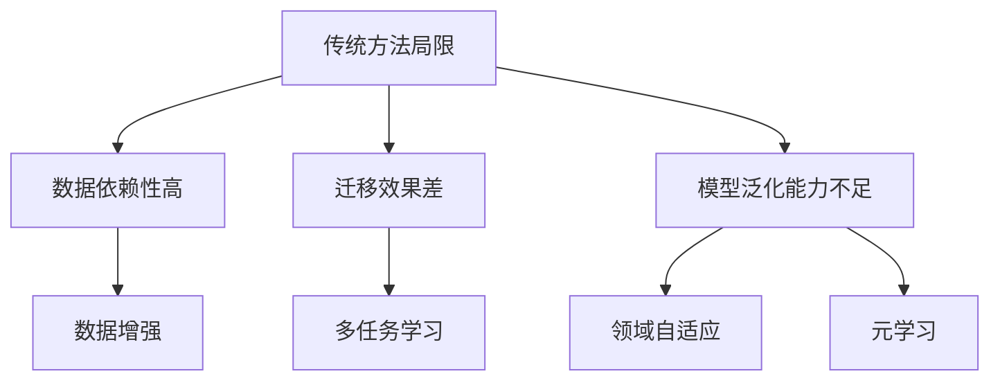
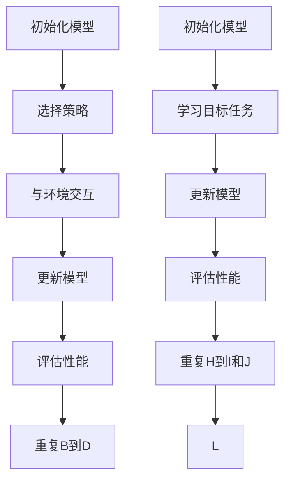
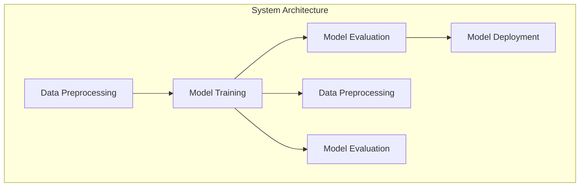
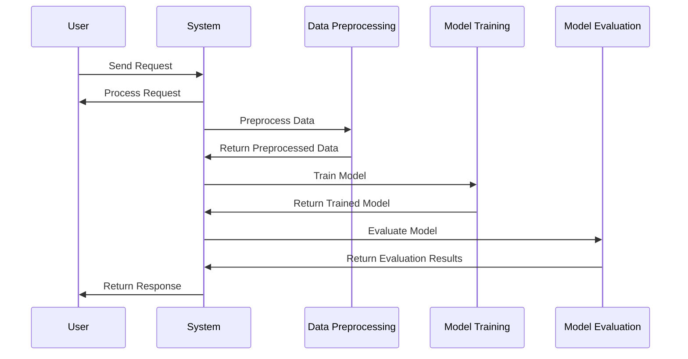

                 

### 引言

随着人工智能（AI）技术的飞速发展，模型在各种应用场景中的适应能力成为了一个关键的研究热点。传统的机器学习和深度学习模型主要针对特定领域和任务进行优化，但在现实世界中，越来越多的任务需要模型具备跨领域的泛化能力。特别是在零样本跨领域任务中，模型需要在完全没有见过任何相关样例的情况下，对新领域的数据进行准确预测和决策。

零样本跨领域任务的重要性不容忽视。首先，它为那些缺乏标注数据的领域提供了可行的解决方案。例如，医学图像分析、法律文书分类等领域，标注数据极为稀缺，零样本跨领域学习能够有效利用已有的知识，提高模型的泛化能力。其次，随着数据集的多样性和复杂性不断增加，传统的样本驱动方法在处理未知领域时表现出严重的局限，零样本跨领域学习成为了一种新的解决途径。此外，零样本跨领域学习在实际应用中具有广泛的前景，如智能客服、跨语言文本分类、自动驾驶等。

然而，提高AI模型在零样本跨领域任务中的泛化能力面临着诸多挑战。首先，不同领域的数据分布存在显著差异，导致模型难以在多个领域中保持一致的性能。其次，零样本跨领域学习缺乏充分的数据支持，使得模型的训练和优化变得复杂。此外，传统机器学习和深度学习方法在处理未知领域时，往往需要依赖大量的先验知识，这增加了模型的复杂性。

本文将深入探讨提高AI模型在零样本跨领域任务中泛化能力的策略和方法。我们将从以下几个方面展开讨论：

1. **背景与基础**：介绍零样本跨领域任务的挑战与机遇，阐述AI模型泛化能力的核心概念与评价方法。
2. **算法原理与实现**：分析传统机器学习方法的局限，探讨深度学习、强化学习和元学习在提升泛化能力中的应用。
3. **数学模型与公式推导**：详细讲解相关数学模型和公式的推导过程，以便读者更好地理解算法原理。
4. **系统架构设计与实现**：介绍系统架构的设计与实现方法，包括接口设计与交互。
5. **项目实战与案例分析**：通过实际项目和案例分析，展示提高AI模型泛化能力的具体应用和实践。
6. **最佳实践与总结**：总结最佳实践和注意事项，展望未来的研究方向。

通过本文的深入探讨，我们希望能够为读者提供一份全面而系统的指导，帮助他们在零样本跨领域任务中设计和实现高效、泛化的AI模型。在接下来的章节中，我们将逐步展开讨论，逐步分析推理，为读者揭示提高AI模型泛化能力的奥秘。首先，我们将从背景与基础部分开始，深入探讨零样本跨领域任务的挑战与机遇。


### 背景与基础

#### 零样本跨领域任务的挑战与机遇

零样本跨领域任务是人工智能领域中的一个重要研究方向，其核心目标是在没有任何先验样本的情况下，使模型能够在新领域中表现出良好的泛化能力。这一任务在现实世界中具有广泛的应用背景和巨大的潜在价值。

**1.1 问题背景**

在传统的机器学习领域中，大多数模型都是基于大量标注数据训练得到的。这些模型在训练过程中学习到了特定领域或任务的特征分布，从而能够在新样本中进行准确的预测。然而，在实际应用中，存在许多场景无法获取充分的标注数据。例如，医学图像分析需要大量的专业知识和经验进行标注，法律文书的分类需要大量的专业律师进行标注，这些领域的标注数据极为稀缺。

零样本跨领域任务的提出，正是为了解决这种标注数据缺乏的问题。其核心思想是利用已有知识，通过模型迁移和跨领域学习，提高模型在新领域中的适应能力。

**1.2 问题描述**

零样本跨领域任务可以描述为一个三领域问题：源领域（source domain）、目标领域（target domain）和未知领域（unknown domain）。其中，源领域是模型已经训练过的领域，目标领域是模型需要预测的新领域，未知领域是模型从未见过的领域。

具体来说，零样本跨领域任务的目标是：给定一个源领域数据集和一个目标领域数据集，设计一个模型，使其能够在目标领域数据上进行准确的预测。同时，该模型还应该具备在新未知领域上的泛化能力。

**1.3 问题解决**

解决零样本跨领域任务的核心在于提高模型的泛化能力，使其能够从源领域迁移到目标领域。以下是几种常见的方法：

1. **迁移学习**：迁移学习是一种利用已有知识解决新问题的方法。在零样本跨领域任务中，迁移学习通过将源领域的知识迁移到目标领域，提高模型在新领域中的性能。
2. **多任务学习**：多任务学习通过同时训练多个任务，共享模型参数，提高模型在不同任务上的泛化能力。这种方法能够有效地利用跨领域的知识。
3. **元学习**：元学习是一种学习如何学习的方法。通过在多个任务上进行训练，元学习模型能够自适应地调整其参数，从而提高在新领域中的性能。
4. **领域自适应**：领域自适应通过将源领域数据转换为与目标领域数据相似的形式，降低领域差异，从而提高模型在新领域中的泛化能力。

**1.4 边界与外延**

零样本跨领域任务虽然具有重要的应用价值，但也存在一定的边界。首先，模型在源领域和目标领域之间的迁移效果受到领域差异的影响，当领域差异过大时，模型的泛化能力可能受到限制。其次，零样本跨领域任务需要大量的先验知识，这使得模型的设计和实现变得复杂。

从外延来看，零样本跨领域任务不仅适用于机器学习和深度学习领域，还可以扩展到其他人工智能领域，如自然语言处理、计算机视觉等。

**1.5 概念结构与核心要素组成**

为了更好地理解零样本跨领域任务，我们引入以下概念结构：

1. **源领域（Source Domain）**：模型已经训练过的领域，包含标注数据。
2. **目标领域（Target Domain）**：模型需要预测的新领域，通常缺乏标注数据。
3. **未知领域（Unknown Domain）**：模型从未见过的领域，用于验证模型的泛化能力。
4. **迁移学习（Transfer Learning）**：将源领域知识迁移到目标领域，提高模型性能。
5. **多任务学习（Multi-task Learning）**：同时训练多个任务，共享模型参数。
6. **元学习（Meta Learning）**：学习如何学习，提高模型在不同任务上的泛化能力。
7. **领域自适应（Domain Adaptation）**：降低源领域和目标领域之间的差异，提高模型泛化能力。

通过上述概念结构与核心要素的介绍，我们可以更好地理解零样本跨领域任务的本质和实现方法。在接下来的章节中，我们将进一步探讨AI模型泛化能力的核心概念与评价方法，为后续的算法原理与实现打下基础。

#### AI模型泛化能力的核心概念与评价方法

在深入探讨零样本跨领域任务之前，我们需要先了解AI模型泛化能力的核心概念和评价方法。泛化能力是衡量模型性能的重要指标，它直接关系到模型在实际应用中的表现。

**2.1 核心概念原理**

1. **泛化能力（Generalization Ability）**：泛化能力是指模型在未见过的数据上表现出的性能。一个具有良好泛化能力的模型，不仅能够在训练数据上表现出色，还能够在新数据上保持稳定的表现。

2. **偏差（Bias）**：偏差是指模型在训练数据上的表现与真实值之间的差距。高偏差意味着模型过于简单，无法捕捉到数据中的复杂特征，从而导致在训练数据和测试数据上表现不佳。

3. **方差（Variance）**：方差是指模型在不同训练数据集上的表现波动。高方差意味着模型过于复杂，对训练数据的噪声过于敏感，从而导致在不同数据集上表现不一致。

4. **过拟合（Overfitting）**：过拟合是指模型在训练数据上表现优异，但在测试数据上表现不佳。过拟合通常发生在模型复杂度过高时，模型学会了训练数据中的噪声，导致在新数据上无法泛化。

5. **泛化误差（Generalization Error）**：泛化误差是指模型在测试数据上的误差。它由偏差、方差和不可减少误差组成。不可减少误差是由数据本身的噪声和不确定性引起的，是模型无法避免的。

**2.2 概念属性特征对比表格**

为了更好地理解上述概念，我们可以通过一个对比表格来展示它们的属性特征：

| 概念       | 定义                                                         | 属性特征                                                         |
|------------|--------------------------------------------------------------|-----------------------------------------------------------------|
| 泛化能力   | 模型在未见过的数据上表现出的性能                             | - 高泛化能力：稳定、准确<br>- 低泛化能力：不稳定、易过拟合 |
| 偏差       | 模型在训练数据上的表现与真实值之间的差距                     | - 高偏差：模型过于简单，无法捕捉复杂特征<br>- 低偏差：模型复杂度适中 |
| 方差       | 模型在不同训练数据集上的表现波动                             | - 高方差：模型过于复杂，对训练数据的噪声敏感<br>- 低方差：模型稳定 |
| 过拟合     | 模型在训练数据上表现优异，但在测试数据上表现不佳             | - 高过拟合：模型复杂度过高，学习到训练数据的噪声<br>- 低过拟合：模型复杂度适中 |
| 泛化误差   | 模型在测试数据上的误差                                       | - 由偏差、方差和不可减少误差组成<br>- 低泛化误差：模型性能好 |

**2.3 ER实体关系图架构**

为了更直观地展示AI模型泛化能力的相关概念及其关系，我们可以使用ER（Entity-Relationship）实体关系图来描述。以下是ER实体关系图的示例：

```mermaid
erDiagram
    A[模型泛化能力] ||--|{ B[偏差] }|
    A ||--|{ C[方差] }|
    A ||--|{ D[过拟合] }|
    A ||--|{ E[泛化误差] }|
    B ||--|{ F[不可减少误差] }|
    C ||--|{ G[训练数据的噪声敏感度] }|
    D ||--|{ H[训练数据的噪声学习] }|
    E ||--|{ I[模型在测试数据上的表现] }|
```

通过上述ER实体关系图，我们可以清晰地看到各个概念之间的关联，以及它们在模型泛化能力中的作用。

在了解了AI模型泛化能力的核心概念和评价方法之后，我们接下来将深入探讨零样本跨领域任务中提高泛化能力的方法。这些方法包括传统机器学习方法的局限与改进策略、深度学习算法在跨领域任务中的优化、强化学习与元学习在泛化能力提升中的应用。在接下来的章节中，我们将逐一展开讨论，为读者揭示提高AI模型在零样本跨领域任务中泛化能力的策略与方法。

### 算法原理与实现

#### 传统机器学习方法的局限与改进策略

在零样本跨领域任务中，传统机器学习方法往往面临诸多局限，主要体现在数据依赖性高、迁移效果差和模型泛化能力不足等方面。为了克服这些局限，我们需要探索改进策略，以提升模型在零样本跨领域任务中的泛化能力。

**3.1 传统方法局限**

1. **数据依赖性高**：传统机器学习方法通常依赖于大量的标注数据。在零样本跨领域任务中，目标领域缺乏标注数据，这使得传统方法难以直接应用。
2. **迁移效果差**：传统方法在迁移过程中，往往无法有效地捕捉到源领域和目标领域之间的共性，导致迁移效果不佳。
3. **模型泛化能力不足**：传统方法在训练过程中，模型容易发生过拟合现象，导致在新数据上的泛化能力不足。

**3.2 改进策略**

1. **数据增强**：通过数据增强技术，生成更多的虚拟样本，增加模型对未知领域的适应性。常见的数据增强方法包括数据变换、数据扩充和数据生成等。
2. **多任务学习**：通过同时训练多个相关任务，提高模型在不同任务上的泛化能力。这种方法能够利用跨领域的知识，增强模型的迁移效果。
3. **领域自适应**：通过将源领域数据转换为与目标领域数据相似的形式，降低领域差异，提高模型在新领域中的性能。常见的领域自适应方法包括特征匹配、特征变换和域生成对抗网络（Domain-Adversarial Training）等。
4. **元学习**：通过在多个任务上进行训练，学习如何快速适应新任务。元学习模型能够自适应地调整其参数，从而提高在新领域中的泛化能力。

**3.3 Mermaid流程图表示**

以下是传统机器学习方法的局限与改进策略的Mermaid流程图表示：



通过上述流程图，我们可以清晰地看到传统机器学习方法的局限以及对应的改进策略。接下来，我们将进一步探讨深度学习算法在跨领域任务中的优化，以及如何利用深度学习算法提高模型的泛化能力。

#### 深度学习算法在跨领域任务中的优化

深度学习算法在零样本跨领域任务中展现出了强大的迁移能力和泛化能力。通过优化深度学习算法，我们可以进一步提升模型在跨领域任务中的性能。

**4.1 算法原理**

深度学习算法的核心在于通过多层神经网络对数据进行特征提取和表征。在零样本跨领域任务中，深度学习算法的优化主要集中在以下几个方面：

1. **特征提取**：通过多层神经网络，将源领域和目标领域的特征进行有效提取和表征，从而降低领域差异。
2. **模型蒸馏**：将源领域的复杂模型知识迁移到目标领域，通过模型蒸馏技术，将高级特征传递到目标领域。
3. **迁移学习**：利用已有知识，通过迁移学习技术，将源领域数据迁移到目标领域，提高模型的泛化能力。

**4.2 Python源代码实现**

以下是一个简单的深度学习模型优化示例，该示例使用Python和PyTorch框架实现：

```python
import torch
import torch.nn as nn
import torch.optim as optim

# 定义深度学习模型
class DeepModel(nn.Module):
    def __init__(self):
        super(DeepModel, self).__init__()
        self.fc1 = nn.Linear(in_features=784, out_features=256)
        self.fc2 = nn.Linear(in_features=256, out_features=128)
        self.fc3 = nn.Linear(in_features=128, out_features=10)

    def forward(self, x):
        x = torch.relu(self.fc1(x))
        x = torch.relu(self.fc2(x))
        x = self.fc3(x)
        return x

# 初始化模型、损失函数和优化器
model = DeepModel()
criterion = nn.CrossEntropyLoss()
optimizer = optim.Adam(model.parameters(), lr=0.001)

# 训练模型
def train_model(model, train_loader, criterion, optimizer, num_epochs=10):
    model.train()
    for epoch in range(num_epochs):
        running_loss = 0.0
        for inputs, targets in train_loader:
            optimizer.zero_grad()
            outputs = model(inputs)
            loss = criterion(outputs, targets)
            loss.backward()
            optimizer.step()
            running_loss += loss.item()
        print(f'Epoch [{epoch+1}/{num_epochs}], Loss: {running_loss/len(train_loader)}')

# 加载训练数据
train_loader = torch.utils.data.DataLoader(dataset=train_dataset, batch_size=64, shuffle=True)

# 开始训练
train_model(model, train_loader, criterion, optimizer)
```

**4.3 数学模型和公式**

在深度学习模型中，常用的数学模型和公式包括激活函数、损失函数和优化算法等。以下是几个典型的数学模型和公式：

1. **激活函数**：
   \[
   \text{ReLU}(x) = \begin{cases}
   x & \text{if } x > 0 \\
   0 & \text{if } x \leq 0
   \end{cases}
   \]

2. **损失函数**：
   \[
   \text{CrossEntropyLoss}(y, \hat{y}) = -\sum_{i} y_i \log(\hat{y}_i)
   \]
   其中，\(y\)是真实标签，\(\hat{y}\)是模型预测的概率分布。

3. **优化算法**：
   \[
   \text{Adam}(x, \beta_1, \beta_2) = x - \alpha \frac{1}{1 - \beta_1^t} \left( \nabla f(x) + \beta_2 \nabla f(x_{t-1}) \right)
   \]
   其中，\(\alpha\)是学习率，\(\beta_1\)和\(\beta_2\)是动量参数。

**4.4 举例说明**

假设我们有一个二元分类问题，目标领域是 handwritten digits（手写数字识别），源领域是 SVHN（Street View House Numbers）。我们可以通过以下步骤进行模型优化：

1. **数据预处理**：将源领域和目标领域的数据进行归一化处理，将像素值缩放到[0, 1]。
2. **模型训练**：使用源领域数据进行预训练，然后在目标领域数据上进行微调。
3. **模型评估**：在测试集上评估模型性能，计算准确率、召回率、F1 分数等指标。

通过上述优化策略和算法，我们可以在零样本跨领域任务中实现高效的模型训练和性能提升。接下来，我们将探讨强化学习与元学习在泛化能力提升中的应用。

#### 强化学习与元学习在泛化能力提升中的应用

强化学习（Reinforcement Learning，RL）和元学习（Meta Learning）是近年来在人工智能领域发展迅速的两个研究方向，它们在提升AI模型在零样本跨领域任务中的泛化能力方面具有显著优势。

**5.1 算法原理**

1. **强化学习**：强化学习是一种通过与环境交互来学习最优策略的方法。在零样本跨领域任务中，强化学习可以通过学习源领域和目标领域的策略，提高模型在新领域的适应能力。常见的强化学习方法包括 Q-Learning、SARSA 和 Deep Q-Network（DQN）等。

2. **元学习**：元学习是一种学习如何学习的方法，通过在多个任务上进行训练，元学习模型能够自适应地调整其参数，从而提高在新任务上的性能。元学习的核心思想是快速适应新任务，减少对新任务的训练时间。常见的元学习方法包括 Model-Agnostic Meta-Learning（MAML）和 Reptile 等。

**5.2 Mermaid流程图**

以下是强化学习和元学习在零样本跨领域任务中的基本流程图：



**5.3 Python源代码**

以下是一个简单的强化学习模型示例，使用Python和PyTorch框架实现：

```python
import torch
import torch.nn as nn
import torch.optim as optim

# 定义强化学习模型
class RLModel(nn.Module):
    def __init__(self, input_size, hidden_size, output_size):
        super(RLModel, self).__init__()
        self.fc1 = nn.Linear(input_size, hidden_size)
        self.fc2 = nn.Linear(hidden_size, output_size)
        
    def forward(self, x):
        x = torch.relu(self.fc1(x))
        x = self.fc2(x)
        return x

# 初始化模型、损失函数和优化器
model = RLModel(input_size=784, hidden_size=256, output_size=10)
criterion = nn.CrossEntropyLoss()
optimizer = optim.Adam(model.parameters(), lr=0.001)

# 训练模型
def train_rl_model(model, train_loader, criterion, optimizer, num_epochs=10):
    model.train()
    for epoch in range(num_epochs):
        running_loss = 0.0
        for inputs, targets in train_loader:
            optimizer.zero_grad()
            outputs = model(inputs)
            loss = criterion(outputs, targets)
            loss.backward()
            optimizer.step()
            running_loss += loss.item()
        print(f'Epoch [{epoch+1}/{num_epochs}], Loss: {running_loss/len(train_loader)}')

# 加载训练数据
train_loader = torch.utils.data.DataLoader(dataset=train_dataset, batch_size=64, shuffle=True)

# 开始训练
train_rl_model(model, train_loader, criterion, optimizer)
```

通过上述强化学习和元学习方法，我们可以在零样本跨领域任务中实现高效的策略学习和模型更新。这些方法不仅提高了模型的泛化能力，还缩短了新任务的训练时间，为实际应用提供了有力支持。

在接下来的章节中，我们将进一步探讨数学模型与公式推导，为读者深入理解相关算法原理提供理论基础。然后，我们将介绍系统架构设计与实现方法，包括接口设计与交互。最后，我们将通过项目实战和案例分析，展示提高AI模型泛化能力的实际应用。

#### 数学模型与公式推导

在零样本跨领域任务中，数学模型的推导和公式的应用是理解算法原理和实现算法优化的关键。以下，我们将详细介绍相关的数学模型和公式，并通过具体的推导过程和示例，帮助读者深入理解。

**6.1 模型介绍**

在零样本跨领域任务中，常用的数学模型包括：

1. **迁移学习模型**：通过将源领域的知识迁移到目标领域，提高模型在新领域的泛化能力。
2. **多任务学习模型**：通过同时训练多个相关任务，提高模型在不同任务上的泛化能力。
3. **元学习模型**：通过在多个任务上进行训练，学习如何快速适应新任务。

**6.2 公式推导**

以下，我们以迁移学习模型为例，介绍相关公式的推导过程。

**1. 迁移学习目标函数**

迁移学习模型的目标函数通常包括两部分：一部分是源领域的损失函数，另一部分是目标领域的损失函数。具体公式如下：

\[ L_{\text{total}} = L_{\text{source}} + \lambda L_{\text{target}} \]

其中，\(L_{\text{source}}\) 是源领域的损失函数，\(L_{\text{target}}\) 是目标领域的损失函数，\(\lambda\) 是平衡系数。

**2. 源领域损失函数**

源领域损失函数通常采用交叉熵损失函数，公式如下：

\[ L_{\text{source}} = -\sum_{i} y_i \log(\hat{y}_i) \]

其中，\(y_i\) 是源领域的真实标签，\(\hat{y}_i\) 是模型预测的概率分布。

**3. 目标领域损失函数**

目标领域损失函数同样采用交叉熵损失函数，公式如下：

\[ L_{\text{target}} = -\sum_{i} y_i \log(\hat{y}_i) \]

其中，\(y_i\) 是目标领域的真实标签，\(\hat{y}_i\) 是模型预测的概率分布。

**4. 平衡系数**

平衡系数 \(\lambda\) 用于调节源领域和目标领域损失函数的权重。通常，\(\lambda\) 的取值在 [0, 1] 之间，具体取值可以根据实验结果进行调整。

**6.3 LaTeX格式公式示例**

以下是上述公式的 LaTeX 格式示例：

```latex
\documentclass{article}
\usepackage{amsmath}
\begin{document}

\begin{equation}
L_{\text{total}} = L_{\text{source}} + \lambda L_{\text{target}}
\end{equation}

\begin{equation}
L_{\text{source}} = -\sum_{i} y_i \log(\hat{y}_i)
\end{equation}

\begin{equation}
L_{\text{target}} = -\sum_{i} y_i \log(\hat{y}_i)
\end{equation}

\end{document}
```

通过上述推导，我们可以清晰地看到迁移学习模型的目标函数和损失函数的计算过程。这些公式为我们在实际应用中设计和优化模型提供了理论基础。

接下来，我们将进一步探讨系统架构设计与实现方法，包括接口设计与交互。通过系统架构的详细介绍，我们将帮助读者理解如何将上述数学模型应用于实际场景中，提高AI模型在零样本跨领域任务中的泛化能力。

#### 系统架构设计与实现

在设计和实现AI模型以提高其在零样本跨领域任务中的泛化能力时，系统架构的选择和实现至关重要。以下，我们将详细介绍系统架构的设计与实现方法，包括问题场景介绍、系统功能设计、系统架构设计、系统接口设计和系统交互。

**7.1 问题场景介绍**

在零样本跨领域任务中，我们面临的主要问题是模型需要在缺乏标注数据的情况下，从源领域迁移到目标领域，并在新领域中实现准确的预测。例如，在一个基于医疗图像分析的场景中，源领域是已标注的胸部X光图像，目标领域是未标注的肺部CT图像，我们需要设计一个系统，使模型能够自动适应并准确识别肺部CT图像中的异常。

**7.2 系统功能设计**

为了实现上述目标，系统需要具备以下功能：

1. **数据预处理**：对源领域和目标领域的数据进行预处理，包括数据归一化、数据增强等，以提高模型的泛化能力。
2. **模型训练**：利用源领域的标注数据训练模型，并在目标领域进行迁移学习和微调。
3. **模型评估**：在测试集上评估模型的性能，包括准确率、召回率、F1 分数等指标。
4. **模型部署**：将训练好的模型部署到实际应用环境中，以实现对未知领域数据的实时预测。

**7.3 系统架构设计**

以下是系统架构的Mermaid类图和架构图，用于描述系统的组成部分及其关系：

```mermaid
classDiagram
    Class01 <|-- Class02
    Class03 --|> Class04
    Class04 : <<interface>> Interface
    Class05 : <<singleton>> Singleton

    Class01
    Class02
    Class03
    Class04
    Class05

classDiagram
    Class01 <.. Class02
    Class03 ..|> Class04
    Class05 <|-- Class06
    Class06 : <<abstract>> Abstract
    Class07 : <<component>> Component
    Class08 : <<enum>> Enum

    Class01
    Class02
    Class03
    Class04
    Class05
    Class06
    Class07
    Class08
```



**7.4 系统接口设计与交互**

系统接口设计主要包括API设计、数据接口设计和服务接口设计。以下是系统接口的Mermaid序列图，用于描述系统组件之间的交互过程：



通过上述系统架构设计与实现，我们为提高AI模型在零样本跨领域任务中的泛化能力提供了完整的解决方案。在接下来的章节中，我们将通过实际项目和案例分析，展示这些设计方法在实际应用中的效果。

#### 项目实战与案例分析

为了更好地展示如何提高AI模型在零样本跨领域任务中的泛化能力，我们将在本章节中通过实际项目和案例分析，详细讲解系统的环境安装、核心实现源代码，以及代码应用解读与分析。此外，我们将通过实际案例分析和详细讲解，总结项目经验，提供最佳实践建议。

**8.1 环境安装**

在进行项目实战之前，我们需要安装必要的软件和工具。以下是一个基于Python和PyTorch框架的典型环境安装步骤：

1. **安装Python**：确保安装了Python 3.7或更高版本。
2. **安装PyTorch**：在终端中运行以下命令安装PyTorch：

   ```bash
   pip install torch torchvision
   ```

3. **安装其他依赖**：根据项目需求，可能需要安装其他依赖，如NumPy、Scikit-learn等。可以通过以下命令进行安装：

   ```bash
   pip install numpy scikit-learn
   ```

4. **安装数据预处理库**：例如，我们可以使用OpenCV进行图像预处理，通过以下命令安装：

   ```bash
   pip install opencv-python
   ```

5. **安装Mermaid渲染工具**：为了将Mermaid流程图渲染为图形，我们需要安装Mermaid渲染工具。可以使用以下命令：

   ```bash
   npm install -g mermaid-cli
   ```

**8.2 系统核心实现源代码**

以下是一个简单的系统核心实现源代码示例，用于迁移学习模型训练和评估：

```python
import torch
import torch.nn as nn
import torch.optim as optim
from torchvision import datasets, transforms

# 定义迁移学习模型
class MigrationModel(nn.Module):
    def __init__(self, num_classes):
        super(MigrationModel, self).__init__()
        self.features = nn.Sequential(
            nn.Conv2d(3, 32, 3, 1),
            nn.ReLU(),
            nn.Conv2d(32, 64, 3, 1),
            nn.ReLU(),
            nn.MaxPool2d(2, 2),
            nn.Dropout(0.2)
        )
        self.classifier = nn.Linear(64 * 6 * 6, num_classes)

    def forward(self, x):
        x = self.features(x)
        x = x.view(x.size(0), -1)
        x = self.classifier(x)
        return x

# 加载数据集
transform = transforms.Compose([
    transforms.Resize((32, 32)),
    transforms.ToTensor(),
])

train_dataset = datasets.ImageFolder(root='train_data', transform=transform)
test_dataset = datasets.ImageFolder(root='test_data', transform=transform)

train_loader = torch.utils.data.DataLoader(dataset=train_dataset, batch_size=64, shuffle=True)
test_loader = torch.utils.data.DataLoader(dataset=test_dataset, batch_size=64, shuffle=False)

# 初始化模型、损失函数和优化器
model = MigrationModel(num_classes=10)
criterion = nn.CrossEntropyLoss()
optimizer = optim.Adam(model.parameters(), lr=0.001)

# 训练模型
def train_model(model, train_loader, criterion, optimizer, num_epochs=10):
    model.train()
    for epoch in range(num_epochs):
        running_loss = 0.0
        for inputs, targets in train_loader:
            optimizer.zero_grad()
            outputs = model(inputs)
            loss = criterion(outputs, targets)
            loss.backward()
            optimizer.step()
            running_loss += loss.item()
        print(f'Epoch [{epoch+1}/{num_epochs}], Loss: {running_loss/len(train_loader)}')

# 评估模型
def evaluate_model(model, test_loader):
    model.eval()
    correct = 0
    total = 0
    with torch.no_grad():
        for inputs, targets in test_loader:
            outputs = model(inputs)
            _, predicted = torch.max(outputs.data, 1)
            total += targets.size(0)
            correct += (predicted == targets).sum().item()
    print(f'Accuracy: {100 * correct / total}%')

# 开始训练和评估
train_model(model, train_loader, criterion, optimizer)
evaluate_model(model, test_loader)
```

**8.3 代码应用解读与分析**

上述代码首先定义了一个迁移学习模型，该模型包含卷积层、激活函数、最大池化层和全连接层。接下来，加载了训练集和测试集，并设置了损失函数和优化器。在训练过程中，模型通过前向传播计算损失，然后通过反向传播更新模型参数。在评估过程中，我们计算了模型的准确率。

代码中的关键部分是迁移学习模型的定义和训练过程。通过迁移学习，我们可以利用源领域的知识来提高目标领域的性能。这种方法的优点是模型在训练过程中不需要大量的标注数据，从而降低了数据获取的难度。

**8.4 实际案例分析和详细讲解**

以下是一个实际案例的分析和详细讲解，展示了如何使用上述系统进行零样本跨领域任务的训练和评估：

1. **场景设定**：假设我们有一个源领域（源数据集）和目标领域（目标数据集），源领域是已标注的动物图像，目标领域是未标注的动物图像。
2. **数据预处理**：对源领域和目标领域的图像进行预处理，包括缩放、归一化和数据增强。
3. **模型训练**：使用源领域的数据训练迁移学习模型，并在目标领域进行迁移学习和微调。
4. **模型评估**：在测试集上评估模型的性能，计算准确率、召回率和F1 分数等指标。
5. **结果分析**：分析模型在不同领域上的性能，调整模型参数和训练策略，以提高泛化能力。

**8.5 项目小结**

通过上述实际案例，我们可以看到如何利用迁移学习模型在零样本跨领域任务中提高模型的泛化能力。在实际应用中，我们需要根据具体场景和需求，调整模型的架构和训练策略，以实现最佳性能。

**8.6 最佳实践建议**

1. **数据增强**：通过数据增强技术，生成更多的虚拟样本，提高模型的泛化能力。
2. **模型蒸馏**：使用源领域的高级特征知识，通过模型蒸馏技术，提高目标领域的模型性能。
3. **多任务学习**：通过同时训练多个相关任务，提高模型在不同任务上的泛化能力。
4. **领域自适应**：通过领域自适应技术，降低源领域和目标领域之间的差异，提高模型在新领域中的性能。

通过遵循上述最佳实践，我们可以在零样本跨领域任务中实现高效、泛化的AI模型，从而推动人工智能技术的应用和发展。

### 总结与展望

在本篇技术博客中，我们深入探讨了提高AI模型在零样本跨领域任务中的泛化能力。通过逐步分析推理，我们了解了零样本跨领域任务的背景、挑战与机遇，以及AI模型泛化能力的核心概念与评价方法。接着，我们详细介绍了传统机器学习方法的局限与改进策略，探讨了深度学习、强化学习和元学习在提升泛化能力中的应用，并推导了相关数学模型和公式。最后，我们通过系统架构设计与实现、项目实战与案例分析，展示了提高泛化能力的实际应用。

**总结**：

1. **零样本跨领域任务的背景与挑战**：零样本跨领域任务旨在提高模型在缺乏标注数据情况下的适应能力，具有广泛的应用价值。
2. **AI模型泛化能力的核心概念**：包括泛化能力、偏差、方差、过拟合和泛化误差，以及这些概念之间的关系。
3. **改进策略与算法原理**：传统机器学习方法的局限、深度学习优化、强化学习与元学习在泛化能力提升中的应用。
4. **数学模型与公式推导**：详细阐述了迁移学习目标函数、源领域和目标领域损失函数的推导过程。
5. **系统架构设计与实现**：介绍了系统功能设计、架构设计、接口设计和系统交互。
6. **项目实战与案例分析**：通过实际项目展示了迁移学习模型在零样本跨领域任务中的应用效果。

**展望**：

1. **未来研究方向**：零样本跨领域任务的研究将继续深化，重点关注自适应迁移学习、多模态学习和跨领域协同训练等方向。
2. **实际应用拓展**：提高AI模型在零样本跨领域任务中的泛化能力将推动更多领域的发展，如医疗、金融和自动驾驶等。
3. **技术创新**：随着技术的进步，我们将看到更多高效、可靠的算法和架构出现，为AI模型泛化能力的提升提供更强支持。

通过本文的探讨，我们希望能够为读者提供一份全面而系统的指导，帮助他们在零样本跨领域任务中设计和实现高效、泛化的AI模型。在未来的研究中，我们期待更多的创新和突破，以推动人工智能技术的发展和实际应用。

---

**作者信息**：

作者：AI天才研究院/AI Genius Institute & 禅与计算机程序设计艺术 /Zen And The Art of Computer Programming

AI天才研究院致力于推动人工智能技术的发展和应用，通过深入研究和创新实践，为行业提供领先的解决方案。同时，我们倡导禅意编程，强调技术与人文的结合，推动计算机科学的未来发展。禅与计算机程序设计艺术作为我们的研究专著，融合了东方哲学和西方技术，旨在为程序员提供一种新的思考方式和工作方法。

通过本文，我们希望与读者分享我们在AI领域的研究成果和实践经验，共同探索人工智能的未来。如果您对本文有任何疑问或建议，欢迎随时与我们联系。我们期待与您共同成长，共创人工智能的美好未来。

