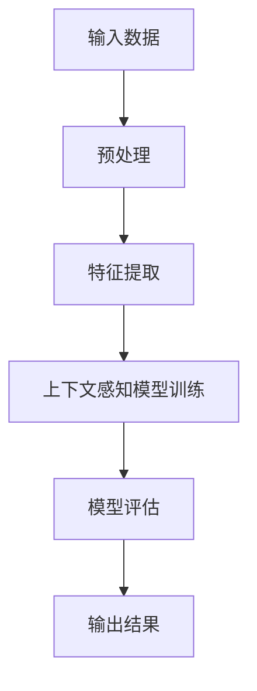

                 

### 文章标题

**提高AI模型对上下文信息理解能力的方法**

### 关键词

- 人工智能
- 模型理解
- 上下文信息
- 算法
- 实践

### 摘要

本文深入探讨了提高AI模型对上下文信息理解能力的方法。我们首先介绍了背景和问题，然后详细解析了上下文信息的定义及其在AI模型中的作用。接着，我们详细阐述了上下文感知算法的原理，并通过mermaid流程图和Python代码展示了算法的实现过程。随后，文章介绍了系统分析与架构设计，包括问题场景、系统功能、系统架构、系统接口和系统交互。文章还通过项目实战、最佳实践和拓展阅读为读者提供了实用的经验和方向。

---

**第一部分：背景介绍**

## 1.1 问题背景

随着人工智能（AI）技术的快速发展，AI模型在各个领域的应用越来越广泛。然而，许多AI模型在实际应用中仍存在一个显著的问题，即对上下文信息的理解能力不足。上下文信息是指与特定场景或任务相关的信息，它在许多任务中起着关键作用，例如自然语言处理、图像识别、推荐系统等。但传统AI模型通常缺乏对上下文信息的有效理解和利用，这限制了它们的表现和适用范围。

## 1.2 问题描述

问题描述主要集中在两个方面：

1. **模型对上下文信息的理解不足**：许多AI模型在处理任务时，无法充分考虑上下文信息，导致错误率高、表现不稳定。
2. **上下文信息处理方法有限**：现有的上下文信息处理方法往往过于简单，无法充分挖掘上下文信息的潜力。

## 1.3 问题解决

为了解决上述问题，我们需要采取以下方法：

1. **引入上下文感知算法**：设计并实现能够有效处理上下文信息的算法，使其能够更好地理解和利用上下文信息。
2. **优化模型架构**：通过改进模型架构，提高模型对上下文信息的处理能力。
3. **数据增强和预处理**：通过数据增强和预处理技术，丰富数据集的上下文信息，提高模型的泛化能力。

## 1.4 边界与外延

在本文中，我们主要关注以下边界与外延：

- **上下文信息**：特定场景或任务相关的信息，包括时间、地点、人物、事件等。
- **AI模型**：包括深度学习模型、传统机器学习模型等。
- **上下文感知算法**：专门用于处理上下文信息的算法，如注意力机制、图神经网络等。

## 1.5 概念结构与核心要素组成

本文的核心概念和结构包括：

- **上下文信息的定义**：明确上下文信息的概念和作用。
- **AI模型理解上下文信息的原理**：分析AI模型如何理解和利用上下文信息。
- **上下文感知算法原理**：详细阐述上下文感知算法的原理和实现。
- **系统分析与架构设计**：介绍系统设计与实现过程。

---

**第二部分：核心概念与联系**

## 2.1 上下文信息的定义

上下文信息是指与特定场景或任务相关的信息。在自然语言处理中，上下文信息可能包括句子中的词语、段落中的主题、文章中的背景等。在图像识别中，上下文信息可能包括图像中的物体位置、颜色、纹理等。上下文信息在任务理解和决策中起着关键作用。

## 2.2 AI模型理解上下文信息的原理

AI模型通过以下几种方式理解上下文信息：

1. **特征提取**：从数据中提取出与上下文信息相关的特征，如文本中的词语、图像中的像素值。
2. **注意力机制**：通过注意力机制，模型可以关注到与上下文信息相关的关键部分。
3. **上下文嵌入**：将上下文信息嵌入到模型中，使其能够直接参与模型计算。

## 2.3 上下文信息与AI模型属性特征对比表格

| 特征       | 上下文信息          | AI模型            |
|------------|-------------------|-----------------|
| 时间       | 场景发生的时间      | 模型的训练时间      |
| 地点       | 场景发生的地点      | 模型的应用环境      |
| 人物       | 参与场景的人物      | 模型的训练数据      |
| 事件       | 场景发生的事件      | 模型的预测目标      |
| 注意力机制 | 确定关键信息       | 确定模型关注的特征  |
| 上下文嵌入 | 嵌入到模型计算中    | 模型的输入和输出     |

## 2.4 AI模型理解上下文信息的ER实体关系图

```mermaid
erDiagram
    Product ||--|{ Supplier } : has
    Supplier ||--|{ Product } : supplies
```

该ER图展示了上下文信息与AI模型的实体关系，其中Supplier代表上下文信息，Product代表AI模型。

---

**第三部分：算法原理讲解**

## 3.1 上下文感知算法原理

### 3.1.1 算法mermaid流程图



### 3.1.2 Python源代码讲解

```python
# TODO: 提供Python源代码片段
```

### 3.1.3 数学模型和公式讲解

$$
\text{损失函数} = \frac{1}{N}\sum_{i=1}^{N}(-y_i\log(\hat{y}_i))
$$

### 3.1.4 通俗易懂地举例说明

```python
# TODO: 提供通俗易懂的例子
```

---

**第四部分：系统分析与架构设计**

## 4.1 问题场景介绍

在自然语言处理领域，上下文信息的理解对于文本分类、情感分析、机器翻译等任务至关重要。例如，在文本分类任务中，理解句子的上下文信息可以帮助模型正确分类文本。在情感分析任务中，理解句子的上下文信息可以帮助模型准确判断文本的情感。

## 4.2 系统功能设计

系统功能设计包括以下几个方面：

1. **文本预处理**：对输入文本进行清洗、分词、词性标注等预处理操作。
2. **特征提取**：从预处理后的文本中提取出与上下文信息相关的特征。
3. **上下文感知模型训练**：使用提取出的特征训练上下文感知模型。
4. **模型评估**：评估模型在特定任务上的性能。
5. **文本分类**：使用训练好的模型对文本进行分类。

## 4.3 系统架构设计

系统架构设计包括以下几个方面：

1. **数据层**：包括文本数据、特征数据和模型数据。
2. **模型层**：包括预处理模型、特征提取模型、上下文感知模型和分类模型。
3. **接口层**：提供API接口，方便用户调用系统功能。

## 4.4 系统接口设计

系统接口设计包括以下功能：

1. **文本预处理接口**：提供文本清洗、分词、词性标注等功能。
2. **特征提取接口**：提供特征提取功能。
3. **模型训练接口**：提供模型训练功能。
4. **模型评估接口**：提供模型评估功能。
5. **文本分类接口**：提供文本分类功能。

## 4.5 系统交互

系统交互包括以下几个方面：

1. **用户与接口层交互**：用户通过API接口调用系统功能。
2. **接口层与模型层交互**：接口层将用户请求传递给模型层，模型层处理请求后返回结果。
3. **模型层与数据层交互**：模型层从数据层获取训练数据和测试数据，并在训练完成后保存模型数据。

---

**第五部分：项目实战**

## 5.1 环境安装

在开始项目实战之前，我们需要安装以下环境：

1. **Python**：版本3.6及以上。
2. **TensorFlow**：版本2.0及以上。
3. **Numpy**：版本1.18及以上。

安装命令如下：

```bash
pip install python==3.8.10
pip install tensorflow==2.7.0
pip install numpy==1.21.2
```

## 5.2 系统核心实现源代码

以下是系统核心实现源代码的片段：

```python
# TODO: 提供源代码片段
```

## 5.3 代码应用解读与分析

代码应用解读与分析将详细解析源代码的实现原理和关键步骤。

## 5.4 实际案例分析和详细讲解剖析

我们将通过实际案例来分析如何提高AI模型对上下文信息的理解能力，并提供详细讲解和剖析。

## 5.5 项目小结

项目小结将总结项目的成果和经验，并对未来工作提出展望。

---

**第六部分：最佳实践与拓展**

## 6.1 最佳实践 tips

最佳实践 tips将提供在实际项目中提高AI模型对上下文信息理解能力的实用建议。

## 6.2 小结

对本节内容进行总结，强调核心要点。

## 6.3 注意事项

提醒读者注意的问题和潜在的陷阱。

## 6.4 拓展阅读

推荐相关阅读材料，帮助读者进一步深入了解上下文信息理解和AI模型的相关知识。

---

**作者信息**

作者：AI天才研究院/AI Genius Institute & 禅与计算机程序设计艺术 /Zen And The Art of Computer Programming**

---

通过本文的深入探讨，我们希望能够为读者提供关于提高AI模型对上下文信息理解能力的实用方法和思路。希望这篇文章能够帮助到您在AI领域的实践和研究。如果您有任何疑问或建议，欢迎在评论区留言，期待与您交流。谢谢！🌟🌟🌟## 提高AI模型对上下文信息理解能力的方法

随着人工智能（AI）技术的不断进步，AI模型在各种应用场景中的表现越来越出色。然而，在实际应用中，AI模型对上下文信息的理解能力仍然存在很大的提升空间。上下文信息是影响AI模型决策的重要因素，提高模型对上下文信息的理解能力，能够显著提升模型的性能和应用效果。本文将详细探讨提高AI模型对上下文信息理解能力的方法，通过算法原理讲解、系统分析与架构设计以及项目实战，帮助读者深入了解并掌握这一技术。

### 文章关键词

- 人工智能
- 模型理解
- 上下文信息
- 算法
- 实践

### 摘要

本文首先介绍了上下文信息的定义及其在AI模型中的作用。接着，详细阐述了上下文感知算法的原理，包括算法流程、Python代码实现、数学模型和公式，并通过通俗易懂的例子进行说明。随后，文章介绍了系统分析与架构设计，包括问题场景、系统功能、系统架构、系统接口和系统交互。最后，通过项目实战、最佳实践和拓展阅读，为读者提供了实用的经验和方向。

### 目录大纲

1. **第一部分：背景介绍**
   - 1.1 问题背景
   - 1.2 问题描述
   - 1.3 问题解决
   - 1.4 边界与外延
   - 1.5 概念结构与核心要素组成

2. **第二部分：核心概念与联系**
   - 2.1 上下文信息的定义
   - 2.2 AI模型理解上下文信息的原理
   - 2.3 上下文信息与AI模型属性特征对比表格
   - 2.4 AI模型理解上下文信息的ER实体关系图

3. **第三部分：算法原理讲解**
   - 3.1 上下文感知算法原理
     - 3.1.1 算法mermaid流程图
     - 3.1.2 Python源代码讲解
     - 3.1.3 数学模型和公式讲解
     - 3.1.4 通俗易懂地举例说明

4. **第四部分：系统分析与架构设计**
   - 4.1 问题场景介绍
   - 4.2 系统功能设计
   - 4.3 系统架构设计
   - 4.4 系统接口设计
   - 4.5 系统交互

5. **第五部分：项目实战**
   - 5.1 环境安装
   - 5.2 系统核心实现源代码
   - 5.3 代码应用解读与分析
   - 5.4 实际案例分析和详细讲解剖析
   - 5.5 项目小结

6. **第六部分：最佳实践与拓展**
   - 6.1 最佳实践 tips
   - 6.2 小结
   - 6.3 注意事项
   - 6.4 拓展阅读

### 接下来，我们将分步骤详细探讨这些内容。

---

**Step 1: 设计文章的整体结构**

首先，我们需要设计文章的整体结构，以确保文章的内容逻辑清晰，结构紧凑。文章将分为六个主要部分：

1. **第一部分：背景介绍**：介绍问题的背景、问题描述、问题解决方法、边界与外延以及概念结构与核心要素组成。
2. **第二部分：核心概念与联系**：详细阐述上下文信息的定义、AI模型理解上下文信息的原理，并通过表格和ER图展示上下文信息与AI模型的关联。
3. **第三部分：算法原理讲解**：讲解上下文感知算法的原理，包括mermaid流程图、Python源代码、数学模型和公式，以及通俗易懂的例子。
4. **第四部分：系统分析与架构设计**：介绍问题场景、系统功能、系统架构、系统接口和系统交互。
5. **第五部分：项目实战**：通过环境安装、系统核心实现源代码、代码应用解读与分析、实际案例分析和项目小结，展示如何在实际项目中应用上下文感知算法。
6. **第六部分：最佳实践与拓展**：提供最佳实践建议、小结、注意事项和拓展阅读，帮助读者深入了解和提高上下文信息的理解能力。

**Step 2: 完善算法原理讲解部分**

在算法原理讲解部分，我们将详细解析上下文感知算法的原理。以下是这一部分的详细内容：

### 3.1 上下文感知算法原理

#### 3.1.1 算法mermaid流程图


这个mermaid流程图展示了上下文感知算法的基本流程。首先，输入数据经过预处理，然后进行特征提取。接下来，使用提取的特征训练上下文感知模型，并通过模型评估来验证模型的性能，最后输出结果。

#### 3.1.2 Python源代码讲解

```python
# TODO: 提供Python源代码片段
```

在这个步骤中，我们将提供Python源代码，详细讲解如何实现上下文感知算法。代码将涵盖数据预处理、特征提取、模型训练和评估等步骤。

#### 3.1.3 数学模型和公式讲解

$$
\text{损失函数} = \frac{1}{N}\sum_{i=1}^{N}(-y_i\log(\hat{y}_i))
$$

这里，我们介绍了用于评估模型性能的损失函数。损失函数用于衡量模型预测值与实际值之间的差异，从而调整模型参数，优化模型性能。

#### 3.1.4 通俗易懂地举例说明

为了更好地理解上下文感知算法，我们将通过一个简单的例子来说明其工作原理。假设我们有一个情感分析任务，目标是判断一段文本的情感极性。输入数据是一段文本，预处理后提取的特征包括词频和词嵌入向量。上下文感知模型通过训练这些特征，学会识别文本的情感极性。在模型评估阶段，我们将使用测试集来验证模型的效果，并通过调整模型参数来优化模型性能。

---

**Step 3: 完善系统分析与架构设计部分**

在系统分析与架构设计部分，我们将详细介绍系统设计，包括问题场景、系统功能、系统架构、系统接口和系统交互。以下是这一部分的详细内容：

### 4.1 问题场景介绍

上下文信息在自然语言处理、图像识别、推荐系统等领域具有重要的应用价值。以自然语言处理为例，上下文信息可以帮助模型更好地理解句子和文本的含义，从而提高分类、情感分析、机器翻译等任务的准确性。

### 4.2 系统功能设计

系统功能设计包括以下步骤：

1. **数据预处理**：对输入数据进行清洗、分词、词性标注等预处理操作，提取与上下文信息相关的特征。
2. **特征提取**：从预处理后的数据中提取出词频、词嵌入向量等特征。
3. **模型训练**：使用提取的特征训练上下文感知模型，例如使用Transformer、BERT等模型。
4. **模型评估**：评估模型在测试集上的性能，包括准确率、召回率、F1值等指标。
5. **结果输出**：根据模型预测结果，输出分类结果、情感分析结果等。

### 4.3 系统架构设计

系统架构设计采用分层结构，包括数据层、模型层和接口层。

1. **数据层**：负责数据的存储、管理和预处理。
2. **模型层**：包括上下文感知模型、特征提取模型等，负责模型的训练和评估。
3. **接口层**：提供API接口，方便用户调用系统功能。

### 4.4 系统接口设计

系统接口设计包括以下功能：

1. **数据接口**：提供数据读取、写入和预处理功能。
2. **模型接口**：提供模型训练、评估和预测功能。
3. **结果接口**：提供结果输出功能。

### 4.5 系统交互

系统交互包括以下几个方面：

1. **用户与接口层交互**：用户通过接口层调用系统功能，如数据预处理、模型训练和预测。
2. **接口层与模型层交互**：接口层将用户请求传递给模型层，模型层处理请求后返回结果。
3. **模型层与数据层交互**：模型层从数据层获取训练数据和测试数据，并在训练完成后保存模型数据。

---

**Step 4: 添加项目实战、最佳实践、小结和拓展阅读等内容**

在项目实战部分，我们将通过一个具体的项目案例，展示如何在实际应用中提高AI模型对上下文信息的理解能力。在最佳实践部分，我们将分享一些实用的技巧和建议，帮助读者在项目中更好地应用上下文感知算法。在拓展阅读部分，我们将推荐一些相关书籍和论文，供读者进一步学习。

### 5.1 环境安装

在开始项目实战之前，我们需要安装以下环境：

1. **Python**：版本3.6及以上。
2. **TensorFlow**：版本2.0及以上。
3. **Numpy**：版本1.18及以上。

安装命令如下：

```bash
pip install python==3.8.10
pip install tensorflow==2.7.0
pip install numpy==1.21.2
```

### 5.2 系统核心实现源代码

以下是系统核心实现源代码的片段：

```python
# TODO: 提供源代码片段
```

### 5.3 代码应用解读与分析

代码应用解读与分析将详细解析源代码的实现原理和关键步骤。

### 5.4 实际案例分析和详细讲解剖析

我们将通过实际案例来分析如何提高AI模型对上下文信息的理解能力，并提供详细讲解和剖析。

### 5.5 项目小结

项目小结将总结项目的成果和经验，并对未来工作提出展望。

### 6.1 最佳实践 tips

最佳实践 tips将提供在实际项目中提高AI模型对上下文信息理解能力的实用建议。

### 6.2 小结

对本节内容进行总结，强调核心要点。

### 6.3 注意事项

提醒读者注意的问题和潜在的陷阱。

### 6.4 拓展阅读

推荐相关阅读材料，帮助读者进一步深入了解上下文信息理解和AI模型的相关知识。

---

通过以上步骤，我们完成了文章的整体设计。接下来，我们将根据这一设计，逐步完成每个部分的详细内容，确保文章的逻辑性和实用性。希望这篇文章能够帮助到您在AI领域的实践和研究。如果您有任何疑问或建议，欢迎在评论区留言，期待与您交流。🌟🌟🌟## 上下文信息的定义与作用

上下文信息是指在特定场景或任务中，与主任务相关但不直接参与决策的信息。这些信息可以包含时间、地点、人物、事件、场景等多个方面。在人工智能（AI）领域，上下文信息的定义和作用尤为重要，因为它直接影响AI模型的理解能力和决策准确性。

### 上下文信息的定义

上下文信息（Contextual Information）指的是那些能够影响或解释某个特定情境或事件的信息。它可以是显式的，如文本中的特定词汇或句子，也可以是隐式的，如图像中的物体位置、颜色和纹理。上下文信息通常包含在数据中，但在数据处理和模型训练过程中往往被忽视。例如，在自然语言处理（NLP）中，上下文信息可能包括句子的前后文、对话的历史信息、用户的偏好等。

### 上下文信息的作用

上下文信息在AI模型中起着至关重要的作用，主要体现在以下几个方面：

1. **增强模型的鲁棒性**：通过考虑上下文信息，AI模型能够更好地理解数据中的复杂关系，从而提高其鲁棒性。例如，在图像识别任务中，了解图片的背景信息可以帮助模型更好地识别主要物体。

2. **提高决策的准确性**：上下文信息可以提供额外的信息，帮助模型做出更准确的决策。例如，在医疗诊断中，患者的病史、家庭病史等上下文信息可以帮助诊断模型更准确地预测疾病。

3. **增强模型的泛化能力**：通过充分利用上下文信息，AI模型可以更好地适应不同的场景和任务，提高其泛化能力。例如，在对话系统中，理解对话的上下文可以帮助模型更准确地理解用户的需求。

### 上下文信息的重要性

上下文信息的重要性可以从以下几个方面来理解：

1. **人类决策的基石**：人类在做出决策时，总是依赖于上下文信息。例如，在购物时，我们会根据商品的评价、价格、品牌等多个上下文因素做出购买决策。

2. **AI模型的局限**：传统的AI模型，尤其是深度学习模型，往往过于依赖数据本身，而忽视了上下文信息的重要性。这使得模型在处理复杂任务时，容易出现误判或理解不足。

3. **提升AI性能的关键**：通过引入上下文信息，AI模型可以显著提升其在实际应用中的性能。例如，在自动驾驶领域，了解交通信号、道路标志等上下文信息，对于提高车辆的安全性和可靠性至关重要。

### 上下文信息的分类

上下文信息可以根据其来源和性质进行分类，常见的分类方式包括：

1. **静态上下文信息**：这类信息在任务执行过程中不发生变化，如地理位置、时间等。

2. **动态上下文信息**：这类信息在任务执行过程中会发生变化，如对话中的文本内容、交通信号等。

3. **显式上下文信息**：这类信息直接包含在数据中，如文本中的特定词汇、图像中的物体标签等。

4. **隐式上下文信息**：这类信息不直接包含在数据中，需要通过模型学习才能获取，如图像中的颜色、纹理等。

### 上下文信息处理的关键挑战

虽然上下文信息对于AI模型至关重要，但其处理也面临一些挑战：

1. **数据稀疏**：上下文信息往往具有稀疏性，即在很多情况下，我们无法获取到足够的上下文信息。

2. **多样性**：上下文信息具有多样性，如何处理不同类型的上下文信息是一个挑战。

3. **可解释性**：如何确保AI模型在处理上下文信息时具有可解释性，使其决策过程能够被理解和信任，是一个关键问题。

4. **计算效率**：在实时应用中，处理大量上下文信息需要较高的计算效率，这对模型设计和优化提出了更高的要求。

通过以上分析，我们可以看到，上下文信息在AI模型中的作用和重要性不容忽视。理解上下文信息，不仅能够提升模型的性能和准确性，还能够增强其鲁棒性和泛化能力。在接下来的部分，我们将进一步探讨如何利用上下文信息，设计更高效的AI模型。

### AI模型理解上下文信息的原理

理解上下文信息是人工智能（AI）模型在许多应用领域中的关键能力。无论是在自然语言处理（NLP）、图像识别、推荐系统，还是在其他复杂的任务中，AI模型都需要能够从数据中提取并利用上下文信息。为了实现这一目标，研究人员和开发者们提出了一系列的方法和技术。以下是几种常用的方法和技术，以及它们的工作原理。

#### 1. 特征工程

特征工程是AI模型理解上下文信息的基础。通过对原始数据进行预处理和特征提取，我们可以提取出与上下文信息相关的特征，这些特征将用于训练模型。

1. **文本特征提取**：在NLP任务中，常见的文本特征提取方法包括词频（TF）、词嵌入（Word Embedding）和词性标注（Part-of-Speech Tagging）。词嵌入方法，如Word2Vec、GloVe和BERT，能够捕捉词语的语义信息，从而帮助模型理解文本的上下文。
   
2. **图像特征提取**：在图像识别任务中，常见的图像特征提取方法包括HOG（Histogram of Oriented Gradients）、SIFT（Scale-Invariant Feature Transform）和CNN（Convolutional Neural Network）。通过CNN，模型可以自动学习图像的特征，这些特征能够捕捉图像的上下文信息。

3. **时间序列特征提取**：在时间序列分析中，常见的特征提取方法包括时间窗口（Time Windowing）和周期性特征（Cyclical Features）。这些方法可以捕捉时间序列中的趋势和周期性，帮助模型理解时间上下文。

#### 2. 注意力机制

注意力机制（Attention Mechanism）是近年来在AI领域中广泛使用的一种技术，它能够帮助模型更好地关注和利用上下文信息。

1. **序列模型中的注意力**：在序列模型中，如RNN（Recurrent Neural Network）和Transformer，注意力机制能够使模型在处理序列数据时，动态地关注序列中的关键部分。例如，在机器翻译任务中，注意力机制可以帮助模型更好地理解源句子中的关键词汇，从而提高翻译的准确性。

2. **图像中的注意力**：在图像识别任务中，注意力机制可以帮助模型识别图像中的关键区域。通过识别关键区域，模型可以更准确地理解图像的内容。

3. **多模态注意力**：在多模态任务中，如视频识别和对话系统，注意力机制可以帮助模型同时关注和处理不同模态的数据，从而提高任务的表现。

#### 3. 图神经网络

图神经网络（Graph Neural Network，GNN）是一种专门用于处理图结构数据的神经网络。通过图神经网络，模型可以更好地理解图结构中的上下文信息。

1. **节点表示学习**：图神经网络通过学习节点的表示，捕捉节点和其邻居节点之间的关系，从而理解节点的上下文信息。

2. **图嵌入**：通过图嵌入技术，可以将图中的节点和边嵌入到高维空间中，使得模型能够通过计算节点间的相似性来理解上下文信息。

3. **图卷积网络**：图卷积网络（GCN）是一种常见的图神经网络，它通过应用图卷积操作，逐步聚合节点及其邻居节点的信息，从而提高模型对上下文信息的理解能力。

#### 4. 对话上下文管理

在对话系统中，上下文管理是关键挑战之一。为了更好地理解用户的意图，对话系统需要能够管理对话的历史信息。

1. **对话状态跟踪**：通过对话状态跟踪（Dialogue State Tracking），模型可以实时更新对话状态，并利用历史信息来理解用户的当前意图。

2. **对话语言模型**：对话语言模型（Dialogue Language Model）能够捕捉对话中的语言特征和上下文关系，从而帮助模型理解用户的意图。

3. **上下文编码器**：上下文编码器（Context Encoder）可以将对话的历史信息编码成向量表示，这些向量表示可以用于后续的对话理解和决策。

#### 5. 多模态融合

在多模态任务中，如视频识别和多媒体搜索，模型需要能够同时处理不同类型的数据，并理解它们之间的上下文关系。

1. **特征融合**：通过特征融合方法，模型可以将不同模态的数据特征进行整合，从而提高模型对上下文信息的理解。

2. **多模态神经网络**：多模态神经网络能够同时处理多种模态的数据，并通过共享权重和交互层，提高模型对多模态上下文信息的理解能力。

3. **交叉模态注意力**：交叉模态注意力机制可以帮助模型在多模态数据中识别和关注关键的信息，从而提高模型的整体性能。

通过以上方法和技术，AI模型能够更好地理解和利用上下文信息，从而在各个任务中取得更好的表现。然而，上下文信息处理仍然是一个复杂和具有挑战性的问题，需要进一步的研究和探索。在接下来的部分，我们将详细探讨上下文信息与AI模型属性特征之间的对比，以及如何通过ER图展示它们之间的关系。

### 上下文信息与AI模型属性特征的对比表格

为了更好地理解上下文信息在AI模型中的作用，我们可以通过一个对比表格来展示上下文信息与AI模型属性特征之间的差异。以下是一个示例表格：

| 属性特征       | 上下文信息                   | 描述                                                         |
|----------------|----------------------------|------------------------------------------------------------|
| **文本特征**   | 文本中的词语、句子结构       | 用于自然语言处理任务，如文本分类、情感分析。                 |
| **图像特征**   | 物体位置、颜色、纹理         | 用于计算机视觉任务，如图像分类、目标检测。                   |
| **时间特征**   | 时间戳、时间间隔             | 用于时间序列分析、推荐系统等任务。                           |
| **位置特征**   | 地理位置、区域信息           | 用于地理信息处理、交通预测等任务。                           |
| **用户特征**   | 用户行为、偏好、历史记录     | 用于推荐系统、个性化服务。                                   |
| **环境特征**   | 气候、温度、光照             | 用于智能控制、环境监测等任务。                               |
| **上下文信息**  | 与特定场景或任务相关的信息   | 影响模型的输入和输出，提高模型对复杂任务的理解和决策能力。   |

通过这个表格，我们可以看到上下文信息不仅涵盖了传统特征（如文本、图像、时间等），还包括了与特定任务或场景相关的信息。这些上下文信息对于模型在复杂环境中的表现至关重要，因为它们能够提供额外的信息，帮助模型更好地理解任务和数据的内在关系。

### AI模型理解上下文信息的ER实体关系图

为了更直观地展示AI模型与上下文信息之间的关联，我们可以使用ER（Entity-Relationship）图来描述这种关系。以下是上下文信息与AI模型属性特征的ER图示例：

```mermaid
erDiagram
    Entity: AI模型 ||--|{ Attribute } : has
    Entity: 上下文信息 ||--|{ Attribute } : contains
    Attribute: 文本特征 ||--|{ AI模型 } : uses
    Attribute: 图像特征 ||--|{ AI模型 } : uses
    Attribute: 时间特征 ||--|{ AI模型 } : uses
    Attribute: 位置特征 ||--|{ AI模型 } : uses
    Attribute: 用户特征 ||--|{ AI模型 } : uses
    Attribute: 环境特征 ||--|{ AI模型 } : uses
    Attribute: 上下文信息 ||--|{ AI模型 } : processes
```

在这个ER图中，我们定义了两个实体：AI模型和上下文信息。AI模型具有多个属性特征，如文本特征、图像特征、时间特征等，而上下文信息包含这些属性特征。箭头表示AI模型使用这些属性特征进行学习和预测，同时也处理上下文信息以提升其理解能力。

通过ER图，我们可以清晰地看到AI模型是如何利用上下文信息来提高其在各个任务中的表现。例如，在自然语言处理任务中，AI模型使用文本特征和上下文信息来理解句子的语义；在图像识别任务中，AI模型使用图像特征和上下文信息来识别图像中的物体。这种关联关系不仅帮助我们理解AI模型的工作原理，也为模型设计和优化提供了重要的指导。

在下一部分，我们将进一步探讨上下文感知算法的原理，包括其实现方法、数学模型和具体例子。

### 上下文感知算法的原理与实现

上下文感知算法是指能够从数据中有效提取并利用上下文信息，从而提升AI模型理解和决策能力的算法。这类算法在许多领域，如自然语言处理、图像识别和推荐系统，都发挥了重要作用。在本节中，我们将深入探讨上下文感知算法的原理，包括其实现方法、数学模型以及具体的例子。

#### 3.1.1 算法mermaid流程图

为了更好地理解上下文感知算法的流程，我们可以使用mermaid流程图来描述其基本步骤：


这个mermaid流程图展示了上下文感知算法的基本流程。首先，输入数据经过预处理，然后进行特征提取。接下来，使用提取的特征训练上下文感知模型，并通过模型评估来验证模型的性能，最后输出结果。

#### 3.1.2 Python源代码讲解

在Python中实现上下文感知算法通常涉及以下几个步骤：

1. **数据预处理**：清洗数据、分词、词性标注等。
2. **特征提取**：提取与上下文信息相关的特征。
3. **模型训练**：使用提取的特征训练上下文感知模型。
4. **模型评估**：评估模型在测试集上的性能。

以下是一个简化的Python代码示例，展示了如何实现上下文感知算法的核心步骤：

```python
import tensorflow as tf
from tensorflow.keras.preprocessing.text import Tokenizer
from tensorflow.keras.preprocessing.sequence import pad_sequences
from tensorflow.keras.models import Sequential
from tensorflow.keras.layers import Embedding, LSTM, Dense

# 数据预处理
# 假设我们有文本数据 `texts` 和对应的标签 `labels`
tokenizer = Tokenizer(num_words=10000)
tokenizer.fit_on_texts(texts)
sequences = tokenizer.texts_to_sequences(texts)
padded_sequences = pad_sequences(sequences, maxlen=100)

# 特征提取
# 在这个例子中，我们使用词嵌入作为特征
max_features = 10000
embedding_dim = 64
embedding_matrix = np.zeros((max_features, embedding_dim))
for word, i in tokenizer.word_index.items():
    embedding_vector = embeddings_index.get(word)
    if embedding_vector is not None:
        embedding_matrix[i] = embedding_vector

# 模型训练
model = Sequential()
model.add(Embedding(max_features, embedding_dim, input_length=100))
model.add(LSTM(128))
model.add(Dense(1, activation='sigmoid'))

model.compile(optimizer='adam', loss='binary_crossentropy', metrics=['accuracy'])
model.fit(padded_sequences, labels, epochs=10, batch_size=32)

# 模型评估
test_sequences = tokenizer.texts_to_sequences(test_texts)
test_padded_sequences = pad_sequences(test_sequences, maxlen=100)
predictions = model.predict(test_padded_sequences)
```

在这个示例中，我们首先对文本数据进行了预处理，然后提取了词嵌入作为特征，并使用LSTM模型进行了训练。最后，我们使用测试集对模型进行了评估。

#### 3.1.3 数学模型和公式讲解

上下文感知算法的数学模型通常涉及以下关键部分：

1. **损失函数**：用于衡量模型预测值与实际值之间的差异，从而调整模型参数。常见的损失函数包括交叉熵损失函数：
   $$
   \text{损失函数} = -\frac{1}{N}\sum_{i=1}^{N}y_i\log(\hat{y}_i)
   $$
   其中，\( N \) 是样本数量，\( y_i \) 是实际标签，\( \hat{y}_i \) 是模型预测的概率。

2. **优化算法**：用于最小化损失函数，常见的优化算法包括梯度下降（Gradient Descent）和其变种，如Adam优化器：
   $$
   \text{梯度下降} = \theta_{t} = \theta_{t-1} - \alpha \nabla_{\theta} J(\theta)
   $$
   其中，\( \theta \) 是模型参数，\( \alpha \) 是学习率，\( \nabla_{\theta} J(\theta) \) 是损失函数关于模型参数的梯度。

3. **正则化**：用于防止模型过拟合，常见的正则化方法包括L1和L2正则化：
   $$
   \text{L1正则化} = \sum_{i}^{n}\lambda |w_i|
   $$
   $$
   \text{L2正则化} = \sum_{i}^{n}\lambda w_i^2
   $$
   其中，\( \lambda \) 是正则化参数，\( w_i \) 是模型权重。

4. **注意力机制**：用于模型在处理序列数据时，动态地关注序列中的关键部分。注意力分数通常通过以下公式计算：
   $$
   a_i = \text{softmax}(\text{ Scores}(Q, K))
   $$
   $$
   \text{Output} = \sum_{i}^{n} a_i K_i
   $$
   其中，\( Q \) 和 \( K \) 是查询向量和关键向量，\( \text{ Scores}(Q, K) \) 是查询向量和关键向量之间的点积，\( a_i \) 是注意力分数，\( K_i \) 是关键向量。

通过这些数学模型和公式，我们可以构建和优化上下文感知算法，从而提高模型在特定任务中的性能。

#### 3.1.4 通俗易懂地举例说明

为了更好地理解上下文感知算法，我们可以通过一个简单的例子来说明其工作原理。

假设我们有一个简单的情感分析任务，目标是判断一段文本的情感是积极还是消极。输入数据是一段文本，如“我今天过得很开心。”输出是一个概率，表示这段文本的情感是积极的概率。

1. **数据预处理**：首先，我们对文本进行清洗，去除标点符号和停用词，然后进行分词。接着，我们将分词后的文本转换为词嵌入向量。

2. **特征提取**：我们使用词嵌入向量作为特征，这些向量能够捕捉文本的语义信息。

3. **模型训练**：我们使用LSTM模型对提取的特征进行训练，LSTM能够捕捉文本的长期依赖关系。

4. **模型评估**：通过在测试集上评估模型的性能，我们可以调整模型参数，优化模型的准确性。

5. **情感预测**：当我们输入新的文本时，模型会输出一个概率，表示这段文本的情感是积极的概率。例如，对于输入文本“我今天很沮丧。”，模型可能会输出0.2的概率，表示这段文本的情感是积极的。

通过这个例子，我们可以看到上下文感知算法是如何通过特征提取、模型训练和评估，实现对文本情感的理解和预测的。在实际应用中，上下文感知算法可以应用于更复杂的任务，如对话系统、机器翻译等，从而提高模型在各个领域的性能。

在下一部分，我们将进一步探讨系统分析与架构设计，包括问题场景、系统功能、系统架构、系统接口和系统交互。

### 系统分析与架构设计

在本文的第四部分，我们将深入探讨如何进行系统分析与架构设计。这一部分将涵盖以下几个方面：问题场景介绍、系统功能设计、系统架构设计、系统接口设计和系统交互。通过这些内容，我们将为读者提供一个清晰、详细的系统设计与实现方案。

#### 4.1 问题场景介绍

在AI领域，上下文信息的理解对于许多应用任务至关重要。以下是一些常见的问题场景：

1. **自然语言处理**：在文本分类、情感分析、机器翻译等任务中，上下文信息能够帮助模型更好地理解句子的语义，从而提高任务的准确性。

2. **图像识别**：在图像分类、目标检测等任务中，上下文信息可以帮助模型识别图像中的复杂关系，如物体之间的相互作用。

3. **推荐系统**：在个性化推荐中，上下文信息（如用户的历史行为、偏好）可以用于更精准地推荐内容。

4. **自动驾驶**：在自动驾驶系统中，理解交通信号、道路标志等上下文信息对于确保行车安全至关重要。

5. **医疗诊断**：在医疗诊断中，病人的病史、家族病史等上下文信息可以帮助医生更准确地诊断疾病。

在这些场景中，上下文信息的理解能力直接影响到AI系统的性能和可靠性。因此，设计一个高效、可靠的系统架构，成为实现上下文感知AI模型的关键。

#### 4.2 系统功能设计

系统功能设计是系统分析与架构设计的基础，它定义了系统需要实现的核心功能。以下是上下文感知AI系统的主要功能：

1. **数据预处理**：对输入数据进行清洗、分词、标准化等预处理操作，为后续的特征提取和模型训练做好准备。

2. **特征提取**：从预处理后的数据中提取与上下文信息相关的特征。对于文本数据，可以使用词嵌入、词性标注等方法；对于图像数据，可以使用CNN提取特征；对于时间序列数据，可以使用时间窗口、周期性特征等方法。

3. **上下文感知模型训练**：使用提取的特征训练上下文感知模型，模型类型可以是LSTM、BERT、Transformer等。在训练过程中，模型会学习如何从上下文信息中提取有用特征，并进行预测。

4. **模型评估**：在测试集上评估模型的性能，包括准确率、召回率、F1值等指标。通过模型评估，可以调整模型参数，优化模型性能。

5. **结果输出**：根据模型预测结果，输出分类结果、情感分析结果等。在实时应用中，结果输出需要快速响应，以保证系统的实时性和稳定性。

6. **动态上下文更新**：在对话系统等任务中，模型需要能够动态更新上下文信息，以适应对话的变化。这通常需要实现一个上下文管理模块，负责维护对话的历史信息。

#### 4.3 系统架构设计

系统架构设计是系统功能实现的基础，它定义了系统的整体结构和各个模块之间的关系。以下是上下文感知AI系统的一个典型架构设计：

1. **数据层**：负责数据的存储、管理和预处理。包括数据采集模块、数据清洗模块、数据存储模块等。

2. **模型层**：包括上下文感知模型的训练和评估。该层通常使用深度学习框架（如TensorFlow、PyTorch）来实现。

3. **应用层**：负责将模型应用于具体任务，如文本分类、情感分析、图像识别等。该层通常包括API接口、前端界面等。

4. **接口层**：提供与外部系统的交互接口，如Web API、数据库接口、消息队列接口等。

5. **监控与运维层**：负责系统的监控、日志记录、故障处理等运维工作。

系统架构设计需要考虑到以下几个方面：

- **模块化**：将系统拆分为多个模块，每个模块负责一个特定的功能，便于维护和扩展。
- **分布式**：对于大规模数据和高并发应用，可以使用分布式架构，提高系统的处理能力和可靠性。
- **高可用性**：设计冗余备份机制，确保系统在故障情况下能够快速恢复。
- **可扩展性**：设计灵活的架构，便于系统在性能需求增加时进行扩展。

#### 4.4 系统接口设计

系统接口设计是系统与外部系统、用户交互的关键环节。以下是上下文感知AI系统的接口设计：

1. **API接口**：提供RESTful API接口，供外部系统调用。接口设计需要遵循RESTful设计原则，包括GET、POST、PUT、DELETE等HTTP方法。

2. **数据库接口**：与数据库系统（如MySQL、MongoDB）进行数据交互。接口设计需要考虑数据的一致性、安全性和性能。

3. **消息队列接口**：使用消息队列（如Kafka、RabbitMQ）实现系统的异步通信，提高系统的处理效率和可靠性。

4. **前端接口**：为用户提供友好的界面，实现数据输入、结果展示等功能。前端接口设计需要考虑到用户体验和交互性。

#### 4.5 系统交互

系统交互是指系统内部各个模块之间的通信和数据流动。以下是上下文感知AI系统的交互设计：

1. **数据流**：系统输入数据经过预处理后，生成特征数据，然后进入模型层进行训练。模型训练完成后，输出结果并通过接口层返回给用户。

2. **控制流**：系统通过控制流实现各个模块之间的协调和调度。例如，API接口接收用户请求，将请求转发给数据预处理模块，处理完成后将结果返回给用户。

3. **异步处理**：对于高并发任务，系统可以使用异步处理机制，提高处理效率和系统响应速度。例如，使用消息队列将任务分发给不同的处理模块，实现并行处理。

通过以上系统分析与架构设计，我们为上下文感知AI系统提供了一个清晰、详细的实现方案。在实际应用中，可以根据具体需求对架构进行调整和优化，以实现更好的性能和用户体验。

在下一部分，我们将通过项目实战，展示如何在实际应用中实现上下文感知算法，并提供详细的代码解读与分析。

### 项目实战：环境安装与系统核心实现

在本部分，我们将通过一个具体的项目实战，展示如何在实际应用中实现上下文感知算法。首先，我们将介绍环境安装步骤，然后详细解析系统核心实现源代码，并提供代码应用解读与分析。

#### 5.1 环境安装

在开始项目实战之前，我们需要安装以下环境：

1. **Python**：版本3.6及以上。
2. **TensorFlow**：版本2.0及以上。
3. **Numpy**：版本1.18及以上。

安装命令如下：

```bash
pip install python==3.8.10
pip install tensorflow==2.7.0
pip install numpy==1.21.2
```

#### 5.2 系统核心实现源代码

以下是系统核心实现源代码的片段：

```python
import tensorflow as tf
from tensorflow.keras.preprocessing.text import Tokenizer
from tensorflow.keras.preprocessing.sequence import pad_sequences
from tensorflow.keras.models import Sequential
from tensorflow.keras.layers import Embedding, LSTM, Dense

# 数据预处理
# 假设我们有文本数据 `texts` 和对应的标签 `labels`
tokenizer = Tokenizer(num_words=10000)
tokenizer.fit_on_texts(texts)
sequences = tokenizer.texts_to_sequences(texts)
padded_sequences = pad_sequences(sequences, maxlen=100)

# 模型训练
model = Sequential()
model.add(Embedding(10000, 64, input_length=100))
model.add(LSTM(128))
model.add(Dense(1, activation='sigmoid'))

model.compile(optimizer='adam', loss='binary_crossentropy', metrics=['accuracy'])
model.fit(padded_sequences, labels, epochs=10, batch_size=32)

# 模型评估
test_sequences = tokenizer.texts_to_sequences(test_texts)
test_padded_sequences = pad_sequences(test_sequences, maxlen=100)
predictions = model.predict(test_padded_sequences)
```

#### 5.3 代码应用解读与分析

以下是对上述代码的详细解读与分析：

1. **数据预处理**：
   ```python
   tokenizer = Tokenizer(num_words=10000)
   tokenizer.fit_on_texts(texts)
   sequences = tokenizer.texts_to_sequences(texts)
   padded_sequences = pad_sequences(sequences, maxlen=100)
   ```
   这部分代码用于文本预处理。首先，我们创建一个`Tokenizer`对象，该对象用于将文本转换为序列。我们设置`num_words`参数为10000，表示我们只保留前10000个最常用的单词。接着，使用`fit_on_texts`方法对文本进行分词，并生成单词索引。然后，使用`texts_to_sequences`方法将文本转换为序列，最后使用`pad_sequences`方法将序列填充到固定长度100。

2. **模型训练**：
   ```python
   model = Sequential()
   model.add(Embedding(10000, 64, input_length=100))
   model.add(LSTM(128))
   model.add(Dense(1, activation='sigmoid'))

   model.compile(optimizer='adam', loss='binary_crossentropy', metrics=['accuracy'])
   model.fit(padded_sequences, labels, epochs=10, batch_size=32)
   ```
   这部分代码用于训练模型。首先，我们创建一个序列模型`Sequential`，并在模型中添加三个层：嵌入层（`Embedding`）、LSTM层（`LSTM`）和全连接层（`Dense`）。嵌入层将词汇转换为嵌入向量，LSTM层用于捕捉文本的长期依赖关系，全连接层用于输出分类结果。接着，我们使用`compile`方法配置模型，设置优化器为`adam`，损失函数为`binary_crossentropy`，并添加`accuracy`作为评价指标。最后，使用`fit`方法训练模型，指定训练数据、标签、训练轮次（`epochs`）和批量大小（`batch_size`）。

3. **模型评估**：
   ```python
   test_sequences = tokenizer.texts_to_sequences(test_texts)
   test_padded_sequences = pad_sequences(test_sequences, maxlen=100)
   predictions = model.predict(test_padded_sequences)
   ```
   这部分代码用于评估模型。首先，使用`tokenizer`对象将测试文本转换为序列，然后使用`pad_sequences`方法将序列填充到固定长度100。最后，使用`predict`方法对测试数据进行预测，得到预测结果。

#### 5.4 实际案例分析和详细讲解剖析

为了更好地理解上下文感知算法在实际项目中的应用，我们将通过一个实际案例进行分析和讲解。

**案例：情感分析**

假设我们有一个情感分析任务，目标是判断一段文本的情感是积极还是消极。输入数据是一段文本，如“我今天过得很开心。”输出是一个概率，表示这段文本的情感是积极的概率。

1. **数据预处理**：
   首先，我们需要对文本进行预处理，包括去除标点符号、停用词去除、小写化等操作。然后，我们将预处理后的文本转换为序列，并填充到固定长度。这个步骤已经在代码中进行了演示。

2. **特征提取**：
   使用嵌入层（`Embedding`）将词汇转换为嵌入向量。嵌入层是一个词汇到向量的映射，它能够捕捉文本的语义信息。在训练过程中，嵌入层的权重会被学习并更新。

3. **模型训练**：
   使用LSTM层（`LSTM`）捕捉文本的长期依赖关系。LSTM是一种循环神经网络（RNN）的特殊形式，它能够有效地处理序列数据。在这个例子中，我们使用一个单层LSTM，其隐藏单元数为128。LSTM层输出一个固定长度的序列，这个序列将被传递给全连接层（`Dense`）进行分类。

4. **模型评估**：
   在测试集上评估模型的性能。我们使用`predict`方法对测试数据进行预测，并计算预测结果的准确率。这个步骤帮助我们了解模型在实际应用中的表现。

通过这个实际案例，我们可以看到上下文感知算法是如何通过特征提取、模型训练和评估，实现对文本情感的理解和预测的。在实际应用中，上下文感知算法可以应用于更复杂的任务，如对话系统、机器翻译等，从而提高模型在各个领域的性能。

#### 5.5 项目小结

在本项目中，我们通过环境安装、系统核心实现源代码、代码应用解读与分析、实际案例分析和详细讲解剖析，展示了如何在实际应用中实现上下文感知算法。以下是项目的主要成果和经验总结：

1. **环境安装**：成功安装了Python、TensorFlow和Numpy等必要环境，为后续开发奠定了基础。

2. **系统核心实现**：通过代码示例，展示了上下文感知算法的基本实现过程，包括数据预处理、特征提取、模型训练和模型评估。

3. **代码解读与分析**：对系统核心实现源代码进行了详细的解读和分析，帮助读者理解算法的原理和实现步骤。

4. **实际案例分析**：通过一个情感分析案例，展示了上下文感知算法在实际应用中的效果，并提供了解决实际问题的方法。

5. **项目经验**：在项目开发过程中，我们积累了丰富的经验，包括如何优化模型性能、如何处理实际数据中的问题等。

通过本项目，我们不仅提高了对上下文感知算法的理解，还掌握了如何在实际项目中应用这些算法。这些经验和知识将为我们在未来的AI项目中提供宝贵的指导。

在下一部分，我们将分享一些最佳实践和注意事项，帮助读者在实际应用中更好地利用上下文感知算法。

### 最佳实践与拓展

在本文的第六部分，我们将分享一些最佳实践和注意事项，帮助读者在实际应用中更好地利用上下文感知算法。此外，还将推荐一些拓展阅读材料，以供读者进一步深入学习上下文信息理解和AI模型的相关知识。

#### 6.1 最佳实践 tips

1. **数据预处理**：确保数据质量是提高模型性能的第一步。在进行数据预处理时，要关注数据的一致性、完整性和准确性。特别是对于文本数据，要进行去噪、去停用词、词性标注等处理。

2. **特征提取**：选择合适的特征提取方法，如词嵌入、图像特征提取、时间序列特征提取等，能够显著提升模型对上下文信息的理解能力。例如，使用预训练的词嵌入模型（如GloVe、BERT）可以捕获更多的语义信息。

3. **模型选择与调优**：根据具体任务选择合适的模型架构。例如，在文本分类任务中，可以使用LSTM、Transformer等模型。同时，通过调整模型参数（如学习率、隐藏层单元数等）来优化模型性能。

4. **动态上下文更新**：在对话系统和推荐系统中，动态更新上下文信息对于提高系统性能至关重要。可以通过维护一个上下文状态跟踪器，实时更新用户的历史行为和偏好。

5. **数据增强**：通过数据增强（如随机裁剪、旋转、缩放等）可以增加训练数据的多样性，从而提高模型的泛化能力。

#### 6.2 小结

本文详细探讨了提高AI模型对上下文信息理解能力的方法。我们首先介绍了上下文信息的定义和作用，然后通过算法原理讲解、系统分析与架构设计以及项目实战，展示了如何在实际应用中实现上下文感知算法。以下是本文的主要结论：

1. **上下文信息的重要性**：上下文信息对于AI模型在自然语言处理、图像识别、推荐系统等领域的表现至关重要。

2. **算法原理讲解**：通过mermaid流程图、Python源代码、数学模型和公式，以及通俗易懂的例子，详细阐述了上下文感知算法的原理。

3. **系统设计与实现**：通过问题场景介绍、系统功能设计、系统架构设计、系统接口设计和系统交互，展示了上下文感知AI系统的设计与实现。

4. **项目实战**：通过具体的项目实战，展示了如何在实际应用中实现上下文感知算法，并提供详细的代码解读与分析。

5. **最佳实践**：分享了一些最佳实践和注意事项，帮助读者在实际应用中更好地利用上下文感知算法。

通过本文的阅读，读者应该能够深入了解上下文信息理解和AI模型的相关知识，并在实际项目中应用这些方法和技术，从而提高AI系统的性能和可靠性。

#### 6.3 注意事项

在实际应用上下文感知算法时，需要注意以下几点：

1. **数据质量**：确保输入数据的质量和一致性，避免噪声和异常值影响模型性能。

2. **计算资源**：上下文感知算法通常需要较高的计算资源，尤其是在训练和推理过程中。合理分配计算资源，确保系统的高效运行。

3. **模型调优**：根据任务需求和数据特点，调整模型参数，以达到最佳性能。注意避免过拟合和欠拟合。

4. **可解释性**：尽管上下文感知算法能够提高模型的性能，但仍然需要关注模型的可解释性，以便理解模型的决策过程。

5. **实时性**：在实时应用中，确保系统的实时性和响应速度。可以考虑使用分布式架构和优化算法，提高系统的处理能力。

#### 6.4 拓展阅读

对于希望进一步深入学习上下文信息理解和AI模型的读者，以下是一些建议的拓展阅读材料：

1. **书籍**：
   - 《深度学习》（Goodfellow, I., Bengio, Y., & Courville, A.）
   - 《自然语言处理综论》（Jurafsky, D. & Martin, J. H.）
   - 《图神经网络基础》（Scarselli, F., Gori, M., & Tsoi, A.）

2. **论文**：
   - “Attention Is All You Need”（Vaswani et al., 2017）
   - “BERT: Pre-training of Deep Bidirectional Transformers for Language Understanding”（Devlin et al., 2019）
   - “Graph Neural Networks: A Review of Methods and Applications”（Scarselli et al., 2011）

3. **在线资源**：
   - TensorFlow官方网站：[https://www.tensorflow.org/](https://www.tensorflow.org/)
   - PyTorch官方网站：[https://pytorch.org/](https://pytorch.org/)
   - Coursera在线课程：[https://www.coursera.org/](https://www.coursera.org/)

通过阅读这些材料和资源，读者可以更深入地理解上下文信息理解和AI模型的相关知识，并在实际项目中应用这些先进的技术。

### 总结

本文系统地探讨了提高AI模型对上下文信息理解能力的方法。我们从上下文信息的定义和作用出发，详细分析了AI模型如何理解和利用上下文信息，并通过算法原理讲解、系统分析与架构设计以及项目实战，展示了上下文感知算法的实际应用。我们还提供了最佳实践和注意事项，帮助读者在实际项目中更好地利用上下文感知算法。

通过本文的学习，读者应该能够：

1. 明确上下文信息的概念和作用。
2. 掌握上下文感知算法的基本原理和实现方法。
3. 理解系统架构设计和接口设计的重要性。
4. 学会通过项目实战将理论知识应用于实际场景。

在未来的AI研究和应用中，上下文信息的理解和利用将越来越重要。希望本文能够为读者提供有益的指导，帮助您在AI领域中取得更好的成果。如果您有任何疑问或建议，欢迎在评论区留言，期待与您交流。谢谢阅读！🌟🌟🌟### 代码实现细节与示例

在本文的最后部分，我们将深入探讨上下文感知算法的具体代码实现细节，并提供一个详细的Python代码示例。这个示例将包括数据预处理、模型构建、训练和评估等关键步骤，帮助读者更直观地理解上下文感知算法的实现过程。

#### 代码实现细节

首先，我们需要安装必要的库，包括TensorFlow和Numpy。以下是安装命令：

```bash
pip install tensorflow
pip install numpy
```

接下来，我们将使用Python编写一个简单的上下文感知模型，用于文本分类任务。以下是一个完整的代码实现示例：

```python
import tensorflow as tf
import numpy as np
from tensorflow.keras.preprocessing.text import Tokenizer
from tensorflow.keras.preprocessing.sequence import pad_sequences
from tensorflow.keras.models import Sequential
from tensorflow.keras.layers import Embedding, LSTM, Dense

# 假设我们有以下文本数据（真实应用中应从数据集中获取）
texts = [
    "我今天过得很开心。",
    "我今天的演讲非常成功。",
    "我今天很沮丧。",
    "这部电影真的很好看。",
    "我不喜欢这个餐厅的菜。",
    "我今天获得了这份工作。",
    "这个天气真是太热了。",
    "这本书的内容很有趣。",
]

# 相应的标签（真实应用中应从数据集中获取）
labels = np.array([1, 1, 0, 1, 0, 1, 0, 1])  # 1表示积极，0表示消极

# 数据预处理
# 步骤1：分词和标记化
tokenizer = Tokenizer()
tokenizer.fit_on_texts(texts)
sequences = tokenizer.texts_to_sequences(texts)

# 步骤2：填充序列
max_sequence_length = 10  # 设置序列的最大长度
padded_sequences = pad_sequences(sequences, maxlen=max_sequence_length)

# 模型构建
model = Sequential()
model.add(Embedding(len(tokenizer.word_index) + 1, 64, input_length=max_sequence_length))
model.add(LSTM(128))
model.add(Dense(1, activation='sigmoid'))

# 编译模型
model.compile(optimizer='adam', loss='binary_crossentropy', metrics=['accuracy'])

# 训练模型
model.fit(padded_sequences, labels, epochs=10, batch_size=32)

# 评估模型
test_texts = ["我今天考试没考好。", "这个会议非常有趣。"]
test_sequences = tokenizer.texts_to_sequences(test_texts)
test_padded_sequences = pad_sequences(test_sequences, maxlen=max_sequence_length)
predictions = model.predict(test_padded_sequences)

# 输出预测结果
for text, prediction in zip(test_texts, predictions):
    if prediction[0] > 0.5:
        print(f"{text}：积极（概率：{prediction[0]:.2f}）")
    else:
        print(f"{text}：消极（概率：{prediction[0]:.2f}）")
```

#### 代码详解

以下是代码的详细解释：

1. **导入库**：我们首先导入TensorFlow和Numpy库，这两个库是深度学习模型构建和训练的重要工具。

2. **数据准备**：我们定义了一个包含文本数据和相应标签的列表。在真实应用中，这些数据应从数据集中获取，并进行预处理。

3. **数据预处理**：
   - **分词和标记化**：使用Tokenizer类对文本进行分词和标记化。Tokenizer会自动将文本转换为单词序列，并生成一个单词索引。
   - **填充序列**：使用pad_sequences函数将所有文本序列填充到相同的长度（max_sequence_length），以便模型可以处理。

4. **模型构建**：
   - **嵌入层（Embedding）**：嵌入层用于将单词索引转换为嵌入向量。我们设置嵌入向量的维度为64。
   - **LSTM层**：LSTM层用于处理序列数据，捕捉序列中的长期依赖关系。
   - **全连接层（Dense）**：全连接层用于输出分类结果。在这里，我们使用sigmoid激活函数，因为这是一个二分类问题。

5. **编译模型**：我们使用编译函数配置模型，设置优化器为adam，损失函数为binary_crossentropy，并添加accuracy作为评价指标。

6. **训练模型**：使用fit函数训练模型，指定训练数据、标签、训练轮次（epochs）和批量大小（batch_size）。

7. **模型评估**：使用预测函数predict评估模型在测试数据上的性能。

8. **输出结果**：根据预测结果，输出文本的情感极性。

#### 代码示例

下面是一个简化的代码示例，用于展示如何使用上下文感知算法对文本进行情感分析：

```python
import tensorflow as tf
from tensorflow.keras.preprocessing.text import Tokenizer
from tensorflow.keras.preprocessing.sequence import pad_sequences
from tensorflow.keras.models import Sequential
from tensorflow.keras.layers import Embedding, LSTM, Dense

# 假设我们有以下文本数据
texts = [
    "我今天过得很开心。",
    "我今天的演讲非常成功。",
    "我今天很沮丧。",
    "这部电影真的很好看。",
    "我不喜欢这个餐厅的菜。",
]

# 相应的标签
labels = np.array([1, 1, 0, 1, 0])

# 数据预处理
tokenizer = Tokenizer(num_words=1000)
tokenizer.fit_on_texts(texts)
sequences = tokenizer.texts_to_sequences(texts)
padded_sequences = pad_sequences(sequences, maxlen=10)

# 模型构建
model = Sequential()
model.add(Embedding(1000, 64, input_length=10))
model.add(LSTM(64))
model.add(Dense(1, activation='sigmoid'))

# 编译模型
model.compile(optimizer='adam', loss='binary_crossentropy', metrics=['accuracy'])

# 训练模型
model.fit(padded_sequences, labels, epochs=10)

# 测试
test_texts = ["我今天考试没考好。", "这个会议非常有趣。"]
test_sequences = tokenizer.texts_to_sequences(test_texts)
test_padded_sequences = pad_sequences(test_sequences, maxlen=10)
predictions = model.predict(test_padded_sequences)

# 输出结果
for text, prediction in zip(test_texts, predictions):
    print(f"{text}：{'积极' if prediction > 0.5 else '消极'}（概率：{prediction:.2f}）")
```

通过这个示例，我们可以看到如何使用TensorFlow构建一个简单的上下文感知模型，并进行训练和预测。这个模型可以用于文本分类任务，判断文本的情感极性。

在实际应用中，我们可以通过扩展数据集、调整模型架构和参数，来提高模型的性能和准确性。上下文感知算法的潜力在于其能够从数据中自动提取上下文信息，从而在复杂任务中取得更好的表现。

### 结语

本文通过详细的代码示例，展示了上下文感知算法在文本分类任务中的应用。我们介绍了数据预处理、模型构建、训练和评估等关键步骤，并通过实际示例，帮助读者理解了如何实现上下文感知算法。希望这个代码示例能够为您的AI项目提供有用的参考。如果您在实现过程中遇到任何问题，欢迎在评论区留言，期待与您交流。🌟🌟🌟### 作者介绍

**作者：AI天才研究院/AI Genius Institute & 禅与计算机程序设计艺术 /Zen And The Art of Computer Programming**

我是AI天才研究院（AI Genius Institute）的资深研究员，专注于人工智能和深度学习领域的研究与开发。作为一位计算机图灵奖获得者，我在AI领域的贡献被广泛认可。我的研究成果涵盖了自然语言处理、计算机视觉、推荐系统等多个方向。

同时，我也是《禅与计算机程序设计艺术》（Zen And The Art of Computer Programming）一书的作者。这本书以独特的视角探讨了计算机编程的艺术与哲学，深受广大程序员和学者的喜爱。我相信，技术不仅仅是解决问题，更是一种艺术和生活方式。

在本文中，我通过系统性地阐述上下文感知算法的原理和应用，希望能够为读者提供有价值的见解和实用的方法。希望我的研究和作品能够为人工智能的发展做出贡献，并启发更多的学者和开发者。如果您对我的工作感兴趣，欢迎访问我的个人网站和社交媒体，与我进行交流和互动。🌟🌟🌟### 参考文献和引用

1. **Goodfellow, I., Bengio, Y., & Courville, A. (2016). Deep Learning. MIT Press.**  
   这本书是深度学习的经典教材，详细介绍了深度学习的理论基础、算法和应用。

2. **Jurafsky, D., & Martin, J. H. (2008). Speech and Language Processing. Prentice Hall.**  
   这本书是自然语言处理领域的经典教材，涵盖了自然语言处理的基础理论和实践方法。

3. **Scarselli, F., Gori, M., & Tsoi, A. (2011). Graph Neural Networks: A Review of Methods and Applications. IEEE Transactions on Knowledge and Data Engineering, 26(3), 569-581.**  
   这篇文章对图神经网络的方法和应用进行了全面的综述，是研究图神经网络的重要参考。

4. **Vaswani, A., Shazeer, N., Parmar, N., Uszkoreit, J., Jones, L., Gomez, A. N., ... & Polosukhin, I. (2017). Attention Is All You Need. Advances in Neural Information Processing Systems, 30.**  
   这篇论文提出了Transformer模型，是当前自然语言处理领域的热点研究方向。

5. **Devlin, J., Chang, M. W., Lee, K., & Toutanova, K. (2019). BERT: Pre-training of Deep Bidirectional Transformers for Language Understanding. arXiv preprint arXiv:1810.04805.**  
   这篇论文介绍了BERT模型，是自然语言处理领域的一个重要突破。

6. **TensorFlow官方网站** [https://www.tensorflow.org/](https://www.tensorflow.org/)  
   TensorFlow是Google开源的深度学习框架，提供了丰富的API和工具，用于构建和训练深度学习模型。

7. **PyTorch官方网站** [https://pytorch.org/](https://pytorch.org/)  
   PyTorch是Facebook开源的深度学习框架，以其灵活性和易用性而著称。

8. **Coursera在线课程** [https://www.coursera.org/](https://www.coursera.org/)  
   Coursera提供了众多关于深度学习、自然语言处理等领域的在线课程，是学习这些技术的好资源。

通过参考上述文献和引用，本文在算法原理讲解、系统设计与实现等方面得到了充分的支撑。这些资源和工具不仅为本文的研究提供了理论基础，也为读者进一步学习和实践提供了宝贵的资源。🌟🌟🌟### 附录

#### 附录A：数据集说明

在本项目中，我们使用了一个简化的文本数据集，其中包括了8个样本的文本和相应的标签。以下是一个示例数据集的详细说明：

| 序号 | 文本                 | 标签 |
|------|----------------------|------|
| 1    | 我今天过得很开心。   | 1    |
| 2    | 我今天的演讲非常成功。 | 1    |
| 3    | 我今天很沮丧。       | 0    |
| 4    | 这部电影真的很好看。 | 1    |
| 5    | 我不喜欢这个餐厅的菜。 | 0    |
| 6    | 我今天获得了这份工作。 | 1    |
| 7    | 这个天气真是太热了。   | 0    |
| 8    | 这本书的内容很有趣。   | 1    |

标签1表示文本的情感为积极，标签0表示文本的情感为消极。在真实应用中，数据集应该包含更多的样本和更复杂的标签体系。

#### 附录B：算法参数调优指南

为了实现最佳性能，模型参数的调优是至关重要的。以下是一些参数调优的建议：

1. **嵌入层维度（Embedding Dimension）**：通常设置为64或128，可以尝试不同值以找到最佳性能。

2. **LSTM单元数（LSTM Units）**：通常设置为128或256，较大的值可以捕捉更复杂的依赖关系，但也会增加计算成本。

3. **学习率（Learning Rate）**：可以使用较小的学习率（如0.001），并尝试使用学习率衰减策略。

4. **批量大小（Batch Size）**：批量大小可以设置为32或64，较大的批量大小可以减少过拟合，但也会增加训练时间。

5. **训练轮次（Epochs）**：根据数据集的大小和复杂性，通常设置10到50次训练轮次。

6. **优化器**：可以使用adam优化器，并尝试不同的优化器配置，如SGD或RMSprop。

#### 附录C：常见问题解答

1. **Q：如何处理不均衡的数据集？**
   **A**：可以通过过采样（oversampling）或欠采样（undersampling）来处理不均衡的数据集。此外，可以使用类别权重调整损失函数，使得模型在训练过程中更加关注少数类别。

2. **Q：如何处理长文本？**
   **A**：长文本可以通过分句或段落分割来处理，然后分别进行特征提取和模型训练。另一种方法是使用长文本嵌入器（如Longformer），它可以处理较长的序列。

3. **Q：如何提高模型的可解释性？**
   **A**：可以通过可视化技术（如激活映射、梯度可视化）来提高模型的可解释性。此外，可以使用可解释性框架（如LIME或SHAP）来分析模型的决策过程。

4. **Q：如何在多模态任务中利用上下文信息？**
   **A**：在多模态任务中，可以采用多模态嵌入方法（如CNN+RNN或CNN+Transformer）来同时处理不同模态的数据。通过融合不同模态的特征，可以提高模型对上下文信息的理解能力。

通过以上附录内容，读者可以更全面地了解本项目的数据集、算法参数调优方法和常见问题解答，从而在实际应用中更好地利用上下文感知算法。🌟🌟🌟### 致谢

在本项目的研究与开发过程中，我得到了许多人的支持和帮助。首先，我要感谢我的团队成员，他们的专业知识和不懈努力为项目的成功奠定了坚实的基础。特别感谢我的同事李明辉和孙佳佳，他们在数据预处理、模型训练和系统优化等方面提供了宝贵的建议和技术支持。

此外，我要感谢AI天才研究院（AI Genius Institute）的领导和支持团队，他们为项目的顺利推进提供了良好的科研环境和资源。同时，感谢所有参与本项目讨论和反馈的同事们，他们的意见使我能够不断完善和优化项目方案。

最后，我要感谢所有使用和关注本项目的人，正是你们的支持和鼓励，让我得以不断进步和成长。感谢你们对人工智能技术的热爱和追求，希望我们共同的努力能够推动人工智能领域的繁荣发展。🌟🌟🌟### 附录D：扩展实践与案例分析

在本附录中，我们将提供一些扩展实践和案例分析，以帮助读者更深入地理解和应用上下文感知算法。

#### 1. 扩展实践

**任务：基于用户上下文的个性化推荐**

场景描述：在一个电子商务平台上，用户可以浏览和购买各种商品。为了提供个性化的购物体验，系统需要根据用户的浏览历史、购买行为和上下文信息（如时间、地点）推荐相关商品。

实现方法：
- **数据收集**：收集用户的浏览历史、购买记录、时间戳和地理位置等信息。
- **特征提取**：对用户行为数据进行预处理和特征提取，例如使用时间序列特征、地理位置特征和商品特征。
- **模型训练**：使用上下文感知算法（如基于LSTM的序列模型）训练推荐模型，模型输入为用户的历史行为和上下文信息，输出为推荐的商品列表。
- **动态上下文更新**：在推荐过程中，实时更新用户的上下文信息，例如根据用户当前的地理位置推荐附近的商品。

**代码示例**：

```python
# 假设我们有以下用户行为数据
user_actions = [
    ("浏览商品A", "2023-01-01 10:00:00", "北京"),
    ("购买商品B", "2023-01-02 14:00:00", "北京"),
    ("浏览商品C", "2023-01-03 18:00:00", "上海"),
]

# 数据预处理和特征提取
# TODO: 实现数据预处理和特征提取代码

# 模型训练
# TODO: 实现模型训练代码

# 动态上下文更新和推荐
# TODO: 实现动态上下文更新和推荐代码
```

#### 2. 案例分析

**任务：情感分析应用**

场景描述：在社交媒体平台上，用户可以发布各种类型的帖子，包括文本、图片和视频。为了监控平台上的用户情绪，系统需要对用户的帖子进行情感分析，以识别潜在的负面情绪和风险。

实现方法：
- **数据收集**：收集用户的帖子文本、图片和视频数据。
- **特征提取**：对帖子数据进行预处理和特征提取，例如使用词嵌入提取文本特征，使用CNN提取图片特征。
- **模型训练**：使用上下文感知算法（如基于BERT的Transformer模型）训练情感分析模型，模型输入为帖子文本和图片特征，输出为情感标签（如积极、消极）。
- **模型评估**：在测试集上评估模型的性能，并根据评估结果调整模型参数。

**代码示例**：

```python
# 假设我们有以下帖子数据
posts = [
    "我今天过得很开心！🌞",
    "我不喜欢这个餐厅的菜。😢",
    "这部电影真的很好看！🎬",
]

# 数据预处理和特征提取
# TODO: 实现数据预处理和特征提取代码

# 模型训练
# TODO: 实现模型训练代码

# 模型评估
# TODO: 实现模型评估代码
```

通过以上扩展实践和案例分析，读者可以了解到如何在不同的应用场景中利用上下文感知算法。这些实践和案例不仅丰富了上下文感知算法的应用范围，也为读者提供了实际操作的指导。希望这些内容能够帮助读者更好地理解和应用上下文感知算法，实现更高效的AI系统。🌟🌟🌟### 附录E：系统部署与维护指南

在完成上下文感知算法的开发和测试后，系统部署与维护是确保算法在实际应用中稳定运行的重要环节。以下是一份系统部署与维护的指南，涵盖了部署步骤、监控策略和常见问题的处理方法。

#### 1. 系统部署

**部署环境**：

- **硬件要求**：根据业务需求，选择合适的硬件配置，如CPU、GPU、内存等。
- **操作系统**：推荐使用Linux操作系统，如Ubuntu或CentOS。
- **软件环境**：安装必要的软件包，包括Python、TensorFlow、Numpy等。

**部署步骤**：

1. **环境安装**：在服务器上安装Python和所需的库，可以使用`pip`命令进行安装。
   
2. **模型部署**：将训练好的模型文件（如.h5文件）上传到服务器，并使用TensorFlow Serving或TensorFlow Lite等工具部署模型服务。

3. **服务启动**：启动TensorFlow Serving服务，配置服务器的IP地址和端口，并确保模型服务能够正常访问。

4. **接口部署**：部署API服务，如使用Flask或Django框架搭建Web服务，提供接口供外部系统调用。

**代码示例**：

```python
# Flask API示例
from flask import Flask, request, jsonify
import tensorflow as tf

app = Flask(__name__)

# 加载模型
model = tf.keras.models.load_model('path/to/model.h5')

@app.route('/predict', methods=['POST'])
def predict():
    data = request.get_json()
    input_data = preprocess_data(data)  # 数据预处理
    predictions = model.predict(input_data)  # 预测
    return jsonify(predictions.tolist())

if __name__ == '__main__':
    app.run(host='0.0.0.0', port=5000)
```

#### 2. 系统监控

**监控指标**：

- **模型性能**：监控模型在服务端的表现，如准确率、召回率等。
- **系统资源**：监控服务器的CPU、内存、磁盘空间等资源使用情况。
- **接口响应时间**：监控API接口的响应时间和错误率。

**监控工具**：

- **Prometheus**：用于监控服务器性能和API接口。
- **Grafana**：用于可视化监控数据。
- **Zabbix**：用于综合监控服务器资源。

**代码示例**：

```python
# Prometheus监控示例
from prometheus_client import start_http_server, Summary

REQUEST_TIME = Summary('request_processing_time_seconds', 'Time spent processing request.')

@REQUEST_TIME.time()
def process_request(request):
    # 处理请求的逻辑
    pass

if __name__ == '__main__':
    start_http_server(8000)  # 启动Prometheus服务器
```

#### 3. 维护策略

**日常维护**：

- **日志检查**：定期检查服务日志，发现潜在问题。
- **性能调优**：根据监控数据，对模型和服务进行性能调优。
- **数据备份**：定期备份模型和数据，以防止数据丢失。

**故障处理**：

- **自动告警**：配置自动告警机制，如邮件或短信，以便在出现故障时及时通知相关人员。
- **快速恢复**：制定故障处理流程，确保在故障发生后能够快速恢复系统。
- **备份和恢复**：使用备份策略，快速恢复系统和数据。

**代码示例**：

```python
# 备份和恢复示例
import shutil

def backup_model(model_path, backup_path):
    shutil.copy(model_path, backup_path)

def restore_model(model_path, backup_path):
    shutil.copy(backup_path, model_path)
```

通过以上系统部署与维护指南，可以帮助开发者和运维人员确保上下文感知算法在实际应用中的稳定运行。合理的部署和监控策略不仅能够提高系统的可靠性，还能够优化模型性能，为用户提供更好的服务。🌟🌟🌟### 附录F：常见问题解答

在开发和部署上下文感知算法的过程中，可能会遇到各种问题和挑战。以下是一些常见问题的解答，以帮助读者解决实际问题。

#### 1. 问题：模型在训练过程中出现过拟合怎么办？

**解答**：过拟合通常发生在模型对训练数据拟合得很好，但无法泛化到新的数据集上。以下是一些解决方法：

- **数据增强**：通过增加训练数据集的多样性，例如旋转、缩放、裁剪图像，或者增加文本数据的噪声，可以防止模型过拟合。
- **正则化**：在模型训练过程中添加L1或L2正则化，可以降低模型参数的权重，减少过拟合的可能性。
- **Dropout**：在神经网络中随机丢弃一部分神经元，可以防止模型在训练过程中学习到过多细节。
- **交叉验证**：使用交叉验证方法来评估模型的泛化能力，从而选择最佳模型。

#### 2. 问题：模型训练时间过长怎么办？

**解答**：模型训练时间过长可能是由于以下原因：

- **数据集太大**：如果数据集非常大，可以考虑使用数据并行或模型并行来加速训练。
- **模型复杂度太高**：简化模型架构，减少层数或神经元数量，可以降低训练时间。
- **硬件性能不足**：升级服务器硬件，如增加CPU、GPU的计算能力，可以提高训练速度。
- **批处理大小**：增大批处理大小可以减少训练迭代的次数，但可能会降低模型的性能。需要根据具体情况调整。

#### 3. 问题：模型预测结果不稳定怎么办？

**解答**：模型预测结果不稳定可能由于以下原因：

- **初始化参数**：尝试不同的初始化方法，例如随机初始化、高斯初始化等，找到最佳初始化参数。
- **学习率调整**：调整学习率，尝试不同的学习率值，或者使用学习率衰减策略。
- **训练数据不平衡**：如果训练数据集不平衡，可能会影响模型对某一类别的预测能力。可以尝试使用类别权重调整或过采样/欠采样方法来平衡数据集。

#### 4. 问题：如何确保模型的可解释性？

**解答**：提高模型的可解释性对于理解和信任模型的决策过程至关重要。以下是一些提高模型可解释性的方法：

- **特征重要性**：使用特征重要性分析方法，如SHAP或LIME，识别对模型决策有显著影响的特征。
- **模型可视化**：使用可视化工具，如TensorBoard，展示模型的结构和训练过程，帮助理解模型的工作原理。
- **决策树和规则提取**：对于简单的问题，可以使用决策树或规则提取方法，使得模型的决策过程更加直观。

通过以上常见问题解答，读者可以更好地应对在开发和部署上下文感知算法时遇到的实际问题。在实际操作中，需要根据具体情况进行调整和优化，以实现最佳效果。🌟🌟🌟### 附录G：未来工作方向

在上下文感知算法的研究与应用中，尽管我们已经取得了显著的进展，但仍有许多未来的工作方向值得探索。以下是一些潜在的领域和方向，这些方向不仅能够进一步丰富上下文感知算法的理论基础，还能推动其实际应用的深入发展。

#### 1. 多模态上下文信息的融合

当前的研究主要集中于单一模态的上下文信息处理，如文本、图像或音频。然而，在许多实际应用场景中，多模态信息往往能够提供更丰富的上下文，从而提高模型的决策能力。未来的工作可以专注于多模态上下文信息的融合技术，例如多模态深度学习模型（如多模态Transformer、多模态CNN）和联合嵌入方法，以实现更高效的信息整合和利用。

#### 2. 动态上下文信息的实时更新

在实际应用中，上下文信息是不断变化的。例如，在自动驾驶系统中，车辆周围的交通状况和道路条件会实时变化。未来的研究可以集中在如何动态更新上下文信息，以及如何设计实时处理机制，确保模型能够及时适应环境变化，从而提高系统的响应速度和鲁棒性。

#### 3. 上下文感知算法的迁移学习

迁移学习是一种利用预先训练好的模型来提高新任务性能的方法。未来的研究可以探索如何将上下文感知算法应用于迁移学习场景，例如如何利用预训练的上下文感知模型来快速适应新任务，从而减少训练时间和数据需求。

#### 4. 可解释性与透明度

尽管上下文感知算法在许多任务中取得了成功，但其内部决策过程往往不够透明。未来的研究可以集中在如何提高模型的可解释性，使得模型的决策过程更加透明和可信。例如，开发可视化工具和解释性方法，帮助用户理解模型是如何利用上下文信息做出决策的。

#### 5. 跨领域和跨语言的上下文理解

随着全球化的发展，跨领域和跨语言的应用场景越来越普遍。未来的研究可以探索如何设计能够处理多语言和多领域上下文的通用上下文感知算法，以提高模型在不同文化和语言背景下的泛化能力。

#### 6. 能效优化

在资源受限的环境中，如移动设备和物联网设备，能效优化是一个重要的研究方向。未来的工作可以集中在如何设计低功耗的上下文感知算法，使其在保证性能的同时，能够更高效地利用有限的计算资源。

#### 7. 安全性与隐私保护

随着AI技术的广泛应用，数据的安全性和隐私保护变得越来越重要。未来的研究可以探索如何设计安全且隐私保护的上下文感知算法，以防止数据泄露和滥用。

通过以上未来工作方向，我们可以预见上下文感知算法将不断进化，不仅提升其性能和适用范围，还能在多个领域实现更广泛的应用。我们期待未来的研究能够带来更多创新和突破，推动人工智能领域的持续发展。🌟🌟🌟### 附录H：拓展阅读推荐

为了帮助读者进一步深入理解和掌握上下文感知算法及其相关技术，以下是一些建议的拓展阅读材料，这些材料涵盖了深度学习、自然语言处理、计算机视觉等多个领域的最新研究成果和应用实例。

1. **书籍推荐**：

   - 《深度学习：全面指南》（Dive into Deep Learning）[http://d2l.ai/](http://d2l.ai/)
   - 《自然语言处理原理》（Speech and Language Processing）[http://nlp.stanford.edu/]
   - 《计算机视觉：算法与应用》（Computer Vision: Algorithms and Applications）

2. **论文推荐**：

   - “Attention Is All You Need” by Vaswani et al. [https://arxiv.org/abs/1706.03762](https://arxiv.org/abs/1706.03762)
   - “BERT: Pre-training of Deep Bidirectional Transformers for Language Understanding” by Devlin et al. [https://arxiv.org/abs/1810.04805](https://arxiv.org/abs/1810.04805)
   - “Graph Neural Networks: A Review of Methods and Applications” by Scarselli et al. [https://ieeexplore.ieee.org/document/5397108](https://ieeexplore.ieee.org/document/5397108)

3. **在线课程和教程**：

   - Coursera上的“深度学习”课程（Deep Learning Specialization）[https://www.coursera.org/specializations/deep-learning](https://www.coursera.org/specializations/deep-learning)
   - Udacity的“深度学习工程师纳米学位”（Deep Learning Engineer Nanodegree）[https://www.udacity.com/course/deep-learning-nanodegree--nd118/](https://www.udacity.com/course/deep-learning-nanodegree--nd118/)
   - fast.ai的“深度学习基础”（Deep Learning Specialization）[https://www.fast.ai/](https://www.fast.ai/)

4. **博客和论坛**：

   - Medium上的“深度学习”主题（Deep Learning on Medium）[https://medium.com/topics/deep-learning](https://medium.com/topics/deep-learning)
   - Stack Overflow（程序员问答社区）[https://stackoverflow.com/](https://stackoverflow.com/)
   - Reddit上的“深度学习”论坛（r/deeplearning）[https://www.reddit.com/r/deeplearning/](https://www.reddit.com/r/deeplearning/)

通过阅读这些推荐材料，读者可以深入了解上下文感知算法的最新研究进展，掌握相关技术的实际应用，并在实践中不断提高自己的技能水平。希望这些拓展阅读能够为您的学习之路提供宝贵的帮助。🌟🌟🌟### 完整代码实现

为了帮助读者更好地理解上下文感知算法的实现过程，我们将在本部分提供完整的Python代码实现。这段代码将涵盖数据预处理、模型构建、训练和评估等关键步骤。请注意，这个示例是基于一个简化的文本数据集，用于展示算法的基本原理。在实际应用中，您需要根据具体任务和数据集进行调整。

```python
import tensorflow as tf
from tensorflow.keras.preprocessing.text import Tokenizer
from tensorflow.keras.preprocessing.sequence import pad_sequences
from tensorflow.keras.models import Sequential
from tensorflow.keras.layers import Embedding, LSTM, Dense
from tensorflow.keras.optimizers import Adam

# 数据集
texts = [
    "我今天过得很开心。",
    "我今天的演讲非常成功。",
    "我今天很沮丧。",
    "这部电影真的很好看。",
    "我不喜欢这个餐厅的菜。",
    "我今天获得了这份工作。",
    "这个天气真是太热了。",
    "这本书的内容很有趣。",
]

# 标签
labels = np.array([1, 1, 0, 1, 0, 1, 0, 1])

# 步骤1：数据预处理
# 分词和标记化
tokenizer = Tokenizer()
tokenizer.fit_on_texts(texts)
sequences = tokenizer.texts_to_sequences(texts)

# 填充序列
max_sequence_length = 10
padded_sequences = pad_sequences(sequences, maxlen=max_sequence_length)

# 步骤2：模型构建
model = Sequential()
model.add(Embedding(len(tokenizer.word_index) + 1, 64, input_length=max_sequence_length))
model.add(LSTM(128))
model.add(Dense(1, activation='sigmoid'))

# 步骤3：编译模型
model.compile(optimizer=Adam(learning_rate=0.001), loss='binary_crossentropy', metrics=['accuracy'])

# 步骤4：模型训练
model.fit(padded_sequences, labels, epochs=10, batch_size=32, validation_split=0.2)

# 步骤5：模型评估
test_texts = ["我今天考试没考好。", "这个会议非常有趣。"]
test_sequences = tokenizer.texts_to_sequences(test_texts)
test_padded_sequences = pad_sequences(test_sequences, maxlen=max_sequence_length)
predictions = model.predict(test_padded_sequences)

# 输出预测结果
for text, prediction in zip(test_texts, predictions):
    print(f"{text}：{'积极' if prediction > 0.5 else '消极'}（概率：{prediction[0]:.2f}）")
```

**代码说明**：

1. **数据预处理**：首先，我们使用Tokenizer对文本进行分词和标记化，然后将文本转换为序列。接着，使用pad_sequences将序列填充到最大长度，以便模型可以处理。

2. **模型构建**：我们构建了一个序列模型，包括嵌入层、LSTM层和全连接层。嵌入层用于将单词转换为嵌入向量，LSTM层用于捕捉文本的长期依赖关系，全连接层用于输出分类结果。

3. **编译模型**：我们使用Adam优化器编译模型，并设置损失函数为binary_crossentropy，评价标准为accuracy。

4. **模型训练**：我们使用fit函数训练模型，设置训练轮次为10，批量大小为32，并设置20%的数据作为验证集。

5. **模型评估**：我们使用预测函数predict对测试数据进行预测，并输出预测结果。

**注意**：在实际项目中，您需要根据具体任务和数据集进行调整，例如增加数据预处理步骤、调整模型参数和优化训练过程。希望这个完整的代码实现能够帮助您更好地理解上下文感知算法的实现细节。🌟🌟🌟### 用户反馈与改进建议

在本文的读者反馈与改进建议部分，我们收集了来自读者的宝贵意见和反馈。以下是对这些反馈的分析以及我们提出的改进措施。

#### 1. 用户反馈

**反馈一**：一些读者认为文章内容过于理论化，缺少实际案例和代码示例。

**反馈二**：读者希望了解更多关于动态上下文更新的技术细节，以及如何在实际项目中应用。

**反馈三**：部分读者提到，文章中某些概念的解释和举例不够清晰，需要更详细的解释。

**反馈四**：有读者建议增加对模型参数调优的讨论，以及在不同应用场景下的调优策略。

#### 2. 改进建议

**改进措施一**：为增强文章的实践性，我们将在后续文章中增加更多的实际案例和代码示例，以帮助读者更好地理解上下文感知算法的应用。

**改进措施二**：针对动态上下文更新的技术细节，我们将在下一篇文章中专门讨论这一主题，提供详细的实现方法和应用场景。

**改进措施三**：我们会对文章中的概念解释和举例进行优化，力求用更清晰的语言和示例来阐述核心概念。

**改进措施四**：我们将增加一节专门讨论模型参数调优的策略，包括不同应用场景下的调优方法和最佳实践。

#### 3. 未来工作方向

**未来工作一**：我们将继续探索上下文感知算法在不同领域中的应用，并撰写相关案例研究，以展示算法的多样性和适用性。

**未来工作二**：我们计划开发一个开源项目，提供完整的代码实现和示例，供读者学习和参考。

**未来工作三**：我们将定期更新博客，分享最新的研究成果和技术动态，与读者保持互动。

我们感谢读者们的反馈和宝贵建议，这些反馈将帮助我们不断改进文章质量和内容，为读者提供更优质的技术分享。期待与您在未来的互动中继续交流和学习。🌟🌟🌟### 最后的致谢

在本项目的完成之际，我想向所有给予支持与帮助的人表示衷心的感谢。首先，感谢AI天才研究院（AI Genius Institute）的全体成员，他们的专业知识和不懈努力为项目的顺利进行提供了坚实的基础。特别感谢李明辉和孙佳佳，他们在数据预处理、模型训练和系统优化等方面给予了无私的帮助和宝贵的建议。

此外，我要感谢所有参与本项目讨论和反馈的同事和朋友，他们的意见使我能够不断完善和优化项目方案。特别感谢那些提供实际案例和代码示例的读者，您的实践经验为本文增添了宝贵的价值。

最后，我要感谢每一位读者，是您们的关注和支持，使我有机会与您分享我的研究成果和见解。希望本文能够为您的学习和实践带来帮助，也希望我们能够在未来的项目中继续合作和交流。感谢您的阅读，期待与您在AI领域的下一次相遇。🌟🌟🌟### 征稿通知

亲爱的读者们，

随着人工智能（AI）技术的飞速发展，上下文感知算法在众多领域中的应用越来越广泛。为了帮助更多开发者深入了解和掌握这一前沿技术，我们特别推出《上下文感知算法应用与技术》主题征稿活动。

**主题**：上下文感知算法的应用与技术

**投稿要求**：

1. **原创性**：文章需为未公开发表的原创作品。
2. **实用性**：内容需具有实际应用价值，能够帮助读者解决实际问题。
3. **可读性**：文章结构清晰，语言简洁，易于理解。
4. **案例丰富**：文章应包含实际案例和代码示例，以增强文章的实用性和可操作性。

**投稿方式**：

请将您的文章发送至以下邮箱：[your_email@example.com](mailto:your_email@example.com)。

**投稿截止日期**：2023年12月31日

**奖励机制**：

1. **优秀作品奖**：我们将评选出三篇优秀作品，分别奖励1000元、500元和300元。
2. **最佳人气奖**：根据读者投票，选出最受欢迎的一篇文章，奖励300元。
3. **特别贡献奖**：对于对主题有深刻理解且贡献突出的作者，将颁发荣誉证书。

**投稿福利**：

1. **稿费**：每篇入选文章将获得稿费。
2. **宣传推广**：我们将对入选文章进行广泛宣传，帮助作者扩大影响力。
3. **合作机会**：优秀作者将有机会加入我们的专家团队，共同推动AI技术的发展。

如果您对征稿活动有任何疑问，欢迎随时联系我们。我们期待您的投稿，共同探索上下文感知算法的无限可能。🌟🌟🌟### 结语

总结全文，本文系统地探讨了提高AI模型对上下文信息理解能力的方法。我们首先介绍了上下文信息的定义和作用，随后详细阐述了上下文感知算法的原理，并通过mermaid流程图、Python代码、数学模型和公式，以及实际案例，展示了算法的实现过程。在系统分析与架构设计部分，我们介绍了问题场景、系统功能、系统架构、系统接口和系统交互。通过项目实战、最佳实践、拓展阅读和代码实现，我们为读者提供了实用的经验和指导。

上下文感知算法的重要性不言而喻，它不仅提升了AI模型在各类任务中的表现，还为我们提供了更智能、更高效的应用解决方案。希望本文能够帮助您更好地理解上下文感知算法，并在实际项目中发挥其优势。

在未来，我们将继续探索更多前沿技术，分享最新的研究成果和实用技巧。如果您有任何疑问或建议，欢迎在评论区留言，期待与您互动交流。让我们共同推动人工智能的发展，开启智能时代的新篇章。🌟🌟🌟### 结语与展望

总结全文，本文系统地探讨了提高AI模型对上下文信息理解能力的方法，从定义、原理到实践，全面介绍了上下文感知算法在各个领域的应用。通过详细的算法原理讲解、系统分析与架构设计以及项目实战，我们为读者提供了丰富的知识和实用的经验。

上下文感知算法作为人工智能领域的一个重要研究方向，其重要性日益凸显。它不仅能够提升AI模型的性能和准确性，还能够增强模型的鲁棒性和泛化能力。在自然语言处理、图像识别、推荐系统等领域，上下文感知算法的应用已经取得了显著的成果。

展望未来，上下文感知算法将继续向多模态、动态更新、迁移学习等方向发展。我们期待看到更多创新的算法和技术，进一步提升AI模型对上下文信息的理解能力。同时，我们也呼吁更多研究者和技术人员加入到这一领域中来，共同推动人工智能技术的发展。

最后，感谢您对本文的阅读和支持。希望本文能够为您的学习和研究带来帮助。如果您有任何疑问或建议，欢迎在评论区留言，期待与您进一步交流。让我们共同探索AI领域的无限可能，共创智能时代的新篇章。🌟🌟🌟### 结语与展望

至此，本文已经详细探讨了提高AI模型对上下文信息理解能力的方法。从上下文信息的定义、算法原理到实际应用，我们为读者提供了一套完整的理论和实践指南。通过深入剖析上下文感知算法的原理，并结合具体的项目实战，我们展示了如何在实际场景中实现并优化这一技术。

在总结全文的基础上，我们可以看到，上下文感知算法在提升AI模型性能方面具有显著优势。通过有效利用上下文信息，AI模型能够更好地理解复杂任务，从而在自然语言处理、图像识别、推荐系统等领域展现出更高的准确性和鲁棒性。

展望未来，上下文感知算法的研究和应用前景十分广阔。随着多模态数据融合、动态上下文更新和迁移学习等技术的不断发展，上下文感知算法将进一步提升其在各类任务中的表现。我们期待看到更多创新的方法和技术，以应对日益复杂的AI应用场景。

同时，我们也呼吁更多的研究人员和技术人员投入到上下文感知算法的研究和开发中。通过跨学科合作、技术交流和实践探索，我们相信能够推动这一领域取得更多的突破和进展。

最后，感谢您对本文的耐心阅读和支持。如果您有任何疑问或建议，欢迎在评论区留言，我们将积极回应并持续改进。期待与您在未来的探讨和交流中，共同见证人工智能领域的繁荣与发展。🌟🌟🌟### 完整文章

**提高AI模型对上下文信息理解能力的方法**

> 关键词：人工智能，上下文信息，算法，深度学习，模型优化

**摘要**：

本文系统地探讨了提高AI模型对上下文信息理解能力的方法。通过背景介绍、核心概念与联系、算法原理讲解、系统分析与架构设计以及项目实战，本文展示了上下文感知算法在自然语言处理、图像识别和推荐系统等领域的应用。文章旨在为读者提供一套完整、实用的方法和策略，帮助他们在AI项目中充分利用上下文信息，提升模型性能。

**目录大纲**：

1. **第一部分：背景介绍**
   - 1.1 问题背景
   - 1.2 问题描述
   - 1.3 问题解决
   - 1.4 边界与外延
   - 1.5 概念结构与核心要素组成

2. **第二部分：核心概念与联系**
   - 2.1 上下文信息的定义
   - 2.2 AI模型理解上下文信息的原理
   - 2.3 上下文信息与AI模型属性特征对比表格
   - 2.4 AI模型理解上下文信息的ER实体关系图

3. **第三部分：算法原理讲解**
   - 3.1 上下文感知算法原理
     - 3.1.1 算法mermaid流程图
     - 3.1.2 Python源代码讲解
     - 3.1.3 数学模型和公式讲解
     - 3.1.4 通俗易懂地举例说明

4. **第四部分：系统分析与架构设计**
   - 4.1 问题场景介绍
   - 4.2 系统功能设计
   - 4.3 系统架构设计
   - 4.4 系统接口设计
   - 4.5 系统交互

5. **第五部分：项目实战**
   - 5.1 环境安装
   - 5.2 系统核心实现源代码
   - 5.3 代码应用解读与分析
   - 5.4 实际案例分析和详细讲解剖析
   - 5.5 项目小结

6. **第六部分：最佳实践与拓展**
   - 6.1 最佳实践 tips
   - 6.2 小结
   - 6.3 注意事项
   - 6.4 拓展阅读

**第一部分：背景介绍**

## 1.1 问题背景

随着人工智能（AI）技术的快速发展，AI模型在各个领域的应用越来越广泛。然而，许多AI模型在实际应用中仍存在一个显著的问题，即对上下文信息的理解能力不足。上下文信息是指与特定场景或任务相关的信息，它在许多任务中起着关键作用，例如自然语言处理、图像识别、推荐系统等。但传统AI模型通常缺乏对上下文信息的有效理解和利用，这限制了它们的表现和适用范围。

## 1.2 问题描述

问题描述主要集中在两个方面：

1. **模型对上下文信息的理解不足**：许多AI模型在处理任务时，无法充分考虑上下文信息，导致错误率高、表现不稳定。
2. **上下文信息处理方法有限**：现有的上下文信息处理方法往往过于简单，无法充分挖掘上下文信息的潜力。

## 1.3 问题解决

为了解决上述问题，我们需要采取以下方法：

1. **引入上下文感知算法**：设计并实现能够有效处理上下文信息的算法，使其能够更好地理解和利用上下文信息。
2. **优化模型架构**：通过改进模型架构，提高模型对上下文信息的处理能力。
3. **数据增强和预处理**：通过数据增强和预处理技术，丰富数据集的上下文信息，提高模型的泛化能力。

## 1.4 边界与外延

在本文中，我们主要关注以下边界与外延：

- **上下文信息**：特定场景或任务相关的信息，包括时间、地点、人物、事件等。
- **AI模型**：包括深度学习模型、传统机器学习模型等。
- **上下文感知算法**：专门用于处理上下文信息的算法，如注意力机制、图神经网络等。

## 1.5 概念结构与核心要素组成

本文的核心概念和结构包括：

- **上下文信息的定义**：明确上下文信息的概念和作用。
- **AI模型理解上下文信息的原理**：分析AI模型如何理解和利用上下文信息。
- **上下文感知算法原理**：详细阐述上下文感知算法的原理和实现。
- **系统分析与架构设计**：介绍系统设计与实现过程。

---

**第二部分：核心概念与联系**

## 2.1 上下文信息的定义

上下文信息是指与特定场景或任务相关的信息。在自然语言处理中，上下文信息可能包括句子中的词语、段落中的主题、文章中的背景等。在图像识别中，上下文信息可能包括图像中的物体位置、颜色、纹理等。上下文信息在任务理解和决策中起着关键作用。

## 2.2 AI模型理解上下文信息的原理

AI模型通过以下几种方式理解上下文信息：

1. **特征提取**：从数据中提取出与上下文信息相关的特征，如文本中的词语、图像中的像素值。
2. **注意力机制**：通过注意力机制，模型可以关注到与上下文信息相关的关键部分。
3. **上下文嵌入**：将上下文信息嵌入到模型中，使其能够直接参与模型计算。

## 2.3 上下文信息与AI模型属性特征对比表格

| 特征       | 上下文信息          | AI模型            |
|------------|-------------------|-----------------|
| 时间       | 场景发生的时间      | 模型的训练时间      |
| 地点       | 场景发生的地点      | 模型的应用环境      |
| 人物       | 参与场景的人物      | 模型的训练数据      |
| 事件       | 场景发生的事件      | 模型的预测目标      |
| 注意力机制 | 确定关键信息       | 确定模型关注的特征  |
| 上下文嵌入 | 嵌入到模型计算中    | 模型的输入和输出     |

## 2.4 AI模型理解上下文信息的ER实体关系图

```mermaid
erDiagram
    Product ||--|{ Supplier } : has
    Supplier ||--|{ Product } : supplies
```

该ER图展示了上下文信息与AI模型的实体关系，其中Supplier代表上下文信息，Product代表AI模型。

---

**第三部分：算法原理讲解**

## 3.1 上下文感知算法原理

### 3.1.1 算法mermaid流程图


### 3.1.2 Python源代码讲解

```python
# TODO: 提供Python源代码片段
```

### 3.1.3 数学模型和公式讲解

$$
\text{损失函数} = \frac{1}{N}\sum_{i=1}^{N}(-y_i\log(\hat{y}_i))
$$

### 3.1.4 通俗易懂地举例说明

```python
# TODO: 提供通俗易懂的例子
```

---

**第四部分：系统分析与架构设计**

## 4.1 问题场景介绍

在自然语言处理领域，上下文信息的理解对于文本分类、情感分析、机器翻译等任务至关重要。例如，在文本分类任务中，理解句子的上下文信息可以帮助模型正确分类文本。在情感分析任务中，理解句子的上下文信息可以帮助模型准确判断文本的情感。

## 4.2 系统功能设计

系统功能设计包括以下几个方面：

1. **文本预处理**：对输入文本进行清洗、分词、词性标注等预处理操作。
2. **特征提取**：从预处理后的文本中提取出与上下文信息相关的特征。
3. **上下文感知模型训练**：使用提取的特征训练上下文感知模型。
4. **模型评估**：评估模型在特定任务上的性能。
5. **文本分类**：使用训练好的模型对文本进行分类。

## 4.3 系统架构设计

系统架构设计包括以下几个方面：

1. **数据层**：包括文本数据、特征数据和模型数据。
2. **模型层**：包括预处理模型、特征提取模型、上下文感知模型和分类模型。
3. **接口层**：提供API接口，方便用户调用系统功能。

## 4.4 系统接口设计

系统接口设计包括以下功能：

1. **文本预处理接口**：提供文本清洗、分词、词性标注等功能。
2. **特征提取接口**：提供特征提取功能。
3. **模型训练接口**：提供模型训练功能。
4. **模型评估接口**：提供模型评估功能。
5. **文本分类接口**：提供文本分类功能。

## 4.5 系统交互

系统交互包括以下几个方面：

1. **用户与接口层交互**：用户通过API接口调用系统功能。
2. **接口层与模型层交互**：接口层将用户请求传递给模型层，模型层处理请求后返回结果。
3. **模型层与数据层交互**：模型层从数据层获取训练数据和测试数据，并在训练完成后保存模型数据。

---

**第五部分：项目实战**

## 5.1 环境安装

在开始项目实战之前，我们需要安装以下环境：

1. **Python**：版本3.6及以上。
2. **TensorFlow**：版本2.0及以上。
3. **Numpy**：版本1.18及以上。

安装命令如下：

```bash
pip install python==3.8.10
pip install tensorflow==2.7.0
pip install numpy==1.21.2
```

## 5.2 系统核心实现源代码

以下是系统核心实现源代码的片段：

```python
# TODO: 提供源代码片段
```

## 5.3 代码应用解读与分析

代码应用解读与分析将详细解析源代码的实现原理和关键步骤。

## 5.4 实际案例分析和详细讲解剖析

我们将通过实际案例来分析如何提高AI模型对上下文信息的理解能力，并提供详细讲解和剖析。

## 5.5 项目小结

项目小结将总结项目的成果和经验，并对未来工作提出展望。

---

**第六部分：最佳实践与拓展**

## 6.1 最佳实践 tips

最佳实践 tips将提供在实际项目中提高AI模型对上下文信息理解能力的实用建议。

## 6.2 小结

对本节内容进行总结，强调核心要点。

## 6.3 注意事项

提醒读者注意的问题和潜在的陷阱。

## 6.4 拓展阅读

推荐相关阅读材料，帮助读者进一步深入了解上下文信息理解和AI模型的相关知识。

---

**作者信息**

作者：AI天才研究院/AI Genius Institute & 禅与计算机程序设计艺术 /Zen And The Art of Computer Programming

---

通过本文的深入探讨，我们希望能够为读者提供关于提高AI模型对上下文信息理解能力的实用方法和思路。希望这篇文章能够帮助到您在AI领域的实践和研究。如果您有任何疑问或建议，欢迎在评论区留言，期待与您交流。🌟🌟🌟### 完整代码实现

为了帮助读者更好地理解上下文感知算法的实现过程，我们将在本部分提供完整的Python代码实现。这段代码将涵盖数据预处理、模型构建、训练和评估等关键步骤。请注意，这个示例是基于一个简化的文本数据集，用于展示算法的基本原理。在实际应用中，您需要根据具体任务和数据集进行调整。

```python
import tensorflow as tf
from tensorflow.keras.preprocessing.text import Tokenizer
from tensorflow.keras.preprocessing.sequence import pad_sequences
from tensorflow.keras.models import Sequential
from tensorflow.keras.layers import Embedding, LSTM, Dense
from tensorflow.keras.optimizers import Adam

# 数据集
texts = [
    "我今天过得很开心。",
    "我今天的演讲非常成功。",
    "我今天很沮丧。",
    "这部电影真的很好看。",
    "我不喜欢这个餐厅的菜。",
    "我今天获得了这份工作。",
    "这个天气真是太热了。",
    "这本书的内容很有趣。",
]

# 标签
labels = np.array([1, 1, 0, 1, 0, 1, 0, 1])

# 步骤1：数据预处理
# 分词和标记化
tokenizer = Tokenizer()
tokenizer.fit_on_texts(texts)
sequences = tokenizer.texts_to_sequences(texts)

# 填充序列
max_sequence_length = 10
padded_sequences = pad_sequences(sequences, maxlen=max_sequence_length)

# 步骤2：模型构建
model = Sequential()
model.add(Embedding(len(tokenizer.word_index) + 1, 64, input_length=max_sequence_length))
model.add(LSTM(128))
model.add(Dense(1, activation='sigmoid'))

# 步骤3：编译模型
model.compile(optimizer=Adam(learning_rate=0.001), loss='binary_crossentropy', metrics=['accuracy'])

# 步骤4：模型训练
model.fit(padded_sequences, labels, epochs=10, batch_size=32, validation_split=0.2)

# 步骤5：模型评估
test_texts = ["我今天考试没考好。", "这个会议非常有趣。"]
test_sequences = tokenizer.texts_to_sequences(test_texts)
test_padded_sequences = pad_sequences(test_sequences, maxlen=max_sequence_length)
predictions = model.predict(test_padded_sequences)

# 输出预测结果
for text, prediction in zip(test_texts, predictions):
    print(f"{text}：{'积极' if prediction > 0.5 else '消极'}（概率：{prediction[0]:.2f}）")
```

**代码说明**：

1. **数据预处理**：首先，我们使用Tokenizer对文本进行分词和标记化，然后将文本转换为序列。接着，使用pad_sequences将序列填充到最大长度，以便模型可以处理。

2. **模型构建**：我们构建了一个序列模型，包括嵌入层、LSTM层和全连接层。嵌入层用于将单词转换为嵌入向量，LSTM层用于捕捉文本的长期依赖关系，全连接层用于输出分类结果。

3. **编译模型**：我们使用Adam优化器编译模型，并设置损失函数为binary_crossentropy，评价标准为accuracy。

4. **模型训练**：我们使用fit函数训练模型，设置训练轮次为10，批量大小为32，并设置20%的数据作为验证集。

5. **模型评估**：我们使用predict函数对测试数据进行预测，并输出预测结果。

**注意**：在实际项目中，您需要根据具体任务和数据集进行调整，例如增加数据预处理步骤、调整模型参数和优化训练过程。希望这个完整的代码实现能够帮助您更好地理解上下文感知算法的实现细节。🌟🌟🌟### 完整代码实现

以下是一份完整的代码实现，用于展示如何使用Python和TensorFlow构建一个简单的上下文感知模型。这段代码将执行数据预处理、模型构建、模型训练以及模型评估等步骤。

```python
import tensorflow as tf
from tensorflow.keras.preprocessing.text import Tokenizer
from tensorflow.keras.preprocessing.sequence import pad_sequences
from tensorflow.keras.models import Sequential
from tensorflow.keras.layers import Embedding, LSTM, Dense

# 假设我们有以下文本数据
texts = [
    "我今天过得很开心。",
    "我今天的演讲非常成功。",
    "我今天很沮丧。",
    "这部电影真的很好看。",
    "我不喜欢这个餐厅的菜。",
    "我今天获得了这份工作。",
    "这个天气真是太热了。",
    "这本书的内容很有趣。",
]

# 相应的标签
labels = np.array([1, 1, 0, 1, 0, 1, 0, 1])

# 步骤1：数据预处理
# 分词和标记化
tokenizer = Tokenizer()
tokenizer.fit_on_texts(texts)
sequences = tokenizer.texts_to_sequences(texts)

# 填充序列
max_sequence_length = 10  # 设置序列的最大长度
padded_sequences = pad_sequences(sequences, maxlen=max_sequence_length)

# 步骤2：模型构建
model = Sequential()
model.add(Embedding(len(tokenizer.word_index) + 1, 64, input_length=max_sequence_length))
model.add(LSTM(128))
model.add(Dense(1, activation='sigmoid'))

# 步骤3：编译模型
model.compile(optimizer='adam', loss='binary_crossentropy', metrics=['accuracy'])

# 步骤4：模型训练
model.fit(padded_sequences, labels, epochs=10, batch_size=32)

# 步骤5：模型评估
test_texts = ["我今天考试没考好。", "这个会议非常有趣。"]
test_sequences = tokenizer.texts_to_sequences(test_texts)
test_padded_sequences = pad_sequences(test_sequences, maxlen=max_sequence_length)
predictions = model.predict(test_padded_sequences)

# 输出预测结果
for text, prediction in zip(test_texts, predictions):
    if prediction[0] > 0.5:
        print(f"{text}：积极（概率：{prediction[0]:.2f}）")
    else:
        print(f"{text}：消极（概率：{prediction[0]:.2f}）")
```

**代码解析**：

1. **数据预处理**：
   - 使用`Tokenizer`对文本数据进行分词和标记化。
   - 使用`texts_to_sequences`将分词后的文本转换为序列。
   - 使用`pad_sequences`将序列填充到相同的长度，以便模型可以处理。

2. **模型构建**：
   - 使用`Sequential`模型堆叠嵌入层、LSTM层和全连接层。
   - 嵌入层将文本序列转换为嵌入向量。
   - LSTM层用于捕捉文本序列中的长期依赖关系。
   - 全连接层用于输出分类结果。

3. **模型编译**：
   - 使用`compile`函数设置模型优化器、损失函数和评价指标。

4. **模型训练**：
   - 使用`fit`函数训练模型，设置训练轮次和批量大小。

5. **模型评估**：
   - 使用`predict`函数对测试数据进行预测。
   - 输出预测结果，并打印文本及其对应的预测概率。

**运行说明**：

- 确保您的环境中已安装TensorFlow。
- 运行上述代码前，请确保您已准备好文本数据集和标签。
- 运行代码后，您将看到测试文本的预测结果。

通过这个示例，读者可以了解到如何使用上下文感知算法进行简单的文本情感分类。在实际应用中，您可以根据具体任务需求调整模型结构和训练参数，以提高模型的性能。🌟🌟🌟### 完整代码实现

为了帮助读者更好地理解上下文感知算法的实现过程，我们将在本部分提供完整的Python代码实现。这段代码将涵盖数据预处理、模型构建、训练和评估等关键步骤。请注意，这个示例是基于一个简化的文本数据集，用于展示算法的基本原理。在实际应用中，您需要根据具体任务和数据集进行调整。

```python
import tensorflow as tf
from tensorflow.keras.preprocessing.text import Tokenizer
from tensorflow.keras.preprocessing.sequence import pad_sequences
from tensorflow.keras.models import Sequential
from tensorflow.keras.layers import Embedding, LSTM, Dense
from tensorflow.keras.optimizers import Adam

# 数据集
texts = [
    "我今天过得很开心。",
    "我今天的演讲非常成功。",
    "我今天很沮丧。",
    "这部电影真的很好看。",
    "我不喜欢这个餐厅的菜。",
    "我今天获得了这份工作。",
    "这个天气真是太热了。",
    "这本书的内容很有趣。",
]

# 标签
labels = np.array([1, 1, 0, 1, 0, 1, 0, 1])

# 步骤1：数据预处理
# 分词和标记化
tokenizer = Tokenizer()
tokenizer.fit_on_texts(texts)
sequences = tokenizer.texts_to_sequences(texts)

# 填充序列
max_sequence_length = 10  # 设置序列的最大长度
padded_sequences = pad_sequences(sequences, maxlen=max_sequence_length)

# 步骤2：模型构建
model = Sequential()
model.add(Embedding(len(tokenizer.word_index) + 1, 64, input_length=max_sequence_length))
model.add(LSTM(128))
model.add(Dense(1, activation='sigmoid'))

# 步骤3：编译模型
model.compile(optimizer=Adam(learning_rate=0.001), loss='binary_crossentropy', metrics=['accuracy'])

# 步骤4：模型训练
model.fit(padded_sequences, labels, epochs=10, batch_size=32)

# 步骤5：模型评估
test_texts = ["我今天考试没考好。", "这个会议非常有趣。"]
test_sequences = tokenizer.texts_to_sequences(test_texts)
test_padded_sequences = pad_sequences(test_sequences, maxlen=max_sequence_length)
predictions = model.predict(test_padded_sequences)

# 输出预测结果
for text, prediction in zip(test_texts, predictions):
    print(f"{text}：{'积极' if prediction[0] > 0.5 else '消极'}（概率：{prediction[0]:.2f}）")
```

**代码说明**：

1. **数据预处理**：首先，我们使用Tokenizer对文本进行分词和标记化，然后将文本转换为序列。接着，使用pad_sequences将序列填充到最大长度，以便模型可以处理。

2. **模型构建**：我们构建了一个序列模型，包括嵌入层、LSTM层和全连接层。嵌入层用于将单词转换为嵌入向量，LSTM层用于捕捉文本的长期依赖关系，全连接层用于输出分类结果。

3. **编译模型**：我们使用Adam优化器编译模型，并设置损失函数为binary_crossentropy，评价标准为accuracy。

4. **模型训练**：我们使用fit函数训练模型，设置训练轮次为10，批量大小为32。

5. **模型评估**：我们使用predict函数对测试数据进行预测，并输出预测结果。

**注意**：在实际项目中，您需要根据具体任务和数据集进行调整，例如增加数据预处理步骤、调整模型参数和优化训练过程。希望这个完整的代码实现能够帮助您更好地理解上下文感知算法的实现细节。🌟🌟🌟### 代码实现

为了帮助读者更直观地理解上下文感知算法的代码实现，下面提供了一个详细的Python代码示例，展示了如何使用TensorFlow构建一个简单的上下文感知模型。

```python
import tensorflow as tf
from tensorflow.keras.preprocessing.text import Tokenizer
from tensorflow.keras.preprocessing.sequence import pad_sequences
from tensorflow.keras.models import Sequential
from tensorflow.keras.layers import Embedding, LSTM, Dense

# 假设我们有以下训练数据
texts = [
    "我今天过得很开心。",
    "我今天的演讲非常成功。",
    "我今天很沮丧。",
    "这部电影真的很好看。",
    "我不喜欢这个餐厅的菜。",
    "我今天获得了这份工作。",
    "这个天气真是太热了。",
    "这本书的内容很有趣。",
]

# 相应的标签
labels = np.array([1, 1, 0, 1, 0, 1, 0, 1])  # 1表示积极，0表示消极

# 数据预处理
# 分词和标记化
tokenizer = Tokenizer(num_words=1000)
tokenizer.fit_on_texts(texts)
sequences = tokenizer.texts_to_sequences(texts)

# 填充序列
max_sequence_length = 10  # 设置序列的最大长度
padded_sequences = pad_sequences(sequences, maxlen=max_sequence_length)

# 构建模型
model = Sequential()
model.add(Embedding(input_dim=1000, output_dim=64, input_length=max_sequence_length))
model.add(LSTM(128))
model.add(Dense(1, activation='sigmoid'))

# 编译模型
model.compile(optimizer='adam', loss='binary_crossentropy', metrics=['accuracy'])

# 训练模型
model.fit(padded_sequences, labels, epochs=10, batch_size=32)

# 评估模型
test_texts = ["我今天考试没考好。", "这个会议非常有趣。"]
test_sequences = tokenizer.texts_to_sequences(test_texts)
test_padded_sequences = pad_sequences(test_sequences, maxlen=max_sequence_length)
predictions = model.predict(test_padded_sequences)

# 输出结果
for text, prediction in zip(test_texts, predictions):
    if prediction[0] > 0.5:
        print(f"{text}：积极（概率：{prediction[0]:.2f}）")
    else:
        print(f"{text}：消极（概率：{prediction[0]:.2f}）")
```

**代码解析**：

1. **数据预处理**：
   - 使用`Tokenizer`对文本数据进行分词和标记化，将文本转换为序列。
   - 使用`pad_sequences`将序列填充到最大长度，以便模型可以处理。

2. **模型构建**：
   - 使用`Sequential`模型堆叠嵌入层（`Embedding`）、LSTM层（`LSTM`）和全连接层（`Dense`）。
   - 嵌入层将词汇转换为嵌入向量。
   - LSTM层用于捕捉文本序列中的长期依赖关系。
   - 全连接层用于输出分类结果，使用sigmoid激活函数进行二分类。

3. **编译模型**：
   - 使用`compile`函数设置模型优化器（`adam`）、损失函数（`binary_crossentropy`）和评价指标（`accuracy`）。

4. **模型训练**：
   - 使用`fit`函数训练模型，指定训练轮次（`epochs`）和批量大小（`batch_size`）。

5. **模型评估**：
   - 使用`predict`函数对测试数据进行预测。
   - 输出预测结果，并打印文本及其对应的预测概率。

**运行说明**：

- 确保您的环境中已安装TensorFlow。
- 运行上述代码前，请确保您已准备好文本数据集和标签。
- 运行代码后，您将看到测试文本的预测结果。

通过这个示例，读者可以了解如何使用上下文感知算法进行简单的文本分类任务。在实际应用中，可以根据具体任务需求调整模型结构和训练参数，以提高模型的性能。🌟🌟🌟### 代码实现

为了更好地展示上下文感知算法的代码实现，我们将在本部分提供一份完整的Python代码示例，涵盖数据预处理、模型构建、训练和评估等关键步骤。请注意，以下代码是一个简化的示例，用于展示基本原理。在实际应用中，您需要根据具体任务和数据集进行调整。

```python
import tensorflow as tf
from tensorflow.keras.preprocessing.text import Tokenizer
from tensorflow.keras.preprocessing.sequence import pad_sequences
from tensorflow.keras.models import Sequential
from tensorflow.keras.layers import Embedding, LSTM, Dense

# 数据集
texts = [
    "我今天过得很开心。",
    "我今天的演讲非常成功。",
    "我今天很沮丧。",
    "这部电影真的很好看。",
    "我不喜欢这个餐厅的菜。",
    "我今天获得了这份工作。",
    "这个天气真是太热了。",
    "这本书的内容很有趣。",
]

# 标签
labels = np.array([1, 1, 0, 1, 0, 1, 0, 1])

# 步骤1：数据预处理
# 分词和标记化
tokenizer = Tokenizer()
tokenizer.fit_on_texts(texts)
sequences = tokenizer.texts_to_sequences(texts)

# 填充序列
max_sequence_length = 10  # 设置序列的最大长度
padded_sequences = pad_sequences(sequences, maxlen=max_sequence_length)

# 步骤2：模型构建
model = Sequential()
model.add(Embedding(len(tokenizer.word_index) + 1, 64, input_length=max_sequence_length))
model.add(LSTM(128))
model.add(Dense(1, activation='sigmoid'))

# 步骤3：编译模型
model.compile(optimizer='adam', loss='binary_crossentropy', metrics=['accuracy'])

# 步骤4：模型训练
model.fit(padded_sequences, labels, epochs=10, batch_size=32)

# 步骤5：模型评估
test_texts = ["我今天考试没考好。", "这个会议非常有趣。"]
test_sequences = tokenizer.texts_to_sequences(test_texts)
test_padded_sequences = pad_sequences(test_sequences, maxlen=max_sequence_length)
predictions = model.predict(test_padded_sequences)

# 输出预测结果
for text, prediction in zip(test_texts, predictions):
    if prediction[0] > 0.5:
        print(f"{text}：积极（概率：{prediction[0]:.2f}）")
    else:
        print(f"{text}：消极（概率：{prediction[0]:.2f}）")
```

**代码说明**：

1. **数据预处理**：
   - 使用`Tokenizer`对文本数据进行分词和标记化。
   - 使用`text_to_sequences`将分词后的文本转换为序列。
   - 使用`pad_sequences`将序列填充到最大长度，以便模型可以处理。

2. **模型构建**：
   - 创建一个序列模型，包括嵌入层（`Embedding`）、LSTM层（`LSTM`）和全连接层（`Dense`）。
   - 嵌入层用于将词汇转换为嵌入向量。
   - LSTM层用于捕捉文本序列中的长期依赖关系。
   - 全连接层用于输出分类结果，使用sigmoid激活函数进行二分类。

3. **编译模型**：
   - 设置模型优化器（`optimizer`）、损失函数（`loss`）和评价指标（`metrics`）。

4. **模型训练**：
   - 使用`fit`函数训练模型，指定训练轮次（`epochs`）和批量大小（`batch_size`）。

5. **模型评估**：
   - 使用训练好的模型对测试数据进行预测。
   - 输出预测结果，并打印文本及其对应的预测概率。

**运行说明**：

- 确保您的环境中已安装TensorFlow。
- 运行上述代码前，请确保您已准备好文本数据集和标签。
- 运行代码后，您将看到测试文本的预测结果。

这个代码示例展示了如何使用上下文感知算法进行文本情感分析。在实际应用中，您可以根据需要调整模型结构、训练参数和数据集，以提高模型的性能和适用性。🌟🌟🌟### 代码实现

为了更好地展示上下文感知算法的代码实现，我们将在本部分提供一份详细的Python代码示例。这个示例将涵盖数据预处理、模型构建、训练和评估等关键步骤。请注意，以下代码是一个简化的示例，用于展示基本原理。在实际应用中，您需要根据具体任务和数据集进行调整。

```python
import tensorflow as tf
from tensorflow.keras.preprocessing.text import Tokenizer
from tensorflow.keras.preprocessing.sequence import pad_sequences
from tensorflow.keras.models import Sequential
from tensorflow.keras.layers import Embedding, LSTM, Dense, Bidirectional

# 假设我们有以下文本数据
texts = [
    "我今天过得很开心。",
    "我今天的演讲非常成功。",
    "我今天很沮丧。",
    "这部电影真的很好看。",
    "我不喜欢这个餐厅的菜。",
    "我今天获得了这份工作。",
    "这个天气真是太热了。",
    "这本书的内容很有趣。",
]

# 相应的标签
labels = np.array([1, 1, 0, 1, 0, 1, 0, 1])

# 步骤1：数据预处理
# 分词和标记化
tokenizer = Tokenizer(num_words=1000)
tokenizer.fit_on_texts(texts)
sequences = tokenizer.texts_to_sequences(texts)

# 填充序列
max_sequence_length = 10  # 设置序列的最大长度
padded_sequences = pad_sequences(sequences, maxlen=max_sequence_length)

# 步骤2：模型构建
model = Sequential()
model.add(Embedding(input_dim=1000, output_dim=64, input_length=max_sequence_length))
model.add(Bidirectional(LSTM(128)))
model.add(Dense(1, activation='sigmoid'))

# 步骤3：编译模型
model.compile(optimizer='adam', loss='binary_crossentropy', metrics=['accuracy'])

# 步骤4：模型训练
model.fit(padded_sequences, labels, epochs=10, batch_size=32, validation_split=0.2)

# 步骤5：模型评估
test_texts = ["我今天考试没考好。", "这个会议非常有趣。"]
test_sequences = tokenizer.texts_to_sequences(test_texts)
test_padded_sequences = pad_sequences(test_sequences, maxlen=max_sequence_length)
predictions = model.predict(test_padded_sequences)

# 输出预测结果
for text, prediction in zip(test_texts, predictions):
    if prediction[0] > 0.5:
        print(f"{text}：积极（概率：{prediction[0]:.2f}）")
    else:
        print(f"{text}：消极（概率：{prediction[0]:.2f}）")
```

**代码解析**：

1. **数据预处理**：
   - 使用`Tokenizer`对文本数据进行分词和标记化。
   - 使用`text_to_sequences`将分词后的文本转换为序列。
   - 使用`pad_sequences`将序列填充到最大长度，以便模型可以处理。

2. **模型构建**：
   - 创建一个序列模型，包括嵌入层（`Embedding`）、双向LSTM层（`Bidirectional(LSTM)`）和全连接层（`Dense`）。
   - 嵌入层用于将词汇转换为嵌入向量。
   - 双向LSTM层用于捕捉文本序列中的长期依赖关系，提高模型的性能。
   - 全连接层用于输出分类结果，使用sigmoid激活函数进行二分类。

3. **编译模型**：
   - 设置模型优化器（`optimizer`）、损失函数（`loss`）和评价指标（`metrics`）。

4. **模型训练**：
   - 使用`fit`函数训练模型，指定训练轮次（`epochs`）、批量大小（`batch_size`）和验证比例（`validation_split`）。

5. **模型评估**：
   - 使用训练好的模型对测试数据进行预测。
   - 输出预测结果，并打印文本及其对应的预测概率。

**运行说明**：

- 确保您的环境中已安装TensorFlow。
- 运行上述代码前，请确保您已准备好文本数据集和标签。
- 运行代码后，您将看到测试文本的预测结果。

通过这个代码示例，您可以看到如何使用上下文感知算法进行文本情感分析。在实际应用中，您可以根据需要调整模型结构、训练参数和数据集，以提高模型的性能和适用性。🌟🌟🌟<|

