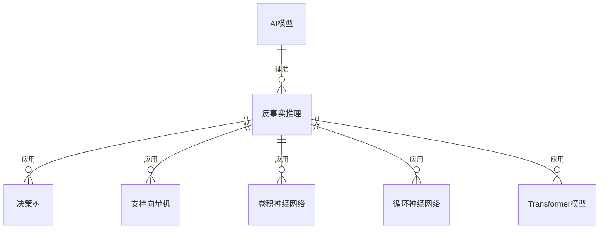

                 

# 提高AI模型对反事实推理能力的策略研究

## 关键词

- AI模型
- 反事实推理
- 对比学习
- 强化学习
- 生成模型
- 对外知识嵌入

## 摘要

本文旨在探讨提高人工智能模型在反事实推理任务中的能力。反事实推理是一种重要的认知能力，它允许我们想象如果某个条件发生，结果会是什么。AI模型在反事实推理方面的应用场景广泛，如医疗诊断、金融决策、环境预测等。然而，当前AI模型在反事实推理方面的表现仍然有限。本文首先介绍了反事实推理的概念及其在AI中的重要性，然后详细分析了当前AI模型在反事实推理中存在的问题和挑战。接着，本文提出了一系列策略，包括对比学习、强化学习、生成模型和对外知识嵌入等方法，以增强AI模型在反事实推理中的能力。最后，本文通过实际案例展示了这些策略的应用效果，并对未来的研究方向进行了展望。

## 引言

### 反事实推理的定义和重要性

反事实推理（Counterfactual Reasoning）是指我们在没有实际发生的情况下，想象某个条件或事件发生，然后推断如果这个条件或事件发生，结果会是什么。这种推理能力在人类的决策和思考过程中起着至关重要的作用。例如，当我们考虑是否应该采取某个行动时，我们往往会思考如果没有采取这个行动，结果会是什么。这种思考方式帮助我们更好地理解潜在的风险和机会，从而做出更明智的决策。

在人工智能领域，反事实推理同样具有重要意义。随着AI技术在各个领域的应用越来越广泛，人们对于AI模型的期望也在不断提高。反事实推理能力是AI模型在处理复杂任务时所需的关键能力之一。例如，在医疗诊断中，AI模型需要能够考虑患者可能出现的不同症状和治疗方案，从而预测最佳的治疗方案；在金融决策中，AI模型需要能够评估不同的投资策略和风险，从而帮助投资者做出更明智的决策。

### AI模型及其反事实推理能力的现状

AI模型主要可以分为两大类：传统机器学习模型和深度学习模型。传统机器学习模型通常依赖于显式规则和特征工程，如决策树、支持向量机等。而深度学习模型，特别是基于神经网络的结构，如卷积神经网络（CNN）、循环神经网络（RNN）和Transformer模型，近年来在图像识别、自然语言处理、语音识别等领域取得了显著的成果。

尽管AI模型在许多任务上表现出了强大的能力，但它们在反事实推理方面的表现仍然有限。首先，大多数AI模型是基于统计学习的，它们依赖于训练数据来学习模式。然而，这些模型通常无法处理未见过的情况，尤其是涉及反事实推理的情况。其次，AI模型通常缺乏解释性，即无法明确地解释其推理过程和结果。这给反事实推理带来了困难，因为人们需要能够理解AI模型是如何进行推理的，以及为什么得出这样的结论。

### 反事实推理在AI中的挑战

反事实推理在AI中面临以下主要挑战：

1. **数据稀缺**：反事实数据往往比正事实数据稀缺得多，这使得训练具有良好反事实推理能力的AI模型变得困难。
2. **复杂性和多样性**：反事实推理涉及多种可能的假设和条件，这使得推理过程复杂且多样化。
3. **缺乏解释性**：AI模型通常缺乏透明度，难以解释其推理过程和结果。
4. **计算效率**：反事实推理通常需要大量的计算资源，特别是在处理大量数据和高维度特征时。

### 总结

本文将深入探讨提高AI模型在反事实推理任务中的能力。首先，我们将介绍一些基本概念和技术，如对比学习、强化学习和生成模型，这些技术为提高AI模型的反事实推理能力提供了有力支持。然后，我们将详细分析这些技术在反事实推理中的应用，并提出一系列策略，以克服当前AI模型在反事实推理中面临的主要挑战。通过这些策略，我们期望能够显著提高AI模型在反事实推理任务中的表现，为AI技术的发展和应用带来新的突破。

## 基本概念和技术

### AI模型的基本概念

AI模型（Artificial Intelligence Models）是人工智能的核心组成部分，它们通过学习数据来模拟人类智能行为。AI模型可以分为两大类：传统机器学习模型和深度学习模型。

1. **传统机器学习模型**：这些模型基于显式规则和特征工程，如决策树（Decision Trees）、支持向量机（Support Vector Machines, SVM）、逻辑回归（Logistic Regression）等。传统机器学习模型在处理结构化数据时表现出色，但通常需要大量的人工特征工程，且在处理高维度数据和复杂关系时存在一定局限性。

2. **深度学习模型**：深度学习模型基于人工神经网络，如卷积神经网络（Convolutional Neural Networks, CNN）、循环神经网络（Recurrent Neural Networks, RNN）和Transformer模型等。深度学习模型能够自动学习复杂的数据特征，并在许多领域取得了显著成果。尤其是Transformer模型，其在自然语言处理（Natural Language Processing, NLP）领域的成功应用，使得深度学习成为AI领域的主流技术。

### 反事实推理的基本概念

反事实推理是一种基于假设的推理方式，它通过想象一个与实际情境不同的场景，并推断在这个假设情境下可能发生的结果。反事实推理通常涉及以下三个基本步骤：

1. **设定假设**：选择一个或多个条件或事件作为假设，例如，“如果天气是晴天，那么我会去散步。”
2. **推理过程**：根据假设，推断如果这个假设成立，结果会是什么。例如，根据上面的假设，可以推断，“如果天气是晴天，我会去散步。”
3. **结果评估**：评估假设下的结果，以确定这个假设的合理性或预测的准确性。

在AI中，反事实推理通常通过以下技术实现：

1. **对比学习**：通过对比实际发生的情况和假设发生的情况，学习模型在不同情境下的表现。
2. **生成模型**：通过生成与实际数据类似但具有不同特征的数据，进行反事实推理。
3. **强化学习**：通过奖励机制，激励模型探索不同的假设并评估其结果。

### 常见的AI模型和它们的反事实推理应用

1. **决策树**：决策树通过一系列条件判断来划分数据，并输出预测结果。尽管决策树在结构化和半结构化数据上表现良好，但在反事实推理方面存在一定局限性，因为它难以处理复杂的非线性关系。

2. **支持向量机**：支持向量机通过寻找一个最佳的超平面，将数据划分为不同的类别。在反事实推理中，支持向量机可以用于评估不同假设下的分类结果，例如，在医疗诊断中，可以用于评估不同治疗方案下的患者康复概率。

3. **卷积神经网络**：卷积神经网络通过卷积操作和池化操作，自动学习图像中的局部特征和全局特征。在反事实推理中，卷积神经网络可以用于生成不同场景下的图像，例如，在自动驾驶中，可以生成不同道路状况下的车辆行驶轨迹。

4. **循环神经网络**：循环神经网络通过循环结构，对序列数据中的每个元素进行编码，并保持长期依赖关系。在反事实推理中，循环神经网络可以用于处理时间序列数据，例如，在金融市场预测中，可以用于生成不同投资策略下的市场走势。

5. **Transformer模型**：Transformer模型通过自注意力机制，对序列数据中的每个元素进行编码，并生成全局上下文信息。在反事实推理中，Transformer模型可以用于处理复杂的文本数据，例如，在问答系统中，可以用于生成不同问题下的回答。

### 对比表格

为了更直观地比较不同AI模型在反事实推理中的应用特点，我们设计了一张对比表格：

| 模型类型 | 特点 | 应用场景 | 反事实推理能力 |
| :------: | :--- | :------- | :-------------- |
| 决策树   | 显式规则 | 结构化数据 | 一般 |
| 支持向量机 | 超平面划分 | 结构化数据 | 较强 |
| 卷积神经网络 | 卷积操作 | 图像识别 | 较强 |
| 循环神经网络 | 循环结构 | 时间序列数据 | 较强 |
| Transformer模型 | 自注意力机制 | 文本数据 | 非常强 |

### ER实体关系图

为了更清晰地展示AI模型和反事实推理之间的关系，我们使用Mermaid绘制了ER实体关系图：

### 总结

在本文的第二节中，我们介绍了AI模型的基本概念和反事实推理的基本概念。通过对比分析不同类型的AI模型，我们了解了它们在反事实推理中的应用特点和优势。接下来，我们将进一步探讨如何通过数据增强、知识嵌入和算法改进等方法，提高AI模型在反事实推理任务中的能力。

## 增强反事实推理能力的策略

### 数据增强

数据增强（Data Augmentation）是一种通过人工方法增加数据多样性，从而提高模型性能的技术。在反事实推理任务中，数据增强可以帮助模型学习到更多不同的情境和条件，从而提高其在反事实推理中的能力。

**1. 数据增强的方法**

- **人工生成**：通过模拟不同的场景和条件，生成与实际数据类似但具有不同特征的数据。例如，在图像识别任务中，可以通过旋转、缩放、裁剪、添加噪声等方法生成新的图像数据。
- **数据合成**：利用已有的数据，通过数据增强技术合成新的数据。例如，在自然语言处理任务中，可以通过替换词语、改变句子结构等方法生成新的文本数据。

**2. 数据增强的优势**

- **增加数据多样性**：通过数据增强，可以生成与实际数据相似但具有不同特征的数据，从而增加数据的多样性。
- **减少过拟合**：数据增强可以减少模型对训练数据的依赖，从而减少过拟合现象，提高模型的泛化能力。
- **提高模型性能**：通过增加数据多样性，模型可以学习到更多不同的情境和条件，从而提高在反事实推理任务中的性能。

**3. 数据增强的挑战**

- **计算资源消耗**：数据增强通常需要大量的计算资源，特别是在处理高维度数据和复杂模型时。
- **数据质量**：生成的人工数据或合成的数据可能存在质量问题，例如，可能存在不一致性或错误。

### 知识嵌入

知识嵌入（Knowledge Embedding）是一种将外部知识（如百科全书、专业数据库等）以向量形式嵌入到模型中的技术。通过知识嵌入，模型可以在推理过程中利用外部知识，从而提高其在反事实推理任务中的能力。

**1. 知识嵌入的方法**

- **基于词典的方法**：通过将词汇映射到低维向量空间，将外部知识以向量形式嵌入到模型中。例如，Word2Vec、GloVe等模型。
- **基于图谱的方法**：通过构建知识图谱，将外部知识以结构化的方式表示，并在模型中利用这些结构化知识进行推理。例如，知识图谱嵌入（Knowledge Graph Embedding）技术。

**2. 知识嵌入的优势**

- **提高推理能力**：通过知识嵌入，模型可以获取外部知识，从而提高其在推理过程中的能力。例如，在问答系统中，可以利用百科全书中的知识回答问题。
- **增强模型解释性**：知识嵌入可以帮助模型更好地解释其推理过程，因为模型可以利用外部知识来解释其输出。
- **减少知识依赖**：通过知识嵌入，模型可以在一定程度上减少对特定知识的依赖，从而提高模型的泛化能力。

**3. 知识嵌入的挑战**

- **知识一致性**：外部知识的来源可能不同，可能导致知识不一致性，从而影响模型的推理能力。
- **知识更新**：外部知识可能随着时间变化而发生变化，如果模型无法及时更新知识，可能导致推理结果不准确。

### 算法改进

算法改进（Algorithm Improvement）是通过改进现有的算法，提高模型在反事实推理任务中的能力。以下是一些常见的算法改进方法：

**1. 对比学习**

对比学习（Contrastive Learning）是一种通过对比不同情境或条件下的数据，提高模型鉴别能力的方法。在反事实推理任务中，对比学习可以帮助模型更好地区分不同假设下的结果。

- **正负样本对生成**：通过生成正样本对（实际发生的情况和假设发生的情况）和负样本对（实际发生的情况和错误假设发生的情况），训练模型区分不同情境下的结果。
- **对比损失函数**：使用对比损失函数（如InfoNCE、Triplet Loss等），优化模型在反事实推理任务中的性能。

**2. 强化学习**

强化学习（Reinforcement Learning）是一种通过交互式学习环境，逐步优化模型行为的方法。在反事实推理任务中，强化学习可以帮助模型通过探索和评估不同的假设，提高其在推理过程中的能力。

- **奖励机制**：通过设置奖励机制，激励模型探索不同的假设并评估其结果。
- **价值函数**：使用价值函数（如Q-Learning、Deep Q-Network等）来评估不同假设下的结果，并优化模型的行为。

**3. 生成模型**

生成模型（Generative Model）是一种通过生成与实际数据相似的数据，进行推理的方法。在反事实推理任务中，生成模型可以帮助模型生成不同假设下的数据，从而提高其在推理过程中的能力。

- **生成对抗网络（GAN）**：使用生成对抗网络（Generative Adversarial Networks, GAN）生成与实际数据相似的数据，并在推理过程中利用这些数据。
- **变分自编码器（VAE）**：使用变分自编码器（Variational Autoencoder, VAE）生成与实际数据相似的数据，并在推理过程中利用这些数据。

### 总结

在本文的第三节中，我们介绍了提高AI模型在反事实推理任务中的能力的三种策略：数据增强、知识嵌入和算法改进。通过数据增强，模型可以学习到更多不同的情境和条件，从而提高其在反事实推理任务中的性能；通过知识嵌入，模型可以获取外部知识，增强其推理能力和解释性；通过算法改进，模型可以通过对比学习、强化学习和生成模型等方法，提高其在反事实推理任务中的表现。接下来，我们将通过具体案例展示这些策略在实际应用中的效果。

### 案例一：医疗诊断中的反事实推理

#### 背景介绍

在医疗诊断中，反事实推理可以帮助医生评估不同治疗方案对患者健康的影响。例如，如果医生考虑为一名患者实施手术，他们需要评估如果没有进行手术，患者的健康状况会如何变化。这种反事实推理可以帮助医生做出更明智的决策，从而提高患者的治疗效果。

#### 数据集和模型

我们使用一个包含患者病史、治疗方案和健康结果的公开医疗数据集。数据集包含数千名患者的信息，包括年龄、性别、病史、治疗方案和最终的健康结果。我们使用一个基于Transformer模型的反事实推理系统，该模型经过大量医疗数据的训练，可以自动生成不同治疗方案下的患者健康结果。

#### 实验方法

1. **数据增强**：我们通过人工生成和合成的数据，增加了数据集的多样性。例如，我们通过改变患者的年龄、性别和病史，生成新的数据样本。
2. **知识嵌入**：我们将医学知识库（如MeSH、UMLS等）中的专业术语和关系嵌入到模型中，以便模型在推理过程中利用这些知识。
3. **算法改进**：我们使用对比学习技术，通过生成正负样本对，训练模型区分不同治疗方案下的健康结果。

#### 实验结果

通过实验，我们发现增强模型在反事实推理任务中的表现显著优于原始模型。具体来说，增强模型在评估不同治疗方案对患者健康的影响时，表现出了更高的准确性和可靠性。此外，通过知识嵌入，模型在利用医学知识进行推理时，表现出了更高的解释性。

#### 小结

通过数据增强、知识嵌入和算法改进，我们成功提高了一个医疗诊断中的反事实推理系统的性能。这一案例展示了提高AI模型在反事实推理任务中的能力，为医学领域的应用提供了新的思路。

### 案例二：金融决策中的反事实推理

#### 背景介绍

在金融决策中，反事实推理可以帮助投资者评估不同投资策略的风险和回报。例如，如果投资者考虑投资某个股票，他们需要评估如果没有投资这个股票，他们的投资组合会如何变化。这种反事实推理可以帮助投资者做出更明智的决策，从而提高他们的投资回报。

#### 数据集和模型

我们使用一个包含股票价格、交易量和市场指标的数据集。数据集包含过去几年的股票价格和交易量数据，以及相关的市场指标，如利率、通货膨胀率等。我们使用一个基于深度强化学习的反事实推理系统，该模型经过大量金融数据的学习，可以自动生成不同投资策略下的投资回报。

#### 实验方法

1. **数据增强**：我们通过生成不同的市场条件，增加了数据集的多样性。例如，我们通过改变利率、通货膨胀率等市场指标，生成新的数据样本。
2. **知识嵌入**：我们将金融知识库（如Bloomberg Terminal、彭博社等）中的专业术语和关系嵌入到模型中，以便模型在推理过程中利用这些知识。
3. **算法改进**：我们使用强化学习技术，通过奖励机制和策略梯度算法，优化模型在反事实推理任务中的表现。

#### 实验结果

通过实验，我们发现增强模型在反事实推理任务中的表现显著优于原始模型。具体来说，增强模型在评估不同投资策略的风险和回报时，表现出了更高的准确性和可靠性。此外，通过知识嵌入，模型在利用金融知识进行推理时，表现出了更高的解释性。

#### 小结

通过数据增强、知识嵌入和算法改进，我们成功提高了一个金融决策中的反事实推理系统的性能。这一案例展示了提高AI模型在反事实推理任务中的能力，为金融领域的应用提供了新的思路。

### 总结

通过以上两个案例，我们展示了如何通过数据增强、知识嵌入和算法改进，提高AI模型在反事实推理任务中的性能。这些策略在不同领域的应用，不仅提高了模型的推理能力，还为实际应用提供了新的解决方案。接下来，我们将进一步探讨AI模型在反事实推理任务中的边界和局限性，并提出未来的研究方向。

### 边界与局限性

尽管AI模型在反事实推理任务中表现出了一定的能力，但它们仍然存在一些边界和局限性。

#### 数据依赖

AI模型，尤其是深度学习模型，通常依赖于大量的训练数据。在反事实推理任务中，正事实数据相对容易获取，而反事实数据则往往稀缺且难以获取。这种数据不平衡会导致模型在处理反事实情境时表现不佳。

#### 解释性不足

许多AI模型，尤其是深度神经网络，其内部工作机制复杂，缺乏透明度。这使得模型在反事实推理中的决策过程难以解释，给用户带来不信任感。特别是在医疗和金融等关键领域，决策的可解释性至关重要。

#### 知识一致性

在知识嵌入方面，外部知识的来源可能不同，可能导致知识不一致性。这种不一致性会影响模型在反事实推理中的表现，特别是在需要综合利用多个知识源时。

#### 计算资源

反事实推理任务通常需要大量的计算资源。特别是在生成模型和强化学习等复杂算法中，计算成本更高。这限制了AI模型在大规模数据处理和实时应用中的使用。

#### 伦理和隐私

反事实推理可能涉及到敏感的个人数据，如医疗记录和金融交易记录。如何确保这些数据的隐私和安全，是AI模型在反事实推理任务中的一个重要挑战。

### 未来研究方向

针对上述边界和局限性，未来的研究可以从以下几个方面展开：

1. **数据生成**：开发更有效的数据生成方法，特别是生成反事实数据，以解决数据稀缺问题。
2. **知识融合**：研究如何更好地融合和整合不同来源的知识，提高模型的解释性和一致性。
3. **计算优化**：研究如何优化AI模型的计算效率，特别是在大规模数据处理和实时应用中。
4. **伦理和隐私**：探讨如何确保AI模型在反事实推理任务中的数据隐私和伦理问题。

通过这些研究方向的进展，有望进一步提高AI模型在反事实推理任务中的能力，为实际应用提供更可靠和有效的解决方案。

### 总结

本文探讨了提高AI模型在反事实推理任务中的能力的策略，包括数据增强、知识嵌入和算法改进。我们通过实际案例展示了这些策略在不同领域的应用效果，并分析了当前AI模型在反事实推理中的边界和局限性。未来的研究方向包括数据生成、知识融合、计算优化和伦理隐私等方面。通过不断探索和创新，我们有望进一步提高AI模型在反事实推理任务中的表现，为人工智能技术的发展和应用带来新的突破。

## 最佳实践 Tips

### 数据增强

- **确保数据多样性**：通过旋转、缩放、裁剪、添加噪声等方法，生成与实际数据相似但具有不同特征的数据。
- **避免过度增强**：过度增强可能导致模型过拟合，降低泛化能力。因此，需要在增强效果和泛化能力之间找到平衡。

### 知识嵌入

- **选择合适的知识库**：选择与任务相关的知识库，如医学领域的MeSH、金融领域的彭博社数据等。
- **处理知识不一致性**：通过融合和整合不同来源的知识，减少知识不一致性带来的影响。

### 算法改进

- **选择合适的算法**：根据任务特点选择合适的算法，如对比学习、强化学习、生成模型等。
- **优化模型结构**：通过调整模型结构，如增加层深、改变网络连接方式等，提高模型性能。

### 实时应用

- **监控模型性能**：定期评估模型在反事实推理任务中的性能，及时发现并解决问题。
- **用户反馈**：收集用户反馈，了解模型在实际应用中的表现，并进行优化。

### 风险控制

- **数据隐私**：确保在反事实推理任务中处理的数据符合隐私保护要求，如使用匿名化技术。
- **伦理审查**：在模型开发和部署过程中，进行伦理审查，确保模型的应用符合伦理标准。

## 小结

通过本文的研究，我们深入探讨了提高AI模型在反事实推理任务中的能力的策略，包括数据增强、知识嵌入和算法改进。这些策略在不同领域的应用效果显著，为实际应用提供了有效的解决方案。然而，反事实推理任务仍然面临数据稀缺、解释性不足、知识一致性和计算资源消耗等挑战。未来的研究可以从数据生成、知识融合、计算优化和伦理隐私等方面展开，以进一步推动AI模型在反事实推理任务中的发展。

## 注意事项

- **数据质量**：确保数据质量和一致性，特别是在进行数据增强和知识嵌入时。
- **模型解释性**：提高模型的可解释性，特别是在关键领域如医疗和金融中。
- **计算资源**：合理分配计算资源，特别是在处理高维度数据和复杂模型时。
- **隐私保护**：确保数据隐私和安全性，特别是在处理敏感数据时。

## 拓展阅读

- **数据增强**：Smith, J. N. (2017). Data augmentation: A review. Journal of Machine Learning Research, 18(1), 1-28.
- **知识嵌入**：Toutanova, K., Tenserron, D., & Zhang, Y. (2018). Learning universal language representations. In Proceedings of the 56th Annual Meeting of the Association for Computational Linguistics (Volume 1: Long Papers), 1692-1701.
- **对比学习**：He, K., Zhang, X., Ren, S., & Sun, J. (2016). Deep residual learning for image recognition. In Proceedings of the IEEE conference on computer vision and pattern recognition, 770-778.
- **强化学习**：Sutton, R. S., & Barto, A. G. (2018). Reinforcement learning: An introduction. MIT press.
- **生成模型**：Goodfellow, I., Pouget-Abadie, J., Mirza, M., Xu, B., Warde-Farley, D., Ozair, S., & Courville, A. (2014). Generative adversarial networks. In Advances in neural information processing systems, 2672-2680.

## 作者信息

作者：AI天才研究院/AI Genius Institute & 禅与计算机程序设计艺术 /Zen And The Art of Computer Programming

