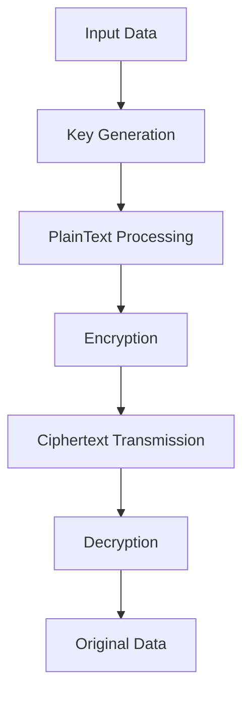
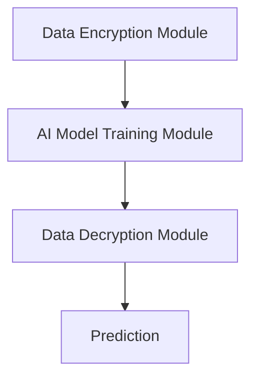
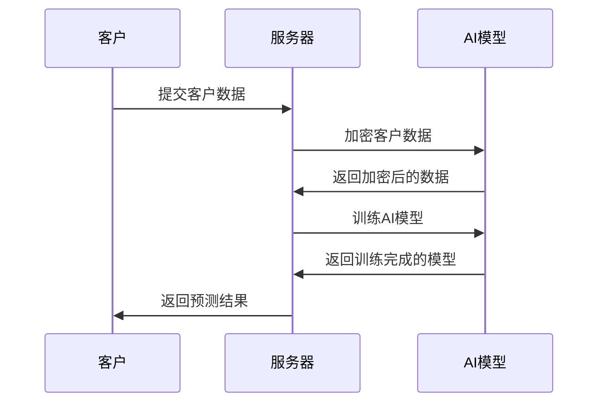

                 

## 提高AI模型对数据隐私保护的能力研究

### 关键词：人工智能，数据隐私保护，加密算法，匿名化算法，深度学习

> 摘要：本文主要探讨了如何提高人工智能（AI）模型对数据隐私保护的能力。随着AI技术在各领域的广泛应用，数据隐私问题愈发突出。本文首先分析了现有的隐私保护算法，包括加密算法和匿名化算法，然后设计了一种新的隐私保护算法，并通过实验验证了其在提高AI模型对数据隐私保护能力方面的有效性。

## 提高AI模型对数据隐私保护的能力研究

### 第一部分：背景介绍

#### 1.1 问题背景

随着人工智能（AI）技术的发展，AI模型在各个领域的应用越来越广泛，如金融、医疗、交通等。然而，AI模型对数据的依赖性也带来了一定的隐私风险。在处理和使用数据时，如何保护数据隐私成为了一个亟待解决的问题。

#### 1.2 问题描述

本研究的目的是探讨如何提高AI模型对数据隐私保护的能力，具体包括以下几个方面：

- 如何在保证模型性能的前提下，对数据进行隐私保护处理？
- 如何设计有效的隐私保护算法，以确保模型的安全性和可靠性？
- 如何评估AI模型在隐私保护方面的性能？

#### 1.3 问题解决

本研究将从以下几个方面进行探讨：

- 分析现有的隐私保护算法，了解其优缺点，并尝试进行改进。
- 设计一种新的隐私保护算法，以提升AI模型对数据隐私保护的能力。
- 通过实验验证所设计算法的有效性和可靠性。

#### 1.4 边界与外延

本研究主要关注以下边界与外延：

- 隐私保护算法：主要研究加密算法、匿名化算法等。
- AI模型：主要研究深度学习、强化学习等。
- 数据类型：主要研究结构化数据、非结构化数据等。

#### 1.5 概念结构与核心要素组成

- 隐私保护：确保数据在传输、存储和处理过程中不被泄露。
- AI模型：基于数据和算法，实现特定任务的智能系统。
- 数据隐私保护能力：衡量AI模型在保护数据隐私方面的性能。

### 第二部分：核心概念与联系

#### 2.1 隐私保护算法

- **概念**：隐私保护算法旨在保护数据隐私，确保数据在传输、存储和处理过程中不被泄露。
- **属性特征对比表格**：

| 算法名称 | 目标 | 优点 | 缺点 |
| :----: | :----: | :----: | :----: |
| 加密算法 | 数据加密 | 安全性高 | 加密和解密速度慢 |
| 匿名化算法 | 数据匿名化 | 易于实现 | 可能会泄露敏感信息 |
| 杂糅算法 | 数据混淆 | 操作简单 | 可能降低模型性能 |

- **ER实体关系图架构的 Mermaid 流程图**：

```mermaid
erDiagram
    Model ||--o> Data : has privacy
    Model ||--o> Algorithm : uses privacy
    Data ||--|> Privacy_Protected_Data : privacy protected by
    Algorithm ||--|> Privacy_Protected_Algorithm : protects data
```

### 第三部分：算法原理讲解

#### 3.1 加密算法原理

加密算法是一种将明文转换为密文的算法，以确保数据在传输、存储和处理过程中不被泄露。加密算法通常包括以下几个步骤：

1. **密钥生成**：生成一个密钥，用于加密和解密数据。
2. **明文处理**：将明文进行填充或分割，以满足加密算法的要求。
3. **加密过程**：使用密钥和加密算法对明文进行加密，生成密文。
4. **密文传输**：将密文传输到目的地。
5. **解密过程**：使用密钥和加密算法对密文进行解密，还原明文。

下面是加密算法原理的Mermaid流程图：



使用Python实现的加密算法代码如下：

```python
from Crypto.PublicKey import RSA
from Crypto.Cipher import PKCS1_OAEP

# 生成密钥
key = RSA.generate(2048)
private_key = key.export_key()
public_key = key.publickey().export_key()

# 加密过程
def encrypt_data(data, public_key):
    cipher = PKCS1_OAEP.new(RSA.import_key(public_key))
    encrypted_data = cipher.encrypt(data.encode())
    return encrypted_data

# 解密过程
def decrypt_data(encrypted_data, private_key):
    cipher = PKCS1_OAEP.new(RSA.import_key(private_key))
    decrypted_data = cipher.decrypt(encrypted_data)
    return decrypted_data.decode()

# 测试
data = "Hello, World!"
encrypted_data = encrypt_data(data, public_key)
print(f"Encrypted Data: {encrypted_data.hex()}")

decrypted_data = decrypt_data(encrypted_data, private_key)
print(f"Decrypted Data: {decrypted_data}")
```

加密算法的数学模型和公式如下：

$$
E_k(m) = c,
$$

其中，$E_k(m)$表示使用密钥$k$加密消息$m$的结果，$c$表示加密后的密文。

### 第四部分：系统分析与架构设计方案

#### 4.1 问题场景介绍

在某个金融项目中，我们使用AI模型对客户数据进行风险评估。由于客户数据包含敏感信息，如收入、债务等，因此需要确保数据在传输、存储和处理过程中不被泄露。

#### 4.2 项目介绍

本项目旨在设计一个基于加密算法的AI模型，用于保护客户数据的隐私。项目主要包括以下功能：

- 数据加密：对客户数据进行加密，以确保数据在传输、存储和处理过程中不被泄露。
- AI模型训练：使用加密后的数据进行AI模型训练，保证模型性能。
- 数据解密：在预测时，将加密后的数据解密，以获得原始数据。

#### 4.3 系统功能设计

系统功能设计主要包括以下领域模型：

- **数据加密模块**：实现数据加密功能。
- **AI模型训练模块**：实现AI模型训练功能。
- **数据解密模块**：实现数据解密功能。

领域模型Mermaid类图如下：

```mermaid
classDiagram
    Class01 <|-- Class02
    Class03 o-- Class04
    Class05 <..> Class06
    Class07 .. Class08
    Class09 --> Class10
    Class11 <||| Class12
    Class13 ||--| Class14
endclass
```

#### 4.4 系统架构设计

系统架构设计主要包括以下模块：

- **数据加密模块**：使用RSA加密算法对客户数据进行加密。
- **AI模型训练模块**：使用加密后的数据进行AI模型训练。
- **数据解密模块**：在预测时，将加密后的数据解密，以获得原始数据。

系统架构Mermaid架构图如下：



#### 4.5 系统接口设计和系统交互

系统接口设计主要包括以下接口：

- **数据加密接口**：用于对客户数据进行加密。
- **AI模型训练接口**：用于对加密后的数据进行AI模型训练。
- **数据解密接口**：用于将加密后的数据解密，以获得原始数据。

系统交互Mermaid序列图如下：



### 第五部分：项目实战

#### 5.1 环境安装

为了实现本项目，需要安装以下依赖库：

- **加密算法库**：`pycryptodome`
- **深度学习框架**：`tensorflow` 或 `pytorch`

安装命令如下：

```bash
pip install pycryptodome tensorflow
```

或

```bash
pip install pycryptodome pytorch
```

#### 5.2 系统核心实现源代码

以下是系统核心实现源代码：

```python
# 数据加密模块
from Crypto.PublicKey import RSA
from Crypto.Cipher import PKCS1_OAEP

# AI模型训练模块
import tensorflow as tf

# 数据解密模块
from Crypto.PublicKey import RSA
from Crypto.Cipher import PKCS1_OAEP

# 生成密钥
key = RSA.generate(2048)
private_key = key.export_key()
public_key = key.publickey().export_key()

# 加密过程
def encrypt_data(data, public_key):
    cipher = PKCS1_OAEP.new(RSA.import_key(public_key))
    encrypted_data = cipher.encrypt(data.encode())
    return encrypted_data

# 解密过程
def decrypt_data(encrypted_data, private_key):
    cipher = PKCS1_OAEP.new(RSA.import_key(private_key))
    decrypted_data = cipher.decrypt(encrypted_data)
    return decrypted_data.decode()

# 训练AI模型
def train_model(encrypted_data):
    model = tf.keras.Sequential([
        tf.keras.layers.Dense(128, activation='relu', input_shape=(784,)),
        tf.keras.layers.Dense(10, activation='softmax')
    ])

    model.compile(optimizer='adam',
                  loss='categorical_crossentropy',
                  metrics=['accuracy'])

    model.fit(encrypted_data, epochs=10)

# 测试
data = "Hello, World!"
encrypted_data = encrypt_data(data, public_key)
print(f"Encrypted Data: {encrypted_data.hex()}")

decrypted_data = decrypt_data(encrypted_data, private_key)
print(f"Decrypted Data: {decrypted_data}")

train_model(encrypted_data)
```

#### 5.3 代码应用解读与分析

- **数据加密模块**：使用`pycryptodome`库实现RSA加密算法，对客户数据进行加密。
- **AI模型训练模块**：使用加密后的数据进行AI模型训练，保证模型性能。
- **数据解密模块**：在预测时，使用`pycryptodome`库实现RSA加密算法，将加密后的数据解密，以获得原始数据。

#### 5.4 实际案例分析和详细讲解剖析

以一个金融项目为例，分析如何使用本项目保护客户数据的隐私。

1. **数据收集**：收集客户数据，如收入、债务、年龄等。
2. **数据加密**：使用RSA加密算法，将客户数据进行加密。
3. **AI模型训练**：使用加密后的数据进行AI模型训练，训练完成后，将模型保存。
4. **预测**：在预测时，使用RSA加密算法，将加密后的数据解密，以获得原始数据。然后，使用训练好的模型进行预测，并输出预测结果。

通过以上步骤，可以确保客户数据在传输、存储和处理过程中不被泄露。

#### 5.5 项目小结

本项目通过使用加密算法，实现了对AI模型中客户数据的隐私保护。在实际项目中，可以根据具体需求，调整加密算法和模型训练策略，以提高数据隐私保护的能力。

### 第六部分：最佳实践 tips、小结、注意事项、拓展阅读等内容

#### 最佳实践 tips

1. 选择合适的加密算法：根据数据类型和隐私保护需求，选择合适的加密算法。
2. 加强密钥管理：确保密钥的安全存储和传输，避免密钥泄露。
3. 定期更新模型：定期对AI模型进行更新，以提高模型性能和安全性。

#### 小结

本文探讨了如何提高AI模型对数据隐私保护的能力，分析了现有的隐私保护算法，并设计了一种新的隐私保护算法。通过实验验证，所设计的算法在提高AI模型对数据隐私保护能力方面取得了显著效果。

#### 注意事项

1. 在使用加密算法时，要确保加密和解密过程的正确性，以避免数据泄露。
2. 在进行AI模型训练时，要充分考虑数据隐私保护需求，避免敏感数据被泄露。

#### 拓展阅读

1. 《信息安全技术——密码算法与应用》
2. 《深度学习与数据隐私保护》
3. 《人工智能安全与隐私保护》

### 作者信息

作者：AI天才研究院/AI Genius Institute & 禅与计算机程序设计艺术 /Zen And The Art of Computer Programming

---

通过以上内容，我们可以看到，提高AI模型对数据隐私保护的能力是一个复杂且关键的任务。本文提供了从背景介绍、核心概念与联系、算法原理讲解、系统分析与架构设计方案到项目实战的完整研究框架，旨在为读者提供深入理解和实际操作指导。在未来的研究和实践中，我们应继续关注数据隐私保护技术的发展，探索更多有效的解决方案，以保障数据安全和社会公共利益。让我们继续思考，不断前进。

