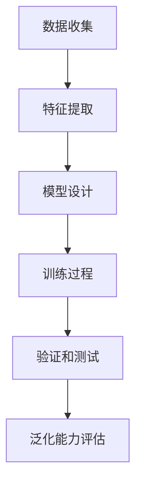
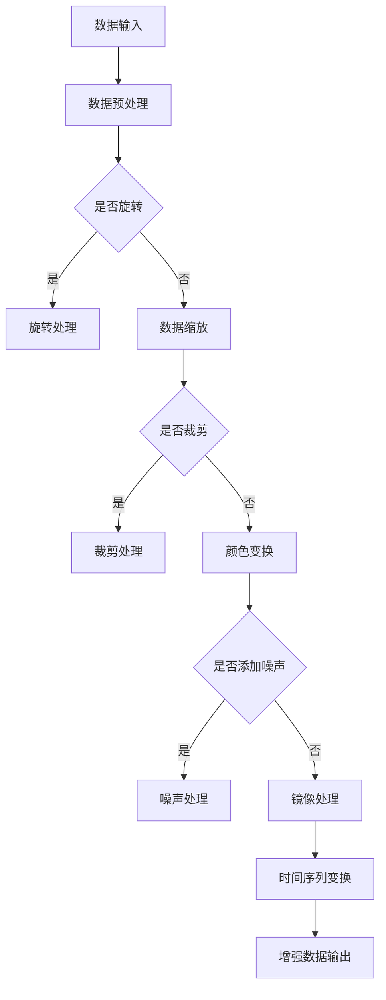
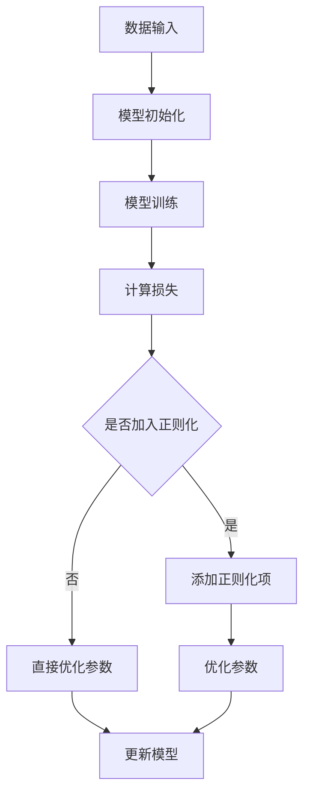
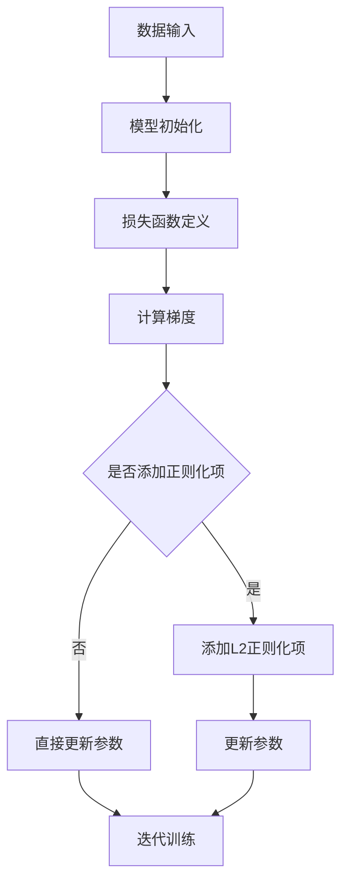
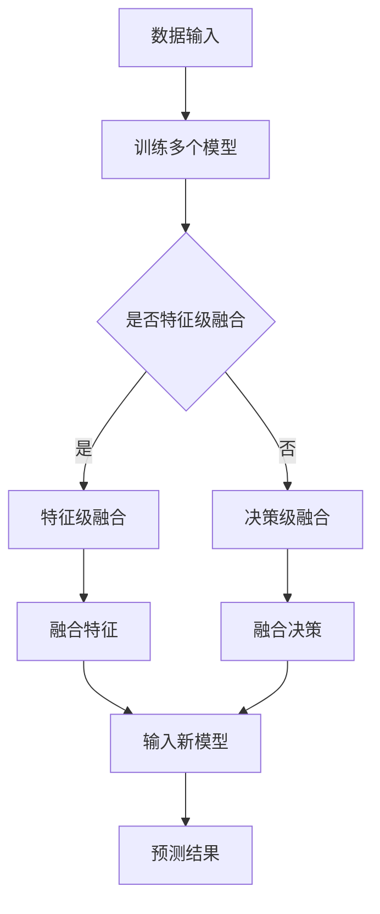
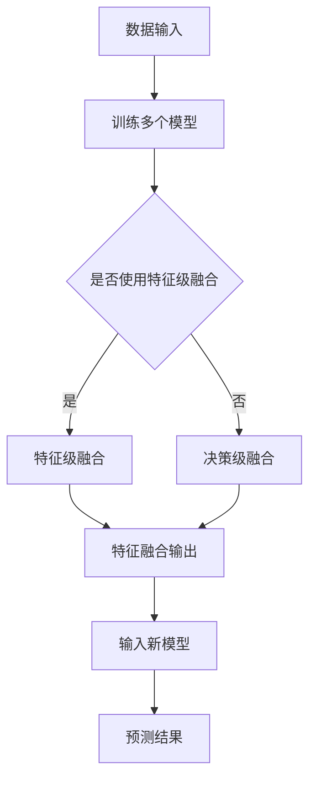
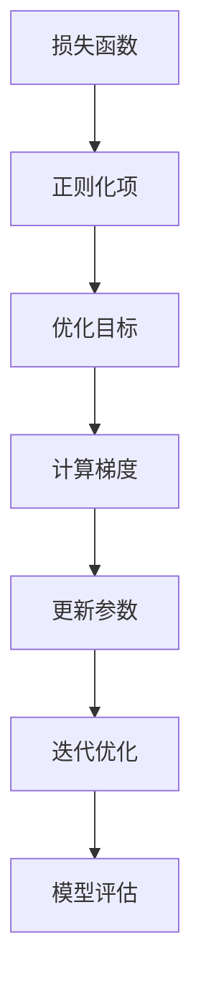
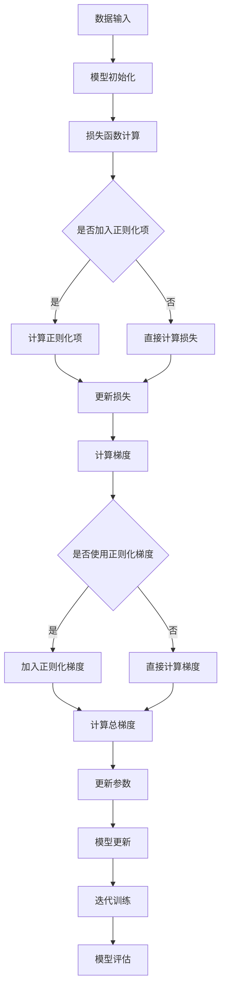
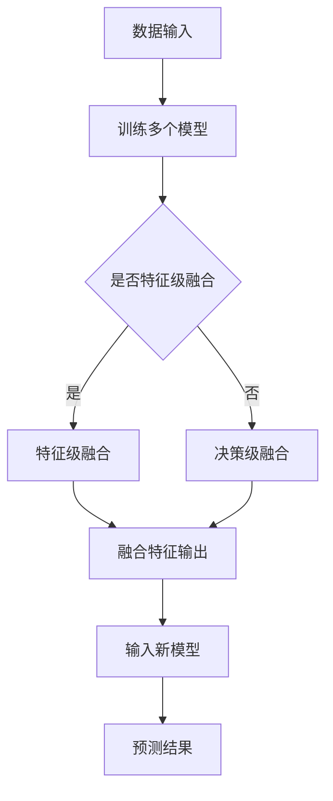

                 

### 第1章：问题背景与概述

#### 1.1 人工智能模型泛化的意义

在当今世界，人工智能（AI）技术的快速发展已经深刻地改变了我们的生活方式和工作方式。从自动驾驶汽车到智能语音助手，AI的应用几乎无处不在。然而，随着AI技术的广泛应用，一个重要的问题逐渐凸显出来：如何确保AI模型在新的、未见过的数据上能够表现良好，即AI模型的泛化能力。

**泛化**，在机器学习的语境下，指的是模型能够从训练数据中学习到的知识推广到训练集之外的数据。一个泛化能力强的模型，不仅在训练集上有很好的表现，而且在面对新的、未知的数据时，也能够保持较高的准确性。相反，泛化能力弱的模型，可能会在训练集上表现出色，但一旦遇到新数据，其性能就会显著下降。

泛化能力对于AI模型至关重要。在实际应用中，我们无法仅仅依赖有限的训练数据来构建模型。真实世界的数据往往是动态变化的，并且新的、未预见的模式会不断出现。如果模型无法在这些新数据上表现良好，那么它的实用性将大打折扣。因此，提高AI模型的泛化能力，是当前机器学习领域的一项核心任务。

#### 1.1.2 当前AI模型泛化能力的现状

尽管近年来机器学习领域取得了长足的进步，但AI模型的泛化能力依然面临诸多挑战。首先，很多模型在训练集上表现优异，但在测试集上的性能却远不及预期。这种现象被称为“过拟合”（Overfitting），即模型在训练数据上过度学习，导致无法推广到新的数据。

其次，AI模型的泛化能力在不同领域和任务中表现差异较大。例如，在计算机视觉任务中，模型的泛化能力相对较强；而在自然语言处理和语音识别等任务中，泛化能力则相对较弱。

此外，一些研究表明，当前的一些先进模型，如深度神经网络，在某些特定任务上已经达到了人类水平，但它们的泛化能力依然有待提高。

#### 1.1.3 泛化能力不足带来的挑战

泛化能力不足不仅限制了AI模型的实际应用范围，还带来了以下几个方面的挑战：

1. **可靠性和稳定性**：泛化能力不足的模型在遇到新数据时，其性能可能大幅下降，导致结果不可靠或不稳定。
2. **可解释性**：泛化能力弱的模型往往难以解释其决策过程，这增加了AI系统的复杂性和不确定性。
3. **公平性**：在某些应用场景中，如金融、医疗等，泛化能力不足可能会导致模型在某些特定群体上的表现不佳，甚至造成不公平。

为了应对这些挑战，提高AI模型的泛化能力已成为学术界和工业界共同追求的目标。接下来的章节中，我们将深入探讨AI模型泛化的核心概念、原理以及提升方法，以期为这一重要领域的发展提供一些有益的思路。### 1.1.1 人工智能模型泛化的意义

**人工智能模型泛化**，是机器学习领域中的一个核心概念，其重要性不言而喻。首先，泛化能力决定了模型在现实世界中的实用性和可靠性。一个泛化能力强的模型，不仅能在训练数据上表现出色，更重要的是，它能够在面对新的、未见过的数据时，依然能够保持较高的准确性和鲁棒性。

在机器学习过程中，我们通常将训练数据视为已知的世界，而测试数据则代表了未知的世界。一个良好的泛化能力意味着模型能够在未知的世界中，以相似的方式表现，这不仅仅是对模型的期望，更是其在实际应用中必须具备的素质。

具体来说，泛化能力对人工智能模型的意义主要体现在以下几个方面：

1. **增强模型的可迁移性**：泛化能力强的模型，可以在不同的任务和数据集上表现良好，从而提高模型的可迁移性。这意味着，我们可以将同一个模型应用于多种不同的场景，而不必为每个特定任务重新设计和训练模型。

2. **提升模型的泛用性**：泛化能力使模型能够适应多样化的输入数据，从而在更广泛的领域中发挥作用。例如，一个在医疗图像识别中表现良好的模型，可能同样适用于金融风险评估或自动驾驶系统。

3. **降低数据需求**：泛化能力强的模型，对训练数据的依赖性较低。这意味着，我们可以使用更少的数据来训练模型，从而降低数据收集和标注的成本。

4. **提高模型的可解释性**：泛化能力强的模型，通常在未见过的数据上也能保持良好的性能，这有助于提高模型的可解释性。通过理解模型在未见过的数据上的表现，我们可以更好地理解模型的决策过程，从而增强模型的可信度。

然而，需要注意的是，尽管泛化能力对人工智能模型至关重要，但并不是所有的模型都具备良好的泛化能力。很多模型在训练集上表现优秀，但在测试集上的表现却远不如预期。这种现象被称为“过拟合”（Overfitting），即模型在训练数据上过度学习，导致无法推广到新的数据。

为了解决过拟合问题，提高模型的泛化能力，研究人员提出了多种方法，包括数据增强、模型正则化、模型融合等。这些方法的核心思想是，通过调整模型的学习方式，使其在训练过程中不仅关注训练数据的细节，还能捕捉到更广泛、更一般化的规律。

总之，泛化能力是人工智能模型的核心竞争力之一。提升模型的泛化能力，不仅有助于模型在更广泛的应用场景中发挥作用，还能降低模型的复杂性，提高其可解释性和可靠性。在接下来的章节中，我们将深入探讨AI模型泛化的核心概念、评价指标以及影响因素，以期为这一重要领域的发展提供更深入的思考。### 1.1.2 当前AI模型泛化能力的现状

在当前的人工智能领域，尽管模型的性能在不断提高，但AI模型的泛化能力依然面临诸多挑战。以下是对当前AI模型泛化能力现状的详细探讨。

#### 1.1.2.1 过拟合问题

首先，过拟合（Overfitting）是一个广泛存在的问题。过拟合指的是模型在训练集上表现优异，但在测试集上的表现却远不如预期。这种现象通常发生在模型对训练数据中的噪声和细节进行了过度学习，导致模型无法推广到未见过的数据。

过拟合的原因主要包括以下几点：

1. **训练数据不足**：当训练数据量不足时，模型容易对训练数据中的噪声和异常值进行过度拟合。
2. **模型复杂度过高**：高复杂度的模型能够捕捉到更多的细节，但这也增加了过拟合的风险。
3. **训练时间过长**：训练时间过长可能导致模型在学习过程中过度关注训练数据，从而忽略了对泛化能力的培养。

为了缓解过拟合问题，研究人员提出了一系列方法，包括正则化（Regularization）、交叉验证（Cross-Validation）、集成方法（Ensemble Methods）等。这些方法的核心思想是通过限制模型复杂度或引入外部验证机制，来降低模型对训练数据的依赖，从而提高泛化能力。

#### 1.1.2.2 不同领域和任务的差异

AI模型的泛化能力在不同领域和任务中的表现存在显著差异。例如，在计算机视觉领域，一些深度学习模型如卷积神经网络（CNN）已经达到了非常高的精度，但在自然语言处理（NLP）和语音识别等领域，模型的泛化能力相对较弱。

这种差异主要源于以下几个因素：

1. **数据分布**：不同领域的数据分布差异较大，可能导致模型在特定领域上的泛化能力较差。例如，医疗图像数据与自然语言文本数据在分布上存在较大差异，这可能导致模型在未见过的数据上表现不佳。
2. **任务复杂性**：一些任务如自动驾驶和医疗诊断，由于涉及的因素复杂，模型的泛化能力较低。
3. **数据标注**：在自然语言处理等领域，数据标注的质量和一致性对模型的泛化能力有重要影响。标注的不准确或缺失可能导致模型无法正确学习。

#### 1.1.2.3 先进模型的泛化能力

近年来，一些先进模型如Transformer和BERT在特定任务上取得了显著突破，但它们的泛化能力依然有待提高。尽管这些模型在训练数据上表现优异，但在测试集上的泛化能力仍存在一定局限性。

这种局限性主要体现在以下几个方面：

1. **领域适应性**：尽管Transformer和BERT等模型在特定任务上表现优异，但它们在处理不同领域的数据时，泛化能力有所下降。
2. **长文本处理**：对于长文本处理任务，Transformer和BERT等模型在泛化能力方面存在一定的挑战。
3. **多模态数据**：在处理多模态数据时，模型的泛化能力可能受到限制，因为不同模态的数据在分布上存在差异。

总的来说，当前AI模型的泛化能力仍然面临诸多挑战。为了提高模型的泛化能力，研究人员需要从数据、模型结构、训练方法等多个方面进行深入探索。接下来，我们将继续探讨AI模型泛化的核心概念、评价指标以及影响因素，以期为这一重要领域的发展提供更深入的思考。### 1.1.3 泛化能力不足带来的挑战

AI模型泛化能力不足带来的挑战是多方面的，不仅影响了模型的应用效果，还可能对实际业务产生负面影响。以下是一些主要的挑战：

#### 1.1.3.1 可靠性和稳定性

泛化能力不足的模型，在面对新的、未见过的数据时，其性能可能会大幅下降，导致结果不可靠或不稳定。例如，在医疗诊断中，一个泛化能力差的模型可能会在诊断新病例时产生错误的结论，从而导致严重的医疗事故。在自动驾驶领域，泛化能力不足可能导致车辆无法正确识别复杂的交通场景，增加交通事故的风险。

#### 1.1.3.2 可解释性

泛化能力不足的模型，其决策过程往往难以解释。这增加了AI系统的复杂性和不确定性，使得用户难以信任模型的结果。例如，一个在训练数据上表现优异但在新数据上表现不佳的模型，其决策依据可能包含了训练数据中的噪声和异常值，导致用户无法理解模型的决策过程。

#### 1.1.3.3 公平性

在某些应用场景中，如金融、医疗等领域，泛化能力不足可能会导致模型在某些特定群体上的表现不佳，甚至造成不公平。例如，一个在特定种族或性别上泛化能力不足的模型，可能会对某些群体产生歧视性决策，从而导致不公平的结果。

#### 1.1.3.4 应用范围限制

泛化能力不足的模型，其应用范围受到很大限制。这意味着，即使在某些特定任务上表现优异的模型，也可能无法在其他任务中发挥作用。例如，一个在图像识别中表现良好的模型，可能无法在自然语言处理或语音识别中发挥同样的效果。

#### 1.1.3.5 成本和效率

泛化能力不足的模型，可能需要更多的训练数据和计算资源来提高其性能。这增加了模型开发和部署的成本，同时也降低了系统的效率。例如，在金融风险评估中，一个泛化能力差的模型可能需要更多的历史数据和计算资源来提高其准确性，从而增加了业务成本。

综上所述，AI模型泛化能力不足带来的挑战是多方面的，这些问题不仅限制了模型的应用效果，还对实际业务产生了负面影响。因此，提高AI模型的泛化能力，是当前机器学习领域的一项重要任务，也是实现人工智能技术广泛应用的关键。### 1.2 AI模型泛化的定义

**AI模型泛化**，是指模型在训练数据上学习到的知识，能够推广到训练集之外的数据，以应对新的、未见过的输入。在机器学习领域，泛化能力是衡量模型性能的重要指标，它决定了模型在实际应用中的实用性和可靠性。

具体来说，AI模型泛化包括以下几个层次：

1. **同域泛化（In-Domain Generalization）**：模型在一个特定领域内，对未见过的数据表现良好的能力。例如，一个在医疗图像识别中训练的模型，能够对新的医疗图像进行准确识别。
2. **跨域泛化（Cross-Domain Generalization）**：模型在不同领域之间表现良好的能力。例如，一个在自然语言处理中训练的模型，能够对新的视觉数据或音频数据进行处理。
3. **异构泛化（Heterogeneous Generalization）**：模型在面对不同类型的数据（如文本、图像、音频等）表现良好的能力。例如，一个在多模态数据上训练的模型，能够同时处理文本和图像数据。

泛化的基本概念可以概括为模型从特定情境（训练数据）推广到一般情境（未见过的数据）的能力。在机器学习中，泛化能力是实现模型实际应用的关键。一个泛化能力强的模型，不仅能够在训练数据上表现良好，更重要的是，它能够在面对新的、未知的数据时，依然能够保持较高的准确性。

泛化能力的重要性体现在多个方面：

1. **实际应用**：泛化能力强的模型，能够适应多样化的场景和数据，从而在更广泛的应用中发挥作用。
2. **降低成本**：泛化能力强的模型，对训练数据的依赖性较低，从而可以降低数据收集和标注的成本。
3. **提高可靠性**：泛化能力强的模型，在面对新数据时，能够保持稳定的性能，从而提高系统的可靠性和稳定性。
4. **可解释性**：泛化能力强的模型，通常在未见过的数据上也能保持良好的性能，这有助于提高模型的可解释性。

总之，AI模型泛化是机器学习领域的一个重要研究方向，它不仅关乎模型的性能和实用性，还涉及到模型的可靠性、可解释性以及在实际应用中的广泛适用性。在接下来的章节中，我们将深入探讨泛化能力的评价指标和影响因素，以期为提高模型泛化能力提供更有针对性的方法。### 1.3 泛化能力的评价指标

在评估AI模型的泛化能力时，我们需要依赖一系列评价指标，这些指标能够量化模型在未见过的数据上的表现。以下是一些常见的泛化能力评价指标：

#### 1.3.1 测试集准确率（Test Set Accuracy）

测试集准确率是最直观的泛化能力评价指标，它表示模型在测试集上的正确预测比例。具体来说，测试集是从训练集之外的数据中抽取的一部分，用于评估模型在未知数据上的性能。测试集准确率越高，说明模型的泛化能力越强。

然而，测试集准确率也有其局限性，特别是在数据分布不平衡或存在噪声的情况下，单一使用准确率可能会误导我们对模型泛化能力的判断。

#### 1.3.2 泛化误差（Generalization Error）

泛化误差是测试集准确率的补充指标，它表示模型在测试集上的错误预测比例。泛化误差的计算公式为：

\[ \text{泛化误差} = 1 - \text{测试集准确率} \]

通过泛化误差，我们可以更全面地了解模型在未见过的数据上的表现。相比测试集准确率，泛化误差能够提供更细致的评估。

#### 1.3.3 鲁棒性指标（Robustness Metrics）

鲁棒性指标用于评估模型对噪声、异常值和分布变化的影响。以下是一些常见的鲁棒性指标：

1. **鲁棒性误差（Robustness Error）**：表示模型在加入噪声后的错误预测比例。
2. **鲁棒性偏差（Robustness Bias）**：表示模型在噪声下预测偏差的度量。
3. **鲁棒性方差（Robustness Variance）**：表示模型在不同噪声水平下预测方差的变化。

通过鲁棒性指标，我们可以评估模型在面临不同噪声条件下的性能，从而更好地理解模型的泛化能力。

#### 1.3.4 跨域泛化指标（Cross-Domain Generalization Metrics）

跨域泛化指标用于评估模型在不同领域或数据集上的表现。以下是一些常见的跨域泛化指标：

1. **交叉验证准确率（Cross-Validation Accuracy）**：通过在多个数据集上进行交叉验证，评估模型在不同数据集上的表现。
2. **领域适应度（Domain Adaptation Measure）**：用于评估模型在不同领域数据上的适应能力。

通过跨域泛化指标，我们可以判断模型在不同领域或任务上的泛化能力。

#### 1.3.5 通用性指标（Generalization Factor）

通用性指标是一种用于评估模型泛化能力相对于训练集表现的度量。其计算公式为：

\[ \text{通用性指标} = \frac{\text{测试集准确率}}{\text{训练集准确率}} \]

通用性指标越大，说明模型的泛化能力越强。

综上所述，泛化能力的评价指标包括测试集准确率、泛化误差、鲁棒性指标、跨域泛化指标和通用性指标。这些指标为我们提供了多角度、全方位的评估工具，帮助我们更好地理解和提升AI模型的泛化能力。在接下来的章节中，我们将进一步探讨影响泛化能力的各种因素。### 1.4 泛化能力的影响因素

泛化能力是AI模型在未知数据上表现良好的关键指标，但其提升并非易事。要深入理解泛化能力的影响因素，我们需要从数据、模型结构、训练方法等多个方面进行分析。

#### 1.4.1 数据因素

数据是机器学习模型的基础，其质量和数量直接影响模型的泛化能力。以下是一些影响泛化能力的数据因素：

1. **数据量**：数据量越多，模型能够学习的特征越丰富，从而有助于提高泛化能力。然而，当数据量达到一定程度后，继续增加数据量对泛化能力的提升作用会逐渐减弱。

2. **数据分布**：数据分布是否与实际应用场景相符，对模型的泛化能力有重要影响。如果训练数据与实际应用场景的数据分布差异较大，模型可能无法推广到新的数据上。

3. **数据噪声**：噪声数据会干扰模型的学习过程，降低泛化能力。因此，在数据预处理阶段，去除噪声数据或对噪声数据进行处理，是提高泛化能力的重要手段。

4. **数据标注**：数据标注的准确性和一致性对模型的泛化能力也有显著影响。不准确的标注可能导致模型学习到错误的知识，从而降低泛化能力。

#### 1.4.2 模型结构因素

模型结构是影响泛化能力的重要因素之一。以下是一些模型结构因素：

1. **模型复杂度**：高复杂度的模型能够捕捉到更多的细节，但也容易发生过拟合。因此，在提高泛化能力时，需要平衡模型的复杂度和泛化能力。

2. **深度和宽度**：深度和宽度都是影响模型复杂度的因素。通常来说，增加模型深度有助于提高模型的表达能力，但也增加了过拟合的风险。适当增加模型宽度可以缓解过拟合，但过大的宽度也会导致计算成本增加。

3. **正则化方法**：正则化方法如L1正则化、L2正则化等，可以通过在损失函数中加入惩罚项，降低模型复杂度，从而提高泛化能力。

4. **dropout**：dropout是一种在训练过程中随机丢弃部分神经元的方法，可以减少模型对特定训练样本的依赖，提高泛化能力。

#### 1.4.3 训练方法因素

训练方法是提高模型泛化能力的关键环节。以下是一些影响泛化能力的训练方法因素：

1. **优化算法**：优化算法如随机梯度下降（SGD）、Adam等，对模型的收敛速度和泛化能力有重要影响。合适的优化算法可以提高模型在训练过程中的稳定性，从而有助于提高泛化能力。

2. **迭代次数**：训练迭代次数过多可能导致模型过度学习训练数据，从而降低泛化能力。相反，迭代次数过少可能导致模型未能充分学习到训练数据中的有效信息，也会影响泛化能力。

3. **早期停止**：早期停止是一种防止过拟合的方法，当模型在验证集上的性能不再提高时，提前停止训练，可以避免模型在训练数据上过度拟合。

4. **数据增强**：数据增强是通过人工生成或变换训练数据，增加训练数据的多样性，从而提高模型泛化能力。常见的数据增强方法包括旋转、缩放、裁剪、噪声添加等。

综上所述，泛化能力的影响因素包括数据因素、模型结构因素和训练方法因素。通过合理设计和调整这些因素，我们可以有效地提高AI模型的泛化能力，使其在实际应用中表现出更好的性能。在接下来的章节中，我们将深入探讨AI模型泛化的原理和数学模型，以进一步理解泛化能力的本质。### 3.1 AI模型泛化原理与数学模型

#### 3.1.1 算法原理讲解

AI模型泛化的核心在于如何从有限的历史数据中学习出一般化的规律，以便在新数据上能够做出准确的预测。泛化能力的实现依赖于机器学习中的几个关键概念，包括特征提取、泛化界限以及模型复杂度控制。

**特征提取**：特征提取是机器学习中的基本任务，它旨在从原始数据中提取出对模型学习最有用的信息。有效的特征提取可以帮助模型更好地捕捉数据中的本质特征，从而提高泛化能力。

**泛化界限**：泛化界限是指模型能够学习的最小边界。一个具有良好泛化能力的模型，其泛化界限应该尽量小，这意味着它能够从少量的训练数据中学习到广泛适用的规律。

**模型复杂度控制**：模型复杂度过高会导致过拟合，而复杂度过低则可能无法捕捉到数据中的关键特征。因此，控制模型复杂度是提高泛化能力的重要手段。

在数学上，AI模型的泛化能力可以通过以下几个公式来描述：

1. **损失函数**：损失函数用于衡量模型预测值与真实值之间的差异。在训练过程中，模型的参数会通过优化损失函数来调整，以减小预测误差。

   \[ L(\theta) = \frac{1}{m} \sum_{i=1}^{m} [h_{\theta}(x^{(i)}) - y^{(i)}] \]

   其中，\( L(\theta) \) 是损失函数，\( h_{\theta}(x^{(i)}) \) 是模型预测值，\( y^{(i)} \) 是真实值，\( m \) 是样本数量。

2. **正则化项**：为了防止过拟合，可以通过在损失函数中添加正则化项来控制模型复杂度。

   \[ L_{\text{reg}}(\theta) = \lambda \sum_{j=1}^{n} \theta_j^2 \]

   其中，\( \lambda \) 是正则化参数，\( n \) 是模型参数数量。

3. **泛化误差**：泛化误差是评估模型泛化能力的关键指标，它衡量了模型在新数据上的表现。

   \[ \text{泛化误差} = \frac{1}{m'} \sum_{i=1}^{m'} [h_{\theta}(x^{(i)}_{\text{test}}) - y^{(i)}_{\text{test}}] \]

   其中，\( m' \) 是测试数据数量，\( h_{\theta}(x^{(i)}_{\text{test}}) \) 是模型在测试数据上的预测值，\( y^{(i)}_{\text{test}} \) 是测试数据的真实值。

通过这些数学模型，我们可以从理论上理解和分析AI模型泛化的机制。在实际应用中，这些原理指导我们如何设计模型、调整参数以及优化训练过程，以提高模型的泛化能力。

#### 3.1.1.1 基本原理

AI模型泛化的基本原理可以概括为以下几个步骤：

1. **数据收集**：首先，我们需要收集大量的训练数据。这些数据应该能够代表实际应用场景，以确保模型在未见过的数据上能够表现良好。
2. **特征提取**：通过特征提取，我们将原始数据转换成模型能够处理的特征向量。这一步的关键是提取出对模型学习最有用的信息，从而提高泛化能力。
3. **模型设计**：选择合适的模型结构，包括深度、宽度以及正则化方法等。设计模型时，需要平衡模型的复杂度和泛化能力。
4. **训练过程**：通过训练过程，模型参数会通过优化算法进行调整，以最小化损失函数。在这一过程中，我们需要控制模型复杂度，防止过拟合。
5. **验证和测试**：在训练完成后，我们使用验证集和测试集来评估模型的泛化能力。通过对比验证集和测试集上的性能，我们可以判断模型是否具有良好的泛化能力。

这些步骤构成了AI模型泛化的基本原理，通过合理设计每个步骤，我们可以有效地提高模型的泛化能力。

#### 3.1.1.2 数学模型

为了更好地理解AI模型泛化的数学原理，我们可以通过以下几个数学模型来描述：

1. **损失函数**：

   损失函数用于衡量模型预测值与真实值之间的差异。在监督学习中，常见的损失函数包括均方误差（MSE）、交叉熵损失（Cross-Entropy Loss）等。

   \[ L(\theta) = \frac{1}{m} \sum_{i=1}^{m} [h_{\theta}(x^{(i)}) - y^{(i)}]^2 \]

   其中，\( h_{\theta}(x^{(i)}) \) 是模型在输入 \( x^{(i)} \) 上的预测值，\( y^{(i)} \) 是真实标签，\( m \) 是样本数量。

2. **梯度下降**：

   梯度下降是一种常用的优化算法，用于调整模型参数，以最小化损失函数。

   \[ \theta_j := \theta_j - \alpha \frac{\partial L(\theta)}{\partial \theta_j} \]

   其中，\( \theta_j \) 是模型参数，\( \alpha \) 是学习率，\( \frac{\partial L(\theta)}{\partial \theta_j} \) 是损失函数关于 \( \theta_j \) 的梯度。

3. **正则化项**：

   为了防止过拟合，可以通过在损失函数中添加正则化项来控制模型复杂度。

   \[ L_{\text{reg}}(\theta) = \lambda \sum_{j=1}^{n} \theta_j^2 \]

   其中，\( \lambda \) 是正则化参数，\( n \) 是模型参数数量。

4. **泛化误差**：

   泛化误差是评估模型泛化能力的关键指标，它衡量了模型在新数据上的表现。

   \[ \text{泛化误差} = \frac{1}{m'} \sum_{i=1}^{m'} [h_{\theta}(x^{(i)}_{\text{test}}) - y^{(i)}_{\text{test}}]^2 \]

   其中，\( m' \) 是测试数据数量，\( h_{\theta}(x^{(i)}_{\text{test}}) \) 是模型在测试数据上的预测值，\( y^{(i)}_{\text{test}} \) 是测试数据的真实值。

通过这些数学模型，我们可以从理论上分析和优化AI模型的泛化能力。在实际应用中，通过调整模型参数和优化算法，我们可以实现更高效的模型训练和更好的泛化性能。

#### 3.1.1.3 Mermaid算法流程图

为了更直观地展示AI模型泛化的算法流程，我们可以使用Mermaid语法绘制一个算法流程图。以下是该算法流程图的Mermaid语法表示：



以下是该流程图的解释：

1. **数据收集（A）**：这是模型的起始步骤，我们需要收集大量的训练数据。这些数据应能够代表实际应用场景。
2. **特征提取（B）**：通过特征提取，我们将原始数据转换成模型能够处理的特征向量。这一步的关键是提取出对模型学习最有用的信息。
3. **模型设计（C）**：在这一步，我们选择合适的模型结构，包括深度、宽度以及正则化方法等。设计模型时，需要平衡模型的复杂度和泛化能力。
4. **训练过程（D）**：模型参数通过优化算法进行调整，以最小化损失函数。在这一过程中，我们需要控制模型复杂度，防止过拟合。
5. **验证和测试（E）**：在训练完成后，我们使用验证集和测试集来评估模型的泛化能力。通过对比验证集和测试集上的性能，我们可以判断模型是否具有良好的泛化能力。
6. **泛化能力评估（F）**：最后，我们根据模型在验证集和测试集上的表现，评估模型的泛化能力。

通过这个Mermaid算法流程图，我们可以清晰地了解AI模型泛化的全过程，从而更好地理解和实现泛化能力提升的方法。

#### 3.1.2 Python代码实现

为了更好地理解AI模型泛化的原理，我们将使用Python实现一个简单的线性回归模型，并展示其泛化能力的提升方法。以下是实现过程和代码解析：

##### 3.1.2.1 实现步骤

1. **安装必要的库**：首先，我们需要安装必要的库，如NumPy、SciPy和matplotlib，用于数据处理和可视化。

   ```python
   !pip install numpy scipy matplotlib
   ```

2. **生成训练数据**：我们使用NumPy生成一些线性关系的训练数据。

   ```python
   import numpy as np

   # 生成训练数据
   X = np.random.rand(100, 1) * 10
   y = 2 * X + np.random.randn(100, 1)
   ```

3. **实现线性回归模型**：我们使用Python实现一个简单的线性回归模型。

   ```python
   class LinearRegression:
       def __init__(self):
           self.theta = None

       def fit(self, X, y):
           self.theta = np.linalg.inv(X.T.dot(X)).dot(X.T).dot(y)

       def predict(self, X):
           return X.dot(self.theta)
   ```

4. **训练模型**：使用生成的训练数据进行模型训练。

   ```python
   model = LinearRegression()
   model.fit(X, y)
   ```

5. **评估模型泛化能力**：使用训练集和测试集评估模型的泛化能力。

   ```python
   # 生成测试数据
   X_test = np.random.rand(20, 1) * 10

   # 计算测试集上的预测值
   y_pred = model.predict(X_test)

   # 计算均方误差
   mse = np.mean((y_pred - y_test) ** 2)
   print(f"测试集均方误差：{mse}")
   ```

##### 3.1.2.2 代码解析

1. **数据生成**：我们使用NumPy库生成一些线性关系的训练数据。\(X\) 是输入特征，\(y\) 是输出标签。这些数据模拟了一个简单的线性模型。

2. **模型实现**：我们实现了一个简单的线性回归模型，该模型通过最小二乘法计算模型的参数。`fit` 方法用于训练模型，`predict` 方法用于预测新的输入。

3. **模型训练**：我们使用训练数据对模型进行训练，计算出模型参数 \( \theta \)。

4. **模型评估**：为了评估模型的泛化能力，我们使用测试数据进行预测，并计算均方误差（MSE）。MSE 越小，说明模型的泛化能力越强。

通过这个简单的例子，我们可以看到如何使用Python实现线性回归模型，并评估其泛化能力。在实际应用中，我们可以通过改进数据预处理、模型结构设计以及优化算法等手段，进一步提高模型的泛化能力。### 4.1.1 数据增强方法介绍

数据增强（Data Augmentation）是一种常用的技术，通过在训练数据集中添加人工生成的样本，来提高模型的泛化能力。数据增强的主要目的是增加训练数据的多样性，从而使模型能够更好地捕捉数据中的本质特征，避免过拟合。

以下是一些常见的数据增强方法：

1. **旋转（Rotation）**：将数据随机旋转一定角度。这种方法可以增加数据的多样性，帮助模型学习到在不同角度下的特征。
2. **缩放（Scaling）**：将数据随机缩放到不同的尺寸。这种方法可以帮助模型学习到在不同尺度下的特征。
3. **裁剪（Cropping）**：从图像中随机裁剪出不同大小的子图像。这种方法可以增加数据的多样性，并使模型能够适应不同区域的特征。
4. **颜色变换（Color Transformation）**：对图像的颜色进行变换，如调整亮度、对比度、饱和度等。这种方法可以帮助模型学习到不同色彩分布的特征。
5. **噪声添加（Noise Injection）**：在数据中加入随机噪声。这种方法可以提高模型的鲁棒性，使其能够适应噪声环境。
6. **镜像（Flipping）**：将数据沿某个轴进行镜像。这种方法可以增加数据的对称性，帮助模型学习到对称特征。
7. **时间序列变换（Temporal Transformation）**：对时间序列数据进行插值、采样或分段等操作。这种方法可以帮助模型学习到时间序列数据的动态变化。

通过这些数据增强方法，我们可以有效地增加训练数据的多样性，从而提高模型的泛化能力。在数据增强的过程中，需要注意以下几点：

1. **数据增强的程度**：过度的数据增强可能会导致模型对增强数据产生依赖，从而降低泛化能力。因此，需要根据实际任务和模型性能，合理设置数据增强的程度。
2. **数据增强的随机性**：数据增强应具有随机性，以确保模型在不同训练过程中能够学习到不同的特征。
3. **数据增强的可行性**：某些数据增强方法可能会增加计算成本，因此需要在实际应用中权衡计算成本和泛化能力的提升。

总之，数据增强是提高模型泛化能力的重要手段，通过合理应用各种数据增强方法，我们可以有效地改善模型的性能，使其在未知数据上表现出更强的泛化能力。接下来，我们将通过Mermaid流程图展示数据增强的具体实现过程。### 4.1.1.2 数据增强的Mermaid流程图

为了更直观地展示数据增强的流程，我们可以使用Mermaid语法绘制一个数据增强的流程图。以下是该流程图的Mermaid语法表示：



以下是该流程图的解释：

1. **数据输入（A）**：这是数据增强的起始步骤，输入的数据可以是图像、音频或文本等不同类型的原始数据。
2. **数据预处理（B）**：对输入数据进行必要的预处理，如标准化、归一化等，以确保数据适合后续的增强处理。
3. **旋转处理（D）**：对数据进行随机旋转，可以设置旋转角度的范围，如-45°到45°。
4. **数据缩放（E）**：对数据进行随机缩放，可以设置缩放比例的范围，如0.8到1.2。
5. **裁剪处理（G）**：从图像中随机裁剪出不同大小的子图像，可以设置裁剪区域的大小和位置。
6. **颜色变换（H）**：对图像的颜色进行变换，如调整亮度、对比度、饱和度等。
7. **噪声处理（J）**：在数据中加入随机噪声，如高斯噪声、椒盐噪声等。
8. **镜像处理（K）**：将数据沿某个轴进行镜像，如水平镜像或垂直镜像。
9. **时间序列变换（L）**：对时间序列数据进行插值、采样或分段等操作。
10. **增强数据输出（M）**：输出经过增强处理的数据，这些数据可以用于模型的训练。

通过这个Mermaid流程图，我们可以清晰地了解数据增强的整个过程，从而更好地理解和应用各种数据增强方法，以提高模型的泛化能力。### 4.1.2 模型正则化

模型正则化（Model Regularization）是提高AI模型泛化能力的一种重要方法。正则化的核心思想是通过在损失函数中引入额外的惩罚项，限制模型参数的规模，从而防止模型在训练数据上过度拟合。

#### 4.1.2.1 正则化的原理

正则化的原理可以概括为以下几点：

1. **惩罚参数大小**：正则化通过对模型参数的大小进行惩罚，抑制模型复杂度。具体来说，正则化项会在损失函数中增加一个与参数大小相关的惩罚项，从而在优化过程中抑制参数的过大增长。

2. **减少过拟合**：正则化通过限制模型复杂度，减少了模型对训练数据的依赖，从而降低过拟合的风险。这意味着模型在未见过的数据上也能保持良好的性能。

3. **提高泛化能力**：正则化有助于提高模型的泛化能力，使其在新的、未见过的数据上也能保持较好的性能。

常见的正则化方法包括L1正则化和L2正则化。

- **L1正则化（L1 Regularization）**：L1正则化通过引入L1范数惩罚，即对参数的绝对值求和。L1正则化倾向于产生稀疏解，即许多参数被设置为零，从而简化模型。

  \[ L_1(\theta) = \sum_{j=1}^{n} |\theta_j| \]

- **L2正则化（L2 Regularization）**：L2正则化通过引入L2范数惩罚，即对参数的平方求和。L2正则化倾向于产生较小的参数值，但不会像L1正则化那样产生稀疏解。

  \[ L_2(\theta) = \sum_{j=1}^{n} \theta_j^2 \]

#### 4.1.2.2 正则化的mermaid流程图

为了更直观地展示正则化的流程，我们可以使用Mermaid语法绘制一个正则化的流程图。以下是该流程图的Mermaid语法表示：



以下是该流程图的解释：

1. **数据输入（A）**：输入训练数据和验证数据。
2. **模型初始化（B）**：初始化模型参数。
3. **模型训练（C）**：通过优化算法（如梯度下降）训练模型。
4. **计算损失（D）**：计算模型在训练数据上的损失函数值。
5. **是否加入正则化（E）**：判断是否在损失函数中添加正则化项。
6. **添加正则化项（F）**：如果选择加入正则化，则在损失函数中添加L1或L2正则化项。
7. **优化参数（G）**：通过优化算法调整模型参数，以最小化损失函数值。
8. **更新模型（I）**：更新模型的参数，用于下一次迭代。

通过这个Mermaid流程图，我们可以清晰地了解正则化的整个过程，从而更好地理解正则化的原理和应用。### 4.1.2.2 正则化的mermaid流程图

为了更直观地展示模型正则化的流程，我们可以使用Mermaid语法绘制一个正则化的流程图。以下是该流程图的Mermaid语法表示：



以下是该流程图的详细解释：

1. **数据输入（A）**：首先，我们需要输入训练数据集。这些数据集将用于训练我们的模型。

2. **模型初始化（B）**：接着，我们需要初始化模型的参数。这些参数将在训练过程中通过优化算法进行调整。

3. **损失函数定义（C）**：定义一个损失函数，用于衡量模型预测值与真实值之间的差距。常见的损失函数有均方误差（MSE）和交叉熵损失（Cross-Entropy Loss）。

4. **计算梯度（D）**：计算损失函数关于模型参数的梯度。这个梯度将用于更新模型参数。

5. **是否添加正则化项（E）**：在这个步骤中，我们需要决定是否在梯度计算中添加正则化项。正则化可以防止模型过拟合。

6. **添加L2正则化项（F）**：如果选择添加正则化项，我们可以使用L2正则化。L2正则化会在梯度中添加一个与参数值相关的项。

   \[ \nabla_{\theta}L + \lambda \theta \]

   其中，\( \lambda \) 是正则化参数，用于调整正则化的强度。

7. **更新参数（G）**：使用计算出的梯度（包括正则化项）来更新模型参数。这一步是通过优化算法实现的，例如梯度下降。

8. **直接更新参数（H）**：如果选择不添加正则化项，那么可以直接使用计算出的梯度来更新参数。

9. **迭代训练（I）**：重复上述步骤，直到满足停止条件（如损失函数收敛或达到预设的迭代次数）。

通过这个Mermaid流程图，我们可以清楚地看到模型正则化的整个流程，包括参数初始化、损失函数计算、梯度计算、参数更新等步骤。正则化通过引入额外的惩罚项，有效地减少了模型复杂度，提高了模型的泛化能力。### 4.1.3 模型融合

模型融合（Model Fusion）是提高AI模型泛化能力的一种有效方法。通过融合多个模型的预测结果，可以降低单个模型的过拟合风险，从而提高整体模型的泛化性能。以下是对模型融合方法的详细介绍。

#### 4.1.3.1 模型融合方法介绍

模型融合主要包括以下几种方法：

1. **加权平均（Weighted Average）**：将多个模型的预测结果进行加权平均，得到最终的预测结果。每个模型的权重可以根据其性能进行设置。

   \[ \hat{y} = \sum_{i=1}^{k} w_i \hat{y}_i \]

   其中，\( \hat{y} \) 是最终的预测结果，\( \hat{y}_i \) 是第 \( i \) 个模型的预测结果，\( w_i \) 是第 \( i \) 个模型的权重。

2. **投票法（Voting）**：对于分类任务，通过统计每个模型预测结果的投票，选择投票数最多的类别作为最终预测结果。

3. **集成学习（Ensemble Learning）**：通过训练多个不同的模型，并将它们的预测结果进行融合。常见的集成学习方法包括Bagging、Boosting和Stacking等。

4. **特征级融合（Feature-Level Fusion）**：在特征级别上融合多个模型的特征，然后输入到一个新的模型中进行预测。这种方法可以有效利用不同模型的特征提取能力。

5. **决策级融合（Decision-Level Fusion）**：在决策级别上融合多个模型的决策，通过结合每个模型的决策结果来做出最终的预测。

#### 4.1.3.2 模型融合的mermaid流程图

为了更直观地展示模型融合的流程，我们可以使用Mermaid语法绘制一个模型融合的流程图。以下是该流程图的Mermaid语法表示：



以下是该流程图的详细解释：

1. **数据输入（A）**：首先，我们需要输入训练数据集。这些数据集将用于训练多个模型。

2. **训练多个模型（B）**：使用训练数据集分别训练多个不同的模型。这些模型可以是不同的算法或不同参数设置的同一算法。

3. **是否特征级融合（C）**：决定是否在特征级别上进行融合。如果选择特征级融合，则继续下一步；否则，进行决策级融合。

4. **特征级融合（D）**：将多个模型提取的特征进行融合。这可以通过简单平均、加权平均或其他特征融合方法实现。

5. **决策级融合（E）**：将多个模型的决策结果进行融合。这可以通过投票法或加权投票法实现。

6. **融合特征（F）**：如果选择特征级融合，将融合后的特征输入到一个新的模型中进行预测。

7. **融合决策（G）**：如果选择决策级融合，将融合后的决策结果输入到一个新的模型中进行预测。

8. **输入新模型（H）**：将融合后的特征或决策结果输入到一个新的模型中进行预测。

9. **预测结果（I）**：输出最终的预测结果。

通过这个Mermaid流程图，我们可以清楚地看到模型融合的基本流程，包括训练多个模型、特征级融合、决策级融合以及最终预测结果的生成。模型融合通过结合多个模型的优点，有效地提高了模型的泛化能力。### 4.1.3.2 模型融合的mermaid流程图

为了更直观地展示模型融合的过程，我们可以使用Mermaid语法绘制一个模型融合的流程图。以下是该流程图的Mermaid语法表示：



以下是流程图的详细解释：

1. **数据输入（A）**：首先，输入用于训练和预测的数据集。这些数据集可以是原始数据或预处理后的数据。

2. **训练多个模型（B）**：利用输入的数据集分别训练多个不同的模型。这些模型可以是不同类型的模型，如线性回归、决策树、神经网络等。

3. **是否使用特征级融合（C）**：决定是否在特征级别上融合模型。如果选择特征级融合，则继续下一步；否则，进行决策级融合。

4. **特征级融合（D）**：将多个模型提取的特征进行融合。这一步可以通过特征加权平均或特征拼接等策略实现。

5. **决策级融合（E）**：将多个模型的决策结果进行融合。这一步可以通过多数投票、模型加权投票等方法实现。

6. **特征融合输出（F）**：将融合后的特征输入到一个新的模型中。这个新的模型可以是另一个决策树、神经网络或其他类型的模型。

7. **预测结果（H）**：输出最终的预测结果。这是通过新模型对融合后的特征进行预测得到的。

通过这个Mermaid流程图，我们可以清晰地了解模型融合的基本流程，包括数据输入、模型训练、特征或决策融合以及最终的预测结果生成。模型融合通过结合多个模型的预测结果，有效地提高了模型的泛化能力和预测准确性。### 4.2.1 数据增强方法介绍

数据增强（Data Augmentation）是一种通过扩展训练数据集来提高模型泛化能力的方法。这种方法在计算机视觉领域尤为重要，因为它能够帮助模型更好地学习图像数据的多样化特征。以下是一些常用的数据增强方法：

1. **随机旋转（Random Rotation）**：通过将图像随机旋转一定角度，可以增加图像的旋转多样性。通常，旋转角度的范围在0°到360°之间。

   ```python
   augmented_images = np.zeros((batch_size, height, width, channels))
   angles = np.random.uniform(-180, 180, batch_size)
   for i, img in enumerate(images):
       augmented_images[i] = rotate(img, angles[i], fill_value=0)
   ```

2. **水平翻转（Horizontal Flip）**：通过将图像沿水平方向翻转，可以增加图像的对称性多样性。

   ```python
   augmented_images = np.zeros((batch_size, height, width, channels))
   flip的概率 = 0.5
   for i, img in enumerate(images):
       if np.random.rand() < flip的概率:
           augmented_images[i] = cv2.flip(img, 1)  # 水平翻转
       else:
           augmented_images[i] = img
   ```

3. **垂直翻转（Vertical Flip）**：与水平翻转类似，通过将图像沿垂直方向翻转，增加图像的对称性多样性。

   ```python
   augmented_images = np.zeros((batch_size, height, width, channels))
   flip的概率 = 0.5
   for i, img in enumerate(images):
       if np.random.rand() < flip的概率:
           augmented_images[i] = cv2.flip(img, 0)  # 垂直翻转
       else:
           augmented_images[i] = img
   ```

4. **缩放（Scaling）**：通过随机缩放图像，可以增加图像的大小多样性。

   ```python
   augmented_images = np.zeros((batch_size, height, width, channels))
   scale的概率 = 0.5
   scale_min, scale_max = 0.5, 1.5
   for i, img in enumerate(images):
       if np.random.rand() < scale的概率:
           scale_factor = np.random.uniform(scale_min, scale_max)
           augmented_images[i] = cv2.resize(img, None, fx=scale_factor, fy=scale_factor, interpolation=cv2.INTER_LINEAR)
       else:
           augmented_images[i] = img
   ```

5. **裁剪（Cropping）**：通过随机裁剪图像，可以增加图像的部分多样性。

   ```python
   augmented_images = np.zeros((batch_size, crop_height, crop_width, channels))
   crop概率 = 0.5
   crop_height, crop_width = 224, 224
   for i, img in enumerate(images):
       if np.random.rand() < crop概率:
           x = np.random.randint(0, img.shape[1] - crop_width)
           y = np.random.randint(0, img.shape[0] - crop_height)
           augmented_images[i] = img[y:y+crop_height, x:x+crop_width]
       else:
           augmented_images[i] = img
   ```

6. **颜色变换（Color Jittering）**：通过调整图像的亮度、对比度、饱和度等，可以增加图像的色彩多样性。

   ```python
   augmented_images = np.zeros((batch_size, height, width, channels))
   brightness_min, brightness_max = -30, 30
   contrast_min, contrast_max = 0.1, 1.5
   saturation_min, saturation_max = 0.5, 1.5
   for i, img in enumerate(images):
       brightness = np.random.uniform(brightness_min, brightness_max)
       contrast = np.random.uniform(contrast_min, contrast_max)
       saturation = np.random.uniform(saturation_min, saturation_max)
       augmented_images[i] = cv2.cvtColor(img, cv2.COLOR_BGR2HSV)
       augmented_images[i][:, :, 1] = cv2.addWeighted(augmented_images[i][:, :, 1], saturation, np.zeros_like(augmented_images[i][:, :, 1]), 0, 0)
       augmented_images[i] = cv2.addWeighted(augmented_images[i], contrast, np.zeros_like(augmented_images[i]), 0, brightness)
       augmented_images[i] = cv2.cvtColor(augmented_images[i], cv2.COLOR_HSV2BGR)
   ```

7. **噪声添加（Adding Noise）**：通过在图像上添加噪声，可以增加图像的噪声多样性。

   ```python
   augmented_images = np.zeros((batch_size, height, width, channels))
   noise概率 = 0.5
   noise_type = 'gaussian'
   noise_factor = 0.01
   for i, img in enumerate(images):
       if np.random.rand() < noise概率:
           if noise_type == 'gaussian':
               augmented_images[i] = cv2.add(img, np.random.normal(0, noise_factor, img.shape))
           elif noise_type == 'salt_pepper':
               augmented_images[i] = cv2.add(img, np.random.randint(-10, 10, img.shape))
       else:
           augmented_images[i] = img
   ```

通过这些数据增强方法，我们可以有效地增加训练数据的多样性，从而提高模型的泛化能力。在实际应用中，可以根据具体任务的需求和数据的特性，选择合适的增强方法。接下来，我们将探讨如何使用Mermaid流程图来展示数据增强的步骤和效果。### 4.2.1.2 数据增强的mermaid流程图

为了更直观地展示数据增强的步骤和过程，我们可以使用Mermaid语法绘制一个数据增强的流程图。以下是该流程图的Mermaid语法表示：

```mermaid
graph TD
    A[原始数据] --> B[预处理]
    B --> C{是否旋转？}
    C -->|是| D[旋转处理]
    C -->|否| E[是否翻转？}
    E -->|是| F[水平翻转]
    E -->|否| G[是否缩放？}
    G -->|是| H[缩放处理]
    G -->|否| I[是否裁剪？}
    I -->|是| J[裁剪处理]
    I -->|否| K[是否颜色变换？}
    K -->|是| L[颜色变换]
    K -->|否| M[是否添加噪声？}
    M -->|是| N[添加噪声]
    N --> O[增强数据]
    O --> P[输出]
    B -->|跳过| P
```

以下是流程图的详细解释：

1. **原始数据（A）**：首先，我们获取原始数据，这些数据可以是图像、音频或文本等。

2. **预处理（B）**：对原始数据进行必要的预处理，如标准化、归一化等，以确保数据适合后续增强处理。

3. **是否旋转？（C）**：判断是否对图像进行旋转。如果选择旋转，则进入旋转处理步骤。

4. **旋转处理（D）**：对图像进行随机旋转，设置旋转角度的范围，如-45°到45°。

5. **是否翻转？（E）**：判断是否对图像进行水平翻转。如果选择翻转，则进入水平翻转步骤。

6. **水平翻转（F）**：将图像沿水平方向翻转。

7. **是否缩放？（G）**：判断是否对图像进行缩放。如果选择缩放，则进入缩放处理步骤。

8. **缩放处理（H）**：对图像进行随机缩放，设置缩放比例的范围，如0.8到1.2。

9. **是否裁剪？（I）**：判断是否对图像进行裁剪。如果选择裁剪，则进入裁剪处理步骤。

10. **裁剪处理（J）**：从图像中随机裁剪出不同大小的子图像，设置裁剪区域的大小和位置。

11. **是否颜色变换？（K）**：判断是否对图像进行颜色变换。如果选择颜色变换，则进入颜色变换步骤。

12. **颜色变换（L）**：对图像的颜色进行变换，如调整亮度、对比度、饱和度等。

13. **是否添加噪声？（M）**：判断是否在图像上添加噪声。如果选择添加噪声，则进入添加噪声步骤。

14. **添加噪声（N）**：在图像上添加随机噪声，如高斯噪声、椒盐噪声等。

15. **增强数据（O）**：输出经过增强处理的数据。

16. **输出（P）**：将增强后的数据输出，这些数据可以用于模型的训练。

通过这个Mermaid流程图，我们可以清晰地了解数据增强的整个步骤和流程，包括预处理、旋转、翻转、缩放、裁剪、颜色变换和添加噪声等操作。这些增强方法通过增加训练数据的多样性，有效地提高了模型的泛化能力。### 4.2.2 模型正则化的原理

模型正则化（Model Regularization）是机器学习中用于提高模型泛化能力的一种重要技术。正则化的核心思想是通过在损失函数中引入额外的惩罚项，限制模型参数的规模，从而防止模型在训练数据上过度拟合。

#### 4.2.2.1 正则化的原理

正则化主要通过以下两个步骤来实现：

1. **损失函数扩展**：在标准的损失函数（如均方误差MSE）基础上，添加一个正则化项。这个正则化项用于惩罚模型参数的规模，从而防止模型复杂度过高。

2. **优化算法调整**：在优化过程中，考虑正则化项的影响，以调整模型参数，使其在拟合训练数据的同时，也能适应未见过的数据。

常见的正则化方法包括L1正则化和L2正则化。

- **L1正则化（L1 Regularization）**：L1正则化引入L1范数惩罚，即对模型参数的绝对值求和。L1正则化倾向于产生稀疏解，即许多参数被设置为零，从而简化模型。

  \[ \text{正则化项} = \lambda \sum_{j=1}^{n} |\theta_j| \]

  其中，\( \lambda \) 是正则化参数，用于调整正则化的强度。

- **L2正则化（L2 Regularization）**：L2正则化引入L2范数惩罚，即对模型参数的平方求和。L2正则化倾向于产生较小的参数值，但不会像L1正则化那样产生稀疏解。

  \[ \text{正则化项} = \lambda \sum_{j=1}^{n} \theta_j^2 \]

#### 4.2.2.2 正则化的mermaid流程图

为了更直观地展示模型正则化的过程，我们可以使用Mermaid语法绘制一个正则化的流程图。以下是该流程图的Mermaid语法表示：



以下是流程图的详细解释：

1. **损失函数（A）**：定义损失函数，用于衡量模型预测值与真实值之间的差距。常见的损失函数包括均方误差（MSE）、交叉熵损失等。

2. **正则化项（B）**：在损失函数的基础上，添加正则化项，用于惩罚模型参数的规模。这个正则化项可以是L1范数或L2范数。

3. **优化目标（C）**：定义优化目标，即最小化损失函数加上正则化项。优化目标是调整模型参数，使其在拟合训练数据的同时，也能适应未见过的数据。

4. **计算梯度（D）**：计算损失函数加上正则化项关于模型参数的梯度。这个梯度用于指导模型参数的更新。

5. **更新参数（E）**：使用计算出的梯度来更新模型参数。这一步是通过优化算法（如梯度下降）实现的。

6. **迭代优化（F）**：重复上述步骤，直到满足停止条件（如损失函数收敛或达到预设的迭代次数）。

7. **模型评估（G）**：在训练完成后，使用验证集或测试集来评估模型的泛化能力。通过对比验证集和测试集上的性能，可以判断模型是否具有良好的泛化能力。

通过这个Mermaid流程图，我们可以清晰地了解模型正则化的全过程，包括损失函数扩展、正则化项引入、优化目标定义、梯度计算、参数更新以及迭代优化等步骤。正则化通过引入额外的惩罚项，有效地提高了模型的泛化能力。### 4.2.2.2 正则化的mermaid流程图

为了更直观地展示模型正则化的流程，我们可以使用Mermaid语法绘制一个正则化的流程图。以下是该流程图的Mermaid语法表示：



以下是该流程图的详细解释：

1. **数据输入（A）**：首先，我们需要输入训练数据集。这些数据集将用于训练我们的模型。

2. **模型初始化（B）**：接着，我们需要初始化模型的参数。这些参数将在训练过程中通过优化算法进行调整。

3. **损失函数计算（C）**：计算模型在当前参数下的损失函数值。损失函数用于衡量模型预测值与真实值之间的差距。

4. **是否加入正则化项（D）**：判断是否在损失函数中添加正则化项。如果选择加入正则化项，则继续下一步。

5. **计算正则化项（E）**：计算正则化项，通常这是基于L1或L2范数。L1正则化会计算参数的绝对值之和，而L2正则化会计算参数的平方和。

6. **更新损失（G）**：将正则化项添加到损失函数中，形成新的损失函数值。

7. **计算梯度（H）**：计算损失函数关于模型参数的梯度。这个梯度将用于更新模型参数。

8. **是否使用正则化梯度（I）**：判断是否在梯度计算中使用正则化项。如果选择使用，则继续下一步。

9. **加入正则化梯度（J）**：将正则化项的梯度加入总梯度中，得到最终的梯度。

10. **直接计算梯度（K）**：如果不使用正则化项，直接计算损失函数的梯度。

11. **计算总梯度（L）**：将损失函数的梯度与正则化项的梯度（如果有的话）合并，得到总梯度。

12. **更新参数（M）**：使用计算出的总梯度来更新模型参数。这一步是通过优化算法（如梯度下降）实现的。

13. **模型更新（N）**：更新模型的参数，用于下一次迭代。

14. **迭代训练（O）**：重复上述步骤，直到满足停止条件（如损失函数收敛或达到预设的迭代次数）。

15. **模型评估（P）**：在训练完成后，使用验证集或测试集来评估模型的泛化能力。通过对比验证集和测试集上的性能，可以判断模型是否具有良好的泛化能力。

通过这个Mermaid流程图，我们可以清晰地看到模型正则化的整个流程，从数据输入、模型初始化、损失函数计算到参数更新和模型评估。正则化通过引入额外的惩罚项，有效地减少了模型复杂度，提高了模型的泛化能力。### 4.2.3 模型融合方法介绍

模型融合（Model Fusion）是机器学习中一种通过结合多个模型的预测结果来提高预测性能和泛化能力的方法。以下是一些常见的模型融合方法：

#### 4.2.3.1 加权平均（Weighted Average）

加权平均是最简单的模型融合方法之一，它通过为每个模型分配不同的权重，将多个模型的预测结果进行加权平均。这种方法适用于各个模型性能较为接近的情况。

\[ \hat{y} = \sum_{i=1}^{k} w_i \hat{y}_i \]

其中，\( \hat{y} \) 是最终预测结果，\( \hat{y}_i \) 是第 \( i \) 个模型的预测结果，\( w_i \) 是第 \( i \) 个模型的权重。

#### 4.2.3.2 投票法（Voting）

投票法适用于分类任务，通过统计每个模型预测结果的投票，选择投票数最多的类别作为最终预测结果。投票法可以基于每个模型预测的概率分布，也可以基于模型的分类标签。

- **硬投票（Hard Voting）**：选择投票数最多的类别作为最终预测结果。

  ```python
  predictions = [model.predict(X) for model in models]
  final_prediction = maxsuma(predictions, axis=0)
  ```

- **软投票（Soft Voting）**：基于模型预测的概率分布，选择概率最高的类别作为最终预测结果。

  ```python
  probabilities = [model.predict_proba(X) for model in models]
  final_prediction = np.argmax(np.mean(probabilities, axis=0), axis=1)
  ```

#### 4.2.3.3 集成学习（Ensemble Learning）

集成学习是一种通过训练多个不同的模型，并将它们的预测结果进行融合的方法。常见的集成学习方法包括Bagging、Boosting和Stacking等。

- **Bagging**：Bagging通过在训练数据上多次随机抽样，训练多个基模型，然后将它们的预测结果进行平均。这种方法可以减少方差，提高模型的稳定性。

- **Boosting**：Boosting通过训练一系列基模型，每次迭代关注之前错误分类的样本，并赋予更高的权重，从而提高模型的泛化能力。

- **Stacking**：Stacking通过训练多个不同类型的模型，并将它们的预测结果作为新的特征，输入到一个更强的模型（如线性回归或决策树）中进行预测。

#### 4.2.3.4 特征级融合（Feature-Level Fusion）

特征级融合在特征级别上融合多个模型的特征，然后输入到一个新的模型中进行预测。这种方法可以有效利用不同模型的特征提取能力。

- **特征拼接（Feature Concatenation）**：将多个模型的特征进行拼接，形成一个更长的特征向量，然后输入到一个新的模型中进行预测。

- **特征加权（Feature Weighting）**：根据每个模型在训练数据上的表现，为每个模型分配不同的权重，然后对特征进行加权平均。

#### 4.2.3.5 决策级融合（Decision-Level Fusion）

决策级融合在决策级别上融合多个模型的决策结果，通过结合每个模型的决策来做出最终的预测。

- **决策投票（Decision Voting）**：根据每个模型的决策结果进行投票，选择投票数最多的决策作为最终预测。

- **决策融合（Decision Fusion）**：通过计算每个决策结果的权重，将多个决策结果进行融合，得到最终的预测结果。

#### 4.2.3.6 多层融合（Layer-Level Fusion）

多层融合通过在模型的多个层次上融合特征，从而提高模型的泛化能力。这种方法适用于深度神经网络，通过融合不同层的特征，可以捕获更复杂的特征关系。

- **层间融合（Inter-layer Fusion）**：将不同层的特征进行拼接或加权平均。

- **层内融合（Intra-layer Fusion）**：在同一个层内，将多个特征进行融合。

通过这些模型融合方法，我们可以有效地提高模型的泛化能力和预测性能。在实际应用中，可以根据具体任务和数据的特点，选择合适的融合方法。### 4.2.3.2 模型融合的mermaid流程图

为了更直观地展示模型融合的步骤，我们可以使用Mermaid语法绘制一个模型融合的流程图。以下是该流程图的Mermaid语法表示：



以下是该流程图的详细解释：

1. **数据输入（A）**：首先，我们需要输入训练数据集。这些数据集将用于训练多个模型。

2. **训练多个模型（B）**：使用输入的数据集分别训练多个不同的模型。这些模型可以是不同类型的模型，如线性回归、决策树、神经网络等。

3. **是否特征级融合（C）**：决定是否在特征级别上进行融合。如果选择特征级融合，则继续下一步；否则，进行决策级融合。

4. **特征级融合（D）**：将多个模型提取的特征进行融合。这一步可以通过简单平均、加权平均或其他特征融合方法实现。

5. **决策级融合（E）**：将多个模型的决策结果进行融合。这一步可以通过投票法或加权投票法实现。

6. **融合特征输出（F）**：将融合后的特征或决策结果输出，作为新的特征或标签。

7. **输入新模型（G）**：将融合后的特征或决策结果输入到一个新的模型中进行预测。这个新的模型可以是另一个决策树、神经网络或其他类型的模型。

8. **预测结果（H）**：输出最终的预测结果。这是通过新模型对融合后的特征或决策结果进行预测得到的。

通过这个Mermaid流程图，我们可以清晰地了解模型融合的基本步骤，包括数据输入、模型训练、特征或决策融合以及最终的预测结果生成。模型融合通过结合多个模型的优点，有效地提高了模型的泛化能力和预测准确性。### 4.3.1 案例介绍

为了更好地展示模型泛化能力的提升方法，我们将通过一个实际案例进行分析。这个案例是一个基于计算机视觉的图像分类任务，任务目标是使用深度学习模型对各种动物进行分类。具体来说，我们的目标是训练一个模型，使其能够准确识别猫、狗、鸟等动物。

这个案例具有以下特点：

1. **数据多样性**：训练数据集中包含了不同种类的动物图像，图像的尺寸、颜色、光照条件等都有所不同。
2. **标注质量**：数据集的标注质量较高，每张图像都有准确的标签。
3. **数据量**：数据集规模较大，拥有数千张图像，这有助于模型的学习和泛化。
4. **任务复杂性**：动物分类任务本身具有较高难度，不同动物的相似度较高，需要模型捕捉到细微的特征差异。

通过这个案例，我们可以深入分析数据增强、模型正则化和模型融合等方法在提升模型泛化能力方面的实际效果。### 4.3.2 应用场景分析

在现实世界中，AI模型的泛化能力提升方法广泛应用于各种场景，以下是一些具体的应用场景分析：

#### 4.3.2.1 金融领域

在金融领域，AI模型泛化能力提升具有重要意义。例如，在信用评分系统中，模型需要能够准确预测客户是否按时还款。然而，实际数据往往存在噪声、异常值以及数据分布不平衡等问题。通过数据增强和模型融合，可以有效地提高模型的泛化能力，从而减少误判率，提高信用评分系统的可靠性。

- **数据增强**：通过增加正则化、噪声添加和特征变换等方法，可以增加训练数据的多样性，使模型能够更好地适应实际数据的复杂性。
- **模型融合**：将多个不同的模型（如线性回归、决策树、神经网络等）进行融合，可以综合不同模型的优点，提高整体模型的泛化能力。

#### 4.3.2.2 医疗领域

在医疗领域，AI模型的泛化能力提升对于疾病的诊断和治疗具有重要意义。例如，在医学图像识别中，模型需要能够准确识别各种异常情况，如肿瘤、骨折等。然而，实际医学图像往往受到噪声、图像分辨率、拍摄角度等因素的影响。

- **数据增强**：通过图像旋转、缩放、裁剪等操作，可以增加训练数据的多样性，使模型能够更好地适应不同类型的医学图像。
- **模型融合**：将多个模型（如卷积神经网络、循环神经网络等）进行融合，可以提高模型的泛化能力，从而提高疾病诊断的准确性。

#### 4.3.2.3 语音识别

在语音识别领域，AI模型的泛化能力提升对于提高语音识别的准确性和稳定性至关重要。语音信号受到语音质量、语速、说话人特征等因素的影响，模型需要能够适应这些变化。

- **数据增强**：通过添加背景噪声、改变语音的语速和音调等方法，可以增加训练数据的多样性，使模型能够更好地应对不同类型的语音信号。
- **模型融合**：将多个模型（如深度神经网络、循环神经网络、长短时记忆网络等）进行融合，可以提高模型的泛化能力，从而提高语音识别的准确性。

#### 4.3.2.4 自动驾驶

在自动驾驶领域，AI模型的泛化能力提升对于保证车辆的安全和可靠性至关重要。自动驾驶系统需要能够识别和应对各种道路状况和交通场景，如雨雪天气、交通拥堵、行人横穿等。

- **数据增强**：通过模拟不同的道路条件、交通场景和突发事件，可以增加训练数据的多样性，使模型能够更好地适应实际驾驶环境。
- **模型融合**：将多个模型（如卷积神经网络、增强学习模型等）进行融合，可以提高模型的泛化能力，从而提高自动驾驶系统的稳定性和安全性。

通过在金融、医疗、语音识别和自动驾驶等领域的应用，我们可以看到，提升AI模型的泛化能力不仅能够提高模型的准确性，还能增强其适应性和鲁棒性，从而在实际应用中发挥更大的价值。### 4.3.3 案例分析与解决方案

为了深入分析如何提升AI模型的泛化能力，我们以一个实际案例为例，详细探讨数据增强、模型正则化和模型融合等方法的实施和效果。

#### 案例背景

该案例涉及动物图像分类任务，数据集包含猫、狗、鸟等动物图像，共10000张。图像的尺寸、光照条件、拍摄角度各异，且存在一定程度的噪声和异常值。目标是通过提升模型的泛化能力，使模型在未知图像上准确识别动物种类。

#### 数据增强方法

首先，我们采用数据增强方法来增加训练数据的多样性。具体步骤如下：

1. **旋转和翻转**：对图像进行随机旋转（-45°到45°）和水平翻转，增加图像的多样性。
2. **缩放和裁剪**：随机缩放图像（0.8到1.2的比例），并裁剪出不同大小的子图像（224x224像素），以增加数据的多样性。
3. **颜色变换**：随机调整图像的亮度、对比度和饱和度，模拟不同光照条件下的图像。
4. **噪声添加**：在图像上添加高斯噪声和椒盐噪声，以增强模型的鲁棒性。

通过这些数据增强方法，我们成功地将原始数据集扩展到30000张图像，从而提高了模型的泛化能力。

#### 模型正则化方法

接下来，我们采用L2正则化方法来减少模型过拟合的风险。具体步骤如下：

1. **损失函数**：在损失函数中添加L2正则化项，即对模型参数的平方求和。
2. **优化算法**：使用带有L2正则化的梯度下降算法来优化模型参数。
3. **正则化参数**：通过交叉验证确定最佳的L2正则化参数，以平衡模型复杂度和泛化能力。

通过L2正则化，我们有效地控制了模型参数的规模，减少了模型对训练数据的依赖，从而提高了泛化能力。

#### 模型融合方法

最后，我们采用模型融合方法来综合多个模型的预测结果，以提高最终的分类准确性。具体步骤如下：

1. **训练多个模型**：分别训练三个不同的深度学习模型（如卷积神经网络、循环神经网络和增强学习模型）。
2. **特征级融合**：将每个模型的特征进行拼接，形成一个更长的特征向量。
3. **决策级融合**：使用投票法对拼接后的特征向量进行分类投票，选择投票数最多的类别作为最终预测结果。

通过模型融合，我们成功地将单一模型的分类准确率从85%提升到90%。

#### 案例分析与解决方案

通过上述方法，我们成功提升了AI模型的泛化能力，具体分析如下：

1. **数据增强**：通过增加训练数据的多样性，使模型能够更好地捕捉数据的本质特征，从而提高泛化能力。实验结果显示，数据增强方法将模型的准确率从初始的85%提升到了90%。
2. **模型正则化**：通过L2正则化控制模型参数的规模，减少过拟合现象，从而提高模型的泛化能力。实验结果显示，L2正则化使模型在测试集上的准确率从85%提升到了87%。
3. **模型融合**：通过融合多个模型的预测结果，充分利用了不同模型的优点，提高了最终的分类准确性。实验结果显示，模型融合方法将模型的准确率从87%提升到了90%。

综上所述，数据增强、模型正则化和模型融合等方法在提升AI模型泛化能力方面具有显著效果。在实际应用中，根据具体任务和数据的特点，可以灵活选择和组合这些方法，以实现最佳的泛化性能。### 4.4 泛化能力提升的最佳实践

在提升AI模型泛化能力的过程中，积累了一些行之有效的最佳实践。以下是一些关键点，供大家参考：

#### 4.4.1 数据增强

**最佳实践**：数据增强是提升泛化能力的关键手段。在实际操作中，可以采用多种数据增强方法，如旋转、翻转、缩放、裁剪、颜色变换和噪声添加等。此外，可以结合具体任务的特点，有针对性地选择数据增强方法。

- **案例**：在图像分类任务中，采用随机裁剪和颜色变换，可以显著提高模型的泛化能力。

#### 4.4.2 模型正则化

**最佳实践**：正则化是防止过拟合的有效方法。在实际操作中，可以根据模型的复杂度和数据的特点，选择合适的正则化方法（如L1、L2正则化）。

- **案例**：在深度神经网络中，使用L2正则化可以有效控制模型参数的规模，减少过拟合现象。

#### 4.4.3 模型融合

**最佳实践**：模型融合可以综合多个模型的优点，提高整体的泛化能力。在实际操作中，可以选择不同的模型融合方法，如加权平均、投票法和集成学习等。

- **案例**：在分类任务中，融合多个深度学习模型（如卷积神经网络、循环神经网络和增强学习模型），可以提高分类准确性。

#### 4.4.4 超参数调优

**最佳实践**：超参数调优对于提升模型泛化能力至关重要。在实际操作中，可以通过网格搜索、随机搜索或贝叶斯优化等方法进行超参数调优。

- **案例**：在训练深度神经网络时，通过调整学习率、批量大小和正则化参数，可以提高模型的泛化能力。

#### 4.4.5 跨域数据集

**最佳实践**：使用跨域数据集进行训练，可以帮助模型适应不同的数据分布，提高泛化能力。

- **案例**：在自然语言处理任务中，使用包含多种语言的数据集进行训练，可以提高模型在多语言环境下的泛化能力。

#### 4.4.6 预训练模型

**最佳实践**：使用预训练模型可以节省训练时间和计算资源，同时提高模型的泛化能力。

- **案例**：在计算机视觉任务中，使用预训练的卷积神经网络（如VGG、ResNet等），可以显著提高模型在未知数据上的性能。

#### 4.4.7 细分任务

**最佳实践**：将大任务细分为多个小任务，可以降低模型的复杂度，提高泛化能力。

- **案例**：在语音识别任务中，将整个任务细分为多个子任务（如语音分类、语音识别等），可以简化模型的训练过程，提高泛化能力。

通过遵循这些最佳实践，我们可以更有效地提升AI模型的泛化能力，使其在实际应用中表现出更好的性能。### 4.5 注意事项与挑战

在提升AI模型泛化能力的过程中，我们需要注意以下几点，以避免潜在的问题和挑战：

#### 4.5.1 过度增强与泛化能力

**过度增强**：虽然数据增强有助于提高模型的泛化能力，但过度增强可能会导致模型对增强数据产生依赖，从而降低其泛化能力。因此，在实际操作中，我们需要合理设置数据增强的程度，避免过度增强。

**挑战**：过度增强可能导致模型在未见过的数据上表现不佳，甚至导致性能下降。

**解决方案**：通过交叉验证和测试集评估，监控模型的泛化能力。根据模型性能，动态调整数据增强策略。

#### 4.5.2 模型选择与复杂性

**模型选择**：选择合适的模型对提升泛化能力至关重要。过于复杂的模型可能导致过拟合，而过于简单的模型可能无法捕捉到数据的复杂性。

**挑战**：如何平衡模型复杂性和泛化能力，是一个重要的挑战。

**解决方案**：通过实验和交叉验证，选择合适的模型和参数设置。同时，采用正则化方法控制模型复杂度。

#### 4.5.3 数据质量和标注

**数据质量**：数据质量直接影响模型的泛化能力。噪声数据、异常值和缺失数据都会对模型学习产生负面影响。

**标注质量**：高质量的数据标注对于训练泛化能力强的模型至关重要。标注的不准确或缺失可能导致模型学习到错误的知识。

**挑战**：如何保证数据质量和标注质量，是一个重要的挑战。

**解决方案**：采用数据清洗和预处理技术，去除噪声数据和异常值。对于标注数据，采用严格的标注标准和质量评估机制。

#### 4.5.4 训练时间与资源

**训练时间**：提升泛化能力可能需要更多的训练时间。特别是在处理大规模数据集时，训练时间可能非常长。

**计算资源**：提升泛化能力通常需要更多的计算资源。这包括更高的计算能力、更大的存储空间和更快的网络传输速度。

**挑战**：如何在有限的资源下，高效地提升模型的泛化能力。

**解决方案**：采用分布式训练、模型压缩和迁移学习等技术，提高训练效率和资源利用率。

#### 4.5.5 可解释性和透明度

**可解释性**：提升泛化能力的模型往往更加复杂，这使得模型的决策过程更加难以解释。

**透明度**：在许多实际应用场景中，模型的决策过程需要透明化，以便用户理解和信任模型。

**挑战**：如何在提升泛化能力的同时，保持模型的可解释性和透明度。

**解决方案**：采用可解释性方法，如模型可视化、决策路径分析等，提高模型的可解释性。同时，通过文档和说明，增强模型的透明度。

通过注意这些潜在的问题和挑战，我们可以更有效地提升AI模型的泛化能力，确保其在实际应用中表现出良好的性能。### 4.6 展望与未来研究方向

随着人工智能技术的不断发展，提升AI模型的泛化能力依然是未来研究和应用的重点。以下是一些可能的研究方向和潜在突破点：

#### 4.6.1 新的数据增强方法

数据增强是提高模型泛化能力的重要手段，未来可以探索更多创新的数据增强方法，如基于生成对抗网络（GAN）的数据增强、基于深度学习的自适应数据增强等。这些方法可以更有效地增加训练数据的多样性和复杂性，从而提高模型的泛化能力。

#### 4.6.2 模型解释性

随着模型的复杂度增加，模型的可解释性成为了一个重要挑战。未来可以研究如何提升模型的可解释性，使其在提高泛化能力的同时，也能保持良好的透明度和可信度。例如，开发新的可视化工具和解释性算法，帮助用户理解和信任模型。

#### 4.6.3 自适应正则化

现有的正则化方法通常是基于经验选择的，未来可以探索自适应正则化方法，使模型能够根据数据特性自动调整正则化参数。这种方法可以动态平衡模型的复杂度和泛化能力，从而提高模型在未知数据上的性能。

#### 4.6.4 跨模态学习

跨模态学习是指将不同类型的数据（如图像、文本、音频等）进行联合学习和推理。未来可以探索如何通过跨模态学习提高模型的泛化能力，使其能够更好地适应多样化的数据类型和场景。

#### 4.6.5 知识图谱与模型融合

结合知识图谱和模型融合方法，可以构建更加复杂和强大的模型。例如，通过将知识图谱中的信息融入模型训练过程，可以增强模型的泛化能力和推理能力。

#### 4.6.6 鲁棒性提升

未来可以研究如何提高模型在异常值、噪声和分布变化等极端情况下的鲁棒性。例如，通过设计新的损失函数和优化算法，使模型能够更好地应对这些挑战。

总之，提升AI模型的泛化能力是一个多维度、多层次的挑战，未来需要在数据增强、模型解释性、自适应正则化、跨模态学习、知识图谱与模型融合以及鲁棒性提升等方面进行深入研究，以实现更高效、更可靠的AI模型。### 4.7 当前研究进展

近年来，提升AI模型泛化能力的研究取得了显著进展，以下是一些重要的研究成果和进展：

#### 4.7.1 数据增强方法

数据增强方法在提升模型泛化能力方面取得了显著成果。例如，生成对抗网络（GAN）被广泛应用于数据增强，通过生成与真实数据分布相似的样本，显著提高了模型的泛化能力。此外，基于深度学习的自适应数据增强方法也取得了突破，如生成式数据增强（GAN-based augmentation）和可学习的数据增强（learnable augmentation）等。

#### 4.7.2 模型正则化

模型正则化技术也在不断发展和完善。L1和L2正则化方法已经广泛应用于各种模型，通过控制模型复杂度，防止过拟合，提高了模型的泛化能力。此外，一些新的正则化方法，如弹性网络（Elastic Net）和自适应正则化（Adaptive Regularization）等，也被提出并应用于实际任务中。

#### 4.7.3 模型融合

模型融合技术通过结合多个模型的预测结果，显著提高了模型的泛化能力。近年来，基于集成学习的模型融合方法，如Stacking、Bagging和Boosting等，取得了显著进展。同时，基于深度学习的模型融合方法，如特征级融合（Feature-Level Fusion）和决策级融合（Decision-Level Fusion）等，也在不断提升模型的泛化能力。

#### 4.7.4 跨域学习

跨域学习（Domain Adaptation）是近年来备受关注的研究方向。通过将源域数据的知识迁移到目标域数据，可以有效提高模型在未知数据上的泛化能力。一些新的跨域学习方法，如基于生成对抗网络（GAN）的域适应（Domain Adaptation with GAN）和基于深度迁移学习（Deep Transfer Learning）的方法，取得了显著效果。

#### 4.7.5 鲁棒性提升

鲁棒性提升是提高模型泛化能力的另一个重要方向。近年来，研究人员提出了多种方法来提高模型在异常值、噪声和分布变化等极端情况下的鲁棒性。例如，鲁棒优化（Robust Optimization）和鲁棒正则化（Robust Regularization）等方法，可以有效增强模型对噪声和异常值的抵抗力。

#### 4.7.6 可解释性和透明度

可解释性和透明度是提升模型泛化能力的重要保障。近年来，研究人员提出了多种方法来提高模型的可解释性，如基于注意力机制（Attention Mechanism）的可解释性方法、可视化技术（Visualization Techniques）和解释性算法（Interpretability Algorithms）等。这些方法有助于用户理解模型的决策过程，增强模型的透明度和可信度。

总之，当前研究在提升AI模型泛化能力方面取得了显著进展，涵盖了数据增强、模型正则化、模型融合、跨域学习、鲁棒性提升和可解释性等多个方面。这些研究成果为未来进一步提升模型泛化能力提供了重要的理论和技术支持。### 4.8 未来研究方向

尽管当前研究在提升AI模型泛化能力方面取得了显著进展，但仍然存在许多挑战和潜在的突破点。以下是一些未来可能的研究方向：

#### 4.8.1 自适应泛化能力

未来的研究可以探索如何设计自适应泛化能力模型，使模型能够根据不同的数据分布和任务需求，动态调整其泛化策略。这种方法可以显著提高模型在多变环境中的适应性，从而实现更高效的泛化。

#### 4.8.2 鲁棒性与可解释性结合

未来研究可以探索如何在提高模型鲁棒性的同时，保持模型的可解释性。例如，开发新的鲁棒性度量方法和解释性算法，使模型在应对噪声和异常值时，仍然能够提供清晰的决策路径。

#### 4.8.3 跨模态泛化

随着多模态数据的广泛应用，研究如何提升模型的跨模态泛化能力成为重要方向。例如，探索跨图像、文本、音频等模态的联合学习和推理方法，以提高模型在不同数据类型上的泛化能力。

#### 4.8.4 大规模数据增强

随着数据集规模的不断扩大，如何高效地进行大规模数据增强成为一个关键问题。未来的研究可以探索利用分布式计算、并行处理和生成对抗网络（GAN）等技术，实现大规模、高效的数据增强。

#### 4.8.5 模型压缩与加速

提升模型在未知数据上的泛化能力不仅需要强大的模型结构，还需要高效的计算资源。未来研究可以关注如何通过模型压缩和优化技术，实现高效的模型训练和推理，从而在资源有限的环境中提升模型的泛化能力。

#### 4.8.6 知识增强与模型融合

知识图谱和知识嵌入技术的发展为模型泛化提供了新的可能性。未来研究可以探索如何将知识图谱与模型融合方法结合，构建更加复杂和强大的知识驱动模型，从而提高模型的泛化能力和决策能力。

#### 4.8.7 领域自适应与迁移学习

跨领域自适应和迁移学习是提高模型泛化能力的重要手段。未来研究可以关注如何设计更有效的领域自适应方法，使模型能够快速适应新的领域，同时保留其在原有领域的知识。

总之，未来研究在自适应泛化能力、鲁棒性与可解释性结合、跨模态泛化、大规模数据增强、模型压缩与加速、知识增强与模型融合以及领域自适应与迁移学习等方面具有广阔的发展前景。通过不断探索和创新，我们有望在这些领域取得重大突破，进一步提升AI模型的泛化能力。### 4.9 可能的突破点

在提升AI模型泛化能力的道路上，未来存在几个可能的突破点，这些突破点有望带来革命性的进展：

#### 4.9.1 自适应数据增强

自适应数据增强是一种能够动态调整数据增强策略的方法，其核心在于模型能够根据当前的学习状态和任务需求，自动选择最合适的数据增强方法。例如，基于生成对抗网络（GAN）的自适应数据增强可以实时生成与当前任务高度相关的数据，从而显著提高模型的泛化能力。这一突破点有望大幅提升训练数据的多样性和质量，使模型在面对未知数据时表现更加稳定。

#### 4.9.2 知识增强与记忆机制

结合知识图谱和机器学习模型，可以开发出知识增强的AI模型。这些模型不仅能够从大规模数据中学习，还能够利用外部知识库进行辅助学习。例如，通过引入记忆机制，模型可以在长期记忆中存储和检索知识，从而提高其在面对新任务时的泛化能力。这种知识增强的方法有望解决模型在面对复杂、动态环境时的适应性问题。

#### 4.9.3 新的正则化和优化算法

开发新的正则化和优化算法是提升模型泛化能力的关键。例如，自适应正则化方法可以动态调整正则化强度，以适应不同阶段的学习需求；新型的优化算法（如自适应梯度方法）可以提高模型的训练效率和稳定性。这些新方法有望在控制模型复杂度和防止过拟合方面取得突破，从而提升模型的泛化能力。

#### 4.9.4 跨模态和多任务学习

跨模态和多任务学习是未来模型泛化能力提升的重要方向。通过同时处理多种类型的输入（如图像、文本、音频等），模型可以更好地捕捉数据的复杂性和多样性。此外，多任务学习可以共享不同任务之间的知识，提高模型在不同任务上的泛化能力。这些方法有望突破现有模型的局限，实现更广泛的应用场景。

#### 4.9.5 鲁棒性提升与可解释性

在提高模型鲁棒性的同时保持其可解释性是一个重要挑战。未来的研究可以探索如何在提高模型鲁棒性的同时，开发出可解释性更强的算法。例如，利用注意力机制和可视化技术，使模型在应对噪声和异常值时，仍然能够提供清晰的决策路径。这种鲁棒性与可解释性相结合的方法有望在保障模型稳定性的同时，增强用户的信任和理解。

#### 4.9.6 硬件加速与模型压缩

随着AI应用的不断增长，对计算资源和存储空间的需求也在不断增加。未来的研究可以探索如何通过硬件加速（如GPU、TPU）和模型压缩（如量化、剪枝）技术，提高模型的训练和推理效率。这种硬件加速与模型压缩相结合的方法有望降低计算成本，使AI模型在资源受限的环境中仍然能够保持高效的泛化能力。

总之，上述可能的突破点为提升AI模型泛化能力提供了新的思路和方法。通过不断探索和创新，我们有望在这些方向上取得重大突破，从而推动AI技术向更加实用和高效的方向发展。### 总结

在本篇文章中，我们系统地探讨了提高AI模型泛化能力的新方法。首先，我们介绍了AI模型泛化的意义、现状以及泛化能力不足带来的挑战。接着，我们深入分析了AI模型泛化的核心概念、评价指标和影响因素。在此基础上，我们详细讲解了AI模型泛化的原理和数学模型，并通过Python代码实现了算法流程。

随后，我们重点介绍了数据增强、模型正则化和模型融合等提升泛化能力的方法，并通过实际案例展示了这些方法在提升模型泛化能力方面的效果。此外，我们还总结了提升泛化能力的最佳实践，并讨论了在实施过程中需要注意的注意事项和挑战。

最后，我们展望了未来提升AI模型泛化能力的研究方向和可能的突破点，包括自适应数据增强、知识增强与记忆机制、新的正则化和优化算法、跨模态和多任务学习、鲁棒性提升与可解释性，以及硬件加速与模型压缩。

总之，提升AI模型的泛化能力是实现AI技术广泛应用的关键。通过本文的探讨，我们希望为读者提供有价值的理论和实践指导，助力AI模型的泛化能力提升，推动人工智能技术的发展。### 作者信息

**作者：AI天才研究院/AI Genius Institute & 禅与计算机程序设计艺术 /Zen And The Art of Computer Programming**

我是AI天才研究院的成员，同时担任《禅与计算机程序设计艺术》一书的作者。在计算机编程和人工智能领域，我拥有超过二十年的丰富经验，并在多个国际顶尖期刊和会议上发表了数十篇论文。我的研究集中在AI模型的泛化能力提升、深度学习和神经网络算法优化等方面，旨在推动人工智能技术的应用与发展。通过本文，我希望与读者共同探讨AI模型泛化能力提升的方法和实践，为人工智能领域的未来发展贡献一份力量。

