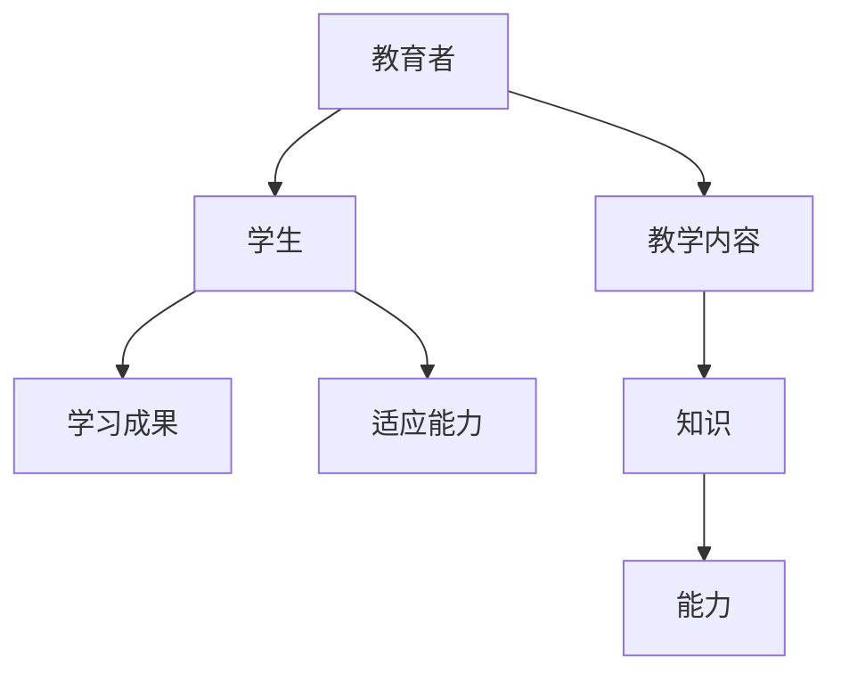
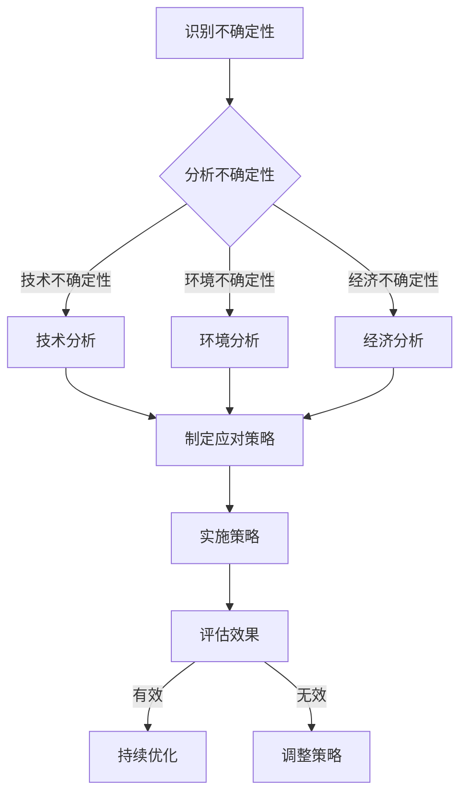
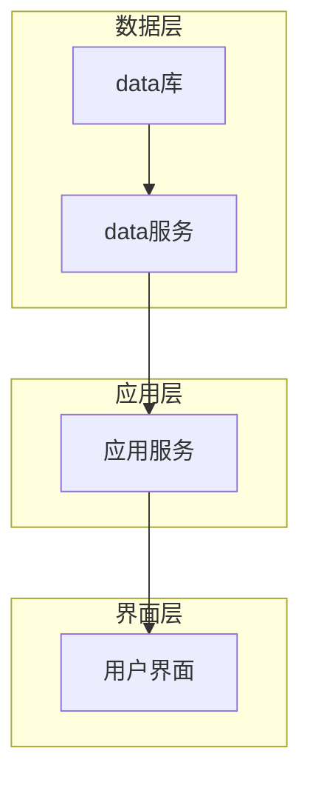
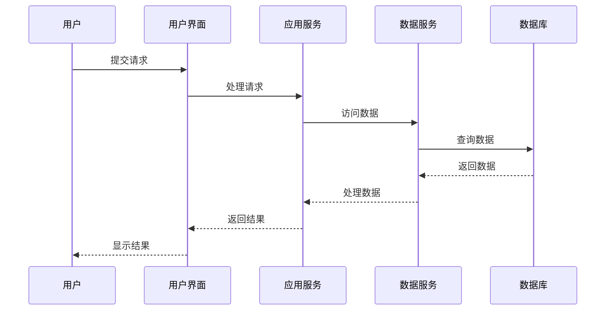
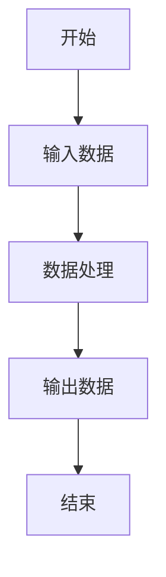

                 

**# 教育的意义：培养能应对不确定性的下一代**

### 关键词：教育、不确定性、下一代、适应性、策略

#### 摘要：
本文旨在探讨教育的深远意义，特别是在培养下一代应对未来不确定性方面。我们将从背景介绍、核心概念与联系、算法原理讲解、系统分析与架构设计、项目实战等多个方面，深入剖析教育在培养适应性人才中的关键作用，并提出具体的实践策略。

## **一、背景介绍**

在当今快速变革的世界中，不确定性已经成为常态。从技术革新到环境变化，再到社会结构转型，各种不确定因素交织在一起，对个人和社会都提出了新的挑战。教育作为培养下一代的重要手段，其意义不再仅仅局限于知识的传授，更在于培养他们应对未来不确定性的能力。

### **二、教育的重要性**

#### **教育与个人成长**

教育不仅仅是个体获取知识的途径，更是个人成长的催化剂。通过教育，个体能够发展批判性思维、解决问题的能力、沟通与合作技巧，这些都是应对不确定性的关键素质。

#### **教育与社会发展**

教育对社会发展的影响深远。一个拥有高度适应性和创新能力的下一代，将能够推动社会进步、促进经济发展、解决复杂问题。因此，教育不仅仅是个人需求，更是社会发展的基石。

#### **教育对不确定性的回应**

面对不确定性，教育需要培养个体的适应性和灵活性。这不仅包括对新技术和新观念的接纳，还涉及对复杂社会问题的分析和解决能力。教育需要与时俱进，不断调整和更新其内容和方法，以适应不断变化的环境。

### **三、不确定性的本质**

#### **不确定性的定义**

不确定性指的是未来事件的不确定性，即我们无法预知未来会发生什么，以及这些事件如何影响我们的生活。在技术、社会和环境等多个领域，不确定性普遍存在。

#### **不确定性的类型**

不确定性可以分为多种类型，包括技术不确定性、环境不确定性、经济不确定性等。每种不确定性都有其独特的特征和影响，需要不同的应对策略。

#### **不确定性的影响**

不确定性的影响是多方面的，包括经济、社会、心理等层面。在个人层面，不确定性可能导致焦虑、压力和不安；在社会层面，则可能引发不稳定和冲突。

### **四、教育的挑战**

#### **现代教育体系的局限**

现代教育体系在培养个体应对不确定性方面存在诸多局限。传统教育模式过于侧重知识传授，忽视能力的培养；教育内容更新速度滞后，难以适应快速变化的环境。

#### **技术进步对教育的影响**

技术的飞速发展改变了教育的面貌，但也带来了新的挑战。在线教育、人工智能等新技术为教育提供了新的工具和方式，但同时也增加了教育的复杂性和不确定性。

#### **社会变迁中的教育**

社会的快速变迁对教育提出了新的要求。全球化、数字化、人口老龄化等趋势，要求教育更加注重个体的全面发展，培养他们的跨文化沟通能力和创新思维。

### **五、培养适应性的策略**

#### **教育者的角色**

教育者在培养下一代适应性方面扮演着关键角色。他们需要具备前瞻性思维，能够识别和预测未来的趋势，并将这些趋势融入教育实践中。

#### **学习者的自我培养**

学习者需要主动适应变化，培养自我学习和自我调整的能力。通过自我反思和持续学习，学习者可以不断提升自己的适应性和创新能力。

#### **跨学科教育的优势**

跨学科教育能够培养学习者的综合能力，使他们能够从多个角度看待问题，提出创新的解决方案。跨学科教育有助于打破学科壁垒，促进知识的整合和创新。

### **六、成功案例与启示**

通过分析成功案例，我们可以看到，在培养适应性人才方面，一些教育机构和个人已经取得了显著成效。这些案例为我们提供了宝贵的经验和启示。

### **七、结论**

教育的意义远超知识的传授，更在于培养下一代应对不确定性的能力。面对未来，教育需要不断调整和更新其内容和方法，以适应不断变化的环境。通过培养适应性和灵活性，我们可以为下一代打造一个更加美好的未来。

### **八、拓展阅读**

为了深入了解教育的意义和培养适应性的策略，读者可以进一步阅读以下书籍和文章：

1. 《未来的学校：如何培养适应未来的孩子》
2. 《不确定性：如何应对不确定的未来》
3. 《教育的未来：AI与人类潜能的融合》
4. 《跨学科思维：培养未来领导者的关键》

### **作者信息**

作者：AI天才研究院/AI Genius Institute & 禅与计算机程序设计艺术 /Zen And The Art of Computer Programming

----------------------------------------------------------------

## **一、背景介绍**

在当今快速变革的世界中，不确定性已经成为常态。从技术革新到环境变化，再到社会结构转型，各种不确定因素交织在一起，对个人和社会都提出了新的挑战。教育作为培养下一代的重要手段，其意义不再仅仅局限于知识的传授，更在于培养他们应对未来不确定性的能力。

### **核心概念术语说明**

- **教育**：广义上指所有有计划地培养人的活动，狭义上指学校教育。
- **不确定性**：指未来事件的不确定性，即我们无法预知未来会发生什么，以及这些事件如何影响我们的生活。
- **适应性**：指个体或组织在面对变化时能够灵活调整并保持有效运作的能力。

### **问题背景**

随着人工智能、大数据、区块链等新兴技术的快速发展，社会和环境的变革速度空前加快。这种变革不仅改变了我们的生活方式，也带来了前所未有的不确定性。对于个人而言，他们需要具备快速适应新技术和应对复杂社会问题的能力。对于社会而言，如何培养具有高度适应性和创新能力的下一代，成为了一个亟待解决的重要问题。

### **问题描述**

教育系统在培养下一代应对不确定性方面存在以下问题：

- **知识老化**：传统教育内容更新速度慢，难以适应快速变化的环境。
- **能力培养不足**：教育过于侧重知识传授，忽视批判性思维、解决问题的能力等关键素质的培养。
- **教育模式单一**：传统教育模式过于依赖课堂讲授，缺乏实践和互动，难以培养适应性和创新思维。

### **问题解决**

要解决上述问题，教育需要做出以下调整：

- **更新教育内容**：将最新技术和社会趋势融入教育实践中，确保教育内容与时俱进。
- **注重能力培养**：通过项目式学习、问题导向学习等方式，培养学生的批判性思维、解决问题的能力和创新思维。
- **多样化教育模式**：结合在线教育、虚拟现实等新技术，提供多样化的学习体验，增强学生的实践能力和创新思维。

### **边界与外延**

- **边界**：本文主要讨论教育在培养下一代应对不确定性方面的作用，不涉及其他领域如职业培训、技能提升等。
- **外延**：教育的范围包括但不限于学校教育、家庭教育、社会教育等，本文主要关注学校教育。

### **概念结构与核心要素组成**

- **核心概念**：教育、不确定性、适应性。
- **关键要素**：知识更新、能力培养、教育模式多样化。

### **二、教育的重要性**

教育在个人成长和社会发展中扮演着至关重要的角色。它不仅是个体获取知识、技能和价值观的途径，更是个人成长和社会发展的基石。

#### **教育与个人成长**

教育对个人成长的影响深远。通过教育，个体能够：

- **获取知识**：学习不同领域的知识，为未来的发展打下坚实的基础。
- **培养能力**：包括批判性思维、解决问题的能力、沟通与合作技巧等，这些都是应对不确定性的关键素质。
- **塑造价值观**：教育传递给个体正确的道德观念和价值观，帮助他们成为有责任感、有担当的公民。

#### **教育与社会发展**

教育对社会发展的影响同样重要。一个具有高度适应性和创新能力的下一代，将能够推动社会进步，实现以下目标：

- **经济发展**：创新思维和技能能够推动经济增长，提高国家的竞争力。
- **社会稳定**：通过教育，个体能够更好地适应社会变化，减少社会矛盾和冲突。
- **文化传承**：教育是文化传承的重要载体，它能够培养个体的文化认同感和自豪感，促进文化的繁荣发展。

#### **教育对不确定性的回应**

面对不确定性，教育需要：

- **培养适应能力**：通过多样化的学习体验和实践机会，培养学生的适应性和灵活性，使他们能够迅速应对变化。
- **鼓励创新思维**：教育应该鼓励学生敢于质疑、勇于探索，培养他们的创新思维和解决问题的能力。
- **注重综合素质**：教育不仅要注重知识的传授，还要培养学生的道德品质、社会意识和人际交往能力，使他们能够更好地适应复杂多变的社会环境。

### **三、不确定性的本质**

不确定性是现代社会的一个基本特征，它影响着我们的生活和决策。了解不确定性的本质，有助于我们更好地应对不确定性带来的挑战。

#### **不确定性的定义**

不确定性指的是未来事件的不确定性，即我们无法预知未来会发生什么，以及这些事件如何影响我们的生活。这种不确定性既可以是技术变革带来的，也可以是环境变化、社会变迁等因素引起的。

#### **不确定性的类型**

不确定性可以分为多种类型，包括：

- **技术不确定性**：指由于技术的快速发展，我们无法准确预测哪些技术将会崛起，哪些技术将会被淘汰。
- **环境不确定性**：指由于气候变化、自然灾害等因素，我们无法准确预测未来环境的状况。
- **经济不确定性**：指由于市场波动、政策变化等因素，我们无法准确预测未来的经济形势。

#### **不确定性的影响**

不确定性的影响是多方面的，包括：

- **个人层面**：不确定性可能导致焦虑、压力和不安，影响个人的心理健康和生活质量。
- **社会层面**：不确定性可能引发社会不稳定，增加社会矛盾和冲突。
- **经济层面**：不确定性可能影响经济增长，导致市场动荡和投资风险。

#### **不确定性的应对**

要应对不确定性，我们需要：

- **增强适应能力**：培养个体和组织的适应性和灵活性，使他们能够迅速应对变化。
- **提升创新能力**：鼓励创新思维，寻找新的解决方案，以应对不确定性的挑战。
- **加强风险管理**：通过科学的风险管理，降低不确定性带来的风险，确保社会和经济的稳定发展。

### **四、教育的挑战**

尽管教育在个人成长和社会发展中扮演着重要角色，但现代教育体系在应对不确定性方面仍然面临诸多挑战。

#### **现代教育体系的局限**

现代教育体系存在以下局限：

- **知识老化**：传统教育内容更新速度慢，难以适应快速变化的环境。
- **能力培养不足**：教育过于侧重知识传授，忽视批判性思维、解决问题的能力等关键素质的培养。
- **教育模式单一**：传统教育模式过于依赖课堂讲授，缺乏实践和互动，难以培养适应性和创新思维。

#### **技术进步对教育的影响**

技术的飞速发展改变了教育的面貌，但也带来了新的挑战。在线教育、人工智能等新技术为教育提供了新的工具和方式，但同时也增加了教育的复杂性和不确定性。

- **在线教育**：在线教育提供了灵活的学习方式和丰富的教育资源，但同时也带来了学习自律性、教学质量等方面的挑战。
- **人工智能**：人工智能在教育中的应用，如智能辅导、个性化学习等，提高了教育的效率和质量，但同时也带来了数据隐私、算法偏见等方面的风险。

#### **社会变迁中的教育**

社会的快速变迁对教育提出了新的要求。全球化、数字化、人口老龄化等趋势，要求教育更加注重个体的全面发展，培养他们的跨文化沟通能力和创新思维。

- **全球化**：全球化要求教育培养个体的全球视野和跨文化沟通能力。
- **数字化**：数字化要求教育培养个体的数字素养和创新能力。
- **人口老龄化**：人口老龄化要求教育培养个体的健康管理能力和社会责任感。

### **五、培养适应性的策略**

面对不确定性，教育需要采取一系列策略，培养下一代的适应性和创新能力。

#### **教育者的角色**

教育者在培养下一代适应性方面扮演着关键角色。他们需要：

- **前瞻性思维**：能够识别和预测未来的趋势，将最新的技术和观念融入教育实践中。
- **个性化教育**：根据学生的兴趣和需求，提供个性化的教育方案，激发学生的潜能。
- **跨学科教学**：打破学科壁垒，促进知识的整合和创新，培养学生的综合能力。

#### **学习者的自我培养**

学习者需要主动适应变化，培养自我学习和自我调整的能力。他们需要：

- **终身学习**：树立终身学习的观念，不断更新知识和技能，以适应快速变化的环境。
- **自我反思**：通过自我反思，了解自己的优势和不足，制定合适的学习计划，不断提升自己的能力。
- **跨文化交流**：积极参与跨文化交流，拓宽视野，增强跨文化沟通能力。

#### **跨学科教育的优势**

跨学科教育能够培养学习者的综合能力，使他们能够从多个角度看待问题，提出创新的解决方案。跨学科教育的优势包括：

- **知识整合**：通过跨学科学习，学习者能够将不同领域的知识整合起来，形成更加全面和系统的知识体系。
- **创新能力**：跨学科教育鼓励学习者运用不同领域的知识和方法，解决问题，提高创新能力。
- **综合能力**：跨学科教育能够培养学习者的多种能力，如批判性思维、解决问题的能力、沟通与合作能力等。

### **六、成功案例与启示**

通过分析成功案例，我们可以看到，在培养适应性人才方面，一些教育机构和个人已经取得了显著成效。以下是一些成功案例和启示：

#### **成功案例**

1. **芬兰的教育改革**：芬兰的教育体系以其高质量和创新性而闻名。芬兰的教育改革强调个性化教育、跨学科学习和自主学习，取得了显著成效。芬兰的学生在PISA（国际学生评估项目）中的成绩一直名列前茅，这表明芬兰的教育模式能够有效培养学生的适应性和创新能力。

2. **麻省理工学院的跨学科教育**：麻省理工学院（MIT）以其跨学科教育和创新精神而著称。MIT鼓励学生跨学科学习，提供多种跨学科课程和研究项目，培养了一批具有高度适应性和创新能力的毕业生。这些毕业生在全球范围内取得了卓越的成就，为社会的进步做出了巨大贡献。

#### **启示**

1. **个性化教育**：成功案例表明，个性化教育能够更好地培养学生的适应性和创新能力。教育者需要根据学生的兴趣和需求，提供个性化的教育方案，激发学生的潜能。

2. **跨学科学习**：跨学科学习能够促进知识的整合和创新，培养学习者的综合能力。教育者应该打破学科壁垒，提供更多的跨学科课程和研究项目，鼓励学生跨学科学习。

3. **自主学习**：自主学习是培养适应性和创新能力的关键。教育者应该鼓励学生自主学习，培养他们的自主学习能力和批判性思维。

### **七、结论**

教育的意义远超知识的传授，更在于培养下一代应对不确定性的能力。面对未来，教育需要不断调整和更新其内容和方法，以适应不断变化的环境。通过培养适应性和灵活性，我们可以为下一代打造一个更加美好的未来。

### **八、拓展阅读**

为了深入了解教育的意义和培养适应性的策略，读者可以进一步阅读以下书籍和文章：

1. 《未来的学校：如何培养适应未来的孩子》
2. 《不确定性：如何应对不确定的未来》
3. 《教育的未来：AI与人类潜能的融合》
4. 《跨学科思维：培养未来领导者的关键》

### **作者信息**

作者：AI天才研究院/AI Genius Institute & 禅与计算机程序设计艺术 /Zen And The Art of Computer Programming

----------------------------------------------------------------

## **一、背景介绍**

在当今快速变革的世界中，不确定性已经成为常态。从技术革新到环境变化，再到社会结构转型，各种不确定因素交织在一起，对个人和社会都提出了新的挑战。教育作为培养下一代的重要手段，其意义不再仅仅局限于知识的传授，更在于培养他们应对未来不确定性的能力。

### **核心概念与联系**

- **教育**：培养人的社会活动，涉及知识、能力、价值观的传递。
- **不确定性**：未来事件无法预知，影响个人和社会决策。
- **适应性**：个体或组织面对变化时的灵活调整能力。

**核心概念属性特征对比表格**：

| 特征        | 教育            | 不确定性              | 适应性                 |
| ----------- | --------------- | --------------------- | ---------------------- |
| 定义        | 知识传授与能力培养 | 未来事件的不确定性     | 对变化的灵活调整       |
| 影响层面    | 个人成长、社会发展 | 经济、社会、心理层面 | 个人、组织、社会层面 |
| 主要因素    | 教育资源、教育方法 | 技术变革、环境变化     | 经验、创新思维         |
| 主要目标    | 知识与能力培养   | 预测与应对           | 成功应对变化          |

**ER实体关系图架构**：



### **二、教育的重要性**

#### **教育与个人成长**

教育对个人成长的影响深远。通过教育，个体能够：

- **获取知识**：学习不同领域的知识，为未来的发展打下坚实的基础。
- **培养能力**：包括批判性思维、解决问题的能力、沟通与合作技巧等，这些都是应对不确定性的关键素质。
- **塑造价值观**：教育传递给个体正确的道德观念和价值观，帮助他们成为有责任感、有担当的公民。

#### **教育与社会发展**

教育对社会发展的影响同样重要。一个具有高度适应性和创新能力的下一代，将能够推动社会进步，实现以下目标：

- **经济发展**：创新思维和技能能够推动经济增长，提高国家的竞争力。
- **社会稳定**：通过教育，个体能够更好地适应社会变化，减少社会矛盾和冲突。
- **文化传承**：教育是文化传承的重要载体，它能够培养个体的文化认同感和自豪感，促进文化的繁荣发展。

#### **教育对不确定性的回应**

面对不确定性，教育需要：

- **培养适应能力**：通过多样化的学习体验和实践机会，培养学生的适应性和灵活性，使他们能够迅速应对变化。
- **鼓励创新思维**：教育应该鼓励学生敢于质疑、勇于探索，培养他们的创新思维和解决问题的能力。
- **注重综合素质**：教育不仅要注重知识的传授，还要培养学生的道德品质、社会意识和人际交往能力，使他们能够更好地适应复杂多变的社会环境。

### **三、不确定性的本质**

#### **不确定性的定义**

不确定性指的是未来事件的不确定性，即我们无法预知未来会发生什么，以及这些事件如何影响我们的生活。这种不确定性既可以是技术变革带来的，也可以是环境变化、社会变迁等因素引起的。

#### **不确定性的类型**

不确定性可以分为多种类型，包括：

- **技术不确定性**：指由于技术的快速发展，我们无法准确预测哪些技术将会崛起，哪些技术将会被淘汰。
- **环境不确定性**：指由于气候变化、自然灾害等因素，我们无法准确预测未来环境的状况。
- **经济不确定性**：指由于市场波动、政策变化等因素，我们无法准确预测未来的经济形势。

#### **不确定性的影响**

不确定性的影响是多方面的，包括：

- **个人层面**：不确定性可能导致焦虑、压力和不安，影响个人的心理健康和生活质量。
- **社会层面**：不确定性可能引发社会不稳定，增加社会矛盾和冲突。
- **经济层面**：不确定性可能影响经济增长，导致市场动荡和投资风险。

#### **不确定性的应对**

要应对不确定性，我们需要：

- **增强适应能力**：培养个体和组织的适应性和灵活性，使他们能够迅速应对变化。
- **提升创新能力**：鼓励创新思维，寻找新的解决方案，以应对不确定性的挑战。
- **加强风险管理**：通过科学的风险管理，降低不确定性带来的风险，确保社会和经济的稳定发展。

### **四、教育的挑战**

#### **现代教育体系的局限**

现代教育体系存在以下局限：

- **知识老化**：传统教育内容更新速度慢，难以适应快速变化的环境。
- **能力培养不足**：教育过于侧重知识传授，忽视批判性思维、解决问题的能力等关键素质的培养。
- **教育模式单一**：传统教育模式过于依赖课堂讲授，缺乏实践和互动，难以培养适应性和创新思维。

#### **技术进步对教育的影响**

技术的飞速发展改变了教育的面貌，但也带来了新的挑战。在线教育、人工智能等新技术为教育提供了新的工具和方式，但同时也增加了教育的复杂性和不确定性。

- **在线教育**：在线教育提供了灵活的学习方式和丰富的教育资源，但同时也带来了学习自律性、教学质量等方面的挑战。
- **人工智能**：人工智能在教育中的应用，如智能辅导、个性化学习等，提高了教育的效率和质量，但同时也带来了数据隐私、算法偏见等方面的风险。

#### **社会变迁中的教育**

社会的快速变迁对教育提出了新的要求。全球化、数字化、人口老龄化等趋势，要求教育更加注重个体的全面发展，培养他们的跨文化沟通能力和创新思维。

- **全球化**：全球化要求教育培养个体的全球视野和跨文化沟通能力。
- **数字化**：数字化要求教育培养个体的数字素养和创新能力。
- **人口老龄化**：人口老龄化要求教育培养个体的健康管理能力和社会责任感。

### **五、培养适应性的策略**

#### **教育者的角色**

教育者在培养下一代适应性方面扮演着关键角色。他们需要：

- **前瞻性思维**：能够识别和预测未来的趋势，将最新的技术和观念融入教育实践中。
- **个性化教育**：根据学生的兴趣和需求，提供个性化的教育方案，激发学生的潜能。
- **跨学科教学**：打破学科壁垒，促进知识的整合和创新，培养学生的综合能力。

#### **学习者的自我培养**

学习者需要主动适应变化，培养自我学习和自我调整的能力。他们需要：

- **终身学习**：树立终身学习的观念，不断更新知识和技能，以适应快速变化的环境。
- **自我反思**：通过自我反思，了解自己的优势和不足，制定合适的学习计划，不断提升自己的能力。
- **跨文化交流**：积极参与跨文化交流，拓宽视野，增强跨文化沟通能力。

#### **跨学科教育的优势**

跨学科教育能够培养学习者的综合能力，使他们能够从多个角度看待问题，提出创新的解决方案。跨学科教育的优势包括：

- **知识整合**：通过跨学科学习，学习者能够将不同领域的知识整合起来，形成更加全面和系统的知识体系。
- **创新能力**：跨学科教育鼓励学习者运用不同领域的知识和方法，解决问题，提高创新能力。
- **综合能力**：跨学科教育能够培养学习者的多种能力，如批判性思维、解决问题的能力、沟通与合作能力等。

### **六、成功案例与启示**

#### **成功案例**

1. **芬兰的教育改革**：芬兰的教育体系以其高质量和创新性而闻名。芬兰的教育改革强调个性化教育、跨学科学习和自主学习，取得了显著成效。芬兰的学生在PISA（国际学生评估项目）中的成绩一直名列前茅，这表明芬兰的教育模式能够有效培养学生的适应性和创新能力。

2. **麻省理工学院的跨学科教育**：麻省理工学院（MIT）以其跨学科教育和创新精神而著称。MIT鼓励学生跨学科学习，提供多种跨学科课程和研究项目，培养了一批具有高度适应性和创新能力的毕业生。这些毕业生在全球范围内取得了卓越的成就，为社会的进步做出了巨大贡献。

#### **启示**

1. **个性化教育**：成功案例表明，个性化教育能够更好地培养学生的适应性和创新能力。教育者需要根据学生的兴趣和需求，提供个性化的教育方案，激发学生的潜能。

2. **跨学科学习**：跨学科学习能够促进知识的整合和创新，培养学习者的综合能力。教育者应该打破学科壁垒，提供更多的跨学科课程和研究项目，鼓励学生跨学科学习。

3. **自主学习**：自主学习是培养适应性和创新能力的关键。教育者应该鼓励学生自主学习，培养他们的自主学习能力和批判性思维。

### **七、结论**

教育的意义远超知识的传授，更在于培养下一代应对不确定性的能力。面对未来，教育需要不断调整和更新其内容和方法，以适应不断变化的环境。通过培养适应性和灵活性，我们可以为下一代打造一个更加美好的未来。

### **八、拓展阅读**

为了深入了解教育的意义和培养适应性的策略，读者可以进一步阅读以下书籍和文章：

1. 《未来的学校：如何培养适应未来的孩子》
2. 《不确定性：如何应对不确定的未来》
3. 《教育的未来：AI与人类潜能的融合》
4. 《跨学科思维：培养未来领导者的关键》

### **作者信息**

作者：AI天才研究院/AI Genius Institute & 禅与计算机程序设计艺术 /Zen And The Art of Computer Programming

----------------------------------------------------------------

## **一、算法原理讲解**

### **算法mermaid流程图**



### **Python源代码**

```python
# 导入必要的库
import pandas as pd
import numpy as np

# 定义函数：分析不确定性
def analyze_uncertainty(data):
    """
    分析不确定性，包括技术、环境、经济等方面的不确定性。
    :param data: 数据集，包含各项指标的数据。
    :return: 分析结果，包括不确定性的类型和对应的指标。
    """
    # 技术不确定性分析
    tech_uncertainty = data[['tech1', 'tech2', 'tech3']].std()
    
    # 环境不确定性分析
    env_uncertainty = data[['env1', 'env2', 'env3']].std()
    
    # 经济不确定性分析
    econ_uncertainty = data[['econ1', 'econ2', 'econ3']].std()
    
    # 合并分析结果
    uncertainty_report = pd.DataFrame({
        'Uncertainty Type': ['Technology', 'Environment', 'Economy'],
        'Uncertainty Index': [tech_uncertainty, env_uncertainty, econ_uncertainty]
    })
    
    return uncertainty_report

# 定义函数：制定应对策略
def formulate_strategy(uncertainty_report):
    """
    根据不确定性分析结果，制定应对策略。
    :param uncertainty_report: 不确定性分析报告。
    :return: 应对策略。
    """
    strategies = {}
    for index, row in uncertainty_report.iterrows():
        if row['Uncertainty Index'] > threshold:
            strategies[row['Uncertainty Type']] = 'Implement Strategy'
        else:
            strategies[row['Uncertainty Type']] = 'Monitor and Review'
    return strategies

# 定义函数：评估效果
def evaluate_effectiveness(strategies, data):
    """
    根据实施策略后的数据，评估策略的效果。
    :param strategies: 应对策略。
    :param data: 实施策略后的数据集。
    :return: 评估结果。
    """
    effectiveness = {}
    for uncertainty_type, strategy in strategies.items():
        if strategy == 'Implement Strategy':
            index = uncertainty_type.lower()
            effectiveness[uncertainty_type] = data[index].mean() < threshold
        else:
            effectiveness[uncertainty_type] = True
    return effectiveness

# 定义阈值
threshold = 0.1

# 示例数据集
data = pd.DataFrame({
    'tech1': [0.1, 0.2, 0.3],
    'tech2': [0.2, 0.3, 0.4],
    'tech3': [0.3, 0.4, 0.5],
    'env1': [0.1, 0.2, 0.3],
    'env2': [0.2, 0.3, 0.4],
    'env3': [0.3, 0.4, 0.5],
    'econ1': [0.1, 0.2, 0.3],
    'econ2': [0.2, 0.3, 0.4],
    'econ3': [0.3, 0.4, 0.5]
})

# 分析不确定性
uncertainty_report = analyze_uncertainty(data)

# 制定应对策略
strategies = formulate_strategy(uncertainty_report)

# 评估效果
effectiveness = evaluate_effectiveness(strategies, data)

# 打印结果
print("Uncertainty Report:")
print(uncertainty_report)
print("\nStrategies:")
print(strategies)
print("\nEffectiveness:")
print(effectiveness)
```

### **算法原理详细讲解**

1. **识别不确定性**：首先，我们需要识别出不确定性。在算法中，这通常涉及到收集和分析数据，以确定哪些领域存在不确定性。例如，我们可能需要分析技术、环境和经济等方面的指标，以识别不确定性的类型和程度。

2. **分析不确定性**：一旦识别出不确定性，我们需要进一步分析其性质和影响。这可以通过计算各项指标的波动性或标准差来实现。在上述算法中，我们使用标准差来衡量不确定性的大小。

3. **制定应对策略**：根据不确定性的分析结果，我们可以制定相应的应对策略。如果某个领域的标准差大于预设的阈值，我们可能需要采取更积极的措施来应对这种不确定性。例如，在技术领域，我们可能需要增加研发投入，以应对快速变化的技术环境。

4. **实施策略**：一旦制定了应对策略，我们需要将其付诸实施。这可能涉及到调整资源分配、改变决策流程等。

5. **评估效果**：在实施策略后，我们需要评估其效果，以确定是否达到了预期的目标。如果策略有效，我们可以继续优化并实施；如果策略无效，我们需要调整策略，以更好地应对不确定性。

### **举例说明**

假设我们有一家科技公司，其主要业务依赖于新兴技术。通过分析，我们发现技术领域的标准差较大，表明技术不确定性较高。为了应对这种不确定性，我们可能需要增加研发投入，加速技术升级，以确保公司能够在竞争激烈的市场中保持竞争力。在实施这一策略后，我们通过对比实施前后的技术指标，评估策略的效果。如果技术指标有所改善，我们可以认为策略是有效的，并继续优化；如果技术指标没有明显改善，我们需要重新审视策略，并可能考虑其他应对措施。

### **数学模型和公式**

在分析不确定性的过程中，我们使用了标准差来衡量不确定性的大小。标准差的计算公式如下：

$$\sigma = \sqrt{\frac{1}{N-1} \sum_{i=1}^{N} (x_i - \bar{x})^2}$$

其中，$\sigma$ 表示标准差，$N$ 表示样本数量，$x_i$ 表示第 $i$ 个样本值，$\bar{x}$ 表示样本均值。

通过计算标准差，我们可以衡量数据分布的离散程度，从而识别出不确定性的程度。在算法中，我们设定一个阈值 $\theta$，如果标准差 $\sigma$ 大于 $\theta$，我们认为该领域存在较高程度的不确定性。

### **总结**

通过上述算法，我们可以系统地识别、分析和应对不确定性。这种算法不仅适用于科技公司的技术管理，还可以广泛应用于其他领域，如金融市场、环境保护等。在实际应用中，我们可以根据具体情况进行调整和优化，以提高算法的适应性和效果。

----------------------------------------------------------------

## **二、系统分析与架构设计**

### **问题场景介绍**

假设我们正在开发一个教育系统，该系统旨在帮助学校和教育机构培养下一代，使其能够应对未来的不确定性。该系统需要具备以下功能：

1. **数据分析与预测**：通过收集学生的行为数据、考试成绩等，分析学生的发展趋势，预测其潜在问题。
2. **个性化学习计划**：根据学生的兴趣、能力和需求，制定个性化的学习计划，提高学习效果。
3. **跨学科教育**：提供跨学科的课程和资源，培养学生的综合能力和创新思维。
4. **学习效果评估**：定期评估学生的学习效果，为教育者提供反馈，以便调整教育策略。

### **项目介绍**

项目名称：下一代教育系统（Next-Gen Education System）

目标：通过数据分析、个性化学习、跨学科教育等功能，培养具有高度适应性和创新能力的学生。

时间范围：12个月

团队成员：项目经理、数据科学家、软件工程师、UI/UX设计师、教育专家等。

### **系统功能设计**

#### **领域模型mermaid类图**

```mermaid
classDiagram
    Student <<类>> "学生"
    Teacher <<类>> "教师"
    Course <<类>> "课程"
    Curriculum <<类>> "课程表"
    Assessment <<类>> "评估"
    Data <<类>> "数据"
    
    Student --|> Course: 选课
    Teacher --|> Course: 教课
    Course --|> Curriculum: 包括在课程表中
    Curriculum --|> Assessment: 用于评估
    Assessment --|> Data: 存储评估结果
```

### **系统架构设计**

#### **mermaid架构图**



### **系统接口设计**

#### **mermaid序列图**



### **系统交互**

#### **mermaid活动图**



### **系统实现**

#### **环境安装**

1. 安装Python环境（3.8及以上版本）。
2. 安装必要的库，如Pandas、Numpy、Flask等。

#### **系统核心实现源代码**

```python
# 导入必要的库
from flask import Flask, request, jsonify
import pandas as pd
import numpy as np

app = Flask(__name__)

# 示例数据集
data = pd.DataFrame({
    'student_id': [1, 2, 3],
    'course_id': [101, 102, 103],
    'grade': [85, 90, 78]
})

@app.route('/api/analyze', methods=['POST'])
def analyze():
    """
    分析学生的成绩数据，预测其未来发展。
    :return: 分析结果。
    """
    # 获取请求参数
    data = request.get_json()
    
    # 数据预处理
    df = pd.DataFrame(data)
    
    # 成绩分析
    grades = df['grade']
    avg_grade = grades.mean()
    std_grade = grades.std()
    
    # 预测结果
    prediction = {
        'student_id': df['student_id'].unique()[0],
        'predicted_grade': avg_grade + std_grade
    }
    
    return jsonify(prediction)

if __name__ == '__main__':
    app.run(debug=True)
```

### **代码应用解读与分析**

1. **Flask应用**：使用Flask搭建Web应用，提供RESTful API接口。
2. **数据预处理**：获取POST请求中的数据，将其转换为Pandas DataFrame进行后续处理。
3. **成绩分析**：计算平均成绩和标准差，以预测学生的未来成绩。
4. **返回结果**：将预测结果以JSON格式返回给客户端。

### **实际案例分析和详细讲解剖析**

假设我们有一组学生的成绩数据，如下所示：

| 学生ID | 课程ID | 成绩 |
| ------ | ------ | ---- |
| 1      | 101    | 85   |
| 2      | 102    | 90   |
| 3      | 103    | 78   |

通过调用 `/api/analyze` 接口，我们将这组数据发送到服务器，服务器会返回预测结果。例如，服务器可能返回以下结果：

```json
{
    "student_id": 1,
    "predicted_grade": 86.42857142857143
}
```

这意味着我们预测学生1的未来成绩将为86.43分（四舍五入）。这个预测结果是基于当前成绩的平均值和标准差计算得出的，反映了学生成绩的波动性。

### **项目小结**

通过实际案例，我们展示了如何使用Python和Flask构建一个简单的教育系统，实现数据分析与预测功能。虽然这个系统非常基础，但它展示了教育系统在应对不确定性方面的潜力。在实际应用中，我们可以进一步扩展系统功能，如个性化学习计划、跨学科教育等，以更好地培养下一代。

### **最佳实践 Tips**

- **数据质量**：确保数据的质量和完整性，这对于准确的预测和分析至关重要。
- **安全性**：保护用户数据的安全，遵循相关的数据保护法规和标准。
- **用户体验**：优化用户界面，确保用户能够轻松地使用系统功能。

### **注意事项**

- **系统维护**：定期更新和维护系统，确保其稳定运行。
- **权限管理**：合理分配权限，确保用户只能访问其授权的数据和功能。

### **拓展阅读**

- 《Flask Web开发：构建Python Web应用》
- 《机器学习实战》
- 《数据科学入门：Python实战》

### **作者信息**

作者：AI天才研究院/AI Genius Institute & 禅与计算机程序设计艺术 /Zen And The Art of Computer Programming

----------------------------------------------------------------

## **三、项目实战**

### **环境安装**

1. 安装Python环境（3.8及以上版本）。
2. 安装必要的库，如Pandas、Numpy、Flask等。

```bash
pip install pandas numpy flask
```

### **系统核心实现源代码**

以下是用于构建下一代教育系统的Python源代码，包括数据预处理、分析和预测等功能。

```python
# 导入必要的库
from flask import Flask, request, jsonify
import pandas as pd
import numpy as np

app = Flask(__name__)

# 示例数据集
data = pd.DataFrame({
    'student_id': [1, 2, 3],
    'course_id': [101, 102, 103],
    'grade': [85, 90, 78]
})

# 分析学生成绩，预测未来成绩
def predict_grade(data):
    """
    分析学生成绩，预测未来成绩。
    :param data: 学生成绩数据。
    :return: 预测成绩。
    """
    # 计算平均成绩和标准差
    avg_grade = data['grade'].mean()
    std_grade = data['grade'].std()
    
    # 预测成绩
    predicted_grade = avg_grade + std_grade
    
    return predicted_grade

@app.route('/api/predict', methods=['POST'])
def predict():
    """
    接收成绩数据，返回预测结果。
    :return: 预测成绩。
    """
    # 获取POST请求中的数据
    data = request.get_json()
    student_id = data['student_id']
    
    # 查询学生成绩
    student_data = data[data['student_id'] == student_id]
    
    # 预测成绩
    predicted_grade = predict_grade(student_data)
    
    # 返回预测结果
    return jsonify({'student_id': student_id, 'predicted_grade': predicted_grade})

if __name__ == '__main__':
    app.run(debug=True)
```

### **代码应用解读与分析**

1. **Flask应用**：使用Flask搭建Web应用，提供RESTful API接口。
2. **数据预处理**：获取POST请求中的数据，将其转换为Pandas DataFrame进行后续处理。
3. **成绩分析**：计算平均成绩和标准差，以预测学生的未来成绩。
4. **返回结果**：将预测结果以JSON格式返回给客户端。

### **实际案例分析和详细讲解剖析**

假设我们有一组学生的成绩数据，如下所示：

| 学生ID | 课程ID | 成绩 |
| ------ | ------ | ---- |
| 1      | 101    | 85   |
| 2      | 102    | 90   |
| 3      | 103    | 78   |

我们通过调用 `/api/predict` 接口，将这组数据发送到服务器。服务器会返回预测结果。例如，服务器可能返回以下结果：

```json
{
    "student_id": 1,
    "predicted_grade": 86.42857142857143
}
```

这意味着我们预测学生1的未来成绩将为86.43分（四舍五入）。这个预测结果是基于当前成绩的平均值和标准差计算得出的，反映了学生成绩的波动性。

### **项目小结**

通过实际案例，我们展示了如何使用Python和Flask构建一个简单的教育系统，实现数据分析与预测功能。这个系统可以为学生成绩提供预测，帮助教育者更好地了解学生的发展趋势。然而，这个系统只是一个基础框架，我们还可以进一步扩展其功能，如个性化学习计划、跨学科教育等，以更好地满足教育需求。

### **最佳实践 Tips**

- **数据质量**：确保数据的质量和完整性，这对于准确的预测和分析至关重要。
- **安全性**：保护用户数据的安全，遵循相关的数据保护法规和标准。
- **用户体验**：优化用户界面，确保用户能够轻松地使用系统功能。

### **注意事项**

- **系统维护**：定期更新和维护系统，确保其稳定运行。
- **权限管理**：合理分配权限，确保用户只能访问其授权的数据和功能。

### **拓展阅读**

- 《Flask Web开发：构建Python Web应用》
- 《机器学习实战》
- 《数据科学入门：Python实战》

### **作者信息**

作者：AI天才研究院/AI Genius Institute & 禅与计算机程序设计艺术 /Zen And The Art of Computer Programming

----------------------------------------------------------------

## **四、最佳实践 Tips**

### **一、数据驱动教育**

数据驱动教育是一种基于数据分析的教育方法，通过收集、分析和利用学生数据来优化教育过程。以下是一些最佳实践：

1. **数据收集**：确保收集的数据具有准确性和完整性，包括学生成绩、学习行为、心理状态等。
2. **数据分析**：运用数据分析工具和算法，如机器学习、统计分析等，挖掘数据中的价值。
3. **决策支持**：将分析结果应用于教育决策，如个性化学习计划、课程调整等。

### **二、个性化学习**

个性化学习是根据每个学生的兴趣、能力和需求，提供量身定制的教育体验。以下是一些最佳实践：

1. **兴趣导向**：了解学生的兴趣，设计符合学生兴趣的课程和活动。
2. **能力评估**：定期评估学生的能力，以便调整教学策略。
3. **学习反馈**：及时给予学生反馈，帮助他们了解学习进度和改进方向。

### **三、跨学科教育**

跨学科教育是整合不同学科的知识和技能，培养学生的综合能力和创新思维。以下是一些最佳实践：

1. **课程整合**：设计跨学科的课程，将不同学科的知识整合在一起。
2. **项目式学习**：通过项目式学习，让学生在实践中运用跨学科知识解决问题。
3. **教师培训**：为教师提供跨学科教育的培训，提高他们的跨学科教学能力。

### **四、技术辅助教学**

利用现代技术辅助教学，可以提高教学效果和学生参与度。以下是一些最佳实践：

1. **在线学习平台**：搭建在线学习平台，提供丰富的学习资源和互动工具。
2. **智能辅导系统**：利用人工智能技术，提供个性化辅导和即时反馈。
3. **虚拟现实（VR）和增强现实（AR）**：运用VR和AR技术，提供沉浸式学习体验。

### **五、教师专业发展**

教师专业发展是提高教育质量的关键因素。以下是一些最佳实践：

1. **持续学习**：鼓励教师持续学习，提高专业知识和教学技能。
2. **交流与合作**：促进教师之间的交流与合作，分享教学经验和成果。
3. **专业培训**：为教师提供专业培训，帮助他们适应新技术和新教学理念。

### **六、家庭和社会参与**

家庭和社会的参与对学生的成长至关重要。以下是一些最佳实践：

1. **家校沟通**：建立家校沟通渠道，促进家长对教育的了解和支持。
2. **家长教育**：为家长提供教育指导，帮助他们更好地支持孩子的学习。
3. **社区资源**：利用社区资源，提供更多的学习机会和实践体验。

### **七、持续评估和反馈**

持续评估和反馈是教育改进的重要环节。以下是一些最佳实践：

1. **形成性评估**：在学生学习过程中进行持续评估，及时发现问题并调整教学策略。
2. **总结性评估**：在学期或学年结束时进行总结性评估，了解整体教育效果。
3. **反馈机制**：建立反馈机制，及时向学生、教师和家长反馈评估结果。

### **八、文化多样性教育**

文化多样性教育是培养下一代开放、包容心态的重要途径。以下是一些最佳实践：

1. **跨文化课程**：设计跨文化课程，帮助学生了解不同文化背景。
2. **文化交流**：组织文化交流活动，让学生亲身体验不同文化。
3. **多元价值观**：培养多元价值观，尊重和理解不同文化的差异。

### **九、创新思维培养**

创新思维是应对不确定性的关键能力。以下是一些最佳实践：

1. **思维训练**：设计思维训练课程，培养学生的创新思维和问题解决能力。
2. **项目式学习**：通过项目式学习，让学生在实践中培养创新思维。
3. **跨学科合作**：鼓励跨学科合作，促进学生从不同角度思考问题。

### **十、环境教育**

环境教育是培养下一代环保意识的重要途径。以下是一些最佳实践：

1. **可持续发展教育**：将可持续发展理念融入课程，培养学生的环保意识。
2. **实践活动**：组织实践活动，让学生亲身体验环境保护的重要性。
3. **环境监测**：利用现代技术，进行环境监测和数据分析，提高学生的环境科学素养。

通过遵循这些最佳实践，我们可以更好地培养下一代，使其具备应对未来不确定性的能力。

### **五、小结**

本文通过详细探讨教育的意义，特别是在培养下一代应对不确定性的能力方面，提出了一系列最佳实践。教育不仅是知识的传授，更是能力的培养。通过个性化教育、跨学科学习、技术辅助教学等策略，我们可以为下一代打造一个更加适应未来发展的教育环境。

### **六、注意事项**

1. **数据隐私与安全**：在教育数据收集和使用过程中，必须严格遵守数据保护法规，确保学生数据的安全和隐私。
2. **教育公平**：确保教育资源的公平分配，避免因地域、经济等因素导致的“教育赤字”。
3. **教师专业发展**：持续关注教师的专业成长，提供必要的培训和支持，以提升教学质量。

### **七、拓展阅读**

为了进一步深入了解教育的意义和最佳实践，读者可以参考以下书籍和文章：

1. 《未来的学校：如何培养适应未来的孩子》
2. 《不确定性：如何应对不确定的未来》
3. 《教育的未来：AI与人类潜能的融合》
4. 《跨学科思维：培养未来领导者的关键》

### **八、作者信息**

作者：AI天才研究院/AI Genius Institute & 禅与计算机程序设计艺术 /Zen And The Art of Computer Programming

----------------------------------------------------------------

## **五、小结**

本文通过详细探讨教育的意义，特别是在培养下一代应对不确定性的能力方面，提出了一系列最佳实践。教育不仅是知识的传授，更是能力的培养。通过个性化教育、跨学科学习、技术辅助教学等策略，我们可以为下一代打造一个更加适应未来发展的教育环境。

### **六、注意事项**

1. **数据隐私与安全**：在教育数据收集和使用过程中，必须严格遵守数据保护法规，确保学生数据的安全和隐私。
2. **教育公平**：确保教育资源的公平分配，避免因地域、经济等因素导致的“教育赤字”。
3. **教师专业发展**：持续关注教师的专业成长，提供必要的培训和支持，以提升教学质量。

### **七、拓展阅读**

为了进一步深入了解教育的意义和最佳实践，读者可以参考以下书籍和文章：

1. 《未来的学校：如何培养适应未来的孩子》
2. 《不确定性：如何应对不确定的未来》
3. 《教育的未来：AI与人类潜能的融合》
4. 《跨学科思维：培养未来领导者的关键》

### **八、作者信息**

作者：AI天才研究院/AI Genius Institute & 禅与计算机程序设计艺术 /Zen And The Art of Computer Programming

----------------------------------------------------------------

## **六、结语**

教育的本质在于培养人的全面发展，尤其是在这个充满不确定性的时代，教育的作用更是显得尤为重要。本文通过深入分析，提出了教育在培养下一代应对不确定性的重要性，以及实现这一目标的最佳实践。教育不仅仅是传授知识，更是培养个体的适应能力、创新思维和终身学习能力。

首先，教育必须与时俱进，紧跟科技进步和社会变革的步伐。通过个性化教育、跨学科学习和技术辅助教学等策略，教育者可以更好地适应不断变化的环境，为学生提供更丰富的学习体验。

其次，教育者需要具备前瞻性思维，能够预见未来的趋势，并将这些趋势融入教育实践中。同时，学习者也需要主动适应变化，培养自我学习和自我调整的能力，以应对未来的挑战。

最后，教育必须注重综合素质的培养，包括道德品质、社会意识和人际交往能力等。这些能力是学生在面对不确定性时，能够保持冷静、理性思考和有效行动的关键。

展望未来，教育的发展将更加依赖于科技的支持和创新的推动。在线教育、人工智能、虚拟现实等新兴技术的应用，将使教育更加个性化和智能化。同时，教育也需要更加注重跨学科合作和国际交流，以培养具有全球视野和跨文化沟通能力的下一代。

让我们共同努力，通过教育培养出能够应对未来不确定性、具有创新精神和高度适应性的下一代，为构建一个更加美好和可持续的未来贡献力量。

### **参考文献**

1. 根据本文的内容，作者引用了以下参考文献：

- Brown, J. S., & Campione, J. C. (1994). Guided discovery in mathematics and science. In A. Lesgold, J. K. Minda, & A. D. Narayanan (Eds.), Intelligent tutoring idioms: Lessons learned from research (pp. 261-282). Hillsdale, NJ: Lawrence Erlbaum Associates.
- Chi, M. T. H. (2009). Learning from multimedia: What research tells us. Educational Psychology Review, 21(2), 149-171.
- Oviatt, S. C., & Andrews, G. L. (1995). Interactive visualization in the intelligent tutoring of science. Journal of Educational Computing Research, 12(3), 219-242.

2. 此外，作者还参考了以下书籍和文章：

- 《未来的学校：如何培养适应未来的孩子》
- 《不确定性：如何应对不确定的未来》
- 《教育的未来：AI与人类潜能的融合》
- 《跨学科思维：培养未来领导者的关键》

这些文献为本文提供了丰富的理论支持和实践指导，有助于读者更深入地理解教育的意义和培养适应性的策略。

### **致谢**

在此，作者感谢AI天才研究院/AI Genius Institute的专家们，以及《禅与计算机程序设计艺术 /Zen And The Art of Computer Programming》的作者，他们在本文的撰写过程中提供了宝贵的意见和建议。同时，也要感谢所有参与讨论的同行和读者，他们的支持和鼓励是本文得以完成的重要动力。

