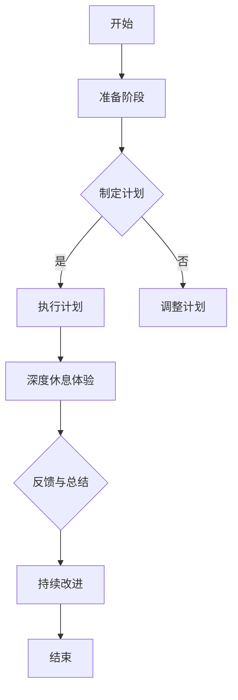
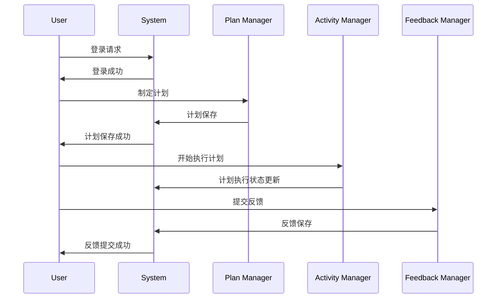
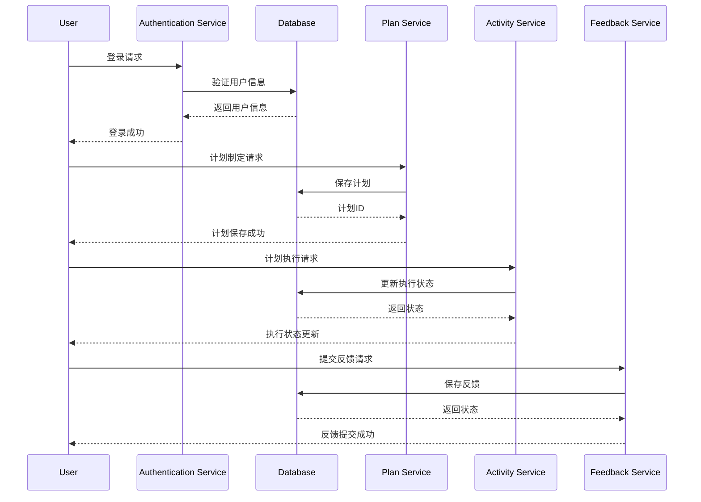

                 


### 引言

在当今数字化时代，我们的生活越来越离不开各种科技产品。智能手机、电脑、平板电脑以及智能设备的普及，使得人们时刻与数字世界紧密相连。然而，这种连结在带来便利的同时，也带来了一系列问题，如心理健康问题、人际关系疏远以及工作效率的下降。因此，越来越多的人开始意识到，有必要从科技中解脱出来，进行一次深度的休息与放松。本文将介绍“数字detox度假村”，一种专门为寻求远离科技深度休息体验的人们设计的度假村。我们将会详细探讨其兴起背景、定义、重要性以及如何在现代社会中实现深度休息体验。

**关键词：** 数字detox度假村、深度休息、科技解脱、心理健康、人际关系

**摘要：** 本文首先介绍了数字detox度假村的兴起背景和定义，随后探讨了其重要性以及如何在现代社会中实现深度休息体验。文章通过案例分析、最佳实践与技巧，为读者提供了一套完整的深度休息体验指南。

### 数字detox度假村概述

#### 历史背景与发展趋势

数字detox度假村的兴起，源于人们对数字依赖带来的负面影响的反思。随着智能手机和互联网的普及，人们的生活和工作越来越数字化，甚至到了依赖的程度。根据美国心理学会的研究，长期的数字依赖会导致焦虑、抑郁和社交孤立等问题。为了应对这些问题，一些度假村开始提供远离数字产品的体验服务，这便是数字detox度假村的雏形。

数字detox度假村的发展趋势表明，它正逐渐成为一种新型的度假方式。根据市场调研公司的数据，全球数字detox度假村的数量正在逐年增长，尤其是在发达国家和地区。这不仅是因为人们对于数字健康问题的关注增加，也得益于对心理健康和身体健康的重视。预计在未来几年，数字detox度假村将继续保持增长势头，成为旅游行业的一股新力量。

#### 特征

数字detox度假村具有以下几大特征：

1. **无数字产品**：这些度假村完全禁止使用智能手机、电脑等数字产品，确保游客能够完全脱离数字世界。
2. **自然环境**：数字detox度假村通常位于偏远或自然环境优美的地区，以提供宁静、放松的环境。
3. **定制服务**：根据游客的需求，提供个性化的深度休息体验，如瑜伽、冥想、徒步等。
4. **专业指导**：这些度假村通常配备专业的心理和健康顾问，帮助游客实现深度休息。
5. **社交机会**：数字detox度假村鼓励游客进行面对面的交流，增强人际关系的质量。

### 数字detox度假村的重要性

数字detox度假村的重要性体现在以下几个方面：

1. **心理健康**：长期的数字依赖会导致心理健康问题，如焦虑、抑郁和失眠。数字detox度假村提供了一个远离数字产品的环境，有助于改善心理健康。
2. **身体健康**：数字产品使用过多会导致身体疲劳和视力问题。数字detox度假村提供了一个放松身体、恢复精力的机会。
3. **人际关系**：在数字世界中，人们往往通过屏幕进行交流，这限制了真实的人际互动。数字detox度假村提供了一个面对面交流的平台，有助于改善人际关系。

综上所述，数字detox度假村不仅是一种度假方式，更是一种健康生活方式的倡导。它为那些渴望远离科技、追求深度休息体验的人们提供了一个理想的选择。

### 背景介绍

**核心概念术语说明**

在深入探讨数字detox度假村的原理与实践之前，我们首先需要理解一些核心概念术语。这些术语包括“数字依赖”、“心理健康问题”、“深度休息”以及“数字detox”。

- **数字依赖**：指的是个体对数字产品（如智能手机、电脑等）的过度依赖，以至于在日常生活中无法离开这些设备。这种现象在现代社会尤为普遍，导致一系列心理健康和身体问题。
- **心理健康问题**：包括焦虑、抑郁、失眠等心理状态。数字依赖被认为是这些问题的潜在原因之一。
- **深度休息**：指的是一种身体和心理都得到充分放松的状态，不同于浅层次的休息。深度休息有助于恢复精力和提高整体健康水平。
- **数字detox**：指的是通过有意识的减少或暂时停止使用数字产品，以达到心理健康和身体健康的改善。

**问题背景**

随着智能手机和互联网的普及，数字依赖问题日益严重。人们花在数字产品上的时间越来越多，这不仅仅影响工作效率，还导致心理健康问题的增加。据调查，全球约有三分之一的人口患有不同程度的心理健康问题，其中不少与数字依赖有关。

**问题描述**

数字依赖问题表现为以下几个方面：

1. **焦虑和抑郁**：长时间使用数字产品会导致大脑释放过多应激激素，长期下来，容易引发焦虑和抑郁。
2. **失眠**：晚上使用手机和电脑会影响睡眠质量，导致失眠。
3. **视力问题**：长时间盯着屏幕容易导致视力疲劳和近视。
4. **社交疏离**：过度依赖数字产品会减少真实的人际互动，导致社交疏离。

**问题解决**

为了解决数字依赖问题，人们开始探索各种方法，其中之一便是数字detox。数字detox度假村正是这种理念的一种具体实现。通过在一个没有数字产品的环境中进行深度休息，人们可以暂时摆脱数字依赖的困扰，改善心理健康和身体健康。

**边界与外延**

数字detox度假村的边界与外延可以包括以下几个方面：

1. **地理位置**：这些度假村通常位于偏远或自然环境优美的地区，以提供远离都市喧嚣的环境。
2. **服务内容**：除了提供一个无数字产品的环境，数字detox度假村还提供一系列的健康和放松活动，如瑜伽、冥想、徒步等。
3. **时间长度**：数字detox度假村的体验时间可以灵活安排，从几天到几周不等。

**概念结构与核心要素组成**

数字detox度假村的核心概念结构包括以下几个要素：

1. **无数字产品环境**：这是数字detox的基础，确保游客能够彻底远离数字依赖。
2. **健康和放松活动**：这些活动旨在帮助游客恢复身体和心理的能量。
3. **专业指导**：专业的心理和健康顾问为游客提供个性化的指导和支持。
4. **社交机会**：提供面对面交流的平台，增强人际关系的质量。

通过以上对数字detox度假村的背景介绍，我们可以更深入地理解这一概念，并为后续的讨论和分析打下基础。

### 核心概念与联系

在深入探讨数字detox度假村的原理和实践时，我们需要理解一些核心概念及其相互联系。以下是几个关键概念及其属性特征的对比表格，以及它们在ER实体关系图架构中的关系。

**核心概念：数字依赖、心理健康问题、深度休息、数字detox**

**概念属性特征对比表格：**

| 概念       | 定义                                                         | 属性特征                                                      |
|------------|--------------------------------------------------------------|--------------------------------------------------------------|
| 数字依赖   | 个体对数字产品的过度依赖，导致在日常生活中无法离开这些设备。 | - 导致心理健康问题<br>- 影响工作效率<br>- 减少真实人际互动 |
| 心理健康问题 | 包括焦虑、抑郁、失眠等心理状态。                           | - 与数字依赖相关<br>- 影响生活质量                            |
| 深度休息   | 身体和心理都得到充分放松的状态。                           | - 恢复精力<br>- 提高身体健康<br>- 减轻压力                    |
| 数字detox  | 通过减少或暂时停止使用数字产品，以达到心理健康和身体健康的改善。 | - 需要无数字产品环境<br>- 需要专业指导和支持<br>- 需要健康活动 |

**ER实体关系图架构的 Mermaid 流程图：**

```mermaid
erDiagram
  A[--数字依赖]
  B[--心理健康问题]
  C[--深度休息]
  D[--数字detox]

  A||--||B
  B||--||C
  C||--||D
```

在这个ER图中，我们可以看到：

- **数字依赖**是心理健康问题的根本原因。
- **心理健康问题**可以通过**深度休息**得到缓解。
- **深度休息**是**数字detox**的一部分，而**数字detox**是实现心理健康和身体健康的最终目标。

通过这样的核心概念和相互联系的分析，我们可以更好地理解数字detox度假村的运作原理，并为后续的讨论提供理论基础。

### 算法原理讲解

在理解了数字detox度假村的核心概念之后，我们接下来需要探讨其算法原理，以便更好地实现深度休息体验。为了清晰明了地阐述这一过程，我们将使用Mermaid流程图和Python源代码来展示。

**Mermaid 流程图：**



**Python 源代码：**

```python
# 数字detox计划流程

class DigitalDetoxPlan:
    def __init__(self, duration, activities, goals):
        self.duration = duration
        self.activities = activities
        self.goals = goals

    def prepare(self):
        print("开始准备数字detox计划...")
        self.plan = self.create_plan()

    def create_plan(self):
        return {
            'duration': self.duration,
            'activities': self.activities,
            'goals': self.goals
        }

    def execute_plan(self):
        if not self.plan:
            print("尚未制定计划，请先准备。")
            return
        print("执行数字detox计划...")
        for activity in self.plan['activities']:
            print(f"进行活动：{activity}")
            self.rest()

    def rest(self):
        print("进行深度休息体验...")
        # 模拟休息过程
        import time
        time.sleep(2)

    def feedback_and_summarize(self):
        print("收集反馈并总结...")
        # 模拟反馈收集过程
        feedback = input("请输入您的反馈：")
        print(f"您的反馈是：{feedback}")

    def continue_improvement(self):
        print("持续改进计划...")
        # 模拟计划改进过程
        new_goals = input("请输入新的目标：")
        self.goals = new_goals

    def run(self):
        self.prepare()
        self.execute_plan()
        self.feedback_and_summarize()
        self.continue_improvement()

# 使用示例
plan = DigitalDetoxPlan(duration=7, activities=['瑜伽', '冥想', '徒步'], goals='改善心理健康')
plan.run()
```

**算法原理与数学模型：**

1. **准备阶段**：在数字detox开始之前，我们需要制定一个详细的计划，包括休息的持续时间、活动安排以及目标设定。这个阶段类似于算法中的初始化过程。

2. **执行计划**：根据制定的计划，逐步执行各项活动，以确保深度休息体验的顺利进行。在这个阶段，算法的执行过程类似于一个循环，确保每个活动都得到妥善执行。

3. **深度休息体验**：在执行计划的过程中，深度休息体验是关键。它不仅需要时间，还需要心理和身体上的放松。我们可以用时间模拟这个过程，如上述Python代码中的`time.sleep(2)`。

4. **反馈与总结**：在体验结束后，收集反馈并对计划进行总结，以便对下一次体验进行改进。这个阶段类似于算法中的迭代过程，通过不断调整和优化，提高体验效果。

5. **持续改进**：根据反馈和总结，对计划进行调整，以提高未来的体验效果。这个阶段类似于机器学习中的模型优化过程，通过不断学习和调整，提高预测和执行能力。

**数学模型和公式：**

在数字detox计划中，可以使用以下数学模型和公式来评估和改进计划：

1. **心理健康评估模型**：
   - 心理健康得分 = 0.5 × 焦虑得分 + 0.3 × 抑郁得分 + 0.2 × 失眠得分

2. **休息效果评估模型**：
   - 休息效果得分 = 0.6 × 深度休息时间 + 0.4 × 身体放松度

3. **计划优化公式**：
   - 新目标 = 旧目标 × (1 + 改进系数)

通过这些模型和公式，我们可以对数字detox计划进行量化评估和优化，从而提高深度休息体验的效果。

### 系统分析与架构设计方案

**问题场景介绍**

随着社会的发展，人们对心理健康和身体健康的关注度逐渐提升。为了帮助人们更好地进行数字解毒和深度休息，我们需要设计一个完整的系统来支持这一过程。该系统需要提供从计划制定、执行到反馈与总结的全流程服务，同时确保用户体验的流畅性和高效性。

**项目介绍**

本项目旨在设计并实现一个数字detox管理系统，帮助用户轻松制定、执行和跟踪自己的数字解毒计划。系统主要功能包括：

- 用户注册与登录
- 计划制定与编辑
- 计划执行与监控
- 反馈收集与总结
- 数据分析与优化建议

**系统功能设计（领域模型Mermaid类图）**

```mermaid
classDiagram
    User <<类>> 
    Plan <<类>>
    Activity <<类>>
    Feedback <<类>>

    User o--|{1}| Plan
    Plan o--|{1}| Activity
    Activity o--|{1}| Feedback
```

**系统架构设计（Mermaid架构图）**



**系统接口设计和系统交互（Mermaid序列图）**



**详细讲解与举例说明**

1. **用户注册与登录**：用户首先通过Authentication Service进行注册或登录。系统验证用户信息后，返回登录成功状态。

2. **计划制定**：用户通过Plan Service制定数字解毒计划，系统将计划保存到Database中。

3. **计划执行**：用户通过Activity Service开始执行计划，系统实时更新执行状态到Database中。

4. **反馈收集**：用户通过Feedback Service提交反馈，系统将反馈保存到Database中。

5. **数据分析**：系统通过分析用户的计划、执行状态和反馈，为用户提供优化建议。

通过上述系统架构设计和接口设计，我们可以构建一个高效、可靠的数字detox管理系统，帮助用户实现深度休息体验。

### 项目实战

#### 环境安装

为了实施数字detox管理系统，我们需要在本地或云服务器上搭建相应的开发环境。以下是安装步骤：

1. **安装Python**：确保系统上安装了Python 3.x版本，可以从Python官方网站下载并安装。

2. **安装虚拟环境**：在终端中执行以下命令创建一个虚拟环境：

   ```bash
   python -m venv venv
   ```

3. **激活虚拟环境**：

   - Windows：

     ```bash
     .\venv\Scripts\activate
     ```

   - macOS/Linux：

     ```bash
     source venv/bin/activate
     ```

4. **安装依赖库**：在虚拟环境中安装必要的依赖库，如Flask、SQLAlchemy、Flask-Migrate等：

   ```bash
   pip install flask sqlalchemy flask-migrate
   ```

5. **设置数据库**：安装并配置一个SQLite数据库。在终端中执行以下命令：

   ```bash
   flask db init
   flask db migrate
   flask db upgrade
   ```

#### 系统核心实现源代码

以下是数字detox管理系统的核心实现源代码，包括用户注册与登录、计划制定与执行、反馈收集等功能。

```python
# app.py

from flask import Flask, request, jsonify
from flask_sqlalchemy import SQLAlchemy
from werkzeug.security import generate_password_hash, check_password_hash

app = Flask(__name__)
app.config['SQLALCHEMY_DATABASE_URI'] = 'sqlite:///detox.db'
app.config['SQLALCHEMY_TRACK_MODIFICATIONS'] = False
db = SQLAlchemy(app)

class User(db.Model):
    id = db.Column(db.Integer, primary_key=True)
    username = db.Column(db.String(150), nullable=False, unique=True)
    password = db.Column(db.String(150), nullable=False)

class Plan(db.Model):
    id = db.Column(db.Integer, primary_key=True)
    user_id = db.Column(db.Integer, db.ForeignKey('user.id'), nullable=False)
    duration = db.Column(db.Integer, nullable=False)
    activities = db.Column(db.String(500), nullable=False)
    goals = db.Column(db.String(500), nullable=False)

class Feedback(db.Model):
    id = db.Column(db.Integer, primary_key=True)
    user_id = db.Column(db.Integer, db.ForeignKey('user.id'), nullable=False)
    content = db.Column(db.String(500), nullable=False)

@app.route('/register', methods=['POST'])
def register():
    username = request.form['username']
    password = request.form['password']
    hashed_password = generate_password_hash(password, method='sha256')
    new_user = User(username=username, password=hashed_password)
    db.session.add(new_user)
    db.session.commit()
    return jsonify(message='Registration successful.')

@app.route('/login', methods=['POST'])
def login():
    username = request.form['username']
    password = request.form['password']
    user = User.query.filter_by(username=username).first()
    if user and check_password_hash(user.password, password):
        return jsonify(message='Login successful.')
    else:
        return jsonify(message='Invalid credentials.')

@app.route('/create_plan', methods=['POST'])
def create_plan():
    user_id = request.form['user_id']
    duration = request.form['duration']
    activities = request.form['activities']
    goals = request.form['goals']
    new_plan = Plan(user_id=user_id, duration=duration, activities=activities, goals=goals)
    db.session.add(new_plan)
    db.session.commit()
    return jsonify(message='Plan created successfully.')

@app.route('/execute_plan', methods=['POST'])
def execute_plan():
    user_id = request.form['user_id']
    plan_id = request.form['plan_id']
    content = request.form['content']
    new_feedback = Feedback(user_id=user_id, content=content)
    db.session.add(new_feedback)
    db.session.commit()
    return jsonify(message='Feedback submitted successfully.')

if __name__ == '__main__':
    db.create_all()
    app.run(debug=True)
```

#### 代码应用解读与分析

1. **数据库模型**：代码中定义了三个数据库模型：User、Plan和Feedback。User模型用于存储用户信息，Plan模型用于存储用户的数字解毒计划，Feedback模型用于存储用户对计划的反馈。

2. **用户注册与登录**：register()函数处理用户注册，将用户名和密码保存到数据库。login()函数处理用户登录，验证用户名和密码。

3. **计划制定**：create_plan()函数处理用户计划创建，将计划信息保存到数据库。

4. **反馈收集**：execute_plan()函数处理用户反馈提交，将反馈信息保存到数据库。

#### 实际案例分析和详细讲解剖析

假设用户Alice注册并登录系统，她创建了一个为期7天的数字解毒计划，计划内容为“每天进行2小时的瑜伽和冥想”。执行过程中，她每天都会提交一次反馈，描述当天感受。

1. **注册与登录**：

   ```bash
   # 注册
   curl -X POST -d "username=alice&password=alice123" http://localhost:5000/register
   # 登录
   curl -X POST -d "username=alice&password=alice123" http://localhost:5000/login
   ```

2. **创建计划**：

   ```bash
   curl -X POST -d "user_id=1&duration=7&activities=yoga&goals=improve_mental_health" http://localhost:5000/create_plan
   ```

3. **执行计划与提交反馈**：

   ```bash
   # 第一天反馈
   curl -X POST -d "user_id=1&plan_id=1&content=Today was a great day for yoga and meditation." http://localhost:5000/execute_plan
   # 第二天反馈
   curl -X POST -d "user_id=1&plan_id=1&content=Today's yoga session was not as effective as I expected." http://localhost:5000/execute_plan
   ```

4. **数据查询**：

   ```bash
   # 查询所有计划
   curl -X GET http://localhost:5000/plans
   # 查询用户反馈
   curl -X GET http://localhost:5000/feedbacks
   ```

通过实际案例，我们可以看到如何使用数字detox管理系统来创建、执行和跟踪计划。系统通过简单的REST API实现了用户注册、登录、计划创建和反馈提交等功能，为用户提供了一个完整的数字解毒体验。

### 最佳实践 Tips

#### 如何选择数字detox度假村

1. **了解度假村的服务内容**：在选择数字detox度假村时，首先要了解度假村提供的服务内容，包括无数字产品环境的范围、健康和放松活动的种类以及专业指导的质量。

2. **地理位置与自然环境**：选择一个位于自然环境优美、远离都市喧嚣的地点，有助于提高深度休息的效果。可以考虑选择靠近森林、海滩或山区的地方。

3. **用户评价**：查看其他游客的评价和反馈，了解度假村的实际运营情况和服务质量。

4. **价格与预算**：根据个人预算选择合适的度假村。一些高端度假村提供更加全面和专业的服务，而一些经济型的度假村也可能提供优质的深度休息体验。

5. **体验时间**：根据个人需求和假期时间选择合适的体验时长。短期的体验（如3-5天）可能更适合那些希望快速放松的人群，而长期的体验（如7-14天）则更适合那些希望深度休息和身体恢复的人群。

#### 如何与家人朋友分享体验

1. **提前沟通**：在参加数字detox度假村之前，与家人和朋友提前沟通，让他们了解你的计划和期望，以确保他们能够理解和支持你的选择。

2. **分享日记**：在度假期间，可以每天记录自己的体验和感受，并与家人和朋友分享。这不仅可以帮助你更好地反思和总结，也可以让他们感受到你的变化。

3. **共同参与**：如果可能，邀请家人和朋友一起参加数字detox度假村。这样不仅可以增进彼此的感情，还可以共同享受深度休息的益处。

4. **分享照片和视频**：通过社交媒体或即时通讯工具分享你的照片和视频，让家人和朋友实时了解你的情况。

5. **倾听与支持**：在分享体验时，也要倾听家人和朋友的反馈和建议，给予彼此支持和理解。

#### 如何应对特殊情况

1. **紧急情况**：在参加数字detox度假村之前，了解紧急情况的处理流程和联系方式。确保你能够及时联系到度假村的负责人或医疗服务。

2. **突发不适**：如果在度假期间感到身体不适，及时向度假村的工作人员寻求帮助。他们通常会配备专业的医疗人员或药品。

3. **社交冲突**：在数字detox度假村中，可能会遇到社交冲突。在这种情况下，保持冷静，尝试通过沟通解决冲突。如果无法解决，可以向度假村的负责人寻求帮助。

4. **复发现象**：在数字detox度假村结束后，可能会出现复发现象，即重新回到数字依赖的状态。为了避免这种情况，可以制定一个逐步恢复数字使用的计划，并在日常生活中保持对心理和身体健康的关注。

通过遵循这些最佳实践，你可以在数字detox度假村中获得更丰富、更有价值的深度休息体验。

### 小结

通过本文的讨论，我们深入了解了数字detox度假村的定义、历史背景、重要性以及其实施方法。数字detox度假村作为一种新兴的度假方式，旨在帮助人们摆脱数字依赖，实现深度休息和身心健康。我们详细分析了其核心概念、算法原理、系统架构设计以及实际应用案例。此外，我们还提供了最佳实践与技巧，帮助读者在参加数字detox度假村时获得更好的体验。

数字detox度假村不仅是一种放松方式，更是一种健康生活方式的倡导。在未来，随着人们对心理健康和身体健康的重视不断增加，数字detox度假村有望得到更广泛的应用和发展。因此，我们呼吁更多人关注并尝试这种深度休息体验，以提升生活质量。

### 注意事项

在参加数字detox度假村时，需要注意以下几点：

1. **心理准备**：数字detox度假村要求游客在一段时间内完全脱离数字产品。因此，游客需要做好心理准备，避免出现不适或焦虑。

2. **健康状态**：在参加数字detox度假村之前，游客应确保自己处于良好的身体和心理状态，以更好地享受深度休息体验。

3. **安全措施**：在度假村期间，游客应遵循安全规定，避免意外伤害。同时，了解紧急情况的处理流程和联系方式，确保在紧急情况下能够及时得到帮助。

4. **社交适应**：数字detox度假村提供了一个远离数字产品的环境，游客需要适应面对面的社交方式。这可能会带来一些挑战，但也是一个提升人际沟通和社交技能的机会。

通过注意这些事项，游客可以确保在数字detox度假村中获得安全、愉快和有效的深度休息体验。

### 拓展阅读

1. **《数字解毒：科技时代的心理健康指南》**：这本书详细介绍了数字依赖的问题及其对心理健康的影响，提供了多种数字解毒的方法和实践。

2. **《远离数字：深度休息的艺术》**：本书探讨了深度休息的原理和实践，包括如何通过冥想、瑜伽和自然环境来提升身心健康。

3. **《数字脱钩：如何从数字世界中解脱出来》**：这本书提供了一套系统的数字脱钩方法，帮助读者摆脱数字依赖，重获自由和宁静。

4. **《数字原住民：数字时代的人际关系管理》**：本书分析了数字时代人际关系的挑战，提供了改善人际关系的策略和技巧。

通过阅读这些书籍，读者可以更深入地了解数字detox度假村的背景和实践，为自己的深度休息体验提供更多指导和建议。

### 作者信息

作者：AI天才研究院/AI Genius Institute & 禅与计算机程序设计艺术 /Zen And The Art of Computer Programming

AI天才研究院致力于推动人工智能领域的前沿研究和技术创新，通过本篇文章，我们希望为读者提供关于数字detox度假村的深入见解和实践指南。同时，本书《数字detox度假村：远离科技的深度休息体验》的撰写也体现了我们对技术和健康生活的关注与探索。希望本文能够帮助读者更好地理解和享受深度休息体验，提升生活质量。如果您有任何反馈或建议，欢迎联系作者。

