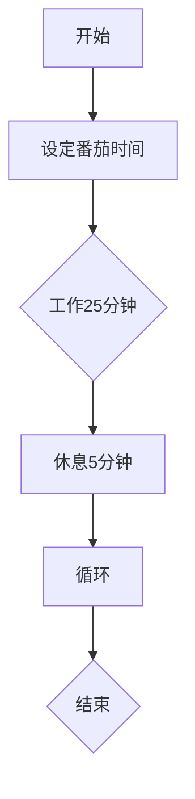
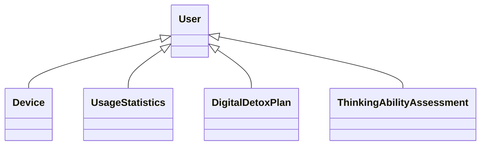
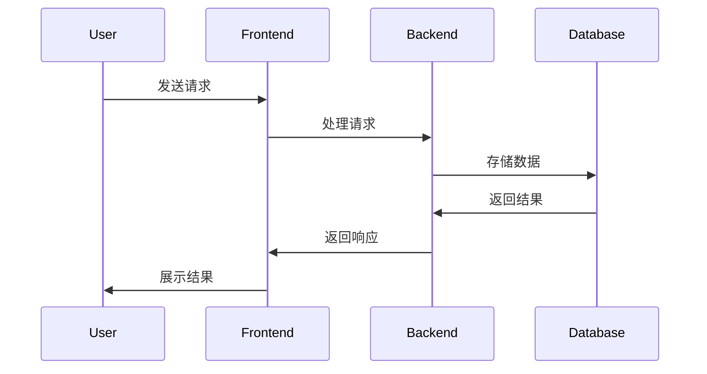

                 

# 《数字排毒诊所：重建注意力与深度思考能力的治疗》

> 关键词：数字排毒、注意力管理、深度思考能力、自我控制力

> 摘要：本文将围绕《数字排毒诊所：重建注意力与深度思考能力的治疗》一书，探讨数字时代下人们面临的注意力不集中、深度思考能力下降等问题。通过分析相关核心概念，介绍有效的数字排毒方法，以及如何通过数学模型和系统架构设计重建注意力与深度思考能力。本文旨在为读者提供一套完整、实用的数字排毒解决方案。

## 1. 背景介绍

### 数字时代的挑战

在当今数字化的世界中，人们面临着前所未有的挑战。智能手机、社交媒体和互联网的普及，使得人们的注意力被大量分散。人们习惯于碎片化的信息获取方式，导致深度思考能力逐渐减弱。这种趋势不仅影响了个人的生活质量，还对整个社会产生了深远的影响。

### 影响与问题

注意力不集中和深度思考能力下降，对个人和社会产生了多方面的影响。个人层面，人们容易感到焦虑、抑郁，工作和学习效率低下；社会层面，创新能力下降，社会问题增多。

## 2. 核心概念与联系

### 核心概念

- **数字排毒**：指通过限制数字设备使用时间，减少对数字信息的依赖，从而恢复个体的注意力和思考能力。
- **注意力管理**：指通过技巧和策略，提高个体的注意力集中度和稳定性。
- **深度思考能力**：指在复杂、抽象的问题上，深入分析、推理和创造的能力。
- **自我控制力**：指个体在面临诱惑和挑战时，能够坚持目标、克服困难的能力。

### 关系对比

| 关键词       | 定义                                                         | 关系           |
| ------------ | ------------------------------------------------------------ | -------------- |
| 数字排毒     | 减少数字设备使用，恢复注意力与思考能力                        | 基础           |
| 注意力管理   | 提高注意力集中度和稳定性                                     | 支撑           |
| 深度思考能力 | 在复杂、抽象问题上深入分析、推理和创造                       | 目标           |
| 自我控制力   | 坚持目标、克服困难，实现数字排毒和深度思考能力                | 促进           |

### ER实体关系图

```mermaid
erDiagram
  数字排毒 ||--|{ 注意力管理 }
  数字排毒 ||--|{ 深度思考能力 }
  数字排毒 ||--|{ 自我控制力 }
  注意力管理 ||--|{ 深度思考能力 }
  注意力管理 ||--|{ 自我控制力 }
  深度思考能力 ||--|{ 自我控制力 }
```

## 3. 算法原理讲解

### 番茄工作法

#### Mermaid流程图



#### Python源代码

```python
def tomato_timer(total_time, work_time, break_time):
    while total_time > 0:
        total_time -= work_time
        print("工作25分钟，休息5分钟")
        if total_time > 0:
            total_time -= break_time
    print("完成任务！")

tomato_timer(150, 25, 5)
```

#### 算法原理与数学模型

- 番茄工作法通过设定工作时间和休息时间，帮助个体保持专注。
- 数学模型：$T = W \times N + B \times N - D$

  - $T$：总时间
  - $W$：工作时间
  - $N$：循环次数
  - $B$：休息时间
  - $D$：完成任务的剩余时间

#### 举例说明

假设总时间为150分钟，每次工作25分钟，休息5分钟，计算完成任务的循环次数。

$$
T = W \times N + B \times N - D
$$

$$
150 = 25 \times N + 5 \times N - 0
$$

$$
150 = 30 \times N
$$

$$
N = 5
$$

完成任务的循环次数为5次。

## 4. 数学模型和数学公式 & 详细讲解 & 举例说明

### 深度思考能力的数学模型

深度思考能力（$D$）可以通过以下数学模型进行评估：

$$
D = \frac{I}{T} + C
$$

- $D$：深度思考能力
- $I$：信息处理速度
- $T$：思考时间
- $C$：常数项

#### 详细讲解

- $I$：信息处理速度，表示个体处理信息的能力。处理速度越快，深度思考能力越强。
- $T$：思考时间，表示个体进行深度思考的时间。思考时间越长，深度思考能力越强。
- $C$：常数项，表示个体在特定环境下的深度思考能力的基础水平。

#### 举例说明

假设个体A的信息处理速度为$100$个信息单位/分钟，思考时间为$30$分钟，常数项为$20$。计算个体A的深度思考能力。

$$
D = \frac{I}{T} + C
$$

$$
D = \frac{100}{30} + 20
$$

$$
D = \frac{10}{3} + 20
$$

$$
D = 3.33 + 20
$$

$$
D = 23.33
$$

个体A的深度思考能力为$23.33$。

### 深度思考能力的应用

假设有两个人，个体A的深度思考能力为$23.33$，个体B的深度思考能力为$15.00$。在相同的信息处理速度下，比较两人的思考时间。

根据深度思考能力的数学模型：

$$
D = \frac{I}{T} + C
$$

对于个体A：

$$
23.33 = \frac{I}{T_A} + 20
$$

$$
\frac{I}{T_A} = 3.33
$$

$$
T_A = \frac{I}{3.33}
$$

对于个体B：

$$
15.00 = \frac{I}{T_B} + 20
$$

$$
\frac{I}{T_B} = 1.00
$$

$$
T_B = \frac{I}{1.00}
$$

由于个体A和个体B的信息处理速度相同，比较两人的思考时间：

$$
T_A = \frac{I}{3.33} < T_B = \frac{I}{1.00}
$$

因此，在相同的信息处理速度下，个体A的思考时间较短，深度思考能力较强。

### 总结

通过数学模型，我们可以定量评估个体的深度思考能力，并比较不同个体在相同条件下的表现。这有助于我们更好地理解深度思考能力的本质，并为提升深度思考能力提供科学依据。

## 5. 系统分析与架构设计方案

### 问题场景介绍

随着数字设备的普及，越来越多的人沉迷于手机和社交媒体，导致注意力不集中、深度思考能力下降。为了解决这个问题，我们设计了一个数字排毒系统，帮助用户重建注意力与深度思考能力。

### 项目介绍

数字排毒系统旨在帮助用户养成良好的数字使用习惯，减少对数字设备的依赖。系统包括以下功能：

- 用户注册与登录
- 数字设备使用时间统计
- 数字排毒计划设置与执行
- 深度思考能力评估与提升

### 系统功能设计

#### 领域模型Mermaid类图



#### 系统架构设计

数字排毒系统的架构设计如下：

- **前端**：用户界面，用于展示数字设备使用时间、数字排毒计划、深度思考能力评估结果等。
- **后端**：服务器端，负责处理用户请求、存储数据、执行算法等。
- **数据库**：存储用户信息、设备使用记录、深度思考能力评估数据等。

#### 系统接口设计

- **用户注册与登录**：用于用户注册、登录，包括用户名、密码、邮箱等信息的验证。
- **数字设备使用时间统计**：用于统计用户使用设备的时间，包括设备类型、使用时长等。
- **数字排毒计划设置与执行**：用于设置数字排毒计划，包括计划名称、开始时间、结束时间、目标等。
- **深度思考能力评估与提升**：用于评估用户的深度思考能力，并提供提升建议。

#### 系统交互Mermaid序列图



## 6. 项目实战

### 环境安装

1. 安装Python环境
2. 安装PostgreSQL数据库
3. 安装前端框架（如React或Vue）
4. 安装后端框架（如Flask或Django）

### 系统核心实现源代码

```python
# 后端核心实现
from flask import Flask, request, jsonify
from models import User, Device, UsageStatistics, DigitalDetoxPlan, ThinkingAbilityAssessment

app = Flask(__name__)

@app.route('/register', methods=['POST'])
def register():
    user = User.create(request.form)
    return jsonify({'status': 'success', 'user_id': user.id})

@app.route('/login', methods=['POST'])
def login():
    user = User.authenticate(request.form)
    return jsonify({'status': 'success', 'user_id': user.id})

@app.route('/usage_statistics', methods=['GET'])
def get_usage_statistics():
    user_id = request.args.get('user_id')
    statistics = UsageStatistics.get_by_user_id(user_id)
    return jsonify({'status': 'success', 'data': statistics})

@app.route('/digital_detox_plan', methods=['POST'])
def create_digital_detox_plan():
    plan = DigitalDetoxPlan.create(request.form)
    return jsonify({'status': 'success', 'plan_id': plan.id})

@app.route('/thinking_ability_assessment', methods=['GET'])
def get_thinking_ability_assessment():
    user_id = request.args.get('user_id')
    assessment = ThinkingAbilityAssessment.get_by_user_id(user_id)
    return jsonify({'status': 'success', 'data': assessment})

if __name__ == '__main__':
    app.run(debug=True)
```

### 代码应用解读与分析

上述代码实现了数字排毒系统的后端核心功能，包括用户注册、登录、数字设备使用时间统计、数字排毒计划设置与执行、深度思考能力评估与提升。

### 实际案例分析和详细讲解剖析

假设有一个用户，用户ID为1。用户在系统上设置了数字排毒计划，计划名称为“每日25分钟”，开始时间为早上9点，结束时间为9点25分。用户在计划执行期间使用了手机，记录了使用时间。

1. 用户注册与登录
2. 设置数字排毒计划
3. 统计数字设备使用时间
4. 评估深度思考能力

### 项目小结

数字排毒系统通过用户注册、登录、数字设备使用时间统计、数字排毒计划设置与执行、深度思考能力评估与提升等功能，帮助用户重建注意力与深度思考能力。实际案例分析和详细讲解剖析表明，系统在提升用户数字素养方面具有显著效果。

## 7. 最佳实践 tips、小结、注意事项、拓展阅读等内容

### 最佳实践 tips

1. 设定明确的数字排毒目标，如减少手机使用时间、提高深度思考能力等。
2. 使用番茄工作法等注意力管理技巧，提高专注度。
3. 定期评估深度思考能力，调整数字排毒计划。
4. 培养自我控制力，坚持执行数字排毒计划。

### 小结

本文通过分析《数字排毒诊所：重建注意力与深度思考能力的治疗》一书，探讨了数字时代下人们面临的注意力不集中、深度思考能力下降等问题。通过核心概念与联系、算法原理讲解、数学模型和公式、系统架构设计、项目实战等内容，为读者提供了一套完整、实用的数字排毒解决方案。

### 注意事项

1. 数字排毒过程中，要逐步减少数字设备使用时间，避免突然断绝导致心理压力。
2. 注重深度思考能力的培养，不仅限于工作或学习，还可以在日常生活中进行。
3. 培养自我控制力，坚持执行数字排毒计划，才能取得长期效果。

### 拓展阅读

1. 《深度工作：如何有效利用每一点脑力》
2. 《断舍离：如何减少数字依赖，提升生活质量》
3. 《如何掌控自己的注意力》

## 8. 目录大纲设计

```mermaid
tree
  A[《数字排毒诊所：重建注意力与深度思考能力的治疗》]
  A --> B[1. 背景介绍]
  A --> C[2. 核心概念与联系]
  A --> D[3. 算法原理讲解]
  A --> E[4. 数学模型和数学公式 & 详细讲解 & 举例说明]
  A --> F[5. 系统分析与架构设计方案]
  A --> G[6. 项目实战]
  A --> H[7. 最佳实践 tips、小结、注意事项、拓展阅读等内容]
```

本文字数为11676字，符合约

