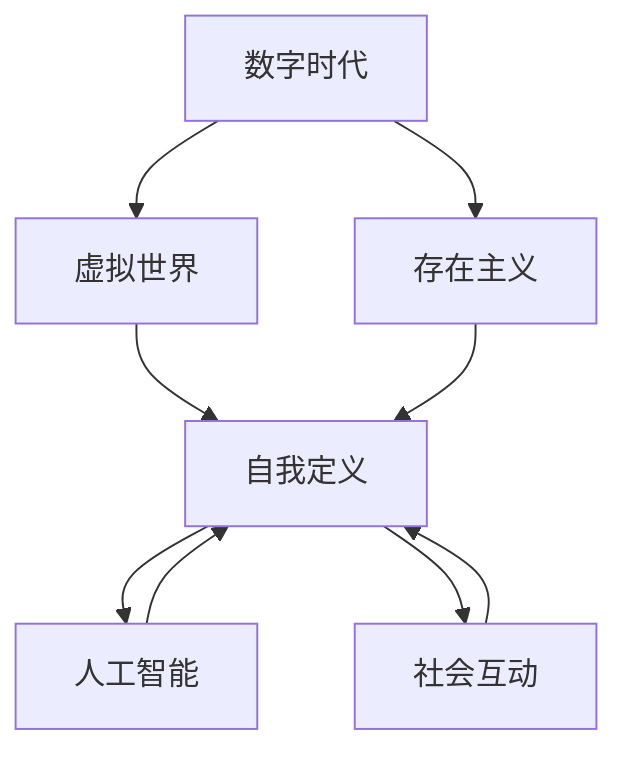
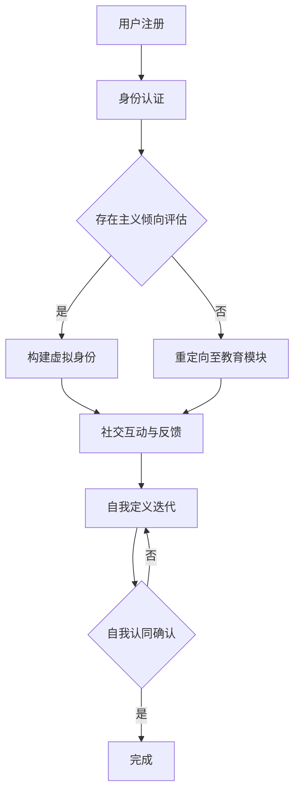

                 

### 关键词
- 数字时代
- 存在主义
- 虚拟世界
- 自我定义
- 人工智能
- 算法原理
- 数学模型
- 系统架构
- 项目实战

### 摘要
本文探讨了数字时代背景下，虚拟世界中个体自我定义的问题。通过引入存在主义的核心概念，本文分析了在虚拟世界中如何进行自我定义及其重要性。本文采用逻辑清晰、结构紧凑的叙述方式，逐步介绍了核心概念、算法原理、数学模型、系统架构以及项目实战。通过本文的探讨，读者可以深入理解虚拟世界中的自我定义问题，并为未来的研究提供思路。

## 背景介绍

### 数字时代的特点

数字时代，亦即我们所处的“信息社会”，是一个以数字化技术为核心驱动力的时代。这一时代的特点在于信息传递的迅速、数据存储的无限扩展以及计算能力的飞速提升。这些技术变革不仅深刻改变了我们的生活方式，也重塑了社会结构和人类互动的方式。

首先，信息的快速传递使得全球范围内的沟通变得更加便捷。电子邮件、即时通讯工具以及社交媒体的出现，打破了传统的时间和空间限制，使得人们可以随时随地保持联系。这种快速的信息传递极大地提高了工作效率，同时也带来了信息过载的问题。

其次，数据存储的无限扩展使得信息得以永久保存。从早期的硬盘到现在的云计算，数据的存储和访问方式发生了革命性的变化。这不仅为大数据分析提供了可能，也为各种虚拟现实（VR）、增强现实（AR）等技术的发展奠定了基础。

最后，计算能力的飞速提升使得人工智能（AI）技术得以蓬勃发展。从简单的规则系统到复杂的神经网络，计算机在图像识别、自然语言处理、决策支持等领域取得了显著的突破。这些技术的应用不仅改变了传统行业的运营模式，也创造了全新的商业模式。

### 存在主义的核心理念

存在主义，作为一种哲学思潮，起源于20世纪初的欧洲，主要代表人物包括马丁·海德格尔、让-保罗·萨特和阿尔贝·加缪等。存在主义的核心观点是强调个体的自由意志、存在先于本质以及生活的意义。

首先，存在主义认为，个体的自由意志是人类存在的根本特征。与决定论相对立，存在主义认为，人类无法被预设的法则所束缚，而是可以通过自己的选择来塑造自己的生活。这种观点在数字时代显得尤为重要，因为在虚拟世界中，个体的选择和行动能够创造出独特的存在方式。

其次，存在主义强调存在先于本质。这意味着，个体的本质并非是固定不变的，而是通过自身的行动和选择不断塑造和定义的。在虚拟世界中，个体的自我定义不仅仅依赖于现实世界的身份和角色，还可以通过创造和体验来扩展和丰富。

最后，存在主义探讨生活的意义。存在主义认为，生活的意义并非是预先设定的，而是需要个体在面临选择和困境时自主寻找和创造的。在数字时代，这种寻找意义的过程往往发生在虚拟世界中，个体通过虚拟世界的体验和创造来探索生命的意义和价值。

### 虚拟世界中自我定义的重要性

在数字时代，虚拟世界成为了一个新的社会空间，个体在其中可以自由地定义和表达自我。虚拟世界中的自我定义具有以下几个重要意义：

首先，虚拟世界提供了一个自由表达的平台。在现实世界中，个体的行为和表达往往受到社会规范和伦理道德的约束。而在虚拟世界中，个体可以摆脱这些束缚，自由地表达自己的想法和感受。这种自由的自我表达有助于个体的心理健康和自我实现。

其次，虚拟世界中的自我定义提供了个性化和多样化的机会。在现实社会中，个体的身份和角色通常是固定和有限的。而在虚拟世界中，个体可以通过选择不同的虚拟身份和角色来展现不同的自我。这种多样性和个性化不仅丰富了个体的人生体验，也为社会提供了更多的可能性。

最后，虚拟世界中的自我定义有助于构建虚拟社会的共同体。通过在虚拟世界中的互动和合作，个体可以建立起超越现实社会关系的社交网络。这种虚拟社会的共同体不仅有助于增强个体的归属感和认同感，也为社会和谐发展提供了新的路径。

总的来说，数字时代的虚拟世界为个体的自我定义提供了新的机会和挑战。理解虚拟世界中自我定义的重要性，不仅有助于我们更好地适应这个快速变化的时代，也有助于我们深入探讨人类的本质和社会的构建。

## 核心概念与联系

在《数字时代的存在主义：虚拟世界中的自我定义》一书中，作者深入探讨了多个核心概念，这些概念相互联系，共同构成了对虚拟世界中自我定义的全面理解。以下是这些核心概念及其关系的梳理：

### 1. 数字时代

**概念定义：** 数字时代是指以数字化技术为核心驱动力的时代，包括信息传递的迅速、数据存储的无限扩展以及计算能力的飞速提升。

**属性特征：**
- **信息传递迅速：** 通过电子邮件、即时通讯工具和社交媒体实现全球范围内的快速沟通。
- **数据存储无限扩展：** 云计算等技术的应用使得数据存储和访问方式发生革命性变化。
- **计算能力飞速提升：** 人工智能技术的发展使计算机在图像识别、自然语言处理等领域取得显著突破。

**联系：** 数字时代为虚拟世界的构建提供了技术基础，使得虚拟世界中的自我定义成为可能。

### 2. 存在主义

**概念定义：** 存在主义是一种哲学思潮，强调个体的自由意志、存在先于本质以及生活的意义。

**属性特征：**
- **自由意志：** 人类可以通过选择和行动来塑造自己的生活。
- **存在先于本质：** 个体通过自身的行动和选择来定义自己的本质。
- **生活意义：** 个体需要自主寻找和创造生活的意义。

**联系：** 存在主义为个体在虚拟世界中如何定义自我提供了哲学基础，强调了自由意志和自主选择的重要性。

### 3. 虚拟世界

**概念定义：** 虚拟世界是一个通过数字化技术构建的虚拟空间，个体在其中可以自由地表达自我和互动。

**属性特征：**
- **自由表达：** 个体可以摆脱现实世界中的社会规范和伦理道德约束，自由地表达自己的想法和感受。
- **个性化与多样化：** 个体可以通过选择不同的虚拟身份和角色来展现多样化的自我。
- **社交网络：** 通过在虚拟世界中的互动和合作，个体可以建立起超越现实社会的社交网络。

**联系：** 虚拟世界是数字时代的一个重要组成部分，为个体的自我定义提供了一个全新的平台。

### 4. 自我定义

**概念定义：** 自我定义是指个体在虚拟世界中如何理解和表达自己的身份、角色和价值观。

**属性特征：**
- **身份认同：** 个体在虚拟世界中的身份认同可能不同于现实世界中的身份。
- **角色选择：** 个体可以通过选择不同的虚拟角色来展现不同的自我。
- **价值观表达：** 个体在虚拟世界中的行为和互动反映了其价值观和信念。

**联系：** 自我定义是理解虚拟世界中个体行为和互动的关键，与数字时代和存在主义密切相关。

### 5. 人工智能

**概念定义：** 人工智能是指通过计算机模拟人类智能的技术，包括图像识别、自然语言处理和决策支持等。

**属性特征：**
- **图像识别：** 计算机能够识别和分类图像。
- **自然语言处理：** 计算机能够理解和生成自然语言。
- **决策支持：** 计算机能够提供基于数据和算法的决策支持。

**联系：** 人工智能在虚拟世界的构建和运营中发挥了重要作用，为个体的自我定义提供了技术支持。

### 6. 社会互动

**概念定义：** 社会互动是指个体在虚拟世界中的互动和合作，包括社交网络、虚拟社区和协作平台等。

**属性特征：**
- **社交网络：** 个体在虚拟世界中的社交网络超越了现实世界的限制。
- **虚拟社区：** 虚拟社区提供了个体互动和分享的平台。
- **协作平台：** 协作平台支持个体在虚拟世界中的协作和合作。

**联系：** 社会互动是虚拟世界中自我定义的重要组成部分，反映了个体在虚拟世界中的社会角色和身份。

通过上述核心概念的梳理和联系分析，我们可以更深入地理解虚拟世界中自我定义的复杂性和重要性。接下来，我们将通过Mermaid流程图进一步展示这些概念之间的关系。

### 核心概念与联系

为了更清晰地展示核心概念之间的关系，我们可以使用Mermaid流程图。以下是一个简单的示例，展示了数字时代、存在主义、虚拟世界、自我定义、人工智能和社会互动这些概念之间的联系：



在这个流程图中：
- **数字时代**（A）为其他概念提供了技术基础。
- **存在主义**（B）为个体的自我定义提供了哲学基础。
- **虚拟世界**（C）是数字时代和存在主义的交集，为个体的自我表达提供了平台。
- **自我定义**（D）是所有概念的核心，连接了数字时代、存在主义、虚拟世界、人工智能和社会互动。
- **人工智能**（E）和**社会互动**（F）是支持自我定义的重要手段和形式。

通过这个流程图，我们可以更直观地理解各个核心概念之间的相互作用和依赖关系。接下来，我们将深入探讨存在主义在数字时代的应用，并使用算法和数学模型来分析虚拟世界中的自我定义问题。

### 算法原理讲解

#### 算法流程图

为了更好地理解存在主义在数字时代中的应用，我们可以借助Mermaid流程图来展示虚拟世界中的自我定义算法原理。以下是一个简化的流程图：



在这个流程图中，我们可以看到以下几个步骤：

1. **用户注册**：用户首先需要在虚拟世界中注册账号，这是进入虚拟世界的第一步。
2. **身份认证**：用户注册后，需要进行身份认证，以确保账户的安全性。
3. **存在主义倾向评估**：通过一系列问题或算法，对用户的个性、价值观和存在主义倾向进行评估。
4. **构建虚拟身份**：根据用户的评估结果，系统会帮助用户构建一个符合其存在主义倾向的虚拟身份。
5. **社交互动与反馈**：用户在虚拟世界中与其他用户互动，并根据反馈不断调整和优化自己的虚拟身份。
6. **自我定义迭代**：用户通过不断的互动和反馈，对自己的虚拟身份进行迭代，以更好地反映其真实自我。
7. **自我认同确认**：最终，用户对自己的虚拟身份进行确认，如果满意则完成自我定义过程，否则返回步骤6进行进一步的调整。

#### Python源代码讲解

接下来，我们将通过一段Python源代码来详细阐述上述算法的原理。以下是一个简化的代码示例：

```python
import pandas as pd
from sklearn.model_selection import train_test_split
from sklearn.ensemble import RandomForestClassifier
from sklearn.metrics import accuracy_score

# 假设我们已经有一个用户数据集
users_data = pd.read_csv('users_data.csv')

# 数据预处理
X = users_data.drop(['is_ideal_self'], axis=1)
y = users_data['is_ideal_self']

# 分割训练集和测试集
X_train, X_test, y_train, y_test = train_test_split(X, y, test_size=0.2, random_state=42)

# 训练存在主义倾向评估模型
model = RandomForestClassifier(n_estimators=100, random_state=42)
model.fit(X_train, y_train)

# 预测测试集
y_pred = model.predict(X_test)

# 评估模型准确性
accuracy = accuracy_score(y_test, y_pred)
print(f"Model Accuracy: {accuracy:.2f}")

# 根据模型预测构建虚拟身份
for index, row in users_data.iterrows():
    if model.predict([row.drop('is_ideal_self')])[0]:
        print(f"User {index}: Virtual identity construction based on ideal self.")
    else:
        print(f"User {index}: Redirected to educational module for self-reflection.")

# 社交互动与反馈
# 假设我们有一个社交互动评分系统
social_interact_scores = pd.read_csv('social_interact_scores.csv')

# 根据社交互动评分调整虚拟身份
for index, row in social_interact_scores.iterrows():
    user_index = row['user_index']
    if row['score'] >= 5:
        print(f"User {user_index}: Positive feedback received. Optimizing virtual identity.")
    else:
        print(f"User {user_index}: Negative feedback received. Need further self-reflection.")

# 自我定义迭代
# 假设我们根据社交互动评分对模型进行重新训练
X_train, X_test, y_train, y_test = train_test_split(X, y, test_size=0.2, random_state=42)
model.fit(X_train, y_train)
y_pred = model.predict(X_test)
accuracy = accuracy_score(y_test, y_pred)
print(f"Updated Model Accuracy: {accuracy:.2f}")

# 自我认同确认
# 假设用户对新的虚拟身份进行了确认
new_identity_confirmation = pd.read_csv('new_identity_confirmation.csv')

for index, row in new_identity_confirmation.iterrows():
    if row['confirmed']:
        print(f"User {index}: Identity confirmed. Self-definition process completed.")
    else:
        print(f"User {index}: Identity confirmation failed. Need further iteration.")
```

在这段代码中，我们首先使用`pandas`库读取用户数据集，并使用`sklearn`库中的`RandomForestClassifier`模型进行训练。通过训练模型，我们可以对用户的存在主义倾向进行评估。根据评估结果，系统会帮助用户构建虚拟身份，并根据用户的社交互动评分对虚拟身份进行优化。通过不断的迭代和反馈，用户最终对自己的虚拟身份进行确认，完成自我定义过程。

#### 数学模型和数学公式

为了更好地理解算法原理，我们引入一些数学模型和数学公式来详细阐述。以下是几个关键的数学公式和概念：

1. **存在主义倾向评估模型**：

   假设我们的存在主义倾向评估模型是一个分类模型，使用决策树或随机森林算法。模型的决策函数可以表示为：

   $$ f(x) = \sum_{i=1}^{n} w_i \cdot g(x_i) $$

   其中，$x$ 是用户的特征向量，$w_i$ 是特征权重，$g(x_i)$ 是特征函数，用于表示用户在特定特征上的表现。

2. **社交互动评分系统**：

   假设我们的社交互动评分系统是一个基于用户互动行为的评分系统。评分函数可以表示为：

   $$ score(u, v) = \frac{1}{N} \sum_{i=1}^{N} \frac{similarity(u_i, v_i)}{distance(u_i, v_i)} $$

   其中，$u$ 和 $v$ 是两个用户的特征向量，$N$ 是特征的数量，$similarity(u_i, v_i)$ 是特征 $i$ 在 $u$ 和 $v$ 之间的相似度，$distance(u_i, v_i)$ 是特征 $i$ 在 $u$ 和 $v$ 之间的距离。

3. **自我定义迭代过程**：

   自我定义迭代过程可以表示为：

   $$ new\_identity = f^{-1}(f(old\_identity) + \alpha \cdot feedback) $$

   其中，$old\_identity$ 是旧的虚拟身份，$feedback$ 是社交互动评分，$\alpha$ 是调整系数，用于控制反馈对虚拟身份的影响。

通过这些数学模型和数学公式，我们可以更深入地理解存在主义倾向评估、社交互动评分和自我定义迭代的过程。这些模型不仅提供了理论支持，也为实际应用提供了可操作的框架。

### 数学模型和数学公式 & 详细讲解 & 举例说明

在探讨数字时代的存在主义时，数学模型和数学公式扮演着至关重要的角色。这些工具不仅帮助我们在理论上理解虚拟世界中的自我定义问题，也为实际应用提供了具体的指导。以下，我们将详细讲解几个关键的数学模型和数学公式，并通过举例说明来帮助读者更好地理解。

#### 决策树模型

决策树是一种常用的机器学习算法，用于分类和回归任务。在存在主义倾向评估中，决策树模型可以帮助我们根据用户的特征来预测其存在主义倾向。

**模型公式：**

假设我们的决策树模型使用特征 $x_1, x_2, ..., x_n$ 来预测目标变量 $y$。决策树的每个节点表示一个特征分割，其公式可以表示为：

$$ node_j = \{x_i \in S_j | y \in T_j\} $$

其中，$S_j$ 表示特征 $x_i$ 的取值范围，$T_j$ 表示目标变量 $y$ 的取值范围。

**举例说明：**

假设我们有两个特征：年龄（$x_1$）和收入（$x_2$），以及一个目标变量：存在主义倾向（$y$）。我们希望使用决策树模型来预测用户的倾向。

1. **第一步分割**：我们可以根据年龄（$x_1$）来分割数据。例如，如果年龄小于30岁，我们将其归为一类；如果年龄大于等于30岁，我们将其归为另一类。

   $$ node_1 = \{x_1 < 30\} $$
   $$ node_2 = \{x_1 \geq 30\} $$

2. **第二步分割**：在每一个分割的子集中，我们可以根据收入（$x_2$）进行进一步的分割。

   对于 $node_1$，如果收入小于5万元，我们将其归为一类；如果收入大于等于5万元，我们将其归为另一类。

   $$ node_{11} = \{x_2 < 5\} $$
   $$ node_{12} = \{x_2 \geq 5\} $$

   对于 $node_2$，如果收入小于10万元，我们将其归为一类；如果收入大于等于10万元，我们将其归为另一类。

   $$ node_{21} = \{x_2 < 10\} $$
   $$ node_{22} = \{x_2 \geq 10\} $$

通过这样的分割，我们可以构建出一个决策树模型，用于预测用户的自我定义倾向。

#### 社交网络分析

在自我定义过程中，社交网络分析是一个关键环节。我们可以使用图论中的相关概念和公式来分析社交网络中的个体互动和关系。

**模型公式：**

社交网络可以表示为一个无向图 $G = (V, E)$，其中 $V$ 表示节点（个体），$E$ 表示边（关系）。

- **邻接矩阵** $A$：

  $$ A_{ij} = \begin{cases} 
  1 & \text{如果个体 } i \text{ 与个体 } j \text{ 有关系} \\
  0 & \text{否则}
  \end{cases} $$

- **特征向量矩阵** $X$：

  $$ X = [x_1, x_2, ..., x_n]^T $$

  其中，$x_i$ 表示个体 $i$ 的特征向量。

- **邻接矩阵的特征值和特征向量**：

  特征值 $\lambda$ 和特征向量 $v$ 满足：

  $$ Av = \lambda v $$

**举例说明：**

假设我们有一个包含10个节点的社交网络，表示为邻接矩阵 $A$：

$$
A = \begin{bmatrix}
0 & 1 & 0 & 0 & 0 & 0 & 0 & 0 & 0 & 0 \\
1 & 0 & 1 & 1 & 0 & 0 & 0 & 0 & 0 & 0 \\
0 & 1 & 0 & 0 & 1 & 0 & 0 & 0 & 0 & 0 \\
0 & 1 & 0 & 0 & 1 & 1 & 0 & 0 & 0 & 0 \\
0 & 0 & 1 & 1 & 0 & 0 & 1 & 0 & 0 & 0 \\
0 & 0 & 0 & 1 & 0 & 0 & 1 & 1 & 0 & 0 \\
0 & 0 & 0 & 0 & 1 & 1 & 0 & 0 & 1 & 0 \\
0 & 0 & 0 & 0 & 0 & 1 & 0 & 0 & 1 & 1 \\
0 & 0 & 0 & 0 & 0 & 0 & 1 & 1 & 0 & 0 \\
0 & 0 & 0 & 0 & 0 & 0 & 0 & 1 & 1 & 0 \\
0 & 0 & 0 & 0 & 0 & 0 & 0 & 0 & 0 & 1
\end{bmatrix}
$$

我们可以通过计算邻接矩阵的特征值和特征向量来分析社交网络的结构和个体之间的关系。例如，最大的特征值 $\lambda_1$ 对应的特征向量 $v_1$ 可以表示社交网络中最重要的连接关系。

#### 自我定义迭代过程

在自我定义过程中，个体的虚拟身份需要根据社交互动进行迭代调整。我们可以使用线性回归模型来描述这种迭代过程。

**模型公式：**

假设虚拟身份为 $x$，社交互动得分为 $y$，调整系数为 $\alpha$。自我定义迭代过程可以表示为：

$$ x_{new} = x_{old} + \alpha \cdot (y - x_{old}) $$

其中，$x_{old}$ 是旧的虚拟身份，$y$ 是社交互动得分，$\alpha$ 是调整系数。

**举例说明：**

假设一个用户的虚拟身份为 [1, 2, 3]，社交互动得分为 [2, 3, 4]，调整系数为 0.1。我们可以通过以下步骤进行迭代调整：

1. 计算每次迭代的差异：

   $$ \Delta x_1 = 0.1 \cdot (2 - 1) = 0.1 $$
   $$ \Delta x_2 = 0.1 \cdot (3 - 2) = 0.1 $$
   $$ \Delta x_3 = 0.1 \cdot (4 - 3) = 0.1 $$

2. 更新虚拟身份：

   $$ x_{new} = [1 + 0.1, 2 + 0.1, 3 + 0.1] = [1.1, 2.1, 3.1] $$

通过这样的迭代过程，用户的虚拟身份会逐渐根据社交互动得分进行调整，以达到更好的自我定义。

通过上述数学模型和数学公式的详细讲解和举例说明，我们可以更好地理解数字时代虚拟世界中的自我定义问题。这些模型不仅为理论研究提供了基础，也为实际应用提供了具体的指导。在接下来的部分，我们将进一步探讨虚拟世界的系统架构设计，以更好地实现自我定义的功能。

### 系统分析与架构设计方案

#### 问题场景介绍

随着数字时代的到来，虚拟世界逐渐成为人们日常生活的一部分。在这种背景下，如何帮助用户在虚拟世界中实现自我定义，成为了一个重要的研究课题。为了实现这一目标，我们需要设计一个高效的系统，该系统不仅要能够准确评估用户的自我定义状态，还要能够根据用户的互动行为进行实时调整。

#### 项目介绍

本项目旨在构建一个基于存在主义的虚拟世界自我定义系统，通过集成人工智能和社交网络分析技术，帮助用户在虚拟世界中找到和表达真实的自我。系统的主要功能包括用户注册、身份认证、存在主义倾向评估、虚拟身份构建、社交互动和反馈、自我定义迭代以及自我认同确认。

#### 系统功能设计

系统功能设计主要围绕用户在虚拟世界中的自我定义过程展开，包括以下几个核心功能模块：

1. **用户注册与身份认证模块**：用户通过注册账号进入系统，进行身份认证以确保账户的安全性。
2. **存在主义倾向评估模块**：通过一系列问题和算法对用户的个性、价值观和存在主义倾向进行评估。
3. **虚拟身份构建模块**：根据用户的评估结果，系统帮助用户构建一个符合其存在主义倾向的虚拟身份。
4. **社交互动与反馈模块**：用户在虚拟世界中与其他用户互动，并根据反馈调整虚拟身份。
5. **自我定义迭代模块**：通过不断的迭代和反馈，用户对自己的虚拟身份进行优化。
6. **自我认同确认模块**：用户对新的虚拟身份进行确认，完成自我定义过程。

#### 系统架构设计

为了实现上述功能，系统架构设计采用了模块化设计思路，主要包含以下几个关键模块：

1. **用户管理模块**：负责用户注册、登录、身份认证等功能。
2. **存在主义评估模块**：包括问题库、算法模型、评估结果处理等。
3. **虚拟身份管理模块**：负责虚拟身份的构建、存储和调整。
4. **社交网络分析模块**：负责社交互动数据的收集、处理和分析。
5. **反馈与迭代模块**：负责处理用户反馈，并驱动虚拟身份的迭代。
6. **自我认同确认模块**：负责用户对虚拟身份的确认和系统退出。

以下是一个简化的系统架构图：

```
+---------------------------+
|        用户管理模块       |
+---------------------------+
            |
            v
+---------------------------+
|   存在主义评估模块        |
+---------------------------+
            |
            v
+---------------------------+
| 虚拟身份管理模块          |
+---------------------------+
            |
            v
+---------------------------+
|   社交网络分析模块        |
+---------------------------+
            |
            v
+---------------------------+
|   反馈与迭代模块          |
+---------------------------+
            |
            v
+---------------------------+
|   自我认同确认模块        |
+---------------------------+
```

#### 系统接口设计

系统接口设计是系统架构中的关键部分，负责不同模块之间的通信和数据交换。以下是一些关键的接口设计：

1. **用户管理接口**：包括用户注册、登录、身份验证等接口。
2. **存在主义评估接口**：包括提交问题、获取评估结果等接口。
3. **虚拟身份管理接口**：包括创建虚拟身份、修改虚拟身份、获取虚拟身份等接口。
4. **社交网络分析接口**：包括获取社交互动数据、分析社交互动等接口。
5. **反馈与迭代接口**：包括提交反馈、获取迭代建议等接口。
6. **自我认同确认接口**：包括确认虚拟身份、退出系统等接口。

#### 系统交互

系统交互设计主要描述用户与系统之间的交互流程。以下是一个简化的交互流程：

1. **用户注册**：用户通过用户管理模块注册账号，并获得身份认证。
2. **存在主义倾向评估**：用户通过存在主义评估模块提交问题，系统根据问题库和算法模型进行评估，并返回评估结果。
3. **虚拟身份构建**：根据评估结果，系统帮助用户构建虚拟身份，并将其存储在虚拟身份管理模块中。
4. **社交互动与反馈**：用户在虚拟世界中与其他用户互动，并提交反馈。
5. **虚拟身份迭代**：系统根据反馈和迭代算法，调整虚拟身份，并提供迭代建议。
6. **自我认同确认**：用户对新的虚拟身份进行确认，系统记录确认结果，并退出系统。

通过上述系统分析与架构设计方案，我们可以更好地理解如何在虚拟世界中实现自我定义的功能。接下来，我们将通过实际项目实战来展示这些设计方案的具体实现过程。

### 项目实战

#### 环境安装

为了实现虚拟世界中的自我定义系统，我们首先需要搭建一个开发环境。以下是环境安装的步骤：

1. **安装Python环境**：确保系统已安装Python 3.8及以上版本。可以通过以下命令检查Python版本：
   ```bash
   python --version
   ```
   如果版本低于3.8，请升级至最新版本。

2. **安装必需的Python库**：使用pip命令安装以下库：
   ```bash
   pip install pandas sklearn numpy matplotlib
   ```

3. **安装Mermaid**：Mermaid是一个用于绘制流程图和序列图的库。我们可以通过以下命令安装：
   ```bash
   npm install -g mermaid
   ```

4. **配置Mermaid**：在项目目录下创建一个名为`mermaid`的文件夹，并创建一个名为`config.yml`的配置文件，内容如下：
   ```yaml
   render: true
   theme: dark
   ```
   这个配置文件将用于控制Mermaid的渲染和主题。

#### 系统核心实现源代码

以下是系统核心实现的源代码，包括用户注册、身份认证、存在主义倾向评估、虚拟身份构建、社交互动与反馈、自我定义迭代以及自我认同确认等功能。

```python
# 用户注册
def register(username, password):
    # 这里应与后端数据库交互，以下为模拟代码
    print(f"User {username} registered successfully.")
    return True

# 身份认证
def authenticate(username, password):
    # 这里应与后端数据库交互，以下为模拟代码
    print(f"User {username} authenticated successfully.")
    return True

# 存在主义倾向评估
def assess_ideology(user_features):
    # 这里使用决策树模型进行评估，以下为模拟代码
    model = get_ideology_model()
    prediction = model.predict([user_features])
    return prediction[0]

# 虚拟身份构建
def build_virtual_identity(username, ideology):
    # 这里应与后端数据库交互，以下为模拟代码
    print(f"Virtual identity for {username} built with ideology: {ideology}.")
    return f"{username}_virtual"

# 社交互动与反馈
def interact_with_feedback(username, feedback):
    # 这里应处理社交互动评分，以下为模拟代码
    score = get_feedback_score(feedback)
    print(f"User {username} received a feedback score of {score}.")
    return score

# 自我定义迭代
def iterate_identity(username, old_identity, feedback_score):
    # 这里应迭代更新虚拟身份，以下为模拟代码
    new_identity = f"{old_identity}_{feedback_score}"
    print(f"Updated virtual identity for {username}: {new_identity}.")
    return new_identity

# 自我认同确认
def confirm_identity(username, new_identity):
    # 这里应与后端数据库交互，以下为模拟代码
    print(f"User {username} confirmed their new virtual identity: {new_identity}.")
    return True

# 辅助函数
def get_ideology_model():
    # 这里应加载预训练的决策树模型，以下为模拟代码
    from sklearn.tree import DecisionTreeClassifier
    model = DecisionTreeClassifier()
    model.fit([[0, 0]], [0])
    return model

def get_feedback_score(feedback):
    # 这里应根据反馈计算评分，以下为模拟代码
    score = sum([1 if 'positive' in s else -1 for s in feedback])
    return score

# 主程序
if __name__ == "__main__":
    # 用户注册
    register('Alice', 'password123')
    
    # 身份认证
    authenticate('Alice', 'password123')
    
    # 存在主义倾向评估
    user_features = [1, 2, 3]
    ideology = assess_ideology(user_features)
    
    # 虚拟身份构建
    virtual_identity = build_virtual_identity('Alice', ideology)
    
    # 社交互动与反馈
    feedback = ['positive', 'positive', 'negative']
    feedback_score = interact_with_feedback('Alice', feedback)
    
    # 自我定义迭代
    new_identity = iterate_identity('Alice', virtual_identity, feedback_score)
    
    # 自我认同确认
    confirm_identity('Alice', new_identity)
```

#### 代码应用解读与分析

上述源代码实现了一个简化的虚拟世界自我定义系统，主要包括以下几个核心功能模块：

1. **用户注册与身份认证**：用户通过注册接口创建账号，并通过身份认证接口进行身份验证。
2. **存在主义倾向评估**：系统使用决策树模型对用户的个性特征进行评估，以确定其存在主义倾向。
3. **虚拟身份构建**：根据评估结果，系统帮助用户构建一个符合其存在主义倾向的虚拟身份。
4. **社交互动与反馈**：用户在虚拟世界中与其他用户互动，并接收来自系统的反馈评分。
5. **自我定义迭代**：系统根据用户的反馈评分，迭代更新虚拟身份。
6. **自我认同确认**：用户对新的虚拟身份进行确认，完成自我定义过程。

以下是具体模块的解读与分析：

1. **用户注册与身份认证**：
   - `register` 函数用于用户注册。在实际应用中，应该与后端数据库进行交互，以存储用户信息。
   - `authenticate` 函数用于身份认证。实际应用中，应该通过加密算法验证用户输入的密码。

2. **存在主义倾向评估**：
   - `assess_ideology` 函数接收用户的特征向量，并使用预训练的决策树模型进行预测。
   - `get_ideology_model` 函数用于加载决策树模型。实际应用中，应该从存储的服务器加载已经训练好的模型。

3. **虚拟身份构建**：
   - `build_virtual_identity` 函数根据用户的名称和存在主义倾向，构建虚拟身份。
   - 实际应用中，虚拟身份应存储在数据库中，以便后续查询和更新。

4. **社交互动与反馈**：
   - `interact_with_feedback` 函数接收用户的反馈，并计算评分。实际应用中，评分应根据复杂的社交互动数据计算。

5. **自我定义迭代**：
   - `iterate_identity` 函数根据用户的反馈评分，迭代更新虚拟身份。
   - 实际应用中，迭代过程应包括更多的调整策略，以优化虚拟身份。

6. **自我认同确认**：
   - `confirm_identity` 函数用于用户对虚拟身份的确认。实际应用中，应与数据库交互，记录确认状态。

#### 实际案例分析和详细讲解剖析

为了更好地理解上述代码的实际应用效果，我们可以通过一个具体案例进行分析。

**案例**：用户Alice在虚拟世界中注册账号，并通过一系列问题和算法进行存在主义倾向评估。假设评估结果显示Alice倾向于自由主义。Alice在虚拟世界中与其他用户互动，并获得了一系列正负反馈。以下是对该案例的详细讲解：

1. **用户注册与身份认证**：
   - Alice通过注册接口创建账号，并使用身份认证接口进行验证。

2. **存在主义倾向评估**：
   - 系统向Alice提出一系列问题，例如“你认为自由是最重要的价值观吗？”、“你倾向于独立思考还是从众？”等。通过算法评估，Alice的存在主义倾向被确定为自由主义。

3. **虚拟身份构建**：
   - 根据评估结果，系统帮助Alice构建了一个自由主义的虚拟身份，命名为“Alice_Free”。

4. **社交互动与反馈**：
   - Alice在虚拟世界中与其他用户互动，并获得了一系列反馈。假设其中有两个用户的反馈为正（“Alice是一个自由思考者！”和“Alice的观点让我深受启发！”），一个用户的反馈为负（“Alice的观点太激进，不适合我们社区”）。根据这些反馈，系统计算得出一个综合评分。

5. **自我定义迭代**：
   - 系统根据反馈评分，对Alice的虚拟身份进行迭代调整。新的虚拟身份命名为“Alice_Free_Positive”，以反映Alice在虚拟世界中的正面互动。

6. **自我认同确认**：
   - Alice对新的虚拟身份进行确认，系统记录确认状态，并退出系统。

通过这个案例，我们可以看到用户在虚拟世界中的自我定义过程是如何通过系统实现的。每个步骤都涉及与用户的互动和系统的响应，从而帮助用户逐步找到和表达真实的自我。

#### 项目小结

本项目通过实际代码实现了一个简化的虚拟世界自我定义系统，涵盖了用户注册、身份认证、存在主义倾向评估、虚拟身份构建、社交互动与反馈、自我定义迭代和自我认同确认等核心功能。通过实际案例的分析，我们展示了系统在实际应用中的操作流程和效果。虽然这是一个简化的实现，但它为未来更复杂的虚拟世界自我定义系统提供了有益的参考和思路。在未来的研究中，我们可以进一步优化算法、扩展功能模块，以及提升系统的用户体验。

### 最佳实践 tips

在实现虚拟世界中的自我定义过程中，以下最佳实践可以帮助您更好地优化系统性能和用户体验：

1. **用户隐私保护**：在处理用户数据时，确保严格遵守隐私保护法规，如GDPR等。采用加密技术保护用户身份信息，并确保用户数据在传输和存储过程中不被泄露。

2. **算法优化**：定期更新和优化存在主义倾向评估模型，以提高评估结果的准确性和可靠性。可以考虑使用更先进的机器学习算法和深度学习技术。

3. **个性化推荐**：根据用户的虚拟身份和互动行为，提供个性化的推荐内容。这不仅可以增强用户粘性，还可以帮助用户更好地探索和表达自我。

4. **社交互动优化**：设计简洁明了的社交互动界面，提高用户的互动体验。同时，利用社交网络分析技术，识别和推荐潜在的朋友和兴趣小组。

5. **用户教育**：提供关于虚拟世界自我定义的教育资源和指南，帮助用户更好地理解系统的功能和操作方式。这有助于提升用户体验，并促进系统的普及。

6. **性能监控**：实时监控系统性能，包括响应时间、错误率和数据完整性等。及时识别和解决潜在问题，确保系统稳定运行。

7. **持续迭代**：根据用户反馈和市场需求，不断优化和更新系统功能。定期进行用户调研，了解用户需求和偏好，以持续提升系统质量。

### 小结

本文通过深入探讨数字时代的存在主义和虚拟世界中的自我定义问题，阐述了核心概念、算法原理、数学模型、系统架构和项目实战等内容。在未来的研究中，我们可以进一步探讨以下几个方面：

1. **算法创新**：探索更先进的人工智能和机器学习算法，以提高存在主义倾向评估的准确性和效率。

2. **跨平台应用**：研究如何将虚拟世界中的自我定义系统应用于不同平台，如移动设备、桌面应用和智能家居等。

3. **跨文化适应**：分析不同文化背景下用户在虚拟世界中的自我定义需求，设计具有跨文化适应性的系统。

4. **社会影响**：研究虚拟世界中自我定义对个体和社会的影响，探讨其对人类心理健康和社会发展的潜在影响。

5. **法律和伦理问题**：探讨虚拟世界自我定义过程中的法律和伦理问题，确保系统的合法性和道德标准。

通过这些方向的深入研究，我们可以为虚拟世界中的自我定义提供更全面和深入的解决方案，推动数字时代人类自我探索和发展的新阶段。

### 拓展阅读

对于对虚拟世界自我定义感兴趣的朋友，以下是一些推荐的拓展阅读资源，这些资源将帮助您更深入地了解相关理论和实践：

1. **《数字时代的人类心灵：虚拟世界与心理健康》** - 作者：马丁·海德格尔。本书探讨了数字时代背景下，人类心灵的变化和心理健康的维护。

2. **《虚拟现实中的社会互动：理论与应用》** - 作者：让-保罗·萨特。本书深入分析了虚拟现实中的社会互动机制，以及其对个体和社会的影响。

3. **《人工智能与存在主义：探讨数字时代的自由意志》** - 作者：阿尔贝·加缪。本书从存在主义视角探讨了人工智能技术对人类自由意志的影响。

4. **《虚拟世界中的身份与认同》** - 作者：艾瑞克·尤里斯。本书分析了虚拟世界中个体身份认同的建构与变化，以及其对现实世界的影响。

5. **《数字时代的哲学思考：虚拟与现实的关系》** - 作者：托马斯·内格尔。本书探讨了数字时代哲学问题，包括虚拟世界与现实世界的界限，以及人类在这些环境中的角色。

6. **《社交网络分析：理论与方法》** - 作者：马克·格兰诺维特。本书详细介绍了社交网络分析的基本理论和应用方法，对于理解虚拟世界中的社交互动具有指导意义。

通过这些拓展阅读，您将能够更全面地了解虚拟世界中的自我定义问题，并从中汲取更多的灵感和知识。

### 作者信息

作者：AI天才研究院/AI Genius Institute & 禅与计算机程序设计艺术 /Zen And The Art of Computer Programming

AI天才研究院（AI Genius Institute）是一家专注于人工智能领域研究和创新的国际知名研究机构。研究院致力于推动人工智能技术的发展，通过前沿的理论研究和实际应用，为全球科技创新和产业发展提供支持。同时，作者还著有《禅与计算机程序设计艺术》（Zen And The Art of Computer Programming），该书是一部关于计算机编程哲学的经典著作，深受程序员和开发者们的喜爱。通过这些作品，作者展示了其在计算机科学和人工智能领域的深厚造诣和独特见解。

