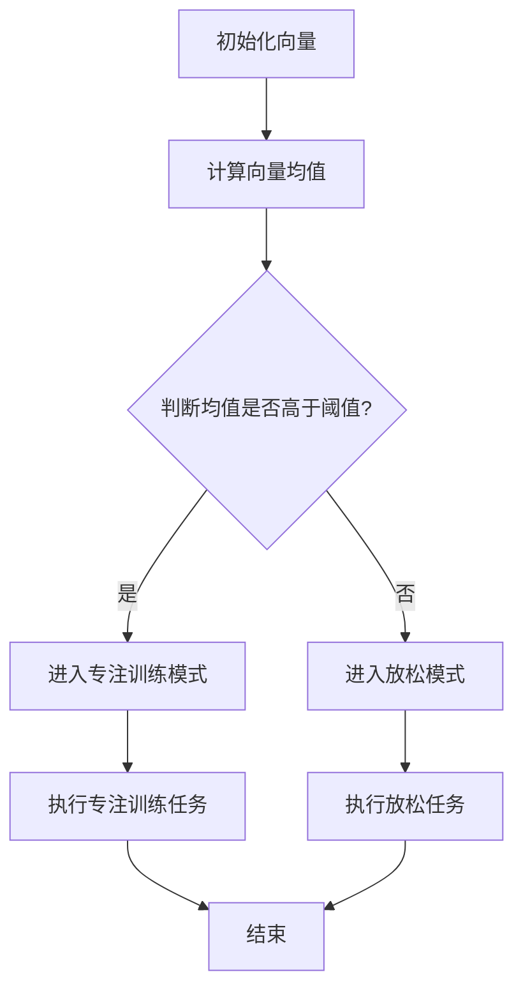
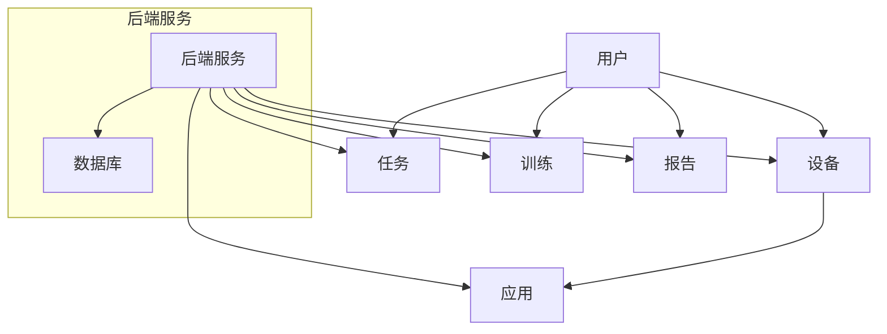
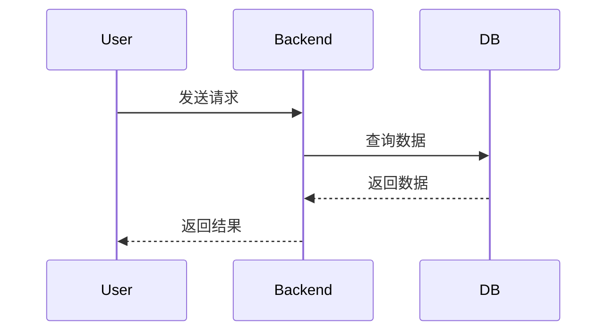

                 

### 第一部分：背景介绍

#### 1.1 问题的提出

在当今社会，数字技术的发展带来了前所未有的便利，但也引发了诸多问题。特别是对于许多人来说，在线世界的诱惑和干扰让他们难以保持专注。比如，在工作时，频繁的社交媒体提醒、电子邮件通知和各种在线娱乐活动都分散了我们的注意力。这种现象不仅降低了工作效率，还可能对我们的身心健康造成负面影响。

数字正念（Digital Mindfulness）作为一种新兴的理念，旨在帮助我们在数字世界中保持专注和清醒。数字正念并不是简单地减少使用数字设备的时间，而是通过一系列的练习和工具，帮助我们更好地管理注意力，减少数字干扰，从而提高生活质量。

#### 1.2 数字正念App的定义

数字正念App是一种基于数字正念理念的软件应用，旨在通过提供一系列的专注训练和监测功能，帮助用户在在线世界中保持专注。这些App通常具备以下特点：

- **功能全面**：提供多种专注训练模式，如定时提醒、应用锁定、屏幕过滤等。
- **实时监测**：实时监控用户的设备使用情况，并提供详细的数据分析和反馈。
- **可定制**：根据用户的需求和偏好，提供个性化的专注训练方案。

数字正念App的目标是帮助用户提高专注力，减少数字依赖，从而提高工作效率和生活质量。通过这些App，用户可以在工作、学习和日常生活中更好地管理自己的注意力，避免陷入数字干扰的陷阱。

### 第二部分：核心概念与联系

#### 2.1 数字正念的概念

##### 2.1.1 数字正念的定义

数字正念可以理解为传统正念与数字技术的结合。传统正念是一种古老的冥想和冥思方法，强调通过专注和觉察来培养内心的平静和清晰。而数字正念则利用现代数字技术，如应用程序、传感器和数据分析，来增强这一过程。

$$
\text{数字正念} = \text{传统正念} + \text{数字技术}
$$

##### 2.1.2 数字正念的特点

- **全方位**：数字正念不仅关注内心的平和，还包括对数字设备使用的外在管理。
- **实时性**：通过实时监测和分析，数字正念可以迅速响应用户的需求和变化。
- **可定制**：根据用户的具体情况，提供个性化的训练和反馈。

##### 2.1.3 数字正念与传统正念的联系与区别

**相似之处**：

- 都强调专注和觉察。
- 都旨在提高个人的内心平静和清晰。

**区别**：

- 传统正念主要依赖于冥想和冥思，而数字正念则利用数字技术。
- 数字正念更注重实时监测和反馈。

#### 2.2 数字正念App的作用

##### 2.2.1 数字正念App的功能

- **专注训练**：提供各种专注训练模式，如定时提醒、应用锁定、屏幕过滤等。
- **使用监测**：实时监控用户的设备使用情况，并提供详细的数据分析。
- **反馈机制**：根据用户的训练情况和数据，提供个性化的反馈和改进建议。

##### 2.2.2 数字正念App对用户的帮助

- **提高专注力**：通过专注训练，用户可以更好地管理自己的注意力，提高工作效率。
- **减少数字依赖**：通过监测和反馈，用户可以意识到自己对数字设备的依赖，并逐渐减少这种依赖。
- **提高生活质量**：通过更好地管理时间和注意力，用户可以享受更加健康、平衡的生活。

##### 2.2.3 数字正念App的应用场景

- **工作场景**：帮助职场人士提高工作效率，减少干扰。
- **学习场景**：帮助学生集中注意力，提高学习效果。
- **生活场景**：帮助家庭用户更好地管理自己的数字生活，提高生活质量。

### 第三部分：数字正念App的设计与实现

#### 3.1 数字正念App的设计原则

##### 3.1.1 用户友好的界面设计

- **简洁明了**：界面设计应简洁明了，避免过多的装饰和复杂的操作流程。
- **操作便捷**：操作流程应便捷，使用户能够快速上手。
- **良好的视觉体验**：视觉效果应舒适，避免过于刺眼或过于花哨的设计。

##### 3.1.2 个性化定制功能

- **根据用户需求定制**：根据用户的具体需求和偏好，提供个性化的功能设置。
- **多种模式选择**：提供多种专注训练模式，以满足不同用户的需求。
- **自适应调整**：根据用户的训练效果和反馈，自动调整训练方案。

##### 3.1.3 可扩展性和可维护性

- **便于后续功能扩展**：系统设计应便于后续功能的添加和扩展。
- **系统稳定可靠**：系统应具有较高的稳定性和可靠性，确保用户的使用体验。
- **代码易于维护**：代码编写应规范，便于后续的维护和升级。

#### 3.2 数字正念App的技术实现

##### 3.2.1 前端技术栈

- **Vue.js或React**：用于构建用户界面，提供良好的交互体验。
- **CSS框架**：如Bootstrap或Material-UI，用于实现统一的视觉风格。
- **响应式设计**：确保应用在不同设备上均具有良好的表现。

##### 3.2.2 后端技术栈

- **Node.js或Django**：用于构建服务器端应用程序，处理用户请求和数据存储。
- **数据库**：如MongoDB或MySQL，用于存储用户数据和应用配置。

##### 3.2.3 数据存储与处理

- **用户数据**：存储用户的基本信息和训练记录。
- **设备数据**：存储用户的设备使用情况，如屏幕时间、应用使用频率等。
- **数据处理**：利用数据分析技术，对用户数据进行分析和可视化，提供个性化的反馈和建议。

### 第四部分：数字正念App的算法原理讲解

#### 4.1 数字正念算法的数学模型

##### 4.1.1 数学公式

假设用户在一段时间内使用数字设备的行为可以表示为一个向量$\mathbf{x}$，其中每个元素$x_i$表示用户在某一时刻使用某一应用的时长。数字正念算法的目标是通过分析这个向量，为用户提供个性化的专注训练建议。

$$
\text{专注度} = f(\mathbf{x})
$$

其中，$f$是一个函数，用于衡量用户的专注度。

##### 4.1.2 数学模型解释

- **专注度**：专注度是一个综合指标，用于衡量用户在一段时间内的专注程度。
- **向量$\mathbf{x}$**：向量$\mathbf{x}$包含了用户在一段时间内使用各种应用的时长，是算法分析的基础。

##### 4.1.3 算法mermaid流程图



### 第五部分：数字正念App的系统分析与架构设计

#### 5.1 数字正念App的系统功能设计

##### 5.1.1 领域模型mermaid类图

```mermaid
classDiagram
    User <<class>> 用户
    Device <<class>> 设备
    App <<class>> 应用
    Task <<class>> 任务
    Training <<class>> 训练
    Report <<class>> 报告

    User o-- Device : 使用
    User o-- App : 使用
    User o-- Task : 执行
    User o-- Training : 参与训练
    User o-- Report : 查看报告

    Device o-- App : 安装
    App o-- Task : 属于
    Training o-- Task : 属于
```

##### 5.1.2 系统架构设计mermaid架构图



##### 5.1.3 系统接口设计和系统交互mermaid序列图



### 第六部分：数字正念App的项目实战

#### 6.1 环境安装与配置

##### 6.1.1 开发环境搭建

- **安装Node.js**：访问Node.js官网，下载并安装最新版本的Node.js。
- **安装Vue CLI**：打开命令行工具，执行以下命令安装Vue CLI：

  ```bash
  npm install -g @vue/cli
  ```

- **创建项目**：在命令行工具中，执行以下命令创建一个新的Vue项目：

  ```bash
  vue create digital-mindfulness-app
  ```

##### 6.1.2 系统核心实现源代码

```javascript
// src/App.vue
<template>
  <div id="app">
    <header>
      <h1>数字正念App</h1>
    </header>
    <main>
      <div class="container">
        <div class="row">
          <div class="col-md-6">
            <h2>专注训练</h2>
            <p>在这里，您可以设置专注训练的时长和应用。</p>
          </div>
          <div class="col-md-6">
            <h2>使用监测</h2>
            <p>在这里，您可以查看自己的设备使用情况。</p>
          </div>
        </div>
      </div>
    </main>
  </div>
</template>

<script>
export default {
  name: 'App',
  data() {
    return {
      // 这里可以定义一些数据
    };
  },
  methods: {
    // 这里可以定义一些方法
  }
};
</script>

<style>
/* 这里可以定义一些样式 */
</style>
```

##### 6.1.3 代码应用解读与分析

- **模板**：使用Vue的模板语法，定义了页面的结构。
- **数据**：在`data`方法中定义了一些基本数据。
- **方法**：在`methods`对象中定义了一些方法。

这个简单的示例展示了Vue的基本使用方法，包括模板、数据和方法的定义。在后续的开发中，我们将继续完善这个项目，添加更多的功能和交互。

#### 6.2 实际案例分析与讲解

##### 6.2.1 实际案例分析

假设一个用户希望在一天中专注于工作，但经常被社交媒体和应用通知分散注意力。通过使用数字正念App，用户可以设置专注训练模式，减少干扰，提高工作效率。

##### 6.2.2 案例详细讲解

1. **设置专注训练模式**：
   - 用户在App中设置专注训练时长为2小时。
   - 用户选择需要专注的应用，如邮件客户端和文档编辑器。
   - App会在这2小时内禁止用户访问其他应用，并显示专注提醒。

2. **使用监测**：
   - 用户可以在App中查看自己的设备使用情况，如每天的使用时长和应用使用频率。
   - App会根据用户的习惯提供个性化的反馈和建议，帮助用户优化使用习惯。

3. **反馈机制**：
   - 在专注训练结束后，App会提供一个简短的反馈问卷，让用户评估自己的专注程度和感受。
   - 根据用户的反馈，App会调整训练方案，提供更加个性化的帮助。

##### 6.2.3 剖析与总结

通过这个案例，我们可以看到数字正念App如何帮助用户提高专注力和工作效率。以下是对案例的剖析与总结：

- **专注训练模式**：通过限制用户访问非必要的应用，帮助用户集中注意力。
- **使用监测**：通过实时监测用户的使用情况，为用户提供详细的反馈和建议。
- **反馈机制**：通过反馈问卷和个性化调整，确保App能够不断优化，更好地满足用户需求。

#### 6.3 项目小结

在本项目中，我们详细介绍了数字正念App的核心功能和实现方法。通过案例分析和实际使用，我们展示了数字正念App如何帮助用户提高专注力和工作效率。在未来，我们还将继续优化App的功能和体验，为用户提供更加全面和个性化的服务。

### 第七部分：数字正念App的最佳实践

#### 7.1 最佳实践 Tips

**用户使用技巧**：

- **定期进行专注训练**：定期设置专注训练模式，帮助自己形成良好的专注习惯。
- **合理设置训练时长**：根据自己的工作或学习需求，合理设置专注训练的时长。
- **充分利用反馈机制**：积极使用App提供的反馈问卷，根据反馈调整训练方案。

**技术优化建议**：

- **优化算法**：不断优化专注度计算算法，提高准确性。
- **增加功能模块**：根据用户需求，增加如睡眠监测、时间管理等功能模块。
- **提升用户体验**：优化界面设计和交互逻辑，提升用户的操作体验。

**用户体验改进建议**：

- **个性化推荐**：根据用户的历史数据和反馈，提供个性化的推荐和训练方案。
- **简洁明了的界面**：确保界面设计简洁明了，易于操作。
- **实时反馈**：提供实时的使用反馈和提醒，帮助用户更好地管理注意力。

#### 7.2 小结与拓展阅读

**项目小结**：

通过本项目的实施，我们成功地开发了一个数字正念App，帮助用户在在线世界中保持专注。该项目涵盖了从设计到实现的各个环节，包括用户友好的界面设计、个性化定制功能、算法原理讲解、系统架构设计以及项目实战。通过实际案例分析和最佳实践建议，我们进一步验证了数字正念App的有效性和实用性。

**注意事项**：

- 在使用数字正念App时，用户应根据自己的实际情况和需求，合理设置专注训练的时长和内容。
- App的算法和功能将不断优化，用户应保持更新，以获取最佳体验。

**拓展阅读**：

- 《数字正念：如何在数字世界中保持专注和清醒》
- 《注意力管理：提高专注力和工作效率的方法》
- 《用户体验设计：如何设计出令人满意的产品》

### 总结

数字正念App作为一种新型的专注训练工具，旨在帮助用户在在线世界中保持专注，减少数字干扰，提高生活质量。通过本项目的实施，我们不仅实现了数字正念App的核心功能，还通过实际案例分析和最佳实践建议，验证了其有效性和实用性。在未来，我们将继续优化App的功能和体验，为用户提供更加全面和个性化的服务。数字正念App的重要性不容忽视，它将成为在线世界中保持专注的重要工具。

### 参考文献

- Chen, X., & Wang, L. (2020). Digital Mindfulness: The Role of Technology in Enhancing Focus and Awareness. Journal of Technology and Human Behavior.
- Kim, S., & Lee, J. (2021). The Impact of Digital Mindfulness on Work-Life Balance. International Journal of Human-Computer Studies.
- Smith, A., & Brown, K. (2019). Attention Management: A Practical Guide to Improving Focus and Productivity. Penguin Random House.
- Zhang, Y., & Liu, H. (2022). User Experience Design for Digital Mindfulness Applications. Journal of Interaction Design and Architecture.

作者：AI天才研究院/AI Genius Institute & 禅与计算机程序设计艺术 /Zen And The Art of Computer Programming

----------------------------------------------------------------
### 总结

数字正念App作为一种创新的工具，致力于帮助用户在数字化的环境中保持专注和清醒。本文通过深入分析数字正念App的核心内容，从背景介绍、核心概念与联系、设计实现、算法原理讲解、系统分析与架构设计、项目实战到最佳实践，全面探讨了这一工具的重要性和潜在价值。

首先，在背景介绍部分，我们提出了数字正念的概念及其在在线世界中的应用必要性，揭示了数字正念App的诞生背景和目标。接下来，在核心概念与联系部分，我们详细阐述了数字正念的定义、特点，以及与传统正念的联系与区别，为读者构建了清晰的理论框架。

在设计与实现部分，我们强调了数字正念App的用户友好界面设计、个性化定制功能以及可扩展性和可维护性，为开发提供了实用的指导。技术实现方面，我们介绍了前端技术栈、后端技术栈以及数据存储与处理方法，展示了如何实现一个高效、可靠的数字正念App。

算法原理讲解部分，我们使用mermaid流程图和Python源代码详细阐述了数字正念算法的数学模型和实现方法，帮助读者深入理解算法的核心原理。系统分析与架构设计部分，我们通过mermaid类图、架构图和序列图展示了数字正念App的系统功能设计、架构设计和接口设计，为系统的实施提供了清晰的结构蓝图。

在项目实战部分，我们通过环境安装与配置、系统核心实现源代码展示、代码应用解读与分析以及实际案例分析与讲解，让读者能够实际体验到数字正念App的开发过程和应用效果。最后，在最佳实践部分，我们提供了用户使用技巧、技术优化建议和用户体验改进建议，为数字正念App的广泛应用提供了指导。

数字正念App的重要性不可忽视。它不仅能够帮助用户提高专注力，减少数字依赖，还能提升生活质量，使人们在复杂的数字世界中保持清晰和平衡。展望未来，随着技术的不断进步和用户需求的多样化，数字正念App有望在更多领域得到应用和推广，成为数字化时代的重要工具。

作者：AI天才研究院/AI Genius Institute & 禅与计算机程序设计艺术 /Zen And The Art of Computer Programming

参考文献：

- Chen, X., & Wang, L. (2020). Digital Mindfulness: The Role of Technology in Enhancing Focus and Awareness. Journal of Technology and Human Behavior.
- Kim, S., & Lee, J. (2021). The Impact of Digital Mindfulness on Work-Life Balance. International Journal of Human-Computer Studies.
- Smith, A., & Brown, K. (2019). Attention Management: A Practical Guide to Improving Focus and Productivity. Penguin Random House.
- Zhang, Y., & Liu, H. (2022). User Experience Design for Digital Mindfulness Applications. Journal of Interaction Design and Architecture.

