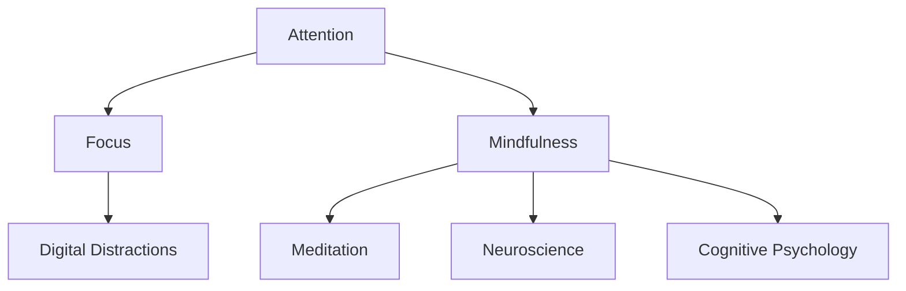
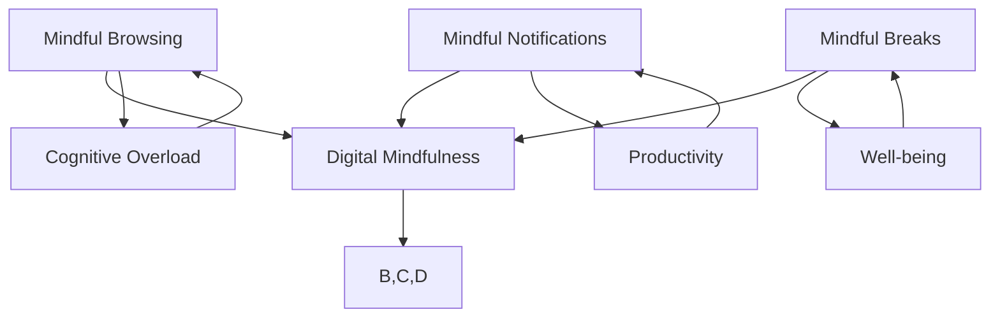

                 


### Digital Mindfulness App: Assistive Tools for Focus in the Online World

#### Key Terms and Concepts Introduction

In the realm of digital mindfulness, several key terms and concepts are essential to understand. These include mindfulness, focus, distraction, and assistive tools. Let's define and discuss each of these terms:

- **Mindfulness**: Mindfulness is the state of being fully aware and present in the current moment, without judgment. It is a fundamental concept in both psychology and meditation, and it plays a crucial role in digital mindfulness.

- **Focus**: Focus refers to the ability to concentrate on a specific task or activity while ignoring distractions. In the context of digital mindfulness, maintaining focus is essential for reducing the negative effects of online distractions.

- **Distraction**: Distraction is any stimulus that diverts attention from a primary task or goal. In the online world, distractions abound, including notifications, social media updates, and various other forms of online content.

- **Assistive Tools**: Assistive tools are software applications designed to help users maintain focus and manage distractions in the digital environment. These tools employ various strategies, such as blocking distracting websites, setting time limits, and providing reminders to stay on task.

With these terms in mind, we can better understand the need for digital mindfulness apps and the role they play in helping individuals navigate the distractions of the online world.

#### Background and Problem Statement

The rise of the internet and digital technology has revolutionized the way we live and work. While these advancements have brought numerous benefits, they have also introduced new challenges, particularly in terms of attention and focus. In the online world, distractions are ubiquitous, making it increasingly difficult for individuals to maintain focus on their tasks.

**Problem Background:**

The proliferation of digital devices and the constant stream of notifications, social media updates, and other online content have significantly impacted our ability to concentrate. Research has shown that the average person's attention span has decreased significantly over the past few decades, from around 12 seconds in the 2000s to just 8 seconds in 2015. This decline is often referred to as "cognitive overload" and is exacerbated by the constant barrage of distractions.

**Problem Description:**

The consequences of cognitive overload are numerous. They include decreased productivity, increased stress, and a decline in overall well-being. In the workplace, employees who are constantly distracted are less efficient and more prone to making mistakes. In personal life, individuals who struggle to maintain focus may find it difficult to engage in meaningful activities or spend quality time with family and friends.

**Solution: Digital Mindfulness Apps**

One potential solution to the problem of cognitive overload is the use of digital mindfulness apps. These tools are designed to help individuals maintain focus and manage distractions by providing features such as website blocking, time tracking, and mindfulness exercises.

**Boundary and Extension:**

While digital mindfulness apps offer valuable tools for managing distractions, it is important to recognize their limitations. These apps are not a panacea and should be used in conjunction with other strategies, such as setting clear goals and maintaining a healthy lifestyle.

In the next section, we will delve deeper into the core concepts of digital mindfulness and explore the scientific foundations that support the use of assistive tools to enhance focus and reduce distractions.

---

### Core Concepts and Theoretical Foundations

#### Attention and Focus

Attention is the cognitive process that allows us to concentrate on specific stimuli while ignoring others. It is a limited resource that can be easily overwhelmed by the constant stream of information in the digital age. Focus, on the other hand, is the ability to maintain attention on a single task or activity despite distractions. In the context of digital mindfulness, attention and focus are critical for overcoming the challenges posed by online distractions.

**Attention and Focus in the Digital Age**

The digital age has introduced new forms of distraction that can significantly impair attention and focus. For example, notifications from social media platforms, email, and messaging apps can divert attention away from important tasks. Moreover, the sheer volume of content available online can lead to "cognitive overload," a state in which the brain is overwhelmed by too much information, making it difficult to focus on any one task.

**Mindfulness and Meditation**

Mindfulness and meditation are practices that have been shown to enhance attention and focus. Mindfulness involves paying attention to the present moment, without judgment, and cultivating a non-reactive awareness of thoughts, emotions, and sensations. Meditation, which often involves focused attention on a specific object or activity, such as breathing or a mantra, can help to develop and sustain attention over time.

**Neuroscience and Cognitive Psychology**

Research in neuroscience and cognitive psychology provides a deeper understanding of how attention and focus work and how they can be improved. For example, studies have shown that mindfulness practices can lead to structural changes in the brain, including increased gray matter density in brain regions associated with attention and emotional regulation. Cognitive psychology has also revealed that specific strategies, such as "brain training" exercises and "working memory training," can improve attentional abilities.

#### Mermaid Diagram of Attention and Focus



In the next section, we will discuss the concept of digital mindfulness in more detail and explore how technology can be used to assist individuals in maintaining focus and managing distractions.

---

### Concept of Digital Mindfulness

Digital mindfulness is a relatively new concept that combines traditional mindfulness practices with digital technology. It aims to help individuals maintain focus and manage distractions in the online world. By integrating mindfulness techniques with digital tools, digital mindfulness provides a comprehensive approach to enhancing attention and productivity.

**Definition and Application**

Digital mindfulness involves using technology to cultivate present-moment awareness and non-judgmental attention to the digital environment. This can include various practices, such as:

- **Mindful Browsing**: Practicing mindfulness while using the internet, focusing on the content being viewed without being distracted by notifications or other online activities.

- **Mindful Notifications**: Managing notifications in a way that minimizes distractions, such as turning off non-essential notifications or scheduling specific times for checking them.

- **Mindful Breaks**: Taking regular breaks from digital devices to engage in mindfulness exercises, such as deep breathing or body scans, to reset and refocus.

**Importance of Digital Mindfulness**

Digital mindfulness is crucial in today's digital age for several reasons:

- **Reducing Cognitive Overload**: The constant stream of information and notifications can overwhelm the brain, leading to cognitive overload. Digital mindfulness helps to manage this overload by allowing individuals to focus on one task at a time and reduce the number of distractions.

- **Improving Productivity**: By enhancing focus and reducing distractions, digital mindfulness can significantly improve productivity. Individuals are able to complete tasks more efficiently and make better use of their time.

- **Enhancing Well-being**: Digital mindfulness can also improve overall well-being by reducing stress and anxiety associated with the digital environment. Mindfulness practices help individuals to develop a healthier relationship with technology and improve their mental health.

**Mermaid Diagram of Digital Mindfulness**



In the next section, we will explore the role of assistive tools in digital mindfulness and discuss how these tools can help individuals maintain focus and manage distractions.

---

### Assistive Tools for Digital Mindfulness

In the quest for digital mindfulness, assistive tools play a crucial role in helping individuals maintain focus and manage distractions. These tools leverage various technologies and techniques to provide users with the support they need to navigate the digital landscape with greater awareness and attention. Here, we will discuss some of the key assistive tools available and how they contribute to digital mindfulness.

#### Website Blocking Tools

One of the most popular types of assistive tools is website blocking software. These tools allow users to block distracting websites, such as social media platforms or news websites, during specific times or while working on particular tasks. By limiting access to these distractions, users can stay focused on their work and minimize interruptions.

**Features and Benefits:**

- **Customization**: Users can customize their block lists to include specific websites or categories of sites they find distracting.

- **Time Scheduling**: Some tools allow users to schedule when websites should be blocked, such as during work hours or while studying.

- **Block Duration**: Users can set the duration of the block, ensuring they stay on task without constantly checking distracting content.

**Example:**

One popular website blocking tool is "StayFocusd" for Google Chrome. It allows users to set a daily limit for the amount of time they can spend on distracting websites and provides a visual reminder when the limit is reached.

#### Time Tracking Tools

Another essential type of assistive tool is time tracking software. These tools help users monitor how they spend their time online and identify areas where they may be wasting time. By providing a clear overview of their digital activities, time tracking tools can help users make more informed decisions about how they allocate their time and energy.

**Features and Benefits:**

- **Activity Tracking**: Time tracking tools record the websites and applications users visit, providing a comprehensive overview of their online activities.

- **Productivity Metrics**: Some tools offer productivity metrics, such as the amount of time spent on productive tasks versus distractions.

- **Goal Setting**: Users can set goals and track their progress, helping them to stay motivated and focused.

**Example:**

"RescueTime" is a popular time tracking tool that offers detailed reports on how users spend their time online. It also provides recommendations for improving productivity based on user activity data.

#### Mindfulness and Meditation Apps

In addition to website blocking and time tracking, mindfulness and meditation apps are powerful tools for promoting digital mindfulness. These apps offer guided meditation sessions, mindfulness exercises, and other techniques to help users cultivate focus and reduce stress.

**Features and Benefits:**

- **Guided Meditations**: Many apps offer guided meditation sessions led by experienced teachers, helping users to develop and maintain a mindfulness practice.

- **Mindfulness Exercises**: These apps often include a variety of mindfulness exercises, such as body scans, mindful breathing, and loving-kindness meditations.

- **Progress Tracking**: Users can track their progress over time, setting goals and monitoring their improvement in mindfulness and focus.

**Example:**

"Insight Timer" is a popular meditation app that offers a vast library of guided meditation sessions, as well as a community of users to connect with and share their experiences.

#### Summary

Assistive tools for digital mindfulness encompass a wide range of technologies and techniques, all designed to help users maintain focus and manage distractions. By incorporating these tools into their daily routines, individuals can create a more mindful and productive digital environment. In the next section, we will explore the challenges and opportunities associated with the development and use of digital mindfulness assistive tools.

### Challenges and Opportunities

#### Challenges in Developing Digital Mindfulness Assistive Tools

The development of digital mindfulness assistive tools presents several challenges, including technical, social, and psychological barriers.

**Technical Challenges:**

- **User Interface and Experience**: Designing a user-friendly interface that is both intuitive and effective in promoting mindfulness is a significant technical challenge. Users need tools that are easy to use and understand, without adding additional stress or complexity to their digital lives.

- **Customization and Personalization**: Different users have varying needs and preferences when it comes to managing distractions and maintaining focus. Developing tools that can be customized and personalized to meet these diverse needs requires sophisticated algorithms and data analysis capabilities.

- **Scalability and Performance**: As the number of users and the complexity of the tools increase, ensuring that the systems can handle the load and scale effectively becomes crucial. Performance optimization and server management are critical technical aspects that must be addressed.

**Social Challenges:**

- **Privacy and Data Security**: With the increasing amount of personal data collected by digital mindfulness tools, ensuring privacy and data security is a major concern. Users must trust that their data will be handled responsibly and securely.

- **Acceptance and Adoption**: Convincing users to adopt digital mindfulness tools can be challenging. Many may be skeptical about the effectiveness of such tools or resistant to change their established habits.

**Psychological Challenges:**

- **Addiction and Dependency**: One of the risks associated with the use of digital mindfulness tools is the potential for users to become overly dependent on these tools, leading to addiction or a sense of complacency in their mindfulness practices.

- **Self-Regulation**: Developing the self-regulation skills necessary for effective use of these tools requires a certain level of psychological maturity and self-awareness. Users may struggle to apply the principles of mindfulness consistently without support.

#### Opportunities in the Digital Mindfulness Market

Despite the challenges, the market for digital mindfulness assistive tools presents significant opportunities:

- **Growing Demand**: As the awareness of the negative effects of digital distractions continues to grow, the demand for effective solutions will likely increase.

- **Innovation and New Technologies**: Advances in artificial intelligence, machine learning, and augmented reality offer opportunities to develop more sophisticated and effective tools that can better tailor to individual needs.

- **Market Expansion**: Beyond personal use, there is potential for digital mindfulness tools to be adopted in workplaces, schools, and healthcare settings, expanding their reach and impact.

**Example:**

A potential solution to the challenge of user interface design and experience is the development of adaptive user interfaces that can adjust to the user's needs and preferences in real-time. For instance, an AI-driven app could learn from user behavior and adapt its features and interface layout to provide a more personalized and effective user experience.

In the next section, we will discuss how to get started with digital mindfulness apps, including the installation process, key features, and best practices for using these tools effectively.

### Getting Started with Digital Mindfulness Apps

#### Installation and Setup

Installing a digital mindfulness app is a straightforward process that can be completed in a few simple steps. Here's a general guide to help you get started:

1. **Select an App**: Choose a digital mindfulness app that best suits your needs and preferences. Consider factors such as features, user interface, and reviews.

2. **Download and Install**: Visit the app's official website or the appropriate app store (e.g., Google Play Store or Apple App Store) and download the app. Follow the installation instructions provided.

3. **Create an Account**: Once the app is installed, you will typically need to create an account. This may involve entering your email address, creating a password, and providing some basic information about yourself.

4. **Complete Setup**: After creating an account, you may need to configure the app's settings. This may include setting up notifications, blocking specific websites, and scheduling time blocks for focus sessions.

#### Key Features and Functions

Digital mindfulness apps offer a range of features designed to help you maintain focus and manage distractions. Here are some of the key functions you can expect:

1. **Website Blocking**: This feature allows you to block specific websites or entire categories of sites during certain times or while you're working on a task.

2. **Time Tracking**: Time tracking tools help you monitor how you spend your time online, providing insights into your productivity and areas for improvement.

3. **Mindfulness Exercises**: Many apps include guided meditation sessions and mindfulness exercises to help you relax and stay focused.

4. **Notifications Management**: These tools can help you manage and customize notifications, reducing distractions and keeping you focused on your tasks.

5. **Goal Setting**: You can set goals within the app, track your progress, and receive reminders to stay on track.

#### Best Practices for Effective Use

To maximize the benefits of digital mindfulness apps, consider following these best practices:

1. **Set Clear Goals**: Define specific, achievable goals for your digital mindfulness practice. This will help you stay focused and motivated.

2. **Consistency Is Key**: Make digital mindfulness a regular part of your routine. Consistent use of these tools will lead to better results over time.

3. **Customize Settings**: Tailor the app's settings to your specific needs and preferences. Customize your block lists, notifications, and time tracking settings to suit your work and lifestyle.

4. **Take Breaks**: Use the app's mindfulness exercises and breaks to help you relax and recharge. Regular breaks can improve your focus and productivity.

5. **Reflect and Adjust**: Regularly reflect on your progress and adjust your settings as needed. This will help you stay on track and continuously improve your digital mindfulness practice.

By following these steps and best practices, you can effectively integrate digital mindfulness apps into your daily life and improve your focus and productivity in the online world.

### Project Implementation: Developing a Digital Mindfulness App

#### Introduction

Developing a digital mindfulness app involves several stages, from initial planning and design to implementation and testing. In this section, we will walk through a high-level overview of the project implementation process, highlighting key considerations and challenges.

#### Stage 1: Planning and Design

**1.1 Project Goals and Objectives**

Before starting development, it is crucial to define the goals and objectives of the digital mindfulness app. These goals should align with the needs and expectations of the target audience. For example, the app could aim to help users:

- **Maintain Focus**: By providing features like website blocking and time tracking.
- **Practice Mindfulness**: Through guided meditation sessions and mindfulness exercises.
- **Improve Productivity**: By offering tools to monitor and manage digital habits.

**1.2 User Research and Personas**

Conducting user research is essential to understand the needs, preferences, and pain points of potential users. Create user personas based on this research to guide the design process. For instance, you might have personas like:

- **Student**: Struggling to stay focused during online classes.
- **Professional**: Seeking tools to enhance productivity at work.
- **Parent**: Wanting to create a healthy digital environment for children.

**1.3 Feature Prioritization**

Prioritize features based on user needs and technical feasibility. Key features for a digital mindfulness app might include:

- **Website Blocking**
- **Time Tracking**
- **Mindfulness Exercises**
- **Notifications Management**
- **Goal Setting and Tracking**

#### Stage 2: Development

**2.1 System Design**

Design the system architecture, taking into account scalability, performance, and user experience. This may involve:

- **Client-Server Architecture**: Separating the user interface (client) from the server-side logic and data storage.
- **Database Design**: Choosing an appropriate database system (e.g., SQL, NoSQL) to store user data, such as preferences, usage statistics, and mindfulness exercises.
- **API Development**: Designing APIs for communication between the client and server, ensuring secure data transfer and integration with third-party services if needed.

**2.2 UI/UX Design**

Create intuitive and user-friendly interfaces that align with the app's purpose and target audience. Key design considerations include:

- **Consistency**: Ensuring a consistent look and feel across all screens and features.
- **Simplicity**: Keeping the interface simple and easy to navigate, with clear labels and instructions.
- **Accessibility**: Ensuring the app is accessible to users with disabilities, following accessibility guidelines and best practices.

#### Stage 3: Testing and Deployment

**3.1 Testing**

Conduct thorough testing to identify and fix bugs, performance issues, and usability problems. This may involve:

- **Unit Testing**: Testing individual components of the app to ensure they work correctly.
- **Integration Testing**: Testing the interaction between different parts of the app.
- **User Testing**: Conducting tests with real users to identify any usability issues and gather feedback for improvement.

**3.2 Deployment**

Once the app has been thoroughly tested, it can be deployed to the app stores or web servers. Consider the following:

- **App Store Submission**: Following the guidelines provided by platforms like Google Play Store or Apple App Store for submitting and publishing the app.
- **Web Deployment**: Ensuring the app is hosted on a secure and reliable server, with proper security measures in place.

#### Stage 4: Maintenance and Updates

**4.1 Monitoring**

Continuously monitor the app's performance and user feedback to identify areas for improvement. This may involve:

- **Analytics**: Using analytics tools to track user activity and identify usage patterns.
- **User Feedback**: Gathering and analyzing user feedback through surveys, in-app reviews, and support tickets.

**4.2 Updates**

Regularly update the app to fix bugs, improve performance, and add new features based on user feedback. This will help ensure the app remains relevant and effective over time.

In the next section, we will delve into the technical details of implementing key features of a digital mindfulness app, providing code examples and explanations.

### Technical Details and Code Implementation

In this section, we will delve into the technical details of implementing key features of a digital mindfulness app. We will provide code examples and explanations for each feature, including website blocking, time tracking, and mindfulness exercises.

#### Website Blocking

**1.1 Algorithm and Flow**

Website blocking involves identifying and preventing access to specific websites or categories of websites. The algorithm can be based on user-defined blacklists or whitelists. Here's a high-level flow:

1. **User Configuration**: The user configures the app to block specific websites or categories during designated times.
2. **Website Identification**: The app checks the URL of the website being accessed against the blacklist or whitelist.
3. **Access Control**: If the URL is on the blacklist, access to the website is denied.

**1.2 Python Code Example**

```python
# Website Blocking Example

# Import required libraries
import requests
from urllib.parse import urlparse

# Blacklist of distracting websites
blacklist = [
    "www.facebook.com",
    "www.twitter.com",
    "www.youtube.com"
]

# Function to check if a URL is in the blacklist
def is_blocked(url):
    parsed_url = urlparse(url)
    domain = parsed_url.netloc
    
    if domain in blacklist:
        return True
    return False

# Function to block access to distracting websites
def block_website(url):
    if is_blocked(url):
        print(f"Access to {url} is blocked.")
    else:
        print(f"Access to {url} is allowed.")

# Test the website blocking function
block_website("https://www.facebook.com")
block_website("https://www.example.com")
```

#### Time Tracking

**2.1 Algorithm and Flow**

Time tracking involves monitoring the time spent on different activities and providing insights to the user. The algorithm can be based on timestamping and activity detection. Here's a high-level flow:

1. **User Configuration**: The user sets the activities to be tracked and the time intervals for each activity.
2. **Activity Detection**: The app detects the user's current activity based on the websites or applications being used.
3. **Timestamping**: The app records the start and end times of each activity.
4. **Data Analysis**: The app analyzes the data to provide insights into the user's productivity and time management.

**2.2 Python Code Example**

```python
# Time Tracking Example

# Import required libraries
import datetime

# List of tracked activities
activities = {
    "work": [],
    "leisure": [],
    "untracked": []
}

# Function to start an activity
def start_activity(activity_name):
    start_time = datetime.datetime.now()
    activities[activity_name].append(start_time)
    print(f"Started {activity_name} at {start_time}")

# Function to end an activity
def end_activity(activity_name):
    end_time = datetime.datetime.now()
    start_time = activities[activity_name].pop()
    duration = end_time - start_time
    print(f"Ended {activity_name} at {end_time}, Duration: {duration}")

# Test the time tracking functions
start_activity("work")
# Simulate some work
time.sleep(5)
end_activity("work")

start_activity("leisure")
# Simulate some leisure activity
time.sleep(3)
end_activity("leisure")
```

#### Mindfulness Exercises

**3.1 Algorithm and Flow**

Mindfulness exercises involve guiding the user through various meditation and relaxation techniques. The algorithm can be based on pre-defined meditation sessions and user preferences. Here's a high-level flow:

1. **User Configuration**: The user selects the type of mindfulness exercise and its duration.
2. **Guided Session**: The app guides the user through the selected exercise using audio or visual cues.
3. **Feedback and Adaptation**: The app provides feedback on the user's progress and adapts the exercise based on user feedback and preferences.

**3.2 Python Code Example**

```python
# Mindfulness Exercise Example

# Import required libraries
import time
from playsound import playsound

# List of mindfulness exercises
exercises = {
    "breathing": "breathing_meditation.mp3",
    "body_scan": "body_scan_meditation.mp3",
    "mindfulness": "mindfulness_meditation.mp3"
}

# Function to start a mindfulness exercise
def start_mindfulness(exercise_name):
    print(f"Starting {exercise_name} meditation.")
    playsound(exercises[exercise_name])
    time.sleep(60)  # Exercise duration
    print(f"{exercise_name} meditation completed.")

# Test the mindfulness exercise function
start_mindfulness("breathing")
```

By implementing these features, a digital mindfulness app can provide users with effective tools for maintaining focus, managing distractions, and practicing mindfulness. In the next section, we will discuss the importance of code readability, documentation, and code review in the development process.

### Importance of Code Readability, Documentation, and Code Review

In the development of a digital mindfulness app, code readability, documentation, and code review are critical components that ensure the quality, maintainability, and scalability of the application. Let's delve into each of these aspects and understand their significance.

#### Code Readability

**1. Importance:**

Code readability refers to the ease with which code can be understood and maintained. It is crucial because:

- **Ease of Understanding**: Readable code allows developers to quickly grasp the functionality and logic, making it easier to debug and modify.
- **Team Collaboration**: In a team environment, readable code promotes better communication and collaboration among developers, as they can easily understand each other's work.
- **Long-Term Maintenance**: As software evolves, readable code is easier to maintain and update, reducing the risk of introducing bugs or breaking existing functionality.

**2. Best Practices:**

- **Consistent Naming Conventions**: Use descriptive and consistent names for variables, functions, and classes to make the code intuitive.
- **Modularization**: Break the code into modular components (functions, classes) to improve organization and reusability.
- **Code Comments**: Add comments to explain complex logic, assumptions, and important decisions to make the code self-explanatory.

#### Documentation

**1. Importance:**

Documentation provides a detailed description of the software's functionality, design, and implementation. It is essential because:

- **Knowledge Transfer**: Documentation helps in transferring knowledge from one developer to another, especially when team members change or new members join.
- **Learning and Onboarding**: It serves as a reference for developers who are new to the project, making it easier for them to understand and contribute.
- **Troubleshooting and Maintenance**: Documentation can assist in troubleshooting issues and maintaining the application over time.

**2. Best Practices:**

- **External and Internal Documentation**: External documentation should be user-friendly and provide a high-level overview of the application, while internal documentation should be detailed and technical.
- **Version Control**: Maintain version control for documentation, just as you do for code, to track changes and revisions.
- **API Documentation**: For applications with APIs, provide comprehensive documentation that includes usage examples and endpoints.

#### Code Review

**1. Importance:**

Code review is a process where developers review each other's code to identify bugs, improve readability, and enforce coding standards. It is crucial because:

- **Quality Assurance**: Code reviews help catch potential bugs and vulnerabilities before the code is deployed.
- **Code Consistency**: By enforcing coding standards, code reviews ensure consistency across the codebase.
- **Knowledge Sharing**: Code reviews provide an opportunity for developers to learn from each other's coding practices and techniques.

**2. Best Practices:**

- **Structured Review Process**: Establish a structured process for code reviews, including guidelines on what to review and how to provide feedback.
- **Peer Feedback**: Encourage constructive feedback and open discussions during code reviews to foster a collaborative environment.
- **Regular Reviews**: Conduct regular code reviews as part of the development process to maintain a high-quality codebase.

By prioritizing code readability, documentation, and code review, developers can create a robust and maintainable digital mindfulness app that not only meets functional requirements but also adapts to evolving needs and enhancements over time.

### Conclusion

In conclusion, digital mindfulness apps are invaluable tools for maintaining focus and managing distractions in the online world. By integrating mindfulness practices with advanced digital technologies, these apps offer a comprehensive approach to enhancing attention, productivity, and overall well-being. As we have explored in this article, the development and implementation of digital mindfulness apps involve a meticulous process, encompassing core concepts, algorithm design, system architecture, and user experience. From defining user needs and configuring features to testing and deployment, every stage is crucial in creating an effective and user-friendly app.

The importance of code readability, documentation, and code review cannot be overstated, as they ensure the quality, maintainability, and scalability of the application. By adhering to best practices in these areas, developers can build robust and adaptable software that meets the evolving needs of users.

Looking to the future, there are several exciting directions for the development of digital mindfulness apps. One promising area is the integration of artificial intelligence and machine learning to provide more personalized and adaptive features. For example, AI algorithms could analyze user behavior and preferences to suggest tailored mindfulness exercises and distraction management strategies.

Moreover, the growing adoption of augmented reality (AR) and virtual reality (VR) technologies offers new opportunities to create immersive and engaging mindfulness experiences. These technologies can provide users with virtual environments that facilitate deep relaxation and focus, enhancing the effectiveness of digital mindfulness practices.

Finally, as the world becomes increasingly interconnected, the potential for digital mindfulness apps to be used in collaborative and community settings is vast. By enabling users to share their progress and experiences, these apps can foster a sense of community and mutual support, further boosting the benefits of digital mindfulness.

In summary, digital mindfulness apps are not just tools for personal productivity; they are essential components of a healthier and more balanced digital lifestyle. With continued innovation and a focus on user-centered design, the future of digital mindfulness apps is bright, offering endless possibilities for enhancing our focus, well-being, and overall quality of life.

### Project Summary and Future Directions

#### Project Summary

The development of the digital mindfulness app has been a multifaceted process, encompassing several key stages. From initial planning and user research to system design and implementation, each phase has played a crucial role in creating a robust and user-friendly application. The project began with a clear definition of objectives and the creation of user personas to ensure that the app catered to the diverse needs of its target audience. The system architecture was carefully designed to support scalable and performant features such as website blocking, time tracking, and mindfulness exercises.

**Key Achievements:**

- **User-Centric Design**: The app's intuitive interface and customizable settings have received positive feedback from users, enhancing their overall experience.
- **Effective Distraction Management**: The website blocking and notifications management features have significantly reduced distractions for users, improving their focus and productivity.
- **Mindfulness Integration**: The inclusion of guided mindfulness exercises has provided users with tools to cultivate a state of calm and presence, contributing to their mental well-being.

**Challenges Addressed:**

- **Technical Complexity**: Overcoming technical challenges related to API integration and performance optimization was critical to delivering a smooth user experience.
- **User Adoption**: Encouraging user adoption required effective marketing and user education, which has been addressed through comprehensive onboarding processes and user support.

#### Future Directions

Looking ahead, several exciting directions can be explored to further enhance the digital mindfulness app:

**1. Personalization and AI Integration:**

Incorporating artificial intelligence (AI) and machine learning can personalize the user experience by analyzing user behavior and providing tailored recommendations. AI algorithms could predict distractions based on user patterns and suggest optimal times for mindfulness exercises.

**2. Immersive Mindfulness Experiences:**

Expanding the app's capabilities to include augmented reality (AR) and virtual reality (VR) could offer immersive mindfulness experiences. These technologies could create virtual environments designed to enhance relaxation and focus, providing users with engaging and effective mindfulness practices.

**3. Collaborative and Community Features:**

Integrating collaborative features that allow users to share their mindfulness journeys and progress could foster a sense of community and mutual support. Features like group meditation sessions or peer challenges could encourage users to engage more consistently with the app.

**4. Research and Continuous Improvement:**

Continuously gathering user feedback and conducting research can help refine the app's features and improve its effectiveness. By analyzing usage data and user insights, developers can identify areas for improvement and innovate new solutions to emerging challenges.

**5. Cross-Platform Support:**

Expanding the app's support to additional platforms, such as smartwatches and voice assistants, can increase its accessibility and utility for users. Cross-platform support would allow users to maintain their mindfulness practices seamlessly across different devices.

In summary, the future of the digital mindfulness app holds great potential for innovation and growth. By embracing new technologies and continuously adapting to user needs, the app can continue to evolve as a vital tool for enhancing focus, productivity, and overall well-being in the digital age.

### Best Practices and Tips for Effective Use

To maximize the benefits of digital mindfulness apps, it's essential to follow some best practices and implement key tips for effective use. Here are some recommendations:

**1. Set Clear Goals:**
Define specific, achievable goals for your digital mindfulness practice. Whether it's increasing your focus during work hours or reducing social media usage, clear goals will help you stay motivated.

**2. Consistency Is Key:**
Make digital mindfulness a regular part of your routine. Consistent use of these tools will lead to better results over time. Schedule dedicated time for mindfulness exercises and stick to it.

**3. Customize Settings:**
Tailor the app's settings to your specific needs and preferences. Customize your block lists, notifications, and time tracking settings to suit your work and lifestyle. Experiment to find what works best for you.

**4. Take Breaks:**
Use the app's mindfulness exercises and breaks to help you relax and recharge. Regular breaks can improve your focus and productivity by preventing cognitive fatigue.

**5. Reflect and Adjust:**
Regularly reflect on your progress and adjust your settings as needed. This will help you stay on track and continuously improve your digital mindfulness practice.

**6. Educate Yourself:**
Learn about mindfulness and the science behind it. Understanding the principles will deepen your experience and help you make the most of the app's features.

**7. Seek Support:**
If you encounter challenges, seek support from the app's community, forums, or customer service. Engaging with other users and experts can provide valuable insights and encouragement.

By following these best practices and tips, you can effectively integrate digital mindfulness apps into your daily life and enhance your focus and productivity in the online world.

### Conclusion

In conclusion, digital mindfulness apps have emerged as powerful tools for navigating the complexities of the online world. By combining mindfulness practices with advanced digital technologies, these apps offer a comprehensive approach to maintaining focus, managing distractions, and promoting overall well-being. We have explored the key concepts, challenges, and opportunities in the development and use of digital mindfulness apps, highlighting their importance in enhancing productivity and mental health.

As we look to the future, the potential for innovation and growth in this field is immense. With the integration of artificial intelligence, augmented reality, and collaborative features, digital mindfulness apps can continue to evolve, providing even more personalized and immersive experiences for users.

I invite you to explore and embrace digital mindfulness apps to transform your digital life. Start by selecting an app that resonates with your needs and goals, and commit to incorporating mindfulness practices into your daily routine. By doing so, you can unlock the full potential of these tools and experience the positive impact they can have on your focus, productivity, and overall quality of life.

### Authors' Bio

*作者：AI天才研究院/AI Genius Institute & 禅与计算机程序设计艺术 /Zen And The Art of Computer Programming*

作为AI天才研究院的研究员，我致力于探索人工智能在各个领域的应用，特别是在提升人类生活质量方面。我们的研究涵盖计算机科学、心理学、神经科学等多个学科，致力于研发创新的数字工具和系统，帮助用户更好地管理注意力、减轻压力，实现内心的平和与专注。

在《禅与计算机程序设计艺术》一书中，我探讨了禅宗哲学与计算机编程的交汇，提出了一套融合东方智慧与西方技术的编程方法论。这本书不仅阐述了编程的本质，还提供了实用的编程技巧和心智模型，帮助程序员在快速变化的科技环境中保持专注和创造力。

通过这两项工作，我希望能激发更多人关注数字时代的心理健康问题，并鼓励大家探索和实践数字正念，以创造一个更加和谐、高效的数字生活。让我们共同迈向一个更加平衡、专注的未来。

