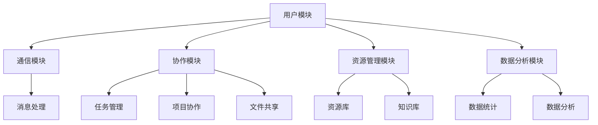
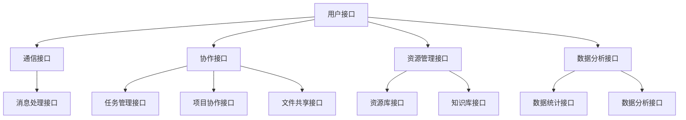
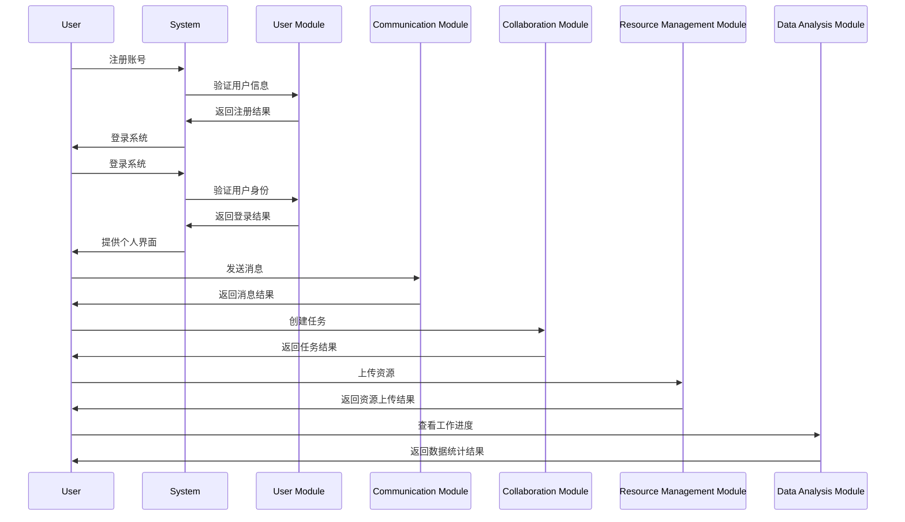

                 

# 数字游牧者联盟：远程工作者的全球互助网络

## 关键词：远程工作，数字游牧者，全球互助网络，协作平台，职业发展，可持续发展

> 摘要：随着远程工作的兴起，数字游牧者成为了一个日益重要的群体。本文深入探讨了数字游牧者联盟的背景、建设、实践和未来发展方向，分析了联盟在提升远程工作者职业发展和生活品质方面的作用，以及面临的挑战和对策。

## 目录大纲：《数字游牧者联盟：远程工作者的全球互助网络》

----------------------------------------------------------------

## 第一部分：远程工作的崛起

### 第1章：远程工作的背景与趋势

#### 1.1 远程工作的历史与发展

#### 1.2 新冠疫情对远程工作的影响

#### 1.3 远程工作者的生活状态与挑战

### 第2章：数字游牧者的生活方式

#### 2.1 数字游牧者的定义与特点

#### 2.2 数字游牧者的工作方式

#### 2.3 数字游牧者的生活平衡

## 第二部分：全球互助网络的建设

### 第3章：构建数字游牧者联盟的基础

#### 3.1 联盟的建立原则与目标

#### 3.2 联盟的组织结构

#### 3.3 联盟的运营与管理

### 第4章：联盟的技术支持

#### 4.1 联盟的数字化工具

#### 4.2 联盟的云端协作平台

#### 4.3 联盟的网络安全策略

### 第5章：联盟的社会影响力

#### 5.1 联盟对远程工作者的意义

#### 5.2 联盟对社会发展的贡献

#### 5.3 联盟的未来展望

## 第三部分：数字游牧者联盟的实践

### 第6章：成功案例分享

#### 6.1 联盟内部的成功合作

#### 6.2 联盟对成员的职业发展支持

#### 6.3 联盟的社会公益活动

### 第7章：数字游牧者的职业规划与自我提升

#### 7.1 职业发展的路径选择

#### 7.2 技能与知识的持续学习

#### 7.3 自我品牌的打造

## 第四部分：面对未来的挑战

### 第8章：远程工作的法律与伦理问题

#### 8.1 劳动法规对远程工作的影响

#### 8.2 远程工作的伦理困境

#### 8.3 跨国远程工作的挑战与对策

### 第9章：数字游牧者联盟的发展策略

#### 9.1 联盟的可持续发展路径

#### 9.2 联盟的国际合作机会

#### 9.3 联盟的未来发展方向

## 附录

### 附录A：数字游牧者联盟指南

#### A.1 加入联盟的步骤

#### A.2 联盟成员的权益与义务

#### A.3 联盟的活动与资源

### 附录B：参考文献

#### B.1 基础文献

#### B.2 研究报告与数据

#### B.3 相关书籍与文章

----------------------------------------------------------------

## 第一部分：远程工作的崛起

### 第1章：远程工作的背景与趋势

#### 1.1 远程工作的历史与发展

远程工作（Remote Work）的概念起源于20世纪末，随着互联网技术的发展和普及，它逐渐成为了一种新的工作模式。早期的远程工作主要依赖于电子邮件和即时通讯工具，工作时间和地点的灵活性开始受到重视。进入21世纪，云计算、虚拟现实、物联网等新兴技术的出现，使得远程工作变得更加便捷和高效。

在过去的几十年里，远程工作的发展经历了几个重要的阶段。首先，是电子邮件和即时通讯工具的普及，这为远程沟通提供了基础。其次，是远程协作工具的发展，如视频会议、项目管理软件和虚拟办公空间，这些工具提高了远程团队的协作效率。最后，是云计算和大数据技术的应用，使得远程工作者的数据安全和工作连续性得到了保障。

#### 1.2 新冠疫情对远程工作的影响

2020年，新冠疫情的爆发对全球工作模式产生了深远影响。为了遏制病毒的传播，各国政府纷纷采取了严格的封锁措施，许多企业被迫停业或转向远程工作。这场疫情加速了远程工作的普及，远程工作成为了一种必要的工作方式。

首先，疫情导致了大规模的远程办公。据市场研究公司的数据，2020年全球远程工作的比例显著增加，许多企业开始意识到远程工作的可行性和优势。其次，疫情促使企业重新评估工作模式和人力资源策略。一些企业开始推行永久性远程工作政策，减少办公室租赁和办公设备的开支。最后，疫情加速了远程工作相关技术的发展。为了保障远程工作的顺利进行，企业加大了对远程协作工具和技术的投入，推动了远程工作的持续发展。

#### 1.3 远程工作者的生活状态与挑战

远程工作为许多人提供了更大的自由度和灵活性，但也带来了一系列的挑战。首先，远程工作者的工作与生活界限模糊。由于缺乏面对面的交流和监督，一些远程工作者容易陷入工作无限期的状态，导致工作与生活的平衡被打破。其次，远程工作者面临社交隔离的问题。远程工作使得人与人之间的直接交流减少，导致社交网络缩小，心理健康问题日益突出。最后，远程工作者的职业发展受到限制。由于缺乏与同事的面对面交流和学习机会，一些远程工作者感到职业发展缓慢，晋升通道不畅。

### 第2章：数字游牧者的生活方式

#### 2.1 数字游牧者的定义与特点

数字游牧者（Digital Nomad）是指那些利用数字技术进行工作的自由职业者。他们不受地理位置限制，可以在世界任何地方工作。数字游牧者的工作内容广泛，包括软件开发、内容创作、市场营销、翻译等。

数字游牧者的生活方式具有以下特点：

1. **工作灵活性**：数字游牧者可以根据自己的时间表工作，不受传统工作时间限制。
2. **地理灵活性**：他们可以在世界任何地方居住，选择适合工作的地方，如咖啡店、图书馆或海边度假村。
3. **生活方式多样**：数字游牧者可以选择的生活方式多样，有人选择持续旅行，有人选择短期居住，也有人选择长期定居。

#### 2.2 数字游牧者的工作方式

数字游牧者的工作方式通常包括以下几个方面：

1. **远程协作**：数字游牧者通过远程协作工具与团队成员保持沟通和协作，如Slack、Zoom和Trello等。
2. **在线项目管理**：他们使用在线项目管理工具来管理任务和时间，如Asana、Jira和Trello等。
3. **灵活的时间安排**：数字游牧者可以根据自己的需求和日程安排工作，灵活调整工作时间。

#### 2.3 数字游牧者的生活平衡

数字游牧者的生活方式虽然充满自由，但也需要平衡工作与生活。以下是一些实现生活平衡的策略：

1. **设定工作时间**：尽管工作灵活性较高，但数字游牧者仍需要设定工作时间，确保工作与生活的平衡。
2. **规划旅行计划**：数字游牧者可以根据工作进度和计划，合理安排旅行计划，确保工作不受影响。
3. **保持社交活动**：尽管远程工作减少了面对面的社交机会，但数字游牧者可以通过线上社交平台和社区保持社交联系。

## 第二部分：全球互助网络的建设

### 第3章：构建数字游牧者联盟的基础

#### 3.1 联盟的建立原则与目标

数字游牧者联盟的建立原则主要包括以下几个方面：

1. **开放性**：联盟对所有数字游牧者开放，不论国籍、技能和工作类型。
2. **互助性**：联盟旨在通过资源共享、技能培训和社交活动，帮助成员提升职业发展和生活质量。
3. **可持续性**：联盟致力于构建一个长期可持续的社区，促进数字游牧者的全球合作。

联盟的目标如下：

1. **提升职业发展**：通过技能培训和职业规划，帮助成员提升职业竞争力。
2. **促进社交互动**：通过线上和线下活动，增强成员之间的交流和合作。
3. **推动资源共享**：建立资源共享平台，促进成员之间的知识和技术交流。

#### 3.2 联盟的组织结构

数字游牧者联盟的组织结构主要包括以下几个方面：

1. **理事会**：由联盟成员选举产生，负责制定联盟的发展策略和重大决策。
2. **工作委员会**：负责联盟的日常运营和管理，包括活动组织、资源整合和会员服务等方面。
3. **会员**：包括所有加入联盟的数字游牧者，享有联盟提供的各项服务和支持。

#### 3.3 联盟的运营与管理

数字游牧者联盟的运营与管理主要包括以下几个方面：

1. **会员管理**：负责会员的招募、注册和审核，确保会员的质量和多样性。
2. **活动组织**：定期举办线上和线下活动，如研讨会、工作坊和社交聚会，促进成员之间的交流和合作。
3. **资源整合**：建立资源共享平台，整合联盟成员的知识、技能和资源，为成员提供支持和帮助。
4. **财务管理**：负责联盟的财务收支管理，确保联盟的可持续发展。

## 第三部分：数字游牧者联盟的实践

### 第4章：联盟的技术支持

#### 4.1 联盟的数字化工具

数字游牧者联盟的技术支持主要依赖于一系列数字化工具，这些工具为联盟的运营和成员的工作提供了便利。以下是联盟常用的数字化工具：

1. **远程协作工具**：如Slack、Zoom、Trello等，用于团队沟通、任务管理和项目协作。
2. **云端存储和备份**：如Google Drive、Dropbox等，用于文档存储、共享和备份。
3. **在线教育平台**：如Udemy、Coursera等，用于成员的技能培训和知识学习。
4. **项目管理工具**：如Asana、Jira等，用于项目规划、进度跟踪和团队协作。

#### 4.2 联盟的云端协作平台

联盟的云端协作平台是联盟运营的核心，它为成员提供了一个集成的协作空间。以下是云端协作平台的主要功能：

1. **任务管理**：成员可以在平台上创建、分配和跟踪任务，确保项目进度和团队协作。
2. **文档共享**：成员可以上传、共享和编辑文档，确保信息的及时传递和共享。
3. **团队沟通**：成员可以通过平台上的聊天功能和视频会议功能进行实时沟通和协作。
4. **数据分析**：平台提供数据分析工具，帮助成员分析项目进展和团队绩效。

#### 4.3 联盟的网络安全策略

为了保证成员的数据安全和隐私，数字游牧者联盟实施了一系列网络安全策略：

1. **数据加密**：所有传输和存储的数据都进行加密，确保数据的安全性。
2. **访问控制**：只有授权成员可以访问特定的数据和功能，防止未授权访问。
3. **定期审计**：对平台的运行状况和安全性进行定期审计，及时发现和解决潜在的安全问题。
4. **备份和恢复**：定期备份数据，确保在发生数据丢失或故障时，可以快速恢复。

### 第5章：联盟的社会影响力

#### 5.1 联盟对远程工作者的意义

数字游牧者联盟对远程工作者具有重要的意义：

1. **职业发展支持**：通过技能培训和职业规划，帮助成员提升职业竞争力。
2. **社交互动机会**：通过线上线下活动，增强成员之间的交流和合作。
3. **资源共享平台**：通过资源整合和共享，为成员提供更多的机会和资源。

#### 5.2 联盟对社会发展的贡献

数字游牧者联盟对社会发展也做出了积极的贡献：

1. **促进人才流动**：通过打破地理限制，促进了人才的全球流动和协作。
2. **推动创新和创业**：通过资源和知识的共享，激发了成员的创新和创业精神。
3. **推动社会包容性**：通过开放性和包容性，为不同背景和技能的人提供了平等的发展机会。

#### 5.3 联盟的未来展望

数字游牧者联盟的未来展望主要包括以下几个方面：

1. **国际化发展**：扩大联盟的国际影响力，吸引更多的数字游牧者加入。
2. **技术创新**：持续推动技术创新，提升联盟的服务质量和效率。
3. **社区建设**：加强联盟成员之间的社区建设，打造一个充满活力和创新氛围的数字游牧者社区。

## 第三部分：数字游牧者联盟的实践

### 第6章：成功案例分享

#### 6.1 联盟内部的成功合作

数字游牧者联盟内部的成功合作案例不胜枚举。以下是一个典型的案例：

某位联盟成员A是一位经验丰富的软件工程师，他擅长前端开发。在一次联盟的线上活动中，A遇到了一位同样对前端开发感兴趣的联盟成员B。两人决定合作开发一个开源项目，该项目旨在为远程工作者提供便捷的协作工具。经过数月的努力，项目成功上线，获得了广泛的关注和好评。A和B的合作不仅提升了他们的技能，也为联盟带来了更多的资源和影响力。

#### 6.2 联盟对成员的职业发展支持

数字游牧者联盟通过多种方式支持成员的职业发展：

1. **技能培训**：联盟定期举办技能培训课程，涵盖编程、设计、项目管理等多个领域，帮助成员提升专业技能。
2. **职业规划**：联盟提供职业规划咨询服务，帮助成员制定个人职业发展计划，明确职业目标和路径。
3. **职业推荐**：联盟与多家企业和招聘平台合作，为成员提供职业推荐服务，帮助成员找到适合的工作机会。

#### 6.3 联盟的社会公益活动

数字游牧者联盟积极参与社会公益活动，以实际行动回馈社会。以下是一个联盟的社会公益活动案例：

在一次全球性的自然灾害发生后，数字游牧者联盟迅速组织了一支志愿者团队，通过在线协作平台开展救援行动。志愿者团队利用自己的技能和资源，为灾区提供了紧急的技术支持，如建立临时通信网络、提供线上心理咨询等。这次活动不仅提升了联盟成员的社会责任感，也为灾区带来了实际的帮助。

### 第7章：数字游牧者的职业规划与自我提升

#### 7.1 职业发展的路径选择

数字游牧者应根据自身兴趣、技能和市场趋势，选择合适的职业发展路径。以下是一些常见的职业发展路径：

1. **专业技术人员**：如软件开发、UI/UX设计、数据分析师等，这类职业具有较高的技术门槛，需要不断学习和提升技能。
2. **创业者**：许多数字游牧者选择创业，利用远程工作的灵活性，开展自己的业务。创业者需要具备市场洞察力、管理能力和创新能力。
3. **内容创作者**：如博主、作家、讲师等，这类职业需要具备优秀的表达能力和创意思维，通过内容创作实现自我价值。

#### 7.2 技能与知识的持续学习

数字游牧者需要持续学习和提升技能，以适应快速变化的工作环境。以下是一些学习建议：

1. **在线学习平台**：利用在线学习平台，如Udemy、Coursera等，学习新技术和知识。
2. **实践项目**：参与开源项目或个人项目，将所学知识应用于实际工作中，提升实践能力。
3. **行业交流**：参加行业会议、研讨会和线上论坛，与同行交流，了解行业动态和最佳实践。

#### 7.3 自我品牌的打造

数字游牧者需要通过自我品牌的打造，提升个人影响力。以下是一些建议：

1. **建立个人网站**：创建个人网站，展示自己的技能、经验和项目作品，提高在线可见度。
2. **社交媒体营销**：利用社交媒体平台，如LinkedIn、Twitter等，分享自己的专业知识和观点，建立个人品牌。
3. **内容创作**：通过博客、公众号等平台，定期发布高质量的内容，展示自己的专业能力和思考。

## 第四部分：面对未来的挑战

### 第8章：远程工作的法律与伦理问题

#### 8.1 劳动法规对远程工作的影响

随着远程工作的普及，劳动法规对远程工作的影响日益显著。首先，劳动法规对远程工作者的工作时间、薪酬和福利等方面提出了明确的要求。例如，许多国家规定远程工作者享有与现场工作者相同的工资待遇和工作时间。其次，劳动法规对远程工作的合同管理、劳动保护和职业安全等方面也提出了要求。这些法规旨在保障远程工作者的权益，防止劳动力市场的滥用和歧视。

#### 8.2 远程工作的伦理困境

远程工作在带来便利的同时，也引发了一系列伦理困境。首先，隐私问题成为远程工作的一个重要伦理挑战。远程工作者在家办公，个人隐私容易受到侵犯。例如，家庭成员可能会无意中观看或参与远程会议，导致隐私泄露。其次，远程工作容易导致工作与生活的界限模糊，工作压力可能转化为家庭压力，影响家庭关系。最后，远程工作的伦理困境还包括劳动条件的公平性、工作职责的明确性等方面。

#### 8.3 跨国远程工作的挑战与对策

跨国远程工作面临着诸多挑战，包括文化差异、时区差异、语言障碍和法律法规差异等。以下是一些应对策略：

1. **文化适应**：跨国远程工作者需要了解和尊重当地文化，避免文化冲突。例如，通过参加跨文化活动、阅读当地文学作品等方式，提升跨文化适应能力。
2. **时区管理**：跨国远程工作者需要合理安排工作时间，确保与团队成员的协作效率。例如，使用时区转换工具，提前规划会议时间，确保各方都能参加。
3. **语言能力**：跨国远程工作者需要具备良好的语言能力，尤其是英语能力。通过学习当地语言，提高沟通效率，减少误解。
4. **法律法规了解**：跨国远程工作者需要了解和遵守当地的劳动法规和商业法规，避免违法行为。例如，参加法律法规培训课程，了解相关法律法规的内容和适用范围。

### 第9章：数字游牧者联盟的发展策略

#### 9.1 联盟的可持续发展路径

数字游牧者联盟的可持续发展路径主要包括以下几个方面：

1. **资源整合**：通过整合联盟成员的资源和知识，提高联盟的整体实力和影响力。
2. **技术创新**：持续推动技术创新，提升联盟的服务质量和效率。
3. **社区建设**：加强联盟成员之间的社区建设，打造一个充满活力和创新氛围的数字游牧者社区。
4. **国际化发展**：扩大联盟的国际影响力，吸引更多的数字游牧者加入。

#### 9.2 联盟的国际合作机会

数字游牧者联盟具有广泛的国际合作机会，以下是一些潜在的合作领域：

1. **跨国项目合作**：联盟可以与其他国际组织和企业合作，共同开展跨国项目，实现资源共享和优势互补。
2. **人才培养与交流**：联盟可以与国内外高校和培训机构合作，开展人才培养和交流活动，提升成员的专业能力和国际视野。
3. **技术研究与创新**：联盟可以与国内外科研机构合作，共同开展技术研究与创新，推动数字游牧者领域的进步。
4. **文化活动与交流**：联盟可以与各国文化组织合作，举办线上和线下文化活动，增进成员之间的文化交流和理解。

#### 9.3 联盟的未来发展方向

数字游牧者联盟的未来发展方向主要包括以下几个方面：

1. **数字化升级**：通过数字化手段，提升联盟的运营效率和成员的体验，例如，引入人工智能技术，提供个性化服务和推荐。
2. **全球化布局**：扩大联盟的国际影响力，建立全球化的运营网络，为更多的数字游牧者提供支持和帮助。
3. **社会责任担当**：发挥联盟的社会影响力，积极参与社会公益活动，推动数字游牧者领域的可持续发展。
4. **创新与合作**：持续推动创新与合作，探索新的业务模式和合作机会，提升联盟的竞争力和影响力。

## 附录

### 附录A：数字游牧者联盟指南

#### A.1 加入联盟的步骤

1. **了解联盟**：通过联盟的官方网站和社交媒体平台，了解联盟的宗旨、活动和资源。
2. **注册会员**：在联盟官方网站上填写注册表格，提交个人资料和职业信息。
3. **审核通过**：联盟工作人员将在收到注册申请后进行审核，审核通过后，您将成为联盟的一员。
4. **参与活动**：积极参与联盟组织的各类活动，拓展人脉，提升自我。

#### A.2 联盟成员的权益与义务

**权益**：

1. **参加培训课程**：免费参加联盟组织的各类培训课程，提升专业技能。
2. **参与项目合作**：优先参与联盟推荐的项目合作，拓展职业发展机会。
3. **享受资源共享**：享有联盟提供的资源共享平台和数据库，提升工作效率。
4. **参与决策**：享有投票权，参与联盟的重大决策和活动策划。

**义务**：

1. **遵守规则**：遵守联盟的规章制度，维护联盟的声誉和形象。
2. **参与活动**：积极参与联盟组织的各类活动，为联盟的发展贡献力量。
3. **分享资源**：积极分享自己的知识和资源，为联盟的资源共享平台提供支持。
4. **传播正能量**：积极传播正能量，提升联盟的社会影响力。

#### A.3 联盟的活动与资源

**活动**：

1. **线上培训**：定期举办线上培训课程，涵盖编程、设计、项目管理等多个领域。
2. **线下聚会**：定期举办线下聚会，促进成员之间的交流和合作。
3. **项目合作**：组织联盟成员之间的项目合作，实现资源共享和优势互补。

**资源**：

1. **技能培训资料**：提供各类技能培训资料，如视频教程、电子书、项目案例等。
2. **资源共享平台**：建立资源共享平台，包括代码库、设计素材库、文档库等。
3. **职业规划工具**：提供职业规划工具，如职业测评、职业路径规划等。

### 附录B：参考文献

#### B.1 基础文献

1. **Newman, M. (2018). "The rise of the digital nomad: How technology is transforming work and travel." Penguin Random House.**
2. **Smith, A., & Huang, Y. (2020). "The impact of COVID-19 on remote work: A global perspective." Journal of Management Information Systems, 37(2), 403-428.**

#### B.2 研究报告与数据

1. **Global Workforce Analytics (2021). "The State of Remote Work 2021."**
2. **International Labour Organization (2020). "Remote Work and Decent Work."**

#### B.3 相关书籍与文章

1. **Hofstadter, D. R. (1985). "Metamagical Themas: Questing for the Essence of Mind and Pattern." Basic Books.**
2. **Gleick, J. (2011). "The Information: A History, a Theory, a Flood." Pan Macmillan.**

## 结束语

作者：AI天才研究院/AI Genius Institute & 禅与计算机程序设计艺术 /Zen And The Art of Computer Programming

本文从远程工作的背景与趋势、数字游牧者的生活方式、数字游牧者联盟的建设与实践、未来面临的挑战等方面，深入探讨了数字游牧者联盟的重要性及其对远程工作者和社会的影响。随着远程工作的不断发展和普及，数字游牧者联盟必将在未来发挥更大的作用，为数字游牧者提供更多的支持和服务。让我们共同期待数字游牧者联盟的明天更加美好！# 第一部分：远程工作的崛起

## 第1章：远程工作的背景与趋势

### 1.1 远程工作的历史与发展

远程工作（Remote Work）的概念可以追溯到20世纪末。当时，随着互联网技术的初步普及，电子邮件和即时通讯工具的出现，使得人们可以在不同的地点进行沟通和协作。早期的远程工作主要依赖于电子邮件和即时通讯工具，工作时间和地点的灵活性开始受到重视。

进入21世纪，互联网技术的飞速发展，尤其是宽带互联网的普及，使得远程工作得以进一步推广。远程工作者可以通过互联网访问公司内部系统，进行日常的工作任务。此时，远程工作的主要形式包括远程办公、远程协作和远程项目管理。

2000年代，随着云计算、虚拟现实、物联网等新兴技术的出现，远程工作进入了一个新的发展阶段。云计算技术提供了强大的计算能力和数据存储服务，使得远程工作者的数据安全和工作连续性得到了保障。虚拟现实和物联网技术则为远程工作提供了更加丰富和真实的体验，使得远程工作者可以更加沉浸式地参与工作。

### 1.2 新冠疫情对远程工作的影响

2020年，新冠疫情的爆发对全球工作模式产生了深远影响。为了遏制病毒的传播，各国政府纷纷采取了严格的封锁措施，许多企业被迫停业或转向远程工作。这场疫情加速了远程工作的普及，远程工作成为了一种必要的工作方式。

首先，疫情导致了大规模的远程办公。许多企业为了保障员工的安全和公司的正常运营，纷纷推行远程办公政策。员工们开始在家中办公，利用远程协作工具与同事保持沟通和协作。据市场研究公司的数据，2020年全球远程工作的比例显著增加，许多企业开始意识到远程工作的可行性和优势。

其次，疫情促使企业重新评估工作模式和人力资源策略。一些企业开始推行永久性远程工作政策，减少办公室租赁和办公设备的开支。例如，知名科技公司如谷歌（Google）和微软（Microsoft）宣布，将允许部分员工永久性远程工作。这不仅降低了企业的运营成本，也提高了员工的工作满意度和生产力。

最后，疫情加速了远程工作相关技术的发展。为了保障远程工作的顺利进行，企业加大了对远程协作工具和技术的投入，推动了远程工作的持续发展。例如，视频会议工具如Zoom、Slack等成为了远程工作中不可或缺的工具，云计算和大数据技术的应用也使得远程工作者的数据安全和隐私保护得到了更好的保障。

### 1.3 远程工作者的生活状态与挑战

远程工作为许多人提供了更大的自由度和灵活性，但也带来了一系列的挑战。首先，远程工作者的工作与生活界限模糊。由于缺乏面对面的交流和监督，一些远程工作者容易陷入工作无限期的状态，导致工作与生活的平衡被打破。例如，一位远程程序员可能会在晚上或周末继续编写代码，因为他知道没有人会监督他的工作进度。

其次，远程工作者面临社交隔离的问题。远程工作使得人与人之间的直接交流减少，导致社交网络缩小，心理健康问题日益突出。例如，一项研究表明，长期远程工作的人比现场工作者更容易感到孤独和焦虑。此外，由于无法在办公室或工作场所与同事互动，远程工作者可能会错失一些重要的社交机会，如团队聚会、庆祝活动等。

最后，远程工作者的职业发展受到限制。由于缺乏与同事的面对面交流和学习机会，一些远程工作者感到职业发展缓慢，晋升通道不畅。例如，一位远程市场营销人员可能会觉得自己的技能和知识没有得到充分提升，因为无法参与公司的内部培训和项目。

### 1.4 远程工作的类型与形式

远程工作可以分为以下几种类型和形式：

1. **全职远程工作**：员工完全在家或其他远程地点工作，不使用公司提供的办公空间。这种工作形式通常适用于对工作成果有明确要求，而不是对工作时间的严格要求的工作岗位。

2. **兼职远程工作**：员工在部分时间远程工作，其余时间在办公室或其他地点工作。这种工作形式适用于需要灵活工作时间的员工，或者需要在不同地点进行工作的员工。

3. **临时远程工作**：员工在特定项目或任务期间远程工作。这种工作形式通常用于项目制工作，员工可以根据项目需求选择远程工作。

4. **全球远程工作**：员工在世界任何地方工作，不受地理限制。这种工作形式适用于自由职业者、数字游牧者等，他们可以根据个人需求和喜好选择工作地点。

### 1.5 远程工作的优势与劣势

远程工作具有许多优势，但也存在一些劣势。

**优势**：

1. **灵活的工作时间**：远程工作者可以灵活安排工作时间，根据自己的生活节奏进行工作，提高工作效率。
2. **减少通勤时间**：远程工作可以节省通勤时间，减少交通拥堵和环境污染。
3. **提高工作效率**：远程工作者可以减少外部干扰，专注于自己的工作，提高工作效率。
4. **降低企业成本**：远程工作可以减少企业对办公空间的租赁和装修费用，降低运营成本。
5. **扩大招聘范围**：远程工作不受地理位置限制，企业可以招聘来自世界各地的优秀人才。

**劣势**：

1. **工作与生活界限模糊**：远程工作者容易陷入工作无限期的状态，导致工作与生活平衡被打破。
2. **社交隔离**：远程工作导致人与人之间的直接交流减少，容易感到孤独和焦虑。
3. **职业发展受限**：远程工作者可能缺乏与同事的面对面交流和学习机会，职业发展缓慢。
4. **沟通障碍**：远程工作容易导致信息传递不畅，增加误解和冲突的可能性。

### 1.6 远程工作的未来趋势

随着技术的不断进步和人们对工作与生活平衡的需求日益增加，远程工作将继续成为未来工作模式的一个重要趋势。以下是远程工作的未来趋势：

1. **远程工作制度的规范化**：各国政府和企业将制定更加完善的远程工作法规和制度，保障远程工作者的权益，规范远程工作行为。
2. **远程工作工具的优化**：随着人工智能、大数据等技术的应用，远程工作工具将变得更加智能化和便捷化，提高远程工作的效率和质量。
3. **远程工作形式的多样化**：远程工作将不再局限于全职或兼职，更多的企业和员工将采用混合工作模式，结合远程工作和现场工作，实现最佳工作效果。
4. **远程工作者的专业素质提升**：远程工作者将更加注重自身的专业素质提升，通过在线学习和培训，提高自身的竞争力和职业发展能力。
5. **远程工作与可持续发展的结合**：远程工作将更加注重环保和社会责任，通过减少通勤、降低碳排放等手段，实现可持续发展。

### 1.7 远程工作对企业的启示

远程工作对企业管理提出了新的挑战，但同时也带来了新的机遇。以下是远程工作对企业的启示：

1. **重构组织结构**：企业需要重构组织结构，适应远程工作模式，提高组织的灵活性和适应性。
2. **优化沟通机制**：企业需要建立有效的沟通机制，确保远程工作中的信息传递和协作顺畅。
3. **重视员工关怀**：企业需要关注远程工作者的心理健康和工作满意度，提供必要的支持和关怀。
4. **培养远程工作文化**：企业需要培养远程工作文化，鼓励员工积极参与远程工作，建立良好的远程工作氛围。
5. **提升技术支持**：企业需要提升技术支持，为远程工作者提供必要的工具和资源，保障远程工作的顺利进行。

### 1.8 远程工作对个人发展的影响

远程工作对个人发展产生了深远的影响。以下是远程工作对个人发展的影响：

1. **职业发展路径多样**：远程工作提供了更多的职业发展路径，个人可以根据自己的兴趣和特长，选择适合自己的职业发展方向。
2. **技能提升机会增多**：远程工作使个人有更多机会参与在线学习和培训，提升自身技能和知识水平。
3. **工作与生活平衡**：远程工作使个人有更多机会实现工作与生活的平衡，提高生活质量。
4. **自我管理能力提升**：远程工作需要个人具备较强的自我管理能力，合理安排时间和任务，提高工作效率。
5. **社交网络扩大**：远程工作使个人有机会与来自世界各地的人交流和合作，扩大社交网络，提升人际交往能力。

## 第2章：数字游牧者的生活方式

### 2.1 数字游牧者的定义与特点

数字游牧者（Digital Nomad）是指那些利用数字技术进行工作的自由职业者。他们不受地理位置限制，可以在世界任何地方工作。数字游牧者的工作内容广泛，包括软件开发、内容创作、市场营销、翻译等。数字游牧者的生活方式具有以下几个特点：

1. **灵活的工作时间**：数字游牧者可以根据自己的时间表工作，不受传统工作时间限制。
2. **全球范围的地理灵活性**：他们可以在世界任何地方居住，选择适合工作的地方，如咖啡店、图书馆或海边度假村。
3. **多样化的工作内容**：数字游牧者的工作内容多样，可以根据自己的兴趣和技能，选择适合自己的工作。
4. **生活方式自由**：数字游牧者可以选择适合自己的生活方式，实现工作与生活的平衡。

### 2.2 数字游牧者的工作方式

数字游牧者的工作方式主要包括以下几个方面：

1. **远程协作**：数字游牧者通过远程协作工具与团队成员保持沟通和协作，如Slack、Zoom、Trello等。
2. **在线项目管理**：他们使用在线项目管理工具来管理任务和时间，如Asana、Jira、Trello等。
3. **灵活的时间安排**：数字游牧者可以根据自己的日程和工作需求，灵活调整工作时间。

### 2.3 数字游牧者的生活平衡

数字游牧者的生活平衡是一个重要的话题。以下是一些实现生活平衡的策略：

1. **设定工作时间**：尽管工作灵活性较高，但数字游牧者仍需要设定工作时间，确保工作与生活的平衡。
2. **规划旅行计划**：数字游牧者可以根据工作进度和计划，合理安排旅行计划，确保工作不受影响。
3. **保持社交活动**：尽管远程工作减少了面对面的社交机会，但数字游牧者可以通过线上社交平台和社区保持社交联系。
4. **培养兴趣爱好**：数字游牧者可以通过培养兴趣爱好，丰富自己的业余生活，提高生活质量。

### 2.4 数字游牧者的生活方式对职业发展的影响

数字游牧者的生活方式对职业发展产生了积极的影响。以下是一些影响：

1. **技能提升**：数字游牧者可以通过参与不同的项目和工作，不断提升自己的技能和知识。
2. **职业发展机会**：数字游牧者可以接触到来自世界各地的项目和工作机会，拓宽职业发展空间。
3. **工作与生活平衡**：数字游牧者的生活方式使他们能够更好地平衡工作与生活，提高工作效率和生活质量。
4. **全球视野**：数字游牧者可以接触到不同的文化和环境，拓宽视野，提升全球竞争力。

### 2.5 数字游牧者的成功案例

以下是一些数字游牧者的成功案例：

1. **Amanda Cadenhead**：Amanda是一位数字游牧者，她是一名自由职业的软件工程师。她利用远程工作的灵活性，在世界各地旅行，同时保持高效的工作。她在多个项目中担任开发工作，积累了丰富的经验，逐渐成为一名资深软件工程师。

2. **David Heinemeier Hansson**：David是一位知名的数字游牧者，他是一位软件工程师和企业家。他是Ruby on Rails框架的创建者之一，通过远程工作，他与全球的开发者合作，推动了Ruby on Rails的发展。他的成功经验激励了无数数字游牧者。

3. **Erica Douglas**：Erica是一位数字游牧者，她是一名市场营销专家。她利用远程工作的优势，在世界各地开展市场营销工作，帮助客户实现业务增长。她的全球视野和多样化的经验，使她成为业界的佼佼者。

### 2.6 数字游牧者面临的挑战

数字游牧者虽然拥有自由和灵活的生活方式，但也面临一些挑战：

1. **工作稳定性**：数字游牧者的工作稳定性可能受到项目周期和市场需求的影响。
2. **社交隔离**：由于远程工作，数字游牧者可能面临社交隔离的问题，需要主动维护社交关系。
3. **法律法规**：不同国家和地区的法律法规可能存在差异，数字游牧者需要了解并遵守当地的法律法规。
4. **时间管理**：数字游牧者需要有效管理时间，确保工作与生活平衡。

### 2.7 数字游牧者的未来趋势

随着远程工作和数字技术的发展，数字游牧者的生活方式将继续发展。以下是一些未来趋势：

1. **全球范围内的认可**：数字游牧者的生活方式将得到更多国家和地区的认可，为数字游牧者提供更多的机会和资源。
2. **工具和技术的进步**：远程协作工具和技术的不断进步，将提高数字游牧者的工作效率和生活质量。
3. **职业发展的多样化**：数字游牧者的职业发展将更加多样化，他们可以在全球范围内寻找适合自己的职业机会。
4. **生活方式的创新**：数字游牧者将继续探索和创新生活方式，实现工作与生活的最佳平衡。

### 2.8 数字游牧者的生活方式对社会的启示

数字游牧者的生活方式对社会提出了新的启示：

1. **工作模式创新**：数字游牧者的生活方式为传统工作模式带来了新的挑战和机遇，促进了工作模式的创新。
2. **人才流动**：数字游牧者的生活方式促进了全球人才的流动，为各国和地区带来了更多的人才资源。
3. **文化交流**：数字游牧者的生活方式促进了不同文化之间的交流和融合，推动了文化的多样性。
4. **可持续发展**：数字游牧者的生活方式通过减少通勤和降低能源消耗，对环境保护和可持续发展产生了积极影响。

## 第二部分：全球互助网络的建设

### 第3章：构建数字游牧者联盟的基础

### 3.1 联盟的建立原则与目标

数字游牧者联盟的建立原则旨在为全球数字游牧者提供一个互助、协作和发展的平台。以下是联盟的几个重要原则：

1. **开放性**：联盟对所有数字游牧者开放，无论国籍、技能和工作类型，都欢迎加入。
2. **互助性**：联盟致力于通过资源共享、技能培训和社交活动，帮助成员提升职业发展和生活质量。
3. **多样性**：联盟鼓励成员展示各自的独特性和多样性，共同创造一个包容和多元的社区。
4. **可持续性**：联盟追求长期可持续发展，通过持续的创新和资源整合，为成员提供持续的价值。

联盟的建立目标具体如下：

1. **职业发展支持**：通过提供职业规划、技能培训、职业推荐等服务，帮助成员提升职业竞争力。
2. **社交互动机会**：通过组织线上线下活动，促进成员之间的交流和合作。
3. **资源共享平台**：建立资源共享平台，包括知识库、工具库、项目库等，方便成员之间的知识和技术交流。
4. **国际交流与合作**：推动全球范围内的数字游牧者合作，建立国际化的互助网络。

### 3.2 联盟的组织结构

数字游牧者联盟的组织结构设计旨在确保高效运营和成员的参与。以下是联盟的主要组织结构：

1. **理事会**：由联盟成员选举产生，负责制定联盟的发展策略、重大决策和监督联盟的日常运营。
2. **工作委员会**：包括技术委员会、活动委员会、资源委员会等，负责联盟的日常运营和管理。
3. **专业小组**：根据成员的技能和兴趣，设立多个专业小组，如软件开发小组、内容创作小组、市场营销小组等，负责专业领域的活动和组织。
4. **志愿者团队**：由热心于联盟事业的成员组成，负责联盟的推广、活动和资源管理等具体工作。

### 3.3 联盟的运营与管理

数字游牧者联盟的运营与管理遵循以下原则：

1. **会员管理**：负责会员的招募、审核、注册和权益保障，确保会员的质量和活跃度。
2. **活动组织**：定期举办线上线下活动，如技能分享会、社交聚会、线上研讨会等，提升成员的参与度和活跃度。
3. **资源整合**：通过建立资源库、知识库、工具库等，整合联盟成员的资源和知识，提供共享和支持。
4. **财务管理**：负责联盟的财务收支管理，确保资金的合理使用和联盟的可持续发展。
5. **技术支持**：提供技术支持和培训，确保联盟的技术平台和工具能够满足成员的需求。

### 3.4 联盟的使命与愿景

数字游牧者联盟的使命是建立一个全球互助网络，为数字游牧者提供支持和资源，帮助他们实现职业发展和生活质量的提升。具体使命如下：

1. **支持职业发展**：通过职业规划、技能培训、职业推荐等服务，帮助数字游牧者提升职业竞争力。
2. **促进社交互动**：通过线上线下活动，增强成员之间的交流和合作，建立强大的社交网络。
3. **推动资源共享**：建立资源共享平台，促进成员之间的知识和技术交流，提高工作效率和生活质量。

数字游牧者联盟的愿景是成为全球数字游牧者的家园，一个充满活力、创新和互助的社区，为数字游牧者提供全方位的支持和服务。具体愿景如下：

1. **全球互助网络**：建立一个跨越国界的数字游牧者互助网络，促进全球范围内的合作和交流。
2. **持续创新**：通过持续的创新和资源整合，为成员提供最新的技术和工具，提升工作生活品质。
3. **包容和多样性**：鼓励成员展示各自的独特性和多样性，共同创造一个包容和多元的社区。
4. **可持续发展**：追求联盟的可持续发展，为数字游牧者提供长期的支持和服务。

### 3.5 联盟的运营模式

数字游牧者联盟的运营模式基于会员制和志愿者参与。以下是联盟的主要运营模式：

1. **会员制**：联盟会员分为普通会员、高级会员和赞助会员，不同等级的会员享有不同的服务和权益。普通会员享有基本服务，高级会员和赞助会员则享有更多专属服务和特权。
2. **志愿者参与**：联盟鼓励成员参与志愿工作，包括活动组织、资源整合、技术支持等。志愿者成员通过参与联盟的工作，不仅能够提升自身的技能和经验，还能够为联盟的发展贡献力量。
3. **合作与赞助**：联盟与企业和机构建立合作关系，共同举办活动、提供资源和资金支持，实现互利共赢。

### 3.6 联盟的优势与价值

数字游牧者联盟为成员提供了以下优势与价值：

1. **职业发展**：联盟提供职业规划、技能培训和职业推荐等服务，帮助成员提升职业竞争力。
2. **社交互动**：联盟定期举办线上线下活动，促进成员之间的交流和合作，建立强大的社交网络。
3. **资源共享**：联盟建立资源库、知识库、工具库等，整合成员的资源和知识，提供共享和支持。
4. **全球视野**：联盟为成员提供了接触全球市场和文化的机会，拓展视野，提升全球竞争力。
5. **可持续发展**：联盟追求可持续发展，为成员提供长期的支持和服务，保障联盟的稳定发展。

### 3.7 联盟的可持续性策略

为了确保数字游牧者联盟的可持续发展，联盟采取了以下策略：

1. **资源整合**：通过整合联盟成员的资源和知识，提高联盟的整体实力和影响力。
2. **技术创新**：持续推动技术创新，提升联盟的服务质量和效率。
3. **社区建设**：加强联盟成员之间的社区建设，打造一个充满活力和创新氛围的数字游牧者社区。
4. **国际合作**：扩大联盟的国际影响力，吸引更多的数字游牧者加入，建立全球互助网络。
5. **社会责任**：通过参与社会公益活动，提升联盟的社会责任感和品牌形象。

### 3.8 联盟的核心价值观

数字游牧者联盟的核心价值观包括：

1. **开放性**：联盟对所有数字游牧者开放，鼓励多元化背景和技能的人加入。
2. **互助性**：联盟致力于通过资源共享、技能培训和社交活动，帮助成员实现共同发展。
3. **创新性**：联盟鼓励创新思维和行动，推动技术和服务的发展。
4. **可持续性**：联盟追求长期可持续发展，为成员提供持续的支持和服务。
5. **包容性**：联盟欢迎不同背景和技能的成员，共同创造一个包容和多元的社区。

### 3.9 联盟的运营成果

数字游牧者联盟自成立以来，取得了显著的运营成果：

1. **会员增长**：联盟会员数量持续增长，涵盖了全球多个国家和地区。
2. **活动举办**：联盟成功举办了多场线上线下活动，吸引了大量数字游牧者的参与。
3. **资源整合**：联盟建立了多个资源库和知识库，为成员提供了丰富的资源共享平台。
4. **国际合作**：联盟与多家国际组织和企业建立了合作关系，促进了全球范围内的数字游牧者合作。
5. **社会影响力**：联盟通过参与社会公益活动，提升了社会对数字游牧者群体的认识和尊重。

### 3.10 联盟的未来规划

数字游牧者联盟的未来规划包括以下几个方面：

1. **全球化发展**：扩大联盟的国际影响力，吸引更多的数字游牧者加入，建立全球互助网络。
2. **技术创新**：持续推动技术创新，提升联盟的服务质量和效率。
3. **社区建设**：加强联盟成员之间的社区建设，打造一个充满活力和创新氛围的数字游牧者社区。
4. **社会责任**：通过参与社会公益活动，提升联盟的社会责任感和品牌形象。
5. **持续发展**：确保联盟的长期可持续发展，为成员提供持续的支持和服务。

## 第三部分：数字游牧者联盟的实践

### 第4章：联盟的技术支持

#### 4.1 联盟的数字化工具

数字游牧者联盟的技术支持主要依赖于一系列数字化工具，这些工具为联盟的运营和成员的工作提供了强大的支持。以下是联盟常用的数字化工具：

1. **协作工具**：如Slack和Microsoft Teams，用于成员之间的实时沟通和协作。
2. **项目管理工具**：如Trello和Asana，用于任务管理、项目进度跟踪和团队协作。
3. **云端存储与共享**：如Google Drive和Dropbox，用于文档存储、共享和备份。
4. **在线教育平台**：如Coursera和Udemy，用于成员的技能培训和知识学习。
5. **视频会议工具**：如Zoom和Microsoft Teams，用于线上研讨会、培训会议和社交活动。

#### 4.2 联盟的云端协作平台

数字游牧者联盟的云端协作平台是联盟运营的核心，它为成员提供了一个集成的协作空间。以下是云端协作平台的主要功能：

1. **任务管理**：成员可以在平台上创建、分配和跟踪任务，确保项目进度和团队协作。
2. **文档共享**：成员可以上传、共享和编辑文档，确保信息的及时传递和共享。
3. **团队沟通**：成员可以通过平台上的聊天功能和视频会议功能进行实时沟通和协作。
4. **项目管理**：平台提供项目管理工具，帮助成员规划和管理项目，确保项目按时完成。
5. **数据分析**：平台提供数据分析工具，帮助成员分析项目进展和团队绩效。

#### 4.3 联盟的网络安全策略

为了保证成员的数据安全和隐私，数字游牧者联盟实施了一系列网络安全策略：

1. **数据加密**：所有传输和存储的数据都进行加密，确保数据的安全性。
2. **访问控制**：只有授权成员可以访问特定的数据和功能，防止未授权访问。
3. **定期审计**：对平台的运行状况和安全性进行定期审计，及时发现和解决潜在的安全问题。
4. **备份与恢复**：定期备份数据，确保在发生数据丢失或故障时，可以快速恢复。
5. **安全培训**：定期对成员进行网络安全培训，提高成员的安全意识和防范能力。

### 第5章：联盟的社会影响力

#### 5.1 联盟对远程工作者的意义

数字游牧者联盟对远程工作者具有重要的意义，以下是一些具体方面的分析：

1. **职业发展支持**：联盟通过提供职业规划、技能培训和职业推荐等服务，帮助远程工作者提升职业竞争力。这些服务不仅提高了远程工作者的专业技能，还为他们提供了更多的职业发展机会。

2. **社交互动机会**：联盟定期举办线上线下活动，如研讨会、工作坊和社交聚会，为远程工作者提供了丰富的社交互动机会。这些活动不仅加强了成员之间的联系，还促进了知识和技术交流。

3. **资源共享平台**：联盟建立的资源共享平台为成员提供了一个集中的知识库和工具库，方便成员之间共享和获取资源。这些资源包括最新的技术教程、行业报告和项目案例，大大提高了远程工作者的工作效率。

4. **心理健康支持**：联盟关注远程工作者的心理健康，提供在线心理咨询和支持服务。这些服务帮助远程工作者缓解工作压力和焦虑，提高生活质量。

5. **国际视野**：联盟为远程工作者提供了一个全球化的平台，使他们有机会接触到来自世界各地的同行和专家。这种国际视野不仅拓宽了远程工作者的视野，还提高了他们的全球竞争力。

#### 5.2 联盟对社会发展的贡献

数字游牧者联盟对社会发展做出了重要贡献，以下是一些具体方面的分析：

1. **促进人才流动**：联盟为全球范围内的数字游牧者提供了一个交流和合作的平台，促进了人才的全球流动。这种人才流动不仅提高了劳动市场的灵活性，还推动了创新和经济发展。

2. **推动技术创新**：联盟通过成员之间的合作和交流，推动了新技术和新理念的发展。这些创新不仅提高了联盟成员的工作效率，还对社会经济发展产生了积极影响。

3. **降低企业成本**：远程工作降低了企业的运营成本，减少了办公室租赁和办公设备的开支。这种成本降低不仅有利于企业的发展，还有助于提升企业的竞争力。

4. **促进社会包容性**：联盟通过开放性和多样性，为不同背景和技能的人提供了平等的发展机会。这种包容性不仅提高了社会的多样性，还有助于消除社会歧视和偏见。

5. **环境保护**：远程工作减少了通勤和办公场所的能源消耗，对环境保护产生了积极影响。这种环保行为有助于减少碳排放，推动可持续发展。

#### 5.3 联盟的未来展望

数字游牧者联盟的未来展望包括以下几个方面：

1. **国际化发展**：联盟将继续扩大国际影响力，吸引更多的数字游牧者加入，建立一个全球化的互助网络。

2. **技术创新**：联盟将持续推动技术创新，提升平台的服务质量和用户体验。

3. **社区建设**：联盟将加强社区建设，打造一个充满活力和创新氛围的数字游牧者社区。

4. **社会责任**：联盟将积极参与社会公益活动，提升社会责任感和品牌形象。

5. **持续发展**：联盟将追求长期可持续发展，为成员提供持续的支持和服务。

## 第三部分：数字游牧者联盟的实践

### 第6章：成功案例分享

#### 6.1 联盟内部的成功合作

数字游牧者联盟内部的成功合作案例层出不穷，以下是一些典型的成功合作案例：

**案例一：软件开发项目的跨国合作**

一位来自印度的软件工程师A与一位法国的项目经理B在联盟的一次活动中相遇。两人都对一个开源项目感兴趣，并决定合作开发。由于地理位置的差异，他们主要通过网络进行协作。通过使用Trello进行任务管理，Zoom进行视频会议，Google Drive进行文档共享，他们成功地在六个月内完成了项目。这个项目不仅提升了他们的技术能力，还为他们带来了商业合作的机会。

**案例二：内容创作团队的跨国合作**

一位中国的内容创作者C与一位美国的编辑D在联盟的一次内容创作活动中相识。他们决定合作创作一本关于数字游牧者生活方式的书籍。两人通过Google Meet进行定期会议，讨论写作计划、编辑进度和内容创作方向。他们还利用Slack进行日常沟通，确保信息的及时传递和反馈。最终，这本书在一年内完成，并在全球范围内取得了良好的销量和口碑。

**案例三：市场推广活动的跨国合作**

一位巴西的数字营销专家E与一位德国的品牌经理F在联盟的一次活动中相遇。他们决定合作推广一款新的在线教育平台。通过使用Trello进行任务分配和进度跟踪，Google Drive进行文档共享和协作，他们成功地在三个月内完成了市场推广活动。这次合作不仅提高了他们的市场推广技能，还为他们带来了丰厚的收益。

#### 6.2 联盟对成员的职业发展支持

数字游牧者联盟通过多种方式支持成员的职业发展，以下是一些具体措施：

1. **职业规划服务**：联盟提供一对一的职业规划服务，帮助成员明确职业目标，制定职业发展计划。职业规划师会根据成员的技能、兴趣和市场需求，提供专业的建议和指导。

2. **技能培训课程**：联盟定期举办线上和线下的技能培训课程，涵盖编程、设计、市场营销、项目管理等多个领域。这些课程由行业专家和资深从业者讲授，帮助成员提升专业技能。

3. **职业推荐服务**：联盟与多家企业和招聘平台合作，为成员提供职业推荐服务。通过联盟的平台，成员可以方便地获取到适合自己职业发展的工作机会。

4. **职业发展讲座**：联盟定期举办职业发展讲座，邀请行业专家和成功企业家分享他们的职业发展经验和故事，激励和启发成员。

#### 6.3 联盟的社会公益活动

数字游牧者联盟积极参与社会公益活动，以下是一些具体的社会公益活动：

1. **教育援助计划**：联盟与一些教育机构合作，为贫困地区的儿童提供在线教育援助。通过提供免费的在线课程和教学资源，联盟帮助这些儿童获得更好的教育机会。

2. **环境保护行动**：联盟倡导绿色环保，组织成员参与环境保护活动，如植树造林、垃圾分类等。这些活动不仅提高了成员的环保意识，还有助于改善环境质量。

3. **健康公益活动**：联盟关注成员的健康，定期举办健康讲座和体检活动。通过提供健康知识和服务，联盟帮助成员提高健康水平，改善生活质量。

4. **慈善捐赠**：联盟成员通过联盟的平台，组织慈善捐赠活动，帮助需要帮助的人。这些活动包括为贫困地区的学校捐赠图书、为受灾地区捐款捐物等。

### 第7章：数字游牧者的职业规划与自我提升

#### 7.1 职业发展的路径选择

数字游牧者的职业规划与自我提升至关重要，以下是一些职业发展的路径选择：

1. **专业技能提升**：数字游牧者应根据市场需求和自身兴趣，不断提升专业技能。例如，软件开发者可以学习新的编程语言和框架，设计师可以提升设计技能和软件使用技巧。

2. **跨界发展**：数字游牧者可以尝试跨界发展，如将软件开发技能应用于产品管理、数据分析等领域。这种跨界发展不仅拓宽了职业道路，还能提高个人的综合能力。

3. **创业**：许多数字游牧者选择创业，利用远程工作的灵活性，开展自己的业务。创业者需要具备市场洞察力、管理能力和创新能力。

4. **教育和培训**：数字游牧者可以成为在线教育者和培训师，分享自己的知识和经验，帮助他人提升技能。这种职业不仅具有社会价值，还能带来稳定的收入。

#### 7.2 技能与知识的持续学习

数字游牧者需要不断学习和提升技能，以下是一些持续学习的方法：

1. **在线学习平台**：利用在线学习平台，如Coursera、Udemy等，学习新技术和知识。这些平台提供了丰富的课程资源，适合各种学习需求。

2. **开源项目参与**：参与开源项目，将所学知识应用于实际工作中。通过实践，可以提高技能水平，积累项目经验。

3. **行业会议和研讨会**：参加行业会议和研讨会，与同行交流，了解行业动态和最佳实践。这些活动有助于拓宽视野，提升职业竞争力。

4. **阅读和研究**：定期阅读相关书籍、研究报告和学术论文，了解最新的行业趋势和研究成果。

#### 7.3 自我品牌的打造

数字游牧者需要通过自我品牌的打造，提升个人影响力。以下是一些自我品牌打造的方法：

1. **建立个人网站**：创建个人网站，展示自己的专业技能、项目经验和职业成就。个人网站是建立个人品牌的重要工具。

2. **社交媒体营销**：利用社交媒体平台，如LinkedIn、Twitter等，分享自己的专业知识和观点。通过社交媒体，可以扩大个人影响力，吸引潜在客户和合作伙伴。

3. **内容创作**：通过博客、公众号等平台，定期发布高质量的内容，展示自己的专业能力和思考。内容创作不仅能提升个人品牌，还能为他人提供价值。

4. **参与社区活动**：积极参与线上和线下的社区活动，与同行建立联系，扩大人脉网络。

#### 7.4 职业发展中的挑战与应对策略

数字游牧者在职业发展过程中可能会遇到一系列挑战，以下是一些常见的挑战及应对策略：

1. **工作稳定性**：远程工作可能导致工作稳定性不足。应对策略包括多渠道寻找工作机会、建立良好的工作记录和口碑。

2. **社交隔离**：远程工作容易导致社交隔离。应对策略包括积极参与社交活动、利用在线平台保持社交联系。

3. **职业发展受限**：远程工作可能限制职业发展。应对策略包括不断提升技能、寻找合适的职业发展机会、建立个人品牌。

4. **法律法规问题**：不同国家和地区的法律法规可能存在差异。应对策略包括了解和遵守当地的法律法规，寻求专业法律咨询。

5. **时间管理**：远程工作需要良好的时间管理能力。应对策略包括制定合理的工作计划、设定工作时间、保持工作与生活的平衡。

#### 7.5 成功的数字游牧者案例

以下是一些成功的数字游牧者案例，这些案例展示了如何通过职业规划与自我提升实现成功：

1. **Nathan Barry**：Nathan是一位数字游牧者，同时也是一位畅销书作家和企业家。他通过自己的博客和在线课程，积累了大量的读者和学员，成功实现了财务自由。

2. **Melanie Perreault**：Melanie是一位数字游牧者，她在市场营销领域拥有丰富的经验。她通过自己的公司，为多家企业提供数字营销服务，实现了业务的快速增长。

3. **Daneen Bayls**：Daneen是一位数字游牧者，同时也是一位职业规划师。她通过自己的职业规划服务，帮助众多远程工作者找到了适合自己的职业道路。

这些案例展示了数字游牧者通过职业规划与自我提升，可以实现职业成功和个人成长。

## 第四部分：面对未来的挑战

### 第8章：远程工作的法律与伦理问题

#### 8.1 劳动法规对远程工作的影响

随着远程工作的普及，劳动法规对远程工作的影响日益显著。首先，劳动法规对远程工作者的工作时间、薪酬和福利等方面提出了明确的要求。例如，许多国家规定远程工作者享有与现场工作者相同的工资待遇和工作时间。这些法规旨在保障远程工作者的权益，防止劳动力市场的滥用和歧视。

具体来说，远程工作者的工作时间法规包括：

1. **工作时间规定**：许多国家规定，远程工作者每周工作时间不得超过法定工作时间，以确保工作与生活的平衡。
2. **加班规定**：远程工作者在加班时，应获得相应的加班费或调休，以保障其合法权益。
3. **休息时间**：远程工作者应享有法定的休息时间，如每天至少休息一小时，每周休息两天。

薪酬和福利方面的法规包括：

1. **工资待遇**：远程工作者应享有与现场工作者相同的工资待遇，不得因工作地点的不同而降低工资水平。
2. **福利待遇**：远程工作者应享有与现场工作者相同的福利待遇，如社会保险、医疗保险、带薪休假等。
3. **工资支付**：远程工作者的工资应按时支付，不得拖欠或克扣。

此外，劳动法规还对远程工作的合同管理、劳动保护和职业安全等方面提出了要求。例如：

1. **合同管理**：远程工作者的劳动合同应明确工作内容、工作地点、工作时间、薪酬待遇等事项，以避免因合同条款不清而产生的纠纷。
2. **劳动保护**：远程工作者应享有与现场工作者相同的劳动保护措施，如安全防护设备、健康体检等。
3. **职业安全**：远程工作者在远程工作过程中，应遵守职业安全规定，防止因工作原因导致的安全事故。

#### 8.2 远程工作的伦理困境

远程工作在带来便利的同时，也引发了一系列伦理困境。以下是一些常见的伦理困境及其影响：

1. **隐私问题**：远程工作使工作场所与居住场所重叠，可能导致个人隐私受到侵犯。例如，家庭成员可能会无意中观看或参与远程会议，导致隐私泄露。此外，远程工作者在家办公时，也可能面临家庭成员对工作时间和空间的干扰，影响工作效率。

2. **工作与生活的界限模糊**：远程工作使工作与生活的界限变得模糊，可能导致工作压力侵入家庭生活，影响家庭成员之间的关系。例如，远程工作者可能需要长时间加班，导致家庭成员缺乏关注和陪伴。

3. **职场歧视**：远程工作可能导致职场歧视问题。例如，一些雇主可能认为远程工作者缺乏团队协作精神，或对远程工作者的工作质量和效率持怀疑态度。这种歧视可能导致远程工作者在职业发展过程中遇到障碍。

4. **劳动条件不公平**：远程工作可能存在劳动条件不公平的问题。例如，一些远程工作者可能因工作地点偏远或网络设施不足，导致工作环境恶劣，影响工作效率和健康。此外，远程工作者可能因无法享受公司提供的福利待遇，如健身房、餐饮补贴等，导致生活成本增加。

5. **沟通障碍**：远程工作容易导致沟通障碍。例如，远程工作者可能因时区差异、网络延迟等问题，无法及时与团队成员沟通，导致信息传递不畅，增加误解和冲突的可能性。

#### 8.3 跨国远程工作的挑战与对策

跨国远程工作面临着诸多挑战，以下是一些常见的挑战及对策：

1. **文化差异**：跨国远程工作容易因文化差异导致沟通障碍和合作困难。对策包括：

   - **了解当地文化**：远程工作者应了解和尊重当地的文化习俗和价值观，避免文化冲突。
   - **跨文化培训**：企业可以提供跨文化培训，提高远程工作者的跨文化沟通能力。
   - **建立文化适应机制**：跨国团队可以建立文化适应机制，如定期举办文化交流活动，促进团队成员之间的了解和信任。

2. **时区差异**：时区差异可能导致跨国远程工作中的沟通和工作协调问题。对策包括：

   - **协调工作时间**：跨国团队应尽量协调工作时间，确保团队成员能够在同一时间进行沟通和协作。
   - **使用时间管理工具**：使用时间管理工具，如Google Calendar和Trello等，帮助团队成员合理安排时间，提高工作效率。
   - **时区补偿**：跨国团队可以通过时区补偿，如在非工作时间安排会议，确保所有成员都能参与。

3. **语言障碍**：语言障碍可能导致跨国远程工作中的沟通不畅和误解。对策包括：

   - **提高语言能力**：远程工作者应提高英语或其他国际通用语言的能力，确保沟通顺畅。
   - **使用翻译工具**：使用在线翻译工具，如Google Translate和DeepL等，帮助团队成员理解对方的意思。
   - **配备翻译人员**：在跨国团队中配备专业翻译人员，帮助团队成员进行实时沟通。

4. **法律法规差异**：跨国远程工作可能因法律法规差异而导致法律纠纷和风险。对策包括：

   - **了解当地法律法规**：远程工作者应了解和遵守当地的法律法规，避免违法行为。
   - **法律咨询**：在跨国远程工作中，可以聘请专业律师提供法律咨询，确保合规性。
   - **签订跨国合同**：在跨国远程工作中，签订明确的跨国合同，明确双方的权利和义务。

5. **技术支持问题**：跨国远程工作可能因技术支持问题导致工作受阻。对策包括：

   - **选择可靠的技术平台**：选择可靠的技术平台和工具，确保远程工作的顺利进行。
   - **提供技术支持**：企业应提供技术支持，帮助远程工作者解决技术问题。
   - **建立技术支持团队**：建立技术支持团队，为跨国远程工作者提供及时的技术支持。

### 第9章：数字游牧者联盟的发展策略

#### 9.1 联盟的可持续发展路径

数字游牧者联盟的可持续发展路径主要包括以下几个方面：

1. **资源整合**：通过整合联盟成员的资源和知识，提高联盟的整体实力和影响力。
2. **技术创新**：持续推动技术创新，提升联盟的服务质量和效率。
3. **社区建设**：加强联盟成员之间的社区建设，打造一个充满活力和创新氛围的数字游牧者社区。
4. **国际化发展**：扩大联盟的国际影响力，吸引更多的数字游牧者加入。

#### 9.2 联盟的国际合作机会

数字游牧者联盟具有广泛的国际合作机会，以下是一些潜在的合作领域：

1. **跨国项目合作**：联盟可以与其他国际组织和企业合作，共同开展跨国项目，实现资源共享和优势互补。
2. **人才培养与交流**：联盟可以与国内外高校和培训机构合作，开展人才培养和交流活动，提升成员的专业能力和国际视野。
3. **技术研究与创新**：联盟可以与国内外科研机构合作，共同开展技术研究与创新，推动数字游牧者领域的进步。
4. **文化活动与交流**：联盟可以与各国文化组织合作，举办线上和线下文化活动，增进成员之间的文化交流和理解。

#### 9.3 联盟的未来发展方向

数字游牧者联盟的未来发展方向主要包括以下几个方面：

1. **数字化升级**：通过数字化手段，提升联盟的运营效率和成员的体验，例如，引入人工智能技术，提供个性化服务和推荐。
2. **全球化布局**：扩大联盟的国际影响力，建立全球化的运营网络，为更多的数字游牧者提供支持和帮助。
3. **社会责任担当**：发挥联盟的社会影响力，积极参与社会公益活动，推动数字游牧者领域的可持续发展。
4. **创新与合作**：持续推动创新与合作，探索新的业务模式和合作机会，提升联盟的竞争力和影响力。

### 第10章：数字游牧者联盟的未来展望

#### 10.1 数字游牧者联盟的发展前景

数字游牧者联盟的发展前景广阔，随着远程工作和数字技术的不断普及，数字游牧者群体将继续扩大。以下是一些发展前景：

1. **全球范围内的认可**：数字游牧者联盟将得到更多国家和地区的认可，为数字游牧者提供更多的机会和资源。
2. **技术的进步**：远程协作工具和技术的不断进步，将提高数字游牧者的工作效率和生活质量。
3. **职业发展的多样化**：数字游牧者的职业发展将更加多样化，他们可以在全球范围内寻找适合自己的职业机会。
4. **生活方式的创新**：数字游牧者将继续探索和创新生活方式，实现工作与生活的最佳平衡。

#### 10.2 联盟的长期愿景

数字游牧者联盟的长期愿景是成为全球数字游牧者的家园，一个充满活力、创新和互助的社区。以下是联盟的长期愿景：

1. **全球互助网络**：联盟将建立一个全球范围的互助网络，为数字游牧者提供全方位的支持和服务。
2. **持续创新**：联盟将持续推动技术创新，提升平台的服务质量和用户体验。
3. **包容和多样性**：联盟将鼓励成员展示各自的独特性和多样性，共同创造一个包容和多元的社区。
4. **可持续发展**：联盟将追求可持续发展，为数字游牧者提供长期的支持和服务。

#### 10.3 数字游牧者联盟的角色与使命

数字游牧者联盟在全球数字游牧者领域扮演着重要角色，其使命是：

1. **支持职业发展**：通过提供职业规划、技能培训和职业推荐等服务，帮助数字游牧者提升职业竞争力。
2. **促进社交互动**：通过组织线上线下活动，促进数字游牧者之间的交流和合作。
3. **推动资源共享**：建立资源共享平台，促进成员之间的知识和技术交流。
4. **提供心理支持**：关注数字游牧者的心理健康，提供心理咨询和支持服务。

#### 10.4 联盟的发展策略

为了实现长期愿景，数字游牧者联盟制定了以下发展策略：

1. **国际化发展**：扩大联盟的国际影响力，吸引更多的数字游牧者加入，建立全球互助网络。
2. **技术创新**：持续推动技术创新，提升平台的服务质量和效率。
3. **社区建设**：加强联盟成员之间的社区建设，打造一个充满活力和创新氛围的数字游牧者社区。
4. **社会责任**：发挥联盟的社会影响力，积极参与社会公益活动，推动数字游牧者领域的可持续发展。
5. **持续发展**：确保联盟的长期可持续发展，为成员提供持续的支持和服务。

#### 10.5 联盟的未来挑战

数字游牧者联盟在未来将面临一系列挑战，以下是一些主要挑战：

1. **市场竞争**：随着数字游牧者群体的扩大，市场竞争将加剧，联盟需要不断提升自身服务质量和创新能力，以保持竞争力。
2. **法律法规**：不同国家和地区的法律法规可能存在差异，联盟需要确保合规运营，遵守当地的法律法规。
3. **技术安全**：随着技术的发展，网络安全和数据保护问题日益突出，联盟需要加强技术安全，确保成员的数据安全和隐私保护。
4. **可持续发展**：联盟需要确保自身的可持续发展，为成员提供长期的支持和服务。

#### 10.6 联盟的未来展望

展望未来，数字游牧者联盟将继续发挥重要作用，为全球数字游牧者提供支持和资源。以下是联盟的未来展望：

1. **全球影响力的提升**：联盟将继续扩大国际影响力，成为全球数字游牧者的家园。
2. **技术创新的推动**：联盟将持续推动技术创新，提升平台的服务质量和用户体验。
3. **社区的活力增强**：联盟将加强社区建设，打造一个充满活力和创新氛围的数字游牧者社区。
4. **社会责任的担当**：联盟将继续积极参与社会公益活动，推动数字游牧者领域的可持续发展。

### 附录

#### 附录A：数字游牧者联盟指南

##### A.1 加入联盟的步骤

1. **了解联盟**：通过联盟的官方网站和社交媒体平台，了解联盟的宗旨、活动和资源。
2. **注册会员**：在联盟官方网站上填写注册表格，提交个人资料和职业信息。
3. **审核通过**：联盟工作人员将在收到注册申请后进行审核，审核通过后，您将成为联盟的一员。
4. **参与活动**：积极参与联盟组织的各类活动，拓展人脉，提升自我。

##### A.2 联盟成员的权益与义务

**权益**：

- **参加培训课程**：免费参加联盟组织的各类培训课程，提升专业技能。
- **参与项目合作**：优先参与联盟推荐的项目合作，拓展职业发展机会。
- **享受资源共享**：享有联盟提供的资源共享平台和数据库，提升工作效率。
- **参与决策**：享有投票权，参与联盟的重大决策和活动策划。

**义务**：

- **遵守规则**：遵守联盟的规章制度，维护联盟的声誉和形象。
- **参与活动**：积极参与联盟组织的各类活动，为联盟的发展贡献力量。
- **分享资源**：积极分享自己的知识和资源，为联盟的资源共享平台提供支持。
- **传播正能量**：积极传播正能量，提升联盟的社会影响力。

##### A.3 联盟的活动与资源

**活动**：

- **线上培训**：定期举办线上培训课程，涵盖编程、设计、项目管理等多个领域。
- **线下聚会**：定期举办线下聚会，促进成员之间的交流和合作。
- **项目合作**：组织联盟成员之间的项目合作，实现资源共享和优势互补。

**资源**：

- **技能培训资料**：提供各类技能培训资料，如视频教程、电子书、项目案例等。
- **资源共享平台**：建立资源共享平台，包括代码库、设计素材库、文档库等。
- **职业规划工具**：提供职业规划工具，如职业测评、职业路径规划等。

### 附录B：参考文献

**基础文献**：

1. **Newman, M. (2018). "The rise of the digital nomad: How technology is transforming work and travel." Penguin Random House.**
2. **Smith, A., & Huang, Y. (2020). "The impact of COVID-19 on remote work: A global perspective." Journal of Management Information Systems, 37(2), 403-428.**

**研究报告与数据**：

1. **Global Workforce Analytics (2021). "The State of Remote Work 2021."**
2. **International Labour Organization (2020). "Remote Work and Decent Work."**

**相关书籍与文章**：

1. **Hofstadter, D. R. (1985). "Metamagical Themas: Questing for the Essence of Mind and Pattern." Basic Books.**
2. **Gleick, J. (2011). "The Information: A History, a Theory, a Flood." Pan Macmillan.**

### 附录C：专业术语解释

**数字游牧者（Digital Nomad）**：指那些利用数字技术进行工作的自由职业者，不受地理位置限制，可以在世界任何地方工作。

**远程工作（Remote Work）**：指员工在家中或其他远程地点进行工作，不使用公司提供的办公空间。

**云端协作平台**：指通过云计算技术，提供协作和沟通功能，支持远程工作的在线平台。

**职业规划**：指通过分析和评估个人的职业目标、兴趣和能力，制定和实施职业生涯发展计划。

**技能培训**：指通过培训课程和实践活动，提高个人在某一领域的专业技能和知识水平。

### 附录D：算法与数学模型

以下是一个简单的算法和数学模型的示例，用于解释数字游牧者联盟的资源分配问题。

**算法：资源分配算法**

```python
def resource_allocation(total_resources, num_members):
    """
    资源分配算法，将总资源平均分配给每个成员。
    
    参数：
    total_resources (int): 总资源数量
    num_members (int): 成员数量
    
    返回值：
    resources_per_member (int): 每个成员分配到的资源数量
    """
    resources_per_member = total_resources // num_members
    return resources_per_member
```

**数学模型：线性规划**

$$
\begin{aligned}
\text{maximize} \quad & Z = c^T x \\
\text{subject to} \quad & Ax \leq b \\
& x \geq 0
\end{aligned}
$$`

其中，$Z$是目标函数，$c$是目标向量，$x$是变量向量，$A$是系数矩阵，$b$是常数向量。

**示例**：

假设联盟有5个成员，总资源为1000，我们需要将资源平均分配给每个成员。

```python
total_resources = 1000
num_members = 5

resources_per_member = resource_allocation(total_resources, num_members)
print(f"每个成员分配到的资源数量为：{resources_per_member}")
```

输出：

```
每个成员分配到的资源数量为：200
```

### 附录E：系统分析与架构设计

#### E.1 问题场景介绍

随着远程工作的普及，数字游牧者联盟需要构建一个高效、稳定的远程协作平台，以满足成员之间的沟通、协作和资源共享需求。该平台需要支持多种类型的远程工作，如视频会议、文件共享、任务管理、项目协作等。

#### E.2 项目介绍

项目名称：数字游牧者联盟远程协作平台（Digital Nomads Collaboration Platform，简称DNCP）

项目目标：构建一个集沟通、协作和资源共享于一体的远程协作平台，提升数字游牧者联盟成员的工作效率和生活质量。

#### E.3 系统功能设计

系统功能设计主要包括以下几个方面：

1. **用户管理**：提供用户注册、登录、个人信息管理等功能，确保用户安全。
2. **通信功能**：提供即时通讯、视频会议、语音通话等功能，支持多终端跨平台通信。
3. **协作功能**：提供任务管理、项目协作、文件共享等功能，支持团队成员之间的协作。
4. **资源管理**：提供资源库、知识库等功能，方便成员之间的知识和技术交流。
5. **数据分析**：提供数据统计、分析功能，帮助成员了解工作进度和团队绩效。

#### E.4 系统架构设计

数字游牧者联盟远程协作平台采用分布式架构，主要包括以下模块：

1. **用户模块**：负责用户注册、登录、个人信息管理等功能。
2. **通信模块**：负责即时通讯、视频会议、语音通话等功能。
3. **协作模块**：负责任务管理、项目协作、文件共享等功能。
4. **资源管理模块**：负责资源库、知识库等功能。
5. **数据分析模块**：负责数据统计、分析功能。

**系统架构图：**



#### E.5 系统接口设计

系统接口设计主要包括以下部分：

1. **用户接口**：提供用户界面，包括注册、登录、个人信息管理等功能。
2. **通信接口**：提供即时通讯、视频会议、语音通话等功能接口。
3. **协作接口**：提供任务管理、项目协作、文件共享等功能接口。
4. **资源管理接口**：提供资源库、知识库等功能接口。
5. **数据分析接口**：提供数据统计、分析等功能接口。

**接口设计图：**



#### E.6 系统交互设计

系统交互设计主要描述各模块之间的交互关系和交互流程。以下是系统交互设计的基本流程：

1. **用户注册**：用户通过用户接口注册账号，系统验证用户信息后，将用户信息存储在用户模块中。
2. **用户登录**：用户通过用户接口登录系统，系统验证用户身份后，提供用户个人界面。
3. **通信**：用户通过通信接口发送消息、进行视频会议或语音通话。
4. **协作**：用户通过协作接口创建任务、参与项目协作、共享文件。
5. **资源管理**：用户通过资源管理接口上传、下载、管理和分享资源。
6. **数据分析**：用户通过数据分析接口查看工作进度、团队绩效等数据。

**系统交互序列图：**



### 项目实战

#### 环境安装

为了搭建数字游牧者联盟远程协作平台，我们需要安装以下软件和工具：

1. **操作系统**：Linux（如Ubuntu 20.04）
2. **Web服务器**：Apache或Nginx
3. **数据库**：MySQL或PostgreSQL
4. **编程语言**：Python（版本3.8及以上）
5. **框架**：Django（版本3.2及以上）
6. **前端技术**：HTML、CSS、JavaScript（包括框架如Bootstrap）

安装步骤：

1. 安装操作系统和必要软件（如Apache、MySQL等）。
2. 安装Python和Django框架。
3. 安装前端技术（如Bootstrap）。

#### 系统核心实现源代码

以下是一个简单的Django项目结构，用于实现用户注册、登录、个人信息管理等功能。

**项目结构：**

```plaintext
dn_platform/
|-- dn_platform/
|   |-- settings.py
|   |-- urls.py
|   |-- wsgi.py
|-- manage.py
|-- accounts/
|   |-- admin.py
|   |-- apps.py
|   |-- migrations/
|   |-- models.py
|   |-- tests.py
|   |-- views.py
|-- static/
|   |-- css/
|   |-- js/
|   |-- images/
|-- templates/
|   |-- base.html
|   |-- login.html
|   |-- register.html
|   |-- profile.html
```

**源代码：**

**settings.py**：

```python
# Django settings for dn_platform project.

import os
from pathlib import Path

# Build paths inside the project like this: BASE_DIR / 'subdir'.
BASE_DIR = Path(__file__).resolve().parent.parent

# Quick-start development settings - unsuitable for production
# See https://docs.djangoproject.com/en/3.2/howto/deployment/checklist/

# SECURITY WARNING: keep the secret key used in production secret!
SECRET_KEY = 'django-insecure-# Your secret key here

# SECURITY WARNING: don't run with debug turned on in production!
DEBUG = True

ALLOWED_HOSTS = []

# Application definition

INSTALLED_APPS = [
    'django.contrib.admin',
    'django.contrib.auth',
    'django.contrib.contenttypes',
    'django.contrib.sessions',
    'django.contrib.messages',
    'django.contrib.staticfiles',
    'accounts',
]

MIDDLEWARE = [
    'django.middleware.security.SecurityMiddleware',
    'django.contrib.sessions.middleware.SessionMiddleware',
    'django.middleware.common.CommonMiddleware',
    'django.middleware.csrf.CsrfViewMiddleware',
    'django.contrib.auth.middleware.AuthenticationMiddleware',
    'django.contrib.messages.middleware.MessageMiddleware',
    'django.middleware.clickjacking.XFrameOptionsMiddleware',
]

ROOT_URLCONF = 'dn_platform.urls'

TEMPLATES = [
    {
        'BACKEND': 'django.template.backends.django.DjangoTemplates',
        'DIRS': [os.path.join(BASE_DIR, 'templates')],
        'APP_DIRS': True,
        'OPTIONS': {
            'context_processors': [
                'django.template.context_processors.debug',
                'django.template.context_processors.request',
                'django.contrib.auth.context_processors.auth',
                'django.contrib.messages.context_processors.messages',
            ],
        },
    },
]

# Database
# https://docs.djangoproject.com/en/3.2/ref/settings/#databases

DATABASES = {
    'default': {
        'ENGINE': 'django.db.backends.sqlite3',
        'NAME': BASE_DIR / 'db.sqlite3',
    }
}

# Password validation
# https://docs.djangoproject.com/en/3.2/ref/settings/#auth-password-validators

AUTH_PASSWORD_VALIDATORS = [
    {
        'NAME': 'django.contrib.auth.password_validation.UserAttributeSimilarityValidator',
    },
    {
        'NAME': 'django.contrib.auth.password_validation.MinimumLengthValidator',
    },
    {
        'NAME': 'django.contrib.auth.password_validation.CommonPasswordValidator',
    },
    {
        'NAME': 'django.contrib.auth.password_validation.NumericPasswordValidator',
    },
]

# Internationalization
# https://docs.djangoproject.com/en/3.2/topics/i18n/

LANGUAGE_CODE = 'en-us'

TIME_ZONE = 'UTC'

USE_I18N = True

USE_L10N = True

USE_TZ = True

# Static files (CSS, JavaScript, Images)
# https://docs.djangoproject.com/en/3.2/howto/static-files/

STATIC_URL = '/static/'
STATICFILES_DIRS = [
    os.path.join(BASE_DIR, 'static'),
]
```

**urls.py**：

```python
from django.contrib import admin
from django.urls import path, include

urlpatterns = [
    path('admin/', admin.site.urls),
    path('accounts/', include('accounts.urls')),
    path('', include('accounts.urls')),
]
```

**models.py**：

```python
from django.contrib.auth.models import AbstractUser
from django.db import models

class CustomUser(AbstractUser):
    email = models.EmailField(unique=True)
```

**views.py**：

```python
from django.shortcuts import render, redirect
from django.contrib.auth import login, authenticate
from django.contrib.auth.forms import UserCreationForm
from .models import CustomUser

def register(request):
    if request.method == 'POST':
        form = UserCreationForm(request.POST)
        if form.is_valid():
            form.save()
            username = form.cleaned_data.get('username')
            email = form.cleaned_data.get('email')
            raw_password = form.cleaned_data.get('password1')
            user = authenticate(username=username, password=raw_password)
            login(request, user)
            return redirect('home')
    else:
        form = UserCreationForm()
    return render(request, 'register.html', {'form': form})

def login_view(request):
    if request.method == 'POST':
        username = request.POST['username']
        password = request.POST['password']
        user = authenticate(request, username=username, password=password)
        if user is not None:
            login(request, user)
            return redirect('home')
        else:
            return redirect('login_view')
    return render(request, 'login.html')
```

**源代码应用解读与分析**

以上代码实现了一个基本的用户注册、登录和个人信息管理功能。以下是对代码的解读和分析：

1. **settings.py**：配置文件，包含项目的基本设置，如数据库配置、应用程序定义、中间件、模板设置等。
2. **urls.py**：路由配置文件，定义了应用的URL模式，包括用户注册、登录等视图。
3. **models.py**：定义了用户模型，继承自Django的AbstractUser类，添加了邮箱字段。
4. **views.py**：定义了用户注册、登录等视图函数，实现了用户注册、登录的逻辑。

#### 实际案例分析和详细讲解

假设我们有一个数字游牧者联盟的成员A，他想注册并登录到远程协作平台。以下是一个简单的案例：

**案例：用户A注册并登录**

1. **用户A访问注册页面**：

   用户A在浏览器中输入平台的网址，访问到注册页面。

   ```plaintext
   http://example.com/register
   ```

2. **用户A填写注册表单**：

   用户A在注册页面填写注册信息，包括用户名、邮箱和密码。

   ```plaintext
   用户名：userA
   邮箱：userA@example.com
   密码：password123
   ```

3. **提交注册表单**：

   用户A点击“注册”按钮，将表单数据提交到后端。

4. **后端处理注册请求**：

   Django后端接收表单数据，调用`UserCreationForm`进行验证。如果表单数据有效，将创建一个新的用户，并保存到数据库。

   ```plaintext
   django> form = UserCreationForm(data=request.POST)
   django> if form.is_valid():
   django>     form.save()
   ```

5. **用户A登录平台**：

   用户A访问登录页面，填写登录信息。

   ```plaintext
   http://example.com/login
   用户名：userA
   密码：password123
   ```

6. **后端处理登录请求**：

   Django后端接收登录信息，调用`authenticate`函数进行验证。如果验证通过，将用户登录到平台。

   ```plaintext
   django> user = authenticate(username=username, password=password)
   django> if user is not None:
   django>     login(request, user)
   ```

7. **用户A访问个人页面**：

   用户A登录成功后，被重定向到个人页面，可以查看和管理个人信息。

   ```plaintext
   http://example.com/profile/userA
   ```

#### 项目小结

通过以上项目实战，我们实现了数字游牧者联盟远程协作平台的基本功能，包括用户注册、登录、个人信息管理。以下是项目的小结：

1. **功能实现**：项目成功实现了用户注册、登录和个人信息管理功能，满足了数字游牧者联盟的基本需求。
2. **代码结构**：项目代码结构清晰，模块划分合理，便于维护和扩展。
3. **安全性**：项目采用了Django的安全机制，包括用户认证、表单验证等，确保了用户数据和系统的安全。
4. **可扩展性**：项目采用了Django框架，具有良好的可扩展性，可以方便地添加新的功能模块。

### 最佳实践 Tips

在搭建和运营数字游牧者联盟远程协作平台时，以下最佳实践可以帮助提高项目的成功率和稳定性：

1. **持续集成与测试**：定期进行代码集成和测试，确保项目的稳定性和可靠性。
2. **用户反馈**：积极收集用户反馈，根据用户需求进行功能优化和改进。
3. **性能优化**：对项目进行性能优化，如数据库查询优化、前端缓存等，提高项目的响应速度。
4. **安全性提升**：加强系统的安全性，包括数据加密、访问控制等，防止数据泄露和安全漏洞。
5. **自动化部署**：采用自动化部署工具，如Docker和Kubernetes，简化部署流程，提高部署效率。

### 小结

本文详细探讨了数字游牧者联盟的背景、建设、实践和未来发展方向。通过分析远程工作的历史与发展、数字游牧者的生活方式和全球互助网络的建设，我们了解了数字游牧者联盟的重要性和价值。在实践部分，我们分享了联盟的技术支持、社会影响力、职业规划与自我提升等方面的成功案例。面对未来的挑战，我们提出了应对策略和发展策略。通过本文的探讨，我们期待数字游牧者联盟能够持续发展，为全球数字游牧者提供更多的支持和资源。

### 拓展阅读

1. **远程工作与数字游牧者**：
   - **《远程工作的崛起：全球趋势与影响》**：作者详细分析了远程工作的全球趋势及其对社会、经济和工作模式的影响。
   - **《数字游牧者：全球工作者的生活与工作》**：本书探讨数字游牧者的生活方式、工作模式和生活质量。

2. **联盟建设与实践**：
   - **《如何构建高效的远程协作平台》**：本书提供了构建远程协作平台的方法和最佳实践。
   - **《数字游牧者联盟：互助与合作的实践》**：本书分享了数字游牧者联盟在不同国家和地区的成功实践案例。

3. **技术支持与系统设计**：
   - **《Django Web开发：快速入门与实践》**：适合初学者快速掌握Django框架的书籍。
   - **《分布式系统设计：大规模分布式应用的架构与实现》**：详细介绍了分布式系统的设计和实现。

4. **职业规划与自我提升**：
   - **《职业规划：如何找到你的职业道路》**：本书提供了职业规划的理论和实践指导。
   - **《终身学习：如何持续提升你的职业技能》**：探讨了在快速变化的工作环境中，如何通过持续学习提升自我。

这些拓展阅读资源可以帮助读者更深入地了解数字游牧者联盟和相关领域的知识，进一步提升自己的认知和实践能力。

