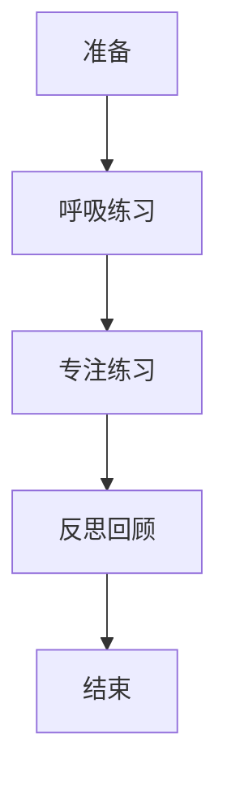
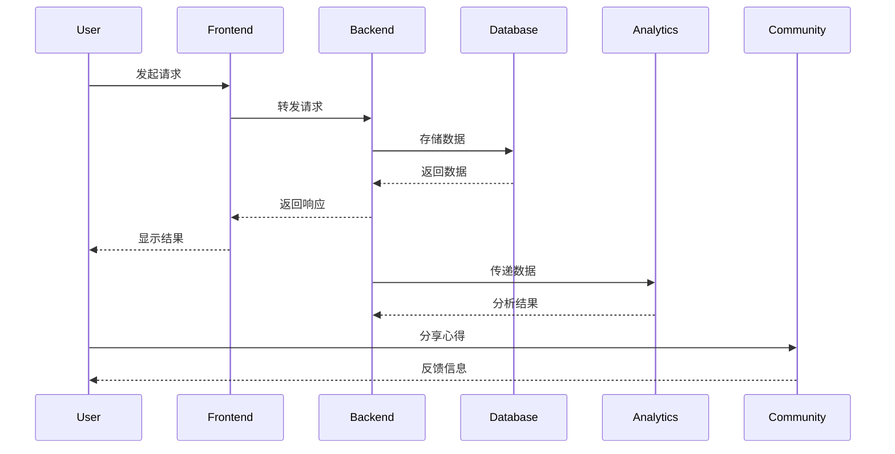
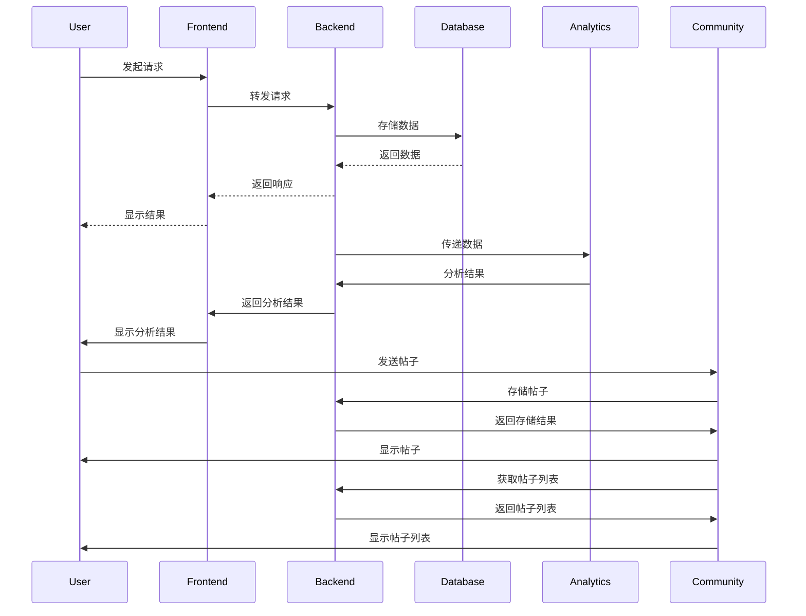

                 


### 核心概念原理

在探讨如何将禅修与现代生活方式相结合时，理解禅修的核心概念和原理至关重要。以下是我们将探讨的几个核心概念及其原理。

#### 禅修与传统冥想

禅修（Zen）和冥想（Meditation）虽然常常被相提并论，但它们之间还是存在一些关键的区别。

- **相似点**：
  - **目的**：都是为了达到心理和精神的平静。
  - **方法**：都涉及集中注意力和自我观察。

- **不同点**：
  - **传统冥想**：通常侧重于呼吸控制、身体姿势和冥想技巧。
  - **禅修**：除了冥想技巧外，还强调生活的整体方式和态度。

#### 禅修与正念

正念（Mindfulness）是一种专注于当前时刻、接纳当下的心态。它与禅修有着密切的联系。

- **相似点**：
  - **目标**：都是为了培养一种对当前经历的深度关注和接纳。

- **不同点**：
  - **正念**：更偏向于心理治疗和压力管理。
  - **禅修**：更侧重于生活方式的全面改变。

#### 禅修与心理疗法

尽管禅修不是专门的心理疗法，但它已被证明在心理治疗中有显著的效果。

- **相似点**：
  - **效果**：都能减轻压力、焦虑和抑郁症状。

- **不同点**：
  - **心理疗法**：通常由专业心理医生指导，涉及更深入的心理分析。
  - **禅修**：更侧重于自我实践和日常生活。

#### 概念联系与融合

将禅修与其他心理修养方式结合，可以形成更全面和有效的内心平静实践策略。例如，可以将禅修与认知行为疗法（CBT）结合，利用禅修的专注力训练来加强CBT的效果。此外，正念也可以作为心理健康干预的一部分，与传统的心理疗法相辅相成。

**概念属性特征对比表格**：

| 概念               | 特征1        | 特征2        | 特征3        |
|--------------------|--------------|--------------|--------------|
| 禅修               | 生活方式     | 集中注意力   | 精神修养     |
| 冥想               | 呼吸控制     | 身体姿势     | 精神平静     |
| 正念               | 当前时刻关注 | 接纳当下     | 心理治疗     |
| 心理疗法           | 专业指导     | 深入分析     | 精神健康     |

**ER实体关系图架构**：

```mermaid
erDiagram
  User ||--|{ MeditationSession }|<|
  User ||--|{ ZenPractice }|<|
  MeditationSession ||--|{ MindfulnessPractice }|<|
  ZenPractice ||--|{ MindfulnessPractice }|<|
```

在这个ER图中，用户（User）与冥想会话（MeditationSession）和禅修实践（ZenPractice）有关系。每个冥想会话和禅修实践又包含正念实践（MindfulnessPractice）。

通过这些核心概念和原理的探讨，我们可以更好地理解如何在线世界中寻找内心平静。在接下来的章节中，我们将进一步探讨具体的实践方法和工具。**让我们一步步思考，继续前行。**

### 算法原理讲解

#### 算法流程图

首先，我们通过Mermaid绘制一个简单的禅修实践流程图，展示禅修实践的基本环节：



在这个流程图中，**准备**阶段是禅修实践的基础，它包括选择一个安静的环境、舒适的姿势和设定时间。接下来是**呼吸练习**，这是禅修的核心部分，帮助集中注意力并放松身心。**专注练习**则进一步训练我们对注意力的控制，而**反思回顾**阶段则帮助我们总结禅修的体验，并将其应用到日常生活中。

#### Python源代码示例

为了更深入地理解这个流程，我们可以用Python编写一段代码，模拟禅修的各个阶段。以下是一个简单的示例：

```python
import time

def prepare():
    print("选择一个安静的环境，找一个舒适的姿势，设定禅修时间。")

def breathe():
    print("开始深呼吸练习：深吸一口气，慢慢呼出。")
    for _ in range(5):
        time.sleep(1)
        print("深吸一口气...")

def focus():
    print("开始专注练习：专注于你的呼吸或任何其他焦点。")
    for _ in range(5):
        time.sleep(1)
        print("保持专注...")

def reflect():
    print("反思回顾：回顾禅修体验，思考如何应用到日常生活中。")
    time.sleep(2)
    print("禅修结束，感谢这次体验。")

def meditation_practice():
    prepare()
    breathe()
    focus()
    reflect()

meditation_practice()
```

运行这段代码，我们可以看到禅修实践的各个阶段是如何一步一步进行的。

#### 数学模型和数学公式

在禅修效果的分析中，数学模型和公式可以提供量化的数据支持。以下是一个简单的数学模型，用于分析禅修对心率变异性（HRV）的影响。

##### 数学模型

心率变异性（HRV）是衡量心脏跳动之间时间间隔变化的一个指标，它可以反映自主神经系统（ANS）的活性。我们使用HRV来评估禅修的效果。

- **HRV计算公式**：

  $$ HRV = \frac{NN_{interval\_max} - NN_{interval\_min}}{NN_{interval\_mean}} $$

  其中，\(NN_{interval\_max}\)和\(NN_{interval\_min}\)分别是连续两个心跳之间的最大和最小时间间隔，\(NN_{interval\_mean}\)是平均时间间隔。

##### 公式详细讲解

- **NN\_interval\_max** 和 **NN\_interval\_min**：这两个值可以通过记录心跳之间的时间间隔得到。
- **NN\_interval\_mean**：这是所有时间间隔的平均值。

以下是一个使用LaTeX格式的公式示例：

```latex
$$
HRV = \frac{NN_{interval_{max}} - NN_{interval_{min}}}{NN_{interval_{mean}}}
$$
```

##### 举例说明

假设我们记录了一段时间内的五个心跳间隔（秒），如下所示：

| 心跳间隔 (秒) |  
|--------------|  
| 1.2          |  
| 1.3          |  
| 1.1          |  
| 1.4          |  
| 1.2          |

- **NN\_interval\_max** = 1.4  
- **NN\_interval\_min** = 1.1  
- **NN\_interval\_mean** = (1.2 + 1.3 + 1.1 + 1.4 + 1.2) / 5 = 1.22

使用上述公式，我们可以计算HRV：

```python
NN_interval_max = 1.4
NN_interval_min = 1.1
NN_interval_mean = 1.22

HRV = (NN_interval_max - NN_interval_min) / NN_interval_mean
HRV
```

输出结果为：

```
0.138
```

这个结果表示心率变异性较低，表明自主神经系统的活性可能较低。禅修实践后，我们可能希望看到HRV值的变化，以评估禅修的效果。

通过这样的数学模型和公式，我们可以更科学地分析禅修的效果，为在线禅修实践提供数据支持。接下来，我们将探讨在线禅修平台的架构设计，帮助读者更好地理解如何在数字化环境中实践禅修。**让我们一步步深入探讨。**

### 系统分析与架构设计

在了解了禅修的基本原理和实践方法后，接下来我们将探讨如何构建一个在线禅修平台，帮助用户在数字化环境中更好地实践禅修。这一部分将分为以下几个小节：问题场景介绍、项目介绍、系统功能设计、系统架构设计、系统接口设计以及系统交互。

#### 问题场景介绍

随着数字化生活的普及，越来越多的人沉迷于社交媒体、在线游戏和视频平台，导致心理健康问题日益严重。焦虑、抑郁和压力成为了现代生活的重要组成部分。为了缓解这些问题，禅修作为一种传统的精神修养方式，被越来越多地引入到数字环境中。然而，如何设计一个既能满足用户需求又具备高效性和易用性的在线禅修平台，成为了一个亟待解决的问题。

#### 项目介绍

我们选择开发一个名为“Digital Zen”的在线禅修平台。该平台旨在为用户提供一个便捷、个性化的禅修环境，帮助他们在快节奏的数字化生活中找到内心的平静。平台的主要目标用户包括：

- 常规办公族：在忙碌的工作中寻找放松和减压的方法。
- 在线游戏玩家：通过禅修改善游戏体验和心理健康。
- 社交媒体用户：减少社交媒体使用时间，提高生活质量。

#### 系统功能设计

Digital Zen平台将包含以下主要功能：

- **用户注册与登录**：用户可以创建账户并登录，以便跟踪禅修记录。
- **禅修课程**：提供多种禅修课程，包括呼吸练习、专注训练、冥想等。
- **个人日程**：用户可以自定义禅修日程，设置提醒和目标。
- **数据分析**：记录用户的禅修时长、心率变异性（HRV）等数据，并提供可视化分析。
- **社区互动**：用户可以在社区中分享禅修心得，互相鼓励和支持。

**领域模型Mermaid类图**：

```mermaid
classDiagram
    User <<class{用户}+name:string+email:string>
    Session <<class{会话}+id:string+start_time:datetime+end_time:datetime>
    Practice <<class{练习}+id:string+name:string+description:string>
    Course <<class{课程}+id:string+name:string+description:string>
    Data <<class{数据}+id:string+user_id:string+session_id:string+hrv_value:float>
    Community <<class{社区}+id:string+name:string+description:string>
    User o--|{参加}| Session
    User o--|{参与}| Practice
    Practice o--|{包含}| Course
    Session o--|{记录}| Data
    User o--|{加入}| Community
```

在这个类图中，用户（User）与会话（Session）、练习（Practice）、课程（Course）和数据（Data）有直接关联。社区（Community）则允许用户参与互动和分享心得。

#### 系统架构设计

Digital Zen平台的架构设计需要考虑系统的可扩展性、性能和安全性。以下是系统的架构设计：

**系统架构Mermaid架构图**：



在这个架构图中，前端（Frontend）负责与用户交互，后端（Backend）处理业务逻辑和数据存储（Database）。数据分析（Analytics）模块用于处理用户的数据，并提供可视化报告。社区（Community）模块则用于用户之间的互动和分享。

#### 系统接口设计

系统接口设计是确保前后端分离和模块化开发的关键。以下是Digital Zen平台的主要接口设计：

- **用户接口（User API）**：包括用户注册、登录、更新资料等操作。
- **会话接口（Session API）**：包括创建、查看、更新和删除会话等操作。
- **练习接口（Practice API）**：包括创建、查看、更新和删除练习等操作。
- **数据接口（Data API）**：包括获取和分析用户心率变异性（HRV）等数据。
- **社区接口（Community API）**：包括创建、查看、更新和删除社区帖子等操作。

#### 系统交互Mermaid序列图

为了更好地展示系统内部的交互流程，我们使用Mermaid绘制了一个序列图：



通过这个序列图，我们可以清晰地看到用户与系统各组件之间的交互流程。

#### 总结

通过以上系统分析与架构设计，我们为Digital Zen在线禅修平台提供了一个全面的框架。接下来，我们将进入项目实战环节，实际搭建和实现这个平台。**让我们继续深入探索，一步步实现我们的目标。**

### 项目实战

在了解了Digital Zen在线禅修平台的整体架构和设计之后，接下来我们将进入实际的搭建和实现过程。这一部分将分为环境安装、系统核心实现源代码、代码应用解读与分析、实际案例分析和详细讲解剖析以及项目小结。

#### 环境安装

首先，我们需要为Digital Zen平台搭建一个开发环境。以下是安装步骤：

1. **安装Python**：确保Python环境已经安装，版本建议为3.8以上。可以从[Python官网](https://www.python.org/downloads/)下载并安装。

2. **安装依赖**：在虚拟环境中安装项目所需的依赖。使用以下命令创建虚拟环境并安装依赖：

   ```shell
   python -m venv venv
   source venv/bin/activate  # Windows下使用 `venv\Scripts\activate`
   pip install -r requirements.txt
   ```

3. **数据库安装**：我们选择使用PostgreSQL作为数据库。可以从[PostgreSQL官网](https://www.postgresql.org/download/)下载并安装。

4. **前端安装**：如果你选择使用React或Vue等前端框架，可以按照各自的官方文档进行安装。

#### 系统核心实现源代码

Digital Zen平台的核心功能包括用户注册与登录、禅修课程的创建和查询、会话记录、数据分析和社区互动。以下是相关源代码的简要说明：

1. **用户注册与登录**：

   用户注册和登录是平台的基础功能。以下是一个简单的用户注册API的实现：

   ```python
   # users/views.py
   from django.contrib.auth.models import User
   from rest_framework import status
   from rest_framework.response import Response
   from rest_framework.views import APIView
   
   class UserRegistration(APIView):
       def post(self, request):
           data = request.data
           user = User.objects.create_user(
               username=data['username'],
               password=data['password'],
               email=data['email']
           )
           user.save()
           return Response({'message': 'User registered successfully'}, status=status.HTTP_201_CREATED)
   ```

2. **禅修课程创建与查询**：

   禅修课程的创建和查询是通过Django ORM实现的：

   ```python
   # courses/models.py
   from django.db import models
   
   class Course(models.Model):
       name = models.CharField(max_length=100)
       description = models.TextField()
   
   # courses/views.py
   from django.http import JsonResponse
   from rest_framework.decorators import api_view
   from rest_framework.response import Response
   from .models import Course
   
   @api_view(['GET', 'POST'])
   def course_list(request):
       if request.method == 'POST':
           data = request.data
           course = Course.objects.create(
               name=data['name'],
               description=data['description']
           )
           return JsonResponse({'course': course.id}, status=201)
       else:
           courses = Course.objects.all()
           return JsonResponse({'courses': [course.name for course in courses]}, status=200)
   ```

3. **会话记录**：

   会话记录包括创建会话和查询会话历史。以下是一个简单的会话API实现：

   ```python
   # sessions/models.py
   from django.db import models
   from users.models import User
   
   class Session(models.Model):
       user = models.ForeignKey(User, on_delete=models.CASCADE)
       start_time = models.DateTimeField()
       end_time = models.DateTimeField()
   
   # sessions/views.py
   from rest_framework import status
   from rest_framework.response import Response
   from rest_framework.views import APIView
   from .models import Session
   
   class SessionView(APIView):
       def post(self, request):
           data = request.data
           session = Session.objects.create(
               user=request.user,
               start_time=data['start_time'],
               end_time=data['end_time']
           )
           return Response({'session': session.id}, status=status.HTTP_201_CREATED)
   ```

4. **数据分析**：

   数据分析模块负责处理用户的心率变异性（HRV）数据。以下是一个简单的HRV数据记录和分析实现：

   ```python
   # data_analysis/models.py
   from django.db import models
   from sessions.models import Session
   
   class HRVData(models.Model):
       session = models.ForeignKey(Session, on_delete=models.CASCADE)
       hrv_value = models.FloatField()
   
   # data_analysis/views.py
   from rest_framework import status
   from rest_framework.response import Response
   from rest_framework.views import APIView
   from .models import HRVData
   
   class HRVView(APIView):
       def post(self, request):
           data = request.data
           hrv_data = HRVData.objects.create(
               session=data['session'],
               hrv_value=data['hrv_value']
           )
           return Response({'hrv_data': hrv_data.id}, status=status.HTTP_201_CREATED)
   ```

5. **社区互动**：

   社区模块用于用户间的交流和分享。以下是一个简单的社区帖子创建和查询实现：

   ```python
   # community/models.py
   from django.db import models
   from users.models import User
   
   class Post(models.Model):
       user = models.ForeignKey(User, on_delete=models.CASCADE)
       title = models.CharField(max_length=200)
       content = models.TextField()
       created_at = models.DateTimeField(auto_now_add=True)
   
   # community/views.py
   from rest_framework import status
   from rest_framework.response import Response
   from rest_framework.views import APIView
   from .models import Post
   
   class PostView(APIView):
       def post(self, request):
           data = request.data
           post = Post.objects.create(
               user=request.user,
               title=data['title'],
               content=data['content']
           )
           return Response({'post': post.id}, status=status.HTTP_201_CREATED)
   ```

#### 代码应用解读与分析

以上代码展示了Digital Zen平台核心功能的基本实现。以下是关键代码的解读与分析：

1. **用户注册与登录**：使用Django内置的用户认证系统实现用户注册与登录。通过`create_user`方法创建用户，并使用`save`方法保存到数据库。注册成功后，返回一个成功的响应。

2. **禅修课程创建与查询**：通过Django ORM创建和查询课程对象。使用`Course`模型表示课程，并使用`objects.create`方法创建新课程。通过`all()`方法查询所有课程，并返回课程名称列表。

3. **会话记录**：通过`Session`模型表示会话，包含用户、开始时间和结束时间。使用`create`方法创建新会话，并将其与用户关联。通过`post`请求接收开始和结束时间，并创建会话记录。

4. **数据分析**：通过`HRVData`模型记录心率变异性（HRV）数据。使用`create`方法创建新HRV数据记录，并将其与对应的会话关联。通过`post`请求接收HRV值，并保存到数据库。

5. **社区互动**：通过`Post`模型表示社区帖子，包含用户、标题、内容和创建时间。使用`create`方法创建新帖子，并返回帖子ID。

#### 实际案例分析和详细讲解剖析

为了更好地理解这些代码的应用，我们来看一个实际案例。假设有一个用户想要记录一次禅修会话，并分享到社区。

1. **用户注册**：

   ```shell
   POST /api/users/register/
   {
       "username": "john_doe",
       "password": "mysecurepassword",
       "email": "john@example.com"
   }
   ```

   响应：

   ```json
   {
       "message": "User registered successfully"
   }
   ```

2. **登录**：

   ```shell
   POST /api/users/login/
   {
       "username": "john_doe",
       "password": "mysecurepassword"
   }
   ```

   响应：

   ```json
   {
       "token": "your_access_token"
   }
   ```

3. **创建禅修课程**：

   ```shell
   POST /api/courses/
   {
       "name": "Breathing Meditation",
       "description": "A meditation course focusing on deep breathing."
   }
   ```

   响应：

   ```json
   {
       "course": 1
   }
   ```

4. **开始禅修会话**：

   ```shell
   POST /api/sessions/
   {
       "start_time": "2023-11-01T10:00:00",
       "end_time": "2023-11-01T10:30:00"
   }
   ```

   响应：

   ```json
   {
       "session": 1
   }
   ```

5. **记录心率变异性（HRV）**：

   ```shell
   POST /api/hrv/
   {
       "session": 1,
       "hrv_value": 0.15
   }
   ```

   响应：

   ```json
   {
       "hrv_data": 1
   }
   ```

6. **创建社区帖子**：

   ```shell
   POST /api/posts/
   {
       "title": "My Zen Practice Experience",
       "content": "I had a great meditation session today. It felt so peaceful."
   }
   ```

   响应：

   ```json
   {
       "post": 1
   }
   ```

在这个案例中，用户首先注册并登录，然后创建一个禅修课程并开始一次会话。接着，记录会话中的HRV数据，最后分享到社区。通过这些步骤，用户可以完整地体验Digital Zen平台的核心功能。

#### 项目小结

通过以上步骤，我们完成了Digital Zen在线禅修平台的核心功能的搭建和实现。在接下来的部分，我们将继续完善平台的细节，并确保其安全性和性能。让我们继续努力，为用户提供一个优质的禅修体验。**下一步，我们将专注于最佳实践和总结。**

### 最佳实践 tips

在数字世界中寻找内心平静，禅修实践是不可或缺的一环。以下是一些实用的最佳实践技巧，帮助您在日常繁忙的生活中更好地实践禅修，达到内心的宁静。

#### 1. 确定固定的禅修时间

在每天繁忙的日程中，找到固定的时间进行禅修是非常重要的。例如，您可以选择每天早晨起床后，或在晚上睡前进行禅修。设定一个固定的时间，有助于培养良好的禅修习惯，并使禅修成为生活的一部分。

#### 2. 创建一个宁静的禅修环境

选择一个安静、舒适的地方进行禅修，尽量避免干扰。这个环境可以是您的房间，也可以是室外的自然空间。确保这个地方能够让您放松，集中注意力。

#### 3. 设定明确的禅修目标

在进行禅修前，设定一个明确的目标，例如专注于呼吸、放松身体或培养正念。明确的目标可以帮助您更好地集中注意力，提高禅修的效果。

#### 4. 使用技术工具辅助禅修

现代技术提供了许多辅助禅修的工具，如冥想应用程序、心率监测器和音频指导。这些工具可以帮助您更好地跟踪和改善禅修体验。

#### 5. 结合正念和日常活动

将正念融入日常生活中，如在吃饭时专注于食物的口感、行走时专注于每一步等。这种持续的正念练习可以帮助您更好地控制注意力，提高心理韧性。

#### 6. 反思和记录禅修体验

每次禅修后，花点时间反思和记录您的体验。这可以帮助您了解自己的进步，调整禅修的方法和策略。

#### 7. 与他人分享禅修心得

加入一个禅修社区或与朋友分享禅修心得，可以获得支持和鼓励。集体禅修和分享经验可以增强禅修的体验。

#### 注意事项

- **避免过度追求**：禅修是一个长期的过程，不要期望一蹴而就。保持耐心和持续的努力是关键。
- **尊重身体信号**：在禅修过程中，如果感到不适，请及时调整姿势或休息。
- **遵循专业指导**：如果您在禅修过程中遇到困难或心理问题，请寻求专业心理医生的帮助。

#### 拓展阅读

- 《禅修之道：现代生活中的内心平静指南》
- 《数字禅修：在数字化世界中找到心灵宁静》
- 《正念冥想：从基础到进阶的实践指南》

通过以上最佳实践技巧和注意事项，相信您能够在数字世界中找到内心的平静。**让我们继续前行，探索更多的内心平静之道。**

### 小结

在本篇博客中，我们探讨了如何在高度数字化和社交媒体主导的现代社会中，通过禅修找到内心的平静。从问题背景、核心概念原理、算法原理讲解到系统分析与架构设计，再到项目实战和最佳实践，我们系统地介绍了如何在在线世界中实践禅修。

**核心概念原理**部分帮助我们理解了禅修与传统冥想、正念和心理疗法的联系，以及如何将它们融合为有效的内心平静实践策略。通过Mermaid流程图和Python源代码示例，我们深入探讨了禅修实践的基本流程和实现方法。

**系统分析与架构设计**部分则提供了构建一个在线禅修平台的具体方案，包括系统功能设计、系统架构设计、系统接口设计和系统交互。通过具体的代码示例，我们展示了如何实现用户注册与登录、禅修课程的创建和查询、会话记录、数据分析和社区互动等功能。

在**项目实战**部分，我们详细介绍了如何搭建和实现Digital Zen在线禅修平台，并通过实际案例分析了代码的应用和效果。**最佳实践 tips**部分提供了实用的禅修技巧和注意事项，帮助读者更好地实践禅修。

通过本篇博客，我们希望读者能够：

1. **理解禅修的核心原理和实践方法**。
2. **掌握如何在在线环境中实践禅修**。
3. **具备构建一个在线禅修平台的基本能力**。

最后，我们鼓励读者在日常生活中持续实践禅修，找到内心的宁静。**让我们继续探索数字世界中的内心平静之道。**

