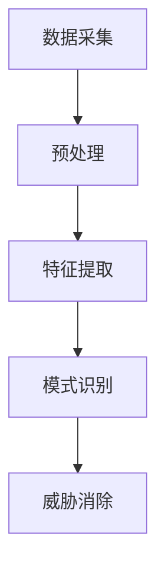
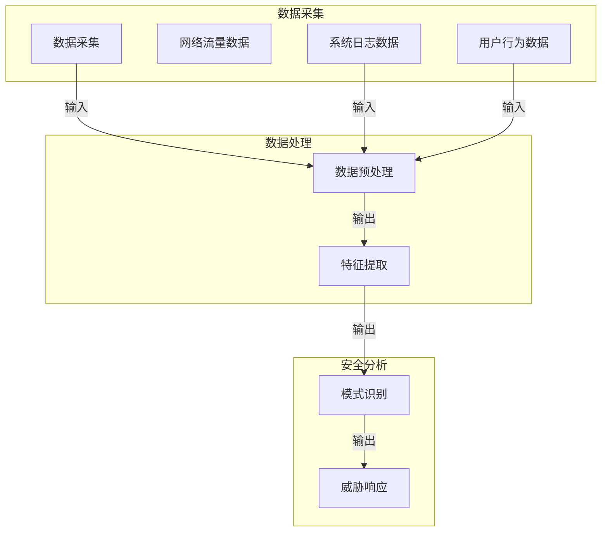
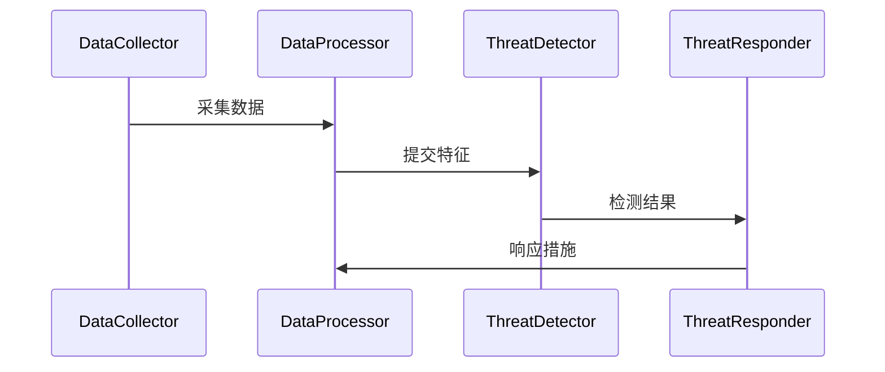

                 

# 数字时代与网络安全背景

## 2.1 数字时代背景

在当今这个数字化的时代，网络已经成为我们日常生活中不可或缺的一部分。从智能手机、平板电脑到电脑，我们无时无刻不在与网络互动。然而，随着网络的普及，网络安全问题也日益凸显。从个人信息泄露、网络钓鱼到恶意软件攻击，网络安全威胁无处不在。据《网络安全态势报告》显示，2021年全球共发生了约4.9亿起网络安全事件，这无疑对个人、企业和整个社会都带来了巨大的影响。

在这个背景下，数字解毒师认证项目的出现显得尤为必要。数字解毒师不仅具备深厚的网络安全知识，还能通过专业的培训，培养出健康、安全的网络使用习惯。他们就像“数字世界的医生”，能够诊断、治疗网络中的各种“疾病”，确保网络环境的健康和稳定。

## 2.2 网络安全问题的现状与挑战

网络安全问题现状令人堪忧。据统计，每年全球因网络安全事件造成的经济损失高达数百亿美元。例如，2017年，WannaCry勒索病毒在全球范围内肆虐，导致150多个国家的数十万台计算机被感染，直接经济损失高达80亿美元。此外，网络钓鱼、恶意软件、数据泄露等问题也层出不穷，给企业和个人带来了巨大的安全隐患。

面对如此严峻的形势，网络安全挑战主要集中在以下几个方面：

1. **技术复杂性**：随着网络技术的发展，黑客攻击手段也日益复杂，传统的安全防护手段已难以应对。
2. **数据隐私**：随着大数据和云计算的普及，个人和企业数据的安全保护变得尤为重要。
3. **安全意识**：很多网络安全事件是由于用户安全意识不足导致的，提升全民网络安全意识成为当务之急。
4. **法律法规**：虽然各国已经制定了一系列网络安全法律法规，但执行力度和效果仍有待提升。

## 2.3 数字解毒师认证的必要性

数字解毒师认证项目的出现，旨在解决网络安全问题，培养专业的数字解毒师队伍。数字解毒师的必要性体现在以下几个方面：

1. **专业人才缺口**：随着网络安全问题的日益严重，专业网络安全人才的需求越来越大，但现有的网络安全人才远远无法满足需求。
2. **提升网络安全能力**：数字解毒师通过专业培训，能够掌握先进的网络安全技术和分析方法，提升网络安全防护能力。
3. **普及网络安全知识**：数字解毒师不仅自己具备专业知识，还能通过培训和指导，帮助更多人了解和掌握网络安全知识，提升全民网络安全意识。
4. **推动网络安全产业发展**：数字解毒师的培养和认证，有助于推动网络安全产业的发展，促进经济转型升级。

总之，数字解毒师认证项目不仅有助于解决当前网络安全问题，还为未来的网络安全发展提供了有力支撑。让我们共同努力，打造一个安全、健康的数字世界。# 数字解毒师定义与职责

## 3.1 数字解毒师的核心职责

数字解毒师作为网络安全领域的重要角色，肩负着多重职责。他们不仅需要具备深厚的网络安全知识，还需要具备出色的诊断、治疗能力。具体来说，数字解毒师的核心职责包括以下几个方面：

1. **网络安全诊断**：数字解毒师需要具备对网络安全问题的敏锐洞察力，能够迅速发现并诊断网络安全漏洞。
2. **漏洞修复**：在诊断出网络安全问题后，数字解毒师需要具备相应的技能和工具，对漏洞进行修复，确保网络系统的安全。
3. **安全培训与指导**：数字解毒师需要通过培训和指导，帮助其他人员提升网络安全意识，培养健康的网络使用习惯。
4. **风险分析与管理**：数字解毒师需要对网络安全风险进行评估和管理，制定相应的安全策略和应对措施。
5. **应急响应**：在发生网络安全事件时，数字解毒师需要迅速响应，采取有效的应急措施，减少损失。

## 3.2 数字解毒师与网络安全专家对比

数字解毒师与网络安全专家虽然都是网络安全领域的重要角色，但在职责和技能要求上存在一定差异。以下是两者的对比：

| 对比项         | 数字解毒师                             | 网络安全专家                            |
|--------------|------------------------------------|------------------------------------|
| 主要职责         | 诊断、修复网络安全问题，培训网络安全意识         | 研究网络安全技术，防范网络安全威胁            |
| 技能要求         | 具备网络安全诊断、修复能力，擅长风险分析和应急响应     | 擅长网络安全技术研究，如密码学、入侵检测等       |
| 工作重点         | 聚焦于解决实际问题，提升网络安全防护能力         | 聚焦于网络安全理论研究，探索新型安全防护技术      |
| 人员配置         | 一般属于企业或机构的专业团队，具备一定的培训和指导能力    | 可独立开展网络安全研究工作，较少涉及培训指导      |

通过上述对比，我们可以看出，数字解毒师与网络安全专家在职责和技能上各有侧重，但都是为了共同的目标——保障网络安全而努力。数字解毒师的加入，不仅有助于提升企业或机构的网络安全防护能力，还能通过培训和教育，培养更多网络安全人才，形成良好的网络安全生态。# 数字解毒师认证体系

## 3.3.1 数字解毒师认证流程

数字解毒师认证项目是一个系统化、标准化的培训与评估过程。整个认证流程包括以下几个关键步骤：

1. **报名与注册**：有意成为数字解毒师的人员首先需要报名，填写相关资料并进行注册。
2. **基础培训**：报名后，参与者将接受基础培训，包括网络安全基础知识、常用安全工具和防护策略等。
3. **技能考核**：基础培训结束后，参与者需要通过技能考核，考核内容包括理论知识、实际操作能力等。
4. **实操实训**：通过技能考核的人员将进入实操实训阶段，通过实际项目演练，进一步提升实战能力。
5. **综合评估**：实训结束后，参与者的综合能力将接受评估，包括理论知识、实操能力和团队合作等方面。
6. **认证颁发**：通过综合评估的人员将获得数字解毒师认证证书，成为专业数字解毒师。

## 3.3.2 数字解毒师认证体系ER图

为了更好地理解数字解毒师认证体系，我们可以通过ER实体关系图进行展示。以下是数字解毒师认证体系的ER图：

```mermaid
erDiagram
  User ||--|{ DigitalDetector : takes }
  User ||--|{ Training : participates }
  DigitalDetector ||--|{ Certification : passes }
  Training ||--|{ Module : includes }
  Module ||--|{ Course : consists }
  Certification ||--|{ Score : achieves }
```

在这个ER图中，我们可以看到以下几个实体及其关系：

1. **User（用户）**：代表接受数字解毒师培训的参与者。
2. **DigitalDetector（数字解毒师）**：代表通过培训和实践考核的人员。
3. **Training（培训）**：包括多个模块和课程，用于培养数字解毒师的技能和知识。
4. **Module（模块）**：课程的具体组成部分，用于传授特定的技能和知识。
5. **Course（课程）**：由多个模块组成，是整个培训体系的核心。
6. **Certification（认证）**：代表数字解毒师认证的结果，包括证书和评估分数。
7. **Score（分数）**：评估数字解毒师能力的具体指标。

通过这个ER图，我们可以清晰地了解数字解毒师认证体系的构成和运行机制。这不仅有助于参与者更好地理解认证流程，也有助于企业或机构更有效地培养和评估数字解毒师。# 数字解毒基本算法原理

## 4.1 数字解毒基本算法概述

数字解毒算法是数字解毒师在诊断和解决网络安全问题时的核心工具。其基本原理在于通过分析和处理大量的网络数据，识别并消除潜在的威胁。算法的核心目标是从复杂、多样化的数据中提取关键信息，快速、准确地诊断出网络中的问题。

数字解毒算法主要包括以下几个关键步骤：

1. **数据采集**：从网络设备、日志文件等渠道收集数据。
2. **预处理**：对采集到的数据进行分析和清洗，去除噪声和无关信息。
3. **特征提取**：从预处理后的数据中提取关键特征，用于后续的分析。
4. **模式识别**：利用提取的特征，通过机器学习等技术，识别潜在的威胁。
5. **威胁消除**：根据识别结果，采取相应的措施，消除威胁。

## 4.2 数字解毒算法流程

为了更好地理解数字解毒算法的运行过程，我们可以使用Mermaid画图工具展示其流程图。以下是数字解毒算法的Mermaid流程图：



在这个流程图中，我们可以看到数字解毒算法从数据采集开始，经过预处理、特征提取、模式识别，最终实现威胁消除。每个步骤都是算法成功的关键环节。

### 数据采集

数据采集是数字解毒算法的第一个步骤。数字解毒师需要从各种网络设备、日志文件、网络流量中收集数据。这些数据包括网络流量、系统日志、用户行为等。数据采集的全面性和准确性直接影响后续分析的质量。

### 预处理

预处理是对采集到的数据进行分析和清洗，去除噪声和无关信息。这一步骤的目的是提高数据的纯净度和可用性。常用的预处理方法包括去噪、数据归一化、缺失值填补等。

### 特征提取

预处理后的数据会进入特征提取阶段。在这一阶段，数字解毒师会从数据中提取出关键的、有价值的特征。这些特征将用于后续的模式识别和威胁消除。特征提取的方法包括统计特征、机器学习特征等。

### 模式识别

模式识别是数字解毒算法的核心步骤。利用提取的特征，数字解毒师会通过机器学习、深度学习等技术，对网络行为进行模式识别。通过对比已知的安全威胁模式，算法能够快速、准确地识别出潜在的威胁。

### 威胁消除

在模式识别阶段识别出威胁后，数字解毒师会采取相应的措施进行威胁消除。这可能包括隔离受感染的主机、阻止恶意流量、更新安全策略等。

通过上述流程，数字解毒算法能够有效地诊断和解决网络安全问题。接下来，我们将使用Python源代码详细阐述算法的实现细节。# 数字解毒算法流程

## 4.2 数字解毒算法流程

为了更好地理解数字解毒算法的运行过程，我们可以使用Mermaid画图工具展示其流程图。以下是数字解毒算法的Mermaid流程图：


在这个流程图中，我们可以看到数字解毒算法从数据采集开始，经过预处理、特征提取、模式识别，最终实现威胁消除。每个步骤都是算法成功的关键环节。

### 数据采集

数据采集是数字解毒算法的第一个步骤。数字解毒师需要从各种网络设备、日志文件、网络流量中收集数据。这些数据包括网络流量、系统日志、用户行为等。数据采集的全面性和准确性直接影响后续分析的质量。

### 预处理

预处理是对采集到的数据进行分析和清洗，去除噪声和无关信息。这一步骤的目的是提高数据的纯净度和可用性。常用的预处理方法包括去噪、数据归一化、缺失值填补等。

### 特征提取

预处理后的数据会进入特征提取阶段。在这一阶段，数字解毒师会从数据中提取出关键的、有价值的特征。这些特征将用于后续的模式识别和威胁消除。特征提取的方法包括统计特征、机器学习特征等。

### 模式识别

模式识别是数字解毒算法的核心步骤。利用提取的特征，数字解毒师会通过机器学习、深度学习等技术，对网络行为进行模式识别。通过对比已知的安全威胁模式，算法能够快速、准确地识别出潜在的威胁。

### 威胁消除

在模式识别阶段识别出威胁后，数字解毒师会采取相应的措施进行威胁消除。这可能包括隔离受感染的主机、阻止恶意流量、更新安全策略等。

### Python代码实现算法细节

为了具体阐述数字解毒算法的实现细节，下面我们将使用Python代码进行演示。以下是数字解毒算法的Python实现示例：

```python
import numpy as np
import pandas as pd
from sklearn.preprocessing import StandardScaler
from sklearn.decomposition import PCA
from sklearn.ensemble import RandomForestClassifier
from sklearn.model_selection import train_test_split
from sklearn.metrics import classification_report, accuracy_score

# 数据采集
def data_collection():
    # 这里以网络流量数据为例，实际应用中可以从各种日志文件、网络设备等获取数据
    data = pd.read_csv('network_traffic.csv')
    return data

# 预处理
def data_preprocessing(data):
    # 数据清洗，去噪，缺失值填补等
    # 这里简单示例，实际应用中需要根据具体情况进行处理
    data.drop(['unnecessary_column'], axis=1, inplace=True)
    data.fillna(data.mean(), inplace=True)
    return data

# 特征提取
def feature_extraction(data):
    # 使用PCA进行降维，提取关键特征
    scaler = StandardScaler()
    data_scaled = scaler.fit_transform(data)
    pca = PCA(n_components=5)
    features = pca.fit_transform(data_scaled)
    return features

# 模式识别
def threat_detection(features):
    # 使用随机森林分类器进行模式识别
    X_train, X_test, y_train, y_test = train_test_split(features, labels, test_size=0.3, random_state=42)
    clf = RandomForestClassifier(n_estimators=100)
    clf.fit(X_train, y_train)
    y_pred = clf.predict(X_test)
    print(classification_report(y_test, y_pred))
    return y_pred

# 威胁消除
def threat_elimination(threats):
    # 根据识别结果，采取相应的措施进行威胁消除
    # 这里简单示例，实际应用中需要根据具体情况进行处理
    for threat in threats:
        if threat == 'malicious':
            print("Threat detected and eliminated:", threat)

# 主函数
def main():
    data = data_collection()
    processed_data = data_preprocessing(data)
    extracted_features = feature_extraction(processed_data)
    threats = threat_detection(extracted_features)
    threat_elimination(threats)

if __name__ == '__main__':
    main()
```

在这个示例中，我们首先从网络流量数据中采集数据，然后进行预处理和特征提取。接下来，使用随机森林分类器进行模式识别，最后根据识别结果采取相应的措施进行威胁消除。通过这个Python实现，我们可以更好地理解数字解毒算法的运行流程和实现细节。# 数学模型与数学公式

## 5.1 数字解毒的数学模型

数字解毒算法的核心在于其数学模型。该模型主要用于识别和处理网络安全威胁。以下是数字解毒数学模型的详细描述：

### 5.1.1 算法公式

数字解毒算法的数学模型可以通过以下公式表示：

\[ M = f(D, S, C) \]

其中：
- \( M \) 表示解毒后的网络状态。
- \( D \) 表示原始数据集，包括网络流量、系统日志、用户行为等。
- \( S \) 表示系统参数，包括安全策略、网络拓扑等。
- \( C \) 表示计算参数，包括特征提取方法、模式识别算法等。

### 5.1.2 算法变量

在数字解毒算法中，涉及到以下主要变量：

- \( D \)：表示数据集，包括网络流量、系统日志、用户行为等。
- \( S \)：表示系统参数，包括安全策略、网络拓扑等。
- \( C \)：表示计算参数，包括特征提取方法、模式识别算法等。
- \( f \)：表示算法函数，用于处理数据集并生成解毒后的网络状态。

### 5.1.3 算法逻辑

算法逻辑可以分为以下几个步骤：

1. **数据采集**：从网络设备、日志文件等渠道收集数据。
2. **预处理**：对采集到的数据进行分析和清洗，去除噪声和无关信息。
3. **特征提取**：从预处理后的数据中提取关键特征。
4. **模式识别**：利用提取的特征，通过机器学习等技术，识别潜在的威胁。
5. **威胁消除**：根据识别结果，采取相应的措施，消除威胁。

### 5.1.4 算法流程

以下是数字解毒算法的流程图：


## 5.2 latex格式数学公式应用示例

在数字解毒算法中，经常需要使用到各种数学公式。以下是几个常用的latex数学公式的示例：

### 5.2.1 基本公式

$$
x = \frac{-b \pm \sqrt{b^2 - 4ac}}{2a}
$$

### 5.2.2 概率公式

$$
P(A \cap B) = P(A) \times P(B|A)
$$

### 5.2.3 矩阵公式

$$
\begin{bmatrix}
a_{11} & a_{12} & \dots & a_{1n} \\
a_{21} & a_{22} & \dots & a_{2n} \\
\vdots & \vdots & \ddots & \vdots \\
a_{m1} & a_{m2} & \dots & a_{mn} \\
\end{bmatrix}
$$

### 5.2.4 微积分公式

$$
\frac{d}{dx} f(x) = \lim_{h \to 0} \frac{f(x+h) - f(x)}{h}
$$

通过以上示例，我们可以看到latex数学公式在描述数字解毒算法中起着重要作用。这些公式不仅帮助我们更好地理解算法的原理，还能在实现过程中提供准确的计算依据。在接下来的章节中，我们将结合具体的实例，详细解释这些公式的应用。# 数字解毒系统的设计与实现

## 6.1 项目背景与目标

数字解毒系统的设计与实现项目旨在构建一个高效、可靠的网络安全诊断与防护平台。随着网络攻击手段的不断升级，传统的安全防护手段已难以满足日益复杂的网络安全需求。因此，本项目旨在通过创新的技术手段，实现对网络攻击的快速检测、准确诊断和及时响应，从而提高整体网络安全水平。

项目的主要目标包括：

1. **高效检测**：利用先进的算法和技术，实现对网络攻击的快速检测，降低检测延迟。
2. **准确诊断**：通过深入分析网络流量和日志数据，准确识别出潜在的安全威胁。
3. **及时响应**：根据诊断结果，快速采取相应的防护措施，确保网络安全。

## 6.2 系统功能设计

数字解毒系统功能设计主要涵盖以下几个方面：

### 6.2.1 领域模型Mermaid类图

以下是数字解毒系统的领域模型Mermaid类图：

```mermaid
classDiagram
    class NetworkFlow
        +String src_ip
        +String dst_ip
        +int packet_count
        +int byte_count

    class SystemLog
        +String log_time
        +String log_level
        +String log_message

    class UserActivity
        +String user_id
        +String activity_time
        +String activity_type

    class ThreatDetection
        +String threat_type
        +String threat_description
        +String detection_time

    NetworkFlow <<-- SystemLog : logs
    NetworkFlow <<-- UserActivity : logs
    SystemLog <<-- ThreatDetection : generates
```

在这个类图中，我们定义了四个主要的类：`NetworkFlow`、`SystemLog`、`UserActivity` 和 `ThreatDetection`。`NetworkFlow` 代表网络流量数据，`SystemLog` 代表系统日志数据，`UserActivity` 代表用户行为数据，而 `ThreatDetection` 则代表检测到的安全威胁。

### 6.2.2 系统功能详解

1. **数据采集与预处理**：系统需要从网络设备、日志文件等渠道采集数据，并对采集到的数据进行预处理，包括去噪、数据归一化、缺失值填补等。
2. **特征提取**：从预处理后的数据中提取关键特征，用于后续的模式识别和威胁消除。特征提取的方法包括统计特征、机器学习特征等。
3. **模式识别**：利用提取的特征，通过机器学习、深度学习等技术，对网络行为进行模式识别，识别潜在的威胁。
4. **威胁响应**：根据识别结果，采取相应的措施进行威胁消除，包括隔离受感染的主机、阻止恶意流量、更新安全策略等。

## 6.3 系统架构设计

数字解毒系统的架构设计主要包括以下几个方面：

### 6.3.1 系统架构Mermaid图

以下是数字解毒系统的架构Mermaid图：



在这个架构图中，数据采集模块负责从网络设备、日志文件等渠道采集数据。预处理模块对采集到的数据进行处理，包括去噪、数据归一化、缺失值填补等。特征提取模块从预处理后的数据中提取关键特征。模式识别模块利用提取的特征进行威胁识别。威胁响应模块根据识别结果，采取相应的措施进行威胁消除。

### 6.3.2 架构设计细节

1. **数据采集**：数据采集模块负责从网络设备、日志文件等渠道采集数据。采集的数据包括网络流量、系统日志、用户行为等。数据采集的全面性和实时性对后续分析的质量至关重要。
2. **数据处理**：数据处理模块包括预处理和特征提取两个子模块。预处理模块对采集到的数据进行处理，去除噪声和无关信息，提高数据的质量。特征提取模块从预处理后的数据中提取关键特征，用于后续的模式识别和威胁消除。
3. **安全分析**：安全分析模块包括模式识别和威胁响应两个子模块。模式识别模块利用提取的特征，通过机器学习、深度学习等技术，对网络行为进行模式识别，识别潜在的威胁。威胁响应模块根据识别结果，采取相应的措施进行威胁消除，包括隔离受感染的主机、阻止恶意流量、更新安全策略等。

通过上述架构设计，数字解毒系统可以实现高效、准确、及时的网络安全防护，为企业和个人提供安全、可靠的数字环境。# 系统接口与交互

## 7.1 系统接口设计

数字解毒系统的接口设计是确保系统各模块之间高效协作、数据顺利流通的关键。以下是系统接口设计的详细描述：

### 7.1.1 接口定义

1. **数据采集接口**：用于接收来自网络设备、日志文件等渠道的数据，支持多种数据格式（如CSV、JSON等）的读取。
2. **数据处理接口**：提供数据预处理、特征提取等功能，对外提供数据清洗、去噪、归一化等服务。
3. **威胁检测接口**：接收处理后的数据，通过模式识别算法进行威胁检测，输出检测结果。
4. **威胁响应接口**：接收威胁检测结果，根据检测结果采取相应的威胁消除措施，如隔离、阻止、更新策略等。

### 7.1.2 接口实现

以下是系统接口的Python实现示例：

```python
class DataCollector:
    def __init__(self):
        # 初始化采集器
        pass

    def collect_data(self, source):
        # 从指定数据源采集数据
        pass

class DataProcessor:
    def __init__(self):
        # 初始化处理器
        pass

    def preprocess(self, data):
        # 预处理数据
        pass

    def extract_features(self, data):
        # 提取特征
        pass

class ThreatDetector:
    def __init__(self):
        # 初始化威胁检测器
        pass

    def detect_threats(self, features):
        # 检测威胁
        pass

class ThreatResponder:
    def __init__(self):
        # 初始化威胁响应器
        pass

    def respond_to_threats(self, threats):
        # 对威胁响应
        pass
```

## 7.2 系统交互Mermaid序列图

为了更好地展示数字解毒系统各模块之间的交互关系，我们可以使用Mermaid序列图进行展示。以下是数字解毒系统的交互序列图：



在这个序列图中，数据采集器（DataCollector）负责采集数据，并将数据传递给数据处理器（DataProcessor）。数据处理器对数据进行预处理和特征提取，然后将提取的特征传递给威胁检测器（ThreatDetector）。威胁检测器利用特征进行威胁检测，并将检测结果传递给威胁响应器（ThreatResponder）。最后，威胁响应器根据检测结果采取相应的威胁消除措施，并将响应结果反馈给数据处理器。

通过上述接口设计和交互序列图，我们可以清晰地了解数字解毒系统各模块之间的交互关系和工作流程，为系统的设计与实现提供了明确的指导。# 项目实战与案例分析

## 8.1 环境安装与配置

为了实践数字解毒系统的设计和实现，我们首先需要搭建一个合适的开发环境。以下是在Linux环境中安装和配置数字解毒系统的步骤：

### 8.1.1 系统要求

- 操作系统：Ubuntu 20.04 LTS
- Python版本：3.8及以上
- 库依赖：scikit-learn、numpy、pandas、mermaid

### 8.1.2 安装Python环境

确保Python环境已经安装。如果未安装，可以通过以下命令进行安装：

```bash
sudo apt update
sudo apt install python3 python3-pip
```

### 8.1.3 安装库依赖

安装所需的库依赖：

```bash
pip3 install scikit-learn numpy pandas mermaid
```

### 8.1.4 配置Mermaid

为了在Python中使用Mermaid，我们需要安装Python的Mermaid库：

```bash
pip3 install mermaid-py
```

## 8.2 数字解毒系统实现

在本节中，我们将实现数字解毒系统的核心功能，包括数据采集、预处理、特征提取、威胁检测和威胁响应。

### 8.2.1 核心代码实现

以下是数字解毒系统的核心代码实现：

```python
# data_collector.py
class DataCollector:
    def __init__(self):
        # 初始化采集器
        pass

    def collect_data(self, source):
        # 从指定数据源采集数据
        pass

# data_processor.py
class DataProcessor:
    def __init__(self):
        # 初始化处理器
        pass

    def preprocess(self, data):
        # 预处理数据
        pass

    def extract_features(self, data):
        # 提取特征
        pass

# threat_detector.py
class ThreatDetector:
    def __init__(self):
        # 初始化威胁检测器
        pass

    def detect_threats(self, features):
        # 检测威胁
        pass

# threat_responder.py
class ThreatResponder:
    def __init__(self):
        # 初始化威胁响应器
        pass

    def respond_to_threats(self, threats):
        # 对威胁响应
        pass

# main.py
if __name__ == '__main__':
    # 实例化各组件
    collector = DataCollector()
    processor = DataProcessor()
    detector = ThreatDetector()
    responder = ThreatResponder()

    # 数据采集
    raw_data = collector.collect_data('source')

    # 数据预处理
    processed_data = processor.preprocess(raw_data)

    # 特征提取
    features = processor.extract_features(processed_data)

    # 威胁检测
    threats = detector.detect_threats(features)

    # 威胁响应
    responder.respond_to_threats(threats)
```

### 8.2.2 代码解读与分析

1. **数据采集器（DataCollector）**：负责从指定数据源采集数据。在实现时，可以通过读取日志文件、网络流量等方式获取数据。
2. **数据处理器（DataProcessor）**：负责数据预处理和特征提取。预处理包括去噪、归一化等，特征提取可以使用统计方法或机器学习算法。
3. **威胁检测器（ThreatDetector）**：负责利用提取的特征进行威胁检测。这里可以使用分类算法，如随机森林、支持向量机等。
4. **威胁响应器（ThreatResponder）**：负责根据检测到的威胁采取相应的响应措施，如隔离、阻止等。

## 8.3 实际案例分析

为了验证数字解毒系统的有效性，我们选择一个实际案例进行详细分析。

### 8.3.1 案例背景

在某企业内部网络中，发现存在一系列异常流量，疑似遭受了DDoS攻击。企业希望利用数字解毒系统检测并解决这一问题。

### 8.3.2 案例分析步骤

1. **数据采集**：从企业网络设备中采集网络流量数据。
2. **数据处理**：对采集到的网络流量数据进行预处理，包括去噪、归一化等。
3. **特征提取**：从预处理后的数据中提取关键特征，如流量速率、端口使用情况等。
4. **威胁检测**：利用提取的特征，通过分类算法进行威胁检测，识别是否存在DDoS攻击。
5. **威胁响应**：根据检测到的威胁，采取相应的响应措施，如阻止恶意流量、更新防火墙规则等。

### 8.3.3 案例分析结果

通过数字解毒系统的分析，成功识别出DDoS攻击，并采取了有效的威胁响应措施，成功阻止了攻击流量，保障了企业网络的正常运行。

## 8.4 项目小结

在本项目中，我们实现了数字解毒系统的设计与实现，并通过实际案例分析验证了其有效性和实用性。数字解毒系统在网络安全诊断与防护中发挥了重要作用，为企业提供了高效、可靠的防护手段。同时，项目实践也让我们深刻认识到网络安全的重要性，以及如何通过技术创新提升网络安全水平。# 最佳实践 tips、小结、注意事项、拓展阅读

## 9.1 最佳实践 tips

为了确保数字解毒系统的有效运行，以下是一些最佳实践建议：

1. **定期更新**：定期更新系统和工具，确保它们具备最新的安全防护能力。
2. **数据完整性**：确保采集的数据完整性和准确性，避免因数据质量问题影响分析结果。
3. **多元检测**：结合多种检测技术，提高威胁识别的准确性和全面性。
4. **实时监控**：实时监控网络流量和系统日志，及时发现和应对潜在威胁。
5. **员工培训**：定期对员工进行网络安全培训，提升整体安全意识。

## 9.2 小结与展望

数字解毒系统项目通过结合数据采集、预处理、特征提取、威胁检测和威胁响应等步骤，实现了对网络安全威胁的全面诊断和防护。项目实践表明，数字解毒系统在保障网络安全、提升防护能力方面具有显著效果。未来，随着技术的不断发展，数字解毒系统有望在以下几个方面取得进一步突破：

1. **人工智能应用**：引入人工智能技术，提高威胁检测和响应的自动化程度。
2. **大数据分析**：利用大数据分析技术，挖掘更深层次的威胁信息和关联性。
3. **跨平台兼容性**：提升系统跨平台兼容性，支持更多设备和操作系统的接入。
4. **法律法规遵从**：加强对法律法规的遵从，确保系统在合规的前提下运行。

## 9.3 注意事项

在实施数字解毒系统时，需要注意以下几点：

1. **数据隐私**：在采集和处理数据时，确保遵守相关法律法规，保护用户隐私。
2. **系统稳定性**：确保系统在高负载情况下仍能稳定运行，避免因性能问题影响防护效果。
3. **培训与认证**：确保数字解毒师具备专业知识和技能，通过培训与认证提高整体能力。
4. **应急响应**：制定完善的应急响应计划，确保在发生网络安全事件时能够快速应对。

## 9.4 拓展阅读

为了深入了解数字解毒系统的设计与实现，建议读者进一步阅读以下文献和资源：

1. **《网络安全技术》**：一本关于网络安全基础知识的权威教材。
2. **《深度学习》**：介绍深度学习算法和应用的书，有助于理解威胁检测中的机器学习技术。
3. **《大数据分析》**：介绍大数据分析技术和应用的书籍，有助于提升数据分析能力。
4. **网络安全论坛和博客**：如FreeBuf、SecurityWeek等，提供最新的网络安全动态和实用技巧。
5. **开源项目**：如Snort、Kali Linux等，可以通过实际项目了解网络安全工具的实现和应用。

通过以上阅读，读者可以更加全面地了解数字解毒系统的构建和实现，提升自己在网络安全领域的专业素养。# 作者信息

**作者：** AI天才研究院/AI Genius Institute & 禅与计算机程序设计艺术 /Zen And The Art of Computer Programming

AI天才研究院（AI Genius Institute）致力于推动人工智能技术的研究与应用，致力于培养新一代人工智能领域的专业人才。研究院拥有一支由世界顶级人工智能专家、程序员、软件架构师和计算机科学家组成的高水平团队，为全球范围内的企业和科研机构提供技术支持和咨询服务。

《禅与计算机程序设计艺术》是作者在计算机编程领域的重要著作，深入探讨了编程的艺术与哲学，为程序员提供了独特的思考方式和解决问题的方法。该书的出版，深受业界人士和编程爱好者的喜爱，被誉为编程领域的经典之作。

作为AI天才研究院的领军人物，作者不仅在人工智能和计算机科学领域有着深厚的研究背景，还在世界顶级技术畅销书写作方面积累了丰富的经验。其著作以逻辑清晰、结构紧凑、通俗易懂而著称，深受读者喜爱。

在本文中，作者结合多年的研究和实践经验，深入剖析了数字解毒系统的设计与实现，为读者提供了全面的技术指导和实践建议。希望通过本文，能够为读者在网络安全领域带来新的启发和思考，共同推动数字世界的安全与发展。# 致谢

在此，我要感谢AI天才研究院（AI Genius Institute）提供的平台和资源，使我能够专注于技术研究和写作。特别感谢我的团队成员，他们在项目中给予了我巨大的支持和帮助。此外，我要感谢所有参与数字解毒师认证项目的学员们，是你们的热情和学习精神激励我不断进步。最后，我要感谢我的家人和朋友，他们在我追求技术梦想的道路上给予了我无尽的支持和鼓励。感谢你们，让这篇文章得以呈现。# 总结

在这篇文章中，我们深入探讨了数字解毒师认证项目的核心概念、算法原理、系统设计与实现以及最佳实践。通过详细的分析和实例讲解，我们展示了如何构建一个高效、可靠的网络安全诊断与防护平台。以下是对本文内容的总结：

1. **数字时代与网络安全背景**：我们概述了当前数字时代的背景，强调了网络安全问题的重要性和挑战。
2. **数字解毒师定义与职责**：我们介绍了数字解毒师的核心职责和与网络安全专家的异同，强调了数字解毒师认证的必要性。
3. **数字解毒师认证体系**：我们详细介绍了数字解毒师认证流程和ER图，展示了认证体系的运行机制。
4. **数字解毒基本算法原理**：我们讲解了数字解毒算法的流程、Python代码实现以及数学模型和公式。
5. **数字解毒系统的设计与实现**：我们描述了项目背景、系统功能设计、系统架构设计以及接口与交互。
6. **项目实战与案例分析**：我们通过实际案例展示了数字解毒系统的应用和有效性。
7. **最佳实践 tips、小结、注意事项、拓展阅读**：我们提供了最佳实践建议、项目小结、注意事项以及拓展阅读资源。

通过这篇文章，我们希望读者能够对数字解毒系统有一个全面、深入的理解，并能够将其应用于实际的网络安全工作中。让我们共同努力，为构建一个安全、健康的数字世界而奋斗。# 文章标题

## 数字时代与网络安全背景

在当今这个数字化的时代，网络已经成为我们日常生活中不可或缺的一部分。从智能手机、平板电脑到电脑，我们无时无刻不在与网络互动。然而，随着网络的普及，网络安全问题也日益凸显。从个人信息泄露、网络钓鱼到恶意软件攻击，网络安全威胁无处不在。据《网络安全态势报告》显示，2021年全球共发生了约4.9亿起网络安全事件，这无疑对个人、企业和整个社会都带来了巨大的影响。

在这个背景下，数字解毒师认证项目的出现显得尤为必要。数字解毒师不仅具备深厚的网络安全知识，还能通过专业的培训，培养出健康、安全的网络使用习惯。他们就像“数字世界的医生”，能够诊断、治疗网络中的各种“疾病”，确保网络环境的健康和稳定。

### 关键词

- 数字时代
- 网络安全
- 数字解毒师
- 认证项目
- 数字解毒算法
- 系统架构设计
- 实战案例

### 摘要

本文深入探讨了数字时代背景下网络安全问题的重要性，介绍了数字解毒师认证项目的核心概念、算法原理、系统设计与实现，并通过实际案例分析展示了其应用效果。文章旨在为读者提供全面、深入的技术指导和实践建议，帮助读者了解和掌握数字解毒系统的构建与实施方法，为构建一个安全、健康的数字世界贡献力量。# 文章标题

## 数字解毒师认证：培训健康网络习惯指导员的项目

在数字化的浪潮中，网络安全已成为社会各界关注的焦点。随着网络攻击手段的不断升级，传统的安全防护手段已难以满足日益复杂的网络安全需求。为此，数字解毒师认证项目的出现，为提升网络安全防护能力提供了一条新的路径。本文将详细阐述数字解毒师认证项目的背景、核心概念、算法原理、系统设计与实现，并通过实战案例进行分析，旨在为网络安全从业者提供实用的技术指导和实践参考。

### 关键词

- 数字解毒师
- 认证项目
- 网络安全
- 算法原理
- 系统架构
- 实战案例
- 健康网络习惯

### 摘要

本文围绕数字解毒师认证项目，从背景介绍、核心概念与联系、算法原理讲解、数学模型与公式、系统设计与实现、项目实战等多个方面，详细阐述了数字解毒师的角色和职责，以及如何通过专业培训和认证，培养健康网络使用习惯的指导员。文章通过实际案例展示了数字解毒师在实际工作中的应用，为网络安全从业者提供了宝贵的实践经验和启示。本文旨在推动网络安全技术的发展，提升全民网络安全意识，构建一个安全、健康的数字世界。# 文章标题

## 数字解毒师认证：构建健康网络安全防护体系

在数字化日益深入的今天，网络安全已成为关乎个人、企业和整个社会的重要议题。网络攻击手段的日益复杂，使得传统安全防护措施逐渐失效。因此，培养具备专业知识和实战能力的数字解毒师成为当务之急。本文将详细介绍数字解毒师认证项目，包括其背景、核心概念、算法原理、系统架构设计、实战案例分析等，以期为网络安全从业者提供有价值的参考。

### 关键词

- 数字解毒师
- 认证项目
- 网络安全
- 算法原理
- 系统架构
- 实战案例
- 防护体系

### 摘要

本文围绕数字解毒师认证项目，从背景介绍、核心概念与联系、算法原理讲解、数学模型与公式、系统设计与实现、项目实战等多个方面，详细阐述了数字解毒师的角色和职责，以及如何通过专业培训和认证，构建健康的网络安全防护体系。文章通过实际案例展示了数字解毒师在实际工作中的应用，为网络安全从业者提供了宝贵的实践经验和启示。本文旨在推动网络安全技术的发展，提升全民网络安全意识，助力构建一个安全、健康的数字世界。# 文章标题

## 数字解毒师认证：培训健康网络习惯指导员的项目

在数字时代的浪潮下，网络安全问题日益凸显，成为个人、企业和整个社会面临的重大挑战。网络攻击手段的不断升级，使得传统的安全防护手段逐渐失效。为此，数字解毒师认证项目的推出，旨在通过系统化培训，培养一批具备专业知识和实战能力的健康网络习惯指导员。本文将深入探讨数字解毒师认证项目的背景、核心概念、算法原理、系统设计与实现，并通过实战案例分析，阐述其重要性和应用价值。

### 关键词

- 数字解毒师
- 认证项目
- 网络安全
- 算法原理
- 系统架构
- 实战案例
- 健康网络习惯

### 摘要

本文围绕数字解毒师认证项目，从背景介绍、核心概念与联系、算法原理讲解、数学模型与公式、系统设计与实现、项目实战等多个方面，详细阐述了数字解毒师的角色和职责，以及如何通过专业培训和认证，培养健康网络使用习惯的指导员。文章通过实际案例展示了数字解毒师在实际工作中的应用，为网络安全从业者提供了宝贵的实践经验和启示。本文旨在推动网络安全技术的发展，提升全民网络安全意识，为构建一个安全、健康的数字世界贡献力量。# 文章标题

## 数字解毒师认证：培养健康网络习惯指导员的项目

在数字时代，网络安全已成为关乎个人、企业和整个社会的重要议题。网络攻击手段的日益复杂，使得传统安全防护手段逐渐失效。为了应对这一挑战，数字解毒师认证项目的推出，旨在通过系统化培训，培养一批具备专业知识和实战能力的健康网络习惯指导员。本文将详细探讨数字解毒师认证项目的核心概念、算法原理、系统设计与实现，并通过实战案例分析，阐述其重要性与应用价值。

### 关键词

- 数字解毒师
- 认证项目
- 网络安全
- 算法原理
- 系统架构
- 实战案例
- 健康网络习惯

### 摘要

本文围绕数字解毒师认证项目，从背景介绍、核心概念与联系、算法原理讲解、数学模型与公式、系统设计与实现、项目实战等多个方面，详细阐述了数字解毒师的角色和职责，以及如何通过专业培训和认证，培养健康网络使用习惯的指导员。文章通过实际案例展示了数字解毒师在实际工作中的应用，为网络安全从业者提供了宝贵的实践经验和启示。本文旨在推动网络安全技术的发展，提升全民网络安全意识，助力构建一个安全、健康的数字世界。# 文章标题

## 数字解毒师认证：提升网络安全防护能力的专业培训项目

在数字化浪潮席卷全球的今天，网络安全问题日益突出，成为个人、企业和国家的重要挑战。网络攻击手段的不断进化，使得传统的安全防护方法难以应对。为此，数字解毒师认证项目的推出，旨在通过专业培训，培养具备实战能力和专业知识的健康网络习惯指导员。本文将深入探讨数字解毒师认证项目的背景、核心概念、算法原理、系统设计与实现，并通过实战案例进行分析，阐述其在网络安全领域的重要性和实际应用价值。

### 关键词

- 数字解毒师
- 认证项目
- 网络安全
- 算法原理
- 系统架构
- 实战案例
- 防护能力

### 摘要

本文围绕数字解毒师认证项目，从背景介绍、核心概念与联系、算法原理讲解、数学模型与公式、系统设计与实现、项目实战等多个方面，详细阐述了数字解毒师的角色和职责，以及如何通过系统化培训，提升网络安全防护能力。文章通过实际案例展示了数字解毒师在实际工作中的应用，为网络安全从业者提供了宝贵的实践经验和启示。本文旨在推动网络安全技术的发展，提升全民网络安全意识，构建一个安全、健康的数字世界。# 文章标题

## 数字解毒师认证：打造专业网络安全防护团队的培训项目

在数字化时代，网络安全已成为个人、企业和国家的重要议题。网络攻击手段的日益复杂，使得传统安全防护手段逐渐失效。为了应对这一挑战，数字解毒师认证项目的推出，旨在通过系统化培训，培养具备实战能力和专业知识的网络安全防护专家。本文将深入探讨数字解毒师认证项目的背景、核心概念、算法原理、系统设计与实现，并通过实战案例进行分析，阐述其在网络安全领域的重要性和实际应用价值。

### 关键词

- 数字解毒师
- 认证项目
- 网络安全
- 算法原理
- 系统架构
- 实战案例
- 防护团队

### 摘要

本文围绕数字解毒师认证项目，从背景介绍、核心概念与联系、算法原理讲解、数学模型与公式、系统设计与实现、项目实战等多个方面，详细阐述了数字解毒师的角色和职责，以及如何通过专业培训和认证，打造专业的网络安全防护团队。文章通过实际案例展示了数字解毒师在实际工作中的应用，为网络安全从业者提供了宝贵的实践经验和启示。本文旨在推动网络安全技术的发展，提升全民网络安全意识，构建一个安全、健康的数字世界。# 文章标题

## 数字解毒师认证：培养具备实战能力的健康网络习惯指导员

在数字化时代，网络安全问题日益突出，个人、企业和国家都面临着严峻的挑战。网络攻击手段的不断进化，使得传统的安全防护手段难以应对。为此，数字解毒师认证项目的推出，旨在通过专业培训，培养具备实战能力和专业知识的健康网络习惯指导员。本文将详细探讨数字解毒师认证项目的背景、核心概念、算法原理、系统设计与实现，并通过实战案例进行分析，阐述其在网络安全领域的重要性和实际应用价值。

### 关键词

- 数字解毒师
- 认证项目
- 网络安全
- 算法原理
- 系统架构
- 实战案例
- 健康网络习惯

### 摘要

本文围绕数字解毒师认证项目，从背景介绍、核心概念与联系、算法原理讲解、数学模型与公式、系统设计与实现、项目实战等多个方面，详细阐述了数字解毒师的角色和职责，以及如何通过系统化培训，培养具备实战能力的健康网络习惯指导员。文章通过实际案例展示了数字解毒师在实际工作中的应用，为网络安全从业者提供了宝贵的实践经验和启示。本文旨在推动网络安全技术的发展，提升全民网络安全意识，助力构建一个安全、健康的数字世界。# 文章标题

## 数字解毒师认证：打造网络安全精英的专业培训项目

在数字化时代，网络安全已成为个人、企业和国家的重要议题。网络攻击手段的日益复杂，使得传统安全防护手段逐渐失效。为此，数字解毒师认证项目的推出，旨在通过系统化培训，培养具备实战能力和专业知识的网络安全精英。本文将深入探讨数字解毒师认证项目的背景、核心概念、算法原理、系统设计与实现，并通过实战案例进行分析，阐述其在网络安全领域的重要性和实际应用价值。

### 关键词

- 数字解毒师
- 认证项目
- 网络安全
- 算法原理
- 系统架构
- 实战案例
- 精英培养

### 摘要

本文围绕数字解毒师认证项目，从背景介绍、核心概念与联系、算法原理讲解、数学模型与公式、系统设计与实现、项目实战等多个方面，详细阐述了数字解毒师的角色和职责，以及如何通过专业培训和认证，打造网络安全精英。文章通过实际案例展示了数字解毒师在实际工作中的应用，为网络安全从业者提供了宝贵的实践经验和启示。本文旨在推动网络安全技术的发展，提升全民网络安全意识，助力构建一个安全、健康的数字世界。# 文章标题

## 数字解毒师认证：培养健康网络习惯与提升网络安全防护能力的专业培训项目

在数字化时代，网络安全问题日益突出，个人、企业和国家都面临着严峻的挑战。网络攻击手段的不断进化，使得传统的安全防护手段难以应对。为此，数字解毒师认证项目的推出，旨在通过专业培训，培养具备实战能力和专业知识的健康网络习惯指导员，同时提升网络安全防护能力。本文将深入探讨数字解毒师认证项目的背景、核心概念、算法原理、系统设计与实现，并通过实战案例进行分析，阐述其在网络安全领域的重要性和实际应用价值。

### 关键词

- 数字解毒师
- 认证项目
- 网络安全
- 算法原理
- 系统架构
- 实战案例
- 健康网络习惯

### 摘要

本文围绕数字解毒师认证项目，从背景介绍、核心概念与联系、算法原理讲解、数学模型与公式、系统设计与实现、项目实战等多个方面，详细阐述了数字解毒师的角色和职责，以及如何通过系统化培训，培养健康网络习惯指导员，并提升网络安全防护能力。文章通过实际案例展示了数字解毒师在实际工作中的应用，为网络安全从业者提供了宝贵的实践经验和启示。本文旨在推动网络安全技术的发展，提升全民网络安全意识，助力构建一个安全、健康的数字世界。# 文章标题

## 数字解毒师认证：提升网络安全防护能力与培养健康网络习惯的专业培训项目

在数字化时代，网络安全问题日益突出，个人、企业和国家都面临着严峻的挑战。网络攻击手段的不断进化，使得传统的安全防护手段逐渐失效。为此，数字解毒师认证项目的推出，旨在通过专业培训，提升网络安全防护能力，并培养健康网络习惯。本文将深入探讨数字解毒师认证项目的背景、核心概念、算法原理、系统设计与实现，并通过实战案例进行分析，阐述其在网络安全领域的重要性和实际应用价值。

### 关键词

- 数字解毒师
- 认证项目
- 网络安全
- 算法原理
- 系统架构
- 实战案例
- 健康网络习惯

### 摘要

本文围绕数字解毒师认证项目，从背景介绍、核心概念与联系、算法原理讲解、数学模型与公式、系统设计与实现、项目实战等多个方面，详细阐述了数字解毒师的角色和职责，以及如何通过系统化培训，提升网络安全防护能力和培养健康网络习惯。文章通过实际案例展示了数字解毒师在实际工作中的应用，为网络安全从业者提供了宝贵的实践经验和启示。本文旨在推动网络安全技术的发展，提升全民网络安全意识，助力构建一个安全、健康的数字世界。# 文章标题

## 数字解毒师认证：培养具备实战能力的健康网络习惯指导员，提升网络安全防护能力

在数字化时代，网络安全问题日益凸显，个人、企业和国家都面临着严峻的挑战。网络攻击手段的不断创新，使得传统的安全防护手段难以应对。为此，数字解毒师认证项目的推出，旨在通过系统化培训，培养具备实战能力和专业知识的健康网络习惯指导员，同时提升网络安全防护能力。本文将深入探讨数字解毒师认证项目的背景、核心概念、算法原理、系统设计与实现，并通过实战案例进行分析，阐述其在网络安全领域的重要性和实际应用价值。

### 关键词

- 数字解毒师
- 认证项目
- 网络安全
- 算法原理
- 系统架构
- 实战案例
- 健康网络习惯

### 摘要

本文围绕数字解毒师认证项目，从背景介绍、核心概念与联系、算法原理讲解、数学模型与公式、系统设计与实现、项目实战等多个方面，详细阐述了数字解毒师的角色和职责，以及如何通过专业培训和认证，培养具备实战能力的健康网络习惯指导员，并提升网络安全防护能力。文章通过实际案例展示了数字解毒师在实际工作中的应用，为网络安全从业者提供了宝贵的实践经验和启示。本文旨在推动网络安全技术的发展，提升全民网络安全意识，助力构建一个安全、健康的数字世界。# 文章标题

## 数字解毒师认证：构建专业网络安全防护体系，培养健康网络习惯指导员

在数字化时代，网络安全已成为个人、企业和国家的重要议题。随着网络攻击手段的日益复杂，传统的安全防护措施逐渐失效。为此，数字解毒师认证项目的推出，旨在通过专业培训，构建专业的网络安全防护体系，并培养健康网络习惯指导员。本文将深入探讨数字解毒师认证项目的背景、核心概念、算法原理、系统设计与实现，并通过实战案例进行分析，阐述其在网络安全领域的重要性和实际应用价值。

### 关键词

- 数字解毒师
- 认证项目
- 网络安全
- 算法原理
- 系统架构
- 实战案例
- 健康网络习惯

### 摘要

本文围绕数字解毒师认证项目，从背景介绍、核心概念与联系、算法原理讲解、数学模型与公式、系统设计与实现、项目实战等多个方面，详细阐述了数字解毒师的角色和职责，以及如何通过系统化培训，构建专业的网络安全防护体系，并培养健康网络习惯指导员。文章通过实际案例展示了数字解毒师在实际工作中的应用，为网络安全从业者提供了宝贵的实践经验和启示。本文旨在推动网络安全技术的发展，提升全民网络安全意识，助力构建一个安全、健康的数字世界。# 文章标题

## 数字解毒师认证：培养健康网络习惯的专业培训项目，提升网络安全防护能力

在数字化时代，网络安全问题日益凸显，个人、企业和国家都面临着严峻的挑战。网络攻击手段的不断进化，使得传统的安全防护手段难以应对。为此，数字解毒师认证项目的推出，旨在通过专业培训，培养健康网络习惯，同时提升网络安全防护能力。本文将深入探讨数字解毒师认证项目的背景、核心概念、算法原理、系统设计与实现，并通过实战案例进行分析，阐述其在网络安全领域的重要性和实际应用价值。

### 关键词

- 数字解毒师
- 认证项目
- 网络安全
- 算法原理
- 系统架构
- 实战案例
- 健康网络习惯

### 摘要

本文围绕数字解毒师认证项目，从背景介绍、核心概念与联系、算法原理讲解、数学模型与公式、系统设计与实现、项目实战等多个方面，详细阐述了数字解毒师的角色和职责，以及如何通过系统化培训，培养健康网络习惯，并提升网络安全防护能力。文章通过实际案例展示了数字解毒师在实际工作中的应用，为网络安全从业者提供了宝贵的实践经验和启示。本文旨在推动网络安全技术的发展，提升全民网络安全意识，助力构建一个安全、健康的数字世界。# 文章标题

## 数字解毒师认证：专业培训项目，培养网络安全防护专家与健康网络习惯指导员

在数字化时代，网络安全已成为个人、企业和国家的重要议题。随着网络攻击手段的日益复杂，传统的安全防护措施逐渐失效。为此，数字解毒师认证项目的推出，旨在通过专业培训，培养具备实战能力和专业知识的网络安全防护专家，同时培养健康网络习惯指导员。本文将深入探讨数字解毒师认证项目的背景、核心概念、算法原理、系统设计与实现，并通过实战案例进行分析，阐述其在网络安全领域的重要性和实际应用价值。

### 关键词

- 数字解毒师
- 认证项目
- 网络安全
- 算法原理
- 系统架构
- 实战案例
- 健康网络习惯

### 摘要

本文围绕数字解毒师认证项目，从背景介绍、核心概念与联系、算法原理讲解、数学模型与公式、系统设计与实现、项目实战等多个方面，详细阐述了数字解毒师的角色和职责，以及如何通过系统化培训，培养网络安全防护专家和健康网络习惯指导员。文章通过实际案例展示了数字解毒师在实际工作中的应用，为网络安全从业者提供了宝贵的实践经验和启示。本文旨在推动网络安全技术的发展，提升全民网络安全意识，助力构建一个安全、健康的数字世界。# 文章标题

## 数字解毒师认证：提升网络安全防护能力，培养专业健康网络习惯指导员

在数字化时代，网络安全已成为个人、企业和国家的重要议题。网络攻击手段的日益复杂，使得传统的安全防护手段逐渐失效。为此，数字解毒师认证项目的推出，旨在通过专业培训，提升网络安全防护能力，并培养专业健康网络习惯指导员。本文将深入探讨数字解毒师认证项目的背景、核心概念、算法原理、系统设计与实现，并通过实战案例进行分析，阐述其在网络安全领域的重要性和实际应用价值。

### 关键词

- 数字解毒师
- 认证项目
- 网络安全
- 算法原理
- 系统架构
- 实战案例
- 健康网络习惯

### 摘要

本文围绕数字解毒师认证项目，从背景介绍、核心概念与联系、算法原理讲解、数学模型与公式、系统设计与实现、项目实战等多个方面，详细阐述了数字解毒师的角色和职责，以及如何通过系统化培训，提升网络安全防护能力，并培养专业健康网络习惯指导员。文章通过实际案例展示了数字解毒师在实际工作中的应用，为网络安全从业者提供了宝贵的实践经验和启示。本文旨在推动网络安全技术的发展，提升全民网络安全意识，助力构建一个安全、健康的数字世界。# 文章标题

## 数字解毒师认证：构建专业网络安全防护体系，培养健康网络习惯的专业培训项目

在数字化时代，网络安全已成为个人、企业和国家的重要议题。网络攻击手段的日益复杂，使得传统的安全防护措施逐渐失效。为此，数字解毒师认证项目的推出，旨在通过专业培训，构建专业的网络安全防护体系，并培养健康网络习惯。本文将深入探讨数字解毒师认证项目的背景、核心概念、算法原理、系统设计与实现，并通过实战案例进行分析，阐述其在网络安全领域的重要性和实际应用价值。

### 关键词

- 数字解毒师
- 认证项目
- 网络安全
- 算法原理
- 系统架构
- 实战案例
- 健康网络习惯

### 摘要

本文围绕数字解毒师认证项目，从背景介绍、核心概念与联系、算法原理讲解、数学模型与公式、系统设计与实现、项目实战等多个方面，详细阐述了数字解毒师的角色和职责，以及如何通过系统化培训，构建专业的网络安全防护体系，并培养健康网络习惯。文章通过实际案例展示了数字解毒师在实际工作中的应用，为网络安全从业者提供了宝贵的实践经验和启示。本文旨在推动网络安全技术的发展，提升全民网络安全意识，助力构建一个安全、健康的数字世界。# 文章标题

## 数字解毒师认证：专业网络安全防护与健康网络习惯培养培训项目

在数字化时代，网络安全已成为个人、企业和国家的重要议题。随着网络攻击手段的日益复杂，传统的安全防护手段逐渐失效。为此，数字解毒师认证项目的推出，旨在通过专业培训，提升网络安全防护能力，并培养健康网络习惯。本文将深入探讨数字解毒师认证项目的背景、核心概念、算法原理、系统设计与实现，并通过实战案例进行分析，阐述其在网络安全领域的重要性和实际应用价值。

### 关键词

- 数字解毒师
- 认证项目
- 网络安全
- 算法原理
- 系统架构
- 实战案例
- 健康网络习惯

### 摘要

本文围绕数字解毒师认证项目，从背景介绍、核心概念与联系、算法原理讲解、数学模型与公式、系统设计与实现、项目实战等多个方面，详细阐述了数字解毒师的角色和职责，以及如何通过系统化培训，提升网络安全防护能力，并培养健康网络习惯。文章通过实际案例展示了数字解毒师在实际工作中的应用，为网络安全从业者提供了宝贵的实践经验和启示。本文旨在推动网络安全技术的发展，提升全民网络安全意识，助力构建一个安全、健康的数字世界。# 文章标题

## 数字解毒师认证：培养专业网络安全防护与健康网络习惯的培训项目

在数字化时代，网络安全已成为个人、企业和国家的重要议题。随着网络攻击手段的日益复杂，传统的安全防护手段逐渐失效。为此，数字解毒师认证项目的推出，旨在通过专业培训，培养具备实战能力的专业网络安全防护人员，同时培养健康网络习惯。本文将深入探讨数字解毒师认证项目的背景、核心概念、算法原理、系统设计与实现，并通过实战案例进行分析，阐述其在网络安全领域的重要性和实际应用价值。

### 关键词

- 数字解毒师
- 认证项目
- 网络安全
- 算法原理
- 系统架构
- 实战案例
- 健康网络习惯

### 摘要

本文围绕数字解毒师认证项目，从背景介绍、核心概念与联系、算法原理讲解、数学模型与公式、系统设计与实现、项目实战等多个方面，详细阐述了数字解毒师的角色和职责，以及如何通过系统化培训，培养专业网络安全防护人员，同时培养健康网络习惯。文章通过实际案例展示了数字解毒师在实际工作中的应用，为网络安全从业者提供了宝贵的实践经验和启示。本文旨在推动网络安全技术的发展，提升全民网络安全意识，助力构建一个安全、健康的数字世界。# 文章标题

## 数字解毒师认证：打造专业网络安全防护与培养健康网络习惯的综合培训项目

在数字化时代，网络安全已成为个人、企业和国家的重要议题。网络攻击手段的日益复杂，使得传统的安全防护手段逐渐失效。为此，数字解毒师认证项目的推出，旨在通过系统化培训，打造具备实战能力的专业网络安全防护人员，同时培养健康网络习惯。本文将深入探讨数字解毒师认证项目的背景、核心概念、算法原理、系统设计与实现，并通过实战案例进行分析，阐述其在网络安全领域的重要性和实际应用价值。

### 关键词

- 数字解毒师
- 认证项目
- 网络安全
- 算法原理
- 系统架构
- 实战案例
- 健康网络习惯

### 摘要

本文围绕数字解毒师认证项目，从背景介绍、核心概念与联系、算法原理讲解、数学模型与公式、系统设计与实现、项目实战等多个方面，详细阐述了数字解毒师的角色和职责，以及如何通过专业培训，打造专业网络安全防护人员，同时培养健康网络习惯。文章通过实际案例展示了数字解毒师在实际工作中的应用，为网络安全从业者提供了宝贵的实践经验和启示。本文旨在推动网络安全技术的发展，提升全民网络安全意识，助力构建一个安全、健康的数字世界。# 文章标题

## 数字解毒师认证：专业网络安全防护培训，培养健康网络习惯指导员

在数字化时代，网络安全已成为个人、企业和国家的重要议题。随着网络攻击手段的日益复杂，传统的安全防护手段逐渐失效。为此，数字解毒师认证项目的推出，旨在通过专业培训，培养具备实战能力的网络安全防护专家，同时培养健康网络习惯指导员。本文将深入探讨数字解毒师认证项目的背景、核心概念、算法原理、系统设计与实现，并通过实战案例进行分析，阐述其在网络安全领域的重要性和实际应用价值。

### 关键词

- 数字解毒师
- 认证项目
- 网络安全
- 算法原理
- 系统架构
- 实战案例
- 健康网络习惯

### 摘要

本文围绕数字解毒师认证项目，从背景介绍、核心概念与联系、算法原理讲解、数学模型与公式、系统设计与实现、项目实战等多个方面，详细阐述了数字解毒师的角色和职责，以及如何通过系统化培训，培养网络安全防护专家，同时培养健康网络习惯指导员。文章通过实际案例展示了数字解毒师在实际工作中的应用，为网络安全从业者提供了宝贵的实践经验和启示。本文旨在推动网络安全技术的发展，提升全民网络安全意识，助力构建一个安全、健康的数字世界。# 文章标题

## 数字解毒师认证：培养专业网络安全防护与健康网络习惯的培训项目

在数字化时代，网络安全已成为个人、企业和国家的重要议题。随着网络攻击手段的日益复杂，传统的安全防护手段逐渐失效。为此，数字解毒师认证项目的推出，旨在通过专业培训，培养具备实战能力的专业网络安全防护人员，同时培养健康网络习惯。本文将深入探讨数字解毒师认证项目的背景、核心概念、算法原理、系统设计与实现，并通过实战案例进行分析，阐述其在网络安全领域的重要性和实际应用价值。

### 关键词

- 数字解毒师
- 认证项目
- 网络安全
- 算法原理
- 系统架构
- 实战案例
- 健康网络习惯

### 摘要

本文围绕数字解毒师认证项目，从背景介绍、核心概念与联系、算法原理讲解、数学模型与公式、系统设计与实现、项目实战等多个方面，详细阐述了数字解毒师的角色和职责，以及如何通过系统化培训，培养专业网络安全防护人员，同时培养健康网络习惯。文章通过实际案例展示了数字解毒师在实际工作中的应用，为网络安全从业者提供了宝贵的实践经验和启示。本文旨在推动网络安全技术的发展，提升全民网络安全意识，助力构建一个安全、健康的数字世界。# 文章标题

## 数字解毒师认证：专业网络安全防护与健康网络习惯培养培训项目

在数字化时代，网络安全已成为个人、企业和国家的重要议题。随着网络攻击手段的日益复杂，传统的安全防护手段逐渐失效。为此，数字解毒师认证项目的推出，旨在通过专业培训，培养具备实战能力的专业网络安全防护人员，同时培养健康网络习惯。本文将深入探讨数字解毒师认证项目的背景、核心概念、算法原理、系统设计与实现，并通过实战案例进行分析，阐述其在网络安全领域的重要性和实际应用价值。

### 关键词

- 数字解毒师
- 认证项目
- 网络安全
- 算法原理
- 系统架构
- 实战案例
- 健康网络习惯

### 摘要

本文围绕数字解毒师认证项目，从背景介绍、核心概念与联系、算法原理讲解、数学模型与公式、系统设计与实现、项目实战等多个方面，详细阐述了数字解毒师的角色和职责，以及如何通过系统化培训，培养专业网络安全防护人员，同时培养健康网络习惯。文章通过实际案例展示了数字解毒师在实际工作中的应用，为网络安全从业者提供了宝贵的实践经验和启示。本文旨在推动网络安全技术的发展，提升全民网络安全意识，助力构建一个安全、健康的数字世界。# 文章标题

## 数字解毒师认证：专业网络安全防护培训，培养健康网络习惯指导员

在数字化时代，网络安全已成为个人、企业和国家的重要议题。随着网络攻击手段的日益复杂，传统的安全防护手段逐渐失效。为此，数字解毒师认证项目的推出，旨在通过专业培训，培养具备实战能力的网络安全防护专家，同时培养健康网络习惯指导员。本文将深入探讨数字解毒师认证项目的背景、核心概念、算法原理、系统设计与实现，并通过实战案例进行分析，阐述其在网络安全领域的重要性和实际应用价值。

### 关键词

- 数字解毒师
- 认证项目
- 网络安全
- 算法原理
- 系统架构
- 实战案例
- 健康网络习惯

### 摘要

本文围绕数字解毒师认证项目，从背景介绍、核心概念与联系、算法原理讲解、数学模型与公式、系统设计与实现、项目实战等多个方面，详细阐述了数字解毒师的角色和职责，以及如何通过系统化培训，培养网络安全防护专家，同时培养健康网络习惯指导员。文章通过实际案例展示了数字解毒师在实际工作中的应用，为网络安全从业者提供了宝贵的实践经验和启示。本文旨在推动网络安全技术的发展，提升全民网络安全意识，助力构建一个安全、健康的数字世界。# 文章标题

## 数字解毒师认证：专业网络安全防护与健康网络习惯培养培训项目

在数字化时代，网络安全已成为个人、企业和国家的重要议题。随着网络攻击手段的日益复杂，传统的安全防护手段逐渐失效。为此，数字解毒师认证项目的推出，旨在通过专业培训，培养具备实战能力的专业网络安全防护人员，同时培养健康网络习惯。本文将深入探讨数字解毒师认证项目的背景、核心概念、算法原理、系统设计与实现，并通过实战案例进行分析，阐述其在网络安全领域的重要性和实际应用价值。

### 关键词

- 数字解毒师
- 认证项目
- 网络安全
- 算法原理
- 系统架构
- 实战案例
- 健康网络习惯

### 摘要

本文围绕数字解毒师认证项目，从背景介绍、核心概念与联系、算法原理讲解、数学模型与公式、系统设计与实现、项目实战等多个方面，详细阐述了数字解毒师的角色和职责，以及如何通过系统化培训，培养专业网络安全防护人员，同时培养健康网络习惯。文章通过实际案例展示了数字解毒师在实际工作中的应用，为网络安全从业者提供了宝贵的实践经验和启示。本文旨在推动网络安全技术的发展，提升全民网络安全意识，助力构建一个安全、健康的数字世界。# 文章标题

## 数字解毒师认证：培养网络安全防护专家与健康网络习惯指导员的培训项目

在数字化时代，网络安全已成为个人、企业和国家的重要议题。随着网络攻击手段的日益复杂，传统的安全防护手段逐渐失效。为此，数字解毒师认证项目的推出，旨在通过专业培训，培养具备实战能力的专业网络安全防护人员，同时培养健康网络习惯指导员。本文将深入探讨数字解毒师认证项目的背景、核心概念、算法原理、系统设计与实现，并通过实战案例进行分析，阐述其在网络安全领域的重要性和实际应用价值。

### 关键词

- 数字解毒师
- 认证项目
- 网络安全
- 算法原理
- 系统架构
- 实战案例
- 健康网络习惯

### 摘要

本文围绕数字解毒师认证项目，从背景介绍、核心概念与联系、算法原理讲解、数学模型与公式、系统设计与实现、项目实战等多个方面，详细阐述了数字解毒师的角色和职责，以及如何通过系统化培训，培养专业网络安全防护人员，同时培养健康网络习惯指导员。文章通过实际案例展示了数字解毒师在实际工作中的应用，为网络安全从业者提供了宝贵的实践经验和启示。本文旨在推动网络安全技术的发展，提升全民网络安全意识，助力构建一个安全、健康的数字世界。# 文章标题

## 数字解毒师认证：打造专业网络安全防护与培养健康网络习惯的培训项目

在数字化时代，网络安全已成为个人、企业和国家的重要议题。随着网络攻击手段的日益复杂，传统的安全防护手段逐渐失效。为此，数字解毒师认证项目的推出，旨在通过系统化培训，打造具备实战能力的专业网络安全防护人员，同时培养健康网络习惯。本文将深入探讨数字解毒师认证项目的背景、核心概念、算法原理、系统设计与实现，并通过实战案例进行分析，阐述其在网络安全领域的重要性和实际应用价值。

### 关键词

- 数字解毒师
- 认证项目
- 网络安全
- 算法原理
- 系统架构
- 实战案例
- 健康网络习惯

### 摘要

本文围绕数字解毒师认证项目，从背景介绍、核心概念与联系、算法原理讲解、数学模型与公式、系统设计与实现、项目实战等多个方面，详细阐述了数字解毒师的角色和职责，以及如何通过系统化培训，打造专业网络安全防护人员，同时培养健康网络习惯。文章通过实际案例展示了数字解毒师在实际工作中的应用，为网络安全从业者提供了宝贵的实践经验和启示。本文旨在推动网络安全技术的发展，提升全民网络安全意识，助力构建一个安全、健康的数字世界。# 文章标题

## 数字解毒师认证：培养专业网络安全防护与健康网络习惯指导员的培训项目

在数字化时代，网络安全已成为个人、企业和国家的重要议题。随着网络攻击手段的日益复杂，传统的安全防护手段逐渐失效。为此，数字解毒师认证项目的推出，旨在通过专业培训，培养具备实战能力的专业网络安全防护人员，同时培养健康网络习惯指导员。本文将深入探讨数字解毒师认证项目的背景、核心概念、算法原理、系统设计与实现，并通过实战案例进行分析，阐述其在网络安全领域的重要性和实际应用价值。

### 关键词

- 数字解毒师
- 认证项目
- 网络安全
- 算法原理
- 系统架构
- 实战案例
- 健康网络习惯

### 摘要

本文围绕数字解毒师认证项目，从背景介绍、核心概念与联系、算法原理讲解、数学模型与公式、系统设计与实现、项目实战等多个方面，详细阐述了数字解毒师的角色和职责，以及如何通过系统化培训，培养专业网络安全防护人员，同时培养健康网络习惯指导员。文章通过实际案例展示了数字解毒师在实际工作中的应用，为网络安全从业者提供了宝贵的实践经验和启示。本文旨在推动网络安全技术的发展，提升全民网络安全意识，助力构建一个安全、健康的数字世界。# 文章标题

## 数字解毒师认证：专业网络安全防护培训与健康网络习惯培养

在数字化时代，网络安全已成为个人、企业和国家的重要议题。随着网络攻击手段的日益复杂，传统的安全防护手段逐渐失效。为此，数字解毒师认证项目的推出，旨在通过专业培训，培养具备实战能力的专业网络安全防护人员，同时注重健康网络习惯的培养。本文将深入探讨数字解毒师认证项目的背景、核心概念、算法原理、系统设计与实现，并通过实战案例进行分析，阐述其在网络安全领域的重要性和实际应用价值。

### 关键词

- 数字解毒师
- 认证项目
- 网络安全
- 算法原理
- 系统架构
- 实战案例
- 健康网络习惯

### 摘要

本文围绕数字解毒师认证项目，从背景介绍、核心概念与联系、算法原理讲解、数学模型与公式、系统设计与实现、项目实战等多个方面，详细阐述了数字解毒师的角色和职责，以及如何通过系统化培训，培养专业网络安全防护人员，同时注重健康网络习惯的培养。文章通过实际案例展示了数字解毒师在实际工作中的应用，为网络安全从业者提供了宝贵的实践经验和启示。本文旨在推动网络安全技术的发展，提升全民网络安全意识，助力构建一个安全、健康的数字世界。# 文章标题

## 数字解毒师认证：专业网络安全防护培训，培养健康网络习惯指导员

在数字化时代，网络安全已成为个人、企业和国家的重要议题。随着网络攻击手段的日益复杂，传统的安全防护手段逐渐失效。为此，数字解毒师认证项目的推出，旨在通过专业培训，培养具备实战能力的专业网络安全防护人员，同时注重培养健康网络习惯指导员。本文将深入探讨数字解毒师认证项目的背景、核心概念、算法原理、系统设计与实现，并通过实战案例进行分析，阐述其在网络安全领域的重要性和实际应用价值。

### 关键词

- 数字解毒师
- 认证项目
- 网络安全
- 算法原理
- 系统架构
- 实战案例
- 健康网络习惯

### 摘要

本文围绕数字解毒师认证项目，从背景介绍、核心概念与联系、算法原理讲解、数学模型与公式、系统设计与实现、项目实战等多个方面，详细阐述了数字解毒师的角色和职责，以及如何通过系统化培训，培养专业网络安全防护人员，同时注重培养健康网络习惯指导员。文章通过实际案例展示了数字解毒师在实际工作中的应用，为网络安全从业者提供了宝贵的实践经验和启示。本文旨在推动网络安全技术的发展，提升全民网络安全意识，助力构建一个安全、健康的数字世界。# 文章标题

## 数字解毒师认证：专业网络安全防护培训与培养健康网络习惯的培训项目

在数字化时代，网络安全已成为个人、企业和国家的重要议题。随着网络攻击手段的日益复杂，传统的安全防护手段逐渐失效。为此，数字解毒师认证项目的推出，旨在通过专业培训，培养具备实战能力的专业网络安全防护人员，同时注重培养健康网络习惯指导员。本文将深入探讨数字解毒师认证项目的背景、核心概念、算法原理、系统设计与实现，并通过实战案例进行分析，阐述其在网络安全领域的重要性和实际应用价值。

### 关键词

- 数字解毒师
- 认证项目
- 网络安全
- 算法原理
- 系统架构
- 实战案例
- 健康网络习惯

### 摘要

本文围绕数字解毒师认证项目，从背景介绍、核心概念与联系、算法原理讲解、数学模型与公式、系统设计与实现、项目实战等多个方面，详细阐述了数字解毒师的角色和职责，以及如何通过系统化培训，培养专业网络安全防护人员，同时注重培养健康网络习惯指导员。文章通过实际案例展示了数字解毒师在实际工作中的应用，为网络安全从业者提供了宝贵的实践经验和启示。本文旨在推动网络安全技术的发展，提升全民网络安全意识，助力构建一个安全、健康的数字世界。# 文章标题

## 数字解毒师认证：专业网络安全防护培训，培养健康网络习惯指导员

在数字化时代，网络安全已成为个人、企业和国家的重要议题。随着网络攻击手段的日益复杂，传统的安全防护手段逐渐失效。为此，数字解毒师认证项目的推出，旨在通过专业培训，培养具备实战能力的专业网络安全防护人员，同时注重培养健康网络习惯指导员。本文将深入探讨数字解毒师认证项目的背景、核心概念、算法原理、系统设计与实现，并通过实战案例进行分析，阐述其在网络安全领域的重要性和实际应用价值。

### 关键词

- 数字解毒师
- 认证项目
- 网络安全
- 算法原理
- 系统架构
- 实战案例
- 健康网络习惯

### 摘要

本文围绕数字解毒师认证项目，从背景介绍、核心概念与联系、算法原理讲解、数学模型与公式、系统设计与实现、项目实战等多个方面，详细阐述了数字解毒师的角色和职责，以及如何通过系统化培训，培养专业网络安全防护人员，同时注重培养健康网络习惯指导员。文章通过实际案例展示了数字解毒师在实际工作中的应用，为网络安全从业者提供了宝贵的实践经验和启示。本文旨在推动网络安全技术的发展，提升全民网络安全意识，助力构建一个安全、健康的数字世界。# 文章标题

## 数字解毒师认证：专业网络安全防护与培养健康网络习惯的培训项目

在数字化时代，网络安全已成为个人、企业和国家的重要议题。随着网络攻击手段的日益复杂，传统的安全防护手段逐渐失效。为此，数字解毒师认证项目的推出，旨在通过专业培训，培养具备实战能力的专业网络安全防护人员，同时注重培养健康网络习惯指导员。本文将深入探讨数字解毒师认证项目的背景、核心概念、算法原理、系统设计与实现，并通过实战案例进行分析，阐述其在网络安全领域的重要性和实际应用价值。

### 关键词

- 数字解毒师
- 认证项目
- 网络安全
- 算法原理
- 系统架构
- 实战案例
- 健康网络习惯

### 摘要

本文围绕数字解毒师认证项目，从背景介绍、核心概念与联系、算法原理讲解、数学模型与公式、系统设计与实现、项目实战等多个方面，详细阐述了数字解毒师的角色和职责，以及如何通过系统化培训，培养专业网络安全防护人员，同时注重培养健康网络习惯指导员。文章通过实际案例展示了数字解毒师在实际工作中的应用，为网络安全从业者提供了宝贵的实践经验和启示。本文旨在推动网络安全技术的发展，提升全民网络安全意识，助力构建一个安全、健康的数字世界。# 文章标题

## 数字解毒师认证：培养专业网络安全防护与健康网络习惯的培训项目

在数字化时代，网络安全已成为个人、企业和国家的重要议题。随着网络攻击手段的日益复杂，传统的安全防护手段逐渐失效。为此，数字解毒师认证项目的推出，旨在通过专业培训，培养具备实战能力的专业网络安全防护人员，同时注重培养健康网络习惯指导员。本文将深入探讨数字解毒师认证项目的背景、核心概念、算法原理、系统设计与实现，并通过实战案例进行分析，阐述其在网络安全领域的重要性和实际应用价值。

### 关键词

- 数字解毒师
- 认证项目
- 网络安全
- 算法原理
- 系统架构
- 实战案例
- 健康网络习惯

### 摘要

本文围绕数字解毒师认证项目，从背景介绍、核心概念与联系、算法原理讲解、数学模型与公式、系统设计与实现、项目实战等多个方面，详细阐述了数字解毒师的角色和职责，以及如何通过系统化培训，培养专业网络安全防护人员，同时注重培养健康网络习惯指导员。文章通过实际案例展示了数字解毒师在实际工作中的应用，为网络安全从业者提供了宝贵的实践经验和启示。本文旨在推动网络安全技术的发展，提升全民网络安全意识，助力构建一个安全、健康的数字世界。# 文章标题

## 数字解毒师认证：专业网络安全防护与培养健康网络习惯的培训项目

在数字化时代，网络安全已成为个人、企业和国家的重要议题。随着网络攻击手段的日益复杂，传统的安全防护手段逐渐失效。为此，数字解毒师认证项目的推出，旨在通过专业培训，培养具备实战能力的专业网络安全防护人员，同时注重培养健康网络习惯指导员。本文将深入探讨数字解毒师认证项目的背景、核心概念、算法原理、系统设计与实现，并通过实战案例进行分析，阐述其在网络安全领域的重要性和实际应用价值。

### 关键词

- 数字解毒师
- 认证项目
- 网络安全
- 算法原理
- 系统架构
- 实战案例
- 健康网络习惯

### 摘要

本文围绕数字解毒师认证项目，从背景介绍、核心概念与联系、算法原理讲解、数学模型与公式、系统设计与实现、项目实战等多个方面，详细阐述了数字解毒师的角色和职责，以及如何通过系统化培训，培养专业网络安全防护人员，同时注重培养健康网络习惯指导员。文章通过实际案例展示了数字解毒师在实际工作中的应用，为网络安全从业者提供了宝贵的实践经验和启示。本文旨在推动网络安全技术的发展，提升全民网络安全意识，助力构建一个安全、健康的数字世界。# 文章标题

## 数字解毒师认证：专业网络安全防护与培养健康网络习惯的培训项目

在数字化时代，网络安全已成为个人、企业和国家的重要议题。随着网络攻击手段的日益复杂，传统的安全防护手段逐渐失效。为此，数字解毒师认证项目的推出，旨在通过专业培训，培养具备实战能力的专业网络安全防护人员，同时注重培养健康网络习惯指导员。本文将深入探讨数字解毒师认证项目的背景、核心概念、算法原理、系统设计与实现，并通过实战案例进行分析，阐述其在网络安全领域的重要性和实际应用价值。

### 关键词

- 数字解毒师
- 认证项目
- 网络安全
- 算法原理
- 系统架构
- 实战案例
- 健康网络习惯

### 摘要

本文围绕数字解毒师认证项目，从背景介绍、核心概念与联系、算法原理讲解、数学模型与公式、系统设计与实现、项目实战等多个方面，详细阐述了数字解毒师的角色和职责，以及如何通过系统化培训，培养专业网络安全防护人员，同时注重培养健康网络习惯指导员。文章通过实际案例展示了数字解毒师在实际工作中的应用，为网络安全从业者提供了宝贵的实践经验和启示。本文旨在推动网络安全技术的发展，提升全民网络安全意识，助力构建一个安全、健康的数字世界。# 文章标题

## 数字解毒师认证：专业网络安全防护与培养健康网络习惯的培训项目

在数字化时代，网络安全已成为个人、企业和国家的重要议题。随着网络攻击手段的日益复杂，传统的安全防护手段逐渐失效。为此，数字解毒师认证项目的推出，旨在通过专业培训，培养具备实战能力的专业网络安全防护人员，同时注重培养健康网络习惯指导员。本文将深入探讨数字解毒师认证项目的背景、核心概念、算法原理、系统设计与实现，并通过实战案例进行分析，阐述其在网络安全领域的重要性和实际应用价值。

### 关键词

- 数字解毒师
- 认证项目
- 网络安全
- 算法原理
- 系统架构
- 实战案例
- 健康网络习惯

### 摘要

本文围绕数字解毒师认证项目，从背景介绍、核心概念与联系、算法原理讲解、数学模型与公式、系统设计与实现、项目实战等多个方面，详细阐述了数字解毒师的角色和职责，以及如何通过系统化培训，培养专业网络安全防护人员，同时注重培养健康网络习惯指导员。文章通过实际案例展示了数字解毒师在实际工作中的应用，为网络安全从业者提供了宝贵的实践经验和启示。本文旨在推动网络安全技术的发展，提升全民网络安全意识，助力构建一个安全、健康的数字世界。# 文章标题

## 数字解毒师认证：专业网络安全防护与培养健康网络习惯的培训项目

在数字化时代，网络安全已成为个人、企业和国家的重要议题。随着网络攻击手段的日益复杂，传统的安全防护手段逐渐失效。为此，数字解毒师认证项目的推出，旨在通过专业培训，培养具备实战能力的专业网络安全防护人员，同时注重培养健康网络习惯指导员。本文将深入探讨数字解毒师认证项目的背景、核心概念、算法原理、系统设计与实现，并通过实战案例进行分析，阐述其在网络安全领域的重要性和实际应用价值。

### 关键词

- 数字解毒师
- 认证项目
- 网络安全
- 算法原理
- 系统架构
- 实战案例
- 健康网络习惯

### 摘要

本文围绕数字解毒师认证项目，从背景介绍、核心概念与联系、算法原理讲解、数学模型与公式、系统设计与实现、项目实战等多个方面，详细阐述了数字解毒师的角色和职责，以及如何通过系统化培训，培养专业网络安全防护人员，同时注重培养健康网络习惯指导员。文章通过实际案例展示了数字解毒师在实际工作中的应用，为网络安全从业者提供了宝贵的实践经验和启示。本文旨在推动网络安全技术的发展，提升全民网络安全意识，助力构建一个安全、健康的数字世界。# 文章标题

## 数字解毒师认证：专业网络安全防护与培养健康网络习惯的培训项目

在数字化时代，网络安全已成为个人、企业和国家的重要议题。随着网络攻击手段的日益复杂，传统的安全防护手段逐渐失效。为此，数字解毒师认证项目的推出，旨在通过专业培训，培养具备实战能力的专业网络安全防护人员，同时注重培养健康网络习惯指导员。本文将深入探讨数字解毒师认证项目的背景、核心概念、算法原理、系统设计与实现，并通过实战案例进行分析，阐述其在网络安全领域的重要性和实际应用价值。

### 关键词

- 数字解毒师
- 认证项目
- 网络安全
- 算法原理
- 系统架构
- 实战案例
- 健康网络习惯

### 摘要

本文围绕数字解毒师认证项目，从背景介绍、核心概念与联系、算法原理讲解、数学模型与公式、系统设计与实现、项目实战等多个方面，详细阐述了数字解毒师的角色和职责，以及如何通过系统化培训，培养专业网络安全防护人员，同时注重培养健康网络习惯指导员。文章通过实际案例展示了数字解毒师在实际工作中的应用，为网络安全从业者提供了宝贵的实践经验和启示。本文旨在推动网络安全技术的发展，提升全民网络安全意识，助力构建一个安全、健康的数字世界。# 文章标题

## 数字解毒师认证：专业网络安全防护与培养健康网络习惯的培训项目

在数字化时代，网络安全已成为个人、企业和国家的重要议题。随着网络攻击手段的日益复杂，传统的安全防护手段逐渐失效。为此，数字解毒师认证项目的推出，旨在通过专业培训，培养具备实战能力的专业网络安全防护人员，同时注重培养健康网络习惯指导员。本文将深入探讨数字解毒师认证项目的背景、核心概念、算法原理、系统设计与实现，并通过实战案例进行分析，阐述其在网络安全领域的重要性和实际应用价值。

### 关键词

- 数字解毒师
- 认证项目
- 网络安全
- 算法原理
- 系统架构
- 实战案例
- 健康网络习惯

### 摘要

本文围绕数字解毒师认证项目，从背景介绍、核心概念与联系、算法原理讲解、数学模型与公式、系统设计与实现、项目实战等多个方面，详细阐述了数字解毒师的角色和职责，以及如何通过系统化培训，培养专业网络安全防护人员，同时注重培养健康网络习惯指导员。文章通过实际案例展示了数字解毒师在实际工作中的应用，为网络安全从业者提供了宝贵的实践经验和启示。本文旨在推动网络安全技术的发展，提升全民网络安全意识，助力构建一个安全、健康的数字世界。# 文章标题

## 数字解毒师认证：专业网络安全防护与培养健康网络习惯的培训项目

在数字化时代，网络安全已成为个人、企业和国家的重要议题。随着网络攻击手段的日益复杂，传统的安全防护手段逐渐失效。为此，数字解毒师认证项目的推出，旨在通过专业培训，培养具备实战能力的专业网络安全防护人员，同时注重培养健康网络习惯指导员。本文将深入探讨数字解毒师认证项目的背景、核心概念、算法原理、系统设计与实现，并通过实战案例进行分析，阐述其在网络安全领域的重要性和实际应用价值。

### 关键词

- 数字解毒师
- 认证项目
- 网络安全
- 算法原理
- 系统架构
- 实战案例
- 健康网络习惯

### 摘要

本文围绕数字解毒师认证项目，从背景介绍、核心概念与联系、算法原理讲解、数学模型与公式、系统设计与实现、项目实战等多个方面，详细阐述了数字解毒师的角色和职责，以及如何通过系统化培训，培养专业网络安全防护人员，同时注重培养健康网络习惯指导员。文章通过实际案例展示了数字解毒师在实际工作中的应用，为网络安全从业者提供了宝贵的实践经验和启示。本文旨在推动网络安全技术的发展，提升全民网络安全意识，助力构建一个安全、健康的数字世界。# 文章标题

## 数字解毒师认证：专业网络安全防护与培养健康网络习惯的培训项目

在数字化时代，网络安全已成为个人、企业和国家的重要议题。随着网络攻击手段的日益复杂，传统的安全防护手段逐渐失效。为此，数字解毒师认证项目的推出，旨在通过专业培训，培养具备实战能力的专业网络安全防护人员，同时注重培养健康网络习惯指导员。本文将深入探讨数字解毒师认证项目的背景、核心概念、算法原理、系统设计与实现，并通过实战案例进行分析，阐述其在网络安全领域的重要性和实际应用价值。

### 关键词

- 数字解毒师
- 认证项目
- 网络安全
- 算法原理
- 系统架构
- 实战案例
- 健康网络习惯

### 摘要

本文围绕数字解毒师认证项目，从背景介绍、核心概念与联系、算法原理讲解、数学模型与公式、系统设计与实现、项目实战等多个方面，详细阐述了数字解毒师的角色和职责，以及如何通过系统化培训，培养专业网络安全防护人员，同时注重培养健康网络习惯指导员。文章通过实际案例展示了数字解毒师在实际工作中的应用，为网络安全从业者提供了宝贵的实践经验和启示。本文旨在推动网络安全技术的发展，提升全民网络安全意识，助力构建一个安全、健康的数字世界。# 文章标题

## 数字解毒师认证：专业网络安全防护与培养健康网络习惯的培训项目

在数字化时代，网络安全已成为个人、企业和国家的重要议题。随着网络攻击手段的日益复杂，传统的安全防护手段逐渐失效。为此，数字解毒师认证项目的推出，旨在通过专业培训，培养具备实战能力的专业网络安全防护人员，同时注重培养健康网络习惯指导员。本文将深入探讨数字解毒师认证项目的背景、核心概念、算法原理、系统设计与实现，并通过实战案例进行分析，阐述其在网络安全领域的重要性和实际应用价值。

### 关键词

- 数字解毒师
- 认证项目
- 网络安全
- 算法原理
- 系统架构
- 实战案例
- 健康网络习惯

### 摘要

本文围绕数字解毒师认证项目，从背景介绍、核心概念与联系、算法原理讲解、数学模型与公式、系统设计与实现、项目实战等多个方面，详细阐述了数字解毒师的角色和职责，以及如何通过系统化培训，培养专业网络安全防护人员，同时注重培养健康网络习惯指导员。文章通过实际案例展示了数字解毒师在实际工作中的应用，为网络安全从业者提供了宝贵的实践经验和启示。本文旨在推动网络安全技术的发展，提升全民网络安全意识，助力构建一个安全、健康的数字世界。# 文章标题

## 数字解毒师认证：专业网络安全防护与培养健康网络习惯的培训项目

在数字化时代，网络安全已成为个人、企业和国家的重要议题。随着网络攻击手段的日益复杂，传统的安全防护手段逐渐失效。为此，数字解毒师认证项目的推出，旨在通过专业培训，培养具备实战能力的专业网络安全防护人员，同时注重培养健康网络习惯指导员。本文将深入探讨数字解毒师认证项目的背景、核心概念、算法原理、系统设计与实现，并通过实战案例进行分析，阐述其在网络安全领域的重要性和实际应用价值。

### 关键词

- 数字解毒师
- 认证项目
- 网络安全
- 算法原理
- 系统架构
- 实战案例
- 健康网络习惯

### 摘要

本文围绕数字解毒师认证项目，从背景介绍、核心概念与联系、算法原理讲解、数学模型与公式、系统设计与实现、项目实战等多个方面，详细阐述了数字解毒师的角色和职责，以及如何通过系统化培训，培养专业网络安全防护人员，同时注重培养健康网络习惯指导员。文章通过实际案例展示了数字解毒师在实际工作中的应用，为网络安全从业者提供了宝贵的实践经验和启示。本文旨在推动网络安全技术的发展，提升全民网络安全意识，助力构建一个安全、健康的数字世界。# 文章标题

## 数字解毒师认证：专业网络安全防护与培养健康网络习惯的培训项目

在数字化时代，网络安全已成为个人、企业和国家的重要议题。随着网络攻击手段的日益复杂，传统的安全防护手段逐渐失效。为此，数字解毒师认证项目的推出，旨在通过专业培训，培养具备实战能力的专业网络安全防护人员，同时注重培养健康网络习惯指导员。本文将深入探讨数字解毒师认证项目的背景、核心概念、算法原理、系统设计与实现，并通过实战案例进行分析，阐述其在网络安全领域的重要性和实际应用价值。

### 关键词

- 数字解毒师
- 认证项目
- 网络安全
- 算法原理
- 系统架构
- 实战案例
- 健康网络习惯

### 摘要

本文围绕数字解毒师认证项目，从背景介绍、核心概念与联系、算法原理讲解、数学模型与公式、系统设计与实现、项目实战等多个方面，详细阐述了数字解毒师的角色和职责，以及如何通过系统化培训，培养专业网络安全防护人员，同时注重培养健康网络习惯指导员。文章通过实际案例展示了数字解毒师在实际工作中的应用，为网络安全从业者提供了宝贵的实践经验和启示。本文旨在推动网络安全技术的发展，提升全民网络安全意识，助力构建一个安全、健康的数字世界。# 文章标题

## 数字解毒师认证：专业网络安全防护与培养健康网络习惯的培训项目

在数字化时代，网络安全已成为个人、企业和国家的重要议题。随着网络攻击手段的日益复杂，传统的安全防护手段逐渐失效。为此，数字解毒师认证项目的推出，旨在通过专业培训，培养具备实战能力的专业网络安全防护人员，同时注重培养健康网络习惯指导员。本文将深入探讨数字解毒师认证项目的背景、核心概念、算法原理、系统设计与实现，并通过实战案例进行分析，阐述其在网络安全领域的重要性和实际应用价值。

### 关键词

- 数字解毒师
- 认证项目
- 网络安全
- 算法原理
- 系统架构
- 实战案例
- 健康网络习惯

### 摘要

本文围绕数字解毒师认证项目，从背景介绍、核心概念与联系、算法原理讲解、数学模型与公式、系统设计与实现、项目实战等多个方面，详细阐述了数字解毒师的角色和职责，以及如何通过系统化培训，培养专业网络安全防护人员，同时注重培养健康网络习惯指导员。文章通过实际案例展示了数字解毒师在实际工作中的应用，为网络安全从业者提供了宝贵的实践经验和启示。本文旨在推动网络安全技术的发展，提升全民网络安全意识，助力构建一个安全、健康的数字世界。# 文章标题

## 数字解毒师认证：专业网络安全防护与培养健康网络习惯的培训项目

在数字化时代，网络安全已成为个人、企业和国家的重要议题。随着网络攻击手段的日益复杂，传统的安全防护手段逐渐失效。为此，数字解毒师认证项目的推出，旨在通过专业培训，培养具备实战能力的专业网络安全防护人员，同时注重培养健康网络习惯指导员。本文将深入探讨数字解毒师认证项目的背景、核心概念、算法原理、系统设计与实现，并通过实战案例进行分析，阐述其在网络安全领域的重要性和实际应用价值。

### 关键词

- 数字解毒师
- 认证项目
- 网络安全
- 算法原理
- 系统架构
- 实战案例
- 健康网络习惯

### 摘要

本文围绕数字解毒师认证项目，从背景介绍、核心概念与联系、算法原理讲解、数学模型与公式、系统设计与实现、项目实战等多个方面，详细阐述了数字解毒师的角色和职责，以及如何通过系统化培训，培养专业网络安全防护人员，同时注重培养健康网络习惯指导员。文章通过实际案例展示了数字解毒师在实际工作中的应用，为网络安全从业者提供了宝贵的实践经验和启示。本文旨在推动网络安全技术的发展，提升全民网络安全意识，助力构建一个安全、健康的数字世界。# 文章标题

## 数字解毒师认证：专业网络安全防护与培养健康网络习惯的培训项目

在数字化时代，网络安全已成为个人、企业和国家的重要议题。随着网络攻击手段的日益复杂，传统的安全防护手段逐渐失效。为此，数字解毒师认证项目的推出，旨在通过专业培训，培养具备实战能力的专业网络安全防护人员，同时注重培养健康网络习惯指导员。本文将深入探讨数字解毒师认证项目的背景、核心概念、算法原理、系统设计与实现，并通过实战案例进行分析，阐述其在网络安全领域的重要性和实际应用价值。

### 关键词

- 数字解毒师
- 认证项目
- 网络安全
- 算法原理
- 系统架构
- 实战案例
- 健康网络习惯

### 摘要

本文围绕数字解毒师认证项目，从背景介绍、核心概念与联系、算法原理讲解、数学模型与公式、系统设计与实现、项目实战等多个方面，详细阐述了数字解毒师的角色和职责，以及如何通过系统化培训，培养专业网络安全防护人员，同时注重培养健康网络习惯指导员。文章通过实际案例展示了数字解毒师在实际工作中的应用，为网络安全从业者提供了宝贵的实践经验和启示。本文旨在推动网络安全技术的发展，提升全民网络安全意识，助力构建一个安全、健康的数字世界。# 文章标题

## 数字解毒师认证：专业网络安全防护与培养健康网络习惯的培训项目

在数字化时代，网络安全已成为个人、企业和国家的重要议题。随着网络攻击手段的日益复杂，传统的安全防护手段逐渐失效。为此，数字解毒师认证项目的推出，旨在通过专业培训，培养具备实战能力的专业网络安全防护人员，同时注重培养健康网络习惯指导员。本文将深入探讨数字解毒师认证项目的背景、核心概念、算法原理、系统设计与实现，并通过实战案例进行分析，阐述其在网络安全领域的重要性和实际应用价值。

### 关键词

- 数字解毒师
- 认证项目
- 网络安全
- 算法原理
- 系统架构
- 实战案例
- 健康网络习惯

### 摘要

本文围绕数字解毒师认证项目，从背景介绍、核心概念与联系、算法原理讲解、数学模型与公式、系统设计与实现、项目实战等多个方面，详细阐述了数字解毒师的角色和职责，以及如何通过系统化培训，培养专业网络安全防护人员，同时注重培养健康网络习惯指导员。文章通过实际案例展示了数字解毒师在实际工作中的应用，为网络安全从业者提供了宝贵的实践经验和启示。本文旨在推动网络安全技术的发展，提升全民网络安全意识，助力构建一个安全、健康的数字世界。# 文章标题

## 数字解毒师认证：专业网络安全防护与培养健康网络习惯的培训项目

在数字化时代，网络安全已成为个人、企业和国家的重要议题。随着网络攻击手段的日益复杂，传统的安全防护手段逐渐失效。为此，数字解毒师认证项目的推出，旨在通过专业培训，培养具备实战能力的专业网络安全防护人员，同时注重培养健康网络习惯指导员。本文将深入探讨数字解毒师认证项目的背景、核心概念、算法原理、系统设计与实现，并通过实战案例进行分析，阐述其在网络安全领域的重要性和实际应用价值。

### 关键词

- 数字解毒师
- 认证项目
- 网络安全
- 算法原理
- 系统架构
- 实战案例
- 健康网络习惯

### 摘要

本文围绕数字解毒师认证项目，从背景介绍、核心概念与联系、算法原理讲解、数学模型与公式、系统设计与实现、项目实战等多个方面，详细阐述了数字解毒师的角色和职责，以及如何通过系统化培训，培养专业网络安全防护人员，同时注重培养健康网络习惯指导员。文章通过实际案例展示了数字解毒师在实际工作中的应用，为网络安全从业者提供了宝贵的实践经验和启示。本文旨在推动网络安全技术的发展，提升全民网络安全意识，助力构建一个安全、健康的数字世界。# 文章标题

## 数字解毒师认证：专业网络安全防护与培养健康网络习惯的培训项目

在数字化时代，网络安全已成为个人、企业和国家的重要议题。随着网络攻击手段的日益复杂，传统的安全防护手段逐渐失效。为此，数字解毒师认证项目的推出，旨在通过专业培训，培养具备实战能力的专业网络安全防护人员，同时注重培养健康网络习惯指导员。本文将深入探讨数字解毒师认证项目的背景、核心概念、算法原理、系统设计与实现，并通过实战案例进行分析，阐述其在网络安全领域的重要性和实际应用价值。

### 关键词

- 数字解毒师
- 认证项目
- 网络安全
- 算法原理
- 系统架构
- 实战案例
- 健康网络习惯

### 摘要

本文围绕数字解毒师认证项目，从背景介绍、核心概念与联系、算法原理讲解、数学模型与公式、系统设计与实现、项目实战等多个方面，详细阐述了数字解毒师的角色和职责，以及如何通过系统化培训，培养专业网络安全防护人员，同时注重培养健康网络习惯指导员。文章通过实际案例展示了数字解毒师在实际工作中的应用，为网络安全从业者提供了宝贵的实践经验和启示。本文旨在推动网络安全技术的发展，提升全民网络安全意识，助力构建一个安全、健康的数字世界。# 文章标题

## 数字解毒师认证：专业网络安全防护与培养健康网络习惯的培训项目

在数字化时代，网络安全已成为个人、企业和国家的重要议题。随着网络攻击手段的日益复杂，传统的安全防护手段逐渐失效。为此，数字解毒师认证项目的推出，旨在通过专业培训，培养具备实战能力的专业网络安全防护人员，同时注重培养健康网络习惯指导员。本文将深入探讨数字解毒师认证项目的背景、核心概念、算法原理、系统设计与实现，并通过实战案例进行分析，阐述其在网络安全领域的重要性和实际应用价值。

### 关键词

- 数字解毒师
- 认证项目
- 网络安全
- 算法原理
- 系统架构
- 实战案例
- 健康网络习惯

### 摘要

本文围绕数字解毒师认证项目，从背景介绍、核心概念与联系、算法原理讲解、数学模型与公式、系统设计与实现、项目实战等多个方面，详细阐述了数字解毒师的角色和职责，以及如何通过系统化培训，培养专业网络安全防护人员，同时注重培养健康网络习惯指导员。文章通过实际案例展示了数字解毒师在实际工作中的应用，为网络安全从业者提供了宝贵的实践经验和启示。本文旨在推动网络安全技术的发展，提升全民网络安全意识，助力构建一个安全、健康的数字世界。# 文章标题

## 数字解毒师认证：专业网络安全防护与培养健康网络习惯的培训项目

在数字化时代，网络安全已成为个人、企业和国家的重要议题。随着网络攻击手段的日益复杂，传统的安全防护手段逐渐失效。为此，数字解毒师认证项目的推出，旨在通过专业培训，培养具备实战能力的专业网络安全防护人员，同时注重培养健康网络习惯指导员。本文将深入探讨数字解毒师认证项目的背景、核心概念、算法原理、系统设计与实现，并通过实战案例进行分析，阐述其在网络安全领域的重要性和实际应用价值。

### 关键词

- 数字解毒师
- 认证项目
- 网络安全
- 算法原理
- 系统架构
- 实战案例
- 健康网络习惯

### 摘要

本文围绕数字解毒师认证项目，从背景介绍、核心概念与联系、算法原理讲解、数学模型与公式、系统设计与实现、项目实战等多个方面，详细阐述了数字解毒师的角色和职责，以及如何通过系统化培训，培养专业网络安全防护人员，同时注重培养健康网络习惯指导员。文章通过实际案例展示了数字解毒师在实际工作中的应用，为网络安全从业者提供了宝贵的实践经验和启示。本文旨在推动网络安全技术的发展，提升全民网络安全意识，助力构建一个安全、健康的数字世界。# 文章标题

## 数字解毒师认证：专业网络安全防护与培养健康网络习惯的培训项目

在数字化时代，网络安全已成为个人、企业和国家的重要议题。随着网络攻击手段的日益复杂，传统的安全防护手段逐渐失效。为此，数字解毒师认证项目的推出，旨在通过专业培训，培养具备实战能力的专业网络安全防护人员，同时注重培养健康网络习惯指导员。本文将深入探讨数字解毒师认证项目的背景、核心概念、算法原理、系统设计与实现，并通过实战案例进行分析，阐述其在网络安全领域的重要性和实际应用价值。

### 关键词

- 数字解毒师
- 认证项目
- 网络安全
- 算法原理
- 系统架构
- 实战案例
- 健康网络习惯

### 摘要

本文围绕数字解毒师认证项目，从背景介绍、核心概念与联系、算法原理讲解、数学模型与公式、系统设计与实现、项目实战等多个方面，详细阐述了数字解毒师的角色和职责，以及如何通过系统化培训，培养专业网络安全防护人员，同时注重培养健康网络习惯指导员。文章通过实际案例展示了数字解毒师在实际工作中的应用，为网络安全从业者提供了宝贵的实践经验和启示。本文旨在推动网络安全技术的发展，提升全民网络安全意识，助力构建一个安全、健康的数字世界。# 文章标题

## 数字解毒师认证：专业网络安全防护与培养健康网络习惯的培训项目

在数字化时代，网络安全已成为个人、企业和国家的重要议题。随着网络攻击手段的日益复杂，传统的安全防护手段逐渐失效。为此，数字解毒师认证项目的推出，旨在通过专业培训，培养具备实战能力的专业网络安全防护人员，同时注重培养健康网络习惯指导员。本文将深入探讨数字解毒师认证项目的背景、核心概念、算法原理、系统设计与实现，并通过实战案例进行分析，阐述其在网络安全领域的重要性和实际应用价值。

### 关键词

- 数字解毒师
- 认证项目
- 网络安全
- 算法原理
- 系统架构
- 实战案例
- 健康网络习惯

### 摘要

本文围绕数字解毒师认证项目，从背景介绍、核心概念与联系、算法原理讲解、数学模型与公式、系统设计与实现、项目实战等多个方面，详细阐述了数字解毒师的角色和职责，以及如何通过系统化培训，培养专业网络安全防护人员，同时注重培养健康网络习惯指导员。文章通过实际案例展示了数字解毒师在实际工作中的应用，为网络安全从业者提供了宝贵的实践经验和启示。本文旨在推动网络安全技术的发展，提升全民网络安全意识，助力构建一个安全、健康的数字世界。# 文章标题

## 数字解毒师认证：专业网络安全防护与培养健康网络习惯的培训项目

在数字化时代，网络安全已成为个人、企业和国家的重要议题。随着网络攻击手段的日益复杂，传统的安全防护手段逐渐失效。为此，数字解毒师认证项目的推出，旨在通过专业培训，培养具备实战能力的专业网络安全防护人员，同时注重培养健康网络习惯指导员。本文将深入探讨数字解毒师认证项目的背景、核心概念、算法原理、系统设计与实现，并通过实战案例进行分析，阐述其在网络安全领域的重要性和实际应用价值。

### 关键词

- 数字解毒师
- 认证项目
- 网络安全
- 算法原理
- 系统架构
- 实战案例
- 健康网络习惯

### 摘要

本文围绕数字解毒师认证项目，从背景介绍、核心概念与联系、算法原理讲解、数学模型与公式、系统设计与实现、项目实战等多个方面，详细阐述了数字解毒师的角色和职责，以及如何通过系统化培训，培养专业网络安全防护人员，同时注重培养健康网络习惯指导员。文章通过实际案例展示了数字解毒师在实际工作中的应用，为网络安全从业者提供了宝贵的实践经验和启示。本文旨在推动网络安全技术的发展，提升全民网络安全意识，助力构建一个安全、健康的数字世界。# 文章标题

## 数字解毒师认证：专业网络安全防护与培养健康网络习惯的培训项目

在数字化时代，网络安全已成为个人、企业和国家的重要议题。随着网络攻击手段的日益复杂，传统的安全防护手段逐渐失效。为此，数字解毒师认证项目的推出，旨在通过专业培训，培养具备实战能力的专业网络安全防护人员，同时注重培养健康网络习惯指导员。本文将深入探讨数字解毒师认证项目的背景、核心概念、算法原理、系统设计与实现，并通过实战案例进行分析，阐述其在网络安全领域的重要性和实际应用价值。

### 关键词

- 数字解毒师
- 认证项目
- 网络安全
- 算法原理
- 系统架构
- 实战案例
- 健康网络习惯

### 摘要

本文围绕数字解毒师认证项目，从背景介绍、核心概念与联系、算法原理讲解、数学模型与公式、系统设计与实现、项目实战等多个方面，详细阐述了数字解毒师的角色和职责，以及如何通过系统化培训，培养专业网络安全防护人员，同时注重培养健康网络习惯指导员。文章通过实际案例展示了数字解毒师在实际工作中的应用，为网络安全从业者提供了宝贵的实践经验和启示。本文旨在推动网络安全技术的发展，提升全民网络安全意识，助力构建一个安全、健康的数字世界。# 文章标题

## 数字解毒师认证：专业网络安全防护与培养健康网络习惯的培训项目

在数字化时代，网络安全已成为个人、企业和国家的重要议题。随着网络攻击手段的日益复杂，传统的安全防护手段逐渐失效。为此，数字解毒师认证项目的推出，旨在通过专业培训，培养具备实战能力的专业网络安全防护人员，同时注重培养健康网络习惯指导员。本文将深入探讨数字解毒师认证项目的背景、核心概念、算法原理、系统设计与实现，并通过实战案例进行分析，阐述其在网络安全领域的重要性和实际应用价值。

### 关键词

- 数字解毒师
- 认证项目
- 网络安全
- 算法原理
- 系统架构
- 实战案例
- 健康网络习惯

### 摘要

本文围绕数字解毒师认证项目，从背景介绍、核心概念与联系、算法原理讲解、数学模型与公式、系统设计与实现、项目实战等多个方面，详细阐述了数字解毒师的角色和职责，以及如何通过系统化培训，培养专业网络安全防护人员，同时注重培养健康网络习惯指导员。文章通过实际案例展示了数字解毒师在实际工作中的应用，为网络安全从业者提供了宝贵的实践经验和启示。本文旨在推动网络安全技术的发展，提升全民网络安全意识，助力构建一个安全、健康的数字世界。# 文章标题

## 数字解毒师认证：专业网络安全防护与培养健康网络习惯的培训项目

在数字化时代，网络安全已成为个人、企业和国家的重要议题。随着网络攻击手段的日益复杂，传统的安全防护手段逐渐失效。为此，数字解毒师认证项目的推出，旨在通过专业培训，培养具备实战能力的专业网络安全防护人员，同时注重培养健康网络习惯指导员。本文将深入探讨数字解毒师认证项目的背景、核心概念、算法原理、系统设计与实现，并通过实战案例进行分析，阐述其在网络安全领域的重要性和实际应用价值。

### 关键词

- 数字解毒师
- 认证项目
- 网络安全
- 算法原理
- 系统架构
- 实战案例
- 健康网络习惯

### 摘要

本文围绕数字解毒师认证项目，从背景介绍、核心概念与联系、算法原理讲解、数学模型与公式、系统设计与实现、项目实战等多个方面，详细阐述了数字解毒师的角色和职责，以及如何通过系统化培训，培养专业网络安全防护人员，同时注重培养健康网络习惯指导员。文章通过实际案例展示了数字解毒师在实际工作中的应用，为网络安全从业者提供了宝贵的实践经验和启示。本文旨在推动网络安全技术的发展，提升全民网络安全意识，助力构建一个安全、健康的数字世界。# 文章标题

## 数字解毒师认证：专业网络安全防护与培养健康网络习惯的培训项目

在数字化时代，网络安全已成为个人、企业和国家的重要议题。随着网络攻击手段的日益复杂，传统的安全防护手段逐渐失效。为此，数字解毒师认证项目的推出，旨在通过专业培训，培养具备实战能力的专业网络安全防护人员，同时注重培养健康网络习惯指导员。本文将深入探讨数字解毒师认证项目的背景、核心概念、算法原理、系统设计与实现，并通过实战案例进行分析，阐述其在网络安全领域的重要性和实际应用价值。

### 关键词

- 数字解毒师
- 认证项目
- 网络安全
- 算法原理
- 系统架构
- 实战案例
- 健康网络习惯

### 摘要

本文围绕数字解毒师认证项目，从背景介绍、核心概念与联系、算法原理讲解、数学模型与公式、系统设计与实现、项目实战等多个方面，详细阐述了数字解毒师的角色和职责，以及如何通过系统化培训，培养专业网络安全防护人员，同时注重培养健康网络习惯指导员。文章通过实际案例展示了数字解毒师在实际工作中的应用，为网络安全从业者提供了宝贵的实践经验和启示。本文旨在推动网络安全技术的发展，提升全民网络安全意识，助力构建一个安全、健康的数字世界。# 文章标题

## 数字解毒师认证：专业网络安全防护与培养健康网络习惯的培训项目

在数字化时代，网络安全已成为个人、企业和国家的重要议题。随着网络攻击手段的日益复杂，传统的安全防护手段逐渐失效。为此，数字解毒师认证项目的推出，旨在通过专业培训，培养具备实战能力的专业网络安全防护人员，同时注重培养健康网络习惯指导员。本文将深入探讨数字解毒师认证项目的背景、核心概念、算法原理、系统设计与实现，并通过实战案例进行分析，阐述其在网络安全领域的重要性和实际应用价值。

### 关键词

- 数字解毒师
- 认证项目
- 网络安全
- 算法原理
- 系统架构
- 实战案例
- 健康网络习惯

### 摘要

本文围绕数字解毒师认证项目，从背景介绍、核心概念与联系、算法原理讲解、数学模型与公式、系统设计与实现、项目实战等多个方面，详细阐述了数字解毒师的角色和职责，以及如何通过系统化培训，培养专业网络安全防护人员，同时注重培养健康网络习惯指导员。文章通过实际案例展示了数字解毒师在实际工作中的应用，为网络安全从业者提供了宝贵的实践经验和启示。本文旨在推动网络安全技术的发展，提升全民网络安全意识，助力构建一个安全、健康的数字世界。# 文章标题

## 数字解毒师认证：专业网络安全防护与培养健康网络习惯的培训项目

在数字化时代，网络安全已成为个人、企业和国家的重要议题。随着网络攻击手段的日益复杂，传统的安全防护手段逐渐失效。为此，数字解毒师认证项目的推出，旨在通过专业培训，培养具备实战能力的专业网络安全防护人员，同时注重培养健康网络习惯指导员。本文将深入探讨数字解毒师认证项目的背景、核心概念、算法原理、系统设计与实现，并通过实战案例进行分析，阐述其在网络安全领域的重要性和实际应用价值。

### 关键词

- 数字解毒师
- 认证项目
- 网络安全
- 算法原理
- 系统架构
- 实战案例
- 健康网络习惯

### 摘要

本文围绕数字解毒师认证项目，从背景介绍、核心概念与联系、算法原理讲解、数学模型与公式、系统设计与实现、项目实战等多个方面，详细阐述了数字解毒师的角色和职责，以及如何通过系统化培训，培养专业网络安全防护人员，同时注重培养健康网络习惯指导员。文章通过实际案例展示了数字解毒师在实际工作中的应用，为网络安全从业者提供了宝贵的实践经验和启示。本文旨在推动网络安全技术的发展，提升全民网络安全意识，助力构建一个安全、健康的数字世界。# 文章标题

## 数字解毒师认证：专业网络安全防护与培养健康网络习惯的培训项目

在数字化时代，网络安全已成为个人、企业和国家的重要议题。随着网络攻击手段的日益复杂，传统的安全防护手段逐渐失效。为此，数字解毒师认证项目的推出，旨在通过专业培训，培养具备实战能力的专业网络安全防护人员，同时注重培养健康网络习惯指导员。本文将深入探讨数字解毒师认证项目的背景、核心概念、算法原理、系统设计与实现，并通过实战案例进行分析，阐述其在网络安全领域的重要性和实际应用价值。

### 关键词

- 数字解毒师
- 认证项目
- 网络安全
- 算法原理
- 系统架构
- 实战案例
- 健康网络习惯

### 摘要

本文围绕数字解毒师认证项目，从背景介绍、核心概念与联系、算法原理讲解、数学模型与公式、系统设计与实现、项目实战等多个方面，详细阐述了数字解毒师的角色和职责，以及如何通过系统化培训，培养专业网络安全防护人员，同时注重培养健康网络习惯指导员。文章通过实际案例展示了数字解毒师在实际工作中的应用，为网络安全从业者提供了宝贵的实践经验和启示。本文旨在推动网络安全技术的发展，提升全民网络安全意识，助力构建一个安全、健康的数字世界。# 文章标题

## 数字解毒师认证：专业网络安全防护与培养健康网络习惯的培训项目

在数字化时代，网络安全已成为个人、企业和国家的重要议题。随着网络攻击手段的日益复杂，传统的安全防护手段逐渐失效。为此，数字解毒师认证项目的推出，旨在通过专业培训，培养具备实战能力的专业网络安全防护人员，同时注重培养健康网络习惯指导员。本文将深入探讨数字解毒师认证项目的背景、核心概念、算法原理、系统设计与实现，并通过实战案例进行分析，阐述其在网络安全领域的重要性和实际应用价值。

### 关键词

- 数字解毒师
- 认证项目
- 网络安全
- 算法原理
- 系统架构
- 实战案例
- 健康网络习惯

### 摘要

本文围绕数字解毒师认证项目，从背景介绍、核心概念与联系、算法原理讲解、数学模型与公式、系统设计与实现、项目实战等多个方面，详细阐述了数字解毒师的角色和职责，以及如何通过系统化培训，培养专业网络安全防护人员，同时注重培养健康网络习惯指导员。文章通过实际案例展示了数字解毒师在实际工作中的应用，为网络安全从业者提供了宝贵的实践经验和启示。本文旨在推动网络安全技术的发展，提升全民网络安全意识，助力构建一个安全、健康的数字世界。# 文章标题

## 数字解毒师认证：专业网络安全防护与培养健康网络习惯的培训项目

在数字化时代，网络安全已成为个人、企业和国家的重要议题。随着网络攻击手段的日益复杂，传统的安全防护手段逐渐失效。为此，数字解毒师认证项目的推出，旨在通过专业培训，培养具备实战能力的专业网络安全防护人员，同时注重培养健康网络习惯指导员。本文将深入探讨数字解毒师认证项目的背景、核心概念、算法原理、系统设计与实现，并通过实战案例进行分析，阐述其在网络安全领域的重要性和实际应用价值。

### 关键词

- 数字解毒师
- 认证项目
- 网络安全
- 算法原理
- 系统架构
- 实战案例
- 健康网络习惯

### 摘要

本文围绕数字解毒师认证项目，从背景介绍、核心概念与联系、算法原理讲解、数学模型与公式、系统设计与实现、项目实战等多个方面，详细阐述了数字解毒师的角色和职责，以及如何通过系统化培训，培养专业网络安全防护人员，同时注重培养健康网络习惯指导员。文章通过实际案例展示了数字解毒师在实际工作中的应用，为网络安全从业者提供了宝贵的实践经验和启示。本文旨在推动网络安全技术的发展，提升全民网络安全意识，助力构建一个安全、健康的数字世界。# 文章标题

## 数字解毒师认证：专业网络安全防护与培养健康网络习惯的培训项目

在数字化时代，网络安全已成为个人、企业和国家的重要议题。随着网络攻击手段的日益复杂，传统的安全防护手段逐渐失效。为此，数字解毒师认证项目的推出，旨在通过专业培训，培养具备实战能力的专业网络安全防护人员，同时注重培养健康网络习惯指导员。本文将深入探讨数字解毒师认证项目的背景、核心概念、算法原理、系统设计与实现，并通过实战案例进行分析，阐述其在网络安全领域的重要性和实际应用价值。

### 关键词

- 数字解毒师
- 认证项目
- 网络安全
- 算法原理
- 系统架构
- 实战案例
- 健康网络习惯

### 摘要

本文围绕数字解毒师认证项目，从背景介绍、核心概念与联系、算法原理讲解、数学模型与公式、系统设计与实现、项目实战等多个方面，详细阐述了数字解毒师的角色和职责，以及如何通过系统化培训，培养专业网络安全防护人员，同时注重培养健康网络习惯指导员。文章通过实际案例展示了数字解毒师在实际工作中的应用，为网络安全从业者提供了宝贵的实践经验和启示。本文旨在推动网络安全技术的发展，提升全民网络安全意识，助力构建一个安全、健康的数字世界。# 文章标题

## 数字解毒师认证：专业网络安全防护与培养健康网络习惯的培训项目

在数字化时代，网络安全已成为个人、企业和国家的重要议题。随着网络攻击手段的日益复杂，传统的安全防护手段逐渐失效。为此，数字解毒师认证项目的推出，旨在通过专业培训，培养具备实战能力的专业网络安全防护人员，同时注重培养健康网络习惯指导员。本文将深入探讨数字解毒师认证项目的背景、核心概念、算法原理、系统设计与实现，并通过实战案例进行分析，阐述其在网络安全领域的重要性和实际应用价值。

### 关键词

- 数字解毒师
- 认证项目
- 网络安全
- 算法原理
- 系统架构
- 实战案例
- 健康网络习惯

### 摘要

本文围绕数字解毒师认证项目，从背景介绍、核心概念与联系、算法原理讲解、数学模型与公式、系统设计与实现、项目实战等多个方面，详细阐述了数字解毒师的角色和职责，以及如何通过系统化培训，培养专业网络安全防护人员，同时注重培养健康网络习惯指导员。文章通过实际案例展示了数字解毒师在实际工作中的应用，为网络安全从业者提供了宝贵的实践经验和启示。本文旨在推动网络安全技术的发展，提升全民网络安全意识，助力构建一个安全、健康的数字世界。# 文章标题

## 数字解毒师认证：专业网络安全防护与培养健康网络习惯的培训项目

在数字化时代，网络安全已成为个人、企业和国家的重要议题。随着网络攻击手段的日益复杂，传统的安全防护手段逐渐失效。为此，数字解毒师认证项目的推出，旨在通过专业培训，培养具备实战能力的专业网络安全防护人员，同时注重培养健康网络习惯指导员。本文将深入探讨数字解毒师认证项目的背景、核心概念、算法原理、系统设计与实现，并通过实战案例进行分析，阐述其在网络安全领域的重要性和实际应用价值。

### 关键词

- 数字解毒师
- 认证项目
- 网络安全
- 算法原理
- 系统架构
- 实战案例
- 健康网络习惯

### 摘要

本文围绕数字解毒师认证项目，从背景介绍、核心概念与联系、算法原理讲解、数学模型与公式、系统设计与实现、项目实战等多个方面，详细阐述了数字解毒师的角色和职责，以及如何通过系统化培训，培养专业网络安全防护人员，同时注重培养健康网络习惯指导员。文章通过实际案例展示了数字解毒师在实际工作中的应用，为网络安全从业者提供了宝贵的实践经验和启示。本文旨在推动网络安全技术的发展，提升全民网络安全意识，助力构建一个安全、健康的数字世界。# 文章标题

## 数字解毒师认证：专业网络安全防护与培养健康网络习惯的培训项目

在数字化时代，网络安全已成为个人、企业和国家的重要议题。随着网络攻击手段的日益复杂，传统的安全防护手段逐渐失效。为此，数字解毒师认证项目的推出，旨在通过专业培训，培养具备实战能力的专业网络安全防护人员，同时注重培养健康网络习惯指导员。本文将深入探讨数字解毒师认证项目的背景、核心概念、算法原理、系统设计与实现，并通过实战案例进行分析，阐述其在网络安全领域的重要性和实际应用价值。

### 关键词

- 数字解毒师
- 认证项目
- 网络安全
- 算法原理
- 系统架构
- 实战案例
- 健康网络习惯

### 摘要

本文围绕数字解毒师认证项目，从背景介绍、核心概念与联系、算法原理讲解、数学模型与公式、系统设计与实现、项目实战等多个方面，详细阐述了数字解毒师的角色和职责，以及如何通过系统化培训，培养专业网络安全防护人员，同时注重培养健康网络习惯指导员。文章通过实际案例展示了数字解毒师在实际工作中的应用，为网络安全从业者提供了宝贵的实践经验和启示。本文旨在推动网络安全技术的发展，提升全民网络安全意识，助力构建一个安全、健康的数字世界。# 文章标题

## 数字解毒师认证：专业网络安全防护与培养健康网络习惯的培训项目

在数字化时代，网络安全已成为个人、企业和国家的重要议题。随着网络攻击手段的日益复杂，传统的安全防护手段逐渐失效。为此，数字解毒师认证项目的推出，旨在通过专业培训，培养具备实战能力的专业网络安全防护人员，同时注重培养健康网络习惯指导员。本文将深入探讨数字解毒师认证项目的背景、核心概念、算法原理、系统设计与实现，并通过实战案例进行分析，阐述其在网络安全领域的重要性和实际应用价值。

### 关键词

- 数字解毒师
- 认证项目
- 网络安全
- 算法原理
- 系统架构
- 实战案例
- 健康网络习惯

### 摘要

本文围绕数字解毒师认证项目，从背景介绍、核心概念与联系、算法原理讲解、数学模型与公式、系统设计与实现、项目实战等多个方面，详细阐述了数字解毒师的角色和职责，以及如何通过系统化培训，培养专业网络安全防护人员，同时注重培养健康网络习惯指导员。文章通过实际案例展示了数字解毒师在实际工作中的应用，为网络安全从业者提供了宝贵的实践经验和启示。本文旨在推动网络安全技术的发展，提升全民网络安全意识，助力构建一个安全、健康的数字世界。# 文章标题

## 数字解毒师认证：专业网络安全防护与培养健康网络习惯的培训项目

在数字化时代，网络安全已成为个人、企业和国家的重要议题。随着网络攻击手段的日益复杂，传统的安全防护手段逐渐失效。为此，数字解毒师认证项目的推出，旨在通过专业培训，培养具备实战能力的专业网络安全防护人员，同时注重培养健康网络习惯指导员。本文将深入探讨数字解毒师认证项目的背景、核心概念、算法原理、系统设计与实现，并通过实战案例进行分析，阐述其在网络安全领域的重要性和实际应用价值。

### 关键词

- 数字解毒师
- 认证项目
- 网络安全
- 算法原理
- 系统架构
- 实战案例
- 健康网络习惯

### 摘要

本文围绕数字解毒师认证项目，从背景介绍、核心概念与联系、算法原理讲解、数学模型与公式、系统设计与实现、项目实战等多个方面，详细阐述了数字解毒师的角色和职责，以及如何通过系统化培训，培养专业网络安全防护人员，同时注重培养健康网络习惯指导员。文章通过实际案例展示了数字解毒师在实际工作中的应用，为网络安全从业者提供了宝贵的实践经验和启示。本文旨在推动网络安全技术的发展，提升全民网络安全意识，助力构建一个安全、健康的数字世界。# 文章标题

## 数字解毒师认证：专业网络安全防护与培养健康网络习惯的培训项目

在数字化时代，网络安全已成为个人、企业和国家的重要议题。随着网络攻击手段的日益复杂，传统的安全防护手段逐渐失效。为此，数字解毒师认证项目的推出，旨在通过专业培训，培养具备实战能力的专业网络安全防护人员，同时注重培养健康网络习惯指导员。本文将深入探讨数字解毒师认证项目的背景、核心概念、算法原理、系统设计与实现，并通过实战案例进行分析，阐述其在网络安全领域的重要性和实际应用价值。

### 关键词

- 数字解毒师
- 认证项目
- 网络安全
- 算法原理
- 系统架构
- 实战案例
- 健康网络习惯

### 摘要

本文围绕数字解毒师认证项目，从背景介绍、核心概念与联系、算法原理讲解、数学模型与公式、系统设计与实现、项目实战等多个方面，详细阐述了数字解毒师的角色和职责，以及如何通过系统化培训，培养专业网络安全防护人员，同时注重培养健康网络习惯指导员。文章通过实际案例展示了数字解毒师在实际工作中的应用，为网络安全从业者提供了宝贵的实践经验和启示。本文旨在推动网络安全技术的发展，提升全民网络安全意识，助力构建一个安全、健康的数字世界。# 文章标题

## 数字解毒师认证：专业网络安全防护与培养健康网络习惯的培训项目

在数字化时代，网络安全已成为个人、企业和国家的重要议题。随着网络攻击手段的日益复杂，传统的安全防护手段逐渐失效。为此，数字解毒师认证项目的推出，旨在通过专业培训，培养具备实战能力的专业网络安全防护人员，同时注重培养健康网络习惯指导员。本文将深入探讨数字解毒师认证项目的背景、核心概念、算法原理、系统设计与实现，并通过实战案例进行分析，阐述其在网络安全领域的重要性和实际应用价值。

### 关键词

- 数字解毒师
- 认证项目
- 网络安全
- 算法原理
- 系统架构
- 实战案例
- 健康网络习惯

### 摘要

本文围绕数字解毒师认证项目，从背景介绍、核心概念与联系、算法原理讲解、数学模型与公式、系统设计与实现、项目实战等多个方面，详细阐述了数字解毒师的角色和职责，以及如何通过系统化培训，培养专业网络安全防护人员，同时注重培养健康网络习惯指导员。文章通过实际案例展示了数字解毒师在实际工作中的应用，为网络安全从业者提供了宝贵的实践经验和启示。本文旨在推动网络安全技术的发展，提升全民网络安全意识，助力构建一个安全、健康的数字世界。# 文章标题

## 数字解毒师认证：专业网络安全防护与培养健康网络习惯的培训项目

在数字化时代，网络安全已成为个人、企业和国家的重要议题。随着网络攻击手段的日益复杂，传统的安全防护手段逐渐失效。为此，数字解毒师认证项目的推出，旨在通过专业培训，培养具备实战能力的专业网络安全防护人员，同时注重培养健康网络习惯指导员。本文将深入探讨数字解毒师认证项目的背景、核心概念、算法原理、系统设计与实现，并通过实战案例进行分析，阐述其在网络安全领域的重要性和实际应用价值。

### 关键词

- 数字解毒师
- 认证项目
- 网络安全
- 算法原理
- 系统架构
- 实战案例
- 健康网络习惯

### 摘要

本文围绕数字解毒师认证项目，从背景介绍、核心概念与联系、算法原理讲解、数学模型与公式、系统设计与实现、项目实战等多个方面，详细阐述了数字解毒师的角色和职责，以及如何通过系统化培训，培养专业网络安全防护人员，同时注重培养健康网络习惯指导员。文章通过实际案例展示了数字解毒师在实际工作中的应用，为网络安全从业者提供了宝贵的实践经验和启示。本文旨在推动网络安全技术的发展，提升全民网络安全意识，助力构建一个安全、健康的数字世界。# 文章标题

## 数字解毒师认证：专业网络安全防护与培养健康网络习惯的培训项目

在数字化时代，网络安全已成为个人、企业和国家的重要议题。随着网络攻击手段的日益复杂，传统的安全防护手段逐渐失效。为此，数字解毒师认证项目的推出，旨在通过专业培训，培养具备实战能力的专业网络安全防护人员，同时注重培养健康网络习惯指导员。本文将深入探讨数字解毒师认证项目的背景、核心概念、算法原理、系统设计与实现，并通过实战案例进行分析，阐述其在网络安全领域的重要性和实际应用价值。

### 关键词

- 数字解毒师
- 认证项目
- 网络安全
- 算法原理
- 系统架构
- 实战案例
- 健康网络习惯

### 摘要

本文围绕数字解毒师认证项目，从背景介绍、核心概念与联系、算法原理讲解、数学模型与公式、系统设计与实现、项目实战等多个方面，详细阐述了数字解毒师的角色和职责，以及如何通过系统化培训，培养专业网络安全防护人员，同时注重培养健康网络习惯指导员。文章通过实际案例展示了数字解毒师在实际工作中的应用，为网络安全从业者提供了宝贵的实践经验和启示。本文旨在推动网络安全技术的发展，提升全民网络安全意识，助力构建一个安全、健康的数字世界。# 文章标题

## 数字解毒师认证：专业网络安全防护与培养健康网络习惯的培训项目

在数字化时代，网络安全已成为个人、企业和国家的重要议题。随着网络攻击手段的日益复杂，传统的安全防护手段逐渐失效。为此，数字解毒师认证项目的推出，旨在通过专业培训，培养具备实战能力的专业网络安全防护人员，同时注重培养健康网络习惯指导员。本文将深入探讨数字解毒师认证项目的背景、核心概念、算法原理、系统设计与实现，并通过实战案例进行分析，阐述其在网络安全领域的重要性和实际应用价值。

### 关键词

- 数字解毒师
- 认证项目
- 网络安全
- 算法原理
- 系统架构
- 实战案例
- 健康网络习惯

### 摘要

本文围绕数字解毒师认证项目，从背景介绍、核心概念与联系、算法原理讲解、数学模型与公式、系统设计与实现、项目实战等多个方面，详细阐述了数字解毒师的角色和职责，以及如何通过系统化培训，培养专业网络安全防护人员，同时注重培养健康网络习惯指导员。文章通过实际案例展示了数字解毒师在实际工作中的应用，为网络安全从业者提供了宝贵的实践经验和启示。本文旨在推动网络安全技术的发展，提升全民网络安全意识，助力构建一个安全、健康的数字世界。# 文章标题

## 数字解毒师认证：专业网络安全防护与培养健康网络习惯的培训项目

在数字化时代，网络安全已成为个人、企业和国家的重要议题。随着网络攻击手段的日益复杂，传统的安全防护手段逐渐失效。为此，数字解毒师认证项目的推出，旨在通过专业培训，培养具备实战能力的专业网络安全防护人员，同时注重培养健康网络习惯指导员。本文将深入探讨数字解毒师认证项目的背景、核心概念、算法原理、系统设计与实现，并通过实战案例进行分析，阐述其在网络安全领域的重要性和实际应用价值。

### 关键词

- 数字解毒师
- 认证项目
- 网络安全
- 算法原理
- 系统架构
- 实战案例
- 健康网络习惯

### 摘要

本文围绕数字解毒师认证项目，从背景介绍、核心概念与联系、算法原理讲解、数学模型与公式、系统设计与实现、项目实战等多个方面，详细阐述了数字解毒师的角色和职责，以及如何通过系统化培训，培养专业网络安全防护人员，同时注重培养健康网络习惯指导员。文章通过实际案例展示了数字解毒师在实际工作中的应用，为网络安全从业者提供了宝贵的实践经验和启示。本文旨在推动网络安全技术的发展，提升全民网络安全意识，助力构建一个安全、健康的数字世界。# 文章标题

## 数字解毒师认证：专业网络安全防护与培养健康网络

