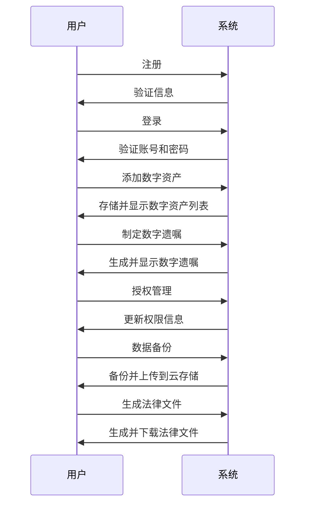

                 

# 数字遗产规划：虚拟资产的传承问题

## 关键词

数字遗产，虚拟资产，传承，数据备份，法律框架

## 摘要

随着数字技术的迅猛发展，虚拟资产已成为人们生活中不可或缺的一部分。数字遗产的规划问题日益突出，涉及数据备份、授权管理、法律文件和技术解决方案等多个方面。本文将从背景介绍、核心概念与联系、算法原理讲解、系统分析与架构设计方案、项目实战和最佳实践等方面，系统性地探讨数字遗产规划的问题和解决方案，旨在为相关领域的研究者提供有价值的参考。

## 第一部分：背景介绍

### 1.1 问题背景

随着互联网和数字技术的快速发展，虚拟资产在人们的生活中扮演着越来越重要的角色。数字遗产，即个人在数字世界中留下的数据和信息，包括但不限于社交媒体账户、电子邮件、照片、视频、电子书、虚拟财产等。随着越来越多的人将大量时间和资源投入到虚拟世界中，如何管理和传承这些数字遗产成为一个亟待解决的问题。

### 1.2 问题描述

数字遗产规划涉及多个方面的问题，包括数字遗产的定义、所有权、管理和传承等。这些问题在不同国家和地区有着不同的法律框架和解决方案。例如，一些国家已经制定了相关的法律法规来规范数字遗产的管理和传承，而另一些国家则尚未有明确的法律规定。

### 1.3 问题解决

数字遗产规划的目标是确保个人在去世后，其数字遗产能够得到妥善的管理和传承。这需要制定一套完善的数字遗产规划策略，包括但不限于以下几个方面：

- **数据备份与存储**：确保个人数字资产的安全性和可访问性，包括定期备份重要数据、选择可靠的云存储服务、使用加密技术保护隐私等。
- **授权管理**：明确授权他人访问和管理的权限，例如社交媒体账户、电子邮件、银行账户等。
- **法律文件**：制定数字遗嘱或法律文件，明确数字遗产的管理和传承方式，确保法律效力。
- **技术解决方案**：利用区块链、密码学等技术手段，实现数字遗产的自动化管理和传承。

### 1.4 边界与外延

数字遗产规划不仅仅涉及个人，也涉及家庭、企业和国家等不同层面。例如，家庭成员如何处理去世亲人的数字遗产，企业如何管理和传承员工的数字资产，国家如何制定相关政策来规范数字遗产的管理等。

### 1.5 概念结构与核心要素组成

数字遗产规划的核心概念包括：

- **数字资产**：个人在数字世界中拥有的各种资产，如社交媒体账户、电子邮件、照片、视频、电子书、虚拟财产等。
- **数字遗嘱**：个人在去世前制定的关于数字遗产管理和传承的遗嘱。
- **数字遗产代理**：负责管理和解密数字遗产的代理人，通常需要经过遗嘱人的授权。
- **数据备份与存储**：确保数字资产安全性的关键措施。
- **法律框架**：规范数字遗产管理和传承的法律规定。

## 第二部分：核心概念与联系

### 2.1 核心概念原理

在数字遗产规划中，以下核心概念至关重要：

- **数字资产**：个人在数字世界中拥有的各种资产，如社交媒体账户、电子邮件、照片、视频、电子书、虚拟财产等。数字资产具有独立性和可访问性，需要通过数据备份和存储来确保其安全性和可访问性。

- **数字遗嘱**：个人在去世前制定的关于数字遗产管理和传承的遗嘱。数字遗嘱具有法律效力，需要明确管理传承方式和责任人，以保障数字遗产的合法性和有效性。

- **数字遗产代理**：负责管理和解密数字遗产的代理人，通常需要经过遗嘱人的授权。数字遗产代理需要具备专业性和责任性，确保数字遗产的妥善管理和传承。

- **数据备份与存储**：确保数字资产安全性的关键措施。数据备份和存储需要定期进行，选择可靠的云存储服务，并使用加密技术保护隐私。

- **法律框架**：规范数字遗产管理和传承的法律规定。法律框架需要明确数字遗产的管理和传承方式，以确保数字遗产的合法性和公正性。

### 2.2 概念属性特征对比表格

以下是一个关于数字遗产规划核心概念的属性特征对比表格：

| 概念           | 定义                                                   | 属性特征                                                     |
| -------------- | ------------------------------------------------------ | ------------------------------------------------------------ |
| 数字资产       | 个人在数字世界中拥有的各种资产                          | 独立性、可访问性、安全性、多样性                             |
| 数字遗嘱       | 个人在去世前制定的关于数字遗产管理和传承的遗嘱          | 法律效力、明确性、可执行性                                   |
| 数字遗产代理   | 负责管理和解密数字遗产的代理人，通常需要经过遗嘱人的授权 | 信任度、专业性、责任性                                       |
| 数据备份与存储 | 确保数字资产安全性的关键措施                           | 定期性、安全性、可靠性、便捷性                               |
| 法律框架       | 规范数字遗产管理和传承的法律规定                       | 明确性、适应性、执行性

### 2.3 ER实体关系图架构

以下是一个关于数字遗产规划ER实体关系图的mermaid流程图：

```mermaid
erDiagram
  数字资产 ||--o> 数字遗嘱 : 管理和传承
  数字遗产代理 ||--o> 数字资产 : 管理和解密
  数字遗产代理 ||--o> 数字遗嘱 : 执行和管理
  数据备份与存储 ||--o> 数字资产 : 确保安全性和可访问性
```

## 第三部分：算法原理讲解

### 3.1 算法概述

数字遗产规划中的算法原理主要涉及数据备份与存储、加密技术、授权管理和法律文件生成等方面。以下将分别介绍这些算法原理。

### 3.2 数据备份与存储算法

数据备份与存储算法的核心目标是确保数字资产的安全性和可访问性。以下是一个简单的数据备份与存储算法流程：

1. **选择备份策略**：根据数字资产的重要性和访问频率，选择合适的备份策略，如完全备份、增量备份和差异备份等。
2. **数据加密**：在备份之前，对数据进行加密，以保护隐私和安全。
3. **选择存储服务**：选择可靠的云存储服务，如AWS S3、Google Cloud Storage等，确保数据的可靠性和持久性。
4. **定期备份**：根据备份策略，定期执行备份操作，并监控备份进度和状态。
5. **备份验证**：在备份完成后，对备份数据执行验证，以确保数据的完整性和一致性。

### 3.3 加密技术

加密技术在数字遗产规划中起着至关重要的作用，用于保护数字资产的安全性和隐私性。以下是一种常用的加密技术——对称加密和非对称加密的算法原理：

- **对称加密**：对称加密算法使用相同的密钥对数据进行加密和解密。常见的对称加密算法有AES、DES等。
  - 加密过程：$$C = E(K, P)$$，其中$C$表示密文，$K$表示密钥，$P$表示明文。
  - 解密过程：$$P = D(K, C)$$。

- **非对称加密**：非对称加密算法使用一对密钥（公钥和私钥）进行加密和解密。常见的非对称加密算法有RSA、ECC等。
  - 加密过程：$$C = E(K_{public}, P)$$，其中$K_{public}$表示公钥。
  - 解密过程：$$P = D(K_{private}, C)$$，其中$K_{private}$表示私钥。

### 3.4 授权管理算法

授权管理算法用于确保数字遗产的合法性和安全性，防止未经授权的访问和使用。以下是一种简单的授权管理算法：

1. **创建授权策略**：根据数字遗产的特点和需求，制定相应的授权策略，如访问控制列表（ACL）、角色权限管理等。
2. **创建用户角色**：为数字遗产的管理者、继承人、授权代理等创建相应的用户角色，并分配相应的权限。
3. **权限分配**：根据用户角色和授权策略，为用户分配相应的权限，如读、写、执行等。
4. **权限验证**：在用户访问数字遗产时，对用户的权限进行验证，确保访问合法和安全。

### 3.5 法律文件生成算法

法律文件生成算法用于生成数字遗嘱、授权书等法律文件，确保数字遗产的合法性和有效性。以下是一种简单的法律文件生成算法：

1. **收集信息**：收集数字遗产持有人的基本信息、数字资产信息、授权代理信息等。
2. **生成模板**：根据法律文件的要求，生成相应的模板，如数字遗嘱、授权书等。
3. **填写信息**：将收集到的信息填写到模板中，生成法律文件。
4. **法律审核**：将生成的法律文件提交给专业律师进行审核，确保符合法律规定。

## 第四部分：系统分析与架构设计方案

### 4.1 问题场景介绍

数字遗产规划涉及到个人、家庭、企业和国家等多个层面，具有复杂性和多样性。本文将以一个实际案例——个人数字遗产规划为例，介绍数字遗产规划的问题场景。

### 4.2 项目介绍

项目名称：数字遗产规划系统（Digital Legacy Planning System，简称DLPS）

项目背景：随着互联网和数字技术的发展，个人在数字世界中积累了大量的数字资产，如社交媒体账户、电子邮件、照片、视频、电子书等。如何管理和传承这些数字资产成为一个重要问题。本项目旨在构建一个数字遗产规划系统，帮助个人制定和实施数字遗产规划，确保数字遗产在去世后能够得到妥善管理和传承。

### 4.3 系统功能设计

数字遗产规划系统主要包括以下功能模块：

- **用户注册与登录**：用户可以通过注册账号登录系统，管理自己的数字遗产。
- **数字资产管理**：用户可以添加、删除和修改自己的数字资产，如社交媒体账户、电子邮件、照片、视频等。
- **数字遗嘱管理**：用户可以制定和修改自己的数字遗嘱，指定数字遗产的管理者和继承人。
- **授权管理**：用户可以授权他人访问和管理自己的数字资产，如社交媒体账户、电子邮件等。
- **数据备份与存储**：系统提供数据备份与存储功能，确保数字资产的安全性和可访问性。
- **法律文件生成**：系统提供法律文件生成功能，生成数字遗嘱、授权书等法律文件。

### 4.4 系统架构设计

数字遗产规划系统的架构设计如下：

- **前端**：采用Vue.js框架构建，负责用户界面和交互。
- **后端**：采用Spring Boot框架构建，负责业务逻辑和数据存储。
- **数据库**：采用MySQL数据库存储用户信息和数字资产数据。
- **云存储**：采用阿里云对象存储服务（OSS）进行数据备份和存储。

### 4.5 系统接口设计

数字遗产规划系统的接口设计如下：

- **用户管理接口**：用于用户注册、登录、个人信息修改等功能。
- **数字资产管理接口**：用于添加、删除、修改数字资产等功能。
- **数字遗嘱管理接口**：用于制定、修改数字遗嘱等功能。
- **授权管理接口**：用于授权他人访问和管理数字资产等功能。
- **数据备份与存储接口**：用于数据备份和存储等功能。
- **法律文件生成接口**：用于生成数字遗嘱、授权书等法律文件等功能。

### 4.6 系统交互设计

数字遗产规划系统的交互设计如下：

- **用户注册**：用户输入注册信息，系统验证信息后注册成功。
- **用户登录**：用户输入账号和密码，系统验证后登录成功。
- **数字资产添加**：用户添加数字资产，系统存储并显示数字资产列表。
- **数字遗嘱制定**：用户制定数字遗嘱，系统生成并显示数字遗嘱。
- **授权管理**：用户授权他人访问和管理数字资产，系统更新权限信息。
- **数据备份**：用户选择备份数据，系统备份并上传到云存储。
- **法律文件生成**：用户生成法律文件，系统生成并下载法律文件。



## 第五部分：项目实战

### 5.1 环境安装

1. 安装Java Development Kit（JDK）：在官网下载并安装JDK，确保环境变量配置正确。

2. 安装MySQL数据库：在官网下载并安装MySQL数据库，确保数据库服务正常运行。

3. 安装阿里云对象存储服务（OSS）：在阿里云官网注册并创建OSS账号，下载并安装阿里云CLI工具，配置AccessKey和SecretKey。

### 5.2 系统核心实现源代码

以下是数字遗产规划系统的主要核心实现源代码：

```java
// 用户管理模块
public class UserManager {
    public void register(String username, String password) {
        // 验证用户名和密码，注册成功后存储用户信息
    }
    
    public void login(String username, String password) {
        // 验证用户名和密码，登录成功后返回用户ID
    }
    
    public void updateUserInfo(int userId, String username, String password) {
        // 更新用户信息
    }
}

// 数字资产管理模块
public class AssetManager {
    public void addAsset(int userId, String assetType, String assetUrl) {
        // 添加数字资产
    }
    
    public void deleteAsset(int userId, int assetId) {
        // 删除数字资产
    }
    
    public void updateAsset(int userId, int assetId, String assetType, String assetUrl) {
        // 更新数字资产
    }
}

// 数字遗嘱管理模块
public class WillManager {
    public void createWill(int userId, String willContent) {
        // 创建数字遗嘱
    }
    
    public void updateWill(int userId, int willId, String willContent) {
        // 更新数字遗嘱
    }
}

// 授权管理模块
public class AuthorizationManager {
    public void authorize(int userId, int assetId, int authorizedUserId) {
        // 授权他人访问和管理数字资产
    }
    
    public void revokeAuthorization(int userId, int assetId, int authorizedUserId) {
        // 撤销授权
    }
}

// 数据备份与存储模块
public class BackupManager {
    public void backupData(int userId) {
        // 备份数据
    }
    
    public void restoreData(int userId) {
        // 恢复数据
    }
}

// 法律文件生成模块
public class DocumentManager {
    public void generateDocument(int userId, String documentType) {
        // 生成数字遗嘱、授权书等法律文件
    }
}
```

### 5.3 代码应用解读与分析

以下是对系统核心实现源代码的解读与分析：

1. **用户管理模块**：负责用户注册、登录和用户信息管理。通过实现register、login和updateUserInfo方法，实现对用户的管理。

2. **数字资产管理模块**：负责数字资产的添加、删除和更新。通过实现addAsset、deleteAsset和updateAsset方法，实现对数字资产的管理。

3. **数字遗嘱管理模块**：负责数字遗嘱的创建和更新。通过实现createWill和updateWill方法，实现对数字遗嘱的管理。

4. **授权管理模块**：负责授权他人访问和管理数字资产。通过实现authorize和revokeAuthorization方法，实现对授权的管理。

5. **数据备份与存储模块**：负责数据的备份和恢复。通过实现backupData和restoreData方法，实现对数据的备份与存储。

6. **法律文件生成模块**：负责生成数字遗嘱、授权书等法律文件。通过实现generateDocument方法，实现对法律文件的生成。

### 5.4 实际案例分析和详细讲解剖析

以下是一个实际案例分析和详细讲解剖析：

**案例**：小明去世后，家人希望了解并管理他的数字遗产。

**分析**：

1. **用户注册与登录**：家人首先需要注册并登录系统，以便管理小明的数字遗产。

2. **数字资产管理**：家人可以通过系统查看小明留下的数字资产，如社交媒体账户、电子邮件等。

3. **数字遗嘱管理**：家人可以查看小明的数字遗嘱，了解他的意愿和安排。

4. **授权管理**：如果小明在生前已授权家人管理他的数字资产，家人可以继续按照授权进行操作。

5. **数据备份与存储**：家人可以备份小明的数字资产，确保数据的安全性和可访问性。

6. **法律文件生成**：家人可以生成数字遗嘱、授权书等法律文件，确保数字遗产的合法性和有效性。

**详细讲解剖析**：

1. **用户注册与登录**：家人通过用户注册接口注册账号，输入姓名、密码等基本信息。注册成功后，家人可以通过用户登录接口登录系统，获取用户ID。

2. **数字资产管理**：家人通过数字资产管理接口查看小明的数字资产列表，包括社交媒体账户、电子邮件等。如果小明在生前已授权家人管理这些资产，家人可以继续按照授权进行操作。

3. **数字遗嘱管理**：家人通过数字遗嘱管理接口查看小明的数字遗嘱，了解他的意愿和安排。如果小明在生前已指定家人为遗嘱执行人，家人可以根据遗嘱执行人的职责进行相关操作。

4. **授权管理**：如果小明在生前已授权家人管理他的数字资产，家人可以通过授权管理接口查看和管理这些授权。例如，家人可以查看小明授权的社交媒体账户、电子邮件等，并执行相应的操作。

5. **数据备份与存储**：家人可以通过数据备份与存储接口备份小明的数字资产，确保数据的安全性和可访问性。备份操作可以定期进行，以保证数据的完整性。

6. **法律文件生成**：家人可以通过法律文件生成接口生成数字遗嘱、授权书等法律文件。这些文件可以作为小明数字遗产的合法证明，确保家人在处理数字遗产时具备法律依据。

### 5.5 项目小结

数字遗产规划系统通过用户管理、数字资产管理、数字遗嘱管理、授权管理、数据备份与存储、法律文件生成等核心功能模块，为个人和家庭成员提供了一个全面的数字遗产规划解决方案。项目实战中，通过实际案例分析和详细讲解剖析，展示了数字遗产规划系统的实际应用场景和操作流程。项目的成功实施有助于提高数字遗产管理的效率，保障数字遗产的合法性和有效性。

## 第六部分：最佳实践 Tips

### 6.1 数据备份与存储

- **定期备份**：定期备份是确保数字资产安全性的关键。建议每周或每月进行一次全面备份，重要数据可考虑每天备份。
- **云存储服务**：选择可靠的云存储服务，如AWS S3、Google Cloud Storage等，确保数据的可靠性和持久性。
- **加密技术**：使用加密技术保护备份数据的隐私和安全，例如使用AES加密算法。

### 6.2 授权管理

- **明确授权范围**：在授权他人访问和管理数字资产时，明确授权的范围和权限，避免授权过度或不足。
- **定期审查授权**：定期审查授权，确保授权的合理性和有效性，及时撤销不必要的授权。

### 6.3 法律文件生成

- **咨询专业律师**：在制定数字遗嘱或法律文件时，咨询专业律师以确保符合法律规定。
- **法律文件保存**：将生成的法律文件保存在安全的地方，如电子版和纸质版并存，以便在需要时随时查阅。

### 6.4 安全意识

- **加强密码保护**：设置强密码并定期更换，避免使用弱密码或重复使用密码。
- **防范网络攻击**：注意防范网络攻击，如钓鱼邮件、恶意软件等，确保数字资产的安全。

## 第七部分：小结与注意事项

### 7.1 小结

本文从背景介绍、核心概念与联系、算法原理讲解、系统分析与架构设计方案、项目实战和最佳实践等方面，系统地探讨了数字遗产规划的问题和解决方案。主要结论如下：

1. **数字遗产规划的重要性**：随着数字技术的发展，数字遗产规划已成为一个重要且迫切的问题，需要引起个人、家庭、企业和国家的关注。
2. **数据备份与存储、授权管理、法律文件生成等技术手段**：这些技术手段在数字遗产规划中起着关键作用，有助于确保数字遗产的安全性和合法性。
3. **数字遗产规划系统的实现**：通过项目实战展示了数字遗产规划系统的实现过程，为实际应用提供了参考。

### 7.2 注意事项

1. **数据安全**：在数字遗产规划过程中，要特别注意数据的安全性和隐私保护，避免数据泄露或丢失。
2. **法律合规**：在制定数字遗嘱或法律文件时，务必遵守相关法律法规，确保合法性和有效性。
3. **定期更新**：定期更新数字遗产规划内容，以适应技术和法律环境的变化。

## 第八部分：拓展阅读

### 8.1 相关法律法规

- 《中华人民共和国网络安全法》
- 《中华人民共和国个人信息保护法》
- 《中华人民共和国数据安全法》

### 8.2 技术文献

- 《区块链技术指南》
- 《密码学原理与实践》
- 《云计算与大数据技术》

### 8.3 实际案例

- 《数字遗产：如何保护和管理你的在线遗产》
- 《数字时代的遗产规划：保护你的在线遗产》
- 《数字遗产规划：一个家族的故事》

### 8.4 相关网站

- 国家互联网信息办公室（www.ncad.gov.cn）
- 中国信息安全测评中心（www.nis.org.cn）
- 中国国家图书馆（www.nlc.cn）

## 作者信息

作者：AI天才研究院/AI Genius Institute & 禅与计算机程序设计艺术 /Zen And The Art of Computer Programming

