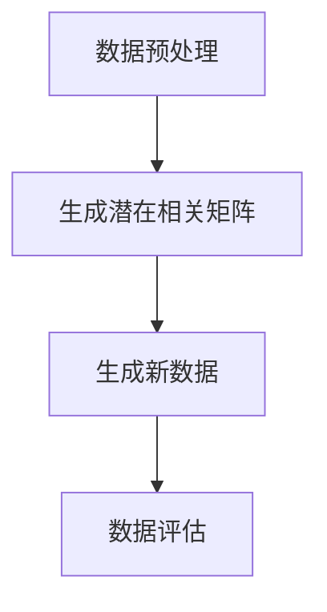

                 

# 数学推理任务中PRM数据合成的推荐方法

## 关键词
数学推理、PRM数据合成、推荐系统、算法原理、系统架构、项目实战

## 摘要
本文探讨了数学推理任务中PRM数据合成的推荐方法。首先，介绍了数学推理任务和PRM数据合成的背景和核心概念。接着，详细阐述了算法原理，包括数学模型和公式，并通过Python代码和流程图进行说明。然后，分析了系统架构，并介绍了项目实战中的环境安装、核心实现、案例分析及项目小结。最后，总结了最佳实践和未来展望。

## 背景介绍

### 1.1 问题背景

在数学推理任务中，常常需要大量的数据来进行训练和验证。然而，这些数据的获取和处理往往是一个挑战。特别是当任务涉及到复杂的数学模型时，数据的质量和数量直接影响推理的准确性和效率。PRM（Potential Relevant Matrix）数据合成方法提供了一种有效的方式，通过生成潜在相关的数据来丰富训练集，从而提高数学推理任务的性能。

### 1.1.1 数学推理任务的现状与挑战

数学推理任务在人工智能、机器学习和数据分析等领域有广泛的应用。然而，现有的数学推理方法往往面临着数据稀缺、数据噪声和模型复杂度高等挑战。例如，在自然语言处理（NLP）领域，数学推理常用于句子理解和文本生成，但大量的训练数据通常难以获取。此外，数据质量差和噪声也会影响推理的准确性。

### 1.1.2 PRM数据合成的重要性

PRM数据合成方法通过生成潜在相关的数据，可以有效地缓解数据稀缺和噪声问题。它不仅可以增加训练数据的多样性，还可以帮助模型更好地理解和处理复杂问题。在数学推理任务中，PRM数据合成方法的应用可以显著提高推理的准确性和效率。

### 1.2 核心概念与联系

#### 1.2.1 数学推理任务的核心概念

数学推理任务涉及多个核心概念，包括数学模型、推理算法和数据集。数学模型描述了问题的数学结构，推理算法是解决问题的方法，而数据集则是训练和验证算法的基础。

#### 1.2.2 PRM数据合成的概念与特性

PRM数据合成是一种数据生成方法，它通过生成潜在相关的数据来丰富训练集。PRM数据合成具有以下特性：

1. **自适应性**：可以根据任务的需求和数据的特性自动调整数据生成的策略。
2. **可扩展性**：可以生成大量的数据，从而满足大规模训练的需求。
3. **灵活性**：可以处理不同类型的数学推理任务，包括数值计算和符号计算。

#### 1.2.3 数学推理任务与PRM数据合成的关系

数学推理任务和PRM数据合成之间有着紧密的联系。PRM数据合成方法可以用于增强数学推理任务的训练数据，从而提高推理的准确性和效率。具体来说，PRM数据合成方法可以：

1. **增加训练数据的多样性**：通过生成不同类型的数据，使得模型可以学习到更广泛的知识。
2. **提高模型的泛化能力**：通过处理更多样化的数据，模型可以更好地适应新的问题。
3. **增强模型的鲁棒性**：通过引入噪声和异常数据，可以增强模型对噪声和异常的容忍能力。

### 1.3 研究方法综述

在数学推理任务中，已有多种方法用于数据合成，如生成对抗网络（GANs）、变分自编码器（VAEs）和强化学习等。这些方法在特定场景下表现出色，但在处理复杂数学推理任务时可能存在局限性。PRM数据合成方法结合了这些方法的优点，通过潜在相关矩阵生成高质量的数据，为数学推理任务提供了有力的支持。

### 1.4 数据来源与预处理

数据来源是数学推理任务的关键。在PRM数据合成方法中，数据来源可以是现有的数据集、模拟生成或通过其他方法获取的数据。数据预处理是确保数据质量和模型性能的重要步骤，包括数据清洗、归一化和特征提取等。

## 核心概念与联系

### 2.1 数学推理任务的核心概念

#### 2.1.1 数学推理的定义与类型

数学推理是指使用数学方法来解决问题和得出结论的过程。它包括两种基本类型：

1. **演绎推理**：从一般到具体的推理过程，通过前提条件得出结论。
2. **归纳推理**：从具体到一般的推理过程，通过观察具体实例来得出一般性结论。

#### 2.1.2 数学推理的相关属性

数学推理具有以下几个相关属性：

1. **确定性**：数学推理基于严格的逻辑规则，结果具有确定性。
2. **可验证性**：可以通过数学证明来验证推理的正确性。
3. **普遍性**：数学推理适用于各种数学领域和实际问题。

### 2.2 PRM数据合成的概念与特性

#### 2.2.1 PRM数据的定义与生成

PRM（Potential Relevant Matrix）数据是一种潜在相关的数据矩阵，用于表示数据之间的潜在关系。PRM数据的生成方法包括：

1. **基于规则的生成**：通过定义规则来生成数据，如线性回归模型。
2. **基于模型的生成**：通过训练模型来生成数据，如生成对抗网络（GANs）。

#### 2.2.2 PRM数据合成的方法与评估

PRM数据合成的评估方法包括：

1. **准确性**：评估生成的数据与真实数据的相似程度。
2. **多样性**：评估生成的数据的多样性。
3. **鲁棒性**：评估生成的数据对噪声和异常的容忍能力。

### 2.3 数学推理任务与PRM数据合成的关系

数学推理任务与PRM数据合成之间存在着密切的关系。PRM数据合成方法可以用于增强数学推理任务的训练数据，从而提高推理的准确性和效率。具体来说，PRM数据合成方法可以：

1. **增加训练数据的多样性**：通过生成不同类型的数据，使得模型可以学习到更广泛的知识。
2. **提高模型的泛化能力**：通过处理更多样化的数据，模型可以更好地适应新的问题。
3. **增强模型的鲁棒性**：通过引入噪声和异常数据，可以增强模型对噪声和异常的容忍能力。

### 2.4 核心概念对比分析

#### 2.4.1 数学推理任务与PRM数据合成的差异

数学推理任务和PRM数据合成方法在目标、方法和应用上存在差异：

1. **目标**：数学推理任务的目标是解决数学问题，而PRM数据合成方法的目标是生成高质量的数据。
2. **方法**：数学推理任务使用数学方法来解决问题，而PRM数据合成方法使用数据生成方法。
3. **应用**：数学推理任务广泛应用于各个领域，而PRM数据合成方法主要用于增强数学推理任务的训练数据。

#### 2.4.2 两者在数学推理任务中的互补性

尽管数学推理任务和PRM数据合成方法存在差异，但在数学推理任务中，它们可以相互补充：

1. **数据增强**：PRM数据合成方法可以生成高质量的训练数据，增强数学推理任务的训练集，提高模型的泛化能力。
2. **问题解决**：数学推理任务可以解决实际问题，而PRM数据合成方法可以生成适合数学推理任务的数据，为问题解决提供支持。

## 算法原理讲解

### 3.1 算法原理概述

PRM数据合成方法的核心思想是生成与真实数据潜在相关的数据，从而增强数学推理任务的训练集。算法的基本流程如下：

1. **数据预处理**：对原始数据进行预处理，包括数据清洗、归一化和特征提取等。
2. **潜在相关矩阵生成**：通过训练模型或定义规则生成潜在相关矩阵。
3. **数据合成**：利用潜在相关矩阵生成新的数据。
4. **数据评估**：评估生成的数据质量，包括准确性、多样性和鲁棒性。

### 3.2 数学模型与公式解析

PRM数据合成方法中的数学模型主要包括潜在相关矩阵和生成模型。以下是一个简化的数学模型描述：

#### 3.2.1 潜在相关矩阵

潜在相关矩阵 \( R \) 表示数据点之间的潜在关系，可以通过以下公式计算：

\[ R_{ij} = \exp\left(-\frac{||x_i - x_j||^2}{2\sigma^2}\right) \]

其中，\( x_i \) 和 \( x_j \) 是数据点的特征向量，\( \sigma \) 是方差参数。

#### 3.2.2 生成模型

生成模型用于生成新的数据点，常见的生成模型包括生成对抗网络（GANs）和变分自编码器（VAEs）。以下是一个简化的GANs模型：

\[ G(z) \sim p_G(z) \]
\[ D(x) \sim p_D(x) \]
\[ x \sim p_D(x) \]

其中，\( G(z) \) 是生成器，\( D(x) \) 是判别器，\( z \) 是噪声向量。

### 3.3 算法流程图与代码实现

以下是一个简化的算法流程图和Python代码实现：



```python
import numpy as np
import tensorflow as tf

# 数据预处理
def preprocess_data(data):
    # 数据清洗、归一化等操作
    return normalized_data

# 生成潜在相关矩阵
def generate_potential_matrix(data, sigma):
    # 计算潜在相关矩阵
    return potential_matrix

# 生成新数据
def generate_new_data(potential_matrix, noise):
    # 利用潜在相关矩阵生成新数据
    return new_data

# 数据评估
def evaluate_data(data):
    # 评估数据质量
    return quality_score
```

### 3.4 举例说明与算法验证

假设我们有一个包含100个数据点的数据集，以下是一个简单的示例：

```python
# 示例数据
data = np.random.rand(100, 10)  # 100个数据点，每个数据点10维

# 数据预处理
normalized_data = preprocess_data(data)

# 生成潜在相关矩阵
sigma = 1.0
potential_matrix = generate_potential_matrix(normalized_data, sigma)

# 生成新数据
noise = np.random.rand(100, 10)
new_data = generate_new_data(potential_matrix, noise)

# 数据评估
quality_score = evaluate_data(new_data)
print("Quality Score:", quality_score)
```

通过这个简单的示例，我们可以看到PRM数据合成方法的基本流程和实现方式。在实际应用中，需要根据具体任务和数据集进行调整和优化。

## 系统分析与架构设计方案

### 4.1 问题场景介绍

在数学推理任务中，特别是对于一些复杂的数学问题，如微分方程求解、线性规划、多变量优化等，需要大量的训练数据来进行模型的训练和验证。然而，这些数据的获取和处理往往非常困难。PRM数据合成方法提供了一个有效的解决方案，通过生成高质量的训练数据，可以提高数学推理任务的性能和效率。

### 4.2 系统功能设计

PRM数据合成系统的主要功能包括数据预处理、潜在相关矩阵生成、数据合成和数据评估。以下是具体的领域模型设计：

```mermaid
classDiagram
    Class01 <|-- Class02
    Class03 --|> Class04
    Class04 : +setAttr(attr)
    Class02 : + Barbarararararararararararararararararararararararararararararararararararararararararararararararararararararararararararararararararararararararararararararararararararararararararararararararararararararararararararararararararararararararararararararararararararararararararararararararararararararararararararararararararararararararararararararararararararararararararararararararararararararararararararararararararararararararararararararararararararararararararararararararararararararararararararararararararararararararararararararararararararararararararararararararararararararararararararararararararararararararararararararararararararararararararararararararararararararararararararararararararararararararararararararararararararararararararararararararararararararararararararararararararararararararararararararararararararararararararararararararararararararararararararararararararararararararararararararararararararararararararararararararararararararararararararararararararararararararararararararararararararararararararararararararararararararararararararararararararararararararararararararararararararararararararararararararararararararararararararararararararararararararararararararararararararararararararararararararararararararararararararararararararararararararararararararararararararararararararararararararararararararararararararararararararararararararararararararararararararararararararararararararararararararararararararararararararararararararararararararararararararararararararararararararararararararararararararararararararararararararararararararararararararararararararararararararararararararararararararararararararararararararararararararararararararararararararararararararararararararararararararararararararararararararararararararararararararararararararararararararararararararararararararararararararararararararararararararararararararararararararararararararararararararararararararararararararararararararararararararararararararararararararararararararararararararararararararararararararararararararararararararararararararararararararararararararararararararararararararararararararararararararararararararararararararararararararararararararararararararararararararararararararararararararararararararararararararararararararararararararararararararararararararararararararararararararararararararararararararararararararararararararararararararararararararararararararararararararararararararararararararararararararararararararararararararararararararararararararararararararararararararararararararararararararararararararararararararararararararararararararararararararararararararararararararararararararararararararararararararararararararararararararararararararararararararararararararararararararararararararararararararararararararararararararararararararararararararararararararararararararararararararararararararararararararararararararararararararararararararararararararararararararararararararararararararararararararararararararararararararararararararararararararararararararararararararararararararararararararararararararararararararararararararararararararararararararararararararararararararararararararararararararararararararararararararararararararararararararararararararararararararararararararararararararararararararararararararararararararararararararararararararararararararararararararararararararararararararararararararararararararararararararararararararararararararararararararararararararararararararararararararararararararararararararararararararararararararararararararararararararararararararararararararararararararararararararararararararararararararararararararararararararararararararararararararararararararararararararararararararararararararararararararararararararararararararararararararararararararararararararararararararararararararararararararararararararararararararararararararararararararararararararararararararararararararararararararararararararararararararararararararararararararararararararararararararararararararararararararararararararararararararararararararararararararararararararararararararararararararararararararararararararararararararararararararararararararararararararararararararararararararararararararararararararararararararararararararararararararararararararararararararararararararararararararararararararararararararararararararararararararararararararararararararararararararararararararararararararararararararararararararararararararararararararararararararararararararararararararararararararararararararararararararararararararararararararararararararararararararararararararararararararararararararararararararararararararararararararararararararararararararararararararararararararararararararararararararararararararararararararararararararararararararararararararararararararararararararararararararararararararararararararararararararararararararararararararararararararararararararararararararararararararararararararararararararararararararararararararararararararararararararararararararararararararararararararararararararararararararararararararararararararararararararararararararararararararararararararararararararararararararararararararararararararararararararararararararararararararararararararararararararararararararararararararararararararararararararararararararararararararararararararararararararararararararararararararararararararararararararararararararararararararararararararararararararararararararararararararararararararararararararararararararararararararararararararararararararararararararararararararararararararararararararararararararararararararararararararararararararararararararararararararararararararararararararararararararararararararararararararararararararararararararararararararararararararararararararararararararararararararararararararararararararararararararararararararararararararararararararararararararararararararararararararararararararararararararararararararararararararararararararararararararararararararararararararararararararararararararararararararararararararararararararararararararararararararararararararararararararararararararararararararararararararararararararararararararararararararararararararararararararararararararararararararararararararararararararararararararararararararararararararararararararararararararararararararararararararararararararararararararararararararararararararararararararararararararararararararararararararararararararararararararararararararararararararararararararararararararararararararararararararararararararararararararararararararararararararararararararararararararararararararararararararararararararararararararararararararararararararararararararararararararararararararararararararararararararararararararararararararararararararararararararararararararararararararararararararararararararararararararararararararararararararararararararararararararararararararararararararararararararararararararararararararararararararararararararararararararararararararararararararararararararararararararararararararararararararararararararararararararararararararararararararararararararararararararararararararararararararararararararararararararararararararararararararararararararararararararararararararararararararararararararararararararararararararararararararararararararararararararararararararararararararararararararararararararararararararararararararararararararararararararararararararararararararararararararararararararararararararararararararararararararararararararararararararararararararararararararararararararararararararararararararararararararararararararararararararararararararararararararararararararararararararararararararararararararararararararararararararararararararararararararararararararararararararararararararararararararararararararararararararararararararararararararararararararararararararararararararararararararararararararararararararararararararararararararararararararararararararararararararararararararararararararararararararararararararararararararararararararararararararararararararararararararararararararararararararararararararararararararararararararararararararararararararararararararararararararararararararararararararararararararararararararararararararararararararararararararararararararararararararararararararararararararararararararararararararararararararararararararararararararararararararararararararararararararararararararararararararararararararararararararararararararararararararararararararararararararararararararararararararararararararararararararararararararararararararararararararararararararararararararararararararararararararararararararararararararararararararararararararararararararararararararararararararararararararararararararararararararararararararararararararararararararararararararararararararararararararararararararararararararararararararararararararararararararararararararararararararararararararararararararararararararararararararararararararararararararararararararararararararararararararararararararararararararararararararararararararararararararararararararararararararararararararararararararararararararararararararararararararararararararararararararararararararararararararararararararararararararararararararararararararararararararararararararararararararararararararararararararararararararararararararararararararararararararararararararararararararararararararararararararararararararararararararararararararararararararararararararararararararararararararararararararararararararararararararararararararararararararararararararararararararararararararararararararararararararararararararararararararararararararararararararararararararararararararararararararararararararararararararararararararararararararararararararararararararararararararararararararararararararararararararararararararararararararararararararararararararararararararararararararararararararararararararararararararararararararararararararararararararararararararararararararararararararararararararararararararararararararararararararararararararararararararararararararararararararararararararararararararararararararararararararararararararararararararararararararararararararararararararararararararararararararararararararararararararararararararararararararararararararararararararararararararararararararararararararararararararararararararararararararararararararararararararararararararararararararararararararararararararararararararararararararararararararararararararararararararararararararararararararararararararararararararararararararararararararararararararararararararararararararararararararararararararararararararararararararararararararararararararararararararararararararararararararararararararararararararararararararararararararararararararararararararararararararararararararararararararararararararararararararararararararararararararararararararararararararararararararararararararararararararararararararararararararararararararararararararararararararararararararararararararararararararararararararararararararararararararararararararararararararararararararararararararararararararararararararararararararararararararararararararararararararararararararararararararararararararararararararararararararararararararararararararararararararararararararararararararararararararararararararararararararararararararararararararararararararararararararararararararararararararararararararararararararararararararararararararararararararararararararararararararararararararararararararararararararararararararararararararararararararararararararararararararararararararararararararararararararararararararararararararararararararararararararararararararararararararararararararararararararararararararararararararararararararararararararararararararararararararararararararararararararararararararararararararararararararararararararararararararararararararararararararararararararararararararararararararararararararararararararararararararararararararararararararararararararararararararararararararararararararararararararararararararararararararararararararararararararararararararararararararararararararararararararararararararararararararararararararararararararararararararararararararararararararararararararararararararararararararararararararararararararararararararararararararararararararararararararararararararararararararararararararararararararararararararararararararararararararararararararararararararararararararararararararararararararararararararararararararararararararararararararararararararararararararararararararararararararararararararararararararararararararararararararararararararararararararararararararararararararararararararararararararararararararararararararararararararararararararararararararararararararararararararararararararararararararararararararararararararararararararararararararararararararararararararararararararararararararararararararararararararararararararararararararararararararararararararararararararararararararararararararararararararararararararararararararararararararararararararararararararararararararararararararararararararararararararararararararararararararararararararararararararararararararararararararararararararararararararararararararararararararararararararararararararararararararararararararararararararararararararararararararararararararararararararararararararararararararararararararararararararararararararararararararararararararararararararararararararararararararararararararararararararararararararararararararararararararararararararararararararararararararararararararararararararararararararararararararararararararararararararararararararararararararararararararararararararararararararararararararararararararararararararararararararararararararararararararararararararararararararararararararararararararararararararararararararararararararararararararararararararararararararararararararararararararararararararararararararararararararararararararararararararararararararararararararararararararararararararararararararararararararararararararararararararararararararararararararararararararararararararararararararararararararararararararararararararararararararararararararararararararararararararararararararararararararararararararararararararararararararararararararararararararararararararararararararararararararararararararararararararararararararararararararararararararararararararararararararararararararararararararararararararararararararararararararararararararararararararararararararararararararararararararararararararararararararararararararararararararararararararararararararararararararararararararararararararararararararararararararararararararararararararararararararararararararararararararararararararararararararararararararararararararararararararararararararararararararararararararararararararararararararararararararararararararararararararararararararararararararararararararararararararararararararararararararararararararararararararararararararararararararararararararararararararararararararararararararararararararararararararararararararararararararararararararararararararararararararararararararararararararararararararararararararararararararararararararararararararararararararararararararararararararararararararararararararararararararararararararararararararararararararararararararararararararararararararararararararararararararararararararararararararararararararararararararararararararararararararararararararararararararararararararararararararararararararararararararararararararararararararararararararararararararararararararararararararararararararararararararararararararararararararararararararararararararararararararararararararararararararararararararararararararararararararararararararararararararararararararararararararararararararararararararararararararararararararararararararararararararararararararararararararararararararararararararararararararararararararararararararararararararararararararararararararararararararararararararararararararararararararararararararararararararararararararararararararararararararararararararararararararararararararararararararararararararararararararararararararararararararararararararararararararararararararararararararararararararararararararararararararararararararararararararararararararararararararararararararararararararararararararararararararararararararararararararararararararararararararararararararararararararararararararararararararararararararararararararararararararararararararararararararararararararararararararararararararararararararararararararararararararararararararararararararararararararararararararararararararararararararararararararararararararararararararararararararararararararararararararararararararararararararararararararararararararararararararararararararararararararararararararararararararararararararararararararararararararararararararararararararararararararararararararararararararararararararararararararararararararararararararararararararararararararararararararararararararararararararararararararararararararararararararararararararararararararararararararararararararararararararararararararararararararararararararararararararararararararararararararararararararararararararararararararararararararararararararararararararararararararararararararararararararararararararararararararararararararararararararararararararararararararararararararararararararararararararararararararararararararararararararararararararararararararararararararararararararararararararararararararararararararararararararararararararararararararararararararararararararararararararararararararararararararararararararararararararararararararararararararararararararararararararararararararararararararararararararararararararararararararararararararararararararararararararararararararararararararararararararararararararararararararararararararararararararararararararararararararararararararararararararararararararararararararararararararararararararararararararararararararararararararararararararararararararararararararararararararararararararararararararararararararararararararararararararararararararararararararararararararararararararararararararararararararararararararararararararararararararararararararararararararararararararararararararararararararararararararararararararararararararararararararararararararararararararararararararararararararararararararararararararararararararararararararararararararararararararararararararararararararararararararararararararararararararararararararararararararararararararararararararararararararararararararararararararararararararararararararararararararararararararararararararararararararararararararararararararararararararararararararararararararararararararararararararararararararararararararararararararararararararararararararararararararararararararararararararararararararararararararararararararararararararararararararararararararararararararararararararararararararararararararararararararararararararararararararararararararararararararararararararararararararararararararararararararararararararararararararararararararararararararararararararararararararararararararararararararararararararararararararararararararararararararararararararararararararararararararararararararararararararararararararararararararararararararararararararararararararararararararararararararararararararararararararararararararararararararararararararararararararararararararararararararararararararararararararararararararararararararararararararararararararararararararararararararararararararararararararararararararararararararararararararararararararararararararararararararararararararararararararararararararararararararararararararararararararararararararararararararararararararararararararararararararararararararararararararararararararararararararararararararararararararararararararararararararararararararararararararararararararararararararararararararararararararararararararararararararararararararararararararararararararararararararararararararararararararararararararararararararararararararararararararararararararararararararararararararararararararararararararararararararararararararararararararararararararararararararararararararararararararararararararararararararararararararararararararararararararararararararararararararararararararararararararararararararararararararararararararararararararararararararararararararararararararararararararararararararararararararararararararararararararararararararararararararararararararararararararararararararararararararararararararararararararararararararararararararararararararararararararararararararararararararararararararararararararararararararararararararararararararararararararararararararararararararararararararararararararararararararararararararararararararararararararararararararararararararararararararararararararararararararararararararararararararararararararararararararararararararararararararararararararararararararararararararararararararararararararararararararararararararararararararararararararararararararararararararararararararararararararararararararararararararararararararararararararararararararararararararararararararararararararararararararararararararararararararararararararararararararararararararararararararararararararararararararararararararararararararararararararararararararararararararararararararararararararararararararararararararararararararararararararararararararararararararararararararararararararararararararararararararararararararararararararararararararararararararararararararararararararararararararararararararararararararararararararararararararararararararararararararararararararararararararararararararararararararararararararararararararararararararararararararararararararararararararararararararararararararararararararararararararararararararararararararararararararararararararararararararararararararararararararararararararararararararararararararararararararararararararararararararararararararararararararararararararararararararararararararararararararararararararararararararararararararararararararararararararararararararararararararararararararararararararararararararararararararararararararararararararararararararararararararararararararararararararararararararararararararararararararararararararararararararararararararararararararararararararararararararararararararararararararararararararararararararararararararararararararararararararararararararararararararararararararararararararararararararararararararararararararararararararararararararararararararararararararararararararararararararararararararararararararararararararararararararararararararararararararararararararararararararararararararararararararararararararararararararararararararararararararararararararararararararararararararararararararararararararararararararararararararararararararararararararararararararararararararararararararararararararararararararararararararararararararararararararararararararararararararararararararararararararararararararararararararararararararararararararararararararararararararararararararararararararararararararararararararararararararararararararararararararararararararararararararararararararararararararararararararararararararararararararararararararararararararararararararararararararararararararararararararararararararararararararararararararararararararararararararararararararararararararararararararararararararararararararararararararararararararararararararararararararararararararararararararararararararararararararararararararararararararararararararararararararararararararararararararararararararararararararararararararararararararararararararararararararararararararararararararararararararararararararararararararararararararararararararararararararararararararararararararararararararararararararararararararararararararararararararararararararararararararararararararararararararararararararararararararararararararararararararararararararararararararararararararararararararararararararararararararararararararararararararararararararararararararararararararararararararararararararararararararararararararararararararararararararararararararararararararararararararararararararararararararararararararararararararararararararararararararararararararararararararararararararararararararararararararararararararararararararararararararararararararararararararararararararararararararararararararararararararararararararararararararararararararararararararararararararararararararararararararararararararararararararararararararararararararararararararararararararararararararararararararararararararararararararararararararararararararararararararararararararararararararararararararararararararararararararararararararararararararararararararararararararararararararararararararararararararararararararararararararararararararararararararararararararararararararararararararararararararararararararararararararararararararararararararararararararararararararararararararararararararararararararararararararararararararararararararararararararararararararararararararararararararararararararararararararararararararararararararararararararararararararararararararararararararararararararararararararararararararararararararararararararararararararararararararararararararararararararararararararararararararararararararararararararararararararararararararararararararararararararararararararararararararararararararararararararararararararararararararararararararararararararararararararararararararararararararararararararararararararararararararararararararararararararararararararararararararararararararararararararararararararararararararararararararararararararararararararararararararararararararararararararararararararararararararararararararararararararararararararararararararararararararararararararararararararararararararararararararararararararararararararararararararararararararararararararararararararararararararararararararararararararararararararararararararararararararararararararararararararararararararararararararararararararararararararararararararararararararararararararararararararararararararararararararararararararararararararararararararararararararararararararararararararararararararararararararararararararararararararararararararararararararararararararararararararararararararararararararararararararararararararararararararararararararararararararararararararararararararararararararararararararararararararararararararararararararararararararararararararararararararararararararararararararararararararararararararararararararararararararararararararararararararararararararararararararararararararararararararararararararararararararararararararararararararararararararararararararararararararararararararararararararararararararararararararararararararararararararararararararararararararararararararararararararararararararararararararararararararararararararararararararararararararararararararararararararararararararararararararararararararararararararararararararararararararararararararararararararararararararararararararararararararararararararararararararararararararararararararararararararararararararararararararararararararararararararararararararararararararararararararararararararararararararararararararararararararararararararararararararararararararararararararararararararararararararararararararararararararararararararararararararararararararararararararararararararararararararararararararararararararararararararararararararararararararararararararararararararararararararararararararararararararararararararararararararararararararararararararararararararararararararararararararararararararararararararararararararararararararararararararararararararararararararararararararararararararararararararararararararararararararararararararararararararararararararararararararararararararararararararararararararararararararararararararararararararararararararararararararararararararararararararararararararararararararararararararararararararararararararararararararararararararararararararararararararararararararararararararararararararararararararararararararararararararararararararararararararararararararararararararararararararararararararararararararararararararararararararararararararararararararararararararararararararararararararararararararararararararararararararararararararararararararararararararararararararararararararararararararararararararararararararararararararararararararararararararararararararararararararararararararararararararararararararararararararararararararararararararararararararararararararararararararararararararararararararararararararararararararararararararararararararararararararararararararararararararararararararararararararararararararararararararararararararararararararararararararararararararararararararararararararararararararararararararararararararararararararararararararararararararararararararararararararararararararararararararararararararararararararararararararararararararararararararararararararararararararararararararararararararararararararararararararararararararararararararararararararararararararararararararararararararararararararararararararararararararararararararararararararararararararararararararararararararararararararararararararararararararararararararararararararararararararararararararararararararararararararararararararararararararararararararararararararararararararararararararararararararararararararararararararararararararararararararararararararararararararararararararararararararararararararararararararararararararararararararararararararararararararararararararararararararararararararararararararararararararararararararararararararararararararararararararararararararararararararararararararararararararararararararararararararararararararararararararararararararararararararararararararararararararararararararararararararararararararararararararararararararararararararararararararararararararararararararararararararararararararararararararararararararararararararararararararararararararararararararararararararararararararararararararararararararararararararararararararararararararararararararararararararararararararararararararararararararararararararararararararararararararararararararararararararararararararararararararararararararararararararararararararararararararararararararararararararararararararararararararararararararararararararararararararararararararararararararararararararararararararararararararararararararararararararararararararararararararararararararararararararararararararararararararararararararararararararararararararararararararararararararararararararararararararararararararararararararararararararararararararararararararararararararararararararararararararararararararararararararararararararararararararararararararararararararararararararararararararararararararararararararararararararararararararararararararararararararararararararararararararararararararararararararararararararararararararararararararararararararararararararararararararararararararararararararararararararararararararararararararararararararararararararararararararararararararararararararararararararararararararararararararararararararararararararararararararararararararararararararararararararararararararararararararararararararararararararararararararararararararararararararararararararararararararararararararararararararararararararararararararararararararararararararararararararararararararararararararararararararararararararararararararararararararararararararararararararararararararararararararararararararararararararararararararararararararararararararararararararararararararararararararararararararararararararararararararararararararararararararararararararararararararararararararararararararararararararararararararararararararararararararararararararararararararararararararararararararararararararararararararararararararararararararararararararararararararararararararararararararararararararararararararararararararararararararararararararararararararararararararararararararararararararararararararararararararararararararararararararararararararararararararararararararararararararararararararararararararararararararararararararararararararararararararararararararararararararararararararararararararararararararararararararararararararararararararararararararararararararararararararararararararararararararararararararararararararararararararararararararararararararararararararararararararararararararararararararararararararararararararararararararararararararararararararararararararararararararararararararararararararararararararararararararararararararararararararararararararararararararararararararararararararararararararararararararararararararararararararararararararararararararararararararararararararararararararararararararararararararararararararararararararararararararararararararararararararararararararararararararararararararararararararararararararararararararararararararararararararararararararararararararararararararararararararararararararararararararararararararararararararararararararararararararararararararararararararararararararararararararararararararararararararararararararararararararararararararararararararararararararararararararararararararararararararararararararararararararararararararararararararararararararararararararararararararararararararararararararararararararararararararararararararararararararararararararararararararararararararararararararararararararararararararararararararararararararararararararararararararararararararararararararararararararararararararararararararararararararararararararararararararararararararararararararararararararararararararararararararararararararararararararararararararararararararararararararararararararararararararararararararararararararararararararararararararararararararararararararararararararararararararararararararararararararararararararararararararararararararararararararararararararararararararararararararararararararararararararararararararararararararararararararararararararararararararararararararararararararararararararararararararararararararararararararararararararararararararararararararararararararararararararararararararararararararararararararararararararararararararararararararararararararararararararararararararararararararararararararararararararararararararararararararararararararararararararararararararararararararararararararararararararararararararararararararararararararararararararararararararararararararararararararararararararararararararararararararararararararararararararararararararararararararararararararararararararararararararararararararararararararararararararararararararararararararararararararararararararararararararararararararararararararararararararararararararararararararararararararararararararararararararararararararararararararararararararararararararararararararararararararararararararararararararararararararararararararararararararararararararararararararararararararararararararararararararararararararararararararararararararararararararararararararararararararararararararararararararararararararararararararararararararararararararararararararararararararararararararararararararararararararararararararararararararararararararararararararararararararararararararararararararararararararararararararararararararararararararararararararararararararararararararararararararararararararararararararararararararararararararararararararararararararararararararararararararararararararararararararararararararararararararararararararararararararararararararararararararararararararararararararararararararararararararararararararararararararararararararararararararararararararararararararararararararararararararararararararararararararararararararararararararararararararararararararararararararararararararararararararararararararararararararararararararararararararararararararararararararararararararararararararararararararararararararararararararararararararararararararararararararararararararararararararararararararararararararararararararararararararararararararararararararararararararararararararararararararararararararararararararararararararararararararararararararararararararararararararararararararararararararararararararararararararararararararararararararararararararararararararararararararararararararararararararararararararararararararararararararararararararararararararararararararararararararararararararararararararararararararararararararararararararararararararararararararararararararararararararararararararararararararararararararararararararararararararararararararararararararararararararararararararararararararararararararararararararararararararararararararararararararararararararararararararararararararararararararararararararararararararararararararararararararararararararararararararararararararararararararararararararararararararararararararararararararararararararararararararararararararararararararararararararararararararararararararararararararararararararararararararararararararararararararararararararararararararararararararararararararararararararararararararararararararararararararararararararararararararararararararararararararararararararararararararararararararararararararararararararararararararararararararararararararararararararararararararararararararararararararararararararararararararararararararararararararararararararararararararararararararararararararararararararararararararararararararararararararararararararararararararararararararararararararararararararararararararararararararararararararararararararararararararararararararararararararararararararararararararararararararararararararararararararararararararararararararararararararararararararararararararararararararararararararararararararararararararararararararararararararararararararararararararararararararararararararararararararararararararararararararararararararararararararararararararararararararararararararararararararararararararararararararararararararararararararararararararararararararararararararararararararararararararararararararararararararararararararararararararararararararararararararararararararararararararararararararararararararararararararararararararararararararararararararararararararararararararararararararararararararararararararararararararararararararararararararararararararararararararararararararararararararararararararararararararararararararararararararararararararararararararararararararararararararararararararararararararararararararararararararararararararararararararararararararararararararararararararararararararararararararararararararararararararararararararararararararararararararararararararararararararararararararararararararararararararararararararararararararararararararararararararararararararararararararararararararararararararararararararararararararararararararararararararararararararararararararararararararararararararararararararararararararararararararararararararararararararararararararararararararararararararararararararararararararararararararararararararararararararararararararararararararararararararararararararararararararararararararararararararararararararararararararararararararararararararararararararararararararararararararararararararararararararararararararararararararararararararararararararararararararararararararararararararararararararararararararararararararararararararararararararararararararararararararararararararararararararararararararararararararararararararararararararararararararararararararararararararararararararararararararararararararararararararararararararararararararararararararararararararararararararararararararararararararararararararararararararararararararararararararararararararararararararararararararararararararararararararararararararararararararararararararararararararararararararararararararararararararararararararararararararararararararararararararararararararararararararararararararararararararararararararararararararararararararararararararararararararararararararararararararararararararararararararararararararararararararararararararararararararararararararararararararararararararararararararararararararararararararararararararararararararararararararararararararararararararararararararararararararararararararararararararararararararararararararararararararararararararararararararararararararararararararararararararararararararararararararararararararararararararararararararararararararararararararararararararararararararararararararararararararararararararararararararararararararararararararararararararararararararararararararararararararararararararararararararararararararararararararararararararararararararararararararararararararararararararararararararararararararararararararararararararararararararararararararararararararararararararararararararararararararararararararararararararararararararararararararararararararararararararararararararararararararararararararararararararararararararararararararararararararararararararararararararararararararararararararararararararararararararararararararararararararararararararararararararararararararararararararararararararararararararararararararararararararararararararararararararararararararararararararararararararararararararararararararararararararararararararararararararararararararararararararararararararararararararararararararararararararararararararararararararararararararararararararararararararararararararararararararararararararararararararararararararararararararararararararararararararararararararararararararararararararararararararararararararararararararararararararararararararararararararararararararararararararararararararararararararararararararararararararararararararararararararararararararararararararararararararararararararararararararararararararararararararararararararararararararararararararararararararararararararararararararararararararararararararararararararararararararararararararararararararararararararararararararararararararararararararararararararararararararararararararararararararararararararararararararararararararararararararararararararararararararararararararararararararararararararararararararararararararararararararararararararararararararararararararararararararararararararararararararararararararararararararararararararararararararararararararararararararararararararararararararararararararararararararararararararararararararararararararararararararararararararararararararararararararararararararararararararararararararararararararararararararararararararararararararararararararararararararararararararararararararararararararararararararararararararararararararararararararararararararararararararararararararararararararararararararararararararararararararararararararararararararararararararararararararararararararararararararararararararararararararararararararararararararararararararararararararararararararararararararararararararararararararararararararararararararararararararararararararararararararararararararararararararararararararararararararararararararararararararararararararararararararararararararararararararararararararararararararararararararararararararararararararararararararararararararararararararararararararararararararararararararararararararararararararararararararararararararararararararararararararararararararararararararararararararararararararararararararararararararararararararararararararararararararararararararararararararararararararararararararararararararararararararararararararararararararararararararararararararararararararararararararararararararararararararararararararararararararararararararararararararararararararararararararararararararararararararararararararararararararararararararararararararararararararararararararararararararararararararararararararararararararararararararararararararararararararararararararararararararararararararararararararararararararararararararararararararararararararararararararararararararararararararararararararararararararararararararararararararararararararararararararararararararararararararararararararararararararararararararararararararararararararararararararararararararararararararararararararararararararararararararararararararararararararararararararararararararararararararararararararararararararararararararararararararararararararararararararararararararararararararararararararararararararararararararararararararararararararararararararararararararararararararararararararararararararararararararararararararararararararararararararararararararararararararararararararararararararararararararararararararararararararararararararararararararararararararararararararararararararararararararararararararararararararararararararararararararararararararararararararararararararararararararararararararararararararararararararararararararararararararararararararararararararararararararararararararararararararararararararararararararararararararararararararararararararararararararararararararararararararararararararararararararararararararararararararararararararararararararararararararararararararararararararararararararararararararararararararararararararararararararararararararararararararararararararararararararararararararararararararararararararararararararararararararararararararararararararararararararararararararararararararararararararararararararararararararararararararararararararararararararararararararararararararararararararararararararararararararararararararararararararararararararararararararararararararararararararararararararararararararararararararararararararararararararararararararararararararararararararararararararararararararararararararararararararararararararararararararararararararararararararararararararararararararararararararararararararararararararararararararararararararararararararararararararararararararararararararararararararararararararararararararararararararararararararararararararararararararararararararararararararararararararararararararararararararararararararararararararararararararararararararararararararararararararararararararararararararararararararararararararararararararararararararararararararararararararararararararararararararararararararararararararararararararararararararararararararararararararararararararararararararararararararararararararararararararararararararararararararararararararararararararararararararararararararararararararararararararararararararararararararararararararararararararararararararararararararararararararararararararararararararararararararararararararararararararararararararararararararararararararararararararararararararararararararararararararararararararararararararararararararararararararararararararararararararararararararararararararararararararararararararararararararararararararararararararararararararararararararararararararararararararararararararararararararararararararararararararararararararararararararararararararararararararararararararararararararararararararararararararararararararararararararararararararararararararararararararararararararararararararararararararararararararararararararararararararararararararararararararararararararararararararararararararararararararararararararararararararararararararararararararararararararararararararararararararararararararararararararararararararararararararararararararararararararararararararararararararararararararararararararararararararararararararararararararararararararararararararararararararararararararararararararararararararararararararararararararararararararararararararararararararararararararararararararararararararararararararararararararararararararararararararararararararararararararararararararararararararararararararararararararararararararararararararararararararararararararararararararararararararararararararararararararararararararararararararararararararararararararararararararararararararararararararararararararararararararararararararararararararararararararararararararararararararararararararararararararararararararararararararararararararararararararararararararararararararararararararararararararararararararararararararararararararararararararararararararararararararararararararararararararararararararararararararararararararararararararararararararararararararararararararararararararararararararararararararararararararararararararararararararararararararararararararararararararararararararararararararararararararararararararararararararararararararararararararararararararararararararararararararararararararararararararararararararararararararararararararararararararararararararararararararararararararararararararararararararararararararararararararararararararararararararararararararararararararararararararararararararararararararararararararararararararararararararararararararararararararararararararararararararararararararararararararararararararararararararararararararararararararararararararararararararararararararararararararararararararararararararararararararararararararararararararararararararararararararararararararararararararararararararararararararararararararararararararararararararararararararararararararararararararararararararararararararararararararararararararararararararararararararararararararararararararararararararararararararararararararararararararararararararararararararararararararararararararararararararararararararararararararararararararararararararararararararararararararararararararararararararararararararararararararararararararararararararararararararararararararararararararararararararararararararararararararararararararararararararararararararararararararararararararararararararararararararararararararararararararararararararararararararararararararararararararararararararararararararararararararararararararararararararararararararararararararararararararararararararararararararararararararararararararararararararararararararararararararararararararararararararararararararararararararararararararararararararararararararararararararararararararararararararararararararararararararararararararararararararararararararararararararararararararararararararararararararararararararararararararararararararararararararararararararararararararararararararararararararararararararararararararararararararararararararararararararararararararararararararararararararararararararararararararararararararararararararararararararararararararararararararararararararararararararararararararararararararararararararararararararararararararararararararararararararararararararararararararararararararararararararararararararararararararararararararararararararararararararararararararararararararararararararararararararararararararararararararararararararararararararararararararararararararararararararararararararararararararararararararararararararararararararararararararararararararararararararararararararararararararararararararararararararararararararararararararararararararararararararararararararararararararararararararararararararararararararararararararararararararararararararararararararararararararararararararararararararararararararararararararararararararararararararararararararararararararararararararararararararararararararararararararararararararararararararararararararararararararararararararararararararararararararararararararararararararararararararararararararararararararararararararararararararararararararararararararararararararararararararararararararararararararararararararararararararararararararararararararararararararararararararararararararararararararararararararararararararararararararararararararararararararararararararararararararararararararararararararararararararararararararararararararararararararararararararararararararararararararararararararararararararararararararararararararararararararararararararararararararararararararararararararararararararararararararararararararararararararararararararararararararararararararararararararararararararararararararararararararararararararararararararararararararararararararararararararararararararararararararararararararararararararararararararararararararararararararararararararararararararararararararararararararararararararararararararararararararararararararararararararararararararararararararararararararararararararararararararararararararararararararararararararararararararararararararararararararararararararararararararararararararararararararararararararararararararararararararararararararararararararararararararararararararararararararararararararararararararararararararararararararararararararararararararararararararararararararararararararararararararararararararararararararararararararararararararararararararararararararararararararararararararararararararararararararararararararararararararararararararararararararararararararararararararararararararararararararararararararararararararararararararararararararararararararararararararararararararararararararararararararararararararararararararararararararararararararararararararararararararararararararararararararararararararararararararararararararararararararararararararararararararararararararararararararararararararararararararararararararararararararararararararararararararararararararararararararararararararararararararararararararararararararararararararararararararararararararararararararararararararararar

