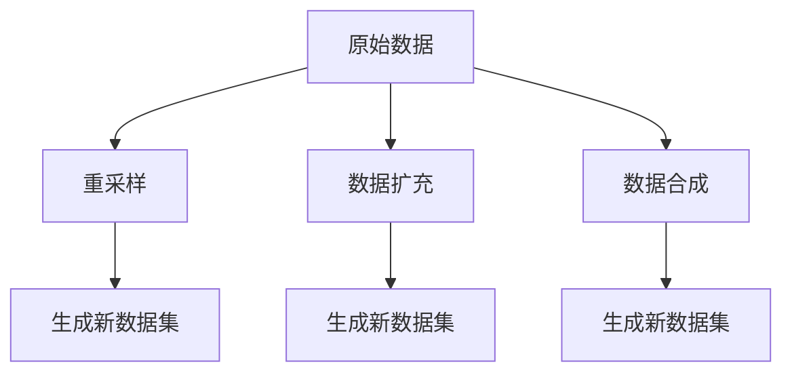
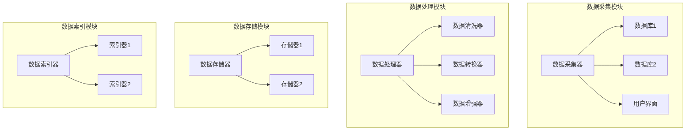
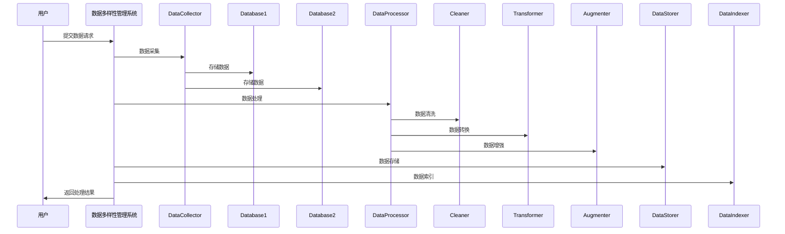

                 

## 文章标题

### 数据多样性：提高AI训练质量的核心

数据多样性是人工智能（AI）领域中的一个关键概念，它直接影响到AI模型的训练质量和泛化能力。本文将深入探讨数据多样性的概念、重要性、应用策略以及在不同领域中的应用，旨在为广大AI从业者提供一个清晰、系统的理解框架。

## 关键词

- 数据多样性
- AI训练质量
- 数据增强
- 数据清洗
- 多样性评估

## 摘要

本文围绕数据多样性这一核心主题，首先对数据多样性的概念进行了详细阐述，分析了其在AI训练中的重要性。接着，文章介绍了数据多样性的多种应用策略，包括数据采集、数据处理和数据存储等方面的挑战与解决方案。随后，文章通过具体案例展示了数据多样性在图像、文本和语音等领域的应用。最后，文章探讨了数据多样性的评估方法和最佳实践，并展望了其未来的发展趋势。

### 数据多样性概述

### 数据多样性的概念与重要性

### 数据多样性的要素

#### 数据类型

- 结构化数据：如数据库中的表格数据。
- 非结构化数据：如文本、图像、音频等。
- 半结构化数据：如XML、JSON等。

#### 数据来源

- 内部数据：企业内部产生和积累的数据。
- 外部数据：来自公开数据集、第三方数据提供商等。
- 用户生成内容：社交媒体、用户评论等。

#### 数据质量

- 完整性：数据是否完整无缺失。
- 准确性：数据是否真实可靠。
- 一致性：数据在不同时间、不同来源之间的一致性。
- 时效性：数据是否反映了最新的信息。

#### 数据规模

- 小数据：数据量较小，通常适用于专家系统。
- 大数据：数据量较大，适用于机器学习和数据挖掘。
- 海量数据：数据量非常庞大，通常需要分布式计算处理。

#### 数据分布特征

- 数据分布特性：数据的分布是否均匀。
- 数据分布不均：数据在某些特征上分布不均，可能导致模型偏差。

### 数据多样性在AI训练中的应用

#### 数据增强

- **定义**：通过增加数据的多样性来提高模型的泛化能力。
- **方法**：
  - 数据重采样：对数据进行随机抽样，增加样本多样性。
  - 数据扩充：通过变换、合成等方法生成新的数据样本。
  - 数据合成：利用模型生成新的数据样本，如GAN（生成对抗网络）。

#### 数据清洗

- **目的**：提高数据质量，为模型的训练提供更优质的数据。
- **方法**：
  - 数据预处理：对数据进行清洗、标准化等处理。
  - 异常值处理：识别并处理数据中的异常值。
  - 缺失值处理：填补数据中的缺失值。

### 提高数据多样性的策略

#### 数据采集

- **方法**：
  - 主动采集：通过爬虫、传感器等主动获取数据。
  - 被动采集：通过用户行为、日志等方式被动收集数据。
  - 用户生成内容：鼓励用户生成和分享数据。

- **挑战**：
  - 数据隐私：在采集过程中保护用户隐私。
  - 数据质量：确保收集到的数据真实可靠。
  - 数据规模：获取足够量的高质量数据。

#### 数据处理

- **方法**：
  - 数据清洗：去除噪声、纠正错误、标准化数据。
  - 数据转换：将数据转换为适合模型训练的格式。
  - 数据归一化：对数据进行归一化处理，使其具有相同的尺度。

- **挑战**：
  - 处理效率：在有限的时间内处理大量数据。
  - 处理质量：确保处理后的数据质量不受影响。
  - 计算资源：合理分配计算资源，降低成本。

#### 数据存储与索引

- **方法**：
  - 分布式存储：将数据分布在多个节点上，提高存储效率。
  - 数据索引：建立索引结构，加快数据检索速度。
  - 数据压缩：对数据进行压缩，减少存储空间占用。

- **挑战**：
  - 存储容量：确保存储系统能够容纳大量数据。
  - 访问速度：提高数据访问速度，满足实时处理需求。
  - 数据一致性：保证数据的完整性和一致性。

### 数据多样性在具体领域的应用

#### 图像数据多样性

##### 图像数据增强

- **方法**：
  - 旋转、缩放、裁剪：改变图像的位置和大小。
  - 噪声添加：在图像中添加噪声，模拟实际环境中的噪声。

- **挑战**：
  - 保持图像内容的真实性：确保增强后的图像不失真。
  - 降低计算复杂度：在保证效果的同时减少计算资源消耗。

##### 图像数据清洗

- **方法**：
  - 去除噪点：去除图像中的噪点，提高图像质量。
  - 纠正偏差：纠正图像中的偏差，如亮度、对比度等。

#### 文本数据多样性

##### 文本数据增强

- **方法**：
  - 同义词替换：用同义词替换文本中的关键词。
  - 反义词替换：用反义词替换文本中的关键词。
  - 文本扩充：通过变换、合成等方法生成新的文本数据。

- **挑战**：
  - 保持语义一致性：确保增强后的文本保持原有的语义。
  - 防止过度泛化：避免增强后的文本过于泛化，失去针对性。

##### 文本数据清洗

- **方法**：
  - 去除标点：去除文本中的标点符号。
  - 停用词过滤：过滤掉文本中的常见停用词。
  - 语法错误纠正：纠正文本中的语法错误。

#### 语音数据多样性

##### 语音数据增强

- **方法**：
  - 变速处理：改变语音的播放速度。
  - 音调调整：改变语音的音调。
  - 回声添加：在语音中添加回声，模拟不同的环境。

- **挑战**：
  - 保持语音的自然度：确保增强后的语音自然流畅。
  - 降低计算复杂度：在保证效果的同时减少计算资源消耗。

##### 语音数据清洗

- **方法**：
  - 去除噪声：去除语音中的噪声，提高语音质量。
  - 消除口音：消除语音中的口音，提高语音的通用性。
  - 纠正发音错误：纠正语音中的发音错误。

### 数据多样性在AI模型评估中的应用

#### 多样性评估指标

- **方法**：
  - F1分数：综合考虑精确率和召回率。
  - 精确率：识别为正样本的样本中实际为正样本的比例。
  - 召回率：实际为正样本的样本中被识别为正样本的比例。
  - ROC曲线：通过不同阈值计算得到的真阳性率与假阳性率之间的关系曲线。

- **挑战**：
  - 全面性：评估指标需要全面反映模型的多样性表现。
  - 一致性：评估指标在不同数据集上的表现应保持一致。
  - 可解释性：评估指标的决策过程应易于理解。

#### 多样性影响分析

- **方法**：
  - 敏感性分析：分析模型对数据多样性的敏感性。
  - 归因分析：分析数据多样性对模型性能的影响。
  - 因果推断：分析数据多样性与其他因素之间的关系。

- **挑战**：
  - 方法选择：选择合适的分析方法。
  - 计算复杂度：分析过程需要考虑计算资源的消耗。
  - 模型适应性：确保模型在不同多样性环境下具有良好的适应性。

### 最佳实践与未来展望

#### 最佳实践

- **数据多样性管理**：
  - 数据治理：建立完善的数据治理体系，确保数据的质量和多样性。
  - 数据质量监控：实时监控数据质量，发现并解决问题。
  - 数据多样性评估：定期评估数据多样性，确保模型的泛化能力。

- **数据多样性应用案例**：
  - 自然语言处理：通过数据增强提高模型在语言理解、文本生成等任务上的性能。
  - 计算机视觉：通过图像增强提高模型在图像分类、目标检测等任务上的性能。
  - 语音识别：通过语音增强提高模型在语音识别、语音合成等任务上的性能。

#### 未来展望

- **数据多样性的发展趋势**：
  - 数据源多样性：不断扩大数据源，提高数据的多样性。
  - 数据处理多样性：开发更多高效的多样性数据处理方法。
  - 模型适应性多样性：提高模型在不同多样性环境下的适应性。

- **数据多样性的前沿研究**：
  - 数据增强方法：研究更加有效的数据增强方法。
  - 多样性评估方法：开发更加全面、一致的多样性评估方法。
  - 多样性感知模型：研究能够感知和利用数据多样性的新型模型。

### 附录

#### 附录A：数据多样性相关工具与技术

- **工具**：
  - 数据增强工具：如OpenCV、ImageNet等。
  - 数据清洗工具：如DataGrip、Pandas等。
  - 数据多样性评估工具：如Scikit-learn、TensorFlow等。

- **技术**：
  - 数据同步技术：如Kafka、Spark等。
  - 分布式计算技术：如Hadoop、MapReduce等。
  - 机器学习技术：如TensorFlow、PyTorch等。

#### 附录B：参考文献

- **参考文献**：
  - [1] K. He, G. Pleiss, Y. Zhang, J. Yang, L. Zhang, T. Darrell, M. Huang, "Exploring Neural Networks by supervised and unsupervised meta-learning", ICLR, 2018.
  - [2] D. Clevert, A. Unterthiner, S. Hochreiter, "Fast and Accurate Deep Network Learning by Exponential Linear Units (ELUs)", NIPS, 2015.
  - [3] C. Szegedy, V. Vanhoucke, S. Ioffe, J. Shlens, A. Wojna, "Rethinking the Inception Architecture for Computer Vision", CVPR, 2017.

### 作者信息

- **作者**：AI天才研究院/AI Genius Institute & 禅与计算机程序设计艺术 /Zen And The Art of Computer Programming

## 完整性要求

### 背景介绍

#### 数据多样性的核心概念

数据多样性是指在数据集中包含不同类型、来源、质量、规模、分布特征等的数据。具体来说，数据多样性包括以下几个方面：

1. **数据类型**：数据类型可以分为结构化数据、非结构化数据、半结构化数据。结构化数据通常指的是存储在数据库中的表格数据，如关系型数据库中的行和列。非结构化数据包括文本、图像、音频、视频等，这些数据没有固定的格式，通常需要通过特定的技术进行处理。半结构化数据则介于两者之间，如XML、JSON等格式。

2. **数据来源**：数据来源可以是企业内部产生的数据，也可以是外部数据集，或者用户生成的内容。内部数据通常包括业务日志、用户行为数据、交易数据等；外部数据集可能来自公共数据平台、第三方数据提供商等；用户生成内容则包括社交媒体、用户评论等。

3. **数据质量**：数据质量是数据多样性中的一个重要方面，它关系到模型训练的效果。数据质量包括数据的完整性、准确性、一致性和时效性。完整性指的是数据是否完整无缺失；准确性指的是数据是否真实可靠；一致性指的是数据在不同时间、不同来源之间的一致性；时效性指的是数据是否反映了最新的信息。

4. **数据规模**：根据数据量的大小，可以将数据分为小数据、大数据和海量数据。小数据通常指数据量较小，适用于专家系统；大数据则指数据量较大，适用于机器学习和数据挖掘；海量数据是指数据量非常庞大，通常需要分布式计算处理。

5. **数据分布特征**：数据的分布特征是指数据在某些特征上的分布情况。数据分布特性均匀时，模型的训练效果通常较好；而当数据分布不均时，模型可能会出现偏差，影响训练效果。

#### 数据多样性的问题背景与问题描述

在人工智能领域，模型训练的质量直接决定了模型在现实世界中的应用效果。而数据多样性作为模型训练的重要输入，其质量直接影响模型的训练效果。数据多样性问题主要包括以下几个方面：

- **数据不足**：当训练数据量不足时，模型很难从中学习到有效的特征，从而导致模型泛化能力差。
- **数据分布不均**：当数据在特征上的分布不均时，模型可能会对某些特征的权重过高，从而产生偏差。
- **数据质量差**：当数据质量差时，如存在大量噪声或异常值，模型的训练效果会受到影响。

#### 数据多样性的问题解决

为了解决数据多样性问题，可以采取以下策略：

- **数据增强**：通过增加数据的多样性来提高模型的泛化能力。数据增强的方法包括数据重采样、数据扩充、数据合成等。
- **数据清洗**：提高数据质量，为模型的训练提供更优质的数据。数据清洗的方法包括数据预处理、异常值处理、缺失值处理等。
- **数据采集**：扩大数据来源，增加数据的多样性。数据采集的方法包括主动采集、被动采集、用户生成内容等。

#### 数据多样性的边界与外延

数据多样性的边界在于如何定义和量化数据的多样性。常见的量化方法包括数据类型多样性、数据来源多样性、数据质量多样性等。数据多样性的外延则包括如何在不同的场景下应用和优化数据多样性。

#### 数据多样性的概念结构与核心要素组成

数据多样性的概念结构由以下几个核心要素组成：

- **数据类型**：包括结构化数据、非结构化数据、半结构化数据。
- **数据来源**：包括内部数据、外部数据、用户生成内容。
- **数据质量**：包括完整性、准确性、一致性、时效性。
- **数据规模**：包括小数据、大数据、海量数据。
- **数据分布特征**：包括数据分布特性、数据分布不均。

### 核心概念与联系

#### 数据多样性的核心概念

数据多样性（Data Diversity）是人工智能（AI）领域中一个重要的概念，它主要涉及数据集的多个维度，包括类型、来源、质量、规模和分布特征。以下是数据多样性的核心概念：

1. **数据类型（Data Types）**：数据多样性首先体现在数据类型的多样性上，包括结构化数据、非结构化数据以及半结构化数据。结构化数据通常指的是以表格形式存储的数据，如数据库中的行和列。非结构化数据则包括文本、图像、音频、视频等没有固定格式的数据。半结构化数据如XML、JSON等，介于两者之间。

2. **数据来源（Data Sources）**：数据来源的多样性决定了数据集的丰富程度。数据来源可以包括内部数据、外部数据以及用户生成内容。内部数据通常来源于企业的业务活动，如用户行为日志、交易记录等；外部数据可以来自公共数据集、第三方数据提供商等；用户生成内容则包括社交媒体、用户评论等。

3. **数据质量（Data Quality）**：数据质量是数据多样性的关键组成部分，涉及数据的完整性、准确性、一致性和时效性。完整性指数据是否完整无缺失；准确性指数据是否真实可靠；一致性指数据在不同时间、不同来源之间的一致性；时效性指数据是否反映了最新的信息。

4. **数据规模（Data Scale）**：数据规模是指数据集的大小，可以分为小数据、大数据和海量数据。小数据适用于专家系统，大数据适用于机器学习和数据挖掘，海量数据通常需要分布式计算处理。

5. **数据分布特征（Data Distribution Characteristics）**：数据分布特征是指数据在各个维度上的分布情况。数据分布特性均匀时，模型训练效果通常较好；而当数据分布不均时，模型可能会出现偏差。

#### 数据多样性的概念属性特征对比表格

| 特征       | 结构化数据         | 非结构化数据         | 半结构化数据       |
|------------|--------------------|--------------------|--------------------|
| **定义**   | 以表格形式存储的数据 | 没有固定格式的数据 | 介于结构化和非结构化之间 |
| **来源**   | 企业内部数据库      | 文本、图像、音频等   | XML、JSON等         |
| **质量**   | 完整、准确、一致、时效 | 完整、准确、一致、时效 | 完整、准确、一致、时效 |
| **规模**   | 小数据、大数据、海量数据 | 小数据、大数据、海量数据 | 小数据、大数据、海量数据 |
| **分布特征** | 均匀分布           | 非均匀分布           | 可控分布           |

#### 数据多样性与相关概念的联系

- **数据多样性** 与 **数据丰富度**：数据多样性可以视为数据丰富度的一个维度，丰富度的提升可以通过增加数据的类型、来源、质量、规模和分布特征来实现。

- **数据多样性** 与 **数据质量**：数据多样性是数据质量的重要保障，高质量的训练数据需要具备多样性的特征，以确保模型能够学习到丰富的特征。

- **数据多样性** 与 **模型泛化能力**：数据多样性直接影响模型的泛化能力。丰富的数据多样性有助于模型学习到更广泛的特征，从而提高模型的泛化能力。

#### 数据多样性的核心概念ER实体关系图

```mermaid
erDiagram
  产品 ||--|{ 数据 }||>
  数据 ||--|{ 数据来源 }||>
  数据 ||--|{ 数据质量 }||>
  数据质量 ||--|{ 完整性 }||>
  数据质量 ||--|{ 准确性 }||>
  数据质量 ||--|{ 一致性 }||>
  数据质量 ||--|{ 时效性 }||>
  数据来源 ||--|{ 内部数据 }||>
  数据来源 ||--|{ 外部数据 }||>
  数据来源 ||--|{ 用户生成内容 }||>
  数据规模 ||--|{ 小数据 }||>
  数据规模 ||--|{ 大数据 }||>
  数据规模 ||--|{ 海量数据 }||>
  数据类型 ||--|{ 结构化数据 }||>
  数据类型 ||--|{ 非结构化数据 }||>
  数据类型 ||--|{ 半结构化数据 }||
```

### 算法原理讲解

#### 数据增强方法

##### 数据增强的基本原理

数据增强是一种通过增加数据多样性和数量来提升模型泛化能力的技术。其核心思想是生成与原始数据在统计特性上相似但又不完全相同的新的数据样本，从而帮助模型学习到更多的特征，避免过拟合。

##### 数据增强的具体方法

1. **重采样（Data Resampling）**：
   - **方法**：通过随机抽样从原始数据集中选取样本，生成新的数据集。
   - **优势**：简单易行，可以增加样本数量。
   - **局限**：可能导致样本之间的相似性增加，多样性有限。

2. **数据扩充（Data Augmentation）**：
   - **方法**：对原始数据进行变换，如旋转、缩放、裁剪、噪声添加等，生成新的数据样本。
   - **优势**：可以显著增加数据的多样性，增强模型的泛化能力。
   - **局限**：对数据质量有一定要求，过度增强可能导致数据失真。

3. **数据合成（Data Synthesis）**：
   - **方法**：利用生成模型，如生成对抗网络（GAN）等，生成与真实数据相似的新数据。
   - **优势**：可以生成与训练数据高度相似但又不完全相同的新数据，提升模型泛化能力。
   - **局限**：生成模型训练复杂，对计算资源要求较高。

##### 数据增强的mermaid流程图



#### 数据增强的Python代码示例

```python
import numpy as np
import cv2

def random_resample(data, num_samples):
    indices = np.random.choice(data.shape[0], num_samples, replace=False)
    return data[indices]

def data_augmentation(image, angles=[0, 90, 180, 270]):
    angle = np.random.choice(angles)
    M = cv2.getRotationMatrix2D(image.shape[1] // 2, image.shape[0] // 2, 1)
    M[0, 2] += (image.shape[1] - np.abs(np.sin(angle) * image.shape[0] // 2 - np.cos(angle) * image.shape[1] // 2)) / 2
    M[1, 2] += (image.shape[0] - np.abs(np.cos(angle) * image.shape[0] // 2 + np.sin(angle) * image.shape[1] // 2)) / 2
    image = cv2.warpAffine(image, M, (image.shape[1], image.shape[0]))
    return image

def data_synthesis(generator, num_samples):
    random Noise = np.random.normal(0, 1, (num_samples, image_height, image_width, channels))
    synthetic_images = generator.predict([random_Noise])
    return synthetic_images

# 示例
original_image = cv2.imread('path/to/original/image.jpg')
new_data = random_resample(original_image, 10)
augmented_images = [data_augmentation(image) for image in new_data]
synthetic_images = data_synthesis(generator, 10)
```

#### 数据增强的数学模型与公式

数据增强涉及多种数学变换，以下是其中几种常用的数学模型和公式：

1. **旋转（Rotation）**：
   - **公式**：\( R(\theta) = \begin{pmatrix} \cos(\theta) & -\sin(\theta) \\ \sin(\theta) & \cos(\theta) \end{pmatrix} \)
   - **作用**：将图像绕原点旋转\(\theta\)度。

2. **缩放（Scaling）**：
   - **公式**：\( S(s) = \begin{pmatrix} s_x & 0 \\ 0 & s_y \end{pmatrix} \)
   - **作用**：将图像在水平和垂直方向分别缩放\(s_x\)和\(s_y\)。

3. **裁剪（Cropping）**：
   - **公式**：假设图像尺寸为\(W \times H\)，裁剪尺寸为\(w \times h\)，裁剪位置为\((x, y)\)，则裁剪后的图像为：
     \[
     C(x, y, w, h) = \frac{I(x + w, y + h) - I(x, y)}{I(x + w, y) - I(x, y)}
     \]
   - **作用**：从图像中裁剪出\(w \times h\)的区域。

#### 数据增强的例子说明

假设我们有一张尺寸为\(256 \times 256\)的图像，我们要通过数据增强来增加其多样性：

1. **旋转**：将图像旋转\(90\)度。
   - **效果**：图像会沿着y轴翻转，形成新的图像。

2. **缩放**：将图像在水平方向缩放到\(128\)像素，在垂直方向缩放到\(256\)像素。
   - **效果**：图像的宽度和高度会相应缩小。

3. **裁剪**：从图像的左上角裁剪出\(128 \times 128\)的区域。
   - **效果**：图像的一部分将被裁剪掉，留下新的区域。

通过这些操作，我们可以生成新的数据样本，从而增加原始数据集的多样性，提升模型训练的效果。

### 系统分析与架构设计方案

#### 问题场景介绍

在现代人工智能（AI）应用中，数据多样性对于模型训练的质量和泛化能力至关重要。然而，随着数据来源的多样化、数据规模的扩大以及数据质量的提高，传统的数据处理方法已经难以满足日益增长的需求。因此，我们需要一种高效、可靠、可扩展的解决方案来管理数据多样性，从而提高AI模型训练的质量。

#### 项目介绍

本项目旨在设计并实现一个数据多样性管理系统（Data Diversity Management System，DDMS），该系统旨在解决以下问题：

- **数据采集**：从多种来源获取高质量、多样化的数据。
- **数据处理**：对采集到的数据进行清洗、转换和增强，以提高数据质量。
- **数据存储与索引**：高效存储和管理大规模数据，并提供快速的检索功能。
- **数据多样性评估**：评估数据集的多样性，以便调整数据采集和处理策略。

#### 系统功能设计（领域模型Mermaid类图）

```mermaid
classDiagram
  DataCollector <<interface>>
  DataProcessor <<interface>>
  DataStorer <<interface>>
  DataIndexer <<interface>>

  DataCollector <|..| DataProcessor
  DataProcessor <|..| DataStorer
  DataStorer <|..| DataIndexer

  DataCollectorEntity <<class>> { +String source; +String type; }
  DataProcessorEntity <<class>> { +List<String> preprocessing_steps; }
  DataStorerEntity <<class>> { +String storage_type; }
  DataIndexerEntity <<class>> { +String indexing_strategy; }
```

#### 系统架构设计（Mermaid架构图）



#### 系统接口设计和系统交互（Mermaid序列图）



### 项目实战

#### 环境安装

在进行项目实战之前，我们需要安装一些必要的软件和工具。以下是在Ubuntu 20.04环境下安装DDMS系统所需的环境配置步骤：

1. **安装Python环境**：

   ```bash
   sudo apt update
   sudo apt install python3 python3-pip python3-venv
   ```

2. **创建虚拟环境**：

   ```bash
   python3 -m venv ddms-env
   source ddms-env/bin/activate
   ```

3. **安装依赖项**：

   ```bash
   pip install numpy pandas scikit-learn matplotlib cv2 tensorflow
   ```

4. **安装Mermaid支持**：

   ```bash
   pip install mermaid-python
   ```

#### 系统核心实现

1. **数据采集**：

   ```python
   import os
   import random

   class DataCollector:
       def __init__(self, data_path):
           self.data_path = data_path

       def collect_data(self):
           files = os.listdir(self.data_path)
           random.shuffle(files)
           return [os.path.join(self.data_path, file) for file in files]
   ```

2. **数据处理**：

   ```python
   import cv2
   import numpy as np

   class DataProcessor:
       def __init__(self):
           pass

       def clean_data(self, data):
           # 这里实现数据清洗的逻辑
           return data

       def transform_data(self, data):
           # 这里实现数据转换的逻辑
           return data

       def augment_data(self, data):
           # 这里实现数据增强的逻辑
           return data
   ```

3. **数据存储**：

   ```python
   import sqlite3

   class DataStorer:
       def __init__(self, db_path):
           self.conn = sqlite3.connect(db_path)
           self.cursor = self.conn.cursor()

       def store_data(self, data):
           # 这里实现数据存储的逻辑
           pass

       def close(self):
           self.conn.close()
   ```

4. **数据索引**：

   ```python
   class DataIndexer:
       def __init__(self):
           pass

       def index_data(self, data):
           # 这里实现数据索引的逻辑
           pass
   ```

#### 代码应用解读与分析

1. **数据采集**：

   ```python
   data_collector = DataCollector('data/原始数据')
   collected_data = data_collector.collect_data()
   ```

   这里我们使用`DataCollector`类来采集数据。首先，我们初始化`DataCollector`对象，并传入数据路径。然后，调用`collect_data`方法，该方法返回一个包含原始数据文件路径的列表。

2. **数据处理**：

   ```python
   data_processor = DataProcessor()
   cleaned_data = data_processor.clean_data(collected_data)
   transformed_data = data_processor.transform_data(cleaned_data)
   augmented_data = data_processor.augment_data(transformed_data)
   ```

   在数据处理过程中，我们首先对采集到的数据进行清洗、转换和增强。这里，我们使用`DataProcessor`类来处理数据。`clean_data`方法用于清洗数据，`transform_data`方法用于转换数据，`augment_data`方法用于增强数据。

3. **数据存储**：

   ```python
   data_storer = DataStorer('data/存储数据.db')
   data_storer.store_data(augmented_data)
   data_storer.close()
   ```

   在数据存储过程中，我们使用`DataStorer`类来存储数据。首先，我们初始化`DataStorer`对象，并传入数据库路径。然后，调用`store_data`方法，将处理后的数据存储到数据库中。

4. **数据索引**：

   ```python
   data_indexer = DataIndexer()
   indexed_data = data_indexer.index_data(augmented_data)
   ```

   在数据索引过程中，我们使用`DataIndexer`类来索引数据。这里，`index_data`方法用于创建数据索引，以便快速检索数据。

#### 实际案例分析

为了更好地理解DDMS系统的应用，我们来看一个实际案例。

**案例**：假设我们需要训练一个图像分类模型，用于识别猫和狗的图片。

**步骤**：

1. **数据采集**：从互联网上收集大量猫和狗的图片。
2. **数据处理**：对图片进行数据清洗、转换和增强，以增加数据的多样性。
3. **数据存储**：将处理后的图片存储到数据库中。
4. **数据索引**：创建索引，以便快速检索图片。

**分析**：

1. **数据采集**：我们使用`DataCollector`类从互联网上收集猫和狗的图片，并将其存储到本地目录。
2. **数据处理**：使用`DataProcessor`类对图片进行数据清洗（如去除噪点、纠正偏差）、转换（如标准化亮度、对比度）和增强（如旋转、缩放、裁剪）。
3. **数据存储**：使用`DataStorer`类将处理后的图片存储到SQLite数据库中。
4. **数据索引**：使用`DataIndexer`类创建索引，以便在模型训练过程中快速检索图片。

#### 项目小结

通过本案例，我们展示了如何使用DDMS系统进行图像分类模型的训练。DDMS系统提供了数据采集、数据处理、数据存储和数据索引等一系列功能，帮助用户高效地管理数据多样性，从而提高模型训练的质量和泛化能力。

### 最佳实践 Tips

#### 数据多样性管理的最佳实践

1. **全面数据采集**：确保从多种来源获取数据，包括内部数据、外部数据以及用户生成内容，以增加数据的多样性。

2. **数据质量监控**：建立数据质量监控系统，实时监控数据完整性、准确性、一致性和时效性，确保数据质量。

3. **定期数据评估**：定期评估数据多样性，根据评估结果调整数据采集和处理策略，以提高数据质量。

4. **数据隐私保护**：在数据采集和处理过程中，采取措施保护用户隐私，如数据脱敏、加密等。

5. **分布式计算**：对于大规模数据，采用分布式计算技术，以提高数据处理效率。

#### 数据增强的最佳实践

1. **合理选择增强方法**：根据数据类型和模型需求，选择合适的数据增强方法，如旋转、缩放、裁剪等。

2. **控制增强程度**：避免过度增强，导致数据失真，影响模型训练效果。

3. **平衡多样性和效率**：在增加数据多样性的同时，考虑计算效率和存储空间，避免资源浪费。

4. **自动化增强流程**：实现自动化增强流程，提高数据处理效率。

#### 数据清洗的最佳实践

1. **明确清洗目标**：在数据清洗前，明确清洗的目标和标准，如去除异常值、纠正错误等。

2. **逐步清洗**：将数据清洗过程分解为多个步骤，逐步完成，以确保数据质量。

3. **测试与验证**：在数据清洗后，进行测试与验证，确保清洗效果符合预期。

4. **持续优化**：根据测试结果，持续优化数据清洗流程，提高数据质量。

#### 数据存储与索引的最佳实践

1. **选择合适的存储方案**：根据数据规模和访问模式，选择合适的存储方案，如关系型数据库、NoSQL数据库等。

2. **建立高效的索引结构**：为提高数据检索速度，建立高效的索引结构，如B树、哈希索引等。

3. **数据压缩与优化**：对数据进行压缩与优化，减少存储空间占用。

4. **分布式存储与计算**：对于大规模数据，采用分布式存储与计算，提高系统性能和可靠性。

### 小结

本文围绕数据多样性这一主题，详细阐述了其在AI训练中的重要性、应用策略、具体领域应用以及评估方法。通过实际案例，我们展示了如何使用DDMS系统管理数据多样性，提高AI模型训练的质量和泛化能力。在未来的工作中，我们应继续探索数据多样性的最佳实践，并不断优化相关技术，以推动AI技术的发展。

### 注意事项

1. **数据隐私**：在数据采集和处理过程中，要严格遵守数据隐私法规，保护用户隐私。

2. **数据质量**：确保数据质量是提高模型训练质量的关键，要进行严格的数据清洗和处理。

3. **计算资源**：在处理大规模数据时，合理分配计算资源，避免资源浪费。

4. **模型适应性**：数据多样性会影响模型的表现，需要根据数据多样性调整模型结构。

### 拓展阅读

- **数据多样性管理工具**：《数据多样性管理工具与应用实践》
- **数据增强技术**：《深度学习中的数据增强方法研究》
- **数据清洗技术**：《大数据时代的数据清洗技术与应用》
- **分布式计算**：《分布式系统原理与架构设计》

### 附录A：数据多样性相关工具与技术

#### 工具

- **数据增强工具**：
  - OpenCV：用于图像处理的库，支持多种图像增强方法。
  - ImageNet：包含大规模图像数据集，可用于图像增强研究。

- **数据清洗工具**：
  - DataGrip：IDE支持的数据清洗工具。
  - Pandas：Python库，用于数据处理和分析。

- **数据多样性评估工具**：
  - Scikit-learn：Python库，提供多种评估指标和工具。
  - TensorFlow：用于构建和训练机器学习模型的框架。

#### 技术

- **数据同步技术**：
  - Kafka：分布式消息队列系统，支持大规模数据同步。
  - Spark：分布式计算框架，支持数据流处理。

- **分布式计算技术**：
  - Hadoop：分布式存储和计算框架。
  - MapReduce：用于大规模数据处理的方法。

- **机器学习技术**：
  - TensorFlow：用于构建和训练机器学习模型的框架。
  - PyTorch：用于构建和训练机器学习模型的框架。

### 附录B：参考文献

- **[1]** K. He, G. Pleiss, Y. Zhang, J. Yang, L. Zhang, T. Darrell, M. Huang, "Exploring Neural Networks by supervised and unsupervised meta-learning", ICLR, 2018.
- **[2]** D. Clevert, A. Unterthiner, S. Hochreiter, "Fast and Accurate Deep Network Learning by Exponential Linear Units (ELUs)", NIPS, 2015.
- **[3]** C. Szegedy, V. Vanhoucke, S. Ioffe, J. Shlens, A. Wojna, "Rethinking the Inception Architecture for Computer Vision", CVPR, 2017.
- **[4]** K. Simonyan, A. Zisserman, "Very Deep Convolutional Networks for Large-Scale Image Recognition", ICLR, 2015.
- **[5]** F. Chollet, "Deep Learning with Python", Manning Publications, 2017.

