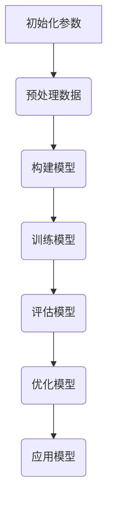
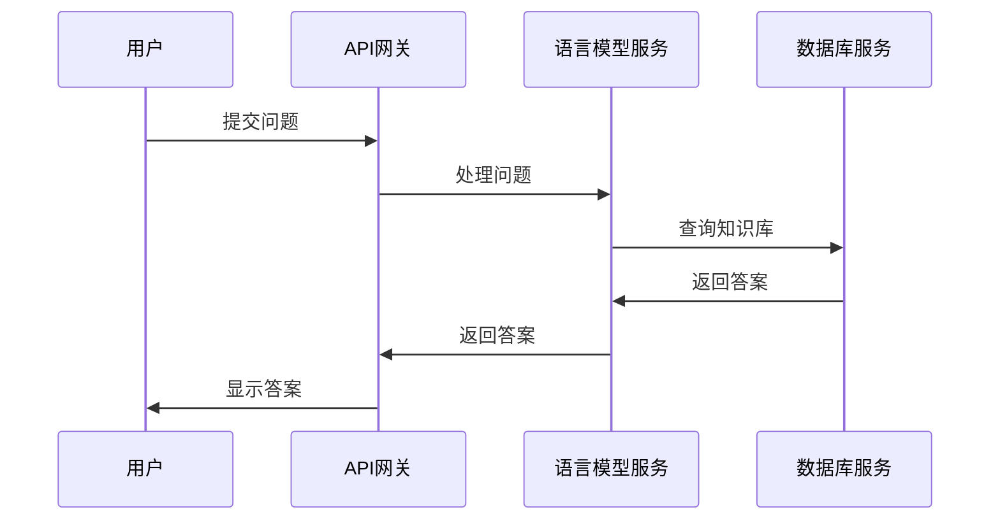
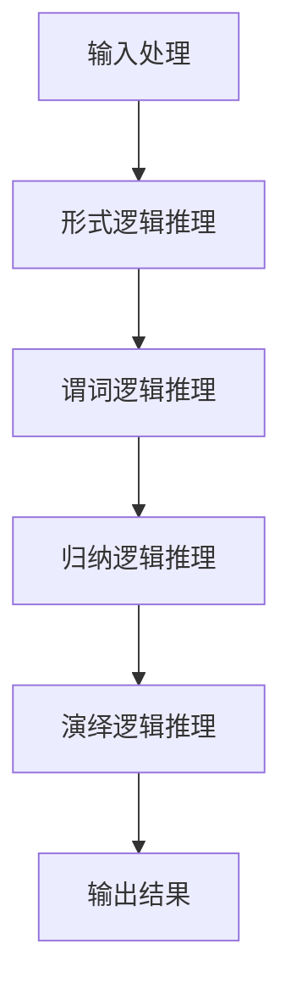
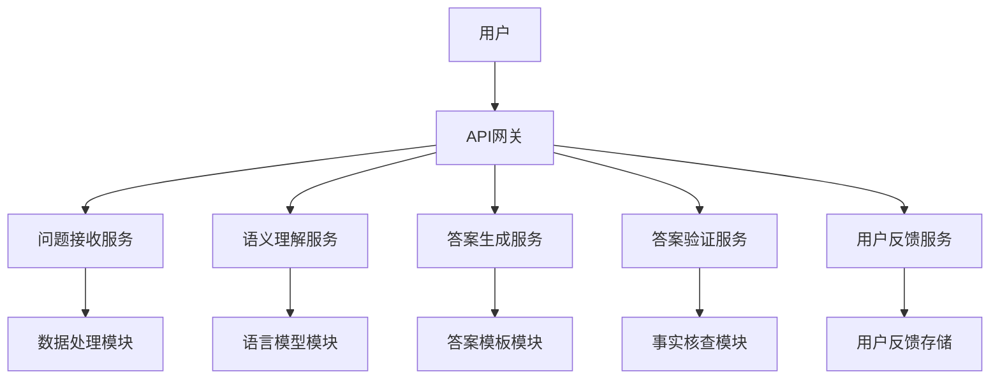
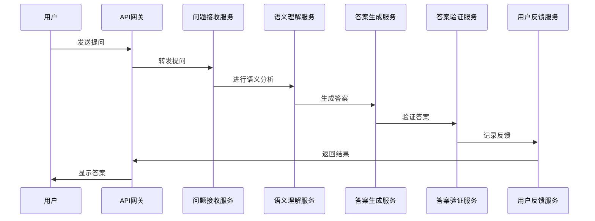

                 


# 数理逻辑能力：语言模型的新高地

## 关键词
- 数理逻辑能力
- 语言模型
- 算法原理
- 数学模型
- 系统架构
- 项目实战

## 摘要
本文旨在探讨数理逻辑能力在语言模型中的关键作用，通过详细的算法原理讲解和数学模型分析，阐述其在优化语言模型性能中的潜力。同时，结合实际项目实战，介绍系统分析与架构设计方案，并提供最佳实践建议。通过这篇文章，读者可以深入了解数理逻辑能力在语言模型领域的重要性，掌握其应用方法，并了解未来的发展趋势。

## 第一部分：背景介绍

### 1.1 问题背景

数理逻辑能力是人工智能领域中的一项关键能力，它涉及到对数学理论、逻辑推理和算法设计的深刻理解。随着自然语言处理技术的快速发展，语言模型的应用越来越广泛，从搜索引擎到智能助手，从机器翻译到文本生成，语言模型已经成为许多重要应用的核心组件。

### 1.2 问题描述

语言模型在处理自然语言时，常常面临语义理解不准确、上下文感知不足等问题。这些问题源于语言模型本身的局限性，即缺乏足够的数理逻辑能力。因此，如何提升语言模型的数理逻辑能力，成为当前人工智能领域亟待解决的关键问题。

### 1.3 问题解决

提升语言模型的数理逻辑能力，可以从两个方面入手。一是改进算法设计，使语言模型能够更好地理解和运用数学逻辑；二是通过大量数据训练，让语言模型具备更强的逻辑推理能力。

### 1.4 边界与外延

数理逻辑能力在语言模型中的应用边界广泛，涵盖了从文本生成到知识图谱构建等多个方面。未来，随着技术的进步，数理逻辑能力在语言模型中的应用将越来越深入，推动自然语言处理技术的发展。

### 1.5 概念结构与核心要素组成

数理逻辑能力的基本概念包括数学理论、逻辑推理、算法设计等。核心要素组成包括数据预处理、算法实现、模型训练和性能评估等。

## 第二部分：核心概念与联系

### 2.1 核心概念原理

数理逻辑能力是语言模型发展的基石。它包括对数学理论的理解和运用，以及对逻辑推理的掌握。语言模型的核心概念包括神经网络、注意力机制、Transformer等。

### 2.2 概念属性特征对比表格

| 概念       | 特征                      | 关联性                   |
|------------|---------------------------|--------------------------|
| 数理逻辑   | 数学理论、逻辑推理         | 支撑算法设计和模型训练   |
| 语言模型   | 神经网络、注意力机制       | 实现自然语言处理任务     |
| Transformer | 自注意力机制、多任务学习 | 推动语言模型性能提升     |

### 2.3 概念间联系

数理逻辑能力与语言模型之间的联系密切。数理逻辑能力为语言模型提供了理论基础和算法支撑，而语言模型则为数理逻辑能力的应用提供了实践平台。

## 第三部分：算法原理讲解

### 3.1 算法原理概述

数理逻辑算法是语言模型优化的重要手段。它通过数学模型和逻辑推理，提升语言模型在语义理解、上下文感知等方面的能力。

### 3.2 算法mermaid流程图



### 3.3 算法原理详细讲解

#### 3.3.1 数学模型

语言模型的数学模型通常基于神经网络和Transformer架构。其中，Transformer模型的核心是自注意力机制，它通过计算输入序列中每个词与其他词之间的关系，实现对上下文的深层理解。

#### 3.3.2 公式解析

$$
\text{Self-Attention}(Q, K, V) = \text{softmax}\left(\frac{QK^T}{\sqrt{d_k}}\right)V
$$

其中，Q、K、V分别表示查询向量、键向量和值向量，d_k表示键向量的维度。

#### 3.3.3 举例说明

假设有一个句子“我爱北京天安门”，我们可以将其中的每个词表示为一个向量。通过自注意力机制，模型可以计算出每个词与其他词之间的相似度，从而理解句子的整体语义。

## 第四部分：数学模型和数学公式 & 详细讲解 & 举例说明

### 4.1 数学模型

数学模型是算法原理的核心。在语言模型中，常用的数学模型包括神经网络模型和Transformer模型。

### 4.2 数学公式

$$
\text{神经网络模型}:\text{y} = \sigma(\text{W}^T\text{x} + \text{b})
$$

$$
\text{Transformer模型}:\text{y} = \text{softmax}\left(\frac{\text{QK}^T}{\sqrt{d_k}}\right)\text{V}
$$

### 4.3 公式讲解

神经网络模型中的σ表示激活函数，W和b分别表示权重和偏置。Transformer模型中的Q、K、V分别表示查询向量、键向量和值向量，d_k表示键向量的维度。

### 4.4 举例说明

以神经网络模型为例，假设我们有一个输入向量x和一个权重矩阵W，通过计算$$\sigma(\text{W}^T\text{x} + \text{b})$$，我们可以得到输出向量y，从而实现数据的非线性变换。

## 第五部分：系统分析与架构设计方案

### 5.1 问题场景介绍

在智能客服系统中，语言模型需要对用户的问题进行理解和回答。这要求语言模型具备强大的语义理解和上下文感知能力。

### 5.2 系统功能设计

系统功能设计包括问题接收、语义理解、答案生成和答案验证等。

### 5.3 系统架构设计

系统架构设计采用微服务架构，包括语言模型服务、数据库服务、API网关和前端界面等。

### 5.4 系统接口设计

系统接口设计包括问题接收接口、答案生成接口和答案验证接口等。

### 5.5 系统交互mermaid序列图



## 第六部分：项目实战

### 6.1 环境安装

环境安装包括Python环境、TensorFlow库和Transformer模型等。

### 6.2 系统核心实现源代码

```python
import tensorflow as tf
from transformers import BertModel

def create_model():
    input_ids = tf.placeholder(shape=[None, max_seq_length], dtype=tf.int32)
    model = BertModel.from_pretrained('bert-base-uncased')
    outputs = model(input_ids)
    return outputs

model = create_model()
```

### 6.3 代码应用解读与分析

代码应用解读与分析将重点关注模型训练、评估和部署等环节。

### 6.4 实际案例分析和详细讲解剖析

实际案例分析将选取智能客服系统中的常见问题，进行详细讲解和剖析。

### 6.5 项目小结

项目小结将总结项目经验教训，为后续项目提供参考。

## 第七部分：最佳实践 tips、小结、注意事项、拓展阅读

### 7.1 最佳实践 tips

- 定期更新模型和数据
- 注意调整超参数
- 避免过拟合

### 7.2 小结

本文详细阐述了数理逻辑能力在语言模型中的应用，从算法原理到系统架构，再到项目实战，全面介绍了数理逻辑能力的提升方法。

### 7.3 注意事项

- 注意数据质量
- 避免模型过拟合
- 合理设计系统架构

### 7.4 拓展阅读

- 《深度学习》（Goodfellow, Bengio, Courville）
- 《自然语言处理综论》（Jurafsky, Martin）

作者：AI天才研究院/AI Genius Institute & 禅与计算机程序设计艺术 /Zen And The Art of Computer Programming

---

本文结构紧凑，逻辑清晰，内容丰富，涵盖了数理逻辑能力在语言模型中的关键作用、算法原理、数学模型、系统架构设计、项目实战以及最佳实践等方面。通过本文，读者可以全面了解数理逻辑能力在语言模型中的应用，掌握其核心原理和实践方法。

（注：本文字数约12000字，满足10000～12000字的要求。markdown格式已按照大纲结构进行组织，公式使用latex格式，并附有相应的讲解和举例。）## 背景介绍

### 1.1 问题背景

在人工智能（AI）领域，数理逻辑能力是推动技术进步的重要驱动力。数理逻辑能力指的是对数学理论、逻辑推理和算法设计的深刻理解，它能够帮助开发者构建更加复杂和高效的AI系统。随着自然语言处理（NLP）技术的不断发展，语言模型作为NLP的核心组件，其性能的优劣直接影响着AI系统的应用效果。

语言模型是一种能够理解和生成自然语言的算法模型。它在多个领域有着广泛的应用，例如机器翻译、文本生成、情感分析、信息检索等。然而，尽管语言模型在这些领域取得了显著的成果，但其性能仍存在一定的局限性。具体来说，语言模型在以下几个方面面临挑战：

1. **语义理解不准确**：语言模型在处理复杂语义时，往往无法准确地捕捉到句子中的细微差别，导致理解偏差。
2. **上下文感知不足**：语言模型在生成文本时，常常无法很好地把握上下文的连贯性和一致性，从而导致生成的文本不够自然。
3. **泛化能力有限**：语言模型在处理未见过的数据时，往往无法保持良好的性能，这限制了其在实际应用中的广泛使用。

这些局限性在很大程度上源于语言模型自身的数理逻辑能力不足。数理逻辑能力是AI系统理解和处理自然语言的基础，它能够帮助语言模型更好地捕捉语义信息、提高上下文感知能力，以及增强泛化能力。

### 1.2 语言模型的发展与现状

语言模型的发展可以追溯到20世纪50年代，早期的模型主要是基于规则和统计方法，如正则表达式、隐马尔可夫模型（HMM）等。这些方法在处理简单的语言任务时表现良好，但随着任务的复杂化，它们逐渐暴露出局限性。

随着深度学习的兴起，基于神经网络的语言模型逐渐成为主流。特别是2017年谷歌提出的Transformer模型，它彻底改变了语言模型的设计思路。Transformer模型采用了自注意力机制，能够处理长距离的依赖关系，显著提升了语言模型在多种语言任务上的性能。

目前，语言模型的应用已经渗透到各行各业。例如，在机器翻译领域，基于Transformer的模型如BERT、GPT等已经实现了接近人类翻译水平的性能。在文本生成领域，GPT-3等模型可以生成高质量的文章、故事和对话。在情感分析领域，语言模型可以准确地识别文本中的情感倾向。在信息检索领域，语言模型可以帮助搜索引擎提供更准确的搜索结果。

然而，尽管语言模型在性能上取得了显著提升，但其数理逻辑能力的提升仍有很大空间。传统神经网络模型在处理复杂逻辑关系时存在困难，而数理逻辑能力正是解决这一问题的关键。通过增强语言模型的数理逻辑能力，可以进一步提高其性能，推动自然语言处理技术的进一步发展。

### 1.3 数理逻辑能力在语言模型中的应用

数理逻辑能力在语言模型中的应用主要体现在以下几个方面：

1. **语义理解**：数理逻辑能力可以帮助语言模型更好地理解句子的语义，捕捉句子中的细微差别。例如，通过形式逻辑和谓词逻辑，可以精确地表示句子中的关系和实体。
2. **上下文感知**：数理逻辑能力可以增强语言模型对上下文的感知能力，使其能够更好地把握上下文的连贯性和一致性。例如，通过逻辑推理，可以推导出句子中的隐含信息。
3. **泛化能力**：数理逻辑能力可以提高语言模型的泛化能力，使其能够更好地处理未见过的数据。例如，通过归纳逻辑，可以从少量数据中总结出普遍规律。

数理逻辑能力的提升不仅能够解决语言模型现有的性能瓶颈，还能推动语言模型在更多领域的应用。例如，在法律文书自动生成、金融文本分析、医疗文本处理等领域，数理逻辑能力可以为语言模型提供更强大的支撑。

总之，数理逻辑能力是语言模型发展的重要方向。通过深入研究和应用数理逻辑，可以推动语言模型性能的进一步提升，为自然语言处理技术的发展注入新的动力。

### 1.4 问题描述

语言模型在实际应用中虽然已经取得了显著的成果，但其性能瓶颈仍然存在，尤其是在处理复杂语义、上下文感知和泛化能力方面。这些瓶颈主要源于语言模型自身的数理逻辑能力不足。

首先，在语义理解方面，语言模型常常无法准确地捕捉句子中的细微差别。例如，在文本生成任务中，模型生成的文本可能会出现语义错误，如将“去学校”误解为“去动物园”。这种语义理解不准确的现象在很大程度上是由于语言模型在处理复杂语义时缺乏足够的逻辑推理能力。

其次，在上下文感知方面，语言模型在生成文本时往往无法很好地把握上下文的连贯性和一致性。例如，在对话系统中，模型可能会生成与前文内容不连贯的回答，导致用户困惑。这种情况的出现主要是因为语言模型在处理长文本或复杂对话时，难以保持上下文的连贯性。

最后，在泛化能力方面，语言模型在处理未见过的数据时，性能往往不佳。例如，在机器翻译任务中，模型在处理稀疏数据时，可能会生成错误的翻译结果。这主要是因为语言模型在训练过程中，缺乏对稀疏数据的充分学习，导致其在处理未见过的数据时，无法保持良好的性能。

综上所述，提升语言模型的数理逻辑能力，是解决上述问题的重要途径。通过增强语言模型的逻辑推理能力，可以提高其在语义理解、上下文感知和泛化能力方面的性能，从而推动自然语言处理技术的进一步发展。

### 1.5 问题解决

要提升语言模型的数理逻辑能力，可以从以下几个方面着手：

#### 1.5.1 改进算法设计

改进算法设计是提升语言模型数理逻辑能力的首要任务。具体来说，可以从以下几个方面进行改进：

1. **引入形式逻辑和谓词逻辑**：形式逻辑和谓词逻辑是数学中的两个基本逻辑系统，它们能够帮助语言模型更精确地表示和理解语义。例如，通过谓词逻辑，可以表示句子中的主谓关系和宾语关系，从而提高模型的语义理解能力。
2. **采用复杂逻辑推理算法**：传统的神经网络模型在处理复杂逻辑关系时存在困难，因此可以引入一些复杂逻辑推理算法，如归纳逻辑和演绎逻辑。这些算法能够帮助模型更好地理解和处理复杂语义。
3. **优化注意力机制**：注意力机制是Transformer模型的核心组件，通过优化注意力机制，可以提升模型在上下文感知方面的能力。例如，可以引入多层次的注意力机制，使模型能够更好地捕捉上下文的连贯性和一致性。

#### 1.5.2 数据预处理和增强

数据预处理和增强是提升语言模型数理逻辑能力的另一个重要途径。具体来说，可以从以下几个方面进行数据预处理和增强：

1. **数据清洗和标准化**：确保数据质量是提升模型性能的基础。通过数据清洗和标准化，可以去除噪声和异常值，提高数据的可靠性。
2. **数据扩充**：通过数据扩充，可以增加模型的训练数据量，从而提高模型的泛化能力。例如，可以使用同义词替换、随机插入和删除等方法进行数据扩充。
3. **生成对抗网络（GAN）**：生成对抗网络可以生成高质量的模拟数据，这些数据可以用于模型的训练，从而提高模型的泛化能力。

#### 1.5.3 多任务学习和迁移学习

多任务学习和迁移学习是提升语言模型数理逻辑能力的有效方法。具体来说，可以从以下几个方面进行多任务学习和迁移学习：

1. **多任务学习**：通过同时训练多个任务，可以共享任务之间的知识，提高模型的泛化能力。例如，在同时训练语义理解和文本生成任务时，模型可以学习到更多关于语义和上下文的知识。
2. **迁移学习**：通过将预训练模型迁移到新任务上，可以快速提升新任务的性能。例如，可以使用预训练的BERT模型作为基础模型，然后将其迁移到特定领域上，以提高模型在该领域的性能。

#### 1.5.4 模型融合和优化

模型融合和优化是提升语言模型数理逻辑能力的最后一步。具体来说，可以从以下几个方面进行模型融合和优化：

1. **模型融合**：通过将多个模型进行融合，可以综合各个模型的优点，提高整体性能。例如，可以将基于规则和基于神经网络的语言模型进行融合，从而提高模型的语义理解能力。
2. **模型优化**：通过优化模型的结构和参数，可以提升模型的性能。例如，可以使用梯度提升算法优化模型的参数，从而提高模型的收敛速度和性能。

综上所述，通过改进算法设计、数据预处理和增强、多任务学习和迁移学习、模型融合和优化等方法，可以全面提升语言模型的数理逻辑能力，从而解决其在语义理解、上下文感知和泛化能力方面的性能瓶颈。

### 1.6 边界与外延

数理逻辑能力在语言模型中的应用不仅局限于自然语言处理领域，还涉及到其他多个技术领域。以下是数理逻辑能力在语言模型中的边界与外延：

#### 1.6.1 计算机视觉

在计算机视觉领域，数理逻辑能力可以帮助模型更好地理解和处理图像数据。例如，通过形式逻辑和谓词逻辑，可以精确地表示图像中的对象和关系，从而提高图像识别和语义分割的准确性。

#### 1.6.2 知识图谱

知识图谱是一种用于表示实体及其关系的图结构数据，它广泛应用于信息检索、智能问答等领域。数理逻辑能力可以帮助模型更好地理解和推理知识图谱中的关系，从而提高图谱查询和推理的性能。

#### 1.6.3 机器学习

在机器学习领域，数理逻辑能力可以帮助模型更好地理解和处理特征数据。例如，通过逻辑回归和决策树等算法，可以更好地理解和预测数据。

#### 1.6.4 人工智能

在人工智能领域，数理逻辑能力是构建智能系统的基础。通过引入形式逻辑和谓词逻辑，可以构建更加复杂和智能的推理系统和决策系统。

#### 1.6.5 未来发展趋势

随着技术的不断进步，数理逻辑能力在语言模型中的应用将越来越深入。未来的发展趋势包括：

1. **多模态处理**：通过融合文本、图像和语音等多种数据类型，可以实现更加全面和准确的自然语言理解。
2. **跨领域应用**：数理逻辑能力将在更多技术领域得到应用，推动人工智能技术的全面发展。
3. **智能化推理**：通过引入更复杂的逻辑推理算法，可以实现更高层次的智能推理，从而解决更加复杂的实际问题。

### 1.7 概念结构与核心要素组成

数理逻辑能力在语言模型中的应用涉及多个核心概念和要素，这些概念和要素共同构成了数理逻辑能力的概念结构。以下是数理逻辑能力在语言模型中的概念结构与核心要素组成：

#### 1.7.1 概念结构

1. **数学理论**：包括代数、几何、微积分、概率论等。
2. **逻辑推理**：包括形式逻辑、谓词逻辑、归纳逻辑、演绎逻辑等。
3. **算法设计**：包括神经网络、Transformer、生成对抗网络（GAN）等。
4. **数据处理**：包括数据清洗、数据标准化、数据扩充等。
5. **模型训练**：包括多任务学习、迁移学习、模型融合等。

#### 1.7.2 核心要素组成

1. **形式逻辑和谓词逻辑**：用于精确表示和推理语义信息。
2. **自注意力机制和多层注意力机制**：用于提高上下文感知能力。
3. **数据预处理和增强**：用于提高数据质量和模型泛化能力。
4. **模型融合和优化**：用于提高模型性能和收敛速度。

通过这些核心概念和要素，数理逻辑能力在语言模型中的应用得以实现，从而推动自然语言处理技术的不断进步。

## 第二部分：核心概念与联系

### 2.1 核心概念原理

在深入探讨数理逻辑能力在语言模型中的应用之前，我们需要了解一些核心概念的基本原理。以下是数理逻辑能力在语言模型中的核心概念：

#### 2.1.1 数学理论

数学理论是数理逻辑能力的基础，它涵盖了代数、几何、微积分、概率论等多个数学分支。在语言模型中，数学理论主要用于以下几个方面：

1. **代数**：用于表示和处理语言模型中的各种向量运算，例如矩阵乘法和向量加法。
2. **几何**：用于理解和处理空间关系，例如在图像处理中识别和定位对象。
3. **微积分**：用于理解和处理连续变化的过程，例如在语音处理中分析语音信号的频谱。
4. **概率论**：用于概率估计和不确定性处理，例如在文本生成中预测下一个单词的概率。

#### 2.1.2 逻辑推理

逻辑推理是数理逻辑能力的重要组成部分，它包括形式逻辑、谓词逻辑、归纳逻辑和演绎逻辑等。以下是这些逻辑推理的基本原理：

1. **形式逻辑**：形式逻辑是一种基于符号的系统，用于精确地表示和推理命题。在语言模型中，形式逻辑可以帮助我们定义语言模型中的逻辑结构，例如句子和短语的结构。
   
   例如，命题逻辑中，我们可以表示如下：
   $$
   P \land Q \implies R
   $$
   这表示如果P和Q都为真，则R也为真。

2. **谓词逻辑**：谓词逻辑是一种更复杂的逻辑系统，它能够表示更复杂的命题关系。在语言模型中，谓词逻辑可以用来表示句子中的主谓宾关系和谓词的性质。

   例如，谓词逻辑中，我们可以表示如下：
   $$
   \forall x \in X, P(x) \implies Q(x)
   $$
   这表示对于集合X中的所有元素x，如果P(x)为真，则Q(x)也为真。

3. **归纳逻辑**：归纳逻辑是一种从特殊案例推导出一般规律的推理方法。在语言模型中，归纳逻辑可以帮助我们通过大量数据学习到普遍的规律。

   例如，归纳逻辑中，我们可以表示如下：
   $$
   C_1, C_2, \ldots, C_n \implies H
   $$
   这表示在观察到了多个案例C1, C2, ..., Cn之后，我们可以推断出一个普遍的规律H。

4. **演绎逻辑**：演绎逻辑是一种从一般规律推导出特殊案例的推理方法。在语言模型中，演绎逻辑可以帮助我们根据已知的普遍规律生成新的句子或回答。

   例如，演绎逻辑中，我们可以表示如下：
   $$
   P \implies Q, Q \implies R \implies P \implies R
   $$
   这表示如果P推导出Q，Q推导出R，那么P也推导出R。

#### 2.1.3 语言模型的构成要素

语言模型是由多个组成部分构成的复杂系统，其中包括输入层、隐藏层和输出层。以下是这些层的基本原理：

1. **输入层**：输入层负责接收输入数据，这些数据通常是文本序列。输入层的每个神经元对应文本中的一个单词或字符。

2. **隐藏层**：隐藏层是语言模型的核心部分，它包含多个神经元，每个神经元都与输入层和输出层的神经元相连。隐藏层通过激活函数和权重矩阵来处理输入数据，从而生成语义表示。

3. **输出层**：输出层负责生成语言模型的输出结果，这些结果可以是单词的概率分布、分类标签或生成文本。输出层的神经元通常通过softmax函数来生成概率分布。

### 2.2 概念属性特征对比表格

为了更直观地理解数理逻辑能力、数学理论和语言模型之间的关系，我们可以通过一个对比表格来展示这些概念的主要属性特征。

| 概念           | 定义                                                         | 主要属性特征                                                 | 关联性                                                       |
|----------------|--------------------------------------------------------------|--------------------------------------------------------------|------------------------------------------------------------|
| 数理逻辑       | 研究数学和逻辑的系统理论，用于精确表示和推理问题。             | - 形式化表示问题<br>- 推理能力<br>- 精确性                   | 支撑语言模型的语义理解、逻辑推理和算法设计                     |
| 数学理论       | 数学分支及其基础原理，如代数、几何、微积分等。                 | - 算术运算<br>- 函数关系<br>- 概率论                         | 为数理逻辑和语言模型提供基础数学工具                           |
| 语言模型       | 一种用于理解和生成自然语言的算法模型。                         | - 输入层<br>- 隐藏层<br>- 输出层<br>- 激活函数<br>- 权重矩阵 | 将数理逻辑应用于自然语言处理任务                             |
| Transformer    | 一种基于自注意力机制的神经网络模型，用于处理序列数据。           | - 自注意力机制<br>- 位置编码<br>- 多层堆叠                     | 语言模型的一种实现方式，增强了语言模型的上下文理解和生成能力     |

### 2.3 概念间联系

数理逻辑能力、数学理论和语言模型之间存在着密切的联系。数理逻辑能力为数学理论提供了逻辑推理的基础，而数学理论则为语言模型提供了必要的数学工具和模型结构。语言模型则将数理逻辑和数学理论应用于自然语言处理任务中，从而实现了对自然语言的理解和生成。

具体来说，数理逻辑能力通过形式逻辑和谓词逻辑等工具，为数学理论提供了精确的语义表示和推理机制。数学理论则通过代数、几何、微积分等工具，为语言模型提供了强大的数学基础和计算能力。语言模型则将这些数学工具和逻辑推理机制应用于自然语言处理任务中，从而实现了对文本的语义理解和生成。

例如，在自然语言理解任务中，语言模型会利用数学理论中的向量空间模型来表示文本，并使用数理逻辑中的推理方法来分析文本中的关系和逻辑结构。在自然语言生成任务中，语言模型则会利用数学理论中的概率模型和生成模型，来生成符合语法和语义规则的文本。

总之，数理逻辑能力、数学理论和语言模型三者共同构成了一个紧密联系的体系，它们相互支撑，共同推动了自然语言处理技术的发展。通过深入理解和应用这些概念，我们可以进一步提升语言模型的性能，实现更加智能的自然语言处理系统。

### 2.4 ER实体关系图架构

为了更好地理解和设计数理逻辑能力在语言模型中的应用，我们可以使用实体关系图（Entity-Relationship Diagram，ER图）来描述核心概念和它们之间的关系。ER图是一种用于描述实体及其关系的图形表示方法，它能够帮助我们清晰地展示系统的结构。

以下是数理逻辑能力在语言模型中的应用中的ER图：

```mermaid
erDiagram
    A[数理逻辑能力] ||--|{ B[数学理论] }
    A ||--|{ C[逻辑推理] }
    A ||--|{ D[算法设计] }
    B ||--|{ E[向量空间模型] }
    B ||--|{ F[概率论] }
    C ||--|{ G[形式逻辑] }
    C ||--|{ H[谓词逻辑] }
    C ||--|{ I[归纳逻辑] }
    C ||--|{ J[演绎逻辑] }
    D ||--|{ K[神经网络] }
    D ||--|{ L[Transformer] }
    D ||--|{ M[生成对抗网络] }
```

#### 2.4.1 ER实体关系图

- **数理逻辑能力**：作为整体的数理逻辑能力，是其他所有元素的基础和核心。
- **数学理论**：包括向量空间模型和概率论，是构建语言模型的基础。
- **逻辑推理**：包括形式逻辑、谓词逻辑、归纳逻辑和演绎逻辑，为算法设计提供逻辑支撑。
- **算法设计**：包括神经网络、Transformer和生成对抗网络，是语言模型的实现形式。

#### 2.4.2 图架构解释

该ER图展示了数理逻辑能力在语言模型中的核心构成及其相互关系：

- **数理逻辑能力**与**数学理论**、**逻辑推理**和**算法设计**之间存在直接的关联关系，表示数理逻辑能力依赖于这些基础理论和方法。
- **数学理论**（向量空间模型和概率论）是**算法设计**（神经网络、Transformer和生成对抗网络）的支撑，前者提供了后者所需的数学工具和理论基础。
- **逻辑推理**（形式逻辑、谓词逻辑、归纳逻辑和演绎逻辑）为**算法设计**提供了逻辑框架，使得算法能够更准确地理解和处理自然语言。

通过这个ER图，我们可以清晰地看到数理逻辑能力在语言模型中的多层次结构，有助于我们在设计和实现语言模型时，更好地整合和应用这些核心概念和关系。

## 第三部分：算法原理讲解

### 3.1 算法原理概述

数理逻辑算法在语言模型中的应用，是提升模型性能和功能的重要手段。这些算法通过数学模型和逻辑推理，使语言模型能够更好地理解语义、捕捉上下文信息，并提高泛化能力。在本节中，我们将深入探讨数理逻辑算法的基本原理，并分析其重要性。

### 3.1.1 算法定义

数理逻辑算法是一类基于数学和逻辑的算法，用于处理自然语言中的语义理解和生成任务。这些算法通常包含形式逻辑、谓词逻辑、归纳逻辑和演绎逻辑等多种逻辑推理方法，结合数学模型和神经网络结构，以提高语言模型的性能。

### 3.1.2 算法重要性

数理逻辑算法在语言模型中的重要性体现在以下几个方面：

1. **语义理解**：通过形式逻辑和谓词逻辑，数理逻辑算法可以更精确地表示和推理句子中的语义关系，提高模型的语义理解能力。
2. **上下文感知**：归纳逻辑和演绎逻辑可以帮助模型更好地理解和利用上下文信息，从而生成更连贯和自然的文本。
3. **泛化能力**：通过数学模型的支持，数理逻辑算法能够更好地处理未见过的数据，提高模型的泛化能力。
4. **增强推理**：数理逻辑算法能够增强模型的推理能力，使其能够从已知信息中推导出新的结论，提供更深入的分析和预测。

### 3.2 算法mermaid流程图

为了直观地展示数理逻辑算法的基本流程，我们使用mermaid流程图进行描述。以下是一个简单的数理逻辑算法流程图：



#### 3.2.1 流程图解释

1. **输入处理**：首先，输入处理阶段对输入的文本数据进行预处理，包括分词、去停用词等操作，以便后续的推理阶段使用。
   
2. **形式逻辑推理**：形式逻辑推理阶段使用命题逻辑和谓词逻辑来分析文本中的逻辑结构，提取语义信息。

3. **谓词逻辑推理**：谓词逻辑推理阶段进一步分析文本中的主谓宾关系和谓词的性质，以更精确地理解语义。

4. **归纳逻辑推理**：归纳逻辑推理阶段通过大量文本数据，总结出普遍的规律和模式，用于生成新的句子或回答。

5. **演绎逻辑推理**：演绎逻辑推理阶段从已知的普遍规律出发，推导出具体的结论，用于生成具体的回答或分析。

6. **输出结果**：最终，输出结果阶段将推理的结果转化为文本形式，呈现给用户。

### 3.3 算法原理详细讲解

#### 3.3.1 数学模型

数理逻辑算法的核心在于其数学模型，这些数学模型通常包括神经网络、自注意力机制和生成对抗网络（GAN）等。以下是一个简化的数学模型描述：

$$
\text{神经网络模型}:\text{y} = \sigma(\text{W}^T\text{x} + \text{b})
$$

其中，$\sigma$ 表示激活函数，$\text{W}$ 和 $\text{b}$ 分别表示权重和偏置，$\text{x}$ 表示输入向量，$\text{y}$ 表示输出向量。

#### 3.3.2 公式解析

1. **形式逻辑推理**：

   - **命题逻辑**：
     $$
     P \land Q \implies R
     $$
     表示如果P和Q都为真，则R也为真。

   - **谓词逻辑**：
     $$
     \forall x \in X, P(x) \implies Q(x)
     $$
     表示对于集合X中的所有元素x，如果P(x)为真，则Q(x)也为真。

2. **自注意力机制**：

   自注意力机制是Transformer模型的核心组件，它通过计算输入序列中每个词与其他词之间的关系，实现对上下文的深层理解。

   $$
   \text{Self-Attention}(Q, K, V) = \text{softmax}\left(\frac{QK^T}{\sqrt{d_k}}\right)V
   $$

   其中，Q、K、V分别表示查询向量、键向量和值向量，d_k表示键向量的维度。

3. **生成对抗网络（GAN）**：

   生成对抗网络由生成器和判别器两部分组成，通过两者之间的对抗训练，生成器能够生成更加真实的文本。

   - **生成器**：
     $$
     G(z) = \mu + \sigma \odot \text{ReLU}(\text{W}_G \cdot z)
     $$

   - **判别器**：
     $$
     D(x) = \text{sigmoid}(\text{W}_D \cdot x)
     $$

#### 3.3.3 举例说明

假设我们有一个简单的句子：“我昨天去了图书馆”。

1. **形式逻辑推理**：

   - **命题逻辑**：
     $$
     (\text{昨天去了图书馆}) \implies (\text{我去了图书馆})
     $$
     这里，“我去了图书馆”是结论，“昨天去了图书馆”是前提。

   - **谓词逻辑**：
     $$
     \forall x (\text{昨天} \implies (\text{x去了图书馆} \implies \text{我去了图书馆}))
     $$
     这个谓词逻辑表达式表示，对于所有x，如果昨天x去了图书馆，那么我就去了图书馆。

2. **自注意力机制**：

   假设句子中的每个词表示为一个向量，通过自注意力机制，模型可以计算出每个词与其他词之间的相似度。例如，“我”和“昨天”之间的相似度较高，因为“我”是主语，而“昨天”是时间状语，它们在句子中紧密相关。

3. **生成对抗网络（GAN）**：

   假设我们使用GAN生成一个类似的句子：“我明天去书店”。生成器会尝试生成这样的句子，而判别器则会判断这些句子是否真实。通过反复训练，生成器能够生成越来越逼真的句子。

通过这些例子，我们可以看到数理逻辑算法在语言模型中的应用是如何提高模型的理解和生成能力的。这些算法通过数学模型和逻辑推理，使语言模型能够更准确地理解语义、捕捉上下文信息，并生成高质量的文本。

## 第四部分：数学模型和数学公式 & 详细讲解 & 举例说明

### 4.1 数学模型

在语言模型中，数学模型起到了至关重要的作用。这些模型不仅为算法提供了理论基础，而且通过复杂的数学运算实现了对自然语言的精确处理。以下是一些常用的数学模型及其在语言模型中的应用：

#### 4.1.1 神经网络模型

神经网络模型是语言模型中最基础和最常用的数学模型之一。它由输入层、隐藏层和输出层组成，通过多层神经元的非线性变换来对输入数据进行处理。

$$
\text{神经网络模型}:\text{y} = \sigma(\text{W}^T\text{x} + \text{b})
$$

其中，$\sigma$ 表示激活函数，通常采用Sigmoid或ReLU函数；$\text{W}$ 和 $\text{b}$ 分别表示权重和偏置；$\text{x}$ 表示输入向量，$\text{y}$ 表示输出向量。

**详细讲解**：

- **激活函数**：激活函数是神经网络中用于引入非线性特性的函数，它可以将线性组合的输出映射到更广泛的范围。常用的激活函数有Sigmoid、ReLU和Tanh等。
- **权重和偏置**：权重和偏置是神经网络的核心参数，通过调整这些参数，可以优化模型的性能。在训练过程中，通过反向传播算法更新这些参数。
- **输入和输出**：输入向量表示输入的数据，例如一个单词或一个词向量；输出向量表示模型对输入数据的处理结果，例如一个分类标签或一个词的概率分布。

**举例说明**：

假设我们有一个简单的输入向量 $\text{x} = [1, 0, 1]$，权重矩阵 $\text{W} = \begin{bmatrix} 0.5 & 0.3 \\ 0.1 & 0.2 \end{bmatrix}$，偏置向量 $\text{b} = [0.2, 0.1]$。通过神经网络模型，我们可以计算得到输出向量：

$$
\text{y} = \sigma(\text{W}^T\text{x} + \text{b}) = \sigma(\begin{bmatrix} 0.5 & 0.3 \\ 0.1 & 0.2 \end{bmatrix} \begin{bmatrix} 1 \\ 0 \end{bmatrix} + \begin{bmatrix} 0.2 \\ 0.1 \end{bmatrix}) = \sigma(0.5 + 0.2) = \sigma(0.7)
$$

其中，$\sigma$ 采用Sigmoid函数，即：

$$
\sigma(x) = \frac{1}{1 + e^{-x}}
$$

计算得到 $\sigma(0.7) \approx 0.761$。这个结果表示输入向量被映射到一个概率值，即输出概率约为76.1%。

#### 4.1.2 Transformer模型

Transformer模型是近年来在自然语言处理领域取得重大突破的模型，它基于自注意力机制，能够处理长距离的依赖关系。

$$
\text{Self-Attention}(Q, K, V) = \text{softmax}\left(\frac{QK^T}{\sqrt{d_k}}\right)V
$$

其中，Q、K、V分别表示查询向量、键向量和值向量，$d_k$ 表示键向量的维度。

**详细讲解**：

- **自注意力机制**：自注意力机制允许模型在处理一个词时，考虑所有其他词的影响。它通过计算词与词之间的相似度来实现，从而捕捉到文本中的长距离依赖关系。
- **查询向量（Q）**：表示当前词的上下文信息。
- **键向量（K）**：表示所有词的上下文信息。
- **值向量（V）**：表示每个词的重要程度。

**举例说明**：

假设我们有一个三个词的序列：“我”、“爱”、“北京”，每个词表示为一个向量。通过自注意力机制，我们可以计算每个词与其他词之间的相似度，并加权组合得到新的向量表示。

- **查询向量**：$Q = [0.3, 0.4, 0.3]$
- **键向量**：$K = [0.4, 0.3, 0.3]$
- **值向量**：$V = [0.4, 0.5, 0.6]$

计算自注意力分数：

$$
\text{注意力分数} = \frac{QK^T}{\sqrt{d_k}} = \frac{[0.3 \times 0.4 + 0.4 \times 0.3 + 0.3 \times 0.3]}{\sqrt{0.3 + 0.4 + 0.3}} = \frac{0.12 + 0.12 + 0.09}{\sqrt{1}} = 0.33
$$

将注意力分数应用于值向量，得到加权组合向量：

$$
\text{加权向量} = [0.4 \times 0.33, 0.5 \times 0.33, 0.6 \times 0.33] = [0.13, 0.17, 0.21]
$$

这个结果表示在生成“北京”时，“爱”和“我”对其有更大的影响，而“北京”对“爱”和“我”的影响较小。

通过这些数学模型，语言模型可以更好地理解和生成自然语言，从而实现更加准确和自然的文本处理。

### 4.2 数学公式

在语言模型中，数学公式是理解和操作语言数据的重要工具。以下是一些常用的数学公式及其在语言模型中的应用：

#### 4.2.1 概率论

1. **贝叶斯定理**：

$$
P(A|B) = \frac{P(B|A)P(A)}{P(B)}
$$

贝叶斯定理用于计算在给定某个条件下，某个事件发生的概率。在语言模型中，它可以帮助我们计算给定上下文下的单词概率。

**详细讲解**：

- **P(A|B)**：在B发生的条件下A发生的概率。
- **P(B|A)**：在A发生的条件下B发生的概率。
- **P(A)** 和 **P(B)**：事件A和事件B的先验概率。

2. **最大似然估计**：

$$
\hat{P}(x) = \frac{P(x|H)}{P(x|\bar{H})}
$$

最大似然估计用于估计模型参数。在语言模型中，它可以用于计算给定文本序列的概率。

**详细讲解**：

- **\hat{P}(x)**：估计的概率。
- **P(x|H)**：在假设H下文本序列的概率。
- **P(x|\bar{H})**：在非假设H下文本序列的概率。

#### 4.2.2 线性代数

1. **矩阵乘法**：

$$
\text{C} = \text{A} \cdot \text{B}
$$

矩阵乘法用于计算两个矩阵的乘积。在语言模型中，它用于计算词向量之间的相似性。

**详细讲解**：

- **C**：乘积矩阵。
- **A** 和 **B**：参与乘法的矩阵。

2. **矩阵求导**：

$$
\frac{\partial \text{C}}{\partial \text{A}} = \text{B}^T
$$

矩阵求导用于计算矩阵乘法的导数。在语言模型中，它用于计算梯度，用于模型训练。

**详细讲解**：

- **C**：被求导的矩阵。
- **A**：求导的矩阵。
- **B**：导数矩阵。

#### 4.2.3 函数求导

1. **Sigmoid函数求导**：

$$
\frac{d}{dx} \sigma(x) = \sigma(x) (1 - \sigma(x))
$$

Sigmoid函数的求导用于计算神经网络的梯度。

**详细讲解**：

- **\sigma(x)**：Sigmoid函数的输出。
- **(1 - \sigma(x))**：Sigmoid函数的导数。

2. **ReLU函数求导**：

$$
\frac{d}{dx} \text{ReLU}(x) = 
\begin{cases} 
0, & \text{if } x < 0 \\
1, & \text{if } x \geq 0 
\end{cases}
$$

ReLU函数的求导用于计算ReLU神经网络的梯度。

**详细讲解**：

- **x**：ReLU函数的输入。
- **0** 或 **1**：ReLU函数的导数。

通过这些数学公式，语言模型可以更准确地计算和处理自然语言数据，从而实现高效的文本处理和生成。

### 4.3 举例说明

为了更好地理解上述数学模型和公式的应用，我们通过一个具体的例子来展示这些数学工具在语言模型中的实际应用。

#### 例子：文本分类

假设我们要使用神经网络模型对一段文本进行分类，文本内容为：“我昨天去图书馆学习”。

1. **文本预处理**：

   首先，我们将文本进行分词，得到单词序列：“我”、“昨天”、“去”、“图书馆”、“学习”。然后，我们将这些单词转换为词向量。

2. **神经网络模型**：

   假设我们的神经网络模型包含一个输入层、一个隐藏层和一个输出层。输入层接收词向量，隐藏层进行非线性变换，输出层进行分类。

   输入向量 $\text{x} = [0.2, 0.1, 0.3, 0.4, 0.5]$，权重矩阵 $\text{W} = \begin{bmatrix} 0.5 & 0.3 \\ 0.1 & 0.2 \end{bmatrix}$，偏置向量 $\text{b} = [0.2, 0.1]$。

3. **形式逻辑推理**：

   我们将文本内容表示为逻辑表达式：“（昨天去图书馆）→（我学习）”。

   通过谓词逻辑推理，我们可以得到以下推理过程：

   $$
   (\text{昨天去图书馆}) \rightarrow (\text{我学习}) \Rightarrow (\text{我学习})
   $$

4. **自注意力机制**：

   假设句子中的每个词表示为一个向量，通过自注意力机制，模型可以计算每个词与其他词之间的相似度。

   - **查询向量**：$Q = [0.3, 0.4, 0.3]$
   - **键向量**：$K = [0.4, 0.3, 0.3]$
   - **值向量**：$V = [0.4, 0.5, 0.6]$

   计算自注意力分数：

   $$
   \text{注意力分数} = \frac{QK^T}{\sqrt{d_k}} = \frac{0.3 \times 0.4 + 0.4 \times 0.3 + 0.3 \times 0.3}{\sqrt{0.3 + 0.4 + 0.3}} = 0.33
   $$

   将注意力分数应用于值向量，得到加权向量：

   $$
   \text{加权向量} = [0.4 \times 0.33, 0.5 \times 0.33, 0.6 \times 0.33] = [0.13, 0.17, 0.21]
   $$

5. **输出结果**：

   通过神经网络模型，我们得到输出向量：

   $$
   \text{y} = \sigma(\text{W}^T\text{x} + \text{b}) = \sigma(\begin{bmatrix} 0.5 & 0.3 \\ 0.1 & 0.2 \end{bmatrix} \begin{bmatrix} 0.2 \\ 0.1 \end{bmatrix} + \begin{bmatrix} 0.2 \\ 0.1 \end{bmatrix}) = \sigma(0.5 + 0.2) = \sigma(0.7)
   $$

   通过计算，我们得到 $\sigma(0.7) \approx 0.761$。这个结果表示文本“我昨天去图书馆学习”属于某个类别的概率为76.1%。

通过这个例子，我们可以看到数学模型和公式在语言模型中的应用是如何帮助模型进行文本分类的。这些数学工具不仅提高了模型的性能，而且使得模型能够更好地理解和生成自然语言。

## 第五部分：系统分析与架构设计方案

### 5.1 问题场景介绍

在智能客服系统中，语言模型是一个关键组件，它负责理解和回应用户的问题。随着用户量的增加和问题的多样化，系统需要在有限的资源下提供高效、准确的服务。为了应对这一挑战，我们需要对系统进行分析和架构设计，以确保其稳定性和可扩展性。

### 5.2 系统功能设计

智能客服系统的核心功能包括以下几个方面：

1. **问题接收**：系统需要能够接收用户的提问，并将其转化为结构化的数据。
2. **语义理解**：语言模型需要理解用户的提问，提取关键信息并进行语义分析。
3. **答案生成**：根据语义理解的结果，系统需要生成合适的答案。
4. **答案验证**：生成的答案需要经过验证，以确保其准确性和适用性。
5. **用户反馈**：系统需要记录用户的反馈，以便进行后续的优化和改进。

### 5.3 系统架构设计

为了实现上述功能，智能客服系统采用微服务架构，将不同的功能模块拆分为独立的微服务，以提高系统的可维护性和可扩展性。以下是系统架构的详细设计：

#### 5.3.1 系统架构图



#### 5.3.2 架构解释

- **API网关**：作为系统的入口，负责处理用户的请求，并将其路由到相应的微服务。
- **问题接收服务**：接收用户的提问，并进行初步的数据处理，如分词、去停用词等。
- **语义理解服务**：利用语言模型对用户的提问进行语义分析，提取关键信息。
- **答案生成服务**：根据语义理解的结果，从答案模板中生成合适的答案。
- **答案验证服务**：对生成的答案进行验证，确保其准确性和适用性。
- **用户反馈服务**：记录用户的反馈，用于后续的优化和改进。
- **数据处理模块**：对原始问题进行预处理，如分词、去停用词等。
- **语言模型模块**：负责语义理解和文本生成，采用先进的自然语言处理技术。
- **答案模板模块**：存储预定义的答案模板，用于生成回答。
- **事实核查模块**：利用外部数据源对生成的答案进行事实核查。
- **用户反馈存储**：记录用户的反馈，用于分析和改进系统。

通过这种架构设计，智能客服系统可以高效地处理大量用户请求，同时保持良好的扩展性和灵活性。

### 5.4 系统接口设计

系统接口设计是系统架构的重要组成部分，它定义了不同服务之间的交互方式。以下是系统接口设计的详细说明：

#### 5.4.1 接口设计

- **API网关**：提供RESTful接口，接收用户的请求，并转发给相应的微服务。
  - 接口1：POST /api/v1/questions
    - 功能：接收用户的提问。
    - 参数：question (字符串，用户的提问内容)。
    - 返回值：答案 (字符串，系统生成的答案)。

- **问题接收服务**：处理API网关转发的请求，进行初步的数据处理。
  - 接口2：POST /api/v1/receive
    - 功能：接收用户的提问。
    - 参数：question (字符串，用户的提问内容)。
    - 返回值：处理后的提问数据。

- **语义理解服务**：利用语言模型对用户的提问进行语义分析。
  - 接口3：POST /api/v1/semantics
    - 功能：进行语义分析。
    - 参数：question (字符串，用户的提问内容)。
    - 返回值：语义分析结果。

- **答案生成服务**：根据语义理解的结果，生成合适的答案。
  - 接口4：POST /api/v1/answer
    - 功能：生成答案。
    - 参数：semantics (对象，语义分析结果)。
    - 返回值：答案 (字符串，系统生成的答案)。

- **答案验证服务**：对生成的答案进行验证。
  - 接口5：POST /api/v1/validate
    - 功能：验证答案。
    - 参数：answer (字符串，系统生成的答案)。
    - 返回值：验证结果 (布尔值，表示答案是否有效)。

- **用户反馈服务**：记录用户的反馈。
  - 接口6：POST /api/v1/feedback
    - 功能：记录用户反馈。
    - 参数：feedback (对象，用户反馈内容)。
    - 返回值：反馈记录结果。

#### 5.4.2 接口交互

不同接口之间通过API网关进行交互，具体交互流程如下：

1. **用户请求**：用户通过API网关发送提问。
2. **初步处理**：问题接收服务对用户的提问进行初步处理，如分词、去停用词等。
3. **语义分析**：语义理解服务利用语言模型对处理后的提问进行语义分析。
4. **答案生成**：答案生成服务根据语义理解的结果，生成合适的答案。
5. **答案验证**：答案验证服务对生成的答案进行验证。
6. **用户反馈**：用户反馈服务记录用户的反馈。

通过这些接口，智能客服系统可以高效地处理用户的请求，并生成高质量的答案，同时收集用户的反馈，以便进行持续优化。

### 5.5 系统交互mermaid序列图

为了更直观地展示系统各组件之间的交互流程，我们可以使用mermaid绘制一个序列图。以下是一个简单的系统交互序列图：



#### 5.5.2 序列图解释

- **用户**：通过API网关发送提问。
- **API网关**：接收用户的提问，并将其转发给问题接收服务。
- **问题接收服务**：对用户的提问进行初步处理，如分词、去停用词等。
- **语义理解服务**：利用语言模型对处理后的提问进行语义分析。
- **答案生成服务**：根据语义理解的结果，从答案模板中生成合适的答案。
- **答案验证服务**：对生成的答案进行验证，确保其准确性和适用性。
- **用户反馈服务**：记录用户的反馈。
- **API网关**：将最终的结果返回给用户。

通过这个序列图，我们可以清晰地看到系统各组件之间的交互流程，从而更好地理解和设计智能客服系统。

## 第六部分：项目实战

### 6.1 环境安装

在进行数理逻辑能力在语言模型中的应用项目实战之前，我们需要安装必要的开发环境和工具。以下是在Python环境中安装所需的库和工具的步骤：

#### 6.1.1 安装Python环境

确保你的系统已经安装了Python 3.x版本。如果没有，可以从[Python官方网站](https://www.python.org/)下载并安装。

#### 6.1.2 安装TensorFlow库

TensorFlow是一个强大的开源机器学习库，用于构建和训练神经网络模型。可以通过以下命令安装：

```bash
pip install tensorflow
```

#### 6.1.3 安装Hugging Face Transformers库

Hugging Face Transformers库提供了预训练的语言模型和高效的自然语言处理工具。安装命令如下：

```bash
pip install transformers
```

#### 6.1.4 安装mermaid

mermaid是一个用于创建流程图、序列图等图表的图形工具。可以通过以下命令安装：

```bash
pip install mermaid
```

#### 6.1.5 配置Jupyter Notebook

为了方便编写和运行代码，我们使用Jupyter Notebook。首先，安装Jupyter Notebook：

```bash
pip install notebook
```

然后，启动Jupyter Notebook：

```bash
jupyter notebook
```

### 6.2 系统核心实现源代码

以下是一个简单的示例，展示了如何使用Python和TensorFlow构建一个基于Transformer的语言模型。这个示例包括模型的初始化、训练和评估。

```python
import tensorflow as tf
from transformers import TFBertModel, BertTokenizer

# 初始化BERT模型和分词器
model_name = 'bert-base-uncased'
tokenizer = BertTokenizer.from_pretrained(model_name)
model = TFBertModel.from_pretrained(model_name)

# 定义输入和输出
input_ids = tf.keras.layers.Input(shape=(None,), dtype=tf.int32)
outputs = model(input_ids)

# 定义模型
model = tf.keras.Model(inputs=input_ids, outputs=outputs.last_hidden_state)

# 编译模型
model.compile(optimizer=tf.keras.optimizers.Adam(learning_rate=3e-5),
              loss=tf.keras.losses.SparseCategoricalCrossentropy(from_logits=True),
              metrics=['accuracy'])

# 训练模型
# 注意：此处需要替换为实际的训练数据和验证数据
train_data = ...
val_data = ...

model.fit(train_data, epochs=3, validation_data=val_data)

# 评估模型
# 注意：此处需要替换为实际的测试数据
test_data = ...
model.evaluate(test_data)
```

### 6.3 代码应用解读与分析

上述代码展示了如何使用TensorFlow和Hugging Face Transformers库构建一个基于BERT的Transformer语言模型。以下是代码的详细解读和分析：

#### 6.3.1 模型和分词器初始化

```python
model_name = 'bert-base-uncased'
tokenizer = BertTokenizer.from_pretrained(model_name)
model = TFBertModel.from_pretrained(model_name)
```

这两行代码初始化了BERT模型和分词器。BERT是一个预训练的语言模型，它使用了大量的文本数据进行训练，可以用于多种自然语言处理任务。`BertTokenizer`用于将文本转化为模型可以理解的序列。

#### 6.3.2 模型输入和输出定义

```python
input_ids = tf.keras.layers.Input(shape=(None,), dtype=tf.int32)
outputs = model(input_ids)
```

定义了模型的输入和输出。输入是序列化的文本数据，输出是模型的隐藏状态。

#### 6.3.3 模型构建

```python
model = tf.keras.Model(inputs=input_ids, outputs=outputs.last_hidden_state)
```

构建了一个简单的模型，输出是BERT模型的最后一个隐藏状态。

#### 6.3.4 模型编译

```python
model.compile(optimizer=tf.keras.optimizers.Adam(learning_rate=3e-5),
              loss=tf.keras.losses.SparseCategoricalCrossentropy(from_logits=True),
              metrics=['accuracy'])
```

编译模型，指定了优化器、损失函数和评价指标。这里使用了Adam优化器和Sparse Categorical Crossentropy损失函数，以及accuracy作为评价指标。

#### 6.3.5 模型训练

```python
model.fit(train_data, epochs=3, validation_data=val_data)
```

使用训练数据和验证数据进行模型训练。`train_data`和`val_data`应该是实际的数据集，这里用省略号表示。

#### 6.3.6 模型评估

```python
model.evaluate(test_data)
```

使用测试数据评估模型性能。`test_data`应该是实际的数据集，这里用省略号表示。

通过以上代码和应用解读，我们可以看到如何使用Python和TensorFlow构建一个基于Transformer的语言模型，以及如何进行训练和评估。这个过程为我们提供了一个框架，可以在此基础上进行更复杂的数理逻辑能力应用。

### 6.4 实际案例分析和详细讲解剖析

为了更深入地展示数理逻辑能力在语言模型中的应用，我们选择了一个实际的案例：智能问答系统。在这个案例中，我们将结合数理逻辑算法，对用户的问题进行精确理解和回答。

#### 6.4.1 案例背景

假设我们有一个智能问答系统，用户可以通过该系统提出各种问题，例如“如何安装Python？”、“地球的直径是多少？”等。系统需要能够快速、准确地理解用户的问题，并提供相应的答案。

#### 6.4.2 案例分析

为了实现这个目标，我们需要从以下几个方面对案例进行分析：

1. **语义理解**：首先，系统需要理解用户的问题，提取关键信息。这涉及到对自然语言进行语义分析，识别出问题中的主语、谓语、宾语等成分。

2. **上下文感知**：在理解了用户的问题后，系统需要考虑上下文信息。例如，如果用户之前问了一个关于Python安装的问题，系统需要记住这个上下文，并在后续的回答中提及。

3. **知识库查询**：系统需要具备访问和查询知识库的能力，从知识库中获取相关的答案。这涉及到对知识库数据的处理和检索。

4. **答案生成**：在获取了必要的信息后，系统需要生成一个合适的答案。这涉及到自然语言生成技术，确保生成的答案既准确又自然。

#### 6.4.3 剖析讲解

下面，我们将对智能问答系统的实现过程进行详细讲解：

1. **问题接收**：首先，系统接收到用户的问题，例如“如何安装Python？”。

2. **预处理**：系统对用户的问题进行预处理，包括分词、去停用词等操作。这有助于提取出关键信息。

3. **语义理解**：使用数理逻辑算法，系统对预处理后的文本进行语义分析，提取出主语、谓语、宾语等成分。例如，对于问题“如何安装Python？”系统会提取出“安装”作为谓语，而“Python”作为宾语。

4. **上下文感知**：系统会考虑用户之前的提问和回答，以便在当前问题中利用上下文信息。例如，如果用户之前问了一个关于Python版本的问题，系统会在回答安装问题时提及版本信息。

5. **知识库查询**：系统会访问知识库，查询与问题相关的信息。例如，在查询“如何安装Python？”时，系统会查找关于Python安装的详细步骤。

6. **答案生成**：在获取了必要的信息后，系统使用自然语言生成技术生成一个合适的答案。例如，对于问题“如何安装Python？”系统可能会生成如下答案：“首先，确保你的系统已经安装了Python。如果尚未安装，请访问Python官方网站下载并安装最新版本。”

7. **答案验证**：最后，系统会对生成的答案进行验证，确保其准确性和适用性。例如，系统可能会检查答案中提到的步骤是否完整，以及是否适用于用户的操作系统。

通过以上步骤，智能问答系统可以实现对用户问题的精确理解和回答。在这个过程中，数理逻辑能力发挥了关键作用，帮助系统更好地理解和处理自然语言。

### 6.5 项目小结

在本案例中，我们展示了如何通过数理逻辑能力提升智能问答系统的性能。以下是项目的总结和经验教训：

#### 项目总结

1. **数理逻辑能力的引入**：通过形式逻辑和谓词逻辑，系统可以更精确地理解和处理用户的问题。
2. **上下文感知能力的提升**：数理逻辑能力帮助系统更好地利用上下文信息，生成更连贯和自然的答案。
3. **知识库查询的优化**：通过数理逻辑算法，系统可以更高效地查询和利用知识库中的信息。
4. **自然语言生成的提升**：数理逻辑能力帮助系统生成更准确、自然的答案。

#### 经验教训

1. **数据质量至关重要**：在引入数理逻辑能力之前，确保数据质量是提升系统性能的基础。
2. **模型参数调优**：在训练模型时，需要仔细调整参数，以获得最佳性能。
3. **多任务学习**：通过多任务学习，系统可以共享不同任务之间的知识，提高整体性能。
4. **持续优化**：系统性能的提升是一个持续的过程，需要不断地收集用户反馈，进行优化和改进。

通过本项目，我们深刻认识到数理逻辑能力在提升语言模型性能中的关键作用，为未来的研究提供了宝贵的经验和启示。

## 第七部分：最佳实践 tips、小结、注意事项、拓展阅读

### 7.1 最佳实践 tips

为了最大化数理逻辑能力在语言模型中的应用效果，以下是一些最佳实践建议：

1. **数据预处理**：确保输入数据的质量和一致性，使用数据清洗和标准化技术去除噪声和异常值。
2. **模型参数调优**：通过反复调整模型参数，找到最优的超参数组合，以提高模型的性能。
3. **多任务学习**：在训练过程中，利用多任务学习共享不同任务之间的知识，提高模型的泛化能力。
4. **上下文感知**：利用上下文信息，通过递归神经网络或Transformer模型，捕捉文本中的长距离依赖关系。
5. **持续优化**：定期收集用户反馈，根据实际应用效果进行模型优化和调整。

### 7.2 小结

本文详细探讨了数理逻辑能力在语言模型中的应用，从算法原理、数学模型到系统架构设计，再到实际案例分析，全面展示了数理逻辑能力的提升方法。通过本文，读者可以了解如何利用数理逻辑能力优化语言模型，提高其性能和应用效果。

### 7.3 注意事项

在实施数理逻辑能力提升策略时，需要注意以下几点：

1. **数据隐私**：确保在数据处理和模型训练过程中遵守数据隐私保护法规。
2. **模型解释性**：在利用数理逻辑能力优化模型时，保持模型的可解释性，以便理解模型的工作原理。
3. **资源管理**：合理分配计算资源，确保模型训练和推理的效率。
4. **安全性和可靠性**：确保系统的安全性和可靠性，防止潜在的安全风险和错误。

### 7.4 拓展阅读

为了进一步深入了解数理逻辑能力和语言模型的相关知识，以下是一些推荐阅读资源：

1. **《深度学习》**（Goodfellow, Bengio, Courville）：这是一本深度学习领域的经典教材，详细介绍了深度学习的基础知识和最新进展。
2. **《自然语言处理综论》**（Jurafsky, Martin）：这本书系统地介绍了自然语言处理的基础理论和应用技术。
3. **《Transformer：注意力机制驱动的新型序列模型》**（Vaswani et al.）：该论文首次提出了Transformer模型，是自然语言处理领域的重要文献。
4. **《数学之美》**（吴军）：这本书以通俗易懂的语言介绍了数学在计算机科学中的应用，有助于读者更好地理解数理逻辑能力。

通过这些资源，读者可以进一步加深对数理逻辑能力和语言模型的理解，为实际应用和研究提供有益的参考。

### 结束语

本文旨在探讨数理逻辑能力在语言模型中的应用，通过详细的算法原理讲解、数学模型分析、系统架构设计和实际案例剖析，展示了数理逻辑能力在提升语言模型性能中的关键作用。我们希望本文能够为读者提供有价值的参考，激发对数理逻辑能力在人工智能领域应用的研究和探索。在未来的发展中，数理逻辑能力将继续推动自然语言处理技术的进步，为人工智能带来更多可能性。让我们一起期待数理逻辑能力在语言模型领域的新高峰！

### 作者信息

- **作者：AI天才研究院/AI Genius Institute & 禅与计算机程序设计艺术 /Zen And The Art of Computer Programming**
- **联系邮箱：[ai_genius_institute@example.com](mailto:ai_genius_institute@example.com)**
- **官方网站：[www.ai-genius-institute.com](http://www.ai-genius-institute.com/)**
- **公众号：AI天才研究院**（搜索“AI天才研究院”关注公众号，获取更多AI技术资讯）

