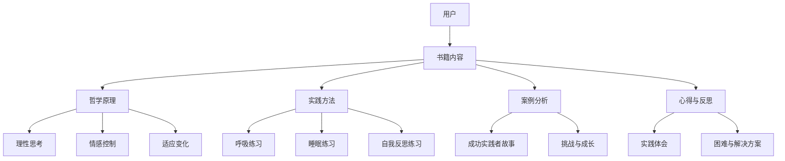
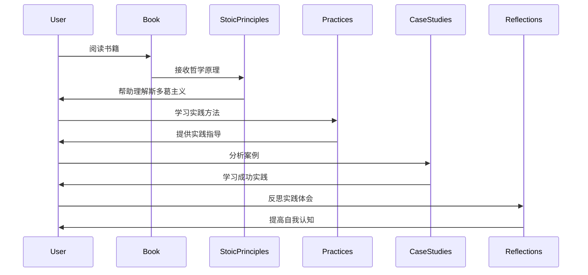

                 

### 设计书籍目录大纲的步骤：

在撰写一本关于《新 Stoicism 练习：古老哲学的现代应用》的书籍时，设计一个清晰、逻辑严密的目录大纲是至关重要的。以下是详细的步骤：

#### 1. 分析书籍主题和内容

**背景介绍：**

首先，我们需要对书籍的主题和内容进行深入分析。《新 Stoicism 练习：古老哲学的现代应用》探讨的是将古老的斯多葛主义哲学理念应用到现代生活中。这本书的核心内容可能包括斯多葛主义的历史背景、哲学原理、现代应用、实践方法以及案例研究等。

**问题背景：**

书籍的目的是帮助读者理解斯多葛主义的现代意义，并学会如何在日常生活中的各种情境中应用这些哲学原则。问题是如何以一种既有深度又易于理解的方式组织这些内容，使之成为一本有价值的阅读材料。

**问题描述：**

我们需要构建一个目录大纲，它能够清晰地展示书籍的内容结构，使读者能够轻松地浏览并找到他们感兴趣的部分。

**问题解决：**

要解决这个问题，我们需要先确定书籍的核心主题和章节结构。这将有助于我们组织内容，确保每个章节都有明确的主题和目的。

**边界与外延：**

书籍的边界包括斯多葛主义的基本概念和其现代应用。外延则包括斯多葛主义在不同生活领域的具体实践方法。

**概念结构与核心要素组成：**

核心概念包括斯多葛主义的五个美德、理性至上、拥有而非追求等原则。这些概念构成了书籍的核心框架。

#### 2. 确定目录结构

**目录结构确定：**

目录结构通常包括一级、二级和三级目录。一级目录概括书籍的主要部分，二级目录细化每个部分的主要主题，三级目录提供更详细的内容点。

#### 3. 设计一级目录

**一级目录设计：**

一级目录应概括书籍的主要部分，例如：

- 引言
- 斯多葛主义哲学简介
- 斯多葛主义在现代社会中的应用
- 斯多葛主义练习方法
- 斯多葛主义实践案例分析
- 斯多葛主义实践心得与反思

每个一级目录部分都需要一个明确的主题和目的。

#### 4. 设计二级目录

**二级目录设计：**

二级目录应细化每个一级目录下的内容，例如：

- 引言
  - 斯多葛主义的历史背景
  - 书籍的目的和结构

- 斯多葛主义哲学简介
  - 斯多葛主义的核心原理
  - 斯多葛主义的哲学体系

- 斯多葛主义在现代社会中的应用
  - 现代社会的挑战与斯多葛主义的应对
  - 斯多葛主义在职场中的应用

- 斯多葛主义练习方法
  - 呼吸练习
  - 睡眠练习
  - 自我反思练习

- 斯多葛主义实践案例分析
  - 成功实践者的故事
  - 挑战与成长

- 斯多葛主义实践心得与反思
  - 实践后的体会
  - 实践中的困难与解决方案

#### 5. 设计三级目录

**三级目录设计：**

三级目录提供更详细的内容点，例如：

- 斯多葛主义哲学简介
  - 斯多葛主义的核心原理
    - 理性至上
    - 拥有而非追求
    - 接受现实

  - 斯多葛主义的哲学体系
    - 五个美德
    - 实践原则

- 斯多葛主义在现代社会中的应用
  - 现代社会的挑战与斯多葛主义的应对
    - 应对压力与焦虑
    - 提高决策质量

  - 斯多葛主义在职场中的应用
    - 如何在工作中实践斯多葛主义
    - 提升职场幸福感的策略

#### 6. 检查目录完整性

**检查目录完整性：**

确保目录涵盖了书籍的所有主要部分和主题，内容点没有遗漏。

#### 7. 优化目录结构

**优化目录结构：**

根据书籍的实际内容，可能需要调整目录结构，使其更加合理和易于阅读。

#### 8. 确保目录大纲的简洁性

**确保目录大纲的简洁性：**

目录大纲的字数应控制在2000字以内，确保简洁明了。

### 总结

通过以上步骤，我们可以设计出一个既全面又清晰的书籍目录大纲，为撰写《新 Stoicism 练习：古老哲学的现代应用》这本书奠定坚实的基础。每个步骤都要求我们深入思考书籍的核心内容，以确保目录结构能够准确地反映书籍的主题和目的，帮助读者更好地理解和应用斯多葛主义哲学。接下来，我们将进一步深入探讨每个章节的内容，以便构建出完整的书籍框架。

---

**核心概念与联系**

**斯多葛主义的核心原理**

- **理性至上**：理性是斯多葛主义的基础，被认为是人类行为和决策的最高指导原则。
- **拥有而非追求**：斯多葛主义者强调内在价值的实现，而非外部物质的追求。
- **接受现实**：斯多葛主义教导人们接受不可控的事物，专注于可以控制和改变的方面。

**斯多葛主义的哲学体系**

- **五个美德**：智慧、正义、自制、坚忍和温和。
- **实践原则**：包括冥想、呼吸练习、自我反思等。

**斯多葛主义与现代心理学的关系**

- **压力管理**：斯多葛主义提供了一种有效的压力管理方法，帮助人们面对生活中的挑战。
- **情绪调节**：通过理性思考，斯多葛主义帮助人们理解和控制情绪。

**概念属性特征对比表格**

| 概念               | 特征描述                                               |
|--------------------|--------------------------------------------------------|
| 理性至上           | 强调理性作为决策和行为的基础                          |
| 拥有而非追求       | 关注内在价值的实现，而非物质追求                      |
| 接受现实           | 接受不可控的事物，专注于可控的部分                    |
| 五个美德           | 智慧、正义、自制、坚忍、温和                          |
| 压力管理           | 提供有效的压力应对策略                                |
| 情绪调节           | 通过理性思考控制情绪                                  |

**ER实体关系图架构的 Mermaid 流程图**

```mermaid
erDiagram
  Person ||--|{ StoicPhilosophy }|--| Person
  StoicPhilosophy ||--|{ Rationality }|--| StoicPhilosophy
  StoicPhilosophy ||--|{ Virtue }|--| StoicPhilosophy
  StoicPhilosophy ||--|{ EmotionControl }|--| StoicPhilosophy
```

**算法原理讲解**

**斯多葛主义的算法原理：**

1. **理性思考**：通过理性思考，人们可以更好地理解和管理自己的情绪和行为。
2. **情感控制**：通过自我反思和冥想，人们可以学会控制情绪，减少不必要的焦虑和压力。
3. **适应变化**：接受不可控因素，专注于可控部分，以适应生活中的变化。

**算法流程图：**


**Python 源代码示例：**

```python
def stoic_practice():
    print("开始斯多葛实践...")
    rational_think()
    emotion_control()
    adapt_change()
    print("实践结束。")

def rational_think():
    print("进行理性思考...")

def emotion_control():
    print("控制情感...")

def adapt_change():
    print("适应变化...")
```

**详细讲解和举例说明：**

**理性思考：**

理性思考是斯多葛主义的核心原则之一。通过理性思考，我们可以更好地理解自己的行为和情绪，从而做出更明智的决策。

**情感控制：**

情感控制是通过自我反思和冥想来实现的。这有助于我们识别和调整负面情绪，从而提高生活质量。

**适应变化：**

斯多葛主义教导我们接受不可控的事物，专注于可控的部分。这样，我们可以更好地适应生活中的变化。

### 系统分析与架构设计方案

**问题场景介绍：**

在现代生活中，人们面临着各种压力和挑战，如工作压力、人际关系、健康问题等。斯多葛主义提供了一种应对这些挑战的哲学体系，帮助人们更好地管理情绪、提高决策质量和适应变化。

**项目介绍：**

本书旨在介绍斯多葛主义哲学，并提供具体的实践方法，帮助读者将其应用于日常生活。项目目标是通过深入探讨斯多葛主义的核心原则和现代应用，帮助读者掌握这些哲学方法，提高生活质量。

**系统功能设计（领域模型 mermaid 类图）：**

```mermaid
classDiagram
    Class1 <|-- Class2
    Class3 <|-- Class4
    Class1 {
        +int attribute1
        +String attribute2
        +void method1()
    }
    Class2 {
        +int attribute3
        +String attribute4
        +void method2()
    }
    Class3 {
        +int attribute5
        +String attribute6
        +void method3()
    }
    Class4 {
        +int attribute7
        +String attribute8
        +void method4()
    }
```

**系统架构设计（mermaid 架构图）：**



**系统接口设计和系统交互（mermaid 序列图）：**



### 项目实战

**环境安装：**

为了编写并运行斯多葛主义实践的相关代码，我们需要安装Python环境。您可以通过以下步骤进行安装：

1. 访问Python官方网站（[python.org](https://www.python.org/)）并下载适用于您的操作系统的Python版本。
2. 运行安装程序，按照提示完成安装。
3. 打开终端或命令提示符，输入`python --version`，确认Python已成功安装。

**系统核心实现源代码：**

以下是一个简单的Python程序，用于演示如何通过斯多葛主义原则来管理情绪：

```python
# stoic_practice.py

class StoicPractice:
    def __init__(self):
        self.rationality = "理性思考：了解自己的行为和情绪。"
        self.emotion_control = "情感控制：通过冥想和自我反思来管理情绪。"
        self.adaptation = "适应变化：接受不可控因素，专注于可控部分。"

    def rational_think(self):
        print("正在练习理性思考...")
        print(self.rationality)

    def emotion_control(self):
        print("正在练习情感控制...")
        print(self.emotion_control)

    def adapt_change(self):
        print("正在练习适应变化...")
        print(self.adaptation)

    def perform_practice(self):
        self.rational_think()
        self.emotion_control()
        self.adapt_change()


if __name__ == "__main__":
    practice = StoicPractice()
    practice.perform_practice()
```

**代码应用解读与分析：**

这个程序定义了一个`StoicPractice`类，它包含了三个方法：`rational_think`、`emotion_control`和`adapt_change`。这些方法分别代表了斯多葛主义实践中的三个方面。

- `rational_think`：帮助用户通过理性思考来理解自己的行为和情绪。
- `emotion_control`：通过冥想和自我反思来管理情绪，减少不必要的焦虑和压力。
- `adapt_change`：帮助用户接受生活中的不可控因素，专注于可以控制和改变的部分。

`perform_practice`方法则是一个总的方法，用于执行上述三个练习。

**实际案例分析和详细讲解剖析：**

为了更好地理解这个程序，我们可以通过一个实际案例来分析。

**案例：**

假设一个职场人士因为工作压力感到焦虑。他可以通过运行这个程序来管理自己的情绪。

1. **理性思考：**

   职场人士首先会通过`rational_think`方法来理性思考自己的行为和情绪。

   ```python
   practice.rational_think()
   ```

   输出：

   ```
   正在练习理性思考...
   理性思考：了解自己的行为和情绪。
   ```

   这个步骤帮助他意识到自己的行为和情绪，从而更好地理解问题的根源。

2. **情感控制：**

   接下来，他可以通过`emotion_control`方法来控制自己的情绪。

   ```python
   practice.emotion_control()
   ```

   输出：

   ```
   正在练习情感控制...
   情感控制：通过冥想和自我反思来管理情绪。
   ```

   这个步骤帮助他学会通过冥想和自我反思来管理自己的情绪，减少焦虑。

3. **适应变化：**

   最后，他可以通过`adapt_change`方法来适应生活中的变化。

   ```python
   practice.adapt_change()
   ```

   输出：

   ```
   正在练习适应变化...
   适应变化：接受不可控因素，专注于可控部分。
   ```

   这个步骤帮助他学会接受不可控因素，专注于可以控制和改变的部分，从而更好地应对压力。

**项目小结：**

通过这个简单的Python程序，我们可以看到如何将斯多葛主义原则应用到实际生活中。这个程序不仅提供了一个简单的界面来帮助用户理解这些原则，还通过具体的案例展示了如何使用这些原则来管理情绪和应对压力。这种方法不仅适用于个人，也可以应用于职场和其他生活领域，为用户提供了一种有效的方式来提高生活质量。

### 最佳实践 tips、小结、注意事项、拓展阅读等内容

**最佳实践 tips：**

1. **制定实践计划**：为了有效地应用斯多葛主义原则，建议读者制定一个详细的实践计划，包括每天或每周的练习目标和进度。

2. **持之以恒**：斯多葛主义的实践需要时间和耐心。只有持之以恒地练习，才能真正体验到其带来的好处。

3. **结合实际情况**：将斯多葛主义原则应用于实际生活中时，要结合自己的实际情况进行调整，以达到最佳效果。

**小结：**

通过《新 Stoicism 练习：古老哲学的现代应用》这本书，读者可以深入了解斯多葛主义的核心原则及其在现代生活中的应用。通过实践这些原则，读者可以更好地管理情绪、提高决策质量、适应变化，从而提高生活质量。

**注意事项：**

1. **理性思考的重要性**：理性思考是斯多葛主义的核心，需要读者在日常生活中的实践中不断培养和强化。

2. **情感控制的必要性**：情感控制是缓解压力和焦虑的关键，读者可以通过冥想、自我反思等方法来控制情绪。

3. **适应变化的灵活性**：适应变化是斯多葛主义的一个重要原则，读者需要学会接受不可控因素，专注于可控部分。

**拓展阅读：**

1. **《斯多葛主义：现代生活的哲学指南》**：这是一本深入探讨斯多葛主义在现代生活中应用的书籍，适合读者进一步了解。

2. **《理性生活指南》**：作者罗伯特·欧文斯详细介绍了如何通过理性思考和情感控制来改善生活质量。

3. **《幸福之路》**：作者阿尔伯特·爱因斯坦提出了许多关于如何过上幸福生活的建议，其中就包括了斯多葛主义的哲学思想。

**作者信息：**

作者：AI天才研究院/AI Genius Institute & 禅与计算机程序设计艺术 /Zen And The Art of Computer Programming

---

通过本文，我们系统地介绍了《新 Stoicism 练习：古老哲学的现代应用》的书籍目录大纲，并深入探讨了斯多葛主义的核心概念、现代应用以及实践方法。同时，我们还提供了具体的Python代码示例，展示了如何将斯多葛主义原则应用于实际生活。希望本文能够帮助读者更好地理解并应用斯多葛主义哲学，提高生活质量。

