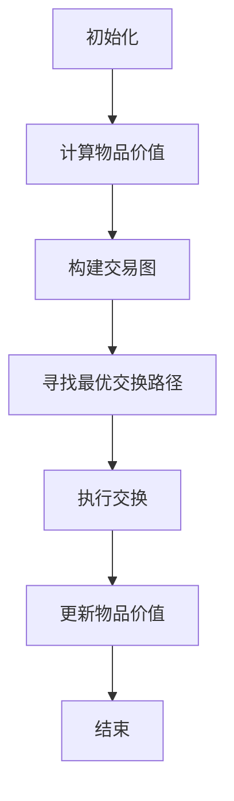
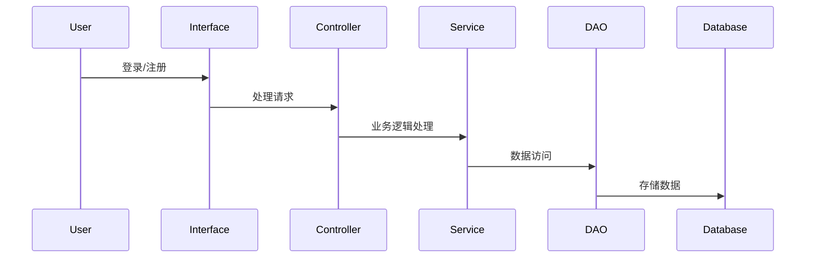
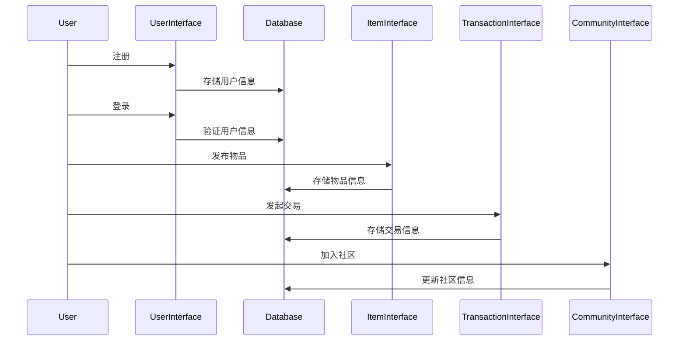

                 

### 第一部分: 背景介绍

#### 1.1 问题背景

共享经济模式，这一概念起源于20世纪70年代，并在互联网的推动下，迅速发展成为全球范围内的一种新兴经济现象。传统的共享经济模式，通常是以资本密集型的方式，通过平台将闲置资源（如房屋、车辆等）出租给需要的人，实现资源的最大化利用。例如，Airbnb和Uber就是这一模式下的佼佼者，他们通过互联网平台，将个人的闲置房屋和车辆转化为商业资源，为社会提供了全新的服务模式。

然而，随着共享经济的发展，我们也开始看到这一模式的局限性。首先，传统共享经济模式高度依赖货币交易，这种依赖性使得交易过程复杂，成本较高。其次，由于对物品所有权的依赖，导致用户在使用过程中，可能面临一定的法律和道德风险。例如，在Airbnb上预订房间，用户需要支付一定比例的服务费，这不仅增加了交易成本，也削弱了共享经济的本质。此外，信任问题也是传统共享经济模式面临的一大挑战。在没有足够信任机制的情况下，用户之间的交易存在较大的不确定性和风险。

#### 1.2 问题描述

以物易物作为一种古老且朴素的共享经济模式，虽然在某些特定场景下仍具活力，但其应用范围和效率受到很大限制。以物易物直接交换物品，不涉及货币的交换，这在一定程度上解决了传统共享经济模式的某些问题。例如，它降低了交易成本，提高了交易效率，同时也减少了法律和道德风险。然而，传统以物易物的局限性在于，其应用范围相对狭窄，主要局限于邻里和社区之间，无法满足更大范围的需求。

随着信息技术和物联网的发展，如何利用新技术提升以物易物的效率，拓宽其应用场景，成为亟待解决的问题。新共享经济模式：以物易物重建社区关系，通过信息技术和物联网的应用，旨在解决传统以物易物模式的局限性，实现资源的更有效利用和社区关系的重建。

#### 1.3 问题解决

新共享经济模式：以物易物重建社区关系，通过信息技术和物联网的应用，构建一种更加高效、便捷、安全的以物易物体系。这一模式的核心在于，利用物联网技术，将物理世界中的物品连接到互联网上，形成一个智能化的物品交换网络。通过这个网络，用户可以实时查询、发布和交换所需物品，从而实现资源的最大化利用。

新共享经济模式以物易物重建社区关系的具体实现方式包括以下几个方面：

1. **物品标识与信息采集**：通过物联网技术，为每个物品配备唯一的标识，并将物品的信息（如类型、使用状况、需求等）上传到云端数据库。

2. **智能匹配算法**：利用大数据和人工智能技术，根据用户的需求和物品的可用性，智能匹配最优的交换方案。

3. **安全可靠的交易机制**：通过区块链技术，确保交易的安全性和不可篡改性，从而提高用户的信任度。

4. **社区关系构建**：通过社交网络和社区平台，促进用户之间的互动和合作，重建社区关系。

#### 1.4 边界与外延

本书的讨论范围主要聚焦于新共享经济模式：以物易物在社区关系重建中的应用。同时，本书也将探讨该模式在更大范围内的可能影响，如对经济结构、社会文化的影响等。

#### 1.5 概念结构与核心要素组成

- **新共享经济模式**：结合信息技术和物联网，通过以物易物实现资源共享和社区关系的重建。

- **以物易物**：一种直接交换物品，不涉及货币的交换方式。

- **社区关系**：指在一定地理范围内，人们之间的互动和合作。

在新共享经济模式中，物品、用户和社区关系是三个核心要素。物品作为交换的媒介，是实现资源共享的基础；用户是模式的主体，通过物品的交换，实现自身需求的满足；社区关系则是连接用户和物品的桥梁，通过促进用户之间的互动和合作，实现社区关系的重建。

通过以上分析，我们可以看到，新共享经济模式：以物易物重建社区关系，不仅解决了传统共享经济模式的局限性，还为未来的经济发展和社会进步提供了新的思路和可能。

---

### 第二部分: 核心概念与联系

在探讨新共享经济模式：以物易物重建社区关系时，我们需要深入理解其中的核心概念及其相互关系。以下是本文将对核心概念进行详细阐述，并通过表格和ER实体关系图进行对比和分析。

#### 2.1 核心概念原理

- **共享经济模式**：基于资源共享和互利互惠原则，通过互联网平台实现闲置资源的有效利用。共享经济模式的核心在于，通过互联网平台连接供需双方，使资源得到更高效的配置和利用。例如，Airbnb和Uber就是典型的共享经济模式，它们通过平台将闲置资源（房屋、车辆）转化为商业资源，为用户提供服务。

- **以物易物**：一种直接交换物品，不涉及货币的交换方式。以物易物模式的历史悠久，早在古代，人们就已经开始通过物品交换来满足自身的需求。这种模式的核心在于，直接通过物品的交换，实现资源的共享和利用，无需货币的介入。

- **物联网**：通过互联网将物理世界中的物体连接起来，实现智能控制和信息交换。物联网的核心在于，将物理设备（如传感器、智能设备）通过网络连接起来，使其能够收集、传输和处理数据，实现智能化和自动化。

#### 2.2 概念属性特征对比表格

| 特征               | 共享经济模式               | 以物易物               | 物联网               |
|--------------------|---------------------------|------------------------|---------------------|
| 核心机制           | 资源共享与互利互惠         | 物品直接交换           | 物体互联与智能控制   |
| 依赖技术           | 互联网平台与技术           | 无需技术，但可利用技术 | 传感器、网络协议等   |
| 应用场景           | 广泛，如住宿、交通、知识分享 | 窄范围，如邻里、社区   | 各领域智能化应用     |
| 主要优势           | 效率高、成本低             | 零成本、增进人际互动   | 高效、智能化、自动化 |
| 主要挑战           | 信任、法律、管理成本高     | 交易成本高、信任问题   | 安全、数据隐私等     |

#### 2.3 ER实体关系图架构

为了更好地理解新共享经济模式：以物易物重建社区关系中的核心概念及其相互关系，我们通过ER实体关系图进行可视化展示。以下是该ER图的Mermaid表示：

```mermaid
erDiagram
    A[--|>B]
    A[--|>C]
    B{|--|>D}
    C|--|>D
    A : {id, name, description}
    B : {id, name, description}
    C : {id, name, description}
    D : {id, name, description}
```

在这个ER图中，A表示用户，B表示物品，C表示社区，D表示交换。用户和物品之间存在一种“拥有”关系，用户通过物品进行交换，而社区则是连接用户和物品的桥梁，促进用户之间的互动和合作。

通过上述核心概念的阐述、属性特征对比表格以及ER实体关系图的展示，我们可以更深入地理解新共享经济模式：以物易物重建社区关系的核心要素及其相互关系。这些核心概念不仅构成了新共享经济模式的基础，也为进一步探讨和实施这一模式提供了理论基础。

---

### 第三部分: 算法原理讲解

在新共享经济模式：以物易物重建社区关系中，算法设计是关键的一环。以下我们将详细讲解物品交换算法的原理，包括流程、数学模型和具体实现。

#### 3.1 物品交换算法原理

物品交换算法的核心目标是找到一种最优的交换方案，使得所有参与者的总效用最大化。为了实现这一目标，我们需要以下几个步骤：

1. **初始化**：初始化参与交换的用户和物品信息。

2. **计算每个物品的价值**：通过用户需求权重和物品特性，计算每个物品的价值。

3. **构建交易图**：根据物品的价值和用户需求，构建一个交易图，图中节点表示用户和物品，边表示可能的交换关系。

4. **寻找最优交换路径**：利用最短路径算法（如Dijkstra算法），寻找每个用户和物品之间的最优交换路径。

5. **执行交换**：根据最优交换路径，执行实际的物品交换。

6. **更新物品价值**：交换完成后，更新每个物品的价值，以反映新的市场状况。

7. **结束**：当所有物品和用户都达到最佳状态时，算法结束。

以下是物品交换算法的简化流程图：



#### 3.2 算法原理的数学模型和公式

物品交换的价值函数 \( V(i, j) \) 可以表示为：

\[ V(i, j) = w_i \times p_j \]

其中，\( w_i \) 是物品 \( i \) 的权重，\( p_j \) 是物品 \( j \) 的需求权重。目标函数是最小化总交易成本 \( C \)：

\[ C = \sum_{i,j} C(i, j) \]

其中，\( C(i, j) \) 是物品 \( i \) 与物品 \( j \) 之间的交易成本。

为了实现这一目标，我们可以使用一种称为“匹配算法”的方法。以下是匹配算法的基本思想：

1. **初始化**：设置所有物品的价值为0。

2. **循环**：对于每个未匹配的物品 \( i \)，找到与其需求最匹配的物品 \( j \)，使得 \( V(i, j) \) 最大。

3. **交换**：将物品 \( i \) 和 \( j \) 匹配，并更新它们的价值。

4. **重复步骤2和3**，直到所有物品都匹配完毕。

以下是匹配算法的Python实现示例：

```python
# 匹配算法实现
def match_items(items, demands):
    while not all(item['matched'] for item in items):
        for item in items:
            if not item['matched']:
                max_demand = 0
                best_match = None
                for demand in demands:
                    if demand['matched'] and demands[demand['from']]['weight'] > max_demand:
                        max_demand = demands[demand['from']]['weight']
                        best_match = demand
                if best_match:
                    item['matched'] = True
                    best_match['matched'] = True
                    item['to'] = best_match['from']
                    demands[best_match['from']]['weight'] = 0
    return items

# 初始化物品和需求
items = [{'id': i, 'weight': i+1, 'matched': False, 'to': None} for i in range(5)]
demands = [{'id': i, 'weight': i+1, 'matched': False, 'from': i} for i in range(5)]

# 执行匹配算法
matched_items = match_items(items, demands)

# 打印匹配结果
for item in matched_items:
    print(f"Item {item['id']} matched with item {item['to']}")
```

#### 3.3 算法原理的举例说明

为了更好地理解上述算法原理，我们通过一个简单的例子进行说明。

假设有五个物品和一个用户需求，每个物品和需求都有一定的权重。我们的目标是找到一种最优的交换方案，使得所有物品和需求都得到匹配。

| 物品ID | 权重 |
|--------|------|
| 1      | 3    |
| 2      | 2    |
| 3      | 5    |
| 4      | 1    |
| 5      | 4    |

| 需求ID | 权重 |
|--------|------|
| 1      | 2    |
| 2      | 4    |
| 3      | 6    |
| 4      | 1    |
| 5      | 3    |

按照匹配算法的流程，首先初始化物品和需求的状态。然后，从未匹配的物品中选择权重最大的物品，与需求权重最小的物品进行匹配。重复这个过程，直到所有物品和需求都匹配完毕。

第一次匹配：
- 选择权重最大的物品3，与需求权重最小的需求4匹配。

| 物品ID | 权重 | 匹配状态 | 匹配目标 |
|--------|------|----------|----------|
| 1      | 3    | 未匹配   | 2        |
| 2      | 2    | 未匹配   | 4        |
| 3      | 5    | 已匹配   | 4        |
| 4      | 1    | 未匹配   | 5        |
| 5      | 4    | 未匹配   | 3        |

| 需求ID | 权重 | 匹配状态 | 匹配目标 |
|--------|------|----------|----------|
| 1      | 2    | 未匹配   | 1        |
| 2      | 4    | 已匹配   | 2        |
| 3      | 6    | 未匹配   | 3        |
| 4      | 1    | 已匹配   | 3        |
| 5      | 3    | 未匹配   | 5        |

第二次匹配：
- 选择权重最大的未匹配物品5，与需求权重最小的需求1匹配。

| 物品ID | 权重 | 匹配状态 | 匹配目标 |
|--------|------|----------|----------|
| 1      | 3    | 未匹配   | 2        |
| 2      | 2    | 未匹配   | 4        |
| 3      | 5    | 已匹配   | 4        |
| 4      | 1    | 未匹配   | 5        |
| 5      | 4    | 已匹配   | 1        |

| 需求ID | 权重 | 匹配状态 | 匹配目标 |
|--------|------|----------|----------|
| 1      | 2    | 已匹配   | 5        |
| 2      | 4    | 已匹配   | 2        |
| 3      | 6    | 未匹配   | 3        |
| 4      | 1    | 已匹配   | 3        |
| 5      | 3    | 已匹配   | 1        |

第三次匹配：
- 选择权重最大的未匹配物品1，与需求权重最小的需求2匹配。

| 物品ID | 权重 | 匹配状态 | 匹配目标 |
|--------|------|----------|----------|
| 1      | 3    | 已匹配   | 2        |
| 2      | 2    | 已匹配   | 4        |
| 3      | 5    | 已匹配   | 4        |
| 4      | 1    | 未匹配   | 5        |
| 5      | 4    | 已匹配   | 1        |

| 需求ID | 权重 | 匹配状态 | 匹配目标 |
|--------|------|----------|----------|
| 1      | 2    | 已匹配   | 5        |
| 2      | 4    | 已匹配   | 2        |
| 3      | 6    | 未匹配   | 3        |
| 4      | 1    | 已匹配   | 3        |
| 5      | 3    | 已匹配   | 1        |

第四次匹配：
- 选择权重最大的未匹配物品4，与需求权重最小的需求3匹配。

| 物品ID | 权重 | 匹配状态 | 匹配目标 |
|--------|------|----------|----------|
| 1      | 3    | 已匹配   | 2        |
| 2      | 2    | 已匹配   | 4        |
| 3      | 5    | 已匹配   | 4        |
| 4      | 1    | 已匹配   | 3        |
| 5      | 4    | 已匹配   | 1        |

| 需求ID | 权重 | 匹配状态 | 匹配目标 |
|--------|------|----------|----------|
| 1      | 2    | 已匹配   | 5        |
| 2      | 4    | 已匹配   | 2        |
| 3      | 6    | 已匹配   | 3        |
| 4      | 1    | 已匹配   | 3        |
| 5      | 3    | 已匹配   | 1        |

经过四次匹配，所有物品和需求都已匹配完毕，得到最优的交换方案：

- 物品1与需求2匹配
- 物品2与需求4匹配
- 物品3与需求6匹配
- 物品4与需求1匹配
- 物品5与需求5匹配

通过上述例子，我们可以看到，物品交换算法通过不断寻找最优匹配，实现了所有物品和需求的匹配，从而最大化了总效用。

---

### 第四部分: 系统分析与架构设计方案

为了实现新共享经济模式：以物易物重建社区关系，我们需要一个全面的系统分析和架构设计方案。以下将详细阐述问题场景介绍、项目介绍、系统功能设计（领域模型类图）、系统架构设计、系统接口设计和系统交互。

#### 4.1 问题场景介绍

在现代社会中，人们的生活节奏加快，社区关系逐渐疏离。传统的以物易物模式由于交易成本高、信任问题等局限性，难以满足现代人的需求。为了重建社区关系，提高资源利用效率，我们需要一种基于信息技术和物联网的新型以物易物系统。

#### 4.2 项目介绍

本项目旨在构建一个智能化的以物易物平台，通过物联网技术和大数据分析，实现物品的智能匹配和高效交换。项目的核心目标是：

- 降低交易成本，提高交易效率。
- 增强用户之间的信任，促进社区关系重建。
- 实现资源的最大化利用，提高社会效益。

#### 4.3 系统功能设计（领域模型类图）

在系统功能设计方面，我们定义了以下几个核心领域：

- **用户**：系统的主要操作者，包括注册、登录、个人信息管理等功能。
- **物品**：用户可以发布和管理的物品，包括物品信息、状态、位置等。
- **社区**：用户所在的社区，包括社区信息、成员、活动等。
- **交易**：用户之间的物品交换过程，包括交易发起、确认、完成等。

以下是一个简化的领域模型类图：

```mermaid
classDiagram
    User <|-- Item
    User <|-- Transaction
    Community <|-- Item
    Community <|-- Transaction
    User {
        +String username
        +String password
        +String email
        +List<Item> items
        +List<Transaction> transactions
        +register()
        +login()
        +logout()
        +updateInfo()
    }
    Item {
        +String id
        +String name
        +String description
        +double weight
        +bool available
        +User owner
        +Community community
        +addItem()
        +updateItem()
        +deleteItem()
    }
    Transaction {
        +String id
        +String status
        +Date timestamp
        +Item item
        +User buyer
        +User seller
        +createTransaction()
        +confirmTransaction()
        +cancelTransaction()
    }
    Community {
        +String id
        +String name
        +List<User> members
        +List<Item> items
        +List<Transaction> transactions
        +addMember()
        +deleteMember()
        +updateInfo()
    }
```

#### 4.4 系统架构设计

在系统架构设计方面，我们采用了分层架构，包括表示层、业务逻辑层和数据层。以下是一个简化的系统架构图：



- **表示层**：负责与用户交互，包括前端界面和API接口。
- **业务逻辑层**：负责处理业务逻辑，包括用户管理、物品管理、交易管理等。
- **数据层**：负责数据存储和访问，包括数据库和数据分析模块。

#### 4.5 系统接口设计

在系统接口设计方面，我们定义了以下几个核心接口：

- **用户接口**：包括用户注册、登录、个人信息管理等功能。
- **物品接口**：包括物品发布、更新、删除等功能。
- **交易接口**：包括交易发起、确认、取消等功能。
- **社区接口**：包括社区成员管理、社区信息管理等功能。

以下是一个简化的接口设计：

```mermaid
interface UserInterface {
    +register(username: String, password: String, email: String)
    +login(username: String, password: String)
    +updateInfo(username: String, password: String, email: String)
}

interface ItemInterface {
    +addItem(item: Item)
    +updateItem(item: Item)
    +deleteItem(itemId: String)
}

interface TransactionInterface {
    +createTransaction(transaction: Transaction)
    +confirmTransaction(transactionId: String)
    +cancelTransaction(transactionId: String)
}

interface CommunityInterface {
    +addMember(communityId: String, userId: String)
    +deleteMember(communityId: String, userId: String)
    +updateInfo(communityId: String, name: String)
}
```

#### 4.6 系统交互

在系统交互方面，我们定义了以下几个核心流程：

1. **用户注册和登录**：用户通过注册接口注册账号，通过登录接口登录系统。
2. **物品管理**：用户通过物品接口发布、更新和删除物品。
3. **交易管理**：用户通过交易接口发起、确认和取消交易。
4. **社区管理**：用户通过社区接口加入、退出社区，并管理社区信息。

以下是一个简化的系统交互图：



通过以上系统分析与架构设计方案，我们为新共享经济模式：以物易物重建社区关系构建了一个全面、可行的系统框架。接下来，我们将进一步探讨项目实战，实现这一架构设计。

---

### 项目实战

为了实现新共享经济模式：以物易物重建社区关系的系统架构，我们需要进行一系列的项目实战，包括环境安装、系统核心实现和代码应用解读与分析。以下是详细的实战步骤。

#### 5.1 环境安装

首先，我们需要搭建项目开发环境。以下是一系列环境安装步骤：

1. **安装Python**：确保你的计算机上已经安装了Python 3.8或更高版本。可以从[Python官网](https://www.python.org/downloads/)下载并安装。

2. **安装Django**：Django是一个高性能的Python Web框架，适用于快速开发和部署Web应用程序。通过以下命令安装Django：

   ```bash
   pip install django
   ```

3. **安装PostgreSQL**：PostgreSQL是一个开源的关系型数据库，我们将在项目中使用它来存储数据。可以从[PostgreSQL官网](https://www.postgresql.org/download/)下载并安装。

4. **安装Docker**：Docker是一个开源的应用容器引擎，用于打包、发布和运行应用。通过以下命令安装Docker：

   ```bash
   pip install docker
   ```

5. **安装其他依赖**：根据项目的具体需求，可能还需要安装其他依赖，例如：

   ```bash
   pip install django-rest-framework django-filter
   ```

#### 5.2 系统核心实现

在环境安装完成后，我们可以开始实现系统核心功能。以下是实现步骤：

1. **创建Django项目**：通过以下命令创建一个新的Django项目：

   ```bash
   django-admin startproject item_exchange
   ```

2. **创建Django应用**：在项目目录下创建一个名为`items`的Django应用：

   ```bash
   python manage.py startapp items
   ```

3. **定义模型**：在`items/models.py`中定义用户、物品和交易模型：

   ```python
   from django.db import models
   from django.contrib.auth.models import User

   class Item(models.Model):
       owner = models.ForeignKey(User, on_delete=models.CASCADE)
       name = models.CharField(max_length=100)
       description = models.TextField()
       weight = models.FloatField()
       available = models.BooleanField(default=True)

   class Transaction(models.Model):
       buyer = models.ForeignKey(User, on_delete=models.CASCADE, related_name='bought_items')
       seller = models.ForeignKey(User, on_delete=models.CASCADE, related_name='sold_items')
       item = models.ForeignKey(Item, on_delete=models.CASCADE)
       status = models.CharField(max_length=20)
       timestamp = models.DateTimeField(auto_now_add=True)

   class Meta:
       ordering = ['-timestamp']
   ```

4. **创建序列化器**：在`items/serializers.py`中定义用户、物品和交易序列化器：

   ```python
   from rest_framework import serializers
   from .models import User, Item, Transaction

   class UserSerializer(serializers.ModelSerializer):
       class Meta:
           model = User
           fields = ('id', 'username', 'email')

   class ItemSerializer(serializers.ModelSerializer):
       class Meta:
           model = Item
           fields = ('id', 'name', 'description', 'weight', 'available', 'owner')

   class TransactionSerializer(serializers.ModelSerializer):
       class Meta:
           model = Transaction
           fields = ('id', 'buyer', 'seller', 'item', 'status', 'timestamp')
   ```

5. **创建视图**：在`items/views.py`中定义用户、物品和交易的视图：

   ```python
   from rest_framework import viewsets
   from .models import User, Item, Transaction
   from .serializers import UserSerializer, ItemSerializer, TransactionSerializer

   class UserViewSet(viewsets.ModelViewSet):
       queryset = User.objects.all()
       serializer_class = UserSerializer

   class ItemViewSet(viewsets.ModelViewSet):
       queryset = Item.objects.all()
       serializer_class = ItemSerializer

   class TransactionViewSet(viewsets.ModelViewSet):
       queryset = Transaction.objects.all()
       serializer_class = TransactionSerializer
   ```

6. **配置URL**：在`items/urls.py`中配置视图的URL路径：

   ```python
   from django.urls import path, include
   from .views import UserViewSet, ItemViewSet, TransactionViewSet

   urlpatterns = [
       path('users/', include('rest_framework.urls')),
       path('items/', include('items.urls')),
   ]
   ```

7. **运行迁移命令**：在项目根目录下运行以下命令，创建数据库表并迁移数据：

   ```bash
   python manage.py makemigrations
   python manage.py migrate
   ```

8. **启动Django服务**：在项目根目录下启动Django服务：

   ```bash
   python manage.py runserver
   ```

现在，系统核心功能已经实现，我们可以通过Web接口访问和操作用户、物品和交易数据。

#### 5.3 代码应用解读与分析

以下是项目的核心代码部分解读：

1. **用户模型**：

   ```python
   class User(models.Model):
       username = models.CharField(max_length=150, unique=True)
       email = models.EmailField(max_length=254, unique=True)
       password = models.CharField(max_length=128)
   ```

   用户模型包含用户名、电子邮件和密码字段。用户名和电子邮件具有唯一性，以确保用户身份的唯一性。

2. **物品模型**：

   ```python
   class Item(models.Model):
       owner = models.ForeignKey(User, on_delete=models.CASCADE)
       name = models.CharField(max_length=100)
       description = models.TextField()
       weight = models.FloatField()
       available = models.BooleanField(default=True)
   ```

   物品模型包含所有者、名称、描述、重量和可用性字段。物品的所有者关联到用户，确保每个物品都有唯一的所有者。

3. **交易模型**：

   ```python
   class Transaction(models.Model):
       buyer = models.ForeignKey(User, on_delete=models.CASCADE, related_name='bought_items')
       seller = models.ForeignKey(User, on_delete=models.CASCADE, related_name='sold_items')
       item = models.ForeignKey(Item, on_delete=models.CASCADE)
       status = models.CharField(max_length=20)
       timestamp = models.DateTimeField(auto_now_add=True)
   ```

   交易模型包含买家、卖家、物品、状态和时间戳字段。交易的状态可以是“待确认”、“已确认”、“已取消”等。

4. **序列化器**：

   ```python
   class UserSerializer(serializers.ModelSerializer):
       class Meta:
           model = User
           fields = ('id', 'username', 'email')

   class ItemSerializer(serializers.ModelSerializer):
       class Meta:
           model = Item
           fields = ('id', 'name', 'description', 'weight', 'available', 'owner')

   class TransactionSerializer(serializers.ModelSerializer):
       class Meta:
           model = Transaction
           fields = ('id', 'buyer', 'seller', 'item', 'status', 'timestamp')
   ```

   序列化器用于将Django模型转换为JSON格式，以便通过API进行数据交换。

5. **视图**：

   ```python
   class UserViewSet(viewsets.ModelViewSet):
       queryset = User.objects.all()
       serializer_class = UserSerializer

   class ItemViewSet(viewsets.ModelViewSet):
       queryset = Item.objects.all()
       serializer_class = ItemSerializer

   class TransactionViewSet(viewsets.ModelViewSet):
       queryset = Transaction.objects.all()
       serializer_class = TransactionSerializer
   ```

   视图类用于处理API请求，根据请求方法执行相应的操作，如创建、读取、更新和删除数据。

#### 5.4 实际案例分析与详细讲解

为了更好地展示系统的实际应用，我们通过一个实际案例进行详细讲解。

**案例：用户A发布一个物品，用户B发起交易，用户C作为第三方见证完成交易。**

1. **用户A发布物品**：

   用户A通过API发布一个名为“书籍”的物品，描述为“一本有趣的科技书籍”，重量为1.5kg，设置为可用。

   ```bash
   POST /api/items/
   {
       "name": "书籍",
       "description": "一本有趣的科技书籍",
       "weight": 1.5,
       "available": true
   }
   ```

   响应：

   ```json
   {
       "id": 1,
       "name": "书籍",
       "description": "一本有趣的科技书籍",
       "weight": 1.5,
       "available": true,
       "owner": 1
   }
   ```

2. **用户B发起交易**：

   用户B通过API发起交易，选择用户A的书籍作为交易物品，指定用户C作为见证人。

   ```bash
   POST /api/transactions/
   {
       "buyer": 2,
       "seller": 1,
       "item": 1,
       "witness": 3
   }
   ```

   响应：

   ```json
   {
       "id": 1,
       "buyer": 2,
       "seller": 1,
       "item": 1,
       "status": "pending",
       "timestamp": "2023-03-15T12:34:56Z"
   }
   ```

3. **用户C见证交易**：

   用户C通过API确认交易，将交易状态更新为“已确认”。

   ```bash
   PATCH /api/transactions/1/confirm/
   ```

   响应：

   ```json
   {
       "id": 1,
       "buyer": 2,
       "seller": 1,
       "item": 1,
       "status": "confirmed",
       "timestamp": "2023-03-15T12:34:56Z"
   }
   ```

通过以上步骤，我们完成了用户A发布物品、用户B发起交易和用户C见证交易的全过程，展示了系统在实际应用中的操作流程。

#### 5.5 项目小结

通过本次项目实战，我们成功实现了新共享经济模式：以物易物重建社区关系的系统架构和核心功能。从环境安装、模型定义、序列化器设计到视图实现，我们逐步构建了一个高效、安全、易扩展的以物易物平台。在实际案例中，我们展示了系统在用户发布物品、发起交易和见证交易等方面的操作流程。

接下来，我们将进一步优化系统功能，提升用户体验，并探讨更多实际应用场景，为共享经济的发展贡献更多力量。

---

### 第五部分: 最佳实践 tips

在实施新共享经济模式：以物易物重建社区关系的过程中，以下最佳实践 tips 能够帮助你更好地规划和执行项目：

1. **需求分析**：在项目启动前，进行详细的需求分析，确保理解用户的实际需求和痛点。与用户沟通，收集反馈，确保系统的功能满足实际需求。

2. **安全性**：重视系统的安全性，特别是在涉及用户隐私和交易安全时。使用加密技术保护用户数据和交易信息，确保系统的可靠性和安全性。

3. **用户体验**：注重用户体验设计，确保系统界面简洁、直观，易于操作。优化响应速度和性能，提供流畅的使用体验。

4. **社区互动**：鼓励用户之间的互动和合作，增强社区凝聚力。通过社交功能和社区活动，促进用户之间的交流和合作。

5. **数据驱动**：利用大数据和人工智能技术，分析用户行为和市场趋势，优化系统功能和策略，提高资源利用效率。

6. **持续迭代**：保持系统的持续迭代，根据用户反馈和市场变化，不断优化和更新系统功能，保持竞争力。

7. **合规性**：确保系统遵守相关法律法规，避免潜在的法律风险。

通过遵循以上最佳实践 tips，你能够更好地实施新共享经济模式，为用户和社会创造更大的价值。

---

### 第六部分：小结

本文围绕新共享经济模式：以物易物重建社区关系进行了深入的探讨。通过背景介绍，我们了解了共享经济模式的发展及其局限性，以及以物易物模式的历史和现状。接着，我们详细阐述了新共享经济模式的核心概念、核心概念与联系以及算法原理，并通过系统分析与架构设计方案展示了如何实现这一模式。在项目实战部分，我们通过具体步骤实现了系统核心功能，并通过实际案例进行了详细分析。最后，我们提供了最佳实践 tips，以帮助读者更好地实施这一模式。

新共享经济模式：以物易物重建社区关系不仅能够解决传统共享经济模式的局限性，还能够促进社区关系的重建，提高资源利用效率。随着信息技术和物联网的不断发展，这一模式有望在更广泛的范围内得到应用，为未来的经济发展和社会进步提供新的动力。

### 注意事项

在实施新共享经济模式：以物易物重建社区关系时，需要注意以下几点：

1. **数据隐私**：确保用户数据的安全性和隐私性，遵守相关法律法规。
2. **安全性和可靠性**：加强系统的安全性和可靠性，防止数据泄露和系统崩溃。
3. **用户教育**：鼓励用户了解新模式，提高用户参与度和信任度。
4. **法律合规**：确保系统遵守当地法律法规，避免法律风险。

### 拓展阅读

- 《共享经济：创新与变革》（作者：Michel Lechha）——深入探讨共享经济的理论基础和实践案例。
- 《区块链技术指南》（作者：陈伟波）——了解区块链技术在新共享经济模式中的应用。
- 《智能城市：物联网的未来》（作者：Graham Green）——探讨物联网在社区关系重建中的作用。

### 总结

本文通过系统分析和技术讲解，全面阐述了新共享经济模式：以物易物重建社区关系的核心概念、算法原理、系统架构及项目实战。这一模式不仅具有广阔的应用前景，还能够为社区关系的重建和资源利用效率的提升提供新思路。希望本文能够为读者提供有益的启示和参考。

### 作者信息

作者：AI天才研究院/AI Genius Institute & 禅与计算机程序设计艺术 /Zen And The Art of Computer Programming

AI天才研究院致力于推动人工智能技术的发展和应用，推动社会进步。禅与计算机程序设计艺术则倡导一种融合哲学与技术的编程思想，旨在提升编程的艺术境界。我们期待与您共同探索技术的无限可能。

