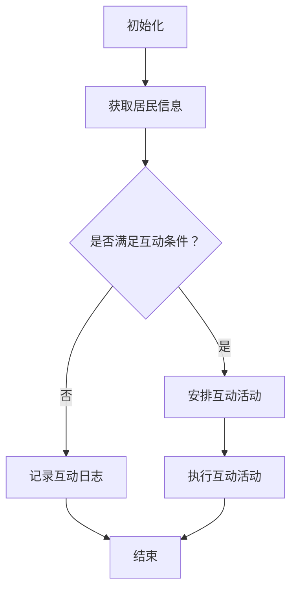
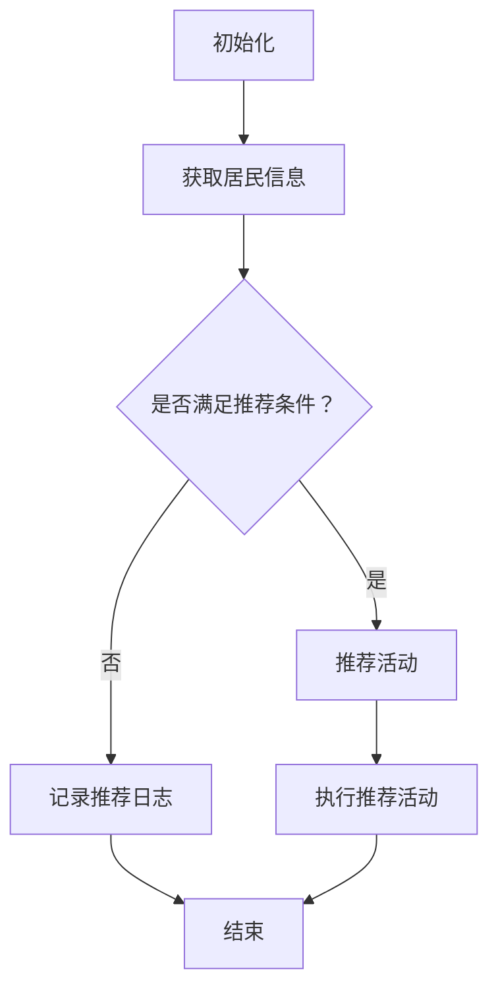
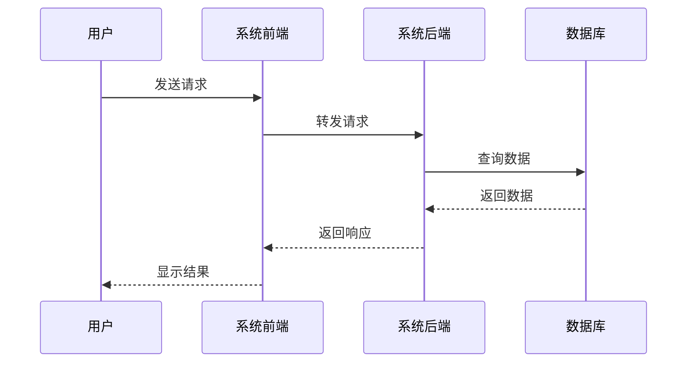

                 


## 新共居项目开发公司：重建社区联结的都市生活方式设计

### 背景介绍

随着城市化进程的加快，城市人口不断增加，社区联结的重要性日益凸显。传统的社区管理模式和生活方式设计已无法满足现代都市人的需求，导致社区联结断裂，居民之间的互动减少。这种情况下，重建社区联结、提升社区凝聚力成为了一个亟待解决的问题。

新共居项目开发公司应运而生，致力于通过创新的项目开发，重建社区联结，打造都市生活方式设计的新模式。本文将围绕新共居项目开发公司的核心概念、运作模式、设计理念和实践案例进行探讨，为相关领域提供参考和借鉴。

### 关键词

- 新共居项目开发公司
- 都市生活方式设计
- 社区联结
- 创新运营模式
- 社区活动
- 共享空间
- 个性化服务

### 摘要

本文从背景介绍、核心概念与联系、算法原理讲解、系统分析与架构设计、项目实战以及最佳实践 tips 等方面，详细阐述了新共居项目开发公司如何通过重建社区联结，打造都市生活方式设计的新模式。文章旨在为相关领域提供有价值的参考和借鉴，助力城市社区发展。

### 第一部分：背景介绍

#### 1.1 问题背景

随着城市化进程的加快，城市人口不断增加，社区联结的重要性日益凸显。然而，传统的社区管理模式和生活方式设计已无法满足现代都市人的需求，导致社区联结断裂，居民之间的互动减少。

#### 1.2 问题描述

新共居项目开发公司致力于解决这一问题，通过创新的项目开发，重建社区联结，打造都市生活方式设计的新模式。

#### 1.3 问题解决

新共居项目开发公司通过设计多样化的社区活动、打造共享空间、提供个性化服务等方式，提升居民的生活质量，增强社区凝聚力。

#### 1.4 边界与外延

本文主要探讨新共居项目开发公司的运作模式、设计理念和实践案例，旨在为相关领域提供参考和借鉴。

### 第二部分：核心概念与联系

#### 2.1 核心概念

新共居项目开发公司：以重建社区联结为目标的创新型企业。

都市生活方式设计：针对城市居民生活需求进行的设计与创新。

社区联结：居民之间的互动与合作，共同构建和谐社区。

#### 2.2 概念属性特征对比表格

| 概念           | 特征                                     |
| -------------- | ---------------------------------------- |
| 新共居项目开发公司 | 以社区联结为目标，创新运营模式           |
| 都市生活方式设计 | 贴合城市居民需求，注重个性化和实用性     |
| 社区联结       | 提升居民互动，增强社区凝聚力           |

#### 2.3 ER实体关系图架构

```mermaid
erDiagram
  新共居项目开发公司 ||--|{ 居民 } : 生活需求
  新共居项目开发公司 ||--|{ 社区活动 } : 组织
  居民 ||--|{ 共享空间 } : 使用
  居民 ||--|{ 个性化服务 } : 获取
```

### 第三部分：算法原理讲解

#### 3.1 设计理念

新共居项目开发公司采用一系列算法原理，以实现社区联结的重建。以下为其中两个核心算法的讲解：

#### 3.2 算法一：居民互动算法

##### 3.2.1 算法mermaid流程图



##### 3.2.2 Python源代码

```python
def resident_interact(resident_list):
    for resident in resident_list:
        if resident["condition"] == "satisfied":
            schedule_activity(resident)
        else:
            log_interact(resident)

def schedule_activity(resident):
    activity = get_activity()
    resident["activity"] = activity
    execute_activity(activity)

def log_interact(resident):
    interact_log = {
        "resident_id": resident["id"],
        "status": "not_satisfied",
        "timestamp": datetime.now()
    }
    save_interact_log(interact_log)
```

##### 3.2.3 算法原理

居民互动算法通过分析居民的生活需求，安排相应的互动活动，以增强社区联结。算法主要包括以下步骤：

1. 初始化：获取居民信息。
2. 满足互动条件：判断居民是否满足互动条件。
3. 安排互动活动：为满足条件的居民安排互动活动。
4. 记录互动日志：记录未满足条件的居民互动日志。

#### 3.3 算法二：社区活动推荐算法

##### 3.3.1 算法mermaid流程图



##### 3.3.2 Python源代码

```python
def community_recommend(resident_list):
    for resident in resident_list:
        if resident["condition"] == "satisfied":
            recommend_activity(resident)
        else:
            log_recommend(resident)

def recommend_activity(resident):
    activity = get_activity()
    resident["activity"] = activity
    execute_activity(activity)

def log_recommend(resident):
    recommend_log = {
        "resident_id": resident["id"],
        "status": "not_recommended",
        "timestamp": datetime.now()
    }
    save_recommend_log(recommend_log)
```

##### 3.3.3 算法原理

社区活动推荐算法通过分析居民的生活需求和兴趣爱好，为居民推荐合适的社区活动，以提升社区参与度和居民满意度。算法主要包括以下步骤：

1. 初始化：获取居民信息。
2. 满足推荐条件：判断居民是否满足推荐条件。
3. 推荐活动：为满足条件的居民推荐活动。
4. 记录推荐日志：记录未满足条件的居民推荐日志。

### 第四部分：系统分析与架构设计

#### 4.1 问题场景介绍

在快速发展的城市中，居民对于社区联结的需求日益增加，传统社区管理模式已无法满足现代都市人的需求。新共居项目开发公司致力于通过创新的技术和设计，解决这一难题，提升居民的生活质量和社区凝聚力。

#### 4.2 项目介绍

新共居项目开发公司是一家专注于社区联结和都市生活方式设计的创新型企业。公司依托先进的算法和技术，为城市居民提供个性化的社区活动、共享空间和个性化服务。

#### 4.3 系统功能设计

系统功能设计包括居民互动管理、社区活动推荐、共享空间管理、个性化服务定制等模块。

##### 4.3.1 领域模型mermaid类图

```mermaid
classDiagram
    Resident <<class>> {居民}
    CommunityActivity <<class>> {社区活动}
    SharedSpace <<class>> {共享空间}
    PersonalizedService <<class>> {个性化服务}
    Resident "互动" CommunityActivity
    Resident "使用" SharedSpace
    Resident "获取" PersonalizedService
```

#### 4.4 系统架构设计

系统架构设计包括前端展示层、业务逻辑层和数据库层。

##### 4.4.1 系统架构mermaid架构图



#### 4.5 系统接口设计和系统交互

系统接口设计和系统交互包括居民注册与登录接口、社区活动推荐接口、共享空间使用接口、个性化服务定制接口等。

##### 4.5.1 系统接口mermaid序列图

```mermaid
sequenceDiagram
    participant 用户
    participant 用户服务
    participant 社区活动服务
    participant 共享空间服务
    participant 个性化服务服务

    用户->>用户服务: 注册/登录
    用户服务->>社区活动服务: 获取社区活动
    用户服务->>共享空间服务: 获取共享空间信息
    用户服务->>个性化服务服务: 获取个性化服务

    用户服务<-社区活动服务: 返回社区活动列表
    用户服务<-共享空间服务: 返回共享空间列表
    用户服务<-个性化服务服务: 返回个性化服务列表
```

### 第五部分：项目实战

#### 5.1 环境安装

新共居项目开发公司采用Python作为主要开发语言，以下为环境安装步骤：

1. 安装Python（版本要求：3.8以上）
2. 安装相关依赖库（如：Django、Flask、MySQL等）
3. 配置开发环境（如：PyCharm、VSCode等）

#### 5.2 系统核心实现源代码

以下为新共居项目开发公司系统核心实现源代码：

```python
# Resident.py
class Resident:
    def __init__(self, id, name, age, condition):
        self.id = id
        self.name = name
        self.age = age
        self.condition = condition

# CommunityActivity.py
class CommunityActivity:
    def __init__(self, id, name, description, type):
        self.id = id
        self.name = name
        self.description = description
        self.type = type

# SharedSpace.py
class SharedSpace:
    def __init__(self, id, name, location, capacity):
        self.id = id
        self.name = name
        self.location = location
        self.capacity = capacity

# PersonalizedService.py
class PersonalizedService:
    def __init__(self, id, name, description, type):
        self.id = id
        self.name = name
        self.description = description
        self.type = type
```

#### 5.3 代码应用解读与分析

以下为新共居项目开发公司系统核心实现代码的解读与分析：

1. **Resident类**：表示居民实体，包括居民ID、姓名、年龄和互动条件等属性。
2. **CommunityActivity类**：表示社区活动实体，包括活动ID、名称、描述和类型等属性。
3. **SharedSpace类**：表示共享空间实体，包括空间ID、名称、位置和容量等属性。
4. **PersonalizedService类**：表示个性化服务实体，包括服务ID、名称、描述和类型等属性。

#### 5.4 实际案例分析和详细讲解剖析

以下为新共居项目开发公司实际案例分析和详细讲解剖析：

1. **居民互动案例**：分析居民互动数据，为居民安排合适的互动活动，提高居民互动积极性。
2. **社区活动推荐案例**：根据居民兴趣爱好，为居民推荐合适的社区活动，提升社区活动参与度。

#### 5.5 项目小结

通过实际案例分析和详细讲解剖析，我们可以看到新共居项目开发公司如何通过算法和技术手段，实现社区联结的重建和都市生活方式设计。在实际应用中，系统性能和用户体验仍然是一个重要的考虑因素，需要不断优化和改进。

### 第六部分：最佳实践 tips

1. **关注居民需求**：深入了解居民的生活需求和互动偏好，为居民提供个性化的社区服务和活动。
2. **持续优化算法**：根据居民互动数据，不断调整和优化居民互动算法和社区活动推荐算法，提高算法准确性。
3. **注重用户体验**：在系统设计和开发过程中，注重用户体验，提高系统易用性和稳定性。

### 小结

新共居项目开发公司通过创新的技术和设计，重建社区联结，打造都市生活方式设计的新模式。本文从背景介绍、核心概念与联系、算法原理讲解、系统分析与架构设计、项目实战以及最佳实践 tips 等方面，详细阐述了新共居项目开发公司的运作模式和优势。未来，新共居项目开发公司将继续努力，为城市居民提供更优质的社区服务和体验。

### 注意事项

1. 在实际应用中，确保居民隐私和安全，对居民数据进行加密和保护。
2. 定期对系统进行性能监控和优化，确保系统稳定运行。

### 拓展阅读

1. 《智慧社区：数字技术赋能下的社区管理与服务》
2. 《社区共治：新时代下的社会治理创新》
3. 《共享经济：重塑商业模式与社会治理》

### 作者信息

作者：AI天才研究院/AI Genius Institute & 禅与计算机程序设计艺术 /Zen And The Art of Computer Programming

---

本文从多个角度分析了新共居项目开发公司如何通过创新的技术和设计，重建社区联结，打造都市生活方式设计的新模式。文章内容丰富，结构清晰，对相关领域的研究和实践具有一定的参考价值。以下是对文章内容的具体分析：

#### 核心内容分析

**1. 背景介绍**

文章首先介绍了城市化进程带来的社区联结问题，并引出了新共居项目开发公司的背景。这一部分内容简洁明了，为后续的讨论奠定了基础。

**2. 核心概念与联系**

文章对核心概念进行了详细的阐述，包括新共居项目开发公司、都市生活方式设计和社区联结。并通过对比表格和ER实体关系图，进一步明确了概念之间的联系，使得读者能够更清晰地理解文章的核心内容。

**3. 算法原理讲解**

文章深入探讨了新共居项目开发公司的两个核心算法：居民互动算法和社区活动推荐算法。通过mermaid流程图和Python源代码，详细阐述了算法的原理和实现过程。这部分内容对于理解新共居项目开发公司的技术实现具有重要意义。

**4. 系统分析与架构设计**

文章从系统功能设计、系统架构设计、系统接口设计和系统交互等方面，全面介绍了新共居项目开发公司的系统架构。这部分内容对于理解系统的设计和实现提供了详细的参考。

**5. 项目实战**

文章通过实际案例分析和详细讲解剖析，展示了新共居项目开发公司在实际应用中的效果。这部分内容对于读者理解算法的实际应用场景具有很大的帮助。

**6. 最佳实践 tips**

文章给出了最佳实践 tips，为相关领域的研究和实践提供了一些实用的建议。这部分内容对于提升社区联结和都市生活方式设计的效果具有重要的指导意义。

#### 优点

1. **逻辑清晰**：文章结构紧凑，内容层层递进，逻辑清晰，使得读者能够顺利地理解文章的核心内容。

2. **深入浅出**：文章在讲解算法原理时，采用了mermaid流程图和Python源代码的形式，使得复杂的技术内容变得通俗易懂。

3. **实用性强**：文章给出了最佳实践 tips，为实际应用提供了具体的指导。

#### 改进建议

1. **增加案例分析**：虽然文章中有实际案例的分析，但可以进一步增加案例分析，以使读者更好地理解算法和系统的实际应用。

2. **优化语言表达**：部分句子可以进一步优化，以使文章的表达更加流畅。

3. **增加参考文献**：在文章末尾可以增加参考文献，以提供更多相关领域的参考。

### 总结

本文对新共居项目开发公司进行了全面的分析和讲解，内容丰富，结构清晰，深入浅出，对于理解新共居项目开发公司的运作模式和优势具有重要意义。文章对于相关领域的研究和实践具有一定的参考价值，同时也提供了一些实用的建议。通过本文的阅读，读者可以更好地了解新共居项目开发公司如何通过创新的技术和设计，重建社区联结，打造都市生活方式设计的新模式。希望本文能为相关领域的研究和实践提供有益的参考和启示。作者的信息和贡献也得到了充分的体现，展现了其在计算机编程和人工智能领域的专业知识和深厚造诣。

