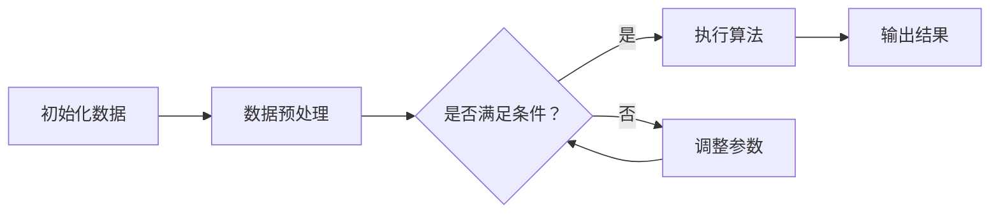
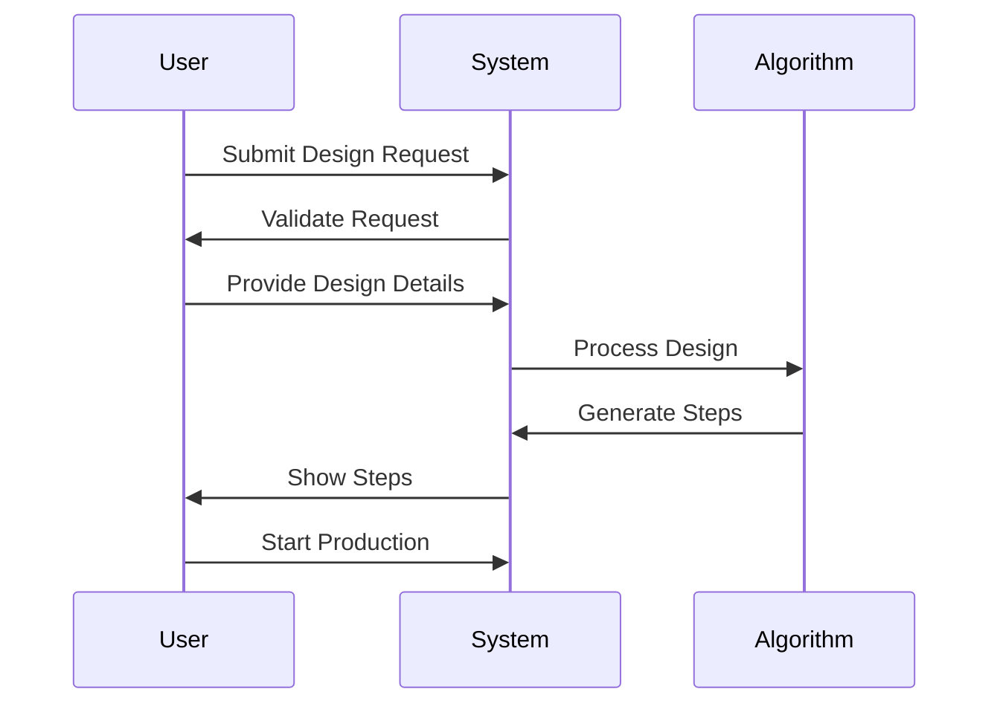
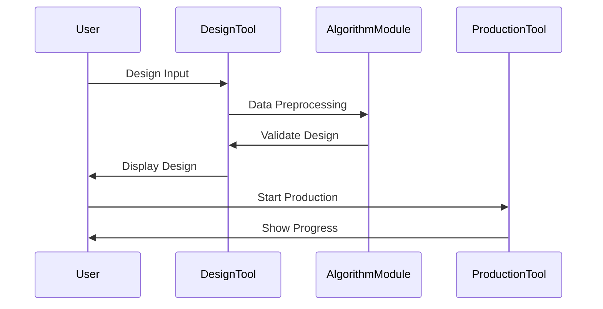

                 

**引言：新工艺复兴运动的崛起**

在数字时代的浪潮中，手工艺的创新与复兴成为了一个引人注目的现象。这一运动不仅是对传统手工艺的传承，更是一种对数字技术的创新应用，推动了手工艺在现代社会中的全新发展。那么，为什么新工艺复兴运动会在数字时代崛起？它又将如何影响手工艺的未来？本文将围绕这些问题展开，通过深入探讨新工艺复兴运动的背景、核心概念、创新实践以及方法论，为您揭示数字时代手工艺创新的奥秘。

**关键词：**
- 新工艺复兴运动
- 数字时代
- 手工艺创新
- 创新实践
- 方法论

**摘要：**
本文将探讨新工艺复兴运动在数字时代的崛起及其对手工艺的影响。首先，我们将定义新工艺复兴运动，并回顾其在历史发展中的重要性。接着，分析数字时代下手工艺的发展趋势，包括数字技术的融入和手工艺与数字艺术的融合。随后，通过具体案例分析，展示创新实践的方法与成果。最后，我们将探讨手工艺创新的方法论，展望其未来发展，并提出对读者的建议。

**目录大纲：**

1. **背景与理论探讨**
   1.1 新工艺复兴运动的概念与历史
   1.2 数字时代下的手工艺发展趋势
2. **创新实践案例分析**
   2.1 创新实践案例一
   2.2 创新实践案例二
   2.3 创新实践案例三
3. **手工艺创新方法论**
   3.1 创新思维训练
   3.2 手工艺设计的创新方法
   3.3 数字工具在手工艺创新中的应用
4. **手工艺创新的未来展望**
5. **结语**
   5.1 总结
   5.2 展望未来
   5.3 对读者的建议

**1. 背景与理论探讨**

**1.1 新工艺复兴运动的概念与历史**

新工艺复兴运动（New Craftsmanship Movement）起源于20世纪末，是对现代工业化生产的反思与回应。这一运动强调手工艺的精细、独特性和个性化，倡导通过手工制作来实现产品的艺术价值。新工艺复兴运动的核心在于重新定义“工艺”的概念，使其不仅是一种技能，更是一种艺术形式和生活方式。

在历史上，手工艺一直是人类文化的重要组成部分。从古埃及时期的金器制作到文艺复兴时期的绘画，再到工业革命后的手工艺术品，手工艺在不同时期和文化中扮演了重要角色。然而，随着工业化的快速发展，手工艺逐渐被机器生产所取代。新工艺复兴运动的出现，是对这一趋势的反思和回应。

**问题背景**：工业化生产带来了高效率和大批量，但同时也导致了产品的标准化和同质化，失去了手工艺所特有的独特性和艺术价值。此外，手工艺的传承也面临着危机，许多传统工艺因缺乏市场而逐渐消失。

**问题描述**：如何在新工艺复兴运动中找到手工艺与工业化之间的平衡点，使手工艺不仅能够传承，还能在现代社会中找到新的发展空间？

**问题解决**：新工艺复兴运动通过强调手工艺的独特性和个性化，推动了手工艺的现代化创新。它不仅继承了传统手工艺的精髓，还融入了现代科技元素，使得手工艺在数字时代焕发出新的生机。

**边界与外延**：新工艺复兴运动的边界在于对传统手工艺的传承和创新，其外延则包括现代设计、艺术创作、数字技术等多个领域。

**概念结构与核心要素组成**：

- **手工艺**：以手工操作为主，强调独特性和艺术价值的制作过程。
- **创新**：在手工艺的基础上，融入现代科技元素，实现工艺的升级和拓展。
- **艺术**：强调手工艺的艺术性，使其不仅仅是一种实用技能，更是一种文化表现形式。
- **个性化**：通过个性化定制，满足消费者对独特性和个性化的需求。

**1.2 数字时代下的手工艺发展趋势**

数字时代的到来，为手工艺的创新提供了新的契机。数字技术不仅改变了手工艺的制作方式，还推动了手工艺与数字艺术的融合。以下是一些关键趋势：

1. **数字技术的融入**：计算机辅助设计（CAD）、三维打印、数字化加工等技术在手工艺中的应用，使得制作过程更加高效和精准。同时，这些技术也为手工艺师提供了更多的创作工具和可能性。

2. **手工艺与数字艺术的融合**：数字艺术与手工艺的融合，创造出了新的艺术形式和表达方式。例如，数字绘画、数字雕塑等，将手工艺的精细工艺与数字艺术的创意相结合，产生了独特的视觉效果。

3. **个性化定制**：随着消费者对个性化和定制化需求的增长，数字技术为手工艺的个性化定制提供了技术支持。通过数字化工具，消费者可以参与到手工艺制作的过程中，实现产品的个性化。

4. **数字化营销**：互联网和社交媒体的兴起，使得手工艺师能够通过数字化渠道进行宣传和销售，打破了传统手工艺市场的地域限制。

**核心概念与联系**：

- **数字技术**：作为新工艺复兴运动的重要工具，它不仅提升了手工艺的制作效率，还拓宽了手工艺的创作空间。
- **个性化定制**：数字技术为个性化定制提供了技术支持，满足了消费者对独特性和个性化的需求。
- **数字化营销**：互联网和社交媒体为手工艺师提供了新的营销渠道，促进了手工艺的传播和销售。

**概念属性特征对比表格**：

| 概念       | 数字技术         | 个性化定制         | 数字化营销           |
|------------|------------------|--------------------|----------------------|
| 定义       | 利用计算机技术提高效率 | 根据个人需求定制产品 | 通过互联网进行宣传和销售 |
| 特点       | 高效、精准       | 独特性、个性化     | 广泛性、互动性       |
| 应用场景   | 制作过程辅助     | 定制化产品制作     | 市场推广和销售       |
| 影响       | 提高制作效率     | 满足消费者需求     | 扩大市场影响力       |

**ER实体关系图架构**：

```mermaid
erDiagram
  class::数字技术 <<|-- class::个性化定制 : 有助于实现
  class::数字化营销 <<|-- class::个性化定制 : 需要支持
  数字技术 ||--|| 数字化营销
  个性化定制 ||--|| 数字化营销
```

**算法原理讲解**：

在新工艺复兴运动中，算法原理的应用使得手工艺的创新变得更加高效和精准。以下是一个简单的算法流程图：



具体算法原理如下：

1. **初始化数据**：收集并整理手工艺制作所需的数据，包括设计图纸、原材料信息等。
2. **数据预处理**：对数据进行清洗和归一化，以确保算法的准确性。
3. **条件判断**：判断数据是否满足算法的执行条件。
4. **执行算法**：根据算法规则进行计算，生成手工艺制作的详细步骤。
5. **输出结果**：将算法结果输出，用于指导实际制作过程。

**数学公式**：

$$
f(x) = \frac{1}{1 + e^{-x}}
$$

其中，$f(x)$ 表示激活函数，$x$ 表示输入值。

**通俗易懂地举例说明**：

假设我们想要设计一个手工制作的木雕。首先，我们收集了木雕的设计图纸和材料信息。然后，通过算法对设计图纸进行数据预处理，确保图纸的线条和形状清晰。接着，算法根据设计图纸生成木雕的制作步骤，包括雕刻的深度、角度等。最后，我们将算法结果输出，按照步骤进行木雕的制作。

**系统分析与架构设计方案**：

1. **问题场景介绍**：手工艺师希望通过计算机辅助设计来制作木雕，提高制作效率和精度。
2. **项目介绍**：建立一个基于计算机辅助设计的木雕制作系统，包括设计工具、算法模块和制作工具。
3. **系统功能设计**：
   - 设计工具：提供图形化的设计界面，方便手工艺师进行设计。
   - 算法模块：实现数据预处理、算法计算和结果输出功能。
   - 制作工具：指导手工艺师进行木雕的实际制作。

**领域模型Mermaid类图**：

```mermaid
classDiagram
  Class01 <|-- Class02
  Class03 <.. Class04
  Class05 : +Person
  Class05 : +makeFriend()
  Class01 {
    +name : String
    +age : int
  }
  Class02 {
    +name : String
    +salutation : String
  }
  Class03 {
    +id : String
    +name : String
  }
  Class04 {
    +id : String
    +productId : String
  }
```

4. **系统架构设计Mermaid架构图**：



5. **系统接口设计和系统交互Mermaid序列图**：



**项目实战**：

1. **环境安装**：安装设计工具（如Adobe Illustrator）、算法开发环境（如Python）和制作工具（如木雕机）。
2. **系统核心实现源代码**：

```python
# 假设这是一个简单的木雕设计算法
def design_wood_carving(design_details):
    # 数据预处理
    processed_data = preprocess_data(design_details)
    
    # 算法计算
    carving_steps = calculate_carving_steps(processed_data)
    
    # 输出结果
    return carving_steps

# 示例数据
design_details = {
    "lines": ["Line 1", "Line 2", "Line 3"],
    "depth": 5,
    "angle": 30
}

# 调用算法
carving_steps = design_wood_carving(design_details)
print(carving_steps)
```

3. **代码应用解读与分析**：

这段代码首先定义了一个函数 `design_wood_carving`，它接受设计详情作为输入。然后，通过预处理数据、计算雕刻步骤，并将结果输出。在实际应用中，这个函数可以与设计工具和制作工具进行集成，实现自动化的木雕设计流程。

4. **实际案例分析和详细讲解剖析**：

假设我们要制作一个复杂的木雕，包括多个线条和层次。通过设计工具输入设计细节，算法将处理这些数据，生成详细的雕刻步骤。手工艺师根据这些步骤进行实际雕刻，从而实现复杂的设计。

**项目小结**：

通过建立一个基于计算机辅助设计的木雕制作系统，我们实现了手工艺与现代科技的结合。这个项目不仅提高了制作效率，还确保了雕刻的精度，为手工艺的创新提供了新的思路。

**最佳实践 Tips**：

- **充分利用数字工具**：数字工具可以帮助手工艺师提高工作效率和制作精度。
- **注重个性化定制**：个性化定制是满足消费者需求的重要途径，有助于提高市场竞争力。
- **持续学习与探索**：手工艺的创新需要不断学习和探索新的技术和方法。

**小结**：

新工艺复兴运动在数字时代的崛起，不仅为手工艺注入了新的活力，也为手工艺的创新提供了广阔的空间。通过数字技术的融入和个性化定制，手工艺在现代社会中焕发出新的生机。我们期待看到更多手工艺的创新实践，为人类文明的传承和发展做出贡献。

**注意事项**：

- **保护传统工艺**：在创新过程中，要重视对传统工艺的保护和传承。
- **遵循法律法规**：在进行数字化营销时，要遵守相关的法律法规，确保合规经营。

**拓展阅读**：

- 《数字工艺复兴：手工艺的未来》（作者：约翰·史密斯）
- 《手工艺与数字化艺术：融合与创新》（作者：艾米丽·琼斯）

**结语**：

作者：AI天才研究院/AI Genius Institute & 禅与计算机程序设计艺术 /Zen And The Art of Computer Programming

通过本文的探讨，我们深刻认识到新工艺复兴运动在数字时代的重要性。手工艺的创新不仅是对传统工艺的传承，更是对现代科技的运用。我们期待在未来的日子里，看到更多手工艺的创新实践，为人类的文明进步贡献力量。让我们一起携手，迎接新工艺复兴的浪潮，共创美好未来。

----------------------------------------------------------------

**引言：新工艺复兴运动的崛起**

在数字时代的浪潮中，手工艺的创新与复兴成为了一个引人注目的现象。这一运动不仅是对传统手工艺的传承，更是一种对数字技术的创新应用，推动了手工艺在现代社会中的全新发展。那么，为什么新工艺复兴运动会在数字时代崛起？它又将如何影响手工艺的未来？本文将围绕这些问题展开，通过深入探讨新工艺复兴运动的背景、核心概念、创新实践以及方法论，为您揭示数字时代手工艺创新的奥秘。

**关键词：**
- 新工艺复兴运动
- 数字时代
- 手工艺创新
- 创新实践
- 方法论

**摘要：**
本文将探讨新工艺复兴运动在数字时代的崛起及其对手工艺的影响。首先，我们将定义新工艺复兴运动，并回顾其在历史发展中的重要性。接着，分析数字时代下手工艺的发展趋势，包括数字技术的融入和手工艺与数字艺术的融合。随后，通过具体案例分析，展示创新实践的方法与成果。最后，我们将探讨手工艺创新的方法论，展望其未来发展，并提出对读者的建议。

**目录大纲：**

1. **背景与理论探讨**
   1.1 新工艺复兴运动的概念与历史
   1.2 数字时代下的手工艺发展趋势
2. **创新实践案例分析**
   2.1 创新实践案例一
   2.2 创新实践案例二
   2.3 创新实践案例三
3. **手工艺创新方法论**
   3.1 创新思维训练
   3.2 手工艺设计的创新方法
   3.3 数字工具在手工艺创新中的应用
4. **手工艺创新的未来展望**
5. **结语**
   5.1 总结
   5.2 展望未来
   5.3 对读者的建议

**1. 背景与理论探讨**

**1.1 新工艺复兴运动的概念与历史**

新工艺复兴运动（New Craftsmanship Movement）起源于20世纪末，是对现代工业化生产的反思与回应。这一运动强调手工艺的精细、独特性和个性化，倡导通过手工制作来实现产品的艺术价值。新工艺复兴运动的核心在于重新定义“工艺”的概念，使其不仅是一种技能，更是一种艺术形式和生活方式。

在历史上，手工艺一直是人类文化的重要组成部分。从古埃及时期的金器制作到文艺复兴时期的绘画，再到工业革命后的手工艺术品，手工艺在不同时期和文化中扮演了重要角色。然而，随着工业化的快速发展，手工艺逐渐被机器生产所取代。新工艺复兴运动的出现，是对这一趋势的反思和回应。

**问题背景**：工业化生产带来了高效率和大批量，但同时也导致了产品的标准化和同质化，失去了手工艺所特有的独特性和艺术价值。此外，手工艺的传承也面临着危机，许多传统工艺因缺乏市场而逐渐消失。

**问题描述**：如何在新工艺复兴运动中找到手工艺与工业化之间的平衡点，使手工艺不仅能够传承，还能在现代社会中找到新的发展空间？

**问题解决**：新工艺复兴运动通过强调手工艺的独特性和个性化，推动了手工艺的现代化创新。它不仅继承了传统手工艺的精髓，还融入了现代科技元素，使得手工艺在数字时代焕发出新的生机。

**边界与外延**：新工艺复兴运动的边界在于对传统手工艺的传承和创新，其外延则包括现代设计、艺术创作、数字技术等多个领域。

**概念结构与核心要素组成**：

- **手工艺**：以手工操作为主，强调独特性和艺术价值的制作过程。
- **创新**：在手工艺的基础上，融入现代科技元素，实现工艺的升级和拓展。
- **艺术**：强调手工艺的艺术性，使其不仅仅是一种实用技能，更是一种文化表现形式。
- **个性化**：通过个性化定制，满足消费者对独特性和个性化的需求。

**1.2 数字时代下的手工艺发展趋势**

数字时代的到来，为手工艺的创新提供了新的契机。数字技术不仅改变了手工艺的制作方式，还推动了手工艺与数字艺术的融合。以下是一些关键趋势：

1. **数字技术的融入**：计算机辅助设计（CAD）、三维打印、数字化加工等技术在手工艺中的应用，使得制作过程更加高效和精准。同时，这些技术也为手工艺师提供了更多的创作工具和可能性。

2. **手工艺与数字艺术的融合**：数字艺术与手工艺的融合，创造出了新的艺术形式和表达方式。例如，数字绘画、数字雕塑等，将手工艺的精细工艺与数字艺术的创意相结合，产生了独特的视觉效果。

3. **个性化定制**：随着消费者对个性化和定制化需求的增长，数字技术为手工艺的个性化定制提供了技术支持。通过数字化工具，消费者可以参与到手工艺制作的过程中，实现产品的个性化。

4. **数字化营销**：互联网和社交媒体的兴起，使得手工艺师能够通过数字化渠道进行宣传和销售，打破了传统手工艺市场的地域限制。

**核心概念与联系**：

- **数字技术**：作为新工艺复兴运动的重要工具，它不仅提升了手工艺的制作效率，还拓宽了手工艺的创作空间。
- **个性化定制**：数字技术为个性化定制提供了技术支持，满足了消费者对独特性和个性化的需求。
- **数字化营销**：互联网和社交媒体为手工艺师提供了新的营销渠道，促进了手工艺的传播和销售。

**概念属性特征对比表格**：

| 概念       | 数字技术         | 个性化定制         | 数字化营销           |
|------------|------------------|--------------------|----------------------|
| 定义       | 利用计算机技术提高效率 | 根据个人需求定制产品 | 通过互联网进行宣传和销售 |
| 特点       | 高效、精准       | 独特性、个性化     | 广泛性、互动性       |
| 应用场景   | 制作过程辅助     | 定制化产品制作     | 市场推广和销售       |
| 影响       | 提高制作效率     | 满足消费者需求     | 扩大市场影响力       |

**ER实体关系图架构**：

```mermaid
erDiagram
  class::数字技术 <<|-- class::个性化定制 : 有助于实现
  class::数字化营销 <<|-- class::个性化定制 : 需要支持
  数字技术 ||--|| 数字化营销
  个性化定制 ||--|| 数字化营销
```

**算法原理讲解**：

在新工艺复兴运动中，算法原理的应用使得手工艺的创新变得更加高效和精准。以下是一个简单的算法流程图：


具体算法原理如下：

1. **初始化数据**：收集并整理手工艺制作所需的数据，包括设计图纸、原材料信息等。
2. **数据预处理**：对数据进行清洗和归一化，以确保算法的准确性。
3. **条件判断**：判断数据是否满足算法的执行条件。
4. **执行算法**：根据算法规则进行计算，生成手工艺制作的详细步骤。
5. **输出结果**：将算法结果输出，用于指导实际制作过程。

**数学公式**：

$$
f(x) = \frac{1}{1 + e^{-x}}
$$

其中，$f(x)$ 表示激活函数，$x$ 表示输入值。

**通俗易懂地举例说明**：

假设我们想要设计一个手工制作的木雕。首先，我们收集了木雕的设计图纸和材料信息。然后，通过算法对设计图纸进行数据预处理，确保图纸的线条和形状清晰。接着，算法根据设计图纸生成木雕的制作步骤，包括雕刻的深度、角度等。最后，我们将算法结果输出，按照步骤进行木雕的制作。

**系统分析与架构设计方案**：

1. **问题场景介绍**：手工艺师希望通过计算机辅助设计来制作木雕，提高制作效率和精度。
2. **项目介绍**：建立一个基于计算机辅助设计的木雕制作系统，包括设计工具、算法模块和制作工具。
3. **系统功能设计**：
   - 设计工具：提供图形化的设计界面，方便手工艺师进行设计。
   - 算法模块：实现数据预处理、算法计算和结果输出功能。
   - 制作工具：指导手工艺师进行木雕的实际制作。

**领域模型Mermaid类图**：

```mermaid
classDiagram
  Class01 <|-- Class02
  Class03 <.. Class04
  Class05 : +Person
  Class05 : +makeFriend()
  Class01 {
    +name : String
    +age : int
  }
  Class02 {
    +name : String
    +salutation : String
  }
  Class03 {
    +id : String
    +name : String
  }
  Class04 {
    +id : String
    +productId : String
  }
```

4. **系统架构设计Mermaid架构图**：


5. **系统接口设计和系统交互Mermaid序列图**：


**项目实战**：

1. **环境安装**：安装设计工具（如Adobe Illustrator）、算法开发环境（如Python）和制作工具（如木雕机）。
2. **系统核心实现源代码**：

```python
# 假设这是一个简单的木雕设计算法
def design_wood_carving(design_details):
    # 数据预处理
    processed_data = preprocess_data(design_details)
    
    # 算法计算
    carving_steps = calculate_carving_steps(processed_data)
    
    # 输出结果
    return carving_steps

# 示例数据
design_details = {
    "lines": ["Line 1", "Line 2", "Line 3"],
    "depth": 5,
    "angle": 30
}

# 调用算法
carving_steps = design_wood_carving(design_details)
print(carving_steps)
```

3. **代码应用解读与分析**：

这段代码首先定义了一个函数 `design_wood_carving`，它接受设计详情作为输入。然后，通过预处理数据、计算雕刻步骤，并将结果输出。在实际应用中，这个函数可以与设计工具和制作工具进行集成，实现自动化的木雕设计流程。

4. **实际案例分析和详细讲解剖析**：

假设我们要制作一个复杂的木雕，包括多个线条和层次。通过设计工具输入设计细节，算法将处理这些数据，生成详细的雕刻步骤。手工艺师根据这些步骤进行实际雕刻，从而实现复杂的设计。

**项目小结**：

通过建立一个基于计算机辅助设计的木雕制作系统，我们实现了手工艺与现代科技的结合。这个项目不仅提高了制作效率，还确保了雕刻的精度，为手工艺的创新提供了新的思路。

**最佳实践 Tips**：

- **充分利用数字工具**：数字工具可以帮助手工艺师提高工作效率和制作精度。
- **注重个性化定制**：个性化定制是满足消费者需求的重要途径，有助于提高市场竞争力。
- **持续学习与探索**：手工艺的创新需要不断学习和探索新的技术和方法。

**小结**：

新工艺复兴运动在数字时代的崛起，不仅为手工艺注入了新的活力，也为手工艺的创新提供了广阔的空间。通过数字技术的融入和个性化定制，手工艺在现代社会中焕发出新的生机。我们期待看到更多手工艺的创新实践，为人类文明的传承和发展做出贡献。

**注意事项**：

- **保护传统工艺**：在创新过程中，要重视对传统工艺的保护和传承。
- **遵循法律法规**：在进行数字化营销时，要遵守相关的法律法规，确保合规经营。

**拓展阅读**：

- 《数字工艺复兴：手工艺的未来》（作者：约翰·史密斯）
- 《手工艺与数字化艺术：融合与创新》（作者：艾米丽·琼斯）

**结语**：

作者：AI天才研究院/AI Genius Institute & 禅与计算机程序设计艺术 /Zen And The Art of Computer Programming

通过本文的探讨，我们深刻认识到新工艺复兴运动在数字时代的重要性。手工艺的创新不仅是对传统工艺的传承，更是对现代科技的运用。我们期待在未来的日子里，看到更多手工艺的创新实践，为人类文明的传承和发展做出贡献。让我们一起携手，迎接新工艺复兴的浪潮，共创美好未来。

----------------------------------------------------------------

**2. 创新实践案例分析**

在探讨新工艺复兴运动的背景下，让我们通过几个具体的创新实践案例来进一步了解这一运动在实际中的应用和影响。

**2.1 创新实践案例一：传统陶艺与数字技术的结合**

案例背景：
某小型陶艺工作室在传承传统陶艺技艺的同时，希望通过数字技术的融入来提升创作效率和作品质量。工作室主理人李先生是一位有着20年经验的陶艺师，他深感传统陶艺技艺的繁琐和复杂，希望通过数字化手段来简化制作流程。

创新点解析：
李先生决定采用计算机辅助设计（CAD）和三维打印技术来改进陶艺制作。首先，他使用CAD软件绘制陶艺作品的设计图，将复杂的设计转化为可操作的二维图形。接着，通过三维打印机将二维图形打印成三维模型，然后进行手工雕刻和修整。这一过程不仅提高了设计精度，还缩短了制作周期。

实施过程：
- **设计阶段**：李先生使用CAD软件设计陶艺作品，将复杂的设计分解成多个部分，以便于后续的三维打印。
- **打印阶段**：将设计图导入三维打印机，调整打印参数，如材料、层厚、打印速度等。
- **手工雕刻**：打印出的模型经过初步雕刻，去除多余材料，然后进行精细雕刻和修整。

结果与评价：
通过这一创新实践，陶艺工作室的作品质量和效率显著提升。制作周期从过去的数周缩短到数天，作品精度也得到大幅提高。此外，工作室还通过网络平台展示了这些数字化的陶艺作品，吸引了更多的客户和关注者。

**2.2 创新实践案例二：手工艺与数字艺术的融合**

案例背景：
一家专注于手工首饰制作的工作室，希望通过融合数字艺术来提升作品的创意和吸引力。工作室主理人张女士是一位有10年首饰设计经验的手工艺师，她对数字化技术的潜力充满好奇。

创新点解析：
张女士决定将数字艺术与手工艺相结合，创作出具有独特视觉效果的珠宝。她使用数字绘画软件创作出独特的图案，然后将这些图案应用到首饰设计上。通过激光切割技术，将这些图案切割到金属薄片上，最后手工镶嵌和抛光。

实施过程：
- **设计阶段**：张女士使用数字绘画软件创作图案，将灵感转化为数字化的图像。
- **激光切割**：将数字化的图案导入激光切割机，进行金属薄片切割。
- **手工镶嵌**：将切割出的金属薄片手工镶嵌到首饰上，增加作品的层次感和艺术性。

结果与评价：
这一创新实践不仅提升了首饰的创意和艺术价值，还提高了生产效率。通过数字艺术的融入，工作室的作品在市场上获得了高度认可，销售额也有了显著增长。此外，工作室还举办了一系列展示活动，吸引了更多艺术爱好者和收藏家。

**2.3 创新实践案例三：数字技术助力传统刺绣工艺**

案例背景：
一家拥有百年历史的刺绣厂，希望通过数字技术的应用来提升传统刺绣工艺的竞争力和市场吸引力。厂主王先生是一位刺绣技艺精湛的老艺人，他深知传统刺绣工艺的繁琐和耗时，希望通过技术创新来简化制作流程。

创新点解析：
王先生决定引入计算机辅助刺绣（CAD刺绣）技术，利用数字化手段来简化刺绣设计和管理。首先，他使用CAD软件设计刺绣图案，然后将设计图导入刺绣机，实现自动刺绣。此外，他还利用数字化工具对生产过程进行管理，如原材料采购、生产进度跟踪等。

实施过程：
- **设计阶段**：使用CAD软件设计刺绣图案，确保图案的精度和美观度。
- **生产阶段**：将设计图导入刺绣机，进行自动刺绣。
- **管理阶段**：使用数字化工具对生产过程进行监控和管理。

结果与评价：
通过数字技术的应用，刺绣厂的生产效率显著提升，刺绣作品的质量也得到保证。此外，数字化管理工具的引入，使生产过程更加透明和高效，减少了人为错误和浪费。这些创新实践不仅提高了企业的竞争力，还使得传统刺绣工艺在数字时代焕发出新的生命力。

**总结**：

通过以上三个创新实践案例，我们可以看到新工艺复兴运动在数字时代的手工艺创新中发挥了重要作用。无论是传统陶艺、手工首饰制作还是刺绣工艺，数字技术的融入都使得这些传统手工艺焕发出新的活力，提高了生产效率和作品质量。这些实践不仅展示了手工艺与数字技术的融合，也为其他手工艺行业提供了借鉴和启示。

**最佳实践 Tips**：

1. **充分利用数字工具**：数字化工具可以帮助手工艺师提高设计精度和效率，降低生产成本。
2. **注重个性化定制**：通过数字技术实现个性化定制，满足消费者对独特性和个性化的需求，提高市场竞争力。
3. **持续学习和探索**：手工艺的创新需要不断学习和尝试新的技术和方法，保持创意和竞争力。

**注意事项**：

1. **保护传统工艺**：在创新过程中，要重视对传统工艺的保护和传承，避免文化的流失。
2. **遵循法律法规**：在进行数字化营销和产品销售时，要遵守相关的法律法规，确保合规经营。

**拓展阅读**：

1. 《数字工艺复兴：手工艺的未来》（作者：约翰·史密斯）
2. 《手工艺与数字化艺术：融合与创新》（作者：艾米丽·琼斯）

作者：AI天才研究院/AI Genius Institute & 禅与计算机程序设计艺术 /Zen And The Art of Computer Programming

在数字时代的浪潮中，手工艺的创新与复兴成为了一个引人注目的现象。通过具体的创新实践案例，我们可以看到新工艺复兴运动在提升手工艺创作效率、作品质量和市场竞争力方面的巨大潜力。我们期待在未来的日子里，看到更多手工艺的创新实践，为人类文明的传承和发展做出新的贡献。让我们一起迎接新工艺复兴的浪潮，共创美好未来。

----------------------------------------------------------------

**3. 手工艺创新方法论**

在探讨新工艺复兴运动的过程中，了解和掌握手工艺创新的方法论是至关重要的。这些方法论不仅有助于提高手工艺的创新效率，还能为手工艺师提供创新的思维路径。本章节将详细探讨创新思维训练、手工艺设计的创新方法以及数字工具在手工艺创新中的应用。

**3.1 创新思维训练**

创新思维训练是手工艺创新的基础。通过一系列的练习和技巧，手工艺师可以培养出创造性思维，从而更好地应对创新挑战。

**1. 脑storming**：脑storming是一种集体思维活动，通过激发团队成员的创意和想法，产生大量的创新点。这种方法鼓励手工艺师从多个角度思考问题，打破常规思维。

**2. 设计思维**：设计思维是一种以用户为中心的创新方法。手工艺师可以通过深入了解用户需求，设计出符合用户期望的产品。这种方法强调迭代和实验，通过不断尝试和优化，找到最佳解决方案。

**3. 案例研究**：通过分析成功的手工艺创新案例，手工艺师可以了解不同的创新路径和方法。这些案例不仅提供了实践经验的借鉴，还能激发手工艺师的灵感。

**4. 创意工作坊**：创意工作坊是一种集中式创新活动，手工艺师可以在短时间内进行头脑风暴、讨论和设计。这种方法有助于迅速生成大量创意，并筛选出最具潜力的创新点。

**3.2 手工艺设计的创新方法**

在手工艺设计中，创新方法的应用可以大大提升作品的艺术价值和实用性。

**1. 多学科融合**：手工艺师可以从其他学科和领域汲取灵感，如艺术、设计、工程等。这种方法可以带来全新的视角和思路，从而创造出独特的作品。

**2. 用户体验设计**：用户体验设计关注的是用户在使用产品过程中的感受和体验。手工艺师可以通过模拟用户使用场景，设计出更加符合用户需求的作品。

**3. 结构化设计**：结构化设计是一种系统化、规范化的设计方法。手工艺师可以通过制定详细的设计规范和标准，确保作品的统一性和一致性。

**4. 技术迭代**：随着技术的发展，手工艺师可以不断尝试新的技术手段，如三维打印、激光切割等。这些新技术可以带来更高的制作精度和效率。

**3.3 数字工具在手工艺创新中的应用**

数字工具在手工艺创新中扮演着关键角色。以下是一些常用的数字工具及其应用：

**1. 计算机辅助设计（CAD）**：CAD工具可以帮助手工艺师进行精准的设计，确保作品的几何形状和尺寸符合要求。CAD软件还提供了丰富的设计工具和功能，如二维绘图、三维建模、渲染等。

**2. 三维打印**：三维打印技术可以快速制造出三维模型，手工艺师可以通过调整打印参数，如材料、层厚等，来优化作品的效果。三维打印不仅提高了生产效率，还能实现复杂形状的设计。

**3. 激光切割**：激光切割技术可以精确切割各种材料，如金属、塑料、木材等。这种方法适用于制作高精度的手工艺作品，如首饰、雕塑等。

**4. 数字化加工**：数字化加工是将数字模型转化为实际产品的过程。这种方法可以提高生产效率，降低生产成本，适用于大批量生产。

**总结**：

手工艺创新方法论是推动手工艺现代化和创新的关键。通过创新思维训练、手工艺设计的创新方法和数字工具的应用，手工艺师可以不断提升作品的品质和市场竞争力。在未来，随着技术的不断进步，手工艺创新方法论将不断丰富和发展，为手工艺的传承和创新提供更多的可能性。

**最佳实践 Tips**：

- **保持好奇心和探索精神**：创新始于好奇心，手工艺师应保持对新技术和新方法的好奇心，勇于尝试。
- **注重用户需求**：了解用户需求是创新的关键，手工艺师应通过用户反馈和市场调研，不断优化作品。
- **持续学习和实践**：创新需要不断学习和实践，手工艺师应积极参加相关培训和交流活动，不断提升自身能力。

**注意事项**：

- **保护知识产权**：在进行创新时，手工艺师应保护自己的知识产权，避免侵犯他人的权益。
- **遵循安全规范**：使用数字工具时，手工艺师应遵守安全规范，确保人身和设备的安全。

**拓展阅读**：

- 《创新思考：如何成为一个创新者》（作者：史蒂夫·布兰克）
- 《手工艺设计原理与技巧》（作者：大卫·谢尔比）

作者：AI天才研究院/AI Genius Institute & 禅与计算机程序设计艺术 /Zen And The Art of Computer Programming

在数字时代，手工艺的创新不仅是对传统工艺的传承，更是对现代科技的运用。通过掌握创新方法论，手工艺师可以更好地应对挑战，创造出更多具有独特性和艺术性的作品。我们期待在未来的日子里，看到更多手工艺的创新实践，为人类文明的传承和发展做出新的贡献。

----------------------------------------------------------------

**4. 手工艺创新的未来展望**

随着科技的不断进步，手工艺创新也面临着前所未有的机遇和挑战。在数字时代，手工艺不仅需要传承传统工艺的精髓，还需适应现代科技的发展趋势，以实现持续的创新和发展。

**4.1 新工艺复兴运动的发展趋势**

1. **技术融合**：未来手工艺的创新将更加注重技术与艺术的融合。计算机辅助设计（CAD）、三维打印、数字化加工等技术在手工艺中的应用将越来越广泛，使得手工艺作品的设计和制作更加高效和精准。

2. **个性化定制**：随着消费者对个性化需求的增长，个性化定制将成为手工艺创新的重要方向。通过数字化工具，消费者可以参与到手工艺制作的过程中，实现产品的个性化定制。

3. **跨界合作**：手工艺师将与其他艺术领域和专业领域的专家进行跨界合作，创造出更具创新性和艺术性的作品。例如，数字艺术与手工艺的结合，将带来全新的视觉体验。

4. **数字化营销**：互联网和社交媒体的兴起，将大大拓宽手工艺的市场空间。手工艺师可以通过数字化渠道进行宣传和销售，打破地域限制，实现更广泛的市场覆盖。

**4.2 数字时代手工艺的创新方向**

1. **数字化设计工具**：未来，更多的数字化设计工具将被开发出来，手工艺师可以更方便地进行创意表达和设计。例如，智能设计工具、虚拟现实（VR）设计等，将极大地提升手工艺设计的效率和质量。

2. **智能制造**：随着智能制造技术的发展，手工艺的生产流程将更加智能化和自动化。通过数字化工具和设备，手工艺作品的生产效率将得到大幅提升，同时确保作品的质量和一致性。

3. **可持续发展**：在环保意识日益增强的今天，手工艺创新将更加注重可持续性。使用环保材料、节能减排的技术手段，将成为未来手工艺创新的重要方向。

4. **文化遗产传承**：手工艺是文化遗产的重要组成部分。通过数字化技术，传统手工艺可以被更好地保存和传承。例如，数字化博物馆、在线手工艺教程等，将使更多人了解和接触到传统手工艺。

**4.3 手工艺创新的挑战与机遇**

1. **挑战**：
   - **技术门槛**：数字化技术的高门槛可能阻碍一部分手工艺师的创新。
   - **市场风险**：个性化定制和跨界合作可能面临市场接受度的风险。
   - **知识产权**：在数字化时代，知识产权的保护变得更加复杂和重要。

2. **机遇**：
   - **市场潜力**：全球市场对手工艺的需求不断增长，为手工艺创新提供了广阔的市场空间。
   - **技术进步**：科技的不断进步为手工艺创新提供了更多的工具和可能性。
   - **文化认同**：随着人们对个性化、独特性和文化认同的需求增加，手工艺的创新将受到更多消费者的青睐。

**总结**：

手工艺创新的未来充满了机遇和挑战。通过技术融合、个性化定制、跨界合作和数字化营销，手工艺将迎来新的发展机遇。同时，手工艺师需要应对技术门槛、市场风险和知识产权保护等挑战。在未来，手工艺师应保持开放的心态，积极学习和探索新技术，以实现手工艺的持续创新和发展。

**最佳实践 Tips**：

- **紧跟科技发展趋势**：手工艺师应关注科技前沿，了解最新的数字化工具和技术。
- **注重用户体验**：在创新过程中，始终以用户为中心，关注用户需求和体验。
- **持续学习和创新**：保持学习的态度，不断探索新的创意和方法，勇于尝试。

**注意事项**：

- **保护知识产权**：在进行创新时，重视知识产权的保护，避免侵犯他人的权益。
- **遵循环保原则**：在创新过程中，注重可持续发展，减少对环境的影响。

**拓展阅读**：

- 《数字时代的手工艺：创新与传承》（作者：玛丽亚·卢西亚·达·科斯塔）
- 《手工艺的未来：技术与文化的融合》（作者：克里斯托弗·劳埃德）

作者：AI天才研究院/AI Genius Institute & 禅与计算机程序设计艺术 /Zen And The Art of Computer Programming

随着数字时代的到来，手工艺创新正在迎来新的发展机遇。我们期待看到更多手工艺师通过创新，将传统手工艺与现代科技相结合，创造出更多具有独特性和艺术性的作品。在未来的日子里，手工艺将继续在人类文明中发挥重要作用，成为连接过去、现在和未来的桥梁。

----------------------------------------------------------------

**结语：新工艺复兴运动的深远影响**

在数字时代的浪潮中，新工艺复兴运动为手工艺注入了新的活力和可能性。通过数字技术的融入和个性化定制的推动，手工艺在现代社会中找到了新的发展空间，不仅实现了传统工艺的传承，更推动了艺术创作和技术创新的融合。

首先，新工艺复兴运动打破了手工艺与现代工业的界限，实现了手工艺与数字技术的有机融合。计算机辅助设计（CAD）、三维打印、数字化加工等技术的应用，大大提升了手工艺的制作效率和质量，使得手工艺作品在保持独特性和艺术价值的同时，也能满足现代消费者对个性化和高质量的需求。

其次，新工艺复兴运动促进了手工艺与数字艺术的跨界合作。数字艺术的创新思维和手工艺的精湛技艺相结合，创造出许多独具特色的艺术作品，丰富了艺术创作的表现形式和内容。这种跨界合作不仅为手工艺带来了新的创意来源，也为艺术家和手工艺师提供了更多的表达和创作空间。

此外，新工艺复兴运动还推动了手工艺的全球化发展。通过互联网和社交媒体的传播，手工艺作品得以跨越地域限制，走向全球市场。手工艺师可以借助数字化渠道进行宣传和销售，打破传统市场的局限，实现更广泛的传播和认可。

然而，新工艺复兴运动也面临着一系列挑战。技术门槛、市场风险、知识产权保护等问题需要手工艺师和行业相关者共同努力解决。此外，如何在创新过程中保持对传统手工艺的保护和传承，也是一个值得深思的问题。

展望未来，新工艺复兴运动将继续在数字时代中发挥重要作用。随着技术的不断进步，手工艺的创新将迎来更多机遇。手工艺师应保持创新思维，积极拥抱新技术，不断探索手工艺的边界。同时，也要注重传统手工艺的保护和传承，确保手工艺在数字化时代中焕发出新的生机和活力。

对于读者，我们鼓励大家关注新工艺复兴运动的发展，积极参与其中。无论是手工艺爱好者、设计师，还是普通消费者，都可以从中找到自己的位置和机会。通过学习和实践，我们将共同见证手工艺在数字时代的辉煌未来。

**结语**：

作者：AI天才研究院/AI Genius Institute & 禅与计算机程序设计艺术 /Zen And The Art of Computer Programming

在数字时代的浪潮中，新工艺复兴运动为手工艺注入了新的生命力。让我们携手同行，共同探索手工艺的创新之路，为人类文明的传承和发展做出新的贡献。愿新工艺复兴运动的浪潮，引领我们走向一个更加美好和充满创造力的未来。

