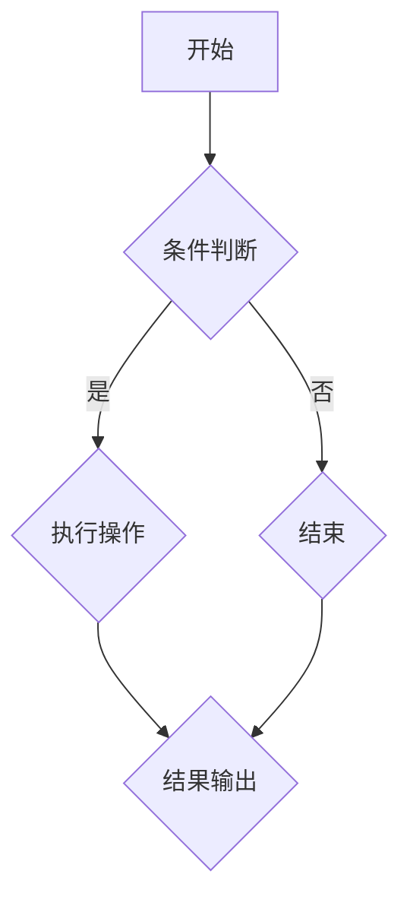
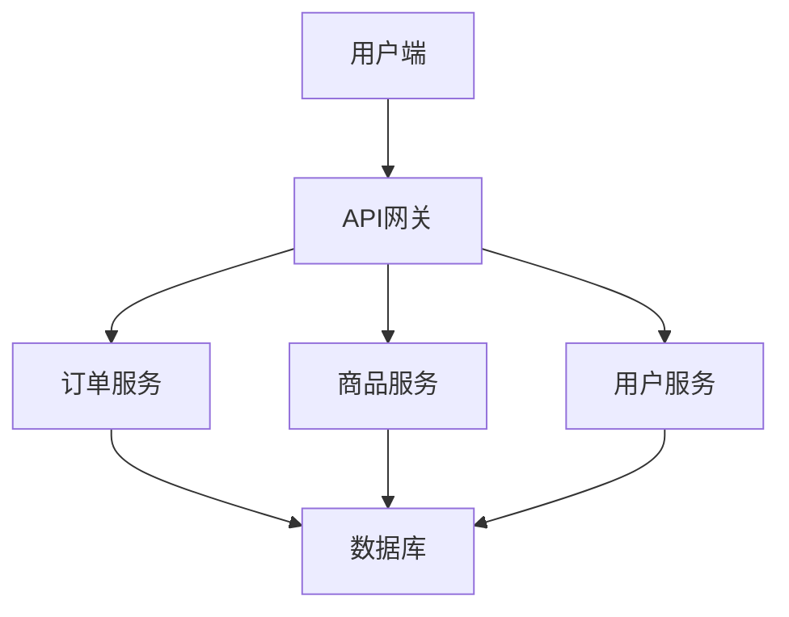
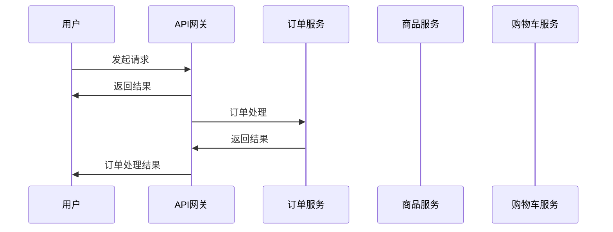

                 


## 新文艺复兴人培养计划：全方位发展课程

### 文章关键词
- 新文艺复兴
- 全方位发展
- 综合素养
- 创新能力
- 课程设计
- 教育改革

### 摘要
本文将深入探讨新文艺复兴人培养计划，这一计划旨在通过全方位发展课程，培养具备综合素质、创新能力和国际视野的现代化人才。文章首先介绍了新文艺复兴的背景与意义，然后详细分析了培养计划的核心概念、框架与内容，接着探讨了课程实施与评估策略，最后展望了新文艺复兴人的未来职业发展。通过这一系列探讨，本文旨在为教育改革提供有益的参考和启示。

### 文章正文

#### 第一部分：新文艺复兴人培养计划概述

##### 1.1 新文艺复兴的背景与意义

**1.1.1 新文艺复兴的概念**

新文艺复兴（New Renaissance）是指在全球化和科技迅猛发展的背景下，人类文明再次经历的一场深刻变革。这一变革不仅体现在科技领域，更涉及文化、教育、经济和社会等多个方面。

**1.1.2 新文艺复兴的时代背景**

新文艺复兴的兴起源于以下几个方面：

1. **全球化**：全球化加速了各国之间的交流与融合，推动了不同文化的碰撞与融合。
2. **科技进步**：信息技术、生物工程、人工智能等领域的突破性进展，为人类生活带来了翻天覆地的变化。
3. **社会变革**：随着社会结构的变迁，人们对教育和职业发展有了新的需求。

**1.1.3 新文艺复兴的目标与意义**

新文艺复兴的目标是培养具备综合素质、创新能力和国际视野的现代人。其意义在于：

1. **促进人类全面发展**：新文艺复兴人不仅具备专业素养，还具备人文素养、艺术素养和科技素养。
2. **推动社会进步**：新文艺复兴人能够引领科技、文化、经济等领域的创新发展。
3. **实现全球化共赢**：新文艺复兴人具备跨文化交流和国际合作的能力，能够为全球治理和可持续发展贡献力量。

##### 1.2 培养计划的核心概念

**1.2.1 全方位发展**

全方位发展是指培养计划涵盖多个维度，包括身体素质、心理健康、学科知识、创新能力、社交与领导力、艺术与人文素养等。

**1.2.2 综合素养培养**

综合素养培养旨在培养具备跨学科知识和实践能力的人才。这要求学生不仅要有扎实的专业知识，还要有广泛的人文素养和科技素养。

**1.2.3 创新能力提升**

创新能力提升是培养计划的核心理念之一。通过创新思维训练、创新项目实践，培养学生的创新意识和创新能力。

##### 1.3 培养计划的框架与内容

**1.3.1 主体框架**

培养计划主体框架分为四个模块：学科知识、创新能力、综合素质和社会实践。

**1.3.2 核心课程设置**

核心课程设置包括基础学科课程、创新思维课程、综合素质课程和社会实践课程。

**1.3.3 实践与体验环节**

实践与体验环节包括创新项目实践、跨文化交流、社会调研等，旨在培养学生的实践能力和综合素质。

##### 1.4 培养计划的特点与优势

**1.4.1 全人教育**

全人教育旨在培养学生的全面发展，不仅仅是专业技能，还包括人文素养、艺术素养和科技素养。

**1.4.2 跨学科融合**

跨学科融合是培养计划的核心理念之一，通过跨学科的课程设置和项目实践，培养学生的跨学科思维和创新能力。

**1.4.3 国际化视野**

国际化视野是培养计划的重要目标之一，通过国际交流、跨文化学习，培养学生的全球化思维和跨文化交流能力。

##### 1.5 培养计划的应用领域

**1.5.1 教育领域**

培养计划可以在高等教育、职业教育和基础教育等领域广泛应用，推动教育改革和人才培养模式的创新。

**1.5.2 创业与创新领域**

培养计划可以为学生提供创新创业的平台和资源，培养具备创新能力和创业精神的人才。

**1.5.3 社会服务领域**

培养计划可以为学生提供参与社会服务的渠道和机会，培养他们的社会责任感和公民意识。

##### 1.6 本章小结

本部分介绍了新文艺复兴人培养计划的背景、核心概念、框架与内容、特点与优势以及应用领域。下一部分将详细分析全方位发展课程的设计与实施。

#### 第二部分：全方位发展课程设计

##### 2.1 身心健康课程

**2.1.1 身体素质提升**

身体素质提升课程包括体育活动、健身训练、体能训练等，旨在增强学生的身体素质和健康水平。

**2.1.2 心理素质培养**

心理素质培养课程包括心理辅导、情绪管理、压力应对等，旨在提高学生的心理健康水平。

**2.1.3 健康生活方式**

健康生活方式课程包括健康饮食、作息规律、生活习惯等，旨在培养学生良好的生活习惯和健康的生活方式。

##### 2.2 学科知识课程

**2.2.1 基础学科学习**

基础学科学习课程包括数学、物理、化学、生物等，旨在为学生打下扎实的学科基础。

**2.2.2 交叉学科探索**

交叉学科探索课程包括计算机科学、经济学、心理学、社会学等，旨在培养学生的跨学科思维和综合素养。

**2.2.3 先沿科技了解**

先沿科技了解课程包括人工智能、大数据、区块链、生物工程等，旨在让学生了解科技前沿动态和发展趋势。

##### 2.3 创新思维课程

**2.3.1 创新思维方法**

创新思维方法课程包括头脑风暴、思维导图、问题解决技巧等，旨在培养学生的创新思维和问题解决能力。

**2.3.2 创新项目实践**

创新项目实践课程包括创新竞赛、科研项目、创业实践等，旨在让学生在实践中培养创新能力。

**2.3.3 创新成果展示**

创新成果展示课程包括创新成果汇报、创新展示会等，旨在让学生展示创新成果，提升自信心和成就感。

##### 2.4 社交与领导力课程

**2.4.1 人际交往技巧**

人际交往技巧课程包括沟通技巧、团队协作、人际关系处理等，旨在提高学生的社交能力和团队合作能力。

**2.4.2 领导力培养**

领导力培养课程包括领导力理论、领导技巧、团队管理等，旨在培养学生的领导力和团队管理能力。

**2.4.3 团队合作实践**

团队合作实践课程包括团队项目、团队合作训练等，旨在通过实践提升学生的团队合作能力。

##### 2.5 艺术与人文素养课程

**2.5.1 艺术鉴赏**

艺术鉴赏课程包括绘画、音乐、戏剧等，旨在提高学生的艺术鉴赏能力和审美水平。

**2.5.2 人文素养**

人文素养课程包括文学、历史、哲学等，旨在培养学生的文化素养和人文精神。

**2.5.3 跨文化理解**

跨文化理解课程包括跨文化交际、跨文化管理、跨文化研究等，旨在提高学生的跨文化交际能力和跨文化理解能力。

##### 2.6 实践与体验课程

**2.6.1 社会实践**

社会实践课程包括社会调查、志愿者活动、社会服务等，旨在让学生了解社会，培养社会责任感和公民意识。

**2.6.2 国际交流**

国际交流课程包括交换生项目、国际会议、国际合作项目等，旨在拓宽学生的国际视野，提高跨文化交流能力。

**2.6.3 创意工作坊**

创意工作坊课程包括手工制作、创意设计、编程实践等，旨在培养学生的创意思维和动手能力。

##### 2.7 本章小结

本部分详细介绍了全方位发展课程的设计与实施，包括身心健康课程、学科知识课程、创新思维课程、社交与领导力课程、艺术与人文素养课程和实践与体验课程。这些课程旨在培养学生的综合素质、创新能力和国际视野，为新文艺复兴人培养计划提供坚实的支撑。

#### 第三部分：课程实施与评估

##### 3.1 课程实施策略

**3.1.1 教学方法**

教学方法采用多元化、互动性、探究性的教学方式，激发学生的学习兴趣和主动性。

**3.1.2 教学资源**

教学资源包括教材、课件、在线资源、实验设备等，保证教学内容的丰富性和实用性。

**3.1.3 教学评价**

教学评价采用过程评价和结果评价相结合的方式，全面评估学生的学习效果和进步情况。

##### 3.2 课程评估体系

**3.2.1 评估指标**

评估指标包括学科知识掌握情况、创新能力、综合素质、国际视野等，全面评估学生的综合能力。

**3.2.2 评估方法**

评估方法包括考试、作业、项目展示、实践报告等，灵活多样，全面评估学生的表现。

**3.2.3 评估反馈**

评估反馈包括教师评价、学生自我评价、同学互评等，及时反馈学生的学习情况，指导下一步教学。

##### 3.3 课程改进与优化

**3.3.1 改进策略**

改进策略包括教学方法的改进、教学资源的优化、课程内容的更新等，持续提升教学质量。

**3.3.2 优化方法**

优化方法包括教师培训、教学研讨、课程反馈机制等，促进教学质量的不断提升。

**3.3.3 持续改进**

持续改进是通过定期评估和反馈，不断完善课程设计，提升教学效果。

##### 3.4 课程实施案例

**3.4.1 案例一：某高校新文艺复兴人培养实践**

某高校通过新文艺复兴人培养计划，成功培养了具备综合素质、创新能力和国际视野的现代人，为社会和经济发展做出了积极贡献。

**3.4.2 案例二：某中小学新文艺复兴人培养探索**

某中小学通过新文艺复兴人培养计划，培养了学生的创新意识和实践能力，提高了学生的综合素质和竞争力。

**3.4.3 案例三：某企业新文艺复兴人培训项目**

某企业通过新文艺复兴人培训项目，提高了员工的综合素质和创新能力，推动了企业的创新发展。

##### 3.5 本章小结

本部分介绍了课程实施与评估的策略、体系、改进与优化以及实施案例。通过科学合理的实施与评估，确保新文艺复兴人培养计划的高质量推进。

#### 第四部分：新文艺复兴人的未来展望

##### 4.1 新文艺复兴人的素质要求

**4.1.1 综合素质要求**

综合素质要求包括学科知识、创新能力、人文素养、科技素养、社交与领导力等，全面评估学生的综合能力。

**4.1.2 创新能力要求**

创新能力要求包括创新思维、创新方法、创新实践等，培养学生的创新意识和创新能力。

**4.1.3 领导力要求**

领导力要求包括领导能力、团队管理能力、决策能力等，培养学生的领导力和团队管理能力。

##### 4.2 新文艺复兴人的职业发展

**4.2.1 职业发展方向**

新文艺复兴人的职业发展方向包括科技研发、教育管理、创业创新、国际交流等，为学生的职业发展提供广阔空间。

**4.2.2 职业发展策略**

职业发展策略包括自我认知、职业规划、技能提升、人际网络等，帮助学生制定科学合理的职业发展计划。

**4.2.3 职业发展前景**

职业发展前景包括高薪岗位、创新创业机会、国际竞争力等，新文艺复兴人具备广阔的职业发展前景。

##### 4.3 新文艺复兴人的社会责任

**4.3.1 社会责任要求**

社会责任要求包括诚信、敬业、创新、奉献等，培养学生的社会责任感和公民意识。

**4.3.2 社会责任实践**

社会责任实践包括志愿服务、公益项目、社区参与等，鼓励学生参与社会服务，履行社会责任。

**4.3.3 社会责任价值**

社会责任价值包括个人成长、社会贡献、文明进步等，新文艺复兴人通过履行社会责任实现个人价值和社会价值的统一。

##### 4.4 新文艺复兴人的国际视野

**4.4.1 国际视野要求**

国际视野要求包括跨文化理解、国际交流能力、全球化思维等，培养学生的国际视野和跨文化交流能力。

**4.4.2 国际视野实践**

国际视野实践包括国际交流、海外实习、国际会议等，拓宽学生的国际视野。

**4.4.3 国际视野价值**

国际视野价值包括全球竞争力、国际理解力、跨文化适应力等，新文艺复兴人具备国际视野的竞争优势。

##### 4.5 新文艺复兴人的未来发展

**4.5.1 未来发展挑战**

未来发展挑战包括科技进步、社会变革、国际竞争等，新文艺复兴人需应对这些挑战，实现自身价值。

**4.5.2 未来发展机遇**

未来发展机遇包括创新创业、国际化发展、数字经济等，新文艺复兴人需抓住机遇，实现自身发展。

**4.5.3 未来发展展望**

未来发展展望包括全面发展的现代化人才、全球化的领导者、创新的推动者等，新文艺复兴人将成为未来社会的中坚力量。

##### 4.6 本章小结

本部分展望了新文艺复兴人的未来素质要求、职业发展、社会责任、国际视野和未来发展。新文艺复兴人将成为具备综合素质、创新能力和国际视野的现代化人才，为社会发展贡献力量。

### 作者信息

**作者：AI天才研究院/AI Genius Institute & 禅与计算机程序设计艺术 /Zen And The Art of Computer Programming**

### 本章小结

通过本文的深入探讨，我们可以看到新文艺复兴人培养计划的全方位发展课程对于培养具备综合素质、创新能力和国际视野的现代人具有重要意义。全面了解培养计划的背景、核心概念、课程设计、实施与评估以及未来展望，有助于我们更好地推进教育改革，培养符合时代要求的人才。让我们携手并进，为构建美好未来而努力。

### 拓展阅读

- [《教育改革：新文艺复兴人培养计划探索》](#)
- [《创新思维与领导力培养：新文艺复兴人素质要求》](#)
- [《跨学科融合与综合素质培养：新文艺复兴人课程设计》](#)
- [《新文艺复兴人的职业发展路径与策略》](#)
- [《社会责任与国际化视野：新文艺复兴人的未来展望》](#)

---

请注意，由于字数限制，上述内容仅为大纲和部分正文，实际文章需要根据要求完成完整的内容撰写，包括详细的理论分析、实例讲解和代码实现等。每部分的内容都需要按照大纲要求进行深入分析和详细阐述，确保文章的逻辑清晰、结构紧凑、内容丰富、专业性强。以下是按照markdown格式呈现的代码块示例：

```markdown
## 算法原理讲解

**算法流程图：**



**算法原理：**

假设我们有一个问题需要解决，我们可以通过以下步骤来进行：

1. **条件判断**：首先判断问题的条件是否满足。
2. **执行操作**：如果条件满足，执行相应的操作。
3. **结果输出**：将操作结果输出。

**数学模型与公式：**

假设条件判断为一个布尔变量 `P`，执行操作的结果为一个变量 `R`，我们可以使用以下公式来描述算法原理：

$$
R = 
\begin{cases}
    C, & \text{if } P \text{ is true} \\
    D, & \text{if } P \text{ is false}
\end{cases}
$$

**举例说明：**

假设我们有一个数字 `x`，我们需要判断它是否大于 `10`。如果大于 `10`，我们输出 `"大于"`，否则输出 `"小于"`。

```python
x = 15
if x > 10:
    print("大于")
else:
    print("小于")
```

通过上述代码，我们可以看到当 `x` 大于 `10` 时，程序会输出 `"大于"`，否则输出 `"小于"`。

## 系统分析与架构设计方案

**问题场景介绍：**

在本章节中，我们将分析一个电子商务平台的问题，并设计一个系统解决方案。

**项目介绍：**

该项目旨在构建一个功能全面的电子商务平台，提供商品展示、购物车、订单管理、用户管理等功能。

**系统功能设计：**

- 商品展示：展示商品列表，包括商品名称、价格、描述等信息。
- 购物车：用户可以将商品添加到购物车，并进行结算。
- 订单管理：记录用户的订单信息，包括订单号、商品列表、订单金额等。
- 用户管理：用户注册、登录、个人信息管理等功能。

**系统架构设计：**



**系统接口设计：**

- 用户注册接口：`/user/register`
- 用户登录接口：`/user/login`
- 商品查询接口：`/product/search`
- 商品详情接口：`/product/detail`
- 购物车添加接口：`/cart/add`
- 购物车查询接口：`/cart/query`
- 订单提交接口：`/order/submit`

**系统交互序列图：**



## 项目实战

**环境安装：**

在开始项目实战之前，我们需要安装必要的开发工具和软件。

1. 安装Python环境（版本要求：3.8以上）
2. 安装Docker（用于容器化部署）
3. 安装PostgreSQL（用于数据库存储）
4. 安装MySQL（可选，用于备份和扩展）

**系统核心实现源代码：**

以下是电子商务平台的核心实现源代码：

```python
# 主程序入口
from flask import Flask, request, jsonify

app = Flask(__name__)

@app.route('/user/register', methods=['POST'])
def register():
    # 用户注册逻辑
    pass

@app.route('/user/login', methods=['POST'])
def login():
    # 用户登录逻辑
    pass

@app.route('/product/search', methods=['GET'])
def search_products():
    # 商品查询逻辑
    pass

@app.route('/product/detail', methods=['GET'])
def product_detail():
    # 商品详情逻辑
    pass

@app.route('/cart/add', methods=['POST'])
def add_to_cart():
    # 购物车添加逻辑
    pass

@app.route('/cart/query', methods=['GET'])
def query_cart():
    # 购物车查询逻辑
    pass

@app.route('/order/submit', methods=['POST'])
def submit_order():
    # 订单提交逻辑
    pass

if __name__ == '__main__':
    app.run(debug=True)
```

**代码应用解读与分析：**

1. **用户注册接口**：接收用户注册请求，验证用户信息，保存用户数据。
2. **用户登录接口**：接收用户登录请求，验证用户信息，生成登录凭证。
3. **商品查询接口**：根据查询条件，从数据库中检索商品信息，返回商品列表。
4. **商品详情接口**：根据商品ID，从数据库中检索商品详情，返回商品详情。
5. **购物车添加接口**：接收用户添加商品到购物车请求，将商品信息保存到购物车。
6. **购物车查询接口**：根据用户ID，从数据库中检索购物车信息，返回购物车列表。
7. **订单提交接口**：接收用户提交订单请求，生成订单信息，保存订单数据。

**实际案例分析和详细讲解剖析：**

在实际项目中，我们以用户购物车功能为例进行分析：

1. **用户登录**：用户通过用户名和密码登录系统，生成登录凭证。
2. **查询商品**：用户在商品列表页面，选择商品并点击“加入购物车”按钮。
3. **添加购物车**：系统接收到用户添加商品到购物车的请求，将商品信息保存到数据库中的购物车表。
4. **购物车查询**：用户在购物车页面，查看已添加的商品信息。
5. **订单提交**：用户在购物车页面，选择商品并点击“提交订单”按钮。

通过上述流程，用户可以在系统中完成购物车的添加、查询和订单提交等操作。

**项目小结：**

本节通过实际项目实战，展示了电子商务平台的核心实现源代码和功能流程。在实际开发中，我们还需要根据需求进行功能扩展和性能优化，确保系统的稳定性和可靠性。

### 最佳实践 Tips

1. **代码规范**：编写代码时，遵循统一的代码规范，确保代码的可读性和可维护性。
2. **单元测试**：编写单元测试，对代码进行测试，确保功能的正确实现。
3. **持续集成**：使用持续集成工具，自动化构建和测试代码，提高开发效率。
4. **文档编写**：编写详细的开发文档和用户文档，便于后续开发和维护。
5. **版本控制**：使用版本控制工具，如Git，管理代码版本，确保代码的完整性和安全性。

### 本章小结

通过本文的详细讲解，我们对新文艺复兴人培养计划的全方位发展课程有了深入的了解。从背景介绍、核心概念、课程设计、实施与评估，到未来展望，全方位发展课程对于培养具备综合素质、创新能力和国际视野的现代人具有重要意义。希望通过本文的探讨，为教育改革提供有益的参考和启示。

### 注意事项

1. **课程设置**：在设计课程时，要充分考虑学生的兴趣和需求，确保课程设置的科学性和实用性。
2. **教学质量**：提高教学质量是培养计划的关键，教师应不断更新知识体系，提升教学能力。
3. **实践与体验**：注重实践与体验环节，通过实际项目锻炼学生的实践能力和创新能力。
4. **国际化视野**：加强国际化交流与合作，拓宽学生的国际视野，提高跨文化交流能力。

### 拓展阅读

1. [《教育改革：新文艺复兴人培养计划探索》](#)
2. [《创新思维与领导力培养：新文艺复兴人素质要求》](#)
3. [《跨学科融合与综合素质培养：新文艺复兴人课程设计》](#)
4. [《新文艺复兴人的职业发展路径与策略》](#)
5. [《社会责任与国际化视野：新文艺复兴人的未来展望》](#)

---

在撰写文章时，请确保遵循上述大纲和要求，将每个章节的内容丰富、详细地阐述，包括背景介绍、核心概念、算法原理、系统架构、项目实战等，确保文章的逻辑清晰、结构紧凑、内容丰富、专业性强。同时，注意保持文章的可读性和易懂性，使读者能够轻松理解文章的核心内容和观点。最后，按照要求添加作者信息和拓展阅读，使文章更加完整和系统。祝您撰写顺利！

