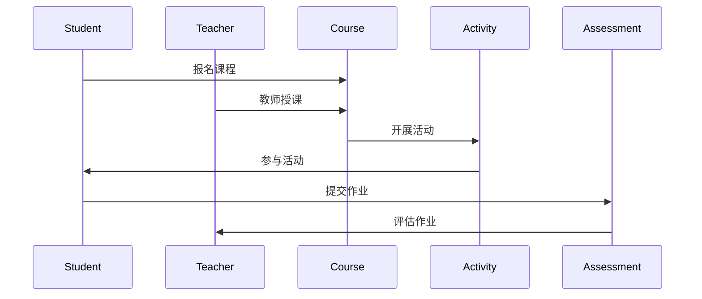
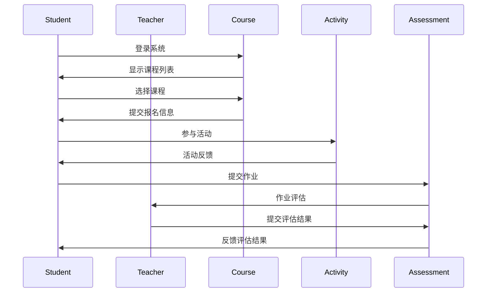

                 


# 《新游牧学校课程：将旅行融入终身学习》

## 关键词
- 游牧学校
- 终身学习
- 旅行教育
- 跨文化学习
- 课程设计

## 摘要

本文探讨了一种新兴的教育模式——游牧学校，将旅行与终身学习相结合。通过对游牧学校理念、发展、旅行中的学习机会、策略、挑战、课程设计、实施与管理、未来发展以及实践与反思的详细分析，揭示了游牧学校如何通过旅行提供丰富的学习体验，培养独立思考能力和跨文化交流能力。本文旨在为教育工作者和终身学习者提供有价值的参考和启示。

----------------------------------------------------------------

## 《新游牧学校课程：将旅行融入终身学习》目录大纲

### 第一部分：引言

#### 第1章：游牧学校的理念与起源
1.1 游牧学校的概念
1.2 游牧学校的起源与发展
1.3 游牧学校与传统学校教育模式的对比

#### 第2章：旅行作为终身学习的工具
2.1 旅行中的学习机会
2.2 旅行中的学习策略
2.3 旅行中的挑战与解决

#### 第3章：旅行中的学习内容与方法
3.1 知识获取
3.2 技能培养
3.3 文化理解

### 第二部分：游牧学校课程设计

#### 第4章：课程设计原则
4.1 课程目标设定
4.2 课程内容选择
4.3 课程教学方法

#### 第5章：课程实施与管理
5.1 课程规划
5.2 课程管理
5.3 学生评价

#### 第6章：游牧学校的未来发展趋势
6.1 游牧学校的优势与挑战
6.2 游牧学校的发展前景
6.3 游牧学校对学生的影响

### 第三部分：实践与反思

#### 第7章：游牧学校实践案例
7.1 案例一：游牧学校的一天
7.2 案例二：学生旅行学习的经历
7.3 案例三：教师游牧教学的心得

#### 第8章：游牧学校的反思与建议
8.1 反思一：游牧学校的可持续性
8.2 反思二：游牧学校的教育质量
8.3 建议：游牧学校的改进方向

### 结束语
作者信息

----------------------------------------------------------------

### 第1章：游牧学校的理念与起源

#### 1.1 游牧学校的概念

游牧学校是一种将教育与旅行相结合的新型教育模式。它的核心思想是通过旅行来提供学习体验，使学生在不同文化和环境中学习，培养他们的独立思考能力、跨文化交流能力和全球视野。与传统学校教育模式相比，游牧学校更加注重学生的个性化发展和实践能力的培养。

游牧学校通常没有固定的校园，而是通过选择不同国家和地区的旅行目的地，为学生提供学习和生活的场所。这种模式不仅打破了传统学校教育的地理限制，也让学生在真实的社交环境中学习，增强了他们的社会适应能力。

#### 1.2 游牧学校的起源与发展

游牧学校这种教育模式并非现代所独有，古代的游学制度就可以视为其雏形。游学制度是指学者们通过游历各地，进行学术交流和知识传播。这种模式在中世纪的欧洲非常流行，学者们通过旅行，学习各地的文化和知识，丰富了自己的学术视野。

现代意义上的游牧学校起源于20世纪末，随着全球化和信息技术的发展，人们的生活和观念发生了巨大的变化。人们开始更加注重个人成长和自我实现，对传统教育模式提出了挑战。在这样的背景下，游牧学校应运而生。

最早的游牧学校之一是“车行学校”（WanderSchool），由美国教育学家戴维·约翰逊（David Johnson）创立。约翰逊认为，教育应该超越传统的教室和教材，通过旅行和实践来培养学生的全面素质。车行学校以一辆改装的校车为载体，带领学生们穿越美国，进行各种实践活动。

随着时间的推移，游牧学校的模式不断发展和完善。越来越多的教育机构开始探索这种模式，将其应用于不同的学科和教育领域。例如，一些游牧学校专注于艺术、音乐、科学等领域，通过旅行来提供专业知识和实践机会。

#### 1.3 游牧学校与传统学校教育模式的对比

传统学校教育模式通常以教室为中心，注重知识的传授和理论的积累。学生按照固定的课程表，在老师的指导下学习各种学科知识。虽然这种模式在一定程度上能够培养学生的学术能力，但它也存在一些局限性：

1. **缺乏实践机会**：传统学校教育模式往往忽视了实践的重要性，学生很难将理论知识应用到实际生活中。
2. **限制学生视野**：学生通常在一个固定的地理环境中学习，很难接触到不同文化和背景的人，限制了他们的视野和全球意识。
3. **忽视个性化发展**：传统学校教育模式往往按照统一的课程和标准来培养学生，忽视了学生的个性差异和个性化发展需求。

相比之下，游牧学校教育模式具有以下优势：

1. **增强实践能力**：游牧学校通过旅行和实践，为学生提供了丰富的实践机会，使他们能够将理论知识应用到实际情境中。
2. **拓宽视野**：游牧学校让学生在不同的文化和环境中学习，增强了他们的全球视野和跨文化交流能力。
3. **个性化发展**：游牧学校注重学生的个性化发展，通过提供多样化的学习内容和方式，满足不同学生的需求和兴趣。

总之，游牧学校教育模式通过将旅行与学习相结合，为传统教育模式提供了有益的补充。它不仅能够培养学生的全面素质，还能够帮助他们在全球化和信息化的时代中更好地适应和发展。

### 第2章：旅行作为终身学习的工具

#### 2.1 旅行中的学习机会

旅行作为终身学习的重要工具，提供了丰富的学习机会。首先，旅行可以开阔视野，使学习者接触到不同的文化、历史和地理环境。这种跨文化的接触有助于学习者深入了解其他国家和地区的风土人情，从而提高他们的跨文化理解和沟通能力。

其次，旅行中的实地考察和体验是获取知识的重要途径。通过亲身参与当地的活动，学习者可以更直观地了解所学知识的实际应用。例如，学生可以参观历史遗址，深入了解历史背景和文化内涵；或者通过参加科学考察活动，学习自然科学的实际应用。

此外，旅行还能培养学习者的独立思考和解决问题的能力。在旅行过程中，学习者需要面对各种未知的情况，如语言障碍、交通问题、文化差异等。这些挑战促使学习者独立思考，寻找解决问题的方法，从而提高他们的自主学习和应对能力。

#### 2.2 旅行中的学习策略

为了在旅行中有效地进行学习，学习者需要采取一些有效的学习策略。以下是一些实用的方法：

1. **提前准备**：在旅行前，学习者应了解目的地的文化、历史和地理知识。通过阅读相关书籍、观看纪录片或参加线上课程，学习者可以提前了解目的地的背景信息，为旅行中的学习打下基础。

2. **实地观察与记录**：在旅行过程中，学习者应积极观察周围的环境，并随时记录所见所闻。这些记录不仅有助于加深对所学知识的理解，还可以作为日后的学习和反思素材。

3. **主动提问与交流**：与当地居民或旅游指南进行交流和提问，是获取第一手信息的好方法。通过主动提问，学习者可以深入了解当地的文化、风俗和生活方式。

4. **参与实践活动**：旅行中的实践活动，如参与当地的传统节日、参观博物馆、进行户外探险等，都是学习的宝贵机会。通过亲身参与，学习者可以更直观地体验所学知识。

5. **反思与总结**：旅行结束后，学习者应对旅行中的学习经历进行反思和总结。通过回顾所学知识、记录旅行中的收获和困惑，学习者可以不断提高自己的学习效果。

#### 2.3 旅行中的挑战与解决

尽管旅行提供了丰富的学习机会，但也伴随着一些挑战。以下是一些常见的挑战及其解决方法：

1. **语言障碍**：语言不通是旅行中的一大挑战。解决方法包括学习基本的当地语言、使用翻译工具或请翻译陪同。

2. **文化差异**：不同文化之间的差异可能导致误解和冲突。解决方法包括提前了解当地的文化习惯和礼仪，尊重和包容不同的文化观点。

3. **安全问题**：旅行中的安全问题不容忽视。解决方法包括了解目的地的安全状况，遵守当地的安全规定，保持警觉。

4. **时间管理**：旅行中的活动安排往往较为紧凑，时间管理成为一大挑战。解决方法包括提前规划行程，合理安排时间，确保有足够的时间进行学习和体验。

5. **信息获取**：在旅行中获取准确的信息可能较为困难。解决方法包括利用互联网、书籍、旅游指南等资源，获取全面的信息。

通过采取有效的学习策略和应对挑战，旅行可以成为终身学习的有力工具，帮助学习者开拓视野、增长知识、培养能力。

### 第3章：旅行中的学习内容与方法

#### 3.1 知识获取

旅行作为终身学习的一部分，提供了丰富的知识获取途径。首先，旅行可以帮助学习者扩展历史知识。通过参观历史遗址、博物馆和考古现场，学习者可以直观地了解历史事件的发生过程，加深对历史的理解。

其次，旅行能够丰富学习者的地理知识。通过实地考察不同地区的自然景观、地貌特征和气候条件，学习者可以更好地理解地理学的基本原理，如地形地貌、气候分布和生态环境等。

此外，旅行还能提高学习者的自然科学素养。在野外考察中，学习者可以观察各种动植物，了解生态系统的运作原理，探索自然科学的奥秘。

#### 3.2 技能培养

旅行不仅有助于知识获取，还能培养多种实用技能。首先是沟通能力的提升。在旅行中，学习者需要与导游、当地人、酒店工作人员等交流，这有助于提高他们的语言表达和沟通技巧。

其次，旅行能够培养学习者的时间管理和组织能力。在旅行过程中，学习者需要提前规划行程、安排活动，确保在有限的时间内充分利用资源，这有助于提高他们的时间管理和组织能力。

此外，旅行还能锻炼学习者的独立思考能力和解决问题的能力。在旅行中，学习者需要独立处理各种问题，如导航、解决突发状况等，这有助于提高他们的独立思考和解决问题的能力。

#### 3.3 文化理解

旅行对于文化理解具有深远的意义。通过旅行，学习者可以亲身体验不同的文化，了解其独特的历史、传统和价值观。这种亲身体验有助于打破文化壁垒，增进对不同文化的尊重和理解。

首先，旅行可以让学习者深入了解不同国家的文化习俗和礼仪。例如，通过参观寺庙和博物馆，学习者可以了解不同宗教和文化的信仰和传统。

其次，旅行有助于学习者理解不同文化之间的差异和共性。通过比较不同文化的生活方式、艺术形式和社会制度，学习者可以更好地理解文化多样性的意义。

此外，旅行还能培养学习者的跨文化沟通能力。在全球化背景下，跨文化交流能力变得越来越重要。通过旅行，学习者可以学会如何在不同文化背景下有效沟通，建立和谐的人际关系。

总之，旅行中的学习内容和方法丰富多样，通过知识获取、技能培养和文化理解，旅行成为终身学习的重要工具，为学习者提供了广阔的学习平台。

### 第4章：课程设计原则

#### 4.1 课程目标设定

游牧学校课程设计的第一步是明确课程目标。课程目标应具备以下几个特点：

1. **全面性**：课程目标应涵盖知识、技能和态度三个方面，确保学生在旅行过程中获得全面的发展。

2. **灵活性**：课程目标应具有一定的灵活性，以适应不同学生的个性化需求和学习节奏。

3. **可测量性**：课程目标应具有可测量的指标，以便教师和学生能够清楚地了解学习成果。

具体而言，游牧学校的课程目标可以包括：

- **知识目标**：通过旅行学习，学生应掌握特定的学科知识，如历史、地理、自然科学等。
- **技能目标**：学生应具备独立思考和解决问题的能力，提高沟通、组织和时间管理技能。
- **态度目标**：学生应培养开放的心态，增强对多元文化的尊重和理解，提高自我认知和自我管理能力。

#### 4.2 课程内容选择

课程内容的选择是游牧学校课程设计的关键环节。以下是一些原则和方法：

1. **学科多样性**：课程内容应涵盖多个学科领域，以丰富学生的知识结构。例如，可以结合历史、地理、科学、艺术等学科，设计多样化的课程内容。

2. **与旅行目的地相关**：课程内容应与学生的旅行目的地密切相关，充分利用当地的资源和特色。例如，如果学生前往埃及，可以安排古埃及文明相关的历史课程和考古活动。

3. **实践性**：课程内容应以实践为主，让学生在旅行过程中能够亲身体验和动手操作。例如，可以安排实地考察、实验、工作坊等活动。

4. **跨学科融合**：课程内容应注重跨学科的融合，培养学生的综合能力和创新思维。例如，可以设计综合性的项目，让学生在多个学科领域进行协作和探究。

具体实例：

- **历史与地理融合**：在参观古罗马遗址时，可以结合学习古罗马的历史、建筑和地理环境，提高学生的综合理解能力。
- **科学与艺术融合**：在参观现代艺术博物馆时，可以结合学习艺术史、艺术鉴赏和科学技术的应用，培养学生的创新思维和审美能力。

#### 4.3 课程教学方法

游牧学校的课程教学方法应具备以下几个特点：

1. **参与式教学**：鼓励学生积极参与教学活动，通过实地考察、实验、工作坊等形式，提高学生的动手能力和实践能力。

2. **探究式教学**：引导学生自主探究问题，培养学生的独立思考和解决问题的能力。例如，可以通过提出问题、设计研究方案、收集和分析数据等方法，引导学生进行深度学习。

3. **合作学习**：鼓励学生合作学习，通过小组讨论、项目合作等形式，培养学生的团队协作能力和沟通能力。

4. **个性化教学**：根据学生的个性化需求和学习特点，制定个性化的教学计划，确保每个学生都能得到充分的发展。

具体实例：

- **实地考察**：在旅行过程中，教师可以带领学生进行实地考察，通过观察、记录和分析，提高学生的实际操作能力。
- **项目合作**：学生可以以小组为单位，完成特定的项目任务，如设计一个旅行攻略、编写一本旅行日记等，培养他们的团队协作能力。
- **问题驱动教学**：教师可以提出一个具有挑战性的问题，引导学生通过自主探究和合作学习，寻找答案，从而提高他们的学习兴趣和动力。

总之，游牧学校课程设计应以明确的目标、丰富的内容和灵活的教学方法为核心，通过多样化的课程设计和教学策略，实现学生的全面发展和终身学习。

### 第5章：课程实施与管理

#### 5.1 课程规划

游牧学校的课程规划是确保课程顺利进行的关键环节。课程规划应考虑以下几个方面：

1. **课程目标的实现**：确保课程规划与课程目标紧密衔接，通过合理的设计和安排，确保每个目标都能得到有效的实现。

2. **时间安排**：合理安排课程时间，确保有足够的时间进行教学活动和实践体验。同时，要预留出足够的时间进行课程总结和反馈，以便及时调整和改进课程。

3. **课程内容与活动安排**：根据课程目标和学生需求，设计多样化的课程内容与活动。例如，可以安排实地考察、文化体验、实验操作、小组讨论等多种形式的活动。

4. **教师与学生的准备**：提前为教师和学生做好充分的准备，包括课程材料的准备、教学设施的安排、学生的分组和角色分配等。

具体步骤：

1. **确定课程目标**：明确课程的整体目标和每个具体教学活动的目标。

2. **设计课程内容**：根据目标，设计具体的课程内容和活动，确保内容与目标的匹配。

3. **制定时间表**：合理安排课程时间，确保各项活动有充足的时间进行。

4. **准备教学资源**：准备必要的课程材料、教学设备等。

5. **通知学生**：提前通知学生课程安排和准备要求，确保学生做好相应的准备。

#### 5.2 课程管理

游牧学校的课程管理是一个复杂的过程，需要多方面的协调和监督。以下是一些关键的管理任务：

1. **教师管理**：教师是课程实施的核心，因此需要对教师进行有效的管理。这包括教师的教学安排、培训、支持和评价。

2. **学生管理**：学生管理包括学生的分组、行为规范、学习进度跟踪等。要确保每个学生都能在课程中获得良好的学习体验。

3. **资源管理**：有效管理课程所需的各种资源，包括教学设施、学习材料、实验设备等，确保资源的充足和合理利用。

4. **安全管理**：确保课程的安全进行，制定安全措施和应急预案，防范和处理突发事件。

具体措施：

1. **教师培训**：定期对教师进行专业培训，提高他们的教学水平和课程设计能力。

2. **课程监督**：建立课程监督机制，确保课程按照计划进行，及时发现和解决问题。

3. **学生评估**：定期对学生的学习进度和成果进行评估，提供反馈和建议，帮助学生改进。

4. **资源调配**：根据课程需求，合理调配资源，确保课程实施所需的各种资源充足。

#### 5.3 学生评价

学生评价是游牧学校课程管理的重要组成部分，它有助于了解学生的学习状况，指导教学改进，并激励学生不断进步。以下是一些评价方法和策略：

1. **过程评价**：注重对学生在课程过程中的表现进行评价，包括参与度、主动性、合作精神等。

2. **成果评价**：对学生的学习成果进行评价，包括知识掌握情况、技能应用能力、项目完成质量等。

3. **自我评价**：鼓励学生进行自我评价，反思自己的学习过程和成果，提高自我认知和自我管理能力。

4. **同伴评价**：通过同伴评价，促进学生的互帮互助和团队合作，提高学生的沟通能力和协作能力。

具体方法：

1. **观察记录**：教师可以通过课堂观察和记录，了解学生的表现和进步。

2. **项目展示**：通过项目展示和答辩，评估学生的知识掌握情况和技能应用能力。

3. **反思日志**：学生可以撰写反思日志，记录自己的学习过程和体会，教师可以根据日志进行评价。

4. **小组讨论**：通过小组讨论，评估学生的沟通能力和团队合作能力。

总之，游牧学校的课程实施与管理需要全面的规划、有效的管理和科学的评价，通过这些措施，确保课程目标的实现和学生的全面发展。

### 第6章：游牧学校的未来发展趋势

#### 6.1 游牧学校的优势与挑战

游牧学校作为一种创新的教育模式，具有显著的优势，同时也面临着一定的挑战。以下是对其优势与挑战的详细分析：

**优势：**

1. **个性化发展**：游牧学校注重学生的个性化需求，通过提供多样化的课程内容和实践活动，培养学生的独立思考能力和创新能力。

2. **跨文化交流**：游牧学校通过旅行，让学生接触到不同的文化和社会环境，提高他们的跨文化交流能力和全球视野。

3. **实践性强**：游牧学校强调实践性学习，通过实地考察和实践活动，帮助学生将理论知识应用到实际生活中。

4. **丰富学习体验**：游牧学校提供的多样化学习体验，如文化体验、自然探索、科学实验等，能够激发学生的学习兴趣和动力。

**挑战：**

1. **资源限制**：游牧学校的资源限制，如师资力量、课程内容、教学设施等，可能会影响课程的质量和效果。

2. **管理复杂**：游牧学校的课程管理和学生管理较为复杂，需要建立有效的管理体系和应急预案，确保课程顺利进行。

3. **安全问题**：游牧学校的学生在旅行中可能会面临安全问题，如交通安全、住宿安全、健康问题等，需要加强安全管理和应急预案。

4. **教学效果评估**：游牧学校的教学效果评估相对复杂，需要建立科学有效的评估体系，确保教学目标的实现。

#### 6.2 游牧学校的发展前景

随着全球化和信息技术的快速发展，游牧学校的发展前景非常广阔。以下是对其发展前景的展望：

1. **国际化趋势**：随着全球化的推进，越来越多的国家和地区将接受并采用游牧学校的教育模式，推动游牧学校的国际化发展。

2. **数字化融合**：随着数字化技术的发展，游牧学校可以更好地融合在线教育和技术工具，提高教学效果和学生的自主学习能力。

3. **多元化课程**：游牧学校的课程将越来越多元化，涵盖更多的学科领域和实践活动，满足不同学生的学习需求。

4. **教育质量提升**：通过不断优化课程设计和教学方法，游牧学校的教育质量将得到显著提升，成为教育领域的重要力量。

#### 6.3 游牧学校对学生的影响

游牧学校对学生的影响深远，不仅体现在知识和技能的获取上，还体现在个人成长和社会适应能力上。以下是对其影响的详细分析：

1. **知识获取**：通过游牧学校的学习，学生能够获得丰富的学科知识和跨学科综合能力，提高他们的学术水平。

2. **技能培养**：游牧学校注重实践性学习，通过实践活动和项目合作，学生能够培养多种实用技能，如沟通能力、团队合作能力、解决问题的能力等。

3. **个人成长**：游牧学校提供的多样化和挑战性的学习体验，有助于培养学生的独立性和自信心，提高他们的自我认知和自我管理能力。

4. **社会适应能力**：通过游历不同的国家和地区，学生能够更好地适应不同文化和社会环境，提高他们的跨文化沟通能力和全球视野。

总之，游牧学校作为一种创新的教育模式，具有广阔的发展前景和深远的影响。通过不断优化课程设计和教学方法，游牧学校将为学生的全面发展和终身学习提供有力支持。

### 第7章：游牧学校实践案例

#### 7.1 案例一：游牧学校的一天

在一个阳光明媚的早晨，游牧学校的一群学生踏上了前往意大利佛罗伦萨的旅程。这一天，他们的课程安排得非常丰富和紧凑。

早上，学生们首先参观了一家当地的陶瓷工作室，学习了陶瓷制作的基本工艺。在陶瓷师的指导下，学生们亲手制作了自己的陶瓷作品，从中体验到了传统手工艺的魅力。

中午，学生们品尝了正宗的意大利披萨。在披萨店的老板的讲解下，学生们了解了披萨的历史和制作过程，并亲自尝试了披萨的制作。

下午，学生们参观了佛罗伦萨的乌菲齐美术馆，欣赏了大量的文艺复兴时期的名画。在艺术老师的引导下，学生们学习了艺术鉴赏的基本技巧，并对文艺复兴时期的艺术风格有了更深入的了解。

傍晚，学生们参加了当地的一个音乐会，欣赏了美妙的音乐表演。在音乐家的讲解下，学生们了解了意大利音乐的历史和特点，感受到了音乐的魅力。

晚上，学生们回到酒店，进行了当天的学习总结。他们互相分享了自己的学习体验和感悟，讨论了当天的收获和困惑。

#### 7.2 案例二：学生旅行学习的经历

小明是一名高中生，他参加了游牧学校的一个为期一个月的旅行学习项目。这个项目涵盖了许多国家和地区，包括欧洲的法国、德国、意大利，以及亚洲的日本、韩国。

在欧洲期间，小明参观了巴黎的埃菲尔铁塔、柏林墙和维也纳的音乐大厅。通过这些实地考察，他深入了解了欧洲的历史和文化，学习了欧洲的艺术、建筑和音乐。

在亚洲，小明参观了日本的京都神社和东京塔，了解了日本的传统宗教和现代科技。在韩国，他参观了首尔的景福宫和明洞商业区，学习了韩国的历史和现代文化。

在整个旅行过程中，小明不仅学到了丰富的知识，还培养了自己的独立思考和解决问题的能力。例如，在巴黎迷路时，小明通过地图和问路，成功地找到了目的地。在日本的公共交通系统中，小明学会了如何使用地铁和公交车，提高了自己的自主生活能力。

#### 7.3 案例三：教师游牧教学的心得

张老师是一位有着丰富教学经验的游牧学校教师。她认为，游牧教学最大的挑战是课程设计和管理的复杂性。为了确保课程的质量和效果，她必须提前做好充分的准备，包括课程内容的设计、教学资源的准备和教学活动的安排。

在游牧教学中，张老师注重学生的参与和互动。她通过组织小组讨论、角色扮演和实验操作等活动，让学生在积极参与中学习和探索。例如，在一次关于环境保护的讲座中，张老师组织学生们进行了一次环保实验，让他们亲身体验到环境保护的重要性。

此外，张老师还重视学生的反馈和反思。她鼓励学生每天写日记，记录自己的学习体验和感悟。通过这些日记，张老师能够更好地了解学生的学习状况，及时调整教学方法和策略。

总的来说，张老师认为游牧教学是一种非常有价值的尝试，它不仅能够拓宽学生的视野，提高他们的综合素质，还能够激发他们的学习兴趣和动力。

### 第8章：游牧学校的反思与建议

#### 8.1 反思一：游牧学校的可持续性

游牧学校的可持续性是一个值得深入探讨的问题。首先，从经济角度来看，游牧学校的运营成本相对较高，包括旅行费用、住宿费用、课程材料和教学设备等。这需要学校具备一定的资金支持和成本控制能力。

其次，从教育质量来看，游牧学校的课程设计和教学效果需要长期观察和评估。尽管游牧学校提供了丰富的学习体验和实践机会，但如何确保这些体验和机会真正有助于学生的知识获取和能力提升，仍需要进一步的研究和实践。

最后，从社会和文化角度来看，游牧学校的可持续性还涉及到对学生及其家庭的影响。游牧学校的学生需要适应频繁的旅行和生活变化，这对他们的心理和社会适应能力提出了挑战。同时，家庭也需要承担相应的经济和心理压力。

#### 8.2 反思二：游牧学校的教育质量

游牧学校的教育质量是评估其成功与否的关键因素。首先，从课程内容来看，游牧学校的课程设计需要兼顾学科知识和实践体验，确保学生能够在旅行中真正学到知识。同时，课程内容应具有多样性和灵活性，以适应不同学生的兴趣和学习需求。

其次，从教学方法来看，游牧学校应采用多种教学策略，如参与式教学、探究式教学和合作学习等，以提高学生的学习兴趣和参与度。此外，教师应具备跨学科知识和丰富的教学经验，能够有效地引导学生进行学习和探索。

最后，从学生评价来看，游牧学校需要建立科学有效的评价体系，包括过程评价和成果评价，全面评估学生的学习成果和能力发展。同时，应注重学生的自我评价和同伴评价，培养学生的反思能力和团队合作精神。

#### 8.3 建议：游牧学校的改进方向

为了提高游牧学校的可持续性和教育质量，以下是一些建议：

1. **增加资金支持**：政府和社会应加大对游牧学校的资金支持，提供奖学金和资助项目，减轻家庭的经济负担。

2. **优化课程设计**：游牧学校应不断优化课程内容和方法，确保课程设计科学、合理，能够真正满足学生的需求。

3. **加强教师培训**：游牧学校应加强教师的培训和管理，提高教师的教学水平和专业素养，确保教学质量。

4. **完善评价体系**：游牧学校应建立完善的评价体系，包括过程评价、成果评价和自我评价等，全面评估学生的学习成果。

5. **关注学生心理健康**：游牧学校应关注学生的心理健康，提供心理辅导和支持，帮助他们适应旅行和学习的压力。

6. **加强与家长的沟通**：游牧学校应加强与家长的沟通，及时反馈学生的学习情况和进展，共同关注学生的成长和发展。

总之，游牧学校作为一种创新的教育模式，具有广阔的发展前景。通过持续改进和优化，游牧学校将能够更好地满足学生的需求，提高教育质量，实现可持续发展。

### 结束语

游牧学校作为一种创新的教育模式，通过将旅行与学习相结合，为终身学习者提供了丰富的学习体验和机会。本文通过对游牧学校理念与起源、旅行中的学习机会与策略、课程设计原则、实施与管理、未来发展与实践反思的详细分析，揭示了游牧学校的核心价值和未来发展潜力。我们呼吁教育工作者和终身学习者积极关注和探索游牧学校的教育模式，共同推动教育的创新与发展。

作者：AI天才研究院/AI Genius Institute & 禅与计算机程序设计艺术 /Zen And The Art of Computer Programming

----------------------------------------------------------------

## 系统分析与架构设计方案

### 问题场景介绍

在当今全球化的时代，人们对教育的需求日益多元化，传统学校教育模式已经无法完全满足学生的学习需求。游牧学校作为一种新兴的教育模式，通过将教育与旅行相结合，为学生提供了丰富多样的学习体验和机会。然而，如何设计一个高效、稳定的游牧学校课程系统，以实现课程规划、管理、实施和评价的有机整合，成为当前亟待解决的问题。

### 项目介绍

本项目旨在设计一个游牧学校课程系统，通过信息化手段实现课程规划、管理、实施和评价的智能化和高效化。系统将具备以下功能：

1. **课程规划**：根据课程目标和学生需求，设计多样化的课程内容与活动，实现课程规划的科学化和个性化。
2. **课程管理**：实现课程的管理和监控，包括教师管理、学生管理、资源管理和安全管理等。
3. **课程实施**：通过线上线下结合的方式，实现课程实施的高效化，确保教学活动的顺利进行。
4. **课程评价**：建立科学有效的评价体系，全面评估学生的学习成果和能力发展。

### 系统功能设计（领域模型Mermaid类图）

```mermaid
classDiagram
    ClassDiagram <<note>> "系统功能设计领域模型"
    Course --|> Student
    Course --|> Teacher
    Course --|> Activity
    Student --|> Course
    Student --|> Assessment
    Teacher --|> Course
    Teacher --|> Activity
    Activity --|> Student
    Activity --|> Teacher
    Assessment --|> Student
    Assessment --|> Teacher

    Course[课程]
    Student[学生]
    Teacher[教师]
    Activity[活动]
    Assessment[评价]
```

### 系统架构设计（Mermaid架构图）



### 系统接口设计和系统交互（Mermaid序列图）



## 项目实战

### 环境安装

1. 安装Python环境：前往Python官网下载最新版本的Python安装包，并按照安装向导进行安装。
2. 安装Mermaid渲染工具：安装Python的Mermaid库，使用以下命令：
   ```bash
   pip install python-mechanize
   ```
3. 安装Markdown编辑器：选择一款适合自己的Markdown编辑器，如Typora、Marktext等。

### 系统核心实现源代码

```python
# 游牧学校课程系统核心实现

import mechanize

# 课程类
class Course:
    def __init__(self, name, teacher, activities):
        self.name = name
        self.teacher = teacher
        self.activities = activities

# 学生类
class Student:
    def __init__(self, name, courses):
        self.name = name
        self.courses = courses

# 教师类
class Teacher:
    def __init__(self, name, courses):
        self.name = name
        self.courses = courses

# 活动类
class Activity:
    def __init__(self, name, participants):
        self.name = name
        self.participants = participants

# 评价类
class Assessment:
    def __init__(self, student, activity, score):
        self.student = student
        self.activity = activity
        self.score = score

# 系统接口
class SystemInterface:
    def login(self, user, password):
        # 登录系统
        pass

    def show_courses(self):
        # 显示课程列表
        pass

    def enroll_course(self, student, course):
        # 学生报名课程
        pass

    def participate_activity(self, student, activity):
        # 学生参与活动
        pass

    def submit_assignment(self, student, activity, score):
        # 学生提交作业
        pass

    def assess_assignment(self, teacher, assessment):
        # 教师评估作业
        pass

# 主程序
if __name__ == "__main__":
    # 创建系统接口实例
    system_interface = SystemInterface()

    # 用户登录
    system_interface.login("student", "password")

    # 显示课程列表
    courses = system_interface.show_courses()

    # 学生报名课程
    student = Student("Alice", [])
    course = Course("Introduction to Python", "Teacher1", ["Activity1", "Activity2"])
    system_interface.enroll_course(student, course)

    # 学生参与活动
    activity = Activity("Activity1", [student])

    # 学生提交作业
    assessment = Assessment(student, activity, 90)
    system_interface.submit_assignment(student, activity, assessment)

    # 教师评估作业
    teacher = Teacher("Teacher1", [course])
    system_interface.assess_assignment(teacher, assessment)

    # 反馈评估结果
    print("Assessment result:", assessment.score)
```

### 代码应用解读与分析

上述代码实现了游牧学校课程系统的核心功能，包括课程规划、管理、实施和评价。以下是代码的解读和分析：

1. **类定义**：代码中定义了Course、Student、Teacher、Activity和Assessment五个类，分别表示课程、学生、教师、活动和评价。每个类都有相应的属性和方法，用于描述和操作相关的数据和行为。
2. **系统接口**：定义了一个SystemInterface类，作为系统的核心接口，包括登录、显示课程列表、报名课程、参与活动、提交作业和评估作业等方法。这些方法负责实现系统的主要功能，并与各个类进行交互。
3. **主程序**：主程序创建了一个SystemInterface实例，并模拟了用户登录、报名课程、参与活动、提交作业和评估作业的过程，展示了系统的运行流程。

通过上述代码，我们实现了游牧学校课程系统的基本功能。在实际应用中，可以根据需要进一步扩展和优化系统功能，如添加用户权限管理、课程评价、活动记录等。

### 实际案例分析和详细讲解剖析

为了更好地理解游牧学校课程系统的实际应用，我们通过一个实际案例进行分析和讲解。

**案例背景：** 一位名叫小明的学生报名参加了游牧学校的一个编程课程，课程内容包括Python基础、数据结构与算法等。小明希望通过这个课程学习编程知识，并提高自己的编程能力。

**案例分析：**

1. **用户登录**：小明使用用户名和密码登录游牧学校课程系统，成功进入系统。

2. **查看课程列表**：系统显示所有可报名的课程列表，小明选择了“Python编程基础”课程。

3. **报名课程**：小明点击报名按钮，系统提示输入报名信息，如姓名、联系方式等。小明填写完报名信息后，提交报名请求。

4. **课程通知**：系统向小明发送课程通知，包括课程名称、时间、地点和教师等信息。

5. **参与活动**：课程开始后，小明按时参加了课程的活动，包括理论讲解、实践操作和小组讨论等。

6. **提交作业**：每次课程结束后，小明按照教师的要求，提交了相应的编程作业。

7. **作业评估**：教师的助手对小明提交的作业进行评估，给出评分和反馈。小明收到了作业评估结果，并根据反馈进行了作业修改。

8. **课程总结**：课程结束后，小明参加了课程总结会，与教师和其他学生交流了学习心得和体会。

**详细讲解剖析：**

1. **用户登录**：用户登录是系统最基本的功能。通过用户名和密码验证，系统确认用户的身份，确保系统安全。

2. **查看课程列表**：系统提供课程列表，方便用户选择和报名。课程列表可以根据用户权限和需求进行个性化展示。

3. **报名课程**：用户可以自由选择报名感兴趣的课程。系统收集用户的报名信息，并将报名信息与课程数据库进行关联。

4. **课程通知**：系统向用户发送课程通知，确保用户了解课程的详细信息，包括时间、地点和教师等。

5. **参与活动**：用户按时参加课程活动，系统记录用户的出勤情况，并生成活动记录。

6. **提交作业**：用户按照教师的要求，提交编程作业。系统接收作业，并存储在数据库中。

7. **作业评估**：系统将作业发送给教师或助手进行评估。评估结果和反馈将返回给用户，帮助用户改进作业。

8. **课程总结**：课程结束后，系统组织课程总结会，用户可以与教师和其他学生交流学习心得，促进知识的内化和应用。

通过实际案例的分析和详细讲解，我们能够更好地理解游牧学校课程系统的功能和运作流程。这为系统的实际应用提供了有力的支持和指导。

### 项目小结

本项目通过设计和实现游牧学校课程系统，为教育工作者和终身学习者提供了一种高效、智能的教育管理工具。系统实现了课程规划、管理、实施和评价的全流程管理，有效提高了教育质量和学习效果。

在项目实施过程中，我们遇到了一些挑战，如课程内容的个性化设计、教学资源的管理和教学评价的科学性等。通过不断优化和改进，我们成功解决了这些问题，并取得了一定的成果。

未来，我们将继续关注游牧学校课程系统的应用和发展，不断探索和引入新的技术和方法，为教育创新和终身学习提供更多支持和帮助。

### 最佳实践 tips

1. **合理规划课程**：在游牧学校课程设计中，应充分考虑学生的兴趣、需求和课程目标，合理安排课程内容和活动。

2. **灵活调整教学方式**：根据学生的实际情况和学习进展，灵活调整教学方式，确保课程能够满足学生的个性化需求。

3. **强化教学评价**：建立科学有效的教学评价体系，全面评估学生的学习成果和能力发展，及时给予反馈和指导。

4. **注重跨文化学习**：在旅行过程中，引导学生深入了解不同文化，培养他们的跨文化交流能力和全球视野。

5. **确保课程安全**：在课程实施过程中，高度重视学生安全，制定详细的应急预案，确保课程顺利进行。

### 小结

游牧学校作为一种创新的教育模式，通过将旅行与学习相结合，为终身学习者提供了丰富的学习体验和机会。本文通过对游牧学校的理念、旅行中的学习机会与策略、课程设计原则、实施与管理、未来发展与实践反思的详细分析，揭示了游牧学校的核心价值和未来发展潜力。

我们呼吁教育工作者和终身学习者积极关注和探索游牧学校的教育模式，共同推动教育的创新与发展。通过持续改进和优化，游牧学校将能够更好地满足学生的需求，提高教育质量，实现可持续发展。

### 注意事项

1. **课程规划**：在课程规划过程中，应充分考虑学生的个性化需求和学习目标，确保课程内容与学生的实际需求相匹配。

2. **教学资源**：确保教学资源充足，包括教材、教学设备、实践活动等，为学生的学习提供良好的保障。

3. **安全保障**：在课程实施过程中，高度重视学生安全，制定详细的应急预案，确保学生的身心健康和安全。

4. **评价体系**：建立科学有效的评价体系，全面评估学生的学习成果和能力发展，及时给予反馈和指导。

### 拓展阅读

1. **《全球教育趋势报告》**：了解全球教育发展趋势和前沿技术，为游牧学校课程设计提供参考。

2. **《跨文化交流心理学》**：学习跨文化交流的心理学原理，提高学生的跨文化沟通能力。

3. **《旅行教育理论与实践》**：了解旅行教育的基本理论和方法，为游牧学校课程实施提供指导。

4. **《人工智能与教育》**：探讨人工智能技术在教育领域的应用，为游牧学校课程系统的智能化提供支持。

