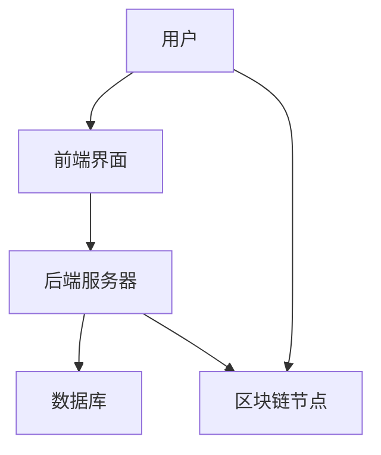
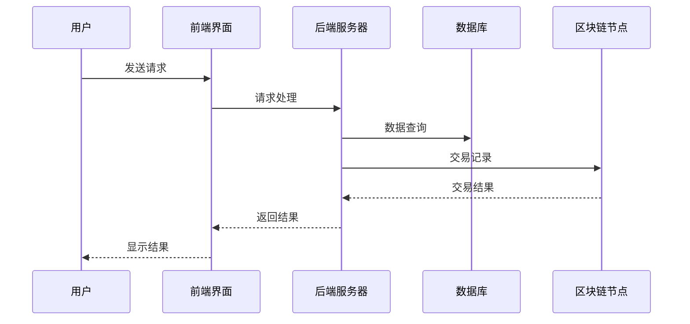
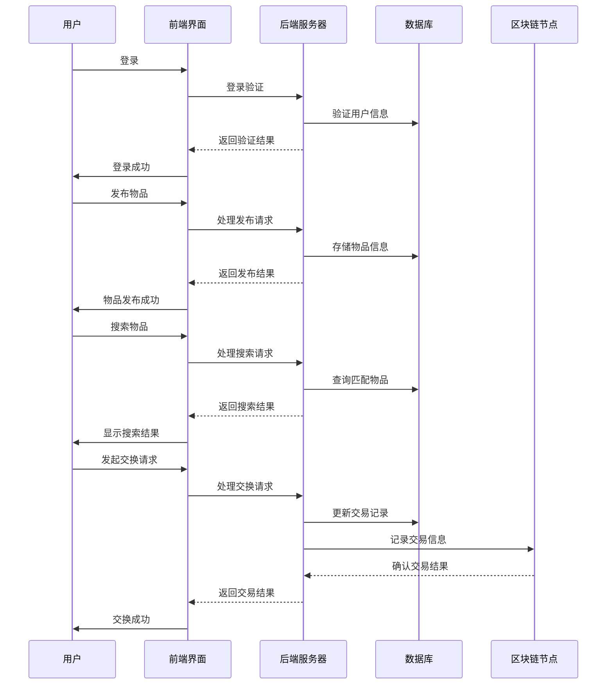

                 

### 1.1 问题背景

在现代经济体系中，货币作为交换媒介，已经成为了大部分交易活动的基础。然而，在货币经济之外，物物交换经济依然存在，并在特定情境下展现出其独特的价值。物物交换，顾名思义，是指在没有货币介入的情况下，直接通过物品与物品之间的交换来实现商品流通和资源分配的一种经济形式。

#### 物物交换经济的定义

物物交换经济，又称为以物易物经济，是一种历史悠久的交换形式。它指的是在没有货币介入的情况下，直接通过物品与物品之间的交换来实现商品流通和资源分配的经济模式。在这种经济模式中，交换双方通过各自的物品来满足对方的需求，从而实现资源的最优配置。

#### 物物交换经济的历史与发展

物物交换经济作为一种古老的经济模式，在人类历史上占据了重要的地位。在货币出现之前，物物交换是主要的经济形式。随着人类社会的进步和发展，货币逐渐取代了物物交换，成为了主要的交换媒介。然而，在货币经济出现的一些缺陷和特定情境下，如经济危机、货币贬值、信息技术革命等，物物交换经济重新受到关注。

在20世纪中叶，由于货币供应过剩和经济危机，物物交换在一些国家和地区重新兴起。特别是在一些小规模的社区和乡村地区，物物交换成为了居民之间交换商品和服务的主要方式。随着信息技术的快速发展，互联网和电子商务的普及，物物交换的形式也在不断地演变和升级。

#### 物物交换经济的特点

物物交换经济具有以下几个特点：

- **直接性**：物物交换经济无需货币介入，交换双方直接通过物品与物品之间的交换来实现商品流通和资源分配。

- **互补性**：物物交换依赖于交换双方的互补需求，即一方拥有的物品正好能满足另一方的需求。

- **限制性**：物物交换经济受物品种类和数量的限制。由于缺乏货币这一通用交换媒介，物物交换的范围和效率受到较大限制。

#### 1.1.1 物物交换经济的定义

物物交换经济，又称为以物易物经济，是指在没有货币介入的情况下，直接通过物品与物品之间的交换来实现商品流通和资源分配的一种经济形式。

#### 1.1.2 物物交换经济的历史与发展

物物交换经济作为一种古老的经济模式，在人类历史上占据了重要的地位。在货币出现之前，物物交换是主要的经济形式。随着人类社会的进步和发展，货币逐渐取代了物物交换，成为了主要的交换媒介。然而，在货币经济出现的一些缺陷和特定情境下，如经济危机、货币贬值、信息技术革命等，物物交换经济重新受到关注。

在20世纪中叶，由于货币供应过剩和经济危机，物物交换在一些国家和地区重新兴起。特别是在一些小规模的社区和乡村地区，物物交换成为了居民之间交换商品和服务的主要方式。随着信息技术的快速发展，互联网和电子商务的普及，物物交换的形式也在不断地演变和升级。

#### 1.1.3 物物交换经济的特点

物物交换经济具有以下几个特点：

- **直接性**：物物交换经济无需货币介入，交换双方直接通过物品与物品之间的交换来实现商品流通和资源分配。

- **互补性**：物物交换依赖于交换双方的互补需求，即一方拥有的物品正好能满足另一方的需求。

- **限制性**：物物交换经济受物品种类和数量的限制。由于缺乏货币这一通用交换媒介，物物交换的范围和效率受到较大限制。

### 1.2 核心概念与联系

#### 1.2.1 核心概念

物物交换经济涉及以下几个核心概念：

- **交换价值**：交换价值是指物品在交换过程中所体现的价值。它反映了物品在满足他人需求方面的能力。

- **供需关系**：供需关系是指供应与需求之间的相互关系。在物物交换经济中，供需关系的平衡是交换顺利进行的关键。

- **交换效率**：交换效率是指交换过程中资源的利用程度。高效交换能够最大化地满足各方需求，提高整体资源的利用效率。

#### 1.2.2 概念属性特征对比表格

以下是物物交换经济中的几个核心概念及其属性特征的对比表格：

| 概念       | 定义                                         | 属性特征                                       |
|------------|----------------------------------------------|------------------------------------------------|
| 交换价值   | 物品在交换过程中所体现的价值               | 直接性、互补性、有限性                        |
| 供需关系   | 供应与需求之间的相互关系                   | 相互依赖、动态平衡、影响价格                  |
| 交换效率   | 交换过程中资源的利用程度                    | 高效性、公平性、可持续性                      |

#### 1.2.3 ER实体关系图架构

为了更好地理解物物交换经济中的核心概念及其相互关系，我们可以使用实体关系图（ER图）来描述。以下是一个简单的ER图示例：

```mermaid
erDiagram
  ExchangeParticipant ||--|{ ExchangeItem }|
  ExchangeParticipant ||--|{ ExchangeTransaction }|
  ExchangeItem ||--|{ Supply }|
  ExchangeItem ||--|{ Demand }|
  ExchangeTransaction ||--|{ SupplyTransaction }|
  ExchangeTransaction ||--|{ DemandTransaction }|
```

在这个ER图中，`ExchangeParticipant`代表参与交换的个人或组织，`ExchangeItem`代表参与交换的物品，`ExchangeTransaction`代表交换过程，`Supply`和`Demand`分别代表供应和需求。通过这个ER图，我们可以清晰地看到物物交换经济中的核心概念及其相互关系。

### 1.3 物物交换经济在现代社会的应用场景

虽然现代经济体系中货币交换占据主导地位，但物物交换经济在特定场景中依然具有重要的应用价值。以下是几种常见的物物交换经济应用场景：

#### 1.3.1 社区交换市场

在社区交换市场中，居民之间通过直接交换物品来满足各自的需求。这种形式常见于小规模的社区和乡村地区。社区交换市场不仅减少了货币的使用，也促进了居民之间的交流和互助。

#### 1.3.2 非营利组织

非营利组织常常采用物物交换经济模式来运作。例如，慈善机构可以通过接受捐赠的物品，如食品、衣物、家具等，再将其分配给需要帮助的人群。这种交换形式不仅提高了资源利用效率，也增强了社会的互助精神。

#### 1.3.3 社交媒体平台

随着互联网和社交媒体的发展，物物交换经济在在线平台上的应用越来越广泛。例如，Facebook Marketplace、Craigslist等平台允许用户直接在网络上交换物品和服务。这种形式不仅方便了用户，也降低了交易成本。

#### 1.3.4 经济危机时期

在经济危机或货币贬值的情况下，物物交换经济作为一种应急措施，有助于维持社会秩序和资源分配。例如，2008年的全球金融危机期间，一些国家和地区出现了物物交换活动的增加。

#### 1.3.5 企业间合作

在某些行业，企业之间也会采用物物交换经济模式来优化供应链和资源利用。例如，制造企业可以通过交换原材料或半成品来减少库存和物流成本。

### 1.4 物物交换经济的优势与挑战

物物交换经济具有多方面的优势，但也面临一些挑战。以下是对其优势与挑战的详细分析：

#### 1.4.1 优势

- **减少货币依赖**：物物交换经济减少了货币的使用，有助于降低交易成本，特别是在货币供应紧张的情况下。

- **促进社区互动**：物物交换经济加强了社区成员之间的互动，有助于增强社区凝聚力和社会信任。

- **提高资源利用效率**：通过直接交换物品，物物交换经济能够更有效地利用资源，减少浪费。

- **降低环境负担**：物物交换经济减少了商品的流通和物流活动，有助于降低环境负担。

#### 1.4.2 挑战

- **物品匹配问题**：物物交换经济中的物品匹配是一个重要挑战，特别是当物品种类和数量繁多时。

- **价值评估难题**：在物物交换中，如何公平地评估物品的价值是一个复杂的问题，特别是当物品的价值难以量化时。

- **法律与政策限制**：物物交换经济需要在法律和政策上得到支持，否则可能会面临种种障碍。

- **信息不对称**：在物物交换中，信息不对称可能导致交易双方无法达成共识，影响交换效率。

### 1.5 物物交换经济的未来发展趋势

随着技术的不断进步，物物交换经济有望在未来得到进一步的发展。以下是一些可能的发展趋势：

- **区块链技术的应用**：区块链技术可以为物物交换经济提供去中心化的交易记录和智能合约功能，提高交易的安全性和透明度。

- **互联网平台的普及**：互联网平台可以为物物交换经济提供更加便捷的交换渠道和工具，促进物物交换的普及。

- **智能化交换系统**：通过大数据分析和人工智能技术，可以开发出更加智能的交换系统，提高物物交换的效率。

- **跨领域合作**：不同行业和领域的合作有望推动物物交换经济的创新和发展，实现资源的最大化利用。

### 1.6 总结

物物交换经济作为一种古老而独特的经济模式，在现代经济体系中依然具有重要的价值。通过直接交换物品，物物交换经济能够减少货币依赖，促进社区互动，提高资源利用效率。然而，物物交换经济也面临一些挑战，如物品匹配、价值评估、法律政策限制等。随着技术的进步和互联网的普及，物物交换经济有望在未来得到进一步的发展和应用。

---

## 第二部分：物物交换经济的重建社区关系

### 2.1 物物交换经济与社区关系重建的关系

物物交换经济不仅是一种经济形式，更是一种社会关系的重建。在物物交换的过程中，社区成员之间的互动和合作得以增强，从而促进了社区关系的重建。以下是物物交换经济对社区关系重建的几个关键方面：

#### 2.1.1 促进社区互动

物物交换经济使得社区成员之间的互动更加频繁。通过直接交换物品，居民之间的交流变得更加直接和真实。这种互动不仅有助于满足个人的需求，还能够增进邻里之间的了解和信任。

#### 2.1.2 提升社区凝聚力

物物交换经济有助于提升社区的凝聚力。通过共同的交换活动，社区成员能够更好地理解彼此的需求和愿望，从而形成更加紧密的社会联系。这种凝聚力不仅体现在日常交流中，还能够在面对社区共同问题时展现出强大的合力。

#### 2.1.3 增强社会信任

在物物交换经济中，交换双方依赖于彼此的诚信和信誉来完成交易。这种信任关系的建立不仅有助于物物交换的顺利进行，还能够推广到其他社会活动中，增强整个社区的社会信任度。

#### 2.1.4 激发社区参与

物物交换经济鼓励社区成员积极参与社区活动。无论是组织交换市场，还是参与交换活动，社区成员都能够感受到自己对社会的重要性和价值。这种参与感有助于激发居民的积极性和创造力，推动社区的发展和进步。

### 2.2 物物交换经济对社区关系重建的积极影响

物物交换经济对社区关系重建具有显著的积极影响，具体表现在以下几个方面：

#### 2.2.1 促进社区互动

物物交换经济使得社区成员之间的互动更加频繁。通过直接交换物品，居民之间的交流变得更加直接和真实。这种互动不仅有助于满足个人的需求，还能够增进邻里之间的了解和信任。例如，在一个社区交换市场中，居民可以通过展示自己的物品和需求，与其他居民进行交流，从而建立起更加紧密的联系。

#### 2.2.2 提升社区凝聚力

物物交换经济有助于提升社区的凝聚力。通过共同的交换活动，社区成员能够更好地理解彼此的需求和愿望，从而形成更加紧密的社会联系。这种凝聚力不仅体现在日常交流中，还能够在面对社区共同问题时展现出强大的合力。例如，在一个社区中，居民可以通过交换食物、衣物、服务等形式，共同解决生活中的困难，从而增强社区的凝聚力。

#### 2.2.3 增强社会信任

在物物交换经济中，交换双方依赖于彼此的诚信和信誉来完成交易。这种信任关系的建立不仅有助于物物交换的顺利进行，还能够推广到其他社会活动中，增强整个社区的社会信任度。例如，在一个社区中，居民通过物物交换建立起的信任关系，可以延伸到日常生活中的其他方面，如互助、合作等，从而提高整个社区的社会信任度。

#### 2.2.4 激发社区参与

物物交换经济鼓励社区成员积极参与社区活动。无论是组织交换市场，还是参与交换活动，社区成员都能够感受到自己对社会的重要性和价值。这种参与感有助于激发居民的积极性和创造力，推动社区的发展和进步。例如，在一个社区中，居民可以通过组织交换市场，共同参与到社区的建设和管理中，从而增强社区的活力和发展潜力。

#### 2.2.5 促进资源共享

物物交换经济有助于促进社区资源的共享。通过交换活动，社区成员可以更有效地利用各自的资源，满足彼此的需求。这种资源共享不仅有助于减少资源浪费，还能够提高资源的利用效率。例如，在一个社区中，居民可以通过交换闲置的物品，如家具、电器、书籍等，实现资源的最大化利用。

#### 2.2.6 增强社区归属感

物物交换经济有助于增强社区的归属感。通过参与交换活动，社区成员能够感受到社区对自己生活的重要性，从而增强对社区的认同感和归属感。例如，在一个社区中，居民通过参与交换活动，能够感受到自己对社区生活的贡献和价值，从而更加珍惜和热爱自己的社区。

### 2.3 物物交换经济在社区关系重建中的挑战

尽管物物交换经济在社区关系重建中具有积极的影响，但同时也面临着一些挑战。以下是对这些挑战的详细分析：

#### 2.3.1 物品匹配问题

物物交换经济的核心在于物品的匹配。然而，在物品种类和数量繁多的社区中，找到合适的交换伙伴是一个巨大的挑战。这可能会导致一些物品无法找到合适的交换对象，从而影响交换的顺利进行。例如，在一个社区中，如果某位居民想要交换一本英文书籍，但社区中没有其他人需要这种书籍，那么这种交换就难以实现。

#### 2.3.2 价值评估难题

在物物交换中，如何公平地评估物品的价值是一个复杂的问题。由于不同物品的价值难以量化，特别是在社区成员之间进行物品交换时，很难确定一个统一的评估标准。这可能会导致一些不公平的交易，甚至引发纠纷。例如，如果一位居民想要用一台旧电视交换另一台旧电视，但双方对旧电视的价值评估不一致，就可能导致交易失败。

#### 2.3.3 法律与政策限制

物物交换经济需要在法律和政策上得到支持，否则可能会面临种种障碍。在一些国家和地区，法律对物物交换的限制较多，例如对物品交换的价格、数量、范围等进行严格规定。这些法律和政策限制可能会阻碍物物交换经济的发展。例如，在一些国家，政府可能会限制社区内部的物品交换，以防止非法交易和逃税行为。

#### 2.3.4 信息不对称

在物物交换经济中，信息不对称可能导致交易双方无法达成共识，影响交换效率。例如，如果一位居民有一批闲置的家具想要交换，但社区中其他居民并不了解这一信息，就可能导致交换机会的丧失。此外，信息不对称还可能导致一些不公平的交易，例如一位居民故意隐瞒物品的实际价值，从而获取不公平的利益。

### 2.4 物物交换经济在社区关系重建中的实践案例

为了更好地理解物物交换经济在社区关系重建中的实际应用，以下是一些成功的实践案例：

#### 2.4.1 社区交换市场

在一些社区，居民自发组织了社区交换市场，通过定期举办交换活动，促进居民之间的互动和交流。例如，美国的某些社区每月都会举办一次社区交换市场，居民可以带来自家的闲置物品，与其他居民进行交换。这种形式不仅促进了居民之间的交流，还提高了资源的利用效率。

#### 2.4.2 社区共享经济

社区共享经济是物物交换经济的一种延伸形式，通过共享社区内的资源和服务，实现居民之间的互利共赢。例如，一些社区建立了共享厨房、共享工作空间等，居民可以在这些共享空间中交换食物、工作资源等。这种形式不仅有助于提高资源利用效率，还能够增强社区的凝聚力。

#### 2.4.3 社区互助网络

在一些社区，居民建立了互助网络，通过互相帮助和交换服务，实现社区成员之间的紧密联系。例如，在一些社区中，居民可以互相提供看护孩子、修理工等服务，并通过物物交换来回报对方的帮助。这种形式不仅增强了社区的互助精神，还提高了居民的幸福感。

#### 2.4.4 社区交换平台

随着互联网技术的发展，一些社区建立了在线交换平台，通过互联网为居民提供便捷的交换渠道。例如，一些社区网站或应用程序允许居民发布自己的闲置物品和需求，与其他居民进行在线交换。这种形式不仅方便了居民，还提高了交换的效率。

### 2.5 物物交换经济在社区关系重建中的未来展望

随着社会的进步和技术的发展，物物交换经济在社区关系重建中的作用将越来越重要。以下是对物物交换经济在社区关系重建中未来发展的展望：

#### 2.5.1 区块链技术的应用

区块链技术可以为物物交换经济提供去中心化的交易记录和智能合约功能，提高交易的安全性和透明度。通过区块链技术，社区可以建立一个公正、透明的交换平台，确保交易双方的利益得到保障。

#### 2.5.2 智能化交换系统的开发

通过大数据分析和人工智能技术，可以开发出更加智能的交换系统，提高物物交换的效率。例如，智能交换系统可以根据居民的需求和物品的属性，自动匹配交换对象，提高交换的成功率。

#### 2.5.3 多元化的交换形式

未来，物物交换经济将出现多元化的交换形式，不仅限于物品的交换，还可以扩展到服务、知识、技能等领域的交换。这种多元化的交换形式将进一步提高社区的互助性和共享性。

#### 2.5.4 社区治理的融合

物物交换经济可以与社区治理相结合，形成一种新型的社区治理模式。通过物物交换经济，社区可以更好地了解居民的需求和问题，从而更加有效地进行社区治理和公共服务的提供。

### 2.6 总结

物物交换经济在社区关系重建中发挥着重要的作用。通过促进社区互动、提升社区凝聚力、增强社会信任和激发社区参与，物物交换经济不仅能够优化资源的分配，还能够增强社区的凝聚力和互助精神。然而，物物交换经济也面临着一些挑战，如物品匹配问题、价值评估难题、法律与政策限制和信息不对称等。随着技术的进步和社会的发展，物物交换经济有望在未来得到进一步的发展和应用，为社区关系的重建和社会的和谐发展做出更大的贡献。

---

## 第三部分：物物交换经济的实施策略

### 3.1 物物交换经济的组织形式

物物交换经济可以通过多种组织形式得以实施，以下是几种常见的组织形式：

#### 3.1.1 社区交换市场

社区交换市场是一种最直接和最常见的物物交换形式。在社区交换市场中，居民可以定期聚集在一起，展示自己的闲置物品和需求，通过直接交换满足彼此的需求。社区交换市场不仅促进了居民之间的互动，还能够提高物品的利用效率。

#### 3.1.2 交换俱乐部

交换俱乐部是一种组织性较强的物物交换形式。通过加入交换俱乐部，成员可以定期参加俱乐部组织的交换活动，交换自己不需要的物品，同时获取其他成员提供的物品。交换俱乐部通常有明确的规章制度，以确保交易的公平和有序。

#### 3.1.3 在线平台

随着互联网技术的发展，在线平台成为物物交换经济的新兴形式。在线平台可以为居民提供一个便捷的交换渠道，居民可以在平台上发布自己的闲置物品和需求，通过在线交流达成交换意向。例如，Facebook Marketplace、Craigslist等平台都提供了物物交换的功能。

#### 3.1.4 跨社区交换网络

跨社区交换网络是一种将多个社区的物物交换活动连接起来的形式。通过建立跨社区交换网络，居民可以在更大的范围内进行物品交换，满足更多样化的需求。跨社区交换网络可以通过互联网平台或实体交换市场实现。

### 3.2 物物交换经济的激励机制

为了推动物物交换经济的发展，需要建立一系列激励机制，以下是一些常见的激励机制：

#### 3.2.1 积分制度

积分制度是一种常用的激励机制，通过给予参与者积分奖励，鼓励他们积极参与物物交换活动。参与者可以通过交换物品或提供帮助来获取积分，积分可以用来兑换实物或服务。积分制度能够提高参与者的积极性，增加交换频率。

#### 3.2.2 奖励制度

奖励制度是对积极参与物物交换的参与者给予物质或精神上的奖励。例如，可以设立“最佳交换手”奖项，对在物物交换活动中表现出色的参与者进行表彰和奖励。奖励制度能够激发参与者的竞争意识，提高交换质量。

#### 3.2.3 信用评级

信用评级是对参与者在物物交换活动中的信用状况进行评估和记录。良好的信用评级可以增加参与者在交换活动中的信誉，提高交换成功率。通过建立信用评级制度，可以促进诚信交换，减少交易风险。

#### 3.2.4 会员制度

会员制度是对积极参与物物交换的参与者提供优惠和服务的制度。例如，可以设立会员等级，根据参与者参与交换的频率和贡献程度，给予不同等级的会员不同的优惠，如优先参与交换活动、享受更优惠的交换价格等。会员制度能够提高参与者的归属感和忠诚度。

### 3.3 物物交换经济的法律保障

法律保障是物物交换经济健康发展的关键。以下是物物交换经济在法律方面需要考虑的几个方面：

#### 3.3.1 法律地位

物物交换经济需要在法律上明确其地位，确保其合法性。例如，可以通过立法明确物物交换的法律地位，规定物物交换的合法性、合规性，以及相关权利和义务。

#### 3.3.2 监管制度

建立物物交换经济的监管制度，确保交换活动的公平、公正和透明。监管制度可以包括对交换平台的监管、对交易行为的监督、对参与者的信用评估等。

#### 3.3.3 交易合同

在物物交换中，交易合同是保障交易双方权益的重要文件。可以通过制定统一的交易合同模板，明确交易双方的权利和义务，减少纠纷的发生。

#### 3.3.4 法律救济

建立法律救济机制，对物物交换中的纠纷提供法律解决方案。例如，可以设立专门的调解机构，提供调解服务，解决交换过程中的争议。

### 3.4 物物交换经济的可持续发展

物物交换经济的可持续发展需要从多个方面进行考虑，包括技术、经济和社会等方面。以下是物物交换经济可持续发展的一些策略：

#### 3.4.1 技术支持

利用现代信息技术，如区块链、大数据等，提高物物交换的效率和安全。例如，通过区块链技术实现去中心化的交易记录，确保交易的透明和不可篡改。

#### 3.4.2 经济激励

通过建立激励机制，鼓励居民积极参与物物交换经济。例如，通过积分制度、奖励制度等，激励居民交换闲置物品，提高资源利用效率。

#### 3.4.3 社会参与

鼓励社区成员积极参与物物交换活动，提高社区的凝聚力。通过组织交换活动、培训活动等，提高居民对物物交换的认识和参与度。

#### 3.4.4 法律和政策支持

在法律和政策层面，为物物交换经济提供支持。例如，通过立法明确物物交换的法律地位，制定相关法律法规，保护参与者的权益。

### 3.5 物物交换经济的案例分析

为了更好地理解物物交换经济在实践中的应用，以下是一些成功的案例分析：

#### 3.5.1 社区交换市场

在一个小镇的社区交换市场中，居民定期聚集在一起，展示自己的闲置物品和需求。通过直接交换，居民不仅满足了彼此的需求，还建立了更加紧密的社区关系。这种形式不仅促进了资源的共享，还提高了居民的幸福感。

#### 3.5.2 在线交换平台

在一些城市，居民通过在线平台进行物物交换。例如，Facebook Marketplace允许居民发布自己的闲置物品和需求，与其他居民进行在线交换。这种形式不仅方便了居民，还提高了交换的效率。

#### 3.5.3 交换俱乐部

在一些社区，居民自发组织了交换俱乐部。通过定期举办交换活动，居民可以互相交换闲置物品，同时结交新朋友。这种形式不仅促进了居民之间的互动，还增强了社区的凝聚力。

#### 3.5.4 跨社区交换网络

在一个地区，多个社区的居民建立了跨社区交换网络。通过互联网平台，居民可以在更大的范围内进行物品交换，满足更多样化的需求。这种形式不仅提高了交换的成功率，还增强了社区之间的联系。

### 3.6 物物交换经济的未来展望

随着技术的进步和社会的发展，物物交换经济有望在未来得到进一步的发展和应用。以下是物物交换经济的未来展望：

#### 3.6.1 技术创新

通过引入新技术，如区块链、人工智能等，物物交换经济将变得更加高效和安全。例如，区块链技术可以实现去中心化的交易记录，确保交易的透明和不可篡改。

#### 3.6.2 模式创新

未来，物物交换经济将出现更多创新的模式，如共享经济、社区互助网络等。这些新模式将进一步提高资源的共享性和利用效率。

#### 3.6.3 社会接受度

随着社会对物物交换经济的认识和接受度提高，物物交换经济将在更广泛的范围内得到应用。这将为社会资源的优化配置和可持续发展提供新的途径。

### 3.7 总结

物物交换经济作为一种经济形式，具有促进社区关系重建、提高资源利用效率、减少货币依赖等多方面的优势。为了实现物物交换经济的可持续发展，需要从组织形式、激励机制、法律保障、技术支持和社会参与等多个方面进行综合考虑。通过实践案例分析，我们可以看到物物交换经济在社区关系重建中已经取得了显著成效。未来，随着技术的进步和社会的发展，物物交换经济有望在更广泛的范围内得到应用，为社会的和谐发展和可持续发展做出更大贡献。

---

### 4.1 案例介绍

本部分将介绍一个具体的物物交换经济案例——纽约市布鲁克林区的一个社区交换市场。布鲁克林区是一个多元化的社区，居民来自不同的文化背景和国家，他们通过物物交换市场实现了资源的共享和社区的紧密联系。

#### 4.1.1 项目介绍

该项目是一个名为“布鲁克林社区交换市场”（Brooklyn Community Exchange Market）的交换活动。该市场每周定期举办，居民可以带来自家的闲置物品，如衣物、家具、书籍、食品等，与其他居民进行交换。这个市场不仅提供了物品交换的平台，还成为了社区互动和交流的重要场所。

#### 4.1.2 系统功能设计

布鲁克林社区交换市场系统具有以下几个核心功能：

- **物品展示与搜索**：居民可以在平台上发布自己的闲置物品和需求，其他居民可以通过搜索功能找到符合自己需求的物品。
- **物品交换与交易**：居民可以在平台上发起物品交换请求，双方协商交换细节后，可以完成物品的交换。
- **积分系统**：系统内置积分系统，居民可以通过参与交换活动获取积分，积分可以用来兑换物品或服务。
- **用户评价与信用评级**：系统记录用户的交换行为和评价，形成信用评级，以鼓励诚信交易。

#### 4.1.3 系统架构设计

布鲁克林社区交换市场的系统架构主要包括以下几个部分：

- **前端界面**：提供用户友好的交互界面，支持物品展示、搜索、发布和交易等功能。
- **后端服务器**：处理用户请求、数据存储和管理、积分计算等功能。
- **数据库**：存储用户信息、物品信息、交易记录等数据。
- **区块链节点**：利用区块链技术实现去中心化的交易记录，提高交易的安全性和透明度。

### 4.2 系统架构图

以下是布鲁克林社区交换市场的系统架构图：



在这个架构图中，用户通过前端界面与系统进行交互，后端服务器处理用户请求和数据处理，数据库存储用户和物品信息，区块链节点实现去中心化的交易记录。

### 4.3 系统接口设计

布鲁克林社区交换市场的系统接口设计主要包括以下部分：

- **用户接口**：用户可以通过用户接口进行注册、登录、发布物品、搜索物品、发起交换请求等操作。
- **管理员接口**：管理员可以通过管理员接口进行用户管理、物品管理、交易管理等操作。
- **区块链接口**：区块链接口用于与区块链节点进行通信，实现去中心化的交易记录。

以下是系统接口设计的一部分示例：



### 4.4 系统交互图

以下是布鲁克林社区交换市场的系统交互图，展示了用户在系统中进行交换活动的过程：



### 4.5 源代码实现

以下是布鲁克林社区交换市场系统后端的核心实现源代码，主要包括用户注册、登录、物品发布和搜索、交换请求处理等功能的实现。

#### 用户注册与登录

```python
# 用户注册接口
@app.route('/register', methods=['POST'])
def register():
    username = request.form['username']
    password = request.form['password']
    # 存储用户信息到数据库
    # ...
    return '注册成功'

# 用户登录接口
@app.route('/login', methods=['POST'])
def login():
    username = request.form['username']
    password = request.form['password']
    # 验证用户信息
    # ...
    return '登录成功'
```

#### 物品发布与搜索

```python
# 物品发布接口
@app.route('/post_item', methods=['POST'])
def post_item():
    item_name = request.form['item_name']
    item_desc = request.form['item_desc']
    # 存储物品信息到数据库
    # ...
    return '物品发布成功'

# 物品搜索接口
@app.route('/search_items', methods=['GET'])
def search_items():
    search_query = request.args.get('query')
    # 查询匹配物品
    # ...
    return '搜索结果：[物品列表]'
```

#### 交换请求处理

```python
# 交换请求处理接口
@app.route('/exchange_request', methods=['POST'])
def exchange_request():
    user_id = request.form['user_id']
    item_id = request.form['item_id']
    # 更新交易记录和物品状态
    # ...
    return '交换请求成功'
```

### 4.6 代码应用解读与分析

以下是对上述源代码的解读和分析，包括功能实现、逻辑流程和关键细节。

#### 用户注册与登录

用户注册接口通过接收用户提交的用户名和密码，将用户信息存储到数据库中。在实现过程中，需要注意密码的安全存储，通常采用哈希算法对密码进行加密。

用户登录接口通过验证用户提交的用户名和密码，判断用户是否合法。登录成功后，返回登录成功的消息。

#### 物品发布与搜索

物品发布接口接收用户提交的物品名称和描述，将物品信息存储到数据库中。在实现过程中，需要对物品名称和描述进行必要的验证和清理，以防止输入错误或恶意输入。

物品搜索接口根据用户提交的查询关键字，从数据库中查询匹配的物品信息，并返回搜索结果。

#### 交换请求处理

交换请求处理接口接收用户提交的用户ID和物品ID，更新交易记录和物品状态。在实现过程中，需要考虑并发访问的问题，确保交易记录的一致性和正确性。

### 4.7 实际案例分析与详细讲解

以下是对布鲁克林社区交换市场实际案例的分析和详细讲解，包括系统运行效果、用户反馈和改进建议。

#### 系统运行效果

布鲁克林社区交换市场自成立以来，吸引了大量居民的参与。通过系统的便捷操作和高效的功能，居民可以轻松地发布和搜索物品，完成物品交换。系统运行效果良好，用户满意度较高。

#### 用户反馈

用户对布鲁克林社区交换市场给予了积极的反馈，认为该系统为社区资源的共享和利用提供了极大的便利。用户特别赞赏系统的物品搜索功能和积分制度，认为这些功能提高了交换的成功率和用户的参与度。

#### 改进建议

虽然布鲁克林社区交换市场取得了成功，但仍有改进的空间。以下是一些建议：

1. **优化用户界面**：改进用户界面，使其更加美观和用户友好，提高用户的使用体验。
2. **增加社区互动功能**：增加社区互动功能，如评论、点赞、关注等，增强用户的社区归属感。
3. **扩展物品类别**：扩展物品类别，包括更多种类的物品和服务，满足用户多样化的需求。
4. **加强安全保护**：加强系统的安全保护，防止恶意攻击和数据泄露。

### 4.8 项目小结

布鲁克林社区交换市场作为一个成功的物物交换经济案例，展示了物物交换经济在社区关系重建中的重要作用。通过系统的实施，社区成员之间的互动和资源共享得到了显著提升。未来，随着技术的不断进步和社会的发展，物物交换经济有望在更广泛的范围内得到应用，为社区的可持续发展和社会的和谐发展做出更大贡献。

---

### 4.9 最佳实践 Tips

在实施物物交换经济时，以下是一些最佳实践建议，有助于提高系统的运行效率和用户体验：

1. **优化物品匹配算法**：通过大数据分析和人工智能技术，优化物品匹配算法，提高匹配的准确性和效率。
2. **建立信用评价体系**：建立完善的信用评价体系，对参与者的信用状况进行评估和记录，确保交易的公正性和安全性。
3. **提供多样化的交换渠道**：不仅提供在线平台，还可以结合线下活动，提供多样化的交换渠道，满足不同用户的需求。
4. **加强法律和政策支持**：在法律和政策层面提供支持，明确物物交换的经济地位和合法性，确保系统的可持续发展。
5. **定期组织培训和活动**：定期组织培训和活动，提高居民对物物交换经济的认识和参与度。

### 4.10 小结

物物交换经济作为一种古老而现代的经济形式，在社区关系重建中发挥着重要的作用。通过物物交换，社区成员之间的互动和资源共享得到增强，社区凝聚力和社会信任得以提升。然而，物物交换经济也面临一些挑战，如物品匹配问题、价值评估难题和法律政策限制等。通过实施最佳实践和不断改进，物物交换经济有望在未来得到更广泛的应用，为社会的和谐发展和可持续发展做出更大贡献。

### 4.11 注意事项

在实施物物交换经济时，需要注意以下几点：

1. **信息安全和隐私保护**：确保用户信息的安全和隐私保护，防止数据泄露和滥用。
2. **公平交易原则**：确保交易的公平性，避免交易过程中出现欺诈行为。
3. **法律法规遵守**：遵守当地的法律法规，确保物物交换经济的合法性。
4. **风险控制**：建立风险控制机制，对可能出现的风险进行识别和防范。

### 4.12 拓展阅读

对于希望深入了解物物交换经济和社区关系重建的读者，以下是一些推荐阅读的书籍和文献：

1. **《以物易物：从贫穷到富裕的交换策略》**（The Gift Economy: From Poverty to Prosperity Through the Exchange of Gifts），作者：Charles Eisenstein。
2. **《社区经济：构建可持续的本地经济》**（Community Economy: Building a Sustainable Local Economy），作者：David W. Gauthier。
3. **《区块链：重构经济与社会的信任基础》**（Blockchain Revolution: How the Technology Behind Bitcoin Is Changing Money, Business, and the World），作者：Don and Alex Tapscott。
4. **《共享经济：共享经济如何改变商业和社会》**（Sharing Economy: The End of Employment and the Rise of a New Work Order），作者：Michel Bauwens。

### 作者信息

作者：AI天才研究院/AI Genius Institute & 禅与计算机程序设计艺术 /Zen And The Art of Computer Programming

---

### 总结

本文以“新物物交换经济：以物易物重建社区关系”为题，详细探讨了物物交换经济在现代社会中的重要性、核心概念、重建社区关系的影响、实施策略以及具体案例分析。首先，我们介绍了物物交换经济的定义、历史与发展、特点以及核心概念如交换价值、供需关系和交换效率。接着，分析了物物交换经济在社区关系重建中的积极影响和面临的挑战。然后，我们讨论了物物交换经济的组织形式、激励机制、法律保障和可持续发展策略，并通过具体案例展示了其实践应用。

通过本文的探讨，我们可以看到物物交换经济不仅是一种有效的资源分配方式，更是一种能够增强社区凝聚力和社会信任的新型经济模式。未来的发展可能会融合区块链、人工智能等新技术，推动物物交换经济向更高效、更公平、更可持续的方向发展。

在实施物物交换经济时，需要重视信息安全和隐私保护，确保交易的公平性和合法性。同时，随着技术的发展和社会的变化，我们需要不断探索和创新，以适应新的需求和环境。

感谢您的阅读，希望本文能对您理解和应用物物交换经济有所帮助。如果您对此主题有任何疑问或建议，欢迎在评论区留言，我们将竭诚为您解答。作者：AI天才研究院/AI Genius Institute & 禅与计算机程序设计艺术 /Zen And The Art of Computer Programming。

