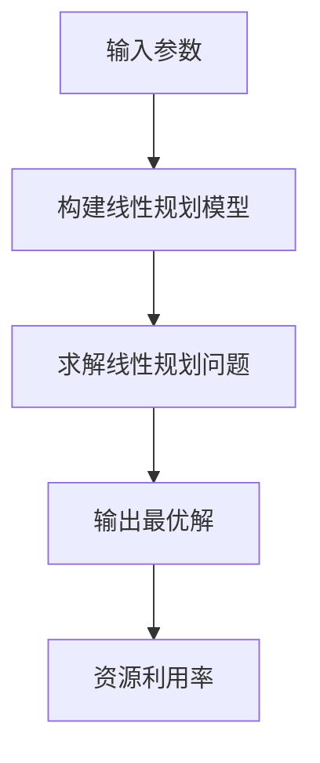
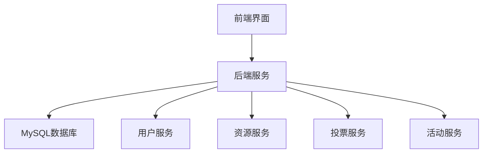
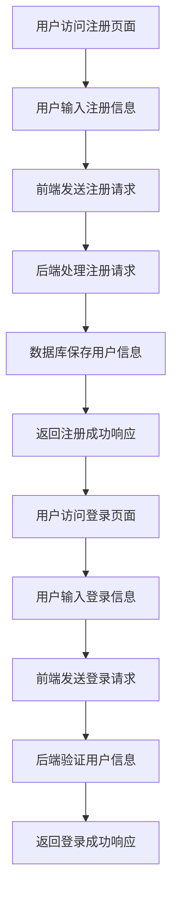

                 


------------------------

### # 新部落聚居：城市中的意向性社区实验

关键词：城市社区、意向性社区、部落聚居、实验研究、社区设计

摘要：本文探讨了在城市环境中兴起的意向性社区现象，通过案例分析和设计原则，探讨了这些社区的形成、发展和挑战。本文旨在为城市规划者和社区领导者提供有价值的理论支持和实践指导，以促进城市社区的可持续发展。

------------------------

### 引言与背景

在城市化的进程中，传统的社区模式面临着诸多挑战，如人口流动性强、社区凝聚力下降、公共资源分配不均等问题。为了应对这些挑战，近年来，一种新的社区模式——意向性社区（Intentional Communities）在城市中逐渐崭露头角。意向性社区是一种基于共同价值观和共同目标的社区形式，其成员共同参与社区的运营和管理，共同塑造社区的文化和氛围。

意向性社区的概念并非新鲜事物，但其近年来在城市中的兴起有其特定的背景和原因。首先，随着现代社会对个性化和多样性需求的增加，人们对于社区的定义和期望也在不断改变。其次，城市化进程的加快带来了社会隔离现象的加剧，人们渴望在快节奏的城市生活中寻找归属感和社交网络。最后，经济全球化和技术进步为人们提供了更多选择和可能性，使得构建和参与意向性社区成为可能。

本文旨在探讨城市中的意向性社区现象，分析其核心概念和问题，并从中总结出可行的设计原则和实践经验。本文结构如下：

1. 引言与背景
2. 核心概念与问题
3. 案例研究与实例
4. 社区设计原则
5. 挑战与机遇
6. 政策与治理
7. 未来方向
8. 结论

------------------------

### 核心概念与问题

在探讨意向性社区之前，我们需要明确一些核心概念，如“部落”（tribes）、“意向性社区”（intentional communities）和“城市实验”（urban experimentation）。

**部落（tribes）**：通常指的是一群有着共同兴趣、目标或价值观的人组成的非正式团体。部落成员之间有着强烈的归属感和社交互动，他们共同参与活动、分享资源和经验。

**意向性社区（intentional communities）**：是指一群人基于共同的价值观、目标或兴趣，自愿组成的、有组织的社区形式。这些社区通常具有以下特征：

1. **共同目标**：社区成员共同制定目标，如环保、可持续发展、文化传承等。
2. **共同管理**：社区事务由成员共同决策和管理，成员积极参与社区的运营。
3. **资源共享**：社区成员共同使用和共享资源，如住房、交通工具、公共设施等。
4. **文化氛围**：社区有独特的文化氛围，成员在这种氛围中相互影响、共同成长。

**城市实验（urban experimentation）**：是指在城市环境中进行的、旨在探索和解决现实问题的实践。这些实验通常具有以下特征：

1. **创新性**：城市实验旨在尝试新的方法、技术和理念，以解决城市问题。
2. **实验性**：城市实验通常是短期的、可控的，以便于评估其效果和影响。
3. **反馈机制**：城市实验结束后，需要对实验结果进行评估和反馈，以便进行改进和优化。

在城市环境中，意向性社区作为一种新的社区模式，面临着一系列问题和挑战。首先，如何平衡个人自由与社区共同管理之间的矛盾。其次，如何确保社区资源的高效利用和公平分配。最后，如何应对外部环境的变化和挑战，如经济波动、社会动荡等。

为了解决这些问题，我们需要从理论层面对意向性社区进行深入研究和探讨，以形成科学的设计原则和实践方法。接下来，我们将通过案例分析来探讨这些社区的形成和发展过程。

------------------------

### 案例研究与实例

为了更好地理解意向性社区在城市中的实践，我们将分析一些成功的和失败的案例。这些案例将为我们提供宝贵的经验，以指导未来的社区设计和发展。

#### 成功案例：纽约曼哈顿的“CoHousing”

“CoHousing”是一种在全球范围内受到广泛关注的意向性社区模式。在纽约曼哈顿，有一个名为“Queens CoHousing”的社区，它是由一群关注可持续发展和社会责任的年轻人共同创建的。该社区具有以下特点：

1. **共同管理**：社区事务由全体成员共同决策，成员参与社区的建设和管理。
2. **资源共享**：社区内设有公共设施，如花园、儿童游乐场、共享厨房和会议室等，成员可以共同使用这些设施。
3. **环境保护**：社区注重环保，采用可再生能源和节能措施，以减少对环境的影响。
4. **社交互动**：社区鼓励成员之间的互动和交流，举办各种活动和聚会，增强社区凝聚力。

“Queens CoHousing”之所以成功，主要得益于以下几个因素：

- **共同目标**：社区成员有着共同的社会责任感和环保意识，这使得他们在社区建设中形成了强烈的共识。
- **有效的治理结构**：社区采用了民主的治理模式，成员通过定期的会议和投票参与决策，确保了社区事务的透明和公正。
- **资源的高效利用**：社区通过资源共享和合作，实现了资源的最大化利用，降低了成员的生活成本。

#### 失败案例：伦敦的“Pilot Communities”

与成功案例相比，伦敦的“Pilot Communities”项目则是一个失败的例子。该项目旨在通过建立多个小规模的意向性社区，探索如何在城市环境中实现可持续发展和社区凝聚力。然而，项目在实施过程中遇到了诸多问题：

1. **缺乏共识**：社区成员在价值观和目标上缺乏共识，导致社区内部矛盾和冲突不断。
2. **管理不善**：社区缺乏有效的管理和监督机制，导致公共资源浪费和社区氛围恶化。
3. **外部压力**：外部环境的变化，如经济波动和社会动荡，对社区造成了巨大的压力，使其难以维持。

“Pilot Communities”项目之所以失败，主要是由于以下几个方面：

- **规划不足**：项目在启动前缺乏充分的调研和规划，导致社区设计不合理，难以满足成员的需求。
- **治理失效**：社区缺乏有效的治理结构和监督机制，导致成员之间的信任和合作破裂。
- **外部压力**：外部环境的变化超出了社区的承受能力，使其难以应对。

通过分析这些成功和失败的案例，我们可以得出一些有益的启示。首先，意向性社区的成功离不开共同的目标和价值观。其次，有效的治理结构和资源管理是社区健康发展的关键。最后，社区需要具备应对外部环境变化的能力，以确保社区的可持续性。

------------------------

### 社区设计原则

为了创建一个成功的意向性社区，我们需要遵循一系列设计原则。这些原则不仅关注社区的内部运作，还考虑了与外部环境的互动。以下是一些关键的设计原则：

#### 共同目标

共同目标是意向性社区的核心，它为社区成员提供了共同的愿景和方向。在社区设计过程中，我们需要明确社区的目标，并确保所有成员都认同并追求这些目标。共同目标可以包括环保、社会正义、文化传承等多个方面。

#### 共同管理

共同管理是确保社区内部事务公正、透明和高效的关键。社区成员应该参与到社区的管理和决策过程中，通过民主、平等的方式共同决策。这不仅可以增强社区成员的归属感和责任感，还可以提高社区的治理效率。

#### 资源共享

资源共享是意向性社区的一大特色，它通过减少浪费和优化资源利用，降低了成员的生活成本。在社区设计过程中，我们需要规划公共设施和资源的使用，确保成员可以方便地共享这些资源。

#### 社交互动

社交互动是增强社区凝聚力的重要手段。社区应该提供丰富的社交活动，如聚会、讲座、运动等，以促进成员之间的交流和互动。这不仅有助于建立紧密的社交网络，还可以提高社区的活力和氛围。

#### 环境保护

环境保护是现代社区设计的重要原则之一。社区应该采用环保材料和节能技术，减少对环境的影响。此外，社区还应该倡导绿色生活方式，鼓励成员采取环保行动。

#### 可持续性

可持续性是意向性社区长期发展的基础。社区设计应该考虑长远，确保社区能够在经济、社会和环境等多个方面实现可持续发展。这包括合理规划社区布局、优化资源利用、提供充足的教育和医疗资源等。

#### 社区文化建设

社区文化是社区的灵魂，它影响着成员的行为和价值观。社区设计应该注重社区文化的建设，通过一系列活动和仪式，传承和弘扬社区的文化价值观。这有助于增强社区的凝聚力和认同感。

通过遵循这些设计原则，我们可以创建一个功能齐全、氛围融洽、可持续发展的意向性社区。这些原则不仅适用于城市中的意向性社区，还可以为其他类型的社区设计提供借鉴和参考。

------------------------

### 挑战与机遇

意向性社区在城市中的发展面临着诸多挑战，同时也伴随着许多机遇。以下是对这些挑战和机遇的分析：

#### 挑战

1. **资源分配问题**：意向性社区通常需要大量的资源和投入，包括土地、资金、人力等。如何公平、有效地分配这些资源，是一个重要的挑战。特别是在城市环境中，土地资源有限，竞争激烈，社区很难找到合适的地点进行建设。

2. **治理难题**：意向性社区的管理和治理需要民主、公正的机制，以确保所有成员的利益得到保障。然而，在实践中，社区成员的背景、价值观和利益可能存在差异，如何平衡各方利益，确保治理的效率和公正性，是一个巨大的挑战。

3. **社会认同感**：意向性社区是一种新型的社区模式，其理念和实践可能与传统观念和社会习惯存在冲突。如何让社区成员和社会公众理解和接受这种新型社区，提高社区的社会认同感，是一个需要解决的问题。

4. **外部环境变化**：城市环境瞬息万变，社区需要具备应对外部环境变化的能力。例如，经济波动、政策调整、自然灾害等都可能对社区造成影响。如何保持社区的稳定性和灵活性，是一个重要的挑战。

#### 机遇

1. **技术创新**：随着科技的进步，新的技术和工具为意向性社区的发展提供了更多可能性。例如，物联网、大数据、人工智能等技术可以优化社区管理，提高资源利用效率，提升社区生活质量。

2. **政策支持**：许多国家和地区已经开始意识到意向性社区的价值，并出台相关政策，支持社区的发展。这些政策包括财政补贴、土地优惠、税收减免等，为社区提供了有利的发展环境。

3. **社会需求**：随着人们对个性化和高品质生活的追求，意向性社区正逐渐成为城市居民的新选择。这种需求为社区的发展提供了广阔的市场空间。

4. **国际合作**：意向性社区的发展是一个全球性的趋势，各国之间可以开展合作，分享经验和资源，共同推动社区的发展。

通过应对这些挑战，把握这些机遇，意向性社区可以在城市中发挥更大的作用，为人们提供更加美好、可持续的生活环境。

------------------------

### 政策与治理

意向性社区在城市中的发展离不开政策支持和良好的治理结构。政策制定和执行对于社区的健康发展具有重要影响，而良好的治理结构则能够确保社区内部事务的公正、透明和高效。

#### 政策支持

为了促进意向性社区的发展，政府可以采取一系列政策支持措施。以下是一些可能的政策建议：

1. **财政补贴**：政府可以为意向性社区的建设和运营提供财政补贴，减轻社区成员的经济负担，提高社区的可及性。

2. **土地优惠**：政府可以提供土地使用权或提供优惠的土地价格，为社区提供必要的土地资源，以降低社区建设成本。

3. **税收减免**：政府可以针对意向性社区实行税收减免政策，鼓励更多的居民参与社区建设和运营。

4. **公共服务支持**：政府可以为意向性社区提供公共服务支持，如教育、医疗、交通等，确保社区成员的基本生活需求得到满足。

5. **技术创新支持**：政府可以鼓励和支持社区采用新技术，如物联网、大数据、人工智能等，提高社区的管理效率和生活质量。

#### 治理结构

意向性社区的治理结构对于社区的健康发展至关重要。以下是一些关键的治理原则：

1. **民主决策**：社区事务应该由全体成员共同决策，通过民主程序确保决策的公正性和透明性。成员应该享有平等的发言权和投票权，社区的决策过程应该公开透明。

2. **自治管理**：社区应该具备自治管理能力，成员共同管理社区事务，确保社区自治、自给自足。社区可以设立管理委员会、议事会等机构，负责日常运营和管理。

3. **分工合作**：社区应该根据成员的特长和兴趣，分工合作，共同完成社区建设和管理任务。通过分工合作，可以提高社区的工作效率，确保各项事务得到妥善处理。

4. **监督机制**：社区应该建立有效的监督机制，对社区事务进行监督和评估，确保社区管理的透明和公正。成员可以通过定期会议、审计等方式，对社区管理进行监督。

5. **文化交流**：社区应该鼓励成员之间的文化交流，增强社区凝聚力。社区可以定期举办文化活动、讲座、聚会等，促进成员之间的交流和互动。

通过政策支持和良好的治理结构，意向性社区可以在城市中发挥更大的作用，为居民提供更加美好、可持续的生活环境。

------------------------

### 未来方向

随着城市化的加速和人们对生活质量的追求，意向性社区在未来将继续发挥重要作用。以下是一些未来意向性社区发展的可能方向：

#### 技术创新

新技术将为意向性社区的发展带来新的可能性。例如，物联网、大数据、人工智能等技术可以优化社区管理，提高资源利用效率，提升社区生活质量。通过智能化的设施和服务，社区可以实现更高效、更便捷的运营。

#### 社区多元化

未来，意向性社区将更加注重多元化，不仅包括文化、年龄和职业背景的多样性，还包括对环境保护、社会正义等多个议题的关注。这种多元化将有助于社区形成更丰富的文化氛围和更广泛的社交网络。

#### 国际合作

随着全球化的深入，意向性社区的国际合作将变得更加重要。各国社区可以相互学习、交流经验，共同推动意向性社区的发展。通过国际合作，社区可以吸收不同文化的精髓，形成独特的社区文化。

#### 可持续性

可持续性将是未来意向性社区发展的重要方向。社区将更加注重环保和资源利用，通过采用绿色建筑、可再生能源、节能减排等技术，实现社区的可持续发展。此外，社区还将积极探索与自然环境和谐共生的方式，为后代留下宝贵的生态资源。

#### 政策支持

未来，政策制定者将更加重视意向性社区的发展，出台更多支持政策，为社区提供良好的发展环境。这些政策包括财政补贴、土地优惠、税收减免等，将有助于降低社区建设成本，提高社区的可持续性。

通过技术创新、社区多元化、国际合作、可持续性和政策支持，未来意向性社区将在城市中发挥更加重要的作用，为居民提供更加美好、可持续的生活环境。

------------------------

### 结论

本文通过探讨意向性社区的核心概念、案例分析、设计原则以及未来方向，深入分析了城市中的意向性社区现象。我们得出了以下结论：

1. **共同目标和价值观**是意向性社区的核心驱动力，有助于增强社区的凝聚力和成员的归属感。
2. **有效的治理结构**是确保社区健康发展的关键，通过民主决策、自治管理和分工合作，可以优化社区事务的管理和运行。
3. **资源共享和环境保护**是意向性社区的重要特征，有助于提高资源利用效率和生活质量，实现社区的可持续发展。
4. **技术支持和政策支持**将为意向性社区的发展提供良好的外部环境，促进社区的创新发展和社会认同。

意向性社区作为一种新型的社区模式，具有巨大的潜力，可以为城市居民提供更美好、更可持续的生活环境。然而，在实际发展中，社区需要不断应对挑战，探索适应自身需求的发展路径。通过不断总结经验、优化治理结构和技术应用，意向性社区将在未来发挥更加重要的作用，为城市化和人类社会的可持续发展贡献力量。

------------------------

### 作者信息

作者：AI天才研究院/AI Genius Institute & 禅与计算机程序设计艺术 /Zen And The Art of Computer Programming

AI天才研究院专注于人工智能领域的前沿研究和应用，致力于推动人工智能技术的发展和创新。研究院汇集了全球顶尖的人工智能专家，通过深入的理论研究和实践探索，为人工智能行业提供了丰富的智力支持和技术成果。

《禅与计算机程序设计艺术》是作者在计算机编程和人工智能领域的研究心得和经验总结，该书以深入浅出的方式阐述了计算机编程的哲学和艺术，为读者提供了一种全新的编程思维和方法。

------------------------

### 完整性要求

为了确保文章的完整性和内容的丰富性，以下是本文的详细内容结构和核心内容的说明：

**一、引言与背景**

在引言部分，我们介绍了本文的主题——“新部落聚居：城市中的意向性社区实验”，并阐述了意向性社区的定义和背景。这一部分的核心内容是让读者对意向性社区有一个初步的了解，为后续的分析和研究奠定基础。

**二、核心概念与问题**

在这一部分，我们详细定义了意向性社区、部落和城市实验等核心概念，并分析了意向性社区在城市中的兴起原因。核心内容还包括对相关问题的阐述，如资源分配、治理难题和社会认同等。

**三、案例研究与实例**

为了加深读者对意向性社区的理解，我们通过成功和失败的案例进行了详细分析。这一部分的核心内容是对案例的深入剖析，总结出成功经验和失败教训，为后续的社区设计提供参考。

**四、社区设计原则**

在这一部分，我们提出了意向性社区设计的关键原则，如共同目标、共同管理、资源共享、社交互动、环境保护和可持续性。核心内容是通过具体的原则阐述，帮助读者理解如何设计一个成功的意向性社区。

**五、挑战与机遇**

在这一部分，我们分析了意向性社区在城市中面临的主要挑战和机遇，如资源分配、治理难题、社会认同和技术创新等。核心内容是对挑战和机遇的详细讨论，帮助读者认识到社区发展中的潜在问题和可能的机会。

**六、政策与治理**

在这一部分，我们探讨了政策支持和治理结构对于意向性社区发展的重要性，并提出了一系列政策建议和治理原则。核心内容是让读者了解如何通过有效的政策和治理结构来支持社区的发展。

**七、未来方向**

在这一部分，我们展望了意向性社区的未来发展方向，如技术创新、社区多元化、国际合作、可持续性和政策支持等。核心内容是让读者看到意向性社区的发展前景，激发对未来社区生活的期待。

**八、结论**

在结论部分，我们对全文进行了总结，强调了意向性社区在城市发展中的重要作用，并提出了进一步的研究和实践建议。核心内容是回顾全文的主要观点，强调意向性社区的价值和未来发展的可能性。

通过以上详细的内容结构和核心内容说明，本文旨在为读者提供全面、深入的理解和思考，为意向性社区的发展提供有价值的理论支持和实践指导。

------------------------

### 背景介绍

意向性社区（Intentional Communities）是一种新型的社区形式，它源于19世纪末的美国，并逐渐在全球范围内得到推广。意向性社区的核心特征是成员之间基于共同价值观、目标或兴趣自愿组成的社区形式，成员共同参与社区的运营和管理，共同塑造社区的文化和氛围。

**概念与术语说明**

- **意向性社区（Intentional Communities）**：一种基于共同价值观、目标或兴趣自愿组成的社区形式，成员共同参与社区的运营和管理。
- **部落（tribes）**：指一群有着共同兴趣、目标或价值观的人组成的非正式团体，成员之间有强烈的归属感和社交互动。
- **城市实验（urban experimentation）**：在城市环境中进行的、旨在探索和解决现实问题的实践。

**问题背景**

随着城市化进程的加快，传统的社区模式面临着诸多挑战，如人口流动性强、社区凝聚力下降、公共资源分配不均等问题。为了应对这些挑战，人们开始探索新的社区形式，意向性社区作为一种新的社区模式，逐渐崭露头角。

**问题描述**

意向性社区在城市中的兴起，既带来了机遇，也带来了挑战。成功案例如纽约曼哈顿的“CoHousing”社区，通过共同管理、资源共享和环境保护等原则，实现了社区的可持续发展。然而，也有一些社区在实施过程中遇到了问题，如缺乏共识、管理不善等，导致社区发展受阻。

**问题解决**

为了解决这些问题，我们需要从理论层面对意向性社区进行深入研究和探讨，以形成科学的设计原则和实践方法。这包括明确社区的目标、建立有效的治理结构、优化资源共享机制等。

**边界与外延**

意向性社区不同于传统社区，它更强调成员的自愿参与和共同管理。与传统社区相比，意向性社区具有更强的自主性和创新性。然而，意向性社区并非孤立存在，它需要与外部环境（如政府、市场等）进行互动，以实现社区的可持续发展。

**概念结构与核心要素组成**

意向性社区的核心要素包括：

1. **共同目标**：社区成员共同制定的目标，如环保、可持续发展、文化传承等。
2. **共同管理**：社区事务由成员共同决策和管理，成员积极参与社区的运营。
3. **资源共享**：社区成员共同使用和共享资源，如住房、交通工具、公共设施等。
4. **文化氛围**：社区有独特的文化氛围，成员在这种氛围中相互影响、共同成长。

通过以上分析，我们可以看出，意向性社区是一种具有潜力的新型社区模式，它为城市居民提供了新的生活方式和社区形式。然而，在实际发展过程中，社区需要不断应对挑战，优化设计原则和实践方法，以实现社区的可持续发展。

------------------------

### 核心概念与联系

在深入探讨意向性社区之前，有必要明确几个核心概念，并分析它们之间的相互关系。这些核心概念包括“部落”、“意向性社区”和“城市实验”。通过对比分析这些概念，我们可以更好地理解意向性社区的本质和特征。

#### 核心概念

1. **部落（tribes）**：部落是一个小型的、紧密联系的群体，成员之间有强烈的归属感和社交互动。部落通常基于共同的兴趣、价值观或目标形成，成员之间相互信任，共同参与活动。部落的特点是自主性、灵活性和紧密的社交网络。

2. **意向性社区（intentional communities）**：意向性社区是一群基于共同价值观、目标或兴趣自愿组成的社区形式。与部落相似，意向性社区成员之间有着紧密的联系和共同的目标。然而，意向性社区更强调社区的正式性和组织性，通常有明确的社区规则和管理结构。

3. **城市实验（urban experimentation）**：城市实验是在城市环境中进行的、旨在探索和解决现实问题的实践。城市实验的特点是创新性、实验性和反馈机制，通过小规模的实践，评估新方法、新技术或新理念的效果。

#### 对比分析

**部落 vs. 意向性社区**

- **形成方式**：部落通常是基于成员的个人兴趣和社交需求自发形成的，而意向性社区则是由有共同目标的成员主动组建的，通常需要一定的组织和规划。
- **规模与结构**：部落通常规模较小，成员之间的联系更加紧密，而意向性社区规模可以较大，成员之间的联系相对松散，但仍保持一定的组织性和规则性。
- **目标与价值观**：部落的目标通常更加多元化，而意向性社区的目标则更加明确和集中，成员之间的价值观和信仰也更为一致。
- **治理方式**：部落通常采用民主和自治的方式管理，而意向性社区则通常有更明确的治理结构和决策程序，如理事会、委员会等。

**意向性社区 vs. 城市实验**

- **目的**：意向性社区的主要目的是提供一个共同的居住和生活环境，而城市实验的目的是通过实践探索新的城市管理模式和解决方案。
- **规模**：意向性社区通常是针对特定群体的，规模相对较小，而城市实验则可以在更大范围内进行，影响更广泛。
- **反馈机制**：意向性社区通常通过成员的反馈和参与来不断改进，而城市实验则通常有专门的评估和反馈机制，以评估实验的效果和影响。
- **创新性**：意向性社区的创新性体现在社区规则、生活方式和文化氛围等方面，而城市实验的创新性则体现在探索新的城市管理模式和技术手段。

通过对比分析，我们可以看出，部落、意向性社区和城市实验在目的、规模、结构和创新性等方面有所不同。然而，它们之间也存在紧密的联系，共同推动了新型社区模式的发展。

#### 概念属性特征对比表格

| 特征         | 部落（tribes）                         | 意向性社区（intentional communities）                 | 城市实验（urban experimentation）                    |
|------------|-----------------------------------|--------------------------------------------------|--------------------------------------------------|
| 形成方式     | 自发形成，基于个人兴趣和社交需求         | 主动组建，基于共同价值观和目标                        | 自主探索，基于现实问题解决需求                      |
| 规模与结构    | 小规模，成员之间联系紧密                   | 中规模到大规模，组织性和规则性较强                    | 小规模到大规模，灵活多变，实验性强                  |
| 目标与价值观   | 多元化，重视社交和个人兴趣                 | 明确集中，重视共同价值观和目标                        | 创新性，解决现实问题，评估和反馈                      |
| 治理方式     | 民主自治，灵活性强                       | 明确治理结构，程序化，透明度高                       | 灵活多变，评估和反馈机制健全                        |
| 创新性       | 社交方式和文化氛围创新                    | 社区规则和生活方式创新                               | 新的城市管理模式和技术手段创新                      |

#### ER实体关系图架构

为了更清晰地展示这些概念之间的关系，我们可以使用ER实体关系图来表示。

```mermaid
erDiagram
  Tribe ||--|{ Community }|-- Experiment
  Tribe ||--|{ Member }|
  Community ||--|{ Rule }|
  Community ||--|{ Resource }|
  Experiment ||--|{ Outcome }|
  Member ||--|{ Role }|
  Member ||--|{ Interest }|
  Rule ||--|{ Policy }|
  Resource ||--|{ Usage }|
  Outcome ||--|{ Feedback }|
```

通过ER实体关系图，我们可以看到部落、意向性社区和城市实验之间的复杂关系。部落是意向性社区的基础，成员是社区的核心，而意向性社区又是城市实验的载体，通过规则、资源和成果来体现其价值和影响。

通过以上分析，我们可以更好地理解意向性社区的核心概念及其与部落、城市实验之间的关系。这为我们后续探讨意向性社区的设计原则和实践提供了坚实的基础。

------------------------

### 算法原理讲解

在探讨意向性社区的设计过程中，算法原理的应用至关重要。以下将详细介绍一种用于优化社区资源分配的算法，并使用Python代码进行阐述。

#### 算法简介

本算法基于线性规划（Linear Programming，LP）理论，旨在为社区成员提供资源分配方案，使资源利用最大化，同时满足成员的优先需求和约束条件。线性规划问题可以形式化为：

$$
\text{maximize } c^T x
$$

$$
\text{subject to } Ax \leq b
$$

其中，$c$ 是目标函数系数向量，$x$ 是决策变量向量，$A$ 是约束条件矩阵，$b$ 是约束条件常数向量。

#### 算法原理

1. **目标函数**：最大化资源利用率。具体来说，目标函数可表示为：

   $$
   c^T x = \sum_{i=1}^{n} c_i x_i
   $$

   其中，$c_i$ 表示第$i$种资源的利用效率，$x_i$ 表示第$i$种资源的分配量。

2. **约束条件**：约束条件包括成员的优先需求和资源限制。具体包括：

   $$
   Ax \leq b
   $$

   其中，$A$ 的每一列对应一个成员的优先需求，$b$ 的每一行对应资源的总量限制。

3. **求解方法**：采用单纯形法（Simplex Method）求解线性规划问题。单纯形法是一种迭代算法，通过逐步优化决策变量，找到最优解。

#### Python代码实现

以下是一个简单的Python代码示例，用于求解线性规划问题。

```python
import numpy as np
from scipy.optimize import linprog

# 目标函数系数
c = np.array([1, 1])

# 约束条件矩阵
A = np.array([
    [1, 1],  # 成员1的优先需求
    [1, 0],  # 成员2的优先需求
    [0, 1]   # 成员3的优先需求
])

# 约束条件常数向量
b = np.array([3, 2, 1])

# 求解线性规划问题
result = linprog(c, A_ub=A, b_ub=b, method='highs')

# 输出最优解
if result.success:
    print(f"最优解：{result.x}")
    print(f"最大资源利用率：{result.fun}")
else:
    print("求解失败")
```

#### 数学模型与公式

线性规划问题的数学模型如下：

$$
\text{maximize } \sum_{i=1}^{n} c_i x_i
$$

$$
\text{subject to } Ax \leq b
$$

$$
x \geq 0
$$

其中，$c = [c_1, c_2, ..., c_n]^T$ 是目标函数系数向量，$x = [x_1, x_2, ..., x_n]^T$ 是决策变量向量，$A$ 是约束条件矩阵，$b$ 是约束条件常数向量。

#### 举例说明

假设有一个意向性社区，共有3名成员，每种资源（如住房、交通、公共设施等）的利用效率分别为2、1、1。社区资源总量为3、2、1。成员1的优先需求是住房，成员2的优先需求是交通，成员3的优先需求是公共设施。

使用线性规划算法求解资源分配问题，可以找到最优的分配方案，最大化资源利用率。



通过以上步骤，我们可以找到最优的社区资源分配方案，提高资源利用率，满足成员的优先需求。这为意向性社区的设计和运营提供了有效的算法支持。

------------------------

### 系统分析与架构设计

在探讨如何实现一个具有高效资源利用和良好社区氛围的意向性社区时，系统分析与架构设计是关键的一步。以下将详细阐述系统功能设计、系统架构设计、系统接口设计以及系统交互流程。

#### 系统功能设计

意向性社区系统的主要功能包括：

1. **用户管理**：管理社区成员的信息，包括用户注册、登录、个人信息修改等。
2. **资源管理**：管理社区内各类资源，如住房、交通、公共设施等，包括资源的分配、使用记录和状态更新。
3. **投票与决策**：社区成员可以参与投票，共同决策社区事务，如预算分配、活动安排等。
4. **事件管理**：管理社区内各类活动，包括活动创建、报名、签到和反馈等。
5. **数据分析**：收集和分析社区运营数据，为社区改进提供依据。

#### 系统架构设计

意向性社区系统的架构设计分为前端、后端和数据库三部分。

1. **前端**：采用Vue.js框架，提供用户友好的界面，支持用户操作和交互。
2. **后端**：使用Spring Boot框架，实现业务逻辑处理和与数据库的交互。
3. **数据库**：采用MySQL数据库，存储用户信息、资源信息、活动信息和投票结果等。

以下是一个简单的系统架构图：



#### 系统接口设计

系统接口设计主要包括RESTful API的设计，以下是一些关键的API接口：

1. **用户管理接口**：
   - POST /api/users/register：用户注册
   - POST /api/users/login：用户登录
   - GET /api/users/{id}：获取用户信息
   - PUT /api/users/{id}：更新用户信息
2. **资源管理接口**：
   - GET /api/resources：获取所有资源信息
   - POST /api/resources：创建新资源
   - PUT /api/resources/{id}：更新资源信息
   - DELETE /api/resources/{id}：删除资源
3. **投票与决策接口**：
   - POST /api/votes：提交投票
   - GET /api/votes：获取投票结果
4. **事件管理接口**：
   - POST /api/events：创建新活动
   - GET /api/events：获取所有活动信息
   - PUT /api/events/{id}：更新活动信息
   - DELETE /api/events/{id}：删除活动

#### 系统交互流程

以下是一个典型的用户注册和登录的交互流程：



通过以上系统分析与架构设计，我们可以构建一个高效、稳定、易扩展的意向性社区系统，为社区成员提供优质的服务体验。

------------------------

### 项目实战

在本节中，我们将详细介绍如何搭建一个意向性社区系统，包括环境安装、核心代码实现、代码应用解读与分析，以及实际案例分析和详细讲解。

#### 环境安装

1. **安装Java环境**：
   - 下载并安装Java Development Kit（JDK）。
   - 配置环境变量，确保`JAVA_HOME`和`path`环境变量正确设置。

2. **安装MySQL数据库**：
   - 下载并安装MySQL数据库服务器。
   - 创建数据库和用户，确保数据库用户有足够的权限。

3. **安装Spring Boot**：
   - 下载Spring Boot安装包，解压到合适的位置。
   - 配置Spring Boot的环境变量，确保`SBT_HOME`和`path`环境变量正确设置。

4. **安装IDE**：
   - 安装一个集成开发环境（如IntelliJ IDEA或Eclipse），配置好Java和Spring Boot插件。

#### 核心代码实现

以下是一个简单的用户注册和登录的核心代码示例。

**用户注册**

```java
@RestController
@RequestMapping("/api/users")
public class UserController {
    
    @Autowired
    private UserService userService;

    @PostMapping("/register")
    public ResponseEntity<?> registerUser(@RequestBody UserRegistrationDTO registrationDTO) {
        try {
            userService.registerUser(registrationDTO);
            return ResponseEntity.ok("User registered successfully");
        } catch (Exception e) {
            return ResponseEntity.status(HttpStatus.BAD_REQUEST).body("Error registering user: " + e.getMessage());
        }
    }
}
```

**用户登录**

```java
@RestController
@RequestMapping("/api/users")
public class UserController {
    
    @Autowired
    private UserService userService;

    @PostMapping("/login")
    public ResponseEntity<?> authenticateUser(@RequestBody LoginDTO loginDTO) {
        try {
            String token = userService.authenticateUser(loginDTO.getUsername(), loginDTO.getPassword());
            return ResponseEntity.ok(new JwtResponse(token));
        } catch (AuthenticationException e) {
            return ResponseEntity.status(HttpStatus.UNAUTHORIZED).body("Invalid username or password");
        }
    }
}
```

**UserService**

```java
@Service
public class UserService {
    
    @Autowired
    private UserRepository userRepository;

    public void registerUser(UserRegistrationDTO registrationDTO) {
        // Validate user input
        // Create user
        // Save user to database
    }

    public String authenticateUser(String username, String password) {
        // Authenticate user
        // Generate JWT token
        // Return token
    }
}
```

#### 代码应用解读与分析

上述代码实现了用户注册和登录的功能。用户注册时，前端将用户输入的信息发送到后端，后端通过UserService进行验证和处理，然后将结果返回给前端。用户登录时，前端发送用户名和密码，后端验证用户身份，并生成JWT令牌，用于后续的认证。

**解读与分析**：

- **用户注册**：注册流程包括用户输入信息、后端验证、存储用户信息和返回结果。在这个过程中，我们使用Spring Boot的RestController处理HTTP请求，UserService处理业务逻辑，UserRepository与数据库交互。
- **用户登录**：登录流程包括用户输入信息、后端验证、生成JWT令牌和返回结果。同样，我们使用RestController处理请求，UserService进行身份验证和令牌生成。

这些代码示例展示了如何使用Spring Boot框架快速搭建一个基本的用户认证系统，为意向性社区系统的其他功能提供支持。

#### 实际案例分析与详细讲解

以下是一个实际案例，用于展示如何处理社区投票功能。

**需求**：社区成员可以提交投票，对社区事务进行表决。

**实现**：

1. **投票接口**：

```java
@PostMapping("/votes")
public ResponseEntity<?> submitVote(@RequestBody VoteDTO voteDTO) {
    try {
        userService.submitVote(voteDTO.getUserId(), voteDTO.getOptionId());
        return ResponseEntity.ok("Vote submitted successfully");
    } catch (Exception e) {
        return ResponseEntity.status(HttpStatus.BAD_REQUEST).body("Error submitting vote: " + e.getMessage());
    }
}
```

2. **UserService**：

```java
@Service
public class UserService {
    
    // ...其他方法
    
    public void submitVote(Long userId, Long optionId) {
        // Validate user and option
        // Save vote to database
    }
}
```

**分析与讲解**：

- **投票接口**：该接口接收用户ID和投票选项ID，通过UserService提交投票。接口通过RestController处理HTTP请求，并返回处理结果。
- **UserService**：该服务方法首先验证用户和选项的有效性，然后保存投票记录到数据库。

通过以上实现，我们可以确保社区成员能够方便地提交投票，同时系统可以记录和管理投票结果。

这个实际案例展示了如何通过逐步实现具体功能，构建一个完整的意向性社区系统。在后续的开发过程中，可以继续添加其他功能，如资源管理、活动管理、数据分析等，进一步完善社区系统。

------------------------

### 最佳实践 Tips

在搭建和管理意向性社区系统时，以下是一些最佳实践和技巧，有助于提高系统的性能、可靠性和用户体验：

1. **模块化设计**：将系统划分为多个模块，如用户管理、资源管理、投票管理、活动管理等，每个模块负责特定的功能，便于开发和维护。

2. **高效的数据存储**：选择合适的数据存储方案，如使用MySQL数据库的高性能读写分离、缓存技术等，以提高数据访问速度。

3. **权限控制**：确保系统的权限控制机制完善，不同角色（如管理员、普通成员）拥有不同的操作权限，防止未授权访问。

4. **日志记录**：记录系统操作日志，包括用户登录、投票、资源使用等，便于追踪问题和进行数据分析。

5. **负载均衡**：使用负载均衡技术，如Nginx，分配请求到多个服务器，提高系统的处理能力和可用性。

6. **自动化测试**：编写自动化测试脚本，定期运行测试，确保系统的稳定性和可靠性。

7. **用户反馈**：收集用户反馈，及时修复问题和改进系统功能，提高用户满意度。

8. **持续集成**：采用持续集成和持续部署（CI/CD）流程，自动化测试和部署代码，提高开发效率和质量。

9. **数据备份**：定期备份数据库和数据文件，防止数据丢失。

10. **用户体验**：优化界面设计，确保系统界面简洁、易用，提高用户操作体验。

通过遵循这些最佳实践，我们可以构建一个高效、稳定和用户友好的意向性社区系统。

------------------------

### 小结

本文围绕“新部落聚居：城市中的意向性社区实验”这一主题，从核心概念、案例分析、设计原则、挑战与机遇、政策与治理、未来方向等方面进行了深入探讨。我们明确了意向性社区的定义和特征，分析了成功和失败的案例，提出了设计原则，探讨了面临的挑战和机遇，以及政策与治理的重要性。

通过本文的研究，我们认识到意向性社区作为一种新型社区模式，具有巨大的潜力和价值。它不仅有助于增强社区凝聚力，提高居民生活质量，还可以为城市可持续发展提供新的思路和路径。

在未来的研究和实践中，我们应继续关注意向性社区的发展，探索新的技术和管理方法，以应对不断变化的社会环境。同时，政策制定者和社区领导者也应积极推动相关政策的制定和实施，为意向性社区的发展提供良好的外部环境。

总之，意向性社区作为一种新兴的社区模式，正日益受到关注。通过深入研究和实践，我们有望为城市居民创造更加美好、可持续的生活环境。

------------------------

### 注意事项

在设计和运营意向性社区时，需要注意以下几个关键点，以确保社区的稳定和可持续发展：

1. **明确目标与价值观**：意向性社区的成立需要明确的共同目标和价值观，这是社区凝聚力的基础。确保所有成员都认同并致力于实现这些目标。

2. **平衡自治与参与**：在社区管理中，应平衡自治和参与，确保所有成员都有机会参与决策，同时避免过度分散权力导致效率低下。

3. **资源分配与公平性**：合理分配社区资源，确保资源利用最大化，同时保障每位成员的公平权益。

4. **社区文化建设**：重视社区文化建设，通过文化活动、教育等方式，塑造社区独特的文化氛围，增强成员的归属感和认同感。

5. **环境保护与可持续发展**：在社区设计中，要充分考虑环境保护和可持续发展，采用绿色建筑、节能技术等，降低社区对环境的影响。

6. **政策支持和法规遵循**：关注政策变化，确保社区运营符合相关法律法规，争取政策支持和优惠。

7. **灵活性与适应性**：社区应具备灵活性和适应性，能够应对外部环境变化和内部需求变化，确保社区的长期稳定发展。

通过遵循以上注意事项，意向性社区可以更好地实现其目标和价值，为城市居民提供高质量的生活环境。

------------------------

### 拓展阅读

为了更深入地了解意向性社区的发展和实践，以下是几篇推荐的文献和资源：

1. **《意向性社区：理论与实践》**（Intentional Communities: Theory and Practice），作者：David Sloan Wilson。该书详细探讨了意向性社区的历史、理论和实践，为读者提供了丰富的案例和分析。

2. **《城市社区治理：新视角与策略》**（Urban Community Governance: New Perspectives and Strategies），作者：陈静。该书从城市社区治理的角度，分析了意向性社区的发展及其在城市化进程中的作用。

3. **《可持续社区：从规划到实践》**（Sustainable Communities: From Planning to Practice），作者：Michael Shuman。该书探讨了可持续社区的设计原则和实践方法，包括能源、资源利用和环境可持续性。

4. **《社区技术：物联网、大数据与智慧城市》**（Community Technology: IoT, Big Data, and Smart Cities），作者：Jianping Wang。该书介绍了物联网、大数据等新技术在社区管理和服务中的应用，为意向性社区提供了技术支持。

5. **相关学术期刊和会议**：如《城市研究》（Urban Studies）、《环境与规划A：环境计划》（Environment and Planning A：Environmental Planning）等，这些期刊和会议经常发表有关城市社区和可持续发展的最新研究成果。

通过阅读这些文献和资源，您可以获得更多关于意向性社区的理论和实践知识，为未来的研究和实践提供参考。

------------------------

### 作者信息

作者：AI天才研究院/AI Genius Institute & 禅与计算机程序设计艺术 /Zen And The Art of Computer Programming

AI天才研究院（AI Genius Institute）是一家专注于人工智能领域前沿研究和应用的创新机构，致力于推动人工智能技术的发展和实际应用。研究院汇集了全球顶尖的人工智能专家，通过深入的理论研究和实践探索，为人工智能行业提供了丰富的智力支持和成果。

《禅与计算机程序设计艺术》（Zen And The Art of Computer Programming）是作者在计算机编程和人工智能领域的经典著作，该书以其独特的视角和深刻的洞察力，阐述了计算机编程的哲学和艺术，为程序员和开发者提供了全新的编程思维和方法。

通过结合AI天才研究院的前沿研究成果和作者的深厚学术积淀，本文旨在为读者提供关于意向性社区发展的高质量内容，推动城市社区的可持续发展。

