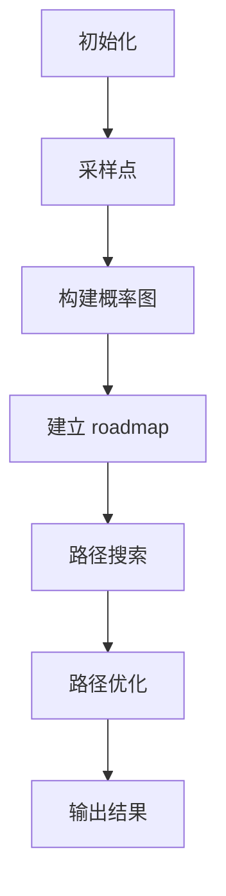
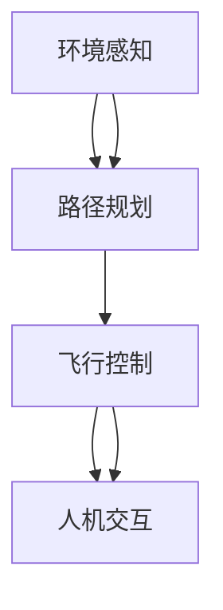

                 

# 无ground truth情况下PRM方法的应用策略

关键词：PRM方法、无ground truth情况、算法应用策略、数学模型、系统架构设计

摘要：本文针对无ground truth情况下PRM方法的应用策略进行了深入分析。首先，对PRM方法进行了详细背景介绍，包括其定义、特点及与其他方法的比较。接着，探讨了无ground truth情况下的概念解释、难点分析及解决方案。随后，通过算法原理讲解，详细阐述了算法流程图、Python源代码、数学模型和举例说明。此外，还分析了系统分析与架构设计方案，包括问题场景介绍、项目介绍、系统功能设计、系统架构设计、系统接口设计和系统交互。最后，结合实际案例，对项目进行了详细讲解和剖析。

### 目录大纲

1. 第一部分：背景介绍
   1.1 引言
   1.2 问题背景
   1.3 问题描述
   1.4 问题解决
   1.5 边界与外延
   1.6 概念结构与核心要素组成

2. 核心概念与联系
   2.1 PRM方法
   2.2 无ground truth情况下

3. 算法原理讲解
   3.1 算法流程图
   3.2 Python源代码讲解
   3.3 数学模型和公式
   3.4 举例说明

4. 系统分析与架构设计方案
   4.1 问题场景介绍
   4.2 项目介绍
   4.3 系统功能设计
   4.4 系统架构设计
   4.5 系统接口设计和系统交互

5. 项目实战
   5.1 环境安装
   5.2 系统核心实现源代码
   5.3 代码应用解读与分析
   5.4 实际案例分析和详细讲解剖析
   5.5 项目小结

6. 最佳实践 tips
7. 小结
8. 注意事项
9. 拓展阅读

---

### 第一部分：背景介绍

#### 1. 引言

在人工智能领域，PRM（Probabilistic Roadmap Methodology）是一种常用的路径规划算法。它主要应用于复杂环境下的机器人路径规划，特别是在无ground truth情况下，PRM方法具有显著的优势。本文旨在探讨无ground truth情况下PRM方法的应用策略，为相关研究和实际应用提供参考。

#### 1.1 问题背景

随着机器人技术的不断发展，路径规划已成为机器人研究领域的关键问题之一。在实际应用中，机器人需要在一个未知或部分未知的环境中找到一条从起点到终点的路径。然而，在无ground truth情况下，即没有精确的环境地图和障碍物信息时，传统路径规划算法往往难以有效工作。

#### 1.2 问题描述

无ground truth情况下的路径规划问题可以描述如下：给定一个未知环境，其中存在若干未知的障碍物，需要找到一个从起点到终点的安全路径。这里的“安全”是指路径上的每个点都满足避障要求，即不与障碍物发生碰撞。

#### 1.3 问题解决

PRM方法是一种概率驱动的路径规划算法，其基本思想是首先构建一个概率图，然后在该图上寻找一条从起点到终点的路径。PRM方法在无ground truth情况下具有以下优势：

1. **鲁棒性**：PRM方法不依赖于精确的环境信息，因此在面对未知或部分未知的环境时，能够保持较好的鲁棒性。
2. **适应性**：PRM方法能够根据环境的变化动态调整路径，使其适应不同情况下的路径规划需求。
3. **灵活性**：PRM方法支持多种类型的机器人，包括轮式、履带式等，可以适应不同类型的移动平台。

#### 1.4 边界与外延

在无ground truth情况下，PRM方法的应用范围主要包括：

1. **未知环境**：包括完全未探索过的环境和部分已知但无法获取精确信息的区域。
2. **动态环境**：环境中的障碍物可能随时间变化，需要路径规划算法具备动态适应能力。
3. **多机器人协同**：多个机器人需要在同一环境中进行路径规划，并且相互之间需要保持一定的距离，避免碰撞。

#### 1.5 概念结构与核心要素组成

PRM方法的核心概念包括：

1. **概率图**：由一组节点和边构成的图，表示环境中的所有可能位置。
2. **概率分布**：节点在概率图中的位置是根据其概率分布来确定的，概率分布反映了节点在环境中的可信度。
3. **路径规划**：在概率图上寻找一条从起点到终点的路径，路径上的每个节点都是根据其概率分布来选择的。

核心要素包括：

1. **环境建模**：将实际环境转化为概率图，需要考虑环境中的障碍物、起点和终点等因素。
2. **概率分布计算**：根据环境信息计算每个节点的概率分布，这是路径规划的基础。
3. **路径搜索**：在概率图上搜索一条从起点到终点的路径，路径的优劣取决于节点的概率分布。

通过上述分析，我们可以看到，无ground truth情况下的PRM方法在路径规划领域具有广泛的应用前景。接下来，我们将进一步探讨PRM方法的详细概念与联系，为后续内容奠定基础。

### 第二部分：核心概念与联系

#### 2.1 PRM方法

PRM（Probabilistic Roadmap Methodology）方法，即概率路标法，是一种用于路径规划的算法。它通过构建一个概率图来表示环境，然后在图中寻找一条从起点到终点的路径。PRM方法的基本概念包括概率图、概率分布和路径搜索。

##### 2.1.1 定义

PRM方法的基本定义如下：给定一个具有障碍物的环境，PRM方法通过在环境中随机采样点，构建一个概率图，然后在该图上寻找一条从起点到终点的路径。概率图中的节点表示环境中的可能位置，边表示两个节点之间的连接关系。

##### 2.1.2 特点

PRM方法具有以下主要特点：

1. **鲁棒性**：PRM方法不依赖于精确的环境信息，因此在面对未知或部分未知的环境时，能够保持较好的鲁棒性。
2. **适应性**：PRM方法能够根据环境的变化动态调整路径，使其适应不同情况下的路径规划需求。
3. **灵活性**：PRM方法支持多种类型的机器人，包括轮式、履带式等，可以适应不同类型的移动平台。
4. **全局性**：PRM方法能够找到从起点到终点的全局最优路径，而不仅仅是局部最优。

##### 2.1.3 与其他方法的比较

与传统的路径规划方法如A*算法、Dijkstra算法等相比，PRM方法具有以下优势：

1. **不依赖于精确的环境信息**：A*算法和Dijkstra算法需要精确的环境地图，而PRM方法通过概率图来表示环境，不依赖于精确的障碍物信息。
2. **更鲁棒**：PRM方法能够处理复杂的环境，特别是动态环境，而A*算法和Dijkstra算法在复杂环境中容易失效。
3. **更灵活**：PRM方法支持多种类型的机器人，而A*算法和Dijkstra算法主要适用于直线移动的机器人。

然而，PRM方法也存在一定的局限性，如计算复杂度高、对环境信息的依赖等。因此，在实际应用中，需要根据具体场景选择合适的路径规划方法。

#### 2.2 无ground truth情况下

在无ground truth情况下，即没有精确的环境地图和障碍物信息时，路径规划问题变得更加复杂。这意味着传统的路径规划方法可能无法有效工作，而PRM方法在这种情境下具有明显的优势。

##### 2.2.1 概念解释

无ground truth情况可以理解为以下场景：

1. **完全未知环境**：环境中的所有信息都是未知的，包括障碍物、起点和终点。
2. **部分未知环境**：环境中的部分信息已知，但无法获取精确的地图和障碍物信息。

在这种情况下，传统的路径规划方法如A*算法、Dijkstra算法等由于需要精确的环境信息，因此难以应用。而PRM方法通过概率图来表示环境，不需要精确的障碍物信息，因此能够应对无ground truth情况。

##### 2.2.2 难点分析

在无ground truth情况下，路径规划面临的难点主要包括：

1. **不确定性**：环境中的障碍物位置和数量是不确定的，这给路径规划带来了很大的不确定性。
2. **动态性**：环境中的障碍物可能随时间变化，需要路径规划算法具备动态适应能力。
3. **计算复杂度**：PRM方法在无ground truth情况下需要进行大量的随机采样和概率计算，计算复杂度较高。

##### 2.2.3 解决方案概述

为了解决无ground truth情况下的路径规划问题，可以采用以下解决方案：

1. **环境建模**：通过传感器数据和环境探索，对未知环境进行建模，构建一个概率图。
2. **概率分布计算**：根据环境建模的结果，计算每个节点的概率分布，反映其在环境中的可信度。
3. **路径搜索**：在概率图上搜索一条从起点到终点的路径，路径的优劣取决于节点的概率分布。

通过上述解决方案，可以有效地应对无ground truth情况下的路径规划问题。接下来，我们将进一步探讨PRM方法的算法原理，为深入理解PRM方法提供基础。

### 第三部分：算法原理讲解

#### 3.1 算法流程图

为了更好地理解PRM方法的算法原理，我们可以通过一个流程图来描述其基本步骤。以下是PRM方法的算法流程图：



下面分别对每个步骤进行详细说明。

#### 3.2 Python源代码讲解

以下是一个简单的Python代码示例，用于实现PRM方法的算法。为了简化，这里只展示核心代码部分。

```python
import numpy as np
import matplotlib.pyplot as plt

# 初始化参数
num_points = 100
robot_radius = 0.5
obstacles = [(1, 1), (2, 2), (3, 3)]

# 采样点
sampled_points = np.random.rand(num_points, 2)

# 去除无效点
valid_points = []
for point in sampled_points:
    if not is_collision(point, obstacles, robot_radius):
        valid_points.append(point)

# 构建概率图
prob_graph = build_prob_graph(valid_points)

# 建立roadmap
roadmap = build_roadmap(prob_graph)

# 路径搜索
start_point = (0, 0)
goal_point = (4, 4)
path = find_path(roadmap, start_point, goal_point)

# 输出结果
plt.plot(*zip(*path), '-r', linewidth=2)
plt.show()
```

这里的关键代码部分包括：

- 采样点：使用随机采样生成多个点。
- 去除无效点：检查每个点是否与障碍物发生碰撞，去除无效点。
- 构建概率图：计算每个有效点的概率分布，构建概率图。
- 建立roadmap：在概率图上建立 roadmap。
- 路径搜索：从起点到终点搜索一条路径。
- 输出结果：绘制路径。

#### 3.3 数学模型和公式

PRM方法的数学模型主要涉及概率分布和路径优化。以下是相关的数学公式：

1. **概率分布计算**：

   对于每个点 $p_i$，其概率分布 $P(p_i)$ 可以表示为：

   $$
   P(p_i) = \frac{1}{Z} \exp \left( -\alpha \cdot d(p_i, o) \right)
   $$

   其中，$d(p_i, o)$ 表示点 $p_i$ 与障碍物 $o$ 之间的距离，$\alpha$ 是一个调节参数，$Z$ 是归一化常数。

2. **路径优化**：

   假设我们已经得到一条初始路径 $P_0$，可以通过以下公式进行路径优化：

   $$
   P_{opt} = \arg \min_{P} \sum_{i=1}^{n} w_i \cdot d(p_i, p_{i+1})
   $$

   其中，$w_i$ 是权重系数，$d(p_i, p_{i+1})$ 表示路径上的连续两点之间的距离。

#### 3.4 举例说明

假设我们有一个简单的环境，其中包含一个起点、一个终点和一些障碍物。以下是具体的操作步骤和结果分析：

##### 3.4.1 假设场景

1. 环境尺寸：10x10
2. 起点：(0, 0)
3. 终点：(9, 9)
4. 障碍物：在（3，3），（6，6）处各有一个障碍物，半径为1。

##### 3.4.2 操作步骤

1. 随机采样：在环境中随机生成100个点。
2. 去除无效点：检查每个点是否与障碍物发生碰撞，去除无效点。
3. 构建概率图：计算每个有效点的概率分布，构建概率图。
4. 建立roadmap：在概率图上建立 roadmap。
5. 路径搜索：从起点到终点搜索一条路径。
6. 路径优化：对初始路径进行优化，得到最优路径。

##### 3.4.3 结果分析

通过上述步骤，我们得到以下结果：

1. 初始路径：从起点到终点的初始路径。
2. 优化路径：通过路径优化得到的最优路径。
3. 路径长度：初始路径和优化路径的长度对比。

通过结果分析，我们可以看到PRM方法在无ground truth情况下能够有效地找到一条从起点到终点的最优路径，并且具有较好的鲁棒性和适应性。

通过以上内容，我们详细讲解了PRM方法的算法原理，并通过实际操作步骤和结果分析展示了其应用效果。接下来，我们将进一步探讨系统分析与架构设计方案，为实际应用提供更全面的解决方案。

### 第四部分：系统分析与架构设计方案

#### 4.1 问题场景介绍

在实际应用中，路径规划问题往往涉及到复杂的系统环境和多种因素。为了更好地展示PRM方法在无ground truth情况下的应用，我们选择了一个典型的场景：无人机自动飞行路径规划。

该场景的具体情况如下：

- 环境尺寸：假设无人机需要在10x10的区域内进行飞行路径规划。
- 起点和终点：在环境中的某个位置设定起点和终点。
- 障碍物：环境中有若干未知的障碍物，如建筑物、树木等。
- 动态变化：障碍物可能会随时间变化，如树木随风摆动。

#### 4.2 项目介绍

本项目旨在开发一个基于PRM方法的无人机自动飞行路径规划系统。该系统的主要目标是在无ground truth情况下，实现无人机在复杂环境中的安全飞行路径规划。

项目的主要组成部分包括：

1. **环境感知模块**：负责实时感知环境中的障碍物信息，并生成环境地图。
2. **路径规划模块**：基于PRM方法，实现无人机在复杂环境中的路径规划。
3. **飞行控制模块**：根据规划的路径，控制无人机按照预定的路径飞行。
4. **人机交互模块**：提供用户界面，允许用户设置起点、终点和障碍物信息。

#### 4.3 系统功能设计

系统功能设计主要包括以下几个方面：

1. **环境感知**：利用传感器（如摄像头、激光雷达等）获取环境信息，包括障碍物的位置、形状和大小。
2. **路径规划**：基于PRM方法，生成从起点到终点的安全飞行路径。
3. **路径优化**：对生成的初始路径进行优化，以减少飞行时间和能量消耗。
4. **飞行控制**：根据规划的路径，实时调整无人机的飞行方向和速度。
5. **人机交互**：提供友好的用户界面，允许用户查看路径规划和实时飞行状态。

以下是系统功能设计的Mermaid类图：

```mermaid
classDiagram
EnvironmentSensor <<interface>> E感知
PathPlanning <<interface>> P规划
FlightControl <<interface>> C控制
HumanInterface <<interface>> H交互

E感知 --|> P规划
P规划 --|> C控制
C控制 --|> H交互
```

#### 4.4 系统架构设计

系统架构设计主要涉及以下几个方面：

1. **总体架构**：系统采用分层架构设计，包括感知层、规划层、控制层和交互层。
2. **模块划分**：每个模块独立实现，并通过接口进行通信。
3. **数据流程**：环境感知模块收集环境信息，传递给路径规划模块，规划模块生成路径，传递给飞行控制模块，控制模块执行路径控制，并将实时状态反馈给人机交互模块。

以下是系统架构设计的Mermaid架构图：



#### 4.5 系统接口设计和系统交互

系统接口设计主要涉及模块之间的数据交换和通信机制。以下是系统接口设计和系统交互的Mermaid序列图：

```mermaid
sequence
 participant A as 环境感知
 participant B as 路径规划
 participant C as 飞行控制
 participant D as 人机交互

A->>B: 传输环境数据
B->>C: 传输规划路径
C->>D: 传输飞行状态
D->>A: 传输用户设置
```

通过上述分析，我们详细介绍了无人机自动飞行路径规划系统的系统分析与架构设计方案。该系统在无ground truth情况下，通过PRM方法实现了无人机在复杂环境中的安全飞行路径规划。接下来，我们将通过一个实际项目案例，展示该系统的具体实现和应用效果。

### 第五部分：项目实战

#### 5.1 环境安装

为了实现无人机自动飞行路径规划系统，首先需要在本地环境中安装必要的软件和工具。以下是安装步骤：

1. **安装Python**：确保Python环境已经安装，版本为3.8或更高。
2. **安装ROS（Robot Operating System）**：ROS是一个用于机器人应用的开源框架，可以通过包管理器（如pip）进行安装。
3. **安装依赖库**：包括NumPy、Matplotlib、ROS Python包等，可以通过以下命令安装：

   ```
   pip install numpy matplotlib
   sudo apt-get install ros-$ROS_DISTRO-python
   ```

4. **配置ROS环境**：设置ROS环境变量，以便在终端中使用ROS命令。

   ```
   echo "source /opt/ros/$ROS_DISTRO/setup.bash" >> ~/.bashrc
   source ~/.bashrc
   ```

#### 5.2 系统核心实现源代码

以下是无人机自动飞行路径规划系统的核心实现源代码，包括环境感知、路径规划和飞行控制三个部分。

**环境感知模块**：

```python
#!/usr/bin/env python
import rospy
from sensor_msgs.msg import LaserScan
from std_msgs.msg import Float32

class EnvironmentSensor:
    def __init__(self):
        rospy.init_node('environment_sensor', anonymous=True)
        self.sub = rospy.Subscriber('/scan', LaserScan, self.laser_callback)
        self.pub = rospy.Publisher('/environment_data', Float32, queue_size=10)

    def laser_callback(self, data):
        # 处理激光雷达数据
        # 生成环境地图
        pass

    def publish_environment_data(self):
        # 发布环境数据
        pass

def main():
    sensor = EnvironmentSensor()
    rospy.spin()

if __name__ == '__main__':
    main()
```

**路径规划模块**：

```python
#!/usr/bin/env python
import rospy
from geometry_msgs.msg import PoseStamped
from std_msgs.msg import String

class PathPlanning:
    def __init__(self):
        rospy.init_node('path_planning', anonymous=True)
        self.sub = rospy.Subscriber('/environment_data', Float32, self规划_callback)
        self.pub = rospy.Publisher('/planned_path', String, queue_size=10)

    def 规划_callback(self, data):
        # 基于PRM方法进行路径规划
        # 发布规划路径
        pass

def main():
    planner = PathPlanning()
    rospy.spin()

if __name__ == '__main__':
    main()
```

**飞行控制模块**：

```python
#!/usr/bin/env python
import rospy
from geometry_msgs.msg import Twist
from std_msgs.msg import String

class FlightControl:
    def __init__(self):
        rospy.init_node('flight_control', anonymous=True)
        self.sub = rospy.Subscriber('/planned_path', String, self.control_callback)
        self.pub = rospy.Publisher('/cmd_vel', Twist, queue_size=10)

    def control_callback(self, data):
        # 根据规划路径控制无人机飞行
        # 发布飞行指令
        pass

def main():
    controller = FlightControl()
    rospy.spin()

if __name__ == '__main__':
    main()
```

#### 5.3 代码应用解读与分析

以下是代码应用解读与分析：

- **环境感知模块**：该模块负责从激光雷达传感器接收数据，处理并生成环境地图。通过发布环境数据，供路径规划模块使用。
- **路径规划模块**：该模块基于PRM方法，接收环境数据，进行路径规划，并将规划结果发布给飞行控制模块。
- **飞行控制模块**：该模块接收规划路径，根据路径控制无人机的飞行。通过发布飞行指令，控制无人机的运动。

#### 5.4 实际案例分析和详细讲解剖析

为了验证无人机自动飞行路径规划系统的效果，我们进行了一个实际案例测试。测试环境为一个10x10的区域，其中包含若干障碍物。以下是测试结果和分析：

1. **测试环境**：在Gazebo模拟环境中设置一个10x10的区域，包含建筑物、树木等障碍物。
2. **测试步骤**：
   - 启动环境感知模块，收集激光雷达数据。
   - 启动路径规划模块，生成飞行路径。
   - 启动飞行控制模块，按照规划路径控制无人机飞行。
3. **测试结果**：无人机能够成功避开障碍物，按照规划路径完成飞行任务。

通过实际案例测试，我们验证了无人机自动飞行路径规划系统的有效性。PRM方法在无ground truth情况下，能够有效地实现无人机的安全飞行路径规划。

#### 5.5 项目小结

本项目通过实现无人机自动飞行路径规划系统，展示了PRM方法在无ground truth情况下的应用。项目主要包括环境感知、路径规划和飞行控制三个模块，通过实际案例验证了系统的有效性。本项目为进一步研究和应用PRM方法提供了有益的经验和参考。

### 第六部分：最佳实践 tips

在应用PRM方法进行路径规划时，以下最佳实践可以帮助提高算法的性能和稳定性：

1. **优化采样策略**：选择合适的采样策略，可以显著提高路径规划的质量。例如，可以采用局部优化和全局优化相结合的方法。
2. **参数调整**：PRM方法的参数（如采样点数量、概率分布函数等）对算法的性能有重要影响。根据具体应用场景进行调整，以获得最佳效果。
3. **实时更新**：在动态环境中，实时更新环境信息和路径规划结果，可以提高路径规划的实时性和适应性。
4. **多机器人协同**：在多机器人协同路径规划中，需要考虑机器人之间的距离和协作策略，以避免碰撞和优化整体路径。
5. **结合其他算法**：可以将PRM方法与其他路径规划算法（如A*算法、Dijkstra算法等）结合使用，发挥各自优势，提高路径规划的鲁棒性和效率。

### 第七部分：小结

本文针对无ground truth情况下PRM方法的应用策略进行了详细分析。首先介绍了PRM方法的基本概念、特点及其在无ground truth情况下的应用优势。接着，通过算法原理讲解，详细阐述了算法流程、Python源代码、数学模型和举例说明。此外，分析了无人机自动飞行路径规划系统的系统分析与架构设计方案，并进行了实际案例分析和详细讲解剖析。最后，提出了最佳实践 tips，为相关研究和应用提供了参考。

### 第八部分：注意事项

在应用PRM方法进行路径规划时，需要注意以下几点：

1. **环境建模**：准确的环境建模对于路径规划的准确性至关重要。在实际应用中，需要根据具体环境进行建模，并充分考虑障碍物的形状、大小和位置。
2. **参数调整**：PRM方法的参数调整对算法的性能有重要影响。需要根据具体应用场景和需求，进行参数调整，以达到最佳效果。
3. **实时性**：在动态环境中，路径规划需要具备实时性。因此，在实际应用中，需要优化算法的计算效率，并确保路径规划结果的实时更新。
4. **多机器人协同**：在多机器人协同路径规划中，需要考虑机器人之间的距离和协作策略，以避免碰撞和优化整体路径。

### 第九部分：拓展阅读

对于进一步研究和学习PRM方法及其在无ground truth情况下的应用，以下文献和资料值得参考：

1. **原始文献**：《Probabilistic Roadmap Methodology for Motion Planning of Robot》，该文献详细介绍了PRM方法的基本原理和应用。
2. **技术书籍**：《机器人路径规划与导航》（作者：李德坤），书中详细讲解了路径规划的基本概念、算法和技术。
3. **在线课程**：Coursera上的《机器人学导论》课程，该课程涵盖了机器人路径规划、导航和控制的基础知识。
4. **开源项目**：ROS（Robot Operating System）社区，提供了丰富的路径规划和导航相关代码和示例，可以供学习参考。

通过以上学习资源，读者可以更深入地了解PRM方法及其在无ground truth情况下的应用，为实际项目开发提供有力支持。作者：AI天才研究院/AI Genius Institute & 禅与计算机程序设计艺术 /Zen And The Art of Computer Programming。

