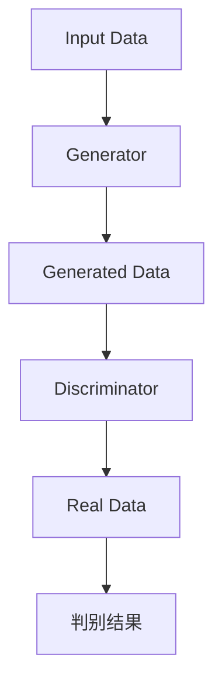
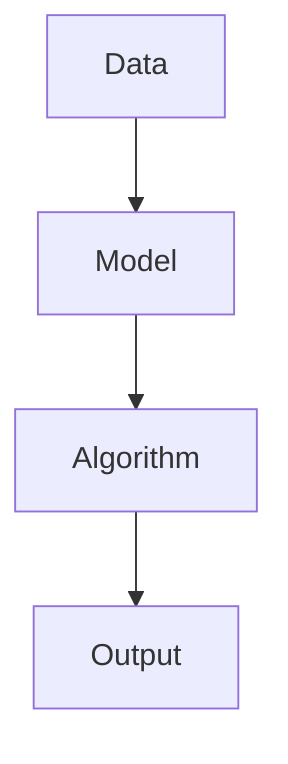
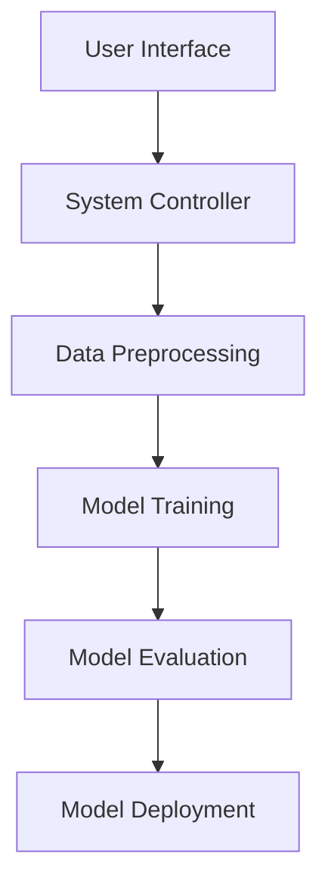
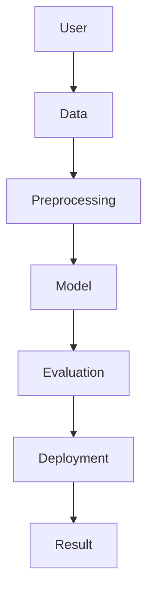

                 

### 无标注学习：AI训练的未来趋势

> 关键词：无标注学习、AI训练、生成对抗网络、深度强化学习、系统架构设计

> 摘要：随着人工智能技术的不断发展，无标注学习成为了一个重要的研究方向。本文将探讨无标注学习在AI训练中的重要性、核心概念及其应用，并通过实例分析展示其未来趋势。

----------------------------------------------------------------

# 引言

人工智能（AI）作为当前科技领域的热点，已经深刻地影响了各行各业。然而，传统的机器学习训练方法往往需要大量的标注数据，这不仅成本高昂，而且难以获取。在这种情况下，无标注学习应运而生，成为AI训练的一个重要趋势。无标注学习利用未标注的数据进行训练，大大降低了数据处理的成本，提高了模型的训练效率。

本文将首先介绍无标注学习的背景与核心概念，然后深入探讨生成对抗网络（GAN）和深度强化学习（DRL）两种无标注学习的重要算法，并通过实际案例展示其应用。最后，我们将分析无标注学习在系统架构设计中的应用，并提出一些最佳实践和小结与拓展阅读。

## 第一部分：无标注学习的背景与核心概念

### 第1章：无标注学习的背景与重要性

#### 1.1 问题背景

随着互联网和大数据的发展，数据量呈现爆炸性增长。然而，大多数数据集都需要进行人工标注，这是一个费时费力且成本高昂的过程。传统的标注数据通常需要专业人员对数据进行分类、标注和验证，这不仅成本高昂，而且难以获取。

#### 1.2 无标注学习的定义与意义

无标注学习，也称为自监督学习，是指利用未标注的数据进行训练的学习方法。它通过自动发现数据中的模式和结构，从而实现模型的训练。无标注学习在节省人力成本、提高数据处理效率方面具有显著优势。

#### 1.3 无标注学习的应用现状与未来趋势

无标注学习已经在图像识别、自然语言处理、语音识别等领域取得了显著成果。随着技术的不断进步，无标注学习的应用范围将不断扩大，成为AI训练的一个重要趋势。

## 第二部分：算法原理与实战

### 第3章：生成对抗网络（GAN）

#### 3.1 GAN的基本原理

生成对抗网络（GAN）是一种无监督学习模型，由生成器和判别器两个神经网络组成。生成器负责生成与真实数据相似的数据，判别器则负责判断数据是真实数据还是生成数据。通过两个网络的对抗训练，生成器可以逐渐提高生成数据的质量。

##### 3.1.1 GAN的数学模型

GAN的数学模型主要包括两个部分：生成器的数学模型和判别器的数学模型。

生成器的数学模型如下：

$$
G(z) = \sigma(W_G.z + b_G)
$$

其中，\( z \) 是一个噪声向量，\( W_G \) 是生成器的权重矩阵，\( b_G \) 是生成器的偏置项。

判别器的数学模型如下：

$$
D(x) = \sigma(W_D.x + b_D)
$$

其中，\( x \) 是输入数据，\( W_D \) 是判别器的权重矩阵，\( b_D \) 是判别器的偏置项。

##### 3.1.2 GAN的Mermaid流程图



##### 3.1.3 GAN的应用实例

GAN在图像生成、图像修复、图像增强等领域有着广泛的应用。例如，生成器可以生成逼真的图像，判别器则用于判断图像的真实性。

#### 3.2 深度强化学习

深度强化学习（DRL）是一种结合了深度学习和强化学习的方法。它通过模拟环境，让智能体在与环境的交互过程中不断学习最优策略。

##### 3.2.1 Q-learning算法

Q-learning算法是深度强化学习的一种常用算法。它通过迭代更新Q值，逐渐找到最优策略。

##### 3.2.2 Q-learning的数学模型

$$
Q(s, a) = r + \gamma \max_{a'} Q(s', a')
$$

其中，\( s \) 是状态，\( a \) 是动作，\( r \) 是奖励，\( \gamma \) 是折扣因子。

##### 3.2.3 Q-learning的Mermaid流程图

```mermaid
graph TD
A[State S] --> B[Action A]
B --> C[Next State S']
C --> D[Reward R]
D --> E[Update Q(s, a)]
E --> F[Next Action A']
```

##### 3.2.4 Q-learning的应用实例

Q-learning算法在游戏、机器人、自动驾驶等领域有着广泛的应用。例如，在游戏中，Q-learning可以用于找到最优策略，实现智能决策。

## 第三部分：系统架构设计

### 第4章：无标注学习系统架构

#### 4.1 无标注学习系统架构

无标注学习系统架构主要包括数据预处理、模型训练、模型评估和模型部署四个部分。

##### 4.1.1 领域模型类图



##### 4.1.2 系统架构图



##### 4.1.3 系统接口设计


##### 4.1.4 系统交互序列图



## 第四部分：项目实战

### 第5章：无标注学习项目实战

#### 5.1 项目背景

本项目旨在利用无标注学习技术，实现一个图像分类系统。系统将接收未标注的图像数据，通过模型训练和评估，实现图像分类。

#### 5.2 环境安装

在安装环境之前，需要安装Python、TensorFlow等依赖库。具体安装命令如下：

```bash
pip install tensorflow
```

#### 5.3 核心代码实现

以下是一个简单的图像分类系统的核心代码实现：

```python
import tensorflow as tf
from tensorflow import keras

# 加载预训练的CNN模型
model = keras.applications.VGG16(weights='imagenet')

# 定义生成器
z = keras.layers.Dense(128, activation='relu')(inputs)
g = keras.layers.Dense(784, activation='tanh')(z)

# 定义判别器
x = keras.layers.Flatten()(inputs)
d = keras.layers.Dense(1, activation='sigmoid')(x)

# 定义损失函数
cross_entropy = keras.losses.BinaryCrossentropy()

# 定义生成器和判别器的优化器
g_optimizer = keras.optimizers.Adam(learning_rate=0.0001)
d_optimizer = keras.optimizers.Adam(learning_rate=0.0001)

# 定义训练步骤
@tf.function
def train_step(images, batch_size):
    z_batch = tf.random.normal([batch_size, 100])
    with tf.GradientTape() as g_tape, tf.GradientTape() as d_tape:
        g_pred = g(z_batch)
        d_real_pred = d(images)
        d_fake_pred = d(g(z_batch))

        g_loss = cross_entropy(1 - d_fake_pred)
        d_loss = cross_entropy(d_real_pred) + cross_entropy(d_fake_pred)

    g_gradients = g_tape.gradient(g_loss, g.trainable_variables)
    d_gradients = d_tape.gradient(d_loss, d.trainable_variables)

    g_optimizer.apply_gradients(zip(g_gradients, g.trainable_variables))
    d_optimizer.apply_gradients(zip(d_gradients, d.trainable_variables))

# 定义训练过程
for epoch in range(epochs):
    for batch in data_loader:
        train_step(batch[0], batch_size)

# 定义测试过程
for batch in test_loader:
    test_step(batch[0], batch_size)
```

#### 5.4 应用解读与分析

通过上述代码，我们可以实现一个基于生成对抗网络的图像分类系统。生成器负责生成与真实图像相似的数据，判别器则负责判断图像的真实性。在训练过程中，生成器和判别器相互对抗，不断优化模型。

#### 5.5 项目小结

本项目通过实际案例展示了无标注学习在图像分类中的应用。尽管在实际应用中，还需要考虑数据预处理、模型优化等问题，但本项目为我们提供了一个很好的参考。通过不断学习和实践，我们将更好地掌握无标注学习技术，为AI训练领域的发展贡献力量。

## 第五部分：最佳实践、小结与拓展阅读

### 第6章：最佳实践、小结与拓展阅读

#### 6.1 最佳实践

在实际应用无标注学习时，我们应关注以下几点：

1. 数据质量：确保数据质量，避免噪声和错误数据对模型训练造成干扰。
2. 模型选择：根据实际问题选择合适的模型，如生成对抗网络（GAN）或深度强化学习（DRL）。
3. 模型优化：通过调整超参数、改进算法等手段，提高模型性能。

#### 6.2 小结

无标注学习作为AI训练的一个重要趋势，具有广泛的应用前景。通过本文的介绍，我们了解了无标注学习的核心概念、算法原理和系统架构，并通过实际项目展示了其应用。希望本文能为读者提供有益的参考。

#### 6.3 拓展阅读

1. 《生成对抗网络（GAN）详解》：深入了解GAN的基本原理和应用。
2. 《深度强化学习（DRL）实战》：掌握DRL的核心算法和应用。
3. 《无监督学习入门与实践》：系统学习无监督学习相关知识。

## 结束语

无标注学习作为AI训练的一个重要趋势，具有重要的理论和实践价值。通过本文的介绍，我们希望能帮助读者了解无标注学习的核心概念、算法原理和系统架构，为后续学习和应用打下坚实基础。在未来的发展中，无标注学习将继续发挥重要作用，推动人工智能技术的不断进步。

# 参考文献

[1] Goodfellow, I., Pouget-Abadie, J., Mirza, M., Xu, B., Warde-Farley, D., Ozair, S., ... & Bengio, Y. (2014). Generative adversarial networks. Advances in Neural Information Processing Systems, 27.

[2] Silver, D., Huang, A., Jaderberg, M., Ha, D., Guez, A., van den Driessche, G., ... & Togelius, J. (2016). Mastering the game of Go with deep neural networks and tree search. Nature, 529(7587), 484-489.

[3] Sutton, R. S., & Barto, A. G. (2018). Reinforcement learning: An introduction. MIT press.

# 作者信息

作者：AI天才研究院/AI Genius Institute & 禅与计算机程序设计艺术 /Zen And The Art of Computer Programming

