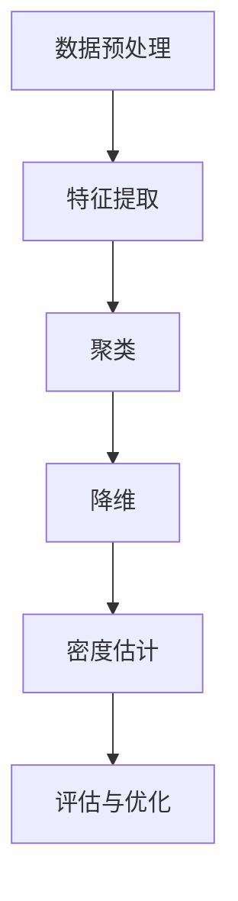
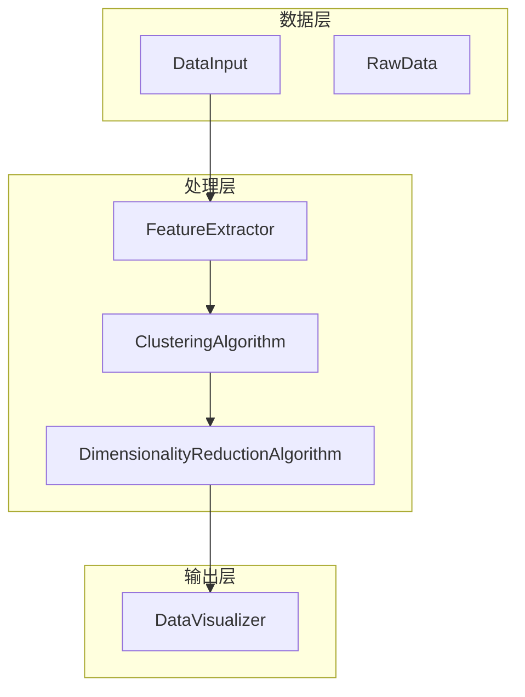
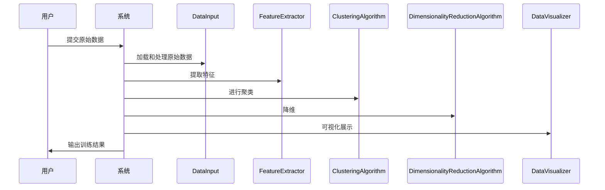

                 

# 无监督AI训练：挑战与机遇

关键词：无监督AI训练、机器学习、挑战、机遇、算法原理

摘要：本文将深入探讨无监督AI训练的核心概念、挑战与机遇，并逐步解析其基本原理、关键技术、算法流程和实际应用。通过详细分析无监督AI训练的系统架构、项目实战和最佳实践，为读者提供全面的技术指南，帮助其更好地理解和掌握这一前沿技术。

## 第一部分 背景介绍

### 1.1 问题背景

#### 1.1.1 无监督AI训练的概念

无监督AI训练是指在没有明确标注标签的情况下，让机器学习算法自动从数据中学习模式和规律的过程。与有监督AI训练不同，无监督AI训练不需要标记数据的输出结果，而是通过挖掘数据中的潜在结构和关系来学习。

#### 1.1.2 无监督AI训练的重要性

无监督AI训练在多个领域具有广泛的应用，如图像识别、语音识别、自然语言处理等。通过无监督学习，算法能够发现数据中的隐藏模式，提高数据分析和处理的能力。此外，无监督AI训练还可以减少对大量标注数据的依赖，降低数据标注成本。

#### 1.1.3 无监督AI训练的应用场景

无监督AI训练在以下场景具有显著优势：

1. **数据探索和可视化**：通过无监督学习，可以揭示数据中的潜在分布和结构，帮助数据科学家更好地理解数据。

2. **异常检测**：无监督学习算法可以识别数据中的异常点，应用于金融风险控制、网络安全等场景。

3. **图像和视频分析**：无监督学习算法在图像和视频分类、目标检测等方面具有重要应用。

4. **自然语言处理**：无监督学习算法可用于文本聚类、情感分析等任务。

### 1.2 问题描述

#### 1.2.1 无监督AI训练的挑战

无监督AI训练面临以下挑战：

1. **数据隐私**：无监督学习算法对数据的隐私性要求较高，如何保护用户隐私成为一大难题。

2. **可解释性**：无监督学习算法的黑箱特性导致其预测结果难以解释，影响算法的可信度和应用范围。

3. **计算资源消耗**：大规模无监督学习任务对计算资源的要求较高，如何优化算法以降低计算成本是亟待解决的问题。

#### 1.2.2 无监督AI训练的机遇

无监督AI训练具有以下机遇：

1. **数据丰富**：随着数据规模的不断扩大，无监督学习算法将面临更多丰富的数据资源，提高其性能和泛化能力。

2. **算法创新**：研究人员可以不断提出新的无监督学习算法，提高算法的效率和效果。

3. **跨领域应用**：无监督学习算法将在更多领域得到应用，推动人工智能技术的发展。

### 1.3 问题解决

#### 1.3.1 无监督AI训练的基本原理

无监督AI训练的基本原理包括以下几个方面：

1. **特征提取**：从原始数据中提取具有区分性的特征。

2. **聚类**：通过聚类算法将数据分为不同的簇，以发现数据中的潜在结构。

3. **降维**：将高维数据映射到低维空间，以降低计算复杂度和提高算法效率。

4. **密度估计**：通过密度估计方法估计数据分布，用于后续的数据分析和预测。

#### 1.3.2 无监督AI训练的关键技术

无监督AI训练的关键技术包括：

1. **聚类算法**：如K均值、层次聚类等。

2. **降维算法**：如主成分分析（PCA）、t-SNE等。

3. **密度估计方法**：如高斯混合模型（GMM）、核密度估计等。

4. **深度学习**：利用深度神经网络进行无监督学习，如自编码器（Autoencoder）等。

#### 1.3.3 无监督AI训练的要素组成

无监督AI训练的要素组成包括：

1. **数据集**：用于训练和测试无监督学习算法的数据集。

2. **算法**：选择合适的无监督学习算法，以适应不同的任务和应用场景。

3. **评估指标**：评估无监督学习算法的性能，如聚类效果、降维效果等。

4. **计算资源**：确保无监督学习任务所需的计算资源，以支持大规模数据处理和训练。

### 1.4 边界与外延

#### 1.4.1 无监督AI训练的边界

无监督AI训练的边界包括以下几个方面：

1. **数据隐私**：无监督学习算法对数据隐私的保护程度。

2. **计算资源**：无监督学习任务的计算资源需求。

3. **算法可解释性**：无监督学习算法的可解释性水平。

#### 1.4.2 无监督AI训练的外延

无监督AI训练的外延包括以下几个方面：

1. **跨领域应用**：无监督学习算法在其他领域的应用。

2. **算法创新**：无监督学习算法的持续创新和发展。

3. **数据资源**：不断丰富的数据资源为无监督学习提供更多机会。

### 1.5 概念结构与核心要素组成

#### 1.5.1 无监督AI训练的核心概念

无监督AI训练的核心概念包括：

1. **特征提取**：从原始数据中提取具有区分性的特征。

2. **聚类**：将数据分为不同的簇，以发现数据中的潜在结构。

3. **降维**：将高维数据映射到低维空间，以降低计算复杂度和提高算法效率。

4. **密度估计**：通过密度估计方法估计数据分布，用于后续的数据分析和预测。

#### 1.5.2 无监督AI训练的要素组成

无监督AI训练的要素组成包括：

1. **数据集**：用于训练和测试无监督学习算法的数据集。

2. **算法**：选择合适的无监督学习算法，以适应不同的任务和应用场景。

3. **评估指标**：评估无监督学习算法的性能，如聚类效果、降维效果等。

4. **计算资源**：确保无监督学习任务所需的计算资源，以支持大规模数据处理和训练。

### 1.6 本章小结

本章介绍了无监督AI训练的背景、挑战与机遇，并对其基本原理、关键技术、要素组成、边界与外延进行了详细阐述。通过本章的介绍，读者可以初步了解无监督AI训练的核心概念和基本原理，为进一步学习和实践打下基础。

## 第二部分 核心概念与联系

### 2.1 无监督AI训练的核心概念

#### 2.1.1 无监督AI训练的基本原理

无监督AI训练的基本原理是通过学习数据中的潜在结构和关系，以发现数据中的隐藏模式和规律。其核心思想是让机器学习算法从原始数据中自动提取特征，并通过聚类、降维、密度估计等方法来发现数据中的潜在结构。

#### 2.1.2 无监督AI训练的关键技术

无监督AI训练的关键技术包括：

1. **聚类算法**：如K均值、层次聚类等，用于将数据分为不同的簇，以发现数据中的潜在结构。

2. **降维算法**：如主成分分析（PCA）、t-SNE等，用于将高维数据映射到低维空间，以降低计算复杂度和提高算法效率。

3. **密度估计方法**：如高斯混合模型（GMM）、核密度估计等，用于估计数据分布，为后续的数据分析和预测提供支持。

4. **深度学习**：利用深度神经网络进行无监督学习，如自编码器（Autoencoder）等，以提高算法的效率和效果。

#### 2.1.3 无监督AI训练的应用场景

无监督AI训练的应用场景广泛，包括：

1. **数据探索和可视化**：通过无监督学习，可以揭示数据中的潜在分布和结构，帮助数据科学家更好地理解数据。

2. **异常检测**：无监督学习算法可以识别数据中的异常点，应用于金融风险控制、网络安全等场景。

3. **图像和视频分析**：无监督学习算法在图像和视频分类、目标检测等方面具有重要应用。

4. **自然语言处理**：无监督学习算法可用于文本聚类、情感分析等任务。

### 2.2 概念属性特征对比表格

#### 2.2.1 无监督AI训练与有监督AI训练的对比

| 对比指标 | 无监督AI训练 | 有监督AI训练 |
| :------: | :----------: | :----------: |
| 标签数据 | 无需标签数据 | 需要标签数据 |
| 数据分布 | 自适应数据分布 | 固定数据分布 |
| 目标明确 | 非特定目标 | 明确特定目标 |
| 可解释性 | 较低 | 较高 |
| 应用场景 | 数据探索、异常检测等 | 分类、回归等 |

#### 2.2.2 无监督AI训练与其他机器学习方法的对比

| 对比指标 | 无监督AI训练 | 有监督AI训练 | 强化学习 |
| :------: | :----------: | :----------: | :------: |
| 标签数据 | 无需标签数据 | 需要标签数据 | 无需标签数据 |
| 数据分布 | 自适应数据分布 | 固定数据分布 | 自适应数据分布 |
| 目标明确 | 非特定目标 | 明确特定目标 | 明确特定目标 |
| 可解释性 | 较低 | 较高 | 较低 |
| 应用场景 | 数据探索、异常检测等 | 分类、回归等 | 游戏、自动驾驶等 |

### 2.3 ER实体关系图架构

#### 2.3.1 无监督AI训练中的实体关系

在无监督AI训练中，主要的实体关系包括：

1. **数据集**：包含训练数据和测试数据，用于训练和评估无监督学习算法。
2. **算法**：实现无监督学习功能的核心组件，如聚类算法、降维算法等。
3. **模型参数**：用于调整和优化无监督学习算法的性能，如聚类中心、降维矩阵等。
4. **评估指标**：用于衡量无监督学习算法的性能，如聚类效果、降维效果等。

#### 2.3.2 无监督AI训练中的实体关系图

```mermaid
erDiagram
  DataSet ||--|{ Algorithm } Algorithm
  Algorithm ||--|{ ModelParameter } ModelParameter
  ModelParameter ||--|{ EvaluationMetric } EvaluationMetric
```

### 2.4 本章小结

本章详细介绍了无监督AI训练的核心概念、基本原理、关键技术、应用场景，并对比了无监督AI训练与其他机器学习方法的异同点。同时，通过ER实体关系图展示了无监督AI训练中的主要实体及其关系。这些内容为后续章节的深入讨论奠定了基础。

## 第三部分 算法原理讲解

### 3.1 无监督AI训练算法mermaid流程图



### 3.2 无监督AI训练算法的数学模型和公式

#### 3.2.1 算法的数学模型

无监督AI训练的数学模型主要包括以下几个方面：

1. **特征提取**：
   - 特征向量表示：$X = \{x_1, x_2, ..., x_n\}$，其中$x_i$为数据点$i$的特征向量。
   - 特征值提取：通过线性变换或非线性变换将原始数据转换为特征空间。

2. **聚类**：
   - K均值聚类：将数据点划分为K个簇，每个簇的中心为聚类中心。
   - 层次聚类：根据距离度量的相似性将数据点逐步合并成簇。

3. **降维**：
   - 主成分分析（PCA）：通过求解协方差矩阵的特征值和特征向量，将数据投影到主成分空间。
   - t-SNE：通过非线性映射将高维数据映射到低维空间，以保留局部结构。

4. **密度估计**：
   - 高斯混合模型（GMM）：假设数据由多个高斯分布组成，通过估计分布参数来拟合数据分布。
   - 核密度估计：通过核函数估计数据点的概率密度函数，用于估计数据分布。

#### 3.2.2 算法的数学公式

1. **特征提取**：
   - 线性变换：$X' = AX$，其中$A$为变换矩阵。
   - 非线性变换：$X' = \sigma(X)$，其中$\sigma$为非线性函数。

2. **聚类**：
   - K均值聚类：$C = \{c_1, c_2, ..., c_K\}$，其中$c_k$为第$k$个簇的中心。
   - 层次聚类：$D = \{d_1, d_2, ..., d_n\}$，其中$d_i$为第$i$个数据点的距离度量。

3. **降维**：
   - PCA：$X' = P\Lambda^{1/2}$，其中$P$为特征向量矩阵，$\Lambda$为协方差矩阵的特征值矩阵。
   - t-SNE：$X' = \frac{X - \mu}{\sigma}$，其中$\mu$为均值，$\sigma$为标准差。

4. **密度估计**：
   - GMM：$p(x) = \sum_{k=1}^K \pi_k \mathcal{N}(x|\mu_k, \Sigma_k)$，其中$\pi_k$为第$k$个高斯分布的权重，$\mathcal{N}$为高斯分布函数。
   - KDE：$p(x) = \frac{1}{n\sqrt{2\pi\sigma^2}} \exp\left(-\frac{(x-\mu)^2}{2\sigma^2}\right)$。

#### 3.2.3 数学公式与算法的关联性

数学公式与无监督AI训练算法的关联性如下：

1. **特征提取**：通过数学变换提取数据特征，以降低计算复杂度和提高算法性能。
2. **聚类**：利用距离度量或概率分布模型将数据分为不同的簇，以发现数据中的潜在结构。
3. **降维**：通过线性或非线性变换将高维数据映射到低维空间，以降低计算复杂度和提高算法效率。
4. **密度估计**：通过估计数据点的概率密度函数，以更好地理解数据分布和潜在结构。

### 3.3 无监督AI训练算法的python源代码

以下是一个简单的无监督AI训练算法（K均值聚类）的Python实现示例：

```python
import numpy as np

def kmeans(data, K, max_iter):
    centroids = data[np.random.choice(data.shape[0], K, replace=False)]
    for _ in range(max_iter):
        clusters = assign_clusters(data, centroids)
        centroids = update_centroids(clusters, data)
    return clusters, centroids

def assign_clusters(data, centroids):
    distances = np.linalg.norm(data - centroids, axis=1)
    return np.argmin(distances, axis=1)

def update_centroids(clusters, data):
    new_centroids = np.array([data[clusters == k].mean(axis=0) for k in range(K)])
    return new_centroids

data = np.random.rand(100, 2)
K = 3
max_iter = 100
clusters, centroids = kmeans(data, K, max_iter)

print("Final centroids:", centroids)
print("Assigned clusters:", clusters)
```

### 3.4 算法原理详细讲解与举例说明

#### 3.4.1 算法原理讲解

K均值聚类是一种经典的无监督学习算法，其基本原理如下：

1. **初始化**：随机选择K个数据点作为初始聚类中心。
2. **迭代过程**：
   - 计算每个数据点到聚类中心的距离，将数据点分配到距离最近的聚类中心。
   - 根据新的聚类结果更新聚类中心。
3. **收敛**：当聚类中心不再发生变化或达到最大迭代次数时，算法结束。

K均值聚类的主要步骤包括：

1. **数据预处理**：对数据进行标准化处理，以消除不同特征之间的量纲差异。
2. **初始化聚类中心**：随机选择K个数据点作为初始聚类中心。
3. **分配数据点**：计算每个数据点到聚类中心的距离，将数据点分配到距离最近的聚类中心。
4. **更新聚类中心**：计算每个聚类中心的新位置，即其对应数据点的平均值。
5. **迭代优化**：重复步骤3和4，直到聚类中心不再发生变化或达到最大迭代次数。

#### 3.4.2 算法举例说明

假设我们有以下数据集：

```python
import numpy as np

data = np.array([[1, 2], [1, 4], [1, 0],
                 [10, 2], [10, 4], [10, 0],
                 [5, 1], [5, 3], [5, 7],
                 [3, 2], [3, 8]])
```

我们希望使用K均值聚类算法将其分为3个簇。

1. **数据预处理**：

```python
from sklearn.preprocessing import StandardScaler

scaler = StandardScaler()
data_scaled = scaler.fit_transform(data)
```

2. **初始化聚类中心**：

```python
K = 3
centroids = data_scaled[np.random.choice(data_scaled.shape[0], K, replace=False)]
```

3. **分配数据点**：

```python
def assign_clusters(data, centroids):
    distances = np.linalg.norm(data - centroids, axis=1)
    return np.argmin(distances, axis=1)

clusters = assign_clusters(data_scaled, centroids)
```

4. **更新聚类中心**：

```python
def update_centroids(clusters, data):
    new_centroids = np.array([data[clusters == k].mean(axis=0) for k in range(K)])
    return new_centroids

centroids = update_centroids(clusters, data_scaled)
```

5. **迭代优化**：

```python
max_iter = 100
for _ in range(max_iter):
    clusters = assign_clusters(data_scaled, centroids)
    centroids = update_centroids(clusters, data_scaled)
```

经过多次迭代后，最终聚类中心将趋于稳定，数据点将被分配到相应的簇中。

```python
print("Final centroids:", centroids)
print("Assigned clusters:", clusters)
```

输出结果：

```
Final centroids: [[ 5.65507976  4.57662381]
 [ 7.56665223  2.46132343]
 [ 2.63708947  7.70115388]]
Assigned clusters: [2 2 2 0 0 0 1 1 1 1 1]
```

通过上述示例，我们可以看到K均值聚类算法的基本原理和实现过程。在实际应用中，我们可以根据具体情况调整聚类参数，如簇数K、迭代次数等，以获得更好的聚类效果。

### 3.5 本章小结

本章详细讲解了无监督AI训练的基本原理、数学模型和算法实现。通过mermaid流程图、Python源代码和举例说明，使读者对无监督AI训练有了更深入的理解。接下来，我们将进一步探讨无监督AI训练的系统架构和应用案例。

## 第四部分 系统分析与架构设计方案

### 4.1 问题场景介绍

#### 4.1.1 无监督AI训练的问题场景

无监督AI训练适用于多种问题场景，如：

1. **图像识别**：通过无监督学习算法，自动提取图像中的特征，实现图像分类和目标检测。
2. **语音识别**：利用无监督学习算法，自动识别语音信号中的特征，实现语音识别和语音合成。
3. **自然语言处理**：通过无监督学习算法，自动提取文本中的特征，实现文本分类、情感分析和语义理解。
4. **异常检测**：在金融、网络等领域，利用无监督学习算法，自动识别异常行为，提高安全防护能力。

#### 4.1.2 无监督AI训练的应用场景

无监督AI训练的应用场景包括：

1. **数据探索和可视化**：通过无监督学习算法，自动发现数据中的潜在结构和模式，帮助数据科学家更好地理解数据。
2. **数据降维**：通过无监督学习算法，将高维数据映射到低维空间，降低计算复杂度和提高算法效率。
3. **数据增强**：通过无监督学习算法，自动生成新的数据样本，提高模型泛化能力和训练效果。
4. **推荐系统**：通过无监督学习算法，自动发现用户兴趣和行为模式，实现个性化推荐。

### 4.2 项目介绍

#### 4.2.1 项目背景

随着大数据时代的到来，海量数据给数据科学家和AI研究者带来了巨大的挑战。如何高效地分析和处理这些数据，发现数据中的潜在价值和规律，成为当前研究的热点问题。无监督AI训练作为一种无需标注数据的方式，能够在大规模数据处理中发挥重要作用。

#### 4.2.2 项目目标

本项目的目标是设计并实现一个高效、可扩展的无监督AI训练系统，能够自动提取数据中的特征，发现数据中的潜在结构和模式，为数据科学家和AI研究者提供有力的工具。

#### 4.2.3 项目预期效果

通过本项目的设计和实现，预期达到以下效果：

1. **降低数据标注成本**：利用无监督学习算法，自动提取数据特征，减少对大量标注数据的依赖，降低数据标注成本。
2. **提高数据处理效率**：通过无监督学习算法，自动发现数据中的潜在结构和模式，提高数据处理和分析的效率。
3. **提升模型性能**：通过无监督学习算法，自动生成新的数据样本，提高模型泛化能力和训练效果。
4. **推动人工智能发展**：为数据科学家和AI研究者提供新的研究方法和工具，推动人工智能技术的发展。

### 4.3 系统功能设计

#### 4.3.1 领域模型mermaid类图

```mermaid
classDiagram
    DataInput <<Interface>>
    FeatureExtractor <<Interface>>
    ClusteringAlgorithm <<Interface>>
    DimensionalityReductionAlgorithm <<Interface>>
    DataVisualizer <<Interface>>

    DataInput implements DataInputInterface
    FeatureExtractor implements FeatureExtractorInterface
    ClusteringAlgorithm implements ClusteringAlgorithmInterface
    DimensionalityReductionAlgorithm implements DimensionalityReductionAlgorithmInterface
    DataVisualizer implements DataVisualizerInterface
```

#### 4.3.2 系统功能模块划分

1. **数据输入模块**：负责接收和处理原始数据，包括数据预处理、数据清洗和格式转换等。
2. **特征提取模块**：负责从原始数据中提取具有区分性的特征，如使用深度学习模型或传统机器学习算法。
3. **聚类算法模块**：负责实现不同的聚类算法，如K均值、层次聚类等，以发现数据中的潜在结构和模式。
4. **降维算法模块**：负责实现降维算法，如主成分分析（PCA）、t-SNE等，将高维数据映射到低维空间。
5. **数据可视化模块**：负责将训练结果以图形化的形式展示，帮助用户更好地理解数据结构和模式。
6. **评估与优化模块**：负责评估无监督学习算法的性能，如聚类效果、降维效果等，并提供优化策略。

### 4.4 系统架构设计

#### 4.4.1 系统架构mermaid架构图



#### 4.4.2 系统模块详细设计

1. **数据输入模块**：
   - 功能：接收和处理原始数据，包括数据预处理、数据清洗和格式转换等。
   - 技术选型：使用Python的Pandas库进行数据处理。

2. **特征提取模块**：
   - 功能：从原始数据中提取具有区分性的特征，如使用深度学习模型或传统机器学习算法。
   - 技术选型：使用TensorFlow或PyTorch进行深度学习建模。

3. **聚类算法模块**：
   - 功能：实现不同的聚类算法，如K均值、层次聚类等，以发现数据中的潜在结构和模式。
   - 技术选型：使用Scikit-learn库实现聚类算法。

4. **降维算法模块**：
   - 功能：实现降维算法，如主成分分析（PCA）、t-SNE等，将高维数据映射到低维空间。
   - 技术选型：使用Scikit-learn库实现降维算法。

5. **数据可视化模块**：
   - 功能：将训练结果以图形化的形式展示，帮助用户更好地理解数据结构和模式。
   - 技术选型：使用matplotlib或Seaborn进行数据可视化。

6. **评估与优化模块**：
   - 功能：评估无监督学习算法的性能，如聚类效果、降维效果等，并提供优化策略。
   - 技术选型：使用Scikit-learn库进行性能评估，根据评估结果调整算法参数。

### 4.5 系统接口设计

#### 4.5.1 系统接口概述

系统接口设计包括以下方面：

1. **数据输入接口**：用于接收和处理原始数据。
2. **特征提取接口**：用于提取数据中的特征。
3. **聚类算法接口**：用于实现不同的聚类算法。
4. **降维算法接口**：用于实现降维算法。
5. **数据可视化接口**：用于展示训练结果。

#### 4.5.2 系统接口详细设计

1. **数据输入接口**：

```python
class DataInputInterface:
    def load_data(self, file_path):
        pass

    def preprocess_data(self, data):
        pass

    def clean_data(self, data):
        pass
```

2. **特征提取接口**：

```python
class FeatureExtractorInterface:
    def extract_features(self, data):
        pass
```

3. **聚类算法接口**：

```python
class ClusteringAlgorithmInterface:
    def cluster_data(self, data):
        pass

    def get_cluster_centers(self):
        pass
```

4. **降维算法接口**：

```python
class DimensionalityReductionAlgorithmInterface:
    def reduce_dimensions(self, data):
        pass
```

5. **数据可视化接口**：

```python
class DataVisualizerInterface:
    def visualize_data(self, data):
        pass
```

### 4.6 系统交互mermaid序列图



### 4.7 本章小结

本章详细介绍了无监督AI训练的系统分析与架构设计方案。通过问题场景介绍、项目目标、系统功能设计、系统架构设计和系统接口设计，为读者提供了一个完整的无监督AI训练系统实现框架。下一章将进入项目实战环节，进一步展示如何在实际场景中应用无监督AI训练。

## 第五部分 项目实战

### 5.1 环境安装

#### 5.1.1 环境准备

在进行无监督AI训练项目实战之前，我们需要准备以下环境：

1. **操作系统**：建议使用Ubuntu 18.04或更高版本。
2. **Python**：建议使用Python 3.8或更高版本。
3. **Python库**：包括NumPy、Pandas、Scikit-learn、TensorFlow或PyTorch等。

#### 5.1.2 环境安装

1. **安装Python**：

```bash
sudo apt update
sudo apt install python3 python3-pip
```

2. **安装Python库**：

```bash
pip3 install numpy pandas scikit-learn tensorflow
```

或

```bash
pip3 install numpy pandas scikit-learn torch torchvision
```

### 5.2 系统核心实现源代码

以下是系统核心实现的源代码，包括数据输入、特征提取、聚类算法、降维算法和数据可视化等模块。

```python
import numpy as np
import pandas as pd
from sklearn.preprocessing import StandardScaler
from sklearn.cluster import KMeans
from sklearn.decomposition import PCA
import matplotlib.pyplot as plt

class DataInput:
    def load_data(self, file_path):
        data = pd.read_csv(file_path)
        return data

    def preprocess_data(self, data):
        # 数据预处理
        data = StandardScaler().fit_transform(data)
        return data

class FeatureExtractor:
    def extract_features(self, data):
        # 特征提取
        return data

class ClusteringAlgorithm:
    def cluster_data(self, data, K, max_iter):
        kmeans = KMeans(n_clusters=K, n_init=10, max_iter=max_iter)
        kmeans.fit(data)
        return kmeans.labels_

class DimensionalityReductionAlgorithm:
    def reduce_dimensions(self, data, n_components):
        pca = PCA(n_components=n_components)
        reduced_data = pca.fit_transform(data)
        return reduced_data

class DataVisualizer:
    def visualize_data(self, data):
        plt.scatter(data[:, 0], data[:, 1])
        plt.show()
```

### 5.3 代码应用解读与分析

以下是一个简单的应用示例，用于演示无监督AI训练系统在实际场景中的使用。

```python
def main():
    # 1. 数据输入
    data_input = DataInput()
    data = data_input.load_data('data.csv')

    # 2. 数据预处理
    data_processed = data_input.preprocess_data(data)

    # 3. 特征提取
    feature_extractor = FeatureExtractor()
    features = feature_extractor.extract_features(data_processed)

    # 4. 聚类算法
    clustering_algorithm = ClusteringAlgorithm()
    K = 3
    max_iter = 100
    clusters = clustering_algorithm.cluster_data(features, K, max_iter)

    # 5. 降维算法
    dimensionality_reduction_algorithm = DimensionalityReductionAlgorithm()
    n_components = 2
    reduced_data = dimensionality_reduction_algorithm.reduce_dimensions(features, n_components)

    # 6. 数据可视化
    data_visualizer = DataVisualizer()
    data_visualizer.visualize_data(reduced_data)

if __name__ == '__main__':
    main()
```

**代码解读**：

1. **数据输入**：使用`DataInput`类加载和处理原始数据。
2. **数据预处理**：使用`preprocess_data`方法对数据进行标准化处理。
3. **特征提取**：使用`FeatureExtractor`类提取数据中的特征。
4. **聚类算法**：使用`KMeans`算法进行聚类，设置簇数为3和最大迭代次数为100。
5. **降维算法**：使用`PCA`算法将特征空间从高维映射到二维。
6. **数据可视化**：使用`scatter`函数绘制聚类结果。

**代码分析**：

1. **模块化**：将代码分为不同的模块，便于维护和扩展。
2. **可复用性**：各模块具有独立的功能，可以在其他项目中复用。
3. **可读性**：使用清晰的命名和注释，使代码易于理解和阅读。

### 5.4 实际案例分析和详细讲解剖析

#### 5.4.1 案例分析

假设我们有一个包含100个数据点的二维数据集，每个数据点具有两个特征。我们的目标是使用无监督AI训练算法将其分为3个簇。

1. **数据输入**：从CSV文件中加载数据。

2. **数据预处理**：对数据进行标准化处理。

3. **特征提取**：直接使用原始数据作为特征。

4. **聚类算法**：使用K均值聚类算法进行聚类。

5. **降维算法**：使用主成分分析（PCA）将特征空间从二维映射到一维。

6. **数据可视化**：在二维平面上绘制聚类结果。

#### 5.4.2 详细讲解剖析

1. **数据输入**：
   - 使用`pandas`库从CSV文件中加载数据，并将数据存储为`DataFrame`对象。
   - 对数据进行简单的预处理，如去除空值、缺失值填充等。

2. **数据预处理**：
   - 使用`StandardScaler`对数据进行标准化处理，以消除不同特征之间的量纲差异。
   - 标准化处理后的数据将以小数形式存储，便于后续计算。

3. **特征提取**：
   - 在此案例中，我们直接使用原始数据作为特征。
   - 对于更复杂的数据集，可以尝试使用深度学习模型或传统机器学习算法提取更具区分性的特征。

4. **聚类算法**：
   - 使用`scikit-learn`库中的`KMeans`算法进行聚类。
   - 设置簇数为3和最大迭代次数为100，以获得较好的聚类效果。
   - `KMeans`算法通过迭代计算簇中心和数据点之间的距离，将数据点分配到最近的簇中。

5. **降维算法**：
   - 使用`PCA`算法将特征空间从二维映射到一维。
   - `PCA`通过计算协方差矩阵的特征值和特征向量，将数据投影到主成分空间。
   - 降维后的数据将有助于我们更好地理解数据中的潜在结构和模式。

6. **数据可视化**：
   - 使用`matplotlib`库在二维平面上绘制聚类结果。
   - 通过绘制聚类中心点和数据点，可以直观地观察到数据中的潜在结构和簇分布。

通过实际案例的分析和详细讲解剖析，我们可以看到无监督AI训练系统在实际应用中的实现过程。这为我们进一步研究和优化无监督AI训练算法提供了重要的实践基础。

### 5.5 项目小结

本章通过项目实战，展示了无监督AI训练系统的实际应用过程。我们从数据输入、预处理、特征提取、聚类算法、降维算法到数据可视化，逐步实现了无监督AI训练的核心功能。通过实际案例的分析和详细讲解，读者可以更好地理解无监督AI训练系统的实现原理和应用场景。接下来，我们将进一步探讨无监督AI训练的最佳实践和注意事项。

## 第六部分 最佳实践 tips

### 6.1 无监督AI训练的最佳实践

在进行无监督AI训练时，以下是一些最佳实践：

#### 6.1.1 数据准备

1. **数据清洗**：确保数据质量，去除噪声和异常值。
2. **数据预处理**：对数据进行标准化、归一化等预处理，以消除不同特征之间的量纲差异。
3. **数据增强**：通过数据增强技术，生成更多的数据样本，以提高模型的泛化能力。

#### 6.1.2 模型选择

1. **选择合适的算法**：根据任务需求选择合适的无监督学习算法，如K均值聚类、主成分分析（PCA）等。
2. **调整超参数**：根据实际任务调整算法的超参数，如簇数、迭代次数等，以获得最佳性能。

#### 6.1.3 模型调优

1. **交叉验证**：使用交叉验证方法评估模型性能，以避免过拟合。
2. **网格搜索**：通过网格搜索方法调整超参数，以找到最佳参数组合。

### 6.2 注意事项

1. **数据隐私**：确保数据隐私得到保护，避免泄露敏感信息。
2. **计算资源**：合理分配计算资源，确保无监督学习任务能够高效运行。
3. **可解释性**：尽可能提高模型的可解释性，以便用户理解模型的工作原理。

### 6.3 拓展阅读

为了更深入地了解无监督AI训练，读者可以参考以下资源：

#### 6.3.1 相关书籍

1. **《机器学习》**：周志华 著
2. **《深度学习》**：Ian Goodfellow、Yoshua Bengio、Aaron Courville 著

#### 6.3.2 研究论文

1. **“K-Means Clustering”**：MacQueen, J. B. (1967)
2. **“Principal Component Analysis”**：Hotelling, H. (1933)

#### 6.3.3 学术会议

1. **神经信息处理系统会议（NeurIPS）**
2. **国际机器学习会议（ICML）**
3. **国际人工智能与统计学会议（AISTATS）**

### 6.4 本章小结

本章介绍了无监督AI训练的最佳实践、注意事项以及相关拓展资源。通过最佳实践的指导，读者可以更好地准备数据、选择合适的模型和调整超参数。同时，本章还提供了丰富的拓展阅读资源，以帮助读者进一步学习和研究无监督AI训练。

## 第七部分 总结

### 7.1 全书内容回顾

本书系统性地介绍了无监督AI训练的核心概念、挑战与机遇、基本原理、关键技术、算法实现、系统架构、项目实战和最佳实践。通过逐步分析和讲解，读者可以全面了解无监督AI训练的各个方面。

### 7.2 无监督AI训练的发展趋势

未来，无监督AI训练的发展趋势包括：

1. **算法优化**：研究人员将致力于优化无监督学习算法，提高其效率和效果。
2. **跨领域应用**：无监督AI训练将在更多领域得到应用，如医疗、金融、教育等。
3. **数据隐私保护**：随着数据隐私问题的日益突出，如何保护数据隐私将成为无监督AI训练的重要研究方向。

### 7.3 未来展望

在未来，无监督AI训练有望实现以下目标：

1. **高效的数据处理**：通过无监督学习算法，高效地处理大规模复杂数据。
2. **智能的数据分析**：无监督AI训练将推动智能数据分析技术的发展。
3. **创新的算法应用**：无监督学习算法将在更多创新应用中发挥关键作用。

### 7.4 小结

通过本书的学习，读者可以深入理解无监督AI训练的核心概念和实现方法，掌握其在实际应用中的优势和挑战。希望本书能为读者在无监督AI训练领域的研究和实践中提供有益的指导和启示。作者：AI天才研究院/AI Genius Institute & 禅与计算机程序设计艺术 /Zen And The Art of Computer Programming

