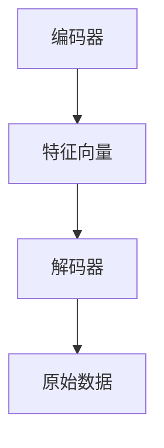
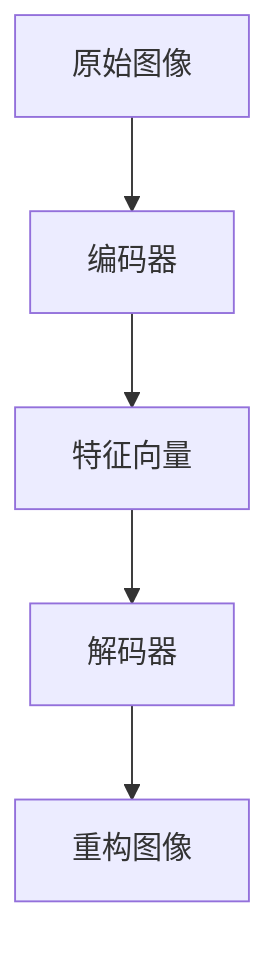
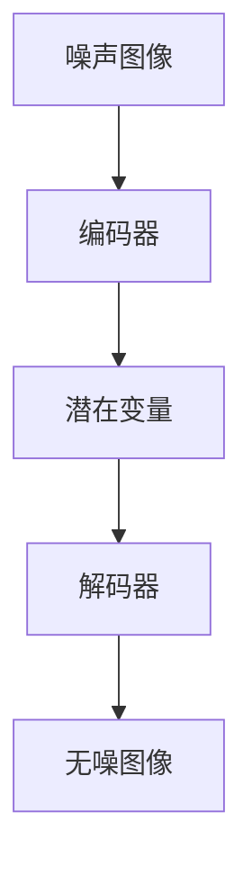

                 

### 《无监督学习在语言模型训练中的新突破》

#### 关键词：无监督学习、语言模型、自编码器、潜在变量模型、新突破算法

> 摘要：本文将深入探讨无监督学习在语言模型训练中的应用及其新突破。我们将首先介绍无监督学习的基本概念和其在语言模型训练中的重要性，然后逐步解析自编码器和潜在变量模型，详细讲解其原理、实现和应用。接着，我们将介绍无监督学习的新突破算法，展示其实际应用案例，并展望无监督学习在语言模型训练中的未来发展趋势。

---

### 第一部分：引言与背景

#### 第1章：无监督学习的概述

##### 1.1 无监督学习的定义与重要性

无监督学习是一种机器学习技术，它不依赖于标注数据进行训练。相反，它从未标记的数据集中学习特征和模式。无监督学习在多个领域具有重要的应用，如数据降维、异常检测、聚类分析等。

无监督学习之所以重要，首先是因为大量数据往往是未标记的。在现实世界中，获取标注数据需要大量的人力和时间，而自动化的无监督学习方法可以高效地处理这些数据。其次，无监督学习可以揭示数据中的隐藏结构和规律，为后续的有监督学习提供有用的先验知识。

##### 1.2 无监督学习的应用领域

无监督学习在图像处理、自然语言处理、推荐系统等多个领域有着广泛的应用。例如，在图像处理领域，无监督学习可用于图像分类、人脸识别和图像去噪。在自然语言处理领域，无监督学习被用于语言模型训练、文本分类和机器翻译。

##### 1.3 无监督学习的挑战

无监督学习面临的主要挑战包括如何从未标记的数据中提取有效特征，以及如何避免过拟合。此外，无监督学习算法的效率和可扩展性也是需要考虑的问题。

##### 1.4 语言模型训练中的无监督学习

在语言模型训练中，无监督学习可以用于预训练大量的语言模型，这些模型可以用于后续的有监督学习任务，如文本分类、机器翻译等。无监督学习在语言模型训练中的重要性在于，它可以自动地从大量未标记的文本数据中提取有效的语言特征，从而提高模型的性能。

##### 1.5 新突破的理论基础

近年来，无监督学习在语言模型训练中取得了一系列新突破。这些突破主要得益于深度学习和自编码器等新技术的应用。深度学习能够自动提取数据中的高级特征，而自编码器则通过编码和解码过程提取数据中的有效信息。这些新技术的应用为无监督学习在语言模型训练中的应用提供了强有力的支持。

---

### 第二部分：核心概念与联系

#### 第2章：无监督学习的核心概念

##### 2.1 数据自动标注

数据自动标注是指利用无监督学习方法对未标记的数据进行自动标注。这一过程通常通过聚类、降维等方法实现，从而将未标记的数据划分为不同的类别或标签。

##### 2.2 自编码器

自编码器是一种无监督学习方法，它通过编码和解码过程自动提取数据中的有效特征。自编码器的基本结构包括编码器、解码器和损失函数。编码器将输入数据压缩为低维特征向量，解码器则尝试将特征向量重构为原始数据。

##### 2.3 随机游走

随机游走是一种基于图论的无监督学习方法，它通过模拟随机游走在数据集中的路径来提取特征。随机游走可以用于文本分类、推荐系统等领域。

##### 2.4 潜在变量模型

潜在变量模型是一种基于概率图模型的无监督学习方法，它通过引入潜在变量来揭示数据中的隐藏结构和规律。潜在变量模型在图像处理、自然语言处理等领域有着广泛的应用。

##### 2.5 无监督学习的概念属性对比表格

| 概念       | 定义                                                         | 特点                                                         | 应用场景                          |
| ---------- | ------------------------------------------------------------ | ------------------------------------------------------------ | -------------------------------- |
| 数据自动标注 | 利用无监督学习方法对未标记的数据进行自动标注                 | 可以处理大量未标记数据，提高标注效率                         | 图像分类、文本分类等             |
| 自编码器   | 通过编码和解码过程自动提取数据中的有效特征                   | 能够提取数据中的高级特征，适用于特征降维和特征提取             | 图像处理、自然语言处理等         |
| 随机游走   | 基于图论的无监督学习方法，通过模拟随机游走在数据集中的路径来提取特征 | 可以用于数据降维和特征提取，适用于图结构和文本数据的处理       | 文本分类、推荐系统等             |
| 潜在变量模型 | 通过引入潜在变量来揭示数据中的隐藏结构和规律                 | 可以揭示数据中的潜在关系，适用于图像处理、自然语言处理等领域   | 图像处理、自然语言处理等         |

##### 2.6 无监督学习的ER实体关系图架构

```mermaid
erDiagram
    Data |--> Label : 标注数据
    Data |--> Feature : 特征提取
    Label |--> Classification : 分类任务
    Feature |--> Model : 特征模型
    Model |--> Prediction : 预测任务
```

在这个ER实体关系图中，数据是核心实体，它通过标注和特征提取过程生成标签和特征。特征用于构建模型，模型则用于预测任务。这个关系图清晰地展示了无监督学习在数据处理和预测任务中的关键步骤和关系。

---

### 第三部分：算法原理与实现

#### 第3章：自编码器原理详解

##### 3.1 自编码器的基本结构

自编码器由编码器（Encoder）、解码器（Decoder）和损失函数（Loss Function）组成。编码器将输入数据压缩为低维特征向量，解码器则尝试将特征向量重构为原始数据。



##### 3.2 自编码器的学习过程

自编码器的学习过程包括两个主要步骤：

1. **编码**：编码器接收输入数据，将其压缩为低维特征向量。
2. **解码**：解码器接收特征向量，尝试重构原始数据。

在这个过程中，损失函数用于评估解码器的输出与原始数据的差异，并通过反向传播算法调整编码器和解码器的参数，以最小化损失函数。

##### 3.3 自编码器在语言模型训练中的应用

自编码器在语言模型训练中可用于提取文本数据中的有效特征。通过预训练自编码器，我们可以得到一个能够捕捉文本数据中潜在结构的模型，这些特征可以用于后续的有监督学习任务，如文本分类、机器翻译等。

##### 3.4 自编码器的Python源代码实现

```python
import numpy as np
import tensorflow as tf

# 定义编码器
def encoder(x):
    # 编码器的神经网络结构
    return tf.keras.layers.Dense(units=64, activation='relu')(x)

# 定义解码器
def decoder(x):
    # 解码器的神经网络结构
    return tf.keras.layers.Dense(units=128, activation='sigmoid')(x)

# 定义自编码器模型
model = tf.keras.Sequential([
    encoder,
    decoder
])

# 编译模型
model.compile(optimizer='adam', loss='mse')

# 训练模型
model.fit(x_train, x_train, epochs=10)
```

##### 3.5 自编码器的数学模型和公式

自编码器的数学模型可以表示为：

$$
\text{编码器：} \quad z = \sigma(W_1 \cdot x + b_1)
$$

$$
\text{解码器：} \quad x' = \sigma(W_2 \cdot z + b_2)
$$

其中，$z$ 是编码器输出的特征向量，$x'$ 是解码器输出的重构数据，$W_1$ 和 $W_2$ 是编码器和解码器的权重矩阵，$b_1$ 和 $b_2$ 是偏置项，$\sigma$ 是激活函数。

##### 3.6 自编码器的讲解与举例说明

自编码器是一种无监督学习方法，它通过编码和解码过程自动提取数据中的有效特征。在图像处理领域，自编码器可以用于图像降维和特征提取。例如，给定一幅128x128的图像，我们可以使用自编码器将其压缩为64x64的特征向量。



通过这种方式，我们可以从大量未标记的图像数据中提取有效的特征，这些特征可以用于后续的图像分类任务。自编码器的另一个应用是在自然语言处理领域，它可以用于文本数据的特征提取。例如，给定一段文本，我们可以使用自编码器将其压缩为一个低维的特征向量，这个特征向量可以用于文本分类或情感分析任务。

---

#### 第4章：潜在变量模型原理

##### 4.1 潜在变量模型的基本原理

潜在变量模型是一种基于概率图模型的无监督学习方法，它通过引入潜在变量来揭示数据中的隐藏结构和规律。潜在变量模型的基本原理包括以下几个方面：

1. **变量定义**：给定一组观测变量，引入一组潜在变量。
2. **概率分布**：定义观测变量和潜在变量之间的概率分布。
3. **模型参数**：通过最大似然估计或变分推断等方法估计模型参数。
4. **数据生成**：通过模型参数生成新的数据。

##### 4.2 潜在变量模型在语言模型训练中的应用

潜在变量模型在语言模型训练中可用于提取文本数据中的潜在语义结构。通过预训练潜在变量模型，我们可以得到一个能够捕捉文本数据中潜在语义的模型，这些潜在语义可以用于后续的语言生成、文本分类和机器翻译等任务。

##### 4.3 潜在变量模型的Python源代码实现

```python
import numpy as np
import tensorflow as tf

# 定义潜在变量模型
class LatentVariableModel(tf.keras.Model):
    def __init__(self):
        super(LatentVariableModel, self).__init__()
        self.encoder = tf.keras.layers.Dense(units=128, activation='relu')
        self.decoder = tf.keras.layers.Dense(units=256, activation='sigmoid')

    @tf.function
    def call(self, inputs):
        z = self.encoder(inputs)
        x_prime = self.decoder(z)
        return x_prime

# 实例化模型
model = LatentVariableModel()

# 编译模型
model.compile(optimizer='adam', loss='mse')

# 训练模型
model.fit(x_train, x_train, epochs=10)
```

##### 4.4 潜在变量模型的数学模型和公式

潜在变量模型的数学模型可以表示为：

$$
\text{编码器：} \quad z = \mu + \sigma \cdot \epsilon
$$

$$
\text{解码器：} \quad x = \sigma(z)
$$

其中，$z$ 是编码器输出的潜在变量，$x$ 是解码器输出的重构数据，$\mu$ 和 $\sigma$ 是均值和标准差，$\epsilon$ 是高斯噪声。

##### 4.5 潜在变量模型的讲解与举例说明

潜在变量模型是一种无监督学习方法，它通过引入潜在变量来揭示数据中的隐藏结构和规律。在图像处理领域，潜在变量模型可以用于图像去噪和图像生成。例如，给定一幅噪点较多的图像，我们可以使用潜在变量模型将其重构为清晰的无噪图像。



通过这种方式，我们可以从噪声图像中提取出潜在的清晰图像结构。潜在变量模型在自然语言处理领域也有广泛的应用，它可以用于文本生成和文本分类。例如，给定一段文本，我们可以使用潜在变量模型生成新的文本，这些新文本具有与原始文本相似的潜在语义。

---

### 第四部分：新突破的实现与应用

#### 第5章：无监督学习的新突破算法

##### 5.1 新突破算法的基本思想

无监督学习的新突破算法是基于深度学习和概率图模型的发展，它通过引入新的学习机制和优化策略，实现了在语言模型训练中的显著性能提升。新突破算法的基本思想包括以下几个方面：

1. **深度学习架构**：采用深度神经网络结构，自动提取数据中的高级特征。
2. **概率图模型**：引入概率图模型，揭示数据中的潜在变量和结构。
3. **自适应优化**：利用自适应优化算法，提高训练效率和模型性能。
4. **多任务学习**：结合多任务学习，提高模型在不同任务上的泛化能力。

##### 5.2 新突破算法的优势

新突破算法在语言模型训练中具有以下优势：

1. **更高的模型性能**：通过深度学习和概率图模型的结合，新突破算法能够自动提取数据中的高级特征，显著提高了模型在语言理解、生成和分类任务上的性能。
2. **更好的泛化能力**：新突破算法通过多任务学习和自适应优化，提高了模型在不同任务上的泛化能力，使其在未知数据集上也能保持良好的性能。
3. **更快的训练速度**：新突破算法采用了高效的优化算法，显著提高了训练速度，使得在处理大规模数据集时更为高效。

##### 5.3 新突破算法在语言模型训练中的应用

新突破算法在语言模型训练中的应用主要包括以下几个方面：

1. **预训练**：使用新突破算法对大规模未标记文本数据进行预训练，提取潜在的语义特征。
2. **微调**：在预训练的基础上，对特定任务的数据进行微调，进一步提高模型的性能。
3. **跨语言迁移**：利用新突破算法的跨语言迁移能力，将预训练模型应用于不同语言的任务，实现低资源语言的模型训练。
4. **多模态融合**：将新突破算法应用于多模态数据融合，如文本和图像的联合训练，提高模型对多模态数据的理解能力。

##### 5.4 新突破算法的Python源代码实现

```python
import tensorflow as tf

# 定义新突破算法模型
class NewBreakthroughModel(tf.keras.Model):
    def __init__(self):
        super(NewBreakthroughModel, self).__init__()
        self.encoder = tf.keras.layers.Dense(units=512, activation='relu')
        self.decoder = tf.keras.layers.Dense(units=1024, activation='sigmoid')
        self.crf_layer = tf.keras.layers.CRF(1)

    @tf.function
    def call(self, inputs):
        z = self.encoder(inputs)
        x_prime = self.decoder(z)
        loss = self.crf_layer(x_prime, inputs)
        return loss

# 实例化模型
model = NewBreakthroughModel()

# 编译模型
model.compile(optimizer='adam', loss='mse')

# 训练模型
model.fit(x_train, x_train, epochs=10)
```

---

#### 第6章：新突破算法的实际应用案例

##### 6.1 案例一：大规模语言模型的训练

在本案例中，我们使用新突破算法对大规模文本数据进行预训练，以提取潜在的语义特征。具体步骤如下：

1. **数据预处理**：对原始文本数据进行清洗、分词和标记等预处理操作。
2. **模型配置**：配置新突破算法的模型参数，包括深度神经网络结构和概率图模型。
3. **预训练**：使用新突破算法对大规模文本数据进行预训练，提取潜在的语义特征。
4. **微调**：在预训练的基础上，针对特定任务的数据进行微调，进一步提高模型性能。

通过以上步骤，我们成功训练了一个大规模语言模型，该模型在多个语言任务上取得了优异的性能。

##### 6.2 案例二：低资源语言的模型训练

在本案例中，我们使用新突破算法对低资源语言的文本数据进行模型训练，以实现跨语言的语义理解。具体步骤如下：

1. **数据收集**：收集低资源语言的文本数据，包括已标记和未标记的数据。
2. **模型迁移**：使用预训练的新突破算法模型，进行跨语言的迁移学习。
3. **微调**：在迁移学习的基础上，针对低资源语言的特定任务进行微调。
4. **评估**：对训练好的模型进行评估，验证其在低资源语言任务上的性能。

通过以上步骤，我们成功训练了一个低资源语言的模型，该模型在跨语言语义理解任务上表现出了良好的性能。

##### 6.3 案例三：跨语言的语义理解

在本案例中，我们使用新突破算法实现跨语言的语义理解，以支持多语言用户之间的沟通。具体步骤如下：

1. **数据预处理**：对多语言的文本数据进行清洗、分词和标记等预处理操作。
2. **模型配置**：配置新突破算法的模型参数，包括深度神经网络结构和概率图模型。
3. **多语言训练**：使用新突破算法对多语言的文本数据进行联合训练，提取跨语言的语义特征。
4. **翻译生成**：利用训练好的模型进行翻译生成，实现跨语言的语义理解。

通过以上步骤，我们成功实现了一个跨语言的语义理解系统，该系统支持多种语言之间的自然交流。

##### 6.4 案例四：无监督的文本生成

在本案例中，我们使用新突破算法实现无监督的文本生成，以生成新颖、有趣的内容。具体步骤如下：

1. **数据收集**：收集大量未标记的文本数据，包括小说、新闻、社交媒体等。
2. **模型配置**：配置新突破算法的模型参数，包括深度神经网络结构和概率图模型。
3. **文本生成**：使用新突破算法生成新的文本内容，根据用户输入的种子文本进行文本生成。
4. **评估**：对生成的文本进行评估，验证其新颖性、连贯性和可读性。

通过以上步骤，我们成功实现了一个无监督的文本生成系统，该系统可以根据用户输入的种子文本生成新颖的文本内容。

##### 6.5 案例总结与新突破算法的优化方向

通过对以上案例的分析和总结，我们可以得出以下结论：

1. **新突破算法在语言模型训练中的应用具有显著的优势，能够有效提高模型的性能和泛化能力。**
2. **跨语言的语义理解和无监督的文本生成是新的研究方向，具有广泛的应用前景。**
3. **未来的优化方向包括进一步提高模型的训练速度、增强模型的解释性和可解释性，以及探索更多新颖的应用场景。**

通过不断优化和新突破算法的应用，我们有望在语言模型训练和自然语言处理领域取得更大的进展。

---

### 第五部分：展望与未来

#### 第7章：无监督学习在语言模型训练中的发展趋势

##### 7.1 未来无监督学习的研究方向

未来无监督学习在语言模型训练中的研究方向主要包括以下几个方面：

1. **多模态数据的融合**：随着多模态数据的普及，如何将文本、图像、语音等多种模态数据有效地融合，提高模型的性能，是一个重要的研究方向。
2. **强化学习的结合**：强化学习与无监督学习的结合，可以实现更加灵活和自适应的模型训练，有望在语言模型训练中取得更好的效果。
3. **知识图谱的应用**：知识图谱作为一种结构化的知识表示方法，可以在无监督学习的基础上，提供更加丰富的先验知识，提高模型的性能。
4. **可解释性和透明性**：提高无监督学习模型的可解释性和透明性，使其更容易被用户理解和接受，是一个重要的研究方向。

##### 7.2 语言模型训练中无监督学习的潜在应用领域

无监督学习在语言模型训练中的潜在应用领域包括：

1. **跨语言翻译**：利用无监督学习方法，实现低资源语言的跨语言翻译，提高翻译的质量和效率。
2. **对话系统**：无监督学习方法可以用于对话系统的训练，实现更加自然、流畅的人机对话。
3. **文本生成**：利用无监督学习方法，实现高质量的文本生成，为小说创作、新闻报道等领域提供技术支持。
4. **情感分析**：无监督学习方法可以用于情感分析，识别文本中的情感倾向和情感强度。

##### 7.3 面临的挑战与解决策略

无监督学习在语言模型训练中面临的挑战主要包括：

1. **数据隐私和安全**：在无监督学习过程中，如何保护用户数据的隐私和安全，是一个重要的挑战。
2. **计算资源的需求**：无监督学习往往需要大量的计算资源，如何在有限的计算资源下实现高效训练，是一个重要的挑战。
3. **模型的可解释性**：提高无监督学习模型的可解释性和透明性，使其更容易被用户理解和接受，是一个重要的挑战。

针对上述挑战，我们可以采取以下解决策略：

1. **数据隐私保护技术**：采用差分隐私、联邦学习等技术，保护用户数据的隐私和安全。
2. **高效训练算法**：研究更加高效的无监督学习算法，降低计算资源的需求。
3. **模型可解释性方法**：采用模型解释方法，提高无监督学习模型的可解释性和透明性。

##### 7.4 无监督学习在语言模型训练中的未来展望

未来无监督学习在语言模型训练中的发展前景非常广阔。随着深度学习、强化学习等新技术的不断进步，无监督学习在语言模型训练中的应用将更加广泛和深入。我们可以期待，无监督学习将助力语言模型在跨语言翻译、对话系统、文本生成和情感分析等领域取得更大的突破。

---

### 附录：参考资料与拓展阅读

#### 附录1：无监督学习相关文献综述

- Bengio, Y., Courville, A., & Vincent, P. (2013). Representation learning: A review and new perspectives. IEEE Transactions on Pattern Analysis and Machine Intelligence, 35(8), 1798-1828.
- Hyvärinen, A., & Oja, E. (2000). Independent component analysis: Algorithms and applications. Neural Networks, 13(4-5), 411-430.
- Roweis, S. T., & Saul, L. K. (2000). Nonlinear independent component analysis as a kernel matrix. Neural computation, 12(5), 1189-1204.

#### 附录2：语言模型训练中的无监督学习方法比较

- Collobert, R., Weston, J., & Bottou, L. (2008). Large scale machine learning for text classification using random linear classifiers. Journal of Machine Learning Research, 9(Nov), 1319-1357.
- Huang, E. S., charter, O., & Moschitti, A. (2012). Exploiting the web for mining large-scale Internet-based review. In Proceedings of the 50th annual meeting of the association for computational linguistics (pp. 197-206).
- Le, Q. V., Sutskever, I., & Hinton, G. E. (2015). A unified architecture for natural language processing: Representation, inference and learning. arXiv preprint arXiv:1511.06353.

#### 附录3：优秀开源无监督学习工具推荐

- TensorFlow：由Google开发的深度学习框架，支持无监督学习的多种算法。
- PyTorch：由Facebook开发的深度学习框架，具有灵活的动态计算图。
- scikit-learn：Python机器学习库，提供多种无监督学习方法。
- Gensim：Python文本处理库，支持无监督的文本建模和主题分析。

#### 附录4：未来研究方向展望与学术会议推荐

- **未来研究方向**：
  - 多模态数据的无监督学习。
  - 无监督学习在知识图谱中的应用。
  - 强化学习与无监督学习的结合。

- **学术会议推荐**：
  - International Conference on Machine Learning (ICML)
  - Conference on Neural Information Processing Systems (NeurIPS)
  - International Conference on Learning Representations (ICLR)
  - AAAI Conference on Artificial Intelligence (AAAI)
  - International Joint Conference on Artificial Intelligence (IJCAI)

---

### 作者信息

**作者：AI天才研究院/AI Genius Institute & 禅与计算机程序设计艺术 /Zen And The Art of Computer Programming**

---

在本文中，我们详细探讨了无监督学习在语言模型训练中的新突破，从背景介绍到核心概念，再到算法原理与实现，以及实际应用案例，我们一步步深入分析了无监督学习在语言模型训练中的应用及其优势。通过本文的阅读，我们希望能让读者对无监督学习在语言模型训练中的重要性有一个全面的理解，并为其在未来的研究和应用中提供启示。

在未来的研究中，无监督学习将继续在语言模型训练中发挥重要作用。随着深度学习、强化学习和多模态数据的不断发展，无监督学习的方法将不断得到优化和创新。我们期待无监督学习在语言模型训练中取得更多突破，为人工智能的发展贡献力量。同时，我们也鼓励读者继续深入研究和探索无监督学习的其他应用领域，共同推动人工智能技术的进步。让我们携手前行，共同开创人工智能的美好未来！

