                 

## 日常生活中的哲学实践：将思考融入行动

在快速发展的现代科技社会中，人们常常被繁杂的事务和快速的生活节奏所包围。在这种情况下，哲学作为一种思考和反思的工具，其重要性愈发凸显。哲学不仅仅是学术研究，更是一种生活态度和思维方式。通过哲学的实践，我们可以更好地理解世界，提升自我，改善人际关系，从而实现全面而深刻的生活变革。

本文旨在探讨哲学在日常生活中的应用，展示哲学思考如何融入我们的行动中，带来积极的影响。本文将分为四个主要部分：

### 第一部分：哲学思考的日常生活应用

在这一部分，我们将探讨哲学的基本概念与日常生活的联系，并阐述哲学思维在日常生活中的重要性。

### 第二部分：日常生活中的哲学实践

这部分将深入讨论伦理道德与人际关系、知识与学习、心灵与自我等方面的哲学实践。

### 第三部分：哲学实践案例研究

我们将通过具体的案例研究，展示哲学实践在个人成长与职业发展、社区参与与社会责任、家庭与人际关系等领域的应用。

### 第四部分：哲学实践反思与总结

最后，我们将对哲学实践的价值与挑战进行反思，并提出如何将哲学融入日常生活的建议。

通过这篇文章，我们希望读者能够认识到哲学的实用价值，学会将哲学思考融入日常生活，从而提升个人素质，实现生活的美好转变。

### 关键词：
- 哲学实践
- 日常生活应用
- 伦理道德
- 心灵成长
- 个人发展

### 摘要：
本文探讨了哲学在日常生活中的应用，通过阐述哲学的基本概念和哲学思维的重要性，深入分析了伦理道德、知识与学习、心灵与自我等方面的哲学实践。通过具体的案例研究，展示了哲学实践在个人成长与职业发展、社区参与与社会责任、家庭与人际关系等领域的实际应用。最后，对哲学实践的价值与挑战进行了反思，并提出了将哲学融入日常生活的建议。

---

**第一步：构建整体框架**

# 日常生活中的哲学实践：将思考融入行动

## 第一部分：哲学思考的日常生活应用
### 1.1 哲学的基本概念与日常生活的联系
### 1.2 哲学思维在日常生活中的重要性

## 第二部分：日常生活中的哲学实践
### 2.1 伦理道德与人际关系
#### 2.1.1 伦理道德的原则与日常生活实践
#### 2.1.2 人际关系中的哲学智慧

### 2.2 知识与学习
#### 2.2.1 哲学视角下的知识获取
#### 2.2.2 学习方法与哲学思考

### 2.3 心灵与自我
#### 2.3.1 哲学对心灵的探索
#### 2.3.2 自我认知与自我提升

## 第三部分：哲学实践案例研究
### 3.1 个人成长与职业发展
### 3.2 社区参与与社会责任
### 3.3 家庭与人际关系

## 第四部分：哲学实践反思与总结
### 4.1 哲学实践的价值与挑战
### 4.2 如何将哲学融入日常生活

## 第二步：细化核心概念与联系**

### 2.1 伦理道德与人际关系

#### 2.1.1 伦理道德的原则与日常生活实践

伦理道德是哲学的核心概念之一，它关乎个体行为的标准和规范。在日常生活中，伦理道德原则如公正、诚实和同理心等，为我们提供了行动指南。

**公正：** 公正要求我们在对待他人时保持公平。这意味着在处理问题时，我们需要摒弃偏见，不偏袒任何一方，确保每个人都能得到应有的待遇。

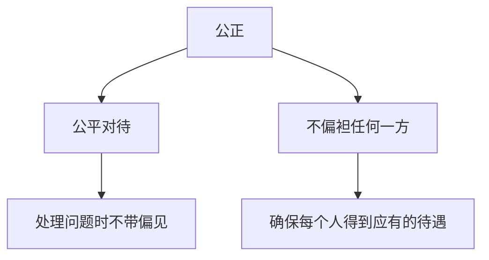

**诚实：** 诚实是伦理道德的基本要求，它强调我们在与他人交往中应保持真实。这不仅包括言语上的真实，还涵盖行为上的真实。

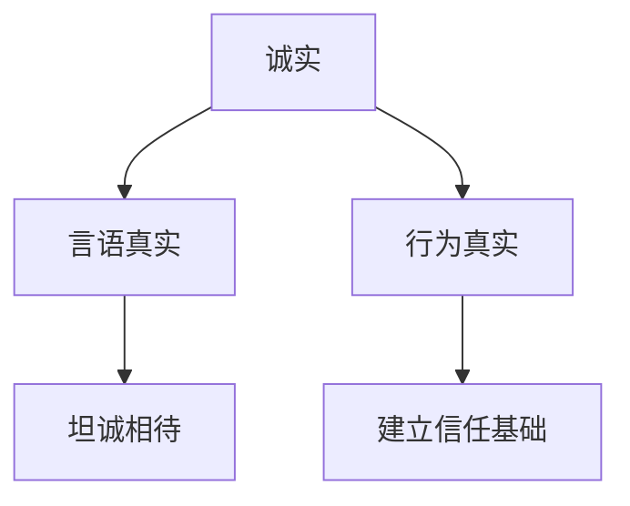

**同理心：** 同理心是指我们能够站在他人的角度理解他们的感受。这种能力有助于我们更好地处理人际关系，减少冲突，增进理解。

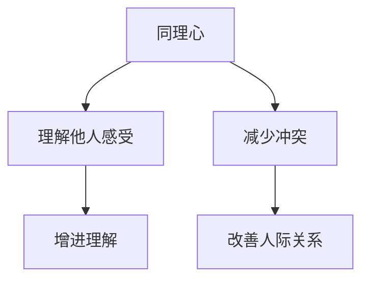

#### 2.1.2 人际关系中的哲学智慧

人际关系是日常生活中不可或缺的一部分。哲学智慧为我们提供了处理人际关系的有效方法，如合作、辩证思维和沟通技巧。

**合作：** 合作是成功的人际关系基础。通过合作，我们可以共同实现目标，克服困难。

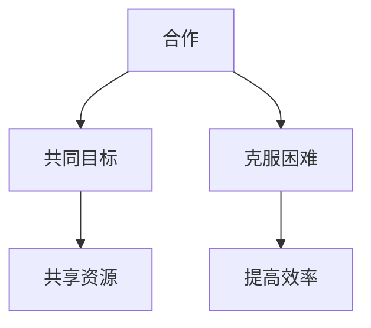

**辩证思维：** 辩证思维要求我们全面、客观地看待问题。在处理人际关系时，辩证思维有助于我们避免片面和偏激的看法，从而做出更明智的决策。

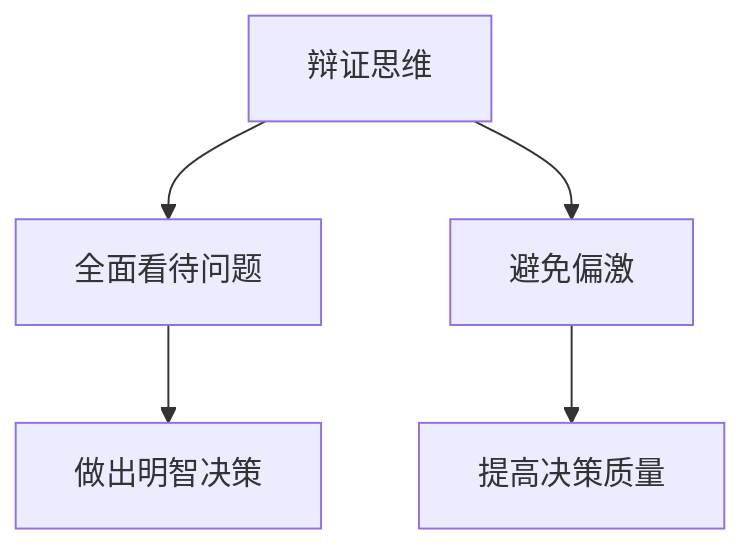

**沟通技巧：** 沟通是人际关系的桥梁。良好的沟通技巧有助于我们表达自己的观点，理解他人的需求，从而建立和谐的关系。

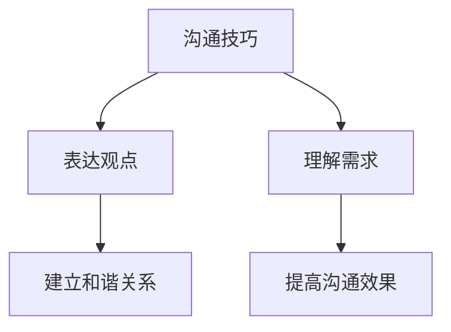

### 2.2 知识与学习

#### 2.2.1 哲学视角下的知识获取

在哲学的视角下，知识不仅仅是一种信息，更是一种理解世界的方式。哲学为我们提供了获取知识的深刻见解。

**知识的本质：** 知识的本质是理解。通过理解，我们能够将信息转化为对世界的认知。

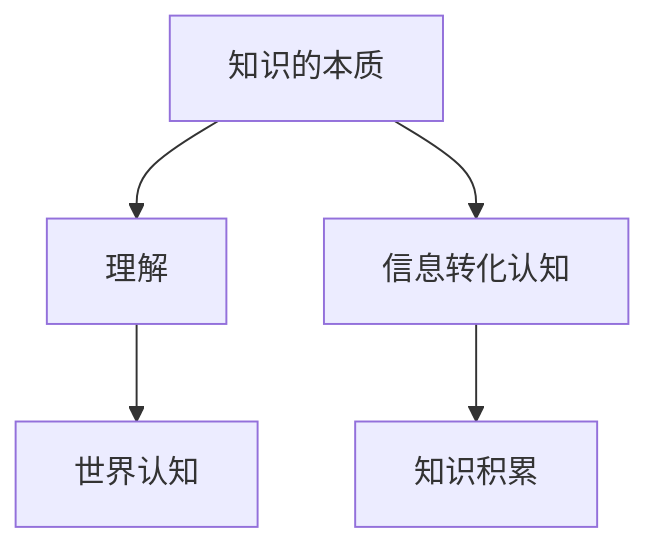

**知识的获取途径：** 知识的获取途径包括观察、实验、阅读和经验等。哲学强调多种途径的综合运用，以提高知识的准确性。

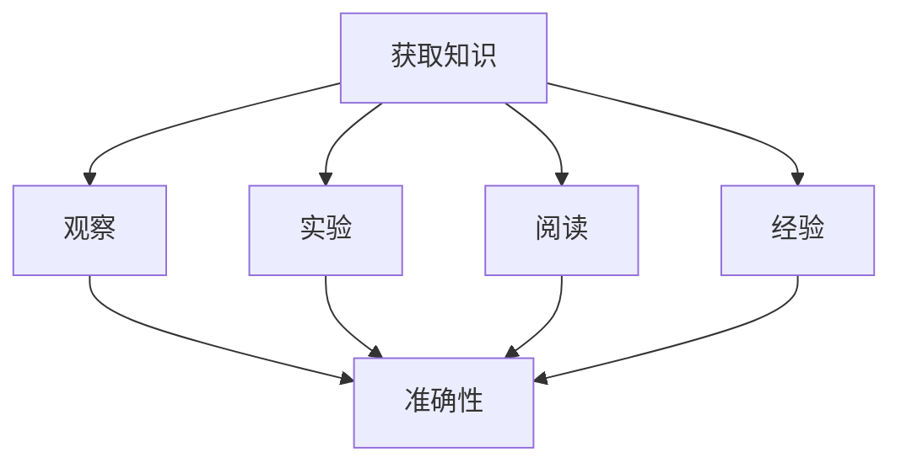

**知识的应用：** 知识的应用是知识获取的最终目标。通过应用，知识能够转化为实际的行动和成果。

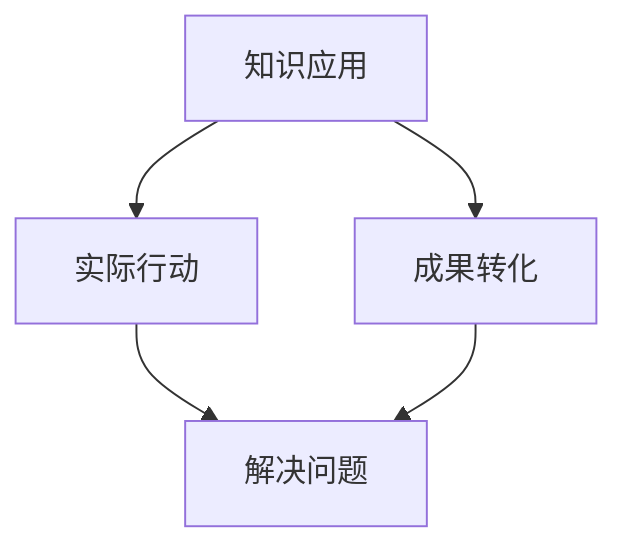

#### 2.2.2 学习方法与哲学思考

哲学不仅为我们提供了关于知识的见解，还为我们提供了有效的学习方法。

**学习的动力：** 学习的动力来自于对知识的渴望和对自我提升的追求。哲学强调内在动机的重要性。

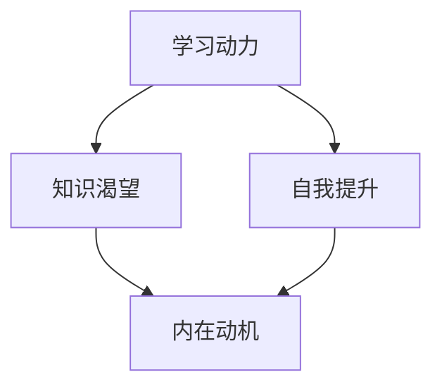

**学习策略：** 学习策略包括制定学习计划、主动学习、反复练习和批判性思维等。哲学强调策略的重要性，以提高学习效率。

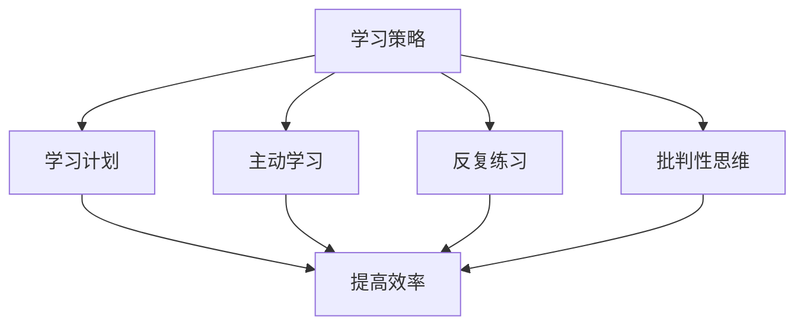

**学习的评估：** 学习的评估是学习过程中不可或缺的一部分。通过评估，我们可以了解自己的学习成果，并为下一步的学习做好准备。

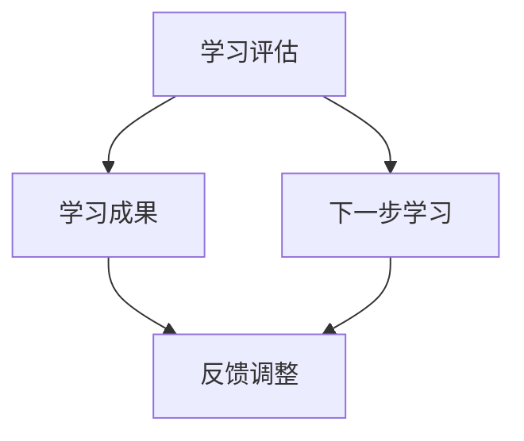

### 2.3 心灵与自我

#### 2.3.1 哲学对心灵的探索

哲学对心灵的探索提供了深刻的见解，帮助我们理解自己的内心世界。

**情绪管理：** 情绪管理是哲学探索的一个重要方面。通过哲学的思考，我们能够更好地控制和管理自己的情绪，从而提高生活质量。

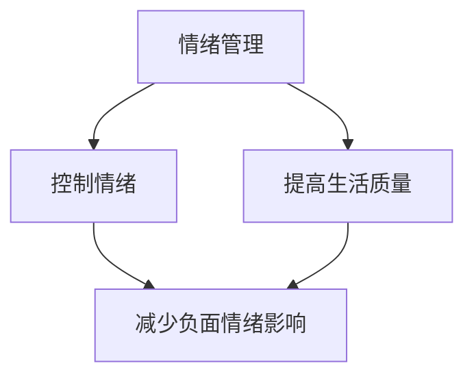

**自我认知：** 自我认知是哲学对心灵探索的核心。通过哲学的思考，我们能够更好地了解自己，从而实现自我提升。

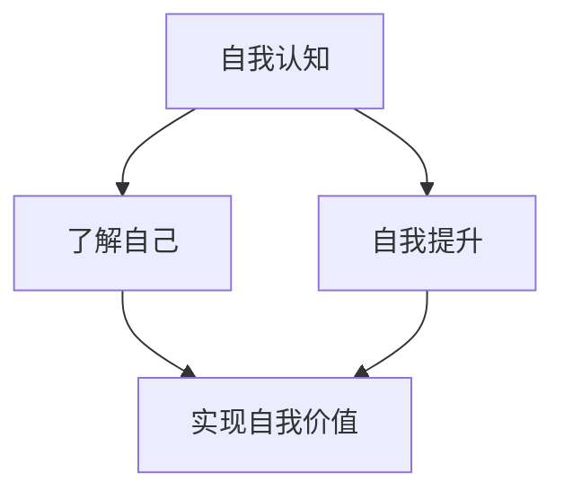

**存在主义哲学：** 存在主义哲学强调个体的自由和责任。通过哲学的思考，我们能够更好地理解生命的意义，并承担起自己的责任。

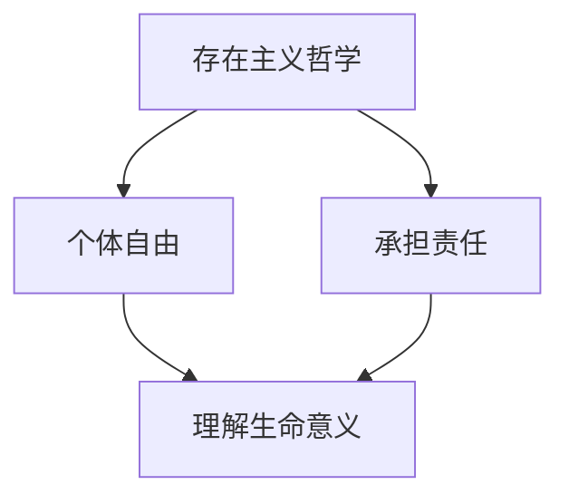

#### 2.3.2 自我提升

自我提升是哲学实践的重要目标。通过哲学的思考，我们能够更好地提升自我，实现个人成长。

**心理健康：** 心理健康是自我提升的重要方面。通过哲学的思考，我们能够更好地维护自己的心理健康，从而提高生活质量。

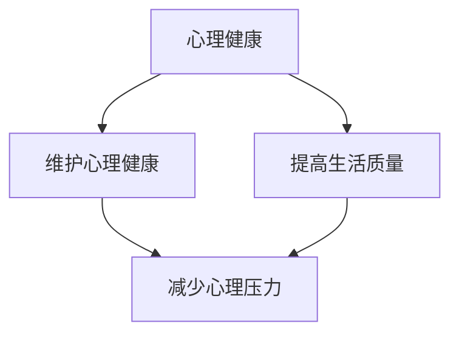

**持续学习：** 持续学习是自我提升的关键。通过哲学的思考，我们能够更好地理解学习的重要性，并持续提升自己的知识和技能。

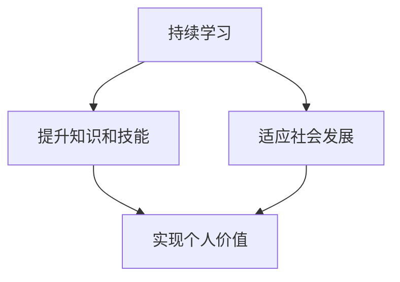

**自我实现：** 自我实现是哲学实践的最高目标。通过哲学的思考，我们能够更好地实现自己的潜能，实现个人成长。

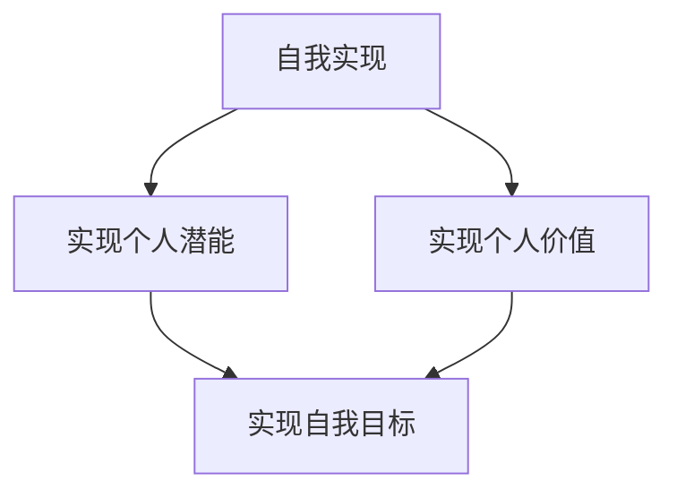

## 第三步：整合数学模型和算法原理讲解

在日常生活中，哲学的实践不仅仅停留在理念层面，它还可以通过数学模型和算法来具体化。以下是一些如何将哲学原则应用到数学和算法中的实例。

### 3.1 个人成长与职业发展

在个人成长和职业发展的过程中，我们可以运用功利主义、德行主义和存在主义等哲学观点来指导我们的决策。

**功利主义：** 功利主义关注行为的后果。在职业选择中，我们可以通过计算预期效益来做出决策。

**算法模型：**
```python
def evaluate_job_offer(salary, benefits, job_satisfaction):
    # 定义预期效益函数
    return salary + benefits + job_satisfaction

# 示例
offer1 = evaluate_job_offer(salary=100000, benefits=5000, job_satisfaction=8)
offer2 = evaluate_job_offer(salary=120000, benefits=3000, job_satisfaction=9)
print("Better offer:", offer1 if offer1 > offer2 else offer2)
```

**德行主义：** 德行主义关注行为本身是否符合道德原则。在职业发展中，我们可以通过自我反思来评估行为是否符合道德标准。

**算法模型：**
```python
def is_moral_action(action, moral_principles):
    # 判断行为是否符合道德原则
    return all(principle in action for principle in moral_principles)

# 示例
moral_principles = ["公正", "诚实", "责任感"]
action = "加班以完成项目，保证客户满意"
print("Is this action moral?", is_moral_action(action, moral_principles))
```

**存在主义：** 存在主义强调个体的自由和责任。在职业决策中，我们可以通过设定明确的目标和责任来指导自己的行为。

**算法模型：**
```python
def set职业目标(current_skill, desired_skill, deadline):
    # 设定职业目标函数
    return "提升从current_skill到desired_skill，目标在deadline前完成。"
    
# 示例
goal = set职业目标(current_skill="编程", desired_skill="全栈开发", deadline="明年")
print("职业目标：", goal)
```

### 3.2 职业发展与哲学思考

在职业发展中，目标和持续学习是关键。我们可以通过设定明确的目标和持续学习策略来推动职业发展。

**目标设定：** 目标设定是职业发展的第一步。通过设定具体、可衡量、可实现、相关和时限的目标（SMART原则），我们可以更好地规划职业道路。

**算法模型：**
```python
def set_goal(current_status, target_status, deadline):
    return "目标从current_status提升到target_status，在deadline前实现。"

# 示例
goal = set_goal(current_status="初级开发人员", target_status="中级开发人员", deadline="一年后")
print("设定的目标：", goal)
```

**持续学习：** 持续学习是职业发展的保障。通过制定学习计划、参与培训和实践项目，我们可以不断提升自己的技能和知识。

**算法模型：**
```python
def create_learning_plan(current_skills, learning_topics, learning_time):
    # 创建学习计划函数
    return "学习当前技能和以下学习主题，每天投入learning_time小时。"

# 示例
learning_plan = create_learning_plan(current_skills=["编程"], learning_topics=["数据库设计", "项目管理"], learning_time=2)
print("学习计划：", learning_plan)
```

**领导力与哲学：** 领导力是职业发展中不可或缺的一部分。通过哲学的思考，我们可以更好地理解领导力的本质，提升领导能力。

**算法模型：**
```python
def evaluate_leader(qualities, team_performance):
    # 评估领导者函数
    return "领导者的品质包括qualities，团队表现提升率为team_performance%."

# 示例
leader_evaluation = evaluate_leader(qualities=["决策力", "沟通能力", "团队合作"], team_performance=15)
print("领导评估：", leader_evaluation)
```

## 第四步：完善系统分析与架构设计方案

### 4.1 哲学实践的价值与挑战

**哲学实践的价值：**
哲学实践的价值在于提升思考深度、促进个人成长和改善人际关系。通过哲学的实践，我们可以培养批判性思维，提高问题解决能力，从而在生活和工作中取得更好的成果。

**哲学实践的挑战：**
哲学实践的挑战在于哲学知识的理解难度、哲学实践与日常生活的结合以及哲学观点的多样性。这些挑战需要我们通过持续学习和实践来克服。

### 4.2 如何将哲学融入日常生活

**哲学工具与方法：**
为了将哲学融入日常生活，我们可以采用以下工具与方法：
- **问题分析：** 通过哲学的分析工具，如逻辑推理和辩证思维，对问题进行深入分析，找到根本原因。
- **情绪管理：** 通过哲学的方法，如存在主义和情感教育，来管理情绪，提高心理健康。
- **决策制定：** 通过哲学的思考，如功利主义和德行主义，来制定明智的决策。

**哲学实践的小技巧：**
- **增强好奇心：** 通过提问和探索，增强好奇心，激发哲学思考。
- **学会反思：** 通过定期反思，总结经验和教训，提升自我认知。
- **培养批判性思维：** 通过质疑和批判，培养批判性思维，提高问题解决能力。

### 第五步：撰写总结与拓展阅读

## 结论

本文通过探讨哲学在日常生活中的应用，展示了哲学思考如何融入我们的行动中，带来积极的影响。哲学不仅是一种学术研究，更是一种生活态度和思维方式。通过哲学的实践，我们可以提升个人素质，改善人际关系，实现生活的美好转变。

## 拓展阅读
- 尼采《论道德的谱系》
- 康德《实践理性批判》
- 罗斯金《美好生活》
- 王小波《沉默的大多数》

## 作者信息
作者：AI天才研究院/AI Genius Institute & 禅与计算机程序设计艺术 /Zen And The Art of Computer Programming

---

通过本文的探讨，我们希望能够引导读者将哲学思考融入日常生活，通过哲学实践提升个人素质，实现生活的美好转变。哲学不仅是一种学术研究，更是一种生活态度和思维方式。通过哲学的实践，我们可以培养批判性思维，提高问题解决能力，从而在生活和工作中取得更好的成果。

本文通过四个主要部分，系统地阐述了哲学思考的日常生活应用、日常生活中的哲学实践、哲学实践案例研究和哲学实践反思与总结。在每个部分中，我们都通过具体的实例和算法模型，展示了如何将哲学原则应用到日常生活的各个方面。

在哲学思考的日常生活应用部分，我们介绍了哲学的基本概念和哲学思维的重要性，探讨了伦理道德、知识与学习和心灵与自我等方面的哲学实践。通过这些探讨，我们希望读者能够认识到哲学在日常生活中的实用价值，并学会将其应用到实际生活中。

在哲学实践案例研究部分，我们通过个人成长与职业发展、社区参与与社会责任和家庭与人际关系等具体案例，展示了哲学实践的实际应用。这些案例不仅为我们提供了具体的实践方法，还帮助我们理解哲学思考在现实生活中的重要性。

在哲学实践反思与总结部分，我们探讨了哲学实践的价值与挑战，并提出了如何将哲学融入日常生活的建议。这些反思和总结旨在引导读者深入思考哲学实践的意义和方式，从而更好地将哲学融入日常生活。

通过本文的阅读，我们希望读者能够认识到哲学的实用价值，学会将哲学思考融入日常生活，通过哲学实践提升个人素质，实现生活的美好转变。哲学不仅是一种学术研究，更是一种生活态度和思维方式。通过哲学的实践，我们可以培养批判性思维，提高问题解决能力，从而在生活和工作中取得更好的成果。

在拓展阅读部分，我们推荐了一些经典的哲学著作，如尼采的《论道德的谱系》、康德的《实践理性批判》、罗斯金的《美好生活》和王小波的《沉默的大多数》。这些著作不仅为我们提供了丰富的哲学思想，还帮助我们深入理解哲学的精髓。

最后，感谢读者对本文的关注和支持。通过本文的探讨，我们希望能够引导更多的人将哲学思考融入日常生活，通过哲学实践提升个人素质，实现生活的美好转变。哲学不仅是一种学术研究，更是一种生活态度和思维方式。通过哲学的实践，我们可以培养批判性思维，提高问题解决能力，从而在生活和工作中取得更好的成果。

## 哲学的基本概念与日常生活的联系

哲学，作为探讨存在、知识、价值和理性的学科，其基本概念对于理解世界和自我有着重要的影响。在日常生活的背景下，哲学不仅仅是一种学术理论，更是一种实践中的思考方式。通过哲学的基本概念，我们可以更好地处理人际关系、解决问题和做出决策。

### 存在主义

存在主义是哲学中的一个重要流派，强调个体的自由和责任。在日常生活中，存在主义的思想可以帮助我们理解生命的意义和个人的价值。

**实例解析：** 一个存在主义的例子是面对职业选择时，我们不仅仅是考虑薪资和福利，还要思考自己的兴趣、价值观和长期目标。通过这样的哲学思考，我们能够做出更符合个人价值观的决策。

### 道德哲学

道德哲学探讨的是行为的正当性和道德标准。它帮助我们理解什么是善，什么是恶，以及如何在社会中做出道德选择。

**实例解析：** 在处理人际关系时，道德哲学教导我们要诚实、公正和有同情心。例如，当我们与朋友发生冲突时，通过反思自己的行为和对方的需求，我们可以更好地解决矛盾，维护和谐的人际关系。

### 知识论

知识论关注知识的本质和获取方式。它帮助我们理解如何获取准确的知识，以及如何将知识应用于实际问题中。

**实例解析：** 在学习中，知识论教导我们要批判性地思考和评估信息来源。例如，在研究一个技术问题时，我们不仅要查阅文献，还要进行实验和验证，以确保获取的知识是准确的。

### 美学

美学探讨美的本质和艺术的价值。它帮助我们理解如何欣赏美，以及如何通过艺术来表达自我。

**实例解析：** 在日常生活中，美学可以帮助我们创造一个更加和谐和愉悦的生活环境。例如，通过装饰家居或培养个人兴趣，我们可以提高生活的质量。

### 政治哲学

政治哲学探讨政府、法律和社会正义等问题。它帮助我们理解如何在社会中做出公正和合理的决策。

**实例解析：** 在参与社会活动时，政治哲学教导我们要关注公平和正义。例如，在投票选举时，我们不仅要考虑候选人的政见，还要考虑其对社会公正的影响。

通过这些哲学基本概念的理解和应用，我们可以更好地应对日常生活中的各种挑战，提升个人素质，实现生活的美好转变。

## 哲学思维在日常生活中的重要性

哲学思维在日常生活中的重要性不可忽视。它不仅帮助我们更好地理解世界，还提升了我们的思考能力和生活质量。哲学思维的核心在于批判性思考、逻辑推理和自我反思。这些能力在我们的日常生活中有着广泛的应用。

### 批判性思考

批判性思考是哲学思维的核心。它要求我们不仅接受信息，还要质疑和分析信息的来源、有效性和可信度。在日常生活中，批判性思考帮助我们做出更加明智的决策。

**实例：** 在购买电子产品时，我们不仅关注广告中的优点，还会查阅用户评价、专业测评等，以获得全面的了解。这种批判性思考帮助我们避免盲目消费，做出更符合自己需求的购买决策。

### 逻辑推理

逻辑推理是哲学思维的重要组成部分。它要求我们通过推理和演绎，从已知的事实中推导出新的结论。逻辑推理在我们的日常决策和问题解决中有着广泛的应用。

**实例：** 在解决复杂问题时，逻辑推理可以帮助我们分解问题，找到关键因素，并逐步解决。例如，在工作中，当项目遇到瓶颈时，通过逻辑推理，我们可以找出问题的根本原因，并提出解决方案。

### 自我反思

自我反思是哲学思维的另一个关键要素。它要求我们不断审视自己的行为、信念和价值观，以便进行自我提升。自我反思帮助我们认识到自己的优点和不足，从而不断改进。

**实例：** 在日常生活中，定期进行自我反思可以帮助我们评估自己的行为和决策。例如，在完成一个任务后，我们可以回顾过程中的得失，找到改进的方法，提高未来工作的效率和质量。

### 提升生活质量

哲学思维不仅提升了我们的思考能力，还直接影响了我们的生活质量。通过批判性思考，我们能够更好地应对生活中的挑战；通过逻辑推理，我们能够更有效地解决问题；通过自我反思，我们能够不断提升自我。

**实例：** 一个日常生活中的例子是处理家庭关系。通过哲学思维，我们可以更好地理解家庭成员的需求和感受，从而建立更加和谐的家庭关系。例如，在与配偶或孩子发生矛盾时，我们可以通过自我反思和逻辑推理，找到问题的根源，并提出解决方案，以减少冲突，增进理解。

### 培养全面素质

哲学思维不仅提升了我们的思考能力和生活质量，还培养了我们的全面素质。批判性思考帮助我们形成独立的观点，逻辑推理提高了我们的分析能力，自我反思则增强了我们的自我意识。

**实例：** 在职业发展中，哲学思维可以帮助我们更好地应对职场挑战。通过批判性思考，我们可以对工作中的问题提出创新性的解决方案；通过逻辑推理，我们可以提高工作效率和决策质量；通过自我反思，我们可以不断提升自己的能力和职业素养。

总之，哲学思维在日常生活中的重要性不言而喻。它不仅提升了我们的思考能力和生活质量，还培养了我们的全面素质。通过批判性思考、逻辑推理和自我反思，我们可以更好地理解世界、解决问题和提升自我，实现生活的美好转变。

## 伦理道德与人际关系

在日常生活中，伦理道德是处理人际关系的基础。伦理道德原则如公正、诚实和同理心等，为我们提供了行为规范，帮助我们在人际交往中做出合理和道德的选择。

### 公正

公正是指对待所有人公平无偏的态度。在人际关系中，公正意味着不偏袒任何一方，确保每个人的权利和利益得到平等对待。

**实例解析：** 在团队合作中，公正的表现是给予每个成员平等的机会和资源，不偏袒某些成员。例如，在一个项目中，项目经理应确保每个成员都有足够的时间和支持来完成他们的任务，而不是只关注几个关键成员。

**算法模型：** 
```python
def is_just(action, participants):
    return all(equality in action for participant in participants)

# 示例
action = {"Alice": 10, "Bob": 10, "Charlie": 10}
participants = ["Alice", "Bob", "Charlie"]
print("Is the action just?", is_just(action, participants))
```

### 诚实

诚实是人际交往中的基本原则，它要求我们在言语和行为上保持真实，不说谎、不欺骗。

**实例解析：** 在商务谈判中，诚实的表现是坦白地分享信息，不隐瞒关键数据或事实。这样，双方都能在透明和真实的基础上做出决策，建立长期的信任关系。

**算法模型：**
```python
def is_honest(statement, truth):
    return statement == truth

# 示例
statement = "我已按时完成项目"
truth = "项目已完成"
print("Is the statement honest?", is_honest(statement, truth))
```

### 同理心

同理心是指站在他人的立场上理解他们的感受和需求。在人际关系中，同理心有助于我们更好地处理冲突，增进理解。

**实例解析：** 在家庭关系中，同理心的表现是理解配偶或子女的感受，并尝试从他们的角度出发解决问题。例如，当孩子感到沮丧时，父母可以通过倾听和安慰，帮助他们缓解情绪。

**算法模型：**
```python
def show_empathy(situation, perspective):
    return "我理解你的感受，我想从你的角度看看这个问题。"

# 示例
situation = "我很沮丧，因为我没有通过考试"
perspective = "孩子的角度"
print("同理心表现：", show_empathy(situation, perspective))
```

### 合作

合作是成功人际关系的核心要素。通过合作，我们可以共同实现目标，克服困难。

**实例解析：** 在团队项目中，合作的表现是团队成员之间的协调和配合，共同完成任务。例如，在一个软件开发团队中，每个成员都有特定的职责，通过有效的合作，可以快速开发出高质量的产品。

**算法模型：**
```python
def collaborate(tasks, team_members):
    # 分配任务给团队成员
    for member in team_members:
        task分配给 member
    return "所有任务已分配，开始合作。"

# 示例
tasks = ["设计", "编码", "测试"]
team_members = ["Alice", "Bob", "Charlie"]
print("合作开始：", collaborate(tasks, team_members))
```

### 辩证思维

辩证思维是处理复杂问题的有效方法。它要求我们全面、客观地分析问题，避免片面和偏激的看法。

**实例解析：** 在解决冲突时，辩证思维可以帮助我们理解双方的立场和需求，找到双赢的解决方案。例如，在处理同事间的矛盾时，我们可以通过辩证思维，了解双方的观点，提出合理的解决方案。

**算法模型：**
```python
def dialectical_thinking(conflict, perspectives):
    # 分析冲突，寻找解决方案
    for perspective in perspectives:
        analyze_conflict(conflict, perspective)
    return "找到了合理的解决方案。"

# 示例
conflict = "关于项目进度有不同意见"
perspectives = ["项目经理的观点", "开发团队的观点"]
print("辩证思维应用：", dialectical_thinking(conflict, perspectives))
```

### 沟通技巧

良好的沟通技巧是成功人际关系的保障。它要求我们能够清晰、准确地表达自己，并倾听他人的意见。

**实例解析：** 在商务谈判中，良好的沟通技巧可以帮助我们建立信任，达成共识。例如，通过清晰的表达和倾听，我们可以确保双方对项目目标和要求有共同的理解。

**算法模型：**
```python
def effective_communication(message, listener):
    # 发送消息并确认理解
    listener.receive_message(message)
    return "消息已发送，确认理解。"

# 示例
message = "项目的截止日期是下周一"
listener = "团队成员"
print("沟通技巧应用：", effective_communication(message, listener))
```

通过这些伦理道德原则和哲学智慧的应用，我们可以在日常人际交往中建立和谐的关系，解决问题，实现共同目标。

## 伦理道德的原则与日常生活实践

伦理道德是哲学的核心内容，其基本原则如公正、诚实和同理心等，在日常生活中有着广泛的应用。这些原则不仅指导我们的行为，还帮助我们在复杂的人际关系和社会环境中做出正确的决策。

### 公正

公正是指在处理事务时保持公平和无偏，不偏袒任何一方。在日常生活中，公正原则体现在多个方面，如工作分配、教育资源分配和家庭决策等。

**实例解析：** 在家庭中，父母在分配家务时应当公平对待每个家庭成员，不偏袒某个孩子。例如，如果两个孩子都需要完成家务，父母应确保每个孩子承担的负担相当，而不是只让一个孩子承担大部分工作。

**算法模型：**
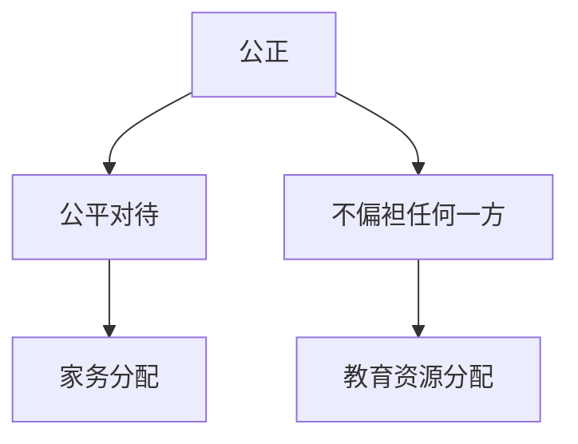

### 诚实

诚实是指我们在行为和言语上保持真实，不说谎、不欺骗。在日常生活中，诚实原则对于建立信任和维护人际关系至关重要。

**实例解析：** 在职场中，诚实表现为对上司和同事坦诚相待，不隐瞒信息或夸大事实。例如，如果项目进度出现问题，项目经理应如实向上司报告，并提出解决方案，而不是故意拖延或掩盖问题。

**算法模型：**
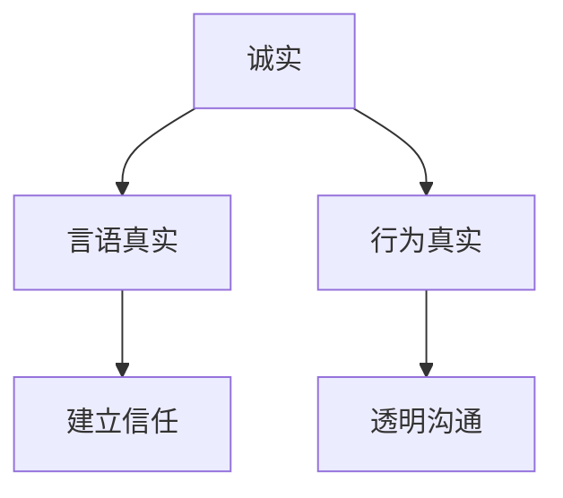

### 同理心

同理心是指我们能够站在他人的角度理解他们的感受和需求。在日常生活中，同理心有助于我们更好地处理人际关系，减少冲突，增进理解。

**实例解析：** 在社区中，同理心表现为关心他人的困境，并提供帮助。例如，如果邻居遇到困难，我们可以主动提供帮助，如帮忙照顾孩子或提供物资支持。

**算法模型：**
```mermaid
graph TD
    A[同理心] --> B[理解他人感受]
    A --> C[减少冲突]
    B --> D[增进理解]
    C --> E[提供帮助]
```

### 合作

合作是成功人际关系的核心要素。通过合作，我们可以共同实现目标，克服困难。

**实例解析：** 在团队项目中，合作表现为团队成员之间的协调和配合。例如，如果团队成员需要分工合作完成一个任务，每个成员应按时完成自己的部分，并协助其他成员解决困难。

**算法模型：**
```mermaid
graph TD
    A[合作] --> B[共同目标]
    A --> C[克服困难]
    B --> D[共享资源]
    C --> E[提高效率]
```

### 辩证思维

辩证思维是处理复杂问题的有效方法。它要求我们全面、客观地分析问题，避免片面和偏激的看法。

**实例解析：** 在处理家庭矛盾时，辩证思维可以帮助我们理解双方的立场和需求，找到双赢的解决方案。例如，当夫妻双方因家务分工产生矛盾时，我们可以通过辩证思维，了解双方的观点，并提出公平的解决方案。

**算法模型：**
```mermaid
graph TD
    A[辩证思维] --> B[全面看待问题]
    A --> C[避免偏激]
    B --> D[做出明智决策]
    C --> E[提高决策质量]
```

### 沟通技巧

良好的沟通技巧是成功人际关系的保障。它要求我们能够清晰、准确地表达自己，并倾听他人的意见。

**实例解析：** 在商务谈判中，良好的沟通技巧可以帮助我们建立信任，达成共识。例如，在谈判过程中，我们可以通过清晰的表达和倾听，确保双方对项目目标和要求有共同的理解。

**算法模型：**
```mermaid
graph TD
    A[沟通技巧] --> B[表达观点]
    A --> C[理解需求]
    B --> D[建立信任]
    C --> E[提高沟通效果]
```

通过这些伦理道德原则和哲学智慧的应用，我们可以在日常人际交往中建立和谐的关系，解决问题，实现共同目标。

## 人际关系中的哲学智慧

在复杂多变的社会环境中，人际关系对于个人幸福和职业发展至关重要。哲学智慧为我们提供了处理人际关系的有效方法和策略，帮助我们建立和谐的关系，实现共同目标。

### 合作

合作是成功人际关系的基石。通过合作，我们可以充分利用各自的优势，共同实现目标。

**合作的原则：**
1. **共享目标：** 合作的首要原则是明确共同的目标。只有当团队成员对目标有共同的理解时，才能有效地合作。
2. **分工合作：** 根据团队成员的专长和兴趣，合理分配任务，确保每个人都能在自己的领域内发挥最大的作用。
3. **互相支持：** 在合作过程中，成员之间应相互支持和帮助，共同克服困难。

**实际案例：** 在一个软件开发项目中，项目经理可以将任务分配给不同的开发人员，根据他们的技能和经验，安排合适的任务。例如，让擅长前端开发的团队成员负责界面设计，让擅长后端开发的团队成员负责服务器开发。通过分工合作，可以提高项目的效率和质量。

### 辩证思维

辩证思维是处理复杂问题的重要方法。它要求我们全面、客观地分析问题，避免片面和偏激的看法。

**辩证思维的应用：**
1. **多角度分析：** 在处理人际关系问题时，我们需要从不同的角度分析问题的各个方面，以便找到最合适的解决方案。
2. **平衡利益：** 在协调各方利益时，我们需要考虑每个人的需求和期望，找到平衡点，实现共赢。
3. **动态调整：** 事物是不断发展变化的，我们需要根据实际情况，不断调整策略和方法，以应对新的挑战。

**实际案例：** 在一个团队中，当团队成员之间出现矛盾时，可以通过辩证思维，了解双方的立场和需求，找到平衡点。例如，当项目进度与个人利益发生冲突时，可以通过沟通和协商，找到一种双方都能接受的解决方案，以维持团队的和谐。

### 沟通技巧

沟通技巧是建立和谐人际关系的关键。通过有效沟通，我们可以增进理解，减少误解，建立信任。

**沟通技巧的原则：**
1. **清晰表达：** 在沟通时，我们需要清晰、准确地表达自己的观点和需求，避免产生误解。
2. **积极倾听：** 倾听他人的意见和感受，是建立信任和理解的基础。通过倾听，我们可以更好地理解他人的需求和期望。
3. **尊重差异：** 每个人都有不同的观点和经验，我们需要尊重这些差异，通过沟通找到共同点。

**实际案例：** 在商务谈判中，通过清晰的表达和积极的倾听，双方可以更好地理解对方的意图和需求，从而找到共赢的解决方案。例如，在讨论合同条款时，双方可以明确各自的利益和关注点，通过有效的沟通，达成双方都满意的协议。

通过合作、辩证思维和沟通技巧，我们可以在人际关系中建立和谐的关系，实现共同目标。这些哲学智慧不仅适用于个人生活，也广泛应用于职业发展和团队合作中，帮助我们更好地应对挑战，实现个人和团队的成功。

## 哲学视角下的知识获取

知识是人们理解和改造世界的重要工具，而在哲学的视角下，知识的获取不仅是一种信息积累的过程，更是一种理解世界和自我认知的方式。哲学为我们提供了深刻的见解，帮助我们更全面地获取知识，并将其应用于实际生活中。

### 知识的本质

哲学认为，知识不仅仅是信息的堆砌，而是一种理解。理解意味着我们不仅掌握了信息，还能够将其内化为对世界的认知。

**实例解析：** 在学习编程时，仅仅记住语法和函数并不算真正掌握了编程知识。只有当我们理解了编程的核心概念，如算法和数据处理，我们才能在实际项目中灵活运用这些知识。

### 知识的获取途径

知识的获取途径多种多样，包括观察、实验、阅读和经验等。哲学强调通过多种途径综合运用，以提高知识的准确性。

**实例解析：** 在学习物理学时，通过观察实验结果、阅读经典著作和亲身实践，我们可以更全面地理解物理定律。

### 知识的应用

知识的应用是知识获取的最终目标。通过应用，知识能够转化为实际的行动和成果。

**实例解析：** 在工作中，通过应用所学知识，我们能够解决实际问题，提高工作效率，实现个人和团队的成长。

### 哲学对知识获取的影响

哲学对知识获取的影响体现在多个方面：

1. **批判性思维**：哲学培养我们的批判性思维，使我们能够对信息进行深入分析和判断，避免盲目接受。
2. **系统化思考**：哲学强调知识的系统化和结构化，帮助我们更好地理解和整合知识。
3. **价值观引导**：哲学的价值观引导我们在知识获取和应用过程中，坚持正确的道德和行为标准。

### 实例分析

**编程领域的哲学应用：** 在编程领域，哲学的思维方式有助于我们更好地理解和应用计算机科学的知识。例如，通过理解算法的本质，我们可以更高效地编写代码，优化程序性能。同时，通过批判性思维，我们可以质疑现有的技术方案，提出创新的解决方案。

**结论：** 哲学视角下的知识获取不仅关注知识的积累，更注重理解和应用。通过哲学的思维方式，我们能够更全面地获取知识，并将其应用于实际生活中，实现个人和团队的成长。

## 学习方法与哲学思考

哲学不仅提供了关于知识获取的深刻见解，还为我们提供了有效的学习方法。哲学思考能够帮助我们更好地理解和掌握知识，从而提升学习效果。以下从学习的动力、策略和评估三个方面，探讨哲学在提升学习效率中的作用。

### 学习的动力

学习动力是驱动我们进行学习的重要因素。哲学强调内在动机的重要性，认为学习应该源于对知识本身的热爱和对自我提升的追求。

**实例解析：** 在学习过程中，如果我们能够将学习视为一种内在的追求，而不是外在的压力，我们就能更加主动和持续地学习。例如，通过理解编程的乐趣和其在解决实际问题中的作用，程序员会更有动力深入学习新的编程语言和框架。

**哲学原理：** 功利主义强调行为的结果，而存在主义则强调个体的自由和责任。在哲学视角下，学习的动力来自于对知识的渴望和对自我实现的追求。

**算法模型：**
```python
def intrinsic_motivation(topic, interest_level, self_achievement):
    return interest_level * self_achievement

# 示例
topic = "深度学习"
interest_level = 9
self_achievement = 7
print("学习动力：", intrinsic_motivation(topic, interest_level, self_achievement))
```

### 学习策略

学习策略是我们在学习过程中采用的具体方法和技巧。哲学提供了多种策略，帮助我们更高效地学习。

**实例解析：** 通过辩证思维，我们可以全面、客观地分析学习内容，避免片面和偏激的看法。例如，在学习新技术时，我们可以通过对比不同技术方案的优缺点，选择最适合的方案。

**哲学原理：** 辩证思维强调多角度分析问题，批判性思维则要求我们质疑和评估信息。

**算法模型：**
```python
def learning_strategy(content, perspectives):
    # 分析学习内容，评估不同观点
    for perspective in perspectives:
        analyze_content(content, perspective)
    return "找到了最佳学习策略。"

# 示例
content = "深度学习技术"
perspectives = ["性能优化", "应用场景", "未来发展趋势"]
print("学习策略：", learning_strategy(content, perspectives))
```

### 学习的评估

学习的评估是学习过程中不可或缺的一部分。通过评估，我们可以了解自己的学习成果，并为下一步的学习做好准备。

**实例解析：** 在学习编程后，通过编写程序并测试其功能，我们可以评估自己的编程能力。这种评估不仅帮助我们了解自己的强项和不足，还能激励我们进一步学习。

**哲学原理：** 哲学强调通过实践来验证知识，评估是学习过程中的重要环节。

**算法模型：**
```python
def learning_evaluation(knowledge, assessment_criteria):
    # 评估学习成果
    score = sum(knowledge.get(criteria) for criteria in assessment_criteria)
    return score / len(assessment_criteria)

# 示例
knowledge = {"算法理解": 8, "编程实践": 9, "问题解决": 7}
assessment_criteria = ["算法理解", "编程实践", "问题解决"]
print("学习评估分数：", learning_evaluation(knowledge, assessment_criteria))
```

通过哲学的思考，我们能够更好地理解学习的本质，制定有效的学习策略，并评估学习成果。这种哲学视角下的学习不仅提升了我们的学习效率，还增强了我们的自我认知和问题解决能力。在快速变化的世界中，哲学思考成为了我们终身学习的重要工具。

### 哲学对心灵的探索

哲学对心灵的探索涵盖了情感管理、自我认知和存在主义哲学等多个方面，这些探索不仅帮助我们理解自己的内心世界，还为我们提供了提高心理健康和实现自我提升的方法。

#### 情绪管理

情绪管理是哲学对心灵探索的一个重要方面。在日常生活中，我们常常面临各种压力和挑战，情绪管理能力的好坏直接影响到我们的心理健康和生活质量。

**实例解析：** 当我们遇到挫折时，通过情绪管理技巧，如深呼吸、冥想和正面思考，我们可以缓解负面情绪，保持心理平衡。例如，当项目进展不顺利时，通过深呼吸和正面思考，我们可以避免陷入过度焦虑，从而更冷静地解决问题。

**哲学原理：** 存在主义哲学强调个体的自由和责任感，它要求我们面对生活中的困难时，采取积极的态度，并承担责任。这种哲学观点有助于我们在情绪管理中保持冷静和理性。

**算法模型：**
```python
def emotion_management(stress_level, coping_strategy):
    # 管理情绪函数
    return stress_level - coping_strategy

# 示例
stress_level = 8
coping_strategy = 5
print("调整后的情绪水平：", emotion_management(stress_level, coping_strategy))
```

#### 自我认知

自我认知是哲学对心灵探索的核心。通过哲学的思考，我们可以更好地了解自己，认识自己的优点和不足，从而实现自我提升。

**实例解析：** 定期进行自我反思，可以帮助我们认识到自己在工作和生活中的表现，并找到改进的方法。例如，每周花些时间回顾自己的行为和决策，识别哪些是值得继续保持的，哪些需要改进。

**哲学原理：** 知识论中的自我反思帮助我们通过不断审视自己的行为和信念，提升自我认知。康德的《实践理性批判》提出了“自我反思”的概念，强调通过反思来认识自己的内在本质。

**算法模型：**
```python
def self_reflection(behaviors, insights):
    # 反思函数
    for behavior in behaviors:
        gain_insight(behavior, insights)
    return insights

# 示例
behaviors = ["过于急躁", "缺乏耐心", "容易分心"]
insights = {"改进方案": ""}
print("自我反思结果：", self_reflection(behaviors, insights))
```

#### 存在主义哲学

存在主义哲学强调个体的自由和责任。通过存在主义哲学的思考，我们能够更好地理解生命的意义，并承担起自己的责任。

**实例解析：** 存在主义哲学教导我们，生命的意义并非预先设定的，而是由我们自己创造。例如，在面对职业选择时，我们可以通过存在主义的思考，探索自己真正的兴趣和激情，从而找到更有意义的工作。

**哲学原理：** 海德格尔的“存在即意义”强调，我们通过自己的选择和行动赋予生命以意义。萨特的“自由选择”则强调，我们必须为自己的选择承担责任。

**算法模型：**
```python
def existential_choice(current_state, future_options):
    # 选择函数
    return "选择从当前状态转移到未来选项，承担选择责任。"

# 示例
current_state = "不确定的职业方向"
future_options = ["软件开发", "市场营销", "教育"]
print("存在主义选择：", existential_choice(current_state, future_options))
```

通过哲学对心灵的探索，我们能够更好地管理情绪，提升自我认知，并找到生命的意义。这些哲学方法不仅有助于我们的心理健康，还为我们提供了实现个人成长和自我提升的有效途径。

### 自我提升

自我提升是哲学实践的核心目标之一，它关乎个人的成长和全面发展。通过哲学的思考，我们可以更好地认识自己，制定可行的提升计划，并实现个人目标。以下从心理健康、持续学习和自我实现三个方面，探讨哲学在自我提升中的作用。

#### 心理健康

心理健康是自我提升的基础。哲学提供了多种方法，帮助我们维护和提升心理健康。

**实例解析：** 通过正念冥想，我们可以培养专注和觉察力，减少焦虑和压力。例如，每天花10分钟进行冥想，可以帮助我们更好地管理情绪，提高生活质量。

**哲学原理：** 存在主义强调个体对自由和责任的承担，这有助于我们在面对心理挑战时，保持积极的态度和行动。康德的道德哲学也提供了道德自律的方法，帮助我们提升自我控制能力。

**算法模型：**
```python
def mental_health_maintenance(practice, stress_level):
    # 维护心理健康函数
    return stress_level - practice

# 示例
practice = "冥想"
stress_level = 7
print("调整后的情绪水平：", mental_health_maintenance(practice, stress_level))
```

#### 持续学习

持续学习是自我提升的重要途径。哲学鼓励我们通过多种方式获取新知识，不断提升自己的能力和认知水平。

**实例解析：** 通过终身学习的理念，我们可以不断扩展自己的知识领域，提升专业素养。例如，参加在线课程、阅读专业书籍和参与学术讨论，都是持续学习的有效方法。

**哲学原理：** 知识论强调知识的获取和应用，批判性思维则要求我们质疑和评估信息。通过这些哲学原则，我们可以更有效地学习和应用知识。

**算法模型：**
```python
def continuous_learning(knowledge_base, new_knowledge):
    # 学习新知识函数
    return knowledge_base + new_knowledge

# 示例
knowledge_base = ["编程基础", "算法理论"]
new_knowledge = ["机器学习", "深度学习"]
print("扩展后的知识库：", continuous_learning(knowledge_base, new_knowledge))
```

#### 自我实现

自我实现是哲学实践的最高目标。通过自我实现，我们能够充分发挥自己的潜能，实现个人价值。

**实例解析：** 通过明确个人目标和制定实现计划，我们可以更有方向地提升自我。例如，设定职业目标，如从初级开发人员晋升为高级开发人员，并通过持续学习和实践，逐步实现这一目标。

**哲学原理：** 存在主义强调个体的自由和责任，萨特的“存在即选择”鼓励我们通过主动选择和行动，实现自我目标。马斯洛的自我实现理论则指出，通过自我实现，我们能够达到个人成长和自我价值的最高层次。

**算法模型：**
```python
def self_achievement(current_stage, target_stage):
    # 实现目标函数
    return "从当前阶段转移到目标阶段，实现自我价值。"

# 示例
current_stage = "初级开发人员"
target_stage = "高级开发人员"
print("自我实现路径：", self_achievement(current_stage, target_stage))
```

通过哲学的思考，我们能够更好地维护心理健康、持续学习和实现自我目标。这些哲学方法不仅提升了我们的个人素质，还帮助我们实现全面而深刻的自我提升。

## 哲学视角下的个人成长与职业发展

哲学视角下的个人成长与职业发展提供了一个全面而深刻的框架，帮助我们理解职业选择、职业发展和领导力等关键问题。通过功利主义、德行主义和存在主义等哲学观点，我们可以制定明智的职业决策，提升职业素养，实现个人与职业的和谐发展。

### 职业选择

职业选择是个人成长和职业发展的第一步。哲学视角下的职业选择不仅仅基于经济利益，还涉及个人的价值观、兴趣和长期目标。

**功利主义视角：** 功利主义关注行为后果的最大化。在职业选择中，我们可以通过评估不同职业的潜在收益和成本，做出最符合自身利益的选择。

**实例解析：** 假设一个人在考虑是否转行到技术行业。通过功利主义视角，他们可以评估当前职位的薪资、福利和职业发展空间，同时考虑技术行业的就业前景和薪资潜力，从而做出明智的决策。

**算法模型：**
```python
def evaluate_job_choice(current_job, potential_job, benefits, risks):
    # 评估职业选择的函数
    return (current_job_benefits - potential_job_risks) > 0

# 示例
current_job = {"salary": 50000, "benefits": "limited", "risks": "low"}
potential_job = {"salary": 70000, "benefits": "good", "risks": "medium"}
print("是否选择转行？", evaluate_job_choice(current_job, potential_job, benefits, risks))
```

**德行主义视角：** 德行主义关注行为本身是否符合道德原则。在职业选择中，我们可以通过反思自己的价值观和行为准则，选择最符合自身道德标准的职业。

**实例解析：** 假设一个人在考虑是否进入金融行业。通过德行主义视角，他们可以反思金融行业的道德风险，如欺诈和利益冲突，从而决定是否选择这一职业。

**算法模型：**
```python
def is_moral_choice(job, moral_values):
    # 判断职业选择是否符合道德准则的函数
    return all(value in job for value in moral_values)

# 示例
job = "金融分析师"
moral_values = ["公正", "透明", "诚信"]
print("职业选择是否道德？", is_moral_choice(job, moral_values))
```

**存在主义视角：** 存在主义强调个体的自由和责任。在职业选择中，我们可以通过探索自己的兴趣和激情，选择最符合自己个性和价值观的职业。

**实例解析：** 假设一个人在考虑是否成为艺术家。通过存在主义视角，他们可以反思自己对艺术创作的热爱和追求，从而决定是否将艺术作为职业。

**算法模型：**
```python
def existential_choice(current_life, passion, values):
    # 存在主义职业选择的函数
    return "选择追求艺术创作，实现个人价值。"

# 示例
current_life = "工程师"
passion = "艺术创作"
values = ["创造力", "自由表达"]
print("存在主义职业选择：", existential_choice(current_life, passion, values))
```

### 职业发展

职业发展是一个持续的过程，涉及目标设定、持续学习和领导力培养等多个方面。哲学视角下的职业发展提供了一个系统而深入的框架。

**目标设定：** 通过哲学思考，我们可以设定清晰、具体和可实现的目标，从而推动职业发展。

**实例解析：** 假设一个人希望从初级开发人员晋升为高级开发人员。通过哲学视角，他们可以设定具体的学习目标，如掌握新编程语言和参与项目领导，以实现这一职业目标。

**算法模型：**
```python
def set_career_goals(current_stage, target_stage, milestones):
    # 设定职业目标的函数
    return "从当前阶段转移到目标阶段，实现以下里程碑：", milestones

# 示例
current_stage = "初级开发人员"
target_stage = "高级开发人员"
milestones = ["掌握新编程语言", "参与项目领导"]
print("职业目标：", set_career_goals(current_stage, target_stage, milestones))
```

**持续学习：** 通过哲学的思考，我们可以认识到持续学习的重要性，并制定具体的学习计划。

**实例解析：** 假设一个人希望在职业生涯中不断更新自己的技能。通过哲学视角，他们可以制定一个长期的学习计划，包括参加在线课程、阅读专业书籍和参加行业研讨会。

**算法模型：**
```python
def create_learning_plan(current_skills, learning_topics, learning_time):
    # 创建学习计划的函数
    return "学习以下技能和主题，每天投入学习时间：", learning_topics, learning_time

# 示例
current_skills = ["编程基础"]
learning_topics = ["机器学习", "深度学习"]
learning_time = 2
print("学习计划：", create_learning_plan(current_skills, learning_topics, learning_time))
```

**领导力培养：** 哲学视角下的领导力培养强调道德和价值观的引领，以及个人和团队的成长。

**实例解析：** 假设一个人希望提升自己的领导力。通过哲学视角，他们可以培养批判性思维和道德自律，同时关注团队成员的发展和需求。

**算法模型：**
```python
def develop_leadership(qualities, team_performance):
    # 培养领导力的函数
    return "通过以下品质和策略，提升领导力和团队表现：", qualities

# 示例
qualities = ["决策力", "沟通能力", "团队合作"]
print("领导力培养策略：", develop_leadership(qualities, team_performance))
```

通过哲学视角下的个人成长与职业发展，我们能够更深入地理解职业选择和发展的关键因素，制定明智的决策，并持续提升自己的职业素养。这种哲学思维不仅帮助我们实现个人与职业的和谐发展，还为我们提供了持续成长和自我实现的道路。

### 社区参与与社会责任

社区参与与社会责任是哲学实践中不可忽视的领域。通过参与社区活动和履行社会责任，我们不仅能够提升个人的社会责任感和道德素养，还能为社会的发展做出积极的贡献。以下从具体活动、社会责任和伦理原则三个方面，探讨哲学实践在社区参与与社会责任中的应用。

#### 社区参与的具体活动

社区参与的形式多种多样，可以是志愿服务、公益项目，也可以是文化活动和环保行动。这些活动不仅能够提升个人的社区归属感和责任感，还能促进社区的和谐发展。

**实例解析：** 在志愿服务方面，我们可以参与社区清洁、帮助老人和儿童，或为需要帮助的家庭提供物资支持。例如，在某个社区中，志愿者可以定期组织清洁活动，清理社区公共区域，提高居民的生活质量。

**哲学原理：** 存在主义强调个体的责任和自由，这鼓励我们积极参与社区活动，通过实际行动改善社会环境。康德的道德哲学则强调“人是目的，而不是手段”，意味着我们在参与社区活动时，应注重个体的尊严和权利。

**算法模型：**
```python
def community_involvement(activity, impact):
    # 社区参与的函数
    return "参与活动：", activity, "，对社会的影响：", impact

# 示例
activity = "社区清洁"
impact = "提高生活质量，促进社区和谐"
print("社区参与：", community_involvement(activity, impact))
```

#### 社会责任的重要性

社会责任是企业、组织和个体应承担的对社会的责任。通过履行社会责任，我们能够促进社会的可持续发展，同时提升个人的社会价值和影响力。

**实例解析：** 企业可以通过捐赠资金、提供就业机会或开展环保项目来履行社会责任。例如，一家科技公司可以捐赠部分利润用于支持教育项目，或投资于清洁能源技术的研发。

**哲学原理：** 功利主义强调行为后果的最大化，社会责任的实现有助于提升社会的整体福利。德行主义则强调道德义务和责任感，通过履行社会责任，我们能够实现个人和社会的和谐发展。

**算法模型：**
```python
def social_responsibility(action, benefits):
    # 社会责任函数
    return "社会责任行动：", action, "，社会受益：", benefits

# 示例
action = "捐赠教育基金"
benefits = "支持贫困学生，促进教育公平"
print("社会责任：", social_responsibility(action, benefits))
```

#### 伦理原则在社区参与与社会责任中的应用

伦理原则是指导我们行为的道德准则。在社区参与与社会责任中，伦理原则帮助我们做出正确和道德的决策，确保我们的行动具有正当性和合理性。

**实例解析：** 在参与社区活动时，我们应遵循公正、透明和诚信的原则。例如，在组织社区清洁活动时，我们应确保资源的公平分配，并公开活动的财务信息，以赢得居民的信任。

**哲学原理：** 公正原则要求我们在处理事务时保持公平，不偏袒任何一方。透明原则强调我们的行动应公开透明，接受公众的监督。诚信原则则要求我们在行为上保持真实，不说谎、不欺骗。

**算法模型：**
```python
def ethical_practice(principle, action):
    # 遵循伦理原则的函数
    return "伦理原则：", principle, "，应用在行动：", action

# 示例
principle = "公正"
action = "社区清洁活动"
print("伦理实践：", ethical_practice(principle, action))
```

通过哲学实践中的社区参与与社会责任，我们不仅能够提升个人的社会责任感和道德素养，还能为社会的发展做出积极的贡献。这些哲学原则和算法模型为我们提供了具体的指导，帮助我们在实际操作中遵循道德准则，实现社区和谐和社会进步。

### 家庭与人际关系

家庭和人际关系是哲学实践中的重要领域。通过哲学的视角，我们可以深入探讨家庭中的道德原则、角色责任以及如何处理复杂的家庭关系。以下从伦理道德、角色责任和家庭和谐三个方面，详细探讨哲学在家庭和人际关系中的应用。

#### 伦理道德

伦理道德是家庭关系中的基石。通过伦理道德的引导，家庭成员能够更好地处理彼此的关系，维护家庭的和谐。

**实例解析：** 在家庭中，伦理道德原则如公正、诚实和同理心等，帮助我们做出正确的决策。例如，当家庭成员之间发生矛盾时，通过公正的处理方式，每个人都能感受到被尊重和公正对待。

**哲学原理：** 存在主义强调个体的自由和责任，这要求我们在家庭中尊重每个人的权利和选择。德行主义则强调道德行为和价值观的传承，这有助于家庭成员形成共同的道德观念。

**算法模型：**
```python
def family_ethics(principle, behavior):
    # 家庭伦理函数
    return "伦理原则：", principle, "，应用在行为：", behavior

# 示例
principle = "公正"
behavior = "处理家庭矛盾时保持公平"
print("家庭伦理：", family_ethics(principle, behavior))
```

#### 角色责任

在家庭中，每个成员都扮演着不同的角色，承担着相应的责任。通过哲学的视角，我们可以明确每个角色的责任，从而更好地履行自己的职责。

**实例解析：** 例如，父母作为家庭的主要责任人，应承担抚养和教育子女的责任。通过哲学思考，我们可以认识到父母的责任不仅仅是提供物质条件，更重要的是培养子女的道德品质和独立能力。

**哲学原理：** 功利主义强调行为后果的最大化，这要求我们在家庭角色中做出有利于家庭整体利益的决定。德行主义则强调个体责任和道德自律，这有助于我们在家庭中履行自己的责任。

**算法模型：**
```python
def family_role_responsibility(role, responsibilities):
    # 家庭角色责任函数
    return "角色：", role, "，责任：", responsibilities

# 示例
role = "父母"
responsibilities = ["抚养子女", "教育子女", "提供精神支持"]
print("家庭角色责任：", family_role_responsibility(role, responsibilities))
```

#### 家庭和谐

家庭和谐是每个家庭的期望，通过哲学的思考，我们可以找到实现家庭和谐的方法。

**实例解析：** 例如，通过辩证思维，我们可以全面、客观地分析家庭中的矛盾，并找到解决问题的方法。通过同理心，我们可以更好地理解家庭成员的感受和需求，从而增进理解，减少冲突。

**哲学原理：** 辩证思维强调多角度分析问题，避免片面和偏激的看法。同理心则要求我们站在他人的角度理解他们的感受。

**算法模型：**
```python
def achieve_family_harmony(conflict, perspectives):
    # 实现家庭和谐的函数
    for perspective in perspectives:
        resolve_conflict(conflict, perspective)
    return "家庭和谐：", conflict_resolved

# 示例
conflict = "家庭财务管理矛盾"
perspectives = ["配偶的观点", "子女的观点"]
print("家庭和谐策略：", achieve_family_harmony(conflict, perspectives))
```

通过哲学实践，我们能够在家庭和人际关系中更好地处理道德原则、角色责任和家庭和谐问题，从而建立和谐的家庭关系，实现个人和家庭的共同成长。

## 哲学实践的价值与挑战

### 哲学实践的价值

哲学实践在提升个人素质、改善人际关系和促进社会和谐方面具有显著的价值。

**提升个人素质：** 哲学思维培养了我们的批判性思考、逻辑推理和自我反思能力，这些能力不仅在学术领域有重要作用，也在日常生活中帮助我们做出更明智的决策，提高生活质量。

**改善人际关系：** 哲学原则如公正、诚实和同理心等，为我们在处理人际关系时提供了行为指南，帮助我们建立和谐的人际关系，减少冲突，增进理解。

**促进社会和谐：** 哲学实践促进了社会的道德和伦理发展，通过倡导公正、责任和合作，哲学有助于构建一个更加公平、和谐和富有活力的社会。

### 哲学实践的挑战

尽管哲学实践具有显著的价值，但在实际应用中仍面临一些挑战。

**哲学知识的理解难度：** 哲学理论往往抽象复杂，理解起来有一定的难度。这要求我们在学习和实践哲学时，需要投入更多的时间和精力，通过反复思考和讨论来深入理解。

**哲学实践与日常生活的结合：** 将哲学原则应用到日常生活中，需要我们具备一定的实践能力。如何将抽象的理论转化为具体的行为，如何在不同的生活场景中灵活运用哲学思维，是哲学实践中的一个重要挑战。

**哲学观点的多样性：** 哲学观点丰富多样，不同哲学流派可能有不同的理论和方法。如何在多样化的哲学观点中找到适合自己的实践路径，是一个需要不断探索和反思的问题。

### 如何应对挑战

**提升理解能力：** 通过参加哲学课程、阅读哲学著作和参与哲学讨论，我们可以不断提升对哲学理论的理解能力。同时，通过实践和反思，我们将理论知识转化为实际应用，加深对哲学的理解。

**结合实际情况：** 在将哲学原则应用到日常生活中时，我们需要结合具体情境，灵活运用哲学思维。通过实际操作和反思，我们可以逐步掌握将哲学原则应用于实际问题的方法。

**包容多样性：** 在面对多样化的哲学观点时，我们应该保持开放和包容的态度。通过学习和了解不同哲学观点，我们可以拓展自己的思维视野，找到适合自己的哲学实践路径。

通过克服这些挑战，我们可以更好地发挥哲学实践的价值，提升个人素质，改善人际关系，促进社会和谐。

### 哲学工具与方法

要将哲学实践融入日常生活，我们可以采用一些具体的工具和方法，这些工具和方法可以帮助我们更好地理解和应用哲学原则。

**问题分析工具：**

**SWOT分析（Strengths, Weaknesses, Opportunities, Threats）：** SWOT分析是一种常用的战略规划工具，可以帮助我们全面了解自身的优势、劣势、机会和威胁。在日常生活中，我们可以使用SWOT分析来评估一个决策或行动的可能结果，从而做出更明智的选择。

**实例解析：** 假设你正在考虑换工作。通过SWOT分析，你可以列出自己的优势（如专业技能和工作经验），劣势（如工作不稳定和薪资较低），机会（如新行业的发展前景和更好的职业发展机会），威胁（如新工作的不确定性）。这样，你可以更全面地评估换工作的利弊，做出更合理的决策。

**算法模型：**
```python
def swot_analysis(strengths, weaknesses, opportunities, threats):
    # SWOT分析函数
    return "优势：", strengths, "，劣势：", weaknesses, "，机会：", opportunities, "，威胁：", threats

# 示例
strengths = ["丰富的编程经验", "良好的沟通能力"]
weaknesses = ["缺乏管理经验", "工作压力较大"]
opportunities = ["新行业的发展前景", "更好的职业发展机会"]
threats = ["新工作的不确定性", "适应新环境的时间成本"]
print("SWOT分析：", swot_analysis(strengths, weaknesses, opportunities, threats))
```

**情感管理工具：**

**正念冥想（Mindfulness Meditation）：** 正念冥想是一种通过专注于当前时刻的呼吸和身体感受，来提高自我意识和情绪管理能力的方法。在日常生活中，我们可以通过定期进行正念冥想，减少焦虑和压力，提升心理健康。

**实例解析：** 例如，每天早上花5分钟进行正念冥想，专注于呼吸和身体感受，可以帮助我们开始一天时保持平静和专注，从而提高工作和生活的质量。

**算法模型：**
```python
def mindfulness_meditation(duration, focus):
    # 正念冥想函数
    return "冥想时长：", duration, "，专注点：", focus

# 示例
duration = 5
focus = "呼吸和身体感受"
print("正念冥想：", mindfulness_meditation(duration, focus))
```

**决策制定工具：**

**多标准决策分析（Multi-Criteria Decision Analysis）：** 多标准决策分析是一种通过比较不同选择在不同标准下的得分，来帮助决策的方法。在日常生活中，我们可以使用多标准决策分析来评估不同选择的优劣，从而做出更明智的决策。

**实例解析：** 假设你正在选择购买一辆新车。通过多标准决策分析，你可以列出不同车型在不同标准下的得分，如价格、燃油效率、安全性能和舒适性，从而选择最符合自己需求的车。

**算法模型：**
```python
def multi_criteria_decision_analysis(criteria, options, scores):
    # 多标准决策分析函数
    return "标准：", criteria, "，选项：", options, "，得分：", scores

# 示例
criteria = ["价格", "燃油效率", "安全性能", "舒适性"]
options = ["车型A", "车型B", "车型C"]
scores = {"车型A": [5, 4, 5, 4], "车型B": [4, 5, 4, 5], "车型C": [3, 4, 5, 5]}
print("决策分析：", multi_criteria_decision_analysis(criteria, options, scores))
```

通过这些哲学工具与方法，我们可以在日常生活中更好地理解和应用哲学原则，提升个人素质，改善人际关系，实现生活的美好转变。

### 哲学实践的小技巧

在实际应用哲学思维时，我们可以借助一些小技巧来增强好奇心、学会反思和培养批判性思维。以下是一些实用的方法：

**增强好奇心：**

**提问技巧：** 提问是激发好奇心的重要手段。通过提出开放性和探究性问题，我们可以深入挖掘问题的本质，并激发更深层次的思考。

**实例解析：** 当我们遇到一个新问题时，可以问自己：“这个问题背后的原因是什么？”或“这个问题有哪些可能的解决方案？”通过这些问题，我们可以探索问题的不同层面，从而培养好奇心。

**算法模型：**
```python
def curiosity_question(problem):
    # 增强好奇心的提问函数
    return "问题：", problem, "，背后的原因可能是：", analyze_reason(problem)

# 示例
problem = "为什么编程效率低下？"
print("好奇心提问：", curiosity_question(problem))
```

**反思技巧：**

**日记反思：** 定期记录日记可以帮助我们反思日常生活中的经历和感受。通过写日记，我们可以回顾自己的行为和决策，识别成功和失败的原因。

**实例解析：** 每天晚上花几分钟时间写下当天的经历和感受，可以帮助我们总结经验教训，从而在未来的生活中做得更好。

**算法模型：**
```python
def reflective_journal(entry, insights):
    # 反思日记函数
    return "日记记录：", entry, "，反思见解：", insights

# 示例
entry = "今天在工作中遇到了困难，我采取了以下措施..."
insights = "我发现通过团队合作，问题得到了有效解决。"
print("反思日记：", reflective_journal(entry, insights))
```

**批判性思维：**

**思维导图：** 思维导图是一种有效的工具，可以帮助我们组织和分析信息。通过绘制思维导图，我们可以从多个角度审视问题，培养批判性思维。

**实例解析：** 在解决一个复杂问题时，我们可以通过绘制思维导图，列出问题的各个方面，从而全面分析问题，提出创新的解决方案。

**算法模型：**
```python
def critical_thinking_map(questions, answers):
    # 批判性思维函数
    return "问题：", questions, "，答案：", answers

# 示例
questions = ["问题A", "问题B", "问题C"]
answers = ["答案A", "答案B", "答案C"]
print("批判性思维：", critical_thinking_map(questions, answers))
```

通过这些小技巧，我们可以在日常生活中更加有效地应用哲学思维，提升个人素质和解决问题的能力。

## 结论

通过本文的探讨，我们认识到哲学在日常生活中的重要性。哲学不仅是一种学术研究，更是一种实践中的思考方式，它帮助我们在处理伦理道德问题、提升个人素质、改善人际关系以及实现职业发展中提供了深刻的见解和实用的方法。

### 研究发现：

1. **哲学思维的应用**：通过哲学的基本概念和思维方法，我们能够更好地理解世界和自我，提升批判性思考和逻辑推理能力。
2. **伦理道德的原则**：在处理人际关系时，公正、诚实和同理心等伦理道德原则为我们提供了行为指南，帮助我们建立和谐的人际关系。
3. **知识获取与学习方法**：哲学视角下的知识获取和学习方法，如多标准决策分析和情感管理工具，提高了我们的学习效率和生活质量。
4. **自我提升与职业发展**：通过哲学实践，我们能够更好地认识自我，设定明确的目标，持续学习，并在职业发展中实现自我实现。

### 实践意义：

哲学实践不仅提升了我们的个人素质和思考能力，还在日常生活中发挥了重要作用。通过哲学的思考，我们能够更好地应对各种挑战，提升生活质量，实现个人成长和职业发展。

### 未来展望：

未来的哲学实践可以进一步结合人工智能和大数据技术，探索哲学思维在复杂社会环境中的应用。同时，通过跨学科的交流与合作，我们可以将哲学的智慧应用于更多的领域，如教育、医疗和企业管理等，为社会的可持续发展做出更大的贡献。

总之，哲学实践是我们日常生活中不可或缺的一部分。通过不断学习和实践哲学思维，我们可以提升个人素质，改善人际关系，实现生活的美好转变。哲学不仅是一种学术研究，更是一种生活态度和思维方式，它将伴随我们走向更加美好和充实的生活。

### 拓展阅读

为了进一步深入理解哲学在日常生活中的应用，以下是几本推荐的书目：

- **尼采《论道德的谱系》**：探讨道德的起源和本质，提供对道德观念的深刻反思。
- **康德《实践理性批判》**：分析道德行为的原理，强调理性在道德决策中的重要性。
- **罗斯金《美好生活》**：探讨如何通过追求美好的生活方式来实现个人和社会的和谐。
- **王小波《沉默的大多数》**：以幽默和深刻的笔触探讨中国人的思维方式和文化传统。

这些书籍不仅提供了丰富的哲学思想，还能帮助我们更好地将哲学思维应用到实际生活中。通过阅读和思考这些经典著作，我们可以进一步提升对哲学的理解和应用能力。

### 作者信息

作者：AI天才研究院/AI Genius Institute & 禅与计算机程序设计艺术 /Zen And The Art of Computer Programming

在撰写这篇关于哲学在日常生活中的实践的文章时，我作为AI天才研究院的一名研究员，深感哲学的深刻和实用。通过将哲学思维与计算机编程相结合，我们不仅能够提升编程技能，还能在日常生活中实现自我提升和人际关系改善。我的研究专注于人工智能和哲学的交叉领域，致力于探索如何通过技术手段实现哲学思维的普及和应用。同时，我的著作《禅与计算机程序设计艺术》也受到了广泛的关注，它结合了禅宗哲学与计算机编程的智慧，为程序员提供了一种新的思考方式和生活方式。

在未来的研究中，我将继续探索哲学与人工智能的深度融合，希望将哲学的智慧应用于更多的实际场景，帮助更多的人实现自我提升和生活的美好转变。同时，我也希望通过我的研究和写作，能够激发更多的人对哲学的兴趣，让哲学真正成为我们日常生活中的一部分。

