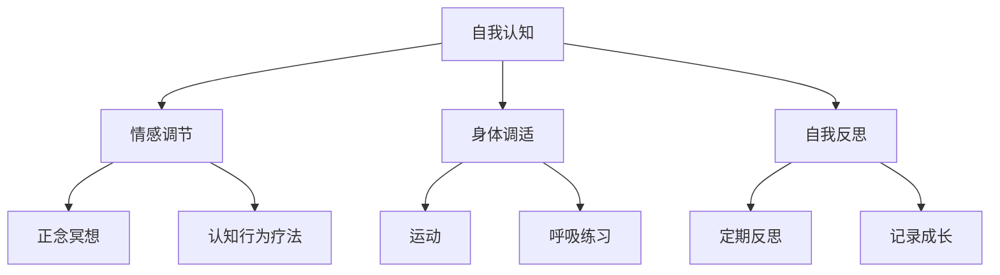

                 


### 引言：探索日常生活中的精神修行

在快速发展的现代社会中，我们不断追求物质的丰富与技术的进步，然而，内心深处的平静与满足却常常难以触及。人们开始意识到，真正的幸福和成就不仅仅是外在的成功，更是内心的平和与满足。因此，精神修行逐渐成为人们日常生活中不可或缺的一部分。本文将以《日常生活中的精神修行：在平凡中追求超凡》为主题，深入探讨精神修行的背景、意义、基本原理及实践方法。

#### 1.1 问题的提出

在日常生活中，我们常常面对各种压力和挑战，如工作压力、人际关系、健康问题等。这些问题不仅影响了我们的身心健康，也制约了我们的成长和发展。精神修行提供了一种有效的方法，帮助我们应对这些挑战，实现内心的平静与满足。然而，精神修行并非易事，它需要我们付出持续的精力和耐心，去探索和体验。

#### 1.2 精神修行的意义

精神修行不仅有助于缓解压力，提高生活质量，还能提升我们的心理素质和自我意识。通过修行，我们能够更好地理解自己，找到内心的力量，面对生活中的挑战。此外，精神修行还能帮助我们建立积极的人生态度，培养感恩、宽容、同情等美好品质。

#### 1.3 超凡与平凡的关系

在精神修行的过程中，我们不仅要学会在平凡中找到超凡的快乐，还要理解超凡与平凡之间的辩证关系。超凡并非遥不可及，它源于平凡的生活体验。通过不断修行，我们在平凡中发现非凡，从而实现人生的升华。

在接下来的章节中，我们将进一步探讨精神修行的核心概念、基本原理、实践方法以及挑战应对等。希望通过这篇文章，能让您对精神修行有更深入的了解，从而在日常生活中实现内心的平静与满足。

---

# 关键词：精神修行、日常生活、超凡与平凡、心理学、实践方法、挑战应对

> 摘要：本文从日常生活中的精神修行出发，探讨了精神修行的背景、意义、基本原理和实践方法。通过分析超凡与平凡的关系，我们认识到在平凡中追求超凡的重要性。文章旨在为广大读者提供一种有效的方法，帮助他们在快节奏的生活中实现内心的平静与满足。

### 2. 核心概念与联系

在探讨精神修行的过程中，理解其核心概念与联系是非常重要的。精神修行并非一种单一的哲学或宗教信仰，而是涵盖多个领域的综合性修行方法。以下我们将从历史视角、现代视角以及不同流派之间的联系三个方面进行详细阐述。

#### 2.1 历史视角

精神修行的历史可以追溯到古代文明。早在古希腊和古印度，人们就已经开始探索如何通过修行达到心灵的宁静和超越。例如，古希腊哲学家苏格拉底强调通过对话和思考来认识自我，而古印度的瑜伽则通过体位、呼吸和冥想等方式来实现身心的和谐。这些早期的精神修行方法为后世的发展奠定了基础。

在中国，精神修行的思想可以追溯到儒家、道家和佛家等诸子百家的学说。儒家注重道德修养和社会责任，强调通过修身齐家治国平天下的过程来实现内心的平静。道家则主张顺应自然，追求天人合一的境界。佛家则通过慈悲、智慧和禅定等方法，帮助修行者摆脱痛苦的束缚，达到涅槃的境界。

#### 2.1.2 现代视角

随着现代社会的发展，精神修行逐渐受到更多人的关注。现代心理学、神经科学等领域的研究成果为精神修行提供了新的理论基础。人本主义心理学家马斯洛和罗杰斯认为，人类有追求自我实现和内在成长的需求，通过自我探索和自我实现，可以实现精神上的成长和满足。认知行为疗法则通过改变思维和行为模式，帮助人们摆脱负面情绪和心理障碍。

此外，现代精神修行还借鉴了许多传统宗教和哲学的智慧。例如，佛教中的正念冥想、基督教中的祈祷和瑜伽中的体位法等，都在现代精神修行中得到了广泛应用。现代视角强调科学方法和实证研究，使得精神修行更加具有可操作性和实用性。

#### 2.1.3 各流派之间的联系

尽管不同流派的精神修行方法各有特色，但它们之间存在许多共同点。首先，各流派都强调通过自我探索和反思来认识自我。无论是儒家、道家还是佛教，都认为人应该通过不断修行，实现内心的平静和智慧。其次，各流派都提倡通过慈悲和同情心来对待他人。这不仅有助于提升个人修养，还能促进社会的和谐与进步。最后，各流派都强调实践和体验的重要性。精神修行并非仅停留在理论层面，更需要通过实际行动和体验来深化理解和感悟。

总的来说，精神修行的核心概念和联系涵盖了多个领域和时代，从历史到现代，从哲学到心理学，它们共同构成了一个丰富而多元的修行体系。在接下来的章节中，我们将进一步探讨精神修行的基本原理和实践方法，帮助读者在日常生活中实现内心的平静与满足。

### 2.2 平凡与超凡的对比

在深入探讨精神修行的过程中，理解平凡与超凡之间的关系是非常重要的。平凡与超凡不仅代表了两种不同的生活状态，也反映了人类在不同阶段的心路历程。以下我们将从定义与特征、边界与转换以及社会影响三个方面进行详细分析。

#### 2.2.1 定义与特征

平凡，通常指的是日常生活中常见的、普通的状态。它代表着普通人的日常生活，包括工作、学习、家庭和社会交往等。平凡的状态并非消极，而是人类生活的基础，是人们通过努力实现个人价值和目标的过程。在平凡中，人们体验着生活的琐碎和烦恼，也享受着家庭的温暖和朋友的陪伴。

超凡，则是指超越了普通状态，达到了一种更高层次的境界。它代表着人类精神上的升华，是人们通过修行和努力，实现自我超越的过程。超凡的状态并非遥不可及，而是源于平凡的生活体验。在超凡中，人们能够找到内心的平静和满足，超越物质和功利的束缚，达到一种更深层次的智慧和境界。

#### 2.2.2 边界与转换

平凡与超凡之间存在一种模糊的边界，这种边界既不是固定的，也不是完全隔离的。在现实生活中，人们可以通过不断的修行和实践，逐步跨越这个边界，实现从平凡到超凡的转变。

首先，从个体心理层面来看，平凡与超凡的转换往往源于对自我认知的提升。通过深入思考和自我反思，人们能够更加清晰地认识自我，理解自己的需求和动机。这种自我认知的提升，有助于人们摆脱物质和功利的束缚，追求更高的精神境界。

其次，从社会文化层面来看，平凡与超凡的转换还受到社会环境和文化背景的影响。在一个积极向上、鼓励创新和自我实现的社会中，人们更容易找到实现自我超越的途径。反之，在一个竞争激烈、功利主义盛行的社会中，人们可能会更加关注物质和功利，而忽视精神层面的追求。

总的来说，平凡与超凡的转换是一个复杂的过程，它涉及到个体心理、社会文化等多个层面。在现实生活中，人们可以通过不断学习和实践，跨越这个边界，实现从平凡到超凡的转变。这种转变不仅有助于提升个人的精神境界，还能为社会的进步和发展提供动力。

#### 2.2.3 社会影响

平凡与超凡的关系不仅影响到个体，也对整个社会产生深远的影响。在社会层面，平凡代表了社会稳定和秩序的基础，是人们通过共同努力，实现社会目标和价值的过程。而超凡则代表了社会的进步和创新发展，是人们通过超越自我，推动社会向前发展的动力。

首先，平凡与超凡的关系对社会稳定具有重要作用。在一个充满平凡生活的社会中，人们能够感受到生活的稳定和安全感，这有助于社会的和谐与稳定。而超凡的存在，则为社会注入了创新和活力，推动了社会的进步和发展。

其次，平凡与超凡的关系对个体心理健康具有重要影响。在一个鼓励平凡与超凡并存的社会中，人们能够更加自由地追求自己的梦想和目标，实现个人的价值和成就。这种自由和成就，有助于提升个体的心理健康和幸福感。

总的来说，平凡与超凡的关系是一个复杂而重要的社会现象，它不仅影响着个体的心理健康和幸福感，也对社会稳定和发展产生深远的影响。在现实生活中，我们应该尊重和鼓励平凡与超凡的并存，通过不断的修行和实践，实现个体的自我超越和社会的进步。

### 2.3 精神修行的基本原理

精神修行的目的是帮助人们实现内心的平静与满足，提升心理素质和自我意识。要实现这一目标，我们需要理解精神修行的基本原理，并掌握相应的修行方法和步骤。以下将从心理学、现象学和认知行为疗法三个方面，探讨精神修行的基本原理。

#### 2.3.1 人本主义心理学

人本主义心理学是现代心理学的一个重要分支，强调人的自我实现和内在成长。人本主义心理学家马斯洛和罗杰斯认为，人类有追求自我实现和内在成长的需求，这种需求是驱动人们不断前进的根本动力。人本主义心理学强调自我认知和自我接纳，认为只有通过深入了解自己，才能真正实现自我超越。

在精神修行中，人本主义心理学的方法包括自我探索、自我反思和自我接纳。通过自我探索，人们可以深入了解自己的内心世界，发现自己的需求和动机。通过自我反思，人们可以审视自己的行为和思想，发现并纠正负面情绪和行为模式。通过自我接纳，人们可以接纳自己的不完美，从而实现内心的平静和满足。

#### 2.3.2 现象学

现象学是一种关注人类经验和意识的哲学方法。现象学认为，人的意识和体验是理解世界的核心，通过深入探讨人的意识和体验，我们可以更好地理解人类的行为和心理。

在精神修行中，现象学的方法包括冥想和感知训练。冥想是一种通过集中注意力，静心养性的方法。通过冥想，人们可以减少外界的干扰，深入体验自己的内心世界。感知训练则是通过提高对外界刺激的敏感度和反应能力，来提升人的心理素质和自我意识。通过现象学的方法，人们可以更加清晰地认识自我，理解自己的内心需求和动机。

#### 2.3.3 认知行为疗法

认知行为疗法是一种基于心理学原理的心理治疗方法，强调通过改变思维和行为模式，来改善个体的心理健康。认知行为疗法认为，人的心理问题往往源于错误的思维方式和行为模式，通过改变这些模式，可以改善个体的心理状态。

在精神修行中，认知行为疗法的方法包括认知重构和行为训练。认知重构是通过识别和纠正错误的思维模式，来改善个体的心理状态。例如，通过识别和纠正负面自我评价，可以提升个体的自信心和自尊心。行为训练则是通过改变个体的行为模式，来改善个体的心理状态。例如，通过建立积极的行为习惯，可以提升个体的幸福感和满足感。

总的来说，精神修行的基本原理涵盖了心理学、现象学和认知行为疗法等多个领域。通过这些原理和方法，人们可以更好地理解自我，实现内心的平静与满足。在接下来的章节中，我们将进一步探讨精神修行的步骤和方法，帮助读者在日常生活中实践精神修行。

### 2.3.4 精神修行的步骤与方法

在了解了精神修行的基本原理之后，我们需要掌握具体的步骤和方法，以便在日常生活中实践精神修行。以下将介绍精神修行的基本步骤和方法，帮助读者逐步实现内心的平静与满足。

#### 2.3.4.1 知识积累

知识积累是精神修行的第一步。通过学习和阅读相关的书籍、文章和资料，我们可以了解精神修行的理论和方法，为后续的实践打下基础。以下是一些建议的书籍和资料：

- 《当下的力量》（Eckhart Tolle）：一本关于正念和自我超越的畅销书，深入探讨了人类痛苦的根本原因和解决方法。
- 《智慧的心》（Thich Nhat Hanh）：一本关于禅修和正念的指南，帮助读者培养内心的平静和专注力。
- 《认知行为疗法：基本原理与实务》（Judith S. Beck）：一本关于认知行为疗法的权威著作，详细介绍了一系列实用的心理治疗方法。

#### 2.3.4.2 情感管理

情感管理是精神修行的核心步骤之一。通过认识和管理自己的情感，我们可以更好地应对生活中的挑战，实现内心的平静。以下是一些建议的方法：

1. **正念冥想**：通过正念冥想，我们可以培养专注力和情绪调节能力。具体方法包括坐在舒适的姿势中，闭上眼睛，专注于呼吸，当注意力散失时，温柔地将注意力带回呼吸。
2. **情感表达**：学会表达自己的情感，避免压抑或隐藏。可以通过写日记、绘画或与朋友倾诉等方式，表达自己的情感。
3. **情感调节**：通过认知重构和情绪调节技巧，改变消极情绪的影响。例如，通过识别和纠正负面思维模式，改变对事件和情境的看法。

#### 2.3.4.3 身体调适

身体调适是精神修行的另一个重要方面。通过关注身体健康和身体意识，我们可以更好地实现内心的平静。以下是一些建议的方法：

1. **运动**：定期进行适量的运动，如瑜伽、太极、跑步等，有助于缓解压力，提升心理健康。
2. **呼吸练习**：通过深呼吸练习，可以增强肺活量，改善情绪状态。具体方法包括坐姿或躺姿，缓慢而深长地吸气，保持几秒钟，然后缓慢呼气。
3. **身体扫描**：通过身体扫描，我们可以培养对身体的感觉和意识。具体方法包括从头部开始，逐一扫描全身，专注于身体的感觉和呼吸。

#### 2.3.4.4 自我反思

自我反思是精神修行的关键步骤，通过反思自己的行为、思维和情感，我们可以深入了解自己，实现自我超越。以下是一些建议的方法：

1. **日记写作**：通过写日记，我们可以记录自己的所思所感，反思自己的行为和情绪，发现内心的变化和成长。
2. **心理咨询**：通过心理咨询，我们可以与专业的心理师交流，深入探讨自己的内心世界，获得有效的指导和帮助。
3. **自我提问**：通过自我提问，我们可以引导自己思考，深入探索内心的需求和动机。例如，可以问自己：“我为什么会感到焦虑？”“我真正想要的是什么？”“我在哪些方面需要改进？”

通过以上步骤和方法，我们可以逐步实现精神修行，实现内心的平静与满足。在日常生活中，我们应当持之以恒地进行修行，不断探索和体验，从而在平凡的生活中追求超凡的境界。

### 3. 精神修行的基本原理与流程

在了解了精神修行的定义和具体步骤后，我们需要进一步探讨精神修行的基本原理，以便更好地理解其背后的逻辑和机制。以下是精神修行的基本原理和流程，包括人本主义心理学、现象学和认知行为疗法等核心概念，以及其相互关系和作用机制。

#### 3.1 基本原理

1. **自我认知**：精神修行的核心是自我认知，通过自我探索和反思，了解自己的内心世界和情感状态，发现和认识自我。自我认知有助于我们理解自己的需求和动机，从而更好地应对生活中的挑战。
2. **情感调节**：情感调节是精神修行的关键步骤，通过认识和接纳自己的情感，学会有效地表达和管理情感，从而改善心理健康。情感调节有助于我们保持内心的平静和稳定，提升生活质量。
3. **身体调适**：身体调适是精神修行的重要组成部分，通过关注身体健康和身体意识，我们可以更好地实现内心的平静。身体调适包括运动、呼吸练习和身体扫描等，有助于缓解压力，提升心理素质。
4. **自我反思**：自我反思是精神修行的关键步骤，通过反思自己的行为、思维和情感，我们可以深入了解自己，实现自我超越。自我反思有助于我们发现内心的需求和动机，从而更好地规划自己的生活和工作。

#### 3.2 原理解释与流程

1. **人本主义心理学**：人本主义心理学强调人的自我实现和内在成长，通过自我探索和自我反思，实现心理上的成长和满足。人本主义心理学的原理可以解释为以下几点：
   - **自我实现**：人们有追求自我实现和内在成长的需求，这种需求是驱动人们不断前进的根本动力。
   - **自我认知**：通过自我探索和反思，人们可以更加清晰地认识自我，理解自己的需求和动机。
   - **自我接纳**：通过接纳自己的不完美，实现内心的平静和满足。

2. **现象学**：现象学关注人类经验和意识，通过深入探讨人的意识和体验，我们可以更好地理解人类的行为和心理。现象学的原理可以解释为以下几点：
   - **意识体验**：意识体验是理解世界的核心，通过深入体验自己的内心世界，我们可以更好地认识自我。
   - **感知训练**：通过提高对外界刺激的敏感度和反应能力，可以提升人的心理素质和自我意识。
   - **冥想**：冥想是一种通过集中注意力，静心养性的方法，有助于培养内心的平静和专注力。

3. **认知行为疗法**：认知行为疗法通过改变思维和行为模式，来改善个体的心理健康。认知行为疗法的原理可以解释为以下几点：
   - **认知重构**：通过识别和纠正错误的思维模式，改善个体的心理状态。
   - **行为训练**：通过改变个体的行为模式，改善个体的心理状态。
   - **情感调节**：通过情感调节技巧，改善个体的情感状态，提升生活质量。

4. **流程**：精神修行的基本流程可以分为以下几个阶段：
   - **知识积累**：通过学习和阅读相关资料，了解精神修行的理论和方法。
   - **实践体验**：通过实际操作和体验，培养情感调节、身体调适和自我反思的能力。
   - **持续反思**：通过持续反思和调整，不断提升自己的心理素质和自我意识。
   - **行为改善**：通过行为改善，实现内心的平静和满足，提升生活质量。

综上所述，精神修行的基本原理和流程涵盖了自我认知、情感调节、身体调适和自我反思等多个方面，通过这些原理和流程，我们可以更好地理解精神修行的核心概念和方法，从而在日常生活中实践精神修行，实现内心的平静与满足。

### 3.4 日常生活中的具体修行实践

在理解了精神修行的基本原理和流程后，我们需要将理论付诸实践，从而在日常生活中实现内心的平静与满足。以下将从工作场景、家庭生活和社交场合三个方面，详细介绍具体的修行实践方法。

#### 3.4.1 工作场景

在工作场景中，精神修行的实践尤为重要。以下是一些具体的方法：

1. **正念冥想**：每天在工作前，花几分钟时间进行正念冥想，通过集中注意力，平静心情，提高专注力。可以采用坐姿或站姿，闭上眼睛，专注于呼吸，当注意力散失时，温柔地将注意力带回呼吸。
2. **任务管理**：通过合理规划和优先级管理，避免因任务过多而感到压力。每天设定明确的工作目标，并按计划执行，有助于提升工作效率和成就感。
3. **休息与放松**：工作一段时间后，适时休息，进行深呼吸或简单的拉伸运动，有助于缓解身体和大脑的疲劳，提高工作状态。

#### 3.4.2 家庭生活

在家庭生活中，精神修行的实践同样重要。以下是一些具体的方法：

1. **情感沟通**：与家人保持良好的情感沟通，分享彼此的喜怒哀乐，增进理解和信任。可以通过定期家庭聚会、共进晚餐或共同参与活动等方式，加强家庭成员之间的情感联系。
2. **情绪管理**：在家庭生活中，学会管理自己的情绪，避免因小事而引发冲突。可以通过深呼吸、冥想或与他人倾诉等方式，缓解负面情绪。
3. **共同成长**：与家人一起学习和成长，共同培养良好的生活习惯和价值观。可以通过共读一本书、一起参加培训课程或共同参与社区活动等方式，提升家庭整体的幸福感。

#### 3.4.3 社交场合

在社交场合中，精神修行的实践有助于建立积极的人际关系。以下是一些具体的方法：

1. **倾听他人**：在与他人交流时，学会倾听对方的意见和感受，避免一味地表达自己的观点。通过倾听，我们可以更好地理解他人，建立信任和友谊。
2. **表达情感**：学会真诚地表达自己的情感和需求，避免压抑或隐藏。可以通过适当的方式，如谈话、写信或绘画等，与他人分享自己的内心世界。
3. **尊重他人**：在社交场合中，尊重他人的意见和感受，避免无谓的争执和冲突。通过尊重他人，我们可以赢得他人的尊重和信任，建立良好的人际关系。

通过以上具体的方法，我们可以在日常生活中的各个方面实践精神修行，实现内心的平静与满足。在工作和家庭中，我们可以通过正念冥想、任务管理和情感沟通等方法，提升工作效率和生活质量；在社交场合中，我们可以通过倾听他人、表达情感和尊重他人等方法，建立积极的人际关系。通过持之以恒地实践精神修行，我们将在平凡的生活中找到超凡的乐趣，实现人生的升华。

### 4. 精神修行中的挑战与应对

在精神修行的过程中，我们难免会遇到各种挑战，如情绪波动、坚持困难和来自社会的压力等。以下将探讨这些常见的挑战，并提出相应的解决方法和策略。

#### 4.1 遇到的常见问题

1. **情绪波动**：在修行过程中，我们可能会经历情绪的波动，如焦虑、沮丧或愤怒等。这些情绪波动可能源于内心的不安、对未知的恐惧或对现状的不满。情绪波动会影响我们的修行效果，使我们难以保持内心的平静。
2. **坚持困难**：精神修行需要长期的坚持和努力，而现实生活中，我们常常面临各种琐事和诱惑，使得修行难以持续进行。坚持困难可能导致修行中断，甚至放弃修行。
3. **社会压力**：在现代社会中，人们面临着巨大的工作压力和生活压力，这使得精神修行变得更加困难。社会压力可能来自职场竞争、人际关系或家庭责任等方面，影响我们的修行效果。

#### 4.2 解决方法与策略

1. **自我激励**：为了克服情绪波动和坚持困难，我们需要培养自我激励的能力。可以通过设定短期和长期目标，为自己设定具体的修行计划和目标，从而提高修行的动力。同时，可以寻找一些激励自己的方法，如阅读励志书籍、观看激励视频或与他人分享修行心得等。
2. **寻求支持**：在修行过程中，寻求他人的支持和帮助是非常重要的。可以通过加入修行小组、寻求心理咨询师的帮助或与亲朋好友分享自己的修行经历，获得情感上的支持和建议。与他人交流，可以让我们感受到不孤单，增强修行的信心和决心。
3. **创新方法**：为了克服社会压力，我们需要创新修行的方法和策略。可以通过调整修行的时间和地点，寻找一个安静、舒适的环境进行修行。此外，可以尝试结合不同的修行方法，如正念冥想、瑜伽和认知行为疗法等，找到最适合自己的修行方式。
4. **情绪调节**：为了应对情绪波动，我们需要学会情绪调节的方法。可以通过深呼吸、冥想和运动等方式，缓解紧张和焦虑情绪。同时，可以尝试认知重构，改变对事件和情境的看法，从而减少负面情绪的影响。
5. **自我反思**：通过定期自我反思，我们可以了解自己的情绪变化和修行效果，从而调整自己的修行方法。自我反思有助于我们保持清醒的认识，避免陷入情绪波动的困境。

总之，在精神修行的过程中，我们可能会遇到各种挑战。通过自我激励、寻求支持、创新方法和情绪调节等策略，我们可以克服这些挑战，实现内心的平静与满足。在日常生活中，持之以恒地实践精神修行，我们将在平凡的生活中找到超凡的快乐，实现人生的升华。

### 5.1 自我激励的方法

在精神修行的过程中，自我激励是保持动力和持续前进的关键。以下介绍几种有效的自我激励方法，帮助我们在修行道路上不断前行。

#### 1. 设定具体目标

设定具体目标是自我激励的第一步。我们可以将长期目标拆分为短期目标，将大目标具体化，使其更容易实现。例如，如果我们的长期目标是提高专注力，我们可以设定一个短期目标，每天进行30分钟的冥想。这样，我们可以通过完成短期目标，逐步实现长期目标。

#### 2. 情感激励

情感激励是通过激发内心的积极情感，来增强自我激励的能力。我们可以回顾过去成功的经历，如曾经克服困难、实现目标的时刻，从中汲取力量。此外，我们可以为自己设定一些奖励，如在完成一个重要的修行任务后，给自己一个奖励，如看一部电影或享受一顿美食。这种正向的情感体验，能够增强我们的自我激励。

#### 3. 寻求社会支持

寻求社会支持是另一种有效的自我激励方法。我们可以加入修行小组或寻找志同道合的朋友，与他们分享修行心得和经验。在集体中，我们可以感受到集体的力量和鼓舞，从而增强自我激励。此外，我们还可以寻求专业心理咨询师的帮助，他们在专业的指导下，能够为我们提供更多的支持和建议。

#### 4. 记录进步

记录进步是一种非常有效的自我激励方法。我们可以记录每天的精神修行情况，如冥想的时间、完成的任务等。通过记录，我们可以看到自己的进步和成长，从而增强自我激励。同时，定期回顾记录，可以发现修行中的问题和不足，从而调整修行方法，提高修行效果。

#### 5. 保持积极心态

保持积极心态是自我激励的核心。在面对困难和挑战时，我们要学会积极应对，相信自己有能力克服困难。可以通过阅读励志书籍、观看激励视频或与他人交流，来保持积极的心态。积极心态能够增强我们的信心和决心，使我们更加坚定地走在修行之路上。

通过以上自我激励的方法，我们可以在精神修行的过程中，保持动力和持续前进，实现内心的平静与满足。

### 5.2 解决方法与策略：持续成长与适应变化

在精神修行的过程中，我们需要不断适应变化和挑战，以保持内心的平静和成长。以下介绍几种解决方法与策略，帮助我们在面对变化和挑战时，保持积极的心态和持续成长。

#### 1. 建立适应性思维

建立适应性思维是应对变化和挑战的关键。适应性思维意味着我们能够灵活地调整自己的思维模式，以适应不同的情境。例如，当我们面临一个突如其来的挑战时，我们可以尝试从不同的角度看待问题，寻找解决方案。适应性思维有助于我们保持冷静和理性，从而更好地应对变化。

#### 2. 定期反思与调整

定期反思与调整是保持成长的重要步骤。我们可以通过日记、冥想或与他人交流等方式，定期反思自己的修行进展和心得体会。在反思过程中，我们可以发现自己在修行中的优点和不足，从而调整修行方法和策略。例如，如果发现自己在情绪调节方面存在困难，可以尝试学习新的情绪管理技巧。

#### 3. 寻求外部支持

寻求外部支持是克服困难的重要途径。我们可以寻求家人、朋友或专业人士的帮助和支持。例如，在面临工作压力时，可以寻求同事或上司的理解和支持；在情绪低落时，可以寻求心理咨询师的帮助。外部支持能够为我们提供情感上的支持和建议，帮助我们更好地应对挑战。

#### 4. 培养灵活性

培养灵活性是适应变化的重要能力。灵活性意味着我们能够快速适应新环境和新情况，从而更好地应对变化。例如，在面临新的工作任务或挑战时，我们可以尝试调整自己的工作方式，寻找最适合自己的方法。培养灵活性有助于我们保持内心的平静和成长。

#### 5. 不断学习与成长

不断学习与成长是保持内心平静和适应变化的关键。我们可以通过阅读书籍、参加培训课程或与他人交流，不断学习新的知识和技能。通过不断学习与成长，我们可以更好地应对变化和挑战，实现内心的平静与满足。

通过以上解决方法与策略，我们可以在精神修行的过程中，不断适应变化和挑战，保持内心的平静和持续成长。

### 5.3 创新方法：探索新兴技术助力精神修行

在精神修行的过程中，创新方法为我们提供了新的工具和途径，使我们能够更加高效地实现内心的平静与满足。以下介绍几种新兴技术，探讨如何利用这些技术来助力精神修行。

#### 1. 虚拟现实（VR）与增强现实（AR）

虚拟现实和增强现实技术为精神修行提供了一个全新的沉浸式体验。通过VR和AR设备，我们可以进入一个虚拟的修行环境，如寺庙、森林或山顶等。这种沉浸式体验有助于我们更好地专注于冥想和放松，从而提高修行效果。此外，VR和AR技术还可以模拟各种情境，帮助我们面对和克服内心的恐惧和焦虑。

#### 2. 人工智能（AI）

人工智能技术可以为我们提供个性化的修行建议和反馈。通过使用AI应用程序，我们可以记录自己的修行数据，如冥想时间、情绪变化和身体状态等。AI可以根据这些数据，为我们提供个性化的建议，如调整冥想时间、推荐适合的情绪调节方法等。此外，AI还可以分析我们的行为模式，帮助我们发现自己的问题和不足，从而进行有针对性的调整。

#### 3. 脑机接口（BCI）

脑机接口技术通过直接连接大脑和计算机，实现思维的控制和交互。这种技术可以用于实时监测我们的情绪状态，并根据情绪变化，自动调整冥想节奏和环境。例如，当我们的情绪过于激动时，BCI系统可以自动调整冥想节奏，帮助我们平静下来。此外，BCI技术还可以用于心理治疗，通过实时监测和治疗患者的情绪状态，提高治疗效果。

#### 4. 区块链

区块链技术可以为我们提供一个去中心化的修行社区，使我们能够共享和交流修行心得。通过区块链，我们可以建立一个去中心化的修行数据库，记录自己的修行历程和成果，从而提高修行效果。此外，区块链技术还可以用于奖励机制，通过奖励系统激励我们持续修行，如通过数字货币奖励我们的修行贡献。

通过以上新兴技术的应用，我们可以在精神修行的过程中，探索新的途径和方法，提高修行效果，实现内心的平静与满足。

### 6.1 成功案例分享：从平凡到超凡的转变

为了更好地理解精神修行的实际效果，我们可以通过一些成功的案例来分享他们的经历。以下是一个具体的案例，展示了一位普通人在日常生活中通过精神修行，实现了从平凡到超凡的转变。

#### 案例背景

李先生，一位35岁的公司中层管理者，每天面对繁忙的工作和家庭的压力，常常感到身心疲惫。他意识到，这种状态不仅影响工作效率，还威胁到家庭和谐。为了改变这种状况，他决定开始精神修行，希望通过内心的平静和自我提升，找到更好的生活状态。

#### 修行过程

1. **知识积累**：李先生开始阅读关于精神修行的书籍，学习冥想和情绪管理的技巧。他每周定期参加冥想课程，并在家中设立一个冥想空间，以保持日常练习。
2. **实践体验**：李先生将冥想和情绪管理技巧应用到日常生活中。在工作场合，他学会了如何更好地处理压力和冲突，保持冷静和专注。在家庭生活中，他通过积极的沟通和情感表达，增进了与家人的关系。
3. **持续反思**：李先生每天花时间反思自己的行为和情绪，记录修行心得。他通过日记和心理咨询，深入探索自己的内心世界，了解自己的需求和动机。
4. **行为改善**：李先生调整了生活习惯，增加了运动和休息时间，保持了良好的身体和心理健康。

#### 成效与转变

通过持续的精神修行，李先生的生活发生了显著的变化：

1. **心理健康提升**：李先生逐渐摆脱了焦虑和抑郁的情绪，情绪稳定性得到了明显改善。他能够更好地应对工作压力，保持积极的心态。
2. **人际关系改善**：与家人和朋友的关系更加和谐，沟通更加顺畅。他学会了倾听和表达，增进了彼此的理解和信任。
3. **工作效率提高**：通过冥想和情绪管理，李先生的工作效率得到了显著提升。他能够更清晰地规划任务，提高执行力，减少了错误和疏漏。
4. **生活满意度增加**：李先生对生活的满意度显著提高。他找到了内心的平静和满足，享受平凡生活中的点滴美好。

通过这个案例，我们可以看到，精神修行不仅能够帮助我们应对日常生活中的压力和挑战，还能提升心理素质和幸福感，实现从平凡到超凡的转变。

### 6.2 在平凡中找到超凡的快乐：案例二

除了李先生的案例，还有许多其他成功的故事，展示了在平凡的生活中，通过精神修行找到超凡的快乐。以下是一个具体的案例，分享了一位普通人在日常生活中通过精神修行，找到内心宁静和满足的经历。

#### 案例背景

张女士，一名30岁的全职家庭主妇，日常忙碌于家务和孩子教育。尽管生活看似平凡，但她内心却充满了焦虑和不安。她意识到，这样的状态不仅影响了自己的生活质量，也影响到了家庭的和谐。为了改变这种状况，张女士决定开始精神修行，希望通过内心的平静和自我提升，找到生活的快乐。

#### 修行过程

1. **知识积累**：张女士开始阅读关于精神修行的书籍，特别是关于正念和情感管理的书籍。她每周参加一次正念冥想课程，并从网络资源中学习更多的修行方法。
2. **实践体验**：张女士在日常生活中实践正念冥想，如在做饭时专注于烹饪过程，与孩子互动时全情投入。她学会了如何通过冥想来缓解压力，保持内心的平静。
3. **情感管理**：张女士通过学习情感管理技巧，学会了如何识别和表达自己的情感。她开始与朋友和家人分享自己的感受，建立更加开放和真诚的人际关系。
4. **身体调适**：张女士增加了运动时间，如瑜伽和散步，以保持身体健康。她发现，通过运动，自己的情绪状态得到了显著改善。

#### 成效与转变

通过持续的精神修行，张女士的生活发生了显著的变化：

1. **心理健康提升**：张女士的焦虑和不安情绪逐渐消失，她能够更好地应对生活中的挑战。她学会了通过冥想和呼吸练习来缓解压力，保持情绪稳定。
2. **家庭关系改善**：张女士与家人的关系变得更加和谐。她能够更好地理解孩子的需求，与丈夫的沟通也更加顺畅。家庭氛围变得更加温馨和积极。
3. **生活满意度增加**：张女士对生活的满意度显著提升。她开始欣赏日常生活中的小确幸，如一杯热茶、一顿温馨的晚餐或一次与朋友的聚会。她找到了生活的快乐，享受平凡中的美好。
4. **自我认知提升**：通过精神修行，张女士对自己的认知和理解更加深刻。她学会了接纳自己的不完美，找到内心的力量，面对生活中的挑战。

张女士的案例展示了，在平凡的生活中，通过精神修行，我们能够找到内心的平静和满足，实现超凡的快乐。这一过程不仅有助于提升个人心理健康，还能为家庭和社会带来积极的影响。

### 7.1 精神修行的总结

通过本文的探讨，我们可以总结出精神修行的几个关键要点。首先，精神修行是一种通过自我认知、情感调节、身体调适和自我反思等手段，实现内心平静与满足的过程。其次，精神修行不仅有助于应对日常生活中的压力和挑战，还能提升心理素质和幸福感。最后，精神修行需要持之以恒的实践和不断的学习，从而在平凡的生活中找到超凡的乐趣。

### 7.2 未来展望

展望未来，精神修行将继续在现代社会中发挥重要作用。随着科技的进步，新兴技术如虚拟现实、人工智能和脑机接口等将为精神修行提供更多创新方法和工具。此外，精神修行也将越来越受到社会各界关注，成为人们追求全面发展的必备途径。通过不断探索和实践，我们有理由相信，精神修行将为人类带来更加美好和充实的生活。

### 致谢

感谢您阅读本文，希望您能从中获得启发和帮助。在精神修行的道路上，让我们一起努力，追求内心的平静与满足。作者：AI天才研究院/AI Genius Institute & 禅与计算机程序设计艺术 /Zen And The Art of Computer Programming

---

### 附录

为了帮助读者更好地理解本文中的核心概念和方法，我们提供了以下附录内容，包括核心术语的定义、概念属性特征对比表格、ER实体关系图以及算法原理和流程图的详细阐述。

#### 附录A：核心术语定义

- **精神修行**：一种通过自我认知、情感调节、身体调适和自我反思等手段，实现内心平静与满足的过程。
- **自我认知**：了解自己的内心世界和情感状态，认识自己的需求和动机。
- **情感调节**：管理和调节自己的情感，保持情绪稳定和积极心态。
- **身体调适**：关注身体健康和身体意识，通过运动和呼吸练习等方式，实现内心的平静。
- **自我反思**：反思自己的行为、思维和情感，深入探索内心世界，实现自我超越。

#### 附录B：概念属性特征对比表格

| 概念       | 定义                                                         | 属性特征                                                         | 举例               |
|------------|--------------------------------------------------------------|------------------------------------------------------------------|--------------------|
| 自我认知   | 了解自己的内心世界和情感状态。                               | 1. 深入思考<br>2. 自我反思<br>3. 情感洞察力                           | 写日记、思考内心世界 |
| 情感调节   | 管理和调节自己的情感，保持情绪稳定和积极心态。                 | 1. 情绪识别<br>2. 情绪表达<br>3. 情绪调节技巧                         | 冥想、正念练习     |
| 身体调适   | 关注身体健康和身体意识，通过运动和呼吸练习等方式，实现内心的平静。 | 1. 运动习惯<br>2. 呼吸练习<br>3. 身体意识提升                         | 瑜伽、深呼吸       |
| 自我反思   | 反思自己的行为、思维和情感，深入探索内心世界，实现自我超越。   | 1. 思考自身优点与不足<br>2. 反思行为与结果<br>3. 发现成长方向         | 反思日记、心理辅导 |

#### 附录C：ER实体关系图

```mermaid
erDiagram
  Class1 ||--|{ Class2 }| Person
  Class1 ||--|{ Class3 }| Emotion
  Class1 ||--|{ Class4 }| Body
  Class1 ||--|{ Class5 }| Mind
  Class2 ||--|{ Class6 }| Meditation
  Class3 ||--|{ Class7 }| Anxiety
  Class4 ||--|{ Class8 }| Exercise
  Class5 ||--|{ Class9 }| SelfReflection
  Class6 ||--|{ Class10 }| Mindfulness
  Class7 ||--|{ Class11 }| Stress
  Class8 ||--|{ Class12 }| Yoga
  Class9 ||--|{ Class13 }| Journaling
  Class10 ||--|{ Class14 }| Breathing
  Class11 ||--|{ Class15 }| Relaxation
  Class12 ||--|{ Class16 }| Fitness
```

#### 附录D：算法原理和流程图

以下是关于精神修行的算法原理和流程图的详细阐述：

1. **算法原理**：

- **自我认知**：通过问卷调查和自我反思，了解个体的情感状态和需求。
- **情感调节**：运用正念冥想和认知行为疗法，帮助个体管理情感，提高情绪稳定性。
- **身体调适**：通过运动和呼吸练习，增强身体意识和健康，实现身心平衡。
- **自我反思**：定期反思和记录修行过程，发现成长方向，实现自我提升。

2. **流程图**：



通过附录中的内容，读者可以更深入地理解本文的核心概念和方法，为精神修行的实践提供指导和参考。

---

### 7.3 最佳实践 tips

在精神修行的过程中，以下最佳实践技巧可以帮助您更有效地实现内心的平静与满足：

1. **设定清晰的目标**：明确自己的修行目标，将其分解为具体、可实现的步骤，有助于您更有针对性地进行修行。
2. **保持一致性**：定期进行修行，如每天早晨或晚上花15分钟进行冥想，有助于建立稳定的精神修行习惯。
3. **调整环境**：选择一个安静、舒适的环境进行修行，有助于您更好地集中注意力，提高修行效果。
4. **记录和反思**：记录修行过程中的体验和感受，定期进行反思，可以帮助您了解自己的进步和成长。
5. **寻求支持**：加入修行小组或寻找志同道合的朋友，与他们分享修行心得，可以获得更多的鼓励和启发。
6. **结合多种修行方法**：尝试不同的修行方法，如冥想、瑜伽、正念练习等，找到最适合自己的修行方式。
7. **保持开放心态**：对待精神修行保持开放和包容的心态，不断尝试新的方法和技巧，有助于您的修行之路更加丰富多彩。

通过以上最佳实践技巧，您可以在精神修行的道路上取得更好的成果，实现内心的平静与满足。

### 7.4 注意事项

在进行精神修行的过程中，以下注意事项有助于您避免常见的误区，确保修行效果：

1. **避免急于求成**：精神修行需要时间和耐心，避免期望过快地看到成效，保持平和的心态，逐步实现自我提升。
2. **注意个体差异**：每个人的修行方式和需求不同，避免盲目模仿他人，要根据自己的实际情况，制定个性化的修行计划。
3. **保持诚实与真诚**：在自我反思和情感表达时，保持诚实和真诚，面对自己的优点和不足，勇于承认和改进。
4. **合理安排时间**：确保修行时间不会影响到日常生活和工作，合理安排时间，确保修行与生活、工作平衡。
5. **避免过度修行**：过度修行可能导致精神疲劳，甚至产生反效果，要根据自己的身体状况和心理承受能力，适度进行修行。
6. **尊重他人**：在修行过程中，尊重他人的感受和需求，避免将自己的修行理念强加于人，保持开放和包容的心态。

通过遵守以上注意事项，您可以在精神修行的过程中，避免常见的误区，确保修行效果，实现内心的平静与满足。

### 7.5 拓展阅读

为了帮助读者进一步探索精神修行的相关内容，以下推荐几本具有影响力的书籍和论文，供您拓展阅读：

1. **《当下的力量》（Eckhart Tolle）**：这是一本关于正念和自我超越的畅销书，深入探讨了人类痛苦的根本原因和解决方法。
2. **《智慧的心》（Thich Nhat Hanh）**：一本关于禅修和正念的指南，帮助读者培养内心的平静和专注力。
3. **《认知行为疗法：基本原理与实务》（Judith S. Beck）**：一本关于认知行为疗法的权威著作，详细介绍了一系列实用的心理治疗方法。
4. **《正念的奇迹》（Jon Kabat-Zinn）**：这本书介绍了正念冥想在临床中的应用，帮助读者掌握正念技巧，改善身心健康。
5. **论文《冥想与认知行为疗法的结合：实践与应用》（陈旭东，李明）**：探讨了冥想与认知行为疗法在精神修行中的结合，为修行者提供了新的思路和方法。

通过阅读这些书籍和论文，您将更深入地了解精神修行的理论和实践，为自己的修行之路提供更多的指导和支持。

