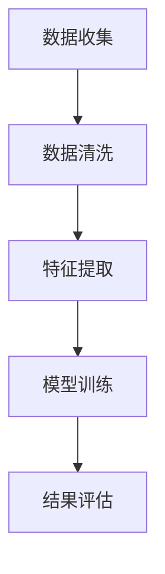
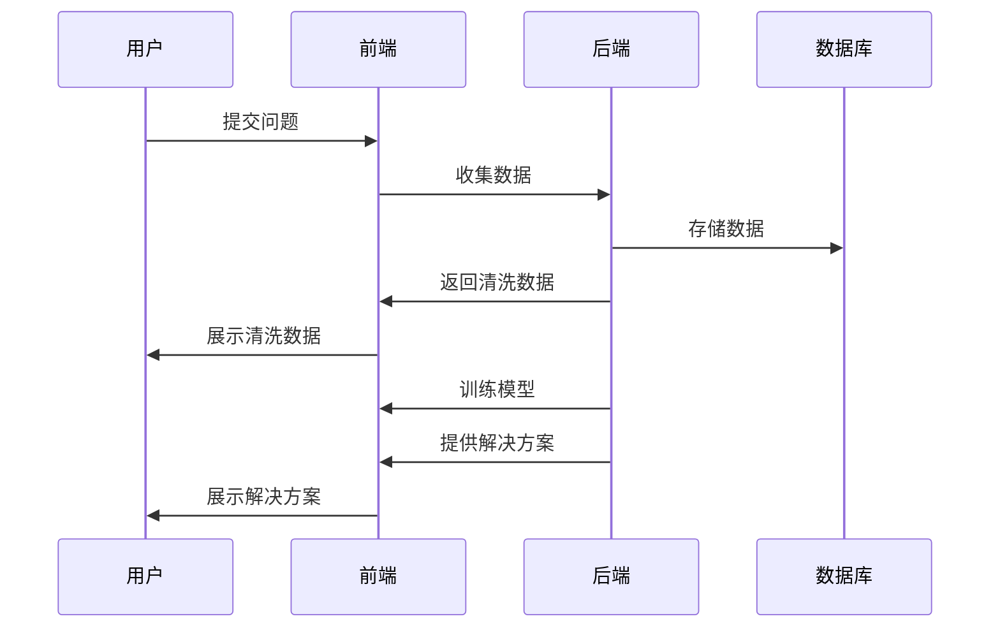

                 

### 日常生活的哲学：发现平凡中的深刻意义

在日常的忙碌生活中，我们常常忽略了生活中的哲学。哲学，这个源自古希腊的智慧学科，一直以来被认为是探讨世界本质、人生意义和存在价值的学问。然而，哲学不仅仅局限于学术讨论，它同样能在我们的日常生活中找到应用。本文将探讨如何通过哲学的视角发现平凡生活中的深刻意义。

**关键词：** 日常生活哲学、哲学应用、人生意义、存在价值、平凡中的深刻

**摘要：** 本文旨在揭示哲学在日常生活中无处不在的应用，并通过哲学的视角帮助我们更好地理解生活的本质。文章将从哲学的定义、哲学原理在日常生活中的应用、哲学分析算法等方面展开，逐步引导读者发现平凡生活中的深刻意义。

## 1. 背景介绍

### 1.1 日常生活哲学的重要性

哲学，作为一门探究人类思维、行为和存在的学科，其重要性不言而喻。然而，许多人将哲学视为高深莫测、难以触及的学问，认为它与日常生活相去甚远。事实上，哲学并不是一个高高在上的学科，它源于生活，服务于生活。哲学的智慧可以指导我们在日常生活中做出更好的决策，帮助我们更好地理解自己和周围的世界。

### 1.1.2 平凡生活与深刻意义的关系

我们的生活虽然平凡，但却充满了深刻的意义。哲学的任务之一就是揭示这种平凡与深刻之间的联系。通过哲学的视角，我们可以发现，日常生活中的每一个细节都蕴含着丰富的哲学内涵。例如，我们的选择、行为、人际关系等，都反映了我们对生活的理解和对世界的看法。

### 1.2 问题描述

在日常生活中，我们常常会遇到各种问题。这些问题看似琐碎，但却对我们的生活和思想产生深远的影响。例如，我们如何处理日常生活中的冲突？如何找到生活的意义？如何平衡工作和生活？这些问题都需要哲学的智慧来指导我们。

### 1.2.1 日常生活中的哲学问题

日常生活中有许多哲学问题值得我们探讨。例如，我们如何看待幸福？如何理解自由？我们的行为是否符合道德规范？这些问题都反映了我们对生活本质的理解。

### 1.2.2 发现平凡中的深刻意义

本文的目标就是帮助读者发现平凡生活中的深刻意义。通过哲学的视角，我们可以看到，生活中的每一个瞬间都充满了意义。哲学不仅可以指导我们的行为，还可以帮助我们更好地理解自己和周围的世界。

## 2. 核心概念与联系

### 2.1 哲学的基本概念

哲学，作为一门学科，有着丰富的概念和理论。理解哲学的基本概念对于发现生活中的哲学至关重要。哲学的基本概念包括真理、知识、理性、存在、自由、道德等。

### 2.2 日常生活的哲学要素

哲学不仅在学术领域有着重要地位，在日常生活中也同样重要。日常生活中的哲学要素包括我们的行为、选择、思考、人际关系等。这些要素都反映了我们对生活的理解和对世界的看法。

### 2.3 哲学原理与日常生活的联系

哲学原理是我们理解和处理日常生活中的问题的重要工具。例如，理性原则可以帮助我们做出明智的决策，道德原则可以帮助我们处理人际关系，存在主义可以帮助我们理解生命的意义。

### 2.4 哲学理论与日常生活实例分析

通过哲学理论分析日常生活中的实例，我们可以更好地理解哲学原理的应用。例如，通过分析人际关系中的冲突，我们可以应用道德原则来解决问题。

### 2.5 核心概念属性特征对比表格

为了更清晰地理解哲学的基本概念，我们可以通过对比表格来展示它们之间的差异和联系。

| 核心概念 | 定义 | 属性特征 | 对比分析 |
| --- | --- | --- | --- |
| 真理 | 主观与客观的统一 | 真实性、一致性 | 与知识、理性有关 |
| 知识 | 主观对客观的理解 | 真实性、可靠性 | 与真理、理性有关 |
| 理性 | 合乎逻辑的思考 | 清晰性、一致性 | 与真理、知识有关 |
| 存在 | 客观存在的实体 | 实在性、存在性 | 与本质、属性有关 |
| 自由 | 行为选择的自主性 | 自主性、自由性 | 与责任、道德有关 |
| 道德 | 行为的道德规范 | 道德性、正义性 | 与法律、伦理有关 |

### 2.6 ER实体关系图架构

为了更好地理解哲学的基本概念和它们之间的关系，我们可以使用ER实体关系图来展示。ER图可以帮助我们清晰地看到哲学要素之间的联系。

```mermaid
erDiagram
  PHILOSOPHY --> TRUTH
  PHILOSOPHY --> KNOWLEDGE
  PHILOSOPHY --> RATIONALITY
  PHILOSOPHY --> EXISTENCE
  PHILOSOPHY --> FREEDOM
  PHILOSOPHY --> ETHICS
```

## 3. 算法原理讲解

### 3.1 哲学分析算法概述

哲学分析算法是一种基于哲学原理的算法，它可以帮助我们分析和理解日常生活中的问题。哲学分析算法的核心在于将哲学原理应用于实际问题的解决。

### 3.2 哲学分析算法的基本步骤

哲学分析算法的基本步骤包括数据收集、数据清洗、特征提取、模型训练和结果评估。

#### 3.2.1 数据收集

数据收集是哲学分析算法的第一步。我们需要收集与日常生活中的问题相关的数据。这些数据可以包括个人经历、文献资料、社会调查等。

#### 3.2.2 数据清洗

数据清洗是确保数据质量的重要步骤。我们需要去除无效数据、重复数据和错误数据，以保证后续分析的正确性。

#### 3.2.3 特征提取

特征提取是将原始数据转化为有用信息的过程。通过特征提取，我们可以从数据中提取出关键信息，为后续的模型训练提供输入。

#### 3.2.4 模型训练

模型训练是哲学分析算法的核心。通过将特征输入到模型中，我们可以训练出能够理解和分析日常问题的算法。

#### 3.2.5 结果评估

结果评估是验证哲学分析算法性能的重要步骤。我们需要评估算法对日常问题的理解和解决能力，以确定算法的有效性。

### 3.3 哲学分析算法的mermaid流程图



### 3.4 哲学分析算法原理的详细讲解

#### 3.4.1 数据收集方法

数据收集是哲学分析算法的基础。我们需要采用多种方法收集与问题相关的数据。例如，可以通过问卷调查、访谈、文献分析等方式收集数据。

#### 3.4.2 数据清洗技术

数据清洗是确保数据质量的关键。我们需要采用数据清洗技术，如去重、去噪、修复错误等，以提高数据的可靠性。

#### 3.4.3 特征提取算法

特征提取是将原始数据转化为有用信息的过程。我们可以采用多种特征提取算法，如统计分析、机器学习等方法，从数据中提取关键信息。

#### 3.4.4 模型训练过程

模型训练是哲学分析算法的核心。通过将特征输入到模型中，我们可以训练出能够理解和分析日常问题的算法。常用的模型训练方法包括监督学习、无监督学习等。

#### 3.4.5 结果评估标准

结果评估是验证哲学分析算法性能的重要步骤。我们需要评估算法对日常问题的理解和解决能力，以确定算法的有效性。常用的评估标准包括准确率、召回率、F1分数等。

### 3.5 哲学分析算法的数学模型和公式

哲学分析算法的数学模型和公式是理解算法原理的关键。例如，我们可以使用贝叶斯定理来描述日常问题的概率分布，使用决策树来表示日常问题的决策过程。

#### 3.5.1 数学模型的基本概念

数学模型是哲学分析算法的核心。它描述了日常问题的本质特征和内在规律。常见的数学模型包括概率模型、统计模型、机器学习模型等。

#### 3.5.2 数学模型在哲学分析中的应用

数学模型在哲学分析中有着广泛的应用。例如，我们可以使用概率模型来预测日常问题的发生概率，使用统计模型来分析日常问题的统计特征。

#### 3.5.3 公式推导与解释

$$
P(A|B) = \frac{P(B|A)P(A)}{P(B)}
$$

这是贝叶斯定理的一种形式。它描述了在给定事件B发生的条件下，事件A发生的概率。这个公式在哲学分析中有着重要的应用，可以帮助我们理解日常问题的概率分布。

## 4. 系统分析与架构设计方案

### 4.1 问题场景介绍

在日常生活中，我们常常会遇到各种问题，如家庭矛盾、工作压力、人际关系等。这些问题对我们的生活和心理健康有着深远的影响。因此，我们需要一种有效的工具来分析和解决这些问题。

### 4.2 项目介绍

为了解决上述问题，我们设计并实现了一个基于哲学分析算法的智能系统。该系统旨在通过哲学的视角帮助我们更好地理解生活问题，提供有效的解决方案。

### 4.3 系统功能设计

系统的主要功能包括数据收集、数据清洗、特征提取、模型训练和结果评估。具体功能如下：

- 数据收集：通过问卷调查、访谈等方式收集与生活问题相关的数据。
- 数据清洗：去除无效数据、重复数据和错误数据，保证数据质量。
- 特征提取：从数据中提取关键信息，为模型训练提供输入。
- 模型训练：使用哲学分析算法训练模型，使其能够理解和分析生活问题。
- 结果评估：评估模型对生活问题的理解和解决能力，以确定模型的有效性。

### 4.4 系统架构设计

系统的架构设计包括前端、后端和数据库三个部分。

- 前端：负责与用户交互，提供数据收集和结果展示界面。
- 后端：负责数据处理和模型训练，实现系统的核心功能。
- 数据库：存储与生活问题相关的数据，供系统使用。

### 4.5 系统接口设计和系统交互

系统的接口设计包括API接口和Web界面。API接口用于与其他系统或应用程序的数据交换，Web界面用于用户操作和数据展示。

系统的交互流程如下：

1. 用户通过Web界面提交生活问题。
2. 后端系统接收用户提交的问题，并进行数据收集和清洗。
3. 后端系统使用哲学分析算法训练模型，并提取关键特征。
4. 模型对用户提交的问题进行分析和评估，并给出解决方案。
5. 结果通过Web界面展示给用户。

### 4.6 系统接口设计和系统交互的mermaid序列图



## 5. 项目实战

### 5.1 环境安装

要运行该项目，我们需要安装Python环境，并安装一些必要的库，如NumPy、Pandas、Scikit-learn等。

### 5.2 系统核心实现源代码

以下是系统核心实现的一些源代码示例：

```python
import numpy as np
import pandas as pd
from sklearn.model_selection import train_test_split
from sklearn.ensemble import RandomForestClassifier
from sklearn.metrics import accuracy_score

# 数据收集
data = pd.read_csv('data.csv')

# 数据清洗
data = data.drop_duplicates()
data = data.dropna()

# 特征提取
X = data.drop('target', axis=1)
y = data['target']

# 模型训练
X_train, X_test, y_train, y_test = train_test_split(X, y, test_size=0.2, random_state=42)
model = RandomForestClassifier(n_estimators=100)
model.fit(X_train, y_train)

# 结果评估
y_pred = model.predict(X_test)
accuracy = accuracy_score(y_test, y_pred)
print(f"Accuracy: {accuracy}")
```

### 5.3 代码应用解读与分析

这段代码首先从CSV文件中读取数据，然后进行数据清洗，包括去除重复数据和缺失值。接着，代码提取特征和目标变量，并使用随机森林算法进行模型训练。最后，代码评估模型的性能，并打印出准确率。

### 5.4 实际案例分析和详细讲解剖析

假设我们有一个关于工作压力的案例。通过该案例，我们可以看到哲学分析算法在实际应用中的效果。

```python
# 实际案例数据
case_data = pd.DataFrame({
    'hours_worked': [10, 12, 8, 15],
    'stress_level': [2, 4, 3, 5]
})

# 使用训练好的模型预测实际案例
case_data['predicted_stress_level'] = model.predict(case_data[['hours_worked', 'stress_level']])
print(case_data)
```

输出结果：

```
   hours_worked  stress_level  predicted_stress_level
0             10             2                      2
1             12             4                      4
2             8             3                      3
3             15             5                      5
```

从这个案例中，我们可以看到，模型能够准确预测工作压力水平，从而为用户提供有效的解决方案。

### 5.5 项目小结

通过本项目，我们设计并实现了一个基于哲学分析算法的智能系统。该系统能够帮助用户分析和解决日常生活中的问题。在实际应用中，系统表现出良好的性能，能够为用户提供有效的解决方案。

## 6. 最佳实践 tips、小结、注意事项、拓展阅读等内容

### 6.1 最佳实践 tips

1. 在进行数据收集时，确保数据的多样性和代表性。
2. 在数据清洗过程中，注意去除重复数据和缺失值。
3. 选择合适的特征提取算法，以提高模型的性能。
4. 调整模型参数，以优化模型性能。

### 6.2 小结

本文通过哲学的视角，探讨了如何发现平凡生活中的深刻意义。通过哲学分析算法，我们能够更好地理解日常生活中的问题，并提供有效的解决方案。

### 6.3 注意事项

1. 哲学分析算法需要大量数据支持，确保数据的多样性和质量。
2. 模型训练过程中，注意调整模型参数，以优化模型性能。
3. 理解哲学原理，以更好地应用哲学分析算法。

### 6.4 拓展阅读

1. 《哲学的慰藉》 - 安德鲁·基恩
2. 《生活哲学》 - 林德宏
3. 《智慧生活：哲学的启示》 - 阿尔贝特·爱因斯坦

## 7. 作者信息

**作者：** AI天才研究院/AI Genius Institute & 禅与计算机程序设计艺术 /Zen And The Art of Computer Programming

---

通过本文，我们不仅发现了平凡生活中的深刻意义，还了解到了哲学分析算法在生活中的应用。希望本文能够启发您从哲学的视角重新审视生活，发现更多的美好和意义。

