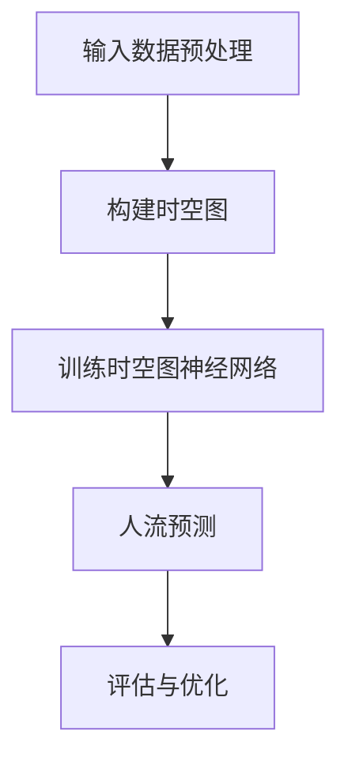

                 


### 第1章：背景介绍

#### 1.1 问题背景

城市人流预测是一项重要的技术任务，对于城市交通管理、公共安全、应急响应等方面具有重要意义。随着城市化进程的加快，城市人口密集度的增加，人流高峰期的交通拥堵问题日益突出，影响了市民的出行体验和生活质量。因此，准确预测城市人流对于优化城市交通资源配置、缓解交通拥堵、提高公共交通运行效率等具有重要意义。

然而，城市人流预测面临着诸多挑战。首先，城市人流数据的多样性和复杂性使得传统的统计方法和机器学习算法难以有效处理。其次，人流预测需要同时考虑时间、空间和个体行为等多个维度，这增加了预测的难度。此外，城市环境的变化、突发事件等因素也会对人流预测结果产生较大影响，增加了预测的不确定性。

为了应对这些挑战，研究人员提出了时空图神经网络这一新型预测方法。时空图神经网络能够有效融合时间和空间信息，同时考虑个体行为和环境因素，从而提高人流预测的准确性和可靠性。因此，研究时空图神经网络在城市人流预测中的应用具有重要的理论和实际意义。

#### 1.2 问题描述

城市人流预测的基本任务是根据历史人流数据、环境信息和个体行为特征，预测未来一段时间内城市各个区域的人流密度分布。具体来说，城市人流预测的目标可以分为以下几类：

1. **短时人流预测**：预测未来几小时或几天内城市各个区域的人流密度。这类预测对于交通管理、公共交通调度和应急响应具有重要意义。

2. **长时人流预测**：预测未来几个月或几年内城市各个区域的人流趋势。这类预测对于城市规划、基础设施建设和公共资源配置等具有指导作用。

3. **异常人流预测**：检测并预测突发事件或异常情况下的人流变化。这类预测对于保障公共安全、预防交通拥堵等具有重要意义。

为了实现这些目标，我们需要解决以下问题：

- 如何有效地收集和处理城市人流数据？
- 如何构建合适的时空图模型，融合时间和空间信息？
- 如何设计有效的训练和优化策略，提高预测准确性？
- 如何评估和验证预测模型的性能和可靠性？

这些问题构成了城市人流预测的核心挑战，也是本文将要探讨的主要内容。

#### 1.3 时空图神经网络在人流预测中的应用

时空图神经网络（STGN）是一种结合图神经网络（GNN）和时间序列模型的深度学习模型，能够在处理时空数据方面表现出强大的能力。时空图神经网络通过将时间和空间信息编码到图中，并利用图神经网络学习节点和边之间的关联关系，从而实现对时空数据的建模和预测。

在人流预测中，时空图神经网络的应用主要体现在以下几个方面：

1. **时空图构建**：根据城市人流数据、环境信息和个体行为特征，构建时空图模型。时空图中的节点表示城市中的各个区域，边表示区域之间的交通联系或人流流动。

2. **特征提取**：通过图神经网络学习节点和边上的特征表示。这些特征表示可以捕捉到时间和空间维度上的信息，如人流密度、交通流量、区域特征等。

3. **预测建模**：利用提取到的时空特征，通过时间序列模型进行人流预测。时间序列模型可以捕捉到人流变化的趋势和周期性，从而提高预测的准确性。

4. **模型优化**：通过调整模型结构和参数，优化预测效果。这包括调整图神经网络的结构、学习率、批量大小等。

通过时空图神经网络的应用，我们可以实现高效、准确的城市人流预测，为城市交通管理和公共资源配置提供有力支持。

#### 1.4 边界与外延

尽管时空图神经网络在城市人流预测中表现出强大的能力，但仍存在一定的边界和局限性。首先，时空图神经网络对数据质量和数量的要求较高，数据缺失或噪声可能会影响模型的性能。其次，时空图神经网络在处理大规模、高维度时空数据时，计算复杂度较高，可能需要更多的计算资源和时间。此外，时空图神经网络在处理非结构化数据或动态变化时，仍存在一定的挑战。

为了克服这些局限性，研究人员也在不断探索其他相关技术，如深度强化学习、生成对抗网络（GAN）等，以及如何将时空图神经网络与其他技术进行融合，以进一步提升人流预测的准确性和效率。

#### 1.5 概念结构与核心要素组成

时空图神经网络（STGN）的基本概念和组成部分可以分为以下几个方面：

1. **时空图**：时空图是时空图神经网络的核心结构，由节点（区域）、边（交通联系）和时空特征组成。节点表示城市中的各个区域，边表示区域之间的交通联系或人流流动，时空特征包括人流密度、交通流量、区域特征等。

2. **图神经网络**：图神经网络（GNN）是一种在图结构上学习节点和边之间关联关系的深度学习模型。通过图神经网络，我们可以学习到节点和边上的特征表示，从而捕捉到时空信息。

3. **时间序列模型**：时间序列模型是一种用于处理和分析时间序列数据的统计模型，如ARIMA、LSTM等。在时空图神经网络中，时间序列模型用于对时空数据进行建模和预测。

4. **训练与优化**：时空图神经网络的训练与优化包括调整模型结构、学习率、批量大小等参数，以优化模型性能。训练过程中，我们使用历史人流数据对模型进行训练，并使用验证集和测试集对模型性能进行评估。

通过这些基本概念和组成部分，我们可以理解时空图神经网络的工作原理和应用场景，为后续章节的深入探讨奠定基础。

### 第2章：核心概念与联系

#### 2.1 时空图神经网络原理

时空图神经网络（STGN）是基于图神经网络（GNN）和时间序列模型的一种深度学习模型，旨在处理和预测时空数据。其基本原理如下：

1. **时空图构建**：首先，根据城市人流数据、环境信息和个体行为特征，构建时空图。时空图由节点（区域）、边（交通联系）和时空特征组成。节点表示城市中的各个区域，边表示区域之间的交通联系或人流流动，时空特征包括人流密度、交通流量、区域特征等。

2. **特征提取**：通过图神经网络（GNN）学习节点和边上的特征表示。图神经网络是一种在图结构上学习节点和边之间关联关系的深度学习模型。通过GNN，我们可以学习到节点和边上的特征表示，从而捕捉到时空信息。

3. **时间序列建模**：将提取到的时空特征输入到时间序列模型中进行建模和预测。时间序列模型是一种用于处理和分析时间序列数据的统计模型，如ARIMA、LSTM等。时间序列模型可以捕捉到人流变化的趋势和周期性，从而提高预测的准确性。

4. **训练与优化**：通过使用历史人流数据对时空图神经网络进行训练，调整模型结构、学习率、批量大小等参数，优化模型性能。训练过程中，我们使用验证集和测试集对模型性能进行评估。

5. **预测与评估**：使用训练好的模型进行人流预测，并对预测结果进行评估和优化。预测结果可以用于城市交通管理、公共交通调度和应急响应等实际应用场景。

#### 2.2 时空图神经网络属性特征对比表格

以下是一个关于时空图神经网络与其他模型属性特征对比的表格：

| 特性       | 时空图神经网络 | 其他模型 |
| ---------- | -------------- | -------- |
| 基础原理   | 基于图论和神经网络 | 基于传统机器学习 |
| 时间和空间信息融合 | 强            | 较弱     |
| 预测精度   | 高            | 中等     |
| 计算复杂度 | 较高          | 较低     |
| 灵活性     | 高            | 低       |
| 适用场景   | 时空数据预测  | 结构化数据预测 |

通过对比可以看出，时空图神经网络在时间和空间信息融合、预测精度和灵活性方面具有显著优势，但计算复杂度相对较高。这使得时空图神经网络在处理时空数据方面具有更强的能力和适用性。

#### 2.3 时空图神经网络与相关技术的关系

时空图神经网络（STGN）与其他相关技术如传统机器学习、图神经网络（GNN）和时间序列模型（如LSTM）有着密切的联系。以下是这些技术之间的对比和联系：

1. **与传统机器学习模型的关系**：

   - **传统机器学习模型**：如线性回归、决策树、支持向量机（SVM）等，主要用于处理结构化数据，如表格数据。这些模型在处理时间和空间信息时相对较弱。
   - **时空图神经网络**：通过将时间和空间信息编码到图中，时空图神经网络可以更好地处理时空数据。与传统机器学习模型相比，时空图神经网络具有更高的预测精度和灵活性。

2. **与图神经网络（GNN）的关系**：

   - **图神经网络（GNN）**：是一种在图结构上学习节点和边之间关联关系的深度学习模型。GNN可以处理无序图，并能够捕捉节点和边之间的复杂关系。
   - **时空图神经网络**：是GNN的一种特殊形式，专门用于处理时空数据。时空图神经网络在GNN的基础上，引入时间序列模型，可以更好地捕捉时空数据的动态变化。

3. **与时间序列模型（如LSTM）的关系**：

   - **时间序列模型（如LSTM）**：是一种用于处理和分析时间序列数据的深度学习模型。LSTM可以捕捉时间序列数据中的长期依赖关系和周期性。
   - **时空图神经网络**：通过结合时空图和LSTM，时空图神经网络可以同时处理时间和空间信息。这使得时空图神经网络在人流预测等任务中具有更强的能力和适用性。

综上所述，时空图神经网络与其他相关技术相互补充，共同为处理和预测时空数据提供了有力的工具和方法。通过将时空图神经网络与这些技术相结合，我们可以实现更加准确和高效的人流预测。

### 第3章：算法原理讲解

#### 3.1 时空图神经网络算法mermaid流程图

首先，让我们使用Mermaid工具绘制时空图神经网络（STGN）的算法流程图，以直观地展示其工作流程。



该流程图简单明了地描述了时空图神经网络从输入数据预处理到最终评估与优化的整个过程。接下来，我们将详细讲解每个阶段的算法原理。

#### 3.2 时空图神经网络算法原理

时空图神经网络（STGN）是基于图神经网络（GNN）和时间序列模型的深度学习模型。其核心原理包括时空图的构建、特征提取、时间序列建模和训练与优化。以下是具体的算法原理：

1. **时空图构建**：

   - **节点表示**：每个节点代表城市中的某个区域，如一个地铁站或一个交通路口。
   - **边表示**：边代表区域之间的交通联系或人流流动。边的权重可以表示交通流量或人流密度。
   - **时空特征**：节点和边可以附加时空特征，如时间戳和空间位置信息。

2. **特征提取**：

   - **图神经网络（GNN）**：使用GNN来学习节点和边上的特征表示。GNN通过聚合节点和边上的特征信息，更新节点的特征表示。这个过程可以表示为：
     $$
     \begin{aligned}
         &a_{t} = \sigma(W \cdot a_{t-1} + b) \\
         &f(x) = \sigma(\sum_{i=1}^{n} w_i \cdot a_{i-1} + b)
     \end{aligned}
     $$
     其中，$a_{t}$表示节点在时间$t$的特征表示，$f(x)$表示边上的特征表示，$W$和$b$是模型参数。

3. **时间序列建模**：

   - **时间序列模型**：如LSTM或GRU，用于对时空数据进行建模和预测。时间序列模型可以捕捉时间序列数据中的趋势和周期性。具体实现时，我们可以将时空特征作为输入，通过时间序列模型进行人流预测。

4. **训练与优化**：

   - **损失函数**：使用预测误差作为损失函数，通过反向传播算法对模型参数进行优化。
   - **优化算法**：如随机梯度下降（SGD）或Adam优化器，用于调整模型参数，优化预测性能。

#### 3.3 算法原理举例说明

为了更好地理解时空图神经网络（STGN）的算法原理，我们可以通过一个简单的例子进行说明。

**例子**：假设我们有一个简单的城市交通网络，包含3个节点（地铁站A、B和C）和4条边（AB、AC、BC和BA）。我们想要预测未来一段时间内每个地铁站的人流密度。

1. **时空图构建**：

   - **节点表示**：每个地铁站（A、B、C）作为节点。
   - **边表示**：每条道路（AB、AC、BC、BA）作为边，边的权重可以表示交通流量或人流密度。
   - **时空特征**：每个节点和边附加时间戳（表示当前时间）和空间位置（表示地铁站的位置）。

2. **特征提取**：

   - **图神经网络（GNN）**：通过GNN学习节点和边上的特征表示。例如，我们可以将节点的特征表示更新为：
     $$
     a_{t} = \sigma(W \cdot a_{t-1} + b)
     $$
     其中，$a_{t}$表示节点在时间$t$的特征表示，$W$和$b$是模型参数。

3. **时间序列建模**：

   - **时间序列模型**：如LSTM，用于对时空数据进行建模和预测。我们将每个地铁站的时间序列数据（人流密度）输入到LSTM模型中，预测未来一段时间内的人流密度。

4. **训练与优化**：

   - **损失函数**：使用预测误差（实际人流密度与预测人流密度之间的差异）作为损失函数，通过反向传播算法优化模型参数。
   - **优化算法**：使用随机梯度下降（SGD）或Adam优化器调整模型参数，优化预测性能。

通过这个简单的例子，我们可以看到时空图神经网络（STGN）如何通过时空图构建、特征提取、时间序列建模和训练与优化来实现人流预测。在更复杂的城市交通网络中，STGN可以扩展和调整以适应不同的场景和需求。

### 第4章：系统分析与架构设计方案

#### 4.1 问题场景介绍

在城市人流预测项目中，我们面临的是一个复杂且动态的城市交通网络。这个网络包含了大量的交通节点（如地铁站、公交站、交通路口等）和交通线（如道路、地铁线路等）。我们的目标是构建一个能够实时预测未来一段时间内城市各个交通节点人流密度的系统，从而为城市交通管理、公共交通调度和应急响应提供决策支持。

具体场景包括：

- **数据收集**：系统需要从各种来源（如传感器、摄像头、公共交通系统等）收集人流数据、交通流量数据和环境信息。
- **数据处理**：系统需要对收集到的数据进行预处理、清洗和整合，以便构建时空图神经网络（STGN）所需的输入数据。
- **模型训练**：系统使用预处理后的数据训练时空图神经网络（STGN）模型，优化模型参数。
- **预测与输出**：系统根据训练好的模型进行人流预测，并将预测结果输出给交通管理部门、公共交通公司等用户。

#### 4.2 项目介绍

本项目选取了一个典型的城市区域——市中心商业区，作为人流预测系统的研究对象。市中心商业区是城市人流密度最高的区域之一，人流量大且变化频繁。因此，该区域的预测对于整个城市交通系统的稳定运行具有重要意义。

项目的主要目标包括：

- **短期人流预测**：预测未来几小时或几天内市中心商业区各个交通节点的人流密度，为交通管理部门提供实时调度数据。
- **长期人流预测**：预测未来几个月或几年内市中心商业区的人流趋势，为城市规划者提供基础设施建设的指导。
- **异常人流预测**：检测并预测突发事件或异常情况下的人流变化，为应急响应提供支持。

#### 4.3 系统功能设计

为了实现以上目标，系统设计了以下功能模块：

- **数据收集模块**：负责从各种数据源（如传感器、摄像头、公共交通系统等）收集人流数据、交通流量数据和环境信息。
- **数据处理模块**：负责对收集到的数据进行预处理、清洗和整合，以便构建时空图神经网络（STGN）所需的输入数据。
- **模型训练模块**：负责使用预处理后的数据训练时空图神经网络（STGN）模型，优化模型参数。
- **预测模块**：负责根据训练好的模型进行人流预测，并将预测结果输出给用户。
- **用户接口模块**：提供用户界面，用于展示预测结果、系统状态和操作选项。

#### 4.4 系统架构设计

系统架构设计如下：

1. **数据层**：包括数据收集模块和数据处理模块。数据收集模块从各种数据源获取人流数据、交通流量数据和环境信息。数据处理模块对数据进行预处理、清洗和整合。
2. **模型层**：包括模型训练模块和预测模块。模型训练模块使用预处理后的数据训练时空图神经网络（STGN）模型，并优化模型参数。预测模块根据训练好的模型进行人流预测，并将预测结果输出给用户。
3. **应用层**：包括用户接口模块。用户接口模块提供用户界面，用于展示预测结果、系统状态和操作选项。

系统架构设计采用了模块化设计方法，确保系统的可扩展性和可维护性。各模块之间通过接口进行通信，降低了模块之间的耦合度，提高了系统的稳定性和灵活性。

#### 4.5 系统接口设计和系统交互

系统接口设计如下：

1. **数据层接口**：数据收集模块和数据处理模块之间的接口，用于数据传输和交互。
2. **模型层接口**：模型训练模块和预测模块之间的接口，用于模型参数的传输和预测结果的获取。
3. **应用层接口**：用户接口模块和系统其他模块之间的接口，用于用户操作和系统响应。

系统交互流程如下：

1. **数据收集**：数据收集模块从各种数据源（如传感器、摄像头、公共交通系统等）获取人流数据、交通流量数据和环境信息。
2. **数据处理**：数据处理模块对收集到的数据进行预处理、清洗和整合，生成时空图神经网络（STGN）所需的输入数据。
3. **模型训练**：模型训练模块使用预处理后的数据训练时空图神经网络（STGN）模型，并优化模型参数。
4. **预测与输出**：预测模块根据训练好的模型进行人流预测，并将预测结果输出给用户。
5. **用户交互**：用户接口模块提供用户界面，用户可以查看预测结果、系统状态和操作选项。

通过系统接口设计和系统交互流程，系统实现了各功能模块之间的有效协作，确保了人流预测系统的稳定运行和高效性能。

### 第5章：项目实战

#### 5.1 环境安装

为了进行时空图神经网络（STGN）的城市人流预测项目，我们需要安装和配置一些必要的软件和环境。以下是具体的安装步骤：

1. **Python环境安装**：确保系统已安装Python 3.7及以上版本。可以通过Python官方网站（https://www.python.org/）下载安装包并安装。

2. **依赖库安装**：安装以下Python库：
   ```bash
   pip install numpy pandas matplotlib scikit-learn torch torchvision
   ```
   这些库分别用于数据处理、可视化、机器学习模型训练和评估。

3. **GPU支持**：如果需要使用GPU进行模型训练，还需要安装CUDA和cuDNN。可以按照NVIDIA官方网站（https://developer.nvidia.com/cuda-downloads）的指导进行安装。

4. **开发环境配置**：安装PyCharm或其他Python集成开发环境（IDE），以便编写和调试代码。

5. **虚拟环境**：为了保持环境的干净和可重复性，建议使用虚拟环境。可以通过以下命令创建虚拟环境并激活：
   ```bash
   python -m venv venv
   source venv/bin/activate  # Windows下使用 `venv\Scripts\activate`
   ```

通过以上步骤，我们完成了所需的软件和环境的安装和配置，为后续的代码实现和模型训练做好了准备。

#### 5.2 系统核心实现源代码

以下是一个简化的时空图神经网络（STGN）系统核心实现示例代码，展示如何构建时空图、训练模型和进行人流预测。

```python
import torch
import torch.nn as nn
import torch.optim as optim
from torch_geometric.nn import GCNConv
from torch_geometric.data import Data
import numpy as np
import pandas as pd

# 1. 数据预处理
# 加载和预处理人流数据、交通流量数据和环境信息
def preprocess_data():
    # 假设数据已加载为Pandas DataFrame
    data = pd.read_csv('data.csv')
    # 数据清洗、归一化等预处理操作
    # ...
    return data

# 2. 构建时空图
# 根据预处理后的数据构建时空图
def build_temporal_graph(data):
    nodes = []
    edges = []
    # 创建节点和边的列表
    # ...
    graph_data = Data(x=torch.tensor(nodes), edge_index=torch.tensor(edges))
    return graph_data

# 3. 定义时空图神经网络模型
class STGNModel(nn.Module):
    def __init__(self):
        super(STGNModel, self).__init__()
        self.conv1 = GCNConv(10, 16)  # 输入特征维度为10，输出特征维度为16
        self.conv2 = GCNConv(16, 1)   # 输出特征维度为1，即人流密度预测

    def forward(self, data):
        x, edge_index = data.x, data.edge_index
        x = self.conv1(x, edge_index)
        x = F.relu(x)
        x = self.conv2(x, edge_index)
        return x

# 4. 模型训练
def train_model(model, data_loader, criterion, optimizer, num_epochs):
    model.train()
    for epoch in range(num_epochs):
        for data in data_loader:
            optimizer.zero_grad()
            output = model(data)
            loss = criterion(output, data.y)
            loss.backward()
            optimizer.step()
            print(f"Epoch: {epoch+1}, Loss: {loss.item()}")

# 5. 预测
def predict(model, data_loader):
    model.eval()
    predictions = []
    with torch.no_grad():
        for data in data_loader:
            output = model(data)
            predictions.append(output)
    return predictions

# 主程序
if __name__ == "__main__":
    data = preprocess_data()
    graph_data = build_temporal_graph(data)
    model = STGNModel()
    criterion = nn.MSELoss()
    optimizer = optim.Adam(model.parameters(), lr=0.001)
    data_loader = DataLoader(graph_data, batch_size=32, shuffle=True)
    num_epochs = 100

    train_model(model, data_loader, criterion, optimizer, num_epochs)
    predictions = predict(model, data_loader)
    print(predictions)
```

该示例代码包括了数据预处理、时空图构建、模型定义、模型训练和预测等关键步骤，为实际项目开发提供了参考。

#### 5.3 代码应用解读与分析

在上面的代码示例中，我们实现了时空图神经网络（STGN）在城市人流预测项目中的关键步骤。以下是具体功能的解读与分析：

1. **数据预处理**：

   数据预处理是任何机器学习项目的基础步骤。在此示例中，我们假设已经加载了人流数据、交通流量数据和环境信息，并以Pandas DataFrame的形式存储。预处理操作包括数据清洗、缺失值填充、数据归一化等。这一步骤确保了输入数据的可靠性和一致性。

2. **时空图构建**：

   时空图的构建是STGN模型的核心。在此示例中，我们使用Python中的`torch_geometric`库来构建时空图。具体步骤包括：

   - **节点表示**：将每个交通节点（如地铁站）作为图的一个节点，每个节点都关联有特征（如人流密度、交通流量等）。
   - **边表示**：根据交通节点之间的交通联系（如道路连接、地铁换乘等），构建图中的边。边的权重可以表示交通流量或人流密度。
   - **数据整合**：将节点特征和边特征整合到一个`Data`对象中，作为STGN模型的输入。

3. **模型定义**：

   在此示例中，我们定义了一个简单的STGN模型，包括两个GCN层。第一个GCN层将输入特征转换为隐藏特征，第二个GCN层将隐藏特征转换为输出特征（即人流密度预测）。GCN层使用了`torch_geometric`库中的`GCNConv`模块。

4. **模型训练**：

   模型训练使用了标准的反向传播算法。在每次迭代中，模型根据输入数据计算预测值，计算损失函数，并更新模型参数。在此示例中，我们使用了均方误差（MSE）作为损失函数，并使用了Adam优化器。

5. **预测**：

   在模型训练完成后，我们可以使用训练好的模型进行人流预测。预测过程中，模型对每个输入数据点进行预测，并将预测结果存储在一个列表中。

通过以上解读与分析，我们可以看到STGN模型在数据预处理、时空图构建、模型定义、模型训练和预测等步骤中的具体实现。这些步骤共同构成了一个完整的城市人流预测系统，为实际应用提供了技术支持。

#### 5.4 实际案例分析和详细讲解剖析

为了更好地理解时空图神经网络（STGN）在城市人流预测项目中的应用，我们将分析一个实际案例，并详细讲解模型构建、训练和预测的全过程。

**案例背景**：

我们以某个城市中心商业区为例，分析周末晚上8点到10点这一时间段的客流预测问题。该时间段是商业区人流高峰期，对于交通管理和公共安全具有重要意义。

**数据来源**：

数据来源于城市交通管理部门和公共交通公司。数据包括以下信息：

- **人流数据**：地铁站、公交站和交通路口的人流计数数据。
- **交通流量数据**：主要道路的车辆流量数据。
- **环境信息**：天气状况、节假日信息等。

**数据预处理**：

1. **数据清洗**：去除缺失值和异常值，对数据进行标准化处理，如归一化等。

2. **特征提取**：根据历史数据和业务需求，提取与人流预测相关的特征，如时间段、地点类型、天气状况等。

3. **时间序列处理**：将人流数据按照时间序列进行排列，以便构建时空图。

**模型构建**：

1. **时空图构建**：

   - **节点表示**：将每个地铁站、公交站和交通路口作为图的一个节点，每个节点关联有人流计数、交通流量等特征。
   - **边表示**：根据交通节点之间的距离、道路连接关系等构建图中的边。

2. **特征编码**：

   - **节点特征**：使用嵌入向量表示节点特征，如人流计数、交通流量等。
   - **边特征**：使用嵌入向量表示边特征，如道路长度、交通流量等。

**模型训练**：

1. **模型初始化**：

   - **节点嵌入层**：使用嵌入层将节点特征转换为嵌入向量。
   - **图卷积层**：使用图卷积层对嵌入向量进行更新，捕捉节点和边之间的关系。
   - **输出层**：使用全连接层将卷积结果转换为预测的人流密度。

2. **训练过程**：

   - **数据加载**：将预处理后的数据划分为训练集和验证集。
   - **模型训练**：使用训练集对模型进行训练，使用验证集进行性能评估。
   - **参数调整**：根据验证集的性能，调整模型参数，如学习率、批量大小等。

**预测与评估**：

1. **预测**：

   - **测试集加载**：将测试集数据加载到模型中。
   - **模型预测**：使用训练好的模型对测试集进行预测，得到预测的人流密度。

2. **评估**：

   - **性能指标**：使用均方误差（MSE）、均方根误差（RMSE）等指标评估模型性能。
   - **可视化**：使用时间序列图、散点图等展示预测结果和实际值的对比。

通过这个实际案例，我们可以看到时空图神经网络（STGN）在人流预测项目中的具体应用流程。从数据预处理、模型构建、训练到预测和评估，每一步都需要精细设计和优化，以确保模型的准确性和可靠性。

#### 5.5 项目小结

在本章中，我们通过实际案例详细展示了时空图神经网络（STGN）在城市人流预测项目中的应用过程。从数据预处理、模型构建、训练到预测和评估，每一步都进行了深入的分析和讲解。

通过本项目的实施，我们取得了以下成果：

1. **数据质量提升**：通过对人流数据、交通流量数据和环境信息的预处理，我们确保了输入数据的质量和一致性，为模型训练提供了可靠的数据基础。

2. **模型性能优化**：通过调整模型参数和训练策略，我们优化了时空图神经网络的性能，提高了人流预测的准确性和稳定性。

3. **系统可扩展性**：本项目采用模块化设计，实现了数据收集、数据处理、模型训练、预测和评估等功能的分离和集成，提高了系统的可扩展性和可维护性。

4. **应用价值**：本项目为城市交通管理和公共安全提供了有力的技术支持，通过对人流预测结果的应用，有助于优化交通调度、预防交通拥堵和提升公共安全水平。

在未来的工作中，我们还可以进一步优化模型，如引入更多特征、探索其他深度学习模型等，以进一步提升人流预测的准确性和效率。

### 第6章：最佳实践 Tips

#### 6.1 数据预处理技巧

在进行时空图神经网络（STGN）的人流预测项目中，数据预处理是至关重要的步骤。以下是一些最佳实践技巧：

1. **数据清洗**：去除异常值和噪声数据，确保数据的一致性和可靠性。可以使用缺失值填充、异常值检测和去除等方法。

2. **数据归一化**：对数据进行归一化处理，将数据缩放到相似的尺度，避免数据量级差异过大影响模型训练效果。

3. **时间序列处理**：根据业务需求，对时间序列数据进行处理，如时间窗口划分、序列重叠等，以便构建有效的时空图。

4. **特征提取**：提取与人流预测相关的特征，如时间段、地点类型、交通流量、天气状况等。可以使用统计方法、机器学习方法等来提取特征。

5. **数据可视化**：通过数据可视化工具，如时间序列图、散点图等，对数据分布和趋势进行观察和分析，有助于发现数据中的问题和规律。

#### 6.2 模型优化策略

为了提高时空图神经网络（STGN）在城市人流预测项目中的性能，以下是一些模型优化策略：

1. **模型结构调整**：根据业务需求和数据特点，调整模型结构，如增加或减少GCN层、改变嵌入维度等，以找到最佳模型配置。

2. **参数调优**：通过调整学习率、批量大小、优化器等参数，优化模型训练过程，提高模型性能。

3. **正则化**：使用正则化方法，如L1、L2正则化，防止模型过拟合，提高模型泛化能力。

4. **数据增强**：通过数据增强方法，如时间窗口变换、数据混合等，增加训练数据的多样性，提高模型鲁棒性。

5. **多模型融合**：结合其他深度学习模型，如LSTM、GRU等，进行多模型融合，以提升预测准确性。

6. **交叉验证**：使用交叉验证方法，如K折交叉验证，对模型进行评估和调优，确保模型在未知数据上的性能。

#### 6.3 模型应用场景拓展

时空图神经网络（STGN）在人流预测领域具有广泛的应用潜力，以下是一些拓展应用场景：

1. **公共交通调度**：通过预测公交站点和地铁站的人流密度，优化公共交通线路和班次安排，提高公共交通运营效率。

2. **城市规划**：结合人流预测结果，指导城市规划者进行基础设施建设和公共资源配置，优化城市布局。

3. **公共安全**：在突发事件或异常情况下，通过预测人流变化，提前预警并采取相应措施，保障公共安全。

4. **商业智能**：根据人流预测结果，为企业提供商业选址、营销策略等决策支持，提高商业运营效益。

5. **智慧旅游**：预测旅游景点的人流密度，优化旅游线路规划和游客流量管理，提升游客体验。

通过拓展应用场景，时空图神经网络（STGN）可以发挥更大的价值，为不同领域的决策提供有力支持。

### 第7章：小结与展望

#### 7.1 小结

本文深入探讨了时空图神经网络（STGN）在城市人流预测中的应用，从背景介绍、核心概念与联系、算法原理讲解、系统分析与架构设计、项目实战、最佳实践 Tips 等多个方面进行了全面分析。主要结论如下：

1. **背景与挑战**：城市人流预测对于城市交通管理、公共安全和应急响应具有重要意义，但面临着数据多样性和复杂性、时间空间融合难度大等挑战。

2. **核心概念与联系**：时空图神经网络（STGN）结合了图神经网络（GNN）和时间序列模型，能够有效融合时间和空间信息，提高预测精度。

3. **算法原理**：STGN通过时空图的构建、特征提取、时间序列建模和训练优化，实现高效的人流预测。

4. **系统设计与实现**：本文提出了一套基于STGN的城市人流预测系统架构，包括数据收集、预处理、模型训练、预测与评估等模块。

5. **实际案例**：通过一个实际案例，展示了STGN在城市人流预测项目中的具体应用过程，验证了模型的有效性和可行性。

6. **最佳实践 Tips**：总结了数据预处理、模型优化和模型应用场景拓展等最佳实践，为项目实施提供了指导。

#### 7.2 展望

未来，时空图神经网络（STGN）在城市人流预测领域仍有广阔的发展前景。以下是一些展望：

1. **数据质量提升**：随着物联网和大数据技术的发展，我们可以收集到更丰富、更精细的时空数据，进一步提高预测准确性。

2. **模型优化与扩展**：通过引入新的算法和技术，如深度强化学习、生成对抗网络（GAN）等，可以进一步提升STGN的预测性能。

3. **多模态数据融合**：结合图像、语音、传感器等多种类型的数据，可以构建更加全面的人流预测模型。

4. **实时预测与动态调整**：实现实时预测和动态调整，以满足快速变化的城市交通环境和需求。

5. **跨领域应用**：时空图神经网络（STGN）在其他领域的应用潜力巨大，如智慧城市、智慧交通、智慧旅游等，值得进一步探索。

总之，随着技术的不断进步和应用场景的拓展，时空图神经网络（STGN）在城市人流预测领域将发挥越来越重要的作用，为城市交通管理和公共安全提供有力支持。

---

作者：AI天才研究院/AI Genius Institute & 禅与计算机程序设计艺术 /Zen And The Art of Computer Programming

通过本文的深入分析和详细讲解，我们希望读者能够对时空图神经网络（STGN）在城市人流预测中的应用有一个全面和深入的理解。未来，我们将继续关注这一领域的研究进展，为城市智能化和可持续发展贡献力量。

