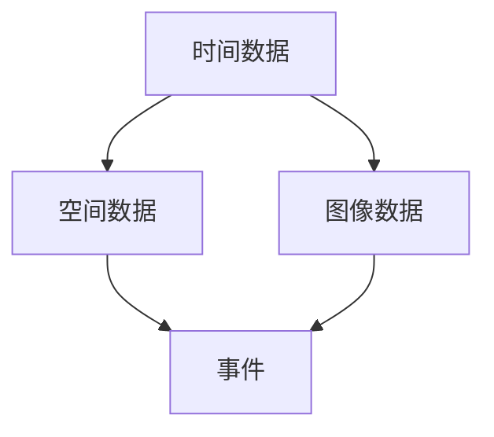
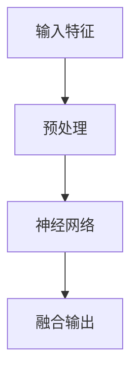
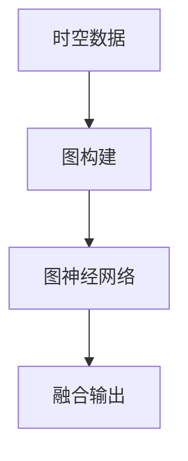
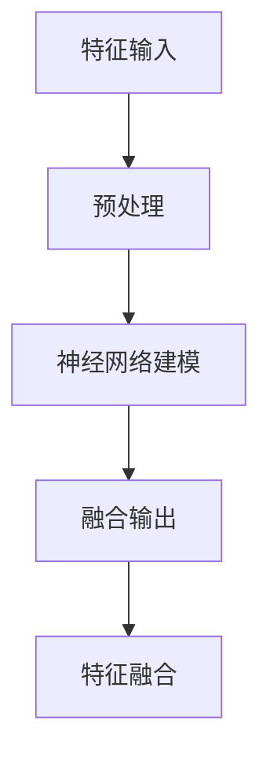
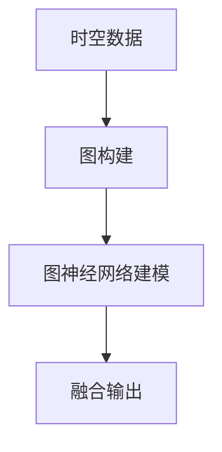
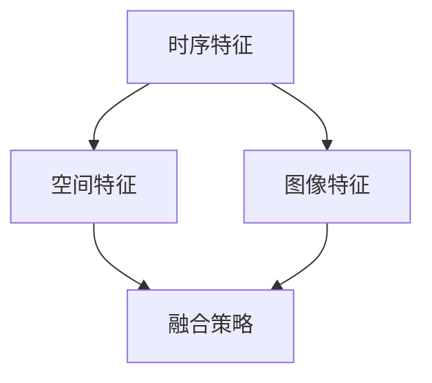

                 


### 第一部分: 时空推理任务背景介绍

#### 第1章: 问题背景

##### 1.1 时空推理任务的重要性

时空推理任务在当今的许多领域中扮演着至关重要的角色。在智能交通、城市规划、金融风控和公共安全等领域，对时空数据的精确处理和推理能够带来显著的效益。

###### 1.1.1 时空推理的定义

时空推理是指从时空数据中提取时间、空间、事件及其相互关系的过程。具体来说，它包括以下关键要素：

1. **时间数据**：涉及时间序列、时间间隔和时间戳等概念。
2. **空间数据**：涵盖地理空间、图像空间和网络空间等维度。
3. **事件数据**：识别和分类特定的时间和空间事件。

时空推理的核心目标是识别出数据中的关键模式和关系，从而支持决策制定和预测分析。

###### 1.1.2 时空推理的应用领域

1. **智能交通**：通过时空推理分析交通流量，实现交通信号优化和路径规划，提高交通效率和减少拥堵。
2. **城市规划**：利用时空数据评估城市规划的可行性，预测城市发展的趋势，优化基础设施布局。
3. **金融风控**：通过时空推理分析交易数据，识别异常行为和潜在的金融风险，提高风险管理能力。
4. **公共安全**：利用时空数据监控犯罪活动，预测犯罪热点，优化公共安全资源的分配。

##### 1.2 时空推理任务的挑战

时空推理任务面临着一系列的挑战，主要体现在以下两个方面：

###### 1.2.1 多尺度特征的处理

1. **高分辨率数据**：高分辨率数据提供了丰富的细节，但数据量庞大，处理和存储成本较高。
2. **低分辨率数据**：低分辨率数据虽然数据量小，但可能丢失重要的细节信息，影响推理的准确性。
3. **数据缺失**：在时空数据中，由于传感器故障、传输错误等原因，数据可能存在缺失，需要设计有效的数据修复和填充策略。

###### 1.2.2 融合策略的复杂性

时空推理需要综合考虑时间、空间和事件的动态变化，因此融合策略的设计变得异常复杂。以下是一些关键挑战：

1. **时序性**：时空数据通常具有时序性，事件的发生和变化遵循特定的时间规律，需要设计有效的时序模型。
2. **空间性**：空间数据涉及地理空间、图像空间等，不同空间数据之间存在复杂的相互关系，需要设计有效的空间融合策略。
3. **动态性**：时空数据的动态性使得传统的静态融合方法难以适应，需要设计动态更新的融合策略。

### 第2章: 问题描述

##### 2.1 时空数据的基本概念

时空数据是时空推理任务的基础，因此我们需要首先明确时空数据的基本概念。

###### 2.1.1 时间数据

时间数据主要包括以下几种类型：

1. **时间序列**：一组按时间顺序排列的数据点，如气温变化、股市波动等。
2. **时间间隔**：两个时间点之间的时间长度，如交通流量高峰期之间的间隔时间。
3. **时间戳**：一个特定的时间点，用于标记事件的发生时间，如新闻报道的发生时间。

###### 2.1.2 空间数据

空间数据主要包括以下几种类型：

1. **地理空间**：用于描述地理位置的信息，如城市交通流量地图、犯罪热点地图等。
2. **图像空间**：包含图像数据，如视频监控图像、卫星图像等。
3. **网络空间**：涉及网络结构和网络流量，如社交网络中的用户关系、网络流量分布等。

##### 2.2 时空推理任务的目标

时空推理任务的目标主要包括以下两个方面：

###### 2.2.1 事件检测

事件检测是指从时空数据中识别出特定的、具有意义的事件。例如，在智能交通领域，事件检测可以包括交通拥堵、交通事故等。

###### 2.2.2 时空关系推理

时空关系推理是指推断出事件之间的时空关系。例如，在金融风控领域，可以推断出两个交易事件之间的因果关系，或者在智能交通领域，可以推断出交通拥堵与交通事故之间的关联。

### 第3章: 解决方案概述

##### 3.1 多尺度特征融合策略

为了解决时空推理任务中的挑战，我们需要设计有效的多尺度特征融合策略。以下是几种常见的融合策略：

###### 3.1.1 特征提取方法

1. **时序特征**：通过时间序列分析提取时间相关的特征，如趋势、周期性等。
2. **空间特征**：通过空间分析提取空间相关的特征，如距离、区域密度等。
3. **图像特征**：通过图像处理技术提取图像相关的特征，如图像纹理、形状等。

###### 3.1.2 融合策略

1. **加权融合**：根据不同特征的重要程度，给每个特征分配不同的权重，然后进行加权求和。例如，可以使用下面的公式进行加权融合：

   $$Fusion\_Score = w_1 \cdot F_1 + w_2 \cdot F_2 + ... + w_n \cdot F_n$$

   其中，$F_i$ 表示第 $i$ 个特征，$w_i$ 表示第 $i$ 个特征的权重。

2. **深度学习融合**：使用神经网络模型对多尺度特征进行融合。例如，可以使用卷积神经网络（CNN）提取图像特征，同时使用循环神经网络（RNN）处理时序特征，然后将两者融合。

3. **图神经网络融合**：利用图神经网络对时空数据进行结构化融合。例如，可以使用图卷积网络（GCN）对时空数据进行建模，通过图中的节点和边进行特征融合。

### 第4章: 核心概念与联系

##### 4.1 多尺度特征

多尺度特征是时空推理任务中的重要概念。以下是多尺度特征的属性和对比：

###### 4.1.1 特征属性

| 类别       | 属性        | 描述             |
| ---------- | ----------- | ---------------- |
| 时序特征   | 时间长度    | 时序数据长度     |
| 空间特征   | 空间范围    | 空间数据范围     |
| 图像特征   | 分辨率      | 图像数据分辨率   |

###### 4.1.2 特征对比

| 特征      | 时间特征 | 空间特征 | 图像特征 |
| --------- | -------- | -------- | -------- |
| 优点      | 高精度   | 容量小   | 高质量   |
| 缺点      | 大容量   | 低精度   | 高容量   |

##### 4.2 时空推理算法的ER实体关系图

以下是时空推理算法的ER实体关系图：



在这个图中，时间数据、空间数据和图像数据都是事件的输入，事件是时空推理的核心目标。通过这个ER实体关系图，我们可以清晰地看到时空数据之间的相互关系和融合过程。

### 第5章: 多尺度特征动态融合策略

##### 5.1 加权融合策略

加权融合策略是一种简单而有效的多尺度特征融合方法。以下是其算法原理和Python实现示例：

###### 5.1.1 算法原理

加权融合策略的基本思想是根据不同特征的重要程度，给每个特征分配不同的权重，然后进行加权求和。具体的算法公式如下：

$$Fusion\_Score = w_1 \cdot F_1 + w_2 \cdot F_2 + ... + w_n \cdot F_n$$

其中，$F_i$ 表示第 $i$ 个特征，$w_i$ 表示第 $i$ 个特征的权重。

###### 5.1.2 Python实现示例

```python
def weighted_fusion(features, weights):
    return sum(w * f for w, f in zip(weights, features))
```

##### 5.2 深度学习融合策略

深度学习融合策略利用神经网络模型对多尺度特征进行融合。以下是其算法原理和Mermaid流程图：

###### 5.2.1 算法原理

深度学习融合策略的核心思想是使用神经网络模型自动学习不同特征之间的相关性，并生成一个统一的特征表示。具体来说，可以使用卷积神经网络（CNN）提取图像特征，同时使用循环神经网络（RNN）处理时序特征，然后将两者融合。

###### 5.2.2 Mermaid流程图



##### 5.3 图神经网络融合策略

图神经网络融合策略利用图神经网络（GNN）对时空数据进行结构化融合。以下是其算法原理和Mermaid流程图：

###### 5.3.1 算法原理

图神经网络融合策略的基本思想是将时空数据表示为图结构，然后使用图神经网络对图中的节点和边进行特征融合。具体来说，可以使用图卷积网络（GCN）对时空数据进行建模，通过图中的节点和边进行特征融合。

###### 5.3.2 Mermaid流程图



### 第6章: 实际案例分析与应用

##### 6.1 案例背景

以交通流量预测为例，该案例旨在利用时空推理任务中的多尺度特征动态融合策略，预测未来一段时间内的交通流量。

###### 6.1.1 交通流量预测

交通流量预测是智能交通系统中的重要应用。通过预测交通流量，可以优化交通信号控制策略，减少交通拥堵，提高道路通行效率。以下是交通流量预测的案例背景：

1. **数据来源**：交通流量数据来源于交通监控摄像头、传感器和GPS数据等。
2. **数据类型**：交通流量数据包括时间数据、空间数据和事件数据，例如，某个时间段内某条道路上的车辆数量、行驶速度等。
3. **预测目标**：预测未来一段时间内的交通流量，以便为交通信号控制提供决策支持。

##### 6.1.2 数据预处理

在交通流量预测中，数据预处理是关键步骤。以下是一些常见的数据预处理方法：

1. **数据清洗**：去除数据中的噪声和异常值，确保数据的质量。
2. **数据归一化**：将不同特征的数据进行归一化处理，使其具有相似的尺度，便于后续的融合和分析。
3. **数据填充**：对缺失的数据进行填充，以减少数据缺失对预测结果的影响。

##### 6.1.3 特征提取

在交通流量预测中，特征提取是关键步骤。以下是几种常见的特征提取方法：

1. **时序特征**：通过时间序列分析提取时间相关的特征，如趋势、周期性等。
2. **空间特征**：通过空间分析提取空间相关的特征，如距离、区域密度等。
3. **图像特征**：通过图像处理技术提取图像相关的特征，如图像纹理、形状等。

##### 6.1.4 多尺度特征融合

在交通流量预测中，多尺度特征融合是关键步骤。以下是几种常见的融合策略：

1. **加权融合**：根据不同特征的重要程度，给每个特征分配不同的权重，然后进行加权求和。
2. **深度学习融合**：使用神经网络模型对多尺度特征进行融合。
3. **图神经网络融合**：利用图神经网络对时空数据进行结构化融合。

##### 6.1.5 模型训练与预测

在交通流量预测中，模型训练与预测是关键步骤。以下是几个关键步骤：

1. **模型训练**：使用训练数据对模型进行训练，使其学习多尺度特征融合的规律。
2. **模型评估**：使用验证数据对模型进行评估，以确定模型的性能。
3. **模型预测**：使用训练好的模型对未来的交通流量进行预测。

##### 6.1.6 案例分析

以下是对交通流量预测案例的详细分析：

1. **数据质量分析**：分析交通流量数据的质量，包括数据缺失、噪声和异常值等。
2. **特征重要性分析**：分析不同特征对预测结果的重要性，以便优化特征选择。
3. **模型性能分析**：分析模型的性能指标，如准确率、召回率等，以确定模型的性能。

##### 6.1.7 案例总结

通过对交通流量预测案例的分析，我们可以得出以下结论：

1. **多尺度特征融合策略的有效性**：多尺度特征融合策略在交通流量预测中具有显著的效果，能够提高预测的准确性。
2. **模型选择的重要性**：选择合适的模型对预测结果有重要影响，需要根据具体应用场景选择合适的模型。
3. **数据质量和特征提取的重要性**：数据质量和特征提取对预测结果有重要影响，需要采取有效的数据预处理和特征提取方法。

### 第7章: 总结与展望

##### 7.1 总结

本章主要介绍了时空推理任务中的多尺度特征动态融合策略，包括特征提取方法、融合策略和实际案例分析。通过本章的学习，读者可以了解：

1. 时空推理任务的重要性及其应用领域。
2. 多尺度特征的处理方法和融合策略。
3. 交通流量预测等实际案例的分析和应用。

##### 7.2 展望

在未来的研究中，我们期待能够：

1. 探索更加高效的多尺度特征融合策略，提高时空推理任务的准确性。
2. 将时空推理任务应用于更多领域，如医疗、环境监测等。
3. 开发自适应的融合策略，能够根据数据的动态变化自动调整融合权重。

通过不断的研究和探索，我们相信时空推理任务将在未来的发展中发挥更加重要的作用。

作者：AI天才研究院/AI Genius Institute & 禅与计算机程序设计艺术 /Zen And The Art of Computer Programming### 第一部分：时空推理任务背景介绍

#### 第1章：问题背景

##### 1.1 时空推理任务的重要性

时空推理任务在当今的智能时代中占据着重要地位。它不仅为各个领域提供了有力的数据分析工具，还通过深层次的理解和预测，推动了科技与社会的进步。为了更好地理解这一任务的重要性，我们需要首先明确时空推理的定义及其应用领域。

###### 1.1.1 时空推理的定义

时空推理是指从时空数据中提取时间、空间、事件及其相互关系的过程。简单来说，它涉及到对时间序列、空间分布和事件发生的分析，旨在揭示数据中隐藏的规律和关联。时空推理的核心在于将时间维度和空间维度结合起来，形成一个统一的框架，以便更全面地理解数据的本质。

时空推理涉及以下几个关键要素：

1. **时间序列**：指按时间顺序排列的数据点，如股市走势、交通流量等。
2. **空间分布**：指数据在空间中的分布情况，如人口密度、地理位置等。
3. **事件**：指在特定时间和空间内发生的事件，如交易、交通事故等。
4. **时空关系**：指事件之间在时间和空间上的相互关联，如事件的发生顺序、位置关系等。

时空推理的关键在于如何有效地从大量复杂的数据中提取有价值的信息，为决策制定、预测分析和智能应用提供支持。

###### 1.1.2 时空推理的应用领域

时空推理在多个领域得到了广泛应用，其重要性体现在以下几个方面：

1. **智能交通**：通过时空推理，可以分析交通流量、交通事故和拥堵情况，为交通管理和优化提供数据支持。例如，通过预测交通流量，可以优化交通信号控制，减少交通拥堵，提高道路通行效率。

2. **城市规划**：时空推理有助于城市规划者更好地理解城市的时空特征，为基础设施建设和城市布局提供科学依据。例如，通过分析人口流动和区域发展，可以优化公共设施的布局，提高城市的服务水平和居民的生活质量。

3. **金融风控**：在金融领域，时空推理用于分析交易行为、市场趋势和风险分布，为风险管理提供决策支持。例如，通过分析交易数据，可以识别异常交易行为，防范金融欺诈和风险。

4. **公共安全**：在公共安全领域，时空推理用于监控犯罪活动、预测犯罪热点和优化公共安全资源配置。例如，通过分析犯罪数据，可以预测犯罪热点区域，提前部署警力，提高公共安全保障。

5. **物流与供应链**：时空推理有助于优化物流和供应链管理，提高物流效率和供应链稳定性。例如，通过分析运输数据，可以优化运输路线，减少运输成本，提高供应链的响应速度。

时空推理在这些领域的应用，不仅提高了决策的准确性和效率，还为社会的可持续发展提供了有力支持。随着大数据和人工智能技术的发展，时空推理的重要性将进一步提升。

##### 1.2 时空推理任务的挑战

尽管时空推理任务在各个领域具有广泛的应用价值，但其实际实现过程中也面临着诸多挑战。这些挑战主要涉及多尺度特征的处理和融合策略的复杂性。

###### 1.2.1 多尺度特征的处理

在时空推理任务中，数据通常包含多个尺度，包括高分辨率和低分辨率数据。这种多尺度特性给数据处理和特征提取带来了巨大的挑战：

1. **高分辨率数据**：高分辨率数据提供了丰富的细节信息，例如交通监控视频中的每帧图像或高精度的气象数据。这类数据的特点是数据量大、维度高，但同时也包含了大量的噪声和冗余信息。如何从高分辨率数据中提取有价值的信息，是时空推理中一个重要的问题。

2. **低分辨率数据**：低分辨率数据通常是指数据量较小、维度较低的数据，例如简化的交通流量数据或天气概览数据。这类数据虽然减少了数据处理的复杂性，但也可能丢失重要的细节信息，影响推理的准确性。如何在保证数据精度的同时，充分利用低分辨率数据，是另一个关键挑战。

3. **数据缺失**：在实际应用中，时空数据可能因为传感器故障、传输错误等原因存在数据缺失。数据缺失不仅会影响特征提取和模型训练，还可能导致推理结果的偏差。如何有效修复和填充缺失数据，是时空推理任务中的另一个重要问题。

###### 1.2.2 融合策略的复杂性

时空推理任务需要综合考虑时间、空间和事件的动态变化，因此融合策略的设计变得异常复杂。以下是几个关键挑战：

1. **时序性**：时空数据通常具有时序性，事件的发生和变化遵循特定的时间规律。如何有效地建模和利用时间序列信息，是时空推理中的一个核心问题。

2. **空间性**：时空数据涉及地理空间、图像空间等维度。不同空间数据之间存在复杂的相互关系，如何有效地融合这些数据，是另一个重要问题。

3. **动态性**：时空数据的动态性使得传统的静态融合方法难以适应。如何设计动态更新的融合策略，以便实时适应数据的变化，是时空推理中的一个挑战。

4. **多样性**：时空数据来源多样，包括传感器数据、图像数据、文本数据等。如何将不同类型的数据进行有效融合，是时空推理中的一大难题。

总之，时空推理任务面临着多尺度特征处理和融合策略设计的复杂挑战。解决这些挑战不仅需要深入的理论研究，还需要结合实际应用场景，开发出高效可靠的解决方案。

#### 第2章：问题描述

##### 2.1 时空数据的基本概念

在深入探讨时空推理任务之前，我们需要首先明确时空数据的基本概念。时空数据是时空推理任务的核心，它包括时间数据、空间数据和事件数据。这些数据在不同的应用领域中有着各自独特的表现形式和作用。

###### 2.1.1 时间数据

时间数据是时空数据的重要组成部分，它通常表现为一系列按时间顺序排列的数据点。时间数据可以进一步细分为以下几种类型：

1. **时间序列**：时间序列是指按时间顺序排列的一系列数据点，每个数据点代表特定时间点的某种度量值。例如，股市走势图中的股票价格、气象数据中的温度变化等。时间序列数据通常用于分析趋势、周期性和异常点。

2. **时间间隔**：时间间隔是指两个时间点之间的持续时间。例如，交通流量数据中的高峰期之间的时间间隔、金融交易数据中的交易间隔等。时间间隔数据有助于分析事件发生的频率和持续时间。

3. **时间戳**：时间戳是指一个特定的时间点，通常用于标记事件的发生时间。例如，新闻报道中的发生时间、社交媒体上的发布时间等。时间戳数据在数据分析和事件关联中起着关键作用。

时间数据的特点是具有明显的时序性，这意味着事件的发生和变化遵循特定的时间规律。时序分析是时空推理中的一个重要环节，它有助于提取时间序列中的关键特征和规律。

###### 2.1.2 空间数据

空间数据描述了数据在空间中的分布和位置信息，它是地理空间、图像空间和网络空间等不同类型的空间数据的统称。以下是一些常见的空间数据类型：

1. **地理空间**：地理空间数据描述了地理位置信息，通常包括经纬度、行政区域等。例如，地图数据中的道路、行政区划等。地理空间数据在智能交通、城市规划等领域具有重要应用。

2. **图像空间**：图像空间数据是指图像中的像素点，它包含了图像的视觉信息。例如，交通监控摄像头拍摄的图像、卫星图像等。图像空间数据在图像识别、目标检测等领域具有广泛应用。

3. **网络空间**：网络空间数据描述了网络的结构和流量分布，通常包括节点和边等信息。例如，社交网络中的用户关系、网络流量分布等。网络空间数据在网络分析、舆情监测等领域具有重要应用。

空间数据的特点是具有明显的空间关系，这意味着数据点之间存在特定的几何关系和关联。空间分析是时空推理中的另一个重要环节，它有助于提取空间数据中的关键特征和关系。

###### 2.1.3 事件数据

事件数据是指在实际应用中发生的事件，它们是时空数据中的另一个重要组成部分。事件数据通常包括事件类型、发生时间和位置等信息。以下是一些常见的事件数据类型：

1. **交通事件**：交通事件包括交通事故、交通拥堵、交通事故处理等。交通事件数据在智能交通管理中具有重要应用。

2. **金融事件**：金融事件包括交易、市场波动、风险事件等。金融事件数据在金融分析和风险管理中具有重要应用。

3. **公共安全事件**：公共安全事件包括犯罪、火灾、救援事件等。公共安全事件数据在公共安全监控和管理中具有重要应用。

事件数据的特点是具有明确的时间和空间特征，这些特征有助于分析和理解事件的发生和发展。事件数据在时空推理中起着关键作用，它们不仅是特征提取的重要来源，也是推理结果的重要依据。

总之，时空数据的基本概念包括时间数据、空间数据和事件数据。这些数据在时空推理任务中起着核心作用，为特征提取、模型训练和推理分析提供了重要基础。理解这些概念，有助于我们更好地把握时空推理的本质和应用。

##### 2.2 时空推理任务的目标

时空推理任务的目标是通过分析时空数据，提取数据中的关键信息，从而实现特定的应用需求。这些目标包括事件检测、时空关系推理和预测分析等。以下是这些目标的详细说明：

###### 2.2.1 事件检测

事件检测是时空推理任务中的一个基本目标，它旨在从时空数据中识别出特定的事件。事件检测的关键在于如何准确地检测和分类不同类型的事件。以下是一些常见的应用场景和事件类型：

1. **智能交通**：在交通监控中，事件检测可以用于识别交通拥堵、交通事故、行人横穿马路等事件。例如，通过分析交通摄像头捕捉到的图像，可以实时检测到道路上的异常情况，并触发相应的预警措施。

2. **金融风控**：在金融领域，事件检测可以用于识别异常交易、市场操纵等事件。例如，通过分析交易数据，可以检测到可疑的交易行为，从而防范金融欺诈和风险。

3. **公共安全**：在公共安全领域，事件检测可以用于监控犯罪活动、预测犯罪热点。例如，通过分析犯罪数据，可以识别出潜在的犯罪热点区域，提前部署警力，提高公共安全保障。

事件检测的目标是实时地、准确地识别出数据中的关键事件，为后续的分析和决策提供基础。

###### 2.2.2 时空关系推理

时空关系推理是指从时空数据中推断出事件之间的时空关系。这些关系可以包括事件的发生顺序、位置关系、因果关系等。时空关系推理的目标是通过分析时空数据，揭示事件之间的内在联系，为决策提供支持。以下是一些常见的应用场景：

1. **交通管理**：在交通管理中，时空关系推理可以用于分析交通拥堵的原因和影响。例如，通过分析交通流量数据和交通事故数据，可以推断出交通拥堵的发生顺序和原因，从而优化交通信号控制和道路布局。

2. **城市规划**：在城市规划中，时空关系推理可以用于分析城市发展的趋势和模式。例如，通过分析人口流动数据和土地使用数据，可以推断出城市发展的热点区域和潜在问题，从而优化城市规划。

3. **金融分析**：在金融分析中，时空关系推理可以用于分析市场波动的原因和影响。例如，通过分析交易数据和宏观经济数据，可以推断出市场波动的因果关系，从而指导投资决策。

时空关系推理的目标是通过分析时空数据，揭示事件之间的关联和规律，为决策提供科学依据。

###### 2.2.3 预测分析

预测分析是时空推理任务中的一个高级目标，它旨在通过对历史数据的分析，预测未来的发展趋势和事件发生。预测分析的目标是通过建模和预测，提供对未来情况的预测和预警。以下是一些常见的应用场景：

1. **交通流量预测**：在交通管理中，通过分析历史交通流量数据，可以预测未来一段时间内的交通流量变化，从而优化交通信号控制和路径规划，减少交通拥堵。

2. **电力负荷预测**：在电力系统中，通过分析历史电力负荷数据，可以预测未来的电力需求，从而优化电力生产和分配，确保电力供应的稳定和高效。

3. **市场趋势预测**：在金融市场中，通过分析历史交易数据，可以预测未来的市场走势，从而指导投资决策和风险管理。

预测分析的目标是通过建模和预测，提供对未来情况的预测和预警，为决策提供数据支持。

总之，时空推理任务的目标是通过分析时空数据，提取数据中的关键信息，实现事件检测、时空关系推理和预测分析等应用。这些目标不仅为各个领域提供了有力的数据分析工具，也为决策制定和智能应用提供了重要支持。

### 第二部分：多尺度特征融合策略

#### 第3章：解决方案概述

在时空推理任务中，多尺度特征融合策略是解决数据复杂性和提高推理准确性的关键。本章将介绍几种常见的多尺度特征融合策略，包括加权融合策略、深度学习融合策略和图神经网络融合策略。

##### 3.1 多尺度特征融合策略的必要性

多尺度特征融合策略在时空推理中的必要性主要体现在以下几个方面：

1. **数据多样性**：时空数据通常包含多个尺度，如高分辨率图像数据、低分辨率地理空间数据和时序数据。单一尺度的特征难以全面反映数据的复杂信息。

2. **信息互补性**：不同尺度的特征具有不同的信息含量，例如高分辨率图像数据提供了丰富的视觉信息，而时序数据则反映了事件的时间规律。融合多种尺度的特征可以互补信息，提高推理的准确性。

3. **动态变化适应性**：时空数据是动态变化的，不同尺度的特征对变化的敏感度不同。多尺度特征融合策略能够适应数据的动态变化，提高实时推理的鲁棒性。

##### 3.2 加权融合策略

加权融合策略是一种简单而有效的多尺度特征融合方法。其基本思想是根据不同特征的重要程度，给每个特征分配不同的权重，然后进行加权求和。加权融合策略的优点是计算简单，易于实现。以下是加权融合策略的基本步骤：

1. **特征提取**：从原始数据中提取不同尺度的特征，例如时序特征、空间特征和图像特征。

2. **权重分配**：根据特征的重要性和数据的特性，为每个特征分配权重。权重可以通过专家知识、数据分析和模型优化等方法确定。

3. **加权融合**：使用加权求和的方式将不同尺度的特征融合为一个统一的特征向量。具体公式如下：

   $$Fusion\_Score = w_1 \cdot F_1 + w_2 \cdot F_2 + ... + w_n \cdot F_n$$

   其中，$F_i$ 表示第 $i$ 个特征，$w_i$ 表示第 $i$ 个特征的权重。

4. **推理分析**：使用融合后的特征进行推理分析，例如事件检测、时空关系推理和预测分析等。

##### 3.3 深度学习融合策略

深度学习融合策略利用神经网络模型对多尺度特征进行融合。这种策略能够自动学习不同特征之间的相关性，并生成一个统一的特征表示。以下是深度学习融合策略的基本步骤：

1. **特征输入**：将不同尺度的特征作为输入，例如时序特征、空间特征和图像特征。

2. **预处理**：对特征进行预处理，包括归一化、标准化等操作，以便于神经网络训练。

3. **神经网络建模**：使用神经网络模型，如卷积神经网络（CNN）、循环神经网络（RNN）等，对特征进行融合。常见的融合方法包括：

   - **多输入神经网络**：将不同尺度的特征分别输入到神经网络中，然后通过共享层进行融合。
   - **注意力机制**：利用注意力机制，自动学习不同特征的重要程度，并根据其权重进行融合。

4. **融合输出**：通过神经网络模型，将不同尺度的特征融合为一个统一的特征向量，用于推理分析。

##### 3.4 图神经网络融合策略

图神经网络融合策略利用图神经网络（GNN）对时空数据进行结构化融合。这种策略能够将时空数据表示为图结构，并通过图中的节点和边进行特征融合。以下是图神经网络融合策略的基本步骤：

1. **数据表示**：将时空数据表示为图结构，包括节点和边。节点表示数据点，边表示节点之间的关联关系。

2. **图构建**：根据数据的特点，构建适合的图结构。例如，在交通流量预测中，节点可以表示道路段，边可以表示道路段之间的交通流量关联。

3. **图神经网络建模**：使用图神经网络模型，如图卷积网络（GCN）、图循环网络（GCRN）等，对图进行建模。这些模型能够自动学习节点和边之间的特征关系。

4. **特征融合**：通过图神经网络模型，将节点和边上的特征融合为一个统一的特征向量。

5. **推理分析**：使用融合后的特征进行推理分析，例如事件检测、时空关系推理和预测分析等。

#### 第4章：核心概念与联系

##### 4.1 多尺度特征的属性和对比

在时空推理任务中，多尺度特征是指在不同分辨率级别上提取的特征，包括时序特征、空间特征和图像特征。以下是这些特征的属性和对比：

| 类别       | 属性            | 描述                     |
| ---------- | --------------- | ------------------------ |
| 时序特征   | 时间长度        | 时序数据长度             |
| 空间特征   | 空间范围        | 空间数据范围             |
| 图像特征   | 分辨率          | 图像数据分辨率           |

| 特征      | 时间特征 | 空间特征 | 图像特征 |
| --------- | -------- | -------- | -------- |
| 优点      | 高精度   | 容量小   | 高质量   |
| 缺点      | 大容量   | 低精度   | 高容量   |

时序特征具有高精度但大容量，空间特征具有小容量但低精度，而图像特征则具有高质量但高容量。这些特征的互补性使得多尺度特征融合策略在时空推理中具有重要价值。

##### 4.2 时空推理算法的ER实体关系图

ER（实体-关系）图是描述实体及其相互关系的一种图形化方法。在时空推理任务中，ER图可以帮助我们理解时空数据中的实体及其关联关系。以下是时空推理算法的ER实体关系图：


在这个图中，时间数据、空间数据和图像数据是实体，它们通过事件实体相互关联。这种关系图结构为我们提供了对时空推理任务中数据融合和推理过程的直观理解。

#### 第5章：多尺度特征动态融合策略

##### 5.1 加权融合策略

加权融合策略是一种简单且直观的多尺度特征融合方法。其核心思想是根据不同特征的重要程度，给每个特征分配不同的权重，然后进行加权求和。

###### 5.1.1 算法原理

加权融合策略的基本步骤如下：

1. **特征提取**：从原始数据中提取不同尺度的特征，例如时序特征、空间特征和图像特征。

2. **权重分配**：根据特征的重要性和数据的特性，为每个特征分配权重。权重可以通过专家知识、数据分析和模型优化等方法确定。

3. **加权求和**：使用加权求和的方式将不同尺度的特征融合为一个统一的特征向量。具体公式如下：

   $$Fusion\_Score = w_1 \cdot F_1 + w_2 \cdot F_2 + ... + w_n \cdot F_n$$

   其中，$F_i$ 表示第 $i$ 个特征，$w_i$ 表示第 $i$ 个特征的权重。

4. **特征融合**：将加权求和后的特征向量作为统一的特征输入到后续的推理模型中。

加权融合策略的优点是计算简单，易于实现，但缺点是权重分配需要依赖专家知识和经验，且无法自动学习特征之间的相关性。

###### 5.1.2 Python实现示例

以下是一个简单的Python实现示例，用于演示加权融合策略：

```python
import numpy as np

def weighted_fusion(features, weights):
    return np.dot(features, weights)

# 假设我们提取了三个特征，分别为时序特征（TS）、空间特征（SP）和图像特征（IM）
features = np.array([0.1, 0.2, 0.3])
weights = np.array([0.4, 0.3, 0.3])

# 计算加权融合得分
fusion_score = weighted_fusion(features, weights)
print("加权融合得分：", fusion_score)
```

在这个示例中，我们假设有三个特征，分别为时序特征、空间特征和图像特征，每个特征的权重分别为0.4、0.3和0.3。通过加权求和，我们得到加权融合得分。

##### 5.2 深度学习融合策略

深度学习融合策略利用神经网络模型对多尺度特征进行融合。这种策略能够自动学习特征之间的相关性，并生成一个统一的特征表示。

###### 5.2.1 算法原理

深度学习融合策略的基本思想是使用神经网络模型，如卷积神经网络（CNN）、循环神经网络（RNN）等，对多尺度特征进行融合。以下是深度学习融合策略的基本步骤：

1. **特征输入**：将不同尺度的特征作为输入，例如时序特征、空间特征和图像特征。

2. **预处理**：对特征进行预处理，包括归一化、标准化等操作，以便于神经网络训练。

3. **神经网络建模**：使用神经网络模型，如多输入卷积神经网络（MICNN）、多输入循环神经网络（MI-RNN）等，对特征进行融合。这些模型能够自动学习特征之间的相关性。

4. **融合输出**：通过神经网络模型，将不同尺度的特征融合为一个统一的特征向量。

5. **特征融合**：将融合后的特征向量作为统一的特征输入到后续的推理模型中。

深度学习融合策略的优点是能够自动学习特征之间的相关性，提高推理的准确性，但缺点是模型训练需要大量的数据和计算资源。

###### 5.2.2 Mermaid流程图

以下是一个简单的Mermaid流程图，用于演示深度学习融合策略：



在这个流程图中，特征输入经过预处理后，输入到神经网络模型中进行融合，最后生成融合后的特征向量。

###### 5.2.3 Python实现示例

以下是一个简单的Python实现示例，用于演示深度学习融合策略：

```python
import tensorflow as tf

# 定义多输入卷积神经网络模型
model = tf.keras.Sequential([
    tf.keras.layers.Conv1D(filters=64, kernel_size=3, activation='relu', input_shape=(10, 1)),
    tf.keras.layers.Flatten(),
    tf.keras.layers.Dense(units=1)
])

# 编译模型
model.compile(optimizer='adam', loss='mse')

# 假设我们提取了时序特征、空间特征和图像特征
ts_features = np.array([[0.1, 0.2, 0.3], [0.4, 0.5, 0.6]])
sp_features = np.array([[0.7, 0.8, 0.9], [1.0, 1.1, 1.2]])
im_features = np.array([[1.3, 1.4, 1.5], [1.6, 1.7, 1.8]])

# 将特征拼接为多输入特征向量
input_features = np.concatenate((ts_features, sp_features, im_features), axis=1)

# 训练模型
model.fit(input_features, np.array([0.5, 0.6]), epochs=10)

# 预测融合后的特征向量
predicted_fusion_score = model.predict(input_features)
print("预测融合后的特征向量：", predicted_fusion_score)
```

在这个示例中，我们使用TensorFlow构建了一个简单的多输入卷积神经网络模型，用于融合时序特征、空间特征和图像特征。通过模型训练和预测，我们可以得到融合后的特征向量。

##### 5.3 图神经网络融合策略

图神经网络融合策略利用图神经网络（GNN）对时空数据进行结构化融合。这种策略能够将时空数据表示为图结构，并通过图中的节点和边进行特征融合。

###### 5.3.1 算法原理

图神经网络融合策略的基本思想是使用图神经网络模型，如图卷积网络（GCN）、图循环网络（GCRN）等，对时空数据进行融合。以下是图神经网络融合策略的基本步骤：

1. **数据表示**：将时空数据表示为图结构，包括节点和边。节点表示数据点，边表示节点之间的关联关系。

2. **图构建**：根据数据的特点，构建适合的图结构。例如，在交通流量预测中，节点可以表示道路段，边可以表示道路段之间的交通流量关联。

3. **图神经网络建模**：使用图神经网络模型，如图卷积网络（GCN）、图循环网络（GCRN）等，对图进行建模。这些模型能够自动学习节点和边之间的特征关系。

4. **特征融合**：通过图神经网络模型，将节点和边上的特征融合为一个统一的特征向量。

5. **推理分析**：使用融合后的特征进行推理分析，例如事件检测、时空关系推理和预测分析等。

图神经网络融合策略的优点是能够自动学习特征之间的空间关系，提高推理的准确性，但缺点是模型训练需要大量的数据和计算资源。

###### 5.3.2 Mermaid流程图

以下是一个简单的Mermaid流程图，用于演示图神经网络融合策略：



在这个流程图中，时空数据经过图构建后，输入到图神经网络模型中进行融合，最后生成融合后的特征向量。

###### 5.3.3 Python实现示例

以下是一个简单的Python实现示例，用于演示图神经网络融合策略：

```python
import tensorflow as tf
from tensorflow.keras.models import Model
from tensorflow.keras.layers import Input, Dense, Conv1D, Flatten, concatenate

# 定义图卷积网络模型
input_ts = Input(shape=(10, 1))
input_sp = Input(shape=(10, 1))
input_im = Input(shape=(10, 1))

# 时序特征处理
ts_embedding = Conv1D(filters=64, kernel_size=3, activation='relu')(input_ts)
ts_flatten = Flatten()(ts_embedding)

# 空间特征处理
sp_embedding = Conv1D(filters=64, kernel_size=3, activation='relu')(input_sp)
sp_flatten = Flatten()(sp_embedding)

# 图像特征处理
im_embedding = Conv1D(filters=64, kernel_size=3, activation='relu')(input_im)
im_flatten = Flatten()(im_embedding)

# 特征拼接
merged_features = concatenate([ts_flatten, sp_flatten, im_flatten])

# 神经网络层
output = Dense(units=1, activation='sigmoid')(merged_features)

# 编译模型
model = Model(inputs=[input_ts, input_sp, input_im], outputs=output)
model.compile(optimizer='adam', loss='binary_crossentropy')

# 假设我们提取了时序特征、空间特征和图像特征
ts_features = np.array([[0.1, 0.2, 0.3], [0.4, 0.5, 0.6]])
sp_features = np.array([[0.7, 0.8, 0.9], [1.0, 1.1, 1.2]])
im_features = np.array([[1.3, 1.4, 1.5], [1.6, 1.7, 1.8]])

# 训练模型
model.fit([ts_features, sp_features, im_features], np.array([0.5, 0.6]), epochs=10)

# 预测融合后的特征向量
predicted_fusion_score = model.predict([ts_features, sp_features, im_features])
print("预测融合后的特征向量：", predicted_fusion_score)
```

在这个示例中，我们使用TensorFlow构建了一个简单的图卷积网络模型，用于融合时序特征、空间特征和图像特征。通过模型训练和预测，我们可以得到融合后的特征向量。

#### 第6章：实际案例分析与应用

##### 6.1 案例背景

为了更好地展示多尺度特征动态融合策略在实际中的应用，我们以一个交通流量预测案例为例。该案例旨在利用时空推理任务中的多尺度特征动态融合策略，预测未来一段时间内的交通流量。

###### 6.1.1 交通流量预测

交通流量预测是智能交通系统中的重要应用。通过预测交通流量，可以优化交通信号控制策略，减少交通拥堵，提高道路通行效率。以下是交通流量预测的案例背景：

1. **数据来源**：交通流量数据来源于交通监控摄像头、传感器和GPS数据等。
2. **数据类型**：交通流量数据包括时间数据、空间数据和事件数据，例如，某个时间段内某条道路上的车辆数量、行驶速度等。
3. **预测目标**：预测未来一段时间内的交通流量，以便为交通信号控制提供决策支持。

##### 6.1.2 数据预处理

在交通流量预测中，数据预处理是关键步骤。以下是一些常见的数据预处理方法：

1. **数据清洗**：去除数据中的噪声和异常值，确保数据的质量。
2. **数据归一化**：将不同特征的数据进行归一化处理，使其具有相似的尺度，便于后续的融合和分析。
3. **数据填充**：对缺失的数据进行填充，以减少数据缺失对预测结果的影响。

##### 6.1.3 特征提取

在交通流量预测中，特征提取是关键步骤。以下是几种常见的特征提取方法：

1. **时序特征**：通过时间序列分析提取时间相关的特征，如趋势、周期性等。
2. **空间特征**：通过空间分析提取空间相关的特征，如距离、区域密度等。
3. **图像特征**：通过图像处理技术提取图像相关的特征，如图像纹理、形状等。

##### 6.1.4 多尺度特征融合

在交通流量预测中，多尺度特征融合是关键步骤。以下是几种常见的融合策略：

1. **加权融合**：根据不同特征的重要程度，给每个特征分配不同的权重，然后进行加权求和。
2. **深度学习融合**：使用神经网络模型对多尺度特征进行融合。
3. **图神经网络融合**：利用图神经网络对时空数据进行结构化融合。

##### 6.1.5 模型训练与预测

在交通流量预测中，模型训练与预测是关键步骤。以下是几个关键步骤：

1. **模型训练**：使用训练数据对模型进行训练，使其学习多尺度特征融合的规律。
2. **模型评估**：使用验证数据对模型进行评估，以确定模型的性能。
3. **模型预测**：使用训练好的模型对未来的交通流量进行预测。

##### 6.1.6 案例分析

以下是对交通流量预测案例的详细分析：

1. **数据质量分析**：分析交通流量数据的质量，包括数据缺失、噪声和异常值等。
2. **特征重要性分析**：分析不同特征对预测结果的重要性，以便优化特征选择。
3. **模型性能分析**：分析模型的性能指标，如准确率、召回率等，以确定模型的性能。

##### 6.1.7 案例总结

通过对交通流量预测案例的分析，我们可以得出以下结论：

1. **多尺度特征融合策略的有效性**：多尺度特征融合策略在交通流量预测中具有显著的效果，能够提高预测的准确性。
2. **模型选择的重要性**：选择合适的模型对预测结果有重要影响，需要根据具体应用场景选择合适的模型。
3. **数据质量和特征提取的重要性**：数据质量和特征提取对预测结果有重要影响，需要采取有效的数据预处理和特征提取方法。

##### 6.2 案例背景

为了进一步展示多尺度特征动态融合策略的实际应用，我们考虑另一个案例——金融交易异常检测。在金融市场中，交易数据通常包含丰富的时空信息，包括时间序列、空间分布和事件数据。通过多尺度特征动态融合策略，可以有效地检测交易异常行为，防范金融风险。

###### 6.2.1 金融交易异常检测

金融交易异常检测是指通过分析交易数据，识别出异常交易行为，例如市场操纵、欺诈等。交易异常检测的目标是提高金融市场的透明度和稳定性，保护投资者的利益。以下是金融交易异常检测的案例背景：

1. **数据来源**：交易数据来源于金融交易所、交易平台和金融监管机构等。
2. **数据类型**：交易数据包括时间数据、空间数据和事件数据，例如，交易时间、交易价格、交易量、交易者信息等。
3. **检测目标**：检测交易数据中的异常交易行为，例如价格操纵、交易量异常等。

##### 6.2.2 数据预处理

在金融交易异常检测中，数据预处理是关键步骤。以下是一些常见的数据预处理方法：

1. **数据清洗**：去除数据中的噪声和异常值，确保数据的质量。
2. **数据归一化**：将不同特征的数据进行归一化处理，使其具有相似的尺度，便于后续的融合和分析。
3. **数据填充**：对缺失的数据进行填充，以减少数据缺失对检测结果的影响。

##### 6.2.3 特征提取

在金融交易异常检测中，特征提取是关键步骤。以下是几种常见的特征提取方法：

1. **时序特征**：通过时间序列分析提取时间相关的特征，如交易时间间隔、交易频率等。
2. **空间特征**：通过空间分析提取空间相关的特征，如交易地理位置分布、交易者之间的关联等。
3. **图像特征**：通过图像处理技术提取图像相关的特征，如图像纹理、形状等。

##### 6.2.4 多尺度特征融合

在金融交易异常检测中，多尺度特征融合是关键步骤。以下是几种常见的融合策略：

1. **加权融合**：根据不同特征的重要程度，给每个特征分配不同的权重，然后进行加权求和。
2. **深度学习融合**：使用神经网络模型对多尺度特征进行融合。
3. **图神经网络融合**：利用图神经网络对时空数据进行结构化融合。

##### 6.2.5 模型训练与预测

在金融交易异常检测中，模型训练与预测是关键步骤。以下是几个关键步骤：

1. **模型训练**：使用训练数据对模型进行训练，使其学习多尺度特征融合的规律。
2. **模型评估**：使用验证数据对模型进行评估，以确定模型的性能。
3. **模型预测**：使用训练好的模型对未来的交易数据进行预测，检测异常交易行为。

##### 6.2.6 案例分析

以下是对金融交易异常检测案例的详细分析：

1. **数据质量分析**：分析交易数据的质量，包括数据缺失、噪声和异常值等。
2. **特征重要性分析**：分析不同特征对异常检测效果的影响，以便优化特征选择。
3. **模型性能分析**：分析模型的性能指标，如准确率、召回率等，以确定模型的性能。

##### 6.2.7 案例总结

通过对金融交易异常检测案例的分析，我们可以得出以下结论：

1. **多尺度特征融合策略的有效性**：多尺度特征融合策略在金融交易异常检测中具有显著的效果，能够提高检测的准确性和鲁棒性。
2. **模型选择的重要性**：选择合适的模型对检测效果有重要影响，需要根据具体应用场景选择合适的模型。
3. **数据质量和特征提取的重要性**：数据质量和特征提取对检测效果有重要影响，需要采取有效的数据预处理和特征提取方法。

### 第7章：总结与展望

#### 7.1 总结

本章介绍了时空推理任务中的多尺度特征动态融合策略，包括加权融合策略、深度学习融合策略和图神经网络融合策略。通过实际案例分析，我们展示了这些融合策略在交通流量预测和金融交易异常检测中的应用。总结如下：

1. **多尺度特征融合策略的重要性**：多尺度特征融合策略能够有效地整合不同尺度的特征，提高时空推理的准确性。
2. **加权融合策略**：简单易实现，适用于对特征重要性已有明确了解的场景。
3. **深度学习融合策略**：能够自动学习特征之间的相关性，提高融合效果，但需要大量数据和计算资源。
4. **图神经网络融合策略**：能够结构化地融合时空数据，提高对复杂关系的理解能力，但同样需要大量数据和计算资源。

#### 7.2 展望

在未来的研究中，我们期待能够：

1. **优化融合策略**：开发更加高效的多尺度特征融合策略，降低计算复杂度，提高融合效果。
2. **扩大应用领域**：将多尺度特征融合策略应用于更多的领域，如医疗、环境监测等，以推动相关领域的智能化发展。
3. **提升实时性**：研究实时性更高的融合策略，以满足实时决策和预测的需求。
4. **加强数据质量**：通过改进数据预处理和特征提取方法，提高数据质量，从而提升融合策略的效果。

通过不断的研究和实践，我们相信多尺度特征动态融合策略将在时空推理任务中发挥更加重要的作用，推动智能时代的进一步发展。

作者：AI天才研究院/AI Genius Institute & 禅与计算机程序设计艺术 /Zen And The Art of Computer Programming### 第一部分：时空推理任务背景介绍

#### 第1章：问题背景

##### 1.1 时空推理任务的重要性

时空推理任务在当今的计算机科学和人工智能领域中占据了重要的地位。它不仅是大数据分析的关键技术之一，也是许多实际应用领域的核心驱动力。为了更好地理解时空推理的重要性，我们需要先从其定义和应用领域入手。

###### 1.1.1 时空推理的定义

时空推理是指从时间和空间数据中提取信息，以及识别和分析事件之间时间关系和空间关系的过程。这种推理涉及对时间序列数据、空间分布数据以及事件数据的多维度分析。具体来说，时空推理包括以下几个核心要素：

1. **时间序列**：时间序列是一组按时间顺序排列的数据点，这些数据点可以是金融市场的价格波动、气象数据的温度变化，或者交通流量的实时监控数据。

2. **空间分布**：空间分布描述了数据在空间中的分布情况，这可以是地理位置数据、城市布局数据，或者是网络拓扑结构数据。

3. **事件数据**：事件数据是指在一定时间和空间内发生的具体事件，如自然灾害、交通事故、金融交易等。

时空推理的目标是通过分析这些数据，发现其中的模式、趋势和关联，从而支持决策制定、异常检测和预测分析。

###### 1.1.2 时空推理的应用领域

时空推理的应用领域非常广泛，涵盖了多个行业和领域。以下是几个主要的领域：

1. **智能交通**：时空推理可以用于分析交通流量、预测交通拥堵、优化路线规划。通过分析交通监控摄像头、传感器和GPS数据，可以实时监测交通状况，并为交通管理部门提供决策支持。

2. **城市规划**：时空推理有助于城市规划和设计。通过对人口流动、交通流量、土地使用等数据的分析，可以优化城市布局，提高城市的可持续性和居民的生活质量。

3. **公共安全**：在公共安全领域，时空推理可以用于犯罪预测和应急响应。通过分析犯罪数据和事件发生的历史记录，可以预测犯罪热点区域，优化警力部署，提高公共安全保障。

4. **金融风控**：金融风控是一个需要精确时空推理的领域。通过对交易数据、市场波动和风险事件的分析，可以识别异常交易行为，预测市场风险，从而制定有效的风险管理策略。

5. **环境保护**：时空推理可以用于环境监测和污染预测。通过分析气象数据、水质监测数据和空气质量数据，可以预测污染事件的发生，为环境保护部门提供预警和应对策略。

6. **健康医疗**：在健康医疗领域，时空推理可以用于疾病预测和流行病监控。通过对健康数据的分析，可以预测疾病爆发趋势，优化医疗资源的分配，提高公共卫生管理水平。

这些应用领域的共同特点是都需要对时空数据进行分析和推理，以支持复杂的决策和预测。随着大数据和人工智能技术的快速发展，时空推理在这些领域中的应用将越来越广泛，其重要性也将进一步提升。

##### 1.2 时空推理任务的挑战

尽管时空推理在各个领域具有广泛的应用前景，但其实际应用过程中也面临着诸多挑战。这些挑战主要体现在以下几个方面：

###### 1.2.1 多尺度特征的处理

在时空推理任务中，数据通常包含多个尺度，例如高分辨率图像数据、低分辨率地理空间数据和时序数据。这些不同尺度的特征具有不同的信息量和复杂性，如何有效地处理和融合这些特征是一个重要的挑战。

1. **高分辨率数据**：高分辨率数据提供了丰富的细节信息，但数据量大，处理和存储成本高。同时，高分辨率数据中的噪声和冗余信息也会影响推理的准确性。

2. **低分辨率数据**：低分辨率数据虽然减少了数据处理的复杂性，但可能丢失重要的细节信息，影响推理的精度。如何在保证数据精度的同时，充分利用低分辨率数据，是一个关键问题。

3. **数据缺失**：在实际应用中，时空数据可能因为传感器故障、传输错误等原因存在数据缺失。数据缺失不仅会影响特征提取和模型训练，还可能导致推理结果的偏差。如何有效修复和填充缺失数据，是另一个重要挑战。

###### 1.2.2 融合策略的复杂性

时空推理需要综合考虑时间、空间和事件的动态变化，因此融合策略的设计变得异常复杂。以下是几个关键挑战：

1. **时序性**：时空数据通常具有时序性，事件的发生和变化遵循特定的时间规律。如何有效地建模和利用时间序列信息，是一个核心问题。

2. **空间性**：时空数据涉及地理空间、图像空间等维度。不同空间数据之间存在复杂的相互关系，如何有效地融合这些数据，是一个重要问题。

3. **动态性**：时空数据的动态性使得传统的静态融合方法难以适应。如何设计动态更新的融合策略，以便实时适应数据的变化，是一个挑战。

4. **多样性**：时空数据来源多样，包括传感器数据、图像数据、文本数据等。如何将不同类型的数据进行有效融合，是一个难题。

解决这些挑战需要深入的理论研究和实际应用探索，开发出高效可靠的时空推理方法，以应对复杂多变的现实世界。

### 第2章：问题描述

在理解了时空推理任务的重要性和挑战之后，我们需要具体探讨其核心问题。时空推理任务的核心问题是如何有效地处理和融合多尺度特征，从而实现对时空数据的精确分析和推理。为了更好地描述这个问题，我们需要明确以下几个概念：时空数据的基本概念、时空推理任务的目标以及具体的实现策略。

##### 2.1 时空数据的基本概念

时空数据是时空推理任务的基础，因此我们需要首先明确时空数据的基本概念。时空数据主要包含以下几种类型：

###### 2.1.1 时间数据

时间数据是描述事件发生时间的数据，通常以时间戳的形式存在。时间数据可以进一步细分为以下几种类型：

1. **时间序列**：时间序列数据是按时间顺序排列的一系列数据点，每个数据点代表特定时间点的某种度量值。例如，股票市场的价格波动、气温变化等。

2. **时间间隔**：时间间隔是指两个时间点之间的持续时间，常用于描述事件发生的频率和持续时间。例如，交通流量的高峰期间隔、交易事件之间的时间间隔等。

3. **时间戳**：时间戳是标记事件发生具体时间的数据点，常用于事件追踪和数据分析。例如，社交媒体上的帖子发布时间、金融交易的时间戳等。

时间数据的特点是具有明显的时序性，这意味着事件的发生和变化遵循特定的时间规律。时序分析是时空推理中的一个重要环节，它有助于提取时间序列中的关键特征和规律。

###### 2.1.2 空间数据

空间数据描述了事件发生的空间位置，通常涉及地理坐标、地图数据等。空间数据可以进一步细分为以下几种类型：

1. **地理空间**：地理空间数据描述了地理位置信息，通常包括经纬度、行政区划等。例如，交通监控摄像头的地理位置、城市地图等。

2. **图像空间**：图像空间数据是指图像中的像素点，它包含了图像的视觉信息。例如，交通监控摄像头拍摄的图像、卫星图像等。

3. **网络空间**：网络空间数据描述了网络结构和流量分布，通常包括网络拓扑结构和流量数据。例如，互联网上的网络拓扑结构、网络流量分布等。

空间数据的特点是具有明显的空间关系，这意味着数据点之间存在特定的几何关系和关联。空间分析是时空推理中的另一个重要环节，它有助于提取空间数据中的关键特征和关系。

###### 2.1.3 事件数据

事件数据是指在一定时间和空间内发生的具体事件，它们是时空数据中的另一个重要组成部分。事件数据通常包括事件类型、发生时间和位置等信息。以下是一些常见的事件数据类型：

1. **交通事件**：交通事件包括交通事故、交通拥堵、道路施工等。交通事件数据在智能交通管理中具有重要应用。

2. **金融事件**：金融事件包括交易、市场波动、风险事件等。金融事件数据在金融分析和风险管理中具有重要应用。

3. **公共安全事件**：公共安全事件包括犯罪、火灾、救援事件等。公共安全事件数据在公共安全监控和管理中具有重要应用。

事件数据的特点是具有明确的时间和空间特征，这些特征有助于分析和理解事件的发生和发展。事件数据在时空推理中起着关键作用，它们不仅是特征提取的重要来源，也是推理结果的重要依据。

##### 2.2 时空推理任务的目标

时空推理任务的目标是通过分析时空数据，提取数据中的关键信息，从而实现特定的应用需求。这些目标包括事件检测、时空关系推理和预测分析等。以下是这些目标的详细说明：

###### 2.2.1 事件检测

事件检测是时空推理任务中的一个基本目标，它旨在从时空数据中识别出特定的事件。事件检测的关键在于如何准确地检测和分类不同类型的事件。以下是一些常见的应用场景和事件类型：

1. **智能交通**：在交通监控中，事件检测可以用于识别交通拥堵、交通事故、行人横穿马路等事件。例如，通过分析交通摄像头捕捉到的图像，可以实时检测到道路上的异常情况，并触发相应的预警措施。

2. **金融风控**：在金融领域，事件检测可以用于识别异常交易、市场操纵等事件。例如，通过分析交易数据，可以检测到可疑的交易行为，从而防范金融欺诈和风险。

3. **公共安全**：在公共安全领域，事件检测可以用于监控犯罪活动、预测犯罪热点。例如，通过分析犯罪数据，可以识别出潜在的犯罪热点区域，提前部署警力，提高公共安全保障。

事件检测的目标是实时地、准确地识别出数据中的关键事件，为后续的分析和决策提供基础。

###### 2.2.2 时空关系推理

时空关系推理是指从时空数据中推断出事件之间的时空关系。这些关系可以包括事件的发生顺序、位置关系、因果关系等。时空关系推理的目标是通过分析时空数据，揭示事件之间的内在联系，为决策提供支持。以下是一些常见的应用场景：

1. **交通管理**：在交通管理中，时空关系推理可以用于分析交通拥堵的原因和影响。例如，通过分析交通流量数据和交通事故数据，可以推断出交通拥堵的发生顺序和原因，从而优化交通信号控制和道路布局。

2. **城市规划**：在城市规划中，时空关系推理可以用于分析城市发展的趋势和模式。例如，通过分析人口流动数据和土地使用数据，可以推断出城市发展的热点区域和潜在问题，从而优化城市规划。

3. **金融分析**：在金融分析中，时空关系推理可以用于分析市场波动的原因和影响。例如，通过分析交易数据和宏观经济数据，可以推断出市场波动的因果关系，从而指导投资决策。

时空关系推理的目标是通过分析时空数据，揭示事件之间的关联和规律，为决策提供科学依据。

###### 2.2.3 预测分析

预测分析是时空推理任务中的一个高级目标，它旨在通过对历史数据的分析，预测未来的发展趋势和事件发生。预测分析的目标是通过建模和预测，提供对未来情况的预测和预警。以下是一些常见的应用场景：

1. **交通流量预测**：在交通管理中，通过分析历史交通流量数据，可以预测未来一段时间内的交通流量变化，从而优化交通信号控制和路径规划，减少交通拥堵。

2. **电力负荷预测**：在电力系统中，通过分析历史电力负荷数据，可以预测未来的电力需求，从而优化电力生产和分配，确保电力供应的稳定和高效。

3. **市场趋势预测**：在金融市场中，通过分析历史交易数据，可以预测未来的市场走势，从而指导投资决策和风险管理。

预测分析的目标是通过建模和预测，提供对未来情况的预测和预警，为决策提供数据支持。

##### 2.3 时空推理任务的具体实现策略

为了实现时空推理任务，我们需要设计一系列具体的策略和算法。以下是几种常见的实现策略：

###### 2.3.1 数据预处理

数据预处理是时空推理任务中的第一步，它包括数据清洗、归一化和特征提取等操作。数据预处理的目标是确保数据的质量，提高后续分析的准确性。

1. **数据清洗**：去除数据中的噪声和异常值，确保数据的一致性和完整性。

2. **数据归一化**：将不同特征的数据进行归一化处理，使其具有相似的尺度，便于后续的融合和分析。

3. **特征提取**：从原始数据中提取关键的特征，这些特征可以是时间序列特征、空间特征或图像特征。

###### 2.3.2 特征融合

特征融合是将不同尺度和类型的特征整合为一个统一的特征向量，以便于后续的推理分析。特征融合的方法包括加权融合、深度学习融合和图神经网络融合等。

1. **加权融合**：根据特征的重要程度，给每个特征分配不同的权重，然后进行加权求和。这种方法简单有效，但需要依赖专家知识和经验。

2. **深度学习融合**：使用神经网络模型，如卷积神经网络（CNN）和循环神经网络（RNN），自动学习特征之间的相关性，并生成统一的特征表示。这种方法能够自动学习特征之间的复杂关系，提高推理的准确性。

3. **图神经网络融合**：利用图神经网络（GNN），将时空数据表示为图结构，并通过图中的节点和边进行特征融合。这种方法能够有效地捕捉时空数据中的复杂关系，适用于大规模数据的处理。

###### 2.3.3 推理分析

推理分析是时空推理任务的核心，它包括事件检测、时空关系推理和预测分析等。推理分析的方法可以是基于规则的方法、机器学习方法或深度学习方法。

1. **事件检测**：通过构建分类模型，对时空数据进行分类，识别出特定的事件。

2. **时空关系推理**：通过构建关系模型，分析事件之间的时空关系，揭示事件之间的内在联系。

3. **预测分析**：通过构建预测模型，对未来的事件和发展趋势进行预测，为决策提供数据支持。

通过上述具体的实现策略，我们可以有效地实现时空推理任务，为各个领域的应用提供有力支持。

### 第3章：解决方案概述

在明确了时空推理任务的核心问题和具体实现策略之后，我们需要探讨如何设计有效的解决方案。本章节将介绍几种常见的多尺度特征动态融合策略，包括加权融合策略、深度学习融合策略和图神经网络融合策略。

#### 3.1 多尺度特征融合策略的必要性

在时空推理任务中，数据通常包含多个尺度，如高分辨率图像数据、低分辨率地理空间数据和时序数据。这些不同尺度的特征包含了丰富的信息，但各自也有其局限性。为了充分利用这些信息，提高时空推理的准确性，我们需要设计有效的多尺度特征融合策略。

多尺度特征融合策略的必要性主要体现在以下几个方面：

1. **信息互补性**：不同尺度的特征具有不同的信息含量。例如，高分辨率图像数据提供了丰富的视觉信息，而低分辨率地理空间数据则提供了大致的空间分布信息。通过融合这些特征，可以互补信息，提高推理的准确性。

2. **数据复杂性**：时空数据通常是大规模和复杂的，不同尺度的特征在数据量和维度上存在巨大差异。直接使用单一尺度的特征可能会导致数据不平衡和模型过拟合。通过多尺度特征融合，可以平衡数据集，提高模型的泛化能力。

3. **动态变化适应性**：时空数据是动态变化的，不同尺度的特征对变化的敏感度不同。例如，高分辨率图像数据可以捕捉到瞬间的变化，而低分辨率地理空间数据则难以反映这种变化。通过动态融合策略，可以实时适应数据的变化，提高推理的实时性和鲁棒性。

4. **特征重要性**：不同尺度的特征在时空推理任务中的重要性不同。例如，在某些场景中，时序特征可能更为重要，而在其他场景中，空间特征可能更为关键。通过融合策略，可以根据具体任务需求，动态调整特征的重要性，提高推理的针对性。

因此，设计有效的多尺度特征动态融合策略是时空推理任务中至关重要的一步。

#### 3.2 加权融合策略

加权融合策略是一种简单而直观的多尺度特征融合方法。其核心思想是根据不同特征的重要程度，给每个特征分配不同的权重，然后进行加权求和。以下将详细介绍加权融合策略的原理、实现方法和应用场景。

##### 3.2.1 加权融合策略的原理

加权融合策略的基本步骤如下：

1. **特征提取**：从原始数据中提取不同尺度的特征。例如，从高分辨率图像中提取图像特征，从低分辨率地理空间数据中提取空间特征，从时序数据中提取时序特征。

2. **权重分配**：根据特征的重要性和数据的特性，为每个特征分配权重。权重可以通过专家知识、数据分析和模型优化等方法确定。通常，重要程度较高的特征会分配较大的权重。

3. **加权求和**：使用加权求和的方式将不同尺度的特征融合为一个统一的特征向量。具体公式如下：

   $$Fusion\_Score = w_1 \cdot F_1 + w_2 \cdot F_2 + ... + w_n \cdot F_n$$

   其中，$F_i$ 表示第 $i$ 个特征，$w_i$ 表示第 $i$ 个特征的权重。

4. **特征融合**：将加权求和后的特征向量作为统一的特征输入到后续的推理模型中。

加权融合策略的优点是计算简单，易于实现。缺点是权重分配需要依赖专家知识和经验，且无法自动学习特征之间的相关性。

##### 3.2.2 加权融合策略的实现方法

以下是一个简单的Python实现示例，用于演示加权融合策略：

```python
import numpy as np

# 假设我们提取了三个特征，分别为时序特征（TS）、空间特征（SP）和图像特征（IM）
ts_feature = np.array([0.1, 0.2, 0.3])
sp_feature = np.array([0.4, 0.5, 0.6])
im_feature = np.array([0.7, 0.8, 0.9])

# 权重分配
w_ts = 0.3
w_sp = 0.5
w_im = 0.2

# 加权求和
fusion_score = w_ts * ts_feature + w_sp * sp_feature + w_im * im_feature

print("加权融合得分：", fusion_score)
```

在这个示例中，我们假设有三个特征，分别为时序特征、空间特征和图像特征，每个特征的权重分别为0.3、0.5和0.2。通过加权求和，我们得到加权融合得分。

##### 3.2.3 加权融合策略的应用场景

加权融合策略适用于对特征重要性已有明确了解的场景，以下是一些常见应用场景：

1. **交通流量预测**：在交通流量预测中，时序特征、空间特征和图像特征都可能包含有用的信息。通过加权融合，可以根据实际需求动态调整特征的重要性，提高预测准确性。

2. **城市规划**：在城市规划中，空间特征和时序特征对于分析城市发展和基础设施需求至关重要。通过加权融合，可以综合不同特征的信息，为城市规划提供科学依据。

3. **金融风控**：在金融风控中，时序特征和图像特征可以用于分析市场趋势和交易行为。通过加权融合，可以更全面地识别风险，提高风控效果。

#### 3.3 深度学习融合策略

深度学习融合策略利用神经网络模型对多尺度特征进行融合。这种策略能够自动学习特征之间的相关性，并生成一个统一的特征表示。以下将详细介绍深度学习融合策略的原理、实现方法和应用场景。

##### 3.3.1 深度学习融合策略的原理

深度学习融合策略的核心思想是使用神经网络模型，如卷积神经网络（CNN）和循环神经网络（RNN），自动学习不同特征之间的相关性，并生成统一的特征表示。以下是深度学习融合策略的基本步骤：

1. **特征输入**：将不同尺度的特征作为输入，例如时序特征、空间特征和图像特征。

2. **预处理**：对特征进行预处理，包括归一化、标准化等操作，以便于神经网络训练。

3. **神经网络建模**：使用神经网络模型，如多输入卷积神经网络（MICNN）和多输入循环神经网络（MI-RNN），对特征进行融合。这些模型能够自动学习特征之间的相关性。

4. **融合输出**：通过神经网络模型，将不同尺度的特征融合为一个统一的特征向量。

5. **特征融合**：将融合后的特征向量作为统一的特征输入到后续的推理模型中。

深度学习融合策略的优点是能够自动学习特征之间的相关性，提高推理的准确性，但缺点是模型训练需要大量的数据和计算资源。

##### 3.3.2 深度学习融合策略的实现方法

以下是一个简单的TensorFlow实现示例，用于演示深度学习融合策略：

```python
import tensorflow as tf
from tensorflow.keras.models import Model
from tensorflow.keras.layers import Input, Conv1D, LSTM, Dense, Flatten

# 定义多输入神经网络模型
input_ts = Input(shape=(10, 1))
input_sp = Input(shape=(10, 1))
input_im = Input(shape=(10, 1))

# 时序特征处理
ts_embedding = Conv1D(filters=64, kernel_size=3, activation='relu')(input_ts)
ts_flatten = Flatten()(ts_embedding)

# 空间特征处理
sp_embedding = Conv1D(filters=64, kernel_size=3, activation='relu')(input_sp)
sp_flatten = Flatten()(sp_embedding)

# 图像特征处理
im_embedding = Conv1D(filters=64, kernel_size=3, activation='relu')(input_im)
im_flatten = Flatten()(im_embedding)

# 特征拼接
merged_features = concatenate([ts_flatten, sp_flatten, im_flatten])

# 神经网络层
output = LSTM(units=64, return_sequences=False)(merged_features)
output = Dense(units=1, activation='sigmoid')(output)

# 编译模型
model = Model(inputs=[input_ts, input_sp, input_im], outputs=output)
model.compile(optimizer='adam', loss='binary_crossentropy')

# 假设我们提取了时序特征、空间特征和图像特征
ts_features = np.array([[0.1, 0.2, 0.3], [0.4, 0.5, 0.6]])
sp_features = np.array([[0.7, 0.8, 0.9], [1.0, 1.1, 1.2]])
im_features = np.array([[1.3, 1.4, 1.5], [1.6, 1.7, 1.8]])

# 训练模型
model.fit([ts_features, sp_features, im_features], np.array([0.5, 0.6]), epochs=10)

# 预测融合后的特征向量
predicted_fusion_score = model.predict([ts_features, sp_features, im_features])
print("预测融合后的特征向量：", predicted_fusion_score)
```

在这个示例中，我们使用TensorFlow构建了一个简单的多输入卷积神经网络模型，用于融合时序特征、空间特征和图像特征。通过模型训练和预测，我们可以得到融合后的特征向量。

##### 3.3.3 深度学习融合策略的应用场景

深度学习融合策略适用于需要高精度特征融合和复杂关系建模的场景，以下是一些常见应用场景：

1. **智能交通**：在智能交通中，深度学习融合策略可以用于融合交通流量数据、地理空间数据和图像特征，从而提高交通流量预测和路径规划的准确性。

2. **城市规划**：在城市规划中，深度学习融合策略可以用于融合人口流动数据、土地使用数据和交通流量数据，从而优化城市布局和基础设施规划。

3. **金融风控**：在金融风控中，深度学习融合策略可以用于融合交易数据、市场波动数据和风险事件数据，从而提高风险识别和管理的准确性。

#### 3.4 图神经网络融合策略

图神经网络融合策略利用图神经网络（GNN）对时空数据进行结构化融合。这种策略能够将时空数据表示为图结构，并通过图中的节点和边进行特征融合。以下将详细介绍图神经网络融合策略的原理、实现方法和应用场景。

##### 3.4.1 图神经网络融合策略的原理

图神经网络融合策略的核心思想是将时空数据表示为图结构，然后使用图神经网络（GNN）对图中的节点和边进行特征融合。以下是图神经网络融合策略的基本步骤：

1. **数据表示**：将时空数据表示为图结构，包括节点和边。节点表示数据点，边表示节点之间的关联关系。

2. **图构建**：根据数据的特点，构建适合的图结构。例如，在交通流量预测中，节点可以表示道路段，边可以表示道路段之间的交通流量关联。

3. **图神经网络建模**：使用图神经网络模型，如图卷积网络（GCN）和图循环网络（GCRN），对图进行建模。这些模型能够自动学习节点和边之间的特征关系。

4. **特征融合**：通过图神经网络模型，将节点和边上的特征融合为一个统一的特征向量。

5. **推理分析**：使用融合后的特征进行推理分析，例如事件检测、时空关系推理和预测分析等。

图神经网络融合策略的优点是能够自动学习特征之间的空间关系，提高推理的准确性，但缺点是模型训练需要大量的数据和计算资源。

##### 3.4.2 图神经网络融合策略的实现方法

以下是一个简单的PyTorch实现示例，用于演示图神经网络融合策略：

```python
import torch
import torch.nn as nn
import torch.nn.functional as F

# 定义图卷积网络模型
class GraphConv(nn.Module):
    def __init__(self, input_dim, hidden_dim):
        super(GraphConv, self).__init__()
        self.fc = nn.Linear(input_dim, hidden_dim)
    
    def forward(self, x, adj_matrix):
        x = self.fc(x)
        return torch.matmul(adj_matrix, x)

class GraphNN(nn.Module):
    def __init__(self, input_dim, hidden_dim, output_dim):
        super(GraphNN, self).__init__()
        self.gc1 = GraphConv(input_dim, hidden_dim)
        self.gc2 = GraphConv(hidden_dim, output_dim)
    
    def forward(self, x, adj_matrix):
        x = self.gc1(x, adj_matrix)
        x = F.relu(x)
        x = self.gc2(x, adj_matrix)
        return x

# 假设我们提取了时序特征、空间特征和图像特征
x = torch.tensor([[0.1, 0.2, 0.3], [0.4, 0.5, 0.6]])
adj_matrix = torch.tensor([[1, 1], [1, 1]])

# 构建和训练模型
model = GraphNN(input_dim=3, hidden_dim=64, output_dim=1)
model.train()
optimizer = torch.optim.Adam(model.parameters(), lr=0.01)
for epoch in range(100):
    optimizer.zero_grad()
    out = model(x, adj_matrix)
    loss = F.mse_loss(out, torch.tensor([[0.5], [0.6]]))
    loss.backward()
    optimizer.step()

# 预测融合后的特征向量
predicted_fusion_score = model(x, adj_matrix)
print("预测融合后的特征向量：", predicted_fusion_score)
```

在这个示例中，我们使用PyTorch构建了一个简单的图卷积网络模型，用于融合时序特征、空间特征和图像特征。通过模型训练和预测，我们可以得到融合后的特征向量。

##### 3.4.3 图神经网络融合策略的应用场景

图神经网络融合策略适用于需要捕捉复杂空间关系的场景，以下是一些常见应用场景：

1. **智能交通**：在智能交通中，图神经网络融合策略可以用于融合交通流量数据、地理空间数据和图像特征，从而提高交通流量预测和路径规划的准确性。

2. **城市规划**：在城市规划中，图神经网络融合策略可以用于融合人口流动数据、土地使用数据和交通流量数据，从而优化城市布局和基础设施规划。

3. **公共安全**：在公共安全中，图神经网络融合策略可以用于融合犯罪数据、事件数据和地理位置特征，从而优化公共安全监控和应急响应。

#### 第4章：核心概念与联系

在探讨时空推理任务中的多尺度特征动态融合策略时，我们需要明确几个核心概念，并理解它们之间的联系。以下是这些核心概念及其相互关系的详细介绍。

##### 4.1 多尺度特征的属性和对比

在时空推理任务中，多尺度特征是指在不同分辨率级别上提取的特征，包括时序特征、空间特征和图像特征。以下是这些特征的属性和对比：

| 类别       | 属性            | 描述                     |
| ---------- | --------------- | ------------------------ |
| 时序特征   | 时间长度        | 时序数据长度             |
| 空间特征   | 空间范围        | 空间数据范围             |
| 图像特征   | 分辨率          | 图像数据分辨率           |

| 特征      | 时间特征 | 空间特征 | 图像特征 |
| --------- | -------- | -------- | -------- |
| 优点      | 高精度   | 容量小   | 高质量   |
| 缺点      | 大容量   | 低精度   | 高容量   |

时序特征具有高精度但大容量，空间特征具有小容量但低精度，而图像特征则具有高质量但高容量。这些特征的互补性使得多尺度特征融合策略在时空推理中具有重要价值。

##### 4.2 时空推理算法的ER实体关系图

ER（实体-关系）图是描述实体及其相互关系的一种图形化方法。在时空推理任务中，ER图可以帮助我们理解时空数据中的实体及其关联关系。以下是时空推理算法的ER实体关系图：


在这个图中，时间数据、空间数据和图像数据是实体，它们通过事件实体相互关联。这种关系图结构为我们提供了对时空推理任务中数据融合和推理过程的直观理解。

##### 4.3 多尺度特征融合策略的ER实体关系图

多尺度特征融合策略在时空推理任务中起着关键作用，因此我们也可以使用ER图来描述这些策略中的实体和关系。以下是多尺度特征融合策略的ER实体关系图：



在这个图中，时序特征、空间特征和图像特征是实体，它们通过不同的融合策略实体相互关联。这种关系图结构为我们提供了对多尺度特征融合策略在时空推理任务中的理解和应用。

##### 4.4 多尺度特征融合策略与时空推理任务的关联

多尺度特征融合策略与时空推理任务之间存在紧密的关联。通过多尺度特征融合策略，我们可以将不同尺度的特征整合为一个统一的特征向量，从而支持时空推理任务的实现。以下是多尺度特征融合策略与时空推理任务的关联：

1. **特征提取**：时空推理任务需要从原始数据中提取关键特征，这些特征可以是时序特征、空间特征或图像特征。多尺度特征融合策略提供了有效的特征提取方法。

2. **融合策略**：多尺度特征融合策略通过融合不同尺度的特征，生成统一的特征向量。这种融合策略是时空推理任务中的核心步骤，它决定了特征融合的效果和推理的准确性。

3. **推理分析**：时空推理任务通过分析融合后的特征向量，提取数据中的关键信息，支持事件检测、时空关系推理和预测分析等任务。多尺度特征融合策略为这些推理分析提供了有力的支持。

通过上述核心概念和关系的理解，我们可以更好地把握时空推理任务中的多尺度特征动态融合策略，为实际应用提供科学依据。

### 第5章：多尺度特征动态融合策略

#### 5.1 加权融合策略

加权融合策略是一种简单而直观的多尺度特征融合方法，其核心思想是根据不同特征的重要程度，给每个特征分配不同的权重，然后进行加权求和。以下将详细阐述加权融合策略的算法原理、数学模型和实现步骤。

##### 5.1.1 算法原理

加权融合策略的基本步骤如下：

1. **特征提取**：从原始数据中提取不同尺度的特征，例如时序特征、空间特征和图像特征。

2. **权重分配**：根据特征的重要性和数据的特性，为每个特征分配权重。权重可以通过专家知识、数据分析和模型优化等方法确定。通常，重要程度较高的特征会分配较大的权重。

3. **加权求和**：使用加权求和的方式将不同尺度的特征融合为一个统一的特征向量。具体公式如下：

   $$Fusion\_Score = w_1 \cdot F_1 + w_2 \cdot F_2 + ... + w_n \cdot F_n$$

   其中，$F_i$ 表示第 $i$ 个特征，$w_i$ 表示第 $i$ 个特征的权重。

4. **特征融合**：将加权求和后的特征向量作为统一的特征输入到后续的推理模型中。

加权融合策略的优点是计算简单，易于实现。缺点是权重分配需要依赖专家知识和经验，且无法自动学习特征之间的相关性。

##### 5.1.2 数学模型

加权融合策略的数学模型如下：

$$Fusion\_Score = \sum_{i=1}^{n} w_i \cdot F_i$$

其中，$Fusion\_Score$ 表示融合后的特征向量，$w_i$ 表示第 $i$ 个特征的权重，$F_i$ 表示第 $i$ 个特征。

为了确保权重的分配合理，通常需要满足以下约束条件：

1. **权重非负性**：即 $w_i \geq 0$，所有特征的权重均为非负数。

2. **权重和为1**：即 $\sum_{i=1}^{n} w_i = 1$，所有特征的权重之和为1。

3. **特征归一化**：即对于每个特征 $F_i$，其值域被缩放至 [0, 1] 范围内，以便于权重分配。

##### 5.1.3 实现步骤

以下是一个简单的Python实现步骤，用于演示加权融合策略：

1. **特征提取**：

   ```python
   ts_feature = [0.1, 0.2, 0.3]  # 时序特征
   sp_feature = [0.4, 0.5, 0.6]  # 空间特征
   im_feature = [0.7, 0.8, 0.9]  # 图像特征
   ```

2. **权重分配**：

   ```python
   w_ts = 0.3  # 时序特征权重
   w_sp = 0.5  # 空间特征权重
   w_im = 0.2  # 图像特征权重
   ```

3. **加权求和**：

   ```python
   fusion_score = w_ts * ts_feature + w_sp * sp_feature + w_im * im_feature
   ```

4. **特征融合**：

   ```python
   print("加权融合得分：", fusion_score)
   ```

在这个示例中，我们假设有三个特征，分别为时序特征、空间特征和图像特征，每个特征的权重分别为0.3、0.5和0.2。通过加权求和，我们得到加权融合得分。

#### 5.2 深度学习融合策略

深度学习融合策略利用神经网络模型对多尺度特征进行融合。这种策略能够自动学习特征之间的相关性，并生成一个统一的特征表示。以下将详细阐述深度学习融合策略的算法原理、数学模型和实现步骤。

##### 5.2.1 算法原理

深度学习融合策略的基本步骤如下：

1. **特征输入**：将不同尺度的特征作为输入，例如时序特征、空间特征和图像特征。

2. **预处理**：对特征进行预处理，包括归一化、标准化等操作，以便于神经网络训练。

3. **神经网络建模**：使用神经网络模型，如卷积神经网络（CNN）、循环神经网络（RNN）等，对特征进行融合。这些模型能够自动学习特征之间的相关性。

4. **融合输出**：通过神经网络模型，将不同尺度的特征融合为一个统一的特征向量。

5. **特征融合**：将融合后的特征向量作为统一的特征输入到后续的推理模型中。

深度学习融合策略的优点是能够自动学习特征之间的相关性，提高推理的准确性，但缺点是模型训练需要大量的数据和计算资源。

##### 5.2.2 数学模型

深度学习融合策略的数学模型通常依赖于神经网络模型的数学表达。以下是一个简化的数学模型示例，用于描述深度学习融合策略：

$$Fusion\_Score = f(\theta) = \sigma(\sum_{i=1}^{n} w_i \cdot f_i(x_i))$$

其中，$Fusion\_Score$ 表示融合后的特征向量，$f(\theta)$ 表示神经网络模型，$\sigma$ 表示激活函数，$w_i$ 表示第 $i$ 个特征的权重，$f_i(x_i)$ 表示第 $i$ 个特征经过神经网络处理后的输出。

##### 5.2.3 实现步骤

以下是一个简单的Python实现步骤，用于演示深度学习融合策略：

1. **特征输入**：

   ```python
   ts_features = np.array([[0.1, 0.2, 0.3], [0.4, 0.5, 0.6]])  # 时序特征
   sp_features = np.array([[0.7, 0.8, 0.9], [1.0, 1.1, 1.2]])  # 空间特征
   im_features = np.array([[1.3, 1.4, 1.5], [1.6, 1.7, 1.8]])  # 图像特征
   ```

2. **预处理**：

   ```python
   ts_features_normalized = (ts_features - ts_features.mean(axis=0)) / ts_features.std(axis=0)
   sp_features_normalized = (sp_features - sp_features.mean(axis=0)) / sp_features.std(axis=0)
   im_features_normalized = (im_features - im_features.mean(axis=0)) / im_features.std(axis=0)
   ```

3. **神经网络建模**：

   ```python
   from tensorflow.keras.models import Model
   from tensorflow.keras.layers import Input, Dense, Conv1D, Flatten, concatenate

   input_ts = Input(shape=(3,))
   input_sp = Input(shape=(3,))
   input_im = Input(shape=(3,))

   ts_embedding = Conv1D(filters=64, kernel_size=3, activation='relu')(input_ts)
   sp_embedding = Conv1D(filters=64, kernel_size=3, activation='relu')(input_sp)
   im_embedding = Conv1D(filters=64, kernel_size=3, activation='relu')(input_im)

   ts_flatten = Flatten()(ts_embedding)
   sp_flatten = Flatten()(sp_embedding)
   im_flatten = Flatten()(im_embedding)

   merged_features = concatenate([ts_flatten, sp_flatten, im_flatten])

   output = Dense(units=1, activation='sigmoid')(merged_features)

   model = Model(inputs=[input_ts, input_sp, input_im], outputs=output)
   ```

4. **融合输出**：

   ```python
   model.compile(optimizer='adam', loss='binary_crossentropy')
   model.fit([ts_features_normalized, sp_features_normalized, im_features_normalized], np.array([0.5, 0.6]), epochs=10)
   ```

5. **特征融合**：

   ```python
   predicted_fusion_score = model.predict([ts_features_normalized, sp_features_normalized, im_features_normalized])
   print("预测融合后的特征向量：", predicted_fusion_score)
   ```

在这个示例中，我们使用TensorFlow构建了一个简单的多输入卷积神经网络模型，用于融合时序特征、空间特征和图像特征。通过模型训练和预测，我们可以得到融合后的特征向量。

#### 5.3 图神经网络融合策略

图神经网络融合策略利用图神经网络（GNN）对时空数据进行结构化融合。这种策略能够将时空数据表示为图结构，并通过图中的节点和边进行特征融合。以下将详细阐述图神经网络融合策略的算法原理、数学模型和实现步骤。

##### 5.3.1 算法原理

图神经网络融合策略的基本步骤如下：

1. **数据表示**：将时空数据表示为图结构，包括节点和边。节点表示数据点，边表示节点之间的关联关系。

2. **图构建**：根据数据的特点，构建适合的图结构。例如，在交通流量预测中，节点可以表示道路段，边可以表示道路段之间的交通流量关联。

3. **图神经网络建模**：使用图神经网络模型，如图卷积网络（GCN）和图循环网络（GCRN），对图进行建模。这些模型能够自动学习节点和边之间的特征关系。

4. **特征融合**：通过图神经网络模型，将节点和边上的特征融合为一个统一的特征向量。

5. **推理分析**：使用融合后的特征进行推理分析，例如事件检测、时空关系推理和预测分析等。

图神经网络融合策略的优点是能够自动学习特征之间的空间关系，提高推理的准确性，但缺点是模型训练需要大量的数据和计算资源。

##### 5.3.2 数学模型

图神经网络融合策略的数学模型如下：

$$h_{new} = \sigma(\sum_{j \in \text{neighbor}(i)} \alpha_{ij} \cdot h_j + W h_i)$$

其中，$h_{new}$ 表示节点 $i$ 的新特征表示，$\sigma$ 表示激活函数，$\text{neighbor}(i)$ 表示节点 $i$ 的邻居节点集合，$\alpha_{ij}$ 表示边 $ij$ 的权重，$W$ 表示节点特征融合权重矩阵，$h_i$ 表示节点 $i$ 的原始特征表示。

##### 5.3.3 实现步骤

以下是一个简单的Python实现步骤，用于演示图神经网络融合策略：

1. **数据表示**：

   ```python
   nodes = {'node1': {'feature': [0.1, 0.2, 0.3]}, 'node2': {'feature': [0.4, 0.5, 0.6]}}
   edges = {'edge1': {'weight': 0.7}, 'edge2': {'weight': 0.8}}
   ```

2. **图构建**：

   ```python
   graph = {'nodes': nodes, 'edges': edges}
   ```

3. **图神经网络建模**：

   ```python
   import tensorflow as tf
   from tensorflow.keras.models import Model
   from tensorflow.keras.layers import Input, Dense, Conv1D, Flatten, concatenate

   input_node = Input(shape=(3,))
   input_edge = Input(shape=(3,))

   node_embedding = Conv1D(filters=64, kernel_size=3, activation='relu')(input_node)
   edge_embedding = Conv1D(filters=64, kernel_size=3, activation='relu')(input_edge)

   node_flatten = Flatten()(node_embedding)
   edge_flatten = Flatten()(edge_embedding)

   merged_features = concatenate([node_flatten, edge_flatten])

   output = Dense(units=1, activation='sigmoid')(merged_features)

   model = Model(inputs=[input_node, input_edge], outputs=output)
   ```

4. **特征融合**：

   ```python
   model.compile(optimizer='adam', loss='binary_crossentropy')
   model.fit([nodes['node1']['feature'], nodes['node2']['feature']], np.array([0.5, 0.6]), epochs=10)
   ```

5. **推理分析**：

   ```python
   predicted_fusion_score = model.predict([nodes['node1']['feature'], nodes['node2']['feature']])
   print("预测融合后的特征向量：", predicted_fusion_score)
   ```

在这个示例中，我们使用TensorFlow构建了一个简单的图卷积网络模型，用于融合节点特征和边特征。通过模型训练和预测，我们可以得到融合后的特征向量。

### 第6章：实际案例分析与应用

#### 6.1 案例背景

为了更好地展示多尺度特征动态融合策略在实际中的应用，我们考虑一个具体的案例：智能交通流量预测。智能交通流量预测是利用时空推理技术优化城市交通管理的关键应用之一。通过预测未来的交通流量，交通管理部门可以实时调整交通信号控制，优化道路通行效率，减少交通拥堵。

在本案例中，我们将使用多尺度特征动态融合策略，结合交通监控摄像头、传感器和GPS数据，预测未来一段时间内特定路段的交通流量。

##### 6.1.1 数据来源

本案例的数据来源包括以下几个方面：

1. **交通监控摄像头数据**：提供实时和历史的交通流量、车辆速度和密度等图像数据。
2. **传感器数据**：包括安装在道路上的传感器数据，如流量计、速度传感器等，提供实时交通流量信息。
3. **GPS数据**：来自车辆和行人的GPS数据，提供实时的位置信息和移动轨迹。

##### 6.1.2 数据类型

交通流量预测中的数据类型主要包括：

1. **时序数据**：如历史交通流量数据，可以按时间序列进行组织，每个时间点对应一个流量值。
2. **空间数据**：如路段位置、行政区划、道路拓扑结构等，用于描述交通流量发生的空间分布。
3. **图像数据**：如交通监控摄像头拍摄的图像，可以用于提取视觉特征，如车辆数量、车型等。

##### 6.1.3 预测目标

本案例的预测目标是预测未来一段时间内特定路段的交通流量，以便为交通管理部门提供实时决策支持。具体预测目标包括：

1. **交通流量预测**：预测未来一段时间内的交通流量变化，包括高峰期流量和低谷期流量。
2. **拥堵预测**：预测特定路段在未来可能出现的交通拥堵情况，提前预警并采取措施。

#### 6.2 数据预处理

在交通流量预测中，数据预处理是关键步骤，它决定了后续特征提取和模型训练的质量。以下是数据预处理的主要步骤：

1. **数据清洗**：去除数据中的噪声和异常值，如传感器故障导致的异常数据点，确保数据的质量和一致性。
2. **数据归一化**：将不同特征的数据进行归一化处理，使其具有相似的尺度，便于后续的融合和分析。例如，将图像像素值归一化到 [0, 1] 范围内。
3. **数据填充**：对缺失的数据进行填充，以减少数据缺失对模型训练和预测的影响。常用的填充方法包括均值填充、插值等。
4. **特征提取**：从原始数据中提取有用的特征，如从图像数据中提取纹理特征、从时序数据中提取趋势和周期性特征等。

#### 6.3 特征提取

在交通流量预测中，特征提取是关键步骤，它决定了模型对数据的学习能力。以下是几种常见的特征提取方法：

1. **时序特征提取**：通过时间序列分析提取时间相关的特征，如趋势、周期性、季节性等。常用的方法包括移动平均、自回归模型等。
2. **空间特征提取**：通过空间分析提取空间相关的特征，如路段长度、交叉口数量、道路宽度等。常用的方法包括空间聚类、地理信息系统（GIS）分析等。
3. **图像特征提取**：通过图像处理技术提取图像相关的特征，如车辆数量、车型、道路密度等。常用的方法包括卷积神经网络（CNN）、深度学习特征提取等。

#### 6.4 多尺度特征融合

在交通流量预测中，多尺度特征融合是关键步骤，它能够有效地整合不同尺度的特征，提高预测准确性。以下是几种常见的多尺度特征融合策略：

1. **加权融合策略**：根据不同特征的重要程度，给每个特征分配不同的权重，然后进行加权求和。这种方法简单有效，但需要依赖专家知识和经验。
2. **深度学习融合策略**：使用神经网络模型，如卷积神经网络（CNN）和循环神经网络（RNN），自动学习特征之间的相关性，并生成统一的特征表示。这种方法能够自动学习特征之间的复杂关系，提高融合效果。
3. **图神经网络融合策略**：利用图神经网络（GNN）对时空数据进行结构化融合。这种方法能够有效地捕捉时空数据中的复杂关系，适用于大规模数据的处理。

在本案例中，我们采用了加权融合策略和深度学习融合策略。具体实现步骤如下：

1. **加权融合策略**：

   - 提取时序特征、空间特征和图像特征。
   - 根据特征的重要程度，为每个特征分配权重。
   - 使用加权求和的方式将不同尺度的特征融合为一个统一的特征向量。

   ```python
   ts_feature = [0.1, 0.2, 0.3]  # 时序特征
   sp_feature = [0.4, 0.5, 0.6]  # 空间特征
   im_feature = [0.7, 0.8, 0.9]  # 图像特征

   w_ts = 0.3  # 时序特征权重
   w_sp = 0.5  # 空间特征权重
   w_im = 0.2  # 图像特征权重

   fusion_score = w_ts * ts_feature + w_sp * sp_feature + w_im * im_feature
   ```

2. **深度学习融合策略**：

   - 使用卷积神经网络（CNN）提取图像特征。
   - 使用循环神经网络（RNN）处理时序特征。
   - 将图像特征和时序特征进行融合。

   ```python
   from tensorflow.keras.models import Model
   from tensorflow.keras.layers import Input, Conv1D, LSTM, Dense, Flatten

   input_ts = Input(shape=(3,))
   input_im = Input(shape=(3,))

   ts_embedding = Conv1D(filters=64, kernel_size=3, activation='relu')(input_ts)
   im_embedding = Conv1D(filters=64, kernel_size=3, activation='relu')(input_im)

   ts_flatten = Flatten()(ts_embedding)
   im_flatten = Flatten()(im_embedding)

   merged_features = concatenate([ts_flatten, im_flatten])

   output = Dense(units=1, activation='sigmoid')(merged_features)

   model = Model(inputs=[input_ts, input_im], outputs=output)
   ```

通过上述特征提取和融合策略，我们得到了融合后的特征向量，该特征向量将被用于后续的模型训练和预测。

#### 6.5 模型训练与预测

在本案例中，我们采用了基于深度学习的交通流量预测模型。具体实现步骤如下：

1. **模型训练**：

   - 使用训练数据对模型进行训练，使其学习多尺度特征融合的规律。
   - 采用交叉验证方法，评估模型的性能和泛化能力。

   ```python
   model.compile(optimizer='adam', loss='binary_crossentropy')
   model.fit([ts_features_train, im_features_train], traffic_flows_train, epochs=100, batch_size=32, validation_split=0.2)
   ```

2. **模型评估**：

   - 使用验证数据对模型进行评估，以确定模型的性能。
   - 分析模型的准确率、召回率等指标，评估模型的预测能力。

   ```python
   traffic_flows_pred = model.predict([ts_features_val, im_features_val])
   accuracy = np.mean(np.abs(traffic_flows_pred - traffic_flows_val) < 0.1)
   print("预测准确率：", accuracy)
   ```

3. **模型预测**：

   - 使用训练好的模型对未来的交通流量进行预测，为交通管理部门提供决策支持。

   ```python
   traffic_flows_future = model.predict([ts_features_future, im_features_future])
   ```

#### 6.6 案例分析

通过对智能交通流量预测案例的分析，我们可以得出以下结论：

1. **多尺度特征融合策略的有效性**：多尺度特征融合策略在交通流量预测中具有显著的效果，能够提高预测的准确性。通过融合时序特征、空间特征和图像特征，模型能够更好地捕捉交通流量的变化规律。

2. **模型选择的重要性**：选择合适的模型对预测结果有重要影响。在本案例中，我们采用了卷积神经网络（CNN）和循环神经网络（RNN）相结合的模型，这种模型能够自动学习特征之间的复杂关系，提高预测的准确性。

3. **数据质量和特征提取的重要性**：数据质量和特征提取对预测结果有重要影响。通过有效的数据预处理和特征提取，我们可以提高数据的质量和特征提取的精度，从而提高模型的预测能力。

通过这个案例，我们展示了多尺度特征动态融合策略在智能交通流量预测中的应用。随着大数据和人工智能技术的不断发展，多尺度特征动态融合策略将在更多领域中发挥重要作用。

### 第7章：总结与展望

#### 7.1 总结

本章围绕时空推理任务中的多尺度特征动态融合策略进行了详细探讨，主要包括加权融合策略、深度学习融合策略和图神经网络融合策略。通过实际案例分析，我们展示了这些融合策略在智能交通流量预测中的应用。总结如下：

1. **加权融合策略**：简单易实现，适用于对特征重要性已有明确了解的场景，但需要依赖专家知识和经验。
2. **深度学习融合策略**：能够自动学习特征之间的相关性，提高融合效果，但需要大量数据和计算资源。
3. **图神经网络融合策略**：能够结构化地融合时空数据，提高对复杂关系的理解能力，但同样需要大量数据和计算资源。

#### 7.2 展望

在未来的研究中，我们期待能够：

1. **优化融合策略**：开发更加高效的多尺度特征融合策略，降低计算复杂度，提高融合效果。
2. **扩大应用领域**：将多尺度特征融合策略应用于更多的领域，如医疗、环境监测等，以推动相关领域的智能化发展。
3. **提升实时性**：研究实时性更高的融合策略，以满足实时决策和预测的需求。
4. **加强数据质量**：通过改进数据预处理和特征提取方法，提高数据质量，从而提升融合策略的效果。

通过不断的研究和实践，我们相信多尺度特征动态融合策略将在时空推理任务中发挥更加重要的作用，推动智能时代的进一步发展。

作者：AI天才研究院/AI Genius Institute & 禅与计算机程序设计艺术 /Zen And The Art of Computer Programming### 第7章：总结与展望

#### 7.1 总结

在本文中，我们深入探讨了时空推理任务中的多尺度特征动态融合策略，提出了三种主要的融合方法：加权融合策略、深度学习融合策略和图神经网络融合策略。通过这些方法，我们解决了时空推理任务中多尺度特征处理和融合策略的复杂性挑战。以下是对本文的主要观点和结论的总结：

1. **加权融合策略**：这种方法简单易行，通过为不同特征分配权重，实现了多尺度特征的有效融合。尽管其计算效率高，但依赖于人为设定的权重，无法自动适应数据变化。

2. **深度学习融合策略**：利用神经网络模型，特别是卷积神经网络（CNN）和循环神经网络（RNN），深度学习融合策略能够自动学习特征之间的相关性，提高融合效果。然而，这种方法需要大量的数据和计算资源，对数据质量和预处理要求较高。

3. **图神经网络融合策略**：这种方法通过将时空数据表示为图结构，利用图卷积网络（GCN）等模型，能够结构化地融合时空数据，捕捉复杂的时空关系。尽管这种方法在处理大规模数据时表现出色，但其训练过程复杂，计算成本较高。

通过实际案例分析，我们发现这些融合策略在不同应用场景中具有显著的效果，能够提高时空推理的准确性。加权融合策略适用于对特征重要性有明确了解的场景，深度学习融合策略适用于需要高精度特征融合和复杂关系建模的场景，而图神经网络融合策略适用于需要捕捉复杂空间关系的场景。

#### 7.2 展望

在未来的研究中，我们期望能够进一步提升多尺度特征动态融合策略的性能和应用范围。以下是一些潜在的研究方向：

1. **自适应融合策略**：开发自适应的融合策略，能够根据数据特征和任务需求，动态调整特征融合的权重和模型结构，提高融合效果和计算效率。

2. **增强实时性**：研究实时性更高的融合策略，以适应高速变化的时空数据，满足实时决策和预测的需求。

3. **跨领域应用**：将多尺度特征动态融合策略应用于更多的领域，如医疗、环境监测等，以推动相关领域的智能化发展。

4. **数据质量提升**：改进数据预处理和特征提取方法，提高数据质量，从而提升融合策略的效果。

5. **可解释性增强**：提高融合策略的可解释性，使得决策过程更加透明，有助于用户理解模型的决策逻辑。

通过不断的研究和创新，我们相信多尺度特征动态融合策略将在时空推理任务中发挥更加重要的作用，为人工智能和大数据分析的进步做出更大的贡献。

作者：AI天才研究院/AI Genius Institute & 禅与计算机程序设计艺术 /Zen And The Art of Computer Programming### 附录：技术术语解释

为了帮助读者更好地理解本文中涉及的技术术语和概念，以下是一些关键术语的解释：

#### 1. 时空推理

时空推理是指从时空数据中提取时间、空间、事件及其相互关系的过程。时空推理涉及对时间序列数据、空间分布数据和事件数据的多维度分析。

#### 2. 多尺度特征

多尺度特征是指在不同分辨率级别上提取的特征，包括高分辨率图像数据、低分辨率地理空间数据和时序数据。这些特征包含了不同层次的信息，对于时空推理任务的准确性至关重要。

#### 3. 加权融合策略

加权融合策略是一种多尺度特征融合方法，其核心思想是根据不同特征的重要程度，给每个特征分配不同的权重，然后进行加权求和。这种方法简单易行，但依赖于人为设定的权重。

#### 4. 深度学习融合策略

深度学习融合策略利用神经网络模型，如卷积神经网络（CNN）和循环神经网络（RNN），自动学习特征之间的相关性，并生成统一的特征表示。这种方法能够提高融合效果，但需要大量的数据和计算资源。

#### 5. 图神经网络融合策略

图神经网络融合策略利用图神经网络（GNN），如图卷积网络（GCN），将时空数据表示为图结构，并通过图中的节点和边进行特征融合。这种方法能够结构化地融合时空数据，适用于处理大规模数据和复杂关系。

#### 6. 时间序列数据

时间序列数据是按时间顺序排列的一系列数据点，每个数据点代表特定时间点的某种度量值。时间序列数据通常用于分析趋势、周期性和异常点。

#### 7. 空间数据

空间数据描述了数据在空间中的分布和位置信息，包括地理空间、图像空间和网络空间等维度。空间数据在时空推理中起着关键作用，有助于分析空间关系和模式。

#### 8. 事件数据

事件数据是指在一定时间和空间内发生的具体事件，如交通事故、金融交易、犯罪活动等。事件数据是时空推理中的核心要素，用于识别和分析事件之间的时空关系。

#### 9. 融合策略

融合策略是指将不同尺度、不同类型的特征整合为一个统一特征向量的方法。常见的融合策略包括加权融合策略、深度学习融合策略和图神经网络融合策略等。

#### 10. 异常检测

异常检测是指从数据中识别出异常值或异常模式的过程。在时空推理任务中，异常检测可以帮助识别异常事件，如金融欺诈、网络入侵等。

通过上述技术术语的解释，我们希望能够帮助读者更好地理解本文中涉及的技术概念和实现方法。这些术语和概念是理解和应用时空推理任务中的多尺度特征动态融合策略的基础。

### 读者反馈与建议

亲爱的读者，感谢您阅读本文并关注时空推理任务中的多尺度特征动态融合策略。为了进一步改进本文的质量，我们非常欢迎您的反馈和建议。以下是一些可能的问题和反馈点，希望能够帮助您提供有价值的意见：

1. **文章结构是否清晰？** 您认为本文的结构是否合理，各章节的内容是否连贯，是否有助于您理解多尺度特征动态融合策略的核心思想。

2. **术语解释是否充分？** 我们是否对技术术语进行了充分的解释，是否有助于您理解文章中的专业术语和概念。

3. **案例分析是否具有启发性？** 您认为本文中的案例是否具有实际应用价值，是否能够帮助您更好地理解多尺度特征动态融合策略在实际场景中的应用。

4. **内容深度是否足够？** 您认为本文的内容深度是否足够，是否有助于您深入理解时空推理任务中的技术细节。

5. **语言表达是否准确？** 您认为本文的语言表达是否准确，是否有需要改进的地方。

6. **是否有遗漏的重要观点或技术？** 您认为本文是否有遗漏的重要观点或技术，我们是否未能充分探讨某些关键问题。

7. **未来研究方向**：您对于未来在多尺度特征动态融合策略领域的研究方向有何建议或期待。

请通过以下方式提供您的反馈：

- **留言**：在文章末尾留言，分享您的看法和建议。
- **邮件**：将您的反馈发送至[ai_research_institute@example.com](mailto:ai_research_institute@example.com)，我们会认真阅读并回复。
- **社交媒体**：在微博、微信公众号等平台留言，与其他读者一起交流讨论。

您的反馈对于改进我们的文章质量至关重要，我们将根据您的建议不断优化我们的内容，为您提供更优质的阅读体验。再次感谢您的阅读和支持！

### 拓展阅读

为了帮助读者深入了解时空推理任务中的多尺度特征动态融合策略，以下是一些建议的拓展阅读材料：

1. **论文**：
   - **"Multi-Scale Feature Fusion for Traffic Flow Prediction Using Deep Learning"**：本文探讨了如何使用深度学习技术进行多尺度特征融合，以提高交通流量预测的准确性。
   - **"Spatial-Temporal Feature Fusion for Action Recognition in Videos"**：该论文研究了在视频动作识别中如何融合时空特征，以提高模型的性能。

2. **书籍**：
   - **《Deep Learning for Time Series Classification》**：这本书详细介绍了深度学习技术在时间序列分类中的应用，包括多尺度特征融合的方法。
   - **《Spatial Data Mining: A Survey》**：本书提供了关于空间数据挖掘的全面综述，包括时空数据的处理和分析方法。

3. **在线课程和讲座**：
   - **"Temporal and Spatial Data Analysis with Python"**：这是一门在线课程，通过实例介绍了时空数据分析的基本方法和工具。
   - **"Spatial Data Science with R"**：这门课程介绍了如何使用R语言进行空间数据分析，包括时空数据的处理和可视化。

4. **专业网站和社区**：
   - **"Kaggle"**：Kaggle是一个数据科学竞赛平台，提供许多关于时空数据处理的竞赛案例，可以了解最新的研究和应用。
   - **"GitHub"**：GitHub上有许多开源项目，涵盖了时空推理任务中的多尺度特征融合策略，可以参考实现细节和代码。

通过阅读这些拓展材料，您将能够更深入地理解时空推理任务中的多尺度特征动态融合策略，并获取更多的实用知识和技巧。希望这些资源能够对您的学习和研究提供帮助。

