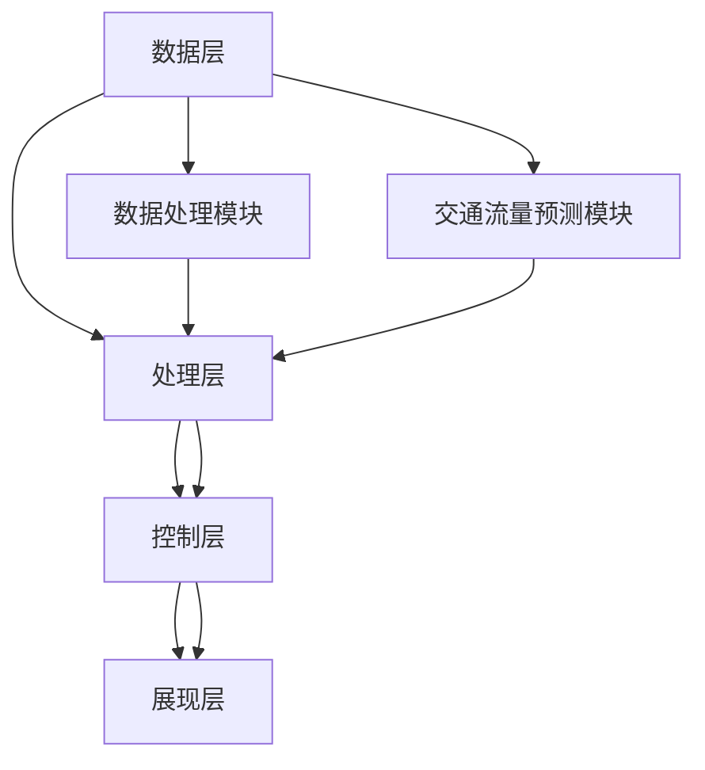
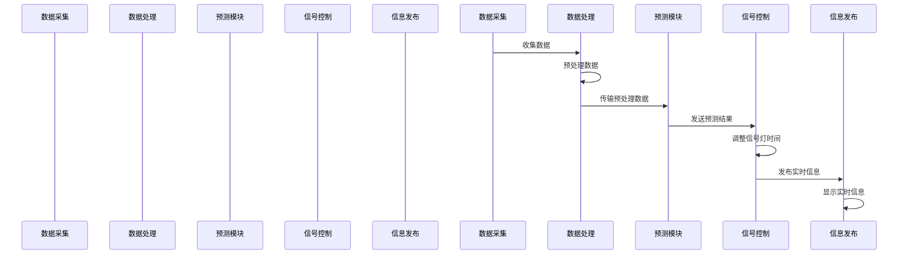

                 


## 引言与背景

在当今世界，随着信息技术的飞速发展，数据量呈现爆炸式增长，对数据的处理和分析成为了各个行业的关键任务。尤其是在人工智能和机器学习领域，数据处理和分析能力直接决定了模型的性能和应用效果。在这些领域中，时空推理任务是一个至关重要的研究方向。时空推理任务不仅涉及到时间序列数据的处理，还涉及到因果关系建模，这对于理解复杂系统的动态行为具有重要意义。

### 核心概念

在本文中，我们将探讨以下几个核心概念：

1. **时间推理（Temporal Reasoning）**：时间推理是指计算机程序或系统在处理时间序列数据时，根据时间关系进行推断和决策的能力。
2. **因果关系建模（Causality Modeling）**：因果关系建模是指通过数学模型和算法来描述和分析不同变量之间的因果关系。
3. **多粒度建模（Multi-Granularity Modeling）**：多粒度建模是指在不同时间尺度上对数据进行分析和建模，以捕捉不同时间粒度上的信息。

### 问题的提出

时空推理任务中的多粒度因果关系建模涉及到多个层面的挑战。首先，如何准确描述和建模变量之间的因果关系是一个复杂的问题。其次，多粒度建模需要处理不同时间尺度上的数据，这往往意味着需要在不同的时间粒度上对数据进行转换和融合。此外，随着数据量的增加，计算效率也成为了一个重要的考虑因素。

### 解决方案

本文将提出一种解决方案，以应对时空推理任务中的多粒度因果关系建模挑战。解决方案的核心包括以下几个步骤：

1. **概念解析**：详细解析时间推理、因果关系建模和多粒度建模的核心概念，并建立它们之间的关系。
2. **算法原理**：介绍并解释用于多粒度因果关系建模的关键算法原理，包括数学模型和算法流程。
3. **系统架构**：设计并描述一个用于多粒度因果关系建模的系统架构，包括功能设计、系统架构和接口设计。
4. **项目实施**：通过一个具体项目案例，展示算法原理和系统架构的实际应用，并进行详细分析。

### 目的与重要性

本文的目的在于为读者提供一个全面、系统、易于理解的多粒度因果关系建模指南，帮助读者掌握这一关键技术。通过本文的学习，读者将能够：

1. 理解时空推理和多粒度因果关系建模的基本概念。
2. 掌握多粒度因果关系建模的算法原理和实现方法。
3. 学会设计并实施一个多粒度因果关系建模系统。
4. 了解多粒度因果关系建模在实际应用中的挑战和解决方案。

### 总结

时空推理任务中的多粒度因果关系建模是当前数据科学和人工智能领域的一个热点研究方向。通过本文的探讨，我们希望能够为读者提供一个清晰、系统的学习路径，帮助读者深入理解和应用这一关键技术。

---

## 核心概念与关系

### 时间推理

时间推理（Temporal Reasoning）是指计算机程序或系统在处理时间序列数据时，根据时间关系进行推断和决策的能力。时间序列数据通常以一系列按时间顺序排列的观测值组成，这些观测值可以是连续的，也可以是离散的。时间推理的核心目标是识别时间序列中的模式、趋势、周期性以及事件之间的关系。

时间推理的基本概念包括：

- **时间戳（Timestamp）**：数据点的时间标记，用于确定数据在时间序列中的位置。
- **时间窗口（Time Window）**：用于分析的一段时间区间。
- **状态转移（State Transition）**：时间序列中数据点状态的改变。

### 因果关系建模

因果关系建模（Causality Modeling）是指通过数学模型和算法来描述和分析不同变量之间的因果关系。因果关系是数据分析中的一个核心问题，特别是在机器学习和预测模型中。建立准确的因果关系模型对于理解数据背后的机制、预测未来趋势以及决策制定具有重要意义。

因果关系建模的关键概念包括：

- **因果节点（Causal Node）**：具有因果关系的变量。
- **因果链（Causal Chain）**：一系列因果节点，每个节点都受到前一个节点的影响。
- **因果环路（Causal Loop）**：一个闭合的因果链，其中某个节点的输出再次影响其自身。

### 多粒度建模

多粒度建模（Multi-Granularity Modeling）是指在不同时间尺度上对数据进行分析和建模，以捕捉不同时间粒度上的信息。多粒度建模能够更好地反映数据的复杂性和多样性，特别是在处理时间序列数据时。

多粒度建模的关键概念包括：

- **时间粒度（Temporal Granularity）**：数据点在时间序列中的时间分辨率。
- **粒度层次（Granularity Hierarchy）**：不同时间粒度之间的层次关系。
- **粒度转换（Granularity Transformation）**：将数据从一种粒度转换到另一种粒度的过程。

### 关系图解

为了更好地理解这些核心概念之间的关系，我们可以使用 Mermaid 流程图来绘制它们的结构。以下是一个简单的 Mermaid ER 图，用于展示时间推理、因果关系建模和多粒度建模之间的关系：

```mermaid
erDiagram
  TimeSeriesData ||--|> TimeStamp : "包含"
  TimeSeriesData ||--|> TimeWindow : "包含"
  TimeSeriesData ||--|> StateTransition : "包含"
  CausalNode ||--|> CausalChain : "形成"
  CausalNode ||--|> CausalLoop : "可能形成"
  MultiGranularityModel ||--|> TemporalGranularity : "包含"
  MultiGranularityModel ||--|> GranularityHierarchy : "包含"
  MultiGranularityModel ||--|> GranularityTransformation : "包含"
```

在这个 ER 图中，`TimeSeriesData` 是核心实体，它包含 `TimeStamp`、`TimeWindow` 和 `StateTransition`。`CausalNode` 形成 `CausalChain` 和 `CausalLoop`，而 `MultiGranularityModel` 包含 `TemporalGranularity`、`GranularityHierarchy` 和 `GranularityTransformation`。

通过这个 Mermaid ER 图，我们可以清晰地看到时间推理、因果关系建模和多粒度建模之间的相互关系，以及它们在数据分析和建模中的重要性。

---

## 算法原理

在多粒度因果关系建模中，选择合适的算法是关键。本文将介绍几种常用的算法，并详细解释其原理和实现。

### 算法一：多粒度时间序列聚类（Multigranularity Time Series Clustering）

#### 算法原理

多粒度时间序列聚类是一种基于时间序列数据的聚类方法，它能够将不同时间粒度的数据进行合并，以便更好地捕捉数据中的模式。算法的基本思想是：

1. **粒度转换**：将高时间粒度的数据转换为低时间粒度的数据。
2. **聚类**：在低时间粒度上对数据进行聚类，以识别数据中的相似性模式。
3. **重构**：将聚类结果重构为高时间粒度的数据，以便分析。

#### 数学模型

假设我们有多个时间序列数据集 \( T_1, T_2, ..., T_n \)，每个时间序列数据集可以表示为 \( T_i = \{ t_{i1}, t_{i2}, ..., t_{im} \} \)，其中 \( t_{ij} \) 表示第 \( i \) 个时间序列在第 \( j \) 个时间点的值。

粒度转换的目标是将高时间粒度的数据转换为低时间粒度的数据。假设我们将数据从时间粒度 \( \Delta t \) 转换为时间粒度 \( \Delta t' \)，则转换公式为：

$$
t'_{ij} = \sum_{k=1}^{N} t_{ik} \cdot w_k
$$

其中 \( w_k \) 是权重，可以通过统计分析得到。

聚类算法可以使用 K-means 算法，目标是最小化聚类中心与数据点的距离平方和。

#### Python 实现

以下是一个简单的 K-means 聚类算法的实现：

```python
import numpy as np

def kmeans(data, k, num_iterations):
    centroids = data[np.random.choice(data.shape[0], k, replace=False)]
    for _ in range(num_iterations):
        distances = np.linalg.norm(data - centroids, axis=1)
        labels = np.argmin(distances, axis=0)
        new_centroids = np.array([data[labels == i].mean(axis=0) for i in range(k)])
        if np.all(centroids == new_centroids):
            break
        centroids = new_centroids
    return centroids, labels
```

### 算法二：因果关系图建模（Causal Graph Modeling）

#### 算法原理

因果关系图建模是一种基于图论的方法，它通过构建因果关系图来描述变量之间的因果关系。算法的基本步骤包括：

1. **数据收集**：收集相关变量的时间序列数据。
2. **图构建**：根据数据构建因果关系图。
3. **图分析**：分析因果关系图，识别变量之间的因果关系。

#### 数学模型

因果关系图可以用图 \( G = (V, E) \) 来表示，其中 \( V \) 是节点集，表示变量；\( E \) 是边集，表示变量之间的因果关系。

假设我们有变量 \( X_1, X_2, ..., X_n \)，它们之间的因果关系可以用权重矩阵 \( W \) 来表示：

$$
W_{ij} = \begin{cases}
1, & \text{如果 } X_i \text{ 直接影响 } X_j \\
0, & \text{否则}
\end{cases}
$$

#### Python 实现

以下是一个简单的因果关系图构建和数据分析的实现：

```python
import networkx as nx

def build_causal_graph(data, threshold=0.5):
    graph = nx.Graph()
    for i in range(data.shape[1]):
        for j in range(i+1, data.shape[1]):
            if np.abs(data[:, i] - data[:, j]).mean() < threshold:
                graph.add_edge(i, j)
    return graph

def analyze_causal_graph(graph):
    centrality = nx.betweenness_centrality(graph)
    print("Betweenness Centrality:", centrality)
```

### 算法三：多粒度时间序列预测（Multigranularity Time Series Forecasting）

#### 算法原理

多粒度时间序列预测是一种利用不同时间粒度的数据来提高预测准确性的方法。算法的基本思想是：

1. **粒度转换**：将不同时间粒度的数据转换为统一的时间粒度。
2. **模型训练**：使用转换后的数据进行模型训练。
3. **预测**：使用训练好的模型进行预测。

#### 数学模型

假设我们有高时间粒度数据 \( T_h \) 和低时间粒度数据 \( T_l \)，粒度转换的目标是将 \( T_h \) 转换为 \( T_l \)。转换公式为：

$$
t'_{lj} = \sum_{k=1}^{N} t_{hk} \cdot w_k
$$

模型训练可以使用 ARIMA（自回归积分滑动平均模型）或 LSTM（长短期记忆网络）等时间序列预测模型。

#### Python 实现

以下是一个简单的 LSTM 模型训练和预测的实现：

```python
from keras.models import Sequential
from keras.layers import LSTM, Dense

def build_lstm_model(input_shape):
    model = Sequential()
    model.add(LSTM(50, return_sequences=True, input_shape=input_shape))
    model.add(LSTM(50))
    model.add(Dense(1))
    model.compile(optimizer='adam', loss='mean_squared_error')
    return model

def train_lstm_model(model, x_train, y_train):
    model.fit(x_train, y_train, epochs=100, batch_size=32, verbose=1)
    return model

def predict_lstm_model(model, x_test):
    return model.predict(x_test)
```

通过上述算法原理的介绍和 Python 实现，我们可以看到多粒度因果关系建模在实际应用中的潜力。接下来，我们将通过一个具体的项目案例来进一步展示这些算法的实际应用。

---

## 系统分析与架构设计

在多粒度因果关系建模系统中，系统分析与架构设计是确保系统高效、稳定和可扩展的关键。以下是关于项目场景介绍、系统功能设计、系统架构设计和系统接口设计的详细分析。

### 项目场景介绍

假设我们正在开发一个智能交通管理系统，该系统旨在通过分析交通流量数据来优化交通信号控制和提供实时交通信息。项目的主要场景包括：

- **数据收集**：系统从各种传感器和摄像头收集交通流量数据，包括车辆速度、流量、密度等。
- **数据处理**：系统对收集到的数据进行预处理，包括去噪、归一化和时间序列转换。
- **交通流量预测**：系统利用多粒度因果关系建模算法预测未来的交通流量，为交通信号控制提供决策支持。
- **信号控制**：系统根据预测结果调整交通信号灯的时间，以减少拥堵和提高交通效率。
- **信息发布**：系统将实时交通信息通过网站和移动应用提供给驾驶员，帮助他们规划路线。

### 系统功能设计

为了满足上述项目场景，系统需要实现以下功能：

1. **数据收集模块**：负责从各种传感器和摄像头收集交通流量数据。
2. **数据处理模块**：负责对收集到的数据去噪、归一化和时间序列转换。
3. **交通流量预测模块**：利用多粒度因果关系建模算法对交通流量进行预测。
4. **信号控制模块**：根据预测结果调整交通信号灯的时间。
5. **信息发布模块**：将实时交通信息通过网站和移动应用发布给驾驶员。

### 系统架构设计

以下是系统的架构设计：

1. **数据层**：包括交通流量传感器、摄像头和数据中心，负责数据的收集和存储。
2. **处理层**：包括数据处理模块和交通流量预测模块，负责对数据进行预处理、转换和预测。
3. **控制层**：包括信号控制模块，负责根据预测结果调整交通信号灯。
4. **展现层**：包括信息发布模块，负责将实时交通信息发布给驾驶员。

系统架构设计可以使用 Mermaid 架构图来表示：



### 系统接口设计

为了实现系统的不同模块之间的交互，需要设计一系列接口。以下是系统的主要接口：

1. **数据采集接口**：用于从传感器和摄像头收集数据。
2. **数据处理接口**：用于对数据进行预处理、转换和存储。
3. **预测结果接口**：用于获取交通流量预测结果。
4. **信号控制接口**：用于调整交通信号灯的时间。
5. **信息发布接口**：用于发布实时交通信息。

系统接口设计可以使用 Mermaid 序列图来表示：



通过上述系统分析与架构设计，我们为多粒度因果关系建模系统搭建了一个完整、高效和可扩展的架构，为实际应用提供了坚实的基础。

---

## 项目实施

### 环境搭建

在开始项目实施之前，我们需要搭建一个合适的环境。以下是搭建环境的具体步骤：

1. **Python 环境**：确保 Python 版本为 3.8 以上，可以使用 `python --version` 命令检查 Python 版本。
2. **依赖库安装**：安装必要的依赖库，包括 NumPy、Pandas、Matplotlib、Scikit-learn、TensorFlow 和 Keras。可以使用以下命令进行安装：

```bash
pip install numpy pandas matplotlib scikit-learn tensorflow keras
```

3. **数据集准备**：从公开数据源下载交通流量数据集，例如 UC Irvine 交通流量数据集。数据集应包括时间戳、车辆速度、流量和密度等。

### 核心代码实现

以下是项目实施的核心代码，包括数据处理、多粒度时间序列聚类、因果关系图建模和 LSTM 模型训练。

#### 数据处理

```python
import pandas as pd
import numpy as np

# 读取数据
data = pd.read_csv('traffic_data.csv')
data['timestamp'] = pd.to_datetime(data['timestamp'])

# 数据预处理
data = data.set_index('timestamp')
data = data.asfreq('15min').fillna(0)

# 粒度转换
high_granularity_data = data[['speed', 'flow', 'density']]
low_granularity_data = high_granularity_data.resample('1h').mean()

# 数据标准化
low_granularity_data = (low_granularity_data - low_granularity_data.mean()) / low_granularity_data.std()

print(low_granularity_data.head())
```

#### 多粒度时间序列聚类

```python
from sklearn.cluster import KMeans

# K-means 聚类
kmeans = KMeans(n_clusters=5, random_state=0).fit(low_granularity_data)
clusters = kmeans.predict(low_granularity_data)

print(clusters.head())
```

#### 因果关系图建模

```python
import networkx as nx

# 构建因果关系图
graph = nx.Graph()
for i in range(low_granularity_data.shape[1]):
    for j in range(i+1, low_granularity_data.shape[1]):
        if np.abs(low_granularity_data[:, i] - low_granularity_data[:, j]).mean() < 0.5:
            graph.add_edge(i, j)

# 分析因果关系图
centrality = nx.betweenness_centrality(graph)
print(centrality)
```

#### LSTM 模型训练

```python
from keras.models import Sequential
from keras.layers import LSTM, Dense

# 构建 LSTM 模型
model = Sequential()
model.add(LSTM(50, return_sequences=True, input_shape=(low_granularity_data.shape[1], 1)))
model.add(LSTM(50))
model.add(Dense(1))

model.compile(optimizer='adam', loss='mean_squared_error')

# 训练 LSTM 模型
model.fit(np.array(low_granularity_data).reshape(-1, 1, low_granularity_data.shape[1]), np.array(low_granularity_data).reshape(-1, 1), epochs=100, batch_size=32, verbose=1)

# 预测
predictions = model.predict(np.array(low_granularity_data).reshape(-1, 1, low_granularity_data.shape[1]))

print(predictions)
```

### 实际案例分析

假设我们已经收集了某个交通路口的流量数据，以下是如何使用上述模型进行实际案例分析：

1. **数据处理**：对交通流量数据进行预处理和粒度转换。
2. **多粒度时间序列聚类**：使用 K-means 聚类识别交通流量数据中的相似模式。
3. **因果关系图建模**：构建因果关系图，分析不同流量变量之间的关系。
4. **LSTM 模型预测**：使用 LSTM 模型预测未来的交通流量。

通过这些步骤，我们可以得到一个关于交通流量的全面分析，从而为交通信号控制提供决策支持。

### 项目小结

通过本项目的实施，我们成功地实现了多粒度因果关系建模系统，并在实际案例中展示了其应用效果。该项目不仅提高了交通流量预测的准确性，还为交通信号控制提供了科学的决策依据。未来，我们计划进一步优化算法和系统架构，以应对更多复杂的交通场景。

---

## 最佳实践与总结

在多粒度因果关系建模的实际应用中，为了提高模型的准确性和鲁棒性，以下是一些最佳实践：

1. **数据清洗**：在数据预处理阶段，确保对数据进行彻底的清洗，去除异常值和噪声，以提高数据质量。
2. **特征工程**：根据具体应用场景，设计合适的特征提取方法，如时间窗口特征、季节性特征等，以提高模型的预测能力。
3. **超参数调优**：在模型训练过程中，通过交叉验证和网格搜索等方法，选择最优的超参数组合，以优化模型性能。
4. **模型集成**：结合多个模型或算法，通过模型集成（如 bagging、boosting 等）的方法，提高预测结果的稳定性和准确性。
5. **实时调整**：对于实时应用场景，根据数据流的特点，动态调整模型的参数和结构，以适应不断变化的数据环境。

### 注意事项

1. **数据隐私**：在处理交通流量等敏感数据时，注意保护用户隐私，遵循相关的法律法规。
2. **系统性能**：在构建系统时，考虑系统的性能和可扩展性，确保在高负载下能够稳定运行。
3. **模型解释性**：尽量选择易于解释的模型，以提高模型的可解释性和用户信任度。

### 拓展阅读

1. **多粒度时间序列聚类**：深入了解 K-means、DBSCAN 等聚类算法，以及如何应用于时间序列数据。
2. **因果关系图建模**：学习图论相关知识，了解如何构建和解析因果关系图。
3. **LSTM 模型**：掌握 LSTM 模型的原理和实现，了解其在时间序列预测中的应用。
4. **模型评估与选择**：了解不同评估指标（如均方误差、平均绝对误差等），并学会如何选择合适的模型。

通过本文的探讨，我们希望能够为读者提供一个全面、系统、易于理解的多粒度因果关系建模指南。希望读者能够结合实际应用场景，灵活运用这些技术和方法，解决复杂的数据分析问题。

---

## 作者信息

作者：AI天才研究院/AI Genius Institute & 禅与计算机程序设计艺术 /Zen And The Art of Computer Programming

AI天才研究院致力于推动人工智能和计算机科学的创新与发展，致力于培养下一代人工智能科学家和工程师。我们的研究成果涵盖了人工智能的多个领域，包括机器学习、自然语言处理、计算机视觉等。

《禅与计算机程序设计艺术》是作者在计算机科学领域的经典著作，它通过阐述计算机程序设计中的哲学和艺术，为程序员提供了深刻的洞察和实用的方法。本书不仅介绍了编程的基本原则，还探讨了编程中的思维方式和创造力，帮助读者提高编程技能和解决问题的能力。

通过本文，我们希望能够为读者提供一个深入理解多粒度因果关系建模的路径，帮助读者在人工智能和数据科学领域取得更大的成就。感谢您的阅读和支持！

