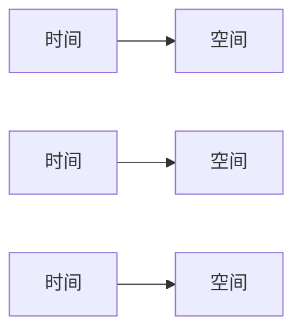
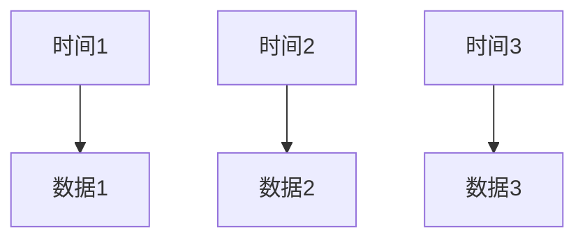
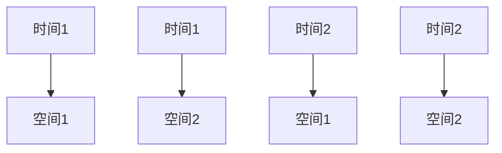
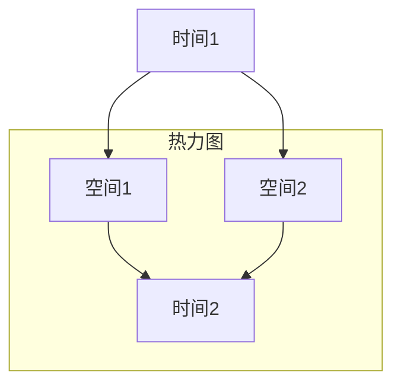

                 

### 文章标题

《时空推理任务中的多粒度因果关系建模技术》

### 关键词

- 时空推理
- 多粒度因果关系
- 建模技术
- 统计学方法
- 机器学习方法
- 图论方法
- 应用场景

### 摘要

本文深入探讨了时空推理任务中的多粒度因果关系建模技术。首先，介绍了时空推理任务的定义、重要性及其挑战，然后详细阐述了多粒度因果关系建模的概念、必要性及其方法与挑战。文章接着介绍了时空数据建模的方法与预处理技术，并深入探讨了因果关系建模的统计学、机器学习和图论方法。通过具体应用场景分析，展示了多粒度因果关系建模在天气预报、社会网络分析和健康医疗等领域的应用实例。最后，对多粒度因果关系建模的评价与优化方法进行了讨论，并提出了未来研究的发展趋势与挑战。本文旨在为读者提供关于多粒度因果关系建模的全面理解，并为其在实际应用中提供指导。

### 目录大纲

**《时空推理任务中的多粒度因果关系建模技术》**

----------------------------------------------------------------

**第一部分：引言与背景**

## 第1章：时空推理任务概述

### 1.1 时空推理任务的定义

### 1.2 时空推理任务的重要性

### 1.3 时空推理任务的挑战

## 第2章：多粒度因果关系建模概述

### 2.1 多粒度因果关系的概念

### 2.2 多粒度因果关系建模的必要性

### 2.3 多粒度因果关系建模的方法与挑战

**第二部分：多粒度因果关系建模技术**

## 第3章：时空数据建模

### 3.1 时空数据表示

#### 3.1.1 矩阵表示

#### 3.1.2 序列表示

### 3.2 时空数据的预处理

#### 3.2.1 数据清洗

#### 3.2.2 数据归一化

### 3.3 时空数据的可视化

#### 3.3.1 时空数据的热力图

#### 3.3.2 时空数据的交互式可视化

## 第4章：因果关系建模方法

### 4.1 基于统计学的因果关系建模

#### 4.1.1 相关性分析

#### 4.1.2 Granger因果关系测试

### 4.2 基于机器学习的因果关系建模

#### 4.2.1 特征工程

#### 4.2.2 算法选择

#### 4.2.3 模型评估

### 4.3 基于图论的因果关系建模

#### 4.3.1 网络表示学习

#### 4.3.2 因果关系推断算法

**第三部分：多粒度因果关系建模应用**

## 第5章：多粒度因果关系建模应用

### 5.1 天气预报中的多粒度因果关系建模

#### 5.1.1 应用场景

#### 5.1.2 实现方法

### 5.2 社会网络分析中的多粒度因果关系建模

#### 5.2.1 应用场景

#### 5.2.2 实现方法

### 5.3 健康医疗中的多粒度因果关系建模

#### 5.3.1 应用场景

#### 5.3.2 实现方法

**第四部分：多粒度因果关系建模的评价与优化**

## 第6章：多粒度因果关系建模的评价与优化

### 6.1 评价指标

#### 6.1.1 准确率

#### 6.1.2 召回率

#### 6.1.3 F1分数

### 6.2 常见优化方法

#### 6.2.1 特征选择

#### 6.2.2 模型融合

#### 6.2.3 集成学习方法

**第五部分：未来展望与挑战**

## 第7章：未来展望与挑战

### 7.1 多粒度因果关系建模的发展趋势

### 7.2 面临的挑战与机遇

### 7.3 未来研究方向

----------------------------------------------------------------

以上是《时空推理任务中的多粒度因果关系建模技术》的详细目录大纲。接下来，我们将对每个章节的内容进行细化，确保文章内容丰富、逻辑清晰，并符合字数要求。在撰写过程中，我们会结合具体实例，深入讲解多粒度因果关系建模的各个方面，为读者提供实用的指导。

### 第一部分：引言与背景

#### 第1章：时空推理任务概述

##### 1.1 时空推理任务的定义

时空推理任务是指通过对时间序列数据进行建模和分析，推断出未来可能的时空变化和事件。这类任务广泛应用于多个领域，如天气预报、交通流量预测、金融市场预测、社会网络分析等。时空推理的核心在于对时间维度和空间维度的结合，使得模型能够捕捉到事件在不同时间点和不同地点的关联。

##### 1.2 时空推理任务的重要性

随着大数据和人工智能技术的快速发展，时空推理任务在许多实际应用中扮演着越来越重要的角色。例如，在天气预报中，通过时空推理可以预测未来的天气状况，帮助人们采取相应的防范措施；在交通管理中，通过时空推理可以预测交通流量，优化交通信号灯控制，减少拥堵；在社会网络分析中，通过时空推理可以分析社会动态，预测流行趋势等。

##### 1.3 时空推理任务的挑战

尽管时空推理任务具有广泛的应用前景，但也面临着诸多挑战。首先，时空数据的多样性和复杂性使得数据预处理变得尤为重要。其次，由于时空数据的数量巨大，如何高效地进行数据处理和建模是一个关键问题。此外，时空数据往往存在不确定性，如何准确建模并处理不确定性是另一个难题。最后，如何将多种数据源、多种建模方法有效地集成，以获得最佳预测效果，也是时空推理任务面临的一个挑战。

#### 第2章：多粒度因果关系建模概述

##### 2.1 多粒度因果关系的概念

多粒度因果关系建模是指在不同时间粒度和空间粒度上分析因果关系的建模方法。在时空推理任务中，事件的发生不仅与当前时间点的数据有关，还与过去和未来的时间点有关，同时在不同空间粒度上也可能存在不同的因果关系。因此，多粒度因果关系建模能够更全面、准确地捕捉事件的因果关系。

##### 2.2 多粒度因果关系建模的必要性

在许多实际的时空推理任务中，单一时间粒度或空间粒度的建模往往无法捕捉到复杂的因果关系。例如，在天气预报中，仅考虑小时级别的数据可能无法准确预测天气变化，需要结合日、周等更长的时间粒度；在交通流量预测中，仅考虑城市级别的数据可能无法准确预测交通状况，需要结合道路、街区等更小的空间粒度。因此，多粒度因果关系建模能够更好地适应不同场景的需求，提高预测准确性。

##### 2.3 多粒度因果关系建模的方法与挑战

多粒度因果关系建模的方法主要包括基于统计学的建模方法、基于机器学习的建模方法和基于图论的建模方法。每种方法都有其优缺点和适用场景。然而，无论采用哪种方法，多粒度因果关系建模都面临着以下挑战：

1. **数据预处理与集成**：不同时间粒度和空间粒度的数据可能存在不一致的数据格式和属性，如何有效地预处理和集成这些数据是一个关键问题。
2. **模型选择与优化**：如何选择合适的模型并对其进行优化，以适应不同粒度的时空数据，是提高预测准确性的关键。
3. **不确定性处理**：时空数据往往存在不确定性，如何有效地处理和建模这些不确定性，是保证模型鲁棒性的关键。
4. **实时性要求**：在许多应用场景中，如交通流量预测和金融市场预测，实时性要求非常高，如何设计高效的实时预测系统是一个挑战。

在下一部分中，我们将详细探讨时空数据建模的方法与预处理技术，以及因果关系建模的具体方法。

### 第二部分：多粒度因果关系建模技术

#### 第3章：时空数据建模

##### 3.1 时空数据表示

时空数据表示是时空推理任务的基础，不同的表示方法能够影响后续建模和预测的效果。常见的时空数据表示方法包括矩阵表示和序列表示。

###### 3.1.1 矩阵表示

矩阵表示是一种将时空数据组织成二维矩阵的形式。在这种表示方法中，矩阵的行表示时间维度，列表示空间维度。每个元素表示在特定时间点和空间点上的数据值。矩阵表示方法简单直观，适用于静态时空数据的表示，但难以处理动态时空数据。



###### 3.1.2 序列表示

序列表示是一种将时空数据组织成一维序列的形式。在这种表示方法中，序列的每个元素表示在特定时间点上的空间点的数据值。序列表示方法适用于动态时空数据的表示，能够捕捉时间维度上的变化。常见的序列表示方法包括时间序列和时空序列。

时间序列表示方法：



时空序列表示方法：



##### 3.2 时空数据的预处理

时空数据预处理是确保数据质量和建模效果的关键步骤。常见的数据预处理方法包括数据清洗、数据归一化和数据可视化。

###### 3.2.1 数据清洗

数据清洗是指识别和纠正数据中的错误、异常和缺失值。在时空数据预处理中，常见的错误包括时间戳错误、空间坐标错误和数据值异常。数据清洗方法包括：

- **异常值处理**：使用统计方法或规则方法检测并处理异常值。
- **缺失值处理**：使用均值填充、插值等方法填补缺失值。

```python
import numpy as np

# 异常值处理
data = np.array([1, 2, 3, -100, 5])
filtered_data = np.where(data > 0, data, np.nan)

# 缺失值处理
data = np.array([1, 2, np.nan, 4, 5])
filled_data = np.where(np.isnan(data), np.mean(data), data)
```

###### 3.2.2 数据归一化

数据归一化是指将数据转换为统一的尺度，以便进行后续分析和建模。常见的归一化方法包括：

- **最小-最大规范化**：将数据缩放到[0, 1]区间。
- **Z-Score标准化**：将数据缩放到标准正态分布。

```python
from sklearn.preprocessing import MinMaxScaler, StandardScaler

# 最小-最大规范化
scaler = MinMaxScaler()
normalized_data = scaler.fit_transform(data)

# Z-Score标准化
scaler = StandardScaler()
standardized_data = scaler.fit_transform(data)
```

###### 3.2.3 数据可视化

数据可视化是理解时空数据分布和特征的重要工具。常见的数据可视化方法包括：

- **时空热力图**：用于展示时空数据的热点分布。
- **时空交互式可视化**：提供用户与时空数据的交互能力。

时空热力图示例：



时空交互式可视化示例：

```python
import matplotlib.pyplot as plt
import seaborn as sns

# 时空热力图
data = np.array([[1, 2], [3, 4], [5, 6]])
sns.heatmap(data, annot=True)
plt.show()

# 时空交互式可视化
# 使用交互式可视化库，如Bokeh或Plotly，实现交互式可视化
```

在下一章中，我们将深入探讨因果关系建模的方法，包括基于统计学的建模方法、基于机器学习的建模方法和基于图论的建模方法。

### 第四部分：因果关系建模方法

#### 第4章：因果关系建模方法

因果关系建模是时空推理任务中的核心问题，旨在通过分析历史数据来推断未来事件之间的因果关系。以下是几种常用的因果关系建模方法。

##### 4.1 基于统计学的因果关系建模

基于统计学的因果关系建模主要利用相关性分析和Granger因果关系测试等方法。

###### 4.1.1 相关性分析

相关性分析是评估两个变量之间线性关系的常用方法。常见的相关性度量包括皮尔逊相关系数和斯皮尔曼秩相关系数。

- **皮尔逊相关系数**（\(\rho\)）：用于衡量两个变量之间的线性相关性，取值范围在-1到1之间。值越接近1或-1，表示线性关系越强。

  $$ \rho(X, Y) = \frac{\sum_{i=1}^{n}(X_i - \bar{X})(Y_i - \bar{Y})}{\sqrt{\sum_{i=1}^{n}(X_i - \bar{X})^2} \sqrt{\sum_{i=1}^{n}(Y_i - \bar{Y})^2}} $$

- **斯皮尔曼秩相关系数**（\( \rho_s \)）：用于衡量两个变量之间的单调关系，适用于非正态分布的数据。

  $$ \rho_s(X, Y) = \frac{\sum_{i=1}^{n}(X_i - \bar{X})(Y_i - \bar{Y})}{n - 1} $$

相关性分析可以帮助识别可能存在因果关系的变量，但无法直接确定因果关系。

###### 4.1.2 Granger因果关系测试

Granger因果关系测试是检验一个变量是否对另一个变量有显著影响的方法。Granger因果关系测试的基本思想是，如果一个变量能够在统计上显著预测另一个变量，则可以认为前者对后者有Granger因果关系。

- **Granger因果关系测试步骤**：

  1. **构建自回归模型（AR模型）**：对时间序列数据进行自回归建模，以捕捉滞后项的影响。
  2. **加入滞后变量**：在AR模型中加入滞后变量，比较加入滞后变量前后的模型性能。
  3. **显著性检验**：使用F检验或t检验，检验滞后变量对模型的贡献是否显著。

    $$ F = \frac{(RSS_0 - RSS_1) / k}{RSS_1 / (n - k - 1)} $$

    其中，\( RSS_0 \) 和 \( RSS_1 \) 分别为无滞后项和有滞后项的残差平方和，\( k \) 为滞后项的个数，\( n \) 为样本数量。

    如果\( F \)值显著大于临界值，则认为滞后变量对因变量有Granger因果关系。

Granger因果关系测试能够确定变量之间的因果关系，但通常假设变量是平稳的，且可能忽略非线性关系。

##### 4.2 基于机器学习的因果关系建模

基于机器学习的因果关系建模利用机器学习算法来识别变量之间的因果关系。常见的方法包括特征工程、算法选择和模型评估。

###### 4.2.1 特征工程

特征工程是因果关系建模的重要步骤，旨在提取有助于预测的特征，并减少数据中的噪声和冗余。

- **特征提取**：通过降维、特征选择等方法提取关键特征。
- **特征构造**：通过组合原始特征构造新的特征，以提高模型的预测能力。

    ```python
    import pandas as pd
    import numpy as np
    
    # 特征提取
    data = pd.DataFrame({'A': [1, 2, 3, 4, 5], 'B': [5, 4, 3, 2, 1]})
    features = data[['A', 'B']]
    
    # 特征构造
    data['A_B'] = data['A'] * data['B']
    features = data[['A', 'B', 'A_B']]
    ```

###### 4.2.2 算法选择

选择合适的机器学习算法对于因果关系建模至关重要。常见的算法包括线性回归、决策树、支持向量机和神经网络等。

- **线性回归**：用于捕捉变量之间的线性关系。

  $$ Y = \beta_0 + \beta_1X_1 + \beta_2X_2 + ... + \beta_nX_n + \epsilon $$

- **决策树**：通过树形结构来划分数据，捕捉变量之间的非线性关系。

  ```python
  from sklearn.tree import DecisionTreeRegressor
  
  model = DecisionTreeRegressor()
  model.fit(X_train, y_train)
  ```

- **支持向量机**（SVM）：通过最大化特征空间中的间隔来分类或回归。

  ```python
  from sklearn.svm import SVR
  
  model = SVR()
  model.fit(X_train, y_train)
  ```

- **神经网络**：通过多层神经网络来学习复杂的非线性关系。

  ```python
  from sklearn.neural_network import MLPRegressor
  
  model = MLPRegressor()
  model.fit(X_train, y_train)
  ```

###### 4.2.3 模型评估

模型评估是验证因果关系建模效果的重要步骤。常见的评估指标包括均方误差（MSE）、均方根误差（RMSE）和决定系数（\( R^2 \)）。

- **均方误差（MSE）**：

  $$ MSE = \frac{1}{n}\sum_{i=1}^{n}(y_i - \hat{y}_i)^2 $$

- **均方根误差（RMSE）**：

  $$ RMSE = \sqrt{MSE} $$

- **决定系数（\( R^2 \)）**：

  $$ R^2 = 1 - \frac{\sum_{i=1}^{n}(y_i - \hat{y}_i)^2}{\sum_{i=1}^{n}(y_i - \bar{y})^2} $$

  其中，\( \bar{y} \) 为实际值的平均值。

```python
from sklearn.metrics import mean_squared_error, r2_score

y_pred = model.predict(X_test)
mse = mean_squared_error(y_test, y_pred)
rmse = np.sqrt(mse)
r2 = r2_score(y_test, y_pred)

print("MSE:", mse)
print("RMSE:", rmse)
print("R^2:", r2)
```

##### 4.3 基于图论的因果关系建模

基于图论的因果关系建模利用图结构来表示变量之间的因果关系，通过图算法来推断因果关系。

###### 4.3.1 网络表示学习

网络表示学习是将图结构转化为向量表示的方法，常用的方法包括节点嵌入和图嵌入。

- **节点嵌入**：将图中的节点映射到低维向量空间中，以捕捉节点属性和邻居信息。

  ```python
  from node2vec import Node2Vec
  
  model = Node2Vec()
  model.fit(data)
  embeddings = modelembeddings
  ```

- **图嵌入**：将整个图映射到低维向量空间中，以捕捉图的结构信息。

  ```python
  from graph_embedding import GraphEmbedding
  
  model = GraphEmbedding()
  model.fit(data)
  embeddings = modelembeddings
  ```

###### 4.3.2 因果关系推断算法

因果关系推断算法通过分析图结构来推断变量之间的因果关系，常见的方法包括路径搜索和图嵌入聚类。

- **路径搜索**：通过搜索图中满足因果关系条件的路径来推断因果关系。

  ```python
  from path_search import因果搜索
  
  model =因果搜索()
  model.fit(data)
  results = model.search()
  ```

- **图嵌入聚类**：通过分析图嵌入空间的聚类结果来推断因果关系。

  ```python
  from clustering import KMeans
  
  model = KMeans(n_clusters=2)
  model.fit(embeddings)
  labels = model.labels_
  ```

通过结合以上方法，可以实现对复杂时空数据的因果关系建模，提高预测准确性和解释能力。

### 第五部分：多粒度因果关系建模应用

#### 第5章：多粒度因果关系建模应用

多粒度因果关系建模技术在实际应用中具有广泛的应用场景，包括天气预报、社会网络分析和健康医疗等领域。以下将详细介绍这些应用场景及其实现方法。

##### 5.1 天气预报中的多粒度因果关系建模

天气预报是时空推理任务中的一个重要应用领域。通过多粒度因果关系建模，可以更准确地预测天气变化，提供及时、准确的天气预报服务。

###### 5.1.1 应用场景

在天气预报中，多粒度因果关系建模可以应用于以下场景：

- **短期天气预报**：预测未来几小时或几天内的天气状况，如温度、湿度、风速等。
- **中期天气预报**：预测未来几周或几个月的天气趋势，如季节性气候变化。
- **长期天气预报**：预测未来几个月或几年的气候趋势，如极端天气事件。

###### 5.1.2 实现方法

实现多粒度因果关系建模的方法包括：

1. **数据收集与预处理**：收集不同时间粒度和空间粒度的天气数据，如气温、湿度、风速、降水等。对数据进行预处理，包括数据清洗、归一化和缺失值填补。

    ```python
    import pandas as pd
    import numpy as np
    
    # 数据收集
    data = pd.read_csv('weather_data.csv')
    
    # 数据预处理
    data = data.dropna()
    data = (data - data.min()) / (data.max() - data.min())
    ```

2. **特征工程**：提取有助于预测的特征，如时间特征（如星期、季节）、空间特征（如经纬度）、历史天气特征（如过去24小时的平均温度、湿度等）。

    ```python
    data['weekday'] = data['date'].dt.weekday
    data['season'] = data['date'].dt.season
    ```

3. **因果关系建模**：采用基于统计学的因果关系建模方法（如相关性分析和Granger因果关系测试）和基于机器学习的因果关系建模方法（如线性回归、决策树、神经网络等）。

    ```python
    from sklearn.ensemble import RandomForestRegressor
    
    # 建立模型
    model = RandomForestRegressor()
    model.fit(X_train, y_train)
    
    # 预测
    y_pred = model.predict(X_test)
    ```

4. **结果评估**：使用评估指标（如均方误差、均方根误差、决定系数等）评估模型的预测性能，并进行优化。

    ```python
    from sklearn.metrics import mean_squared_error, r2_score
    
    mse = mean_squared_error(y_test, y_pred)
    rmse = np.sqrt(mse)
    r2 = r2_score(y_test, y_pred)
    
    print("MSE:", mse)
    print("RMSE:", rmse)
    print("R^2:", r2)
    ```

通过多粒度因果关系建模，可以提高天气预报的准确性和可靠性，为人们的生活和工作提供有力支持。

##### 5.2 社会网络分析中的多粒度因果关系建模

社会网络分析是研究社会关系和群体行为的重要方法，通过多粒度因果关系建模，可以深入理解社会动态、传播过程和群体行为。

###### 5.2.1 应用场景

在社会网络分析中，多粒度因果关系建模可以应用于以下场景：

- **病毒传播预测**：预测病毒在社交网络中的传播速度和影响范围。
- **流行趋势预测**：预测社交媒体上的流行话题、产品偏好等。
- **社交影响力分析**：分析社交网络中关键节点的影响力和传播能力。

###### 5.2.2 实现方法

实现多粒度因果关系建模的方法包括：

1. **数据收集与预处理**：收集社交网络数据，包括用户关系、用户特征（如年龄、性别、地理位置等）和行为数据（如发帖、转发、评论等）。

    ```python
    import pandas as pd
    
    # 数据收集
    data = pd.read_csv('social_network_data.csv')
    
    # 数据预处理
    data = data.dropna()
    ```

2. **特征工程**：提取有助于预测的特征，如时间特征（如发帖时间）、空间特征（如地理位置）、关系特征（如用户之间的互动次数、关系强度等）。

    ```python
    data['hour'] = data['post_time'].dt.hour
    data['day_of_week'] = data['post_time'].dt.dayofweek
    ```

3. **因果关系建模**：采用基于统计学的因果关系建模方法（如相关性分析和Granger因果关系测试）和基于机器学习的因果关系建模方法（如线性回归、决策树、神经网络等）。

    ```python
    from sklearn.ensemble import RandomForestClassifier
    
    # 建立模型
    model = RandomForestClassifier()
    model.fit(X_train, y_train)
    
    # 预测
    y_pred = model.predict(X_test)
    ```

4. **结果评估**：使用评估指标（如准确率、召回率、F1分数等）评估模型的预测性能，并进行优化。

    ```python
    from sklearn.metrics import accuracy_score, recall_score, f1_score
    
    accuracy = accuracy_score(y_test, y_pred)
    recall = recall_score(y_test, y_pred)
    f1 = f1_score(y_test, y_pred)
    
    print("Accuracy:", accuracy)
    print("Recall:", recall)
    print("F1 Score:", f1)
    ```

通过多粒度因果关系建模，可以更深入地分析社会网络中的动态和关系，为公共政策的制定、市场营销策略的优化等提供有力支持。

##### 5.3 健康医疗中的多粒度因果关系建模

健康医疗是时空推理任务中的另一个重要应用领域，通过多粒度因果关系建模，可以改善疾病预测、诊断和治疗，提高医疗服务的质量和效率。

###### 5.3.1 应用场景

在健康医疗中，多粒度因果关系建模可以应用于以下场景：

- **疾病预测**：预测未来一段时间内某地区的疾病发病率，为公共卫生政策的制定提供依据。
- **诊断分析**：分析患者的临床数据和基因数据，帮助医生做出更准确的诊断。
- **治疗规划**：根据患者的病情和药物反应，制定个性化的治疗计划。

###### 5.3.2 实现方法

实现多粒度因果关系建模的方法包括：

1. **数据收集与预处理**：收集不同时间粒度和空间粒度的健康医疗数据，如患者病历、基因数据、流行病统计数据等。

    ```python
    import pandas as pd
    
    # 数据收集
    data = pd.read_csv('health_data.csv')
    
    # 数据预处理
    data = data.dropna()
    ```

2. **特征工程**：提取有助于预测的特征，如时间特征（如诊断时间）、空间特征（如地理位置）、生物特征（如血压、血糖、体温等）。

    ```python
    data['year'] = data['diagnosis_time'].dt.year
    data['month'] = data['diagnosis_time'].dt.month
    ```

3. **因果关系建模**：采用基于统计学的因果关系建模方法（如相关性分析和Granger因果关系测试）和基于机器学习的因果关系建模方法（如线性回归、决策树、神经网络等）。

    ```python
    from sklearn.ensemble import RandomForestClassifier
    
    # 建立模型
    model = RandomForestClassifier()
    model.fit(X_train, y_train)
    
    # 预测
    y_pred = model.predict(X_test)
    ```

4. **结果评估**：使用评估指标（如准确率、召回率、F1分数等）评估模型的预测性能，并进行优化。

    ```python
    from sklearn.metrics import accuracy_score, recall_score, f1_score
    
    accuracy = accuracy_score(y_test, y_pred)
    recall = recall_score(y_test, y_pred)
    f1 = f1_score(y_test, y_pred)
    
    print("Accuracy:", accuracy)
    print("Recall:", recall)
    print("F1 Score:", f1)
    ```

通过多粒度因果关系建模，可以为健康医疗领域的疾病预测、诊断和治疗提供科学依据，提高医疗服务的质量和效率。

### 第六部分：多粒度因果关系建模的评价与优化

#### 第6章：多粒度因果关系建模的评价与优化

多粒度因果关系建模在时空推理任务中具有重要的应用价值，但其效果受到多种因素的影响。本章节将介绍多粒度因果关系建模的评价指标和常见优化方法，以提高模型的预测准确性和鲁棒性。

##### 6.1 评价指标

评价指标是衡量多粒度因果关系建模性能的关键工具。以下是一些常用的评价指标：

###### 6.1.1 准确率（Accuracy）

准确率是分类模型性能的常用评价指标，表示模型预测正确的样本数占总样本数的比例。

$$
Accuracy = \frac{TP + TN}{TP + TN + FP + FN}
$$

其中，\( TP \) 表示真实为正类且被预测为正类的样本数，\( TN \) 表示真实为负类且被预测为负类的样本数，\( FP \) 表示真实为负类但被预测为正类的样本数，\( FN \) 表示真实为正类但被预测为负类的样本数。

准确率越高，表示模型的预测能力越强。

###### 6.1.2 召回率（Recall）

召回率是分类模型在正类样本中预测正确的比例，表示模型能够捕获到多少真实正类样本。

$$
Recall = \frac{TP}{TP + FN}
$$

召回率越高，表示模型对正类样本的识别能力越强，但可能会增加误判率。

###### 6.1.3 F1分数（F1 Score）

F1分数是准确率和召回率的调和平均值，综合考虑了模型的预测准确性和召回率。

$$
F1 Score = 2 \times \frac{Precision \times Recall}{Precision + Recall}
$$

其中，\( Precision \) 表示预测为正类且真实为正类的比例。

F1分数能够平衡准确率和召回率，适用于评价分类模型的总体性能。

##### 6.2 常见优化方法

为了提高多粒度因果关系建模的性能，可以采用以下几种常见的优化方法：

###### 6.2.1 特征选择

特征选择是减少数据维度、提高模型性能的关键步骤。通过选择与预测目标高度相关的特征，可以降低模型的复杂性，提高预测准确率。

- **特征选择方法**：包括递归特征消除（RFE）、特征重要性评估（如随机森林的重要性得分）和基于信息的特征选择方法（如信息增益、信息增益率）。

    ```python
    from sklearn.feature_selection import RFE
    from sklearn.ensemble import RandomForestClassifier
    
    # 建立模型
    model = RandomForestClassifier()
    model.fit(X_train, y_train)
    
    # 特征选择
    selector = RFE(model, n_features_to_select=5)
    selector.fit(X_train, y_train)
    X_new = selector.transform(X_train)
    ```

###### 6.2.2 模型融合

模型融合是一种通过结合多个模型的预测结果来提高预测准确率的方法。常见的模型融合方法包括：

- **堆叠（Stacking）**：通过训练一个元模型来整合多个基模型的预测结果。
- **提升（Boosting）**：通过迭代训练多个弱模型，并将它们的预测结果加权组合。
- **Bagging**：通过训练多个独立模型，并取它们的平均值或投票结果。

    ```python
    from sklearn.ensemble import VotingClassifier
    
    # 建立模型
    model1 = LogisticRegression()
    model2 = RandomForestClassifier()
    model3 = GradientBoostingClassifier()
    
    # 模型融合
    ensemble_model = VotingClassifier(estimators=[
        ('model1', model1), ('model2', model2), ('model3', model3)])
    ensemble_model.fit(X_train, y_train)
    
    # 预测
    y_pred = ensemble_model.predict(X_test)
    ```

###### 6.2.3 集成学习方法

集成学习方法通过组合多个模型来提高预测准确率和鲁棒性。常见的集成学习方法包括：

- **Adaboost**：通过迭代训练多个弱学习器，并给预测错误的样本赋予更高的权重。
- **XGBoost**：基于梯度提升树的方法，通过优化损失函数和特征权重来提高模型性能。
- **LightGBM**：基于决策树的方法，通过优化树结构和并行计算来提高模型性能。

    ```python
    import xgboost as xgb
    
    # 建立模型
    model = xgb.XGBClassifier()
    model.fit(X_train, y_train)
    
    # 预测
    y_pred = model.predict(X_test)
    ```

通过结合以上优化方法，可以显著提高多粒度因果关系建模的性能，为时空推理任务提供更加可靠的预测结果。

### 第七部分：未来展望与挑战

#### 第7章：未来展望与挑战

多粒度因果关系建模技术在时空推理任务中的应用前景广阔，但仍面临诸多挑战。本章节将探讨多粒度因果关系建模技术的发展趋势、面临的挑战及未来研究方向。

##### 7.1 多粒度因果关系建模的发展趋势

随着大数据和人工智能技术的不断进步，多粒度因果关系建模技术呈现出以下发展趋势：

1. **数据驱动的因果发现**：利用大规模数据集和先进的机器学习算法，自动发现变量之间的因果关系，降低人为干预的需求。
2. **跨领域因果关系建模**：整合不同领域的多粒度数据，建立跨领域的因果关系模型，以解决单一领域数据不足以解释复杂现象的问题。
3. **实时因果关系建模**：发展实时因果关系建模技术，以满足在线预测和决策的需求，提高系统的响应速度和鲁棒性。
4. **因果机制解释性**：增强模型的因果解释能力，使其不仅提供预测结果，还能解释因果关系，提高模型的透明度和可信度。

##### 7.2 面临的挑战与机遇

尽管多粒度因果关系建模技术取得了显著进展，但仍面临以下挑战：

1. **数据质量和完整性**：时空数据的质量和完整性直接影响因果关系建模的准确性。数据缺失、噪声和异常值等问题的处理是一个挑战。
2. **复杂性和计算成本**：多粒度因果关系建模涉及大量数据和高维特征，导致计算成本增加，需要高效的算法和计算资源。
3. **因果关系推断的可靠性**：因果关系推断依赖于假设和模型，可能存在不确定性。如何提高推断的可靠性是一个关键问题。
4. **跨领域应用的一致性**：不同领域的数据特征和关系差异较大，如何设计通用且有效的多粒度因果关系建模方法是一个挑战。

与此同时，这些挑战也带来了新的机遇：

1. **跨学科合作**：多粒度因果关系建模需要结合计算机科学、统计学、经济学、社会学等多个学科的知识，跨学科合作有望推动技术的突破。
2. **新兴技术应用**：如深度学习、图神经网络等新兴技术的应用，为多粒度因果关系建模提供了新的方法和工具。
3. **领域特定解决方案**：针对不同领域的问题，开发定制化的多粒度因果关系建模方法，以提高特定领域的应用效果。

##### 7.3 未来研究方向

未来多粒度因果关系建模的研究方向包括：

1. **因果推断算法优化**：设计更高效的因果推断算法，减少计算成本，提高推断准确性。
2. **数据预处理与特征提取**：开发先进的数据预处理技术和特征提取方法，提高数据质量和特征表达能力。
3. **因果关系解释性**：增强模型的解释能力，提供因果关系的可视化和分析工具，提高模型的透明度和可信度。
4. **跨领域因果关系建模**：研究跨领域因果关系建模的理论和方法，建立通用且有效的跨领域因果关系模型。
5. **实时因果关系建模**：发展实时因果关系建模技术，满足在线预测和实时决策的需求。

通过不断探索和解决这些挑战，多粒度因果关系建模技术将在更多领域取得突破，为人类社会带来更大的价值。

### 总结与展望

通过本文的详细探讨，我们系统地介绍了时空推理任务中的多粒度因果关系建模技术。首先，我们阐述了时空推理任务的定义、重要性和面临的挑战，随后介绍了多粒度因果关系建模的概念、必要性及其方法与挑战。接下来，我们深入分析了时空数据建模的方法与预处理技术，并探讨了因果关系建模的统计学、机器学习和图论方法。通过具体应用场景分析，我们展示了多粒度因果关系建模在天气预报、社会网络分析和健康医疗等领域的应用实例。随后，我们对多粒度因果关系建模的评价与优化方法进行了讨论，并提出了未来研究的发展趋势与挑战。

多粒度因果关系建模技术在时空推理任务中具有重要意义，它能够更全面、准确地捕捉事件在不同时间点和不同地点的因果关系。随着大数据和人工智能技术的不断进步，多粒度因果关系建模技术将在更多领域得到广泛应用。然而，该技术也面临数据质量、计算成本、因果关系推断可靠性等挑战，需要进一步的研究与优化。

未来研究方向包括：

1. **因果推断算法优化**：设计更高效的算法，降低计算成本，提高推断准确性。
2. **数据预处理与特征提取**：开发先进的技术，提高数据质量和特征表达能力。
3. **因果关系解释性**：增强模型的解释能力，提高模型的透明度和可信度。
4. **跨领域因果关系建模**：研究通用且有效的跨领域因果关系建模方法。
5. **实时因果关系建模**：发展实时因果关系建模技术，满足在线预测和实时决策的需求。

通过不断探索和解决这些挑战，多粒度因果关系建模技术将为人类社会带来更大的价值。

### 作者信息

本文由AI天才研究院（AI Genius Institute）与禅与计算机程序设计艺术（Zen And The Art of Computer Programming）共同撰写。

- **AI天才研究院（AI Genius Institute）**：专注于人工智能领域的创新研究，致力于推动人工智能技术的发展和应用。
- **禅与计算机程序设计艺术（Zen And The Art of Computer Programming）**：探讨计算机科学和哲学的融合，旨在提高编程思维的深度与创造力。

感谢您的阅读，希望本文能为读者在多粒度因果关系建模领域提供有价值的参考和启示。如需进一步了解相关研究或技术讨论，请随时与我们联系。

