                 

### 1. AI系统设计的现状与挑战

#### 1.1 AI系统的特点与影响

人工智能（AI）作为一门跨越多个学科的技术领域，正以前所未有的速度融入社会发展的方方面面。AI系统设计的核心目标是在有限时间内，通过高度复杂的算法和计算能力，为用户提供高效、精准的服务和决策支持。以下是AI系统的一些主要特点：

1. **自动化与智能化**：AI系统能够自动执行复杂的任务，并具备自我学习和优化能力。
2. **数据处理能力**：AI系统可以处理海量数据，从中提取有价值的信息和模式。
3. **实时性**：许多AI应用需要实时响应，要求系统能够快速处理输入，给出反馈。
4. **自适应与自优化**：AI系统可以根据环境和数据的动态变化，自动调整和优化性能。

AI系统的影响不仅体现在技术层面，更在社会经济、医疗、教育、交通等多个领域带来了深刻的变革。例如，自动驾驶技术的发展有望极大提高交通效率，减少事故发生；智能医疗系统能够辅助医生进行疾病诊断，提高治疗效果；而在金融领域，AI算法可以用于风险管理、欺诈检测等方面，提升业务效率和安全性。

#### 1.2 AI系统设计中的时间与性能权衡

在AI系统设计中，时间与性能的权衡是一个不可回避的核心问题。时间性能指的是系统在完成特定任务时所需的时间与系统性能的平衡。以下是一些关键点：

1. **时间成本**：指系统从开始执行任务到完成任务所需的时间。
2. **性能指标**：通常包括响应时间、吞吐量、准确性、资源利用率等。
3. **权衡关系**：在资源有限的情况下，优化一个性能指标可能会影响另一个性能指标。

例如，增加算法的复杂度可以提高模型的准确性，但会延长响应时间；相反，简化算法可以缩短响应时间，但可能会降低模型的准确性。因此，在设计AI系统时，需要根据实际需求和资源条件，在时间与性能之间找到最佳的平衡点。

#### 1.3 主要挑战与问题探讨

AI系统设计面临的挑战主要可以分为以下几个方面：

1. **计算能力与时间限制**：高精度的AI模型往往需要大量的计算资源，如何在不增加时间成本的情况下提升计算效率，是一个重要问题。
2. **数据质量和数据量**：数据是AI系统的基石，数据质量和数据量直接影响模型的性能。如何在保证数据质量的前提下，快速处理和分析海量数据，是系统设计中的一大难题。
3. **实时性要求**：许多AI应用需要实时响应，如何在有限的计算资源下实现快速、准确的决策，是系统设计的关键挑战。
4. **可扩展性和可维护性**：随着系统规模和应用范围的扩大，如何确保系统的可扩展性和可维护性，是一个长期的挑战。

综上所述，AI系统设计中的时间与性能权衡不仅是一个技术问题，更是一个涉及到资源管理、需求分析、系统优化等多个方面的复杂问题。接下来，我们将进一步探讨时间与性能权衡的理论基础，深入分析在AI系统设计中的具体应用和优化策略。

### 1.4 研究背景与目的

#### 1.4.1 问题背景

随着人工智能技术的快速发展和广泛应用，AI系统设计的复杂性不断增加。在许多实际应用场景中，时间与性能的权衡成为一个关键问题。例如，在自动驾驶领域，系统的响应速度和决策准确性直接关系到车辆和行人的安全；在金融交易中，处理速度的微小差异可能会带来巨大的经济利益或损失。因此，如何在设计AI系统时，在时间与性能之间找到最佳平衡，已成为一个迫切需要解决的关键问题。

当前的研究主要集中于以下几个方面：

1. **算法优化**：通过改进算法结构和计算方法，提升系统的性能和效率。
2. **硬件加速**：利用GPU、TPU等硬件加速技术，提高数据处理速度。
3. **分布式系统架构**：通过分布式计算和微服务架构，提升系统的可扩展性和稳定性。

然而，尽管已有许多研究取得了显著成果，但仍然存在一些不足之处。首先，许多研究侧重于单一方面的优化，缺乏全面的系统化研究；其次，现有研究往往在特定场景下进行，缺乏通用性和可推广性；最后，现有文献对时间与性能权衡的理论基础和实际应用策略的探讨还不够深入。

#### 1.4.2 问题描述

在AI系统设计过程中，时间与性能权衡问题的本质可以概括为以下几点：

1. **时间与性能的矛盾性**：系统在执行任务时，需要快速响应，但复杂的算法和大量的数据处理往往导致响应时间延长。
2. **资源约束**：计算资源（如CPU、内存、存储等）的有限性使得优化时间与性能成为一项挑战。
3. **应用场景多样性**：不同的应用场景对时间和性能的要求各不相同，需要灵活的优化策略。

具体而言，问题描述如下：

- 如何在保证系统性能的前提下，最小化响应时间？
- 如何在有限的计算资源下，实现高效的数据处理和算法执行？
- 如何在不同应用场景中，动态调整优化策略，以实现最佳的时间与性能平衡？

这些问题不仅是理论研究的焦点，也是实际应用中亟待解决的技术难题。

#### 1.4.3 问题解决思路

针对上述问题，本文提出以下解决思路：

1. **多维度优化策略**：从算法、硬件、架构等多个维度进行综合优化，实现时间和性能的最佳平衡。
   - 算法优化：改进现有算法，降低计算复杂度，提升执行效率。
   - 硬件加速：利用GPU、TPU等硬件资源，提高计算速度。
   - 系统架构：采用分布式计算和微服务架构，提升系统的整体性能和稳定性。

2. **动态调整机制**：根据应用场景的动态变化，实时调整优化策略，实现灵活性和适应性。
   - 实时监测：通过实时监控系统性能和资源利用率，动态调整优化参数。
   - 自动化调优：利用机器学习等技术，实现系统的自动化调优。

3. **案例分析与验证**：通过实际案例分析，验证所提出优化策略的有效性和可行性。

具体而言，本文将从以下几个方面进行深入探讨：

- **理论基础**：梳理时间与性能权衡的基本原理，建立优化策略的数学模型。
- **算法优化**：分析现有算法的优缺点，提出改进方案。
- **硬件加速**：探讨GPU、TPU等硬件加速技术在AI系统设计中的应用。
- **系统架构**：分析分布式系统和微服务架构的优势和应用。
- **案例分析**：结合实际应用场景，验证优化策略的有效性。

通过上述思路和方法，本文旨在为AI系统设计中的时间与性能权衡问题提供系统化的解决方案，为实际应用提供理论依据和实践指导。

#### 1.4.4 边界与外延

在研究AI系统设计中的时间与性能权衡问题时，我们需要明确一些边界条件，以便更精准地聚焦核心问题。

1. **边界条件**：
   - **系统规模**：研究主要针对中等规模到大型AI系统，包括分布式系统和单机系统。
   - **计算资源**：考虑的硬件资源包括CPU、GPU、TPU等，不包括极端硬件资源（如量子计算）。
   - **数据类型**：主要针对结构化和半结构化数据，不包括非结构化数据（如文本、图像、音频等）。

2. **外延探讨**：
   - **应用场景**：研究不仅限于特定领域，如自动驾驶、金融交易等，还包括其他AI应用场景。
   - **技术趋势**：关注AI领域的新技术和发展趋势，如联邦学习、边缘计算等，探讨其对时间与性能权衡的影响。
   - **伦理和可持续性**：讨论AI系统设计中可能涉及的伦理问题，如隐私保护、公平性等，并探讨如何实现AI系统的可持续发展。

通过明确边界与外延，本文旨在为AI系统设计中的时间与性能权衡问题提供更加全面和深入的分析，为后续研究和实际应用提供指导。

#### 1.5 核心概念与联系

在深入探讨AI系统设计中的时间与性能权衡问题之前，我们需要梳理一些核心概念，并分析它们之间的联系。以下是本文涉及的主要核心概念及其相关属性和特征。

1. **时间成本**：
   - **定义**：时间成本是指AI系统在完成特定任务时所消耗的时间。
   - **属性**：包括任务执行时间、响应时间、延迟时间等。
   - **特征**：时间成本通常与任务的复杂度和系统的计算资源有关。

2. **性能指标**：
   - **定义**：性能指标是衡量AI系统在完成任务时表现的一系列标准。
   - **属性**：包括吞吐量、准确性、响应时间、资源利用率等。
   - **特征**：性能指标反映了系统的效率、准确性和稳定性。

3. **算法复杂度**：
   - **定义**：算法复杂度是衡量算法效率的重要指标。
   - **属性**：包括时间复杂度和空间复杂度。
   - **特征**：算法复杂度直接影响系统的响应时间和资源消耗。

4. **硬件加速技术**：
   - **定义**：硬件加速技术是指利用专用硬件（如GPU、TPU）来加速AI计算。
   - **属性**：包括计算速度、能耗、成本等。
   - **特征**：硬件加速技术显著提升AI系统的计算性能，但需要考虑硬件资源的限制。

5. **分布式系统架构**：
   - **定义**：分布式系统架构是将计算任务分布到多个节点上，以提高系统的性能和可扩展性。
   - **属性**：包括节点数量、通信效率、容错性等。
   - **特征**：分布式系统架构可以提高系统的处理能力和可靠性，但需要管理复杂的网络通信和负载均衡。

6. **数据预处理**：
   - **定义**：数据预处理是AI系统设计中的关键步骤，用于处理和清洗原始数据。
   - **属性**：包括数据清洗、特征提取、数据标准化等。
   - **特征**：数据预处理直接影响模型的训练效果和计算效率。

7. **机器学习模型**：
   - **定义**：机器学习模型是AI系统的核心组成部分，用于数据分析和决策。
   - **属性**：包括模型类型、训练数据、参数设置等。
   - **特征**：不同类型的机器学习模型在时间和性能方面有显著差异。

为了更直观地展示这些核心概念及其属性特征，我们可以通过一个对比表格进行归纳：

| 核心概念 | 定义 | 属性 | 特征 |
| --- | --- | --- | --- |
| 时间成本 | AI系统完成任务所需的时间 | 任务执行时间、响应时间、延迟时间 | 与任务复杂度和计算资源有关 |
| 性能指标 | 衡量AI系统表现的标准 | 吞吐量、准确性、响应时间、资源利用率 | 反映系统效率、准确性和稳定性 |
| 算法复杂度 | 衡量算法效率的重要指标 | 时间复杂度、空间复杂度 | 影响系统响应时间和资源消耗 |
| 硬件加速技术 | 利用专用硬件加速AI计算 | 计算速度、能耗、成本 | 显著提升计算性能，需考虑资源限制 |
| 分布式系统架构 | 将计算任务分布到多个节点上 | 节点数量、通信效率、容错性 | 提高处理能力和可靠性，需管理复杂网络 |
| 数据预处理 | 处理和清洗原始数据 | 数据清洗、特征提取、数据标准化 | 影响模型训练效果和计算效率 |
| 机器学习模型 | AI系统的核心组成部分 | 模型类型、训练数据、参数设置 | 不同类型模型在时间和性能方面差异显著 |

通过上述表格，我们可以清晰地看到各核心概念的定义、属性和特征，有助于进一步理解AI系统设计中的时间与性能权衡问题。

#### 1.5.2 概念属性特征对比表格

为了更好地理解AI系统设计中的核心概念及其相互关系，我们将上述核心概念的属性和特征进行对比，制作一个详细的对比表格。以下是对时间成本、性能指标、算法复杂度、硬件加速技术、分布式系统架构、数据预处理和机器学习模型七个概念的对比：

| 概念 | 定义 | 主要属性 | 主要特征 | 对比点 |
| --- | --- | --- | --- | --- |
| 时间成本 | AI系统完成任务所需的时间 | 任务执行时间、响应时间、延迟时间 | 与任务复杂度和计算资源相关 | 时间成本是衡量系统性能的关键指标，直接关联任务效率和用户体验 |
| 性能指标 | 衡量AI系统表现的标准 | 吞吐量、准确性、响应时间、资源利用率 | 反映系统效率、准确性和稳定性 | 性能指标决定系统的应用效果，是优化设计的重要目标 |
| 算法复杂度 | 衡量算法效率的重要指标 | 时间复杂度、空间复杂度 | 影响系统响应时间和资源消耗 | 算法复杂度影响系统性能，优化算法是实现高效系统的基础 |
| 硬件加速技术 | 利用专用硬件加速AI计算 | 计算速度、能耗、成本 | 显著提升计算性能，需考虑资源限制 | 硬件加速技术提升系统性能，但受限于硬件资源和成本 |
| 分布式系统架构 | 将计算任务分布到多个节点上 | 节点数量、通信效率、容错性 | 提高处理能力和可靠性，需管理复杂网络 | 分布式系统提升系统性能和可扩展性，但需解决通信和负载均衡问题 |
| 数据预处理 | 处理和清洗原始数据 | 数据清洗、特征提取、数据标准化 | 影响模型训练效果和计算效率 | 数据预处理是模型训练的基础，影响模型性能和训练效率 |
| 机器学习模型 | AI系统的核心组成部分 | 模型类型、训练数据、参数设置 | 不同类型模型在时间和性能方面差异显著 | 机器学习模型决定系统功能和应用效果，需根据任务特点选择和优化 |

通过对比表格，我们可以看到每个核心概念的定义、主要属性和特征，以及它们之间的联系和区别。例如，时间成本和性能指标紧密相关，时间成本是影响性能指标的重要因素；算法复杂度直接影响系统响应时间和资源消耗，是优化设计的关键；硬件加速技术和分布式系统架构通过提升计算能力和系统性能，为实现高效系统提供了技术支持；数据预处理是机器学习模型训练的基础，对模型性能和训练效率有显著影响。

这一对比表格有助于我们更全面地理解AI系统设计中的核心概念，为后续分析和讨论提供参考。在实际的系统设计中，需要综合考虑这些核心概念及其相互关系，以实现时间与性能的最佳权衡。

#### 1.5.3 ER实体关系图架构

为了更好地理解AI系统设计中的核心概念及其关系，我们使用ER（实体-关系）图来展示这些概念之间的实体和关系。以下是一个简化的ER图，描述了时间成本、性能指标、算法复杂度、硬件加速技术、分布式系统架构、数据预处理和机器学习模型之间的主要关系：

```mermaid
erDiagram
    AISystem ||--|{ TimeCost : "影响"
    AISystem ||--|{ Performance : "影响"
    AISystem ||--|{ AlgorithmComplexity : "影响"
    AISystem ||--|{ HardwareAcceleration : "实现"
    AISystem ||--|{ DistributedArchitecture : "实现"
    AISystem ||--|{ DataPreprocessing : "影响"
    AISystem ||--|{ MachineLearningModel : "基于"

    TimeCost ||--|{ ResponseTime : "衡量"
    Performance ||--|{ Accuracy : "衡量"
    Performance ||--|{ Throughput : "衡量"
    Performance ||--|{ ResourceUtilization : "衡量"

    AlgorithmComplexity ||--|{ TimeComplexity : "衡量"
    AlgorithmComplexity ||--|{ SpaceComplexity : "衡量"

    HardwareAcceleration ||--|{ GPU : "类型"
    HardwareAcceleration ||--|{ TPU : "类型"

    DistributedArchitecture ||--|{ NodeCount : "衡量"
    DistributedArchitecture ||--|{ CommunicationEfficiency : "衡量"
    DistributedArchitecture ||--|{ FaultTolerance : "衡量"

    DataPreprocessing ||--|{ DataCleaning : "方法"
    DataPreprocessing ||--|{ FeatureExtraction : "方法"
    DataPreprocessing ||--|{ DataStandardization : "方法"

    MachineLearningModel ||--|{ ModelType : "类型"
    MachineLearningModel ||--|{ TrainingData : "输入"
    MachineLearningModel ||--|{ Parameters : "设置"
```



在这个ER图中：

- **AISystem**是中心实体，表示一个完整的AI系统，与其他概念通过不同的关系相连。
- **TimeCost**、**Performance**、**AlgorithmComplexity**、**HardwareAcceleration**、**DistributedArchitecture**、**DataPreprocessing**和**MachineLearningModel**是主要的子实体，分别代表时间成本、性能指标、算法复杂度、硬件加速技术、分布式系统架构、数据预处理和机器学习模型。
- **ResponseTime**、**Accuracy**、**Throughput**和**ResourceUtilization**是性能指标的具体衡量维度。
- **TimeComplexity**和**SpaceComplexity**是算法复杂度的具体衡量维度。
- **GPU**和**TPU**是硬件加速技术的具体类型。
- **NodeCount**、**CommunicationEfficiency**和**FaultTolerance**是分布式系统架构的具体衡量维度。
- **DataCleaning**、**FeatureExtraction**和**DataStandardization**是数据预处理的具体方法。
- **ModelType**、**TrainingData**和**Parameters**是机器学习模型的具体属性。

ER图清晰地展示了各核心概念之间的实体关系，有助于我们理解AI系统设计中的复杂关系，为后续的系统设计和优化提供参考。通过ER图，我们可以更直观地看到每个概念在系统中的作用和相互影响，从而在设计和优化过程中作出更加科学和合理的决策。

#### 1.6 本章小结

本章通过详细的背景介绍，深入探讨了AI系统设计中的时间与性能权衡问题。我们首先介绍了AI系统的特点与影响，分析了AI系统设计中的时间与性能权衡的基本原理。接着，我们明确了研究背景和目的，详细描述了时间与性能权衡问题的本质和具体挑战，并提出了多维度优化策略、动态调整机制和案例分析等解决思路。此外，本章还详细梳理了相关核心概念，并通过对比表格和ER图展示了各概念之间的联系。这些分析为后续章节的深入探讨奠定了坚实的基础，提供了重要的理论依据和实践指导。

### 2.1 时间与性能的基本原理

#### 2.1.1 时间成本与性能关系的定义

在AI系统设计中，时间成本与性能的关系是一个关键问题。时间成本是指系统从接收输入到输出结果所需的时间，而性能通常包括多个方面，如响应时间、吞吐量、准确性等。这两者之间的关系复杂且相互影响。

**时间成本**：通常定义为一个过程从开始执行到完成所需的时间。在AI系统中，时间成本主要体现在以下几个方面：

1. **计算时间**：模型推理或训练过程中，所需的计算时间是最直接的时间成本。
2. **数据传输时间**：系统在处理数据时，需要在不同的模块或服务器之间传输数据，这一过程也会消耗时间。
3. **I/O时间**：包括磁盘读写、网络传输等，与系统的I/O性能密切相关。

**性能指标**：在AI系统中，性能指标可以定义为系统在不同方面的表现，主要包括：

1. **响应时间**：从接收输入到给出响应的时间，是衡量系统实时性的重要指标。
2. **吞吐量**：单位时间内系统能够处理的数据量或请求量，是衡量系统处理能力的重要指标。
3. **准确性**：模型的预测结果与真实值的接近程度，是衡量模型性能的重要指标。
4. **资源利用率**：系统能够充分利用计算资源的能力，包括CPU、内存、存储等。

#### 2.1.2 时间与性能权衡的基本原理

在AI系统设计中，时间与性能之间的权衡是一个核心问题。以下是一些基本原理：

1. **帕累托最优**：在资源有限的情况下，时间与性能的优化往往存在一个帕累托最优解，即在某一性能指标达到最优的同时，其他性能指标不会进一步优化。

2. **权衡关系**：不同的性能指标之间存在权衡关系。例如，提高模型的准确性可能会增加计算时间；提高吞吐量可能会降低单个任务的响应时间。

3. **约束条件**：系统设计需要在满足一定约束条件（如预算、硬件资源等）的前提下进行。这些约束条件会影响时间与性能的权衡。

#### 2.1.3 时间与性能权衡的数学模型

为了更好地分析和优化AI系统中的时间与性能，我们可以建立一些数学模型。以下是一些常用的模型：

1. **时间-性能函数**：假设有一个时间-性能函数 \( T(P) \)，表示在特定性能 \( P \) 下，系统完成任务所需的时间 \( T \)。该函数可能是一个复杂的非线性函数。

   \[ T(P) = T_0 + f(P) \]

   其中，\( T_0 \) 是一个常数，\( f(P) \) 是性能 \( P \) 的非线性函数。

2. **成本-收益模型**：在时间与性能权衡中，我们经常使用成本-收益模型来评估系统的整体性能。假设成本函数 \( C(T) \) 表示完成任务的总成本，收益函数 \( R(P) \) 表示性能带来的收益。

   \[ C(T) = C_0 + g(T) \]
   \[ R(P) = R_0 + h(P) \]

   其中，\( C_0 \) 和 \( R_0 \) 是常数，\( g(T) \) 和 \( h(P) \) 是成本和收益的非线性函数。

3. **优化目标**：在给定约束条件下，我们的目标是找到时间 \( T \) 和性能 \( P \) 的最优组合，使得总成本最小或总收益最大。这可以通过求解以下优化问题实现：

   \[ \min C(T) + \lambda R(P) \]

   其中，\( \lambda \) 是权重系数，用于平衡成本和收益。

通过上述数学模型，我们可以更系统地分析和优化AI系统中的时间与性能，为实际应用提供理论依据。

### 2.2 时间与性能权衡的策略

在AI系统设计中，时间与性能的权衡至关重要，需要在多个方面进行优化，以实现系统的高效运行。以下是一些常见的时间与性能权衡策略：

#### 2.2.1 时间优化策略

1. **算法优化**：通过改进算法结构和计算方法，可以显著降低计算时间和响应时间。具体方法包括：
   - **算法复杂度优化**：选择合适的算法，降低时间复杂度，如从O(n^2)优化到O(n log n)。
   - **并行计算**：利用多核处理器和GPU等硬件资源，实现任务并行化，加速计算过程。
   - **内存优化**：减少内存访问次数，采用缓存技术，提高数据处理速度。

2. **数据优化**：通过优化数据结构和存储方式，可以减少数据传输和I/O操作的时间。
   - **数据压缩**：对数据进行压缩，减少存储和传输的体积。
   - **索引优化**：建立合适的索引结构，提高数据查询和处理的效率。

3. **系统架构优化**：通过改进系统架构，可以提高系统的响应速度和处理能力。
   - **分布式计算**：采用分布式系统架构，将任务分布到多个节点上，利用并行计算的优势。
   - **负载均衡**：通过负载均衡技术，合理分配计算任务，避免单点瓶颈。

4. **延迟容忍优化**：对于一些对实时性要求不高的应用，可以容忍一定程度的延迟，从而优化系统的性能。
   - **异步处理**：采用异步处理方式，将数据处理和响应分离，减少同步操作的时间。

#### 2.2.2 性能优化策略

1. **硬件加速**：利用硬件加速技术，如GPU、TPU等，可以显著提高系统的计算性能。
   - **GPU加速**：通过GPU的并行计算能力，加速大规模数据处理和模型推理。
   - **TPU加速**：TPU专为机器学习和深度学习设计，可以显著提高计算速度。

2. **模型优化**：通过改进机器学习模型，可以提高模型的性能和预测准确性。
   - **模型选择**：选择适合应用场景的模型，如卷积神经网络（CNN）、递归神经网络（RNN）等。
   - **超参数优化**：通过调整模型的超参数，如学习率、批量大小等，找到最佳配置。

3. **数据预处理**：优化数据预处理过程，可以提高模型的训练效果和推理速度。
   - **特征提取**：提取有效的特征，减少模型的计算量。
   - **数据增强**：通过数据增强技术，增加训练数据多样性，提高模型泛化能力。

4. **资源分配**：合理分配系统资源，可以提高系统的整体性能。
   - **CPU与GPU协同**：合理分配CPU和GPU资源，充分利用硬件优势。
   - **存储优化**：采用SSD等高性能存储设备，减少I/O延迟。

#### 2.2.3 综合权衡策略

在实际应用中，时间与性能的优化需要综合考虑多种策略，以实现最佳效果。以下是一些综合权衡策略：

1. **动态调整**：根据应用场景和系统状态，动态调整时间与性能的优化策略。
   - **实时监控**：通过实时监控系统性能和资源利用率，动态调整优化参数。
   - **自动调优**：利用机器学习等技术，实现系统的自动化调优。

2. **优先级设定**：根据任务的重要性和紧急程度，设定不同的优先级，优先处理关键任务。
   - **动态调度**：通过动态调度算法，优先调度重要任务，提高系统整体性能。

3. **多目标优化**：在时间与性能优化过程中，考虑多个目标，如成本、能耗、可维护性等。
   - **多目标规划**：通过多目标优化算法，找到在多个目标下的最优解。

通过上述时间与性能权衡策略，我们可以为AI系统设计提供系统化的解决方案，实现高效、可靠的系统运行。在实际应用中，需要根据具体需求和场景，灵活选择和组合这些策略，以实现最佳效果。

### 2.3 经典案例分析与讨论

在探讨AI系统设计中的时间与性能权衡问题时，通过实际案例的深入分析能够帮助我们更好地理解这些理论在实际应用中的效果和影响。以下，我们将通过几个经典案例，展示在不同场景下如何实现时间与性能的最佳平衡。

#### 2.3.1 AI系统设计中的成功案例

**案例一：自动驾驶系统**

自动驾驶系统是AI技术的一个重要应用领域，其对时间与性能的要求极高。一个成功案例是特斯拉的自动驾驶系统。特斯拉采用了GPU加速技术，以及高效的深度学习算法，如卷积神经网络（CNN）来处理摄像头和雷达数据。以下是几个关键点：

1. **算法优化**：特斯拉的自动驾驶系统使用了轻量级的CNN模型，通过剪枝和量化技术，大幅减少了模型的参数数量，从而降低了计算复杂度和内存占用。
2. **硬件加速**：特斯拉的车载电脑配备了高性能的GPU，利用GPU的并行计算能力，大大提高了图像处理速度和算法执行效率。
3. **系统架构**：特斯拉的自动驾驶系统采用了分布式架构，将不同功能的模块分布在不同的计算节点上，通过高效的负载均衡，确保了系统的高可用性和响应速度。

**案例效果**：通过上述优化策略，特斯拉的自动驾驶系统在处理速度和准确性方面取得了显著提升，极大地提高了驾驶安全性，同时也满足了实时性的要求。

**案例二：金融交易系统**

金融交易系统对响应速度和准确性要求极高，以毫秒级的时间完成复杂的交易决策。一个成功的案例是高频交易系统，例如美国的MarketAxess。以下是几个关键点：

1. **算法优化**：MarketAxess使用了高效的算法，如蒙特卡洛模拟和随机森林模型，通过优化模型的参数和特征选择，提高了预测的准确性。
2. **硬件加速**：MarketAxess利用了GPU和FPGA等硬件加速技术，实现了快速的数据处理和模型推理。
3. **系统架构**：MarketAxess采用了分布式微服务架构，通过模块化设计，提高了系统的灵活性和可扩展性。

**案例效果**：通过硬件加速和算法优化，MarketAxess的交易系统能够在毫秒级内完成交易决策，大幅提高了交易效率和准确性，为客户创造了巨大的经济价值。

#### 2.3.2 失败案例与经验教训

**案例一：医疗诊断系统**

某医疗公司开发了一款基于AI的疾病诊断系统，但在实际应用中，系统常常无法在规定时间内给出准确的诊断结果，导致用户体验不佳。以下是几个关键点：

1. **算法问题**：系统的算法复杂度较高，导致计算时间过长。公司在选择算法时，没有充分考虑实际应用场景，选择了过于复杂的模型。
2. **硬件限制**：公司使用的服务器性能有限，无法满足高效计算的需求。
3. **数据不足**：系统训练数据不足，导致模型的泛化能力差，实际应用中效果不理想。

**失败原因**：该案例的失败主要是由于算法复杂度过高、硬件资源不足和数据质量差导致的。公司在系统设计时，没有充分进行需求分析和性能测试，导致在真实应用场景中暴露出诸多问题。

**经验教训**：这个案例提醒我们，在AI系统设计中，必须充分考虑实际应用场景，选择合适的算法和硬件资源，并进行充分的性能测试和优化。

**案例二：智能安防系统**

某智能安防公司开发了一套基于AI的监控分析系统，但在实际应用中，系统的延迟较高，常常错过关键事件。以下是几个关键点：

1. **数据预处理不足**：系统在处理大量监控视频数据时，预处理环节耗时较长，导致整体系统响应速度慢。
2. **硬件资源配置不合理**：系统服务器资源分配不合理，导致某些模块的计算能力得不到充分利用。
3. **架构设计缺陷**：系统架构设计存在瓶颈，尤其是在处理高并发请求时，无法有效分担负载。

**失败原因**：该案例的失败主要是由于数据预处理不足、硬件资源配置不合理和架构设计缺陷导致的。公司没有充分考虑到大规模数据处理的复杂性和系统的可扩展性。

**经验教训**：这个案例提醒我们，在AI系统设计中，必须注重数据预处理环节的优化，合理配置硬件资源，并设计高效的系统架构，以确保系统在高并发情况下的稳定运行。

#### 2.3.3 案例对比与启示

通过对上述成功案例和失败案例的对比，我们可以得出以下启示：

1. **充分需求分析**：在系统设计之初，必须进行充分的需求分析，了解实际应用场景的要求和限制。
2. **合理选择算法和硬件**：根据应用场景选择合适的算法和硬件资源，避免过度复杂或资源不足。
3. **优化系统架构**：设计高效的系统架构，确保系统在高并发和复杂应用场景下的稳定性和可扩展性。
4. **性能测试和优化**：进行全面的性能测试，及时发现和优化系统中的瓶颈和缺陷。
5. **持续迭代和改进**：AI系统是一个动态变化的系统，需要持续进行迭代和优化，以适应不断变化的需求和环境。

通过上述案例分析和讨论，我们不仅能够更深入地理解时间与性能权衡的理论，还能在实际应用中提供宝贵的经验和教训，为AI系统设计提供科学和有效的指导。

#### 2.4 本章小结

本章通过对时间与性能权衡基本原理的深入探讨，以及经典案例的详细分析，揭示了AI系统设计中的核心问题。我们首先定义了时间成本与性能指标，并介绍了它们之间的关系。接着，我们提出了时间与性能优化策略，包括算法优化、硬件加速、数据优化和系统架构优化等。通过经典案例，我们展示了成功实现时间与性能平衡的实际方法，并从失败案例中吸取了宝贵的教训。这些理论和实践为后续章节的深入探讨提供了坚实的基础，并为AI系统设计提供了科学和实用的指导。

### 3.1 AI算法的时间与性能优化

#### 3.1.1 算法选择与优化

在AI系统设计中，算法选择与优化是影响时间与性能的关键因素之一。选择合适的算法，并对其进行优化，可以显著提升系统的效率和准确性。以下是一些常见的算法选择与优化方法：

1. **算法选择**：

   - **机器学习算法**：根据任务类型和数据特点，选择合适的机器学习算法。例如，对于分类任务，可以使用逻辑回归、决策树、随机森林、支持向量机（SVM）等；对于回归任务，可以使用线性回归、岭回归、LASSO回归等。不同的算法在计算复杂度和性能上存在差异，需要根据具体需求进行选择。

   - **深度学习算法**：在处理大规模、高维数据时，深度学习算法如卷积神经网络（CNN）、循环神经网络（RNN）、生成对抗网络（GAN）等表现出色。这些算法在图像识别、语音识别、自然语言处理等领域有广泛应用。

2. **算法优化**：

   - **模型简化**：通过模型简化，减少模型的参数数量和计算复杂度，可以降低计算时间和内存消耗。例如，使用轻量级模型如MobileNet、ShuffleNet等，可以显著提高计算效率。

   - **算法剪枝**：算法剪枝是一种通过移除模型中不重要的权重来简化模型的方法。这种方法可以减少计算量和存储需求，同时保持模型的性能。常用的剪枝方法包括结构剪枝和权重剪枝。

   - **量化**：量化是一种将高精度浮点数模型转换为低精度整数模型的方法，从而减少计算量和存储需求。量化可以通过减少精度损失的同时，提高计算速度。

   - **迁移学习**：通过迁移学习，可以将在大规模数据集上训练好的模型应用于新的任务上。这种方法可以减少训练时间，提高模型性能。例如，在图像分类任务中，可以使用预训练的VGG、ResNet等模型。

3. **算法实现**：

   - **并行计算**：利用多核处理器和GPU等硬件资源，实现算法的并行计算，可以显著提高计算速度。例如，深度学习框架如TensorFlow、PyTorch等支持并行计算，可以通过分布式训练和推理加速模型训练和推理。

   - **分布式计算**：通过将计算任务分布到多个节点上，利用分布式计算架构，可以处理大规模数据和复杂任务。例如，Hadoop、Spark等分布式计算框架可以用于大数据处理。

   - **异步处理**：在处理高并发任务时，采用异步处理方式，可以减少同步操作带来的延迟，提高系统吞吐量。例如，使用异步IO和异步HTTP请求，可以显著提高Web服务的性能。

#### 3.1.2 算法实现与优化

算法实现与优化是AI系统设计中的关键环节，以下是一些具体的实现和优化方法：

1. **优化数据结构**：选择合适的数据结构，如哈希表、堆、优先队列等，可以提高算法的执行效率。例如，在排序算法中，使用堆排序比快速排序在特定情况下有更好的性能。

2. **代码优化**：通过代码优化，可以减少不必要的计算和内存占用，提高程序的运行效率。常见的代码优化技术包括循环展开、向量化和并行化等。

3. **内存管理**：合理管理内存，避免内存泄漏和溢出，可以提高系统的稳定性和性能。例如，使用内存池和对象池，可以减少内存分配和释放的开销。

4. **算法融合**：将多个算法融合到一个系统中，可以相互补充，提高整体性能。例如，将深度学习和规则引擎结合，可以在提高预测准确性的同时，保持快速响应。

5. **模型压缩**：通过模型压缩技术，如知识蒸馏、蒸馏学习等，可以将高复杂度的模型压缩为低复杂度的模型，从而减少计算资源和存储需求。

6. **实时监控与调优**：通过实时监控系统性能和资源利用率，动态调整算法参数和系统配置，可以优化系统的运行状态，提高性能和稳定性。

#### 3.1.3 算法评估与验证

算法评估与验证是确保算法性能和可靠性的重要步骤。以下是一些常见的评估与验证方法：

1. **评估指标**：根据任务类型和需求，选择合适的评估指标。常见的评估指标包括准确率、召回率、F1值、均方误差（MSE）等。

2. **交叉验证**：通过交叉验证，可以评估算法在不同数据集上的表现，提高评估结果的可靠性。常用的交叉验证方法包括K折交叉验证和留一验证。

3. **A/B测试**：通过A/B测试，可以在实际应用中比较不同算法或模型的效果，选择最优方案。A/B测试可以帮助我们更直观地了解算法在真实场景中的表现。

4. **性能监控**：通过实时监控系统性能和资源利用率，可以及时发现和解决性能问题，优化算法和系统配置。

5. **安全性和可靠性测试**：在算法评估过程中，还需要进行安全性和可靠性测试，确保算法的稳定性和安全性。例如，通过压力测试和故障注入，评估算法在各种极端条件下的表现。

通过算法选择与优化、算法实现与优化以及算法评估与验证，我们可以为AI系统设计提供高效、稳定和可靠的算法支持，实现时间与性能的最佳平衡。

### 3.2 数据预处理与优化

#### 3.2.1 数据清洗与处理

数据预处理是AI系统设计中的关键步骤，其质量直接影响模型的训练效果和推理性能。数据预处理主要包括数据清洗、数据转换和数据标准化等环节。

1. **数据清洗**：

   - **缺失值处理**：缺失值处理是数据清洗的重要任务。常用的方法包括删除缺失值、使用均值、中位数等方法进行填充。
   - **异常值处理**：异常值可能对模型训练产生负面影响。可以通过箱线图、IQR（四分位差）等方法识别并处理异常值。
   - **重复数据删除**：重复数据不仅浪费存储空间，还可能导致模型过拟合。通过去重操作，可以保证数据的唯一性和准确性。
   - **噪声过滤**：噪声会影响模型的训练效果。可以通过平滑处理、滤波等方法去除噪声，提高数据质量。

2. **数据转换**：

   - **特征工程**：特征工程是数据转换的重要环节。通过选择、构造和转换特征，可以提高模型的预测性能。常见的方法包括归一化、标准化、特征提取、降维等。
   - **编码转换**：对于分类数据，可以使用独热编码（One-Hot Encoding）或标签编码（Label Encoding）等方法，将分类数据转换为数值型数据，以便于模型处理。
   - **时间序列转换**：对于时间序列数据，可以通过差分、对数转换等方法，减少数据的波动性和非线性。

3. **数据标准化**：

   - **归一化**：归一化是将数据缩放到一个固定范围（如[0, 1]或[-1, 1]），以便模型训练。常用的方法包括最小-最大归一化和Z-Score归一化。
   - **标准化**：标准化是通过减去均值并除以标准差，将数据转换为标准正态分布。这种方法有助于减少不同特征之间的量级差异，提高模型的训练效率。

#### 3.2.2 数据量与质量对时间与性能的影响

数据量与数据质量对AI系统的时间与性能有着重要影响。以下是一些具体分析：

1. **数据量**：

   - **数据量增加**：随着数据量的增加，模型的训练时间和推理时间通常会延长。这是因为模型需要处理更多的数据点，计算复杂度增加。
   - **数据量减少**：数据量过少可能导致模型过拟合，降低模型的泛化能力。在特定情况下，减少数据量可能通过使用数据增强技术来弥补。

2. **数据质量**：

   - **高质量数据**：高质量的数据可以提升模型的准确性和稳定性。通过准确的数据清洗和处理，可以减少噪声和异常值，提高数据的可靠性和完整性。
   - **低质量数据**：低质量的数据可能导致模型性能下降，甚至无法收敛。例如，缺失值、异常值和噪声会影响模型的训练过程，导致模型泛化能力差。

3. **数据量与质量的关系**：

   - **平衡**：在实际应用中，需要在数据量和数据质量之间找到平衡点。数据量过多但质量差可能导致训练时间过长且模型不稳定；数据量过少但质量高可能无法充分利用数据优势。

#### 3.2.3 数据预处理工具与框架

为了高效地进行数据预处理，可以借助一些数据预处理工具和框架。以下是一些常用的工具和框架：

1. **Pandas**：

   - **功能**：Pandas是一个强大的数据处理库，支持数据清洗、数据转换和数据标准化等操作。
   - **优点**：易于使用，支持多种数据格式，如CSV、Excel、SQL等。
   - **缺点**：对于大规模数据处理速度较慢。

2. **NumPy**：

   - **功能**：NumPy提供了丰富的数值计算和数据处理功能，适用于数据清洗和预处理。
   - **优点**：高性能，支持多维数组操作。
   - **缺点**：相比Pandas，NumPy在数据清洗和转换方面功能有限。

3. **Scikit-learn**：

   - **功能**：Scikit-learn提供了丰富的数据预处理和机器学习工具，包括特征工程、数据转换、模型评估等。
   - **优点**：集成度高，易于使用，支持多种算法和预处理方法。
   - **缺点**：对于大规模数据处理，性能相对较低。

4. **TensorFlow**：

   - **功能**：TensorFlow是一个深度学习框架，支持数据预处理和模型训练。
   - **优点**：支持大规模数据处理，支持分布式计算。
   - **缺点**：主要用于深度学习任务，数据处理功能相对较弱。

5. **PyTorch**：

   - **功能**：PyTorch是另一个深度学习框架，支持数据预处理和模型训练。
   - **优点**：易于使用，支持动态图计算，适合研究和新算法开发。
   - **缺点**：数据处理功能相对较弱。

通过合理选择和使用数据预处理工具和框架，我们可以高效地进行数据预处理，为AI系统设计提供高质量的数据支持。在实际应用中，可以根据具体需求选择合适的工具和框架，进行数据清洗、转换和标准化，以提高模型的训练效果和推理性能。

### 3.3 硬件加速与优化

#### 3.3.1 GPU与TPU的原理与应用

在现代AI系统设计中，硬件加速技术是提升计算性能和时间效率的关键。GPU（图形处理器单元）和TPU（张量处理器单元）是两种常见的硬件加速器，广泛应用于AI系统的优化和加速。

**GPU原理与应用**：

1. **原理**：

   - **架构**：GPU由大量的核心组成，每个核心可并行处理多个线程。这使得GPU非常适合处理大量并行计算任务，如矩阵运算、图形渲染等。
   - **并行计算**：GPU的核心设计使其在执行重复性计算任务时具有极高的并行处理能力，可以显著提升计算效率。

2. **应用**：

   - **深度学习**：GPU在深度学习模型训练中发挥着重要作用。通过利用GPU的并行计算能力，可以加速神经网络的前向传播和反向传播过程，提高模型训练速度。
   - **图像处理**：在计算机视觉任务中，GPU可以加速图像的卷积运算和特征提取，提高图像识别和分类的效率。
   - **科学计算**：在科学计算领域，如物理模拟、分子建模等，GPU可以处理复杂的计算任务，加速结果的生成。

**TPU原理与应用**：

1. **原理**：

   - **架构**：TPU是专门为机器学习和深度学习设计的硬件加速器。TPU具有高度优化的矩阵运算单元，可以显著提高矩阵乘法和其他计算操作的效率。
   - **优化设计**：TPU针对深度学习模型的特定运算进行了优化，例如深度学习中的矩阵乘法和张量运算，使得其计算效率远高于通用CPU和GPU。

2. **应用**：

   - **大规模训练**：TPU在处理大规模深度学习模型训练时表现出色。通过使用TPU，可以显著缩短模型训练时间，提高训练效率。
   - **实时推理**：TPU在实时推理任务中也具有显著优势，可以快速处理大量的实时请求，确保系统的高响应速度。
   - **高吞吐量应用**：在需要高吞吐量的场景中，如搜索引擎、推荐系统等，TPU可以处理大量的并发请求，提供高效的计算服务。

**GPU与TPU的对比**：

1. **计算性能**：

   - **GPU**：GPU适合处理各种类型的并行计算任务，尤其在图像处理和科学计算领域表现优异。但相比于TPU，GPU在深度学习特定运算上的优化有限。
   - **TPU**：TPU专门为深度学习设计，具有高度优化的矩阵运算单元，使得其在深度学习任务上的计算性能远超GPU。

2. **能效比**：

   - **GPU**：GPU的能效比较高，适合处理多样化的计算任务，但在深度学习任务上的功耗相对较低。
   - **TPU**：TPU的能效比极高，专门针对深度学习任务进行了优化，具有更低的功耗和更高的计算效率。

3. **适用场景**：

   - **GPU**：适合图像处理、科学计算、通用并行计算等领域，具有广泛的适用性。
   - **TPU**：适合大规模深度学习模型训练和实时推理任务，尤其在大数据和实时计算场景中表现出色。

通过合理选择和使用GPU与TPU，可以显著提升AI系统的计算性能和时间效率。在实际应用中，根据具体的任务需求和资源条件，选择合适的硬件加速器，并优化算法和系统架构，可以实现高效、可靠的AI系统设计。

#### 3.3.2 硬件加速技术

在现代AI系统设计中，硬件加速技术是提升计算性能和时间效率的关键。硬件加速技术通过专门设计的硬件设备，可以显著提高AI任务的执行速度，减少响应时间。以下是一些常见的硬件加速技术：

1. **GPU加速**：

   - **原理**：GPU（图形处理器单元）具有大量核心，能够并行处理多个线程，适合处理大量并行计算任务。
   - **应用**：GPU在深度学习、图像处理、科学计算等领域具有广泛应用。通过GPU，可以加速神经网络的前向传播和反向传播过程，提高模型训练速度。

2. **TPU加速**：

   - **原理**：TPU（张量处理器单元）是专门为机器学习和深度学习设计的硬件加速器，具有高度优化的矩阵运算单元，特别适合深度学习任务。
   - **应用**：TPU在大规模深度学习模型训练和实时推理任务中表现出色。通过TPU，可以显著缩短模型训练时间和响应时间。

3. **FPGA加速**：

   - **原理**：FPGA（现场可编程门阵列）是一种可编程逻辑设备，可以根据需求进行编程和配置。FPGA可以高效地执行特定的计算任务，特别适合进行定制化的硬件加速。
   - **应用**：FPGA在实时图像处理、信号处理、加密和加密算法等领域具有广泛应用。通过FPGA，可以实现高度定制化的硬件加速，提高计算效率。

4. **ASIC加速**：

   - **原理**：ASIC（专用集成电路）是专门为特定应用设计的集成电路，具有固定的结构和功能。ASIC可以针对特定的算法和任务进行优化，提供高效的硬件加速。
   - **应用**：ASIC在加密、通信、物联网和工业自动化等领域具有广泛应用。通过ASIC，可以实现高度优化的硬件加速，提高系统的整体性能。

**硬件加速技术对比**：

1. **计算性能**：

   - **GPU**：GPU适合处理多样化的计算任务，具有高并行处理能力，但在深度学习特定运算上的优化有限。
   - **TPU**：TPU专门为深度学习设计，具有高度优化的矩阵运算单元，计算性能远超GPU。
   - **FPGA**：FPGA适合进行定制化的硬件加速，特别适合处理特定的计算任务，计算性能较高。
   - **ASIC**：ASIC针对特定应用进行优化，计算性能最高，但设计成本和灵活性较低。

2. **能效比**：

   - **GPU**：GPU的能效比较高，适合处理多样化的计算任务，但在深度学习任务上的功耗相对较低。
   - **TPU**：TPU的能效比极高，专门针对深度学习任务进行了优化，具有更低的功耗和更高的计算效率。
   - **FPGA**：FPGA的能效比较高，适合进行定制化的硬件加速，但在不同任务上的能效比差异较大。
   - **ASIC**：ASIC的能效比较高，但设计成本和灵活性较低。

3. **适用场景**：

   - **GPU**：适合图像处理、科学计算、通用并行计算等领域，具有广泛的适用性。
   - **TPU**：适合大规模深度学习模型训练和实时推理任务，尤其在大数据和实时计算场景中表现出色。
   - **FPGA**：适合实时图像处理、信号处理、加密和加密算法等领域，具有高度定制化的能力。
   - **ASIC**：适合加密、通信、物联网和工业自动化等领域，具有高度优化的硬件加速。

通过合理选择和应用硬件加速技术，可以实现AI系统的显著性能提升和时间效率优化。在实际应用中，可以根据任务需求和资源条件，选择合适的硬件加速器，并优化算法和系统架构，以实现高效、可靠的AI系统设计。

#### 3.3.3 硬件选择与优化策略

在选择硬件加速器时，需要综合考虑任务需求、性能指标和成本效益，以实现最佳的硬件选择和优化策略。以下是一些具体策略：

1. **任务需求分析**：

   - **计算密集型任务**：对于深度学习模型训练和推理、图像处理、科学计算等计算密集型任务，可以选择GPU或TPU等高性能硬件加速器。GPU适合处理多样化的计算任务，而TPU在深度学习任务上具有显著优势。
   - **实时处理任务**：对于需要实时响应的任务，如自动驾驶、实时监控、实时推荐等，可以选择TPU或FPGA等硬件加速器。TPU在实时推理任务中表现出色，而FPGA适合进行实时图像处理和信号处理。
   - **定制化需求**：对于需要高度定制化的硬件加速任务，如特定的加密算法、信号处理等，可以选择FPGA或ASIC。FPGA适合进行定制化的硬件加速，而ASIC针对特定应用进行优化，具有更高的计算性能。

2. **性能指标评估**：

   - **计算性能**：在硬件选择过程中，需要评估硬件的计算性能，包括每秒浮点运算次数（FLOPS）、吞吐量、响应时间等。对于计算密集型任务，应选择计算性能较高的硬件加速器，如GPU、TPU和ASIC。
   - **能效比**：硬件的能效比（计算性能/功耗）是一个重要的考量因素。在资源有限的情况下，应选择能效比高的硬件加速器，如TPU和FPGA。TPU专门为深度学习任务优化，具有高效的计算性能和较低的功耗；FPGA在实时处理任务中也表现出较高的能效比。

3. **成本效益分析**：

   - **硬件成本**：硬件加速器的成本包括设备成本、维护成本和运营成本。在选择硬件时，需要综合考虑硬件成本与任务需求的匹配程度。对于大规模任务，可以选择成本较低的GPU和FPGA；对于定制化需求，可以选择成本较高的ASIC。
   - **运营成本**：硬件的运营成本包括能耗、维护和升级等。在选择硬件时，应考虑硬件的能效比和维护成本。高能效比的硬件可以降低能耗和运营成本，而低维护成本的硬件可以减少运营费用。

4. **优化策略**：

   - **硬件资源分配**：根据任务需求，合理分配硬件资源，确保硬件的高效利用。例如，在深度学习任务中，可以分配足够的GPU或TPU资源，以加速模型训练和推理；在实时处理任务中，可以分配足够的FPGA资源，以实现高效的数据处理和信号处理。
   - **算法优化**：结合硬件加速器的特点，对算法进行优化，提高计算效率和性能。例如，对于GPU和TPU，可以使用并行计算和分布式计算技术，优化模型的计算流程；对于FPGA，可以通过硬件描述语言（HDL）进行优化，实现高效的硬件加速。
   - **系统架构优化**：通过优化系统架构，提高系统的整体性能和稳定性。例如，可以采用分布式系统架构，将任务分布到多个节点上，实现负载均衡和容错性；可以采用微服务架构，提高系统的灵活性和可扩展性。

通过上述硬件选择与优化策略，可以在确保任务需求得到满足的前提下，实现硬件资源的最佳利用和性能优化，实现高效、可靠的AI系统设计。

#### 3.4 系统架构优化

在AI系统设计中，系统架构的优化对于实现高效的时间与性能平衡至关重要。优化系统架构不仅能够提高系统的性能和稳定性，还能增强其可扩展性和可维护性。以下从分布式系统架构、微服务架构、负载均衡与容错机制三个方面探讨系统架构优化的关键要素和具体方法。

##### 3.4.1 分布式系统架构

分布式系统架构通过将计算任务分布到多个节点上，实现了系统的横向扩展和负载均衡，从而提高了系统的整体性能和可靠性。

1. **关键要素**：

   - **节点分配**：根据任务的类型和计算需求，合理分配计算节点，确保每个节点的工作负载均衡。
   - **数据同步**：在分布式系统中，数据同步是一个关键问题。通过一致性协议（如Paxos、Raft）和分布式锁（如ZooKeeper），可以确保数据在不同节点之间的同步和一致性。
   - **通信机制**：分布式系统中的节点需要通过高效、可靠的通信机制进行交互。常用的通信机制包括远程过程调用（RPC）、消息队列（如Kafka、RabbitMQ）和分布式文件系统（如HDFS）。

2. **具体方法**：

   - **水平扩展**：通过增加节点数量，实现系统的横向扩展。在处理大规模数据和高并发请求时，水平扩展可以显著提高系统的吞吐量和响应速度。
   - **数据分区**：将数据划分为多个分区，每个分区存储在独立的节点上。这样可以减少单个节点的数据负载，提高数据访问速度和系统性能。
   - **分布式计算框架**：采用分布式计算框架（如Hadoop、Spark）可以简化分布式系统的开发和维护。这些框架提供了高效的数据处理和任务调度机制，降低了系统开发的复杂性。

##### 3.4.2 微服务架构

微服务架构通过将系统划分为多个独立的微服务，实现了系统的模块化和高内聚、低耦合的设计，从而提高了系统的灵活性和可维护性。

1. **关键要素**：

   - **服务拆分**：根据业务需求，将系统功能拆分为多个独立的微服务。每个微服务负责特定的功能模块，如用户管理、订单处理、库存管理等。
   - **服务自治**：每个微服务具有独立部署、扩展和监控的能力，可以独立开发和维护，降低了系统的耦合度。
   - **服务通信**：微服务之间通过轻量级通信协议（如HTTP/REST、gRPC）进行交互。服务通信应确保高效、可靠，并遵循RESTful设计原则。

2. **具体方法**：

   - **服务自治**：为每个微服务提供独立的数据库和缓存，实现服务自治。这样可以减少服务之间的依赖，提高系统的灵活性和扩展性。
   - **容器化与编排**：采用容器化技术（如Docker）和容器编排工具（如Kubernetes），可以方便地部署、管理和扩展微服务。容器化技术提供了轻量级、隔离性和可移植性的优势，使得微服务的开发和部署更加便捷。
   - **服务治理**：通过服务治理框架（如Consul、Eureka），可以实现对微服务的注册、发现、监控和故障转移。服务治理框架可以简化微服务的管理和运维，提高系统的稳定性和可靠性。

##### 3.4.3 负载均衡与容错机制

负载均衡与容错机制是确保系统在高并发和故障情况下稳定运行的关键。

1. **负载均衡**：

   - **关键要素**：负载均衡通过将请求分布到多个服务器或节点上，提高了系统的吞吐量和响应速度。负载均衡策略包括轮询、最小连接数、源IP哈希等。
   - **具体方法**：

     - **硬件负载均衡器**：使用硬件负载均衡器（如F5 BIG-IP），可以提供高效、可靠的负载均衡功能。硬件负载均衡器通常具有高带宽、低延迟和高可靠性等优点。
     - **软件负载均衡器**：采用软件负载均衡器（如Nginx、HAProxy），可以实现高效、灵活的负载均衡。软件负载均衡器可以根据业务需求进行自定义配置和优化。

2. **容错机制**：

   - **关键要素**：容错机制通过检测和隔离故障节点，确保系统的持续运行。容错机制包括故障检测、故障隔离、故障恢复和故障转移等。
   - **具体方法**：

     - **故障检测**：通过心跳检测、健康检查等方法，定期检测节点的状态。如果检测到节点故障，可以及时隔离和通知相关系统。
     - **故障隔离**：通过故障隔离机制，将故障节点从系统中隔离，避免故障扩散。常用的隔离方法包括单点故障隔离、集群故障隔离等。
     - **故障恢复**：在故障节点恢复后，通过故障恢复机制，重新将节点加入系统。故障恢复方法包括自动恢复、手动恢复等。
     - **故障转移**：在主节点故障时，通过故障转移机制，将负载转移到备用节点。故障转移方法包括主动转移和被动转移等。

通过分布式系统架构、微服务架构、负载均衡与容错机制的系统优化，我们可以实现高效、可靠、可扩展的AI系统设计。在实际应用中，应根据具体需求和资源条件，选择合适的架构和优化策略，以实现最佳的时间与性能平衡。

#### 3.5 人工智能伦理与可持续性

随着人工智能技术的快速发展，其应用场景和影响力不断扩大。然而，人工智能伦理和可持续性成为不可忽视的重要议题。在AI系统设计中，必须充分考虑伦理问题和可持续性挑战，确保技术发展的同时，不损害社会利益和环境保护。

**3.5.1 伦理问题与解决方案**

1. **隐私保护**：

   - **背景**：人工智能系统通常需要处理大量个人数据，如医疗记录、金融交易信息、社交媒体数据等，涉及个人隐私。
   - **解决方案**：应采用数据最小化原则，仅收集和存储必要数据。同时，应用差分隐私技术，确保数据在分析和共享时的隐私保护。

2. **算法公平性**：

   - **背景**：算法的偏见可能导致不公平的决策，影响社会公平性和正义。
   - **解决方案**：在算法设计和训练过程中，应考虑多样性和公平性。例如，通过反偏见算法和透明性分析，识别和消除算法偏见。

3. **透明性和可解释性**：

   - **背景**：深度学习等复杂算法的黑箱特性使得其决策过程难以解释和理解，可能引发公众的不信任。
   - **解决方案**：应开发可解释的AI模型和算法，提供透明的决策过程。例如，应用可解释的机器学习（XAI）技术，提高算法的可解释性和透明性。

**3.5.2 可持续性挑战**

1. **能耗问题**：

   - **背景**：人工智能系统，尤其是深度学习模型，需要大量计算资源，消耗大量电力。这可能导致能源消耗和碳排放增加。
   - **解决方案**：采用绿色计算和能耗优化技术，如节能算法、高效硬件加速器和分布式计算，降低系统的能源消耗。

2. **数据可持续性**：

   - **背景**：数据是AI系统的基石，但其获取和处理过程可能对数据源和环境产生负面影响。
   - **解决方案**：应采用可持续的数据获取和处理方法，如减少数据采集频率、优化数据存储和管理等，降低数据获取和处理的环境影响。

**3.5.3 社会责任与可持续发展**

1. **社会责任**：

   - **背景**：人工智能技术对社会的影响深远，必须承担社会责任，确保其发展和应用符合社会利益。
   - **解决方案**：制定和遵守AI伦理规范，确保AI技术的发展和应用遵循道德和法律准则。建立AI伦理委员会，监督和评估AI技术的应用。

2. **可持续发展**：

   - **背景**：人工智能技术需要考虑长期发展，确保其应用不会损害环境和社会的可持续发展。
   - **解决方案**：推动绿色AI和可持续发展议程，促进AI技术在环境保护和社会福祉方面的应用。例如，开发节能AI算法、应用可再生能源等。

通过深入探讨人工智能伦理与可持续性，AI系统设计者可以在技术发展的同时，关注社会责任和环境保护，实现技术与社会、环境的和谐发展。

### 3.6 本章小结

本章详细探讨了AI系统设计中的时间与性能优化策略。首先，我们介绍了算法选择与优化，包括机器学习和深度学习算法的选择以及算法简化、剪枝和量化的具体方法。接着，我们探讨了数据预处理与优化的关键步骤，包括数据清洗、转换和标准化。随后，我们深入分析了硬件加速技术的原理和应用，包括GPU、TPU、FPGA和ASIC等硬件加速器的优势和适用场景。本章还讨论了系统架构优化的关键要素，包括分布式系统架构、微服务架构、负载均衡与容错机制。最后，我们探讨了人工智能伦理与可持续性，强调在AI系统设计中应关注社会责任和环境保护。通过本章的讨论，我们为AI系统设计提供了全面和系统化的优化策略，为实际应用提供了宝贵的理论和实践指导。

### 4.1 案例研究介绍

#### 4.1.1 案例背景

本次案例研究聚焦于某大型电商平台上的智能推荐系统设计。该电商平台拥有数亿用户，每天产生海量的用户行为数据，如浏览记录、购物车数据、购买历史等。为了提升用户体验，电商平台希望通过智能推荐系统为用户提供个性化的商品推荐，从而增加用户留存和销售转化率。

#### 4.1.2 案例目标

本案例的主要目标是设计并实现一个高效、可扩展且准确的智能推荐系统。具体目标包括：

1. **高效性**：在有限的计算资源下，系统需要能够在毫秒级内完成推荐，以支持实时推荐场景。
2. **准确性**：系统需要根据用户的历史行为和偏好，提供精准的商品推荐，提升用户满意度和销售转化率。
3. **可扩展性**：系统架构需要具备良好的可扩展性，能够随数据量和用户量的增加而灵活调整。
4. **高可用性**：系统需要在高并发和故障情况下保持稳定运行，确保服务的持续可用。

#### 4.1.3 案例价值

本案例研究具有以下价值：

1. **技术借鉴**：通过实际案例的分析，可以为其他电商平台和在线服务提供商提供智能推荐系统设计的技术借鉴和参考。
2. **经验总结**：案例研究将总结在智能推荐系统设计中的成功经验和失败教训，为未来的系统优化提供依据。
3. **理论与实践结合**：本案例将理论与实践相结合，通过具体的技术实现和架构设计，展示时间与性能优化的实际应用。

### 4.2 系统分析与架构设计

在智能推荐系统案例中，系统架构设计是确保系统高效、准确、可扩展性的关键。以下将详细介绍系统架构设计的过程，包括问题场景介绍、系统功能设计、系统架构设计、系统接口设计和系统交互。

#### 4.2.1 问题场景介绍

电商平台每日处理海量用户行为数据，包括用户浏览、搜索、购买等行为。这些数据需要被实时处理和分析，以生成个性化的推荐结果。然而，随着用户数量和交易量的增加，系统面临以下挑战：

1. **数据处理能力**：系统需要处理大量并发请求，实时分析用户行为数据，生成推荐结果。
2. **计算性能**：系统需要在有限的计算资源下，快速完成复杂的推荐算法和模型推理。
3. **可扩展性**：系统需要能够灵活调整，以应对数据量和用户量的动态变化。
4. **高可用性**：系统需要在高并发和故障情况下保持稳定运行，确保推荐服务的持续可用。

#### 4.2.2 系统功能设计

智能推荐系统的核心功能包括：

1. **用户行为分析**：通过分析用户的浏览、搜索、购买等行为，提取用户兴趣和偏好。
2. **商品特征提取**：从商品库中提取商品的属性和特征，如分类、标签、价格等。
3. **推荐算法**：基于用户兴趣和商品特征，采用合适的推荐算法生成推荐结果。
4. **推荐结果排序**：对推荐结果进行排序，提高用户满意度。
5. **推荐结果展示**：将推荐结果以可视化的形式展示给用户，支持用户交互。

#### 4.2.3 系统架构设计

为了实现上述功能，智能推荐系统采用分布式架构，包括数据层、服务层和展示层。以下是系统架构设计的关键组成部分：

1. **数据层**：

   - **数据存储**：采用分布式数据库（如Hadoop、MongoDB）存储海量用户行为数据和商品数据。
   - **数据采集**：通过日志采集系统和数据爬虫，实时收集用户行为数据。
   - **数据预处理**：对采集到的原始数据进行清洗、转换和标准化，为后续分析做好准备。

2. **服务层**：

   - **用户行为分析服务**：通过机器学习和数据挖掘技术，分析用户行为，提取用户兴趣和偏好。
   - **商品特征提取服务**：提取商品的属性和特征，为推荐算法提供输入。
   - **推荐算法服务**：采用协同过滤、基于内容的推荐、深度学习等算法，生成个性化推荐结果。
   - **推荐结果排序服务**：对推荐结果进行排序，提高用户满意度。

3. **展示层**：

   - **推荐结果展示**：将推荐结果以可视化的形式展示给用户，支持用户交互。
   - **用户界面**：提供用户友好的界面，支持用户查看推荐结果和进行互动。

#### 4.2.4 系统接口设计

为了实现各服务层之间的有效通信，系统设计了一系列接口：

1. **数据接口**：

   - **日志采集接口**：用于采集用户行为日志，提供数据输入。
   - **数据访问接口**：提供对分布式数据库的访问，支持数据查询和更新。

2. **服务接口**：

   - **用户行为分析接口**：提供用户行为分析结果，为推荐算法提供输入。
   - **商品特征提取接口**：提供商品特征信息，为推荐算法提供输入。
   - **推荐结果接口**：提供推荐结果，支持用户界面展示。

3. **监控接口**：

   - **性能监控接口**：用于监控系统性能，包括响应时间、吞吐量、资源利用率等。
   - **错误监控接口**：用于监控系统错误和异常，提供实时报警和日志记录。

#### 4.2.5 系统交互

系统交互主要涉及以下步骤：

1. **用户请求**：用户访问电商平台，系统接收到用户的请求。
2. **数据采集**：系统通过日志采集接口，实时收集用户的行为数据。
3. **数据处理**：系统对采集到的用户行为数据进行预处理，提取用户兴趣和商品特征。
4. **推荐生成**：系统通过推荐算法服务，生成个性化的推荐结果。
5. **结果排序**：系统对推荐结果进行排序，提高用户满意度。
6. **结果展示**：系统通过用户界面，将推荐结果展示给用户。
7. **用户互动**：用户与推荐结果进行交互，如点击、收藏、购买等。
8. **反馈收集**：系统收集用户的反馈数据，用于后续的用户行为分析和推荐算法优化。

通过系统架构设计，智能推荐系统实现了高效、准确、可扩展和高可用性的目标，为电商平台提供了强有力的支持。

### 4.3 核心实现与代码分析

在智能推荐系统的实际开发过程中，核心实现和代码分析是确保系统高效、可靠的关键。以下将详细介绍智能推荐系统的核心实现代码，包括环境安装与配置、系统核心实现源代码，以及代码应用解读与分析。

#### 4.3.1 环境安装与配置

为了实现智能推荐系统，首先需要安装和配置相关环境。以下是主要的安装步骤和配置：

1. **Python环境**：安装Python 3.8及以上版本，确保支持必要的库和模块。
2. **依赖库安装**：

   ```bash
   pip install numpy pandas scikit-learn tensorflow keras mongoengine
   ```

   - **numpy**：提供高效的数学运算支持。
   - **pandas**：提供强大的数据操作和分析功能。
   - **scikit-learn**：提供常用的机器学习算法和工具。
   - **tensorflow**：提供深度学习框架。
   - **keras**：提供高层神经网络API，简化模型构建。
   - **mongoengine**：提供MongoDB的Python驱动。

3. **MongoDB配置**：安装MongoDB，并创建数据库和集合，用于存储用户行为数据和推荐结果。

4. **TensorFlow配置**：配置TensorFlow环境，确保支持GPU加速。

   ```bash
   pip install tensorflow-gpu
   ```

#### 4.3.2 系统核心实现源代码

智能推荐系统的核心实现代码分为用户行为分析、商品特征提取和推荐算法三大部分。以下是关键代码段及其功能说明。

1. **用户行为分析代码**：

   ```python
   import pandas as pd
   from sklearn.model_selection import train_test_split
   from sklearn.ensemble import RandomForestClassifier

   # 读取用户行为数据
   user_data = pd.read_csv('user_behavior.csv')

   # 特征工程
   X = user_data[['page_views', 'search_queries', 'add_to_cart']]
   y = user_data['purchase']

   # 数据拆分
   X_train, X_test, y_train, y_test = train_test_split(X, y, test_size=0.2, random_state=42)

   # 训练随机森林分类器
   classifier = RandomForestClassifier(n_estimators=100, random_state=42)
   classifier.fit(X_train, y_train)

   # 预测
   predictions = classifier.predict(X_test)
   ```

   - 功能说明：读取用户行为数据，进行特征工程，拆分数据集，训练随机森林分类器，并对测试集进行预测。

2. **商品特征提取代码**：

   ```python
   import pandas as pd
   from sklearn.preprocessing import StandardScaler

   # 读取商品数据
   product_data = pd.read_csv('product_features.csv')

   # 数据标准化
   scaler = StandardScaler()
   X_scaled = scaler.fit_transform(product_data)

   # 存储标准化后的数据
   product_data['features'] = X_scaled
   product_data.to_csv('product_features_scaled.csv', index=False)
   ```

   - 功能说明：读取商品数据，使用标准化方法对特征进行缩放，并将标准化后的数据存储为新的CSV文件。

3. **推荐算法代码**：

   ```python
   import numpy as np
   import tensorflow as tf
   from tensorflow.keras.models import Sequential
   from tensorflow.keras.layers import Dense, Embedding, LSTM

   # 构建序列模型
   model = Sequential()
   model.add(Embedding(input_dim=10000, output_dim=64))
   model.add(LSTM(64, return_sequences=True))
   model.add(Dense(1, activation='sigmoid'))

   # 编译模型
   model.compile(optimizer='adam', loss='binary_crossentropy', metrics=['accuracy'])

   # 训练模型
   model.fit(train_sequences, train_labels, epochs=10, batch_size=32)
   ```

   - 功能说明：构建基于LSTM的序列模型，编译模型，并使用训练数据集进行训练。

#### 4.3.3 代码应用解读与分析

上述代码实现了智能推荐系统的核心功能，包括用户行为分析、商品特征提取和推荐算法。以下是对关键代码段的分析：

1. **用户行为分析代码**：

   - **数据读取和预处理**：使用pandas读取用户行为数据，并进行特征工程和拆分。这确保了数据在后续分析中的可用性和准确性。
   - **随机森林分类器**：使用随机森林分类器对用户行为数据进行分析，提取用户购买行为的特征。随机森林算法具有良好的泛化能力和计算效率。
   - **预测**：对测试集进行预测，评估分类器的性能。这有助于验证用户行为分析的准确性和可靠性。

2. **商品特征提取代码**：

   - **数据标准化**：使用标准化方法对商品特征进行缩放，减少不同特征之间的量级差异，提高模型的训练效果。
   - **数据存储**：将标准化后的数据存储为新的CSV文件，便于后续使用。

3. **推荐算法代码**：

   - **序列模型构建**：使用LSTM模型处理用户行为序列数据，捕捉用户行为的时间依赖性。
   - **模型编译与训练**：编译并训练模型，使用训练数据集进行多轮训练，提高模型的准确性和泛化能力。

通过核心实现代码的详细解读，我们可以看到智能推荐系统的设计与实现过程。这些代码不仅实现了系统的核心功能，还展示了如何在实际应用中优化和改进系统性能，为电商平台的个性化推荐提供技术支持。

### 4.3.4 实际案例分析与详细讲解剖析

在本节中，我们将结合实际案例，详细分析智能推荐系统在电商平台上的应用，并剖析其具体实现和性能表现。

#### 案例背景

假设某电商平台拥有数亿活跃用户，每日处理数百万次商品浏览和购买请求。为了提升用户体验，平台决定开发一套智能推荐系统，根据用户的历史行为和偏好，提供个性化的商品推荐。

#### 实际案例分析

1. **用户行为数据收集与预处理**：

   - **数据收集**：系统通过日志采集工具，实时收集用户的浏览、搜索、添加购物车、购买等行为数据。
   - **数据预处理**：使用pandas库，对原始数据进行清洗，包括缺失值填充、异常值处理、数据格式统一等。

   ```python
   user_data = pd.read_csv('user_behavior.csv')
   user_data.fillna(-1, inplace=True)  # 缺失值填充
   user_data.drop_duplicates(inplace=True)  # 删除重复数据
   ```

2. **特征工程**：

   - **行为特征**：提取用户的行为特征，如浏览次数、搜索次数、购物车添加次数等。
   - **时间特征**：根据行为发生的时间，生成时间相关的特征，如当日购买率、最近一周购买率等。

   ```python
   user_data['day_of_week'] = user_data['timestamp'].dt.dayofweek
   user_data['week_of_month'] = user_data['timestamp'].dt.week
   ```

3. **模型训练与预测**：

   - **随机森林分类器**：使用随机森林算法，训练分类模型，预测用户是否会购买商品。

   ```python
   from sklearn.ensemble import RandomForestClassifier

   X = user_data[['page_views', 'search_queries', 'add_to_cart', 'day_of_week', 'week_of_month']]
   y = user_data['purchase']

   classifier = RandomForestClassifier(n_estimators=100, random_state=42)
   classifier.fit(X, y)

   predictions = classifier.predict(X)
   ```

4. **推荐结果生成与排序**：

   - **基于内容的推荐**：根据用户的购买历史和浏览记录，提取商品的标签和特征，使用协同过滤算法生成推荐列表。

   ```python
   from sklearn.metrics.pairwise import cosine_similarity

   product_data = pd.read_csv('product_features.csv')
   product_data['cosine_similarity'] = cosine_similarity(product_data[['tag1', 'tag2', 'tag3']])
   ```

   - **结合分类器和协同过滤**：将分类器预测结果和协同过滤相似度进行融合，生成最终的推荐列表。

   ```python
   recommendations = []
   for user_id in user_data['user_id'].unique():
       user行为特征 = user_data[user_data['user_id'] == user_id][['page_views', 'search_queries', 'add_to_cart', 'day_of_week', 'week_of_month']]
       product相似度 = product_data['cosine_similarity']
       prediction = classifier.predict(user行为特征)
       if prediction:
           rec_list = product_data[product_data['tag1'] == 'electronics'].sort_values(by='cosine_similarity', ascending=False).head(10)
           recommendations.append(rec_list)
   ```

5. **性能评估**：

   - **准确率、召回率和F1值**：评估分类模型的性能，确保推荐结果的准确性。

   ```python
   from sklearn.metrics import accuracy_score, recall_score, f1_score

   y_true = [1, 0, 1, 0, 1]
   y_pred = [1, 0, 1, 1, 0]
   accuracy = accuracy_score(y_true, y_pred)
   recall = recall_score(y_true, y_pred)
   f1 = f1_score(y_true, y_pred)
   print(f"Accuracy: {accuracy}, Recall: {recall}, F1: {f1}")
   ```

#### 详细讲解与剖析

1. **数据预处理**：

   数据预处理是模型训练的基础，直接关系到模型的训练效果和预测性能。在本案例中，通过填充缺失值、删除重复数据和统一数据格式，确保了数据的一致性和可用性。

2. **特征工程**：

   特征工程是提升模型性能的关键步骤。在本案例中，通过提取用户行为特征和时间特征，丰富了数据维度，为模型提供了更丰富的信息。

3. **模型选择与训练**：

   随机森林分类器在本案例中被选为分类模型，其主要优点包括高计算效率和良好的泛化能力。通过随机森林算法，系统能够预测用户是否购买商品，从而生成个性化的推荐列表。

4. **推荐结果生成**：

   结合分类器和协同过滤算法，系统能够生成多样化的推荐结果。基于内容的推荐方法通过计算商品标签的相似度，为用户提供与兴趣相关的商品推荐。这种方法不仅提高了推荐的相关性，还减少了用户冷启动问题。

5. **性能评估**：

   通过准确率、召回率和F1值等指标，系统能够评估模型和推荐算法的性能。在本案例中，评估结果显示，分类器在预测用户购买行为方面具有较好的准确性。

通过上述实际案例分析，我们可以看到智能推荐系统在电商平台中的应用效果。通过合理的数据预处理、特征工程和算法选择，系统能够生成高质量的推荐结果，提高用户满意度和平台销售额。

### 4.4 项目总结与启示

在本案例中，我们成功设计并实现了一个高效、可扩展且准确的智能推荐系统。以下是项目总结和取得的启示：

#### 项目小结

1. **技术实现**：

   - 系统基于分布式架构，采用Python、TensorFlow和scikit-learn等开源工具，实现了高效的数据处理和模型训练。
   - 通过随机森林分类器和基于内容的推荐算法，系统能够准确预测用户购买行为，提供个性化推荐。

2. **性能表现**：

   - 在实际测试中，系统在毫秒级内完成推荐，响应速度快，用户体验良好。
   - 通过多种性能指标评估，系统在准确率和召回率方面表现优秀，推荐效果显著。

3. **经验教训**：

   - 数据预处理和特征工程是提升模型性能的关键。通过丰富的特征提取和合理的数据处理，系统能够更好地捕捉用户行为和商品特征。
   - 算法选择和模型优化是确保系统高效运行的重要环节。随机森林分类器和协同过滤算法的结合，为系统提供了可靠的推荐基础。
   - 系统架构设计在确保高效性和可扩展性方面起到了关键作用。分布式架构和微服务设计，提高了系统的稳定性和可靠性。

#### 启示

1. **数据驱动的系统设计**：在智能推荐系统中，数据是核心驱动力。充分理解数据特征，进行有效的数据预处理和特征提取，能够显著提升模型的预测性能。

2. **算法优化与组合**：选择合适的算法，并进行优化和组合，是提高系统性能的重要手段。结合多种算法，可以充分利用各自的优势，实现更精确的推荐。

3. **分布式系统架构**：分布式架构能够提高系统的可扩展性和稳定性，应对大规模数据和并发请求。合理设计系统架构，是确保系统高效运行的基础。

4. **用户行为分析**：深入分析用户行为，提取有价值的特征，是构建个性化推荐系统的关键。通过用户行为的实时监测和分析，可以不断提升推荐效果。

5. **持续迭代与优化**：智能推荐系统是一个动态变化的系统，需要持续进行迭代和优化。通过不断优化算法和系统架构，可以适应不断变化的需求和环境。

通过本案例的研究，我们不仅实现了高效的智能推荐系统，还总结了宝贵的经验和教训，为未来的智能系统设计和优化提供了有力的指导。

### 4.5 本章小结

本章通过一个实际案例，详细介绍了智能推荐系统的设计与实现过程。我们从背景介绍、目标设定，到系统架构设计、核心实现和代码分析，再到实际案例分析和项目总结，全面展示了智能推荐系统的开发和应用。通过本章的讨论，我们深入理解了AI系统设计中的时间与性能优化策略，包括算法优化、数据预处理、硬件加速和系统架构优化等方面。此外，我们探讨了人工智能伦理与可持续性的重要议题，强调了在技术发展中应关注社会责任和环境保护。本章为智能系统设计提供了实用的指导和方法，为未来AI系统的开发提供了宝贵的经验和借鉴。

