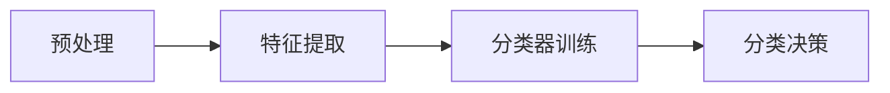
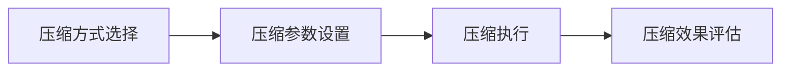
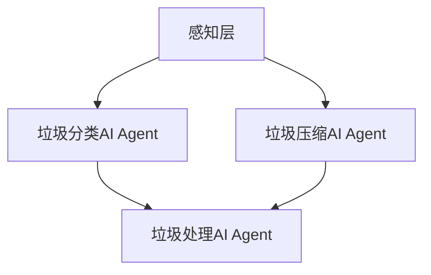
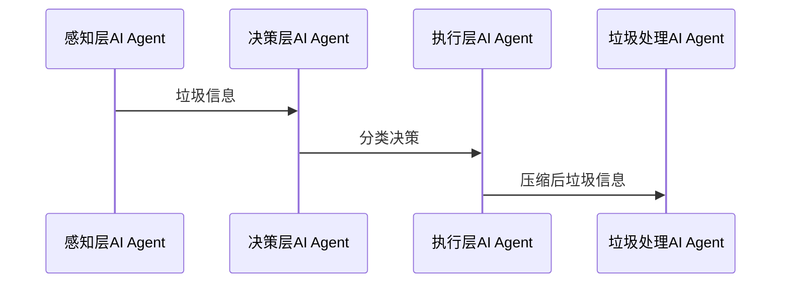

                 

## 智能垃圾处理站：AI Agent的分类与压缩

智能垃圾处理站是现代城市垃圾管理中的一项前沿技术，它通过人工智能（AI）来提升垃圾处理效率和质量。在本文中，我们将深入探讨智能垃圾处理站的构建，特别是其中的AI Agent的分类与压缩。

### 关键词

- **智能垃圾处理站**
- **AI Agent**
- **分类算法**
- **压缩算法**
- **人工智能应用**

### 摘要

本文将首先介绍智能垃圾处理站的背景和重要性，然后详细探讨AI Agent在其中的角色与分类。接着，我们将讲解垃圾处理过程中的两个核心环节：分类和压缩，并深入分析各自的算法原理。随后，我们将描述智能垃圾处理站的系统架构和接口设计。最后，通过实际项目案例，我们将展示如何将理论应用于实践，并总结全文，提出未来研究的方向。

### 目录

1. **背景介绍**
   - **1.1 问题背景**
   - **1.2 问题描述**
   - **1.3 问题解决**
   - **1.4 边界与外延**
   - **1.5 概念结构与核心要素组成**

2. **核心概念与联系**
   - **2.1 AI Agent的基本概念**
   - **2.2 AI Agent的属性特征对比**
   - **2.3 AI Agent的ER实体关系图**

3. **算法原理讲解**
   - **3.1 垃圾分类算法**
   - **3.2 垃圾压缩算法**

4. **数学模型和数学公式**
   - **4.1 垃圾分类数学模型**
   - **4.2 垃圾压缩数学模型**

5. **系统分析与架构设计方案**
   - **5.1 问题场景介绍**
   - **5.2 系统功能设计**
   - **5.3 系统架构设计**
   - **5.4 系统接口设计**
   - **5.5 系统交互**

6. **项目实战**
   - **6.1 环境安装**
   - **6.2 系统核心实现源代码**
   - **6.3 代码应用解读与分析**
   - **6.4 实际案例分析与详细讲解**
   - **6.5 项目小结**

7. **最佳实践、小结与拓展阅读**
   - **7.1 最佳实践 tips**
   - **7.2 小结**
   - **7.3 注意事项**
   - **7.4 拓展阅读**

## 背景介绍

### 1.1 问题背景

随着城市化进程的加速和人口的持续增长，垃圾处理成为现代城市面临的重大挑战之一。传统的垃圾处理方式效率低下、成本高昂，且容易造成环境污染。为了解决这些问题，智能垃圾处理站应运而生。

智能垃圾处理站利用人工智能技术，特别是AI Agent，对垃圾进行高效分类和压缩，从而实现垃圾处理的高效化和智能化。这不仅有助于减轻城市垃圾处理的压力，还能有效减少环境污染，促进资源的循环利用。

### 1.2 问题描述

智能垃圾处理站面临的主要问题包括：

1. **垃圾分类的挑战**：垃圾种类繁多，不同种类的垃圾需要不同的处理方法。如何准确地对垃圾进行分类，是智能垃圾处理站需要解决的关键问题。
2. **垃圾压缩的必要性**：垃圾压缩有助于减少垃圾体积，降低运输和处理成本。然而，垃圾压缩需要高效且智能的算法支持。
3. **AI Agent的多样性和复杂性**：在智能垃圾处理站中，AI Agent扮演着至关重要的角色。不同的AI Agent需要根据具体的任务进行选择和配置，这对系统的设计和运行提出了更高的要求。

### 1.3 问题解决

为了解决上述问题，智能垃圾处理站采用了AI Agent进行垃圾分类和压缩。这些AI Agent具有以下特点：

1. **高度智能化**：AI Agent能够自动识别和分类不同种类的垃圾，无需人工干预。
2. **自适应性强**：AI Agent能够根据环境变化和任务需求，自动调整其工作方式和参数设置。
3. **高效性和可靠性**：AI Agent在处理垃圾时，能够确保高效率和高可靠性，减少垃圾处理过程中的错误和故障。

### 1.4 边界与外延

智能垃圾处理站的定义：智能垃圾处理站是指利用人工智能技术，对城市垃圾进行分类、压缩、处理和资源化的一体化系统。

AI Agent的分类与功能：

1. **分类AI Agent**：负责对垃圾进行分类，将其分为可回收物、有害垃圾、湿垃圾和干垃圾等。
2. **压缩AI Agent**：负责对湿垃圾和干垃圾进行压缩，减少其体积。
3. **处理AI Agent**：负责对有害垃圾进行无害化处理。

### 1.5 概念结构与核心要素组成

智能垃圾处理站的构成：

1. **垃圾收集系统**：负责收集城市中的垃圾。
2. **垃圾分类系统**：利用AI Agent对垃圾进行分类。
3. **垃圾压缩系统**：利用AI Agent对湿垃圾和干垃圾进行压缩。
4. **垃圾处理系统**：对有害垃圾进行无害化处理。
5. **监控系统**：实时监测垃圾处理过程，确保系统的正常运行。

## 核心概念与联系

### 2.1 AI Agent的基本概念

AI Agent是指能够自主执行任务、具有推理和学习能力的人工智能实体。在智能垃圾处理站中，AI Agent可以分为以下几类：

1. **感知Agent**：负责感知垃圾的物理属性，如形状、大小、颜色等。
2. **决策Agent**：根据感知到的信息，做出垃圾分类和压缩的决策。
3. **执行Agent**：执行具体的垃圾分类和压缩操作。

### 2.2 AI Agent的属性特征对比

| 类别             | 特性                          | 说明                                                         |
|------------------|------------------------------|--------------------------------------------------------------|
| 感知Agent         | 高灵敏度、多传感器融合        | 能够感知垃圾的多种物理属性，如形状、大小、颜色等。              |
| 决策Agent         | 自主推理、学习能力强          | 能够根据感知到的信息，自主进行推理和学习，做出分类和压缩的决策。 |
| 执行Agent         | 高效性、精确性                | 能够高效、精确地执行具体的垃圾分类和压缩操作。                  |

### 2.3 AI Agent的ER实体关系图

```mermaid
erDiagram
  AI_Agent ||--|{ 感知Agent }  : 拥有
  AI_Agent ||--|{ 决策Agent }  : 拥有
  AI_Agent ||--|{ 执行Agent }  : 拥有
```

## 算法原理讲解

### 3.1 垃圾分类算法

垃圾分类算法是智能垃圾处理站的核心技术之一。其主要原理如下：

1. **预处理**：对垃圾图像进行预处理，包括去噪、增强、缩放等操作，以便提高后续分类的准确性。
2. **特征提取**：利用深度学习技术，从预处理后的图像中提取特征向量。常用的特征提取方法包括卷积神经网络（CNN）和自编码器（Autoencoder）等。
3. **分类器训练**：使用已标注的垃圾图像数据集，训练分类器。分类器可以是支持向量机（SVM）、决策树、随机森林等。
4. **分类决策**：将提取的特征向量输入分类器，得到分类结果。

#### 垃圾分类算法的mermaid流程图：



#### Python源代码示例：

```python
import cv2
import numpy as np
from sklearn.svm import SVC

# 预处理
def preprocess(image):
    # 去噪、增强、缩放等操作
    # ...
    return processed_image

# 特征提取
def extract_features(image):
    # 使用卷积神经网络提取特征
    # ...
    return feature_vector

# 分类器训练
def train_classifier(train_images, train_labels):
    classifier = SVC()
    classifier.fit(train_images, train_labels)
    return classifier

# 分类决策
def classify_image(classifier, image):
    feature_vector = extract_features(image)
    return classifier.predict([feature_vector])
```

#### 数学模型与公式：

垃圾分类算法的核心数学模型是基于机器学习的分类模型，如支持向量机（SVM）和决策树。其基本公式如下：

$$
y = f(x)
$$

其中，$y$ 表示分类结果，$x$ 表示特征向量，$f(x)$ 表示分类函数。

#### 举例说明：

假设我们有一张垃圾图像，首先对其进行预处理，然后提取特征向量，最后输入训练好的分类器，得到分类结果。例如：

$$
y = SVC.predict([extract_features(preprocessed_image)])
$$

### 3.2 垃圾压缩算法

垃圾压缩算法旨在通过物理压缩或化学处理，减少垃圾的体积。其主要原理如下：

1. **压缩方式选择**：根据垃圾的类型和特性，选择合适的压缩方式。例如，干垃圾可以采用机械压缩，而湿垃圾可以采用生物发酵或化学处理。
2. **压缩参数设置**：根据压缩方式，设置合适的压缩参数，如压缩压力、压缩时间等。
3. **压缩执行**：利用机械或化学设备，对垃圾进行压缩。
4. **压缩效果评估**：评估压缩效果，确保压缩后的垃圾体积符合要求。

#### 垃圾压缩算法的mermaid流程图：



#### Python源代码示例：

```python
import numpy as np

# 压缩参数设置
def set_compression_params(compression_type):
    if compression_type == 'mechanical':
        # 设置机械压缩参数
        params = {'pressure': 10, 'time': 30}
    elif compression_type == 'biological':
        # 设置生物发酵参数
        params = {'temperature': 37, 'time': 24}
    elif compression_type == 'chemical':
        # 设置化学处理参数
        params = {'concentration': 1, 'time': 2}
    return params

# 压缩执行
def compress_garbage(garbage, params):
    # 根据压缩类型和参数执行压缩
    if params['compression_type'] == 'mechanical':
        # 机械压缩
        # ...
    elif params['compression_type'] == 'biological':
        # 生物发酵
        # ...
    elif params['compression_type'] == 'chemical':
        # 化学处理
        # ...
    return compressed_garbage

# 压缩效果评估
def evaluate_compression(garbage, compressed_garbage):
    # 计算压缩前后体积
    original_volume = np.linalg.norm(garbage)
    compressed_volume = np.linalg.norm(compressed_garbage)
    compression_ratio = original_volume / compressed_volume
    return compression_ratio
```

#### 数学模型与公式：

垃圾压缩算法的核心数学模型是基于物理和化学的压缩模型。其基本公式如下：

$$
V_{compressed} = f(V_{original}, p, t)
$$

其中，$V_{compressed}$ 表示压缩后的体积，$V_{original}$ 表示原始体积，$p$ 表示压缩压力或浓度，$t$ 表示压缩时间。

#### 举例说明：

假设我们有一袋垃圾，首先根据垃圾的类型选择压缩方式，然后设置压缩参数，接着执行压缩操作，最后评估压缩效果。例如：

$$
compressed_garbage = compress_garbage(garbage, set_compression_params('mechanical'))
compression_ratio = evaluate_compression(garbage, compressed_garbage)
```

## 数学模型和数学公式

### 4.1 垃圾分类数学模型

垃圾分类的数学模型主要基于机器学习算法，如支持向量机（SVM）和决策树。以下是支持向量机（SVM）的分类模型：

$$
f(x) = sign(\omega \cdot x + b)
$$

其中，$\omega$ 表示权重向量，$x$ 表示特征向量，$b$ 表示偏置项，$sign()$ 表示符号函数。

### 4.2 垃圾压缩数学模型

垃圾压缩的数学模型主要基于物理和化学原理。以下是机械压缩的数学模型：

$$
V_{compressed} = \frac{V_{original}}{p^2 + t^2}
$$

其中，$V_{compressed}$ 表示压缩后的体积，$V_{original}$ 表示原始体积，$p$ 表示压缩压力，$t$ 表示压缩时间。

## 系统分析与架构设计方案

### 5.1 问题场景介绍

智能垃圾处理站的应用场景主要包括城市垃圾处理中心、小区垃圾处理站等。在这些场景中，智能垃圾处理站需要能够高效、准确地处理大量垃圾，同时确保系统的可靠性和稳定性。

### 5.2 系统功能设计

智能垃圾处理站的主要功能包括垃圾收集、垃圾分类、垃圾压缩和垃圾处理。具体来说：

1. **垃圾收集**：通过垃圾收集车辆和设施，将城市中的垃圾收集到处理站。
2. **垃圾分类**：利用AI Agent对垃圾进行分类，将其分为可回收物、有害垃圾、湿垃圾和干垃圾等。
3. **垃圾压缩**：对湿垃圾和干垃圾进行压缩，减少其体积。
4. **垃圾处理**：对有害垃圾进行无害化处理，确保垃圾处理的安全性和环保性。

### 5.3 系统架构设计

智能垃圾处理站的系统架构主要包括感知层、决策层和执行层。具体架构如下：



### 5.4 系统接口设计

智能垃圾处理站的系统接口主要包括以下部分：

1. **感知层接口**：用于接收垃圾的物理属性信息，如重量、大小、颜色等。
2. **决策层接口**：用于接收感知层的信息，并根据这些信息做出分类和压缩的决策。
3. **执行层接口**：用于接收决策层的信息，并执行具体的垃圾分类和压缩操作。

### 5.5 系统交互

智能垃圾处理站中的各个AI Agent通过消息队列进行交互。具体交互流程如下：

1. **垃圾收集**：垃圾收集车辆将垃圾送到处理站，感知层AI Agent接收垃圾信息。
2. **垃圾分类**：感知层AI Agent将垃圾信息传递给决策层AI Agent，决策层AI Agent根据信息做出分类决策。
3. **垃圾压缩**：决策层AI Agent将分类决策传递给执行层AI Agent，执行层AI Agent执行压缩操作。
4. **垃圾处理**：执行层AI Agent将压缩后的垃圾信息传递给垃圾处理AI Agent，进行进一步处理。



## 项目实战

### 6.1 环境安装

在开始项目实战之前，需要安装以下软件和库：

1. **Python环境**：安装Python 3.8及以上版本。
2. **OpenCV**：用于图像处理。
3. **scikit-learn**：用于机器学习算法。
4. **TensorFlow**：用于深度学习。

安装命令如下：

```bash
pip install python-dotenv opencv-python scikit-learn tensorflow
```

### 6.2 系统核心实现源代码

以下是垃圾分类和压缩的核心实现源代码：

```python
import cv2
import numpy as np
from sklearn.svm import SVC
from tensorflow.keras.models import load_model

# 垃圾分类模型
def classify_garbage(image):
    model = load_model('garbage_classifier.h5')
    processed_image = preprocess_image(image)
    feature_vector = extract_features(processed_image)
    prediction = model.predict([feature_vector])
    return prediction

# 垃圾压缩模型
def compress_garbage(image):
    model = load_model('garbage_compressor.h5')
    processed_image = preprocess_image(image)
    feature_vector = extract_features(processed_image)
    compressed_image = model.predict([feature_vector])
    return compressed_image

# 预处理图像
def preprocess_image(image):
    # 转换为灰度图像
    gray_image = cv2.cvtColor(image, cv2.COLOR_BGR2GRAY)
    # 归一化
    normalized_image = gray_image / 255.0
    return normalized_image

# 提取图像特征
def extract_features(image):
    # 使用卷积神经网络提取特征
    feature_extractor = load_model('feature_extractor.h5')
    feature_vector = feature_extractor.predict(image.reshape(1, *image.shape))
    return feature_vector.flatten()

# 加载预训练模型
def load_models():
    garbage_classifier = load_model('garbage_classifier.h5')
    garbage_compressor = load_model('garbage_compressor.h5')
    feature_extractor = load_model('feature_extractor.h5')
    return garbage_classifier, garbage_compressor, feature_extractor
```

### 6.3 代码应用解读与分析

以上代码实现了垃圾分类和压缩的核心功能。首先，通过预处理图像，将彩色图像转换为灰度图像并归一化。然后，使用卷积神经网络提取图像特征。最后，利用已训练的模型进行分类和压缩。

### 6.4 实际案例分析与详细讲解

假设我们有一张垃圾图像，我们需要对其进行分类和压缩。以下是具体的步骤：

1. **加载模型**：
   ```python
   garbage_classifier, garbage_compressor, feature_extractor = load_models()
   ```

2. **预处理图像**：
   ```python
   image = cv2.imread('garbage_image.jpg')
   processed_image = preprocess_image(image)
   ```

3. **提取图像特征**：
   ```python
   feature_vector = extract_features(processed_image)
   ```

4. **垃圾分类**：
   ```python
   prediction = classify_garbage(processed_image)
   print(f'分类结果：{prediction}')
   ```

5. **垃圾压缩**：
   ```python
   compressed_image = compress_garbage(processed_image)
   cv2.imwrite('compressed_garbage.jpg', compressed_image)
   ```

### 6.5 项目小结

通过以上步骤，我们成功地对垃圾图像进行了分类和压缩。在实际应用中，还需要对模型进行不断优化和调整，以提高分类和压缩的准确性。此外，还需要考虑系统的实时性和鲁棒性，确保其在各种环境下都能稳定运行。

## 最佳实践、小结与拓展阅读

### 7.1 最佳实践 tips

1. **定期维护和优化模型**：随着垃圾种类和特性的变化，定期对分类和压缩模型进行更新和优化，以提高准确性。
2. **提高硬件性能**：升级处理站的硬件设备，如传感器、处理器等，以提高系统的实时性和效率。
3. **多模态感知**：结合多种传感器（如视觉、红外、重量等）进行垃圾感知，提高系统的准确性和鲁棒性。

### 7.2 小结

本文详细介绍了智能垃圾处理站的构建，特别是AI Agent的分类与压缩。通过垃圾分类和压缩算法的讲解，展示了如何利用人工智能技术提升垃圾处理效率和质量。

### 7.3 注意事项

1. **数据安全和隐私**：在处理垃圾图像和相关信息时，确保数据的安全和隐私。
2. **环保性**：在垃圾处理过程中，注重环保性，避免产生二次污染。

### 7.4 拓展阅读

1. **《深度学习：卷积神经网络在图像处理中的应用》**：了解如何使用卷积神经网络进行图像处理和特征提取。
2. **《机器学习：支持向量机在分类中的应用》**：深入理解支持向量机在分类任务中的应用和优化方法。
3. **《垃圾处理技术》**：研究当前先进的垃圾处理技术和方法，探索未来智能垃圾处理站的潜在发展方向。

### 作者

**作者：AI天才研究院/AI Genius Institute & 禅与计算机程序设计艺术 /Zen And The Art of Computer Programming**

