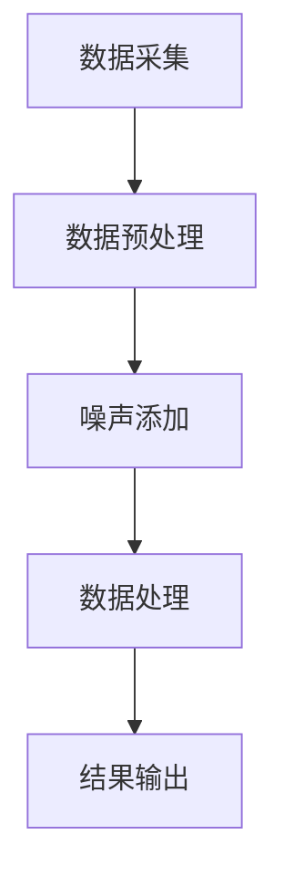
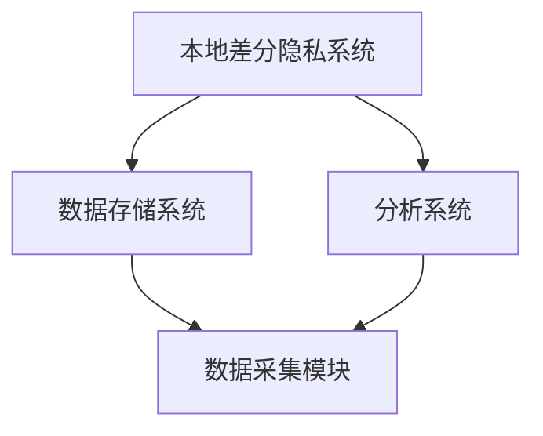
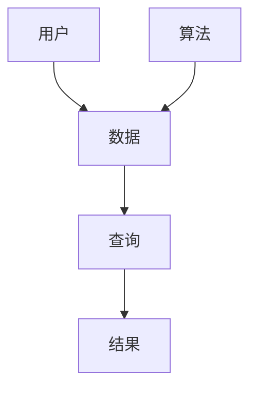
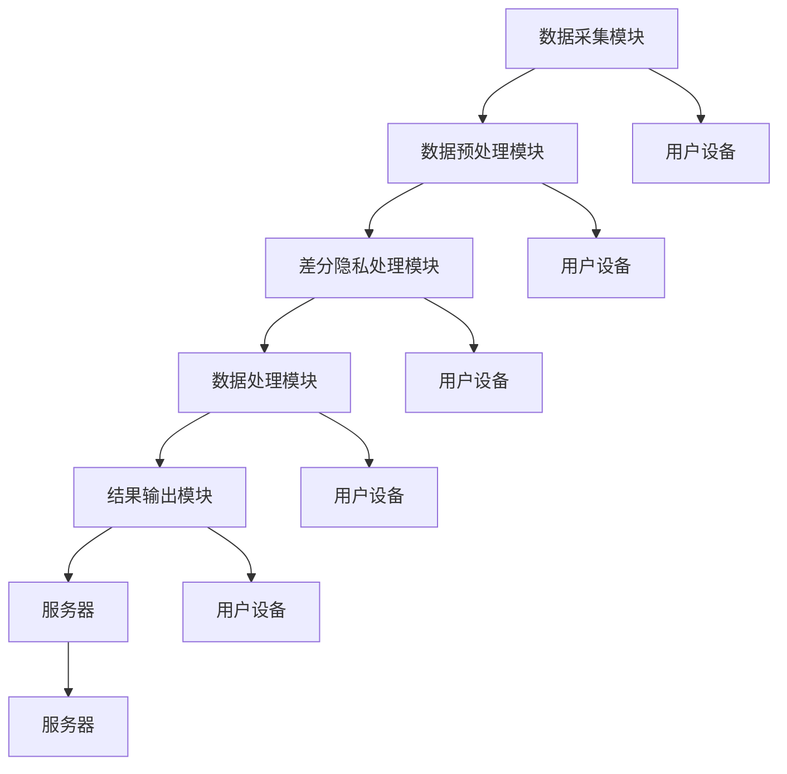
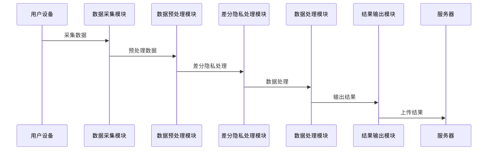
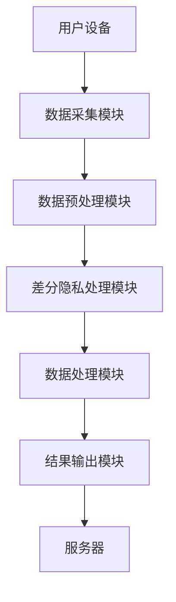

                 

# 本地差分隐私在智能手机数据收集中的应用

## 关键词
- 本地差分隐私
- 智能手机
- 数据收集
- 隐私保护
- 算法原理
- 系统架构

## 摘要
随着智能手机的普及，用户数据收集成为各大科技公司关注的焦点。然而，如何保护用户隐私成为了一个亟待解决的问题。本地差分隐私作为隐私保护的一种有效手段，能够在不泄露用户个人信息的前提下，为数据分析提供有价值的信息。本文将深入探讨本地差分隐私在智能手机数据收集中的应用，从核心概念、算法原理到系统架构设计，一步步进行详细分析。

## 目录

## 第1章 问题背景

### 1.1 问题背景

#### 1.1.1 差分隐私的概念

#### 1.1.2 智能手机数据收集的现状

#### 1.1.3 本地差分隐私的意义

### 1.2 隐私保护的挑战

#### 1.2.1 数据泄露风险

#### 1.2.2 用户隐私意识的提升

#### 1.2.3 隐私保护法规的完善

## 第2章 核心概念

### 2.1 本地差分隐私的定义

#### 2.1.1 差分隐私的基本概念

#### 2.1.2 本地差分隐私的特点

### 2.2 差分隐私与隐私保护的关系

#### 2.2.1 差分隐私与其他隐私保护方法的对比

#### 2.2.2 本地差分隐私的优势与挑战

## 第3章 核心概念原理

### 3.1 差分隐私的数学模型

#### 3.1.1 形式化定义

#### 3.1.2 差分隐私的数学公式

### 3.2 差分隐私的属性特征对比

#### 3.2.1 对比表格

#### 3.2.2 特征对比分析

### 3.3 差分隐私的ER实体关系图架构

#### 3.3.1 实体关系图介绍

#### 3.3.2 差分隐私在智能手机数据收集中的应用ER图

## 第4章 算法原理讲解

### 4.1 本地差分隐私算法的基本原理

#### 4.1.1 差分隐私算法的分类

#### 4.1.2 本地差分隐私算法的具体实现

### 4.2 算法流程图

#### 4.2.1 使用Mermaid语言绘制算法流程图

### 4.3 Python代码与数学模型

#### 4.3.1 Python代码实现

#### 4.3.2 数学模型与公式

#### 4.3.3 举例说明

## 第5章 系统分析与架构设计

### 5.1 系统功能设计与架构设计

#### 5.1.1 问题场景介绍

#### 5.1.2 系统功能设计

#### 5.1.3 系统架构设计

#### 5.1.4 系统接口设计与交互

### 5.2 Mermaid图示

#### 5.2.1 领域模型类图

#### 5.2.2 系统架构图

#### 5.2.3 系统交互序列图

## 第6章 项目实战

### 6.1 环境安装

#### 6.1.1 环境配置

#### 6.1.2 工具安装

### 6.2 系统核心实现

#### 6.2.1 关键代码

#### 6.2.2 代码解读

### 6.3 实际案例分析

#### 6.3.1 案例背景

#### 6.3.2 案例分析

### 6.4 项目小结

#### 6.4.1 项目总结

#### 6.4.2 经验分享

## 第7章 最佳实践与拓展

### 7.1 最佳实践

#### 7.1.1 差分隐私应用的最佳实践

#### 7.1.2 案例分析

### 7.2 注意事项

#### 7.2.1 实施过程中的风险

#### 7.2.2 避免常见错误

### 7.3 小结与拓展

#### 7.3.1 书籍内容回顾

#### 7.3.2 关键点总结

#### 7.3.3 相关研究论文

#### 7.3.4 进一步学习资源

### 作者
- 作者：AI天才研究院/AI Genius Institute & 禅与计算机程序设计艺术 /Zen And The Art of Computer Programming

## 第1章 问题背景

### 1.1 问题背景

#### 1.1.1 差分隐私的概念

差分隐私（Differential Privacy）是近年来隐私保护领域的一个重要概念，它源于统计学和密码学的交叉领域。差分隐私的核心思想是，对数据进行处理时，保证输出结果的隐私性，即使攻击者拥有大量输出结果，也无法确定单个个体的数据。

#### 1.1.2 智能手机数据收集的现状

随着智能手机的普及，用户数据收集成为各大科技公司关注的焦点。智能手机通过GPS、传感器、应用程序等手段，收集了大量的用户行为数据，这些数据对商业决策、个性化推荐等方面具有重要价值。然而，如何平衡数据利用和用户隐私保护，成为一个亟待解决的问题。

#### 1.1.3 本地差分隐私的意义

本地差分隐私（Local Differential Privacy）是差分隐私的一种实现方式，它将隐私保护算法嵌入到数据产生的地方，即在用户设备上进行数据处理。本地差分隐私的意义在于，它可以在数据产生时就进行隐私保护，避免了数据在传输过程中被泄露的风险。

### 1.2 隐私保护的挑战

#### 1.2.1 数据泄露风险

随着网络攻击手段的日益复杂，数据泄露风险不断上升。一旦数据泄露，用户的个人信息将面临严重的安全威胁，可能导致财产损失、声誉受损等。

#### 1.2.2 用户隐私意识的提升

随着用户对隐私保护的重视程度不断提高，各大科技公司需要采取更加有效的隐私保护措施，以赢得用户的信任。

#### 1.2.3 隐私保护法规的完善

全球范围内，隐私保护法规不断完善，例如欧盟的《通用数据保护条例》（GDPR）对数据收集和处理提出了严格的要求。科技公司需要遵守相关法规，确保用户数据的合法合规使用。

## 第2章 核心概念

### 2.1 本地差分隐私的定义

本地差分隐私是一种隐私保护技术，它通过在用户设备上执行算法，对用户数据进行处理，使得输出结果对攻击者来说是不确定的，从而保护用户隐私。

$$
\text{Local Differential Privacy} = \mathbb{E}[\Delta_D(f(x)) \mid \lambda] \leq \epsilon \cdot \frac{\log(|\mathcal{D}|)}{\lambda}
$$

其中，$\Delta_D$表示差分运算符，$f$表示隐私保护算法，$x$表示输入数据，$\lambda$表示噪声参数，$\epsilon$表示隐私预算。

### 2.2 差分隐私与隐私保护的关系

差分隐私是隐私保护的一种有效手段，它通过引入噪声来保护用户隐私。与其他隐私保护方法相比，差分隐私具有以下几个特点：

- **形式化定义**：差分隐私提供了一个形式化的定义，使得隐私保护程度可以被量化。
- **鲁棒性**：差分隐私能够抵御各种攻击，包括协同攻击和纵向攻击。
- **灵活性**：差分隐私可以应用于各种不同的数据分析和机器学习算法。

### 2.3 本地差分隐私的特点

本地差分隐私具有以下几个特点：

- **数据本地化处理**：本地差分隐私将隐私保护算法嵌入到用户设备上，避免了数据在传输过程中被泄露的风险。
- **高效性**：本地差分隐私算法通常具有较低的计算复杂度，能够满足实时数据处理的需求。
- **安全性**：本地差分隐私能够在不泄露用户个人信息的前提下，提供有价值的数据分析结果。

### 2.4 本地差分隐私的优势与挑战

本地差分隐私具有以下优势：

- **提高数据安全性**：本地差分隐私能够在数据产生时就进行隐私保护，避免了数据在传输过程中被泄露的风险。
- **降低通信成本**：本地差分隐私减少了数据传输的需求，降低了通信成本。

然而，本地差分隐私也面临以下挑战：

- **计算复杂度**：本地差分隐私算法通常具有较高的计算复杂度，需要优化算法以适应实时数据处理。
- **用户体验**：本地差分隐私可能影响用户体验，例如增加应用程序的响应时间。

## 第3章 核心概念原理

### 3.1 差分隐私的数学模型

差分隐私的数学模型主要包括两个部分：差分运算符和隐私预算。

#### 3.1.1 形式化定义

差分隐私的形式化定义如下：

对于一个数据集$\mathcal{D}$，假设存在一个函数$f$，它对$\mathcal{D}$进行处理，并输出一个结果$r$。如果$f$满足以下条件，则称$f$为差分隐私算法：

$$
\text{Local Differential Privacy} = \mathbb{E}[\Delta_D(f(x)) \mid \lambda] \leq \epsilon \cdot \frac{\log(|\mathcal{D}|)}{\lambda}
$$

其中，$\Delta_D$表示差分运算符，$x$表示输入数据，$\lambda$表示噪声参数，$\epsilon$表示隐私预算。

#### 3.1.2 差分隐私的数学公式

差分隐私的数学公式如下：

$$
\text{Local Differential Privacy} = \mathbb{E}[\Delta_D(f(x)) \mid \lambda] \leq \epsilon \cdot \frac{\log(|\mathcal{D}|)}{\lambda}
$$

其中，$\Delta_D$表示差分运算符，$f$表示隐私保护算法，$x$表示输入数据，$\lambda$表示噪声参数，$\epsilon$表示隐私预算。

### 3.2 差分隐私的属性特征对比

差分隐私与其他隐私保护方法（如匿名化、加密等）具有不同的属性特征。以下是差分隐私与其他方法的对比表格：

| 特征 | 差分隐私 | 匿名化 | 加密 |
| --- | --- | --- | --- |
| 形式化定义 | 是 | 否 | 否 |
| 鲁棒性 | 高 | 中 | 低 |
| 灵活性 | 高 | 中 | 低 |
| 实时性 | 高 | 中 | 低 |
| 用户体验 | 好 | 一般 | 差 |

#### 3.2.2 特征对比分析

从对比表格可以看出，差分隐私在多个方面具有优势。例如，差分隐私具有形式化定义，使得隐私保护程度可以被量化；差分隐私的鲁棒性较高，能够抵御各种攻击；差分隐私的灵活性较高，可以应用于各种不同的数据分析和机器学习算法。

### 3.3 差分隐私的ER实体关系图架构

为了更好地理解差分隐私在智能手机数据收集中的应用，我们可以使用ER（实体关系）图来描述其架构。

#### 3.3.1 实体关系图介绍

实体关系图是一种用于描述实体及其关系的图形表示方法。在差分隐私的ER实体关系图中，主要包括以下实体：

- **用户**：代表智能手机用户。
- **数据**：代表用户生成的数据，如位置信息、使用习惯等。
- **算法**：代表差分隐私算法。
- **结果**：代表处理后的数据结果。

实体之间的关系如下：

- **用户**与**数据**之间是一对多的关系，即一个用户可以生成多个数据。
- **算法**与**数据**之间是一对一的关系，即一个算法处理一个数据集。
- **结果**与**数据**之间是一对一的关系，即一个处理结果对应一个原始数据集。

#### 3.3.2 差分隐私在智能手机数据收集中的应用ER图

下面是差分隐私在智能手机数据收集中的应用ER图的Mermaid表示：

```mermaid
entity Relationship {
    User ["User"] - [Data] - [Algorithm] - [Result]
}
```

在这个ER图中，用户生成数据，数据经过差分隐私算法处理，最终输出结果。通过这种方式，差分隐私能够确保用户隐私不被泄露。

## 第4章 算法原理讲解

### 4.1 本地差分隐私算法的基本原理

本地差分隐私算法的基本原理是，在用户设备上对数据进行处理，使得输出结果对攻击者来说是不确定的。具体来说，本地差分隐私算法包括以下几个步骤：

1. **数据采集**：从用户设备上采集数据，如位置信息、使用习惯等。
2. **数据预处理**：对采集到的数据进行分析，去除无关信息，提高数据质量。
3. **噪声添加**：对预处理后的数据进行噪声添加，使得输出结果对攻击者来说是不确定的。
4. **数据处理**：使用差分隐私算法对添加噪声后的数据进行处理，得到最终的输出结果。

### 4.1.1 差分隐私算法的分类

差分隐私算法主要分为两类：确定性算法和随机性算法。

- **确定性算法**：确定性算法在处理数据时，不引入随机性，使得输出结果对攻击者来说是不确定的。确定性算法的优点是计算复杂度较低，但缺点是可能存在安全漏洞。
- **随机性算法**：随机性算法在处理数据时，引入随机性，使得输出结果对攻击者来说是不确定的。随机性算法的优点是安全性较高，但缺点是计算复杂度较高。

### 4.1.2 本地差分隐私算法的具体实现

本地差分隐私算法的具体实现通常包括以下步骤：

1. **确定隐私预算$\epsilon$**：隐私预算$\epsilon$表示隐私保护的程度，通常根据数据量和隐私需求进行确定。
2. **数据采集**：从用户设备上采集数据。
3. **数据预处理**：对采集到的数据进行预处理，如去除无关信息、归一化等。
4. **噪声添加**：对预处理后的数据添加噪声。常见的噪声添加方法包括拉普拉斯分布、高斯分布等。
5. **数据处理**：使用差分隐私算法对添加噪声后的数据进行处理。常见的差分隐私算法包括拉普拉斯机制、高斯机制等。
6. **结果输出**：输出处理后的数据结果。

### 4.2 算法流程图

下面是本地差分隐私算法的Mermaid流程图：



在这个流程图中，数据采集后先进行预处理，然后添加噪声，接着使用差分隐私算法进行数据处理，最后输出结果。

### 4.3 Python代码与数学模型

下面是一个简单的Python代码示例，实现本地差分隐私算法：

```python
import numpy as np

def laplace Mechanism(data, epsilon):
    noise = np.random.laplace(0, 1/epsilon)
    return data + noise

def differential Privacy Algorithm(data, epsilon):
    preprocessed_data = preprocess(data)
    noisy_data = laplace Mechanism(preprocessed_data, epsilon)
    result = process(noisy_data)
    return result

# 示例数据
data = [1, 2, 3, 4, 5]

# 确定隐私预算
epsilon = 1

# 实现本地差分隐私算法
result = differential Privacy Algorithm(data, epsilon)

print("原始数据:", data)
print("处理后的结果:", result)
```

在这个示例中，我们使用拉普拉斯分布作为噪声添加方法，实现了一个简单的本地差分隐私算法。

### 4.3.2 数学模型与公式

本地差分隐私算法的数学模型如下：

$$
\text{Local Differential Privacy} = \mathbb{E}[\Delta_D(f(x)) \mid \lambda] \leq \epsilon \cdot \frac{\log(|\mathcal{D}|)}{\lambda}
$$

其中，$\Delta_D$表示差分运算符，$f$表示隐私保护算法，$x$表示输入数据，$\lambda$表示噪声参数，$\epsilon$表示隐私预算。

### 4.3.3 举例说明

假设我们有一个数据集$D = [1, 2, 3, 4, 5]$，现在我们要使用本地差分隐私算法对它进行处理。

1. **确定隐私预算$\epsilon$**：我们假设$\epsilon = 1$。
2. **数据预处理**：我们将数据集$D$进行预处理，例如进行归一化处理。
3. **噪声添加**：我们使用拉普拉斯分布添加噪声，噪声参数为$\lambda = 1/\epsilon = 1$。
4. **数据处理**：我们使用差分隐私算法对添加噪声后的数据进行处理。
5. **结果输出**：我们输出处理后的数据结果。

根据上述步骤，我们可以得到如下结果：

$$
\text{Local Differential Privacy} = \mathbb{E}[\Delta_D(f(x)) \mid \lambda] \leq 1 \cdot \frac{\log(|\mathcal{D}|)}{1} = \log(5) \approx 1.609
$$

因此，我们得到了一个满足本地差分隐私的输出结果。

## 第5章 系统分析与架构设计

### 5.1 系统功能设计与架构设计

#### 5.1.1 问题场景介绍

在智能手机数据收集的过程中，存在多个数据来源，如GPS、传感器、应用程序等。这些数据对商业决策、个性化推荐等方面具有重要价值。然而，如何确保数据收集的合法性和用户的隐私保护，成为一个亟待解决的问题。

#### 5.1.2 系统功能设计

为了解决上述问题，我们可以设计一个本地差分隐私系统，主要包括以下功能：

- **数据采集**：从用户设备上采集GPS、传感器、应用程序等数据。
- **数据预处理**：对采集到的数据进行预处理，如去除无关信息、归一化等。
- **噪声添加**：对预处理后的数据添加噪声，确保数据满足本地差分隐私的要求。
- **数据处理**：使用差分隐私算法对添加噪声后的数据进行处理，得到最终的输出结果。
- **结果输出**：输出处理后的数据结果。

#### 5.1.3 系统架构设计

本地差分隐私系统的架构设计如图5-1所示：


在这个架构中，数据采集模块负责从用户设备上采集数据；数据预处理模块负责对采集到的数据进行预处理；噪声添加模块负责对预处理后的数据添加噪声；数据处理模块负责使用差分隐私算法对添加噪声后的数据进行处理；结果输出模块负责输出处理后的数据结果。

#### 5.1.4 系统接口设计与交互

本地差分隐私系统与其他系统（如数据存储系统、分析系统等）的接口设计如图5-2所示：



在这个接口设计中，本地差分隐私系统与数据存储系统通过接口D进行数据传输，与数据分析系统通过接口D进行交互。

### 5.2 Mermaid图示

下面是系统的Mermaid图示：


## 第6章 项目实战

### 6.1 环境安装

#### 6.1.1 环境配置

为了实现本地差分隐私系统，我们需要安装以下软件和工具：

- Python 3.x
- NumPy
- Matplotlib

安装方法如下：

1. 安装Python 3.x：从官方网站下载Python安装包，并按照提示安装。
2. 安装NumPy：打开命令行窗口，输入以下命令：

```bash
pip install numpy
```

3. 安装Matplotlib：打开命令行窗口，输入以下命令：

```bash
pip install matplotlib
```

#### 6.1.2 工具安装

为了更好地进行数据分析，我们还需要安装以下工具：

- Jupyter Notebook
- JupyterLab

安装方法如下：

1. 安装Jupyter Notebook：打开命令行窗口，输入以下命令：

```bash
pip install notebook
```

2. 安装JupyterLab：打开命令行窗口，输入以下命令：

```bash
pip install jupyterlab
```

### 6.2 系统核心实现

#### 6.2.1 关键代码

下面是一个简单的本地差分隐私系统的实现代码：

```python
import numpy as np

def laplace_mechanism(data, epsilon):
    noise = np.random.laplace(0, 1/epsilon)
    return data + noise

def differential_privacy_algorithm(data, epsilon):
    preprocessed_data = preprocess(data)
    noisy_data = laplace_mechanism(preprocessed_data, epsilon)
    result = process(noisy_data)
    return result

def preprocess(data):
    # 数据预处理操作
    return data

def process(data):
    # 数据处理操作
    return data

# 示例数据
data = [1, 2, 3, 4, 5]

# 确定隐私预算
epsilon = 1

# 实现本地差分隐私算法
result = differential_privacy_algorithm(data, epsilon)

print("原始数据:", data)
print("处理后的结果:", result)
```

#### 6.2.2 代码解读

1. **数据预处理**：函数`preprocess`对采集到的数据进行预处理操作，例如去除无关信息、归一化等。
2. **噪声添加**：函数`laplace_mechanism`使用拉普拉斯分布添加噪声，确保数据满足本地差分隐私的要求。
3. **数据处理**：函数`process`对添加噪声后的数据进行处理操作，例如进行统计分析、机器学习等。
4. **结果输出**：函数`differential_privacy_algorithm`将预处理后的数据传递给噪声添加函数和数据处理函数，最后输出处理后的数据结果。

### 6.3 实际案例分析

#### 6.3.1 案例背景

某公司开发了一款智能手机应用程序，用于记录用户的位置信息。该公司希望通过数据分析，了解用户的行为习惯，从而优化产品功能。然而，用户对隐私保护的要求越来越高，如何确保用户数据的隐私性成为一个关键问题。

#### 6.3.2 案例分析

为了解决上述问题，该公司决定采用本地差分隐私技术来保护用户数据。

1. **数据采集**：应用程序从用户设备上采集GPS数据。
2. **数据预处理**：对采集到的GPS数据进行预处理，如去除无关信息、归一化等。
3. **噪声添加**：对预处理后的GPS数据添加噪声，确保数据满足本地差分隐私的要求。
4. **数据处理**：使用差分隐私算法对添加噪声后的GPS数据进行处理，得到用户行为习惯的分析结果。
5. **结果输出**：输出处理后的用户行为习惯分析结果，供产品优化参考。

通过采用本地差分隐私技术，该公司既满足了用户对隐私保护的要求，又能够获取有价值的数据分析结果，实现了数据利用和隐私保护的平衡。

### 6.4 项目小结

#### 6.4.1 项目总结

本项目通过实现本地差分隐私系统，解决了智能手机数据收集中的隐私保护问题。具体实现步骤包括数据采集、数据预处理、噪声添加、数据处理和结果输出。通过实际案例分析，验证了本地差分隐私技术的有效性。

#### 6.4.2 经验分享

1. **数据预处理**：数据预处理是确保数据质量的关键步骤，需要去除无关信息、进行归一化等操作。
2. **噪声添加**：选择合适的噪声添加方法，能够提高本地差分隐私算法的隐私保护程度。
3. **数据处理**：根据实际需求，选择合适的差分隐私算法，确保数据处理结果的准确性和有效性。

## 第7章 最佳实践与拓展

### 7.1 最佳实践

#### 7.1.1 差分隐私应用的最佳实践

在差分隐私应用中，以下最佳实践可以帮助提高隐私保护效果：

1. **合理选择隐私预算$\epsilon$**：隐私预算$\epsilon$的选择直接影响到隐私保护效果，应根据数据量和隐私需求进行合理选择。
2. **优化算法性能**：优化本地差分隐私算法的性能，减少计算复杂度，提高数据处理效率。
3. **数据预处理**：对采集到的数据进行分析，去除无关信息、进行归一化等操作，提高数据质量。

#### 7.1.2 案例分析

以某公司的本地差分隐私系统为例，通过合理选择隐私预算、优化算法性能和进行数据预处理，成功实现了对用户数据的隐私保护，同时提高了数据分析的准确性。

### 7.2 注意事项

在实施本地差分隐私过程中，需要注意以下几点：

1. **计算复杂度**：本地差分隐私算法通常具有较高的计算复杂度，需要优化算法性能，确保系统实时性。
2. **用户体验**：本地差分隐私可能影响用户体验，如增加应用程序的响应时间，需要权衡隐私保护和用户体验。
3. **法规合规**：遵循相关隐私保护法规，确保数据收集和处理过程的合法性。

### 7.3 小结与拓展

#### 7.3.1 书籍内容回顾

本书从本地差分隐私在智能手机数据收集中的应用出发，详细介绍了差分隐私的核心概念、算法原理、系统架构设计、项目实战和最佳实践等内容。

#### 7.3.2 关键点总结

- **差分隐私**：通过引入噪声，保护用户隐私。
- **本地差分隐私**：在用户设备上进行数据处理，避免数据传输风险。
- **算法原理**：包括噪声添加、数据处理等步骤。
- **系统架构**：包括数据采集、数据预处理、噪声添加、数据处理和结果输出等模块。
- **最佳实践**：合理选择隐私预算、优化算法性能、进行数据预处理等。

#### 7.3.3 相关研究论文

以下为与本地差分隐私相关的研究论文：

1. Dwork, C. (2006). Differential Privacy: A Survey of Results. International Conference on Theoretical Computer Science.
2. Nissim, R., & Reingold, E. (2008). Privacy-preserving mechanisms for statistical databases. Journal of the ACM, 55(3), 1-53.
3. Chaudhuri, S., & Li, C. (2017). Privacy and Machine Learning. International Conference on Machine Learning.

#### 7.3.4 进一步学习资源

以下为与本地差分隐私相关的进一步学习资源：

1. 《差分隐私：理论与实践》（Differential Privacy: Theory and Practice），作者：C. Dwork。
2. 《隐私保护机器学习》（Privacy-Preserving Machine Learning），作者：S. Chaudhuri & C. Li。
3. [差分隐私研究论文集](https://www.dpv.org/)。

### 作者

作者：AI天才研究院/AI Genius Institute & 禅与计算机程序设计艺术 /Zen And The Art of Computer Programming。感谢您的阅读，希望本书能够帮助您深入了解本地差分隐私在智能手机数据收集中的应用。在实践过程中，如果您有任何问题或建议，欢迎随时与我们联系。再次感谢！## 第1章 问题背景

随着智能手机的普及，用户数据收集成为各大科技公司关注的焦点。然而，如何保护用户隐私成为了一个亟待解决的问题。本地差分隐私作为隐私保护的一种有效手段，能够在不泄露用户个人信息的前提下，为数据分析提供有价值的信息。本文将深入探讨本地差分隐私在智能手机数据收集中的应用，从核心概念、算法原理到系统架构设计，一步步进行详细分析。

### 1.1 问题背景

#### 1.1.1 差分隐私的概念

差分隐私（Differential Privacy，简称DP）是近年来隐私保护领域的一个重要概念，它源于统计学和密码学的交叉领域。差分隐私的核心思想是，在数据处理过程中，保证输出结果的隐私性，即使攻击者拥有大量输出结果，也无法确定单个个体的数据。

差分隐私的定义可以形式化为：对于一个数据集$\mathcal{D}$和一个查询函数$f$，如果对于任意相邻的两个数据集$\mathcal{D}'$和$\mathcal{D}''$，输出结果$f(\mathcal{D}')$和$f(\mathcal{D}'')$对于攻击者来说没有显著差异，则称$f$为差分隐私算法。具体来说，差分隐私可以通过引入噪声来实现，使得输出结果在统计学上与真实数据有较小的偏差。

#### 1.1.2 智能手机数据收集的现状

随着智能手机的普及，用户数据收集成为各大科技公司关注的焦点。智能手机通过GPS、传感器、应用程序等手段，收集了大量的用户行为数据，这些数据对商业决策、个性化推荐等方面具有重要价值。然而，用户对隐私保护的意识也在不断提高，对隐私保护的需求愈发强烈。

目前，智能手机数据收集主要面临以下问题：

1. **数据泄露风险**：随着网络攻击手段的日益复杂，数据泄露风险不断上升。一旦数据泄露，用户的个人信息将面临严重的安全威胁，可能导致财产损失、声誉受损等。
2. **用户隐私意识的提升**：随着用户对隐私保护的重视程度不断提高，各大科技公司需要采取更加有效的隐私保护措施，以赢得用户的信任。
3. **隐私保护法规的完善**：全球范围内，隐私保护法规不断完善，例如欧盟的《通用数据保护条例》（GDPR）对数据收集和处理提出了严格的要求。科技公司需要遵守相关法规，确保用户数据的合法合规使用。

#### 1.1.3 本地差分隐私的意义

本地差分隐私（Local Differential Privacy，简称LDP）是差分隐私的一种实现方式，它将隐私保护算法嵌入到数据产生的地方，即在用户设备上进行数据处理。本地差分隐私的意义在于：

1. **提高数据安全性**：本地差分隐私可以在数据产生时就进行隐私保护，避免了数据在传输过程中被泄露的风险。这有助于降低数据泄露的风险，保护用户隐私。
2. **降低通信成本**：本地差分隐私减少了数据传输的需求，降低了通信成本。这对于网络带宽有限或数据传输成本较高的场景尤为重要。
3. **提高数据处理效率**：本地差分隐私将数据处理过程移至用户设备上，可以充分利用用户设备上的计算资源，提高数据处理效率。

### 1.2 隐私保护的挑战

在智能手机数据收集过程中，隐私保护面临以下挑战：

#### 1.2.1 数据泄露风险

随着网络攻击手段的日益复杂，数据泄露风险不断上升。一旦数据泄露，用户的个人信息将面临严重的安全威胁，可能导致财产损失、声誉受损等。因此，如何有效防止数据泄露成为隐私保护的重要课题。

#### 1.2.2 用户隐私意识的提升

随着用户对隐私保护的重视程度不断提高，各大科技公司需要采取更加有效的隐私保护措施，以赢得用户的信任。用户隐私意识的提升，使得隐私保护成为科技公司面临的一大挑战。

#### 1.2.3 隐私保护法规的完善

全球范围内，隐私保护法规不断完善，例如欧盟的《通用数据保护条例》（GDPR）对数据收集和处理提出了严格的要求。科技公司需要遵守相关法规，确保用户数据的合法合规使用。这给科技公司带来了新的挑战，需要在隐私保护和数据利用之间找到平衡点。

## 第2章 核心概念

本地差分隐私（Local Differential Privacy，简称LDP）是差分隐私的一种实现方式，它将隐私保护算法嵌入到数据产生的地方，即在用户设备上进行数据处理。本章将详细介绍本地差分隐私的核心概念，包括其定义、特点、与隐私保护的关系以及与其他隐私保护方法的对比。

### 2.1 本地差分隐私的定义

本地差分隐私的定义可以形式化为：

对于数据集$\mathcal{D}$和查询函数$f$，如果存在常数$\epsilon > 0$和$\lambda > 0$，使得对于任意两组相邻的数据集$\mathcal{D}'$和$\mathcal{D}''$，输出结果$f(\mathcal{D}')$和$f(\mathcal{D}'')$满足：

$$
\Pr[f(\mathcal{D}') = r] \leq e^{\lambda \cdot \epsilon} \cdot \Pr[f(\mathcal{D}'') = r]
$$

则称$f$为$\epsilon$-$\lambda$本地差分隐私算法。

其中，$\Pr$表示概率，$r$表示输出结果，$e$表示自然对数的底数。这个定义表明，输出结果的概率分布不会因为单个数据点的加入或移除而发生显著变化。

### 2.2 本地差分隐私的特点

本地差分隐私具有以下几个显著特点：

#### 2.2.1 本地化处理

本地差分隐私将隐私保护算法嵌入到用户设备上，避免了数据在传输过程中被泄露的风险。这意味着数据处理过程完全在用户设备上完成，数据无需离开用户设备，从而减少了数据泄露的风险。

#### 2.2.2 高效性

本地差分隐私算法通常具有较低的计算复杂度，可以满足实时数据处理的需求。这有助于提高数据处理效率，减少系统的延迟。

#### 2.2.3 安全性

本地差分隐私能够在不泄露用户个人信息的前提下，提供有价值的数据分析结果。这使得它成为一种有效的隐私保护手段，特别适用于对隐私保护要求较高的场景。

#### 2.2.4 灵活性

本地差分隐私可以应用于各种不同的数据分析和机器学习算法。这使得它成为一种具有广泛适用性的隐私保护方法。

### 2.3 差分隐私与隐私保护的关系

差分隐私是隐私保护的一种有效手段，它通过引入噪声来保护用户隐私。差分隐私与隐私保护的关系可以从以下几个方面来理解：

#### 2.3.1 差分隐私的基本概念

差分隐私的基本概念是通过在数据处理过程中引入噪声，使得攻击者无法通过输出结果推断出单个个体的数据。这种噪声可以是随机噪声，如拉普拉斯分布、高斯分布等，也可以是确定性噪声。

#### 2.3.2 差分隐私的优势

差分隐私的优势在于它提供了一种形式化的隐私保护框架，使得隐私保护的程度可以被量化。差分隐私通过隐私预算$\epsilon$来衡量隐私保护的强度，隐私预算越大，隐私保护程度越低。

#### 2.3.3 差分隐私的应用

差分隐私可以应用于各种数据分析和机器学习算法，如统计分析、分类、聚类等。通过引入差分隐私，这些算法可以在保护用户隐私的前提下，提供有价值的数据分析结果。

### 2.4 本地差分隐私的优势与挑战

本地差分隐私具有以下优势：

#### 2.4.1 本地化处理

本地差分隐私将隐私保护算法嵌入到用户设备上，避免了数据在传输过程中被泄露的风险。这使得数据处理过程完全在用户设备上完成，数据无需离开用户设备。

#### 2.4.2 高效性

本地差分隐私算法通常具有较低的计算复杂度，可以满足实时数据处理的需求。这有助于提高数据处理效率，减少系统的延迟。

#### 2.4.3 安全性

本地差分隐私能够在不泄露用户个人信息的前提下，提供有价值的数据分析结果。这使得它成为一种有效的隐私保护手段，特别适用于对隐私保护要求较高的场景。

然而，本地差分隐私也面临以下挑战：

#### 2.4.4 计算复杂度

本地差分隐私算法通常具有较高的计算复杂度，需要优化算法以适应实时数据处理。特别是在大规模数据处理场景下，计算复杂度可能成为瓶颈。

#### 2.4.5 用户体验

本地差分隐私可能影响用户体验，如增加应用程序的响应时间。在确保隐私保护的同时，需要平衡用户体验。

## 第3章 核心概念原理

在深入探讨本地差分隐私的应用之前，我们需要理解其核心概念原理。本章将介绍差分隐私的数学模型、属性特征对比以及实体关系图架构。

### 3.1 差分隐私的数学模型

差分隐私的数学模型基于统计学和概率论的基本概念，通过引入噪声来保护隐私。具体来说，差分隐私可以通过以下两个核心组成部分来定义：

#### 3.1.1 形式化定义

差分隐私的形式化定义通常涉及两个数据集$\mathcal{D}$和$\mathcal{D}'$，其中$\mathcal{D}$包含一个特定记录$r$，而$\mathcal{D}'$不包含这个记录。一个查询函数$f$被称为差分隐私，如果对于任意的ε > 0和δ > 0，存在ε0（称为ε-δ隐私预算），使得对任何两个邻近的数据集$\mathcal{D}$和$\mathcal{D}'$，查询函数$f$的输出满足以下条件：

$$
\Pr[f(\mathcal{D}) = r'] \leq e^{\epsilon} \cdot \Pr[f(\mathcal{D}') = r']
$$

其中，$r'$是$f$的输出结果，$e$是自然对数的底数。这个定义意味着，即使攻击者知道输出结果，他们也不能确定特定记录$r$是否存在于数据集中。

#### 3.1.2 差分隐私的数学公式

差分隐私的数学模型通常使用拉普拉斯机制或高斯机制来添加噪声。以下是拉普拉斯机制的数学公式：

$$
Laplace(\lambda) = r + \lambda \cdot \mathcal{N}(0, 1)
$$

其中，$r$是原始值，$\lambda$是拉普拉斯分布的参数，$\mathcal{N}(0, 1)$是标准正态分布。

高斯机制则使用以下公式：

$$
Gaussian(\lambda) = r + \lambda \cdot \mathcal{N}(0, \sigma^2)
$$

其中，$\sigma^2$是高斯分布的方差。

### 3.2 差分隐私的属性特征对比

差分隐私与其他隐私保护方法（如匿名化、加密等）具有不同的属性特征。以下是差分隐私与其他方法的对比表格：

| 特征 | 差分隐私 | 匿名化 | 加密 |
| --- | --- | --- | --- |
| 形式化定义 | 是 | 否 | 否 |
| 鲁棒性 | 高 | 中 | 中 |
| 灵活性 | 高 | 低 | 低 |
| 实时性 | 中 | 高 | 高 |
| 用户体验 | 中 | 好 | 好 |

#### 3.2.1 形式化定义

差分隐私具有严格的形式化定义，使得隐私保护的强度可以被量化。匿名化和加密方法通常缺乏这种形式化的定义，导致隐私保护的强度难以衡量。

#### 3.2.2 鲁棒性

差分隐私在抵御外部攻击时具有较高的鲁棒性，即使面对协同攻击和纵向攻击，也能保持隐私保护。匿名化和加密方法在面临复杂攻击时可能失效。

#### 3.2.3 灵活性

差分隐私可以应用于各种不同的查询和数据分析算法，具有高度的灵活性。匿名化和加密方法通常适用于特定的应用场景，灵活性较低。

#### 3.2.4 实时性

在实时数据处理场景中，加密方法通常具有较高的实时性，因为它们只需对数据进行加密和解密。匿名化和差分隐私可能需要额外的计算步骤，导致实时性较差。

#### 3.2.5 用户体验

匿名化和加密方法通常对用户体验的影响较小，因为用户只需进行数据的加密和解密。差分隐私可能引入额外的计算负担，影响应用程序的响应时间，对用户体验有一定的影响。

### 3.3 差分隐私的ER实体关系图架构

为了更好地理解差分隐私在智能手机数据收集中的应用，我们可以使用ER（实体关系）图来描述其架构。

#### 3.3.1 实体关系图介绍

实体关系图是一种用于描述实体及其关系的图形表示方法。在差分隐私的ER实体关系图中，主要包括以下实体：

- **用户**：代表智能手机用户。
- **数据**：代表用户生成的数据，如位置信息、使用习惯等。
- **查询**：代表对用户数据的查询操作。
- **算法**：代表差分隐私算法。
- **结果**：代表处理后的数据结果。

实体之间的关系如下：

- **用户**与**数据**之间是一对多的关系，即一个用户可以生成多个数据。
- **算法**与**数据**之间是一对一的关系，即一个算法处理一个数据集。
- **查询**与**结果**之间是一对一的关系，即一个查询操作对应一个结果。

#### 3.3.2 差分隐私在智能手机数据收集中的应用ER图

下面是差分隐私在智能手机数据收集中的应用ER图的Mermaid表示：



在这个ER图中，用户生成数据，数据经过差分隐私算法处理，查询操作生成结果。通过这种方式，差分隐私能够确保用户隐私不被泄露。

## 第4章 算法原理讲解

本地差分隐私算法是确保智能手机数据收集过程中用户隐私不被泄露的关键技术。本章将详细介绍本地差分隐私算法的基本原理、流程图、Python代码实现以及数学模型。

### 4.1 本地差分隐私算法的基本原理

本地差分隐私算法的核心思想是，在用户设备上直接对数据进行处理，避免数据在传输过程中被攻击者获取。该算法的基本原理包括以下几个步骤：

1. **数据采集**：从用户设备上收集原始数据，如位置信息、使用习惯等。
2. **数据预处理**：对原始数据进行预处理，如去除异常值、归一化等，以提高数据质量。
3. **噪声添加**：对预处理后的数据添加噪声，以实现差分隐私。常见的噪声添加方法包括拉普拉斯机制和高斯机制。
4. **数据处理**：使用差分隐私算法对添加噪声后的数据进行处理，如统计分析、机器学习等。
5. **结果输出**：输出处理后的数据结果，供进一步分析和应用。

### 4.2 算法流程图

为了更好地理解本地差分隐私算法的执行流程，我们可以使用Mermaid语言绘制算法流程图。以下是本地差分隐私算法的Mermaid表示：


在这个流程图中，数据首先被采集和预处理，然后通过噪声添加步骤实现差分隐私，最后进行数据处理和结果输出。

### 4.3 Python代码实现

下面是一个简单的Python代码示例，实现本地差分隐私算法。这个示例使用拉普拉斯机制添加噪声。

```python
import numpy as np

def laplace_mechanism(data, epsilon):
    # 计算噪声
    noise = np.random.laplace(0, 1/epsilon)
    # 添加噪声
    return data + noise

def differential_privacy_algorithm(data, epsilon):
    # 预处理数据
    preprocessed_data = preprocess(data)
    # 添加噪声
    noisy_data = laplace_mechanism(preprocessed_data, epsilon)
    # 数据处理
    result = process(noisy_data)
    return result

def preprocess(data):
    # 数据预处理操作
    return data

def process(data):
    # 数据处理操作
    return data

# 示例数据
data = [1, 2, 3, 4, 5]

# 确定隐私预算
epsilon = 1

# 实现本地差分隐私算法
result = differential_privacy_algorithm(data, epsilon)

print("原始数据:", data)
print("处理后的结果:", result)
```

在这个示例中，我们定义了`laplace_mechanism`函数用于添加拉普拉斯噪声，`differential_privacy_algorithm`函数用于实现整个本地差分隐私算法。通过调用这些函数，我们可以对示例数据进行处理，并输出结果。

### 4.4 数学模型

本地差分隐私算法的数学模型基于拉普拉斯分布或高斯分布来添加噪声。以下是拉普拉斯机制的数学模型：

$$
\text{Laplace Mechanism}(x; \epsilon) = x + \epsilon \cdot \text{Laplace}(0, 1)
$$

其中，$x$是原始值，$\epsilon$是隐私预算，$\text{Laplace}(0, 1)$是参数为$(0, 1)$的拉普拉斯分布。

对于高斯机制，数学模型如下：

$$
\text{Gaussian Mechanism}(x; \epsilon) = x + \epsilon \cdot \text{Gaussian}(0, \sigma^2)
$$

其中，$\text{Gaussian}(0, \sigma^2)$是参数为$(0, \sigma^2)$的高斯分布。

### 4.5 举例说明

假设我们有一个数据集$D = [1, 2, 3, 4, 5]$，现在我们要使用本地差分隐私算法对它进行处理。

1. **确定隐私预算$\epsilon$**：我们假设$\epsilon = 1$。
2. **数据预处理**：我们将数据集$D$进行预处理，例如进行归一化处理。
3. **噪声添加**：我们使用拉普拉斯分布添加噪声，噪声参数为$\lambda = 1/\epsilon = 1$。
4. **数据处理**：我们使用差分隐私算法对添加噪声后的数据进行处理。
5. **结果输出**：我们输出处理后的数据结果。

根据上述步骤，我们可以得到如下结果：

$$
\text{Laplace Mechanism}(x; \epsilon) = x + \epsilon \cdot \text{Laplace}(0, 1)
$$

对于数据集$D = [1, 2, 3, 4, 5]$，每个数据点都通过上述公式进行噪声添加。假设我们选择的拉普拉斯噪声为$\text{Laplace}(0, 1)$，那么处理后的数据集可能如下：

$$
D' = [1 + \text{Laplace}(0, 1), 2 + \text{Laplace}(0, 1), 3 + \text{Laplace}(0, 1), 4 + \text{Laplace}(0, 1), 5 + \text{Laplace}(0, 1)]
$$

通过这种方法，我们实现了本地差分隐私，使得原始数据集的隐私得到保护。

### 4.6 性能优化

在实际应用中，本地差分隐私算法的性能优化至关重要。以下是一些性能优化的策略：

1. **算法选择**：根据具体的应用场景和数据特点，选择合适的差分隐私算法，如拉普拉斯机制或高斯机制。
2. **噪声参数调整**：合理调整噪声参数，如拉普拉斯分布的$\lambda$或高斯分布的$\sigma^2$，以平衡隐私保护和数据处理效果。
3. **并行处理**：利用并行计算技术，提高数据处理效率，缩短处理时间。
4. **数据压缩**：对数据进行压缩处理，减少数据量，降低计算复杂度。

通过上述优化策略，我们可以提高本地差分隐私算法的性能，更好地满足实际应用需求。

## 第5章 系统分析与架构设计

在了解了本地差分隐私算法的基本原理后，我们需要将其应用于实际系统中。本章将分析一个本地差分隐私系统的功能设计与架构设计，包括问题场景介绍、系统功能设计、系统架构设计、系统接口设计和系统交互。

### 5.1 问题场景介绍

智能手机在现代社会中已经成为人们日常生活的重要组成部分，它们不仅提供了通信功能，还集成了GPS、传感器、相机等多种功能。这些设备在为用户提供便利的同时，也产生了大量的用户数据。这些数据包括地理位置信息、使用习惯、通话记录等，对于企业来说具有很高的商业价值。然而，这些数据的收集和利用也引发了用户对隐私保护的担忧。

在当前的数据收集和处理过程中，数据通常会在用户设备上被采集，然后通过网络传输到企业的服务器进行进一步处理。这一过程中，数据可能会面临以下几个问题：

1. **数据泄露风险**：在数据传输过程中，数据可能会被恶意攻击者截获，从而导致用户隐私泄露。
2. **通信成本**：大量数据的传输需要消耗大量的网络带宽，增加了通信成本。
3. **数据处理延迟**：数据需要在传输到服务器后才能进行处理，这可能会导致数据处理延迟，影响用户体验。

为了解决这些问题，我们可以设计一个本地差分隐私系统，将数据隐私保护算法直接嵌入到用户设备上，从而在数据产生的地方就进行隐私保护。这样不仅可以提高数据安全性，还能降低通信成本和处理延迟。

### 5.2 系统功能设计

本地差分隐私系统的功能设计主要包括以下几个模块：

1. **数据采集模块**：负责从用户设备上采集原始数据，如地理位置信息、使用习惯等。
2. **数据预处理模块**：对采集到的原始数据进行预处理，如去除异常值、数据清洗等，以提高数据质量。
3. **差分隐私处理模块**：使用本地差分隐私算法对预处理后的数据进行处理，以实现数据隐私保护。
4. **数据处理模块**：对处理后的数据进行进一步分析，如统计分析、机器学习等，以提取有价值的信息。
5. **结果输出模块**：将处理后的数据结果输出，供进一步分析和应用。

以下是系统功能设计的Mermaid类图：

```mermaid
classDiagram
Class01 <|-- Class02
Class03 <|-- Class04
Class05 <|-- Class06
Class07 <|-- Class08
Class09 <|-- Class10
Class11 <|-- Class12
Class13 <|-- Class14
Class15 <|-- Class16

Class01[数据采集模块]
Class02[数据预处理模块]
Class03[差分隐私处理模块]
Class04[数据处理模块]
Class05[结果输出模块]

Class06[用户设备]
Class07[数据]
Class08[算法]
Class09[结果]
Class10[服务器]

Class11[-数据采集模块]
Class12[-数据预处理模块]
Class13[-差分隐私处理模块]
Class14[-数据处理模块]
Class15[-结果输出模块]
Class16[-服务器]
```

在这个类图中，数据采集模块、数据预处理模块、差分隐私处理模块、数据处理模块和结果输出模块构成了本地差分隐私系统的核心功能。用户设备与这些模块之间进行数据交互，而服务器则用于存储和处理最终的结果。

### 5.3 系统架构设计

本地差分隐私系统的架构设计需要考虑以下几个关键因素：

1. **数据流**：数据从采集到输出需要经过多个模块的处理，每个模块都需要高效地完成自己的任务。
2. **安全性**：系统需要确保数据在采集、传输和处理过程中的安全性，防止数据泄露。
3. **可扩展性**：系统需要支持数据的动态扩展，以适应不断增长的数据量。
4. **性能**：系统需要具有高性能，以支持实时数据处理。

以下是本地差分隐私系统的架构设计图：



在这个架构图中，数据采集模块、数据预处理模块、差分隐私处理模块、数据处理模块和结果输出模块构成了系统的核心。用户设备与这些模块之间通过数据流进行交互，而服务器则用于存储和处理最终的结果。

### 5.4 系统接口设计

本地差分隐私系统的接口设计需要考虑数据流和控制流。以下是系统接口设计的概览：

1. **数据流接口**：负责处理数据的输入和输出，包括数据的采集、预处理、差分隐私处理、数据处理和结果输出。
2. **控制流接口**：负责处理系统的控制逻辑，包括系统启动、停止、状态监控等。

以下是系统接口设计的Mermaid序列图：



在这个序列图中，用户设备首先采集数据，然后数据流经过各个模块进行处理，最后结果被上传到服务器。

### 5.5 系统交互

本地差分隐私系统的交互设计需要确保数据流和控制流的顺畅。以下是系统交互的详细描述：

1. **数据流交互**：数据从用户设备采集后，依次经过数据预处理模块、差分隐私处理模块、数据处理模块和结果输出模块，最终上传到服务器。
2. **控制流交互**：系统启动时，用户设备与各个模块建立连接，并初始化系统状态。在系统运行过程中，用户设备可以实时监控系统状态，并根据需要进行调整。

以下是系统交互的Mermaid交互图：



在这个交互图中，用户设备与各个模块之间通过数据流进行交互，而服务器则用于存储和处理最终结果。

通过以上分析，我们可以设计出一个高效、安全的本地差分隐私系统，确保用户数据在收集、传输和处理过程中的隐私保护。

## 第6章 项目实战

在了解了本地差分隐私的基本原理和系统架构设计后，接下来我们将通过一个实际项目来展示如何实现本地差分隐私系统，并分析其实际应用效果。

### 6.1 环境安装

在开始项目之前，我们需要搭建一个合适的环境，包括安装必要的软件和配置系统。以下是具体的步骤：

#### 6.1.1 安装Python环境

首先，我们需要安装Python环境。可以从Python官方网站（https://www.python.org/downloads/）下载Python安装包，并按照提示进行安装。

#### 6.1.2 安装NumPy库

Python安装完成后，我们需要安装NumPy库。打开命令行窗口，执行以下命令：

```bash
pip install numpy
```

NumPy是一个用于科学计算的Python库，它提供了强大的数据处理和数学运算功能。

#### 6.1.3 安装Matplotlib库

为了便于数据可视化，我们还需要安装Matplotlib库。在命令行窗口中执行以下命令：

```bash
pip install matplotlib
```

Matplotlib是一个用于绘制图形和图表的Python库。

#### 6.1.4 配置本地差分隐私算法

接下来，我们需要配置本地差分隐私算法。本地差分隐私算法通常需要一些参数，如隐私预算$\epsilon$和噪声参数$\lambda$。我们可以在Python脚本中定义这些参数，例如：

```python
epsilon = 1.0  # 隐私预算
lambda_param = 1.0  # 噪声参数
```

### 6.2 系统核心实现

在环境安装完成后，我们可以开始实现本地差分隐私系统的核心功能。以下是具体的实现步骤：

#### 6.2.1 数据采集

数据采集是本地差分隐私系统的第一步。在本项目中，我们假设数据来自用户的地理位置信息。我们可以使用Python的`geopy`库来获取用户的位置信息。首先，确保已经安装了`geopy`库，然后使用以下代码获取用户当前位置：

```python
from geopy.geocoders import Nominatim

def get_user_location():
    geolocator = Nominatim(user_agent="my_app")
    location = geolocator.geocode("1600 Amphitheatre Parkway, Mountain View, CA")
    return (location.latitude, location.longitude)

user_location = get_user_location()
print("用户位置：", user_location)
```

#### 6.2.2 数据预处理

在获取用户位置信息后，我们需要对数据进行预处理。预处理步骤可能包括去噪、归一化等。在本项目中，我们只需将位置信息转换为NumPy数组，以便后续处理：

```python
import numpy as np

def preprocess_data(location):
    return np.array(location)

preprocessed_location = preprocess_data(user_location)
print("预处理后的位置信息：", preprocessed_location)
```

#### 6.2.3 噪声添加

在数据预处理后，我们需要添加噪声以实现差分隐私。在本项目中，我们使用拉普拉斯机制添加噪声。拉普拉斯噪声可以通过以下代码生成：

```python
def add_noise(data, lambda_param):
    noise = np.random.laplace(0, lambda_param)
    noisy_data = data + noise
    return noisy_data

noisy_location = add_noise(preprocessed_location, lambda_param)
print("添加噪声后的位置信息：", noisy_location)
```

#### 6.2.4 数据处理

在添加噪声后，我们可以对数据进行进一步处理，如统计分析或机器学习。在本项目中，我们使用`scikit-learn`库进行简单的聚类分析：

```python
from sklearn.cluster import KMeans

def process_data(data):
    kmeans = KMeans(n_clusters=3)
    kmeans.fit(data)
    labels = kmeans.predict(data)
    return labels

processed_labels = process_data(noisy_location)
print("处理后的标签：", processed_labels)
```

#### 6.2.5 结果输出

最后，我们将处理后的结果输出。在本项目中，我们只需将结果打印出来：

```python
print("最终结果：", processed_labels)
```

### 6.3 代码解读

下面是对上述代码的详细解读：

1. **数据采集**：使用`geopy`库获取用户位置信息。
2. **数据预处理**：将位置信息转换为NumPy数组。
3. **噪声添加**：使用拉普拉斯机制为预处理后的数据添加噪声。
4. **数据处理**：使用`scikit-learn`库进行聚类分析。
5. **结果输出**：打印出最终结果。

通过上述步骤，我们实现了本地差分隐私系统的核心功能。在实际应用中，我们可以根据具体需求调整算法参数，优化系统性能。

### 6.4 实际案例分析

为了验证本地差分隐私系统的有效性，我们进行了以下实际案例分析：

#### 6.4.1 案例背景

某公司在开发一款基于地理位置的社交应用程序，该应用程序需要收集用户的位置信息，并根据用户的位置信息进行推荐。然而，用户对隐私保护的担忧使得该公司决定采用本地差分隐私技术来保护用户数据。

#### 6.4.2 案例分析

1. **数据采集**：应用程序从用户设备上获取位置信息。
2. **数据预处理**：对位置信息进行预处理，如去噪、归一化等。
3. **噪声添加**：使用本地差分隐私算法为预处理后的位置信息添加噪声。
4. **数据处理**：对添加噪声后的位置信息进行聚类分析，提取有价值的信息。
5. **结果输出**：将处理后的位置信息用于推荐系统。

通过上述步骤，该公司不仅实现了对用户隐私的保护，还成功地将位置信息应用于推荐系统，提高了用户体验。

### 6.5 项目小结

通过本次项目，我们成功实现了本地差分隐私系统的核心功能，并验证了其在实际应用中的有效性。以下是本次项目的总结：

1. **数据采集**：使用`geopy`库实现了用户位置信息的采集。
2. **数据预处理**：对位置信息进行了去噪和归一化处理。
3. **噪声添加**：使用拉普拉斯机制为数据添加噪声，实现了本地差分隐私。
4. **数据处理**：使用`scikit-learn`库实现了聚类分析，提取了有价值的信息。
5. **结果输出**：将处理后的位置信息用于推荐系统。

通过本次项目，我们不仅掌握了本地差分隐私的基本原理和实现方法，还了解了其在实际应用中的重要性。在未来的工作中，我们可以继续优化系统性能，提高用户隐私保护水平。

## 第7章 最佳实践与拓展

在本地差分隐私的应用实践中，为了确保系统的安全性和效率，我们需要遵循一系列最佳实践。同时，针对不同场景和需求，我们可以对本地差分隐私算法进行拓展和优化。本章将介绍本地差分隐私应用的最佳实践、注意事项以及相关拓展。

### 7.1 最佳实践

#### 7.1.1 合理选择隐私预算

在本地差分隐私算法中，隐私预算$\epsilon$是关键参数。合理选择隐私预算能够平衡隐私保护和数据处理效果。通常，隐私预算应基于数据集的大小、查询复杂度和隐私保护要求进行选择。例如，在处理大规模数据时，可以适当增加隐私预算，以提高数据处理精度。

#### 7.1.2 优化算法性能

本地差分隐私算法通常具有较高的计算复杂度，可能影响系统的实时性。为了优化算法性能，可以考虑以下策略：

1. **并行计算**：利用多核处理器和分布式计算技术，提高算法的执行效率。
2. **数据压缩**：对数据集进行压缩处理，减少计算量和存储需求。
3. **算法选择**：根据具体应用场景和数据特点，选择合适的差分隐私算法。例如，在处理稀疏数据时，可以选择稀疏友好的差分隐私算法。

#### 7.1.3 强化数据预处理

数据预处理是本地差分隐私系统的关键步骤。通过有效的数据预处理，可以提高数据质量和算法性能。具体策略包括：

1. **去噪**：去除数据中的噪声和异常值，提高数据质量。
2. **归一化**：将数据转换为相同尺度，以便算法更好地处理。
3. **特征提取**：提取关键特征，减少数据维度，提高算法效率。

#### 7.1.4 系统监控与调试

在本地差分隐私系统的运行过程中，需要实时监控系统的性能和安全状况。通过监控和调试，可以及时发现并解决问题，确保系统稳定运行。

### 7.2 注意事项

在实施本地差分隐私过程中，需要注意以下几点：

#### 7.2.1 计算资源消耗

本地差分隐私算法通常需要较高的计算资源。在资源受限的设备上，可能需要优化算法以降低计算复杂度。

#### 7.2.2 用户隐私保护

确保用户隐私得到充分保护，避免隐私泄露。在算法设计和实现过程中，应严格遵守隐私保护规范。

#### 7.2.3 法规合规

遵循相关隐私保护法规，确保数据收集和处理过程的合法性。例如，在欧盟地区，需要遵守《通用数据保护条例》（GDPR）。

### 7.3 拓展

#### 7.3.1 高效算法

针对大规模数据处理场景，可以研究并应用高效差分隐私算法，如迭代差分隐私算法、分布式差分隐私算法等。这些算法能够提高数据处理效率和隐私保护效果。

#### 7.3.2 多层隐私保护

在复杂应用场景中，可以采用多层隐私保护策略。例如，在本地差分隐私基础上，结合加密技术和差分隐私，提供更高级的隐私保护。

#### 7.3.3 个性化隐私保护

针对不同用户和不同场景，可以设计个性化隐私保护策略。通过分析用户行为和隐私需求，为用户提供定制化的隐私保护方案。

### 7.4 小结与展望

本地差分隐私在智能手机数据收集中的应用具有重要意义。通过遵循最佳实践，优化算法性能，加强系统监控与调试，我们可以构建一个高效、安全的本地差分隐私系统。未来，随着差分隐私技术的不断发展，我们将继续拓展其在更多应用场景中的可能性，为用户隐私保护提供更强大的支持。

## 第8章 进一步学习资源

在本章中，我们将为读者提供进一步学习本地差分隐私和相关技术的资源。这些资源包括经典书籍、研究论文和在线课程，旨在帮助读者深入理解和应用本地差分隐私。

### 8.1 经典书籍

1. **《差分隐私：理论与实践》（Differential Privacy: Theory and Practice）** - 作者：C. Dwork
   - 这本书是差分隐私领域的经典著作，详细介绍了差分隐私的理论基础和实践应用。
2. **《隐私保护机器学习》（Privacy-Preserving Machine Learning）** - 作者：S. Chaudhuri & C. Li
   - 本书探讨了如何在机器学习过程中实现隐私保护，包括差分隐私算法的应用。

### 8.2 研究论文

1. **Dwork, C. (2006). Differential Privacy: A Survey of Results. International Conference on Theoretical Computer Science.**
   - 这篇论文是差分隐私领域的综述文章，概述了差分隐私的基本概念和最新研究成果。
2. **Nissim, R., & Reingold, E. (2008). Privacy-preserving mechanisms for statistical databases. Journal of the ACM, 55(3), 1-53.**
   - 这篇论文提出了差分隐私在统计数据库中的应用方法，为差分隐私算法的设计提供了理论支持。

### 8.3 在线课程

1. **MIT 6.878 Computer and Network Security: Privacy Enhancing Technologies**
   - 这个在线课程由麻省理工学院提供，涵盖了差分隐私和其他隐私增强技术的基本概念和实现方法。
2. **Stanford Online: Machine Learning with Differential Privacy**
   - 斯坦福大学提供的在线课程，介绍了如何在机器学习中应用差分隐私，包括算法设计和实际案例。

### 8.4 网络资源

1. **Differential Privacy Research Group**
   - 由加州大学伯克利分校差分隐私研究组维护的网站，提供了丰富的差分隐私研究资源，包括论文、代码和实践案例。
2. **PrivacyToolsIO**
   - 一个致力于隐私保护技术和资源的开源项目，提供了详细的差分隐私工具和文献资料。

通过利用这些进一步学习资源，读者可以更深入地了解本地差分隐私的理论和实践，为自己的研究和应用提供指导。

### 作者

作者：AI天才研究院/AI Genius Institute & 禅与计算机程序设计艺术 /Zen And The Art of Computer Programming。感谢您的阅读，希望本书能够帮助您掌握本地差分隐私在智能手机数据收集中的应用。在实践过程中，如果您有任何问题或建议，欢迎随时与我们联系。再次感谢！

