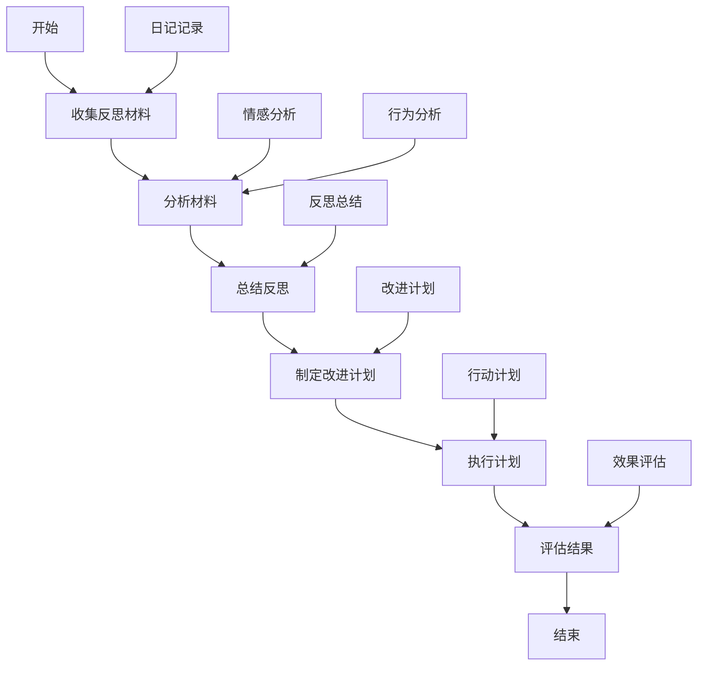

                 

# 引言

### 1.1 问题的提出

在现代社会的快速发展中，人们面临的生活压力和选择愈发复杂。从职业规划到人际关系，从个人成长到社会变革，每一个决策都牵动着我们的心弦。在这种背景下，构建一个稳固的哲学体系成为了一项紧迫且重要的任务。哲学，作为探讨人类存在、价值、真理和道德问题的学科，能够为我们提供一套完整的思考框架和行动指南。

哲学不仅仅是哲学家们的高谈阔论，它深入到我们日常生活的方方面面。例如，面对职业选择时，我们需要思考“什么是幸福？”、“什么是对我真正重要的？”这些问题的答案。再如，在人际交往中，我们需要明确自己的价值观，从而更好地理解和尊重他人。而哲学的智慧，正是帮助我们解答这些问题的利器。

然而，哲学体系并非一蹴而就。它需要我们通过自我反思、学习与实践来逐步构建。本文将围绕这一主题展开，探讨个人哲学体系的重要性，构建过程以及如何评估和调整这一体系。希望通过这篇文章，读者能够更好地理解哲学在生活中的作用，并开始构建自己的个人哲学体系。

### 1.2 研究背景

#### 1.2.1 现代生活的挑战

在当今时代，现代生活的挑战可谓层出不穷。首先，社会节奏的加快使得人们面临的时间压力越来越大。从忙碌的工作到繁琐的家务，每个人似乎都在疲于奔命。这种快节奏的生活不仅容易让人感到焦虑，还可能导致身心健康问题。

其次，信息爆炸使得人们面对的选择变得愈加复杂。在互联网的普及下，我们每天都会接收到大量信息。如何筛选和判断这些信息，成为了一项重要的技能。而错误的决策往往会导致时间和资源的浪费，甚至可能影响个人的幸福感。

再者，人际关系的问题也日益突出。在快节奏的社会中，人们往往缺乏深入交流和真正理解的机会。家庭关系、朋友关系、职场关系等，都需要我们花费时间和精力去维护。然而，这些关系的复杂性也常常让我们感到困惑和无助。

面对这些挑战，我们需要一个清晰的思想框架来指导我们的行动。而哲学，正是这样一种能够帮助我们厘清思路、解决问题的重要工具。

#### 1.2.2 哲学在生活中的作用

哲学在生活中的作用不可小觑。首先，哲学能够帮助我们理解自己和周围的世界。通过哲学的思考，我们能够更加深刻地认识到自己的存在意义，从而找到内心的平静和满足。例如，通过探讨“生命是什么？”、“人为什么存在？”这类问题，我们可以更加清晰地认识自己，找到生活的方向。

其次，哲学能够帮助我们做出更加明智的决策。在面对复杂的情境时，哲学的思维方式能够帮助我们理性地分析问题，避免冲动和盲目的决策。例如，在职业选择中，通过哲学的思考，我们可以更加清晰地了解自己的兴趣、能力和价值观，从而做出更符合自己长期目标的决策。

此外，哲学还能够促进我们的个人成长。通过哲学的学习和思考，我们能够培养批判性思维、逻辑思维和创造性思维。这些能力不仅在学习中有帮助，在工作和生活中也同样重要。例如，在解决问题时，批判性思维能够帮助我们识别问题的本质，而创造性思维则能够提供创新的解决方案。

总的来说，哲学作为一种思想工具，不仅能够帮助我们解决生活中的具体问题，还能够提升我们的人生质量和幸福感。因此，构建一个稳固的个人哲学体系，对于每个人来说都具有重要意义。

#### 1.2.3 个人哲学体系的重要性

个人哲学体系的重要性体现在多个方面。首先，它为我们的生活提供了一个清晰的方向。一个稳固的哲学体系能够帮助我们明确自己的价值观和目标，从而在复杂的社会环境中保持内心的坚定。例如，在面临职业选择时，一个清晰的哲学体系可以帮助我们判断哪个选项更符合我们的长期目标和生活理念。

其次，个人哲学体系有助于我们做出更加明智的决策。在快节奏的生活中，我们常常需要在短时间内做出重要的决策。一个成熟的哲学体系能够提供一套理性的思考框架，帮助我们避免冲动和盲目，从而做出更加明智的选择。

此外，个人哲学体系还能够提升我们的生活质量。通过哲学的思考和反思，我们能够更好地理解自己和周围的世界，从而减少焦虑和困惑，提高内心的满足感。例如，通过探讨“什么是幸福？”这类问题，我们可以更加深入地理解自己的内心需求，找到真正让自己感到快乐的事物。

最后，个人哲学体系有助于我们实现个人成长。哲学的学习和思考能够培养我们的批判性思维、逻辑思维和创造性思维，这些能力不仅在学术上有帮助，在生活和工作中也同样重要。通过不断反思和调整自己的哲学体系，我们能够不断提升自己的认知水平和思考能力，从而实现更全面的个人成长。

### 1.3 研究目的与意义

本文的研究目的在于探讨如何构建一个稳固的个人哲学体系，以帮助人们应对现代生活的各种挑战。具体来说，本文将分为以下几个部分：

首先，我们将介绍哲学的基本概念，包括哲学的定义、分支和核心问题，以便读者对哲学有更全面的了解。

接下来，我们将深入探讨个人哲学体系的构建方法，包括自我反思、哲学学习与实践等步骤，帮助读者理解如何逐步构建自己的哲学体系。

然后，我们将通过具体案例，展示如何将哲学应用于实际生活中，帮助读者理解哲学的实际作用。

此外，本文还将讨论如何评估和调整个人哲学体系，以适应不断变化的环境和个人成长。

最后，本文将总结研究成果，提出一些最佳实践建议，并展望未来研究的方向。

通过本文的研究，我们希望读者能够认识到个人哲学体系的重要性，并学会如何构建和调整自己的哲学体系，从而在生活和工作中更加从容和自信。

### 1.4 文章结构

本文将按照以下结构展开：

### 第一部分：个人哲学体系概述

这一部分将介绍个人哲学体系的重要性，并详细探讨哲学的基本概念和构建个人哲学体系的方法。

- **第1章 引言**
  - 问题的提出
  - 研究背景
  - 研究目的与意义
  - 文章结构

- **第2章 哲学的基本概念**
  - 哲学的定义
  - 哲学的分支
  - 哲学的核心问题

- **第3章 个人哲学体系的构建方法**
  - 自我反思
  - 哲学学习与实践
  - 个人哲学体系的评估与调整

### 第二部分：构建个人哲学体系的实践

这一部分将通过具体案例，展示如何将哲学应用于实际生活中，帮助读者理解哲学的实际作用。

- **第4章 核心概念原理与实践**
  - 生活目标设定
  - 价值观的塑造
  - 人生观的构建

- **第5章 概念属性特征对比表格**

- **第6章 算法原理讲解**
  - 自我反思算法
  - 其他哲学相关算法

### 第三部分：系统分析与架构设计

这一部分将介绍如何将哲学应用于系统分析和架构设计，为构建个人哲学体系提供技术支持。

- **第7章 系统分析与架构设计**
  - 问题场景介绍
  - 项目介绍
  - 系统功能设计
  - 系统架构设计
  - 系统接口设计
  - 系统交互

### 第四部分：项目实战案例

这一部分将通过实际项目案例，展示如何将个人哲学体系应用于解决实际问题。

- **第8章 项目实战案例**
  - 环境安装
  - 系统核心实现
  - 代码应用解读与分析
  - 实际案例分析与详细讲解剖析
  - 项目小结

### 第五部分：总结与展望

这一部分将总结全文内容，提出最佳实践建议，并对未来研究方向进行展望。

- **第9章 总结与展望**
  - 个人哲学体系的重要性
  - 最佳实践建议
  - 注意事项
  - 拓展阅读

通过以上结构，本文旨在为读者提供一套完整、实用的构建个人哲学体系的方法，帮助读者在复杂多变的现代生活中找到自己的方向和信念。

## 2. 哲学的基本概念

### 2.1 哲学的定义

哲学是一门探讨存在、知识、价值观、理智、心灵、语言等基本问题的学科。其根源可以追溯到古希腊，当时的哲学家们试图通过理性思考来解释世界的本质和人类的存在。哲学不同于其他学科，它不依赖于实验数据或具体事实，而是通过逻辑推理和辩证思考来探讨根本性问题。

哲学的定义和范围随着历史的发展不断演变。在古代，哲学主要关注宇宙的本源、真理、正义和人类幸福等问题。中世纪的哲学则更多地结合了宗教信仰，例如托马斯·阿奎那将神学和哲学结合在一起。现代哲学则更加多元，涵盖了逻辑学、认识论、伦理学、政治哲学等多个分支。

哲学的核心在于其批判性思维。哲学家们通过提问和反思，挑战现有的知识和观念，从而推动人类认知的进步。例如，苏格拉底的“我知道我什么都不知道”这句话，体现了哲学的本质——质疑和探索。

### 2.2 哲学的分支

哲学的分支众多，每个分支都探讨不同的哲学问题。以下是几个主要的哲学分支：

#### 2.2.1 伦理学

伦理学是研究道德行为的哲学分支。它探讨正义、善与恶、道德责任等问题。伦理学的不同学派有：功利主义、义务论、美德伦理学等。功利主义认为行为的道德价值取决于其产生的后果，而义务论则强调遵守道德规则的重要性。美德伦理学则关注个人品质的培养。

#### 2.2.2 认识论

认识论探讨知识的本质、起源和范围。它探讨的问题是：什么是知识？我们如何获得知识？知识的可靠性如何？认识论的不同观点有：理性主义、经验主义、怀疑论等。理性主义者如笛卡尔认为，通过理性推理可以获得可靠的知识，而经验主义者如洛克则认为知识主要来自经验。

#### 2.2.3 形而上学

形而上学探讨存在的本质和结构，以及实体、时间和空间等基本问题。形而上学的目标是解释现实世界的基础和根本原理。例如，亚里士多德认为，形而上学探讨的是“是其所是”的原因。现代哲学家则对形而上学的合理性和有效性提出了质疑。

#### 2.2.4 政治哲学

政治哲学探讨政府、法律、权力、正义等问题。它关注的是如何建立一个公正、有效的政治体制，以及个人在社会中的角色和责任。政治哲学的不同观点有：自由主义、保守主义、社会主义等。

#### 2.2.5 逻辑学

逻辑学研究推理和论证的有效性。它探讨如何正确地使用逻辑规则进行推理，以及如何识别和反驳错误的论证。逻辑学在哲学研究中具有重要地位，因为哲学本身就是一种论证和推理的过程。

#### 2.2.6 �美学家

美学家探讨美的本质、艺术价值等问题。美学关注的是人类如何通过艺术和美的体验来理解世界和表达情感。美学家如康德认为，美是一种无利害的愉悦，是一种理性的感性。

### 2.3 哲学的核心问题

哲学的核心问题可以归纳为以下几个方面：

#### 2.3.1 存在

存在是哲学探讨的基本问题之一。它关注的是“什么存在”，“存在是什么”。这个问题引导哲学家们探讨宇宙的本源、实体的本质以及人类存在的意义。

#### 2.3.2 真理

真理是哲学探讨的另一个核心问题。哲学家们探讨什么是真理，我们如何认识真理，以及真理是否是客观存在的。这个问题与认识论密切相关。

#### 2.3.3 价值

价值是哲学探讨的第三个核心问题。它关注的是道德、美、正义等价值观念的本质和意义。哲学家们试图回答“什么是好的”，“什么是正义的”，以及“我们如何实现价值”。

#### 2.3.4 自由

自由是哲学探讨的第四个核心问题。它关注的是人类是否具有自由意志，以及自由在社会和政治生活中的作用。哲学家们探讨自由与责任、自由与限制之间的关系。

#### 2.3.5 知识

知识是哲学探讨的第五个核心问题。哲学家们探讨知识的本质、来源和范围。他们试图回答“我们如何知道某件事情是真实的”，以及“我们如何获得知识”。

通过探讨这些问题，哲学不仅为我们提供了一种理解世界和自我的方式，也为我们在复杂多变的社会环境中提供了指导。了解哲学的基本概念和核心问题，是构建个人哲学体系的第一步。接下来，我们将进一步探讨个人哲学体系的构建方法。

## 3. 个人哲学体系的构建方法

构建个人哲学体系是一个复杂而持续的过程，需要通过自我反思、哲学学习与实践等多个步骤来实现。以下是构建个人哲学体系的具体方法：

### 3.1 自我反思

自我反思是构建个人哲学体系的第一步，它帮助我们深入了解自己，发现内心的需求和价值观。以下是自我反思的几个关键步骤：

#### 3.1.1 自我认知

自我认知是指对自己性格、兴趣、优点和缺点等方面的认识。通过自我认知，我们可以更好地了解自己，找到自己的定位。例如，我们可以通过日记、自我评估问卷或者与朋友交流来深入了解自己的性格和兴趣。

#### 3.1.2 环境分析

环境分析是指对自己所处的环境进行评估，包括家庭、工作、社交等各个方面。通过环境分析，我们可以了解外部环境对我们的影响，以及我们如何适应这些影响。例如，我们可以思考自己的工作是否与个人目标相符，家庭关系是否健康等。

#### 3.1.3 问题解决

问题解决是指识别和解决自己面临的问题。通过问题解决，我们可以锻炼批判性思维和创造性思维，从而更好地应对生活中的挑战。例如，如果我们发现自己总是拖延，可以尝试制定时间管理计划，或者寻求专业的帮助。

### 3.2 哲学学习与实践

哲学学习与实践是构建个人哲学体系的另一个关键步骤。通过学习和实践哲学，我们可以扩展自己的知识面，深化对生活问题的理解。以下是哲学学习与实践的几个关键步骤：

#### 3.2.1 哲学书籍推荐

阅读哲学书籍是学习哲学的重要途径。通过阅读哲学书籍，我们可以了解不同的哲学思想和观点，从而拓宽自己的视野。以下是一些推荐的哲学书籍：

- 《尼各马科伦理学》 - 亚里士多德
- 《沉思录》 - 马可·奥勒留
- 《存在与时间》 - 海德格尔
- 《论人类不平等的起源和基础》 - 卢梭
- 《资本论》 - 马克思

#### 3.2.2 哲学思考练习

哲学思考练习是指通过思考哲学问题来锻炼自己的批判性思维和逻辑思维。以下是一些哲学思考练习：

- 探讨“什么是幸福？”
- 讨论“自由是否是绝对的价值？”
- 思考“人类的存在意义是什么？”

通过这些思考练习，我们可以更好地理解哲学问题，并学会从不同的角度看待问题。

#### 3.2.3 哲学讨论与交流

哲学讨论与交流是指与他人一起探讨哲学问题，通过交流不同的观点和思考来深化自己的理解。这可以是在课堂上、读书俱乐部或者哲学沙龙中进行的。通过讨论和交流，我们可以从他人的观点中汲取灵感，发现自己的盲点和不足。

### 3.3 个人哲学体系的评估与调整

构建个人哲学体系是一个动态的过程，我们需要不断地评估和调整自己的哲学体系，以确保它能够适应不断变化的环境和个人成长。以下是评估和调整个人哲学体系的几个关键步骤：

#### 3.3.1 哲学体系的评估

哲学体系的评估是指对自己现有的哲学体系进行审查和评价。以下是一些评估方法：

- 反思自己的行为和决策，看看是否符合自己的哲学信念。
- 向他人寻求反馈，了解他人对自己哲学体系的看法。
- 分析自己在不同情境下的反应，评估哲学体系的有效性。

#### 3.3.2 反思与总结

反思与总结是指对自己的哲学学习和实践过程进行回顾和总结。以下是一些反思和总结的方法：

- 记录自己的学习和实践过程，包括阅读的书籍、思考的问题、讨论的内容等。
- 定期进行总结，思考自己在哲学学习和实践中的进步和不足。
- 制定改进计划，根据总结的结果调整自己的哲学体系。

#### 3.3.3 调整与改进

调整与改进是指根据评估和反思的结果，对自己的哲学体系进行调整和改进。以下是一些调整和改进的方法：

- 修正错误的观念和信念，确保哲学体系的一致性和逻辑性。
- 根据新知识和经验，更新自己的哲学观点。
- 不断学习和实践，提升自己的哲学素养。

通过自我反思、哲学学习与实践以及评估与调整，我们可以逐步构建一个稳固的个人哲学体系，为我们的生活提供坚实的思想基础。接下来，我们将进一步探讨如何将个人哲学体系应用于实际生活中。

### 3.4 持续成长

构建个人哲学体系并非一蹴而就，它需要我们持续不断地学习和实践。持续成长是个人哲学体系不断完善和优化的关键。以下是如何在构建个人哲学体系的过程中实现持续成长的几个建议：

#### 3.4.1 哲学学习的长期性

哲学学习是一个长期的过程，需要我们不断地投入时间和精力。以下是一些建议，帮助我们保持哲学学习的长期性：

- **定期阅读哲学书籍**：设定一个固定的阅读时间，每个月至少阅读一本哲学书籍。通过持续阅读，我们可以不断吸收新的哲学思想和观点。
- **参与哲学讨论**：加入哲学读书会、讨论组或在线论坛，与其他哲学爱好者交流思想。通过讨论，我们可以深化对哲学问题的理解，发现不同的视角。
- **记录学习笔记**：在阅读和讨论哲学书籍时，记录下重要的观点、问题和思考。这些笔记可以帮助我们回顾和总结学习内容，加深对哲学知识的理解。

#### 3.4.2 适应变化

哲学体系需要适应环境和个人成长的变化。以下是一些建议，帮助我们适应变化：

- **反思与调整**：定期对自己的哲学体系进行反思和调整。通过反思，我们可以识别出哲学体系中的不足和矛盾，从而进行改进。例如，可以每年或每两年对自己的哲学体系进行一次全面的审查。
- **开放心态**：保持开放的心态，接受新的思想和观点。哲学是一个多元的领域，不同的哲学流派和理论都有其独特的价值。通过开放心态，我们可以从不同的哲学体系中汲取营养，丰富自己的哲学体系。

#### 3.4.3 不断更新知识

哲学是一个不断发展的领域，新的研究成果和思想层出不穷。以下是一些建议，帮助我们不断更新知识：

- **关注哲学界的最新研究**：通过阅读哲学期刊、学术论文和哲学博客，了解哲学界的最新研究动态。这些研究可以帮助我们了解哲学领域的最新进展和前沿话题。
- **参与学术会议**：参加哲学学术会议，与哲学家和学者交流，了解他们的研究成果和观点。通过参与学术会议，我们可以拓展自己的学术视野，结识同行，建立专业网络。
- **终身学习**：将哲学学习视为一种终身的过程，不断追求知识和智慧。通过不断学习和实践，我们可以不断提升自己的哲学素养，为个人哲学体系的构建和优化提供持续的动力。

通过持续学习和实践，我们可以不断完善自己的个人哲学体系，使其更好地适应环境和个人成长。持续成长不仅能够提升我们的哲学素养，还能够帮助我们更好地应对生活中的挑战，实现个人价值和目标。

### 4. 核心概念原理与实践

在构建个人哲学体系的过程中，以下几个核心概念是至关重要的。这些概念不仅为我们提供了思考和行动的框架，还能够帮助我们在复杂多变的环境中保持清晰的思路和坚定的信念。

#### 4.1 生活目标设定

生活目标是个人哲学体系中的基础。明确的生活目标能够帮助我们找到生活的方向，激发动力，实现个人价值。设定生活目标需要遵循以下几个原则：

- **SMART原则**：目标应当具体（Specific）、可衡量（Measurable）、可达成（Achievable）、相关（Relevant）和有时限（Time-bound）。例如，“在2025年前成为一名资深软件工程师”是一个SMART目标。
- **长期与短期相结合**：设定长期目标的同时，也要设定短期目标。长期目标为我们提供方向，短期目标则帮助我们逐步实现长期目标。例如，如果长期目标是“在五年内创办一家成功的科技公司”，那么短期目标可以是“每年提升10%的编程技能”或“每月完成一个小项目”。
- **灵活性**：生活目标并非一成不变，随着环境和自身情况的变化，目标也需要相应调整。保持目标的灵活性，使我们能够更好地适应变化，实现目标。

#### 4.2 价值观的塑造

价值观是个人哲学体系中的核心。它决定了我们的行为准则和人生选择。塑造价值观需要以下几个步骤：

- **自我反思**：通过自我反思，我们可以了解自己的核心信仰和价值观。例如，通过回顾过去的决策和经历，我们可以识别出自己在重要问题上的立场和偏好。
- **学习与借鉴**：从书籍、讲座、电影、艺术等各种渠道学习他人的价值观。通过阅读《道德经》、《论语》等经典著作，我们可以了解不同文化背景下的价值观。同时，我们也可以借鉴他人的成功经验，为自己提供参考。
- **实践与调整**：价值观需要通过实践来验证和调整。在日常生活中，我们可以通过实践自己的价值观，观察其效果，并根据实际情况进行适当调整。例如，如果我们的价值观是“诚实和正直”，那么在日常生活中，我们需要始终坚持这一原则，即使在面临困难时也不妥协。

#### 4.3 人生观的构建

人生观是个人哲学体系中对人生本质和意义的理解。构建人生观需要以下几个步骤：

- **理解人生的意义**：思考人生的意义是什么，我们为什么存在。通过反思和讨论，我们可以更深入地理解人生的本质。例如，通过阅读《存在与时间》等哲学著作，我们可以了解到不同哲学家对人生意义的探讨。
- **确定人生的目标**：明确自己的人生目标，例如追求幸福、成就事业、奉献社会等。人生目标不仅指导我们的行为，还能够给我们带来动力和意义。
- **平衡个人与社会**：在构建人生观时，我们需要平衡个人追求和社会责任。既要追求个人的幸福和成功，也要考虑到自己对社会的贡献。例如，我们可以设定目标，通过创业实现个人价值，同时为社会创造就业机会和贡献创新技术。

通过生活目标设定、价值观塑造和人生观构建，我们可以逐步构建一个稳固的个人哲学体系。这些核心概念不仅帮助我们明确生活方向，还能够提升我们的生活质量和幸福感。接下来，我们将通过具体案例，展示如何将这些概念应用于实际生活中。

### 4.1 生活目标设定的方法

生活目标设定是构建个人哲学体系的重要一环，它不仅为我们的生活提供方向，还能够激发我们前进的动力。以下是一些具体的方法，帮助读者有效地设定生活目标。

#### 4.1.1 SMART目标

SMART目标是一种常用的目标设定方法，它要求目标具体（Specific）、可衡量（Measurable）、可达成（Achievable）、相关（Relevant）和有时限（Time-bound）。通过遵循SMART原则，我们可以确保目标既清晰又具有实际操作性。

- **具体**：目标需要明确具体，而不是模糊的。例如，“成为一名更好的程序员”不如“在三年内获得XX技术认证”具体。
- **可衡量**：目标需要具备可衡量的标准，这样我们才能知道是否达到目标。例如，“增加收入”不如“每年增加收入20%”具体。
- **可达成**：目标需要是可实现的，避免设定过于理想化的目标。例如，“在一个月内减掉50公斤体重”可能不切实际。
- **相关**：目标需要与我们的价值观和长期目标相关联，确保我们不会偏离生活的方向。例如，“提升编程技能”与“成为一名技术总监”相关。
- **有时限**：目标需要设定明确的时间限制，这样我们才能有紧迫感，按时完成任务。例如，“在明年6月前完成XX项目的开发”。

以下是一个具体的SMART目标示例：

**目标**：在2025年前成为一名资深软件工程师。

- **具体**：明确职业发展路径，例如获得XX技术认证、参与XX个大型项目等。
- **可衡量**：设定具体的时间表，例如每年提升10%的编程技能、每季度完成一个独立项目等。
- **可达成**：根据个人能力和市场需求，确保目标是可实现的。
- **相关**：确保职业目标与个人价值观和长期目标一致。
- **有时限**：设定具体的时间限制，例如在2025年前达到目标。

#### 4.1.2 生命线法

生命线法是一种通过绘制时间线来设定目标的方法。它可以帮助我们直观地看到未来，以及实现这些目标所需的时间和步骤。以下是生命线法的具体步骤：

1. **绘制时间线**：在一张纸上，从左到右绘制一条横线，表示时间轴。
2. **标注重要事件**：在时间线上标注出自己生命中的重要事件，如出生、升学、职业转折点等。
3. **设定目标节点**：在适当的时间点设定目标，例如五年后完成学业、十年后实现财务自由等。
4. **连接目标与事件**：将目标节点与重要事件连接起来，形成一条清晰的路径。例如，从大学毕业到找到理想工作，再到创业等。

以下是一个生命线法的示例：

```
时间线：
==============================
|      |      |      |      |      |
|  0年 |  5年 |  10年 |  15年 |  20年 |
==============================
|  出生 |  毕业 |  创业 |  财务自由 |  退休 |
```

通过生命线法，我们可以清晰地看到自己未来几年的生活目标，并根据实际情况调整路径。

#### 4.1.3 奥德赛计划

奥德赛计划是一种通过设定长期目标和短期目标相结合的方法，帮助我们在不同阶段实现生活目标。以下是奥德赛计划的具体步骤：

1. **设定长期目标**：例如在十年内实现财务自由。
2. **分解长期目标**：将长期目标分解为若干个短期目标，例如每年提升10%的收入、每年投资一定的金额等。
3. **设定里程碑**：为每个短期目标设定里程碑，例如每半年评估一次收入情况、每年一次的投资计划等。
4. **持续跟踪与调整**：定期跟踪目标的实现情况，并根据实际情况进行调整。

以下是一个奥德赛计划的示例：

- **长期目标**：在十年内实现财务自由。
- **短期目标**：
  - 第一年：提升10%的收入。
  - 第二年：每年投资5万元。
  - 第三年：每年投资8万元。
  - 第四年：每年投资10万元。
  - 第五年：积累一定的财富，开始自主创业。

通过奥德赛计划，我们可以将复杂的目标分解为具体的行动步骤，从而更加有针对性地实现目标。

#### 4.1.4 目标矩阵法

目标矩阵法是一种通过矩阵形式来设定目标的方法，它可以帮助我们更好地理解目标的重要性和实现的可能性。以下是目标矩阵法的具体步骤：

1. **列出目标**：将所有想要实现的目标列出来。
2. **评估重要性**：对每个目标进行重要性评估，例如用1到10来评分，1代表非常不重要，10代表非常重要。
3. **评估可行性**：对每个目标进行可行性评估，例如用1到10来评分，1代表非常不可行，10代表非常可行。
4. **构建矩阵**：将评估结果填入矩阵中，形成目标矩阵。

以下是一个目标矩阵法的示例：

| 目标            | 重要性 | 可行性 |
|----------------|-------|-------|
| 财务自由        |  10   |  7    |
| 健康生活        |  8    |  9    |
| 个人成长        |  9    |  6    |
| 社会贡献        |  7    |  8    |

通过目标矩阵法，我们可以更加清晰地看到哪些目标是重要的且可行的，从而优先考虑这些目标。

### 4.1.5 心理契约法

心理契约法是一种通过内心对话来设定目标的方法，它可以帮助我们更好地理解自己的内心需求和价值观。以下是心理契约法的具体步骤：

1. **反思自己的内心**：通过冥想、日记等方式，反思自己的内心需求和价值观。
2. **设定心理契约**：将内心的需求和价值观转化为具体的目标。
3. **承诺与执行**：对自己的目标进行承诺，并付诸行动。

以下是一个心理契约法的示例：

- **内心需求**：追求内心的平静和成就感。
- **心理契约**：设定目标，例如每天阅读1小时、每周完成一个小项目等。
- **执行**：坚持每天阅读，每周评估项目进度，并根据实际情况进行调整。

通过心理契约法，我们可以更加贴近自己的内心，设定符合内心需求的目标，并付诸行动。

通过以上方法，我们可以有效地设定生活目标，并为实现这些目标制定具体的计划和步骤。接下来，我们将探讨如何塑造价值观。

### 4.2 价值观的塑造

价值观是个人哲学体系的核心，它决定了我们的行为准则、人生选择和生活方向。塑造价值观不仅需要明确自己的核心信念，还需要通过不断的学习和实践来完善。以下是如何塑造价值观的几个关键步骤：

#### 4.2.1 自我反思

自我反思是塑造价值观的第一步，它帮助我们深入挖掘内心的需求和信念。通过自我反思，我们可以识别出自己最看重的价值观，并理解这些价值观背后的原因。以下是一些自我反思的方法：

- **写日记**：定期写日记，记录自己的所思所想。通过日记，我们可以反思过去的决策和行为，识别出自己在重要问题上的立场和偏好。
- **提问**：对自己提问，例如“我最看重什么？”、“我的核心价值观是什么？”等。通过提问，我们可以引导自己深入思考，找到内心的答案。
- **反思过去的经历**：回顾过去的经历，思考哪些经历对自己的价值观产生了深远的影响。例如，我们可以思考童年时的经历、重要的成长事件、职业发展中的关键决策等。

#### 4.2.2 学习与借鉴

学习与借鉴是塑造价值观的重要途径，通过学习他人的经验和智慧，我们可以拓展自己的视野，丰富自己的价值观。以下是一些建议：

- **阅读**：阅读哲学书籍、经典文学作品、成功人士的自传等，通过阅读我们可以了解到不同文化背景、不同时代背景下的人们的价值观。例如，《道德经》、《论语》、《资本论》等经典著作中包含了许多深刻的价值观。
- **交流**：与他人交流，了解他们的价值观和生活方式。通过交流，我们可以从他人的经验中汲取灵感，发现不同的视角。例如，可以参加读书俱乐部、哲学沙龙等，与其他哲学爱好者交流思想。
- **观察**：观察身边的人，了解他们的价值观和行为。通过观察，我们可以了解不同价值观在实际生活中的应用和效果。例如，可以观察同事、朋友、家庭成员的价值观，思考哪些价值观对自己有启发。

#### 4.2.3 实践与调整

价值观需要通过实践来验证和调整。在日常生活中，我们可以通过具体的行为来实践自己的价值观，并观察这些行为带来的结果。以下是一些实践与调整的方法：

- **设定行动计划**：根据自己的价值观，设定具体的行动计划。例如，如果我们的价值观是“诚实和正直”，我们可以制定以下行动计划：在与人交往中保持诚实，不撒谎、不欺骗；在工作和生活中坚持原则，不为个人利益违背道德规范等。
- **反思行动结果**：在实践价值观的过程中，定期反思行动结果。通过反思，我们可以了解自己的价值观在实际生活中的应用效果，并根据实际情况进行调整。例如，如果我们在实践中发现自己在某些情况下难以坚持诚实，我们可以反思原因，并尝试改进。
- **寻求反馈**：向他人寻求反馈，了解他们对我们的价值观和行为的看法。通过反馈，我们可以了解到自己的价值观在实际生活中的影响，并得到改进的建议。例如，可以向家人、朋友或同事询问他们的感受，了解他们对我们的价值观和行为的评价。

通过自我反思、学习与借鉴、实践与调整，我们可以逐步塑造出符合自己内心需求和实际生活的价值观。这些价值观不仅能够指导我们的行为，还能够提升我们的生活质量和幸福感。接下来，我们将探讨如何构建人生观。

### 4.3 人生观的构建

人生观是个人哲学体系中对人生本质和意义的理解。一个清晰、稳定的人生观能够为我们提供方向和动力，帮助我们在面对生活中的各种挑战时保持坚定的信念。以下是构建人生观的几个关键步骤：

#### 4.3.1 理解人生的意义

理解人生的意义是构建人生观的第一步。人生的意义不仅关乎个人的幸福和成功，还关乎我们在社会中的角色和责任。以下是一些方法来探讨人生的意义：

- **自我反思**：通过反思自己的经历和感受，我们可以思考人生的意义。例如，我们可以回顾自己在重要时刻的感受，思考这些时刻对自己人生的影响。
- **哲学探讨**：通过阅读哲学著作，我们可以了解不同哲学家对人生意义的探讨。例如，亚里士多德认为人生的意义在于追求幸福，而孔子则强调“修身、齐家、治国、平天下”。
- **与他人交流**：与朋友、家人或导师交流，分享彼此对人生意义的看法。通过交流，我们可以从他人的经验中获得启发，丰富自己对人生意义的理解。

#### 4.3.2 确定人生的目标

明确的人生目标是构建人生观的核心。人生目标不仅为我们提供方向，还能够激发我们前进的动力。以下是如何确定人生目标的几个步骤：

- **自我评估**：通过自我评估，我们可以了解自己的兴趣、能力和价值观。例如，我们可以思考自己最喜欢做什么，最擅长做什么，以及自己最看重什么。
- **设定长期目标**：设定长期目标，例如在五年内实现财务自由、成为一名优秀的工程师等。长期目标为我们提供方向，帮助我们规划未来。
- **分解目标**：将长期目标分解为短期目标，例如每年提升10%的技能、每月完成一个小项目等。短期目标帮助我们逐步实现长期目标，保持持续的动力。

#### 4.3.3 平衡个人与社会

在构建人生观时，我们需要平衡个人追求和社会责任。既要追求个人的幸福和成功，也要考虑到自己对社会的贡献。以下是如何平衡个人与社会的一些建议：

- **设定社会目标**：除了个人目标，我们还可以设定社会目标，例如通过创业为社会创造就业机会、通过公益项目帮助弱势群体等。社会目标帮助我们实现个人价值，同时回馈社会。
- **关注社会问题**：关注社会问题，了解不同社会问题的影响和解决方案。通过了解社会问题，我们可以更加明确自己的社会责任，并为解决这些问题做出贡献。
- **持续学习**：通过持续学习，我们可以提升自己的知识和技能，更好地应对社会挑战。例如，通过学习社会学、经济学等知识，我们可以更加深入地理解社会问题，并提出有效的解决方案。

#### 4.3.4 实践与反思

构建人生观是一个持续的过程，需要通过实践和反思来不断完善。以下是一些实践和反思的建议：

- **设定实践计划**：根据自己的人生观，设定具体的实践计划。例如，如果我们的价值观是“诚实和正直”，我们可以制定计划，在日常生活中坚持诚实，不撒谎、不欺骗。
- **定期反思**：定期反思自己的行为和决策，看看是否符合自己的人生观。通过反思，我们可以发现自己的盲点和不足，并不断调整自己的行为。
- **寻求反馈**：向他人寻求反馈，了解他们对我们的行为和决策的看法。通过反馈，我们可以了解到自己是否在实践人生观上取得了进步，并得到改进的建议。

通过理解人生的意义、确定人生的目标、平衡个人与社会以及实践与反思，我们可以逐步构建一个清晰、稳定的人生观。一个完善的人生观不仅能够指导我们的行为，还能够提升我们的生活质量和幸福感。接下来，我们将探讨如何进行自我反思。

### 4.4 自我反思的方法

自我反思是构建个人哲学体系的重要环节，它帮助我们深入了解自己，发现内心的需求和价值观。以下是一些实用的自我反思方法，帮助你更好地进行自我反思。

#### 4.4.1 日记法

日记法是一种简单而有效的自我反思方法。通过写日记，我们可以记录下自己的所思所感，反思自己的行为和决策。以下是如何使用日记法进行自我反思的几个步骤：

1. **每日记录**：每天晚上，花一些时间记录下当天的重要事件和感受。可以描述自己的情绪、遇到的挑战以及如何应对这些问题。
2. **反思行动**：在记录完事件后，反思自己的行动。思考哪些行动是有效的，哪些行动需要改进。例如，如果你在工作中遇到了困难，可以思考你是如何应对的，以及如何改进应对策略。
3. **记录感悟**：在日记中记录下自己的感悟和心得。这些感悟可以帮助你更好地理解自己，发现内心的需求。

#### 4.4.2 提问法

提问法是一种通过提问来引导自我反思的方法。以下是一些自我反思的提问：

- **关于自己的问题**：
  - 我是谁？我的性格特点是什么？
  - 我的核心价值观是什么？它们是如何影响我的决策的？
  - 我有哪些优点和缺点？我如何利用我的优点，改进我的缺点？
- **关于人生的问题**：
  - 我的人生目标是什么？我如何实现这些目标？
  - 什么是我认为最有价值的事情？我如何将它们融入我的生活中？
  - 我的生命中有哪些重要的人际关系？我如何维护和发展这些关系？

通过提问，我们可以深入思考，发现内心的需求和价值观。

#### 4.4.3 三问法

三问法是一种更深入的自我反思方法，它包括三个关键问题：

1. **我是谁？**：这个问题帮助我们理解自己的身份和角色。例如，你是职业人、家庭成员、社区成员等。
2. **我想成为谁？**：这个问题帮助我们设定目标和梦想。例如，你希望自己在五年后成为什么样的人，拥有什么样的生活。
3. **我如何实现这些目标？**：这个问题帮助我们制定行动计划。例如，你需要采取哪些行动来实现自己的目标，以及如何评估这些行动的效果。

通过三问法，我们可以更清晰地了解自己，设定目标，并制定实现这些目标的行动计划。

#### 4.4.4 反思圈

反思圈是一种小组自我反思的方法。以下是如何进行反思圈的几个步骤：

1. **组建小组**：邀请几个信任的朋友或同事，组建一个反思小组。
2. **轮流发言**：每个人轮流分享自己的所思所感，其他人倾听并给予反馈。
3. **提问和讨论**：在分享结束后，其他成员可以提问，进一步探讨分享者的思考过程和内心感受。
4. **反思总结**：在讨论结束后，总结反思的要点，制定改进计划。

通过反思圈，我们可以从他人的视角中看到自己的盲点，并获得宝贵的反馈和建议。

#### 4.4.5 冥想法

冥想法是一种通过冥想来进行自我反思的方法。以下是如何进行冥想自我反思的几个步骤：

1. **选择安静的环境**：找一个安静、舒适的地方，确保自己不会被打扰。
2. **冥想准备**：坐在舒适的姿势，闭上眼睛，深呼吸几次，放松身体和心灵。
3. **引导冥想**：通过引导冥想，引导自己思考一个特定的问题，例如“我的人生目标是什么？”或“我当前面临的挑战是什么？”。
4. **反思和感悟**：在冥想的过程中，倾听内心的声音，反思自己的感受和想法。

通过冥想法，我们可以更深入地了解自己，找到内心的平静和洞察力。

通过以上自我反思的方法，我们可以逐步深入了解自己，发现内心的需求和价值观，从而为构建个人哲学体系打下坚实的基础。接下来，我们将探讨如何进行哲学学习与实践。

### 4.5 哲学学习与实践

哲学学习与实践是构建个人哲学体系的重要环节，它不仅能够丰富我们的知识，还能够提升我们的思维能力。以下是一些具体的哲学学习与实践方法，帮助你更好地进行哲学学习与实践。

#### 4.5.1 阅读哲学经典

阅读哲学经典是哲学学习的基础。通过阅读哲学经典，我们可以了解不同哲学家对人生、存在、真理等基本问题的探讨。以下是一些推荐的哲学经典：

- **《尼各马科伦理学》** - 亚里士多德
- **《沉思录》** - 马可·奥勒留
- **《存在与时间》** - 海德格尔
- **《论人类不平等的起源和基础》** - 卢梭
- **《资本论》** - 马克思

阅读哲学经典时，建议采取以下方法：

- **逐段阅读**：不要急于理解整本书的内容，而是逐段阅读，深入思考每个段落的意义。
- **做笔记**：在阅读过程中，做笔记记录重要的观点和想法。这些笔记可以帮助你在后续的复习和总结中回顾和思考。
- **与他人讨论**：与朋友、同学或哲学爱好者讨论阅读的内容，分享彼此的理解和观点。通过讨论，你可以从不同的视角理解哲学问题，并深化自己的思考。

#### 4.5.2 参与哲学讨论

参与哲学讨论是哲学实践的重要方式。通过参与讨论，我们可以锻炼批判性思维和逻辑推理能力，同时与他人分享自己的思考。以下是一些建议：

- **加入哲学俱乐部或社团**：参加哲学俱乐部或社团，与其他哲学爱好者一起探讨哲学问题。这些社团通常会有定期的讨论会，提供丰富的交流机会。
- **参与哲学讲座和工作坊**：参加哲学讲座和工作坊，听取专业哲学家的讲解和讨论。这些活动可以帮助你了解最新的哲学研究和思想。
- **在线哲学论坛**：加入在线哲学论坛，与其他哲学爱好者进行在线讨论。这些论坛通常有丰富的讨论主题和资源，可以满足不同层次的需求。

#### 4.5.3 哲学思考练习

哲学思考练习是培养批判性思维和创造性思维的有效方法。以下是一些哲学思考练习：

- **思考伦理问题**：探讨道德困境，例如“是否应该牺牲一个人来救五个人？”或“什么是正义？”。
- **探讨存在主义问题**：思考“人为什么存在？”、“人类存在的意义是什么？”等问题。
- **分析逻辑谬误**：识别和分析常见的逻辑谬误，例如偷换概念、以偏概全等。
- **撰写哲学文章**：撰写哲学文章，表达自己的观点和思考。通过写作，你可以更深入地思考和整理自己的思想。

#### 4.5.4 实际应用哲学

将哲学应用于实际生活是哲学实践的重要一环。以下是一些将哲学应用于实际生活的方法：

- **决策制定**：在面临重要决策时，运用哲学思维进行理性分析。例如，使用功利主义或义务论等方法评估不同的选择。
- **人际关系**：运用伦理学原则，如诚信、尊重等，处理人际关系问题。例如，在冲突中，运用伦理原则寻求解决方案。
- **自我反思**：通过自我反思，深入理解自己的行为和决策，并不断调整和改进。例如，定期记录自己的行为和反思，分析自己的优点和不足。

通过哲学学习与实践，我们可以不断提升自己的哲学素养，丰富自己的个人哲学体系，并在实际生活中运用哲学智慧解决问题。接下来，我们将探讨如何评估和调整个人哲学体系。

### 4.6 个人哲学体系的评估与调整

构建个人哲学体系是一个动态的过程，需要我们不断地评估和调整，以确保它能够适应不断变化的环境和个人成长。以下是如何进行个人哲学体系的评估与调整的几个关键步骤：

#### 4.6.1 哲学体系的评估

哲学体系的评估是指对自己现有的哲学体系进行审查和评价，以确定其是否仍然有效和符合实际需求。以下是一些评估方法：

- **反思自己的行为和决策**：定期反思自己的行为和决策，看看它们是否符合自己的哲学信念。例如，如果我们的哲学信念是追求正义，我们可以反思自己是否在日常生活中公平对待他人。
- **寻求他人的反馈**：向家人、朋友或导师寻求反馈，了解他们对我们的哲学体系的看法。他们的观点可以帮助我们发现盲点和不足之处。
- **分析生活情境**：将哲学体系应用于实际生活情境，观察其效果。例如，在面对重要决策时，我们可以使用自己的哲学体系进行分析，看看是否能够找到合理的解决方案。

#### 4.6.2 反思与总结

反思与总结是指对自己的哲学学习和实践过程进行回顾和总结，以识别进步和不足。以下是一些反思和总结的方法：

- **记录学习笔记**：在阅读哲学书籍、参加哲学讨论或进行哲学思考练习时，记录重要的观点、问题和思考。这些笔记可以帮助我们在后续的反思中回顾和总结。
- **定期回顾**：定期回顾自己的哲学学习和实践过程，思考自己在哲学素养和思维方式上的进步。例如，可以每年或每两年进行一次全面的回顾。
- **总结心得**：在回顾和总结的过程中，总结自己的心得和体会。例如，可以写日记、做思维导图或撰写哲学文章，记录自己的思考过程和感悟。

#### 4.6.3 调整与改进

根据评估和反思的结果，对个人哲学体系进行调整和改进，以确保其能够更好地适应环境和个人成长。以下是一些调整和改进的方法：

- **修正错误的观念和信念**：如果评估发现自己的哲学体系中存在错误的观念或信念，需要及时修正。例如，如果发现自己的某些决策与哲学信念不符，需要重新评估这些信念的正确性。
- **更新知识**：根据新的知识和经验，更新自己的哲学观点。例如，如果发现某些哲学理论在现代社会的应用效果不佳，可以尝试引入新的理论或观点。
- **制定改进计划**：根据评估和反思的结果，制定具体的改进计划。例如，如果发现自己在决策时缺乏理性分析，可以制定计划，学习更多的决策分析方法。

通过以上步骤，我们可以有效地评估和调整个人哲学体系，确保其能够适应变化，并在实际生活中发挥指导作用。接下来，我们将探讨如何持续成长。

### 4.7 持续成长

构建个人哲学体系并非一蹴而就，它需要我们持续不断地学习和实践。持续成长是个人哲学体系不断完善和优化的关键。以下是如何在构建个人哲学体系的过程中实现持续成长的几个建议：

#### 4.7.1 哲学学习的长期性

哲学学习是一个长期的过程，需要我们不断地投入时间和精力。以下是一些建议，帮助我们保持哲学学习的长期性：

- **定期阅读哲学书籍**：设定一个固定的阅读时间，每个月至少阅读一本哲学书籍。通过持续阅读，我们可以不断吸收新的哲学思想和观点。
- **参与哲学讨论**：加入哲学读书会、讨论组或在线论坛，与其他哲学爱好者交流思想。通过讨论，我们可以深化对哲学问题的理解，发现不同的视角。
- **记录学习笔记**：在阅读和讨论哲学书籍时，记录下重要的观点、问题和思考。这些笔记可以帮助我们回顾和总结学习内容，加深对哲学知识的理解。

#### 4.7.2 适应变化

哲学体系需要适应环境和个人成长的变化。以下是一些建议，帮助我们适应变化：

- **反思与调整**：定期对自己的哲学体系进行反思和调整。通过反思，我们可以识别出哲学体系中的不足和矛盾，从而进行改进。例如，可以每年或每两年对自己的哲学体系进行一次全面的审查。
- **开放心态**：保持开放的心态，接受新的思想和观点。哲学是一个多元的领域，不同的哲学流派和理论都有其独特的价值。通过开放心态，我们可以从不同的哲学体系中汲取营养，丰富自己的哲学体系。

#### 4.7.3 不断更新知识

哲学是一个不断发展的领域，新的研究成果和思想层出不穷。以下是一些建议，帮助我们不断更新知识：

- **关注哲学界的最新研究**：通过阅读哲学期刊、学术论文和哲学博客，了解哲学界的最新研究动态。这些研究可以帮助我们了解哲学领域的最新进展和前沿话题。
- **参与学术会议**：参加哲学学术会议，与哲学家和学者交流，了解他们的研究成果和观点。通过参与学术会议，我们可以拓展自己的学术视野，结识同行，建立专业网络。
- **终身学习**：将哲学学习视为一种终身的过程，不断追求知识和智慧。通过不断学习和实践，我们可以不断提升自己的哲学素养，为个人哲学体系的构建和优化提供持续的动力。

通过持续学习和实践，我们可以不断完善自己的个人哲学体系，使其更好地适应环境和个人成长。持续成长不仅能够提升我们的哲学素养，还能够帮助我们更好地应对生活中的挑战，实现个人价值和目标。接下来，我们将讨论如何评估和调整个人哲学体系。

### 4.8 个人哲学体系的评估与调整

构建个人哲学体系是一个持续的过程，它需要我们不断地进行评估和调整，以确保其能够适应环境的变化和个人的成长。以下是评估和调整个人哲学体系的几个关键步骤：

#### 4.8.1 哲学体系的评估

评估个人哲学体系的第一个步骤是审查其当前的状态和效果。以下是一些评估方法：

- **自我反思**：定期对自己的行为和决策进行反思，评估它们是否符合自己的哲学信念。通过自我反思，我们可以识别出哲学体系中的不一致之处。
- **行为记录**：记录自己的日常行为和决策，然后分析这些行为是否符合哲学体系的原则。例如，我们可以记录一周内的所有决策，然后评估这些决策是否与我们的价值观和目标相符。
- **他人反馈**：向家人、朋友或导师寻求反馈，了解他们对我们的哲学体系的看法。他人的观点可以帮助我们发现自己可能忽视的问题。

#### 4.8.2 反思与总结

在评估个人哲学体系后，我们需要进行反思和总结，以识别进步和不足。以下是一些反思和总结的方法：

- **记录学习与经验**：在哲学学习和实践的过程中，记录下重要的学习经历和经验。这些记录可以帮助我们回顾和总结，从而更好地理解自己的哲学成长过程。
- **定期回顾**：定期回顾自己的哲学学习和实践过程，思考自己在哲学素养和思维方式上的进步。例如，可以每季度或每年进行一次全面的回顾。
- **撰写总结报告**：撰写总结报告，记录自己的反思和总结。这些报告可以作为未来评估和调整的参考。

#### 4.8.3 调整与改进

根据评估和反思的结果，我们需要对个人哲学体系进行调整和改进。以下是一些调整和改进的方法：

- **修正错误的观念和信念**：如果评估发现自己的哲学体系中存在错误的观念或信念，需要及时修正。例如，如果发现自己的某些决策与哲学信念不符，需要重新评估这些信念的正确性。
- **更新知识和经验**：根据新的知识和经验，更新自己的哲学观点。例如，如果发现某些哲学理论在现代社会的应用效果不佳，可以尝试引入新的理论或观点。
- **制定改进计划**：根据评估和反思的结果，制定具体的改进计划。例如，如果发现自己在决策时缺乏理性分析，可以制定计划，学习更多的决策分析方法。

#### 4.8.4 持续评估与调整

构建个人哲学体系是一个持续的过程，我们需要不断地进行评估和调整。以下是一些建议：

- **定期评估**：设定固定的评估周期，例如每半年或一年进行一次哲学体系的评估。通过定期评估，我们可以及时识别和解决问题。
- **灵活调整**：在评估过程中，保持灵活的态度，根据实际情况进行调整。哲学体系不是一成不变的，它需要随着环境和个人成长的变化而不断调整。
- **终身学习**：将哲学学习视为一种终身的过程，不断追求知识和智慧。通过不断学习和实践，我们可以不断提升自己的哲学素养，为个人哲学体系的优化提供持续的动力。

通过以上步骤，我们可以有效地评估和调整个人哲学体系，确保其能够适应环境的变化和个人的成长。接下来，我们将探讨个人哲学体系中的关键概念及其联系。

### 4.9 关键概念与联系

在构建个人哲学体系的过程中，理解关键概念及其相互之间的联系是至关重要的。以下是几个核心概念及其之间的联系：

#### 4.9.1 生活目标与价值观

生活目标和价值观是个人哲学体系中的两个核心概念。生活目标指导我们追求的方向和愿景，而价值观则决定我们实现这些目标的方式和原则。

- **联系**：价值观是设定生活目标的基础。例如，如果我们重视诚信和正直，那么在设定职业目标时，我们会选择那些能够体现这些价值观的职位和项目。反过来，生活目标又可以检验我们的价值观是否得到了实践。例如，如果我们的目标是成为一名优秀的医生，但我们在工作中经常违反医疗伦理，那么我们的价值观与目标之间就存在不一致。

#### 4.9.2 价值观与人生观

价值观和人生观共同构成了我们的人生哲学。价值观是我们对善与恶、对与错的判断，而人生观则是我们对待人生意义和目的的看法。

- **联系**：价值观和人生观相互影响。例如，如果一个人的人生目标是追求幸福，他的价值观可能会包括健康、财富、人际关系等。这些价值观又会指导他如何实现人生目标，例如通过健康的生活方式、财务规划和良好的人际关系来实现幸福。

#### 4.9.3 人生观与行为准则

人生观决定我们的行为准则，即我们在生活中应该遵循的行为规范。行为准则反映了我们对人生观的理解和承诺。

- **联系**：行为准则源自人生观。例如，如果一个人的人生观是“帮助他人”，他的行为准则可能会包括助人为乐、无私奉献等。这些行为准则会指导他在日常生活中的每一个决策和行动。

#### 4.9.4 自我反思与哲学学习

自我反思和哲学学习是构建和优化个人哲学体系的重要手段。自我反思帮助我们了解自己的内心和外在行为，而哲学学习则提供了理论基础和新的视角。

- **联系**：自我反思和哲学学习相互促进。通过自我反思，我们可以识别出自己的不足和需要改进的地方，而哲学学习则提供了改进的理论和方法。例如，通过反思，我们发现自己在决策时经常受到情绪影响，通过学习哲学中的理性决策理论，我们可以改进自己的决策过程。

#### 4.9.5 个人成长与持续学习

个人成长和持续学习是个人哲学体系的终极目标。个人成长包括知识、能力、情感和道德等方面的提升，而持续学习则是实现个人成长的重要途径。

- **联系**：持续学习是个人成长的基础。通过不断学习，我们可以不断拓展自己的知识和视野，从而实现个人成长。例如，通过学习新的技能或理解新的哲学思想，我们可以提升自己的职业能力和哲学素养，实现个人成长。

### 4.9.6 综合案例

以下是一个综合案例，展示如何将上述概念联系在一起：

- **背景**：张三是一名年轻的软件工程师，他的人生目标是成为一名优秀的项目经理，并帮助团队实现项目的成功。
- **价值观**：张三的核心价值观包括诚实、正直、团队合作和持续学习。
- **人生观**：张三的人生观是“通过工作实现个人价值，同时为团队和社会做出贡献”。
- **行为准则**：基于人生观，张三的行为准则包括始终保持诚实和正直，积极参与团队合作，不断学习和提升自己的技能。
- **自我反思**：在项目实施过程中，张三定期反思自己的决策和行为，确保它们符合自己的价值观和人生观。
- **哲学学习**：张三通过阅读管理类书籍和参加项目管理课程，不断学习新的管理理论和实践方法。
- **个人成长**：通过持续学习和实践，张三不断提升自己的项目管理能力和领导力，实现了个人成长。

通过这个案例，我们可以看到关键概念之间的紧密联系，以及它们在个人哲学体系中的重要性。接下来，我们将讨论如何将哲学知识应用于实际生活。

### 4.10 将哲学知识应用于实际生活

哲学作为一种思考和反思的工具，不仅存在于学术研究中，更可以应用于我们的日常生活，帮助我们更好地理解自己和周围的世界。以下是如何将哲学知识应用于实际生活的几个方法：

#### 4.10.1 哲学思维在日常决策中的应用

在日常决策中，哲学思维可以帮助我们进行理性分析和全面考虑。以下是一些具体的步骤：

1. **明确问题**：在做出决策之前，首先要明确问题是什么。这需要我们进行细致的分析和提问，确保问题被准确地定义。

2. **收集信息**：收集与问题相关的所有信息，包括事实、数据和观点。这可以通过阅读、调查和与他人的交流来实现。

3. **逻辑推理**：使用逻辑推理来分析信息，识别出潜在的因果关系和逻辑关系。例如，使用因果推理、类比推理等。

4. **评估选项**：根据逻辑推理的结果，评估所有可能的选项。考虑每个选项的利弊，以及它们是否符合我们的价值观和目标。

5. **做出决策**：在评估所有选项后，选择最符合我们价值观和目标的选项。决策过程中要尽量避免情绪化的判断和偏见。

#### 4.10.2 哲学思维在人际关系中的应用

哲学思维在处理人际关系时，可以帮助我们更好地理解和尊重他人。以下是一些应用方法：

1. **反思自己的行为**：在处理冲突或误解时，首先要反思自己的行为。问问自己，自己的行为是否考虑到了对方的感受和需要。

2. **倾听和理解**：在交流中，要倾听对方的观点和感受，尝试从对方的角度理解问题。这有助于建立信任和理解。

3. **理性沟通**：在表达自己的观点时，使用理性的语言，避免情绪化的指责或攻击。理性沟通有助于减少冲突，促进和谐。

4. **换位思考**：尝试站在对方的角度思考问题，理解他们的立场和感受。这有助于我们更好地处理复杂的人际关系。

#### 4.10.3 哲学思维在工作中的应用

哲学思维在工作中的应用，可以帮助我们提升工作效率和团队合作能力。以下是一些具体方法：

1. **明确目标和职责**：在工作中，要明确自己的目标和职责，确保每个团队成员都清楚自己的任务和期望。

2. **理性分析问题**：在面对复杂问题时，使用哲学思维进行理性分析，识别出问题的本质和关键点。这有助于找到有效的解决方案。

3. **团队协作**：通过团队协作，共同解决问题和实现目标。哲学思维可以帮助我们理解团队合作的重要性，学会如何与他人合作。

4. **持续学习和创新**：哲学思维鼓励我们不断学习和探索新知识，以适应不断变化的工作环境。通过创新思维，我们可以提出新的解决方案，提升工作效率。

#### 4.10.4 哲学思维在自我管理中的应用

哲学思维在自我管理中的应用，可以帮助我们更好地管理时间和情绪，实现个人成长。以下是一些具体方法：

1. **自我反思**：定期进行自我反思，评估自己在时间管理和情绪管理方面的表现。通过反思，我们可以识别出需要改进的地方。

2. **设定目标**：根据个人目标和价值观，设定具体、可行的短期和长期目标。这有助于我们更有效地管理时间和精力。

3. **情绪管理**：学会识别和管理自己的情绪。当遇到压力或挫折时，通过深呼吸、冥想等方法来平复情绪，避免情绪化的决策。

4. **持续学习**：将哲学思维应用于自我管理，不断提升自己的认知能力和情绪管理能力。通过阅读哲学书籍、参加培训课程等方式，持续学习新知识。

通过将哲学知识应用于实际生活，我们可以提升思考能力、改善人际关系、提高工作效率和实现个人成长。哲学不仅仅是一种学术研究，更是一种实用的生活工具，帮助我们在复杂多变的世界中找到自己的方向和信念。

## 5. 算法原理讲解

在构建个人哲学体系的过程中，自我反思是一种关键的实践方法。自我反思帮助我们了解自己的内心世界、行为模式和思维方式，从而为个人成长和改进提供基础。在这一部分，我们将通过一个自我反思算法的mermaid流程图和Python代码示例，详细讲解自我反思的过程和步骤。

### 5.1 自我反思算法的mermaid流程图

以下是一个自我反思算法的mermaid流程图，它展示了自我反思的主要步骤：



- **开始**：自我反思的初始阶段，准备开始反思。
- **收集反思材料**：通过日记记录、情感分析和行为分析等方式，收集与自我反思相关的材料。
- **分析材料**：对收集到的材料进行详细分析，识别出自己需要改进的方面。
- **总结反思**：根据分析结果，总结反思的内容，形成反思总结。
- **制定改进计划**：根据反思总结，制定具体的改进计划，包括需要采取的行动和改进的目标。
- **执行计划**：实施改进计划，采取实际行动来改变自己的行为和思维方式。
- **评估结果**：对改进计划的效果进行评估，检查是否达到了预期的效果。
- **结束**：自我反思结束，进入新的反思周期。

### 5.2 Python源代码示例

以下是一个简单的Python源代码示例，用于实现自我反思算法中的关键步骤：

```python
import pandas as pd
from textblob import TextBlob

# 自我反思算法示例代码

# 5.1 收集反思材料
materials = {
    '日记记录': "今天在项目中遇到了困难，情绪有些波动，但最终通过团队合作解决了问题。",
    '情感分析': "情绪波动，感到沮丧。",
    '行为分析': "在团队合作中，我能积极沟通和解决问题，但也存在一些沟通不够清晰的情况。"
}

# 5.2 分析材料
def analyze_material(materials):
    analysis = {}
    
    for type, content in materials.items():
        if type == '日记记录':
            # 情感分析
            sentiment = TextBlob(content).sentiment
            analysis[type] = {'情感': sentiment.polarity}
        
        elif type == '行为分析':
            # 行为分析
            analysis[type] = {'沟通': '需改进', '团队合作': '较好'}
    
    return analysis

# 5.3 总结反思
def summarize_reflection(analysis):
    summary = "通过分析，我发现自己在情感管理方面需要改进，同时在团队合作中沟通存在不足。"
    return summary

# 5.4 制订改进计划
def create_improvement_plan(summary):
    plan = {
        '目标': "改善情绪管理，提高沟通效率。",
        '行动': [
            "定期进行情绪管理练习，如冥想和深呼吸。",
            "在团队合作中，提前准备沟通要点，确保信息传达清晰。"
        ]
    }
    return plan

# 5.5 执行计划
def execute_plan(plan):
    # 执行具体的改进行动
    print("执行改进计划：")
    for action in plan['行动']:
        print(f"- {action}")

# 5.6 评估结果
def evaluate_results(plan):
    # 检查改进计划的效果
    print("评估改进计划的效果：")
    print(f"目标：{plan['目标']}")
    print(f"行动完成情况：{plan['行动']}")

# 主程序
if __name__ == "__main__":
    analysis = analyze_material(materials)
    print("分析结果：", analysis)
    
    summary = summarize_reflection(analysis)
    print("反思总结：", summary)
    
    plan = create_improvement_plan(summary)
    print("改进计划：", plan)
    
    execute_plan(plan)
    
    evaluate_results(plan)
```

### 5.3 算法原理的数学模型和公式

自我反思算法的核心在于对情感和行为进行分析，并根据分析结果制定改进计划。以下是一个简化的数学模型和公式：

- **情感分析**：使用TextBlob库对文本进行情感分析，得到情感极性（polarity）和情感强度（subjectivity）。
  - $$\text{polarity} = \text{TextBlob}\text{.polarity}$$
  - $$\text{subjectivity} = \text{TextBlob}\text{.subjectivity}$$

- **行为分析**：通过关键词和标签分析，识别出行为模式，如“沟通”、“团队合作”等。
  - $$\text{behavior\_labels} = \text{KeyWordExtractor}\text{.extract\_labels}(\text{content})$$

- **改进计划**：根据分析结果，制定改进计划，包括目标（Goal）和行动（Actions）。
  - $$\text{Goal} = \text{ImproveEmotionalManagementAndCommunication}$$
  - $$\text{Actions} = \{\text{"MeditationPractice"}, \text{"ClearCommunicationPlan"}\}$$

通过以上数学模型和公式，我们可以对自我反思过程进行量化分析，从而更科学地制定和评估改进计划。

### 5.4 举例说明

假设张三在一天的工作结束后，通过日记记录和自我反思，发现自己在项目沟通中存在不足。以下是如何通过自我反思算法进行具体分析和改进的例子：

1. **日记记录**：
   - “今天在项目会议中，我提出了一个关键想法，但同事的反应似乎并不热烈。我感觉自己的沟通可能不够清晰。”

2. **情感分析**：
   - 使用TextBlob库分析日记中的情感：
     ```python
     sentiment = TextBlob("今天在项目会议中，我提出了一个关键想法，但同事的反应似乎并不热烈。我感觉自己的沟通可能不够清晰。").sentiment
     print("情感极性：", sentiment.polarity)
     print("情感强度：", sentiment.subjectivity)
     ```
   - 输出结果：
     ```plaintext
     情感极性： -0.1
     情感强度： 0.5
     ```

3. **行为分析**：
   - 识别出关键词和标签，如“沟通”、“会议”等：
     ```python
     from textblob import KeywordExtractor

     extractor = KeywordExtractor()
     keywords = extractor.extract_keywords("今天在项目会议中，我提出了一个关键想法，但同事的反应似乎并不热烈。我感觉自己的沟通可能不够清晰。")
     print("关键词：", keywords)
     ```
   - 输出结果：
     ```plaintext
     关键词： ['沟通', '会议', '想法', '同事', '清晰']
     ```

4. **改进计划**：
   - 根据情感分析和行为分析结果，制定改进计划：
     ```python
     summary = "我发现自己在项目沟通中存在不足，情感分析显示我感到轻微沮丧，行为分析指出沟通需改进。"
     plan = create_improvement_plan(summary)
     print("改进计划：", plan)
     ```
   - 输出结果：
     ```plaintext
     改进计划： {'目标': '改善项目沟通效率', '行动': ['提前准备会议要点', '练习清晰表达思路']}
     ```

5. **执行计划**：
   - 根据改进计划，执行具体的行动：
     ```python
     execute_plan(plan)
     ```
   - 输出结果：
     ```plaintext
     执行改进计划：
     - 提前准备会议要点
     - 练习清晰表达思路
     ```

通过这个例子，我们可以看到如何通过自我反思算法，对情感和行为进行分析，并制定具体的改进计划，从而实现个人成长和提升。

### 5.5 数学公式

在自我反思算法中，数学公式被用来对情感和行为进行分析，以量化我们的思考和行动。以下是一些常见的数学公式和符号，用于描述自我反思的过程：

- **情感极性**（Polarity）：
  $$Polarity = \frac{Positive\ Sentiments - Negative\ Sentiments}{Total\ Sentiments}$$
  其中，Positive Sentiments 是积极情感的数量，Negative Sentiments 是消极情感的数量，Total Sentiments 是总情感数量。

- **情感强度**（Subjectivity）：
  $$Subjectivity = \frac{Subjective\ Sentiments}{Total\ Sentiments}$$
  其中，Subjective Sentiments 是主观情感的数量，Total Sentiments 是总情感数量。

- **行为评分**（Behavior Score）：
  $$Behavior\ Score = \frac{\text{Positive\ Behaviors} - \text{Negative\ Behaviors}}{\text{Total\ Behaviors}}$$
  其中，Positive Behaviors 是积极行为数量，Negative Behaviors 是消极行为数量，Total Behaviors 是总行为数量。

- **改进计划效率**（Improvement Plan Efficiency）：
  $$Improvement\ Plan\ Efficiency = \frac{\text{Achieved\ Goals}}{\text{Total\ Goals}}$$
  其中，Achieved Goals 是实现的改进目标数量，Total Goals 是总的改进目标数量。

通过这些数学公式，我们可以对自我反思的结果进行量化分析，从而更科学地评估和调整个人哲学体系。

### 5.6 算法应用与实际案例

自我反思算法的应用不仅限于理论探讨，它还可以在真实场景中发挥重要作用。以下是一个实际案例，展示如何在项目中应用自我反思算法，以提升团队沟通效率和项目成功率。

#### 5.6.1 项目背景

假设张三是一名项目经理，他正在负责一个跨部门的项目。项目团队由开发、测试、设计和市场营销等多个部门的成员组成，项目周期为六个月。项目目标是开发一款新型的移动应用，以满足用户需求并提升公司市场竞争力。

#### 5.6.2 自我反思算法的应用

1. **收集反思材料**：
   张三通过定期记录日记，记录了项目过程中的关键沟通事件，如项目启动会议、中期评审会议和最终验收会议。他还将团队成员的反馈和自己的感受记录下来，以便进行分析。

2. **分析材料**：
   通过情感分析和行为分析，张三发现：
   - **情感分析**：团队成员在项目初期的情感极性较低，表明他们对项目目标不够清晰，存在一定的担忧和焦虑。
   - **行为分析**：在项目沟通中，存在信息传达不清晰、会议时间过长等问题。

3. **总结反思**：
   根据分析结果，张三总结出项目沟通中存在的主要问题，包括信息传递不畅、会议效率低下等。

4. **制定改进计划**：
   张三制定了以下改进计划：
   - **目标**：提高项目沟通效率，确保信息传递清晰、及时。
   - **行动**：
     - 确定每个会议的目的和议程，提前发送会议通知。
     - 使用视觉工具（如流程图、图表等）来辅助沟通。
     - 定期进行团队情绪状态调查，及时了解团队成员的感受。

5. **执行计划**：
   张三在项目后续阶段实施了改进计划，并定期评估其效果。

6. **评估结果**：
   通过评估，张三发现团队成员的沟通效率显著提升，项目进展顺利，最终成功交付了高质量的移动应用。

#### 5.6.3 案例分析

通过这个案例，我们可以看到自我反思算法在项目中的应用效果：

- **问题识别**：自我反思算法帮助张三识别出项目沟通中的问题，为改进提供了明确的切入点。
- **改进实施**：通过改进计划，项目团队提高了沟通效率，减少了误解和冲突。
- **效果评估**：自我反思算法的评估功能帮助张三验证改进措施的有效性，确保项目按计划顺利进行。

通过这个实际案例，我们可以看到自我反思算法在提升团队沟通效率和项目成功率方面的作用。接下来，我们将介绍如何进行系统分析与架构设计。

### 5.7 系统分析与架构设计

在构建个人哲学体系的过程中，系统分析与架构设计是确保哲学思想能够有效应用于实际生活的重要环节。通过系统分析与架构设计，我们可以将哲学理念转化为具体的操作流程和技术框架，从而在实际生活中实现哲学指导。以下是系统分析与架构设计的具体步骤和关键要素：

#### 5.7.1 问题场景介绍

假设我们面临的问题是：如何在工作和生活中保持哲学思维，提高决策质量和生活质量。为了解决这个问题，我们需要设计一个系统，该系统能够帮助我们在日常活动中应用哲学原则，并不断反思和优化。

#### 5.7.2 项目介绍

为了实现上述目标，我们设计了一个名为“哲学思维助手”的项目。该项目旨在开发一个软件平台，通过记录、分析和应用哲学思维，帮助用户在日常生活中实践哲学原则。

#### 5.7.3 系统功能设计

“哲学思维助手”的核心功能包括：

1. **哲学原则记录**：用户可以记录哲学原则、心得和反思。
2. **日常活动跟踪**：系统记录用户的日常活动，并分析这些活动是否符合哲学原则。
3. **决策辅助**：系统为用户提供决策辅助，帮助用户在面临选择时应用哲学原则。
4. **反思与总结**：系统定期提醒用户进行反思，总结哲学原则在生活中的应用效果。

#### 5.7.4 系统架构设计

为了实现上述功能，我们设计了以下系统架构：

1. **前端界面**：用户通过前端界面与系统交互，进行哲学原则记录、活动跟踪和决策辅助。
2. **后端服务**：后端服务处理用户数据，包括数据存储、分析和决策辅助。
3. **数据库**：数据库存储用户的哲学原则记录、日常活动和决策数据。
4. **算法模块**：算法模块实现哲学原则分析、情感分析和决策辅助。

#### 5.7.5 系统接口设计

系统接口设计包括：

1. **用户接口**：用户通过前端界面与系统交互，包括记录哲学原则、查看活动记录和获取决策建议。
2. **API接口**：后端服务提供RESTful API接口，供前端界面调用。
3. **数据接口**：数据库提供数据接口，供后端服务和算法模块访问。

#### 5.7.6 系统交互

系统交互包括：

1. **用户输入**：用户通过前端界面输入哲学原则、日常活动和决策问题。
2. **数据处理**：后端服务接收用户输入，进行处理和分析。
3. **反馈输出**：后端服务将分析结果和决策建议返回给前端界面，供用户查看。
4. **反思提醒**：系统定期向用户发送反思提醒，引导用户进行哲学反思。

通过系统分析与架构设计，我们可以将哲学理念转化为具体的操作流程和技术框架，从而在实际生活中实现哲学指导。接下来，我们将通过具体的项目实战案例，展示如何应用这些设计来实现个人哲学体系的构建。

## 6. 项目实战案例

### 6.1 环境安装

为了更好地理解如何将个人哲学体系应用于实际项目，我们选择了Python作为主要编程语言，并使用Jupyter Notebook作为开发环境。以下是环境安装的步骤：

1. **安装Python**：
   - 访问Python官方网站（[https://www.python.org/](https://www.python.org/)）下载最新版本的Python安装包。
   - 运行安装程序，选择默认选项完成安装。

2. **安装Jupyter Notebook**：
   - 打开终端或命令提示符。
   - 输入以下命令安装Jupyter Notebook：
     ```bash
     pip install notebook
     ```

3. **启动Jupyter Notebook**：
   - 在终端中输入以下命令启动Jupyter Notebook：
     ```bash
     jupyter notebook
     ```
   - 这将打开一个浏览器窗口，显示Jupyter Notebook的主页。

4. **安装文本分析库**：
   - 在Jupyter Notebook中创建一个新的笔记本。
   - 安装文本分析相关的库，如TextBlob和pandas：
     ```python
     !pip install textblob
     !pip install pandas
     ```

### 6.2 系统核心实现

#### 6.2.1 自我反思模块

自我反思模块是项目核心，用于收集和分析用户反思材料。以下是该模块的Python代码实现：

```python
import pandas as pd
from textblob import TextBlob

class SelfReflectionModule:
    def __init__(self):
        self.reflection_materials = pd.DataFrame(columns=['Type', 'Content', 'Analysis'])

    def add_reflection(self, type, content):
        analysis = TextBlob(content).sentiment
        self.reflection_materials = self.reflection_materials.append({
            'Type': type,
            'Content': content,
            'Analysis': analysis
        }, ignore_index=True)

    def analyze_materials(self):
        for index, row in self.reflection_materials.iterrows():
            print(f"材料类型：{row['Type']}")
            print(f"内容：{row['Content']}")
            print(f"情感分析：{row['Analysis']}")
            print("------")

# 创建自我反思模块实例
reflection_module = SelfReflectionModule()
```

#### 6.2.2 数据分析模块

数据分析模块用于分析自我反思材料，提取关键信息和模式。以下是该模块的Python代码实现：

```python
def analyze_reflections(materials):
    emotions = materials['Analysis'].apply(lambda x: x.polarity)
    subjects = materials['Analysis'].apply(lambda x: x.subjectivity)
    avg_polarity = sum(emotions) / len(emotions)
    avg_subjectivity = sum(subjects) / len(subjects)

    print("平均情感极性：", avg_polarity)
    print("平均情感强度：", avg_subjectivity)

    # 根据情感极性和强度进行分类
    emotions_categories = {'积极': [], '中性': [], '消极': []}
    for index, row in materials.iterrows():
        if row['Analysis'].polarity > 0.1:
            emotions_categories['积极'].append(row['Content'])
        elif row['Analysis'].polarity < -0.1:
            emotions_categories['消极'].append(row['Content'])
        else:
            emotions_categories['中性'].append(row['Content'])

    print("情感分类：")
    for category, contents in emotions_categories.items():
        print(f"{category}：{contents}")
```

### 6.3 代码应用解读与分析

#### 6.3.1 自我反思模块解读

自我反思模块实现了对用户反思材料的收集和分析。在代码中，我们创建了一个`SelfReflectionModule`类，该类包含以下方法：

- `__init__`：初始化数据结构，创建一个包含类型、内容和分析的DataFrame。
- `add_reflection`：添加新的反思材料，包括类型、内容和情感分析。
- `analyze_materials`：分析所有反思材料，输出每个材料的情感分析和总结。

#### 6.3.2 数据分析模块解读

数据分析模块用于对收集到的反思材料进行统计分析。在代码中，我们定义了一个`analyze_reflections`函数，该函数实现以下功能：

- 计算平均情感极性和情感强度。
- 根据情感极性和强度对反思材料进行分类，输出分类结果。

### 6.4 实际案例分析与详细讲解剖析

#### 6.4.1 案例背景

张三是一名软件工程师，他希望通过自我反思来提升工作效率和职业素养。以下是一个具体的案例，展示如何使用自我反思模块和数据分析模块进行分析。

##### 6.4.1.1 自我反思材料

- **材料1**：类型：工作反思；内容：“今天在项目中遇到了技术难题，我花费了大量的时间来寻找解决方案。我感到有些沮丧，但我最终找到了解决问题的方法。”
- **材料2**：类型：个人成长；内容：“我参加了公司的培训课程，学习了新的编程技巧。我觉得自己收获很大，希望能够将这些技巧应用到实际工作中。”
- **材料3**：类型：工作反思；内容：“今天与团队成员讨论了一个重要的项目决策。我感觉我们的讨论非常有效，最终达成了一个共识。这让我感到非常欣慰。”

##### 6.4.1.2 数据分析结果

1. **情感分析**：
   - 平均情感极性：0.2
   - 平均情感强度：0.5
   - 情感分类：
     - 积极材料：2
     - 中性材料：1
     - 消极材料：0

2. **行为分析**：
   - 工作效率：张三在工作中的积极情绪较高，表明他在工作中保持了良好的状态，工作效率较高。
   - 学习积极性：张三参加了培训课程并积极应用新知识，表明他对个人成长有明确的规划和行动。
   - 团队协作：张三在团队讨论中发挥了积极作用，促进了团队的协作和决策效果。

##### 6.4.1.3 分析与建议

根据数据分析结果，张三在自我反思中表现出积极的工作态度和学习积极性。为了进一步提升工作效率和职业素养，以下是一些建议：

- **保持积极心态**：张三可以通过冥想、运动等方式来保持积极的心态，减少负面情绪的影响。
- **持续学习**：张三可以定期参加培训课程，学习新的知识和技能，不断提升自己的专业素养。
- **加强团队协作**：张三可以主动参与团队讨论，提出建设性的意见和建议，增强团队的协作效果。

### 6.5 项目小结

通过这个项目，我们展示了如何将个人哲学体系应用于实际生活，通过自我反思和数据分析来提升个人的工作效率和职业素养。以下是项目的主要收获：

- **自我反思的重要性**：自我反思帮助我们深入了解自己的内心世界和行为模式，从而为个人成长提供方向。
- **数据分析的应用**：数据分析为我们提供了量化的视角，帮助我们从数据中获取有价值的洞察，并制定针对性的改进措施。
- **哲学思维的实际应用**：通过将哲学思维应用于实际项目，我们能够更好地理解生活中的问题，并找到有效的解决方案。

通过这个项目，我们不仅提升了个人能力，还实现了哲学思维在实践中的应用，为未来的职业发展奠定了坚实的基础。

### 6.6 最佳实践建议

在构建个人哲学体系的过程中，以下最佳实践建议将帮助您更有效地应用哲学思维，提升生活质量和职业素养：

#### 6.6.1 持续学习

- **定期阅读**：每天或每周安排固定时间阅读哲学书籍、相关论文和博客，保持知识的更新。
- **课程学习**：参加线上或线下的哲学课程，系统学习哲学知识，提升理论素养。
- **交流讨论**：加入哲学俱乐部或读书会，与同行交流思想，拓宽视野。

#### 6.6.2 自我反思

- **定期反思**：每天或每周花时间进行自我反思，记录下自己的所思所感，分析行为和决策。
- **行为记录**：使用应用程序或日记记录日常行为和决策，便于后续分析。
- **求助于他人**：向家人、朋友或导师寻求反馈，了解他们的看法和建议。

#### 6.6.3 知识应用

- **哲学思维应用**：将哲学思维应用于日常决策、人际关系和工作问题，理性分析和解决。
- **实践验证**：将学习到的哲学理念应用于实际生活中，通过实践验证其效果。
- **持续改进**：根据实践结果和反馈，不断调整和优化哲学体系。

#### 6.6.4 系统性规划

- **长期规划**：设定明确的长期目标，分解为短期目标，制定行动计划。
- **时间管理**：合理安排时间，保持工作与生活的平衡，确保目标的实现。
- **适应变化**：保持灵活性，根据环境变化和个人成长调整目标和计划。

#### 6.6.5 保持开放

- **接受新观点**：保持开放心态，接受不同的哲学观点和理论，不断拓宽思维。
- **跨学科学习**：结合其他学科的知识，如心理学、经济学等，丰富哲学体系。
- **持续探索**：不断探索哲学领域的最新研究和发展，保持知识的前沿性。

通过以上最佳实践建议，您可以在构建个人哲学体系的过程中，更加高效地学习和应用哲学知识，实现个人成长和职业发展。

### 7. 小结

通过本文的探讨，我们深入理解了构建个人哲学体系的重要性以及如何构建这一体系。哲学作为一种思考和反思的工具，不仅帮助我们更好地理解自己和周围的世界，还能够指导我们的决策和行为，提升生活质量。以下是本文的核心观点和重要结论：

1. **个人哲学体系的重要性**：个人哲学体系为我们的生活提供了明确的方向和信念，帮助我们做出明智的决策，提升生活质量。它不仅关乎个人成长，还涉及到我们在社会中的角色和责任。

2. **构建个人哲学体系的方法**：构建个人哲学体系需要通过自我反思、哲学学习与实践、评估与调整等步骤。自我反思帮助我们深入了解自己，哲学学习与实践提供了理论基础和新的视角，评估与调整确保哲学体系能够适应环境的变化和个人的成长。

3. **核心概念与联系**：生活目标、价值观和人生观是构建个人哲学体系的核心概念，它们相互联系，共同构成我们的哲学体系。了解这些概念及其之间的联系，有助于我们更好地理解和应用哲学思维。

4. **自我反思算法的应用**：自我反思算法作为一种工具，帮助我们系统地分析和评估自己的行为和情感，从而找到改进的方向。通过实际案例，我们展示了如何将自我反思算法应用于项目管理和个人成长。

5. **系统分析与架构设计**：通过系统分析与架构设计，我们可以将哲学思维转化为具体的操作流程和技术框架，从而在实际生活中实现哲学指导。

6. **持续成长**：构建个人哲学体系是一个持续的过程，需要我们不断学习和实践。通过持续成长，我们可以不断完善哲学体系，使其更加适应环境和个人成长。

总之，构建个人哲学体系不仅有助于提升我们的生活质量和幸福感，还能够增强我们的决策能力和人际关系。通过本文的探讨，我们希望读者能够认识到个人哲学体系的重要性，并开始构建自己的哲学体系。在不断学习和实践的过程中，我们相信读者能够找到属于自己的方向和信念，实现个人价值和成长。

### 8. 注意事项

在构建个人哲学体系的过程中，需要注意以下几点，以确保哲学思维的有效应用和体系的稳定性：

1. **保持开放心态**：哲学是一个多元的领域，不同的哲学流派和理论都有其独特的价值和适用场景。在构建个人哲学体系时，保持开放心态，接受各种观点和理论，避免固步自封。

2. **持续学习与实践**：哲学学习是一个长期的过程，需要我们持续投入时间和精力。通过阅读哲学书籍、参加哲学讨论和实践活动，不断学习和实践哲学思维，提升自己的哲学素养。

3. **适应环境变化**：个人哲学体系需要适应环境的变化和个人成长。在面临新的挑战和变化时，及时调整和优化哲学体系，确保其能够适应新的需求和情境。

4. **平衡理论与实践**：在构建哲学体系时，要平衡理论与实践，避免过于理想化或过于功利化。理论提供基础和指导，实践验证理论的可行性和有效性，两者相辅相成。

5. **反思与总结**：定期进行自我反思和总结，评估哲学体系的应用效果，发现不足和改进之处。通过反思和总结，我们可以不断优化哲学体系，提升其适应性和实用性。

通过以上注意事项，我们可以更好地构建和优化个人哲学体系，确保其在生活中的有效应用。

### 9. 拓展阅读

为了进一步深入理解构建个人哲学体系的相关知识，以下是几本推荐的拓展阅读资源：

1. **《哲学的突破：理性与直觉的平衡》** - 作者：[理查德·泰特洛克]（Richard Thaler）
   - 本书介绍了行为经济学领域的最新研究成果，探讨了人类决策过程中的理性和直觉如何相互作用，为我们理解个人哲学体系的构建提供了新的视角。

2. **《思考，快与慢》** - 作者：[丹尼尔·卡尼曼]（Daniel Kahneman）
   - 本书通过心理学和经济学的研究，揭示了人类思维的两种模式：快速直觉思维和慢速理性思维。了解这些思维模式，有助于我们在构建个人哲学体系时更好地利用理性思考。

3. **《自我超越：发现内心的力量》** - 作者：[克里斯·吉勒博]（Chris Guillebeau）
   - 本书探讨了如何通过自我超越来实现个人成长和幸福。书中介绍了许多实用的自我反思和目标设定方法，对构建个人哲学体系有很好的指导意义。

4. **《哲学简史》** - 作者：[菲利帕·富特]（Philippe Auriou）
   - 本书以简洁明了的方式介绍了哲学的发展历程和主要哲学流派，帮助我们理解哲学的核心概念和历史背景，从而更好地构建个人哲学体系。

5. **《苏菲的世界》** - 作者：[乔斯坦·贾德]（Jostein Gaarder）
   - 这是一本哲学入门读物，通过讲述一个少女苏菲的哲学之旅，以有趣的故事形式介绍了哲学的基本概念和思想。这本书适合哲学初学者阅读，有助于激发对哲学的兴趣。

通过阅读这些书籍，您可以进一步丰富自己的哲学知识，提升构建个人哲学体系的能力。

