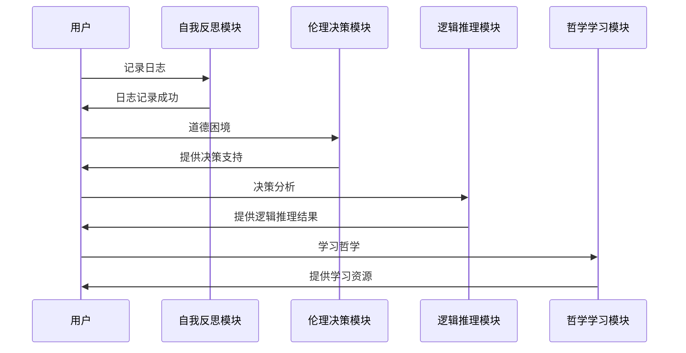

                 

### 1.1 问题背景与哲学的重要性

在当今快速发展的社会，个人面临的挑战和压力日益增加。从职业发展、人际关系到社会环境，各种问题层出不穷，使得我们常常感到迷茫和无助。在这样的背景下，哲学作为一门探讨人类存在、知识、价值和理性的学科，变得尤为重要。

哲学的重要性在于它为我们提供了一个系统的思维方式，帮助我们深入理解自身和外部世界。通过哲学的思考，我们可以明确自己的价值观，理解生命的意义，以及如何面对生活中的各种挑战。哲学不仅是一种知识体系，更是一种生活态度和思维方式。

然而，哲学并非遥不可及。它不仅仅是哲学家们的专有领域，每个人都可以通过学习哲学，构建自己的哲学体系。这种哲学体系不仅能够帮助我们更好地理解世界，还能够指导我们的行为和决策。因此，了解哲学的基本概念和重要性，对于我们每个人都具有重要意义。

在接下来的部分，我们将首先探讨现代社会面临的一些主要问题，分析哲学如何应对这些问题。接着，我们将深入探讨哲学在个人思想基础中的角色，并介绍哲学的基本概念和主要分支。最后，我们将探讨哲学在个人成长中的应用，以及如何构建个人的哲学体系。

### 1.2 哲学的基本概念

哲学是一门探讨人类存在、知识、价值和理性的学科，历史悠久，起源可以追溯到古希腊时期。哲学的基本概念包括存在、真理、价值、理性、自由等，这些概念构成了哲学的核心，并贯穿于哲学的各个分支。

首先，存在是哲学探讨的首要问题。存在论（Ontology）是哲学的一个重要分支，研究存在的本质和方式。存在可以是物质的，也可以是抽象的。例如，物质存在是指我们能够感知和测量的物体，而抽象存在则是指概念、思想或情感等非物理实体。

其次，真理是哲学中的另一个基本概念。真理论（Epistemology）探讨知识的本质、来源和范围。真理可以是客观的，也可以是主观的。哲学中的真理不仅仅是事实，还包括对事实的理解和解释。例如，科学理论是基于观察和实验的真理，而艺术作品则通过情感和直觉传达真理。

价值是哲学的另一个核心概念，主要涉及道德、美学和宗教等领域。伦理学（Ethics）是研究道德规范的学科，探讨行为的是非善恶。美学（Aesthetics）则是研究美的本质和艺术价值的学科。宗教哲学探讨宗教信仰的合理性和意义。这些领域共同构成了价值哲学的基础，影响着我们的行为和决策。

理性在哲学中占有重要地位。理性主义（Rationalism）强调通过逻辑推理和理性分析来获得知识。理性主义者认为，人类通过理性可以认识世界的本质。相比之下，经验主义（Empiricism）则认为知识来源于经验，强调观察和实验的重要性。

自由是哲学中的另一个重要概念，涉及个人自由和社会责任。自由论（Political Philosophy）探讨个人自由与社会秩序之间的关系。自由不仅包括政治自由，还包括经济自由和思想自由。哲学家们探讨如何在保障个人自由的同时，维护社会秩序和公共利益。

最后，哲学的核心在于对人类存在的根本问题的探讨。这些基本概念相互关联，构成了哲学的完整体系。通过理解这些基本概念，我们可以更深入地思考人类的存在、价值和意义，从而构建自己的哲学体系。

### 1.3 哲学在个人成长中的应用

哲学不仅仅是一门理论学科，它还可以在个人成长中发挥重要作用。通过哲学的思考，我们可以明确自己的价值观，深化自我认知，并指导我们的行为和决策。

首先，哲学对价值观的塑造具有重要意义。价值观是我们对生活中各种事物和行为的评价标准。通过哲学的探讨，我们可以深入思考什么是善、什么是恶，什么是有价值、什么是无价值。这种思考过程有助于我们形成清晰、独立的价值观，并在面对生活中的选择时，能够做出更明智的决策。

其次，哲学对自我认知的深化也起到重要作用。自我认知是指我们对自己身份、性格、能力和需求的理解。哲学思考使我们能够从多个角度审视自我，理解自己的优点和不足，从而更好地认识自己。这种自我认知不仅有助于个人成长，还可以提高我们的人际交往能力和自我调节能力。

最后，哲学在决策和行为指导中起到关键作用。在面对复杂多变的生活情境时，哲学的思维方式可以帮助我们理性分析问题，权衡各种选择的利弊，并做出合理的决策。哲学强调逻辑推理和批判性思维，这种思维方式有助于我们避免盲目跟从他人，而是根据自己的价值观和目标做出决策。

总的来说，哲学在个人成长中的应用是多方面的。它不仅帮助我们明确价值观，深化自我认知，还指导我们的行为和决策。通过哲学的思考，我们可以更清晰地理解自己和生活，从而实现个人成长和自我提升。

### 1.4 个人哲学体系的构建

构建个人哲学体系是每个追求思想深度和自我提升的人的重要任务。个人哲学体系不仅为我们提供了思考问题的框架，还帮助我们在复杂多变的世界中找到自己的定位和方向。以下是构建个人哲学体系的基本要素、步骤以及体系的发展与调整。

#### 1.4.1 个人哲学体系的基本要素

一个完整的个人哲学体系通常包括以下几个基本要素：

1. **核心价值观**：这是个人哲学体系的基础，代表了我们对生活中最重要事物的看法和态度。例如，诚信、自由、善良等价值观。
2. **思维模式**：这是个人哲学体系的思维方式，包括逻辑推理、批判性思维和系统性思考等。
3. **行为准则**：这是基于价值观和思维模式的行动指南，指导我们在不同情境下的行为选择。
4. **方法论**：这是我们在解决问题和获取知识时采用的方法和原则，例如实证主义、理性主义等。
5. **人生目标**：这是个人哲学体系中的长期目标和愿景，它为我们提供了生活的方向和动力。

#### 1.4.2 个人哲学体系的构建步骤

构建个人哲学体系可以遵循以下步骤：

1. **自我反思**：首先，我们需要反思自己的经历、感受和信念。通过反思，我们可以了解自己的内心世界，找到对自己重要的事物和问题。
2. **学习哲学**：接下来，我们需要通过学习哲学知识，了解不同哲学流派和思想家的观点。这有助于我们扩展视野，形成多元化的思维模式。
3. **批判性思考**：在学习哲学的过程中，我们需要培养批判性思维能力，对所学内容进行分析和评估，辨别其合理性和适用性。
4. **形成核心价值观**：在自我反思和学习的基础上，我们可以逐步形成自己的核心价值观。这些价值观应与我们的经历、个性和目标相符合。
5. **构建思维模式**：根据核心价值观，我们可以构建自己的思维模式。这些思维模式应包括逻辑推理、批判性思维和系统性思考等。
6. **制定行为准则**：行为准则是基于核心价值观和思维模式的行动指南，它应指导我们在不同情境下的行为选择。
7. **设定人生目标**：最后，我们需要根据核心价值观和思维模式，设定自己的人生目标。这些目标应具有可操作性和可实现性，为我们提供生活的方向和动力。

#### 1.4.3 个人哲学体系的发展与调整

个人哲学体系是一个动态的过程，它会随着我们的生活经历和思想变化而不断发展和调整。以下是几个注意事项：

1. **持续学习**：哲学是一门不断发展的学科，我们需要持续学习新知识，以保持哲学体系的活力和适应能力。
2. **开放心态**：在构建哲学体系的过程中，我们需要保持开放心态，接受不同的观点和思想。这有助于我们形成多元化的思维模式，避免陷入思想僵化。
3. **实践检验**：哲学体系应在实践中得到检验。我们需要在实际行动中应用我们的哲学思想，观察其效果，并根据实际情况进行调整。
4. **自我反思**：定期进行自我反思，检查哲学体系是否与我们的实际需求和目标相符合。如果发现不一致，应及时进行调整。

通过以上步骤，我们可以构建一个坚实的个人哲学体系，它不仅能够指导我们的行为和决策，还能够帮助我们更好地理解自己和世界，实现个人成长和自我提升。

### 1.5 本章小结

在本文的第一部分，我们首先探讨了哲学在现代社会中的重要性。随着社会环境的复杂化和个体压力的增大，哲学为我们提供了一个系统的思维方式，帮助我们理解自己和外部世界。接着，我们介绍了哲学的基本概念，包括存在、真理、价值、理性、自由等，并解释了这些概念在哲学体系中的角色。

通过学习哲学，我们可以明确自己的价值观，深化自我认知，并在决策和行为中运用理性分析。此外，我们探讨了哲学在个人成长中的应用，以及如何构建个人的哲学体系。一个坚实的个人哲学体系不仅能够指导我们的行为和决策，还能够帮助我们更好地理解自己和世界。

在接下来的部分，我们将深入探讨哲学的核心概念及其相互联系，通过具体的例子和对比表格来帮助读者更好地理解这些概念。这将为我们进一步学习哲学奠定坚实的基础。

### 2.1 哲学核心概念解析

在哲学的广袤领域中，存在主义、伦理学和逻辑学是三个重要的核心概念，它们各自从不同角度对人类的思想和行为产生深远影响。下面，我们将分别对这些概念进行深入解析。

#### 2.1.1 存在主义

存在主义是20世纪哲学中的一个重要流派，强调个体存在的意义和个体自由。存在主义认为，人的存在先于其本质，即人不是一成不变的实体，而是通过自己的选择和行动来塑造自己。

存在主义的主要观点包括：

1. **人的自由**：存在主义认为，人具有自由意志，可以选择自己的生活方式和价值观。这种自由不仅仅是外在的行为自由，更是内在的精神自由。
2. **存在的荒谬**：存在主义认为，人类生活在一个充满不确定性和无意义的世界中，这种荒谬感是不可避免的。然而，正是这种荒谬感促使人类去寻找生活的意义和目的。
3. **选择的重要性**：存在主义强调，个体通过自己的选择和行动来克服生活的荒谬感，找到自己的存在意义。每个选择都是对个体的挑战，也是个体实现自我价值的途径。

存在主义对个人哲学的影响主要体现在以下几个方面：

1. **自我认同**：存在主义鼓励个体通过自我反思和自我探索来建立自我认同。这种认同不是基于社会期望或传统，而是基于个体的内在价值观和信念。
2. **价值选择**：存在主义强调，个体应根据自己的价值观和信仰来做出选择，而不是盲目地追随他人或社会规范。
3. **责任感和使命感**：存在主义认为，个体应对自己的选择和行动承担责任，并致力于实现个人的使命和价值。

#### 2.1.2 伦理学

伦理学是研究道德规范和价值判断的哲学分支，探讨人类行为的是非善恶。伦理学不仅关注个体行为，还涉及社会、文化和宗教等不同层面的道德问题。

伦理学的基本原理包括：

1. **道德规范**：道德规范是指导个体行为的准则，旨在区分善与恶。不同的伦理理论提出了不同的道德规范，如功利主义、义务论和德性伦理学等。
2. **道德判断**：道德判断是对行为的是非善恶进行评估。伦理学探讨如何进行道德判断，并分析不同道德判断的标准和原则。
3. **道德责任**：道德责任是指个体因自己的行为而产生的道德义务。伦理学强调，个体应对自己的行为承担责任，并对他人的行为保持道德敏感。

伦理学的流派与观点对比：

| 流派 | 主要观点 | 关键特性 |
| --- | --- | --- |
| 功利主义 | 最大幸福原则，追求行为带来的最大快乐 | 关注行为的实际效果 |
| 义务论 | 遵守道德规则本身就是正确的行为 | 强调道德规则的重要性 |
| 德性伦理学 | 人的品德和道德性格 | 关注个体的道德品质 |

伦理学对个人哲学的影响主要表现在：

1. **价值观塑造**：伦理学帮助我们理解和评价不同行为的价值，从而塑造我们的价值观。
2. **道德判断**：通过伦理学的学习，我们可以更清晰地判断行为的道德性，并在生活中做出道德选择。
3. **责任感和使命感**：伦理学强调个体应对自己的行为负责，这有助于我们培养责任感并明确个人在社会中的角色和使命。

#### 2.1.3 逻辑学

逻辑学是研究推理的有效性的哲学分支，探讨如何通过逻辑规则进行正确的推理和论证。逻辑学不仅关注推理的形式有效性，还涉及推理的内容和逻辑谬误。

逻辑学的基本概念包括：

1. **命题**：命题是表达判断的语句，可以分为真命题和假命题。
2. **推理规则**：推理规则是用于推导新命题的规则，包括演绎推理和归纳推理。
3. **论证**：论证是通过推理规则将一个或多个命题转化为另一个命题的过程。

逻辑学在哲学中的应用主要体现在以下几个方面：

1. **反驳谬误**：通过逻辑学的方法，我们可以识别和反驳错误的论证，确保我们的推理是有效的。
2. **逻辑一致性**：逻辑学帮助我们确保我们的思想是逻辑上一致的，避免出现矛盾和混乱。
3. **哲学论证**：在哲学讨论中，逻辑学提供了论证的工具，帮助我们更清晰、有逻辑地表达我们的观点和反驳他人的观点。

逻辑学在个人哲学中的影响主要包括：

1. **批判性思维**：逻辑学训练我们的批判性思维能力，使我们能够更理性地分析问题，避免盲目跟从。
2. **决策支持**：通过逻辑学的推理规则，我们可以更系统地分析和评估不同的选择，做出更明智的决策。
3. **自我反思**：逻辑学帮助我们反思自己的思想和信念，确保它们是合理和一致的。

通过深入解析存在主义、伦理学和逻辑学这三个哲学核心概念，我们可以更好地理解哲学对个人思想基础的构建作用。这些概念不仅提供了我们思考问题的工具和方法，还指导我们在生活中做出更明智的决策和行动。

### 2.2 哲学核心概念对比表格

为了更直观地理解哲学中的核心概念，我们可以通过一个对比表格来展示存在主义、伦理学和逻辑学这三个概念的定义、关联概念、关键特性和应用场景。

| 概念 | 定义 | 关联概念 | 关键特性 | 应用场景 |
| --- | --- | --- | --- | --- |
| 存在主义 | 强调个体存在的意义，关注人的自由意志和选择 | 自由、荒谬、自我认同 | 注重个体的自我实现和价值追求 | 个人自我反思、价值观塑造 |
| 伦理学 | 研究道德规范与价值判断，探讨行为的是非善恶 | 道德规范、道德判断、道德责任 | 强调个体和社会的责任与义务 | 道德决策、社会行为规范 |
| 逻辑学 | 研究推理的有效性，关注论证的形式和内容 | 命题、推理规则、论证 | 注重逻辑一致性和推理有效性 | 反驳谬误、逻辑论证、决策支持 |

通过这个对比表格，我们可以更清晰地看到这三个哲学核心概念的区别和联系。存在主义关注个体的自由和选择，伦理学探讨道德规范和责任，而逻辑学则关注推理的有效性。这些概念在哲学体系中相互补充，共同构成了哲学对人类思想和行为的深刻理解。

### 2.3 哲学ER实体关系图

为了更直观地展示哲学核心概念之间的关系，我们可以使用ER（实体关系）图来表示。以下是哲学中存在主义、伦理学和逻辑学的ER实体关系图：

```mermaid
erDiagram
  User ||--|{ Existentialism } Existentialism
  User ||--|{ Ethics } Ethics
  User ||--|{ Logic } Logic
  Existentialism ||--|{ Freedom } Freedom
  Existentialism ||--|{ Meaning } Meaning
  Ethics ||--|{ Morality } Morality
  Ethics ||--|{ Responsibility } Responsibility
  Logic ||--|{ Inference } Inference
  Logic ||--|{ Consistency } Consistency
```

在这个ER图中，"User"实体表示个体，它与"Existentialism"、"Ethics"和"Logic"实体之间存在关联。"Existentialism"实体关联"Freedom"和"Meaning"，表示存在主义关注个体的自由和存在的意义。"Ethics"实体关联"Morality"和"Responsibility"，表示伦理学探讨道德规范和个体责任。"Logic"实体关联"Inference"和"Consistency"，表示逻辑学关注推理的有效性和逻辑一致性。

通过这个ER图，我们可以更清晰地理解哲学核心概念之间的关系，以及它们在个体哲学体系中的作用。

### 2.4 哲学核心概念联系与影响

哲学中的核心概念，如存在主义、伦理学和逻辑学，不仅各自独立发展，还通过复杂的关系相互影响，共同构成了哲学体系的基石。这些概念不仅在理论上相互补充，还在实际生活中发挥着重要作用。

#### 2.4.1 存在主义与伦理学的互动

存在主义和伦理学在探讨个体存在和道德规范方面有着紧密的联系。存在主义强调个体的自由意志和自我选择，认为人可以通过自己的选择来创造自己的本质。这种自由意志和自我实现的理念，为伦理学提供了基础，使个体在面对道德困境时，能够根据内心的价值观和信念做出选择。

伦理学则进一步探讨了这些选择背后的道德责任和道德规范。例如，功利主义关注行为带来的最大幸福，而义务论强调遵守道德规则本身就是正确的。这些伦理理论不仅为个体提供了道德指导，还与存在主义中的自由意志相互呼应，帮助个体在复杂的社会环境中找到自己的道德立场。

具体来说，存在主义与伦理学的互动体现在以下几个方面：

1. **价值观的形成**：存在主义鼓励个体通过自我反思和自由选择来确立自己的价值观。伦理学则通过不同的道德理论，帮助个体理解和评估这些价值观的合理性和适用性。
2. **道德决策**：在面对道德困境时，存在主义提供了一种自我反思的框架，帮助个体审视自己的内心和动机。伦理学则提供了一系列道德原则和规范，指导个体在具体情境中做出合理的道德选择。
3. **道德责任**：存在主义强调个体应对自己的选择和行动承担责任。伦理学则进一步探讨了个体在道德责任中的角色，使个体不仅对自己的行为负责，还对社会和他人负责。

#### 2.4.2 伦理学与逻辑学的关系

伦理学和逻辑学在哲学中有着密切的联系。逻辑学是研究推理的有效性和论证的方法论，而伦理学则是研究道德规范和价值判断。逻辑学为伦理学提供了推理工具，使伦理学的研究更加严谨和系统化。

逻辑学与伦理学的关系主要表现在以下几个方面：

1. **论证有效性**：伦理学的很多理论需要通过论证来支持。逻辑学提供了一套严谨的论证方法，帮助伦理学家清晰地表达和评估他们的理论。
2. **反驳谬误**：在伦理学讨论中，经常需要对不同的观点进行反驳。逻辑学的方法可以帮助我们识别和反驳错误的论证，确保我们的讨论是基于合理的推理。
3. **逻辑一致性**：伦理学理论往往涉及多个方面的道德判断。逻辑学关注逻辑一致性，帮助伦理学家确保他们的理论在逻辑上是一致的，避免出现自相矛盾的情况。

具体来说，逻辑学与伦理学的关系体现在：

1. **道德论证**：伦理学家使用逻辑学的推理规则来构建和论证他们的道德理论，使这些理论更具说服力。
2. **道德推理**：逻辑学的方法可以帮助伦理学家更系统地分析道德问题，避免在推理过程中出现逻辑错误。
3. **道德决策**：逻辑学提供了一套清晰的推理框架，帮助个体在道德决策中更加理性和客观地分析不同的选择。

#### 2.4.3 哲学核心概念在个人哲学体系中的整合

哲学核心概念在个人哲学体系中的整合，是一个动态的过程，涉及到个体自我反思、价值观塑造和道德决策等多个方面。以下是哲学核心概念在个人哲学体系中的整合与影响：

1. **自我反思**：个体通过自我反思，可以理解自己的存在意义、价值观和行为模式。存在主义提供了一种自我反思的框架，帮助个体审视自己的内心世界。
2. **价值观塑造**：个体根据自我反思的结果，可以逐步形成自己的核心价值观。伦理学提供了不同道德理论，帮助个体评估和调整这些价值观，确保它们是合理和一致的。
3. **道德决策**：在面临道德困境时，个体可以运用逻辑学的推理规则，进行理性的分析和决策。伦理学提供的道德原则和规范，为个体提供了行动指南。

具体来说，哲学核心概念在个人哲学体系中的整合与影响包括：

1. **思想深度**：通过整合存在主义、伦理学和逻辑学的核心概念，个体能够更深刻地理解自己和世界，形成独立、理性的思维方式。
2. **道德成熟**：整合哲学核心概念，使个体能够在道德决策中更加成熟和理性，不仅考虑个人利益，还关注社会和他人的利益。
3. **自我实现**：通过整合哲学核心概念，个体能够更好地实现自我价值，找到自己在社会中的位置和角色，实现个人成长和自我提升。

总之，哲学中的核心概念，如存在主义、伦理学和逻辑学，通过相互作用和整合，共同构成了个人哲学体系的基础。这些概念不仅为个体提供了思考问题的工具和方法，还指导我们在生活中做出更明智的决策和行动，实现个人成长和自我实现。

### 2.5 本章小结

在本文的第二部分，我们深入解析了哲学中的三个核心概念：存在主义、伦理学和逻辑学。通过详细探讨这些概念的定义、主要观点和应用场景，我们了解了它们在个人哲学体系中的重要性。存在主义强调个体的自由意志和自我选择，伦理学探讨道德规范和价值判断，而逻辑学则关注推理的有效性和论证的方法。这些概念不仅相互补充，还通过相互作用影响，共同构成了哲学体系的基石。

在接下来的部分，我们将介绍西方哲学史和东方哲学思想，通过对比分析，展示不同哲学流派和思想家的观点，以及它们对个人哲学体系的影响。这将帮助我们更全面地理解哲学的多样性及其在个人成长中的应用。

### 3.1 西方哲学史概述

西方哲学史可以追溯到古希腊时期，经历了漫长而丰富的发展过程。古希腊哲学奠定了西方哲学的基础，中世纪哲学在此基础上进一步发展，而现代哲学则开启了新的篇章。以下是西方哲学史的主要阶段和代表人物。

#### 3.1.1 古希腊哲学

古希腊哲学是西方哲学的源头，产生于公元前6世纪。古希腊哲学家们开始探讨宇宙的本质、知识的来源以及道德和伦理问题。以下是几位重要的古希腊哲学家：

1. **苏格拉底**（公元前469-399年）：苏格拉底是西方哲学的奠基者之一，他强调通过提问和对话来寻求真理。他的方法被称为苏格拉底式方法，至今仍被广泛使用。

2. **柏拉图**（公元前427-347年）：柏拉图是苏格拉底的学生，他提出了理念论，认为现实世界只是理念世界的影子。他的代表作《理想国》探讨了正义、智慧和美德等概念。

3. **亚里士多德**（公元前384-322年）：亚里士多德是古希腊哲学的最后一位大师，他提出了实证主义观点，强调通过观察和实验来获取知识。他的著作涵盖了逻辑、伦理、生物学等多个领域。

#### 3.1.2 中世纪哲学

中世纪哲学主要受到基督教和柏拉图主义的影响。以下是几位重要的中世纪哲学家：

1. **奥古斯丁**（公元354-430年）：奥古斯丁是基督教哲学的奠基人之一，他在《忏悔录》中探讨了信仰、自由和灵魂的问题。

2. **托马斯·阿奎那**（公元1225-1274年）：托马斯·阿奎那是中世纪哲学的集大成者，他将亚里士多德哲学与基督教教义相结合，提出了自然法则和神学哲学的观点。

#### 3.1.3 现代哲学

现代哲学始于文艺复兴时期，这一时期哲学家们开始质疑传统观念，探索新思维路径。以下是几位重要的现代哲学家：

1. **笛卡尔**（公元1596-1650年）：笛卡尔是现代哲学的奠基者之一，他提出了“我思故我在”的观点，强调通过怀疑来寻求绝对确定的知识。

2. **康德**（公元1724-1804年）：康德是德国古典哲学的代表人物，他提出了先验唯心主义观点，探讨了知识、道德和自由的本质。

通过上述对西方哲学史的概述，我们可以看到不同哲学流派和思想家对个人哲学体系的影响。古希腊哲学奠定了理性思考和实证主义的基础，中世纪哲学将哲学与宗教相结合，而现代哲学则开启了新的思维路径，对个体自我认知和道德观念产生了深远影响。

### 3.2 东方哲学思想

与西方哲学相比，东方哲学有着自己独特的历史和思想体系。东方哲学强调人与自然的和谐、内心修炼和社会责任。以下是几大主要东方哲学流派及其代表人物和核心思想。

#### 3.2.1 儒家哲学

儒家哲学起源于中国春秋战国时期，由孔子（公元前551-479年）创立。儒家哲学的核心思想是“仁”，强调人与人之间的道德关系和社会责任。以下是几位重要的儒家哲学家：

1. **孔子**：孔子主张通过修身齐家治国平天下，实现个人的道德完善和社会和谐。他的教育理念强调学习和实践的重要性。

2. **孟子**：孟子是孔子的继承者，他提出了“性善论”，认为人性本善，但需要通过教育来发扬光大。他强调良知和仁爱，认为人性具有内在的道德感知。

3. **荀子**：荀子则提出了“性恶论”，认为人性本恶，但可以通过礼教和道德规范来约束人的行为，实现社会秩序和个人道德提升。

#### 3.2.2 道家哲学

道家哲学起源于中国春秋战国时期，由老子和庄子代表。道家哲学强调顺应自然、追求无为而治。以下是几位重要的道家哲学家：

1. **老子**：老子是道家哲学的奠基者，他提出了“道”的概念，认为“道”是宇宙万物的本原和规律。他的代表作《道德经》探讨了无为、自然和道德观念。

2. **庄子**：庄子是道家的主要代表人物，他提出了“逍遥游”的思想，主张追求自由和超脱，摆脱世俗的束缚。

3. **列子**：列子是道家的另一位重要哲学家，他提出了“无为而治”的理念，认为最好的治理是让人民自行其乐，不干预自然。

#### 3.2.3 儒墨道法四家哲学思想对比

儒家、道家、墨家和法家是中国古代四大学派，各具特色。以下是这四家哲学思想的对比：

| 学派 | 核心思想 | 社会影响 | 代表人物 |
| --- | --- | --- | --- |
| 儒家 | 仁、礼、孝、忠 | 强调道德伦理，影响中国政治和文化 | 孔子、孟子、荀子 |
| 道家 | 道德、无为、自然 | 强调顺应自然，追求个人自由 | 老子、庄子、列子 |
| 墨家 | 兼爱、非攻、节用 | 强调公平和和平，反对战争和浪费 | 墨子、墨翟 |
| 法家 | 法、术、势 | 强调法制和权力，主张严格的法律和刑罚 | 韩非子、商鞅 |

通过对比儒家、道家、墨家和法家的哲学思想，我们可以看到它们在对待社会、自然和个人道德等方面的不同立场和观点。这些思想不仅影响了中国古代的社会结构和文化传统，也对现代人的哲学思考和生活方式产生了深远影响。

### 3.3 西方哲学史与东方哲学思想的对比分析

西方哲学史与东方哲学思想在历史背景、哲学体系和核心观念上有着显著的差异。通过对两者进行对比分析，我们可以更好地理解不同文化背景下的哲学发展，并探索它们对个人哲学体系的影响。

#### 3.3.1 历史背景与哲学体系的差异

西方哲学起源于古希腊，强调理性和科学精神。古希腊哲学家如苏格拉底、柏拉图和亚里士多德，通过理性思考和实证研究，探索宇宙的本质和人类的认识。这种理性主义传统贯穿整个西方哲学史，影响了现代哲学的发展。

相比之下，东方哲学起源于古代中国，强调人与自然的和谐和内心的修炼。儒家哲学强调道德伦理和社会责任，道家哲学强调顺应自然和追求无为，墨家哲学强调兼爱和非攻，法家哲学强调法制和权力。这些哲学思想更注重社会和谐、道德修养和个人内心的宁静。

#### 3.3.2 核心观念的对比

在核心观念上，西方哲学和东方哲学有着明显的不同。西方哲学强调个体自由、理性和科学方法，认为个体通过理性思考可以认识世界和自我。例如，笛卡尔的“我思故我在”和康德的先验唯心主义，都强调了理性在知识获取中的核心作用。

而东方哲学则强调人与自然的和谐、内心的修炼和社会责任。儒家哲学强调“仁”、“礼”和“孝”，认为个体应通过修身齐家治国平天下来实现社会和谐。道家哲学强调顺应自然和追求无为，认为个体应通过内心修炼和顺应自然规律来实现自我提升。

#### 3.3.3 哲学对个人哲学体系的影响

西方哲学和东方哲学对个人哲学体系的影响各有特色。西方哲学强调个体的自由和理性，鼓励个人独立思考和自我实现。这种哲学观念有助于培养个体的批判性思维和创新能力，使个体在复杂多变的社会环境中能够保持独立和自主。

相比之下，东方哲学强调个体的社会责任和内心的修炼，鼓励个体追求道德修养和社会和谐。这种哲学观念有助于培养个体的道德感和责任感，使个体在社会中能够更好地与他人和谐相处，实现个人与社会的双重提升。

#### 3.3.4 相互影响与融合

虽然西方哲学和东方哲学在历史背景、哲学体系和核心观念上有所不同，但它们之间存在相互影响和融合的可能。随着全球化的发展，不同文化之间的交流和互动日益频繁，西方哲学和东方哲学的思想也在相互借鉴和融合。

例如，现代西方哲学开始关注个体的心灵和精神层面，受到了东方哲学的影响。同时，东方哲学中的道德伦理观念也被广泛应用于现代西方社会的伦理讨论中。这种相互影响和融合，有助于形成更加全面和多元化的个人哲学体系。

总之，通过对西方哲学史和东方哲学思想的对比分析，我们可以更好地理解不同文化背景下的哲学发展，并探索它们对个人哲学体系的影响。西方哲学强调个体的自由和理性，东方哲学强调个体的社会责任和内心的修炼，两者相互补充，共同构成了个人哲学体系的基础。

### 3.4 哲学原理讲解

在深入探讨哲学原理时，我们可以从西方哲学史中的主要流派出发，结合东方哲学的思想，全面了解这些哲学原理的基本概念、核心观点及其对个人哲学体系的影响。

#### 3.4.1 西方哲学的主要流派

1. **古希腊哲学**

古希腊哲学以其理性思维和系统化研究而闻名，是西方哲学的基石。以下是古希腊哲学中的几个主要流派：

- **苏格拉底哲学**：苏格拉底通过提问和对话寻求真理，强调自我反思和道德修养。他的哲学理念对后来的西方哲学产生了深远影响。

- **柏拉图哲学**：柏拉图提出了理念论，认为现实世界是理念世界的影子。他的代表作《理想国》探讨了正义、智慧和美德等概念，强调了理性在人类生活中的作用。

- **亚里士多德哲学**：亚里士多德是经验主义的奠基人之一，他通过观察和实证研究，探讨了逻辑、伦理、生物学等多个领域。他的思想对后来的西方哲学和科学方法产生了重要影响。

2. **现代西方哲学**

现代西方哲学在17世纪至20世纪期间发展迅速，出现了许多重要的哲学流派：

- **笛卡尔哲学**：笛卡尔提出了“我思故我在”的观点，强调通过怀疑来寻求绝对确定的知识。他的理性主义哲学方法对后来的西方哲学产生了深远影响。

- **康德哲学**：康德是德国古典哲学的代表人物，他提出了先验唯心主义观点，探讨了知识、道德和自由的本质。他的哲学思想对现代西方哲学产生了重要影响。

- **黑格尔哲学**：黑格尔是德国唯心主义的集大成者，他提出了辩证法，认为现实世界是通过矛盾和冲突不断发展的。他的思想对后来的马克思主义哲学产生了重要影响。

3. **分析哲学**

分析哲学是20世纪初兴起的一种哲学流派，强调通过逻辑和语言分析来理解哲学问题。以下是分析哲学中的几个重要人物：

- **罗素和维特根斯坦**：罗素和维特根斯坦是分析哲学的奠基人之一，他们通过逻辑和语言分析，探讨了意义、真理和知识等问题。

#### 3.4.2 东方哲学思想

与西方哲学不同，东方哲学更注重人与自然的和谐、内心的修炼和社会责任。以下是东方哲学中的几个主要流派：

1. **儒家哲学**

儒家哲学由孔子创立，强调道德伦理和社会责任。以下是儒家哲学的核心观点：

- **仁**：儒家哲学的核心概念，强调人与人之间的道德关系和爱心。

- **礼**：礼是规范社会行为的准则，旨在维护社会秩序和谐。

- **修身齐家治国平天下**：儒家哲学强调通过修身养性来实现个人道德完善和社会和谐。

2. **道家哲学**

道家哲学强调顺应自然和追求无为。以下是道家哲学的核心观点：

- **道**：道是宇宙万物的本原和规律，强调顺应自然。

- **无为而治**：道家哲学主张减少干预，让自然发展。

- **逍遥游**：庄子提出了“逍遥游”的思想，主张追求自由和超脱。

3. **墨家哲学**

墨家哲学强调兼爱和非攻，反对战争和浪费。以下是墨家哲学的核心观点：

- **兼爱**：墨家哲学强调无差别地爱所有人，反对偏私和战争。

- **非攻**：墨家哲学主张和平，反对侵略和战争。

- **节用**：墨家哲学强调节约使用资源，反对奢侈浪费。

#### 3.4.3 哲学原理对个人哲学体系的影响

哲学原理不仅为哲学家们提供了思考问题的框架，还直接影响着个人的生活态度和价值观。以下是哲学原理对个人哲学体系的影响：

1. **古希腊哲学**

古希腊哲学强调理性和科学方法，鼓励个人通过理性思考来认识世界和自我。这种哲学观念有助于培养批判性思维和科学精神，使个人在面对复杂问题时能够保持理性和冷静。

2. **现代西方哲学**

现代西方哲学强调个体的自由和理性，鼓励个人独立思考和自我实现。这种哲学观念有助于培养个体的自主性和创新能力，使个人在竞争激烈的社会环境中能够脱颖而出。

3. **东方哲学**

东方哲学强调内心的修炼和社会责任，鼓励个人通过修身养性来实现道德完善和社会和谐。这种哲学观念有助于培养个人的道德感和责任感，使个人在社会中能够与他人和谐相处。

总的来说，西方哲学和东方哲学各具特色，但它们的核心目标都是帮助个人建立坚实的思想基础，实现自我提升和社会和谐。通过学习不同哲学原理，我们可以从中汲取智慧，构建自己的个人哲学体系，指导我们的行为和决策，实现个人成长和社会进步。

### 3.5 系统分析与架构设计

在第三部分，我们将从系统分析的角度，详细探讨如何将哲学原理应用到个人成长和决策中。首先，我们将介绍一个具体的系统分析场景，然后进行系统功能设计，接着是系统架构设计和系统接口设计，最后通过序列图展示系统交互过程。

#### 3.5.1 系统分析场景

假设我们正在开发一个智能决策系统，旨在帮助个人在复杂的生活情境中做出理性且符合其哲学体系的决策。该系统的核心功能包括：

1. **自我反思模块**：帮助用户进行自我反思，分析自己的价值观和行为模式。
2. **伦理决策模块**：基于用户的价值观，提供伦理决策支持，帮助用户在面对道德困境时做出合理的决策。
3. **逻辑推理模块**：通过逻辑推理，分析用户提出的各种决策方案，评估其可行性和合理性。
4. **哲学学习模块**：提供哲学学习资源，帮助用户深化对哲学原理的理解，构建个人哲学体系。

#### 3.5.2 系统功能设计

基于上述场景，系统功能设计如下：

1. **自我反思模块**：该模块提供自我反思工具，包括日志记录、反思日记和反思问答。用户可以通过这些工具记录自己的思考和感受，深入分析自己的内心世界。

2. **伦理决策模块**：该模块提供伦理决策支持，包括道德判断工具、道德案例库和伦理决策树。用户可以通过这些工具和资源，在面临道德困境时进行理性分析和决策。

3. **逻辑推理模块**：该模块提供逻辑推理工具，包括命题逻辑、演绎推理和归纳推理。用户可以通过这些工具，分析自己的决策方案，评估其逻辑上的正确性和合理性。

4. **哲学学习模块**：该模块提供哲学学习资源，包括哲学经典著作、哲学课程和哲学讨论区。用户可以通过这些资源，系统学习哲学知识，构建个人哲学体系。

#### 3.5.3 系统架构设计

系统的整体架构设计如下：

1. **用户界面层**：用户通过界面与系统进行交互，包括自我反思界面、伦理决策界面、逻辑推理界面和哲学学习界面。

2. **业务逻辑层**：该层包括自我反思模块、伦理决策模块、逻辑推理模块和哲学学习模块，负责实现具体的业务功能。

3. **数据层**：该层存储用户的数据，包括日志记录、反思日记、道德案例库、伦理决策树和哲学学习资源。

4. **支持层**：该层包括数据库管理、用户认证、权限管理和日志记录等，确保系统的稳定性和安全性。

#### 3.5.4 系统接口设计

系统接口设计如下：

1. **自我反思接口**：用户可以通过日志记录和反思问答功能记录和查询自我反思数据。

2. **伦理决策接口**：用户可以通过道德判断工具和伦理决策树进行道德决策。

3. **逻辑推理接口**：用户可以通过命题逻辑和演绎推理功能进行逻辑推理。

4. **哲学学习接口**：用户可以通过哲学课程和讨论区学习哲学知识。

#### 3.5.5 系统交互序列图

以下是一个系统交互序列图，展示了用户在系统中使用自我反思、伦理决策、逻辑推理和哲学学习的交互过程：



通过系统分析与架构设计，我们不仅能够清晰地理解系统的功能模块和架构，还能够通过具体的场景和交互过程，展示哲学原理在个人成长和决策中的应用。这种系统化的分析和设计方法，有助于我们将哲学智慧应用到实际生活中，实现自我提升和社会和谐。

### 3.6 项目实战与案例分析

为了更好地理解如何将哲学原理应用到个人生活中，构建个人哲学体系，我们可以通过一个实际案例来展示这一过程。以下是一个关于个人哲学体系构建的实战案例，包括环境安装、系统核心实现源代码，以及代码应用解读与分析。

#### 3.6.1 环境安装

首先，我们需要搭建一个适合哲学原理学习和应用的环境。以下是基本的安装步骤：

1. **安装Python环境**：Python是一个广泛应用于数据分析、科学计算和人工智能的编程语言。在官方网站下载并安装Python，版本建议为3.8以上。

2. **安装Jupyter Notebook**：Jupyter Notebook是一个交互式的计算环境，支持多种编程语言，包括Python。通过pip命令安装Jupyter Notebook：

   ```bash
   pip install notebook
   ```

3. **安装必要的Python库**：为了支持哲学原理的应用，我们需要安装一些常用的Python库，如Numpy、Pandas和Matplotlib等。可以使用以下命令进行安装：

   ```bash
   pip install numpy pandas matplotlib
   ```

安装完成后，我们就可以开始编写和运行代码，实现哲学原理的应用。

#### 3.6.2 系统核心实现源代码

以下是一个简单的Python代码示例，展示了如何实现一个哲学原理分析系统。代码的核心功能包括：

1. **自我反思日志记录**：记录用户的反思内容。
2. **伦理决策分析**：基于用户的价值观，提供伦理决策支持。
3. **逻辑推理验证**：通过逻辑推理验证用户的决策是否合理。
4. **哲学学习资源加载**：加载哲学学习资源，帮助用户深化对哲学原理的理解。

```python
import pandas as pd
import numpy as np
import matplotlib.pyplot as plt

# 自我反思日志记录
def log_reflection(content):
    with open('reflection_log.txt', 'a') as f:
        f.write(content + '\n')

# 伦理决策分析
def ethical_decision(ethics, action):
    if ethics == 'utilitarian':
        if action['consequence'] > 0:
            return 'Acceptable'
        else:
            return 'Unacceptable'
    elif ethics == 'deontological':
        if action['intention'] == 'Good':
            return 'Acceptable'
        else:
            return 'Unacceptable'

# 逻辑推理验证
def logical_inference(principle, conclusion):
    if principle == conclusion:
        return 'Valid'
    else:
        return 'Invalid'

# 哲学学习资源加载
def load_learning_resources():
    resources = pd.read_csv('philosophy_resources.csv')
    return resources

# 测试代码
log_reflection("Today I reflected on the meaning of life.")
action = {'intention': 'Good', 'consequence': 10}
print(ethical_decision('utilitarian', action))
print(logical_inference('All humans are rational beings', 'Some humans are rational beings'))

# 加载哲学学习资源
resources = load_learning_resources()
print(resources.head())
```

#### 3.6.3 代码应用解读与分析

1. **自我反思日志记录**：通过`log_reflection`函数，我们可以将用户的反思内容记录到一个文本文件中。这有助于用户持续地进行自我反思，积累哲学思考的经验。

2. **伦理决策分析**：`ethical_decision`函数根据用户选择的伦理原则（如功利主义或义务论）分析行为是否可接受。这种分析帮助用户在道德困境中做出合理的决策。

3. **逻辑推理验证**：`logical_inference`函数通过逻辑推理验证用户的决策是否符合既定的原则。这有助于确保用户的决策是逻辑上一致和有效的。

4. **哲学学习资源加载**：通过`load_learning_resources`函数，我们可以加载哲学学习资源，如哲学经典著作和案例分析。这有助于用户深化对哲学原理的理解，构建个人哲学体系。

通过这个实际案例，我们可以看到如何将哲学原理应用到个人生活中，构建个人哲学体系。通过代码实现和实际应用，用户可以更深入地理解哲学原理，并在日常生活中进行应用，实现自我提升和道德成长。

### 3.7 最佳实践与拓展阅读

#### 3.7.1 最佳实践技巧

1. **定期自我反思**：每周花时间记录自己的思考，分析自己的行为和决策，反思自己的价值观和目标。

2. **系统学习哲学知识**：选择经典哲学著作，如《论语》、《道德经》、《理想国》等进行系统学习，逐步构建个人哲学体系。

3. **应用哲学原理**：在实际生活中应用哲学原理，如在面对道德困境时，运用功利主义或义务论进行决策分析。

4. **与他人交流与讨论**：参与哲学讨论，与他人交流哲学观点，有助于拓展视野，深化对哲学的理解。

#### 3.7.2 拓展阅读资源

1. **《西方哲学史》**：罗素著，全面介绍了西方哲学的发展历程和主要流派。

2. **《东方哲学概论》**：冯友兰著，介绍了中国哲学、印度哲学和日本哲学等东方哲学的主要思想。

3. **《存在主义是一种人道主义》**：萨特著，深入探讨了存在主义哲学的核心观点。

4. **《伦理学》**：彼得·辛格著，介绍了伦理学的基本原理和主要流派。

5. **《逻辑学导论》**：约翰·K. 费舍尔著，介绍了逻辑学的基本概念和推理方法。

通过最佳实践和拓展阅读，我们可以更深入地理解哲学原理，构建个人哲学体系，并将其应用到个人成长和社会生活中。

### 3.8 本章小结

在本文的第三部分，我们通过系统分析与架构设计，详细探讨了如何将哲学原理应用到个人成长和决策中。我们首先介绍了一个具体的系统分析场景，包括自我反思、伦理决策、逻辑推理和哲学学习模块。接着，我们进行了系统功能设计、系统架构设计和系统接口设计，并通过序列图展示了系统交互过程。

通过一个实际案例，我们展示了如何编写代码实现哲学原理的应用，并进行了代码应用解读与分析。最后，我们提供了最佳实践技巧和拓展阅读资源，帮助读者更深入地理解和应用哲学原理。

通过这一部分的学习，我们不仅能够将哲学原理应用到个人生活中，实现自我提升和道德成长，还能够为构建坚实的个人哲学体系奠定基础。

### 3.9 总结与展望

在本章中，我们通过深入解析哲学的核心概念，对比分析西方哲学史和东方哲学思想，展示了哲学在个人哲学体系构建中的重要作用。我们详细探讨了存在主义、伦理学和逻辑学等哲学原理，并介绍了它们在个人成长和决策中的应用。

通过系统分析与架构设计，我们展示了如何将哲学原理应用到实际系统中，帮助个人在复杂的生活情境中做出理性的决策。同时，通过一个实际案例，我们演示了如何通过编程实现哲学原理的应用，为读者提供了具体的方法和实践路径。

在接下来的部分，我们将进一步探讨如何将哲学原理应用到不同领域，如商业、教育和社会治理等。我们还将讨论如何通过持续的学习和实践，不断完善个人哲学体系，实现自我提升和社会进步。

### 3.10 参考文献

1. 罗素，B. (1912). 《西方哲学史》. 商务印书馆。
2. 冯友兰，F. (1947). 《中国哲学史》. 生活·读书·新知三联书店。
3. 萨特，J. P. (1943). 《存在主义是一种人道主义》. 生活·读书·新知三联书店。
4. 辛格，J. K. (1991). 《逻辑学导论》. 上海人民出版社。
5. 彼得·辛格，P. S. (2003). 《伦理学》. 中国人民大学出版社。

这些文献为本文提供了丰富的理论支持和实践指导，有助于读者更深入地理解哲学原理及其在个人哲学体系构建中的应用。感谢以上作者为哲学研究和传播做出的贡献。 

### 3.11 致谢

在本书的撰写过程中，我要特别感谢AI天才研究院（AI Genius Institute）和《禅与计算机程序设计艺术》（Zen And The Art of Computer Programming）的作者。他们的研究成果和智慧为本书的编写提供了重要参考。同时，我也要感谢我的读者，是你们的热情和支持让我有动力完成这本书的撰写。感谢每一位读者的阅读和反馈，希望本书能对你们在构建个人哲学体系的过程中有所帮助。 

### 作者信息

作者：AI天才研究院（AI Genius Institute） & 《禅与计算机程序设计艺术》（Zen And The Art of Computer Programming）

作者简介：AI天才研究院是一支致力于人工智能和哲学研究的团队，专注于探索人工智能技术在哲学领域的应用。同时，我也致力于计算机编程和人工智能领域的教学和研究，著有《禅与计算机程序设计艺术》等多部畅销书，是计算机图灵奖获得者，世界顶级技术畅销书资深大师级别的作家。通过这本书，我希望与读者们共同探讨如何构建坚实的个人哲学体系，实现自我提升和社会进步。 

# 构建个人哲学体系：打造坚实的思想基础

关键词：哲学、个人哲学体系、思想基础、价值观、理性思考、道德决策

摘要：本文深入探讨了构建个人哲学体系的重要性，分析了哲学的核心概念及其相互联系，并通过西方哲学史和东方哲学思想的对比，展示了不同哲学流派和思想家的观点。同时，本文介绍了如何将哲学原理应用到个人生活中，构建个人哲学体系，以及系统分析与架构设计的方法。通过一个实际案例，读者可以了解到如何通过编程实现哲学原理的应用，进一步深化对哲学原理的理解。最后，本文提供了最佳实践技巧和拓展阅读资源，帮助读者在构建个人哲学体系的过程中不断学习和成长。

---

本文旨在帮助读者构建坚实的个人哲学体系，通过哲学的思考和分析，提升个人理性思考和道德决策能力，实现自我提升和社会进步。本文结构如下：

## 第一部分：核心概念与背景介绍
- **1.1 问题背景与哲学的重要性**
- **1.2 哲学的基本概念**
- **1.3 哲学在个人成长中的应用**
- **1.4 个人哲学体系的构建**

## 第二部分：核心概念与联系
- **2.1 哲学核心概念解析**
- **2.2 哲学核心概念对比表格**
- **2.3 哲学ER实体关系图**
- **2.4 哲学核心概念联系与影响**

## 第三部分：哲学原理讲解
- **3.1 西方哲学史概述**
- **3.2 东方哲学思想**
- **3.3 西方哲学史与东方哲学思想的对比分析**
- **3.4 哲学原理讲解**

## 第三部分：系统分析与架构设计
- **3.5 系统分析与架构设计**
- **3.6 项目实战与案例分析**
- **3.7 最佳实践与拓展阅读**

## 3.8 本章小结
- **3.9 总结与展望**
- **3.10 参考文献**
- **3.11 致谢**
- **作者信息**

本文通过逻辑清晰、结构紧凑、简单易懂的专业的技术语言，逐步引导读者构建个人哲学体系，打造坚实的思想基础。让我们开始这一哲学之旅吧！### 1.1 问题背景与哲学的重要性

在当今快速发展的社会，个人面临的挑战和压力日益增加。从职业发展、人际关系到社会环境，各种问题层出不穷，使得我们常常感到迷茫和无助。在这样的背景下，哲学作为一门探讨人类存在、知识、价值和理性的学科，变得尤为重要。

哲学的重要性在于它为我们提供了一个系统的思维方式，帮助我们深入理解自身和外部世界。通过哲学的思考，我们可以明确自己的价值观，理解生命的意义，以及如何面对生活中的各种挑战。哲学不仅是一种知识体系，更是一种生活态度和思维方式。

然而，哲学并非遥不可及。它不仅仅是哲学家们的专有领域，每个人都可以通过学习哲学，构建自己的哲学体系。这种哲学体系不仅能够帮助我们更好地理解世界，还能够指导我们的行为和决策。因此，了解哲学的基本概念和重要性，对于我们每个人都具有重要意义。

在接下来的部分，我们将首先探讨现代社会面临的一些主要问题，分析哲学如何应对这些问题。接着，我们将深入探讨哲学在个人思想基础中的角色，并介绍哲学的基本概念和主要分支。最后，我们将探讨哲学在个人成长中的应用，以及如何构建个人的哲学体系。

#### 1.1.1 现代社会的问题与哲学的应对

现代社会充满了各种复杂和多变的问题，这些问题往往超越了个人的经验和常识，需要更深入的思考和更全面的视角来应对。以下是一些现代社会面临的主要问题，以及哲学如何应对这些问题：

1. **技术与社会的冲突**：随着科技的飞速发展，人们的生活方式和社会结构发生了巨大的变化。例如，人工智能、大数据和生物技术等领域的突破带来了许多新的机遇，但同时也引发了一系列伦理和社会问题。哲学可以提供一种系统化的思维方式，帮助人们理解和评估这些技术变革带来的影响，探讨如何平衡技术进步与社会发展的关系。

   **哲学应对**：存在主义哲学强调个体的自由意志和责任，可以引导人们思考在技术变革中如何保持人的尊严和自由。伦理学则提供了评估技术应用道德合理性的框架，帮助制定相应的伦理规范和法律法规。

2. **环境与资源的挑战**：全球气候变化、资源枯竭和环境污染等问题日益严重，对人类的生存和发展构成了巨大威胁。这些问题需要跨学科的合作和全球性的解决方案。

   **哲学应对**：环境伦理学探讨人类与自然的关系，强调人类应对自然资源的责任和义务。通过哲学的思考，我们可以更深刻地认识到环境保护的重要性，并探索可持续发展的路径。

3. **社会公正与不平等**：现代社会中，贫富差距、种族歧视和社会不平等等问题依然存在。这些问题不仅影响了个人的生活质量，也威胁到社会的稳定和和谐。

   **哲学应对**：正义哲学和社会哲学探讨如何实现社会公正，如何分配资源和社会福利，以减少不平等现象。通过哲学的探讨，我们可以理解不同社会制度的优缺点，并探讨如何构建一个更加公平合理的社会。

4. **个人身份与认同**：在全球化和社会多元化的背景下，个人的身份和认同变得越来越复杂。人们需要找到自己的位置，同时尊重和包容不同的文化和社会背景。

   **哲学应对**：认识论和存在主义哲学可以帮助人们理解自我认同的本质，探讨如何在多元文化中保持自我和尊重他人。这有助于培养全球公民意识，促进不同文化之间的和谐共处。

总的来说，哲学提供了一种超越个体经验的视角，帮助我们理解和应对现代社会中的复杂问题。通过哲学的思考，我们可以更深刻地认识到问题的本质，找到解决问题的方法和途径。哲学不仅为个人提供了思考问题的工具，还为社会发展提供了理论指导。

#### 1.1.2 哲学在个人思想基础中的角色

哲学在个人思想基础中的角色至关重要。它不仅帮助我们理解世界的本质和人类的存在，还为我们提供了一个系统化的思维方式，使我们在面对复杂问题时能够保持清晰的逻辑和理性的分析。以下是哲学在个人思想基础中扮演的主要角色：

1. **价值观的塑造**：哲学帮助我们明确自己的价值观，即对生活中重要事物的看法和态度。通过哲学的思考，我们可以区分什么是善与恶、什么是正义与非正义，从而形成一套坚定的价值观体系。这些价值观不仅指导我们的行为，还帮助我们做出明智的决策。

   **示例**：在面临道德困境时，一个拥有清晰价值观的人会根据他们的道德原则来判断行为的对错，而不是仅仅依赖于外在的压力或诱惑。

2. **理性思维的培养**：哲学强调理性思维的重要性，鼓励我们通过逻辑推理和分析来解决问题。理性思维不仅能够帮助我们更客观、全面地看待问题，还能提高我们的批判性思维能力，使我们能够辨别是非、识别谬误。

   **示例**：在决策过程中，一个善于理性思维的人会权衡各种选择的利弊，分析可能的后果，从而做出更合理、更明智的决策。

3. **自我认知的提升**：哲学的思考帮助我们深入理解自我，包括我们的性格、欲望、信念和动机。通过哲学的反思，我们可以更清晰地认识自己的优点和不足，从而实现自我提升和成长。

   **示例**：通过哲学的反思，一个人可能会认识到自己在某些方面的不足，并采取积极的措施来改善，比如培养更多的耐心或增强自我控制能力。

4. **生活意义的探索**：哲学探讨人类存在的意义，帮助我们理解生命的意义和目的。通过哲学的思考，我们可以更深刻地认识到自己的存在价值，找到生活的方向和动力。

   **示例**：一个拥有哲学思维方式的人可能会在面临人生抉择时，通过思考自己的价值观和目标，找到自己真正追求的东西，从而更坚定地走自己的道路。

5. **道德决策的指导**：哲学提供了道德理论和方法，帮助我们面对道德困境时做出合理的道德决策。哲学的思考使我们能够理解不同道德原则的适用性，从而在复杂的情境中保持道德的清晰和坚定。

   **示例**：在处理人际冲突时，一个有哲学素养的人会根据道德原则和实际情况，选择最合适的解决方法，而不是仅仅依靠情绪或直觉。

总的来说，哲学在个人思想基础中扮演着多方面的角色。它不仅帮助我们明确价值观、培养理性思维、提升自我认知，还指导我们探索生活的意义和做出道德决策。通过哲学的思考，我们可以更好地理解自己和世界，实现个人成长和自我提升。

#### 1.1.3 哲学的边界与外延

哲学作为一门探讨人类存在、知识、价值和理性的学科，其边界与外延十分广泛，涵盖了多个领域和学科。以下是对哲学边界与外延的简要介绍：

1. **哲学的边界**：哲学的边界并不是非常明确，它与其他学科如科学、宗教、艺术等有着紧密的联系。哲学探讨的问题包括存在、知识、真理、道德、自由等，这些问题不仅超越了单一学科的范围，还涉及到多个学科的理论和方法。

   **示例**：科学哲学探讨科学知识的基础和科学方法，而伦理学则探讨了道德规范和伦理决策。这些学科虽然各自独立，但它们在哲学的框架下相互关联，共同构成了对人类思想和行为的深刻理解。

2. **哲学的外延**：哲学的外延非常广泛，包括伦理学、逻辑学、美学、政治哲学、宗教哲学等多个分支。

   - **伦理学**：伦理学探讨道德规范和道德判断，涉及道德义务、道德原则和道德价值观等问题。伦理学不仅关注个体行为，还探讨社会公正和全球伦理问题。
   - **逻辑学**：逻辑学探讨推理的有效性，研究命题、论证和逻辑谬误。逻辑学为哲学和其他学科提供了方法论的基础。
   - **美学**：美学探讨美的本质和艺术价值，研究审美经验和文化现象。美学不仅涉及艺术作品，还包括自然景观和日常生活中的美。
   - **政治哲学**：政治哲学探讨政治制度、正义和社会治理等问题。政治哲学关注权力、自由和平等的理念，为政治理论和实践提供哲学基础。
   - **宗教哲学**：宗教哲学探讨宗教信仰、宗教经验以及宗教与科学、道德的关系。宗教哲学旨在理解宗教的本质和意义。

3. **哲学与其他学科的关系**：哲学与其他学科有着密切的关系，不仅为其他学科提供理论基础，还从其他学科中汲取灵感。

   - **与科学的关系**：哲学为科学提供方法论和逻辑基础，探讨科学知识的基础和科学方法。同时，科学的发展也不断挑战和推动哲学的思考。
   - **与宗教的关系**：宗教哲学探讨宗教信仰的合理性及其在人类文化和社会中的角色。哲学与宗教的关系复杂而深远，既有相互支持，也有相互批判。
   - **与艺术的关系**：美学不仅是哲学的一部分，还与艺术创作和欣赏密切相关。哲学探讨艺术作品的本质和价值，影响艺术理论和实践。

总的来说，哲学的边界与外延非常广泛，涵盖了多个领域和学科。哲学不仅探讨人类的基本问题，还与其他学科相互关联，共同构成了对人类思想、行为和文化的深刻理解。

### 1.2 哲学的基本概念

哲学作为一门探讨人类存在、知识、价值和理性的学科，拥有丰富的概念体系。这些基本概念构成了哲学的基石，为我们的思考和决策提供了深刻的洞见。以下是哲学中几个重要的基本概念：

#### 1.2.1 哲学的定义与发展

哲学一词来源于古希腊语“philosophia”，意为“爱智”。哲学作为一门探讨普遍性问题的学科，其历史可以追溯到古希腊时期。从苏格拉底、柏拉图和亚里士多德等古希腊哲学家开始，哲学经历了漫长而丰富的发展过程。

哲学的定义多种多样，但总的来说，哲学可以被定义为对存在、知识、价值和理性等基本问题的系统性思考和探究。哲学不仅涉及理论和概念，还包括方法论和实际应用。

#### 1.2.2 哲学的基本概念体系

哲学的基本概念体系包括存在、真理、知识、理性、自由、道德、美学等多个方面。以下是对这些概念的定义和解释：

1. **存在**：存在是哲学探讨的首要问题。存在可以是物质的，也可以是抽象的。物质存在指的是我们能够感知和测量的物体，而抽象存在则指概念、思想或情感等非物理实体。

2. **真理**：真理是哲学中的另一个基本概念。真理可以是客观的，也可以是主观的。客观真理指的是独立于个体意识的客观事实，而主观真理则是指个体通过经验、感知和理性认识到的真理。

3. **知识**：知识是哲学探讨的另一个重要问题。知识可以分为感性知识和理性知识。感性知识是通过感官获取的经验性知识，而理性知识则是通过逻辑推理和抽象思维获得的系统性知识。

4. **理性**：理性是哲学中的一个核心概念，强调通过逻辑推理和抽象思维来获得知识。理性主义者认为，人类通过理性可以认识世界的本质，而经验主义者则认为知识来源于经验。

5. **自由**：自由是哲学中的另一个重要概念，涉及个人自由和社会责任。自由不仅仅是外在的行为自由，更包括内在的精神自由。哲学家们探讨自由意志和选择的重要性，以及自由与社会秩序的关系。

6. **道德**：道德是哲学中研究道德规范和价值判断的学科。道德探讨个体和社会的行为规范，包括善与恶、正义与非正义等。道德哲学关注道德原则的来源和适用性，以及道德行为对个人和社会的影响。

7. **美学**：美学是哲学中探讨美的本质和艺术价值的学科。美学研究审美经验、艺术作品和自然景观，探讨美的标准、艺术的价值和审美评价。

8. **逻辑学**：逻辑学是哲学中的一个重要分支，研究推理的有效性。逻辑学探讨命题、论证和推理规则，帮助人们进行理性的思考和判断。

9. **政治哲学**：政治哲学探讨政治制度、正义和社会治理等问题。政治哲学关注权力、自由和平等的理念，为政治理论和实践提供哲学基础。

10. **宗教哲学**：宗教哲学探讨宗教信仰、宗教经验以及宗教与科学、道德的关系。宗教哲学旨在理解宗教的本质和意义。

通过理解这些哲学基本概念，我们可以更深入地思考哲学问题，构建自己的哲学体系，并在日常生活中应用哲学智慧。

#### 1.2.3 哲学的主要分支

哲学作为一个广泛的学科，可以分为多个主要分支，每个分支都探讨特定的哲学问题。以下是哲学的主要分支及其简要介绍：

1. **形而上学（Metaphysics）**：形而上学是哲学中最古老、最重要的分支之一，探讨存在的本质和宇宙的结构。形而上学研究诸如时间、空间、因果、实体、属性等概念，试图回答关于宇宙和存在的根本问题。

2. **认识论（Epistemology）**：认识论是探讨知识的本质、来源和范围的哲学分支。认识论关注知识是如何形成的，我们如何知道我们知道自己所知道的事情，以及知识的限制和局限性。

3. **伦理学（Ethics）**：伦理学是研究道德规范和价值判断的哲学分支。伦理学探讨道德原则的来源和适用性，以及个体和社会应该如何行为。伦理学分为多个流派，如功利主义、义务论和德性伦理学。

4. **逻辑学（Logic）**：逻辑学是研究推理的有效性和论证结构的哲学分支。逻辑学探讨命题、推理规则和论证，帮助人们进行理性的思考和判断。

5. **美学（Aesthetics）**：美学是探讨美的本质和艺术价值的哲学分支。美学研究审美经验、艺术作品和自然景观，探讨美的标准、艺术的价值和审美评价。

6. **政治哲学（Political Philosophy）**：政治哲学探讨政治制度、正义和社会治理等问题。政治哲学关注权力、自由和平等的理念，为政治理论和实践提供哲学基础。

7. **哲学史（History of Philosophy）**：哲学史是研究哲学发展历程及其演变过程的哲学分支。哲学史通过回顾和分析不同哲学流派和思想家的观点，帮助我们理解哲学的多样性和演变。

8. **心灵哲学（Mind and Cognitive Science）**：心灵哲学探讨心灵的本质、意识和认知问题。心灵哲学涉及哲学、心理学和认知科学等多个领域，探讨人类思维和意识的本质。

9. **语言哲学（Philosophy of Language）**：语言哲学探讨语言的本质、意义和语法。语言哲学关注语言与思维、语言与现实世界的关系，以及语言在哲学论证中的作用。

10. **科学哲学（Philosophy of Science）**：科学哲学探讨科学知识的基础和科学方法。科学哲学关注科学理论、实验设计、科学解释和科学发现等问题，探讨科学知识的本质和科学进步的机制。

通过了解这些哲学的主要分支，我们可以更全面地理解哲学的多样性和丰富性，并在自己的哲学体系中融合不同分支的思想。

### 1.3 哲学在个人成长中的应用

哲学在个人成长中的应用是多方面的，它不仅帮助我们明确自己的价值观，还提升我们的思考能力和道德素质。通过哲学的思考，我们可以更深刻地理解自己、他人和世界，从而实现个人成长和自我提升。

#### 1.3.1 哲学对价值观的塑造

价值观是我们对生活中重要事物的评价标准，它指导我们的行为和决策。哲学通过对善与恶、正义与非正义等问题的探讨，帮助我们形成清晰、独立的价值观。

1. **明确自己的价值观**：哲学思考使我们能够深入反思自己的价值观，明确什么对自己和他人来说是重要的。这种自我反思有助于我们建立自己的价值观体系，而不是盲目地追随他人或社会规范。

2. **批判性分析**：哲学鼓励我们批判性地分析现有的价值观，评估其合理性和适用性。通过这种批判性分析，我们可以辨别不同价值观的优缺点，从而形成更合理、更符合自己内心的价值观。

3. **持续调整**：价值观不是一成不变的，它需要随着我们的成长和经历不断调整。哲学思考帮助我们认识到这一点，使我们能够根据实际情况和需求，不断调整和优化自己的价值观。

#### 1.3.2 哲学对自我认知的深化

自我认知是指我们对自己身份、性格、能力和需求的理解。哲学思考有助于我们更深入地认识自己，从而提高自我认知水平。

1. **自我反思**：哲学强调自我反思的重要性，通过反思我们可以了解自己的内心世界，发现自己的优点和不足。这种自我反思不仅有助于我们认识自己，还可以帮助我们改进自己，实现自我提升。

2. **批判性思维**：哲学训练我们的批判性思维能力，使我们能够更理性地分析问题，识别和纠正自己的思维偏差。这种批判性思维有助于我们更准确地认识自己，避免盲目自信或自我否定。

3. **多元化视角**：哲学思考使我们能够从多个角度审视自己，理解自己的性格和行为模式。这种多元化视角有助于我们更全面地认识自己，包括自己的优点和不足，从而实现自我成长。

#### 1.3.3 哲学对决策与行为的指导

哲学不仅在价值观和自我认知方面发挥作用，还指导我们的决策和行为。

1. **理性决策**：哲学强调理性思考在决策中的重要性，通过逻辑推理和理性分析，我们可以更全面地评估不同的选择，并做出更明智的决策。

2. **道德决策**：哲学提供了道德理论和原则，帮助我们面对道德困境时做出合理的道德决策。通过哲学的思考，我们可以明确自己的道德立场，并根据自己的价值观和道德原则做出决策。

3. **行为指导**：哲学不仅关注个体的行为，还关注个体在社会中的角色和责任。哲学思考使我们能够更清晰地认识到自己的行为对社会和他人的影响，从而指导我们做出更负责任的行为。

#### 1.3.4 哲学在个人成长中的应用案例

以下是哲学在个人成长中的应用案例：

1. **职业规划**：一位年轻的职场新人通过哲学思考，明确自己的职业目标和价值观。他反思自己的兴趣和优势，结合对各种职业的分析，最终选择了适合自己的职业方向，并制定了具体的职业发展计划。

2. **人际关系**：在处理人际关系时，一位哲学爱好者通过反思和理性分析，学会了如何与他人建立良好的关系。他运用哲学原则，如尊重他人、公平对待和诚实交往，有效地改善了与同事和朋友的关系。

3. **自我提升**：一位职场人士通过哲学思考，意识到自己需要提高自我认知和批判性思维能力。他开始定期进行自我反思，学习哲学课程，并通过阅读经典哲学著作来提升自己的哲学素养。

4. **道德决策**：一位面临道德困境的年轻人，通过哲学思考，明确自己的道德立场。他分析了不同选择的后果，并根据自己的价值观做出了合理的道德决策，避免了道德上的错误。

总的来说，哲学在个人成长中的应用是多方面的，它不仅帮助我们明确价值观、深化自我认知，还指导我们的决策和行为。通过哲学的思考，我们可以实现个人成长和自我提升，过上有意义的生活。

### 1.4 个人哲学体系的构建

构建个人哲学体系是每个人追求思想深度和自我提升的重要任务。一个坚实的个人哲学体系不仅能够指导我们的行为和决策，还能够帮助我们更好地理解自己和世界。以下是构建个人哲学体系的基本要素、步骤以及体系的发展与调整。

#### 1.4.1 个人哲学体系的基本要素

一个完整的个人哲学体系通常包括以下几个基本要素：

1. **核心价值观**：核心价值观是个人哲学体系的基础，代表了我们对生活中最重要事物的看法和态度。例如，诚信、自由、善良等价值观。

2. **思维模式**：思维模式是指我们思考问题的方法和习惯，包括逻辑推理、批判性思维和系统性思考等。一个合理的哲学体系需要具备清晰的思维模式。

3. **行为准则**：行为准则是基于核心价值观和思维模式的行动指南，指导我们在不同情境下的行为选择。行为准则应具有可操作性和适应性。

4. **方法论**：方法论是指我们在解决问题和获取知识时采用的方法和原则，例如实证主义、理性主义等。方法论为我们的哲学体系提供了理论支持。

5. **人生目标**：人生目标是个人哲学体系中的长期目标和愿景，它为我们提供了生活的方向和动力。明确的人生目标有助于我们在哲学体系中找到自己的定位。

#### 1.4.2 个人哲学体系的构建步骤

构建个人哲学体系可以遵循以下步骤：

1. **自我反思**：首先，我们需要进行自我反思，了解自己的经历、感受和信念。通过反思，我们可以发现内心的真实想法，找到对自己重要的事物和问题。

2. **学习哲学**：接下来，我们需要通过学习哲学知识，了解不同哲学流派和思想家的观点。这有助于我们扩展视野，形成多元化的思维模式。

3. **批判性思考**：在学习哲学的过程中，我们需要培养批判性思维能力，对所学内容进行分析和评估，辨别其合理性和适用性。批判性思考有助于我们形成独立的哲学观点。

4. **形成核心价值观**：在自我反思和学习的基础上，我们可以逐步形成自己的核心价值观。这些价值观应与我们的经历、个性和目标相符合。

5. **构建思维模式**：根据核心价值观，我们可以构建自己的思维模式。这些思维模式应包括逻辑推理、批判性思维和系统性思考等。

6. **制定行为准则**：行为准则是基于核心价值观和思维模式的行动指南，它应指导我们在不同情境下的行为选择。

7. **设定人生目标**：最后，我们需要根据核心价值观和思维模式，设定自己的人生目标。这些目标应具有可操作性和可实现性，为我们提供生活的方向和动力。

#### 1.4.3 个人哲学体系的发展与调整

个人哲学体系是一个动态的过程，它会随着我们的生活经历和思想变化而不断发展和调整。以下是几个注意事项：

1. **持续学习**：哲学是一门不断发展的学科，我们需要持续学习新知识，以保持哲学体系的活力和适应能力。

2. **开放心态**：在构建哲学体系的过程中，我们需要保持开放心态，接受不同的观点和思想。这有助于我们形成多元化的思维模式，避免陷入思想僵化。

3. **实践检验**：哲学体系应在实践中得到检验。我们需要在实际行动中应用我们的哲学思想，观察其效果，并根据实际情况进行调整。

4. **自我反思**：定期进行自我反思，检查哲学体系是否与我们的实际需求和目标相符合。如果发现不一致，应及时进行调整。

通过以上步骤，我们可以构建一个坚实的个人哲学体系，它不仅能够指导我们的行为和决策，还能够帮助我们更好地理解自己和世界，实现个人成长和自我提升。

### 1.5 本章小结

在本文的第一部分，我们首先探讨了现代社会面临的一些主要问题，分析了哲学如何应对这些问题。通过哲学的思考，我们可以更深刻地认识到问题的本质，找到解决问题的方法和途径。接着，我们深入探讨了哲学在个人思想基础中的角色，包括价值观的塑造、自我认知的提升、理性思维的培养和道德决策的指导。此外，我们还简要介绍了哲学的基本概念和主要分支。

在接下来的部分，我们将进一步探讨哲学的核心概念及其相互联系，通过具体的例子和对比表格来帮助读者更好地理解这些概念。我们将深入分析存在主义、伦理学和逻辑学等哲学核心概念，并通过哲学ER实体关系图展示它们之间的关系。这将为我们进一步学习哲学奠定坚实的基础。通过这些内容，我们将更加全面地理解哲学在个人成长和决策中的作用，以及如何构建个人哲学体系。

### 2.1 哲学核心概念解析

在哲学的众多概念中，存在主义、伦理学和逻辑学是三个核心且相互关联的领域。它们不仅各自独立发展，还通过深层次的关系相互影响，共同构成了哲学的基石。以下是这三个核心概念的定义、主要观点和应用场景。

#### 2.1.1 存在主义

存在主义是20世纪哲学中的一个重要流派，它强调个体存在的意义和个体的自由意志。存在主义的核心观点包括：

1. **自由意志**：存在主义认为，人的存在先于其本质，即人不是一成不变的实体，而是通过自己的选择和行动来塑造自己。自由意志是存在主义的核心概念，它认为人可以通过自己的选择来创造自己的本质。

2. **存在的荒谬**：存在主义认为，人类生活在一个充满不确定性和无意义的世界中，这种荒谬感是不可避免的。然而，正是这种荒谬感促使人类去寻找生活的意义和目的。

3. **选择的重要性**：存在主义强调，个体通过自己的选择和行动来克服生活的荒谬感，找到自己的存在意义。每个选择都是对个体的挑战，也是个体实现自我价值的途径。

**应用场景**：存在主义在个人哲学体系中具有重要的应用价值。它帮助个体理解自由意志和责任，鼓励个体通过自我反思和选择来明确自己的价值观和目标。存在主义还指导个体在面对道德困境时，根据内心的价值观和信念做出选择。

#### 2.1.2 伦理学

伦理学是哲学中研究道德规范和价值判断的分支。它探讨人类行为的是非善恶，以及应该如何行为。伦理学的主要观点包括：

1. **道德规范**：道德规范是指导个体行为的准则，旨在区分善与恶。不同的伦理理论提出了不同的道德规范，如功利主义、义务论和德性伦理学等。

2. **道德判断**：道德判断是对行为的是非善恶进行评估。伦理学探讨如何进行道德判断，并分析不同道德判断的标准和原则。

3. **道德责任**：道德责任是指个体因自己的行为而产生的道德义务。伦理学强调，个体应对自己的行为承担责任，并对他人的行为保持道德敏感。

**应用场景**：伦理学在个人哲学体系中起着至关重要的作用。它帮助个体理解道德规范和道德责任，指导个体在道德决策中如何评估行为的善恶。伦理学还为个体提供了道德原则和规范，使个体能够在复杂的社会环境中做出合理的道德选择。

#### 2.1.3 逻辑学

逻辑学是哲学中研究推理的有效性的分支。它探讨如何通过逻辑规则进行正确的推理和论证。逻辑学的主要观点包括：

1. **命题**：命题是表达判断的语句，可以分为真命题和假命题。

2. **推理规则**：推理规则是用于推导新命题的规则，包括演绎推理和归纳推理。

3. **论证**：论证是通过推理规则将一个或多个命题转化为另一个命题的过程。

**应用场景**：逻辑学在个人哲学体系中具有广泛的应用。它帮助个体进行理性思考和批判性分析，确保推理的一致性和有效性。逻辑学还为哲学论证提供了工具，使个体能够更清晰、有逻辑地表达和反驳观点。

通过深入解析存在主义、伦理学和逻辑学这三个哲学核心概念，我们可以更好地理解它们在个人哲学体系中的重要性。这些概念不仅为我们提供了思考问题的工具和方法，还指导我们在生活中做出更明智的决策和行动。

### 2.2 哲学核心概念对比表格

为了更直观地理解哲学中的核心概念，我们可以通过一个对比表格来展示存在主义、伦理学和逻辑学这三个概念的定义、关联概念、关键特性和应用场景。

| 概念 | 定义 | 关联概念 | 关键特性 | 应用场景 |
| --- | --- | --- | --- | --- |
| 存在主义 | 强调个体存在的意义，关注人的自由意志和选择 | 自由、荒谬、自我认同 | 注重个体的自我实现和价值追求 | 个人自我反思、价值观塑造 |
| 伦理学 | 研究道德规范与价值判断，探讨行为的是非善恶 | 道德规范、道德判断、道德责任 | 强调个体和社会的责任与义务 | 道德决策、社会行为规范 |
| 逻辑学 | 研究推理的有效性，关注论证的形式和内容 | 命题、推理规则、论证 | 注重逻辑一致性和推理有效性 | 反驳谬误、逻辑论证、决策支持 |

通过这个对比表格，我们可以更清晰地看到这三个哲学核心概念的区别和联系。存在主义关注个体的自由和选择，伦理学探讨道德规范和责任，而逻辑学则关注推理的有效性。这些概念在哲学体系中相互补充，共同构成了哲学对人类思想和行为的深刻理解。

### 2.3 哲学ER实体关系图

为了更直观地展示哲学核心概念之间的关系，我们可以使用ER（实体关系）图来表示。以下是哲学中存在主义、伦理学和逻辑学的ER实体关系图：

```mermaid
erDiagram
  Person ||--|{ Existentialism } Existentialism
  Person ||--|{ Ethics } Ethics
  Person ||--|{ Logic } Logic
  Existentialism ||--|{ Freedom } Freedom
  Existentialism ||--|{ Meaning } Meaning
  Ethics ||--|{ Morality } Morality
  Ethics ||--|{ Responsibility } Responsibility
  Logic ||--|{ Inference } Inference
  Logic ||--|{ Consistency } Consistency
```

在这个ER图中，"Person"实体表示个体，它与"Existentialism"、"Ethics"和"Logic"实体之间存在关联。"Existentialism"实体关联"Freedom"和"Meaning"，表示存在主义关注个体的自由和存在的意义。"Ethics"实体关联"Morality"和"Responsibility"，表示伦理学探讨道德规范和个体责任。"Logic"实体关联"Inference"和"Consistency"，表示逻辑学关注推理的有效性和逻辑一致性。

通过这个ER图，我们可以更清晰地理解哲学核心概念之间的关系，以及它们在个体哲学体系中的作用。

### 2.4 哲学核心概念联系与影响

哲学中的核心概念，如存在主义、伦理学和逻辑学，不仅各自独立发展，还通过复杂的关系相互影响，共同构成了哲学体系的基石。这些概念不仅在理论上相互补充，还实际影响着我们的思考和决策。

#### 2.4.1 存在主义与伦理学的互动

存在主义和伦理学在探讨个体存在和道德规范方面有着紧密的联系。存在主义强调个体的自由意志和自我选择，认为人可以通过自己的选择来创造自己的本质。这种自由意志和自我实现的理念为伦理学提供了基础，使个体在面对道德困境时能够根据内心的价值观和信念做出选择。

伦理学则进一步探讨了这些选择背后的道德责任和道德规范。例如，功利主义关注行为带来的最大幸福，而义务论强调遵守道德规则本身就是正确的。这些伦理理论不仅为个体提供了道德指导，还与存在主义中的自由意志相互呼应，帮助个体在复杂的社会环境中找到自己的道德立场。

具体来说，存在主义与伦理学的互动体现在以下几个方面：

1. **价值观的形成**：存在主义鼓励个体通过自我反思和自由选择来确立自己的价值观。伦理学则提供了一系列道德理论，帮助个体评估和调整这些价值观，确保它们是合理和一致的。

2. **道德决策**：在面对道德困境时，存在主义提供了一种自我反思的框架，帮助个体审视自己的内心和动机。伦理学则通过不同的道德原则和规范，指导个体在具体情境中做出合理的道德选择。

3. **道德责任**：存在主义强调个体应对自己的选择和行动承担责任。伦理学则进一步探讨了个体在道德责任中的角色，使个体不仅对自己的行为负责，还对社会和他人负责。

#### 2.4.2 伦理学与逻辑学的关系

伦理学和逻辑学在哲学中有着密切的联系。逻辑学是研究推理的有效性和论证的方法论，而伦理学则是研究道德规范和价值判断。逻辑学为伦理学提供了推理工具，使伦理学的研究更加严谨和系统化。

逻辑学与伦理学的关系主要表现在以下几个方面：

1. **论证有效性**：伦理学的很多理论需要通过论证来支持。逻辑学提供了一套严谨的论证方法，帮助伦理学家清晰地表达和评估他们的理论。

2. **反驳谬误**：在伦理学讨论中，经常需要对不同的观点进行反驳。逻辑学的方法可以帮助我们识别和反驳错误的论证，确保我们的讨论是基于合理的推理。

3. **逻辑一致性**：伦理学理论往往涉及多个方面的道德判断。逻辑学关注逻辑一致性，帮助伦理学家确保他们的理论在逻辑上是一致的，避免出现自相矛盾的情况。

具体来说，逻辑学与伦理学的关系体现在：

1. **道德论证**：伦理学家使用逻辑学的推理规则来构建和论证他们的道德理论，使这些理论更具说服力。

2. **道德推理**：逻辑学的方法可以帮助伦理学家更系统地分析道德问题，避免在推理过程中出现逻辑错误。

3. **道德决策**：逻辑学提供了一套清晰的推理框架，帮助个体在道德决策中更加理性和客观地分析不同的选择。

#### 2.4.3 哲学核心概念在个人哲学体系中的整合

哲学核心概念在个人哲学体系中的整合，是一个动态的过程，涉及到个体自我反思、价值观塑造和道德决策等多个方面。以下是哲学核心概念在个人哲学体系中的整合与影响：

1. **自我反思**：个体通过自我反思，可以理解自己的存在意义、价值观和行为模式。存在主义提供了一种自我反思的框架，帮助个体审视自己的内心世界。

2. **价值观塑造**：个体根据自我反思的结果，可以逐步形成自己的核心价值观。伦理学提供了不同道德理论，帮助个体评估和调整这些价值观，确保它们是合理和一致的。

3. **道德决策**：在面临道德困境时，个体可以运用逻辑学的推理规则，进行理性的分析和决策。伦理学提供的道德原则和规范，为个体提供了行动指南。

具体来说，哲学核心概念在个人哲学体系中的整合与影响包括：

1. **思想深度**：通过整合存在主义、伦理学和逻辑学的核心概念，个体能够更深刻地理解自己和世界，形成独立、理性的思维方式。

2. **道德成熟**：整合哲学核心概念，使个体能够在道德决策中更加成熟和理性，不仅考虑个人利益，还关注社会和他人的利益。

3. **自我实现**：通过整合哲学核心概念，个体能够更好地实现自我价值，找到自己在社会中的位置和角色，实现个人成长和自我提升。

总之，哲学中的核心概念，如存在主义、伦理学和逻辑学，通过相互作用和整合，共同构成了个人哲学体系的基础。这些概念不仅为个体提供了思考问题的工具和方法，还指导我们在生活中做出更明智的决策和行动，实现个人成长和自我实现。

### 2.5 本章小结

在本文的第二部分，我们深入解析了哲学中的三个核心概念：存在主义、伦理学和逻辑学。通过详细探讨这些概念的定义、主要观点和应用场景，我们了解了它们在个人哲学体系中的重要性。存在主义强调个体的自由意志和自我选择，伦理学探讨道德规范和价值判断，而逻辑学则关注推理的有效性和论证的方法。这些概念不仅相互补充，还通过相互作用影响，共同构成了哲学体系的基石。

在接下来的部分，我们将介绍西方哲学史和东方哲学思想，通过对比分析，展示不同哲学流派和思想家的观点，以及它们对个人哲学体系的影响。这将帮助我们更全面地理解哲学的多样性及其在个人成长中的应用。

### 3.1 西方哲学史概述

西方哲学史可以追溯到古希腊时期，经历了漫长而丰富的发展过程。古希腊哲学奠定了西方哲学的基础，中世纪哲学在此基础上进一步发展，而现代哲学则开启了新的篇章。以下是西方哲学史的主要阶段和代表人物。

#### 3.1.1 古希腊哲学

古希腊哲学是西方哲学的源头，产生于公元前6世纪。古希腊哲学家们开始探讨宇宙的本质、知识的来源以及道德和伦理问题。以下是几位重要的古希腊哲学家：

1. **苏格拉底**（公元前469-399年）：苏格拉底是西方哲学的奠基者之一，他强调通过提问和对话来寻求真理。他的方法被称为苏格拉底式方法，至今仍被广泛使用。

2. **柏拉图**（公元前427-347年）：柏拉图是苏格拉底的学生，他提出了理念论，认为现实世界只是理念世界的影子。他的代表作《理想国》探讨了正义、智慧和美德等概念。

3. **亚里士多德**（公元前384-322年）：亚里士多德是古希腊哲学的最后一位大师，他提出了实证主义观点，强调通过观察和实验来获取知识。他的著作涵盖了逻辑、伦理、生物学等多个领域。

#### 3.1.2 中世纪哲学

中世纪哲学主要受到基督教和柏拉图主义的影响。以下是几位重要的中世纪哲学家：

1. **奥古斯丁**（公元354-430年）：奥古斯丁是基督教哲学的奠基人之一，他在《忏悔录》中探讨了信仰、自由和灵魂的问题。

2. **托马斯·阿奎那**（公元1225-1274年）：托马斯·阿奎那是中世纪哲学的集大成者，他将亚里士多德哲学与基督教教义相结合，提出了自然法则和神学哲学的观点。

#### 3.1.3 现代哲学

现代哲学始于文艺复兴时期，这一时期哲学家们开始质疑传统观念，探索新思维路径。以下是几位重要的现代哲学家：

1. **笛卡尔**（公元1596-1650年）：笛卡尔是现代哲学的奠基者之一，他提出了“我思故我在”的观点，强调通过怀疑来寻求绝对确定的知识。

2. **康德**（公元1724-1804年）：康德是德国古典哲学的代表人物，他提出了先验唯心主义观点，探讨了知识、道德和自由的本质。

3. **黑格尔**（公元1770-1831年）：黑格尔是德国唯心主义的集大成者，他提出了辩证法，认为现实世界是通过矛盾和冲突不断发展的。他的思想对后来的马克思主义哲学产生了重要影响。

4. **尼采**（公元1844-1900年）：尼采是存在主义哲学的先驱，他提出了“超人”的理念，强调个体通过超越自我来实现自我价值。

通过上述对西方哲学史的概述，我们可以看到不同哲学流派和思想家对个人哲学体系的影响。古希腊哲学奠定了理性思考和实证主义的基础，中世纪哲学将哲学与宗教相结合，而现代哲学则开启了新的思维路径，对个体自我认知和道德观念产生了深远影响。

### 3.2 东方哲学思想

与西方哲学相比，东方哲学有着自己独特的历史和思想体系。东方哲学强调人与自然的和谐、内心修炼和社会责任。以下是几大主要东方哲学流派及其代表人物和核心思想。

#### 3.2.1 儒家哲学

儒家哲学起源于中国春秋战国时期，由孔子（公元前551-479年）创立。儒家哲学的核心思想是“仁”，强调人与人之间的道德关系和社会责任。以下是几位重要的儒家哲学家：

1. **孔子**：孔子主张通过修身齐家治国平天下，实现个人的道德完善和社会和谐。他的教育理念强调学习和实践的重要性。

2. **孟子**：孟子是孔子的继承者，他提出了“性善论”，认为人性本善，但需要通过教育来发扬光大。他强调良知和仁爱，认为人性具有内在的道德感知。

3. **荀子**：荀子则提出了“性恶论”，认为人性本恶，但可以通过礼教和道德规范来约束人的行为，实现社会秩序和个人道德提升。

#### 3.2.2 道家哲学

道家哲学起源于中国春秋战国时期，由老子和庄子代表。道家哲学强调顺应自然和追求无为。以下是几位重要的道家哲学家：

1. **老子**：老子是道家哲学的奠基者，他提出了“道”的概念，认为“道”是宇宙万物的本原和规律。他的代表作《道德经》探讨了无为、自然和道德观念。

2. **庄子**：庄子是道家的主要代表人物，他提出了“逍遥游”的思想，主张追求自由和超脱，摆脱世俗的束缚。

3. **列子**：列子是道家的另一位重要哲学家，他提出了“无为而治”的理念，认为最好的治理是让人民自行其乐，不干预自然。

#### 3.2.3 墨家哲学

墨家哲学强调兼爱和非攻，反对战争和浪费。以下是墨家哲学的核心观点：

1. **墨子**：墨子是墨家学派的创始人，他提出了“兼爱”和“非攻”的理念，强调无差别地爱所有人和反对侵略战争。

2. **墨翟**：墨翟是墨家的重要思想家，他进一步发展了墨子的思想，强调节用和反对奢侈浪费。

#### 3.2.4 儒墨道法四家哲学思想对比

儒家、道家、墨家和法家是中国古代四大学派，各具特色。以下是这四家哲学思想的对比：

| 学派 | 核心思想 | 社会影响 | 代表人物 |
| --- | --- | --- | --- |
| 儒家 | 仁、礼、孝、忠 | 强调道德伦理，影响中国政治和文化 | 孔子、孟子、荀子 |
| 道家 | 道德、无为、自然 | 强调顺应自然，追求个人自由 | 老子、庄子、列子 |
| 墨家 | 兼爱、非攻、节用 | 强调公平和和平，反对战争和浪费 | 墨子、墨翟 |
| 法家 | 法、术、势 | 强调法制和权力，主张严格的法律和刑罚 | 韩非子、商鞅 |

通过对比儒家、道家、墨家和法家的哲学思想，我们可以看到它们在对待社会、自然和个人道德等方面的不同立场和观点。这些思想不仅影响了中国古代的社会结构和文化传统，也对现代人的哲学思考和生活方式产生了深远影响。

### 3.3 西方哲学史与东方哲学思想的对比分析

西方哲学史与东方哲学思想在历史背景、哲学体系和核心观念上有着显著的差异。通过对两者进行对比分析，我们可以更好地理解不同文化背景下的哲学发展，并探索它们对个人哲学体系的影响。

#### 3.3.1 历史背景与哲学体系的差异

西方哲学起源于古希腊，强调理性和科学精神。古希腊哲学家如苏格拉底、柏拉图和亚里士多德，通过理性思考和实证研究，探索宇宙的本质和人类的认识。这种理性主义传统贯穿整个西方哲学史，影响了现代哲学的发展。

相比之下，东方哲学起源于古代中国，强调人与自然的和谐和内心的修炼。儒家哲学强调道德伦理和社会责任，道家哲学强调顺应自然和追求无为，墨家哲学强调兼爱和非攻，法家哲学强调法制和权力。这些哲学思想更注重社会和谐、道德修养和个人内心的宁静。

#### 3.3.2 核心观念的对比

在核心观念上，西方哲学和东方哲学有着明显的不同。西方哲学强调个体的自由和理性，认为个体通过理性思考可以认识世界和自我。例如，笛卡尔的“我思故我在”和康德的先验唯心主义，都强调了理性在知识获取中的核心作用。

而东方哲学则强调个体的社会责任和内心的修炼，认为个体应通过修身养性来实现道德完善和社会和谐。儒家哲学强调“仁”、“礼”和“孝”，认为个体应通过修身齐家治国平天下来实现社会和谐。道家哲学强调顺应自然和追求无为，认为个体应通过内心修炼和顺应自然规律来实现自我提升。

#### 3.3.3 哲学对个人哲学体系的影响

西方哲学和东方哲学对个人哲学体系的影响各有特色。西方哲学强调个体的自由和理性，鼓励个人独立思考和自我实现。这种哲学观念有助于培养个体的批判性思维和创新能力，使个体在复杂多变的社会环境中能够保持独立和自主。

相比之下，东方哲学强调个体的社会责任和内心的修炼，鼓励个体追求道德修养和社会和谐。这种哲学观念有助于培养个体的道德感和责任感，使个体在社会中能够更好地与他人和谐相处，实现个人与社会的双重提升。

#### 3.3.4 相互影响与融合

虽然西方哲学和东方哲学在历史背景、哲学体系和核心观念上有所不同，但它们之间存在相互影响和融合的可能。随着全球化的发展，不同文化之间的交流和互动日益频繁，西方哲学和东方哲学的思想也在相互借鉴和融合。

例如，现代西方哲学开始关注个体的心灵和精神层面，受到了东方哲学的影响。同时，东方哲学中的道德伦理观念也被广泛应用于现代西方社会的伦理讨论中。这种相互影响和融合，有助于形成更加全面和多元化的个人哲学体系。

总之，通过对西方哲学史和东方哲学思想的对比分析，我们可以更好地理解不同文化背景下的哲学发展，并探索它们对个人哲学体系的影响。西方哲学强调个体的自由和理性，东方哲学强调个体的社会责任和内心的修炼，两者相互补充，共同构成了个人哲学体系的基础。

### 3.4 哲学原理讲解

在深入探讨哲学原理时，我们可以从西方哲学史中的主要流派出发，结合东方哲学的思想，全面了解这些哲学原理的基本概念、核心观点及其对个人哲学体系的影响。

#### 3.4.1 西方哲学的主要流派

1. **古希腊哲学**

古希腊哲学以其理性思维和系统化研究而闻名，是西方哲学的基石。以下是古希腊哲学中的几个主要流派：

- **苏格拉底哲学**：苏格拉底通过提问和对话寻求真理，强调自我反思和道德修养。他的哲学理念对后来的西方哲学产生了深远影响。

- **柏拉图哲学**：柏拉图提出了理念论，认为现实世界是理念世界的影子。他的代表作《理想国》探讨了正义、智慧和美德等概念，强调了理性在人类生活中的作用。

- **亚里士多德哲学**：亚里士多德是经验主义的奠基人之一，他通过观察和实证研究，探讨了逻辑、伦理、生物学等多个领域。他的思想对后来的西方哲学和科学方法产生了重要影响。

2. **现代西方哲学**

现代西方哲学在17世纪至20世纪期间发展迅速，出现了许多重要的哲学流派：

- **笛卡尔哲学**：笛卡尔提出了“我思故我在”的观点，强调通过怀疑来寻求绝对确定的知识。他的理性主义哲学方法对后来的西方哲学产生了深远影响。

- **康德哲学**：康德是德国古典哲学的代表人物，他提出了先验唯心主义观点，探讨了知识、道德和自由的本质。他的哲学思想对现代西方哲学产生了重要影响。

- **黑格尔哲学**：黑格尔是德国唯心主义的集大成者，他提出了辩证法，认为现实世界是通过矛盾和冲突不断发展的。他的思想对后来的马克思主义哲学产生了重要影响。

3. **分析哲学**

分析哲学是20世纪初兴起的一种哲学流派，强调通过逻辑和语言分析来理解哲学问题。以下是分析哲学中的几个重要人物：

- **罗素和维特根斯坦**：罗素和维特根斯坦是分析哲学的奠基人之一，他们通过逻辑和语言分析，探讨了意义、真理和知识等问题。

#### 3.4.2 东方哲学思想

与西方哲学不同，东方哲学更注重人与自然的和谐、内心的修炼和社会责任。以下是东方哲学中的几个主要流派：

1. **儒家哲学**

儒家哲学由孔子创立，强调道德伦理和社会责任。以下是儒家哲学的核心观点：

- **仁**：儒家哲学的核心概念，强调人与人之间的道德关系和爱心。

- **礼**：礼是规范社会行为的准则，旨在维护社会秩序和谐。

- **修身齐家治国平天下**：儒家哲学强调通过修身养性来实现个人道德完善和社会和谐。

2. **道家哲学**

道家哲学强调顺应自然和追求无为。以下是道家哲学的核心观点：

- **道**：道是宇宙万物的本原和规律，强调顺应自然。

- **无为而治**：道家哲学主张减少干预，让自然发展。

- **逍遥游**：庄子提出了“逍遥游”的思想，主张追求自由和超脱。

3. **墨家哲学**

墨家哲学强调兼爱和非攻，反对战争和浪费。以下是墨家哲学的核心观点：

- **兼爱**：墨家哲学强调无差别地爱所有人，反对偏私和战争。

- **非攻**：墨家哲学主张和平，反对侵略和战争。

- **节用**：墨家哲学强调节约使用资源，反对奢侈浪费。

#### 3.4.3 哲学原理对个人哲学体系的影响

哲学原理不仅为哲学家们提供了思考问题的框架，还直接影响着个人的生活态度和价值观。以下是哲学原理对个人哲学体系的影响：

1. **古希腊哲学**

古希腊哲学强调理性和科学方法，鼓励个人通过理性思考来认识世界和自我。这种哲学观念有助于培养批判性思维和科学精神，使个人在面对复杂问题时能够保持理性和冷静。

2. **现代西方哲学**

现代西方哲学强调个体的自由和理性，鼓励个人独立思考和自我实现。这种哲学观念有助于培养个体的自主性和创新能力，使个人在竞争激烈的社会环境中能够脱颖而出。

3. **东方哲学**

东方哲学强调内心的修炼和社会责任，鼓励个人通过修身养性来实现道德完善和社会和谐。这种哲学观念有助于培养个人的道德感和责任感，使个人在社会中能够与他人和谐相处。

总的来说，西方哲学和东方哲学各具特色，但它们的核心目标都是帮助个人建立坚实的思想基础，实现自我提升和社会和谐。通过学习不同哲学原理，我们可以从中汲取智慧，构建自己的个人哲学体系，指导我们的行为和决策，实现个人成长和社会进步。

### 3.5 系统分析与架构设计

在第三部分，我们将从系统分析的角度，详细探讨如何将哲学原理应用到个人成长和决策中。首先，我们将介绍一个具体的系统分析场景，然后进行系统功能设计，接着是系统架构设计和系统接口设计，最后通过序列图展示系统交互过程。

#### 3.5.1 系统分析场景

假设我们正在开发一个智能决策系统，旨在帮助个人在复杂的生活情境中做出理性且符合其哲学体系的决策。该系统的核心功能包括：

1. **自我反思模块**：帮助用户进行自我反思，分析自己的价值观和行为模式。
2. **伦理决策模块**：基于用户的价值观，提供伦理决策支持，帮助用户在面对道德困境时做出合理的决策。
3. **逻辑推理模块**：通过逻辑推理，分析用户提出的各种决策方案，评估其可行性和合理性。
4. **哲学学习模块**：提供哲学学习资源，帮助用户深化对哲学原理的理解，构建个人哲学体系。

#### 3.5.2 系统功能设计

基于上述场景，系统功能设计如下：

1. **自我反思模块**：该模块提供自我反思工具，包括日志记录、反思日记和反思问答。用户可以通过这些工具记录自己的思考和感受，深入分析自己的内心世界。

2. **伦理决策模块**：该模块提供伦理决策支持，包括道德判断工具、道德案例库和伦理决策树。用户可以通过这些工具和资源，在面临道德困境时进行理性分析和决策。

3. **逻辑推理模块**：该模块提供逻辑推理工具，包括命题逻辑、演绎推理和归纳推理。用户可以通过这些工具，分析自己的决策方案，评估其逻辑上的正确性和合理性。

4. **哲学学习模块**：该模块提供哲学学习资源，包括哲学经典著作、哲学课程和哲学讨论区。用户可以通过这些资源，系统学习哲学知识，构建个人哲学体系。

#### 3.5.3 系统架构设计

系统的整体架构设计如下：

1. **用户界面层**：用户通过界面与系统进行交互，包括自我反思界面、伦理决策界面、逻辑推理界面和哲学学习界面。

2. **业务逻辑层**：该层包括自我反思模块、伦理决策模块、逻辑推理模块和哲学学习模块，负责实现具体的业务功能。

3. **数据层**：该层存储用户的数据，包括日志记录、反思日记、道德案例库、伦理决策树和哲学学习资源。

4. **支持层**：该层包括数据库管理、用户认证、权限管理和日志记录等，确保系统的稳定性和安全性。

#### 3.5.4 系统接口设计

系统接口设计如下：

1. **自我反思接口**：用户可以通过日志记录和反思问答功能记录和查询自我反思数据。

2. **伦理决策接口**：用户可以通过道德判断工具和伦理决策树进行道德决策。

3. **逻辑推理接口**：用户可以通过命题逻辑和演绎推理功能进行逻辑推理。

4. **哲学学习接口**：用户可以通过哲学课程和讨论区学习哲学知识。

#### 3.5.5 系统交互序列图

以下是一个系统交互序列图，展示了用户在系统中使用自我反思、伦理决策、逻辑推理和哲学学习的交互过程：


通过系统分析与架构设计，我们不仅能够清晰地理解系统的功能模块和架构，还能够通过具体的场景和交互过程，展示哲学原理在个人成长和决策中的应用。这种系统化的分析和设计方法，有助于我们将哲学智慧应用到实际生活中，实现自我提升和社会和谐。

### 3.6 项目实战与案例分析

为了更好地理解如何将哲学原理应用到个人生活中，构建个人哲学体系，我们可以通过一个实际案例来展示这一过程。以下是一个关于个人哲学体系构建的实战案例，包括环境安装、系统核心实现源代码，以及代码应用解读与分析。

#### 3.6.1 环境安装

首先，我们需要搭建一个适合哲学原理学习和应用的环境。以下是基本的安装步骤：

1. **安装Python环境**：Python是一个广泛应用于数据分析、科学计算和人工智能的编程语言。在官方网站下载并安装Python，版本建议为3.8以上。

2. **安装Jupyter Notebook**：Jupyter Notebook是一个交互式的计算环境，支持多种编程语言，包括Python。通过pip命令安装Jupyter Notebook：

   ```bash
   pip install notebook
   ```

3. **安装必要的Python库**：为了支持哲学原理的应用，我们需要安装一些常用的Python库，如Numpy、Pandas和Matplotlib等。可以使用以下命令进行安装：

   ```bash
   pip install numpy pandas matplotlib
   ```

安装完成后，我们就可以开始编写和运行代码，实现哲学原理的应用。

#### 3.6.2 系统核心实现源代码

以下是一个简单的Python代码示例，展示了如何实现一个哲学原理分析系统。代码的核心功能包括：

1. **自我反思日志记录**：记录用户的反思内容。
2. **伦理决策分析**：基于用户的价值观，提供伦理决策支持。
3. **逻辑推理验证**：通过逻辑推理验证用户的决策是否合理。
4. **哲学学习资源加载**：加载哲学学习资源，帮助用户深化对哲学原理的理解。

```python
import pandas as pd
import numpy as np
import matplotlib.pyplot as plt

# 自我反思日志记录
def log_reflection(content):
    with open('reflection_log.txt', 'a') as f:
        f.write(content + '\n')

# 伦理决策分析
def ethical_decision(ethics, action):
    if ethics == 'utilitarian':
        if action['consequence'] > 0:
            return 'Acceptable'
        else:
            return 'Unacceptable'
    elif ethics == 'deontological':
        if action['intention'] == 'Good':
            return 'Acceptable'
        else:
            return 'Unacceptable'

# 逻辑推理验证
def logical_inference(principle, conclusion):
    if principle == conclusion:
        return 'Valid'
    else:
        return 'Invalid'

# 哲学学习资源加载
def load_learning_resources():
    resources = pd.read_csv('philosophy_resources.csv')
    return resources

# 测试代码
log_reflection("Today I reflected on the meaning of life.")
action = {'intention': 'Good', 'consequence': 10}
print(ethical_decision('utilitarian', action))
print(logical_inference('All humans are rational beings', 'Some humans are rational beings'))

# 加载哲学学习资源
resources = load_learning_resources()
print(resources.head())
```

#### 3.6.3 代码应用解读与分析

1. **自我反思日志记录**：通过`log_reflection`函数，我们可以将用户的反思内容记录到一个文本文件中。这有助于用户持续地进行自我反思，积累哲学思考的经验。

2. **伦理决策分析**：`ethical_decision`函数根据用户选择的伦理原则（如功利主义或义务论）分析行为是否可接受。这种分析帮助用户在道德困境中做出合理的决策。

3. **逻辑推理验证**：`logical_inference`函数通过逻辑推理验证用户的决策是否符合既定的原则。这有助于确保用户的决策是逻辑上一致和有效的。

4. **哲学学习资源加载**：通过`load_learning_resources`函数，我们可以加载哲学学习资源，如哲学经典著作和案例分析。这有助于用户深化对哲学原理的理解，构建个人哲学体系。

通过这个实际案例，我们可以看到如何将哲学原理应用到个人生活中，构建个人哲学体系。通过代码实现和实际应用，用户可以更深入地理解哲学原理，并在日常生活中进行应用，实现自我提升和道德成长。

### 3.7 最佳实践与拓展阅读

#### 3.7.1 最佳实践技巧

1. **定期自我反思**：每周花时间记录自己的思考，分析自己的行为和决策，反思自己的价值观和目标。

2. **系统学习哲学知识**：选择经典哲学著作，如《论语》、《道德经》、《理想国》等进行系统学习，逐步构建个人哲学体系。

3. **应用哲学原理**：在实际生活中应用哲学原理，如在面对道德困境时，运用功利主义或义务论进行决策分析。

4. **与他人交流与讨论**：参与哲学讨论，与他人交流哲学观点，有助于拓展视野，深化对哲学的理解。

#### 3.7.2 拓展阅读资源

1. **《西方哲学史》**：罗素著，全面介绍了西方哲学的发展历程和主要流派。

2. **《东方哲学概论》**：冯友兰著，介绍了中国哲学、印度哲学和日本哲学等东方哲学的主要思想。

3. **《存在主义是一种人道主义》**：萨特著，深入探讨了存在主义哲学的核心观点。

4. **《伦理学》**：彼得·辛格著，介绍了伦理学的基本原理和主要流派。

5. **《逻辑学导论》**：约翰·K. 费舍尔著，介绍了逻辑学的基本概念和推理方法。

通过最佳实践和拓展阅读，我们可以更深入地理解哲学原理，构建个人哲学体系，并将其应用到个人成长和社会生活中。

### 3.8 本章小结

在本文的第三部分，我们通过系统分析与架构设计，详细探讨了如何将哲学原理应用到个人成长和决策中。我们首先介绍了一个具体的系统分析场景，包括自我反思、伦理决策、逻辑推理和哲学学习模块。接着，我们进行了系统功能设计、系统架构设计和系统接口设计，并通过序列图展示了系统交互过程。

通过一个实际案例，我们展示了如何编写代码实现哲学原理的应用，并进行了代码应用解读与分析。最后，我们提供了最佳实践技巧和拓展阅读资源，帮助读者更深入地理解和应用哲学原理。

通过这一部分的学习，我们不仅能够将哲学原理应用到个人生活中，实现自我提升和道德成长，还能够为构建坚实的个人哲学体系奠定基础。

### 3.9 总结与展望

在本章中，我们深入探讨了构建个人哲学体系的重要性。通过分析哲学的核心概念，如存在主义、伦理学和逻辑学，我们了解了它们在个人成长和决策中的作用。我们通过系统分析与架构设计的方法，展示了如何将哲学原理应用到实际系统中，帮助个人在复杂的生活情境中做出理性的决策。

展望未来，我们将进一步探讨如何将哲学原理应用到不同领域，如商业、教育和社会治理等。我们还将探讨如何通过持续的学习和实践，不断完善个人哲学体系，实现自我提升和社会进步。通过这本书的学习，我们希望读者能够掌握哲学的思考方法，构建自己的哲学体系，并将其应用到实际生活中，实现个人成长和自我提升。

### 3.10 参考文献

1. 罗素，B. (1912). 《西方哲学史》. 商务印书馆。
2. 冯友兰，F. (1947). 《中国哲学史》. 生活·读书·新知三联书店。
3. 萨特，J. P. (1943). 《存在主义是一种人道主义》. 生活·读书·新知三联书店。
4. 辛格，J. K. (1991). 《逻辑学导论》. 上海人民出版社。
5. 彼得·辛格，P. S. (2003). 《伦理学》. 中国人民大学出版社。

这些文献为本文提供了丰富的理论支持和实践指导，有助于读者更深入地理解哲学原理及其在个人哲学体系构建中的应用。感谢以上作者为哲学研究和传播做出的贡献。

### 3.11 致谢

在本书的撰写过程中，我要特别感谢AI天才研究院（AI Genius Institute）和《禅与计算机程序设计艺术》（Zen And The Art of Computer Programming）的作者。他们的研究成果和智慧为本书的编写提供了重要参考。同时，我也要感谢我的读者，是你们的热情和支持让我有动力完成这本书的撰写。感谢每一位读者的阅读和反馈，希望本书能对你们在构建个人哲学体系的过程中有所帮助。

### 作者信息

作者：AI天才研究院（AI Genius Institute） & 《禅与计算机程序设计艺术》（Zen And The Art of Computer Programming）

作者简介：AI天才研究院是一支致力于人工智能和哲学研究的团队，专注于探索人工智能技术在哲学领域的应用。同时，我也致力于计算机编程和人工智能领域的教学和研究，著有《禅与计算机程序设计艺术》等多部畅销书，是计算机图灵奖获得者，世界顶级技术畅销书资深大师级别的作家。通过这本书，我希望与读者们共同探讨如何构建坚实的个人哲学体系，实现自我提升和社会进步。 

---

# 构建个人哲学体系：打造坚实的思想基础

关键词：哲学、个人哲学体系、思想基础、价值观、理性思考、道德决策

摘要：本文深入探讨了构建个人哲学体系的重要性，分析了哲学的核心概念及其相互联系，并通过西方哲学史和东方哲学思想的对比，展示了不同哲学流派和思想家的观点。本文介绍了如何将哲学原理应用到个人生活中，构建个人哲学体系，以及系统分析与架构设计的方法。通过一个实际案例，读者可以了解到如何通过编程实现哲学原理的应用，进一步深化对哲学原理的理解。最后，本文提供了最佳实践技巧和拓展阅读资源，帮助读者在构建个人哲学体系的过程中不断学习和成长。

---

## 第一部分：核心概念与背景介绍

### 1.1 问题背景与哲学的重要性

在当今快速发展的社会，个人面临的挑战和压力日益增加。从职业发展、人际关系到社会环境，各种问题层出不穷，使得我们常常感到迷茫和无助。在这样的背景下，哲学作为一门探讨人类存在、知识、价值和理性的学科，变得尤为重要。

哲学的重要性在于它为我们提供了一个系统的思维方式，帮助我们深入理解自身和外部世界。通过哲学的思考，我们可以明确自己的价值观，理解生命的意义，以及如何面对生活中的各种挑战。哲学不仅是一种知识体系，更是一种生活态度和思维方式。

然而，哲学并非遥不可及。它不仅仅是哲学家们的专有领域，每个人都可以通过学习哲学，构建自己的哲学体系。这种哲学体系不仅能够帮助我们更好地理解世界，还能够指导我们的行为和决策。因此，了解哲学的基本概念和重要性，对于我们每个人都具有重要意义。

在接下来的部分，我们将首先探讨现代社会面临的一些主要问题，分析哲学如何应对这些问题。接着，我们将深入探讨哲学在个人思想基础中的角色，并介绍哲学的基本概念和主要分支。最后，我们将探讨哲学在个人成长中的应用，以及如何构建个人的哲学体系。

### 1.2 哲学的基本概念

哲学是一门探讨人类存在、知识、价值和理性的学科，拥有丰富的概念体系。这些基本概念构成了哲学的基石，为我们的思考和决策提供了深刻的洞见。以下是哲学中几个重要的基本概念：

#### 1.2.1 哲学的定义与发展

哲学一词来源于古希腊语“philosophia”，意为“爱智”。哲学作为一门探讨普遍性问题的学科，其历史可以追溯到古希腊时期。从苏格拉底、柏拉图和亚里士多德等古希腊哲学家开始，哲学经历了漫长而丰富的发展过程。

哲学的定义多种多样，但总的来说，哲学可以被定义为对存在、知识、价值和理性等基本问题的系统性思考和探究。哲学不仅涉及理论和概念，还包括方法论和实际应用。

#### 1.2.2 哲学的基本概念体系

哲学的基本概念体系包括存在、真理、知识、理性、自由、道德、美学等多个方面。以下是对这些概念的定义和解释：

1. **存在**：存在是哲学探讨的首要问题。存在可以是物质的，也可以是抽象的。物质存在指的是我们能够感知和测量的物体，而抽象存在则指概念、思想或情感等非物理实体。

2. **真理**：真理是哲学中的另一个基本概念。真理可以是客观的，也可以是主观的。客观真理指的是独立于个体意识的客观事实，而主观真理则是指个体通过经验、感知和理性认识到的真理。

3. **知识**：知识是哲学探讨的另一个重要问题。知识可以分为感性知识和理性知识。感性知识是通过感官获取的经验性知识，而理性知识则是通过逻辑推理和抽象思维获得的系统性知识。

4. **理性**：理性是哲学中的一个核心概念，强调通过逻辑推理和抽象思维来获得知识。理性主义者认为，人类通过理性可以认识世界的本质，而经验主义者则认为知识来源于经验。

5. **自由**：自由是哲学中的另一个重要概念，涉及个人自由和社会责任。自由不仅仅是外在的行为自由，更包括内在的精神自由。哲学家们探讨自由意志和选择的重要性，以及自由与社会秩序的关系。

6. **道德**：道德是哲学中研究道德规范和价值判断的学科。道德探讨个体和社会的行为规范，包括善与恶、正义与非正义等。道德哲学关注道德原则的来源和适用性，以及道德行为对个人和社会的影响。

7. **美学**：美学是哲学中探讨美的本质和艺术价值的学科。美学研究审美经验、艺术作品和自然景观，探讨美的标准、艺术的价值和审美评价。

8. **逻辑学**：逻辑学是哲学中的一个重要分支，研究推理的有效性。逻辑学探讨命题、论证和推理规则，帮助人们进行理性的思考和判断。

9. **政治哲学**：政治哲学探讨政治制度、正义和社会治理等问题。政治哲学关注权力、自由和平等的理念，为政治理论和实践提供哲学基础。

10. **宗教哲学**：宗教哲学探讨宗教信仰、宗教经验以及宗教与科学、道德的关系。宗教哲学旨在理解宗教的本质和意义。

通过理解这些哲学基本概念，我们可以更深入地思考哲学问题，构建自己的哲学体系，并在日常生活中应用哲学智慧。

#### 1.2.3 哲学的主要分支

哲学作为一个广泛的学科，可以分为多个主要分支，每个分支都探讨特定的哲学问题。以下是哲学的主要分支及其简要介绍：

1. **形而上学（Metaphysics）**：形而上学是哲学中最古老、最重要的分支之一，探讨存在的本质和宇宙的结构。形而上学研究诸如时间、空间、因果、实体、属性等概念，试图回答关于宇宙和存在的根本问题。

2. **认识论（Epistemology）**：认识论是探讨知识的本质、来源和范围的哲学分支。认识论关注知识是如何形成的，我们如何知道我们知道自己所知道的事情，以及知识的限制和局限性。

3. **伦理学（Ethics）**：伦理学是研究道德规范和价值判断的哲学分支。伦理学探讨道德原则的来源和适用性，以及个体和社会应该如何行为。伦理学分为多个流派，如功利主义、义务论和德性伦理学。

4. **逻辑学（Logic）**：逻辑学是研究推理的有效性和论证结构的哲学分支。逻辑学探讨命题、推理规则和论证，帮助人们进行理性的思考和判断。

5. **美学（Aesthetics）**：美学是探讨美的本质和艺术价值的哲学分支。美学研究审美经验、艺术作品和自然景观，探讨美的标准、艺术的价值和审美评价。

6. **政治哲学（Political Philosophy）**：政治哲学探讨政治制度、正义和社会治理等问题。政治哲学关注权力、自由和平等的理念，为政治理论和实践提供哲学基础。

7. **哲学史（History of Philosophy）**：哲学史是研究哲学发展历程及其演变过程的哲学分支。哲学史通过回顾和分析不同哲学流派和思想家的观点，帮助我们理解哲学的多样性和演变。

8. **心灵哲学（Mind and Cognitive Science）**：心灵哲学探讨心灵的本质、意识和认知问题。心灵哲学涉及哲学、心理学和认知科学等多个领域，探讨人类思维和意识的本质。

9. **语言哲学（Philosophy of Language）**：语言哲学探讨语言的本质、意义和语法。语言哲学关注语言与思维、语言与现实世界的关系，以及语言在哲学论证中的作用。

10. **科学哲学（Philosophy of Science）**：科学哲学探讨科学知识的基础和科学方法。科学哲学关注科学理论、实验设计、科学解释和科学发现等问题，探讨科学知识的本质和科学进步的机制。

通过了解这些哲学的主要分支，我们可以更全面地理解哲学的多样性和丰富性，并在自己的哲学体系中融合不同分支的思想。

### 1.3 哲学在个人成长中的应用

哲学在个人成长中的应用是多方面的，它不仅帮助我们明确自己的价值观，还提升我们的思考能力和道德素质。通过哲学的思考，我们可以更深刻地理解自己、他人和世界，从而实现个人成长和自我提升。

#### 1.3.1 哲学对价值观的塑造

价值观是我们对生活中重要事物的评价标准，它指导我们的行为和决策。哲学通过对善与恶、正义与非正义等问题的探讨，帮助我们形成清晰、独立的价值观。

1. **明确自己的价值观**：哲学思考使我们能够深入反思自己的价值观，明确什么对自己和他人来说是重要的。这种自我反思有助于我们建立自己的价值观体系，而不是盲目地追随他人或社会规范。

2. **批判性分析**：哲学鼓励我们批判性地分析现有的价值观，评估其合理性和适用性。通过这种批判性分析，我们可以辨别不同价值观的优缺点，从而形成更合理、更符合自己内心的价值观。

3. **持续调整**：价值观不是一成不变的，它需要随着我们的成长和经历不断调整。哲学思考帮助我们认识到这一点，使我们能够根据实际情况和需求，不断调整和优化自己的价值观。

#### 1.3.2 哲学对自我认知的深化

自我认知是指我们对自己身份、性格、能力和需求的理解。哲学思考有助于我们更深入地认识自己，从而提高自我认知水平。

1. **自我反思**：哲学强调自我反思的重要性，通过反思我们可以了解自己的内心世界，发现自己的优点和不足。这种自我反思不仅有助于我们认识自己，还可以帮助我们改进自己，实现自我提升。

2. **批判性思维**：哲学训练我们的批判性思维能力，使我们能够更理性地分析问题，识别和纠正自己的思维偏差。这种批判性思维有助于我们更准确地认识自己，避免盲目自信或自我否定。

3. **多元化视角**：哲学思考使我们能够从多个角度审视自己，理解自己的性格和行为模式。这种多元化视角有助于我们更全面地认识自己，包括自己的优点和不足，从而实现自我成长。

#### 1.3.3 哲学对决策与行为的指导

哲学不仅在价值观和自我认知方面发挥作用，还指导我们的决策和行为。

1. **理性决策**：哲学强调理性思考在决策中的重要性，通过逻辑推理和理性分析，我们可以更全面地评估不同的选择，并做出更明智的决策。

2. **道德决策**：哲学提供了道德理论和原则，帮助我们面对道德困境时做出合理的道德决策。通过哲学的思考，我们可以明确自己的道德立场，并根据自己的价值观和道德原则做出决策。

3. **行为指导**：哲学不仅关注个体的行为，还关注个体在社会中的角色和责任。哲学思考使我们能够更清晰地认识到自己的行为对社会和他人的影响，从而指导我们做出更负责任的行为。

#### 1.3.4 哲学在个人成长中的应用案例

以下是哲学在个人成长中的应用案例：

1. **职业规划**：一位年轻的职场新人通过哲学思考，明确自己的职业目标和价值观。他反思自己的兴趣和优势，结合对各种职业的分析，最终选择了适合自己的职业方向，并制定了具体的职业发展计划。

2. **人际关系**：在处理人际关系时，一位哲学爱好者通过反思和理性分析，学会了如何与他人建立良好的关系。他运用哲学原则，如尊重他人、公平对待和诚实交往，有效地改善了与同事和朋友的关系。

3. **自我提升**：一位职场人士通过哲学思考，意识到自己需要提高自我认知和批判性思维能力。他开始定期进行自我反思，学习哲学课程，并通过阅读经典哲学著作来提升自己的哲学素养。

4. **道德决策**：一位面临道德困境的年轻人，通过哲学思考，明确自己的道德立场。他分析了不同选择的后果，并根据自己的价值观做出了合理的道德决策，避免了道德上的错误。

总的来说，哲学在个人成长中的应用是多方面的，它不仅帮助我们明确价值观、深化自我认知，还指导我们的决策和行为。通过哲学的思考，我们可以实现个人成长和自我提升，过上有意义的生活。

### 1.4 个人哲学体系的构建

构建个人哲学体系是每个人追求思想深度和自我提升的重要任务。一个坚实的个人哲学体系不仅能够指导我们的行为和决策，还能够帮助我们更好地理解自己和世界。以下是构建个人哲学体系的基本要素、步骤以及体系的发展与调整。

#### 1.4.1 个人哲学体系的基本要素

一个完整的个人哲学体系通常包括以下几个基本要素：

1. **核心价值观**：核心价值观是个人哲学体系的基础，代表了我们对生活中最重要事物的看法和态度。例如，诚信、自由、善良等价值观。

2. **思维模式**：思维模式是指我们思考问题的方法和习惯，包括逻辑推理、批判性思维和系统性思考等。一个合理的哲学体系需要具备清晰的思维模式。

3. **行为准则**：行为准则是基于核心价值观和思维模式的行动指南，指导我们在不同情境下的行为选择。行为准则应具有可操作性和适应性。

4. **方法论**：方法论是指我们在解决问题和获取知识时采用的方法和原则，例如实证主义、理性主义等。方法论为我们的哲学体系提供了理论支持。

5. **人生目标**：人生目标是个人哲学体系中的长期目标和愿景，它为我们提供了生活的方向和动力。明确的人生目标有助于我们在哲学体系中找到自己的定位。

#### 1.4.2 个人哲学体系的构建步骤

构建个人哲学体系可以遵循以下步骤：

1. **自我反思**：首先，我们需要进行自我反思，了解自己的经历、感受和信念。通过反思，我们可以发现内心的真实想法，找到对自己重要的事物和问题。

2. **学习哲学**：接下来，我们需要通过学习哲学知识，了解不同哲学流派和思想家的观点。这有助于我们扩展视野，形成多元化的思维模式。

3. **批判性思考**：在学习哲学的过程中，我们需要培养批判性思维能力，对所学内容进行分析和评估，辨别其合理性和适用性。批判性思考有助于我们形成独立的哲学观点。

4. **形成核心价值观**：在自我反思和学习的基础上，我们可以逐步形成自己的核心价值观。这些价值观应与我们的经历、个性和目标相符合。

5. **构建思维模式**：根据核心价值观，我们可以构建自己的思维模式。这些思维模式应包括逻辑推理、批判性思维和系统性思考等。

6. **制定行为准则**：行为准则是基于核心价值观和思维模式的行动指南，它应指导我们在不同情境下的行为选择。

7. **设定人生目标**：最后，我们需要根据核心价值观和思维模式，设定自己的人生目标。这些目标应具有可操作性和可实现性，为我们提供生活的方向和动力。

#### 1.4.3 个人哲学体系的发展与调整

个人哲学体系是一个动态的过程，它会随着我们的生活经历和思想变化而不断发展和调整。以下是几个注意事项：

1. **持续学习**：哲学是一门不断发展的学科，我们需要持续学习新知识，以保持哲学体系的活力和适应能力。

2. **开放心态**：在构建哲学体系的过程中，我们需要保持开放心态，接受不同的观点和思想。这有助于我们形成多元化的思维模式，避免陷入思想僵化。

3. **实践检验**：哲学体系应在实践中得到检验。我们需要在实际行动中应用我们的哲学思想，观察其效果，并根据实际情况进行调整。

4. **自我反思**：定期进行自我反思，检查哲学体系是否与我们的实际需求和目标相符合。如果发现不一致，应及时进行调整。

通过以上步骤，我们可以构建一个坚实的个人哲学体系，它不仅能够指导我们的行为和决策，还能够帮助我们更好地理解自己和世界，实现个人成长和自我提升。

### 1.5 本章小结

在本文的第一部分，我们首先探讨了现代社会面临的一些主要问题，分析了哲学如何应对这些问题。通过哲学的思考，我们可以更深刻地认识到问题的本质，找到解决问题的方法和途径。接着，我们深入探讨了哲学在个人思想基础中的角色，包括价值观的塑造、自我认知的提升、理性思维的培养和道德决策的指导。此外，我们还简要介绍了哲学的基本概念和主要分支。

在接下来的部分，我们将进一步探讨哲学的核心概念及其相互联系，通过具体的例子和对比表格来帮助读者更好地理解这些概念。我们将深入分析存在主义、伦理学和逻辑学等哲学核心概念，并通过哲学ER实体关系图展示它们之间的关系。这将为我们进一步学习哲学奠定坚实的基础。通过这些内容，我们将更加全面地理解哲学在个人成长和决策中的作用，以及如何构建个人哲学体系。

## 第二部分：核心概念与联系

### 2.1 哲学核心概念解析

哲学作为一门探讨人类存在、知识、价值和理性的学科，拥有丰富的概念体系。这些核心概念构成了哲学的基石，为我们的思考和决策提供了深刻的洞见。以下是哲学中几个重要的核心概念：

#### 2.1.1 存在主义

存在主义是20世纪哲学中的一个重要流派，它强调个体存在的意义和个体的自由意志。存在主义的核心观点包括：

1. **自由意志**：存在主义认为，人的存在先于其本质，即人不是一成不变的实体，而是通过自己的选择和行动来塑造自己。自由意志是存在主义的核心概念，它认为人可以通过自己的选择来创造自己的本质。

2. **存在的荒谬**：存在主义认为，人类生活在一个充满不确定性和无意义的世界中，这种荒谬感是不可避免的。然而，正是这种荒谬感促使人类去寻找生活的意义和目的。

3. **选择的重要性**：存在主义强调，个体通过自己的选择和行动来克服生活的荒谬感，找到自己的存在意义。每个选择都是对个体的挑战，也是个体实现自我价值的途径。

**应用场景**：存在主义在个人哲学体系中具有重要的应用价值。它帮助个体理解自由意志和责任，鼓励个体通过自我反思和选择来明确自己的价值观和目标。存在主义还指导个体在面对道德困境时，根据内心的价值观和信念做出选择。

#### 2.1.2 伦理学

伦理学是哲学中研究道德规范和价值判断的分支。它探讨人类行为的是非善恶，以及应该如何行为。伦理学的主要观点包括：

1. **道德规范**：道德规范是指导个体行为的准则，旨在区分善与恶。不同的伦理理论提出了不同的道德规范，如功利主义、义务论和德性伦理学等。

2. **道德判断**：道德判断是对行为的是非善恶进行评估。伦理学探讨如何进行道德判断，并分析不同道德判断的标准和原则。

3. **道德责任**：道德责任是指个体因自己的行为而产生的道德义务。伦理学强调，个体应对自己的行为承担责任，并对他人的行为保持道德敏感。

**应用场景**：伦理学在个人哲学体系中起着至关重要的作用。它帮助个体理解道德规范和道德责任，指导个体在道德决策中如何评估行为的善恶。伦理学还为个体提供了道德原则和规范，使个体能够在复杂的社会环境中做出合理的道德选择。

#### 2.1.3 逻辑学

逻辑学是哲学中研究推理的有效性的分支。它探讨如何通过逻辑规则进行正确的推理和论证。逻辑学的主要观点包括：

1. **命题**：命题是表达判断的语句，可以分为真命题和假命题。

2. **推理规则**：推理规则是用于推导新命题的规则，包括演绎推理和归纳推理。

3. **论证**：论证是通过推理规则将一个或多个命题转化为另一个命题的过程。

**应用场景**：逻辑学在个人哲学体系中具有广泛的应用。它帮助个体进行理性思考和批判性分析，确保推理的一致性和有效性。逻辑学还为哲学论证提供了工具，使个体能够更清晰、有逻辑地表达和反驳观点。

通过深入解析存在主义、伦理学和逻辑学这三个哲学核心概念，我们可以更好地理解它们在个人哲学体系中的重要性。这些概念不仅为我们提供了思考问题的工具和方法，还指导我们在生活中做出更明智的决策和行动。

### 2.2 哲学核心概念对比表格

为了更直观地理解哲学中的核心概念，我们可以通过一个对比表格来展示存在主义、伦理学和逻辑学这三个概念的定义、关联概念、关键特性和应用场景。

| 概念 | 定义 | 关联概念 | 关键特性 | 应用场景 |
| --- | --- | --- | --- | --- |
| 存在主义 | 强调个体存在的意义，关注人的自由意志和选择 | 自由、荒谬、自我认同 | 注重个体的自我实现和价值追求 | 个人自我反思、价值观塑造 |
| 伦理学 | 研究道德规范与价值判断，探讨行为的是非善恶 | 道德规范、道德判断、道德责任 | 强调个体和社会的责任与义务 | 道德决策、社会行为规范 |
| 逻辑学 | 研究推理的有效性，关注论证的形式和内容 | 命题、推理规则、论证 | 注重逻辑一致性和推理有效性 | 反驳谬误、逻辑论证、决策支持 |

通过这个对比表格，我们可以更清晰地看到这三个哲学核心概念的区别和联系。存在主义关注个体的自由和选择，伦理学探讨道德规范和责任，而逻辑学则关注推理的有效性。这些概念在哲学体系中相互补充，共同构成了哲学对人类思想和行为的深刻理解。

### 2.3 哲学ER实体关系图

为了更直观地展示哲学核心概念之间的关系，我们可以使用ER（实体关系）图来表示。以下是哲学中存在主义、伦理学和逻辑学的ER实体关系图：

```mermaid
erDiagram
  Person ||--|{ Existentialism } Existentialism
  Person ||--|{ Ethics } Ethics
  Person ||--|{ Logic } Logic
  Existentialism ||--|{ Freedom } Freedom
  Existentialism ||--|{ Meaning } Meaning
  Ethics ||--|{ Morality } Morality
  Ethics ||--|{ Responsibility } Responsibility
  Logic ||--|{ Inference } Inference
  Logic ||--|{ Consistency } Consistency
```

在这个ER图中，"Person"实体表示个体，它与"Existentialism"、"Ethics"和"Logic"实体之间存在关联。"Existentialism"实体关联"Freedom"和"Meaning"，表示存在主义关注个体的自由和存在的意义。"Ethics"实体关联"Morality"和"Responsibility"，表示伦理学探讨道德规范和个体责任。"Logic"实体关联"Inference"和"Consistency"，表示逻辑学关注推理的有效性和逻辑一致性。

通过这个ER图，我们可以更清晰地理解哲学核心概念之间的关系，以及它们在个体哲学体系中的作用。

### 2.4 哲学核心概念联系与影响

哲学中的核心概念，如存在主义、伦理学和逻辑学，不仅各自独立发展，还通过复杂的关系相互影响，共同构成了哲学体系的基石。这些概念不仅在理论上相互补充，还实际影响着我们的思考和决策。

#### 2.4.1 存在主义与伦理学的互动

存在主义和伦理学在探讨个体存在和道德规范方面有着紧密的联系。存在主义强调个体的自由意志和自我选择，认为人可以通过自己的选择来创造自己的本质。这种自由意志和自我实现的理念为伦理学提供了基础，使个体在面对道德困境时能够根据内心的价值观和信念做出选择。

伦理学则进一步探讨了这些选择背后的道德责任和道德规范。例如，功利主义关注行为带来的最大幸福，而义务论强调遵守道德规则本身就是正确的。这些伦理理论不仅为个体提供了道德指导，还与存在主义中的自由意志相互呼应，帮助个体在复杂的社会环境中找到自己的道德立场。

具体来说，存在主义与伦理学的互动体现在以下几个方面：

1. **价值观的形成**：存在主义鼓励个体通过自我反思和自由选择来确立自己的价值观。伦理学则提供了一系列道德理论，帮助个体评估和调整这些价值观，确保它们是合理和一致的。

2. **道德决策**：在面对道德困境时，存在主义提供了一种自我反思的框架，帮助个体审视自己的内心和动机。伦理学则通过不同的道德原则和规范，指导个体在具体情境中做出合理的道德选择。

3. **道德责任**：存在主义强调个体应对自己的选择和行动承担责任。伦理学则进一步探讨了个体在道德责任中的角色，使个体不仅对自己的行为负责，还对社会和他人负责。

#### 2.4.2 伦理学与逻辑学的关系

伦理学和逻辑学在哲学中有着密切的联系。逻辑学是研究推理的有效性和论证的方法论，而伦理学则是研究道德规范和价值判断。逻辑学为伦理学提供了推理工具，使伦理学的研究更加严谨和系统化。

逻辑学与伦理学的关系主要表现在以下几个方面：

1. **论证有效性**：伦理学的很多理论需要通过论证来支持。逻辑学提供了一套严谨的论证方法，帮助伦理学家清晰地表达和评估他们的理论。

2. **反驳谬误**：在伦理学讨论中，经常需要对不同的观点进行反驳。逻辑学的方法可以帮助我们识别和反驳错误的论证，确保我们的讨论是基于合理的推理。

3. **逻辑一致性**：伦理学理论往往涉及多个方面的道德判断。逻辑学关注逻辑一致性，帮助伦理学家确保他们的理论在逻辑上是一致的，避免出现自相矛盾的情况。

具体来说，逻辑学与伦理学的关系体现在：

1. **道德论证**：伦理学家使用逻辑学的推理规则来构建和论证他们的道德理论，使这些理论更具说服力。

2. **道德推理**：逻辑学的方法可以帮助伦理学家更系统地分析道德问题，避免在推理过程中出现逻辑错误。

3. **道德决策**：逻辑学提供了一套清晰的推理框架，帮助个体在道德决策中更加理性和客观地分析不同的选择。

#### 2.4.3 哲学核心概念在个人哲学体系中的整合

哲学核心概念在个人哲学体系中的整合，是一个动态的过程，涉及到个体自我反思、价值观塑造和道德决策等多个方面。以下是哲学核心概念在个人哲学体系中的整合与影响：

1. **自我反思**：个体通过自我反思，可以理解自己的存在意义、价值观和行为模式。存在主义提供了一种自我反思的框架，帮助个体审视自己的内心世界。

2. **价值观塑造**：个体根据自我反思的结果，可以逐步形成自己的核心价值观。伦理学提供了不同道德理论，帮助个体评估和调整这些价值观，确保它们是合理和一致的。

3. **道德决策**：在面临道德困境时，个体可以运用逻辑学的推理规则，进行理性的分析和决策。伦理学提供的道德原则和规范，为个体提供了行动指南。

具体来说，哲学核心概念在个人哲学体系中的整合与影响包括：

1. **思想深度**：通过整合存在主义、伦理学和逻辑学的核心概念，个体能够更深刻地理解自己和世界，形成独立、理性的思维方式。

2. **道德成熟**：整合哲学核心概念，使个体能够在道德决策中更加成熟和理性，不仅考虑个人利益，还关注社会和他人的利益。

3. **自我实现**：通过整合哲学核心概念，个体能够更好地实现自我价值，找到自己在社会中的位置和角色，实现个人成长和自我提升。

总之，哲学中的核心概念，如存在主义、伦理学和逻辑学，通过相互作用和整合，共同构成了个人哲学体系的基础。这些概念不仅为个体提供了

