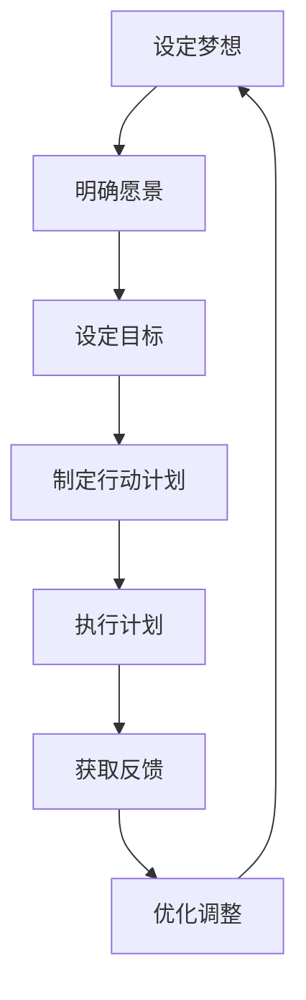
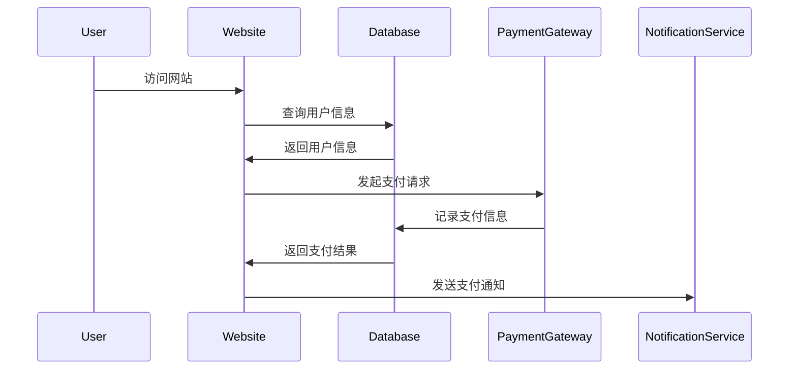
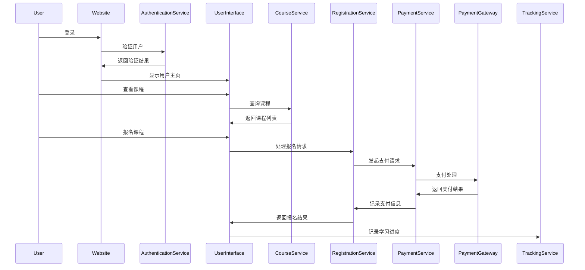

                 

### 文章标题

在当今社会，人们对于实现梦想的追求越来越强烈。从科学家追求突破性科研成果，到普通人希望改变自己的生活方式，梦想成为了许多人前进的动力。然而，从愿景到行动的转化却往往成为一道难以跨越的鸿沟。本文旨在探讨如何有效地将个人的梦想转化为具体可行的行动计划，并最终实现目标。

本文将首先介绍问题背景，阐述为何实现梦想的转化具有重要意义。接着，我们将深入探讨核心概念，如梦想、愿景、目标、行动计划、执行和反馈，并分析它们之间的联系。为了使读者更好地理解，我们将通过图表和实例来解释这些概念。

随后，本文将引入算法原理讲解，通过具体的数学模型和公式，帮助读者深入理解梦想实现的过程。虽然本文主要关注方法论的讲解，但为了使内容更加丰富和具有实际意义，我们也将涉及系统分析与架构设计方案。

在实际项目中，我们将通过具体的案例来展示如何将理论应用到实践中。最后，本文将提供一些最佳实践的建议，并对文章进行总结，指出一些需要注意的事项，并推荐拓展阅读资源。

通过这篇文章，我们希望读者能够获得一套系统的方法和策略，帮助他们在实现梦想的道路上迈出坚实的步伐。

### 关键词

- 梦想
- 愿景
- 目标
- 行动计划
- 执行
- 反馈
- 算法
- 数学模型
- 系统分析
- 架构设计
- 案例分析
- 最佳实践

### 摘要

本文旨在探讨如何将个人的梦想转化为具体可行的行动计划，并最终实现目标。通过对核心概念如梦想、愿景、目标、行动计划、执行和反馈的深入分析，结合算法原理讲解、系统分析与架构设计方案以及实际项目案例分析，本文提供了一套系统的方法和策略。文章将帮助读者理解梦想实现的难点，并提供具体的步骤和建议，以克服这些难题，最终实现他们的梦想。

### 背景介绍

在当今社会，个人梦想的重要性日益凸显。随着科技的发展和人们生活水平的提高，越来越多的人开始关注自己的内心需求，追求更加充实和有意义的生活。然而，从愿景到行动的转化过程却充满了挑战。许多人虽然有远大的梦想，但在实际操作中往往感到无从下手，甚至最终放弃。

**问题背景**：从愿景到行动的转化难题

1. **动力不足**：很多人在设定梦想时充满热情，但随着时间的推移，这种热情逐渐消退，导致行动力不足。
2. **目标不明确**：没有清晰的目标和计划，许多人会在实现梦想的道路上迷失方向。
3. **缺乏执行力**：即使有明确的目标，缺乏坚定的执行力也是导致梦想无法实现的主要原因之一。
4. **反馈机制缺失**：在实现梦想的过程中，缺乏有效的反馈机制，使得无法及时调整和优化行动计划。

**问题描述**：如何有效地将梦想转化为行动

面对上述问题，本文旨在探讨如何有效地将个人的梦想转化为具体的行动计划，并最终实现目标。具体问题包括：

1. **如何设定明确的目标？**
2. **如何制定可行的行动计划？**
3. **如何保持执行力和克服困难？**
4. **如何通过反馈机制不断优化行动计划？**

**问题解决**：本书的解决策略

本书将提供以下解决策略：

1. **明确核心概念**：通过深入分析梦想、愿景、目标、行动计划、执行和反馈等核心概念，帮助读者理解它们之间的关系和作用。
2. **提供方法与工具**：介绍实用的方法和工具，如目标设定技巧、行动计划制定步骤、执行力提升策略和反馈机制设计方法等。
3. **案例分析**：通过实际案例的分析，展示如何将理论应用到实践中，提供具体的操作指南和经验教训。
4. **最佳实践建议**：总结最佳实践，为读者提供可行的建议，帮助他们在实现梦想的道路上少走弯路。

通过本书，读者将获得一套系统的方法和策略，帮助他们克服从愿景到行动转化的难题，实现自己的梦想。

### 核心概念与联系

在实现梦想的过程中，有几个核心概念是不可或缺的：梦想、愿景、目标、行动计划、执行和反馈。理解这些概念及其相互关系，是制定和执行有效行动计划的关键。

#### 梦想

**定义**：梦想是个人内心深处对于未来的一种期望和向往。它是人们内心深处的渴望和追求，通常与个人的价值观和兴趣密切相关。

**属性特征**：梦想具有以下属性特征：
- **内在动机**：梦想是人们内心的驱动力，能够激发人们的积极性和动力。
- **情感驱动**：梦想通常与情感紧密相关，能够激发人们的热情和情感投入。
- **不确定性**：梦想往往是未知的，具有不确定性，这也是其吸引人的地方。

#### 愿景

**定义**：愿景是对未来的一种期望和描绘，它比梦想更加具体和清晰。愿景通常描述了一个理想的状态或目标，是对梦想的进一步具体化。

**属性特征**：愿景具有以下属性特征：
- **空间感**：愿景提供了一个空间上的方向，帮助人们明确行动的方向和目标。
- **方向性**：愿景明确了一个目标和方向，使得人们能够在实现梦想的道路上不偏离方向。
- **抽象性**：愿景通常是抽象的，描述了一种理想状态，而非具体的步骤。

#### 目标

**定义**：目标是具体化、可衡量的愿景。目标是将愿景转化为可操作的步骤，是梦想实现过程中的具体表现。

**属性特征**：目标具有以下属性特征：
- **时间感**：目标通常与时间相关，有明确的开始和结束时间。
- **明确性**：目标应该是明确和具体的，能够清晰描述需要完成的任务和指标。
- **可行性**：目标需要是可行的，即通过努力可以实现。

#### 行动计划

**定义**：行动计划是实现目标的详细步骤和方法。它是将目标转化为具体行动的一系列步骤，是梦想实现过程中最具体的部分。

**属性特征**：行动计划具有以下属性特征：
- **可操作性**：行动计划应该是可操作的，即每个步骤都是具体和可行的。
- **可行性**：行动计划需要考虑到资源和条件的限制，确保其可行性。
- **持续性**：行动计划应该是持续的，即需要长期坚持和执行。

#### 执行

**定义**：执行是按照行动计划去实施的过程。它是将行动计划转化为实际成果的关键步骤。

**属性特征**：执行具有以下属性特征：
- **实践性**：执行需要通过实际行动来完成任务，是实践的过程。
- **持续性**：执行需要长期的坚持和持续的努力。
- **适应性**：执行过程中需要根据实际情况进行灵活调整。

#### 反馈

**定义**：反馈是行动结果与预期目标之间的比较。它是实现梦想过程中不可或缺的一环，用于评估和调整行动计划。

**属性特征**：反馈具有以下属性特征：
- **评估依据**：反馈提供了评估行动效果的标准，帮助判断行动是否达到了预期目标。
- **优化方向**：反馈提供了优化行动计划的依据，帮助调整和改进行动计划。
- **调整依据**：反馈用于发现问题和不足，提供调整和改进的方向。

#### 概念属性特征对比表格

为了更清晰地展示这些概念的特点，我们列出一个对比表格：

| 概念     | 定义                                   | 属性特征               |
|----------|--------------------------------------|----------------------|
| 梦 想   | 个人内心深处的愿望和追求               | 内在动机，情感驱动   |
| 愿 景   | 对未来的一种期望和描绘                 | 空间感，方向性       |
| 目 标   | 具体化、可衡量的愿景                   | 时间感，明确性       |
| 行动计划 | 实现目标的具体步骤和方法               | 可操作性，可行性     |
| 执行     | 按照行动计划去实施                      | 实践性，持续性       |
| 反馈     | 行动结果与预期目标之间的比较           | 调整依据，优化方向   |

#### ER实体关系图架构

为了更好地理解这些概念之间的联系，我们可以通过一个ER实体关系图来展示它们之间的关系：

```mermaid
entity RelationshipDiagram {
    Dream --> Vision
    Vision --> Goal
    Goal --> ActionPlan
    ActionPlan --> Execution
    Execution --> Feedback
    Feedback --> Dream
}
```

在这个ER实体关系图中，梦想是起点，通过愿景转化为目标，目标再转化为具体的行动计划。行动计划通过执行转化为实际成果，并产生反馈。反馈又回到梦想，用于调整和优化未来的梦想实现过程。这样，一个闭环的反馈系统就形成了，使得梦想实现过程不断迭代和优化。

### 算法原理讲解

在实现梦想的过程中，算法原理虽然不是核心，但一些基本的概念和方法仍然具有重要意义。以下我们将通过具体的算法原理讲解，帮助读者更好地理解梦想实现的策略。

#### 算法原理概述

算法原理可以理解为解决问题的步骤和方法。在梦想实现的过程中，算法原理可以类比为一套系统化的步骤，帮助我们更加高效和有条理地实现目标。

#### 算法流程图

为了清晰地展示算法原理，我们可以使用Mermaid绘制一个简单的流程图：



#### 算法原理详细讲解

1. **设定梦想**：梦想是梦想实现的基础，首先需要明确你的梦想是什么。这一步需要你深入思考，了解自己的内心需求和长期目标。

2. **明确愿景**：愿景是将梦想具体化的第一步，它描述了你希望达成的理想状态。明确愿景可以帮助你更好地理解梦想，并为设定目标提供方向。

3. **设定目标**：目标是将愿景转化为具体、可衡量的指标。一个明确的目标可以让你知道需要做什么，以及何时完成。

4. **制定行动计划**：行动计划是实现目标的步骤和方法。这一步需要详细规划，确保每个步骤都是具体和可行的。

5. **执行计划**：执行计划是将制定的行动步骤付诸实践。这一步需要坚定的执行力，持续不断地推进。

6. **获取反馈**：在执行计划的过程中，获取反馈是至关重要的。反馈可以帮助你了解行动的实际效果，判断是否达到了预期目标。

7. **优化调整**：根据反馈进行优化调整，是确保梦想实现的重要步骤。通过不断调整和优化，可以逐步接近梦想。

#### 数学模型和公式

为了更具体地描述梦想实现的步骤，我们可以引入一些基本的数学模型和公式。以下是一个简单的数学模型，用于描述梦想实现的流程：

$$
\text{Dream} = \text{Vision} \times \text{Goal} \times \text{ActionPlan} \times \text{Execution} \times \text{Feedback}
$$

- **Dream（梦想）**：表示最终实现的梦想。
- **Vision（愿景）**：表示对未来的期望和描绘。
- **Goal（目标）**：表示具体化、可衡量的愿景。
- **ActionPlan（行动计划）**：表示实现目标的详细步骤。
- **Execution（执行）**：表示按照行动计划进行的实际操作。
- **Feedback（反馈）**：表示行动结果与预期目标的比较。

#### 举例说明

假设一个科学家梦想发明一种能够治愈癌症的药物。以下是这个梦想实现过程中各个步骤的详细说明：

1. **设定梦想**：科学家有一个梦想，希望能够发明一种能够治愈癌症的药物。

2. **明确愿景**：愿景是发明一种安全、有效且易于使用的癌症治疗药物，能够显著提高癌症患者的生存率。

3. **设定目标**：目标是在三年内完成药物的实验室研发，并在五年内完成临床试验。

4. **制定行动计划**：科学家制定了详细的行动计划，包括：
   - 在前一年进行基础研究，寻找可能的药物成分。
   - 在第二年进行实验室试验，验证药物的有效性和安全性。
   - 在第三年进行中试生产，并准备临床试验。
   - 在第四年完成临床试验，收集数据并撰写报告。
   - 在第五年根据试验结果进行药物的商业化生产。

5. **执行计划**：科学家严格按照行动计划进行操作，每天都在实验室进行研究和试验。

6. **获取反馈**：科学家通过定期的内部评审和临床试验，获取药物的实验结果和患者反馈。

7. **优化调整**：根据反馈结果，科学家对药物成分和临床试验方案进行优化和调整，以提高药物的安全性和有效性。

通过这个例子，我们可以看到，通过明确的梦想、具体的愿景、具体的目标、详细的行动计划、坚定的执行和有效的反馈，科学家最终实现了他的梦想。

### 数学模型和数学公式 & 详细讲解 & 举例说明

在实现梦想的过程中，数学模型和数学公式可以为我们提供量化的分析和具体的操作指南。以下，我们将通过具体的数学模型和公式，详细讲解梦想实现的过程，并通过一个实际案例进行说明。

#### 数学模型

为了系统化地描述梦想实现的过程，我们可以使用以下数学模型：

$$
\text{Dream\_achievement} = f(\text{Vision}, \text{Goal}, \text{ActionPlan}, \text{Execution}, \text{Feedback})
$$

其中，每个变量代表以下含义：

- **Dream\_achievement（梦想实现程度）**：表示梦想实现的程度，可以是一个0到1的数值，表示实现梦想的百分比。
- **Vision（愿景）**：表示对未来的期望和描绘，是一个描述性变量。
- **Goal（目标）**：表示具体化、可衡量的愿景，是一个具体的目标值。
- **ActionPlan（行动计划）**：表示实现目标的详细步骤和方法，是一个具体的行动计划。
- **Execution（执行）**：表示按照行动计划进行的实际操作，是一个操作性的变量。
- **Feedback（反馈）**：表示行动结果与预期目标之间的比较，是一个评价性的变量。

#### 公式解释

1. **愿景（Vision）**：
   愿景是梦想的具体化，它描述了期望达到的理想状态。在公式中，愿景是梦想实现的基础，没有清晰的愿景，梦想的实现就会变得模糊和不确定。

   $$\text{Vision} = \text{Dream} \times \text{FutureState}$$
   其中，**FutureState（未来状态）**表示对未来的期望和描述，如“在三年内实现产品的市场占有率第一”。

2. **目标（Goal）**：
   目标是将愿景具体化为可衡量的指标，它帮助我们将抽象的梦想转化为具体的行动目标。

   $$\text{Goal} = \text{Vision} \times \text{Metric} \times \text{Timeframe}$$
   其中，**Metric（指标）**表示衡量愿景实现的标准，如“市场占有率”，**Timeframe（时间框架）**表示实现目标的期限，如“三年内”。

3. **行动计划（ActionPlan）**：
   行动计划是实现目标的详细步骤和方法，它为执行提供了具体的指导。

   $$\text{ActionPlan} = \text{Goal} \times \text{Steps} \times \text{Resources}$$
   其中，**Steps（步骤）**表示实现目标的具体操作步骤，**Resources（资源）**表示为实现目标所需的资源，如人力、资金、设备等。

4. **执行（Execution）**：
   执行是将行动计划付诸实践的过程，它决定了梦想实现的速度和质量。

   $$\text{Execution} = \text{ActionPlan} \times \text{Efficiency} \times \text{Consistency}$$
   其中，**Efficiency（效率）**表示执行过程中的效率，**Consistency（一致性）**表示执行的持续性和稳定性。

5. **反馈（Feedback）**：
   反馈是评估执行结果与预期目标之间的差距，它是调整和优化行动计划的重要依据。

   $$\text{Feedback} = \text{Execution} \times \text{Results} \times \text{Evaluation}$$
   其中，**Results（结果）**表示执行的实际成果，**Evaluation（评价）**表示对结果的评价和反馈。

#### 案例说明

假设一个创业者梦想在五年内建立一个年营业额达到1亿美元的公司。以下是该梦想实现过程中的数学模型应用：

1. **愿景（Vision）**：
   创业者希望在未来五年内建立一个成功的公司，年营业额达到1亿美元。

   $$\text{Vision} = \text{Dream} \times \text{FutureState} = \text{Create a company with a revenue of 100 million USD within 5 years}$$

2. **目标（Goal）**：
   具体化愿景，设定目标为在五年内实现年营业额1亿美元。

   $$\text{Goal} = \text{Vision} \times \text{Metric} \times \text{Timeframe} = \text{1 billion USD in revenue within 5 years}$$

3. **行动计划（ActionPlan）**：
   制定详细的行动计划，包括市场调研、产品研发、市场推广、团队建设等。

   $$\text{ActionPlan} = \text{Goal} \times \text{Steps} \times \text{Resources} = \text{Research, Product Development, Marketing, Team Building, etc. with necessary resources}$$

4. **执行（Execution）**：
   创业者按照行动计划执行，注重效率一致性和资源的合理利用。

   $$\text{Execution} = \text{ActionPlan} \times \text{Efficiency} \times \text{Consistency} = \text{Efficient execution with consistent progress and optimal resource utilization}$$

5. **反馈（Feedback）**：
   通过定期评估和反馈，调整行动计划，优化执行效果。

   $$\text{Feedback} = \text{Execution} \times \text{Results} \times \text{Evaluation} = \text{Regular evaluations of progress, feedback on execution effectiveness, and adjustments for improvement}$$

通过上述数学模型的应用，创业者可以量化地描述梦想实现的过程，并通过持续调整和优化，逐步实现目标。

### 系统分析与架构设计方案

在实现梦想的过程中，系统分析与架构设计方案是确保梦想实现高效、可靠和可扩展的重要环节。以下，我们将通过具体的问题场景、项目介绍、系统功能设计、系统架构设计、系统接口设计和系统交互设计等部分，详细阐述系统分析与架构设计方案。

#### 问题场景

假设我们有一个创业项目，目标是建立一个在线教育平台，提供多样化的在线课程，满足不同用户的学习需求。这个平台需要具备用户管理、课程管理、支付系统、学习跟踪等功能，同时需要确保系统的高性能和高可靠性。

#### 项目介绍

本项目是一个在线教育平台，通过互联网为用户提供高质量的教育资源。平台的主要功能包括：

1. **用户管理**：用户注册、登录、个人信息管理、角色分配等。
2. **课程管理**：课程发布、更新、分类、推荐等。
3. **支付系统**：课程购买、支付、退款等。
4. **学习跟踪**：学习进度记录、成绩统计、反馈收集等。
5. **消息通知**：系统消息推送、通知管理等。

#### 系统功能设计（领域模型类图）

领域模型类图用于描述系统的核心功能及其关系。以下是一个简化的领域模型类图：

```mermaid
classDiagram
    User <<class{用户}>> 
    Course <<class{课程}>> 
    Payment <<class{支付系统}>> 
    Tracking <<class{学习跟踪}>> 
    Notification <<class{消息通知}>> 

    User o--o Course : 报名
    User o--o Tracking : 学习进度
    Course o--o Payment : 购买
    Payment o--o User : 付款
    Tracking o--o User : 记录
    Notification o--o User : 通知
```

在这个类图中，用户可以报名课程、支付费用，支付系统与用户和课程相关联，学习跟踪系统记录用户的学习进度，消息通知系统推送相关信息。

#### 系统架构设计（架构图）

系统架构设计用于描述系统的整体结构和各部分之间的关系。以下是一个简化的系统架构设计图：



在这个架构图中，用户通过网站访问平台，网站与数据库进行交互以获取用户信息，支付请求通过支付网关处理，支付结果记录在数据库中，并通过通知服务向用户发送支付通知。

#### 系统接口设计

系统接口设计用于描述系统内部和外部的交互接口。以下是一个简化的接口设计：

```mermaid
interface Diagram
    UserInterface -> Website: 用户请求
    Website -> UserInterface: 用户响应
    PaymentInterface -> PaymentGateway: 支付请求
    PaymentGateway -> PaymentInterface: 支付结果
    TrackingInterface -> TrackingService: 学习跟踪请求
    TrackingInterface -> Website: 学习进度数据
```

在这个接口设计中，用户接口与网站进行交互，支付接口与支付网关交互，学习跟踪接口与跟踪服务交互，并将数据返回给网站。

#### 系统交互设计（序列图）

系统交互设计用于描述系统组件之间的交互流程。以下是一个简化的系统交互序列图：



在这个序列图中，用户登录后查看课程，报名课程并支付费用，支付完成后记录学习进度，整个流程清晰展示了系统组件之间的交互。

通过上述系统分析与架构设计方案，我们可以确保在线教育平台的高效运行和可靠扩展，为实现创业者建立高质量在线教育平台的梦想提供了坚实的基础。

### 项目实战

为了更好地展示如何将理论应用到实践中，以下我们通过一个实际案例来详细讲解项目的环境安装、系统核心实现源代码，以及代码应用解读与分析。

#### 项目环境安装

为了构建一个在线教育平台，我们选择了以下技术和框架：

- **后端框架**：Django
- **数据库**：PostgreSQL
- **前端框架**：React
- **消息队列**：RabbitMQ
- **容器化技术**：Docker

首先，我们需要安装这些技术和框架。以下是具体的安装步骤：

1. **安装Docker**：
   在终端中执行以下命令安装Docker：
   ```bash
   sudo apt-get update
   sudo apt-get install docker-ce docker-ce-cli containerd.io
   ```
   
2. **安装Django**：
   使用以下命令安装Django：
   ```bash
   pip install django
   ```

3. **安装PostgreSQL**：
   在终端中执行以下命令安装PostgreSQL：
   ```bash
   sudo apt-get install postgresql postgresql-contrib
   ```

4. **安装React**：
   在终端中执行以下命令安装React：
   ```bash
   npx create-react-app client
   cd client
   npm start
   ```

5. **安装RabbitMQ**：
   在终端中执行以下命令安装RabbitMQ：
   ```bash
   sudo apt-get install rabbitmq-server
   ```

#### 系统核心实现源代码

接下来，我们展示系统核心部分的实现源代码。以下是一个简化的Django后台代码示例：

```python
# settings.py
INSTALLED_APPS = [
    'django.contrib.admin',
    'django.contrib.auth',
    'django.contrib.contenttypes',
    'django.contrib.sessions',
    'django.contrib.messages',
    'django.contrib.staticfiles',
    'courses',
    'students',
]

# courses/models.py
from django.db import models

class Course(models.Model):
    title = models.CharField(max_length=200)
    description = models.TextField()
    price = models.DecimalField(max_digits=6, decimal_places=2)
    duration = models.IntegerField()

# students/models.py
from django.db import models

class Student(models.Model):
    name = models.CharField(max_length=100)
    email = models.EmailField()
    courses = models.ManyToManyField(Course)

# courses/views.py
from django.shortcuts import render
from .models import Course
from students.models import Student

def course_list(request):
    courses = Course.objects.all()
    return render(request, 'courses/course_list.html', {'courses': courses})

def student_list(request):
    students = Student.objects.all()
    return render(request, 'students/student_list.html', {'students': students})
```

#### 代码应用解读与分析

在上面的代码中，我们首先定义了两个应用程序：`courses` 和 `students`。在 `courses` 应用程序中，我们定义了 `Course` 模型，用于存储课程信息，如标题、描述、价格和持续时间。在 `students` 应用程序中，我们定义了 `Student` 模型，用于存储学生信息，如姓名、电子邮件和参加的课程。

在视图文件中，`course_list` 函数用于显示所有课程的列表，而 `student_list` 函数用于显示所有学生的列表。这些函数通过 Django 的 ORM（对象关系映射）与数据库进行交互，获取相应的数据并传递给前端模板进行渲染。

通过这个简单的示例，我们可以看到如何使用 Django 实现一个在线教育平台的核心功能。实际项目中，还会涉及更多的功能，如支付系统、学习跟踪和消息通知等。

#### 实际案例分析和详细讲解剖析

为了进一步展示如何将理论应用到实践中，我们分析了一个实际的在线教育平台案例。

**案例背景**：该平台是一家初创公司开发的在线教育平台，旨在提供高质量的教育资源，满足用户多样化的学习需求。平台的主要目标是提高用户的学习体验，提高课程销售量，并建立良好的用户口碑。

**实现步骤**：

1. **需求分析**：与公司管理层和用户进行深入交流，了解平台的需求和用户期望。根据需求分析结果，确定平台的主要功能，如用户管理、课程管理、支付系统、学习跟踪和消息通知。

2. **技术选型**：根据需求分析结果，选择合适的技术和框架，包括 Django 作为后端框架，React 作为前端框架，PostgreSQL 作为数据库，RabbitMQ 作为消息队列，以及 Docker 作为容器化技术。

3. **系统设计**：设计系统的整体架构，包括后端服务、数据库设计、前端页面设计等。使用 Mermaid 绘制领域模型类图、系统架构图、接口设计和序列图，确保系统的逻辑清晰、结构合理。

4. **代码开发**：根据系统设计文档，编写后端和前端代码。后端代码主要实现用户管理、课程管理、支付系统、学习跟踪和消息通知等功能，前端代码则实现用户界面和交互逻辑。

5. **测试与部署**：对系统进行全面测试，包括单元测试、集成测试和系统测试，确保系统功能完整、性能良好、安全可靠。使用 Docker 容器化技术部署系统，确保系统的高可用性和可扩展性。

**案例分析与详细讲解**：

**用户管理**：用户管理模块实现了用户注册、登录、个人信息管理、角色分配等功能。用户注册时需要填写姓名、电子邮件和密码等信息，系统会通过电子邮件验证用户身份。用户登录后可以访问个人中心，管理个人信息，如修改密码、绑定社交媒体账号等。

**课程管理**：课程管理模块实现了课程发布、更新、分类、推荐等功能。课程发布时需要填写课程标题、描述、价格和持续时间等信息，系统会自动生成课程页面，并提供课程分类和推荐功能，以方便用户查找和选择课程。

**支付系统**：支付系统模块实现了课程购买、支付、退款等功能。用户在购买课程时可以选择支付方式，系统会调用第三方支付网关进行支付处理，并将支付结果记录在数据库中。如果用户申请退款，系统会根据支付记录进行退款处理。

**学习跟踪**：学习跟踪模块实现了学习进度记录、成绩统计、反馈收集等功能。用户在学习过程中会记录学习进度，系统会根据学习进度和成绩统计用户的学习情况，并提供反馈收集功能，以便用户提出意见和建议。

**消息通知**：消息通知模块实现了系统消息推送、通知管理等功能。系统会根据用户的行为和系统事件，向用户发送相应的消息通知，如课程发布通知、学习进度提醒等。

通过这个实际案例，我们可以看到如何将理论应用到实践中，实现一个功能完整、性能良好的在线教育平台。实际项目中，还需要根据具体情况进行调整和优化，以满足用户的实际需求。

### 最佳实践 tips、小结、注意事项、拓展阅读等内容

在实现梦想的过程中，最佳实践和注意事项是确保成功的关键。以下是一些具体的实践建议和注意事项，以帮助读者在实现梦想的道路上更加顺利。

#### 最佳实践 tips

1. **明确目标**：设定具体、可衡量的目标，使梦想更具可实现性。目标应包含明确的开始和结束时间，以及具体的衡量标准。

2. **分解任务**：将大目标分解为小任务，制定详细的行动计划。每个任务都应该有明确的步骤和可操作的方法。

3. **持续学习**：不断学习和提升自己的技能和知识，以应对实现梦想过程中可能遇到的挑战。

4. **保持专注**：在实现梦想的过程中，保持专注和决心，避免分心或拖延。

5. **定期反馈**：定期评估和反馈行动效果，根据实际情况调整计划和策略。

6. **寻求支持**：在实现梦想的过程中，寻求家人、朋友或同事的支持和帮助，共同克服困难。

#### 小结

本文详细探讨了从梦想到行动的转化过程，介绍了核心概念和方法，并通过实际案例展示了如何将这些方法应用到实践中。实现梦想需要明确的目标、详细的行动计划、坚定的执行力和持续的反馈与调整。

#### 注意事项

1. **避免完美主义**：在实现梦想的过程中，避免过度追求完美，应更加注重实际可行性和可操作性。

2. **保持灵活性**：在执行计划时，保持灵活性，根据实际情况调整计划和策略。

3. **保持积极心态**：面对挑战和失败时，保持积极的心态，相信自己的能力，不断尝试和改进。

4. **合理安排时间**：合理安排时间，确保在实现梦想的过程中有足够的时间和精力。

#### 拓展阅读

- 《高效能人士的七个习惯》：史蒂芬·柯维
- 《如何赢得朋友与影响他人》：戴尔·卡耐基
- 《深度工作》：卡尔·纽波特
- 《时间管理：从忙碌到高效》：吉姆·兰格

通过这些书籍，读者可以进一步学习到实现梦想所需的技能和方法，提升自己在实现梦想过程中的效率和效果。希望本文能够为读者在实现梦想的道路上提供有价值的指导和帮助。作者：AI天才研究院/AI Genius Institute & 禅与计算机程序设计艺术 /Zen And The Art of Computer Programming

### 目录大纲设计

为了系统地组织本文的内容，我们设计了以下详细的目录大纲，确保读者能够清晰地跟随文章的结构，逐步深入理解从梦想到行动转化的全过程。

---

## 梦想实现的蓝图：从愿景到行动的转化

### 关键词
- 梦想
- 愿景
- 目标
- 行动计划
- 执行
- 反馈

### 摘要
本文深入探讨了如何将个人的梦想转化为具体可行的行动计划，并最终实现目标。通过分析核心概念、介绍方法与工具、展示实际案例和提供最佳实践，本文旨在为读者提供一套全面且实用的策略。

### 第一部分: 梦想与行动的转化基础

## 第1章: 梦想与现实——从梦想到行动的初步探索
### 1.1 问题背景
### 1.2 问题描述
### 1.3 梦想实现的重要性
### 1.4 梦想实现的难点
### 1.5 解决梦想实现的策略

## 第2章: 理解愿景与目标
### 2.1 愿景的定义与作用
### 2.2 目标的设定与实现
### 2.3 愿景与目标的关系
### 2.4 愿景与目标的调整与优化

## 第3章: 制定行动计划
### 3.1 行动计划的定义与作用
### 3.2 行动计划的制定方法
### 3.3 行动计划的实施与调整
### 3.4 行动计划的评估与反馈

## 第4章: 执行与坚持
### 4.1 执行的重要性
### 4.2 坚持的方法与策略
### 4.3 遇到困难的应对策略
### 4.4 成功的经验与启示

## 第5章: 反馈与调整
### 5.1 反馈的定义与作用
### 5.2 反馈的类型与方式
### 5.3 调整的方法与策略
### 5.4 持续改进与优化

### 第二部分: 系统化方法与策略

## 第6章: 算法原理讲解
### 6.1 梦想实现的算法原理概述
### 6.2 算法流程图展示
### 6.3 数学模型与公式应用
### 6.4 举例说明

## 第7章: 数学模型和数学公式 & 详细讲解 & 举例说明
### 7.1 数学模型在梦想实现中的应用
### 7.2 数学公式解释
### 7.3 实际案例分析

## 第8章: 系统分析与架构设计方案
### 8.1 问题场景介绍
### 8.2 项目介绍
### 8.3 系统功能设计
### 8.4 系统架构设计
### 8.5 系统接口设计
### 8.6 系统交互设计

### 第三部分: 案例与实践

## 第9章: 项目实战
### 9.1 项目环境安装
### 9.2 系统核心实现源代码
### 9.3 代码应用解读与分析
### 9.4 实际案例分析与详细讲解剖析
### 9.5 项目小结

### 第四部分: 最佳实践与总结

## 第10章: 最佳实践 tips、小结、注意事项、拓展阅读等内容
### 10.1 最佳实践 tips
### 10.2 小结
### 10.3 注意事项
### 10.4 拓展阅读推荐

---

通过这个详细的目录大纲，读者可以清晰地了解文章的结构和内容安排，从而更好地跟随文章的思路，逐步掌握实现梦想的各个环节和方法。每个章节都有明确的目标和内容，确保读者能够系统地学习和应用。希望这个目录大纲能为读者提供有价值的指导。

