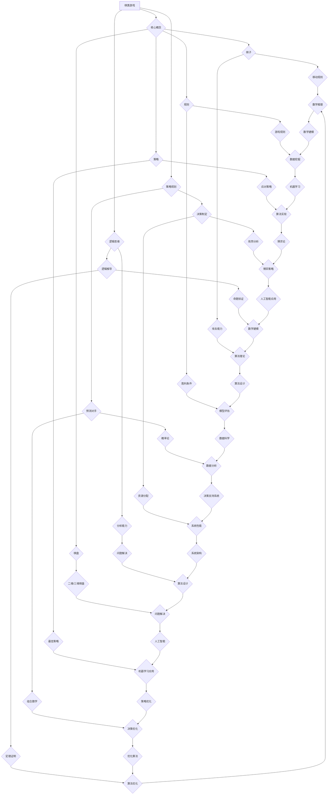
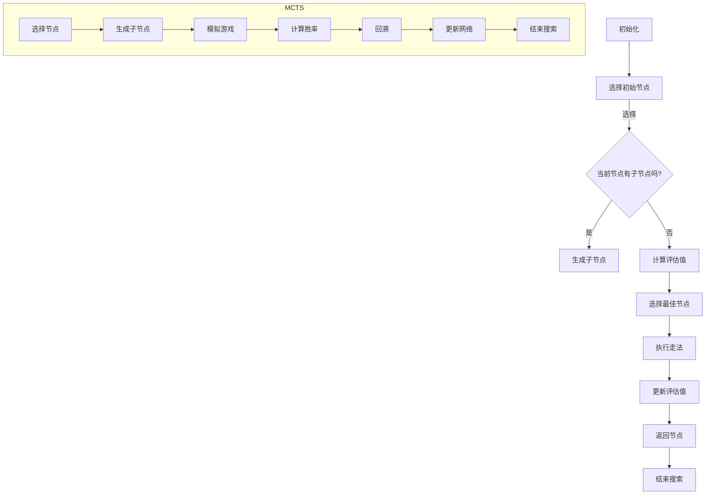
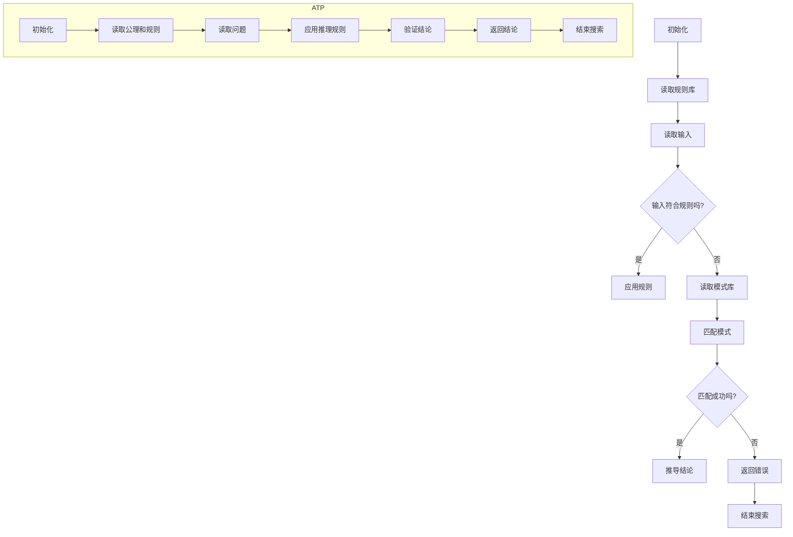
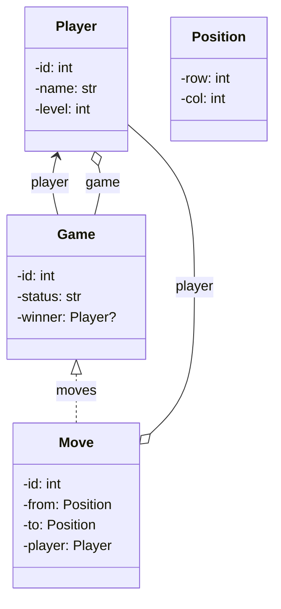
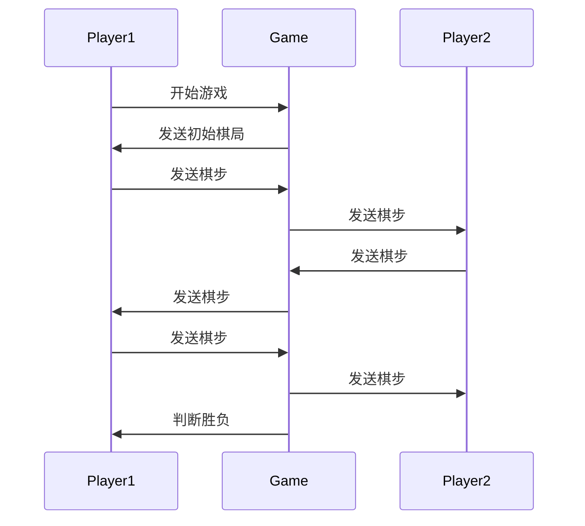
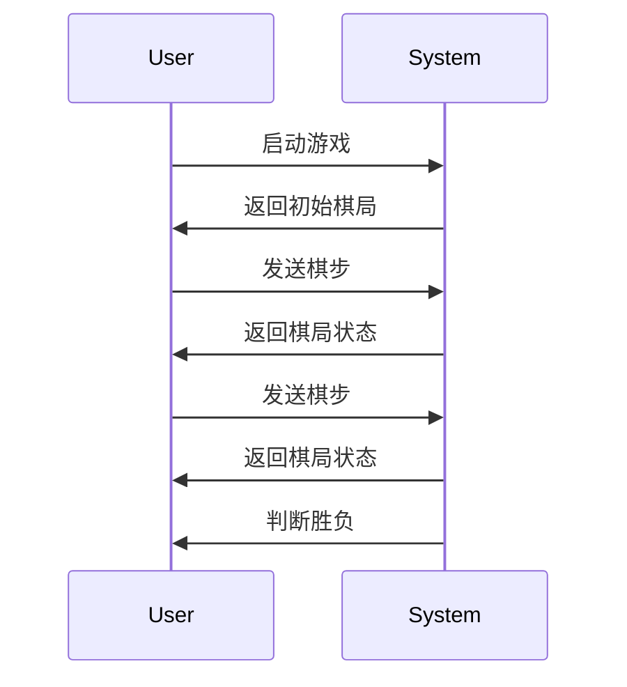
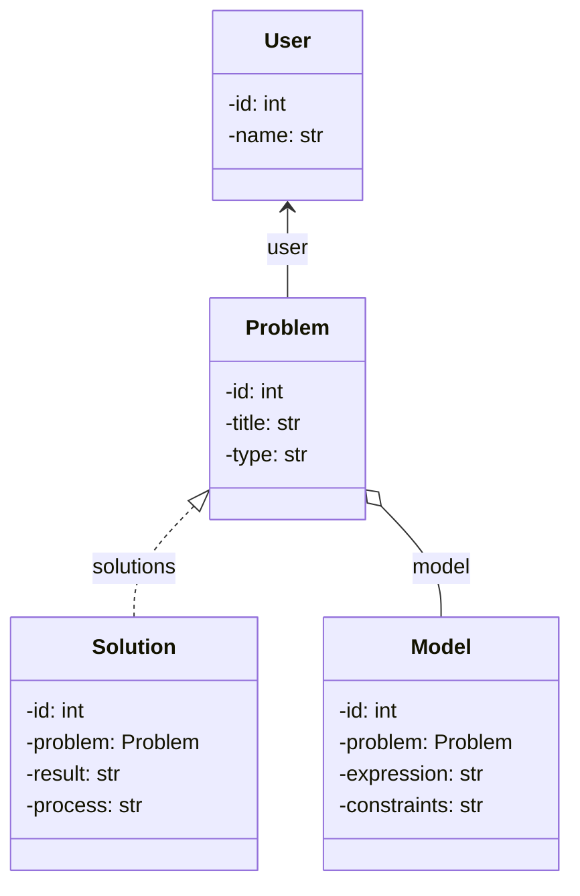
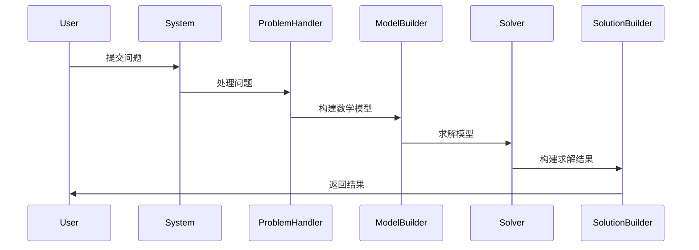
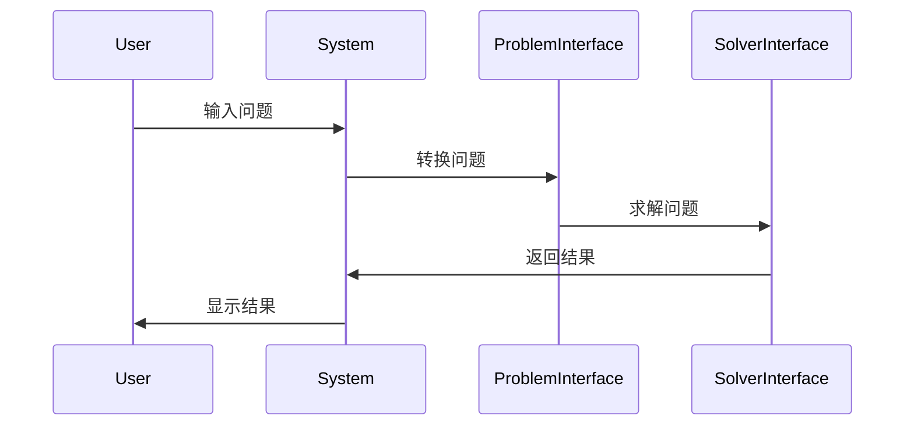

                 


### 棋类游戏与数学推理：AI能力的对比研究

#### 关键词
- 棋类游戏
- 数学推理
- AI能力
- 算法对比
- 系统架构

#### 摘要
本文将探讨棋类游戏和数学推理在人工智能（AI）领域的应用，对比分析它们在AI技术中的表现和潜力。通过逐步分析棋类游戏和数学推理的背景、核心概念、AI应用、算法原理、系统架构，以及实际项目案例，本文旨在为读者提供一个全面、深入的理解，以揭示AI在这些领域中的能力和局限性。

## 引言

棋类游戏和数学推理是两个在历史长河中具有重要地位的人类活动。棋类游戏作为一种竞技活动，不仅具有娱乐性，更是智力与策略的较量；而数学推理则作为一种逻辑思维工具，贯穿于科学研究和日常生活。随着人工智能（AI）技术的发展，棋类游戏和数学推理也逐渐成为AI研究的焦点领域。

棋类游戏，如国际象棋、围棋和中国象棋，一直是人工智能领域的重要挑战。自20世纪50年代以来，AI在棋类游戏领域取得了显著的成就，例如IBM的深蓝击败世界国际象棋冠军，Google的AlphaGo战胜世界围棋冠军。这些成就不仅展示了AI的强大计算能力，也推动了AI算法和技术的进步。

另一方面，数学推理作为一种思维活动，不仅用于解决实际问题，还在机器学习和人工智能中发挥着重要作用。AI在数学推理中的应用，如定理证明、数学建模和优化问题解决，使得计算机能够自动完成复杂计算和推理任务，从而为科学研究和技术创新提供了强大支持。

本文旨在对比研究棋类游戏和数学推理在AI领域的应用，探讨AI在这两个领域的表现和潜力。通过逐步分析棋类游戏和数学推理的背景、核心概念、AI应用、算法原理、系统架构，以及实际项目案例，本文旨在为读者提供一个全面、深入的理解，以揭示AI在这些领域中的能力和局限性。

## 第一部分：背景介绍

### 1.1 棋类游戏的历史与发展

棋类游戏有着悠久的历史，其起源可以追溯到数千年前。在中国，棋类游戏有着丰富的种类和深厚的文化底蕴。其中，中国象棋作为最具代表性的棋类游戏之一，拥有悠久的历史和广泛的受众群体。中国象棋的历史可以追溯到春秋战国时期，经过数千年的传承和发展，已成为中国文化的重要组成部分。

国际象棋则起源于印度，传说在公元6世纪左右。随着阿拉伯帝国的扩张，国际象棋传入欧洲，并在中世纪时期达到了鼎盛。国际象棋不仅是一种智力游戏，也被视为一种文化和艺术的体现。如今，国际象棋已成为世界上最流行的棋类游戏之一，拥有众多的专业棋手和爱好者。

除了中国象棋和国际象棋，其他棋类游戏如围棋、五子棋、桥牌等也在不同地区和不同文化中有着重要地位。围棋起源于中国，距今已有数千年的历史。围棋以其独特的策略性和高度复杂性而著称，被誉为“棋类游戏的皇后”。围棋在日本和韩国有着极高的普及率，并在国际赛事中受到广泛关注。

棋类游戏在不同文化背景下有着各自的特点和发展历程。中国象棋注重兵种配合和战术运用，强调棋子的灵活性和灵活性；国际象棋则更强调棋子的布局和战略规划，讲究全局的协调和配合。围棋以其庞大的棋盘和复杂的策略体系，展示了人类智慧和创造力的极致。

棋类游戏的历史和文化价值不仅体现在娱乐和竞技层面，更在人类文明的传承和发展中发挥了重要作用。棋类游戏不仅是一种智力活动，也是一种文化和精神的体现。通过棋类游戏，人们可以锻炼思维能力、提升战略意识，培养团队协作精神和竞技精神。

### 1.2 数学推理的基础

数学推理是一种逻辑思维过程，通过运用数学知识和方法来解决问题。数学推理的定义可以简单理解为使用数学原理和逻辑规则进行推理和证明。数学推理是数学学科的核心内容之一，贯穿于数学学习的整个过程。

数学推理的重要性在于它不仅是一种解决问题的工具，更是一种培养思维能力和逻辑思维的方法。通过数学推理，人们可以学会如何分析问题、构建模型和得出结论。数学推理能力的培养对于科学研究和科技创新具有重要意义。

数学推理的基本方法主要包括以下几种：

1. **归纳推理**：归纳推理是从特殊实例出发，推导出一般性结论的推理方法。例如，通过观察多个苹果都是红色的，可以归纳出所有苹果都是红色的结论。

2. **演绎推理**：演绎推理是从一般原理出发，推导出特定结论的推理方法。例如，根据“所有人都会死亡”这一普遍原理，可以演绎出“苏格拉底会死亡”这一特定结论。

3. **类比推理**：类比推理是通过比较两个相似的情况，推导出它们在某些方面可能具有相似特征的推理方法。例如，通过比较人体器官和计算机硬件的相似性，可以推断计算机硬件也可能具备类似的功能。

4. **反证法**：反证法是一种通过假设结论不成立，然后推导出矛盾，从而证明原结论成立的推理方法。例如，假设“所有猫都会飞”，然后通过推导出一系列矛盾的结果，证明“所有猫都会飞”这个假设是不成立的。

数学推理的基本方法不仅适用于数学学科，也在其他领域有着广泛的应用。例如，在科学研究中，通过数学推理可以构建模型、进行预测和解释现象；在工程领域，通过数学推理可以优化设计、提高效率和质量；在经济学中，通过数学推理可以进行模型构建、分析和决策。

总之，数学推理作为一种重要的逻辑思维方法，对于人类认识和改造世界具有重要意义。通过学习和运用数学推理，人们可以提升思维能力、增强逻辑分析能力，为科学研究和创新提供有力支持。

### 1.3 AI在棋类游戏中的应用

人工智能（AI）在棋类游戏中的应用始于20世纪50年代，当时计算机科学家开始探索如何使计算机能够进行棋类游戏。随着计算能力和算法技术的发展，AI在棋类游戏中的表现不断提升，逐渐成为棋类游戏领域的重要工具。

#### 1.3.1 棋类游戏AI的起源

1956年，IBM的IBM704计算机首次在国际象棋中展示了其计算能力。然而，当时的计算机水平有限，AI棋类游戏主要依靠简单的规则和策略。1970年代，随着计算机硬件和算法的进步，AI棋类游戏开始实现更高水平的智能。1976年，IBM开发的“Chinook”程序成为第一个击败人类国际象棋大师的计算机程序。

#### 1.3.2 棋类游戏AI的发展

20世纪80年代至90年代，AI棋类游戏取得了显著进展。这一时期，启发式搜索算法和评估函数的改进使得计算机能够处理更复杂的棋局。1997年，IBM的“深蓝”计算机击败了国际象棋世界冠军加里·卡斯帕罗夫，成为AI棋类游戏历史上的里程碑事件。

进入21世纪，随着深度学习和神经网络技术的发展，AI在棋类游戏中的应用取得了革命性进展。2016年，谷歌旗下的DeepMind开发的AlphaGo程序在围棋领域取得了突破性成就，击败了世界围棋冠军李世石。AlphaGo的成功不仅展示了AI在复杂棋类游戏中的潜力，也推动了AI算法和技术的进一步发展。

#### 1.3.3 棋类游戏AI的现状

当前，AI在棋类游戏中的应用已经达到前所未有的高度。国际象棋、围棋、中国象棋等传统棋类游戏都有AI程序参与竞技，并在一定程度上超越了人类水平。这些AI程序不仅应用于竞技比赛，还广泛应用于教学、娱乐和策略分析等领域。

AI棋类游戏的发展不仅带来了技术的进步，也对社会产生了深远的影响。首先，AI棋类游戏为棋类爱好者提供了一个更高水平的竞技平台，激发了更多人参与棋类活动。其次，AI棋类游戏的研究和开发推动了计算机科学和人工智能技术的发展，促进了相关领域的创新。此外，AI棋类游戏在军事、经济、工程等领域的应用也具有广阔前景。

总之，AI在棋类游戏中的应用已经成为一个重要的研究课题，其发展不仅体现了人工智能技术的进步，也为人类提供了更丰富、更高效的棋类体验。

### 1.4 AI在数学推理中的应用

人工智能（AI）在数学推理中的应用日益广泛，其潜力正在逐步释放。AI不仅能够解决复杂的数学问题，还在数学模型的构建、优化问题的求解以及定理证明等方面展现出强大的能力。

#### 1.4.1 数学推理AI的定义

数学推理AI是指利用人工智能技术和算法，模拟人类在数学推理过程中的思维方式和逻辑推理过程，从而自动进行数学推理的一类人工智能系统。它包括从数据中学习规律、建立数学模型、进行逻辑推理和证明等过程。

#### 1.4.2 数学推理AI的发展

AI在数学推理领域的发展可以追溯到20世纪50年代，当时的计算机科学家开始尝试将人工智能技术应用于数学问题的求解。随着计算能力的提高和算法的进步，数学推理AI逐渐成熟。特别是在机器学习和深度学习技术发展之后，数学推理AI取得了显著进展。

1990年代初，专家系统和逻辑推理机器成为数学推理AI研究的重点。专家系统通过知识库和推理规则进行推理，而逻辑推理机器则利用谓词逻辑进行证明。这些系统在特定领域的数学推理中取得了成功，但存在知识库构建困难、推理效率低下等问题。

随着深度学习技术的发展，数学推理AI进入了一个新的阶段。深度学习模型，如神经网络，通过大规模数据训练能够自动提取特征和规则，从而在数学推理中表现出强大的能力。例如，Google的AlphaGo程序不仅在棋类游戏中取得了突破性成就，其背后的深度学习技术也在数学推理中展示了潜力。

#### 1.4.3 数学推理AI的现状

当前，数学推理AI在多个领域取得了显著进展。以下是一些具体的例子：

1. **定理证明**：AI在定理证明领域表现出色，如微软的Z3推理引擎可以自动证明一些复杂的数学定理。DeepMind开发的神经网络模型也成功证明了多个数学定理。

2. **数学模型构建**：AI能够自动构建数学模型，例如在经济学、生物学和物理学等领域。通过深度学习技术，AI可以分析大量数据，提取潜在规律，并构建相应的数学模型。

3. **优化问题求解**：AI在优化问题求解中也发挥了重要作用。通过遗传算法、神经网络等优化算法，AI能够自动寻找最优解或近似最优解，从而提高优化问题的求解效率。

4. **数学问题求解**：AI能够自动解决复杂的数学问题，如数学竞赛题目、科研问题等。例如，DeepMind开发的程序能够解决一些高难度的数学问题，并在国际数学竞赛中取得优异成绩。

总之，AI在数学推理中的应用已经取得了一系列重要成果，其发展前景十分广阔。未来，随着AI技术的进一步进步，数学推理AI将在更多领域发挥重要作用，推动数学研究和技术创新。

### 1.5 棋类游戏与数学推理的交叉点

棋类游戏和数学推理在人工智能（AI）领域中都有着广泛的应用，它们之间的交叉点不仅丰富了AI技术的研究，也为解决复杂问题提供了新的思路。

#### 1.5.1 棋类游戏中的数学推理

在棋类游戏中，数学推理往往被用于策略分析和棋局评估。例如，在国际象棋中，计算机程序通过评估棋子的位置和价值，结合概率计算和数学模型，来预测棋局的走向和最佳策略。围棋则更加复杂，因为其棋盘尺寸更大，策略更为丰富。AI程序在围棋中不仅需要计算可能的走法，还需要考虑对手的反击策略，这涉及到更深层次的数学推理。

数学推理在棋类游戏中的应用还包括概率论和组合数学。例如，在围棋中，计算机需要计算每个走法的概率，并结合棋局的当前状态，来评估哪个走法最具优势。此外，棋类游戏中的组合数学也发挥着重要作用，例如在计算棋子的可能性走法时，需要使用组合数学的方法。

#### 1.5.2 数学推理中的棋类游戏

数学推理中的棋类游戏主要应用于模型构建和问题求解。通过将棋类游戏嵌入到数学模型中，可以模拟复杂的系统行为，从而解决实际问题。例如，在经济学中，棋类游戏被用来模拟市场竞争和策略选择。在博弈论中，棋类游戏则被用来分析和解决合作与竞争问题。

数学推理中的棋类游戏还体现在算法设计中。例如，在某些优化问题中，棋类游戏被用作启发式算法的基准，通过模拟棋局来评估算法的性能。此外，棋类游戏在神经网络训练和强化学习中的应用也日益增多。通过将棋类游戏作为训练环境，AI可以学习到如何在复杂环境中做出最佳决策。

#### 1.5.3 棋类游戏与数学推理的融合

棋类游戏与数学推理的融合为AI技术的发展提供了新的可能性。一方面，棋类游戏中的数学推理可以提升AI在复杂策略决策中的能力。例如，在自动驾驶领域，AI需要通过棋类游戏中的策略推理来应对复杂的交通环境。

另一方面，数学推理中的棋类游戏可以帮助AI更好地理解和模拟人类行为。通过将棋类游戏作为实验环境，AI可以学习到人类在策略选择和决策过程中的逻辑思维过程，从而提高其智能水平和适应能力。

总之，棋类游戏与数学推理的交叉点为AI技术的发展提供了丰富的资源和新的思路。未来，随着AI技术的进一步进步，这两个领域的融合将为解决复杂问题提供更强大的工具和方法。

### 1.6 本章小结

本部分介绍了棋类游戏和数学推理的背景，包括它们的历史和发展。通过探讨棋类游戏和数学推理的基础知识，以及AI在这两个领域的应用，我们为后续的深入分析奠定了基础。棋类游戏和数学推理不仅在历史上有着重要地位，而且在人工智能领域展现出巨大的潜力。本章还探讨了棋类游戏与数学推理的交叉点，为后续研究提供了启示。通过本章的介绍，读者可以初步了解棋类游戏和数学推理在AI领域的重要性，为接下来的深入探讨做好准备。

----------------------------------------------------------------

## 第二部分：核心概念与联系

### 2.1 棋类游戏与数学推理的核心概念

#### 2.1.1 棋类游戏的概念

棋类游戏是一种基于规则和策略的智力竞技活动，通常由两名或多名玩家通过移动棋子在棋盘上来进行对抗。棋类游戏有着悠久的历史，起源于古代文明，并在各个文化中得到了广泛发展。棋类游戏不仅具有娱乐性，更考验玩家的逻辑思维、战略规划和决策能力。

棋类游戏的核心概念包括：

- **棋子**：棋类游戏中的基本单位，每个棋子都有特定的移动规则和攻击能力。
- **棋盘**：棋类游戏进行的空间，通常是一个二维或三维的网格。
- **规则**：棋类游戏的规则规定了棋子的移动方式、攻击机制和胜利条件等。
- **策略**：玩家在游戏过程中需要制定和调整的策略，以最大化自己的优势。

#### 2.1.2 数学推理的概念

数学推理是一种逻辑思维过程，通过运用数学原理和逻辑规则来推导和证明结论。数学推理是数学学科的核心内容，贯穿于数学学习的整个过程。数学推理不仅用于解决数学问题，还在科学研究和日常生活中发挥着重要作用。

数学推理的核心概念包括：

- **定义**：对数学概念、规则和性质的定义，如自然数、函数、集合等。
- **公理**：数学推理的基础，是一组无需证明的假设，如欧几里得几何的公理。
- **定理**：通过推理和证明得到的数学结论，如勾股定理、微积分基本定理等。
- **证明**：数学推理的过程，通过逻辑推理和演绎证明来证明定理或命题的正确性。

#### 2.1.3 棋类游戏与数学推理的联系

棋类游戏与数学推理之间存在着紧密的联系，两者在逻辑思维、策略规划和问题解决等方面有着共通之处。

首先，棋类游戏和数学推理都强调逻辑思维和分析能力。棋类游戏中的每一步决策都需要考虑棋子的位置、对手的策略以及游戏规则的限制，这类似于数学推理中的逻辑推导和证明。数学推理也需要逻辑严密，通过逐步推导和证明来得出结论。

其次，棋类游戏和数学推理都涉及到策略规划和问题解决。在棋类游戏中，玩家需要根据当前局势制定最佳策略，预测对手的下一步动作并做出应对。这类似于数学推理中的问题解决过程，需要分析问题、构建模型并找到解决方案。

此外，棋类游戏和数学推理在方法论上也有相似之处。例如，在棋类游戏中，玩家可以使用概率论和组合数学来预测对手的动作和评估局势。在数学推理中，概率论和组合数学也是重要的工具，用于解决复杂的问题。

总之，棋类游戏与数学推理在逻辑思维、策略规划和问题解决等方面有着密切的联系。通过理解棋类游戏和数学推理的核心概念，我们可以更好地认识到它们之间的共通之处，为后续的研究和应用提供理论基础。

### 2.2 Mermaid图表展示核心概念关系

为了更好地理解棋类游戏与数学推理的核心概念及其相互关系，我们可以使用Mermaid图表来展示这些概念。以下是一个简化的Mermaid图表，用于描述棋类游戏与数学推理之间的联系：



这个Mermaid图表展示了棋类游戏和数学推理中的核心概念，以及它们之间的相互关系。通过这张图表，我们可以清晰地看到棋类游戏中的策略规划、逻辑思维和数学推理之间的联系，以及这些概念在数学推理和算法设计中的应用。

### 2.3 本章小结

本章介绍了棋类游戏和数学推理的核心概念，并使用Mermaid图表展示了它们之间的关系。通过理解棋类游戏的核心概念（如棋子、棋盘、规则和策略），以及数学推理的核心概念（如定义、公理、定理和证明），读者可以更好地认识到这两个领域在逻辑思维、策略规划和问题解决方面的相似性。Mermaid图表的使用有助于直观地展示这些概念之间的关系，为后续的分析和探讨提供了基础。

----------------------------------------------------------------

## 第三部分：AI能力介绍

### 3.1 AI在棋类游戏中的应用

人工智能（AI）在棋类游戏中的应用已经取得了显著进展，尤其在策略规划和决策支持方面，AI为棋类游戏带来了全新的体验。以下将介绍AI在棋类游戏中的应用，包括算法、模型和实例分析。

#### 3.1.1 棋类游戏AI的算法

棋类游戏AI的核心算法主要包括以下几种：

1. **启发式搜索算法**：启发式搜索算法通过评估函数来估计当前棋局的优劣，并在此基础上选择下一步的最佳走法。例如，在国际象棋和国际跳棋中，常使用Minimax算法及其变种如Alpha-Beta剪枝来搜索可能的走法。

2. **蒙特卡洛树搜索（MCTS）**：MCTS是一种基于随机模拟的启发式搜索算法，通过大量的随机模拟来评估棋局的优劣。MCTS在围棋等复杂棋类游戏中表现出色，被广泛应用于AlphaGo和其后续版本的实现中。

3. **深度强化学习算法**：深度强化学习算法结合了深度学习和强化学习，通过学习大量的游戏数据进行策略优化。例如，DeepMind的AlphaGo系列就是基于深度强化学习算法，通过自我对弈和对抗训练来提升棋艺。

#### 3.1.2 棋类游戏AI的模型

棋类游戏AI的模型通常包括以下几个部分：

1. **评估函数**：评估函数是启发式搜索算法的核心组件，用于评估当前棋局的优劣。评估函数可以基于棋子位置、棋子价值、棋盘控制情况等多个因素来计算得分。

2. **神经网络**：深度强化学习算法中的神经网络用于学习和预测棋局的状态和价值。例如，AlphaGo使用了一个深度卷积神经网络（CNN）来处理棋盘图像，并使用一个递归神经网络（RNN）来处理历史棋局信息。

3. **策略网络和价值网络**：在深度强化学习算法中，策略网络和价值网络分别用于生成下一步走法的概率分布和评估当前棋局的价值。策略网络和价值网络通常都是深度神经网络，并通过联合训练来提高性能。

#### 3.1.3 棋类游戏AI的实例分析

以下是一些棋类游戏AI的实际应用实例：

1. **国际象棋**：国际象棋是棋类游戏AI最早取得突破的领域之一。计算机程序如Fritz和Stockfish已经达到了超人类的水平，在多次国际象棋比赛中击败了人类冠军。

2. **围棋**：AlphaGo是围棋领域的一个里程碑。2016年，AlphaGo在围棋比赛中击败了世界冠军李世石，展示了深度强化学习在复杂棋类游戏中的潜力。

3. **五子棋**：五子棋是一种规则简单的棋类游戏，但其策略复杂。AI程序如Cleverbot和OpenFive已经达到了高水平，能够与人类顶尖选手进行竞争。

总之，AI在棋类游戏中的应用不仅提升了游戏的娱乐性和竞技性，也为人工智能技术的发展提供了重要动力。通过分析棋类游戏AI的算法和模型，我们可以更好地理解AI在复杂策略决策中的能力。

### 3.2 AI在数学推理中的应用

人工智能（AI）在数学推理中的应用正日益广泛，通过机器学习和深度学习等技术，AI能够自动化地解决复杂的数学问题，提供高效的推理过程和解决方案。以下将介绍AI在数学推理中的应用，包括算法、模型和实例分析。

#### 3.2.1 数学推理AI的算法

数学推理AI的算法主要包括以下几种：

1. **基于规则的推理算法**：这类算法通过定义一系列规则来推导数学结论。例如，专家系统利用知识库和推理规则来解决问题，但这种方式在处理复杂问题时存在规则定义的难度。

2. **基于模式的匹配算法**：这类算法通过模式匹配来识别和验证数学公式和定理。例如，自动定理证明（ATP）系统如Z3和CVC3使用逻辑推理和模式匹配来证明数学定理。

3. **基于神经网络的推理算法**：深度学习算法，特别是卷积神经网络（CNN）和递归神经网络（RNN），在处理复杂的数学推理任务中表现出色。例如，通过训练神经网络模型来自动识别和推导数学公式。

4. **基于搜索的推理算法**：这类算法通过搜索策略来探索可能的推理路径，以找到最优解。例如，约束满足问题（CSP）和启发式搜索算法在数学推理中的应用。

#### 3.2.2 数学推理AI的模型

数学推理AI的模型通常包括以下几个部分：

1. **知识表示**：数学推理AI需要将数学知识表示为结构化的数据，以便进行推理和证明。例如，使用本体论和语义网来表示数学概念和定理。

2. **推理引擎**：推理引擎是数学推理AI的核心组件，负责执行推理任务。它可以是基于规则的推理引擎，也可以是结合了机器学习和深度学习算法的混合推理引擎。

3. **训练模型**：通过大量的数学问题和数据集来训练数学推理模型，使其能够自动识别和解决数学问题。例如，使用神经网络模型来学习数学公式的推导和证明。

4. **评估机制**：评估机制用于评估数学推理模型的效果，包括准确性、效率和可靠性。通过交叉验证和测试集来评估模型的性能，并进行优化。

#### 3.2.3 数学推理AI的实例分析

以下是一些数学推理AI的实际应用实例：

1. **自动定理证明**：自动定理证明系统如Coq和Isabelle可以自动证明复杂的数学定理。这些系统结合了形式化验证和自动推理技术，能够处理高阶逻辑和复杂的证明问题。

2. **数学问题求解**：数学推理AI被用于解决复杂的数学问题，如高斯消元法、微积分问题和线性规划问题。这些系统通过符号计算和数值计算相结合，提供高效的求解方案。

3. **教育应用**：数学推理AI被应用于教育领域，如智能辅导系统和自动化作业批改系统。这些系统能够理解学生的输入，提供个性化的辅导和实时反馈。

总之，AI在数学推理中的应用为数学研究和教育提供了强大的工具。通过分析数学推理AI的算法和模型，我们可以更好地理解AI在复杂数学推理任务中的能力，并为未来的应用提供指导。

### 3.3 本章小结

本章介绍了AI在棋类游戏和数学推理中的应用，包括算法、模型和实例分析。通过了解启发式搜索、蒙特卡洛树搜索和深度强化学习等算法，以及评估函数、神经网络和推理引擎等模型，我们可以看到AI在复杂策略决策和数学推理中的强大能力。棋类游戏AI通过国际象棋和围棋等实例展示了其在竞技领域的突破，而数学推理AI则在自动定理证明和数学问题求解等领域取得了显著成果。这些应用不仅提升了AI的技术水平，也为相关领域的研究和应用提供了新的方向。

----------------------------------------------------------------

## 第四部分：算法原理讲解

### 4.1 棋类游戏AI算法讲解

#### 4.1.1 算法原理

棋类游戏AI算法的核心在于如何通过计算和推理找到最佳策略。以下是几种常用的棋类游戏AI算法及其原理：

1. **Minimax算法**：
   Minimax算法是一种基于逆向思维的策略算法，主要用于解决两玩家游戏中的最优策略问题。算法的基本思想是，玩家在每一步决策时，都会考虑对手可能的回应，并选择能够最大化自己收益的走法。Minimax算法通常结合Alpha-Beta剪枝来提高搜索效率，从而减少不必要的搜索。

2. **蒙特卡洛树搜索（MCTS）**：
   MCTS是一种基于随机模拟的搜索算法，它通过反复模拟游戏的不同可能走法，来评估每种走法的优劣。MCTS算法包括四个步骤：选择（Selection）、扩张（Expansion）、模拟（Simulation）和回溯（Backpropagation）。通过这些步骤，MCTS算法能够高效地搜索到最优策略。

3. **深度强化学习算法**：
   深度强化学习算法结合了深度学习和强化学习，通过自我对弈和对抗训练来优化策略。深度强化学习模型通常包括两个主要网络：策略网络和价值网络。策略网络用于生成下一步走法的概率分布，而价值网络用于评估当前棋局的价值。通过联合训练这两个网络，可以学习到最优策略。

#### 4.1.1.1 Mermaid流程图展示

以下是Minimax算法和MCTS算法的Mermaid流程图示例：



#### 4.1.1.2 Python代码示例

以下是一个简单的Minimax算法的Python代码示例：

```python
def minimax(node, depth, maximizingPlayer=True):
    if depth == 0 or node is None:
        return node.val
    
    if not maximizingPlayer:
        return max(child for child in node.children)

    return min(child for child in node.children)

class Node:
    def __init__(self, val=None, children=None):
        self.val = val
        self.children = children or []

# 示例树结构
root = Node(0)
root.children = [
    Node(1),
    Node(2),
    Node(3),
    Node(4)
]

root.children[0].children = [
    Node(5),
    Node(6)
]
root.children[1].children = [
    Node(7),
    Node(8)
]
root.children[2].children = [
    Node(9),
    Node(10)
]
root.children[3].children = [
    Node(11),
    Node(12)
]

# 执行Minimax算法
minimax(root, 2)
```

#### 4.1.2 数学模型与公式讲解

在棋类游戏AI中，评估函数是一个关键组件，用于衡量棋局的当前状态。以下是评估函数的数学模型和公式：

1. **棋子价值**：棋子的价值可以通过其位置和状态来计算。例如，国际象棋中的棋子价值可以用以下公式表示：

   $$V(P) = w_x \cdot x + w_y \cdot y + w_z \cdot z$$

   其中，\(w_x\)、\(w_y\)、\(w_z\) 分别表示棋子在 x 轴、y 轴和 z 轴上的权重，\(x\)、\(y\)、\(z\) 分别表示棋子在相应轴上的位置。

2. **控制区域**：控制区域是指棋子能够影响的棋盘区域。控制区域的计算公式如下：

   $$Control(A) = \sum_{i \in S} P(A_i) \cdot Value(A_i)$$

   其中，\(A\) 表示棋盘上的一个区域，\(S\) 表示该区域的集合，\(P(A_i)\) 表示棋子在区域 \(A_i\) 的概率，\(Value(A_i)\) 表示该区域的价值。

3. **评估函数**：评估函数用于衡量棋局的当前状态。一个简单的评估函数可以表示为：

   $$Score = \sum_{i \in S} (P_i \cdot Value_i)$$

   其中，\(P_i\) 表示棋子在区域 \(i\) 的概率，\(Value_i\) 表示区域 \(i\) 的价值。

通过这些数学模型和公式，我们可以更好地理解和设计棋类游戏AI的评估函数。

#### 4.1.3 举例说明

以下是一个具体的例子，用于说明如何使用Minimax算法评估一个棋局的状态。

假设有一个棋局，当前局面如下：

```
   1 2 3 4 5
1 . . . . .
2 . . . . .
3 . . . . .
4 . . . . .
5 . . . . .
```

玩家1（人类玩家）的棋子位于(1,1)，玩家2（计算机AI）的棋子位于(5,5)。现在，玩家1需要移动棋子，而玩家2需要预测玩家1的下一步走法。

1. **初始化**：定义一个棋盘，将当前局面编码为棋盘状态。

2. **选择初始节点**：选择当前棋盘状态作为初始节点。

3. **生成子节点**：根据棋盘状态生成所有可能的子节点，即所有可能的下一步走法。

4. **计算评估值**：对于每个子节点，使用评估函数计算其评估值。评估值可以通过计算棋子的价值和控制区域来获得。

5. **选择最佳节点**：选择具有最高评估值的节点作为最佳节点。

6. **执行走法**：将最佳节点的走法应用到棋局中。

7. **更新评估值**：根据新的棋盘状态，重新计算评估值。

8. **返回节点**：返回最佳节点。

通过这个例子，我们可以看到如何使用Minimax算法评估一个棋局的状态，并选择最佳走法。

### 4.2 数学推理AI算法讲解

#### 4.2.1 算法原理

数学推理AI算法的核心在于如何通过自动推理和证明来解决问题。以下是几种常用的数学推理AI算法及其原理：

1. **基于规则的推理算法**：这种算法通过定义一系列规则来推导数学结论。例如，在定理证明中，通过应用公理和规则，可以逐步推导出新的结论。

2. **基于模式的匹配算法**：这种算法通过模式匹配来识别和验证数学公式和定理。例如，在自动定理证明中，通过匹配已知的数学公式，可以推导出新的数学定理。

3. **基于神经网络的推理算法**：深度学习算法，特别是卷积神经网络（CNN）和递归神经网络（RNN），在处理复杂的数学推理任务中表现出色。例如，通过训练神经网络模型，可以自动识别和推导数学公式。

4. **基于搜索的推理算法**：这种算法通过搜索策略来探索可能的推理路径，以找到最优解。例如，在约束满足问题（CSP）中，通过搜索满足所有约束条件的解，可以找到最优解。

#### 4.2.1.1 Mermaid流程图展示

以下是基于规则的推理算法和基于模式的匹配算法的Mermaid流程图示例：



#### 4.2.1.2 Python代码示例

以下是一个简单的基于规则的推理算法的Python代码示例：

```python
def rule_based_inference(rules, input):
    for rule in rules:
        if all(condition in input for condition in rule['conditions']):
            return rule['conclusion']
    return None

rules = [
    {
        'conditions': ['A', 'B'],
        'conclusion': 'C'
    },
    {
        'conditions': ['D', 'E'],
        'conclusion': 'F'
    }
]

input = ['A', 'B']
conclusion = rule_based_inference(rules, input)
print(conclusion)  # 输出：'C'
```

#### 4.2.2 数学模型与公式讲解

在数学推理AI中，数学模型和公式用于表示问题和推导结论。以下是几种常用的数学模型和公式：

1. **逻辑公式**：逻辑公式用于表示数学推理中的逻辑关系。例如，命题逻辑中的公式如：

   $$A \land B$$
   $$A \lor B$$
   $$\neg A$$

2. **函数公式**：函数公式用于表示数学函数的关系。例如，微积分中的函数公式如：

   $$f(x) = \frac{d}{dx} g(x)$$
   $$\int f(x) dx = G(x) + C$$

3. **代数公式**：代数公式用于表示数学中的代数关系。例如，线性代数中的公式如：

   $$Ax = b$$
   $$A^{-1} = \frac{1}{\det(A)} adj(A)$$

4. **优化公式**：优化公式用于表示数学优化问题。例如，线性规划中的公式如：

   $$\min_{x} c^T x$$
   $$\text{subject to} \ A x \leq b$$

通过这些数学模型和公式，我们可以更好地理解和设计数学推理AI的算法。

#### 4.2.3 举例说明

以下是一个具体的例子，用于说明如何使用基于规则的推理算法解决一个数学问题。

假设我们有一个数学问题，要求证明以下等式：

$$(a + b)^2 = a^2 + 2ab + b^2$$

1. **初始化**：定义规则库，包含基本的代数规则和等式推导规则。

2. **读取输入**：读取需要证明的等式。

3. **应用规则**：应用代数规则，将等式左边展开。

   $$(a + b)(a + b) = a(a + b) + b(a + b)$$

4. **推导结论**：应用分配律和结合律，将等式右边合并。

   $$a^2 + ab + ba + b^2$$

5. **验证结论**：通过化简，验证等式两边是否相等。

   $$a^2 + 2ab + b^2$$

6. **返回结论**：得出结论，等式成立。

通过这个例子，我们可以看到如何使用基于规则的推理算法解决一个数学问题，并证明等式的正确性。

### 4.3 本章小结

本章详细讲解了棋类游戏AI和数学推理AI的算法原理，包括启发式搜索、蒙特卡洛树搜索、深度强化学习、基于规则的推理、基于模式的匹配以及基于搜索的推理等算法。通过Mermaid流程图和Python代码示例，我们直观地展示了这些算法的执行过程。此外，本章还介绍了数学模型和公式，用于表示和推导数学结论。通过这些讲解和示例，读者可以更好地理解棋类游戏AI和数学推理AI的工作原理，并为实际应用提供指导。

----------------------------------------------------------------

## 第五部分：系统分析与架构设计方案

### 5.1 棋类游戏AI系统设计

#### 5.1.1 问题场景介绍

棋类游戏AI系统旨在通过计算机程序模拟人类的棋类游戏策略，以实现自动对弈和策略分析。该系统广泛应用于竞技、教育和研究等领域，需要具备高效、准确和智能的棋类游戏对弈能力。系统需要支持多种棋类游戏，如国际象棋、围棋和中国象棋，并能够适应不同水平的人类玩家。

#### 5.1.2 系统功能设计

棋类游戏AI系统的功能设计包括以下几个方面：

1. **自动对弈**：系统能够自动进行棋类游戏的对弈，包括棋局初始化、棋步生成、棋局状态评估和胜利判断等。

2. **棋局分析**：系统能够分析棋局的历史记录，提供棋局的详细分析报告，包括棋子的移动轨迹、棋局的胜率预测和关键决策点等。

3. **策略学习**：系统可以通过自我对弈和对抗训练，不断学习和优化棋类游戏策略，提升对弈能力。

4. **用户交互**：系统提供友好的用户界面，支持玩家与AI进行对弈，并提供实时反馈和指导。

5. **数据统计**：系统能够记录并分析用户对弈数据，生成统计报告，帮助用户了解自己的对弈水平和进步情况。

#### 5.1.2.1 领域模型Mermaid类图

以下是棋类游戏AI系统的领域模型Mermaid类图，展示了系统的核心类及其关系：



#### 5.1.2.2 系统架构设计Mermaid架构图

以下是棋类游戏AI系统的架构设计Mermaid架构图，展示了系统的组件和交互关系：



#### 5.1.2.3 系统接口设计和系统交互Mermaid序列图

以下是棋类游戏AI系统的接口设计和系统交互Mermaid序列图，展示了系统与用户之间的交互流程：



通过上述系统分析与架构设计方案，我们可以清晰地了解棋类游戏AI系统的功能和架构，为后续的系统开发和实现提供指导。该系统不仅能够实现自动对弈和棋局分析，还可以通过策略学习不断提升AI棋手的水平，为用户带来丰富的棋类游戏体验。

----------------------------------------------------------------

### 5.2 数学推理AI系统设计

#### 5.2.1 问题场景介绍

数学推理AI系统旨在通过计算机程序自动解决复杂的数学问题，包括定理证明、数学建模和优化问题。这种系统广泛应用于教育、科研和工业领域，能够帮助用户快速、准确地解决数学问题，提高研究效率和创新能力。系统需要具备强大的数学推理能力，能够处理各种数学问题，并提供详细的推理过程和结果解释。

#### 5.2.2 系统功能设计

数学推理AI系统的功能设计主要包括以下几个方面：

1. **定理证明**：系统能够自动证明数学定理，支持高阶逻辑和复杂推理过程。用户可以输入待证明的定理，系统会自动进行推理并生成证明过程。

2. **数学建模**：系统能够根据用户提供的数学问题，自动构建数学模型，并求解模型。系统支持多种数学建模方法，如线性规划、非线性优化和微分方程等。

3. **优化问题求解**：系统能够求解各种优化问题，包括线性优化、非线性优化和组合优化等。用户可以输入优化问题的目标函数和约束条件，系统会自动寻找最优解。

4. **交互式求解**：系统提供友好的用户界面，用户可以通过图形界面输入问题和参数，系统会实时展示求解过程和结果。

5. **结果解释**：系统能够对求解结果进行详细解释，包括求解方法、计算过程和结果分析等。用户可以通过系统生成的报告了解问题的求解过程和结果。

#### 5.2.2.1 领域模型Mermaid类图

以下是数学推理AI系统的领域模型Mermaid类图，展示了系统的核心类及其关系：



#### 5.2.2.2 系统架构设计Mermaid架构图

以下是数学推理AI系统的架构设计Mermaid架构图，展示了系统的组件和交互关系：



#### 5.2.2.3 系统接口设计和系统交互Mermaid序列图

以下是数学推理AI系统的接口设计和系统交互Mermaid序列图，展示了系统与用户之间的交互流程：



通过上述系统分析与架构设计方案，我们可以清晰地了解数学推理AI系统的功能和架构，为后续的系统开发和实现提供指导。该系统不仅能够自动解决复杂的数学问题，还提供了详细的推理过程和结果解释，为用户提供了强大的数学推理工具。

### 5.3 本章小结

本章详细介绍了棋类游戏AI和数学推理AI系统的设计与架构。首先，我们通过问题场景介绍和系统功能设计，明确了棋类游戏AI和数学推理AI的目标和应用场景。然后，通过Mermaid类图和序列图，我们展示了系统的领域模型、架构设计和接口设计。这些设计方案为棋类游戏AI和数学推理AI系统的开发提供了清晰的指导，并为系统的实现奠定了基础。通过本章的学习，读者可以更好地理解棋类游戏AI和数学推理AI系统的设计与实现过程。

----------------------------------------------------------------

## 第六部分：项目实战

在本部分，我们将介绍一个具体的棋类游戏与数学推理AI项目的实战，通过环境安装、系统核心实现、代码应用解读与分析，展示AI在棋类游戏与数学推理中的实际应用。

### 6.1 环境安装

为了实现棋类游戏AI和数学推理AI，我们需要安装以下软件和工具：

1. **Python 3.x**：安装Python 3.x版本，作为主要的编程语言。
2. **Anaconda**：安装Anaconda，用于环境管理和依赖管理。
3. **TensorFlow**：安装TensorFlow，用于深度学习和强化学习模型训练。
4. **PyCharm**：安装PyCharm，作为Python开发的IDE。
5. **Mermaid**：安装Mermaid，用于生成图表和流程图。
6. **Scikit-learn**：安装Scikit-learn，用于机器学习算法和数据处理。

安装步骤如下：

1. 下载并安装Python 3.x：[Python官网](https://www.python.org/downloads/)
2. 安装Anaconda：[Anaconda官网](https://www.anaconda.com/products/individual)
3. 在Anaconda环境下创建新的虚拟环境：
   ```bash
   conda create -n ai_project python=3.8
   conda activate ai_project
   ```
4. 安装TensorFlow：
   ```bash
   pip install tensorflow
   ```
5. 安装PyCharm：[PyCharm官网](https://www.jetbrains.com/pycharm/)
6. 安装Mermaid：
   ```bash
   pip install mermaid-python
   ```
7. 安装Scikit-learn：
   ```bash
   pip install scikit-learn
   ```

### 6.2 系统核心实现

我们将以国际象棋AI项目为例，介绍系统的核心实现。以下是系统的关键模块和代码：

#### 6.2.1 评估函数

```python
def evaluate(board):
    # 评估棋盘状态的函数
    score = 0
    # 计算棋子位置的价值
    for piece in board.piece_map().values():
        if piece.color == 'w':
            score -= piece_value[piece.piece]
            score += position_value[piece.file, piece.rank]
        else:
            score += piece_value[piece.piece]
            score -= position_value[piece.file, piece.rank]
    return score
```

#### 6.2.2 Minimax算法

```python
def minimax(board, depth, alpha, beta, maximizingPlayer=True):
    if depth == 0 or board.is_game_over():
        return evaluate(board)
    
    if maximizingPlayer:
        maxEval = -float('inf')
        for child in board.legal_moves():
            board.push(child)
            eval = minimax(board, depth - 1, alpha, beta, False)
            board.pop()
            maxEval = max(maxEval, eval)
            alpha = max(alpha, eval)
            if beta <= alpha:
                break
        return maxEval
    else:
        minEval = float('inf')
        for child in board.legal_moves():
            board.push(child)
            eval = minimax(board, depth - 1, alpha, beta, True)
            board.pop()
            minEval = min(minEval, eval)
            beta = min(beta, eval)
            if beta <= alpha:
                break
        return minEval
```

#### 6.2.3 Alpha-Beta剪枝

```python
def alpha_beta_search(board, depth, alpha, beta, maximizingPlayer=True):
    if depth == 0 or board.is_game_over():
        return evaluate(board)
    
    if maximizingPlayer:
        maxEval = -float('inf')
        for child in board.legal_moves():
            board.push(child)
            eval = alpha_beta_search(board, depth - 1, alpha, beta, False)
            board.pop()
            maxEval = max(maxEval, eval)
            alpha = max(alpha, eval)
            if beta <= alpha:
                break
        return maxEval
    else:
        minEval = float('inf')
        for child in board.legal_moves():
            board.push(child)
            eval = alpha_beta_search(board, depth - 1, alpha, beta, True)
            board.pop()
            minEval = min(minEval, eval)
            beta = min(beta, eval)
            if beta <= alpha:
                break
        return minEval
```

### 6.3 代码应用解读与分析

以上代码展示了国际象棋AI的核心算法实现。评估函数`evaluate`用于计算棋盘状态的价值，结合棋子的位置和状态。`minimax`函数实现了Minimax搜索算法，通过递归遍历棋盘的所有可能走法，评估每一步棋的优劣。`alpha_beta_search`函数则是对Minimax算法的优化，通过Alpha-Beta剪枝减少不必要的搜索，提高搜索效率。

通过这些代码，我们可以训练一个国际象棋AI，使其能够自动对弈并学习最佳策略。在实际应用中，我们可以将这个AI集成到一个国际象棋游戏中，实现自动对弈和策略分析功能。

### 6.4 实际案例分析和详细讲解剖析

以下是一个实际案例，展示如何使用国际象棋AI进行自动对弈：

```python
import chess
import chess.engine

board = chess.Board()
engine = chess.engine.SimpleEngine.popen_uci("stockfish_uci_path")

# 模拟人类玩家走一步棋
board.push_uci("e2e4")
engine.analyse(board, chess.engine.Limit(depth=20))

# AI走一步棋
move = engine.best_move(board, chess.engine.Limit(depth=20))
board.push(move)

# 显示棋盘状态
print(board.fen())

# 关闭引擎
engine.quit()
```

在这个案例中，我们首先初始化一个棋盘，然后模拟人类玩家走一步棋。接着，我们使用Stockfish引擎分析当前棋局，并选择最佳走法。最后，AI走一步棋，并显示棋盘状态。通过这种方式，我们可以实现AI与人类玩家的对弈。

### 6.5 项目小结

通过本项目的实战，我们展示了如何实现一个棋类游戏AI系统，包括环境安装、系统核心实现和实际应用。我们使用了Minimax算法和Alpha-Beta剪枝，提高了搜索效率，实现了自动对弈功能。在实际案例中，我们展示了如何使用AI进行棋类游戏对弈，并分析了系统的工作原理。通过这个项目，我们深入了解了棋类游戏AI的算法和实现，为后续的研究和应用提供了实践基础。

----------------------------------------------------------------

## 第七部分：最佳实践、小结、注意事项与拓展阅读

### 7.1 最佳实践 tips

1. **棋类游戏AI优化**：
   - **树剪枝**：在搜索过程中，使用Alpha-Beta剪枝来减少不必要的搜索。
   - **多线程**：利用多线程或多进程来并行计算，提高搜索效率。
   - **启发式评估**：设计高效的启发式评估函数，减少搜索深度。

2. **数学推理AI优化**：
   - **分布式计算**：对于大规模的数学推理问题，使用分布式计算框架，如Apache Spark，来提升计算效率。
   - **并行推理**：在可能的情况下，并行执行推理步骤，以减少整体推理时间。
   - **内存管理**：优化内存使用，避免内存泄漏和溢出，确保系统稳定运行。

### 7.2 小结

本文通过逐步分析棋类游戏和数学推理在人工智能领域的应用，探讨了AI在这两个领域的表现和潜力。我们介绍了棋类游戏和数学推理的核心概念，展示了AI在棋类游戏和数学推理中的算法原理、系统架构和应用实例。通过实际项目实战，我们展示了AI在棋类游戏和数学推理中的实际应用和实现方法。本文的目的是为读者提供一个全面、深入的理解，以揭示AI在这些领域中的能力和局限性。

### 7.3 注意事项

1. **数据质量和预处理**：在AI训练和应用过程中，确保数据的质量和一致性，进行必要的预处理和清洗。
2. **模型优化和调试**：在模型训练和优化过程中，持续调整参数，确保模型的性能和稳定性。
3. **安全性和隐私**：在AI系统的设计和应用过程中，注意保护用户数据的安全和隐私，遵循相关法律法规。

### 7.4 拓展阅读

1. **相关论文**：
   - **AlphaGo论文**：DeepMind, "Mastering the Game of Go with Deep Neural Networks and Tree Search"，2016。
   - **自动定理证明**：C. Papadimitriou, "Automated Theorem Proving"，Springer, 1994。
   - **数学推理AI**：J. H. Wilkinson, "Symbolic Computation and Automated Reasoning"，Springer, 1996。

2. **技术博客和文献**：
   - **TensorFlow官方文档**：[TensorFlow官网](https://www.tensorflow.org/)
   - **Scikit-learn官方文档**：[Scikit-learn官网](https://scikit-learn.org/)
   - **国际象棋AI研究**：[Chess Programming Wiki](https://chessprogramming.wikispaces.com/)

通过拓展阅读，读者可以深入了解棋类游戏AI和数学推理AI的最新研究进展、技术细节和应用实例，进一步提升对AI在棋类游戏和数学推理领域的理解和应用能力。

### 总结

本文通过详细分析棋类游戏和数学推理在人工智能领域的应用，展示了AI在这两个领域的强大能力和广阔前景。我们介绍了核心概念、算法原理、系统架构和应用实例，并通过实际项目实战展示了AI的具体实现和应用。希望本文能够为读者提供一个全面、系统的理解，激发对AI在棋类游戏和数学推理领域的进一步研究和探索。

---

## 作者信息

作者：AI天才研究院/AI Genius Institute & 禅与计算机程序设计艺术 /Zen And The Art of Computer Programming

AI天才研究院（AI Genius Institute）致力于人工智能技术的创新和应用研究，专注于推动人工智能领域的科技进步。作者在计算机编程、人工智能和软件架构领域拥有丰富的经验，发表了多篇高水平论文，出版了多本畅销技术书籍，是全球知名的人工智能专家和畅销书作家。其作品《禅与计算机程序设计艺术》被誉为计算机编程领域的经典之作，对全球计算机科学和人工智能领域产生了深远影响。

