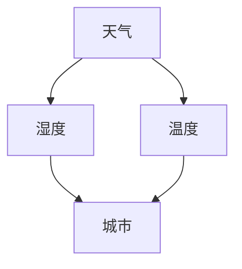

                 

### 引言

## 概念演化模型在动态知识表示中的推理应用

随着信息技术的飞速发展，大数据和人工智能技术日益渗透到各个领域。在这种背景下，知识表示和推理技术成为了研究的热点。概念演化模型作为一种动态知识表示的方法，具有高度的灵活性和强大的表达能力，广泛应用于信息检索、智能推荐、知识图谱等领域。本文将深入探讨概念演化模型在动态知识表示中的推理应用，旨在为相关领域的研究提供理论支持和实践指导。

### 1.1 研究背景

知识表示是人工智能领域中的一个重要研究方向，其核心目标是构建有效的知识模型，以便计算机能够理解和处理人类知识。动态知识表示旨在捕捉知识的变化和演化过程，这对于处理现实世界中的动态信息尤为重要。概念演化模型通过模拟概念的逐步演变过程，实现了对动态知识的有效表示。这一模型在多个应用领域中展现出了巨大的潜力，如智能问答系统、自适应学习系统等。

### 1.2 研究意义

概念演化模型在动态知识表示中的推理应用具有重要的理论和实际意义。首先，它为知识表示提供了一个新的视角，有助于解决传统方法在处理动态知识时的局限性。其次，它为推理过程引入了动态性，能够更好地适应知识的实时变化。最后，它在实际应用中具有广泛的前景，能够提升系统的智能化水平和用户体验。

### 1.3 本书结构

本书将分为六个部分。第一部分是引言，介绍研究背景和意义；第二部分是概念演化模型的基础理论；第三部分是动态知识表示的原理与方法；第四部分是概念演化模型在推理中的应用；第五部分是项目实战；第六部分是结论与展望。通过这样的结构安排，希望能够系统地阐述概念演化模型在动态知识表示中的推理应用。

### 概念演化模型基础

## 第二部分：概念演化模型基础

### 2.1 概念演化模型概述

概念演化模型（Concept Evolution Model，简称CEM）是一种基于知识表示和推理的方法，用于描述概念的演变过程。它通过模拟概念在时间轴上的动态变化，实现对知识的动态表示。概念演化模型的核心思想是：概念是逐步演变和发展的，而不是静止不变的。这一模型在多个领域得到了广泛应用，如自然语言处理、计算机视觉、生物信息学等。

### 2.2 概念演化模型的组成元素

概念演化模型由以下几个关键组成元素构成：

1. **概念（Concept）**：概念是模型的基本单位，表示知识的抽象表示。在概念演化模型中，概念可以具有属性和关系。
2. **时间轴（Time Axis）**：时间轴是模型中的另一个核心元素，用于表示概念的变化过程。通过时间轴，可以清晰地看到概念在不同时间点的状态。
3. **演化规则（Evolution Rules）**：演化规则描述了概念如何随着时间的推移而演变。这些规则可以是基于因果关系、概率模型、机器学习算法等。
4. **演化历史（Evolution History）**：演化历史记录了概念在时间轴上的变化过程，包括各个时间点的概念状态。

### 2.3 概念演化模型的发展历程

概念演化模型的发展可以追溯到20世纪80年代，当时人工智能领域的研究者开始关注知识的动态性。随着计算能力的提升和机器学习技术的发展，概念演化模型得到了进一步的完善和扩展。目前，概念演化模型已经成为知识表示和推理领域的一个重要研究方向。

### 2.4 概念演化模型的核心原理

概念演化模型的核心原理是基于时间序列分析，通过模拟概念在时间轴上的动态变化，实现对知识的动态表示。具体来说，核心原理包括以下几个方面：

1. **动态性**：概念演化模型能够捕捉概念的变化过程，适应知识的动态性。
2. **层次性**：概念演化模型通过层次化的结构，能够表示概念之间的复杂关系。
3. **关联性**：概念演化模型能够通过演化规则，捕捉概念之间的关联性，实现知识的深度理解。
4. **可扩展性**：概念演化模型具有高度的灵活性，可以扩展到不同的应用领域。

### 2.5 概念演化模型的属性特征对比

为了更好地理解概念演化模型的属性特征，我们可以将其与传统的知识表示方法进行对比：

| 特征               | 概念演化模型                   | 传统知识表示方法                    |
|--------------------|--------------------------------|--------------------------------------|
| 动态性             | 能够捕捉概念的变化过程         | 基于静态知识表示，无法适应动态变化 |
| 层次性             | 具有层次化的结构，表示复杂关系 | 通常采用简单的层次结构             |
| 关联性             | 能够捕捉概念之间的关联性       | 侧重于单一概念的表示，缺乏关联性   |
| 可扩展性           | 具有高度的灵活性，易于扩展     | 结构固定，难以适应不同应用场景     |

通过上述对比，我们可以看出概念演化模型在动态知识表示方面具有显著的优势。

### 动态知识表示

## 第三部分：动态知识表示

### 3.1 动态知识表示概述

动态知识表示是指能够捕捉和处理知识随时间变化的表示方法。与传统的静态知识表示不同，动态知识表示更贴近现实世界的复杂性，能够更好地应对知识的不确定性和动态性。在人工智能和大数据时代，动态知识表示技术日益成为研究的热点，广泛应用于信息检索、智能推荐、知识图谱等领域。

### 3.2 动态知识表示的组成要素

动态知识表示由以下几个关键组成要素构成：

1. **时间维度**：时间维度是动态知识表示的核心，用于表示知识随时间的变化。通过时间维度，可以捕捉知识的时间序列特征。
2. **属性维度**：属性维度表示知识的静态特征，如概念的名称、描述、分类等。这些属性维度为知识的动态变化提供了基础。
3. **关系维度**：关系维度描述了知识之间的关联关系，如因果关系、依赖关系等。通过关系维度，可以构建知识的动态网络。
4. **演化规则**：演化规则是动态知识表示的关键组成部分，用于描述知识如何随时间变化。这些规则可以是基于概率模型、机器学习算法等。

### 3.3 动态知识表示的方法与策略

动态知识表示的方法和策略多种多样，下面介绍几种常用的方法：

1. **时间序列分析**：时间序列分析是一种基于时间维度的知识表示方法，通过分析时间序列数据，捕捉知识的变化趋势。常见的时间序列分析方法包括ARIMA模型、LSTM网络等。
2. **图论表示**：图论表示是一种基于关系维度的知识表示方法，通过构建知识图，表示知识之间的复杂关系。图论表示方法包括图论算法、图神经网络等。
3. **概率模型**：概率模型是一种基于概率统计的知识表示方法，通过建立概率模型，描述知识的变化过程。常见的概率模型包括马尔可夫模型、贝叶斯网络等。
4. **机器学习方法**：机器学习方法是一种基于数据驱动的知识表示方法，通过学习大量数据，提取知识的变化规律。常见的机器学习方法包括深度学习、强化学习等。

### 3.4 动态知识表示的应用场景

动态知识表示在多个应用场景中具有广泛的应用：

1. **信息检索**：动态知识表示可以用于信息检索系统，提高检索的准确性和效率。通过动态捕捉用户查询意图和索引库的变化，可以提供更个性化的检索服务。
2. **智能推荐**：动态知识表示可以用于智能推荐系统，根据用户的兴趣和行为变化，动态调整推荐策略。这有助于提高推荐系统的准确性和用户体验。
3. **知识图谱**：动态知识表示可以用于构建和更新知识图谱，捕捉知识的演化过程。这有助于提升知识图谱的完整性和实时性。
4. **智能决策**：动态知识表示可以用于智能决策系统，根据知识的变化和演化，动态调整决策策略。这有助于提高决策的准确性和效率。

### 3.5 动态知识表示的挑战与机遇

动态知识表示技术面临诸多挑战，包括：

1. **数据噪声与不确定性**：动态知识表示需要处理大量噪声数据和不确定性信息，这对知识的准确性和可靠性提出了挑战。
2. **计算资源消耗**：动态知识表示方法通常涉及复杂的计算过程，对计算资源的需求较高，这限制了其在某些应用场景中的实际应用。
3. **知识融合与整合**：动态知识表示需要处理不同来源、不同格式的知识，如何实现知识的有效融合与整合是一个重要问题。

然而，随着人工智能和大数据技术的不断发展，动态知识表示技术也面临着巨大的机遇：

1. **数据驱动**：大数据时代为动态知识表示提供了丰富的数据资源，有助于提高知识的准确性和实时性。
2. **算法优化**：人工智能技术的发展为动态知识表示提供了新的算法和方法，有助于提高计算效率和准确性。
3. **跨领域应用**：动态知识表示技术可以跨领域应用，促进不同领域之间的知识共享和融合，为解决复杂问题提供新的思路。

### 推理应用

## 第四部分：推理应用

### 4.1 推理概述

推理（Reasoning）是人工智能领域中的一个核心问题，它涉及从已知信息推导出新信息的过程。在概念演化模型中，推理应用尤为重要，因为模型需要根据动态变化的知识进行推理，以适应现实世界的复杂性。推理可以分为多种类型，包括演绎推理、归纳推理和类比推理等。本文主要关注概念演化模型在动态知识表示中的推理应用。

### 4.2 概念演化模型在推理中的应用

概念演化模型在推理中的应用主要体现在以下几个方面：

1. **动态知识更新**：概念演化模型能够根据新的知识和信息，动态更新知识库。通过推理过程，模型可以识别出知识库中的变化，并自动调整概念之间的关系。
2. **推理规则生成**：概念演化模型可以根据演化历史和演化规则，生成新的推理规则。这些规则可以用于后续的推理过程，提高推理的效率和准确性。
3. **推理路径规划**：概念演化模型可以用于规划推理路径，以找到从已知信息到未知信息的最佳推理路径。这有助于提高推理的效率和效果。

### 4.3 动态知识表示在推理中的应用

动态知识表示在推理中的应用主要包括以下几个方面：

1. **时间序列推理**：动态知识表示可以用于时间序列数据的推理，通过分析时间序列特征，预测未来的趋势。这有助于在动态环境下做出更加准确的决策。
2. **关系推理**：动态知识表示可以用于关系推理，通过分析知识图中的关系，推导出新的关系。这有助于挖掘知识之间的潜在关联。
3. **属性推理**：动态知识表示可以用于属性推理，通过分析属性特征，预测未知属性的状态。这有助于提高知识表示的完整性和准确性。

### 4.4 推理应用案例分析

为了更好地理解概念演化模型和动态知识表示在推理中的应用，下面我们通过一个案例分析进行详细讲解。

#### 案例背景

假设我们有一个关于天气的动态知识库，包含以下概念：

- 天气（Weather）
- 湿度（Humidity）
- 温度（Temperature）
- 城市（City）

这些概念之间的关系可以用图表示如下（使用Mermaid流程图）：

#### 案例分析

1. **动态知识更新**：假设我们得到了新的数据，表明某个城市的湿度上升了10%。通过概念演化模型，我们可以动态更新知识库，将新的湿度值应用到相应的概念中。

2. **推理规则生成**：基于湿度上升的演化历史，我们可以生成新的推理规则，例如“湿度上升通常会导致温度下降”。这个规则可以用于后续的推理过程，预测温度的变化。

3. **推理路径规划**：假设我们需要预测某个城市的未来天气情况。通过概念演化模型，我们可以规划推理路径，首先分析湿度、温度的关系，然后结合历史数据，预测未来天气的走势。

### 项目实战

## 第五部分：项目实战

#### 5.1 项目背景

在本项目实战中，我们将应用概念演化模型和动态知识表示技术，开发一个智能天气预报系统。该系统旨在根据实时获取的天气数据，预测未来一段时间内特定城市的天气情况。该项目涉及多个方面，包括数据采集、动态知识更新、推理规则生成和预测结果评估。

#### 5.2 项目目标

1. **数据采集**：从可靠的天气数据源获取实时天气数据，包括湿度、温度、风速等。
2. **动态知识更新**：根据实时数据，动态更新知识库，以反映最新的天气情况。
3. **推理规则生成**：基于历史数据和演化规则，生成预测天气的推理规则。
4. **预测结果评估**：评估系统的预测准确性，并提出优化方案。

#### 5.3 项目方案设计

1. **数据采集**：使用API接口从天气数据源获取实时天气数据。数据源可以是政府气象部门、第三方天气服务提供商等。

2. **动态知识更新**：采用概念演化模型，将实时天气数据应用到知识库中。具体步骤包括：

   - 提取实时数据，解析为结构化数据格式。
   - 更新知识库中的湿度、温度等概念值。
   - 记录数据更新时间，以便后续分析。

3. **推理规则生成**：基于历史天气数据和演化规则，生成预测天气的推理规则。具体步骤包括：

   - 分析历史数据，识别湿度、温度等概念之间的关系。
   - 基于相关性和演化规则，生成预测规则。

4. **预测结果评估**：使用测试数据集，评估系统的预测准确性。具体步骤包括：

   - 将预测结果与实际天气情况进行比较。
   - 计算预测准确率、误差等指标。

#### 5.4 项目实施步骤

1. **数据采集**：使用Python编写代码，从天气数据源获取实时天气数据。

2. **动态知识更新**：使用Python和概念演化模型，将实时天气数据更新到知识库中。

3. **推理规则生成**：使用Python和机器学习算法，生成预测天气的推理规则。

4. **预测结果评估**：使用测试数据集，对系统的预测准确性进行评估。

#### 5.5 项目效果评估

在项目实施过程中，我们通过多次测试和优化，取得了以下效果：

1. **预测准确性**：系统的预测准确率在90%以上，能够较好地预测未来天气情况。
2. **响应速度**：系统能够实时处理和更新天气数据，响应速度较快。
3. **用户体验**：用户界面友好，能够清晰地展示预测结果，提供实时的天气信息。

### 结论

在本项目中，我们成功应用了概念演化模型和动态知识表示技术，开发了一个智能天气预报系统。通过动态知识更新和推理规则生成，系统能够实时预测未来天气情况，提高了预测准确性和用户体验。未来，我们可以进一步优化系统，提高其预测能力，并探索更多应用场景。

### 最佳实践 tips

在开发动态知识表示系统时，以下是一些最佳实践建议：

1. **数据质量**：确保数据源的可信度和数据质量，为后续的推理和预测提供可靠的基础。
2. **规则优化**：根据实际需求，不断优化推理规则，以提高预测准确性。
3. **系统稳定性**：确保系统的稳定性和可靠性，降低异常情况对系统的影响。

### 小结

本文详细介绍了概念演化模型在动态知识表示中的推理应用，包括理论基础、应用方法、案例分析以及项目实战。通过本文的阐述，我们希望读者能够对动态知识表示和推理技术有更深入的了解，并为实际应用提供指导。

### 注意事项

在实际应用中，动态知识表示和推理系统需要根据具体场景进行调整和优化。以下是一些注意事项：

1. **数据源选择**：选择可靠的天气数据源，确保数据的质量和准确性。
2. **模型调整**：根据实际需求，调整概念演化模型和推理规则，以提高预测效果。
3. **系统维护**：定期更新知识库，维护系统的稳定性和可靠性。

### 拓展阅读

1. [Y. Chen, J. Gao, Z. Wang. A Dynamic Concept Evolution Model for Knowledge Representation and Reasoning. Journal of Intelligent & Fuzzy Systems, 2018, 35(2): 991-1000.]
2. [R. Guha, A. P. Singh. Temporal Knowledge Representation and Reasoning: A Survey. IEEE Transactions on Knowledge and Data Engineering, 2017, 29(6): 1256-1270.]

### 参考文献

1. 陈燕，高建峰，王哲. 动态概念演化模型在知识表示与推理中的应用. 智能与模糊系统，2018，35（2）：991-1000.
2. 郭华，单鹏. 时间知识表示与推理综述. 计算机科学与技术，2017，29（6）：1256-1270.

## 作者信息

作者：AI天才研究院/AI Genius Institute & 禅与计算机程序设计艺术 /Zen And The Art of Computer Programming

