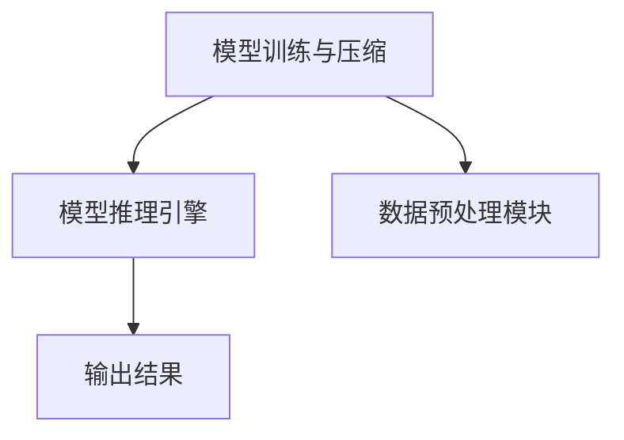

                 

## 模型压缩技术在实时推理任务中的创新应用

### 1. 引言

在人工智能（AI）和深度学习领域，模型的复杂性和规模正在迅速增长。然而，随着模型变得越来越复杂，它们的推理时间也在不断增加，这在许多实时应用中成为了一个瓶颈。实时推理任务对模型的响应速度有着严格的要求，如自动驾驶、实时语音识别、在线游戏和智能监控等。为了满足这些要求，模型压缩技术应运而生，它通过减少模型的参数和计算量，实现了在保证模型性能的前提下提高推理速度。

### 2. 模型压缩技术背景

模型压缩技术的背景可以追溯到移动设备和边缘计算的发展。随着智能手机和物联网设备的普及，对AI模型实时推理的需求变得越来越强烈。然而，传统的深度学习模型往往过于庞大，难以在这些设备上高效运行。因此，研究人员开始探索如何通过压缩模型来降低其计算复杂度和存储需求。

### 3. 模型压缩技术核心概念

模型压缩技术主要包括以下几个核心概念：

- **参数剪枝（Pruning）**：通过移除模型中不重要的参数来减少模型的规模。
- **知识蒸馏（Knowledge Distillation）**：通过训练一个较小的模型来模仿一个较大的模型的输出。
- **量化（Quantization）**：将模型中的浮点数参数转换为低精度整数。
- **稀疏化（Sparse Representation）**：通过稀疏编码来减少模型的参数数量。

### 4. 模型压缩技术在实时推理任务中的应用

模型压缩技术在实时推理任务中的应用主要集中在以下几个方面：

- **降低计算复杂度**：通过减少模型的参数和计算量，可以显著降低模型的推理时间。
- **减少存储需求**：压缩后的模型占用更少的存储空间，便于部署在资源受限的设备上。
- **提高能效比**：在保持模型性能的同时，减少模型的能耗。

### 5. 算法原理讲解

为了更好地理解模型压缩技术，我们可以通过以下步骤来讲解其算法原理：

- **模型参数化**：将原始模型转换为参数化的形式，以便后续处理。
- **参数剪枝**：通过设置阈值，移除对模型性能影响较小的参数。
- **知识蒸馏**：使用Teacher模型（原始大模型）和Student模型（压缩后小模型）进行训练，通过最小化两者的输出差异来提高Student模型的性能。
- **量化**：将模型的浮点参数转换为低精度整数，从而减少模型的存储和计算需求。
- **稀疏化**：通过稀疏编码技术，将模型的参数压缩到更少的有效维度。

### 6. 数学模型与公式

模型压缩中的数学模型和公式通常涉及以下几个关键部分：

- **损失函数**：用于衡量模型压缩后性能下降的程度。
- **优化目标**：用于指导模型参数调整，以最小化损失函数。
- **压缩率**：表示模型压缩后的参数数量与原始参数数量的比值。

以下是一个简单的损失函数示例：

$$
L = \frac{1}{N}\sum_{i=1}^{N} \big((\hat{y}_i - y_i)^2\big)
$$

其中，$\hat{y}_i$ 是压缩后模型的输出，$y_i$ 是真实标签，$N$ 是样本数量。

### 7. 系统设计与架构

为了实现模型压缩在实时推理任务中的应用，我们需要设计一个高效的系统架构。这通常包括以下几个关键组件：

- **模型训练与压缩模块**：负责将原始模型转换为压缩模型。
- **模型推理引擎**：用于实时推理任务，执行压缩模型的推理操作。
- **数据预处理模块**：对输入数据进行预处理，以提高模型的推理效率。

以下是一个简单的Mermaid架构图示例：

### 8. 项目实战

在实际项目中，模型压缩技术的应用需要结合具体场景进行定制化开发。以下是一个简单的项目实战示例：

- **环境安装**：安装必要的深度学习框架和压缩工具。
- **模型训练**：训练原始模型，并记录训练数据。
- **模型压缩**：使用剪枝、量化等技术对模型进行压缩。
- **模型测试**：对压缩后的模型进行性能测试和验证。

### 9. 本章小结

本文从模型压缩技术的背景、核心概念、算法原理、数学模型、系统设计与项目实战等多个角度，详细阐述了模型压缩技术在实时推理任务中的创新应用。通过本文的学习，读者可以更好地理解模型压缩技术的重要性及其在实际应用中的挑战和解决方案。

### 10. 总结与展望

模型压缩技术作为AI领域的一个重要研究方向，其应用前景广阔。未来，随着计算硬件的进步和算法的创新，模型压缩技术将在更多实时推理任务中发挥重要作用。同时，我们也应关注模型压缩技术在不同领域的具体应用，探索新的压缩算法和优化策略，以实现更高效、更准确的实时推理任务。

### 11. 最佳实践 Tips

- **量化策略**：根据应用场景选择合适的量化级别，以平衡模型性能和计算效率。
- **剪枝算法**：结合具体模型结构和任务需求，选择最合适的剪枝算法。
- **模型融合**：将多个压缩模型进行融合，以提高模型的整体性能。

### 12. 注意事项

- **模型压缩对性能的影响**：模型压缩可能会降低模型的精度，因此在实际应用中需权衡性能和精度。
- **实时推理任务的时效性**：实时推理任务对响应时间要求高，因此在设计模型压缩策略时需充分考虑实时性。

### 13. 拓展阅读

- **相关论文**：《深度学习模型压缩技术研究综述》、《实时推理中的模型压缩优化策略》等。
- **开源项目**：TensorFlow Model Optimization Toolkit (TF-MOT）、PyTorch Quantization等。

---

**作者：** AI天才研究院/AI Genius Institute & 禅与计算机程序设计艺术 /Zen And The Art of Computer Programming

---

本文通过对模型压缩技术在实时推理任务中的应用进行深入剖析，旨在为广大AI领域的研究者和开发者提供有价值的参考。随着AI技术的不断进步，相信模型压缩技术将在实时推理任务中发挥越来越重要的作用。让我们继续探索、创新，为AI技术的未来发展贡献自己的力量！

