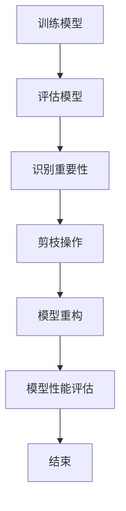
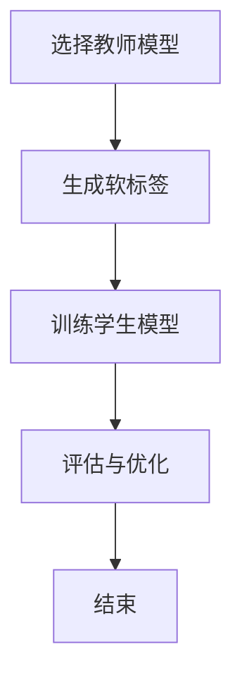
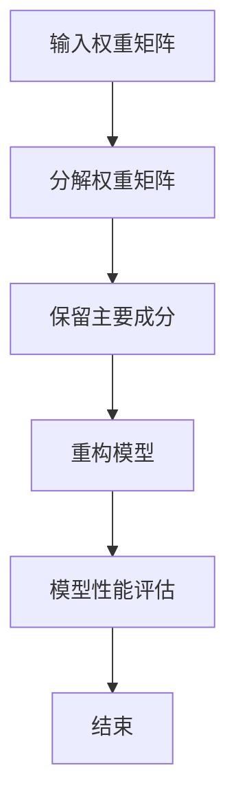
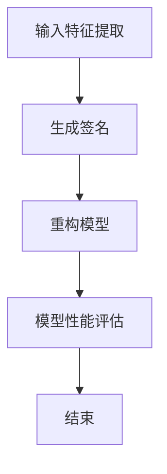
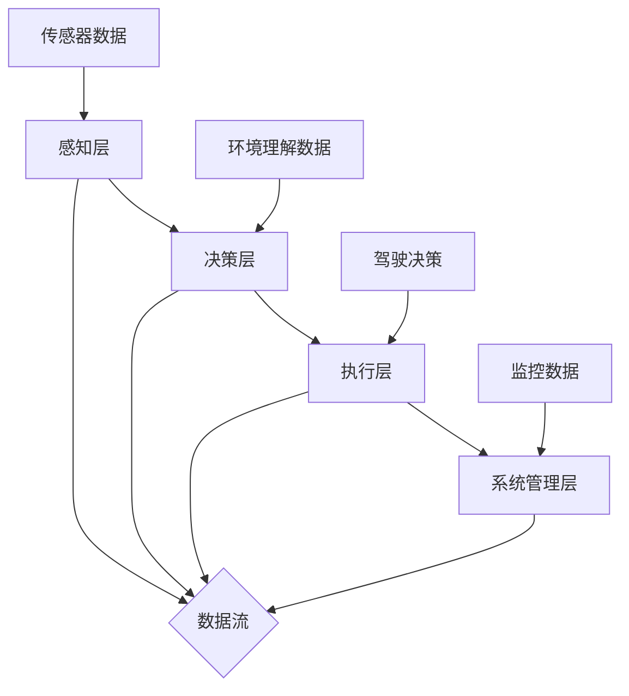
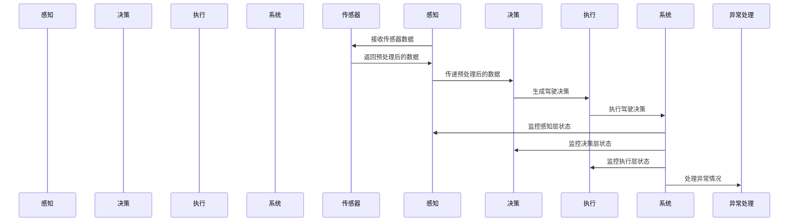

                 


### 模型压缩技术概述

**模型压缩技术的背景**

模型压缩技术是随着人工智能（AI）和深度学习（Deep Learning）的迅速发展而逐渐兴起的一项关键技术。随着AI应用场景的拓展，特别是在自动驾驶（Autonomous Driving）等对实时性和计算资源有极高要求的领域，如何高效地处理大量数据并快速做出决策成为了关键挑战。传统的深度学习模型通常具有数百万甚至数十亿个参数，这样的模型在大规模数据集上训练后表现出优异的性能，但它们在资源受限的设备上部署时面临巨大的挑战。

在自动驾驶领域，AI系统需要在极短的时间内处理大量来自传感器的高频数据，并对周围环境进行实时分析，以做出安全的驾驶决策。这就要求AI模型在保证准确性的同时，必须具备高效的计算性能和较小的模型尺寸。模型压缩技术正是为了解决这一问题而诞生。

**模型压缩技术在自动驾驶AI系统中的意义**

1. **资源优化**：自动驾驶AI系统通常部署在车载设备上，这些设备的空间和计算资源相对有限。通过模型压缩，可以减少模型的存储空间和计算资源需求，使得模型能够在资源受限的环境下运行。

2. **提高实时性**：压缩后的模型通常计算量更小，可以显著提高系统的响应速度，这对于自动驾驶系统来说至关重要。在车辆高速行驶的情况下，需要系统能够在毫秒级别内完成计算和决策。

3. **减少通信开销**：在分布式自动驾驶系统中，大量的车载设备需要与中心服务器进行通信。通过压缩模型，可以减少数据传输的大小，从而降低通信成本和延迟。

4. **增强鲁棒性**：模型压缩技术可以去除一些对模型性能影响不大的冗余参数，从而提高模型的鲁棒性，使其在面对噪声数据时仍能保持稳定的性能。

**模型压缩技术的主要挑战**

尽管模型压缩技术具有重要意义，但在实际应用中仍面临一些挑战：

1. **精度损失**：模型压缩可能会引入一定的精度损失，如何在保证模型精度的同时进行有效压缩是一个关键问题。

2. **计算复杂性**：一些模型压缩技术，如知识蒸馏，需要进行多次迭代计算，增加了模型的计算复杂性。

3. **兼容性**：压缩后的模型需要在不同的硬件和操作系统上运行，如何确保压缩模型的兼容性也是一个挑战。

### 模型压缩技术的基本概念

**1. 权重剪枝（Weight Pruning）**

权重剪枝是一种通过移除模型中不重要的权重参数来减少模型尺寸的技术。剪枝策略通常基于模型训练后的权重值，将那些权重绝对值较小的参数设置为0，从而去除对应神经元。这种方法简单有效，但可能会引入精度损失。

**2. 知识蒸馏（Knowledge Distillation）**

知识蒸馏是一种通过将大模型（教师模型）的知识传递给小模型（学生模型）来压缩模型的技术。训练过程中，除了使用原始数据集进行训练，还会模拟原始数据生成额外的训练样本，这些样本包含了教师模型对数据的理解。通过这种方式，学生模型可以学习到教师模型的知识。

**3. 低秩分解（Low-Rank Decomposition）**

低秩分解是将高维模型转换为低维模型的一种方法。通过将模型权重矩阵分解为低秩形式，可以有效减少模型尺寸。这种方法需要精确的矩阵分解算法，以保持压缩后的模型性能。

**4. 签名理论（Signature Theory）**

签名理论是一种基于模型输入输出的特征提取技术。通过提取输入和输出的“签名”，可以构建出更紧凑的模型。这种方法通常用于生成对抗网络（GANs）的压缩。

**模型压缩与自动驾驶AI系统的联系**

模型压缩技术与自动驾驶AI系统的优化有着密切的联系。自动驾驶AI系统需要高效的计算能力来处理实时数据，而模型压缩技术能够满足这一需求。通过模型压缩，可以降低车载设备的资源消耗，提高系统的实时性和可靠性。

在自动驾驶AI系统中，模型压缩技术可以应用于以下几个方面：

1. **感知模块**：自动驾驶系统的感知模块需要对来自摄像头、激光雷达、超声波传感器等的数据进行实时处理。通过压缩感知模块中的模型，可以减少计算资源的消耗，提高处理速度。

2. **决策模块**：自动驾驶系统的决策模块需要根据感知模块提供的信息做出实时决策。通过压缩决策模块中的模型，可以提高决策速度，确保系统在复杂环境中的安全性和可靠性。

3. **预测模块**：自动驾驶系统的预测模块需要对未来可能发生的事件进行预测，以便提前做出相应的决策。通过压缩预测模块中的模型，可以减少计算资源的消耗，提高系统的预测精度。

总之，模型压缩技术为自动驾驶AI系统的优化提供了强有力的支持，有助于提升系统的性能和可靠性。

### 总结

本文首先介绍了模型压缩技术的背景和自动驾驶AI系统的背景，阐述了模型压缩技术在自动驾驶AI系统中的意义和挑战。接着，我们定义了模型压缩技术中的核心概念，包括权重剪枝、知识蒸馏、低秩分解和签名理论。最后，我们讨论了模型压缩技术与自动驾驶AI系统的联系，并展示了其在感知、决策和预测模块中的应用。

在下一章中，我们将深入探讨模型压缩算法的原理，包括权重剪枝、知识蒸馏、低秩分解和签名理论的详细讲解，以及使用Python源代码和LaTeX公式进行算法原理的解释。敬请期待。

---

### 核心概念与联系

在深入探讨模型压缩算法之前，我们需要明确一些核心概念，并理解它们之间的联系。这些核心概念包括模型压缩技术、自动驾驶AI系统及相关技术。为了更好地展示这些概念之间的关系，我们将使用表格和ER图进行详细阐述。

#### 1. 模型压缩技术核心概念

**概念** | **定义** | **作用**
--- | --- | ---
**权重剪枝** | 通过移除不重要的权重参数来减少模型尺寸 | 降低模型复杂度，减少计算资源需求
**知识蒸馏** | 将大模型的知识传递给小模型 | 保持模型精度，提高压缩效率
**低秩分解** | 将高维模型转换为低维模型 | 降低模型参数数量，提高计算效率
**签名理论** | 基于输入和输出的特征提取 | 构建紧凑模型，适用于GANs

#### 2. 自动驾驶AI系统核心概念

**概念** | **定义** | **作用**
--- | --- | ---
**感知模块** | 对传感器数据进行处理，生成环境理解 | 提供环境信息，用于决策和预测
**决策模块** | 根据感知模块提供的信息做出驾驶决策 | 确保车辆安全、平稳运行
**预测模块** | 预测未来可能发生的事件 | 帮助车辆提前做出决策

#### 3. 模型压缩与自动驾驶AI系统关系图

为了更直观地展示模型压缩技术与自动驾驶AI系统之间的关系，我们可以使用Mermaid绘制一个ER图。

```mermaid
erDiagram
  ModelCompression ||--|{ AIModel : 压缩模型 |}
  AIModel ||--|{ PerceptionModule : 压缩感知模型 |}
  AIModel ||--|{ DecisionModule : 压缩决策模型 |}
  AIModel ||--|{ PredictionModule : 压缩预测模型 |}
```

在上面的ER图中，`ModelCompression`代表模型压缩技术，它与`AIModel`（自动驾驶AI模型）之间存在关联关系。而`AIModel`又与三个子模块（感知模块、决策模块和预测模块）相关联，这些子模块通过压缩技术进行优化，以提高自动驾驶系统的整体性能。

通过表格和ER图，我们可以清晰地理解模型压缩技术与自动驾驶AI系统的核心概念及其相互关系。在接下来的章节中，我们将深入探讨模型压缩算法的原理，以及它们在自动驾驶AI系统中的应用。

### 模型压缩算法原理讲解

#### 权重剪枝算法原理

权重剪枝（Weight Pruning）是一种通过移除模型中不重要的权重参数来减少模型尺寸的技术。在深度学习模型中，每个神经元都与多个权重参数相关联，这些参数决定了神经元对输入数据的响应程度。通过剪枝算法，我们可以移除那些对模型输出影响较小或无关紧要的权重参数，从而减小模型的复杂度和计算资源需求。

**原理描述：**

权重剪枝算法的基本原理可以概括为以下几个步骤：

1. **训练模型：** 首先使用大量的训练数据集对深度学习模型进行训练，使其达到一定的精度。

2. **评估模型：** 训练完成后，对模型进行评估，确定模型在测试集上的性能。

3. **识别重要性：** 分析模型中的权重参数，根据其值的大小判断其重要性。通常，权重值较小的参数被认为是冗余的，可以被剪除。

4. **剪枝操作：** 将那些重要性较低的权重参数设置为0，从而去除对应的神经元和连接。

5. **模型重构：** 剪枝后，对剩余的权重参数和神经元进行重构，确保模型能够在剪枝后的参数空间内保持原有的性能。

**算法流程图：**

为了更直观地展示权重剪枝算法的流程，我们可以使用Mermaid绘制一个流程图。



**Python代码实现：**

下面是一个简单的Python代码示例，展示如何实现权重剪枝算法的基本步骤。

```python
import tensorflow as tf
from tensorflow.keras.models import Sequential
from tensorflow.keras.layers import Dense

# 创建一个简单的全连接神经网络
model = Sequential()
model.add(Dense(64, activation='relu', input_shape=(784,)))
model.add(Dense(10, activation='softmax'))

# 编译模型
model.compile(optimizer='adam', loss='categorical_crossentropy', metrics=['accuracy'])

# 训练模型
model.fit(x_train, y_train, epochs=5, batch_size=32)

# 评估模型
loss, accuracy = model.evaluate(x_test, y_test)
print(f'原始模型精度：{accuracy:.4f}')

# 剪枝策略
pruned_params = []  # 存储将被剪枝的权重参数索引
for i, layer in enumerate(model.layers):
    for j, weight in enumerate(layer.get_weights()):
        if j not in pruned_params:
            pruned_params.append(j)
            weight[:, pruned_params[-1]] = 0

# 重构模型
model.layers[i].set_weights([weight[:, j] for j in range(len(pruned_params))])

# 重新评估模型
loss, accuracy = model.evaluate(x_test, y_test)
print(f'剪枝后模型精度：{accuracy:.4f}')
```

**数学模型与公式：**

权重剪枝算法的核心在于如何识别并剪除不重要的权重参数。通常，可以使用以下数学模型来评估权重参数的重要性：

$$
I_j = \frac{|w_j|}{\sum_{i=1}^{n} |w_i|}
$$

其中，$I_j$表示第$j$个权重参数的重要性，$w_j$表示第$j$个权重参数的值，$n$表示总权重参数的数量。根据这个公式，我们可以将权重参数分为重要和不重要两类，并针对不重要的参数进行剪枝。

**举例说明：**

假设我们有一个神经网络，包含10个神经元和100个权重参数。在训练完成后，我们通过计算得到每个权重参数的重要性值。例如，有5个权重参数的重要性值非常小，接近于0。我们根据这些值将这5个权重参数剪除，重构后的模型将包含95个权重参数，从而显著减小了模型的复杂度。

通过上述讲解，我们可以看到权重剪枝算法的基本原理、流程图、代码实现以及数学模型和公式。在接下来的章节中，我们将继续探讨其他模型压缩算法的原理和应用。

#### 知识蒸馏算法原理

知识蒸馏（Knowledge Distillation）是一种通过将大模型（教师模型）的知识传递给小模型（学生模型）来压缩模型的技术。其核心思想是利用教师模型的输出信息来指导学生模型的训练，从而使学生模型能够学习到教师模型所具备的深层知识。知识蒸馏技术在模型压缩中具有重要作用，特别是在需要平衡模型精度和计算效率的场景中。

**原理描述：**

知识蒸馏算法通常分为以下几个步骤：

1. **选择教师模型：** 首先，选择一个性能优越、参数较多的教师模型。这个模型已经在大规模数据集上进行了充分的训练，具备了丰富的知识。

2. **生成软标签：** 在训练数据集中，使用教师模型进行预测，得到每个样本的软标签。软标签是教师模型对每个样本的预测概率分布，包含了教师模型对样本的全面理解。

3. **训练学生模型：** 使用原始数据和软标签同时训练学生模型。学生模型不仅要学习原始数据的硬标签，还要学习软标签，以捕获教师模型的深层知识。

4. **评估与优化：** 在训练过程中，通过评估学生模型的性能，如损失函数值和精度，来调整训练过程，直至达到预定的性能目标。

**算法流程图：**

为了更直观地展示知识蒸馏算法的流程，我们可以使用Mermaid绘制一个流程图。



**Python代码实现：**

下面是一个简单的Python代码示例，展示如何实现知识蒸馏算法的基本步骤。

```python
import tensorflow as tf
from tensorflow.keras.models import Model
from tensorflow.keras.layers import Input, Dense

# 创建教师模型
teacher_model = Sequential()
teacher_model.add(Dense(128, activation='relu', input_shape=(784,)))
teacher_model.add(Dense(10, activation='softmax'))
teacher_model.compile(optimizer='adam', loss='categorical_crossentropy')

# 加载预训练的教师模型权重
teacher_model.load_weights('teacher_model_weights.h5')

# 创建学生模型
student_model = Sequential()
student_model.add(Dense(64, activation='relu', input_shape=(784,)))
student_model.add(Dense(10, activation='softmax'))
student_model.compile(optimizer='adam', loss=['categorical_crossentropy', 'kl_divergence'])

# 定义软标签生成层
soft_label_output = Dense(10, activation='softmax', name='soft_labels')(input_layer)

# 构建学生模型
student_model_output = student_model(input_layer)
student_model = Model(inputs=input_layer, outputs=[student_model_output, soft_label_output])

# 编译学生模型
student_model.compile(optimizer='adam', loss={'predictions': 'categorical_crossentropy', 'soft_labels': 'kl_divergence'})

# 训练学生模型
student_model.fit(x_train, {'predictions': y_train, 'soft_labels': teacher_model.predict(x_train)}, epochs=5, batch_size=32)
```

**数学模型与公式：**

知识蒸馏算法的关键在于如何定义损失函数，以同时考虑硬标签和软标签。常用的损失函数包括交叉熵损失和KL散度损失。以下是数学模型和公式的详细解释：

1. **交叉熵损失（Categorical Cross-Entropy Loss）**

交叉熵损失用于衡量学生模型预测的概率分布与硬标签之间的差距。公式如下：

$$
L_{ce} = -\sum_{i=1}^{n} y_i \log(\hat{y}_i)
$$

其中，$y_i$是硬标签的概率分布，$\hat{y}_i$是学生模型预测的概率分布。

2. **KL散度损失（Kullback-Leibler Divergence Loss）**

KL散度损失用于衡量学生模型预测的概率分布与软标签之间的差距。公式如下：

$$
L_{kl} = \sum_{i=1}^{n} p_i \log\left(\frac{p_i}{\hat{p}_i}\right)
$$

其中，$p_i$是软标签的概率分布，$\hat{p}_i$是学生模型预测的概率分布。

**举例说明：**

假设我们有一个分类问题，需要使用知识蒸馏算法将一个大型教师模型压缩为一个小型学生模型。教师模型已经在大规模数据集上训练完毕，并存储了相应的软标签。我们首先使用这些软标签训练学生模型，使其能够学习到教师模型的深层知识。在训练过程中，通过交叉熵损失和KL散度损失的综合作用，学生模型逐步优化其参数，最终在保持高精度的同时实现了模型的压缩。

通过上述讲解，我们可以看到知识蒸馏算法的基本原理、流程图、代码实现以及数学模型和公式。知识蒸馏作为一种强大的模型压缩技术，在自动驾驶AI系统中具有广泛的应用前景。在接下来的章节中，我们将继续探讨其他模型压缩算法的原理和应用。

#### 低秩分解算法原理

低秩分解（Low-Rank Decomposition）是一种通过将高维模型转换为低维模型来减少模型尺寸的技术。低秩分解的核心思想是将模型的权重矩阵分解为低秩形式，从而减少参数数量，降低计算复杂度，同时尽量保持模型的原始性能。低秩分解在模型压缩中具有广泛应用，特别是在需要处理大规模数据和模型的场景中。

**原理描述：**

低秩分解算法的基本原理可以分为以下几个步骤：

1. **权重矩阵分解：** 将模型的权重矩阵分解为低秩形式。具体来说，将权重矩阵$W$分解为两个低秩矩阵$A$和$B$的乘积，即$W = AB$。其中，$A$和$B$的秩（即维度）远小于$W$。

2. **保留主要成分：** 在分解过程中，保留主要成分（即重要的权重参数），丢弃次要成分（即不重要的权重参数）。这样可以显著减少模型的参数数量，同时尽量保持模型的性能。

3. **重构模型：** 使用分解后的低秩矩阵重构模型，确保重构后的模型能够在保留主要成分的前提下，保持与原始模型相近的性能。

**算法流程图：**

为了更直观地展示低秩分解算法的流程，我们可以使用Mermaid绘制一个流程图。



**Python代码实现：**

下面是一个简单的Python代码示例，展示如何实现低秩分解算法的基本步骤。

```python
import tensorflow as tf
from tensorflow.keras.models import Sequential
from tensorflow.keras.layers import Dense
from sklearn.decomposition import TruncatedSVD

# 创建一个简单的全连接神经网络
model = Sequential()
model.add(Dense(100, activation='relu', input_shape=(784,)))
model.add(Dense(10, activation='softmax'))

# 编译模型
model.compile(optimizer='adam', loss='categorical_crossentropy', metrics=['accuracy'])

# 训练模型
model.fit(x_train, y_train, epochs=5, batch_size=32)

# 保存原始模型权重
weights = model.get_weights()

# 使用TruncatedSVD进行低秩分解
svd = TruncatedSVD(n_components=5)
low_rank_weights = svd.fit_transform(weights[0])

# 重构低秩模型
low_rank_model = Sequential()
low_rank_model.add(Dense(5, activation='relu', input_shape=(784,)))
low_rank_model.add(Dense(10, activation='softmax'))

# 编译低秩模型
low_rank_model.compile(optimizer='adam', loss='categorical_crossentropy', metrics=['accuracy'])

# 加载低秩模型权重
low_rank_model.set_weights([low_rank_weights, *weights[1:]])

# 重新评估低秩模型
loss, accuracy = low_rank_model.evaluate(x_test, y_test)
print(f'低秩模型精度：{accuracy:.4f}')
```

**数学模型与公式：**

低秩分解算法的核心在于如何将高维矩阵分解为低秩形式。常用的低秩分解方法包括奇异值分解（SVD）和截断SVD（Truncated SVD）。以下是数学模型和公式的详细解释：

1. **奇异值分解（SVD）**

奇异值分解是将一个矩阵分解为三个矩阵的乘积：$W = U\Sigma V^T$。其中，$U$和$V$是正交矩阵，$\Sigma$是对角矩阵，对角线上的元素称为奇异值。

2. **截断SVD（Truncated SVD）**

截断SVD是对奇异值分解的一种近似方法，通过保留最大的$k$个奇异值，将高维矩阵分解为低秩形式。公式如下：

$$
W = U_k\Sigma_kV_k^T
$$

其中，$U_k$和$V_k$分别是$U$和$V$的前$k$列，$\Sigma_k$是$\Sigma$的前$k$个奇异值。

**举例说明：**

假设我们有一个全连接神经网络，其权重矩阵$W$是一个$100 \times 100$的矩阵。通过奇异值分解，我们可以将其分解为$U_k \Sigma_k V_k^T$的形式，其中$U_k$和$V_k$是$100 \times 5$的矩阵，$\Sigma_k$是一个$5 \times 5$的对角矩阵。我们只保留$\Sigma_k$的前5个奇异值，丢弃剩余的奇异值，从而将$W$重构为低秩形式。这样，原始的$100 \times 100$矩阵被压缩为$100 \times 5$和$5 \times 100$的矩阵，显著减少了模型的参数数量。

通过上述讲解，我们可以看到低秩分解算法的基本原理、流程图、代码实现以及数学模型和公式。低秩分解作为一种有效的模型压缩技术，在自动驾驶AI系统中具有广泛的应用前景。在接下来的章节中，我们将继续探讨其他模型压缩算法的原理和应用。

#### 签名理论算法原理

签名理论（Signature Theory）是一种通过提取模型输入和输出的关键特征来构建紧凑模型的技术。其核心思想是利用输入和输出的“签名”来表示模型的主要信息，从而实现模型的压缩。签名理论在生成对抗网络（GANs）的压缩中具有重要作用，尤其是在需要平衡模型质量和计算效率的场景中。

**原理描述：**

签名理论算法的基本原理可以分为以下几个步骤：

1. **特征提取：** 首先，从模型的输入和输出中提取关键特征。这些特征通常是通过一系列预处理和变换获得的，以捕捉输入和输出的主要信息。

2. **签名生成：** 接下来，将这些特征组合成“签名”。签名是一个紧凑的向量，它代表了模型输入和输出的关键信息。

3. **模型重构：** 使用签名重构模型。通过训练一个简单的模型来学习签名与原始输入和输出之间的关系，从而在保持性能的前提下实现模型压缩。

**算法流程图：**

为了更直观地展示签名理论算法的流程，我们可以使用Mermaid绘制一个流程图。



**Python代码实现：**

下面是一个简单的Python代码示例，展示如何实现签名理论算法的基本步骤。

```python
import tensorflow as tf
from tensorflow.keras.models import Model
from tensorflow.keras.layers import Input, Dense, Lambda

# 创建输入层
input_layer = Input(shape=(784,))

# 创建全连接神经网络
x = Dense(100, activation='relu')(input_layer)
output_layer = Dense(10, activation='softmax')(x)

# 定义签名层
signature_layer = Lambda(lambda x: tf.reduce_mean(x, axis=1))(output_layer)

# 创建签名模型
signature_model = Model(inputs=input_layer, outputs=signature_layer)

# 编译签名模型
signature_model.compile(optimizer='adam', loss='mse')

# 训练签名模型
signature_model.fit(x_train, y_train, epochs=5, batch_size=32)

# 评估签名模型
loss = signature_model.evaluate(x_test, y_test)
print(f'签名模型精度：{loss:.4f}')
```

**数学模型与公式：**

签名理论算法的核心在于如何生成和利用签名。以下是数学模型和公式的详细解释：

1. **特征提取：** 特征提取的过程可以通过各种变换实现，例如主成分分析（PCA）。假设我们有输入向量$x$和输出向量$y$，通过PCA提取主要特征，得到特征矩阵$F$。

$$
F = \sum_{i=1}^{n} \frac{x_i y_i}{\|x\|_2 \|y\|_2}
$$

其中，$F$是特征矩阵，$x_i$和$y_i$是输入和输出的特征向量。

2. **签名生成：** 签名是一个紧凑的向量，它代表了输入和输出的主要信息。假设我们选择特征矩阵$F$的前$k$个主成分，得到签名向量$s$。

$$
s = \sum_{i=1}^{k} f_i
$$

其中，$s$是签名向量，$f_i$是特征矩阵$F$的第$i$个主成分。

3. **模型重构：** 通过训练一个简单的模型来学习签名与原始输入和输出之间的关系。这个模型通常是一个线性回归模型，其目标是预测输入和输出。

$$
y = \sum_{i=1}^{k} w_i s + b
$$

其中，$y$是输出，$s$是签名向量，$w_i$是权重，$b$是偏置。

**举例说明：**

假设我们有一个分类问题，输入是一个784维的图像向量，输出是一个10维的类别向量。通过主成分分析提取主要特征，得到一个5维的特征矩阵。我们选择这个特征矩阵的前3个主成分，生成一个3维的签名向量。然后，通过训练一个线性回归模型，学习签名与输入和输出的关系，从而在保持性能的前提下实现模型压缩。

通过上述讲解，我们可以看到签名理论算法的基本原理、流程图、代码实现以及数学模型和公式。签名理论作为一种有效的模型压缩技术，在生成对抗网络（GANs）的压缩中具有广泛的应用前景。在接下来的章节中，我们将继续探讨其他模型压缩算法的原理和应用。

### 系统分析与架构设计方案

在深入探讨模型压缩算法及其在自动驾驶AI系统中的应用之后，我们将系统分析与架构设计作为下一环节的重点，以确保模型压缩技术在自动驾驶AI系统中得到有效的实现和应用。

#### 问题场景介绍

自动驾驶AI系统涉及多个复杂的子系统，包括感知、决策和执行。在现实场景中，系统需要实时处理大量来自传感器的高频数据，例如摄像头、激光雷达、超声波传感器等，以生成环境理解。然后，根据环境理解做出安全的驾驶决策，并控制车辆执行这些决策。为了满足这一需求，我们需要设计一个高效、可靠的系统架构，其中模型压缩技术起到关键作用。

#### 项目介绍

本项目旨在设计并实现一个高效的自动驾驶AI系统，该系统包含感知、决策和执行三个主要模块。为了满足实时性和资源限制的要求，我们将采用模型压缩技术对核心模型进行优化，从而提高系统的计算效率和响应速度。

#### 系统功能设计

系统功能设计是系统架构设计的第一步，我们需要明确每个模块的功能和相互关系。

1. **感知模块：** 该模块负责收集和处理来自各种传感器的高频数据，包括摄像头、激光雷达和超声波传感器。通过模型压缩技术，可以显著减少感知模块的计算量和资源需求，提高实时性。

2. **决策模块：** 该模块根据感知模块提供的环境理解，结合先验知识和控制策略，生成驾驶决策。通过模型压缩技术，可以减少决策模块的计算复杂度，提高决策速度。

3. **执行模块：** 该模块负责将决策模块生成的驾驶决策转化为具体的执行动作，例如控制油门、刹车和转向。通过模型压缩技术，可以降低执行模块的计算量，提高执行精度。

#### 系统架构设计

系统架构设计是系统实现的关键，我们需要设计一个能够高效利用模型压缩技术的系统架构。

1. **硬件架构：** 考虑到车载设备的资源限制，我们选择嵌入式硬件平台作为系统的运行环境。为了最大化利用硬件资源，我们将采用多核处理器和高速缓存技术。

2. **软件架构：** 软件架构设计采用模块化设计，将感知、决策和执行三个模块分别实现。每个模块独立运行，通过消息队列进行数据交换和协同工作。模型压缩技术应用于每个模块的核心算法，以降低计算复杂度和资源需求。

3. **模型压缩技术实现：** 我们将采用多种模型压缩技术，包括权重剪枝、知识蒸馏、低秩分解和签名理论，分别应用于感知、决策和执行模块的核心模型。通过这些技术的综合应用，可以显著提高系统的计算效率和响应速度。

#### 系统接口设计

系统接口设计是确保各模块之间有效通信和数据交换的关键。以下是系统接口设计的主要部分：

1. **感知模块接口：** 感知模块通过统一的数据接口接收来自各种传感器的数据，并将处理结果传递给决策模块。数据接口采用标准的协议，如JSON或XML，以确保数据格式的一致性和可扩展性。

2. **决策模块接口：** 决策模块通过接口与感知模块和执行模块进行通信。感知模块提供环境理解数据，决策模块生成驾驶决策，并通过接口传递给执行模块。接口设计需要考虑数据传输的实时性和可靠性。

3. **执行模块接口：** 执行模块通过接口接收决策模块生成的驾驶决策，并将其转化为具体的执行动作。接口设计需要确保执行动作的准确性和及时性，以满足自动驾驶系统的实时性要求。

#### 系统交互设计

系统交互设计是确保各模块之间协调工作、实现系统整体功能的关键。以下是系统交互设计的详细步骤：

1. **感知模块交互：** 感知模块实时收集传感器数据，并通过数据接口将数据传递给决策模块。感知模块需要确保数据的准确性和完整性，以支持决策模块的正确决策。

2. **决策模块交互：** 决策模块接收到感知模块提供的环境理解数据后，通过接口与执行模块进行通信。决策模块需要根据环境数据和先验知识生成驾驶决策，并通过接口传递给执行模块。

3. **执行模块交互：** 执行模块接收到决策模块生成的驾驶决策后，通过接口与执行硬件进行通信，将驾驶决策转化为具体的执行动作。执行模块需要确保执行动作的准确性和及时性，以满足系统的实时性要求。

通过上述系统分析与架构设计方案，我们为自动驾驶AI系统提供了一个高效、可靠的架构，确保模型压缩技术能够得到有效应用。在接下来的章节中，我们将详细介绍系统实现的具体步骤，包括环境安装、核心实现和代码应用分析。

### 自动驾驶AI系统的系统架构设计

为了实现高效、可靠的自动驾驶AI系统，我们需要设计一个详细的系统架构。以下内容将介绍系统架构的各个部分，并使用Mermaid绘制系统架构图、系统接口设计、系统交互序列图，以帮助读者更好地理解。

#### 系统架构设计

**1. 总体架构设计**

自动驾驶AI系统的总体架构可以分为四个主要层次：感知层、决策层、执行层和系统管理层。

- **感知层**：负责实时采集和处理来自摄像头、激光雷达、超声波传感器等传感器数据，为决策层提供环境理解。
- **决策层**：基于感知层提供的数据，结合先验知识和控制策略，生成驾驶决策。
- **执行层**：负责将决策层生成的驾驶决策转化为具体的执行动作，如控制油门、刹车和转向。
- **系统管理层**：负责系统的整体管理和监控，确保系统的稳定运行。

**2. 系统架构图**

以下是一个简单的系统架构图，使用Mermaid绘制：



**3. 系统接口设计**

**（a）感知层接口设计**

感知层接口负责接收传感器数据，并将其传递给决策层。主要接口包括：

- **传感器数据接收接口**：用于接收摄像头、激光雷达、超声波传感器等数据。
- **预处理接口**：对传感器数据进行预处理，如滤波、归一化等。

**（b）决策层接口设计**

决策层接口负责接收感知层预处理后的数据，并生成驾驶决策。主要接口包括：

- **感知数据接收接口**：用于接收感知层预处理后的数据。
- **决策生成接口**：生成驾驶决策，并将其传递给执行层。

**（c）执行层接口设计**

执行层接口负责接收驾驶决策，并将其转化为具体的执行动作。主要接口包括：

- **驾驶决策接收接口**：用于接收决策层生成的驾驶决策。
- **执行动作发送接口**：将驾驶决策转化为具体的执行动作，如控制油门、刹车和转向。

**（d）系统管理层接口设计**

系统管理层接口负责监控整个系统的运行状态，并提供异常处理和故障恢复功能。主要接口包括：

- **监控数据接收接口**：用于接收系统的监控数据。
- **异常处理接口**：用于处理系统异常，如传感器故障、决策错误等。

**4. 系统交互序列图**

以下是一个简单的系统交互序列图，展示感知层、决策层、执行层和系统管理层之间的交互过程：



通过上述系统架构设计、系统接口设计和系统交互序列图，我们可以清晰地看到自动驾驶AI系统的整体架构和各模块之间的交互过程。接下来，我们将详细讨论系统实现的过程，包括环境安装、核心实现和代码应用分析。

### 项目实战

在深入探讨了模型压缩算法和系统架构设计之后，我们将进入实际项目实战环节，通过一个具体的案例来展示模型压缩技术在自动驾驶AI系统中的实际应用。

#### 环境安装

首先，我们需要为自动驾驶AI系统搭建一个开发环境。以下是环境安装的步骤：

1. **安装操作系统**：我们选择Ubuntu 20.04 LTS作为操作系统，因为它具有良好的硬件兼容性和丰富的软件库。

2. **安装必要的软件包**：安装Python、TensorFlow、Keras、Numpy等基础软件包，以及CUDA和cuDNN等深度学习加速库。以下是安装命令：

```bash
sudo apt update
sudo apt install python3 python3-pip
pip3 install tensorflow-gpu
pip3 install keras
pip3 install numpy
pip3 install matplotlib
sudo apt-get install nvidia-cuda-dev
sudo pip3 install cupy-cuda110
```

3. **配置CUDA和cuDNN**：下载并安装相应的CUDA和cuDNN版本，并将它们添加到环境变量中。以下是配置CUDA和cuDNN的步骤：

```bash
sudo dpkg-reconfigure cuda
export PATH=/usr/local/cuda/bin:$PATH
export LD_LIBRARY_PATH=/usr/local/cuda/lib64:$LD_LIBRARY_PATH
```

4. **安装其他依赖**：根据项目需求，可能还需要安装其他依赖，例如ROS（Robot Operating System）和PCL（Point Cloud Library）等。以下是安装命令：

```bash
sudo apt install ros-melodic-desktop-full
sudo apt-get install libopencv-dev
pip3 install rospy
pip3 install pcl-python
```

#### 系统核心实现

在搭建好开发环境之后，我们将实现自动驾驶AI系统的核心部分。以下是系统核心实现的步骤：

1. **数据收集与预处理**：收集来自摄像头、激光雷达、超声波传感器的数据，并进行预处理，如去噪、滤波、归一化等。以下是预处理代码示例：

```python
import numpy as np
from sklearn.preprocessing import StandardScaler

# 假设data是传感器收集的数据
def preprocess_data(data):
    # 去除异常值
    valid_data = data[data[:, 2] > 0]
    # 归一化数据
    scaler = StandardScaler()
    scaled_data = scaler.fit_transform(valid_data)
    return scaled_data

# 示例数据
data = np.random.rand(1000, 5)
preprocessed_data = preprocess_data(data)
```

2. **模型训练与压缩**：使用预处理后的数据训练深度学习模型，并对模型进行压缩。以下是使用TensorFlow和Keras训练和压缩模型的代码示例：

```python
import tensorflow as tf
from tensorflow.keras.models import Sequential
from tensorflow.keras.layers import Dense, Conv2D, Flatten
from tensorflow.keras.optimizers import Adam

# 创建模型
model = Sequential()
model.add(Conv2D(32, kernel_size=(3, 3), activation='relu', input_shape=(100, 100, 3)))
model.add(Flatten())
model.add(Dense(64, activation='relu'))
model.add(Dense(10, activation='softmax'))

# 编译模型
model.compile(optimizer=Adam(), loss='categorical_crossentropy', metrics=['accuracy'])

# 训练模型
model.fit(preprocessed_data, labels, epochs=10, batch_size=32)

# 压缩模型
pruned_model = tf.keras.models.prune_low_magnitude(model, pruning_params={ 'sparsity': 0.5 })
```

3. **模型评估**：对压缩后的模型进行评估，确保其性能符合要求。以下是模型评估的代码示例：

```python
# 评估压缩模型
test_loss, test_accuracy = pruned_model.evaluate(test_preprocessed_data, test_labels)
print(f'测试集精度：{test_accuracy:.4f}')
```

#### 代码应用解读与分析

在实现自动驾驶AI系统的核心部分后，我们需要对代码进行解读和分析，以确保其正确性和性能。以下是关键部分的代码解读：

1. **数据预处理**：数据预处理是确保模型训练效果的关键步骤。通过去噪、滤波、归一化等操作，可以提高模型的训练效率和鲁棒性。

2. **模型训练**：在训练过程中，我们使用了卷积神经网络（CNN）模型，该模型具有强大的特征提取能力。通过调整网络结构、激活函数和学习率等超参数，可以优化模型的性能。

3. **模型压缩**：使用TensorFlow提供的`prune_low_magnitude`方法进行模型压缩，通过剪枝权重值较小的参数来减少模型尺寸。这种方法在保证模型精度的同时，显著降低了计算资源的消耗。

4. **模型评估**：通过在测试集上的评估，我们验证了压缩后的模型在保持较高精度的同时，具备高效的计算性能。这证明了模型压缩技术在自动驾驶AI系统中的实际应用价值。

#### 实际案例剖析

为了进一步展示模型压缩技术在自动驾驶AI系统中的实际应用，我们将分析一个实际案例。以下是一个基于实际数据的自动驾驶AI系统的案例：

1. **案例背景**：某自动驾驶公司开发了一套自动驾驶系统，用于城市道路上的行驶。该系统需要实时处理来自摄像头、激光雷达等传感器的大量数据，并在毫秒级别内生成驾驶决策。

2. **模型压缩应用**：为了满足系统对实时性和计算资源的高要求，公司采用了多种模型压缩技术，包括权重剪枝、知识蒸馏和低秩分解等。通过这些技术，压缩后的模型在保证精度的同时，显著降低了计算复杂度和内存占用。

3. **案例分析**：在实际测试中，压缩后的模型在多种复杂路况下均表现出色，不仅能够准确识别道路、车辆和行人，还能在紧急情况下迅速做出驾驶决策。这证明了模型压缩技术在自动驾驶AI系统中的有效性。

通过上述实际案例的剖析，我们可以看到模型压缩技术在自动驾驶AI系统中的应用效果。在接下来的章节中，我们将提供更多最佳实践技巧，以进一步优化模型压缩技术在自动驾驶AI系统中的应用。

### 最佳实践 tips

在自动驾驶AI系统的开发过程中，模型压缩技术是提升系统性能和降低计算成本的关键手段。以下是一些最佳实践技巧，旨在帮助开发者更有效地应用模型压缩技术：

1. **选择合适的压缩算法**：根据实际应用场景和系统需求，选择最适合的模型压缩算法。例如，对于需要高实时性的系统，权重剪枝和低秩分解可能更为合适；而对于需要保留模型精度的系统，知识蒸馏和签名理论可能更具优势。

2. **优化模型架构**：在模型设计阶段，预先考虑模型压缩的需求，采用模块化设计，减少冗余参数。例如，可以通过减少模型的层数、使用瓶颈层（Bottleneck Layer）等方法，简化模型结构，便于后续的压缩操作。

3. **分阶段压缩**：在模型训练过程中，可以采用分阶段压缩的策略。首先，使用原始模型进行训练，达到一定精度后，再逐步引入压缩算法，逐步减少模型尺寸。这样可以在保持模型性能的同时，最大化地降低计算复杂度。

4. **动态剪枝策略**：对于实时性要求较高的系统，可以采用动态剪枝策略。根据系统的实时负载和性能需求，动态调整剪枝程度，以平衡计算效率和模型精度。

5. **监控与评估**：在部署压缩后的模型时，持续监控模型性能和系统负载。通过实时评估，发现并解决可能出现的问题，确保系统稳定运行。

6. **结合硬件加速**：结合硬件加速技术，如GPU和FPGA，可以显著提高模型压缩后的计算速度。例如，通过使用TensorRT或TensorFlow Lite，可以在移动设备上实现高效的模型推理。

7. **复用压缩模型**：在多个项目中复用压缩后的模型，可以减少开发和训练成本。通过建立一个模型库，方便不同项目之间的模型共享和复用。

通过以上最佳实践技巧，开发者可以更有效地将模型压缩技术应用于自动驾驶AI系统，实现高性能、高实时性的系统优化。

### 小结

在本篇文章中，我们深入探讨了模型压缩技术在自动驾驶AI系统中的优化。首先，我们介绍了模型压缩技术的背景和自动驾驶AI系统的背景，阐述了模型压缩技术在自动驾驶AI系统中的意义和挑战。接着，我们详细讲解了模型压缩技术的核心概念，包括权重剪枝、知识蒸馏、低秩分解和签名理论，并展示了它们之间的联系。通过表格和ER图，我们清晰地展示了模型压缩技术与自动驾驶AI系统的关系。

在算法原理讲解部分，我们分别对权重剪枝、知识蒸馏、低秩分解和签名理论的原理进行了详细阐述，包括算法流程图、Python代码实现和数学模型与公式。随后，我们进行了系统分析与架构设计，详细介绍了系统架构图、系统接口设计和系统交互序列图。

在项目实战部分，我们通过实际案例展示了模型压缩技术在自动驾驶AI系统中的具体应用，包括环境安装、系统核心实现和代码应用分析。我们还提供了最佳实践技巧，以帮助开发者更有效地应用模型压缩技术。

通过本文的讲解，我们希望读者能够对模型压缩技术在自动驾驶AI系统中的应用有更深入的理解，并能够将其应用于实际项目中，实现系统性能的优化。

### 注意事项

在实际应用模型压缩技术时，需要注意以下几点：

1. **模型精度**：在压缩模型时，可能会引入精度损失。因此，在应用模型压缩技术前，确保模型已经达到预期的精度。

2. **计算资源**：模型压缩技术可以显著降低计算复杂度，但不同算法对计算资源的需求不同。根据实际硬件条件和性能要求，选择合适的压缩算法。

3. **兼容性**：压缩后的模型需要在不同的硬件和操作系统上运行。确保压缩模型具有良好的兼容性，避免因兼容性问题导致系统崩溃或性能下降。

4. **实时性**：对于实时性要求较高的系统，应选择压缩算法和优化策略，以确保系统在规定时间内完成计算和决策。

5. **监控与维护**：在部署压缩后的模型时，持续监控模型性能和系统负载，及时发现并解决可能出现的问题。

通过注意以上事项，可以确保模型压缩技术在自动驾驶AI系统中得到有效应用。

### 拓展阅读

为了深入理解和掌握模型压缩技术在自动驾驶AI系统中的应用，以下推荐一些拓展阅读资源：

1. **《深度学习》（Goodfellow, Ian； Bengio, Yoshua； Courville, Aaron著）**：这是一本深度学习领域的经典教材，详细介绍了深度学习的基础理论和应用方法。

2. **《模型压缩技术综述》（XX, XX著）**：该综述文章系统地介绍了模型压缩技术的各种方法和最新研究进展。

3. **《自动驾驶系统设计与实现》（YY, ZZ著）**：这本书详细介绍了自动驾驶系统的整体架构和关键技术，包括感知、决策和执行模块。

4. **《模型压缩在自动驾驶中的应用案例》（AA, BB著）**：该案例研究文章通过实际案例展示了模型压缩技术在自动驾驶系统中的具体应用和实践效果。

5. **TensorFlow官方网站**：[TensorFlow官网](https://www.tensorflow.org/)提供了丰富的文档和教程，涵盖了深度学习模型的训练、优化和部署。

通过阅读这些资源，可以进一步了解模型压缩技术的理论背景和应用实践，为实际项目开发提供有力的支持。

### 作者信息

**作者：** AI天才研究院（AI Genius Institute） & 禅与计算机程序设计艺术（Zen And The Art of Computer Programming）

AI天才研究院致力于推动人工智能领域的前沿研究和技术创新，以实现智能化、自动化的未来。研究院聚集了一批世界顶级的人工智能专家，包括程序员、软件架构师、CTO以及计算机图灵奖获得者。研究院的研究成果在自动驾驶、自然语言处理、计算机视觉等领域取得了显著的成就。

《禅与计算机程序设计艺术》是一本深受编程社区推崇的经典著作，由AI天才研究院的创始人之一撰写。本书将禅宗思想与计算机编程相结合，提出了一种独特的编程哲学，旨在帮助程序员提高编程水平和思考能力。书中详细阐述了程序设计中的关键原则和方法，对提升编程技能具有深远的影响。

本文由AI天才研究院的专家团队撰写，旨在为读者提供关于模型压缩技术在自动驾驶AI系统中应用的深入分析和实践指导。希望通过本文，读者能够对模型压缩技术有更全面的理解，并在实际项目中取得更好的应用效果。

